# P13：Lecture 13 Neural Networks - ___main___ - BV1fv411r7z1

确实我们从开始到现在的学了很多的模型，但是呢这个著名的深度学习的神经网络我们还没有学习，那么我们今天呢就来把这一课补上，把神经网络了，给大家讲述一下，我来讲神经网络的方法呢肯定也是跟别人不大一样。

因为我们你也看得出来，我们的风格呢是偏向让大家理解到这个算法背后的实质，而不仅仅是说如何调取这个软件包，但咱们前期大家做的各种作业上，在咱们前期大家做的各种作业上，也是我们不仅仅是说让大家去调取软件包。

而且呢还让大家呢是去编写字形的，编写这些啊，这些软件根据这些算法，让大家呢自己编成一个自己的机器学习的这样一个学习算法的软件，所以我们神经网络呢也是应该这样，因为你只有充分的理解神经网络它的原理。

我觉得呢大家才能够更好地使用这个神经网络，好，我们来讲这个神经网络，我们看看出发点是什么，我们先给大家讲这样的一个出发点，什么出发点呢就是泰勒展开，你肯定会觉得这个神经网络怎么可以跟泰勒展开有上联系呢。

嗯我这里呢就给大家看一下神经网这个泰勒展开，为什么是应该是神经网络的一个很自然的一个出发点，我想大家呢在大学的时候学过泰勒展开，那么这个泰勒展开呀，可能这种这种就是对于一个可微的函数微分形式的泰勒展开。

估计你们都熟悉，比如说一个函数，我们在这里不再去说叙述这个函数具体的性质，这个函数呢我们在零点展开，那么就应该有它在函数值等于f0 ，加上f0 的导数乘以x啊，再加上呢如果我们仅仅是想展开到一阶项。

也就是展开的导数项的时候呢，我写一下，如果我们想展开到一阶项，那恐怕我们要这样写，它呢就是f0 啊，加上在零和x之间的一个导数乘以x，那这就是一次一阶展开，如果我们要做二阶展开呢。

它就是加上零点的导数乘以x，再加上1/2 f两撇cos这边呢就是x平方，那么这是二次展开，当然你还可以更高阶的展开，如果是更高阶的展开，特别是我们说f如果是所谓叫做解析的话啊。

它就可以在零点的无穷次的展开，那这样一来呢，我们就真的就是有一个泰勒级数，最典型的泰勒级数就是e的x的幂，它就可以在零点呢无穷次的展开，它就可以展开一个x的类似多项式的这样的一个无穷级数，大家都熟悉。

但呢这是微分的形式，我恐怕大家呢不知道还有一个积分的形式，这个积分的形式其实呢比这个微分的形式呢更重要，我们看看这个积分的形式应该是什么样子，我给大家说一下积分的形式呢。

我们就可以先从下面的一个积分开始，这个积分呢是说从零到x这边呢就是f对的二阶导数在t点的值，然后这边是x减去t dt，我们看一看啊，就是眼前的这个函数，如果我们来进行啊，我来计算眼前的这个定积分的话。

我们该怎么计算眼前的这个定积分的计算呢，看上去呢挺好，因为我们可以利用分布积分，怎么利用分布积分呢，我们可以把这个放到微分的后面去，那咱们试一试，回想一下你们大学学过的知识。

那就是x减t这个微分后面呢当然就变成一次导数了，那当然他就是x减t乘以f的一次导数，零到x减去分部积分f的一次导数拿到这里来，然后这个把x减t放到d的后面去，但是你把x点减t放到和d到后面去呢。

对t进行微分呢，所以前面出来一个负号就变成这个样子，那我们继续计算一下，那第一项你把t等于x，你带进去的时候呢，它是从x减去零，x等于零，那么这个对好就是要的这个好，谢谢你好。

这就说明你看这就说明fx等于f0 ，加上f一撇0x我们再把这个积分加回来。

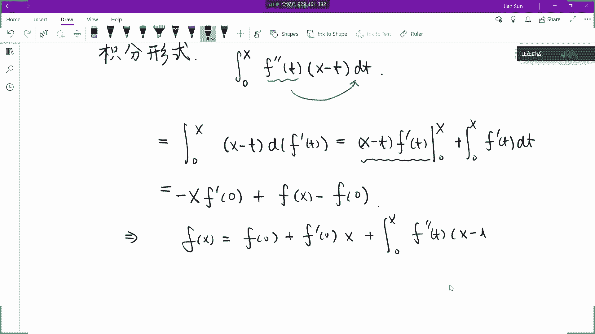

这就是我说的泰勒展开的积分形式，那泰勒展开的这是带二次的积分形式啊，其实你们还可以去做泰勒展开的三次的积分形式，虽然我们并不需要我在这里也提一下，你比如说它来展开的积分形式。

展开到三次项大概就应该是这个样子，这呢就是二阶导数x的平方1/2，这里呢大概就是零到f这就是三阶t的导数，这就是x减t的平方dt应该这还有个二，那这就是三次在积分形式的三次的泰勒展开唉。

总之你看呢如果你要再去用对这个积分使用所谓的终值公式，你就可以得到微分形式的泰勒展开。

那这就扯到数学上去了，那我们来看一看，我们利用眼前的这个对我们能够提供什么样的进一步的提示。

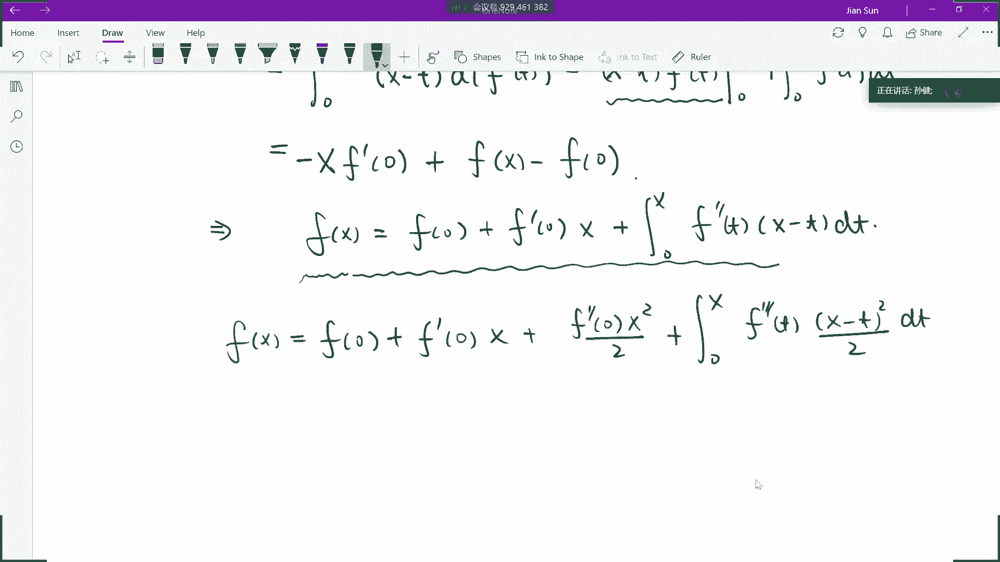

这个提示呢就告诉我们，其实你针对x是大于零还是小于零啊，你做这两个区分，如果x是大于零的话，如果x是大于零的话，那么这个积分呢，x是大于零的话，那么t呢它取值要小于x。

这样就使得x减t呢这一项呢就是正的，我们想把这个积分呢写成从零到正无穷，那这样一来呢，xt超过x的时候，那这一项不就变负了吗，没关系，我给他封顶啊，就是就是不让他这个变成呃，就是封底不让它变负。

因此呢我上面加上一个符号，这里面呢我们来说一下什么叫做x的加号呢，我在这里的定义其实就是它跟零的最大值，如果它小于零呢，那就是零，如果它大于零呢，就是x本身，那这是x正的情况下，那如果x是负的情况下。

那这个零到x啊，那这个积分呢我也要把它转换一下，我给它转换成负的，从x到零的积分，那就是从x到零，f double prime t，这是t减x一样的分析，就是这个t啊，它是大于x的。

所以这一项呢其实就是正的，但是我希望把这个积分呢写的更一般，那就是从负无穷到零，那这就是两撇t，这就是t减x正-1样的，把它封闭，不让它变成负数，这样一来咱们的函数的展开就可以写成，这呢是从零到正无穷。

这是对t的二阶导数，这是x减t的正负dt，再加上从负无穷到0f2 阶导数t减去x的正负dt，这个就是我们所要的最终的公式，而这个无法无外乎它就是泰勒展开的积分形式。

其实眼前的这个公式啊是我在讲衍生品的时候，课上其实我会经常提到的啊，当然是我讲衍生品，我的课程啊，别的老师我我并不知道，在我的衍生品课上，我经常提到这个公式，因为这个公式实际上就告诉我们了一个事情。

就是我对于一个函数fx，比如说它是一个在我们这里，它是一个可微的函数，我怎么去逼近它呢，眼前其实就告诉我们怎么去逼近它，这就相当于是说，如果我们把这个积分，和这个积分你都把它看成是一系列的黎曼求和。

那咱们这个公式就可以写成fx可以背一个常数，加上这是一个线性函数，f一撇零乘以x这不就是一个线性函数吗，所以第一项是个常数，第二项是个线性函数，接下来呢接下来我们是对t这个t积分呢。

我但是我把t啊看成是一系列的黎曼求和，所以这里呢就是一系列的黎曼和，这个呢就是一系列的常数ai那右手端呢就是x减去一系列的ti的正步，那这些i呢我们当然可以取啊，从某一项取得另外一项没有关系。

我们在这里呢就就不去写它了，加上这是另外一系列常数bi，然后这里呢是另外的一系列的bj吧，tj减去x的正骨，我们看看，这就告诉我们了，对于一个函数连续可微的函数，其实啊我们在某一段这个b区间内。

我们可以再进行一个很好的逼近。

我们仅仅用谁去逼近它呢，有这么几项，第一项常数项，第二项线性项，第三项和第四项分别代表着什么。

你看一看啊，第一项常数项嘛我们都知道就是这么一个常数，第二项线性向，那线性项常数项从咱们金融上可以用什么来说明它啊，我们现在讲讲金融，那就是现金嘛，债券嘛它给你的收益是常数吗，那这个线线性向直线啊。

当然它未必是跟x轴平行的，这个直线在我们金融里面它代表什么样的收益呢，它代表远期嘛，期货嘛，甚至是现货也可以，未来的收益就是这条直线，换句话说就是它涨了我们可以有正收益，它跌了我们可以有负收益。

当然如果这条线是反过来的话的话，斜率是负的话，那就说明我们进入了一个是做空的一个头寸，没关系，前两项我们都解释了，我们看看后两项，后面这项每一个ai在对应的这么一个收益函数长成什么样呢。

如果这是ti的话，我们将会看到的是这样的一个函数，就是在pi以前它是零，那么在这个ti以后x啊，那它就是这是一个什么呢，这是一个看涨期权的收益函数，然后最后我们来看这也是ti。

我们看看最后这一项就是这个函数是什么样子，那就是在ti以后，那它是零，在这个ti以前它是这个样子，那这是我们看书的看跌函数啊，看跌这个期权的收益函数，这是咱们把它跟金融联系起来，如果没有跟金融联系起来。

之前，单从数学上函数逼近的角度来讲，我们其实就是说任何一个连续可微的函数，可以被常数线性函数以及若干长成眼前的，这样就是只在一个点不可谓的函数来逼近，其实这个在几何上是非常直观的，为什么呢。

比如说我们现在几何上，我们现在有一条弯曲的曲线啊，这是这个fx这个弯曲的曲线，当然我们就可以逐渐的进行逼近，因为我们先取一个点，再取一个点，再取一个点，那么咱们就可以显然呢这些点连接起来。

连接起来就是一个逐段线性的函数，那这个逐段线性的函数就是对于原来函数的一个逼近，如果我们连接的更密的话，那这个逐段线性的函数，那它就会逼近的更好对吧，但是逐段线性的函数是什么呢，就是我们上面说的这四种。

无非就是这次任何一个逐段线性的函数，都是由1234组合的。

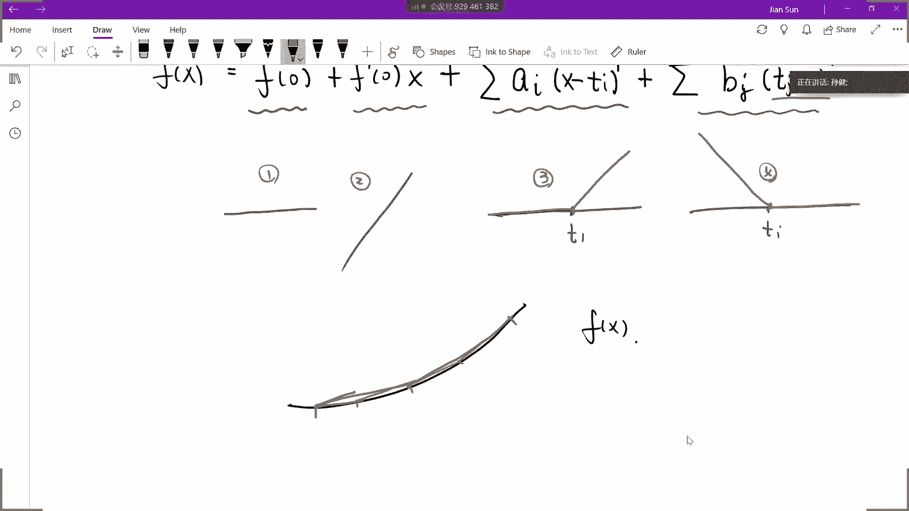

我们讲到这里呢，其实就是说从一个可微函数的带积分形式的泰勒展开。

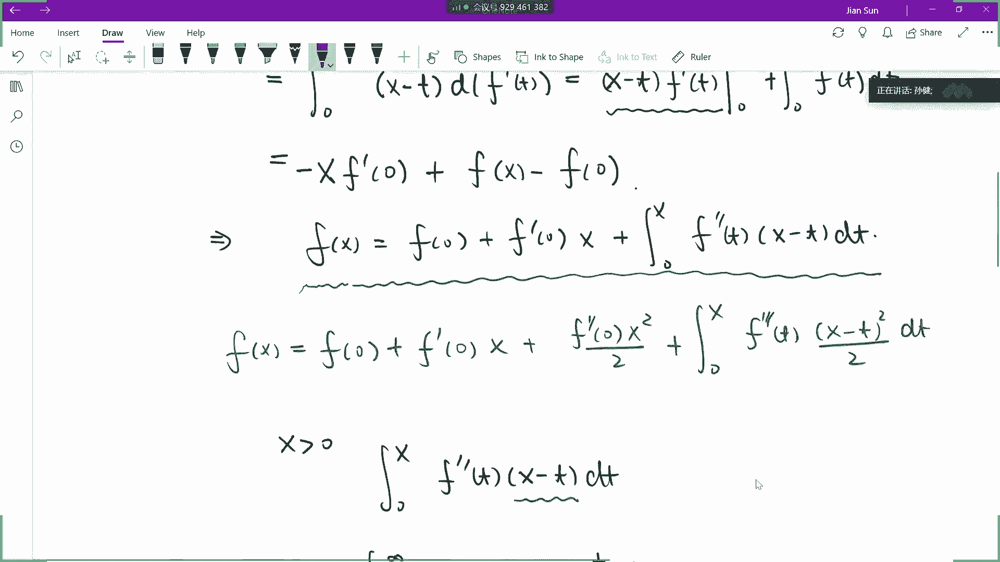

帮助我们理解到任何一个就是光滑的这样的一个函数。

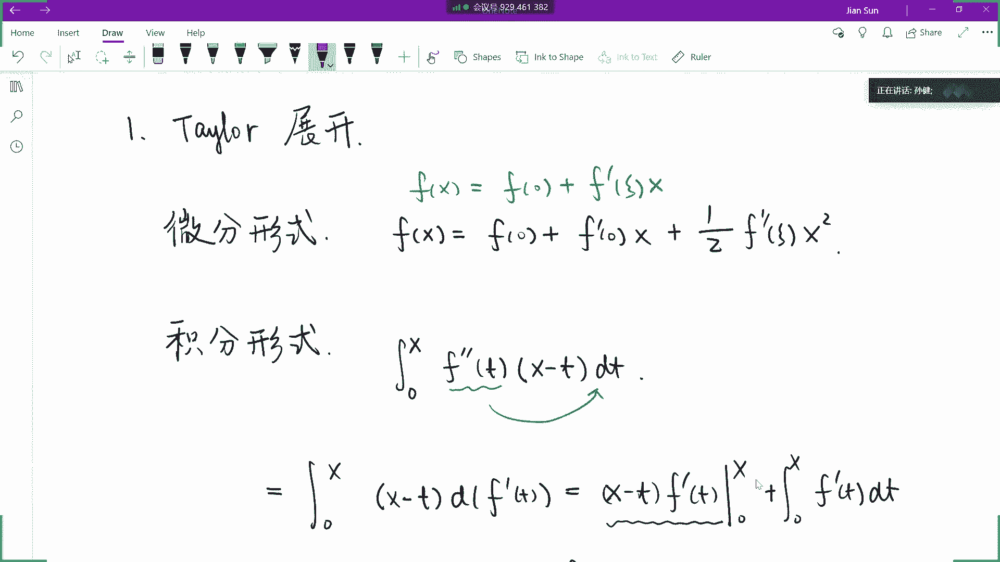

其实都可以被逐段线性的函数去逼近，而逐段线性的函数的逼近，它就可以对应到我们刚才那个泰勒展台里面啊，我们用这个问题想说明什么问题呢，我们就想说明我们眼前的这些函数形式虽然简单。

但是它们可以构造出比较复杂的函数形式来好。

这就是我们要讲的第一个，那我们现在再来讲回到机器学习，看看对我们机器学习的启发是什么，咱们机器学习讲到现在呢，我们讲了很从感知机模型，我们讲了一系列的线性模型。

其中的线性模型最重要的这种表示形式呢就是这个样子，就是我们是希望让我们的就是从输出到从输入到输出所具有的函数，形式呢，一个我们讲过很多次，那就是x转置乘以x加上b的形式，其中呢x是n维空间的一个向量。

当然w也是n维空间的一个向量，b呢当然它就是一个实数，所以我们在我们讲感知机模型，最终呢我们的目标就是选取这样的w，如果全平面是可分的话，那么这样的这个w就会啊相当于是把这些典籍。

就是这些外i染上两种不同颜色的这个外i，每个y在这里面，如果我们这样说的话，取sin的话，那它的取值就会是-1和正一就是一个二分类问题，二分类问题啊，会造成在这个平面上正和负，如果说我们取到了这个w啊。

作为这种说法向量的这种代表的话，那么我们就会自然的就在平面上分成正和负，我们就用一个超平面把整个平面分成正跟负，但是这种方法呀有点粗糙，因为整个的这个平面只能够被这样分成两类。

显然这是一种线性的分类对吧，可是如果我们想平面不是这样简单的这种分我们想复杂一些，比如说我们所希望的分类，得到的这个结果是这个样子的，平面上呢用这两个两条线分成了四个区域。

那这四个区域呢我们希望在这四个区域上的这个这个分类呢，分别是这样的四种，那就正负负负，那这个时候我们该怎么办，显然呢我们眼前的线性分类呢是完不成的，但是这个跟线性分类呢区别也不是特别的大，好。

我们想一想，从几何直观上来讲，假定这条线是w一所决定的，这条线所w2 所决定的，所以我们现在所需要的这个典籍，也就是正的那部分典籍，它对应的就将会是什么呢，就将会是，我们忽略那个常数b啊。

因为我们总可以升为到这个一般的更高一维的空间去，其实我们会发现我们现在可能所需要的是这样的正的部分，是这样的一个区域对吧，也就是说他们公共的部分是需要是正好，当然负的部分，可能呢就是。

任何一个是负的部分就行，所以我们对应的呢这里这里面就有两个集合，通常的这种operation，一个呢是啊交集，一个是并集，那我们能不能够就是把交集和并集也放到我们机器学习中来，就是说来把它放进来呢。

是可以的，你看一看啊，比如说呢咱们说从最开始的这个输入x一旦得到了x，我们在这里呢就得到了y1 ，这个万一呢就是我们取的第一个线性分类的结果，那就是w e x w一的转置乘以x判断它是正是负。

如果是正的话，y一就取一，如果是负的话，y一就取-1，同时呢我们还得到了y2 ，一样的，那就是刚才的第二条线，现在呢我们就有了联合的y1 y2 了，我们从y1 y2 ，我们再往下走一步，我们看看。

我们现在呢啊注意到现在万一呢不是取正一呢，就是取-1，所以你看y一加y2 减去，比如说0。5，你看眼前的y，如果我们令y等于y一加y2 减0。5的这样的符号的话，你看看它会是怎么样。

什么时候才等于正一呢，那就是y一啊，我们注意到y1 y2 啊，这样说，assign啊，我们不知道等于0。5，我们这样啊，为了其实其实是一样的，我们定义这里的sign，我们重新定义一下，为了简单啊。

一零如果x是正的话，如果x是负的话，一样的啊。

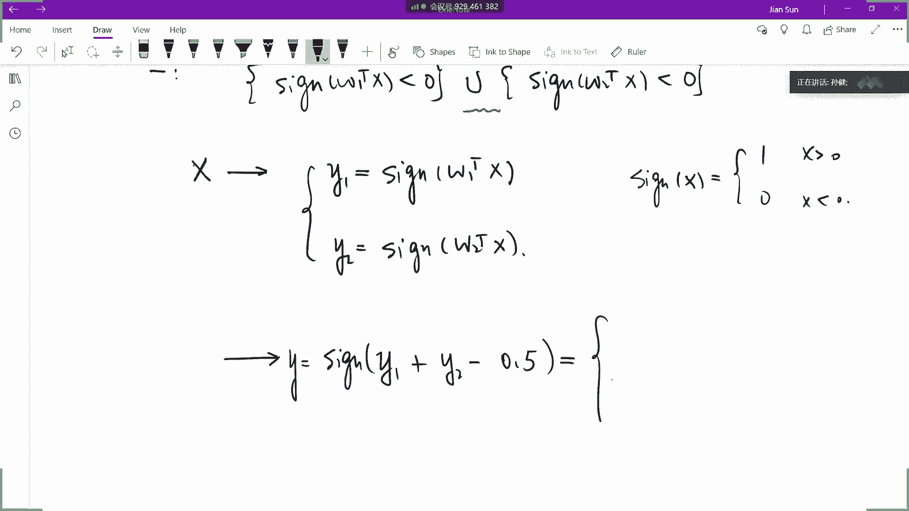

纯属一样，我们看看那什么时候这个它是正的呢，也就是什么时候是正一呢，那只要y一或者y2 等于有一个是一就可以了，因为他们取之无外不外乎是一或者是零，那两个都取一，当然2-0。5是正的那一个正一。

一个是零，那也可以，如果两个都是零，那就是负的了，所以呢他什么时候等于零呢，那就是y一要等于零。

y2 也要等于零啊，也就是说刚才我做了这样的一个无足，就是不是很重要的这么一个小小的修改啊，如果还是原来的sn正一或者-1的话，咱们这里的0。5就把它改成这个啊，就把它改的更大一就行了。

就把这就把它改成这个就是正一啊或者-1啊，两个字，-1正一负的-1-1就把它改的小一点就行，给它改成负的0。5就可以了。

所以说这里是没有关系的，这就告诉我啊，这样呢咱们就把这个或者就形容出来了，那同样啊我们现在可以定义y，减1。5好了，它就是什么时候等于正一呢，那就是y一要等于一，y2 也等于一的时候，那任何其他的情况。

那都是就是比如说万一啊，就是任何其他，它就是零，我们看到我们利用这两个的一个是减0。5。

一个是减1。5，考虑到最初的输入是x到最后的输出，只不过在这里面呢，我们其实做了就像这种sign的这种函数，咱们是做了两次，不像是感知机只做一次，第一次呢我们就得到了y一和y2 。

第二次呢我们把y1 y2 又一次的结合起来，又做了一次sn，所以你就想象第二次我们好像是又是对于第一次的输出，我们又进行了一次感知机的学习。

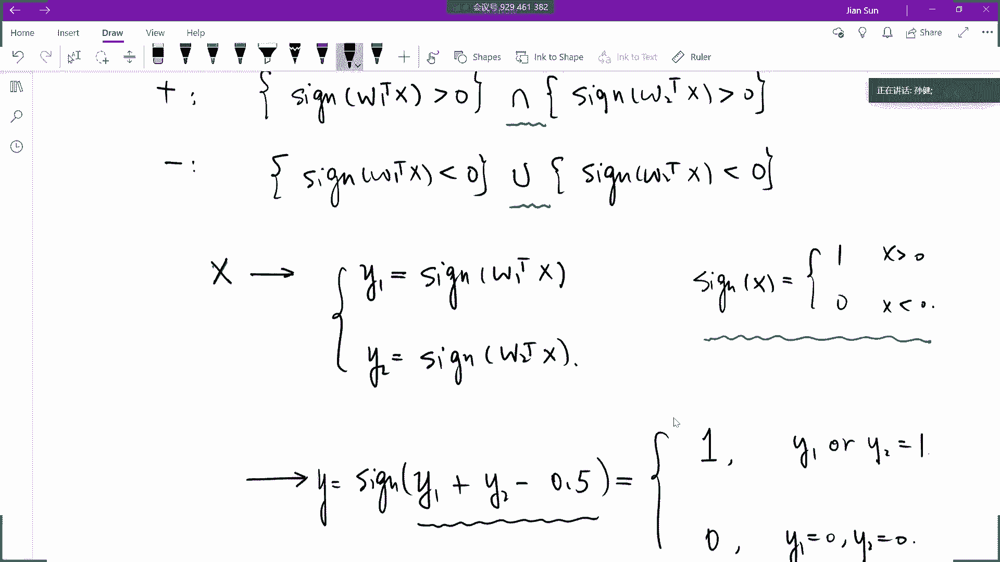

最后学习到哪了呢，我们就成功的把眼前的这样的一个图图像就可以识别出来了对吧，因为刚才我们说了，这个地方就相当于是and，那剩下的那个地方就相当于是or那and和or我们是用这个y一加y2 。

分别是减去0。5和和一点，我们就得到了，所以无论你是想学习看上去两条直线在我们平面上的这个分类，我们都可以是学习得出来，我们现在呢再看一个稍微复杂一点的例子，那这个复杂一点的例子呢就是圆，你看啊。

我们知道圆形的分类，咱们以前呢在s v s v s v m上我们学到了，但现在我们从另外一个角度来看圆形的分类，如果说咱们平面的数据点击给了你这些点击呢发现呢啊在圆内是正的，那么在圆外是负的。

这个显然感知机模型是做不到的，s v m里面是通过升维把它升到一个二次函数，我们通过x平方加y方得到了，如果我们不升维的话，我们看看也可以得到它，我们看看怎么得到它，那这样一个圆呢表面上是个圆。

但是回到刚才我们讲的一般的这样的一个思想，在圆是可以通过逐段线性的这样的这种曲线折线所逼近的，所以咱们先不看这个圆，我们先看了一系列的这种线性，比如说我们眼前的这个凸起凸的区域是由一系列的直线。

如果我们希望中间是正啊，也就是说在这个正好他们所截取的公共的这个内部都是正的，而外部呢都是负的，那这样的一个我们怎么来给出来呢，好我们看看我们设想呢，回到刚才我们的想法，我们现在呢就有若干个从x的输入。

那么输出呢第一步呢我们有若干个超平面，所以第一个是它一直到比如说第n个，这样我们就有了w1 w2 ，一直到w n，我们有了这么n个超平面，n个超平面，我们现在要做什么呢。

我们就要用n个超平面的公共的部分，那n个超平面公共的部分我们怎么来写呢，那么就是由它再下一步，再下一步我们就可以定义从最初的这个输入x，我们定义呢经过了中间步骤y11 直加到y n。

然后呢我们可以减去n减一啊，甚至就是n减一，n减0。5吧，我们看看它的上面，他什么时候等于一呢，那当然就是每个y一都得等于一，20对吗，只要有一个等于零。

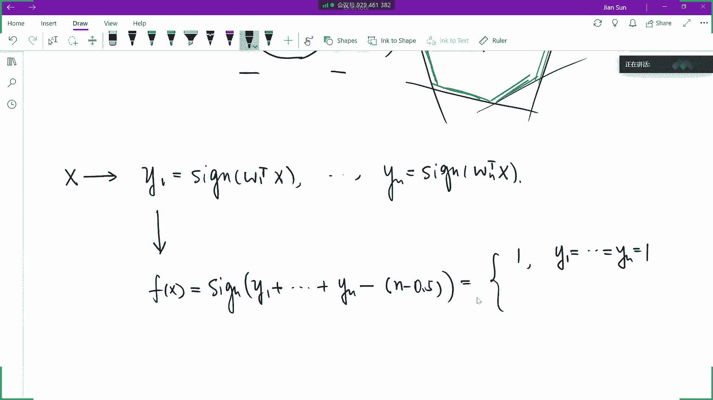

哪怕其他都等于一，那么眼前的这个值呢，仍然它是负的，其他任何其他情况都是零对吧，所以这样的一个函数就是通过通通过中间复合一次的函数。

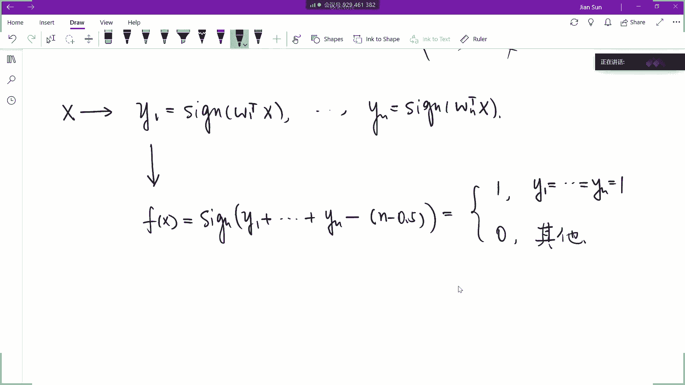

咱们就成功地把平面上的这个突区域的中心是正的，其他的是负的，这样的一个二就是这样的一个啊二分类问题我们又一次解决了。

只不过呢它就是线性函数的这么一次符合，它不是仅仅是线性函数，这就提醒我们要做一个什么事情，提醒我们做这样的一个事情，我们画一个图，如果说这是我们的输入，那么从这个输入我们得到了一系列的中间节点。

每个输入都会到了中间节点，x呢本来是rk空间的，那到了第一步呢，我们就有y1 ，y一呢就是刚才我们说的sign w一的转置乘以x，这是y2 ，它呢就是sin x w2 的转置乘以x，这就是y3 。

w3 的转置乘以x这就是y4 ，w4 的转置乘以x那么由这四点，每一个w这里面的w i都是也是rk空间的这样的一个向量，只不过这里面我们需要有四个向量，从这四个向量啊，我们呢在最后呢又经过了一步。

我们得到了最后的输出，最后的这个输出呢就是我们把这些y1 y2 y3 y4 看成是一个向量，就是看成是一个啊，比如四维的，当然我们不一定是y4 啊，我们可以第一个是我们我们可以弄的更多。

那么眼前的这个y呢，那当然就是四维的，那么四维空间到了就是四维的一个向量，到了最后的这个节点呢，我们再去选取一个，比如说是z嗯，也是四维空间的向量，然后我们把我们的y和我们的z再结合起来。

再取一次s作为我们最最后的输出，最后的输出我们叫做fx了，那显然眼前的这个结构图就通过去选取w1 w2 w3 和w4 ，这个突区域根据突区域的复杂程度，我们来选取中间的这些节点的个数。

那这个就是神经网络，那这个就是神经网络的最我认为是最简单的理解，就可以从这个上面来理解。

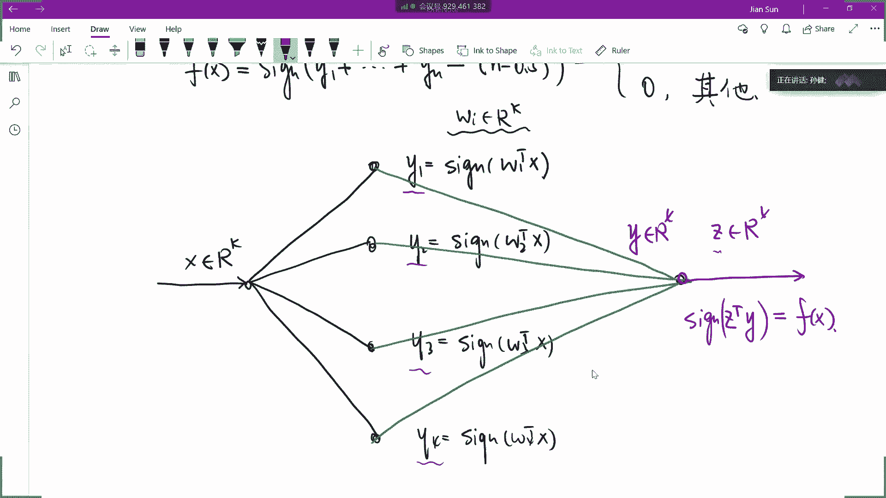

那神经网络呢我们不可不仅可以说中间这一层啊，我们先说它的几个术语，那么第一层这个叫做输入，最后我们叫做输出。

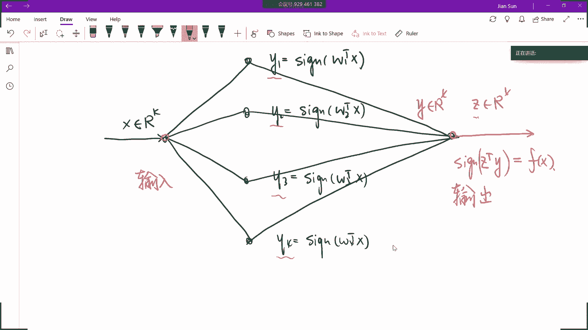

中间这一层叫做隐含，隐藏隐含层都可以，隐藏隐藏层或者隐含层，那我们这是有一个隐含层的神经网络。

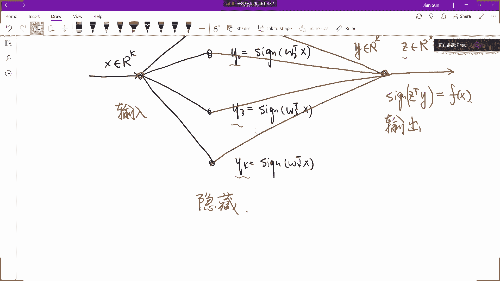

我们还可以构造多个隐含层的神经网络，那为什么要构造多呢，那就是我们希望它的这种复杂程度增加，所以呢我们可以看啊，比如说我们在这是一个输入，那从这个输入呢，我们现在有两个，隐含层，然后呢到输出。

我们来画一下这个图，我们从x分别把这个x放到了下面的两个感知机的学习器上，那这两个感知机学习出来的结果，每一个结果啊在分别的呢给下面的这个隐含层作为输入，同样这个点也一样，作为给下面的隐含层作为输入。

那下面的这个隐含层呢是三个节点，那这三个节点呢根据从上面两个进来的呃，就是说作为输入，然后呢也是计算一次感知机，然后计算一次感知机呢给最后的这个节点作为输入。

那这样的话呢最后这个节点呢就收到了三维的这么一个输入，他也再做一次感知机，做最后的输出，哎这个呢就是一个全连接的神经网络的最简单的一个雏形，咱们现在用矩阵的语言呢再把它描述一下，那就更加的简单了。

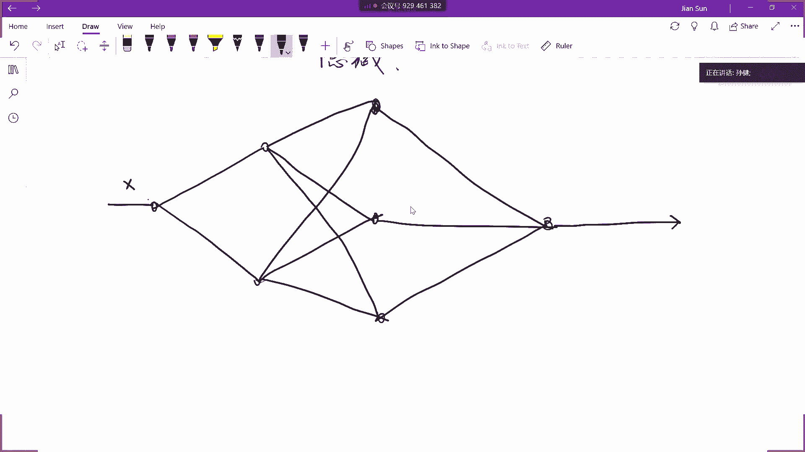

就是我们去画这个图啊，特别是全连接，哎呀你要去连接很多很多的节点。

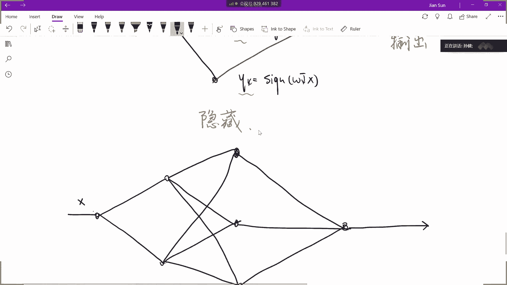

特别的麻烦，但其实呢用矩阵的与用矩阵的方法来画呢就更加的简单。

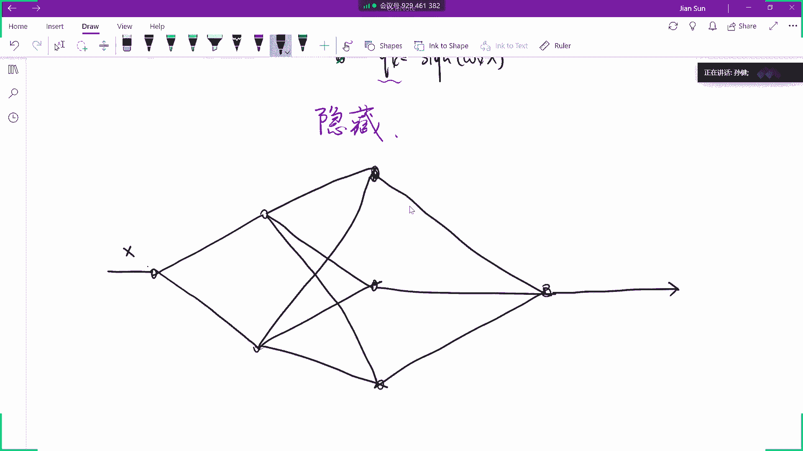

我们看看矩阵的方法，我们指的是什么啊。

在刚才我们说了，再从这个节点，它本来是rk的，我们就先看第一个，到了第一个呢，我们就需要两个感知机，一个是w一转置乘以x，一个是w2 的转置乘以x，但是我们设想啊就是本来是rk的一个元素。

第一个隐含层如果是有两个节点的话，它就出来，它就会就是第一个节，一个第一个隐含层，两个节点分别处理完之后呢，他就把原来rk的一个向量就变成r2 的一个向量了，那我们看看这个r的向量可以更简单的怎么写。

r的这个向量就是在第一个隐含层，这其实我们可以把它写成是一个y，这个y呢就是一个向量啊，第一个就是w一转置乘以x，第二个就是w2 转制乘以x，那我们看看这个怎么可以怎么写。

那这个就是w一转至w2 转制啊，那我们想想w一呢是一个k阶的这个列向量，那现在呢就是一个行向量啊，这样更好啊，我看一下啊，好我们看这是一个二乘以k的，那这是k乘以一的。

那现在那y不就是2x1的一个列向量了吗。

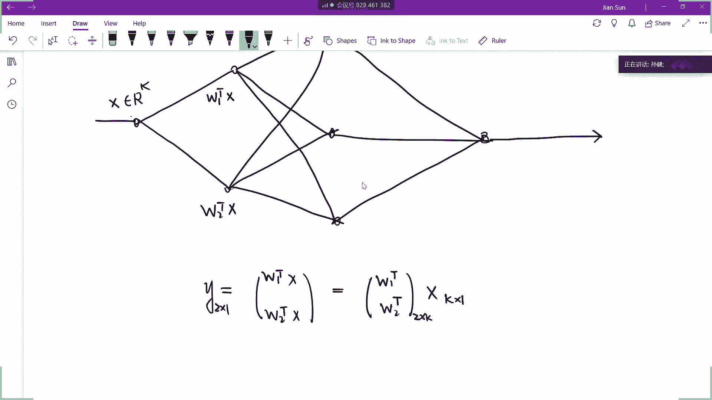

所以我们把整个的前面的这个矩阵二乘以k的矩阵，比如说整个的教程w那么我们现在不就变成w乘以k了吗。

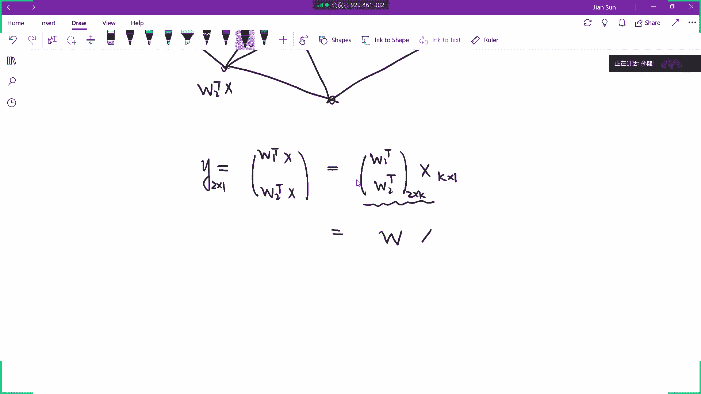

我们的意思是说你本来是一个k维的向量，k v的向量在整个的这个第一个隐含层上，我们就把它看成是一个节点，但是这一个节点呢当然它就不是，当然它就是一个向量了，这个向量就很简单的看成是一个w乘以x了。

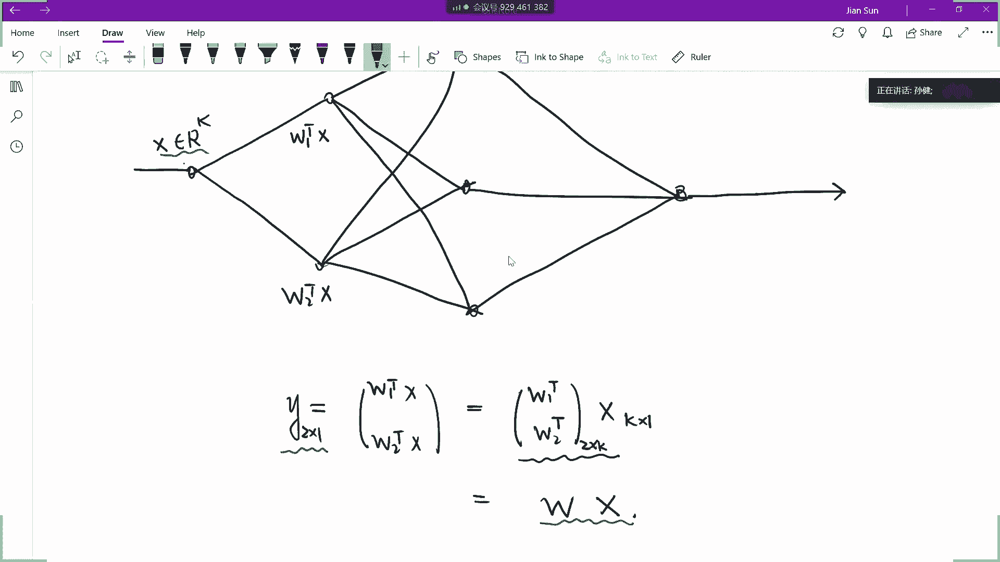

这是这个向量啊，它不是w乘以x啊，我们先说它呢是w乘以x呢，在复合上一个sin函数，所以我们在这里分成两步，第一步呢是我们写成换一个换一个啊，我们先用一个记一个这样的一个符号。

g呢已经成为一个二维的向量，然后我们再用最终的这个y也是2x1的，它是在z上符合上一个sin的函数，我们就可以把它想象呢，这就是把自己的每个元素，把这个sin的这个函数放进去，做成一个新的向量。

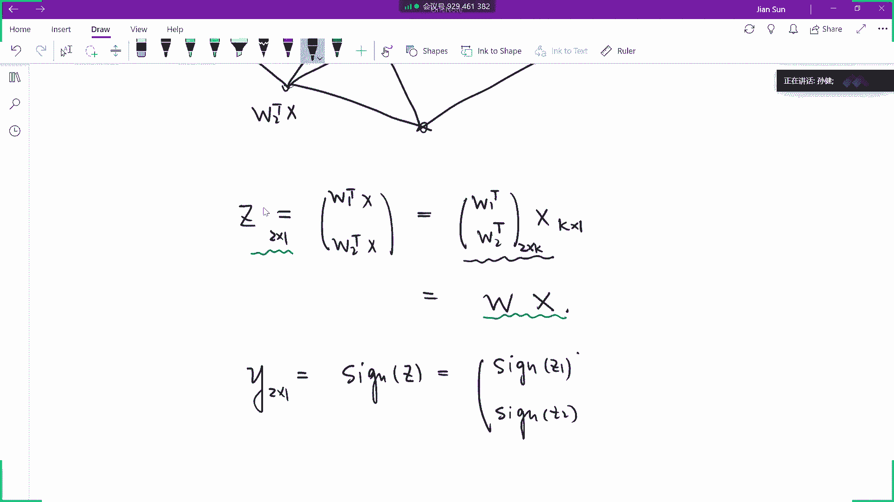

这是我们给它的一个定义好，我们现在就给他用这样的方法。

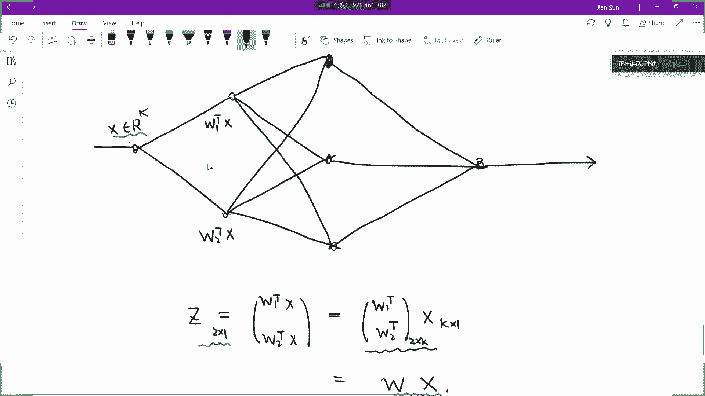

试图给他说的清清楚楚的，现在呢我们把一般的图画出来，一般的图呢就是只有一个输入，输入呢就是x是rk空间的一个k为向量，我们的全连接的这个神经网络，我们就化成就把他所有的那些隐含层。

就把它浓缩到一个节点了，到一个节点我们看得更清楚，我们怎么看，比如说我们先看第一个节点，第一个节点其实对应的是这么几件，是这样的一个w这个w一不再是rk的一个向量了，这个w一个w一是什么呢。

这个w一呢是一个矩阵，这个矩阵呢啊是多少维的呢，这个矩阵是第一为乘以k，那这个第一呢就对应到这个节点的隐含层的个数，第一就是这个节点第一个隐含层，其中节点的个数，所以呢我这个w一呢就是第一乘以k的。

就是你有几个节点，其实我就有多少行，而每一个行呢都是一个k几个k为的，我们有了这样的记号之后，那么在第一个节点上，我们首先计算出来的就是w一乘以x，然后呢给它复合上一个我们叫做一个非线性的函数。

这个g作为我们y一那这个非线性的函数g啊，这个非线性函数可以就是刚才啊非线性函数，非线性函数有若干种选择，它可以取刚才的sign，它还可以取就是什么呢，它可以取啊，这个我们取的是这个sin x啊。

就是正和负，简单的就把它区分成正正正一或者是零，或者正一和-1也可以取啊，这样的一个函数就是max 0或者是max b选取一个常数b它可以取，这就是一个连续函数，这就是刚才我们说的那个弯曲的那个折。

就是就是在一个点不可微，其他的点是分段线性的函数了，它还可以取什么函数呢，就是所谓e的x除以一加e的x，就是我们在逻辑回归里面看到了那个所谓，我们后来在神经网络里面会经常称为是smoy的函数。

所以它可以取若干种的这种非线性函数，还可以取tg h啊，这是一个双曲的这个tan的函数，总之呢其实不仅限于这些，你还可以想象它还可以取其他的，总之它要是一个非线性函数。

它的目的呢就是把线性的加上非线性化。

这样呢我们就得到了第一个节点，第一个节点呢就是y1 y一呢，它现在就是r第一维的一个向量了，从第一个节点呢我们又有了到了第二个节点，第二个节点来计算方式跟刚才一模一样，我们这个首先要有一个w2 。

w2 就是对应到第二个节点的隐含层的个数乘以第一，那w2 要在y一上要做什么呢，他首先把w2 要乘以到刚才我们的第一个节点的输出一上，然后呢作用上它一个非线性的函数成为我们的y2 。

那么这个y2 呢它就是第二维的这么多的这么一个向量，然后呢刚才的这个隐含层呢作为这个y2 作为输出呢，还可以到第三个节点，第三个隐含层，那当然以此类推，我们还可以有很多很多的隐含层。

结果呢就到了最后一个假定就到最后一个节点，就是输出了，你比如说最后这个节点呢就是dl我们最后的这个节点dl，同样我们就可以算出y l来，yl呢就是一个非线性函数，在y l上呢它会有w l。

它就是w l乘以刚才的yl减一，只不过呢呃啊不是说这个说错了，这个最后这个输出啊让它等于一了，刚才还是dl减一的时候，还是一个多隐含层，但是到了最后一个，我们就让w l d l就等于一了。

也就是说他其实只有一个没有隐含层了，这是最后的输出了，所以输出层的时候，这个w l那真的就是一个前面的这个就是dl减一维的这么一个向量了，到了这一步，当然他现在是一个作为一个行向量了啊。

那么到了最后这一步，yl就是已经是取值是实数了，这样我们就完成了一个从最初的rk为的一个向量作为输入，到最后一个实值，作为一个输出中，中间在我们画的这个图里面，其实中间是一共有一二。

一直是l到一个隐含层，还要减一个隐含层的构造方式，就是我们现在讲述的这个构造方式，这就是全连接的神经网络的这么一个图，就是全连接神经网络就是这么构造出来的，所以你看为了构造全连接神经网络。

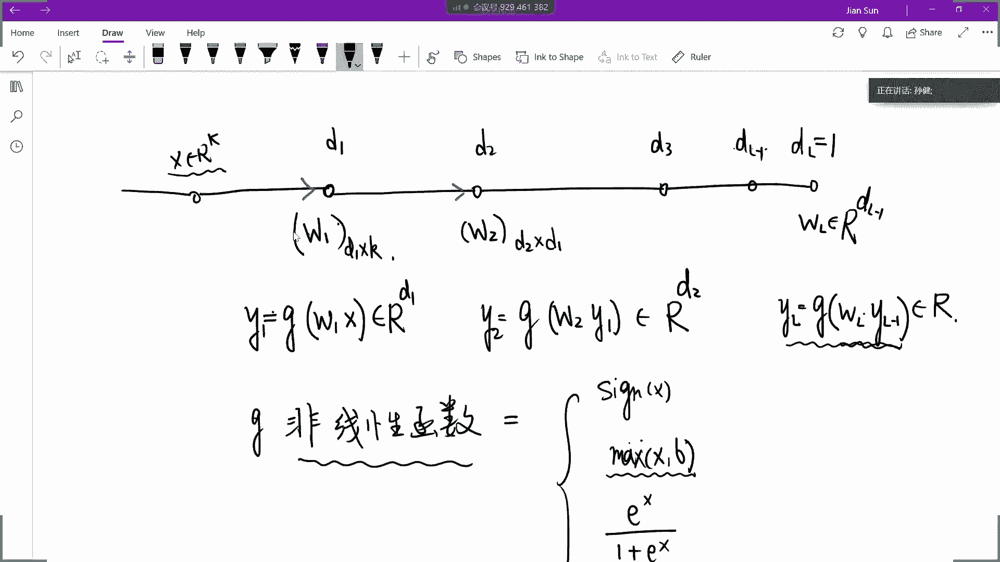

我们需要什么，那么神经网络的计算我们需要什么，我们需要刚才所有的中间的那些w一作为一个矩阵，w2 作为一个矩阵，w l作为这些矩阵，这些是我们在整个建立全连接神经网络中，我们需要去这个是要去寻求的呃。

同时呢这个g函数就是非线性函数，我们是需要的，这个呢有一是有个名字叫激活函数，这就是神经网络中用的激活函数啊，我们可以问一下，我们能不能没有激活函数。

没有激活函数啊，那你看看我们最后就变成什么了，从最初的输出到最后，从最初的输入到最后的输出，我们整个人就变成了一个线性的，我们每一步都是线性的，线性符合线性不还是线性吗，如果没有激活函数的话。

整个这一步我们就相像就中间就都可以略过了，我们去想象，就等于从最到最尾就一个线性就够了，中间就不需要了，无论你有多少个隐含层。

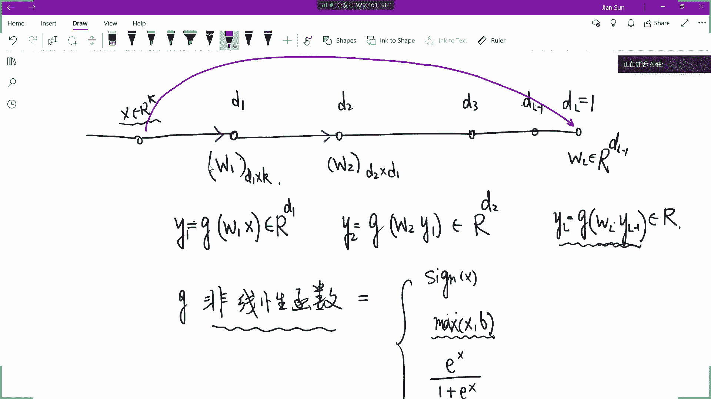

那都是没有用的，这就是为什么我们一定要一个激活函数，那我们再看看神经网络，我们的这这个损失函数怎么来定义，同样啊，那我们要看哦，我们说给出了啊，这些样本内的点，每一个x都是一个rk空间的向量。

每一个y呢比如说它可以是一个实数，所以说我们就通过刚才神经网络的这样的一个构造，我们就得到了这个fxi，每一个这个f啊，就是代表着这个神经网络，就是从最初的x通过这个神经网络的构造，我们就得到fx。

所以说给出了一个神经网络，包括所有的这些参数和积分函数都给出了以后，当然我们就可以去减去yi，他们之间就可以做一个呃，先不要说减吧，他们之间就可以去做一个损失函数，这个损失函数是定义在从这两元。

就是你计算出来的fxi和我实际的目标yi之间定一个损失函数，函数各种各样，比如说我们就可以定义成l two的损失函数，就是fxi减去yi的平方，最后呢再把我们所有的损失函数求和。

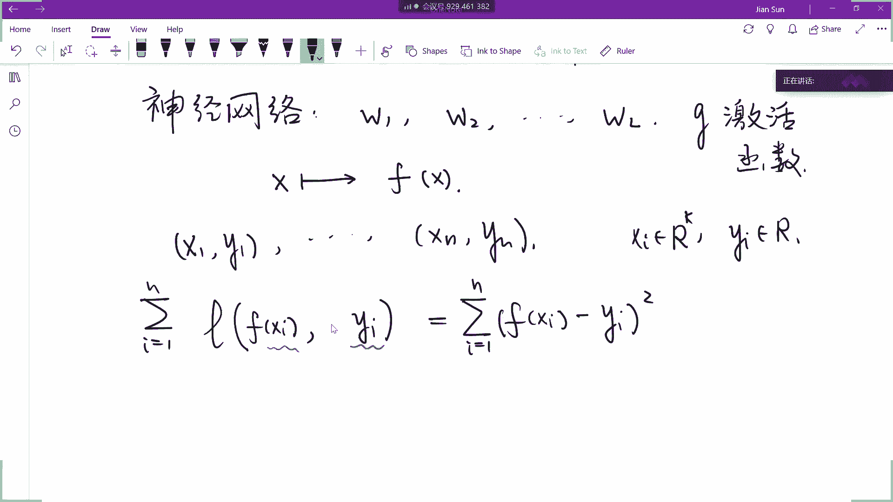

那我们的神经网络的目标就出来了，神经网络的目标就是去minimize，我们的这个损失函数，求和，在所有的w一直到w l中去选取，这里面可能还要对应损失函数的那些b1 。

而不是激活函数里边的选取那些常数b一也要去选取，通过选取这两组参数，使得我们的损失函数达到极小，我们的神经网络就构造完了，现在我们再来说一说这个神经网络的模型提出提出可有一段时间了。

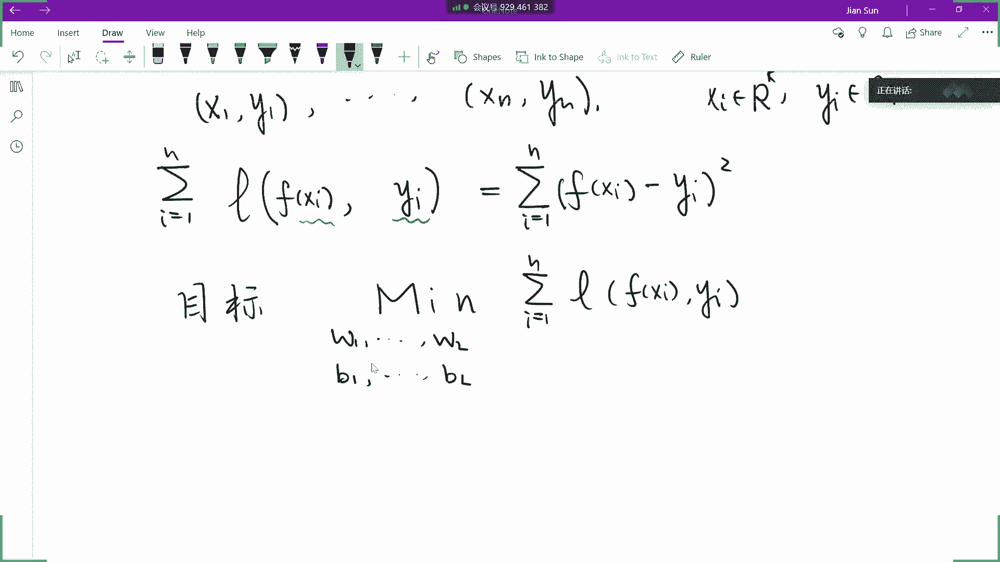

并不是近些年来提出的，为什么近些年来才变得比较流行呢，是因为神经网络的计算量比较大，其实从idea上，从理论上来讲非常的简单，但是它的计算量比较大，特别是你的隐含层比较多。

而且隐含层上的节点比较多的时候。

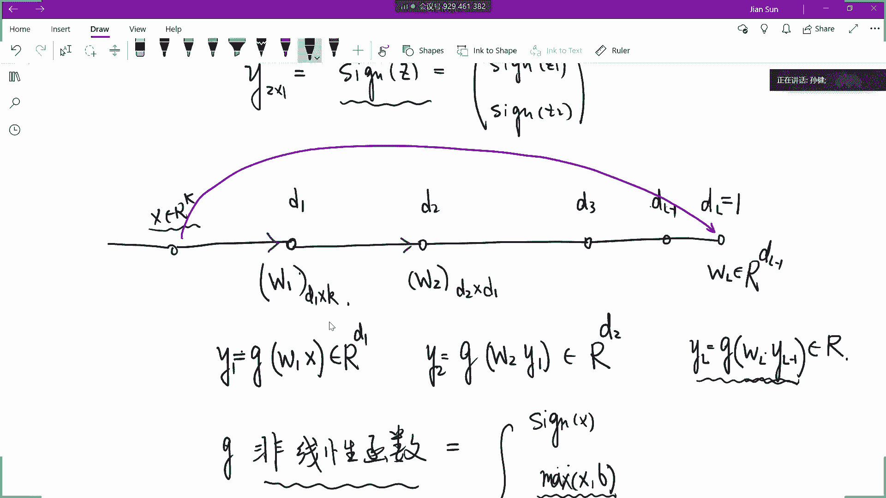

它的计算量就挺大的，然后呢这些年来呢，大家呢发现了一个比较快速的去计算神经网络的方法。

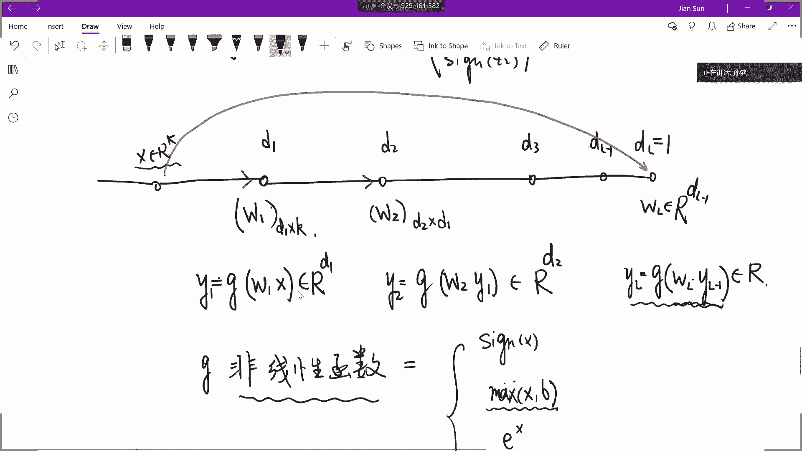

就是所谓的propagation，就是逆向的这个推导，逆向的推导呢其实它所借助的是这样的一个想法，我这里也跟大家说一下，我们呢回到就是微积分，我们看到这些神经网络的传导过程。

我们不再去具体用刚才我们所要所用的那些符号了，我们现在用另外一组给大家大概讲一下back propagation的想法，那么神经网络的传导过程就可以想象它实际上是函数的复合过程。

我们从最初构造了一个又一个的函数，每个函数的从前面拿到输入，然后呢计算出来作为输出给了后面这个函数作为输入，后面的函数计算完之后又作为输出给了更后面的函数作为输入，是这样一步一步，如果说一般来讲。

我们的这个函数它是由若干部复合出来的，那就是fn本来是从f一复合一直到fn，我们现在想看一看这个f函数对于其中若干变量，比如说就是对于x的导数，它可以不仅对x的导数。

它可以在中间任何一个节点的那些参数可以去求导，那么它的求导啊，从微积分上来讲，我们有一个求导的就是迭代函数求导的原则，那就是我们先对这个fn求导，然后呢符合，就是一直到f一求导。

就是这个求导法则的这么一个迭代原则，不对，我写一下，写错了，应该是相乘啊，我们在这里，比如说举个例子，f呢就是两个函数g不是符合上h，那么f的导数就是g的导数乘以a的导数啊，这就是我所说的迭代的原则啊。

迭代的原则如果放到这个n次的这个迭代上，那么上面的这个就是我们把这个当成一个简单的情况，哎那么上面的那当然就是fn，然后呢当然它符合上fn的导数啊，在乘以上一fn的导数我们就不写了啊。

符合上所有其他的再乘以fn减一的导数和上乘以其他的，一直到乘积到f一的导数，这样呢就是我们看到原来最后的这个函数对于某个参变量的求导，相当于是前面分别求导再做乘积，所以在设计神经网络的时候。

在设计这个算法的时候，你就可以想象每一步我往前走的时候，每一步我从f一到f2 ，f3 往前走的时候，我不仅记录这个函数值，我同时也记录上，也记录下来它的导数对某些参变量的导数值，那么以备后用。

我们以后怎么用到这些导数值的时候呢，那就是在我整个的规划优化的时候，从最初的x一直到最终的这个fx，从输入到输出的时候，我们知道我们怎么去对这个损失函数去做优化呢，所以还是做优化。

我们利用的经常是利用的是gradient descent，就是梯度下降法，为了使用梯度下降法，我就要使用梯度，为了计算梯度，我就要求导，那为了求导，那怎么办呢，我就需要计算刚才的所有复合函数的导数。

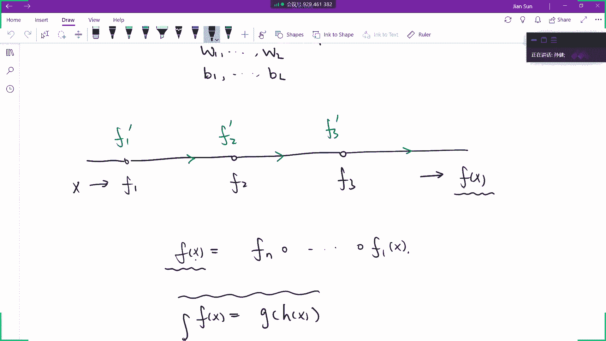

而且乘积，所以为了求导呢，往这个方向走，往右手方向走，是从输入到输出来计算函数值，我为了求导呢，我又回过头来，我利用反方向走，利用每一个节点上导数的值，我又可以去把这个导数给它计算出来。

就是利用我们已经在每个节点记录下来的进阶导数值，把这些导数可以迅速地记录下来，迅速的记录下来之后呢，回到比如说最初的这些节点了，我们进行梯度下降法，比如说我们的梯度下降法，我们在梯度下降法里面我们知道。

所以梯度下降法就是我们为了寻找fx的最这个最小值，我们需要x这个k等于x k减一减去一个learning rate，然后呢就是对x的梯度，所以刚才我就是说我们需要去修改我们最初的输入。

我们最初的输入就是我们就是修改最初的收入，那就是要给出要计算这个梯度，而这个梯度利用我们逆向回过头来，利用所有的成绩可以迅速地计算出来，就是这个修改的幅度，修改完了之后。

我们再用用正向的传输过去计算出新的函数值，函数值我们再逆向地回来再修改，就是不断地通过这样过来回去，这样的方法可以使得我们很快速地来进行梯度下降法，这就是我们常说的back。

这就是这个我们会看到经常看到back propagation的方法，所以我们呢这个就不去啊，其实我们把整体的这个想法已经说得很清楚了，那么这个算法过程中的这些特别的细节，其实就是框架，就是这么一个框架。

所有的那些细节呢大家很容易的在我们的这个这个讲义上，我们也会看到。

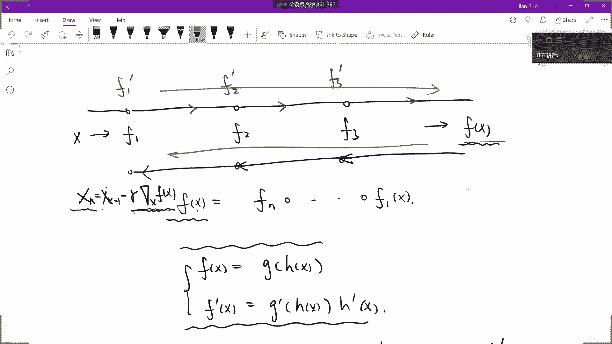

今天就是想给大家把神经网络从我们的角度。

从函数逼近的角度，从泰勒展开的角度给大家呢一个梳理出它的这个主要的想法来。

我们今天要讲的内容。

