# P3：Lecture 3 Linear Programming - ___main___ - BV1fv411r7z1

好大家好，我们今天呢是机器学习的第三讲，我们今天要讲的这么两个重要的规划问题，分别叫做线性规划和二次规划，其实从现在再往后看，大家很快发现机器学习会紧紧围绕着优化问题展开嗯，抛开机器学习的理论。

其实我们还会在单独的讲，那么机器学习呢有他的一个理论，但是呢在他的这个理论之下，我们要去完成的这个理论呢，往往最后就总结成为呢去寻找一定的算法会来完成了一定的优化。

所以呢优化问题呢在数学上呢也是历史也是比较悠久，其中呢最简单的优化问题呢就是关于线性规划和二次规划，所以说在接下来呢我们给大家介绍，同时呢大家也会很快就看到它在我们的这个机器学习。

特别是分类问题上的应用，马上大家就会看到这个例子，从上节课起呢，我们开始正式的进入机器学习的理论，而且呢在这个过程中我们会用到很多的关于矩阵的概念，所以我们接下来呢首先给大家复习一下。

线性代数中关于矩阵的行列式啊，二次型啊等等这些问题，所以我们先呢来对这些问题来复习一下，所以我们先复习线性代数的基本概念，我们先从矩阵开始吧，我们就是我们不去讲这些理论。

主要就是为大家呢呃迅速的复习它的一些基本概念，矩阵来讲呢是从a开始啊，一般呢给它一个维度就是m乘以n的这样的一个矩阵，这样一个矩阵呢通常写起来呢，我们把它的每一个元素呢啊写成a i j。

其中呢i呢是从一取值一到mj呢是取值一一直到n，通常在咱们的现象，在咱们这个机器学习里呢，我们去考虑十矩阵就可以了，所以ai j我们都是在实数中，当然在线性代数或者是在一些抽象代数里面。

其实我们还可以考虑比如说富裕上或者是其他的一些遇上的啊矩阵，但是在我们的应用里面呢，主要是在实数范围内考虑这些矩阵啊，矩阵可以做什么呢，矩阵就是把一些数用这样m行n列的方式把它排列起来。

其实啊这是对矩阵的一个最直观，但是呢这也是一个最初等的这么一个理解，对于矩阵的更深入的理解呢，其实是可以把它想象成的，就是从线性空间到另外一个线性空间的线性变换，就是说从一个线性变换的角度。

它线性变换中所有的这些信息就储存在了这个矩阵中，所以本质上啊矩阵它是一种类似一种线性的函数，或者把矩阵看成是一种所谓的线性算子，这是对矩阵的一种深刻的认识。

而且呢事实上从这个更深刻的认识上也能更好的去理解，我们研究矩阵使用了很多方法以及得到的很多的结论，那么我们定义的这样的矩阵指针可以干什么呢，我们来给大家复一下，矩阵呢可以相加，就是两个矩阵。

同维度的矩阵可以相加，可以相减，同维度的矩阵可以相见，可以数乘，就是有一个实数，你可以乘到这个矩阵上，那就是乘到这个矩阵的每一个元素里面，但是呢不能随便的相乘，要想做矩阵的乘法呢，它是有约束的。

所以我们就来看一下矩阵的乘法，矩阵乘法的约束体现在是一个m乘以n的矩阵，b是一个n乘以k的矩阵，在这种情况下，a和b才可以做乘法，乘完了之后呢，就等于c c就成为一个m乘以k的矩阵。

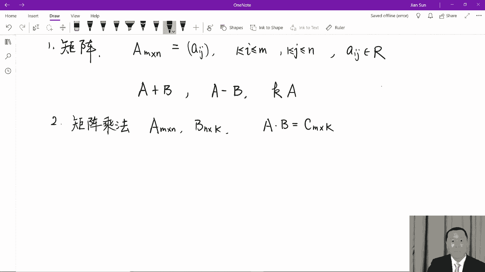

为什么矩阵可以做这样的一个乘法呢，而不是所谓的就像矩阵相加或者矩阵相减，矩阵相乘，为什么不能够把它定义成为点点相乘呢，其实点点相乘啊，你当然可以那么定义，但是呢它的实用性和实用起来就没有那么有意义了。

这本质上还是回到刚才我们说的矩阵呢，你可以把它看成是线性空间的一个线性变换，马上我们就来给大家来看到这个线性变换的定义，总之呢矩阵乘法大家应该回忆一下是怎么乘的，七乘法呢就是在c中的第i个元素啊。

di第i行第j列，这个元素呢其实呢就是小a i，比如说我们就是t乘以b t j，其中呢这个t，其中这个t去求和从一一直到取值到n这就是矩阵乘法的定义，好我们看看矩阵，这是惩罚。

那么矩阵有什么样的一些性质呢，我们来看看，首先啊我们一种呃作为它的这个m行n列，如果m退化成一或者n退化成一，那么这个时候矩阵呢就分别成为一个向量，我们这个时候呢叫做行向量，或者呢叫做列向量，好。

我们先看行向量，行向量a行向量就是说它是一行由a1 a21 直到a n啊，也就是一行n列，你把它看成是一种退化的矩阵，b项b列向量呢，比如说b把它看成是一个列向量，那么就是b1 b21 直到b n。

这样的话它也是一种退化的矩阵，就是把它看成是一个列向量，通常呢行向量也好，列向量也好，它都可以表示几何的意义。

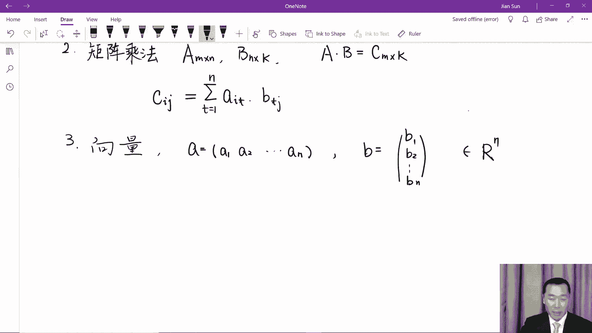

就是rn中的一个点，但是我们在真的使用向量的时候，我们还是要约定俗成，我们是使用行向量还是列向量，在线性代数里面，一般的向量我们都使用列向量的形式，所以在线性代数中啊。

我们一旦说哦v是r n中的一个点的时候，v它指的是一个列向量，但是我们非要用行向量的形式把它写出来的时候，我们通常也标明这其实是v1 v2 vn这样一个行向量，把它转置以后，自然就成了一个列向量。

这也是跟大家强调的，在我们今后呢我们都用列向量的这种表示方法来表示向量，一旦我们用了有了这个向量的表示之后啊，这个矩阵通常就可以用向量来表示，什么意思呢，矩阵用向量表示啊，通常非常的简洁明了。

而且呢还可以简化很多的计算，比如说我们一个a是一个m乘以n的矩阵，那么既然它有m行n列，我们先从列上来说，每一列它不就是一个列向量吗，那么它是一个几维的列向量呢，它是一个m v的列向量。

所以说如果我们把它看成是a1 a2 a n，那么每一个ai都是一个rm中的一个列向量，这样的话我们就把这个矩阵表示出来，顺便说一下，这里呢我们在表示一个行向量或者列向量的时候，我们可以加逗号。

当然也可以不加，无论如何，我们的表示的意思都是表示它是一串的数字构成一个行向量，或者是一串的列向量构成一个矩阵。

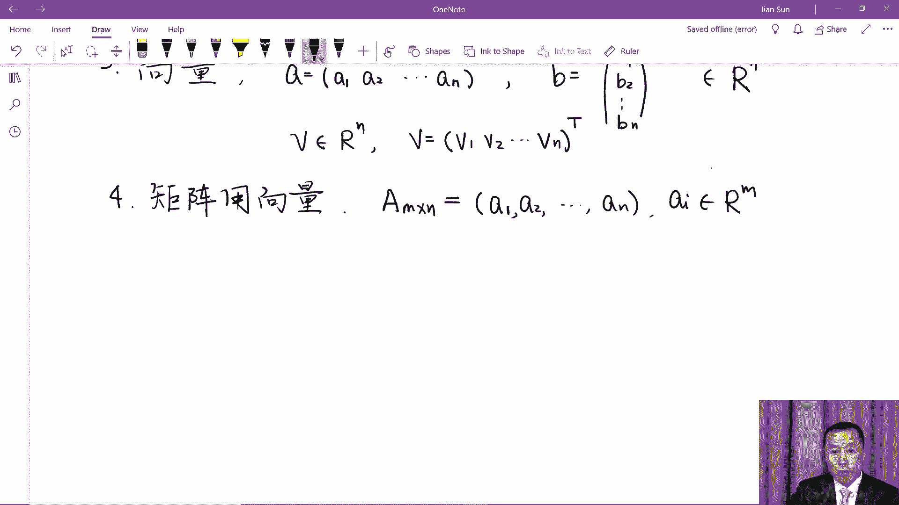

如果我们呃要想把它表示成为若干行构成的时候呢，我们就这样写，若干行构成，我们通常可以写成b1 ，但是呢我们想用列向量的表示，所以b一仍然是一个列向量，但是呢它转职以后就成为一个行向量啊。

这就是b m因为m乘以n嘛，也转置一下，那么这里的每一个b i呢，它就是n维的一个向量了，好这就是说矩阵用向量来表示好，用向量表示，有了这些内容，我们来看，矩阵作为线性空间的线性映射。

啊这个啊对矩阵作为一个线性映射矩阵，首先呢我们来看矩阵作为，在线性变换，这个怎么看呢，我们就简单的比如说r n到rm，rn到r m里面呢有一个线性变换，换句话话说呢，首先呢它是一个映射。

它把r n中的每一个点验到rm里面，我们并没有说这个映射一定是个满射或者一定是个单射啊，但是呢它是一个线性的，什么叫线性的呢，就是它对于r n中的这个向量啊，me一加上v2 啊。

加或者减就等于lv一加或者减lv 2，而且呢每一个向量乘以一个数乘之后呢，啊它就是数乘这个向量的映射过去啊，这就是线性映射的含义，既然如此呢，rn中呢不是有一组机，这组机呢我们用e1121 n个。

那么运过去之后呢，它就是l1 l e r l e n，但是在rm空间呢，它的典型的g呢是比如说我们叫做ip 1，它有m个eb系统，r也知道系统m后面呢就有一个矩阵a。

这个矩阵a呢它就是m乘以n的一个矩阵，这其实就是说呀矩阵作为线性空间的一个线性变换呢，就体现在这里面了，换句话说，任何一个矩阵本质上都n乘以m的一个矩阵，本质上它都呃定义了从rn空间到rm空间。

对应了这样的一个线性映射，那么这个线性映射就是这样来的。

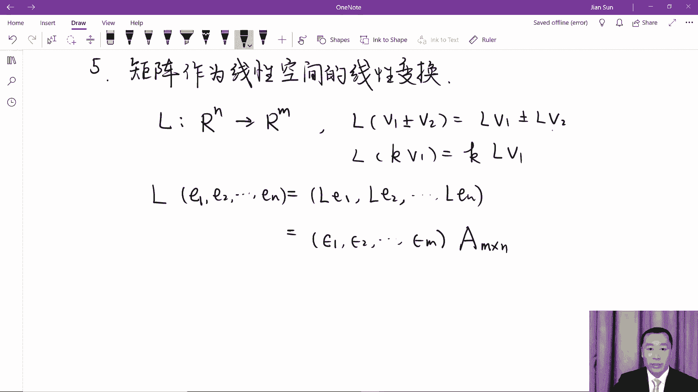

我们还可以进一步的来看啊，我们可以进一步的更加，那这个线性变换到底是就是说这里的线性变换l它就在这两组积下，它有一个表示形式，就是这个矩阵a但是呢这里面说这个a呢其实是依赖，鱼呀这两组机的表选择。

你比如说依赖于1i这组机的选择，以及，依赖于ioj这一组基的选择，所以说给定一个线性变换就对应一个矩阵，但是呢这个矩阵表示出来是依赖于这两种基的选择，如果说换句话说，这两组基如果变化。

这个矩阵其实也是可以变化的，而且呢我们把这个线性变换还可以进一步的明确的表示，对于x啊，它是r n中的一个向量，哎，x不就是一个n项嗯，这个n维向量吗。

那么l x其实你就可以把它看成是a乘以x就是矩阵乘法，矩阵乘法它就是rm空间的一个向量好这就是矩阵，可以把它看成是线性空间的线性映射的这么一种表示行为啊。

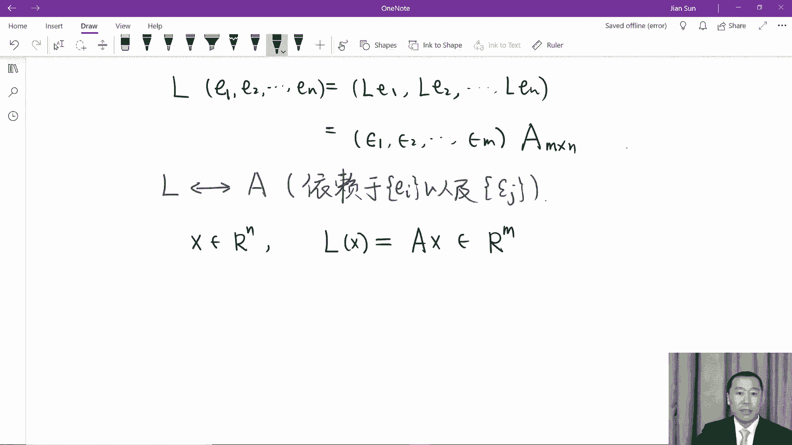

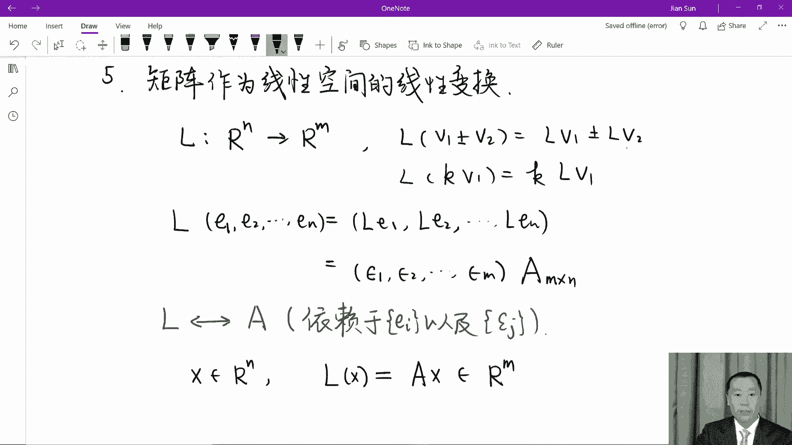

这是第五点，接下来我们来看第六点，在所有的矩阵中，方阵占有特殊的位置，因为方阵呢我们可以计算出一些更多的性质来方正，就是说一个矩阵是n乘以n的，对一个方针我们可以计算什么呢，我们可以计算其行列式。

其行列式就是我们通常定义的行列式，我们在这里就不再多说了，行列式有的时候用从记号上来讲，我们有的时候用这种determinant of a，但是行列式大家要区分开和绝对值的符号。

从来没有说行列式是一定是大于等于零的啊，行列式是可以负的，不仅可以计算行列式，我们还可以计算另外一个矩阵，对于方阵来讲，就是它的g trace，这个chase呢就是所有的对角线上的元素的求和。

我们为什么可以计算行列式，或者说我们为什么非常关注行列式，或者非常关注这个trace呢，这是因为一个方阵其实trees和行列式都是它所代表的那个线性嗯，映射线性变换的不变的性质。

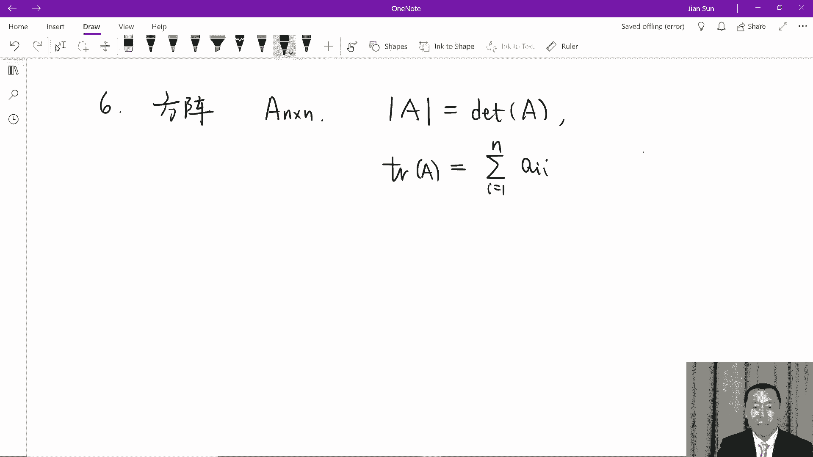

也就是说一个线性变换，刚才我们说了，它呢对应到这个矩阵上，但是呢这个矩阵是依赖于两组机，如果这两组机你选择不同的两组机，那这个矩阵呢其实是变化的，但是这个矩阵虽然是变化。

但是新的矩阵的行列式值就是原来矩阵的行列式值，新的矩阵的trace也是原来矩阵的trace，不依赖于g的选择。

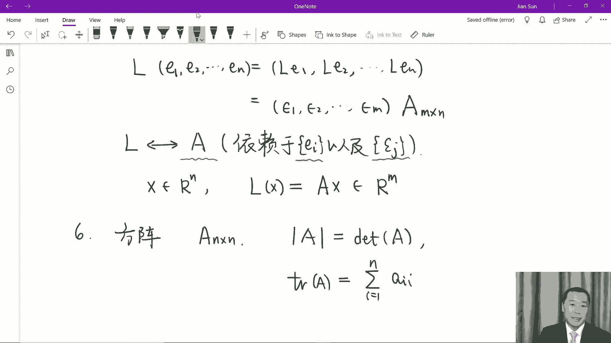

啊这是关于方阵的性质好，那么接下来我们还有关于方，关于方阵呢，我们还有这样的性质，那就是矩阵乘法，两个矩阵的乘法，它的行列式值等于行列式值的乘法，而且呢这个矩阵乘法一般来讲a乘以b不等于b乘以a。

但是去求行列式值的时候是一样的，所以呢我们看到，但是看到a乘以b的行列式值等于b乘以a的行列式值，不仅如此，a乘以b的trees啊，它也等于b乘以a的trees，所以这些也是重要的。

大家呢证明呢大家可以回忆一下好，第八点我们看一看矩阵和我们的线性方程组之间的关系，一般呢一个线性方程组，用矩阵表示出来，那就是a x等于b的形式，在这里呢a可以是m乘以n的矩阵。

那么x呢就是r n中的一个向量，b呢是rm中的一个向量，作为一个线性方程组来讲呢，是说通常a是给定的，b是给定的，x呢是待定的，那么在n等于m的情况下，就是说若，等于m所以说我们现在就看到是n个未知数。

同时也是具有n个方程，而且呢这个a的行列式不等于零的时候，那么a就可逆可逆的情况下，这个线性方程组的解，那就是a的逆乘以b这就是线性方程组的解就是这个样子。

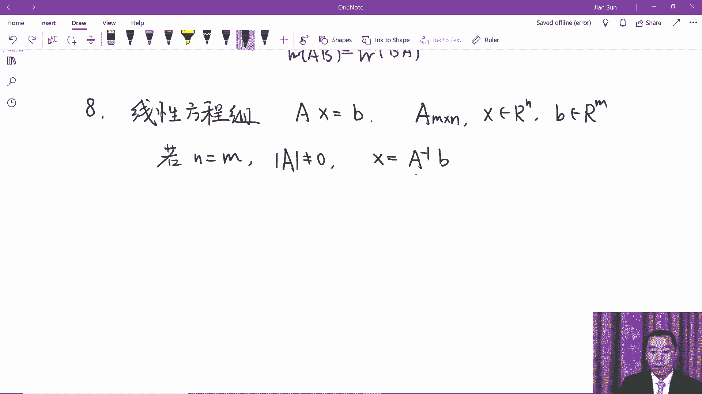

那么接下来再继续看第九点，关于线性代数的一些知识，我们好好复习一下，第九点呢就是关于矩阵它的一些几何性质的特别的特点呢，我们来讲一下矩阵特征值的问题，这个呢是针对于方阵，所以a呢现在还是个方阵啊。

n乘以n，如果有一个向量x使得a乘以x就等于一个常数乘以x，这里的栏目呢它是一个实数，这个时候呢我们就称栏目的是特征值啊，而且呢我们称x呢是特征向量啊，一会过去，x呢是特征向量的诶。

那我们这是关于特征值和特征向量的定义，关于特征值和特征向量最重要的性质，提醒大家一下，那就是对于对称矩阵的，什么叫对称矩阵呢，就是a转置之后就等于a本身，它实际上对应着a的所有的元素。

满足aig等于aji。

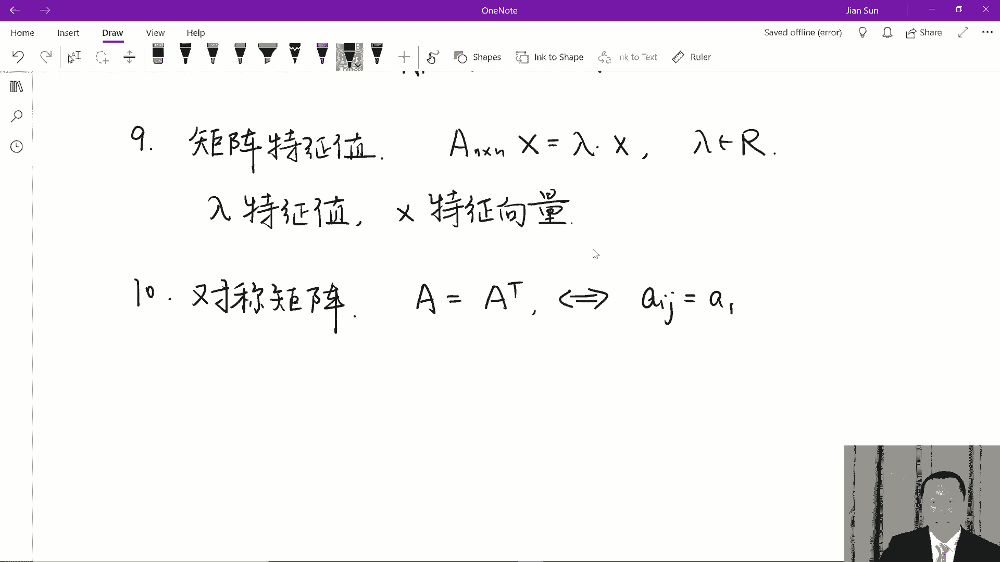

对于对称矩阵我们能说什么呢，对称矩阵所有的特征值都是实数，对称矩阵a是一个n乘以n的矩阵，那么就有栏目的一目的二栏目的n n个特征值，但是呢这里面是可能是有重根的，所以说呢这n个特征值呢可能是有重复的。

同时对应有，v1 v2 是对应在上面的n个特征向量，所以我们看到一个对称矩阵啊，它很特殊，它呢有n个特征值。

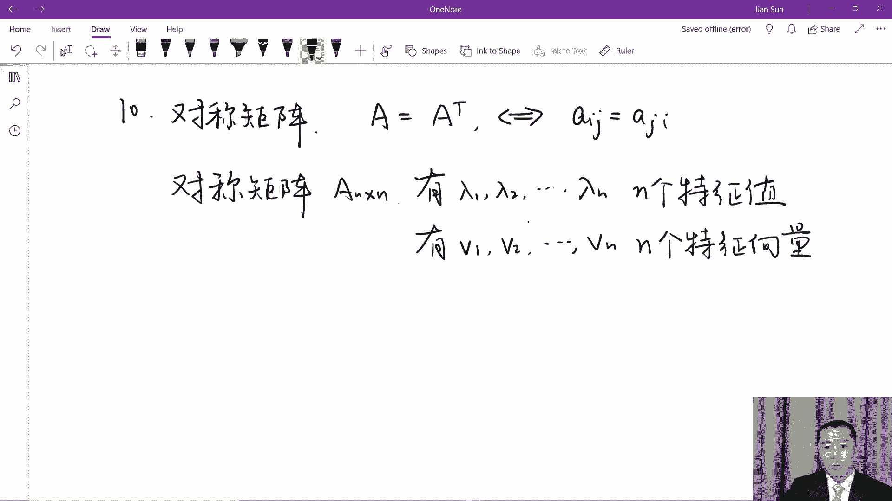

但是可能有重数，同时呢也有n个特征向量a研究对称矩阵的一个重要一点啊，就是我们说这是几何性质，所以说我们呢是可以从几何的角度去研究，几何的角度去研究呢，就是首先呢我们在这个r n空间中呢。

要去研究r n空间它的距离和内计，好我们对于一个向量，我们就是x在行人空间，那么x绝对值的平方就是x一的平方，一直加到xn的平方，它描述了这个点到零点的欧几里德一下的距离的平方。

同时呢我们给出两个x和y在rn中我们还可以定义呢x y的内积，x y的内积呢就是x1 y11 直加到x n和yn。

它的含义呢，众所周知，内积的含义呢，其实它是形容他们两个的夹角，换句话说，作为两个向量，它们之间的夹角呢是sa，那么cos in it呢就等于x和y的内积除以x它的长度，再除以外的长度。

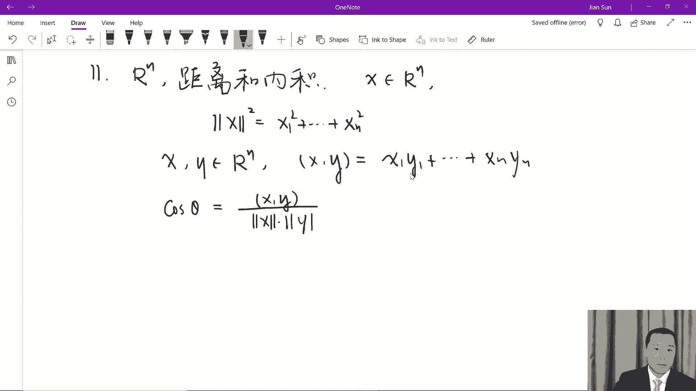

如果我们看到啊xy的累积等于零，那就说明x这个向量和y这个向量是垂直的，因为呢它们的夹角呢cos这个夹角等于零，cos这个夹角等于零呢这个夹角就会是二分之派，所以他们之间呢是互相垂直的。

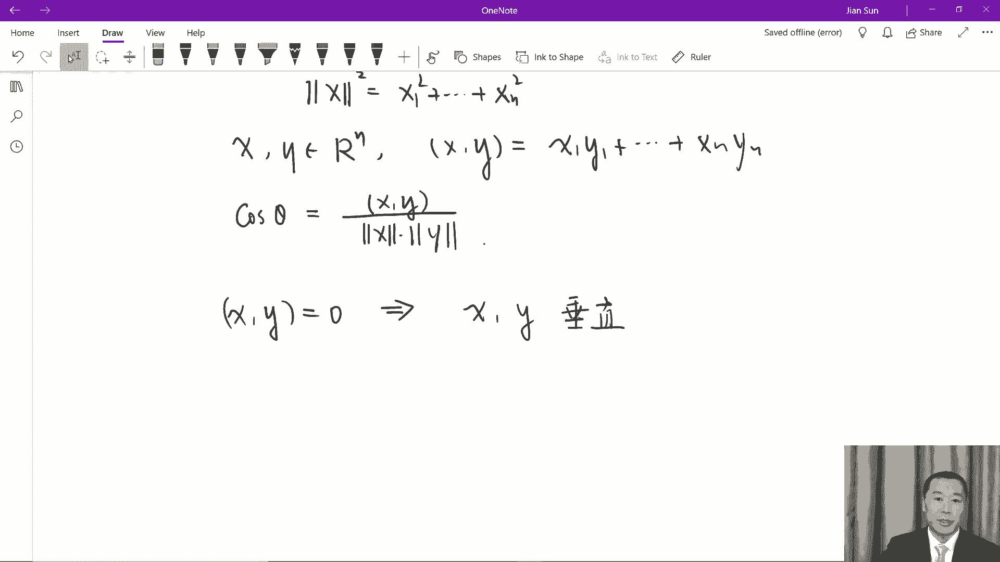

那另外一个极端情况呢是，如果他们俩的内积就等于啊他们两个的绝对值的乘积，那就说明了他们两个在一个方向上，在一条直线上就是重合一条直线上，而且呢方向相同，当然最后就是如果他们俩的内积等于负的。

他们俩的绝对值相乘，那就是说明x y在一条直线上，但是方向相反。

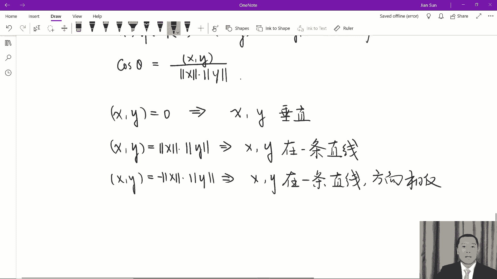

这就是我们要说的从空间中的距离和内积触发。

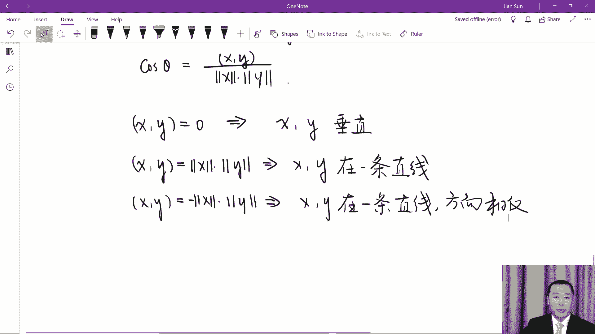

我们再来看从这个角度出发，我们来看这个对称矩阵，先给一个对称矩阵呢，扔给一个对称阵a，我们看，和xx是一个向量和y的内积，那么它呢就等于咱们如果用内积的，把用内积的形式呢，我们用啊矩阵的乘法把它写出来。

那它就可以写成啊是y的转置乘以a x，因为y的转置呢是一乘以n的向量，ax呢是n乘以一的向量，所以y的转置ax同时呢它也可以写成了ax的转置乘以y一样的。

因为内奸啊，你谁在前谁在后都无所谓，但你这样写了之后呢，这就是x的转置乘以a的转置乘以y，但是a的转置不就是a本身吗，这样的写法我们就看到它其实呢就是x和a y的那几，换句话说就是对于对称阵来讲。

我们就有这样的一个性质，这个性质就是ax和y的内积，你就把这个a可以放到y的前面去，啊我们研究这样的性质是想说明什么呢，我们接下来看第13点，第13。2次型，就是在上面如果x y是同一个向量的话啊。

还是对称矩阵，那么这个我们通常叫做关于x的一个二次型，这是什么什么呢，这其实就是关于x的一个二次函数啊，如果我们继续写下去，那么就是考虑a啊，就是用它的这些分量来表示，这里呢是i不等于j。

或者说呢我们可以写的更明确一些，就是i所有小于j的那些i跟g做成一个对这种二次型，就是也是接下来我们会经常利用的好，有了内积的性质，有了二次型，那么接下来呢我们来叙述一个关于内积和长度的重要的不等式。

也是我们在证明感知机的时候，我们在上一节我们来谈论第一个模型感知机的时候反复用到的，对于r n中的两个向量，我们有x和y的内积，小于等于x的绝对值乘以y的绝对值，这是为什么呢，其实我们刚才不是说了吗。

xy的内积不是它的含义，就是x的绝对值乘以y的绝对值，再乘以cos in c吗，但是cos in c的总是介于正一和-1之间的，特别呢它要小于等于一，所以这样一个值呢当然是小于等于x乘以y了。

那反过来呢也一样啊，这是xy，那么x y啊，由于cos in c的总是要大于-1的，所以大于等于负的，这就是为什么我们有这个不等式的原因好，关于呢我们这个线性代数的知识呢。

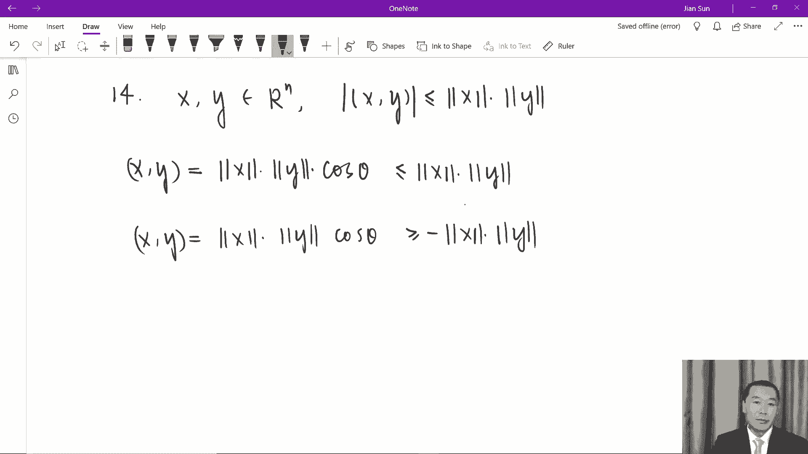

就想跟大家呢做一个非常快速的复习。

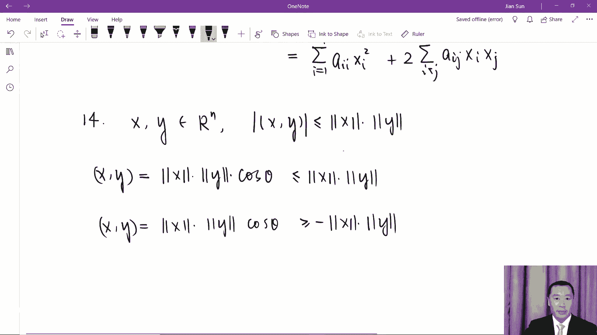

因为接下来呢我们会反复的用到这些矩阵向量啊。

向量的内积，二次型特征。

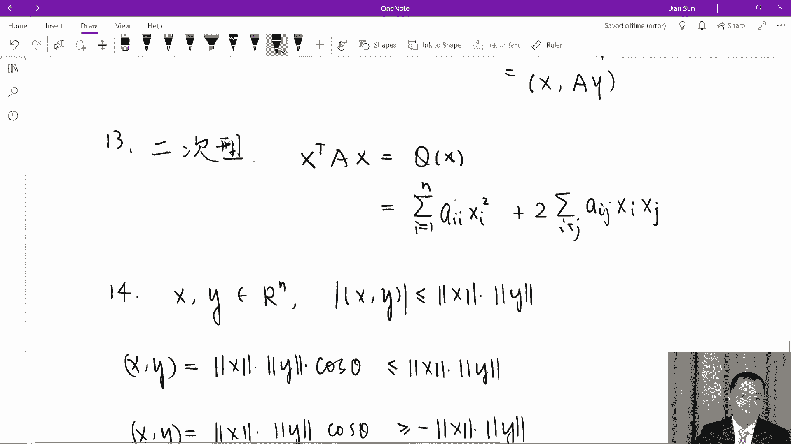

向量特征值等等这些概念，在咱们接下来的机器学习的模型中。

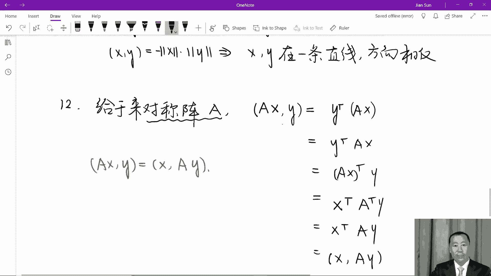

所以在这里呢就想跟大家呢简要的复习一下好。

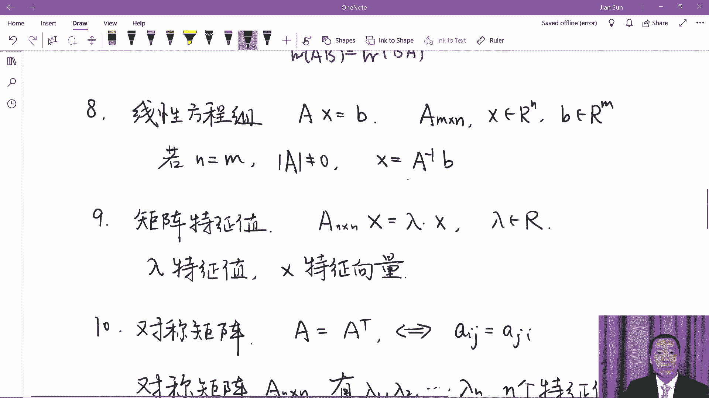

那么有了这些知识，我们接下来呢来看什么是线性规划。

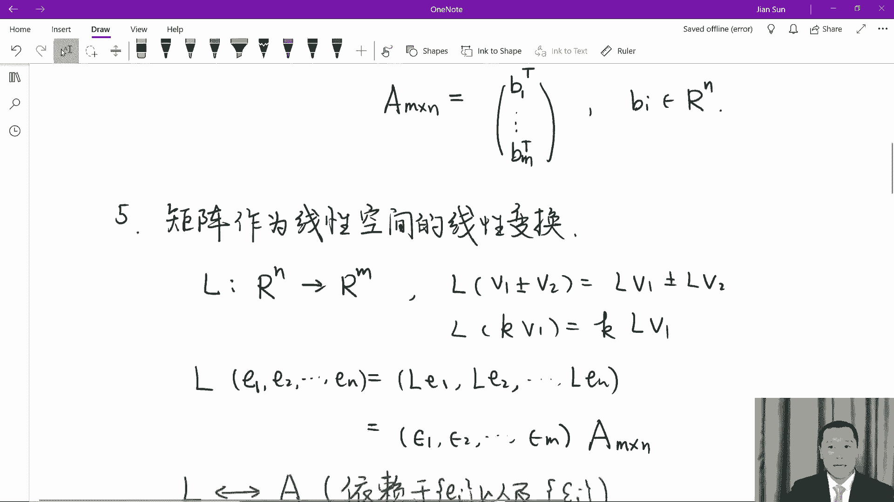

什么是线性规划呢，线性规划就是一种求极值问题，但这个问题本身呢是这样的，一般的求极值问题啊，这个问题本身呢是叙述成这样，首先呢我们是要看在什么空间里面求极值，比如说我们现在考虑的空间是r n。

所以我们是在一个n维空间里面去求极值，但是这个极值呢我们首先是要看什么函数的极值，所以说在行人空间呢，我们还要给出函数，给出来一个函数我们叫做fx，这个fx呢是实值函数。

也就是说它呢是从r n空间到r的这样的一个函数，好我们当然呢就可以来啊，现在求这种我们叫做绝对的机制，比如说max所有的r n空间中的点，让我的fx取到极大值的那个点，相对应的那个函数值。

这里呢就是一个求极值的问题，好这是求max，当然我们还可以求命的，也就是所有r n中的点，使得我们fx取得极小值的那个点，我们对这样的问题呢，在微积分中呢其实一点都不陌生，比如说我们就是说一维空间啊。

这个n呢就等于一一维空间，我们也知道这个函数值，比如说，这样的一种函数啊，我们可以去试图求函数的极大值，函数的极小值，在整个的这个实数域里面去求极大值，极小值，我们会通常遇到这几种情况。

我们现在回忆一下，比如说有极大有极值叫做全局，就是你可以求到全局的极大或者是极小，你比如说在这里面就可以求到全局的极小值，再反过来这个抛物线里面就可以求到全局的极大值，这是一种情况。

还有呢就是局部的极大极小值，局部的极大极小，为什么呢，比如说我们先看极小值，啊这有一个极小值，似乎在这个点达到极小值，但其实呢它还会在一个更低的点达到一个更小的值，这就是一个局部的技巧值。

所以说呢它并不是一个全局的绩效师，同样极大也一样，极大值也可能只有一个局部的极大值。

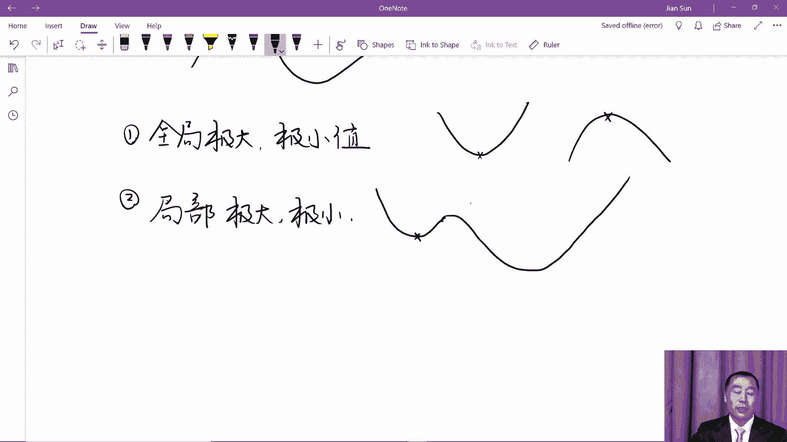

我们求到了，但未必是全局的极大值，当然还有第三种情况，那就是没有极大值，也没有极小值，函数是单调函数，极大极小。

一般呢咱们求几日呢，大概就会遇到这样的一些情况。

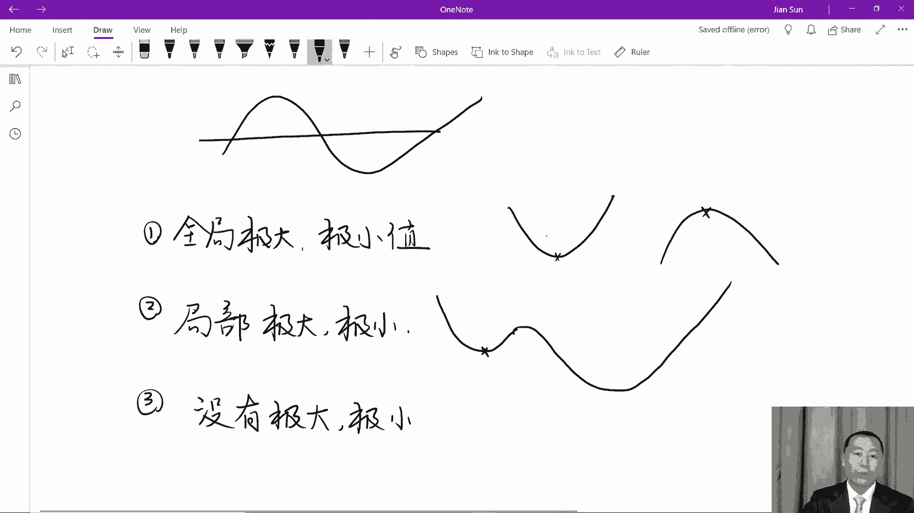

我们在微积分理处理这样的情况呢是屡见不鲜的，这种求极值的方法呢我们叫做求绝对的机制。

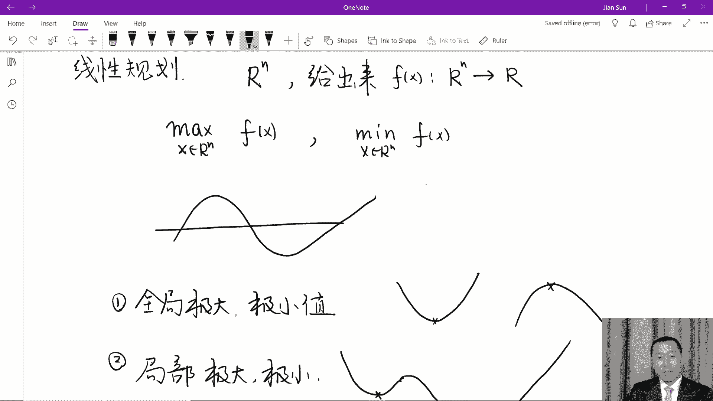

因为它没有任何的约束条件，没有约束的求极值，我们还会经常类似的碰到呢，就是有约束条件的，约束条件一般的呀有几种方法表示出来，一种方法呢就是我们规定说好了这样的一个定义域，也就是说我们规定在r n空间。

我们规定的这样的一个欧米伽这么一个区域，然后呢我们要求在这个区域中来求极大值或极小值，所以说我们的要求我们的x在这个区域中，使得我们的fx究极大或者极小。

那这个区域呢往往可以是啊很空间的一个这样的一个区域。

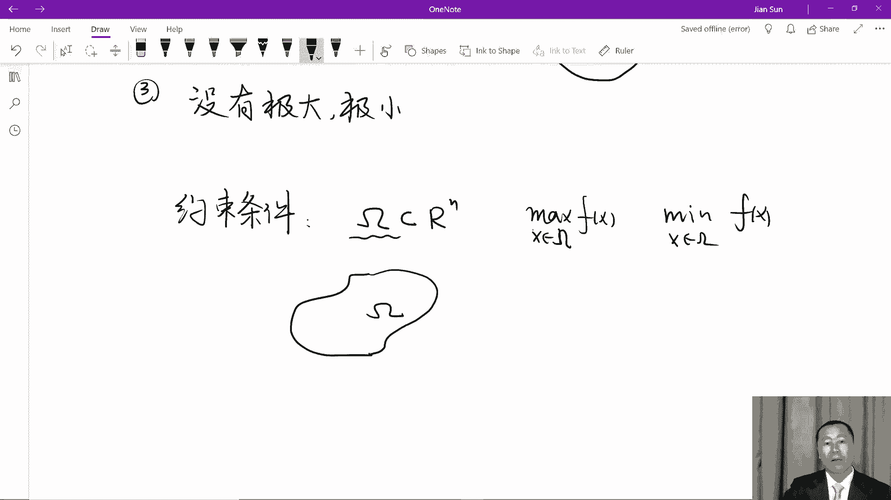

这是带有一种约束条件，他的给出的方式，还有一种给出的方式呢，就是这个区域是用另外一个函数给出来的，比如说gx gx呢也是从rn到r的一个函数，我们是希望在g比如说小于等于零的地方来求极值。

所以我们这个问题就变成了带有约束条件的极值，我们想求fx的极大值，同时呢约束条件就是gx，比如说小于等于零，也就是说我们在所有gx小于等于零的地方来求fx的极大值，当然我们也可以来求极小值。

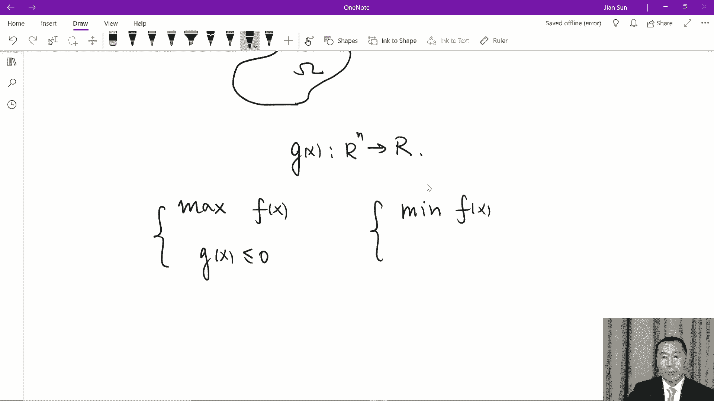

所以这是第二种给出的这个约束条件方法对。

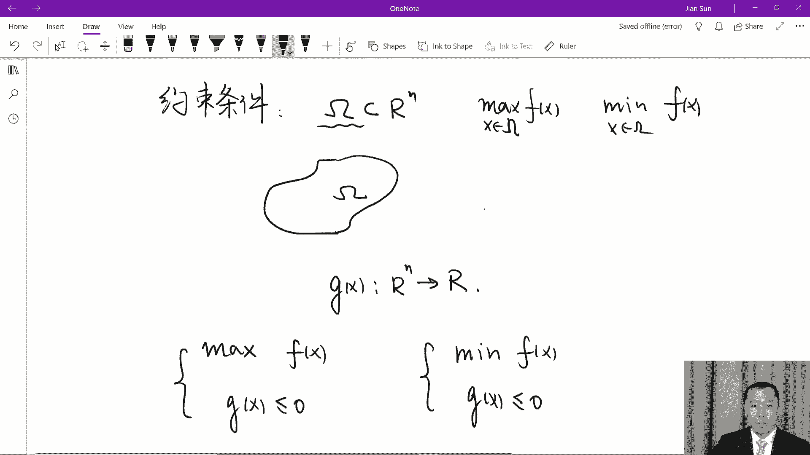

一种是直接说好区域，一种是用函数的方法来规定这个区域，一旦我们求极值从一个无约束条件的求极值，变到一个具有约束条件的求极值，这个时候问题就变得比较复杂，大家在微积分里面也知道没有条件求极值的时候。

我们可能去求各个各个各个偏导，然后呢让所有的偏导数啊，或者说用高维微积分的方法叫做求梯度，梯度等于零，求得那个点，使得梯度等于零的那些地方，我们在检验那个点是不是一个全局极小或者是一个局部极小啊。

但是呢在具有约束条件的情况下，问题就变得非常的比较困难，嗯不能说非常困难吧，就是比较困难，特别是函数呢可能本质上本来它就存在极大或者极小，但是对于一个特定的区域，他的这种极大极小可能就会不存在。

所以说球的时候呢我们也会有啊，接下来我们会给大家介绍其他的方法，比如说拉格朗日乘子法呀等等的好。

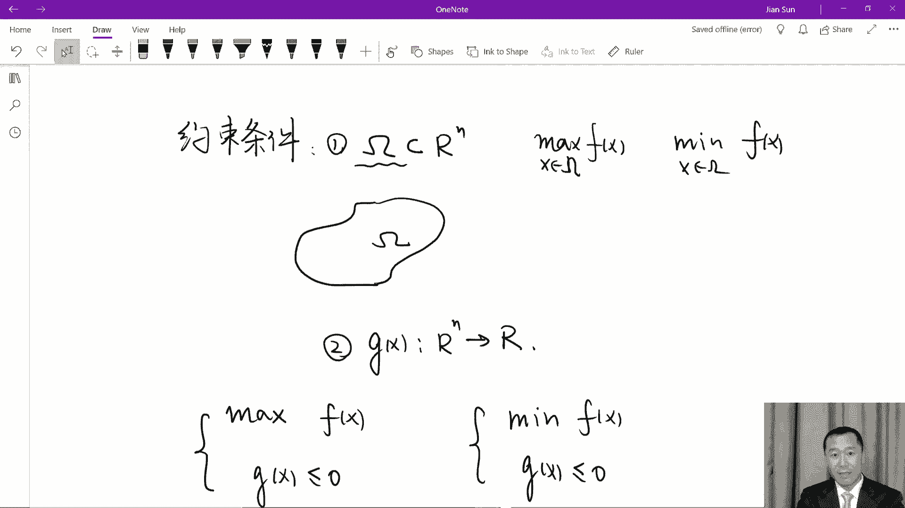

总之呢我们很多的问题。

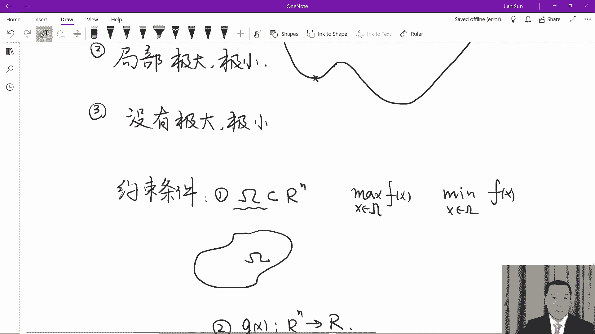

我们这里面介绍的，最终我们机器学习不仅仅是机器学习，在经济学还是金融学，很多的问题我们都要去求优化，那那么这种优化呢无非就是求极值问题。

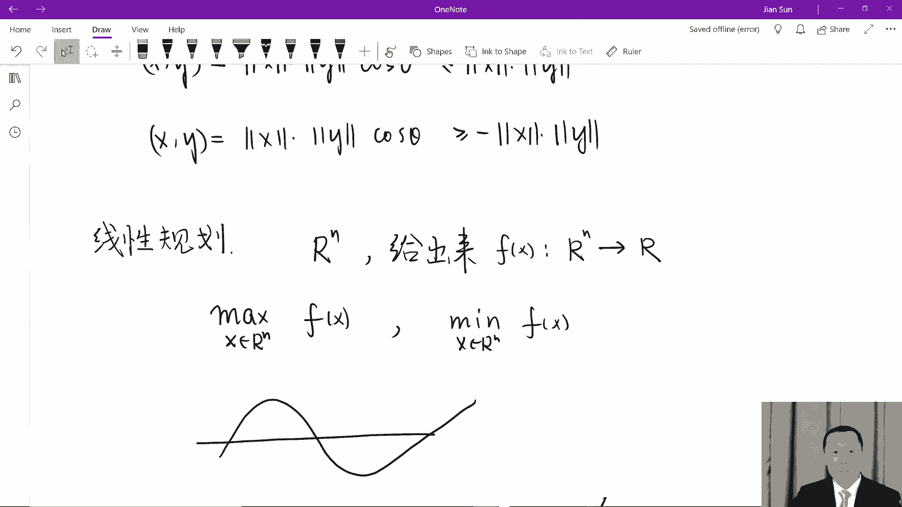

极值问题就是带有约束条件和不带有约束条件。

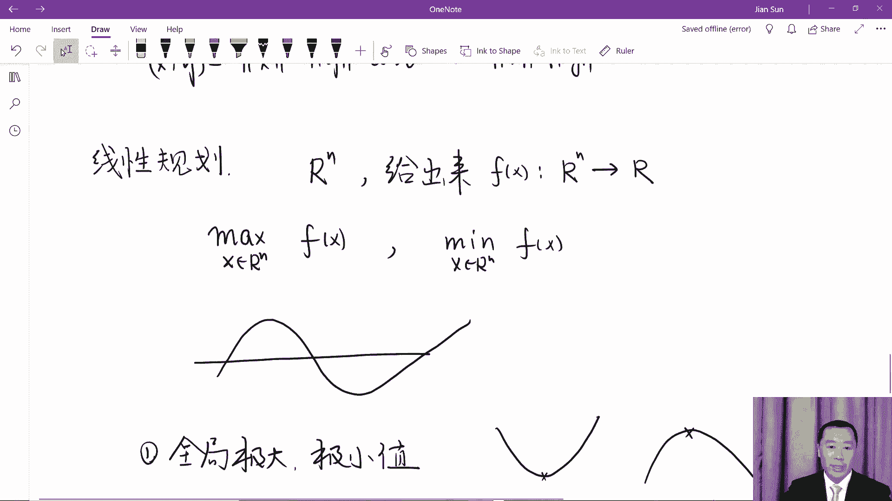

那线性规划指的是什么呢，线性规划是指的在上述的描述的这些优化问题里面，还函数fx它是个线性的函数，函数gx也是一个线性的函数，这个时候呢其实问题相对来讲就比较简单，我们来叙述一下线性规划。

线性规划的问题，一般问题是这样的，线性规划的一般形式啊，我们要求还是我们在二人空间中考虑，我们呢自变量我们还是x x用x作为我们的自变量啊，所以说呢x是属于r n自变量，然后a是r n中的一个向量。

所以我们要求的是a的转置乘以x其实就是a和x的内积，就是a和x的内计，我们要求求的是，比如说就是这让a和x的内计去讥笑，在所有的x里面，我们去寻找和这个a这个给定的这个向量和它的内积极小的那个x。

这个看着看到这个线性性质了吧，因为呢a的转置或者a和x内积，它是x的一个线性函数，但这是没有约束条件的，如果说我们就给了这样一个没有任何约束条件的，一个对于这个线性函数的极小的话。

那这个极小就是负无穷啊，我们就可以让他，你想让它多想，它就可以多笑，所以这样一来就没有意义，所以说呢对于线性函数，我们去求它极大也好，极小也好，我们肯定是要给他约束条件的。

在这里的这个约束条件也是线性的，我们看看怎么来描述它好，我们在这里呢再给一个a，这个a呢是m乘以n的一个矩阵。

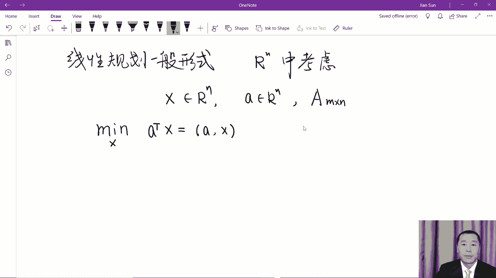

同时呢还要给出一个人呃，向量b b呢是m为了一个向量，我们的约束条件就写成a乘以x小于等于b的形式，这样就构成了一个完整的一般来讲的一个先行规划的一个问题啊。

好有的时候这个线性规划的问题用另外一种形式表示出来，就是不是mean，而是max，但是是一样的啊，对于这个a的转置x同时呢使得呢a x小于等于b。

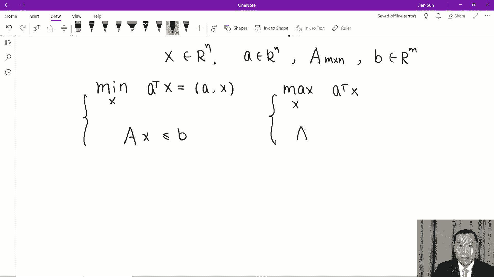

你看这里的约束条件实现这种是线性的线性的，所以说我们说呢这是一个线性规划，我们的目标函数是这是线性的，约束条件也是线性的，所以整个就是一个线性规划，我们现在来看一看啊，直观上我们就在二维平面上。

我们看看它是代表什么意思，在二维空间，比如说在r2 中，带二轴，首先呢我们来看看我们的约束条件，就使得我们在r中最后要进行优化的那个定义域变成什么样子，在r中呢我们就是说这个a呢就变成所谓m乘以二啊。

而且呢这个a x小于等于b呢，它就等价于m个线性约束条件，m个线性约束条件，线性不等式吧，每一个线性不等式，那你比如说一个就是这个a的某一行，每一行都等价于一个线性不等式。

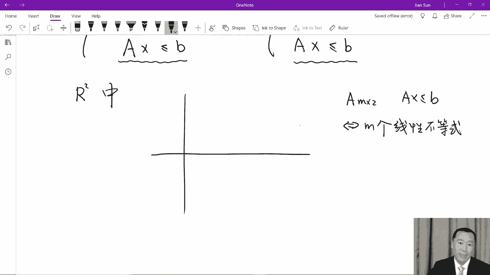

每一个线性不等式呢本质上就是说在我们这个空间中，我们会画出一条线来，那么第一个线性不等式就相当于在这条线要求在这条线的一边，比如说我们要求在这条线的这边，这是第一个线性不等式。

如果说再给出第二个线性不等式，比如说是这，我们又说要在这条线的右边，这是第二个线性不等式，第第三个线性不等式，比如说在这条线的上边，这就是第三个线性不等式，第四个线性不等式啊，是这个要求在这条线的上面。

这就变成第四个选项不等式，比如说第五个，第六个，最后呢这六个线性不等式所约束出来的这个区域，欧米伽就是这六条线公共围成的这个部分，我们看到无论你的m是多少，我们想说你最后约束出来的这个区域。

它都有一个特点，这个特点就是m个线性不等式所约束出来的，它都是一个凸起，什么叫做凸区域呢，我们正式来给出一个定义，所谓凸取omega是一个凸凸区域，指的是在这个图区域中。

任何两个点任给我两个点x和y那么x和y的连线。

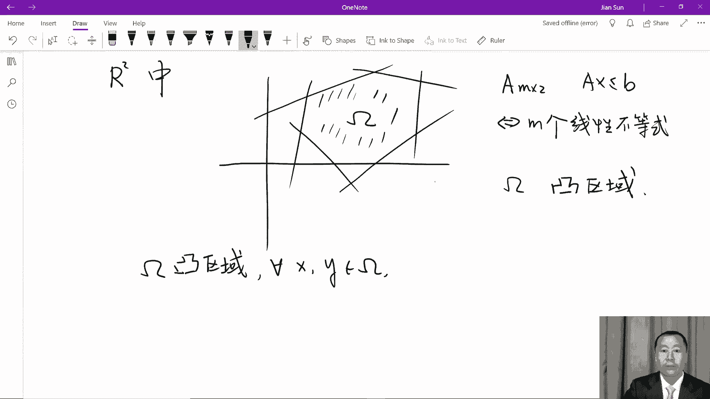

都落在这个区域中了，x和y的连线用数学方法表示出来是什么样子呢，就是所有的那些tx加上一减t y，这个t呢是介于零一之间的，这是two区域的定义，就是说在平面或者在任何一个空间。

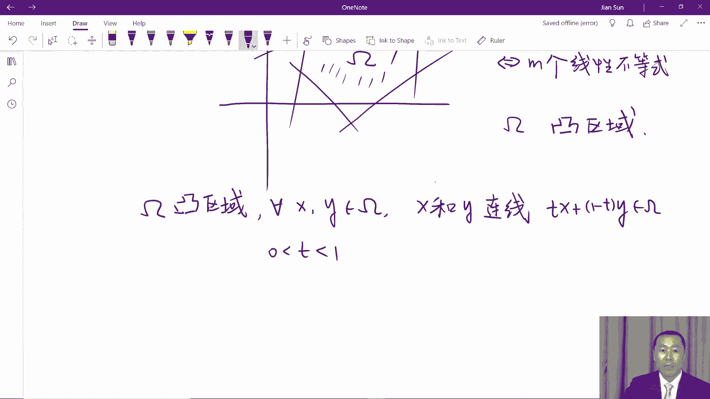

一个凸区域，指的是这个区域中的任何两个点，它们的连线都在这个区域里面，所以这两个点的连线啊指的是这两个点中间啊，并不是说外延到这两个点的两边去，外延不是我们指的是内沿这两个点的连线之间的部分都在这里面。

好突区域啊不一定是由m个线性不等式围城的，换句话说，凸区域不一定，它一定是一个像在我们上面那个图里面的一个凸的多边形围成的。

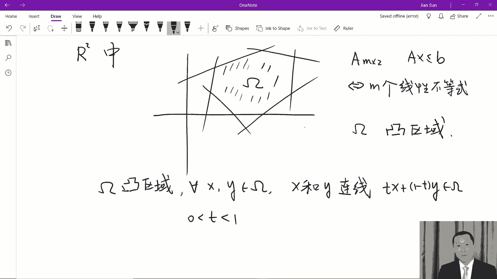

比如说一个圆就是一个凸区，圆也是一个突区。

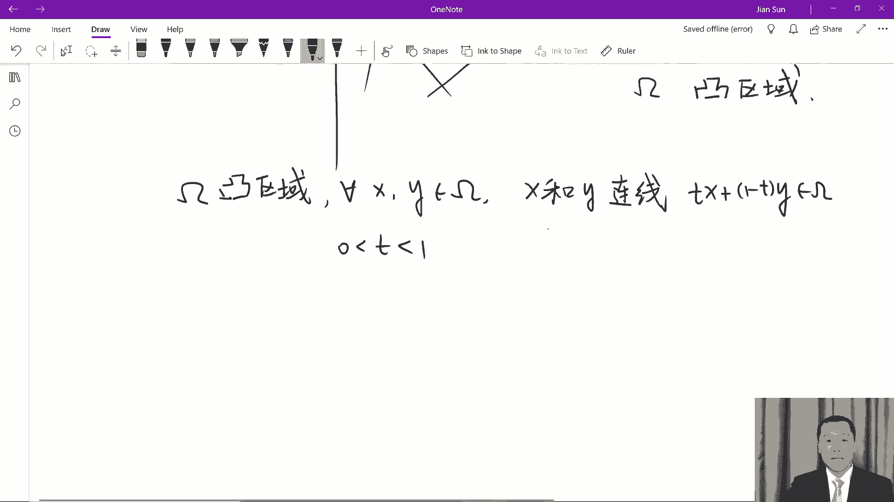

但是显然呢圆呢它不是一个多边形图的多边形。

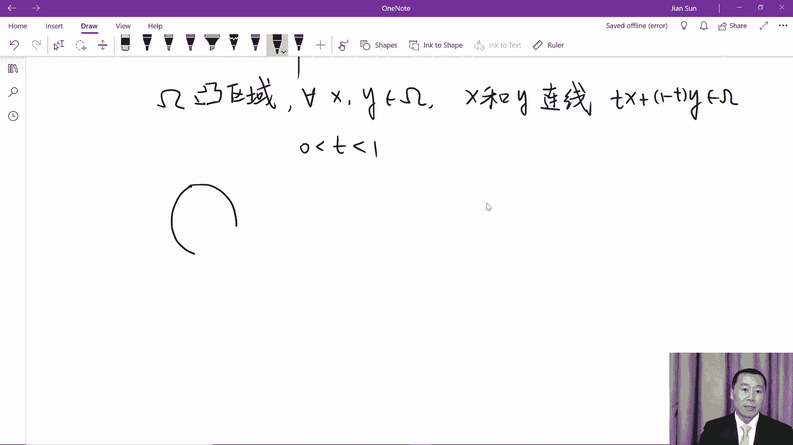

所以凸区域，但是呢反过来m和线性不等式。

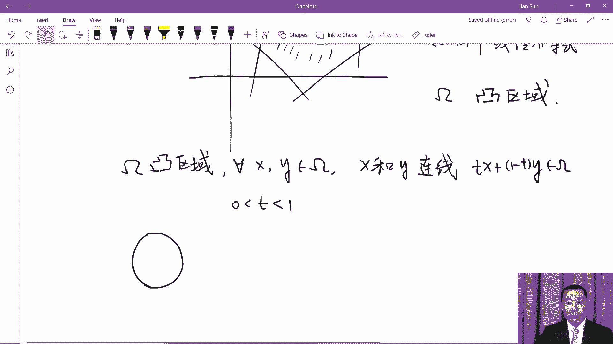

换句话说所围成的那个to的多边形一定是个凸区。

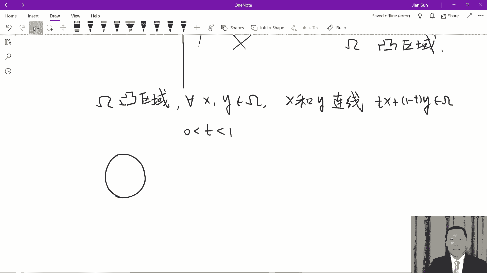

所以我们现在来看啊，这是一个隶属关系。

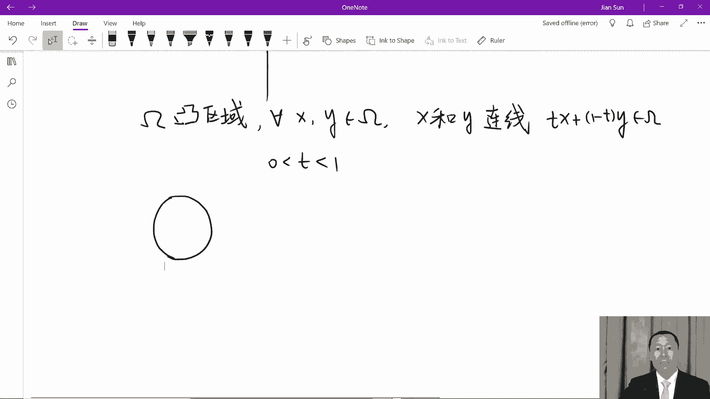

就是说在线性规划里面，它的约束条件，本质上来讲就是在mv空间构成了这么一个凸起的，但是呢并不是说所有的凸区都可以用这种形式来表示，突区域中来对一个线性函数求极大极小。

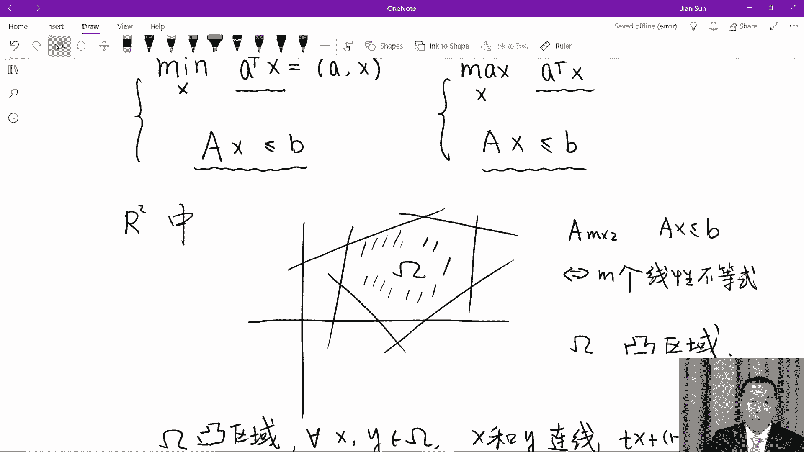

它有什么特点，我们来看看它的特点呢。

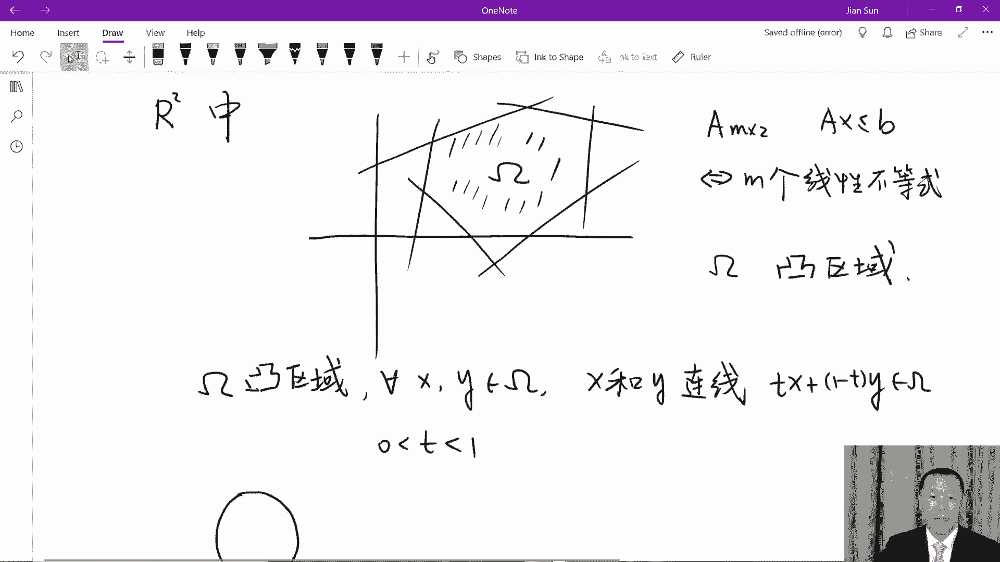

就是相对来讲比较容易求，我们在这里再画一个图区，我们就画一个比较中规中矩的t区就好，比如说我画这样的一个图区，在这个two区域里面，我们是希望minimize，比如说我们是希望minimize。

minimize谁呢，我们举一个具体的例子，比如说x加y，那怎么去minimize x加y呢，啊我们这是在一个二维平面啊，在这个二维孔，在咱们就是在这个二维平面上，x轴这是y轴。

我们如何去minimize这个x加y呢，我们首先来去做x加y的等高线，也就是说在这个二维平面上让x加y等于常数的那个线是什么线，x加y等于常数那个线啊。

那就是这样的线就是好和x轴二乘夹角是135度的那个角，就是这样的线，我们换一种颜色了，那就是这样的线对好，这个线呢由于它跟这个欧米伽呢没有相交，所以说呢我们必须让这个线呢不断地移动。

和这个欧米伽呢有相交，移动的时候会发现它就会接触到欧米伽，这是第一次接触的欧米伽，在这个点上就有一个值，我们继续让这个线接触欧米伽好，我们看看一旦在接触欧米伽之后，你比如说这条线。

它和欧米伽接触的部分就是从这个点到这个点上面，x加y都是一个长值，好我们继续做这样的事情，直到呢我们要离开omega，那这个点你比如说叫做a点，这是我们最后一次跟这个omega这个区域呢有相交的地方。

那这个点就是在所有欧米伽上使得x加y最小的那个点，这个啊这一条呢就是不仅是针对于x加y这个函数，你可以任何一个其他的线性函数，比如说x加2y2 或者2x加y或者是x减y等等等等，任何一个线性函数。

你都可以构造这种等高线的，用这种构造等高线的方法，你会看在这个突区域中的哪一个点，它可以达到极大或者哪一个点达到极小，钢刚才那个点就是在a点处达达到极大极小啊，比如说这个点我们叫做命名为b那在b点处。

在所有的欧米伽里面是在x加y达到极大的点，再回到咱们线性规划的一般这个函数我们已经说了。

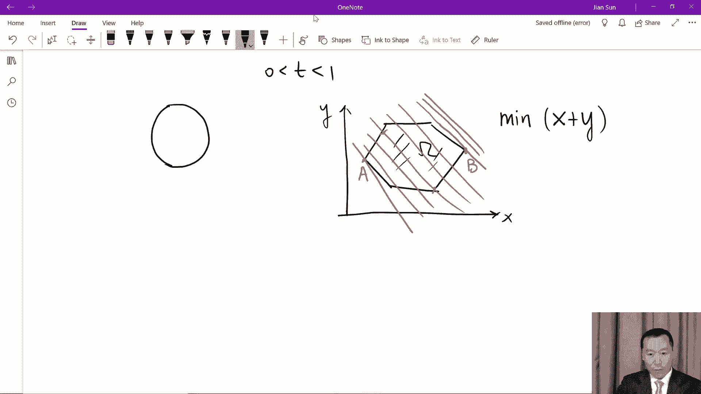

线性规划它的一般表现形式，就是这里面呢是一个面或者是一个max都可以，然后呢a的转置乘以x，然后约束条件呢是ax小于等于b的形式，我们看到了x小于等于b对应了一个to的多边形，凸多边形。

凸多边形的区域好，然后ax这是一个线性函数，所以说这样的一个啊在一个凸多边形内寻找一个线性函数的极大极小，问题啊，相对来讲简单，而而且是肯定存在，不仅存在。

而且一般的这个存在的点呢一定是在这个图多边形的边界上达到，所以说这是这个线性规划，它从这直观到算法可以得到的这么一个结论，我们今天就不去展开讲啊，我们到底怎么开，能够迅速的求解这样的一个线性规划问题。

这不是我们本次课程之中的内容，但是我希望大家呢能够了解这个内容，这个内容呢一旦我们了解到这个线性规划了，那我们现在来看很多问题是可以转化成为这个线性规划的问题。

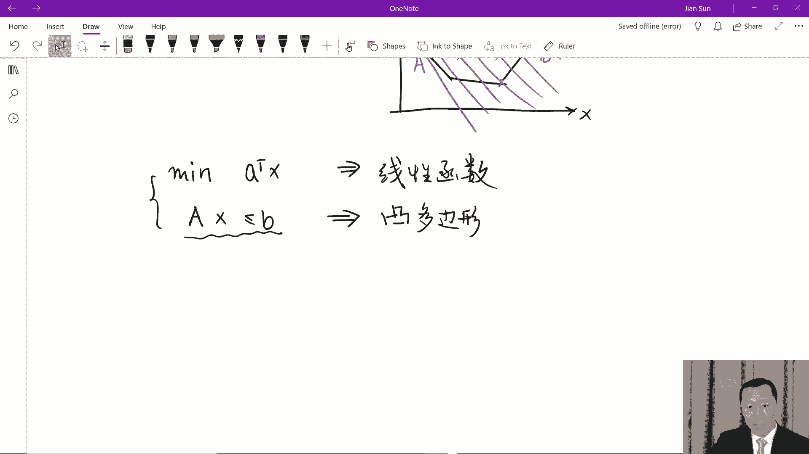

我们来看看线性规划的几种表现形式。

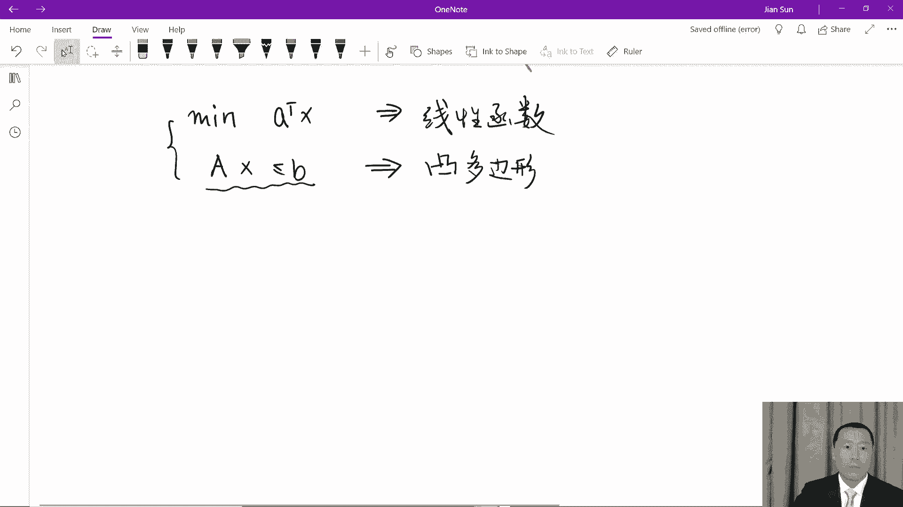

这是线性规划好。

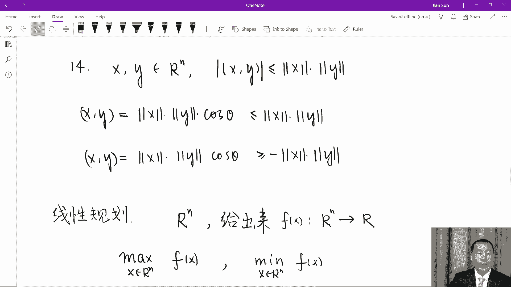

就是转化，比如说我们有我们的啊，比如说我们现在有眼前这样的一个问题，比如说约束条件不是不等式，而是等式，怎么办啊，比如约束条件是ax等于b这怎么办呢，我们就可以把这个条件啊等价于两个条件。

为了使用我们典型的线性规划的这典型形式，我们就可以把它转化成说ax大于等于b然后呢是负的，a x小于等于负b那这两个条件并起来，那自然的它就等价于ax等于b这两个条件并行起来，那怎么写呢。

那就可以这样写，那就是说a把这个矩阵呢扩大，原来这个矩阵呢是m行n列，那么现在呢啊不是这样，这个纵向扩大，我把这两个这两个表达式啊，纵向呢原来是m行n列，现在是2m行n列，它乘以x小于等于b也是这样。

所以说呢这个矩阵就定义成为新的，比如说a q a这就定义成新的b to，那么新的这个a u就变成2m乘以n，那么b t的也是一个2m的向量了，所以我们看到啊，如果在我们的约束条件里面有相等的。

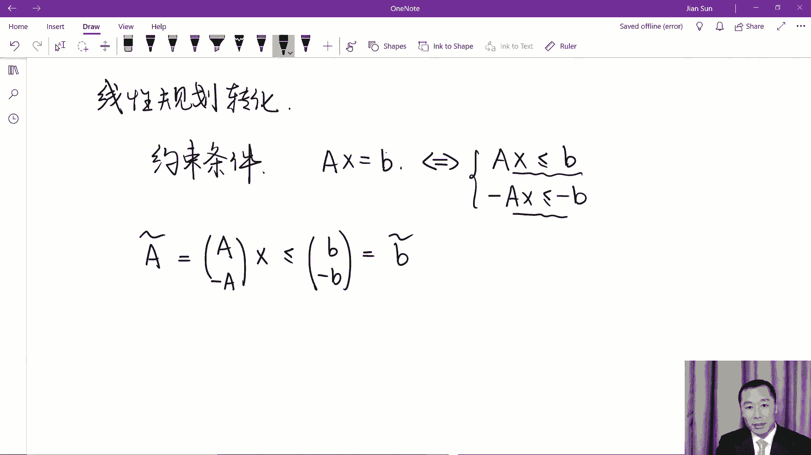

那没有关系，也可以转化成我们的线性规划的问题，同时线性规划还可以处理一些其他的问题，你比如说举个例子啊，我们要minimize的，不是加了个绝对值，就举个例子，加个绝对值怎么办，如果我们加个绝对值。

当然我们还有约束条件啊，a x要小于等于b这个表面上看已经不是一个线性问题了，因为绝对值它显然已经不是一个线性函数了，但是你会看到我们仍然可以把它转化成为一个线性规划的问题，只要注意到。

啊我这里要说一下啊，不是这样加绝对值，我们在这里面，举个例子啊，这个，的转置乘以x的绝对值，对ax小于等于b我们看看怎么把它转化成为一个线性规划的问题，我们只要注意到啊。

a的转置x加不加绝对值啊啊这里的绝对值的定义也要跟大家说一下，是的，我们注意到一转置乘以x等于u加上v绝对值，一般来讲一个数字加绝对值等于u加v，而这个实数本身就可以写成u减去v这个u是什么呢。

其实就是加了绝对值和没加绝对值的和的1/2，v呢就是加了绝对值减去没加绝对值的1/2。

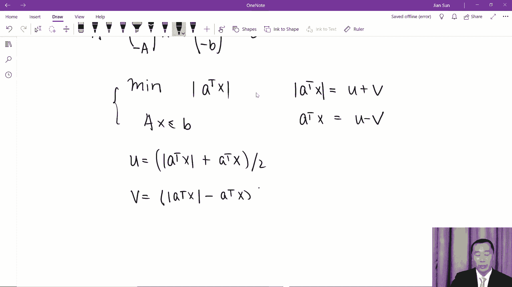

这样一来呢，我们就有了u跟v了，那么原来的这个问题呢，我们就变成了我们去minimize u加上v好。

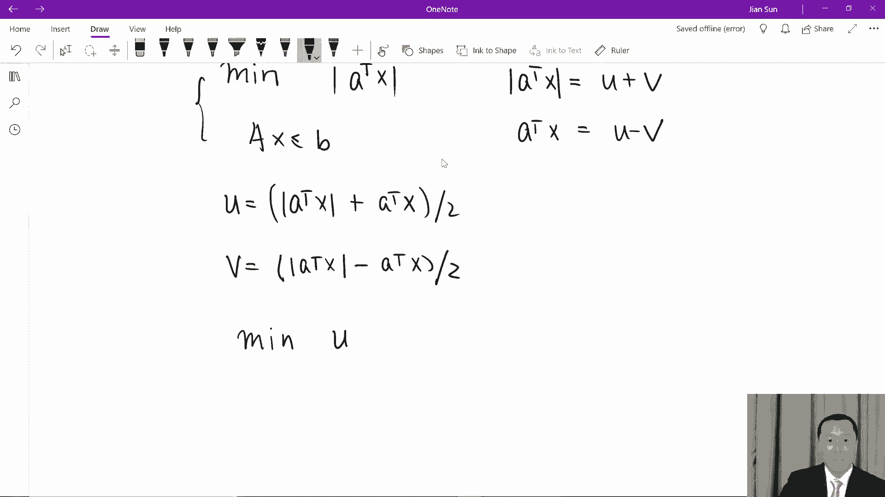

这个约束条件是ax小于等于b不能仅此，还有一个约束条件呢，就是a转置x等于u减b所以说现在呢我们会看到我，我们把加了绝对值的问题呢，仍然可以用传统的线性规划表示出来，只不过在传统的线性规划里面呢。

我们就变成在这个里面minimize的时候，其实我们看看是针对谁来做minimization，我们这里把它写大一些，其实我们就是在所有的xuv中来寻找所有满足条件的，让u加v最大的。

那么约束条件呢就是把它扩扩张了，是ax小于等于b，同时呢这个小a的转置乘以x还要等右键v的哪些条件，这里面呢大家就注意到啊，你要把它转化成标准的线性规划的问题的时候。

你还得把下面整个这个约束条件用一个更一个矩阵把它表示出来，在这个矩阵里面是关于x u和v的这样的一个矩阵，关于线性规划呢，我们就讲这么多，这个线性规划跟我们的机器学习有什么关系。

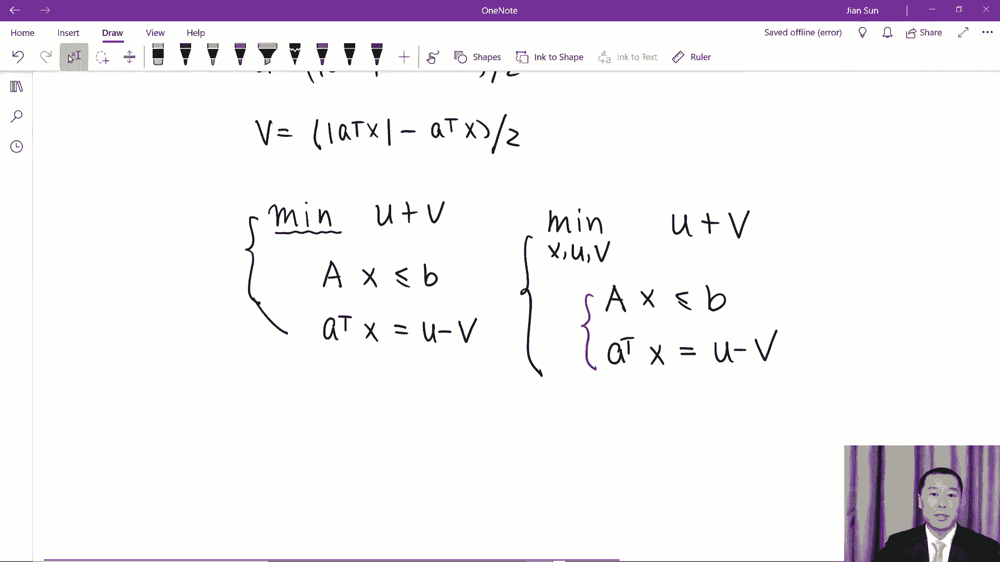

现在我们来说一下，我们上一节课不是讲过感知机的模型吗，而而且我们看到感知机的模型，可以帮助我们处理平面上点击分类的问题，但是感觉机的模型有个要求，就是平面上的这些点呢本身它就是已经是可分的一个呃。

一种颜色的点和另外一种颜色点本身它就是可分的，但但是我们往往看到的是，这些点之间是不可分的，如果你发现在我们的一个平面上，这些点它并不是说可分的，这个时候感知机的模型就不可用，说我们有一些绿色的点。

在这个地方，又这些红色的点，它们之间是有一些，比如说他们之间有一些交集，显然这个时候你拿一条线性的函数是已经无法把他们俩区分，这个时候该怎么办呢，我们现在呢就给大家提出啊。

就是用一种借助于线性规划的方法来解决这样的一个问题，怎么那么借助于怎么解决这个问题呢，我们还回到我们上节课使用的记号，我们使用的记号是x1 y1 ，一直是x n y n，这个yi呢取值呢正一或者是-1。

我们的目标本来我们感知机的目标是去寻找，一个w是rk的一个向量，它的符号和y i是完全一致的，所以我们用这样的方法来写，我们现在来看看这样的一个问题啊，怎么使用线性规划来做，第一我们来看看这个条件。

既然如何，我们能够找到这个w，使得这件事情对所有的爱成立，那么因为爱是有限多个吗，就是从一到n吗，那我们一定能够找到，如果这件事成立，那么就一定存在这个w，使得呀这yi乘以w转置乘以x大于一成立。

对所有i成立，不过呢我们在这里就是把那个w把它延展了一下，指的呢它不是指大于零。

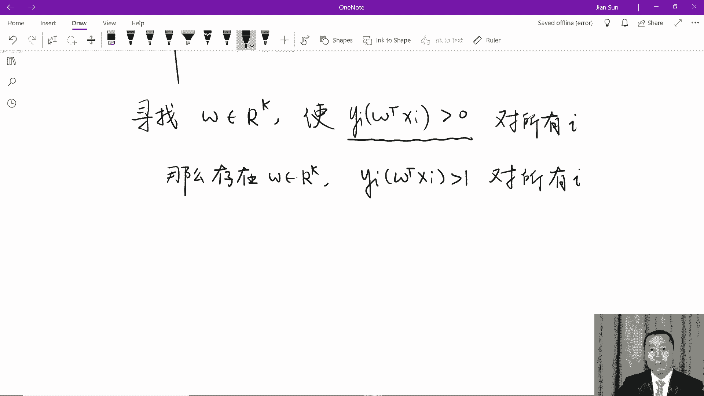

大于零大于一，这样一来呢，咱们原来的这个问题就可以叙述成一个新的问题，这个新的问题呢就是说，我们的新的线就是把它阐述成一个线性规划的问题，这个线性规划的问题就是说什么东西呢，你会发现我们什么都不去。

minimize满足约束条件，那我们要求满足满足什么约束条件呢，对所有的爱成立，所以呢因为这个约束条件是个线性的条件，我们马上就可以用矩阵的方法把它写出来，但是呢仍然是一个线性规划问题。

也就是在这个线性规划里面，我们没有目标的极值函数，只有约束的条件。

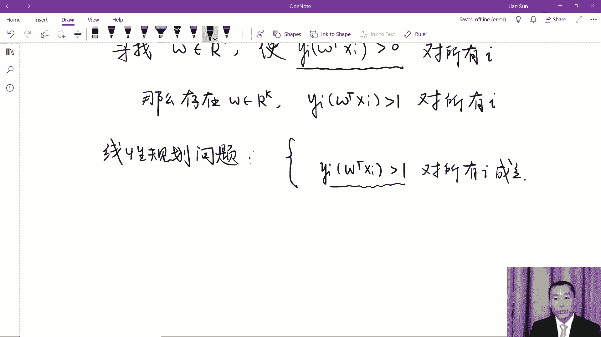

这个是线性规划问题仍然是可以解的，那我们现在首先呢咱们把下面的这个条件呢。

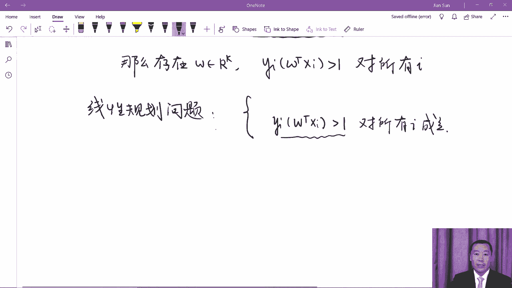

把它转化成一个矩阵的语言，我们看一看这个外i啊，它当然就可以写成yi xi的转置乘以w对吧。

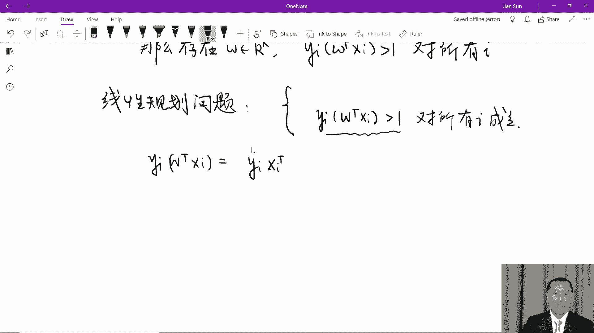

好定义一个新的矩阵，我们定义这个新的矩阵，我们比如说叫做a这个a是这样是y1 x一的转置啊，y2 x2 的转置，一直到这个这个y n x n的转置，你看这就是一个mn乘以k的矩阵，它有n列啊。

它有n n行，一共有k列，这是一个n乘以k的矩阵，那w呢是k乘以一的，或者是k乘以一的，是rk中的一个向量，所以说刚才我们这个写法呢本质上就是说a乘以w大于一个新的向量，这个新的向量呢比如我们就叫l吧。

这个l呢是一个新的，分为向量。

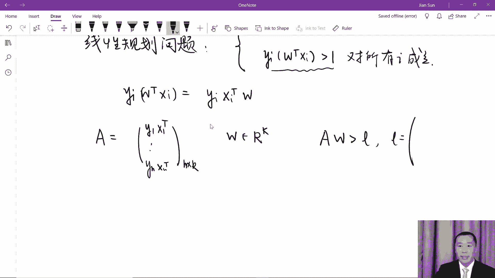

它每一个都是一，所以说这个线性规划问题呢就是纯属于一个纯粹的约束问题。

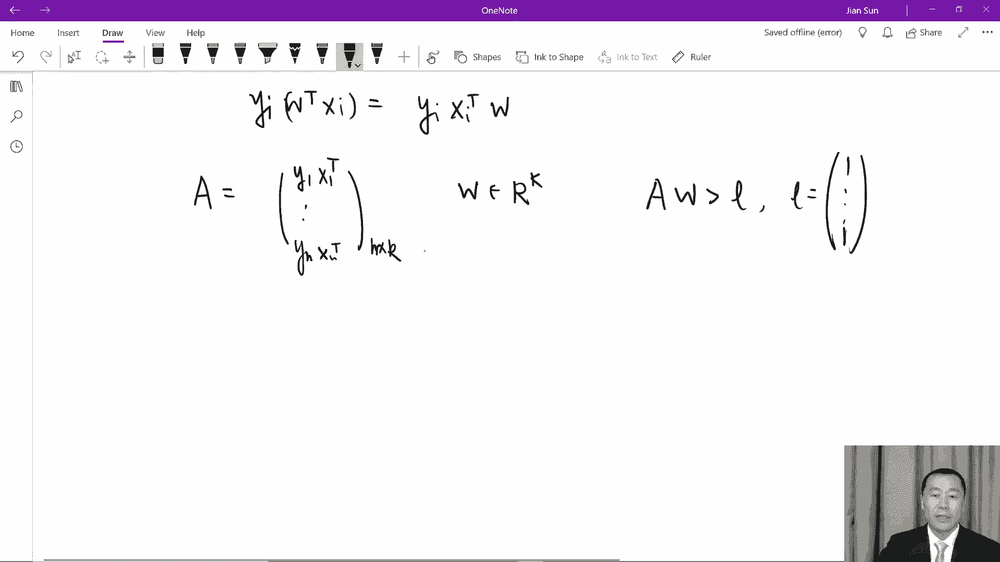

这个纯粹的约束问题就是让w大于l，或者我们可以写成负w小于负的l这样的一个问题呢。

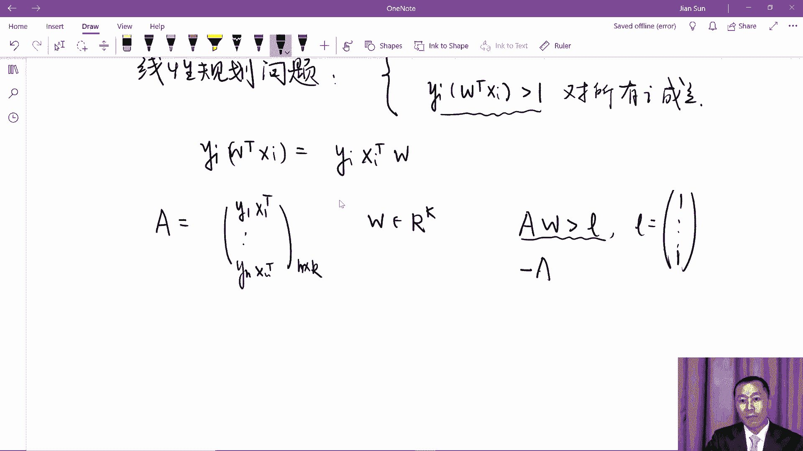

你去调取现金规划的软件包，它就可以给你解出来，你看如果我们不用感知机的问，不用感知机，我们直接去调取线性规划的软件包，把我们这个约束条件带进去，可以迅速的把w如果存在的话，就把给我们找出来。

但是感知机会看到平面分类的问题，在可分的情况下。

你就可以用线性规划了，如果点不可分，但是点击它不是线性可分的，怎么办呢，我们来稍稍改一下，我们本来原来是希望yi乘以x a的转置乘以w大于一，那现在就不能让它大于一了，需要让它大于。

可能要求绝对的大于一，而是大于一个cos i，这个cos i呢是一个正数，所以你看如果cos就是零的话，那么现在就相当于跟以前一样，就是让它大于一，因为这个cos很大的话，其实我们就已经放松了。

要求我们就已经没有让它大于一，我们说一个小一点的数也行，如果这个cos很大呢，就相当于说我们说它是负的也行，这样一来的话，我们要求这一点，我们肯定如果说我们仅仅是说这是我们的要求。

那这个可3i如果很大的话，那我们的要求就很少很低对吧，所以我们肯定是希望，一个可爱呢不要太大，这样一来的话，我们就希望在所有满足上面那些条件里面去，我去minimize，这是什么呢。

minimize cos a的和呀i等于一，一直到n这是对于所有的那些w去mini这件事情。

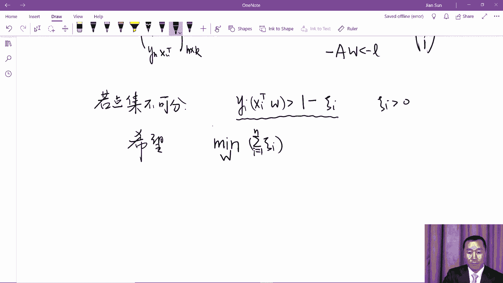

我们来看这又是一个线性规划的问题，这个线性规划的问题里面具有的啊，这还得加上一个，就我们还有一个条件，就是要cos大于零，所有的cos i都要大于零。

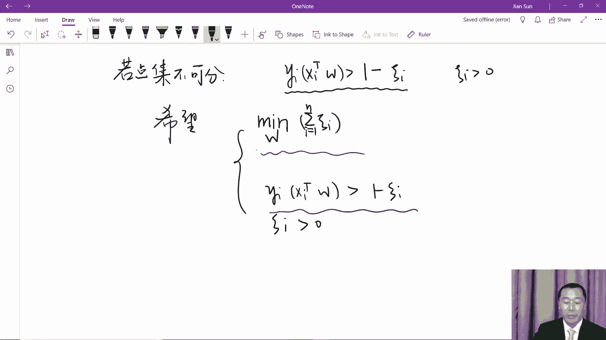

这个线性规划问题里面去，我们看看谁是自变量啊，它的自变量其实就是说我们要minimize，不仅是w还有对于所有的cos i去寻找所有满足约束条件的w和cos i，这个约束条件呢就是可s大于零。

以及上面这个约束条件满足，我们要去小化所有。

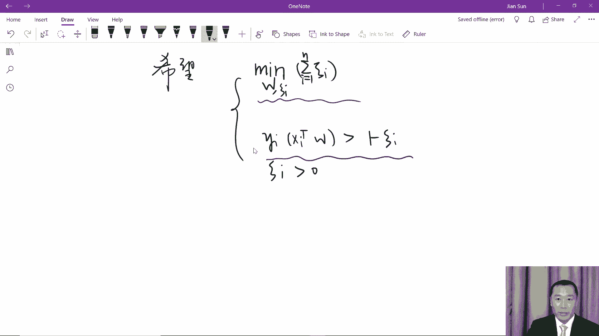

可是爱的和这个问题，大家因为我们表示出这个问题来，我们直观地表示出来，但为了使用线性规划的软件包，还需要把这个问题转化成为规划软件包所为腰的这个问题，也就是说呢大家要做这么几件事。

第一电视呢把上面这个啊用就是用我刚才说的，应该用什么a的转置乘以cos的形式表示出来，但你要去定义什么是这个a啊，然后下面这个约束条件你要用a啊这个条件，这个w和cos放在一起，小于等于b的形式上面。

其实也是应该w跟cos放在一起，所以本质上呢你要定义一个，使得你这个向量转置乘以w跟cos呢要去mini mize，它，下面呢你要去找出合理定义的这个a和b是的，你的约束条件是等价于这样的一个约束条件。

这就是我们使用线性规划的方法来去处理，当你平面上的点击可能不可分的情况下，我们要做的事情，接下来大家会在作业里面看到，要求你们使用线性规划的方法来处理不可分的点击，我们今天就暂时到这里。

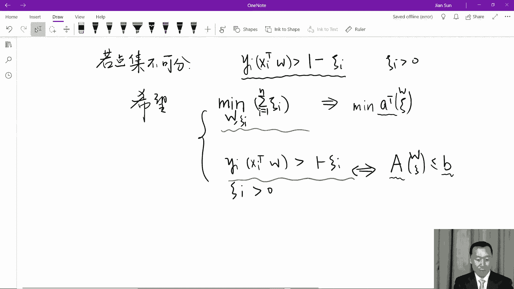