# P4：Lecture 4 Linear Regression - ___main___ - BV1fv411r7z1

大家好，欢迎我们来到咱们的机器学习的第4讲，我们今天要讲的是一个很传统的，但是应用非常广泛的模型，那就是线性回归的模型，在我们眼前我们先来看一组图，这组图对于我们学金融的同学来讲，是应该比较熟悉的。

这组图讲的都是一些股票之间的关系，咱们先看第一个图，在这第一个图上，显然我们在这个二维平面上有一些点，这些点就构成了这么一个散点图，那么在这个平面上，X轴和Y轴分别对应了什么呢。

X轴其实对应的是上证 宗指 每天的收益率，Y轴是对应的在第一个图里面，就是互生300指数每天的收益率，所以在这个图上其实是两个指数的收益率的散点图，所以每一个点其实都代表某一天。

那么这个点它的X轴就代表那一天上证宗指的涨跌幅，比起前一天的收盘价，那么那一点的Y轴就代表着比起前一天的收盘价，互生300指数的涨跌幅，也是从前一天的收盘价到今天的收盘价。

所以每一个点都代表着这么一天两个指数的涨跌幅，我在这里是截取了从2010年一直到截止到昨天，所有的点构成了这样的一个散点图，我们看到这个散点图非常排列 非常的有序，就像是在一个直线上。

显然如果说我们任何一个人看这个图给我们的第一印象，就是所有的这些每一天的涨跌幅，那么似乎它们都坐落在一个直线上，这个直线当然有一定的斜率，但这个直线而且是过原点 非常规则有序。

这是我们给大家看的第一个图。

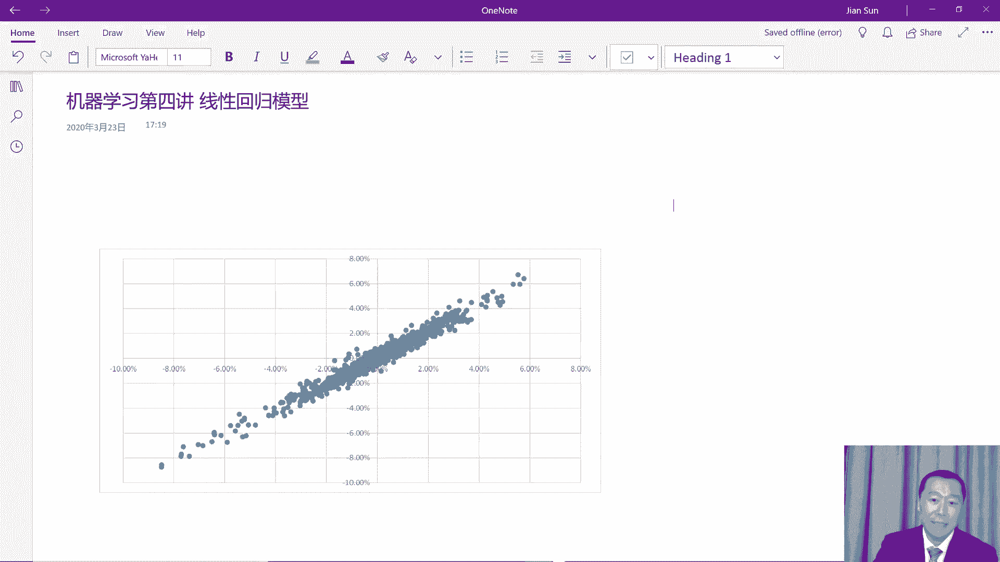

那接下来咱们看更多的，下面是第二个图，在这个第二个图上它就没有那么规则有序了，那我可以告诉大家第二个图上仍然X轴，是代表着上证宗旨指数的每天的涨跌幅，但是纵轴它其实是代表着一个股票。

在这里我是用了一个银行的股票，其实就是华夏银行，所以我们用了华夏银行它每一天的涨跌幅，跟上证宗旨做了这么一个散点图，这样一看所有的这些点显然没有刚才，互征300和上证宗旨构成的那个散点图。

那么的井然有序，但是看上去它们也似乎也能够在一条直线，它不是说坐落在一条直线，至少它散落在这条直线的周围，我们看上去也算是马马虎虎吧，好 那么我们再看第三张图。

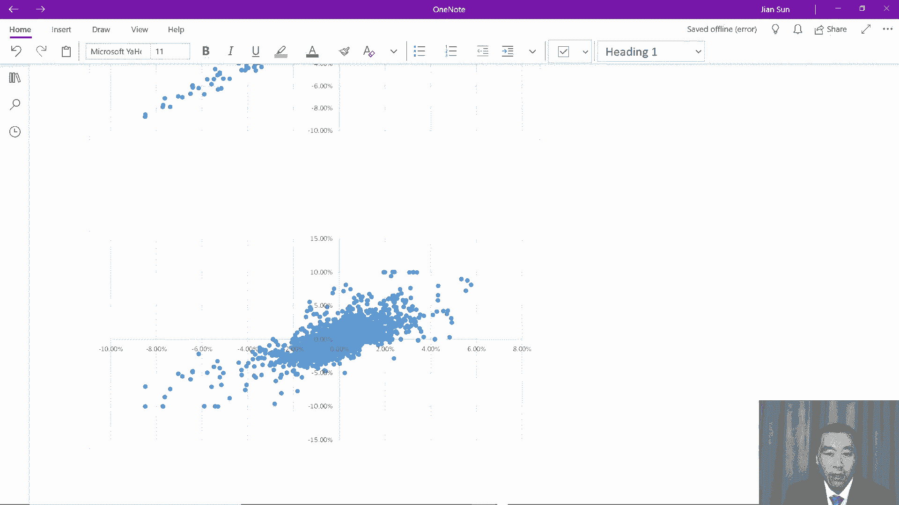

第三张图就更散了，在第三张图中X轴还是上证宗旨的指数，纵轴是另外一个股票，我在这里是用了一个华谊兄弟，那么你看另外这个股票华谊兄弟，Y轴对应它的每天涨跌幅，它似乎被这个上面和下面都被截住了。

那我告诉大家上面的就是正的10%，下面的就是负的10%，熟悉中国A股市场规则的同学都知道，那是因为A股它有这么一个涨停和跌停的限制，也就是说每天涨不能够超过10%，跌也不能够超过负的10%。

那我们可以想象如果没有这个限制的话，那我们这个节点就会分散的更散，那它就不可能被底下的10%和上面的10%所截住，那它很可能向外轴的上下两个方向，进一步的去延拓出去。

那总之我们看上去所有的上证宗旨和华谊兄弟，我们做出这个散点图就很难想象，那么它们之间必然是坐落在一条直线上，这就是咱们看到的股票，常见的这个股票，但无论如何虽然它们并不在一条直线上。

但是我们在金融中仍然希望用一种线性的关系去刻画它们，其实这种在我们日常生活中是蛮符合我们直觉的，比如说你买了一些股票，这些股票在你的自选股，你可能有这么一个看股票的这么一个软件。

无论是万德也好 杂志会也好等等，你有这么一个软件，每一天你有这么一些自选股，但假定有这么一些天，你不去看你自选股它的收益如何，你唯一看到的是整个上证宗旨的收益如何，你看到上证宗旨的收益如何的时候。

恐怕你也能够大概率的猜出你的自选股表现的如何，特别是在一些极端情况下，比如说今天市场大涨或者市场大跌，你不去看你的自选股，你也能够猜出你的自选股大概率表现的如何，这就是因为你的自选股虽然不是指数本身。

但是它跟指数仍然有一个密切的关系，在金融中我们都熟悉有一个著名的理论。

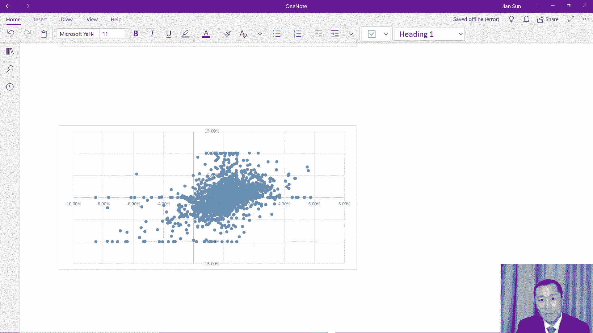

就是KeyperM理论，KeyperM理论就是把刚才我说的这个关系。

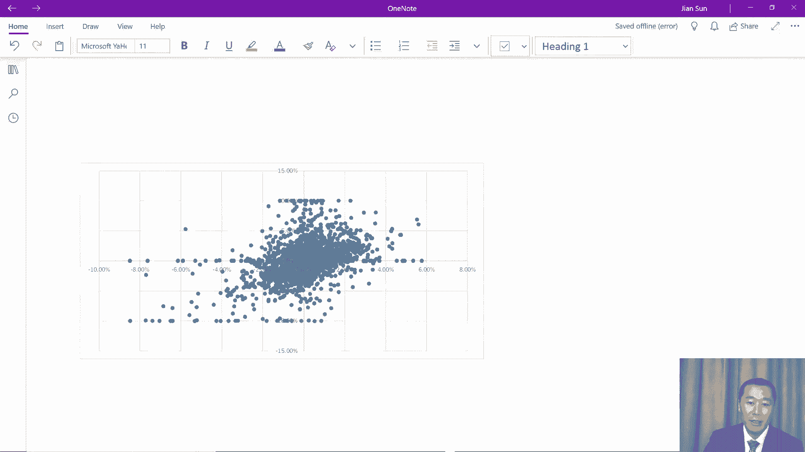

比较精确的表达了出来，我们看一下，KeyperM理论说的是什么，如果说咱们下面有一个S代表某一个证券，或者说咱们就直接说某一个股票，我们用S来表示，同时我们还有M，这个M就代表整个的市场。

这就是KeyperM理论里面想表达的，那么股票它的收益我们用RS来表示，它可以是每天的日收益，当然也可以是周收益或者是月收益，我们用R下标M来表示整个市场，它的日收益周收益或者是月收益。

那你说股票它有具体的数值，那你说代表市场的这个M怎么办呢，那我们用整个市场的指数了，我们可以用上证宗旨了，我们也可以用沪深300指数，总之它能够比较全面的反映市场的这个指数，在这里都可以。

那你说进一步的在马可韦茨投资组合理论，其实这个M还代表一个最佳投资组合，不过我们在这先忽略，就是马可韦茨的投资组合理论里面，对这个所谓的市场指数它的刻画，我们就说在这里它就是一个。

类似上证宗旨这样的一个指数，好 这是股票市场，同时我们还需要一个参数，就是小的r，这个小的r就是代表无风险收益率，无风险收益率，无风险收益率，那么开BAM它是说，市场股票减去无风险收益率。

和市场的收益减去无风险收益率，之间有这么一个β的关系，也就是说股票超过无风险收益率的部分，我们叫做超额收益，等于β乘以全市场的超额收益，再加上一个什么项呢，噪音项，这个噪音项呢。

比如说我们叫做ε底下下标是s，表示这个噪音呢，就是关于这个股票自身的这么一个噪音项，这个噪音项可以说它的期望是0，也就是说确实是个噪音，进一步呢，一般呢，人们还通常去假设呢，这个噪音呢。

就是股票和股票之间的噪音呢，是相互独立的，而且这个噪音项呢，跟全市场的这个return，跟这个r m也是独立的，所以说这纯粹就是个噪音，摆在我们眼前的这个公式啊，这就是κm的公式所想描述的。

其实它想描述的就是说，股票的超额收益和市场的超额收益之间，能够具有这样的一个线性关系，我们从这个线性关系中。

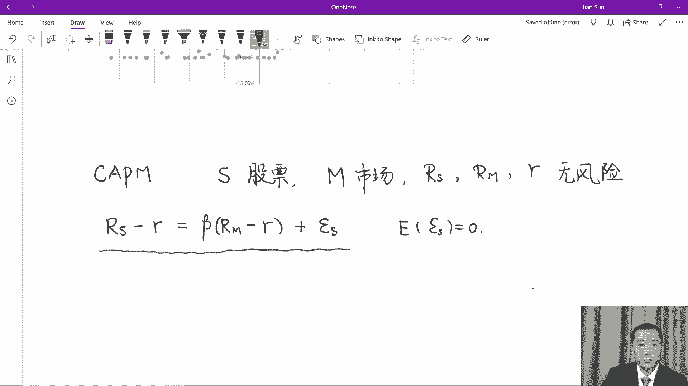

我们就进一步的看到，如果我们两边求期望，所以说这面就是股票收益的期望，减去无风险收益的部分，它就是β，这面就是全市场的收益期望，减去无风险的部分，噪音项呢就没有了，因为噪音项的期望是0，好。

这也是κm所试图建立起来的，就是我们学金融的同学都知道，就是单独证券它的超额收益，和市场的超额收益之间，只有这么一个β系数，换句话说呢，从另外一个角度来说呢，就是所有的股票之间，它们的收益呢没有α。

只有所谓的β，这个是κm理论，那么我们再从呢回归的角度，也就是从刚才我们做的散点图的角度，再进一步的看一下这个公式，如果我们不取期望，我们把这个噪音保留着，那么我们再把上面的这个公式，重新写一下。

那就是rs=ββrm，加上这边就是1-ββr。

当然你再加上一个噪音项，好，现在呢我们就看到，从散点图的角度我们去直观的看，在这个等式的里边呢，就是说左边呢就是股票每一天的收益率，那么等式的右边的第一项呢，那就是市场的收益率，那每一天的收益率。

那确实它并不是完全的在一条直线上，它们之间呢会有这么一个噪音，如果没有这个噪音的话，那么剩下的部分，那就会说股票的收益和全市场的收益，就确实在一条直线上，然而有了这个噪音之后呢。

股票的收益就会坐落在以β为斜率，同时呢还有这么一个结句，后面还有一个结句项，就是1-βr的这个结句项，所定义的这一条线性直线的上下两端，有这么一个产生了这么一个噪音项，好 这就是K-PAMP理论。

从K-PAMP理论呢我们也看到了，我们上面这三个图试图想说明的问题。

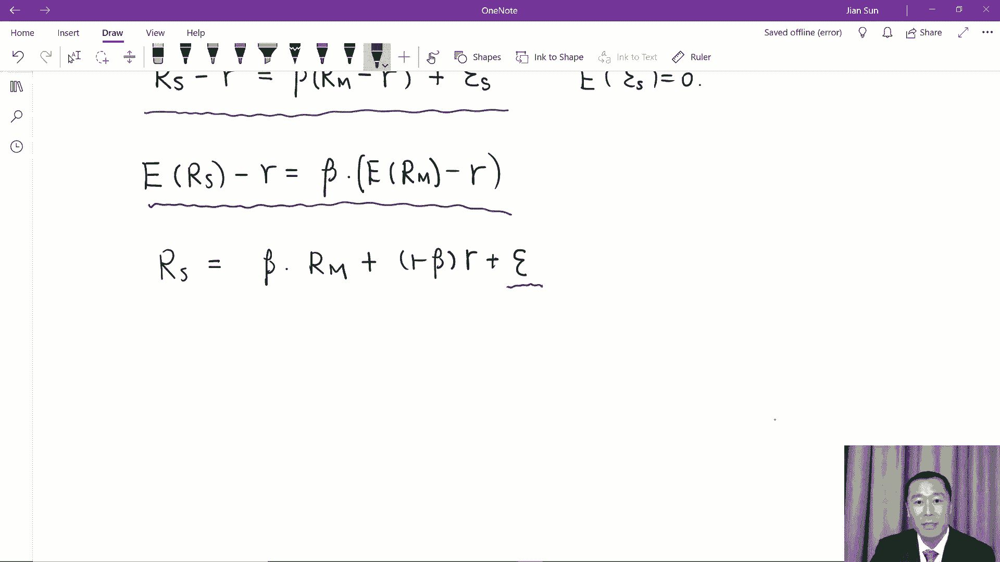

这三个图里面想说明的问题呢就是，每一个特定的证券，它和全市场之间呢，成一种类似线性的关系。

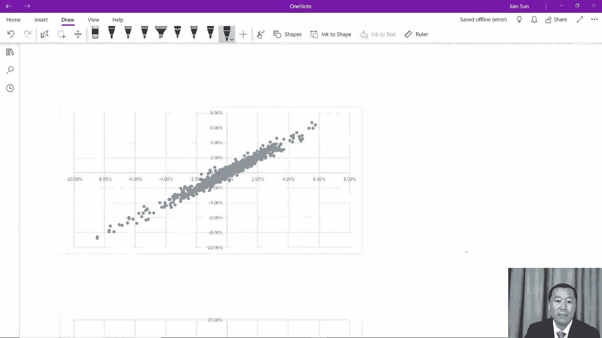

但是呢由于特定的证券和市场之间，有不同的相关性，所以有的时候呢β比较大，有的时候呢β比较小，这是关于β，关于噪音项我们也看到，有的时候特定的这个股票呢，所形成的噪音比较大。

或者有的时候呢形成的噪音比较小，那比如说我们就看噪音项，那显然在第一个图上，就是沪生三百和上证宗子，他们之间的噪音项非常的小，这就是为什么他们严格的在一条直线上。

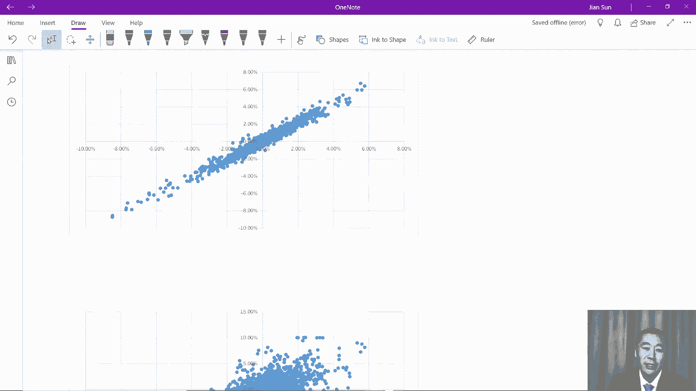

但是接下来的两个股票，华夏银行到了华谊兄弟，显然他们的噪音项是一个比一个大，所以呢可能会有这么一条直线，但是由于噪音的原因，使得他们偏离了这条直线。

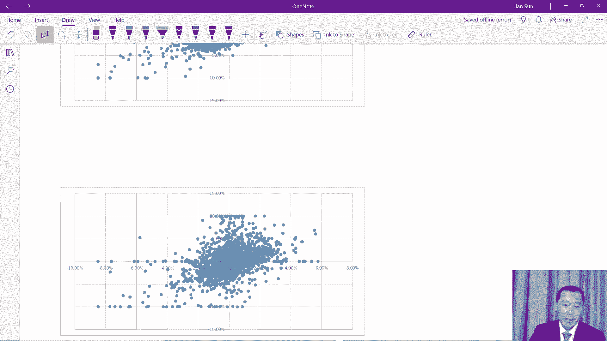

我们现在的目标呢，线性回归呢就是通过散点图，我们试图再把他们的那条直线再找回来，这就是线性回归所要解决的问题，我们现在呢来严格的定义一下，在机器学习框架中，线性回归的问题是什么。

换句话说呢就是我们给定的数据是什么，我们想在什么样的假设集合中，去寻找合适的假设，我们定义的损失函数是什么，以及最后我们的算法是什么，这就是我们今天从机器学习的框架下，来学习线性回归的这样的一个过程。

我们首先看给出的是什么。

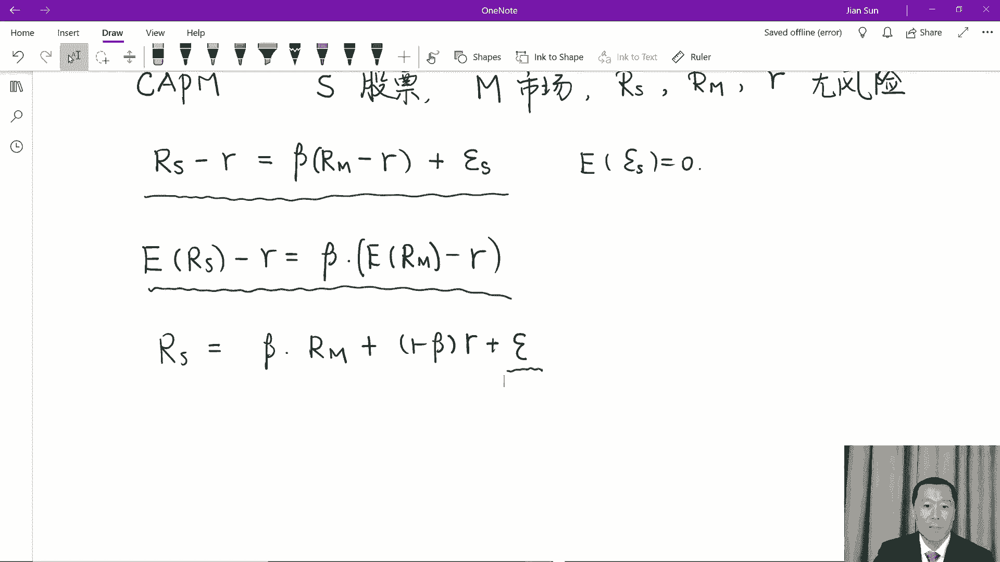

机器学习的框架永远都是，我们先看样本级的数据，给出的数据都是带标签的数据，X1 Y1 X2 Y2等等，一直到n个有限个数据点到n个数据点，每一个X呢都是RK空间中的一个向量，在我们刚才我们可以想象呢。

每个X其实是在R1空间，反正我们刚才考虑的是一个很低微的空间，一般我们可以考虑在一个RK空间，绝对不拘泥于说一定是在R1空间，那么这个Y呢，不同于我们前几次讲的分类问题，前几次讲分类问题的时候。

我们试图把平面上的点分成两种颜色，其实现在我们需要Y可以是一个连续的变量，所以在这个Y呢它就是R，可以取任何的实数，所以我们的机器学习给定的数据，是这样的一组数据，数据特征是RK空间的向量。

数据它的标签或者label不是离散的值，而是可以取比较连续的值，任何的一个实数都是可以取值的范围，所以这些是给出的数据点。

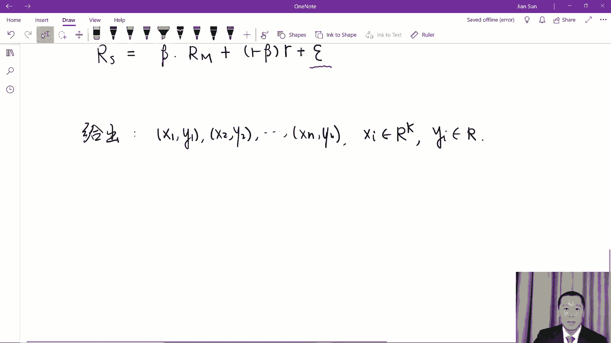

同样我们的假设呢，我们想在什么样的，就是说我们去寻找什么样的函数，来描述X和Y之间的关系，还是从线性集合中考虑，也就是说我们考虑所有的那些W，W呢也是RK空间的一个向量。

同时呢线性我们还得再加上一个常数，所以我们还得再加上一个B，它也是一个实数，好 给了这两个数据之后呢，我们考虑的假设，我们考虑的假设呢就是F，其实F呢是依赖于W和B的，那么它作用在这个X上。

就是X的转制乘以W加上B，就是一个线性函数，作用在任何RK空间的这么一个向量X上，它就等于X和W的内积再加上一个常数，所以你看我们的假设集合，不是在非线性函数上去求解。

我们的假设集合还是跟咱们前面的感知机一样，我们是试图在所有的线性函数中去求解，好 咱们再从看了假设，我们再看损失函数，这一点呢我们就遵循我们在多项式逼近，第一讲里面讲到的。

我们看看什么样的损失函数适合最简单，而且适合我们去对它进行优化，这里的损失函数就是我们所熟知的L2的损失函数，怎么定义呢，这个损失函数呢我们用H来定义，在每一个给定的数据点上。

这个损失函数就是F在X上的取值，和Y的X的平方，你看我们没有因为这里不是分类问题，所以我们没有用那些离散的损失函数，离散的损失函数就包括说比如说FX和Y，它们的符号一样，我就说这个时候就是没有损失。

如果符号不一样呢，我们就说这个时候是有损失，在我们在这里Y是可以取一个连续的值，所以我们在这里损失函数显然，我们想一想如果我们把定义成FX=Y，我们就是说这个就没有损失，只要不等于Y那么它就有损失。

如果是那样的话恐怕我们找不到任何一个假设，能够真正的去优化我们的损失到极小，不可能因为使得我们一个函数使得FX正好等于Y，在所有的线性函数类里面，如果我们不去说扩大到所有的多项式，仅仅在线性函数类里面。

那很可能是找不到的，所以在这里我们让损失函数就是一个平方，它和Y的距离越大我们说损失就越大，那它和Y的距离就是平方的来定义这个距离越小，我们就说这个损失也就越小。

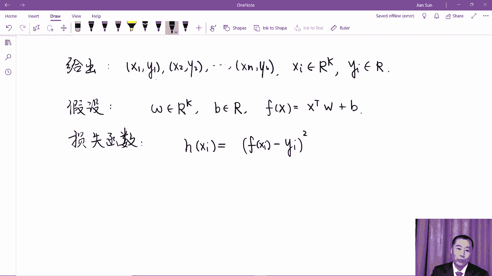

这是定义在一个点上的损失，那当然整体的损失函数，也就是说我们有的时候就用整体的，在我们给出的整个的这个点上的集合，它的损失函数我们就可以定义成，我们就用F吧，或者是更精确的，它是依赖于W和B的。

那这个损失函数就是所有的，就是对所有的平方和来定义我们的损失函数。

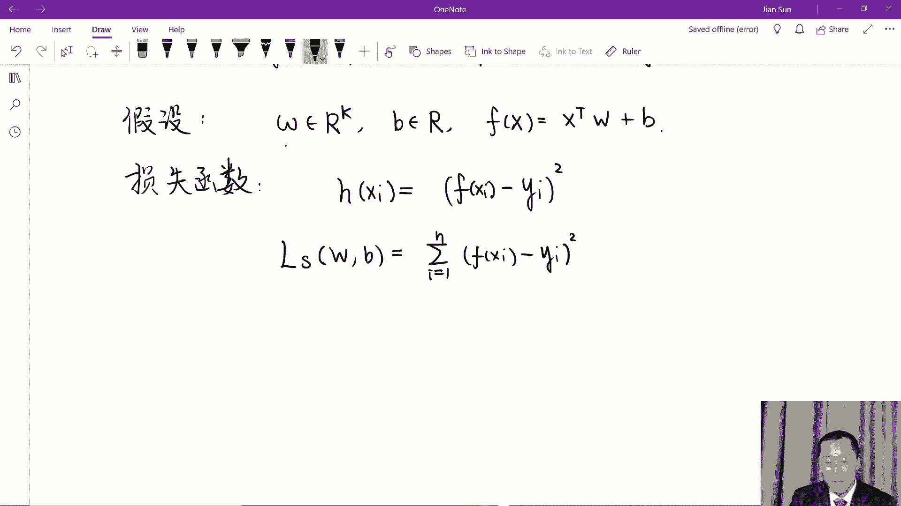

你看我们有了数据集带标签的数据集，我们限定了我们的假设集合，我们给出了我们的损失函数，那么只剩下最后一步了，如何去优化我们的损失函数到极小，我们在这里通过一些一个什么样的算法来做这件事。

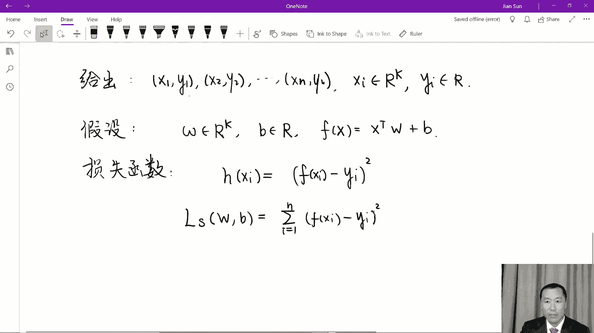

好 我们现在来看，在这里我们给出了一个算法是一种B形式解，我们之所以来取平方和，就是因为在平方和的情况下，B形式解是比较简单的，咱们在这咱们在函数逼近那一节，其实已经见到了，我们在这里再从矩阵的语言。

来帮助大家理解，为什么现行回归是具有一个B形式解的，为此我们需要调用矩阵的一些语言，我们上次其实给大家已经，复习了矩阵的相关的概念，其实就是为了这堂课以及以后的课来做好准备。

所以第一步我们需要把咱们的损失函数，转化成矩阵的语言来描述，而不是像现在完全在实数上，这个一维上来描述，我们要有在矩阵的这个更高维的，这么一个空间来描述，想办法把这个平方和转化成矩阵内积的形式。

为此我们看到咱们的函数，我们再写一下，它在XI上那它就是XI它的转制，乘以W加上B对吧，我们希望咱们的记号比较简单，所以咱们再一次的升为，大家应该比较熟悉了，我们XI前面加上1，成为XI^2。

同时我们也做一个W^2，就是W前面加上一个B，所以给定的数据集都升一维，我们要寻找的W也升一维，最后我们找到的这个W，记住第一个元素其实就对应的节句，那么后面就对应的那个法向量，好 我们为了记号的简单。

我们再忽略这个XI上面的这个Q的和W上面的Q的，假定没有这些Q的，那我们现在就来重新的写一下，重新的写一下它在定义在XI上的这个线性函数，就是XI的转制乘以W了，好 那么我们现在定义一个矩阵。

这个矩阵是由X1的转制，本来X1是一个K维列向量，现在X1的转制就成为一个K维的行向量，一直到Xn的转制，我就构成了n行，n行K列，我们把这个矩阵成为X。

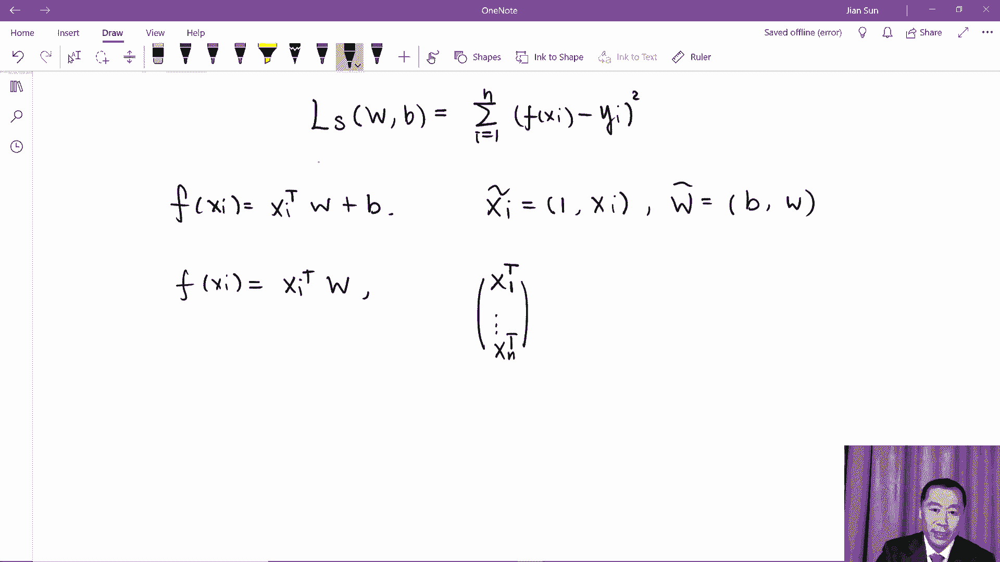

我们这样做的好处呢，就是在我们这么做了以后，那么X的W我们会注意到，X是n乘以K，W是K乘以1，所以XW它就是XK，这个K维中的向量了，好 我们在这里再提醒大家注意一下，我们这里的K已经是升为以后的了。

也就是说其实是刚才用的那个记号就是K+1了，但是我们不想再引入更多的记号，所以说大家在这里要试图分开一下，我们下面就是不用这个tutor的语言，但是我们仍然用原始的，包括K n就是W Xi所有这些记号。

但是大家心里要清楚。

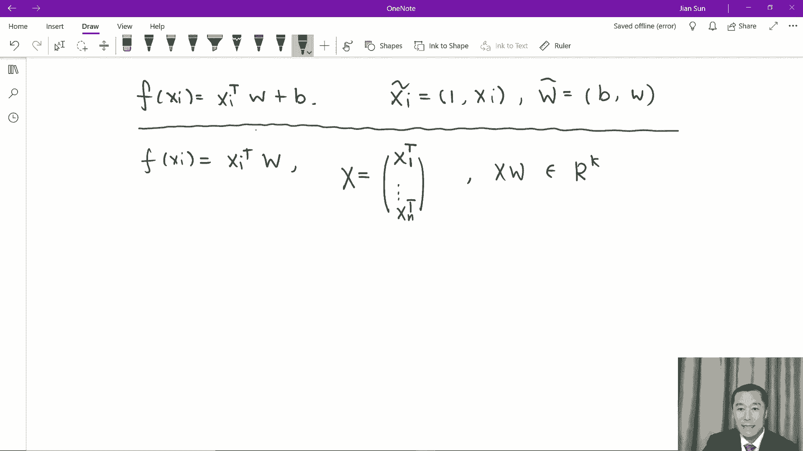

其实我们都已经做了升维了，好 一旦我们使用了这样的一个矩阵的语言，我们会看到X作为一个大的矩阵，它其实已经把所有的Xi的信息都包含进去了，那么X乘以W就成为一个K维的向量，我们同时也知道这个Y它不。

就是这个Y，我们本来是Y1 Y2一直到Yn，所以我们也把它看成是一个列向量，那么自然的它也就是Rn，这个，sorry 我刚才说错了，X是n乘以K的，W是K乘以1的，所以X乘以W其实是Xn为空间的。

不是Xk空间的，我刚才这里说错了一点，所以我在这里必须要说这是n为空间的，Y也是n为空间的一个向量，至此既然它们都是n为空间的一个向量，X乘以W减去Y当然也是n为空间的一个向量。

既然是一个向量它就可以求这个向量的长度，这个向量长度的平方就是所谓的摩长，当然它就是X乘以W的第二个分量，减去Yi它的平方和，Y等于1到n，但是你看X乘以W的第二个分量，它就是Xi的转制和W的乘积。

或者是Xi和W的内积，减去Yi它的平方，前面是求和，这不就是我们所需要的那个损失函数吗，所以你看我们说损失函数就是平方和，那么它可以写成平方和，它也可以写成是这个矩阵，矩阵和向量相乘之后。

再减去向量的摩长的形式，好 到目前为止了。

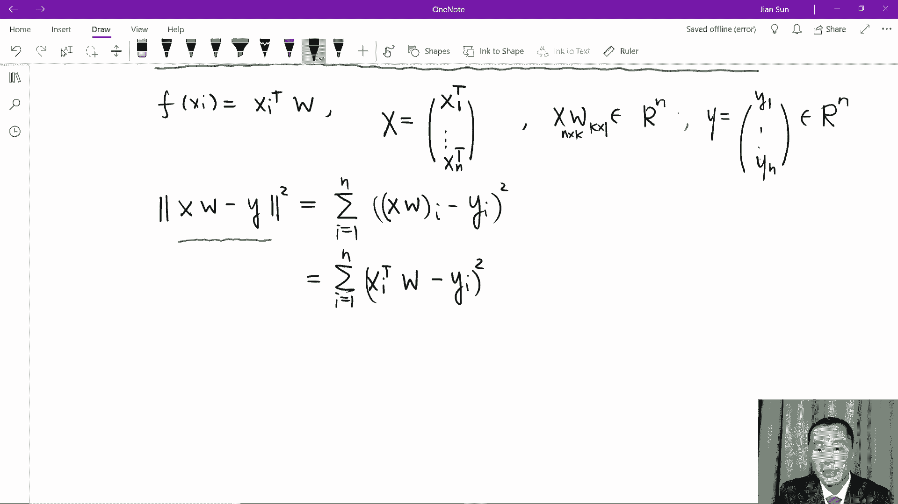

咱们就可以把咱们的优化问题叙述一下了，所以我们的线性回归就等同于一个优化问题，我们这个优化问题就是说，我们要去minimize什么呢，我们要去minimize X乘以W，减去Y它的摩长的平方。

其中我们在所有的W，它是RK空间中的一个向量，去寻找使得这个摩长最小的那个W，这就是我们的线性规划问题，转化成的这么一个优化问题，我们看看这个优化问题有没有解呢，如果有解的话，这个解又是一个局部的计小。

还是一个全局的计小呢，咱们就来看一下这个问题，因为我们已经把这个转化成，我们已经把它转化成矩阵的问题了，所以我们在这里呢，我们可以令H来代表这个损失函数，那就是XW乘以Y它的摩长的平方，你认给我一个W。

我都可以代进去就得到了一个损失函数，因为我们在这里X和Y都已经给定了，大家想一下就知道，X是一个N乘以K的矩阵，Y是一个N乘以1的向量，好 我们进一步的做一些变形，X乘以W减去Y。

它的摩长的平方可以怎么写呢，两种写法，一种写法就是XW-Y和XW-Y的内积，我不是已经来强调吗，我们可以从内积的角度去看，或者我们是从向量的乘法角度看，但如果我们要用向量乘法角度看。

我们一定要把行向量和列向量的关系搞清楚，也就是说当你需要行向量的时候，你一定要把转制写进去，就在眼前我们需要的是XW-Y，本来是个列向量，但是我们要把它转制成为一个行向量，再乘以自己。

这就等同于它们自己做内积，既然如此咱们就继续的利用矩阵，X乘以W的转制就是W转制乘以X的转制，减去Y的转制，乘以XW-Y，现在我们就继续的来乘出来，我们在这里写 空间大一些。

第一项和第一项那就是W的转制，X转制XW，第二项第一项以及第一项第二项，其实得到的值都一样，我们认减一个，你也可以用第二项乘以第一项，也可以用第一项乘以第二项，我们就用第一项乘以第二项。

所以就是减去两倍的W转制X转制乘以Y，最后再加上最后的项，就是Y的转制乘以Y，当然它也就是Y的摩擦的平方。

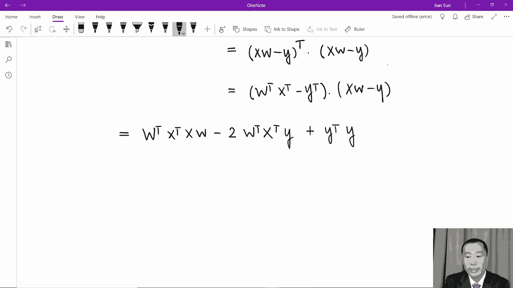

所以我们的损失函数，我们就利用矩阵的语言就写成这样了，那下一步干什么呢，我们当然是想看看这个损失函数，有没有绩效值，如果有绩效值，在哪个点能够取到绩效值。

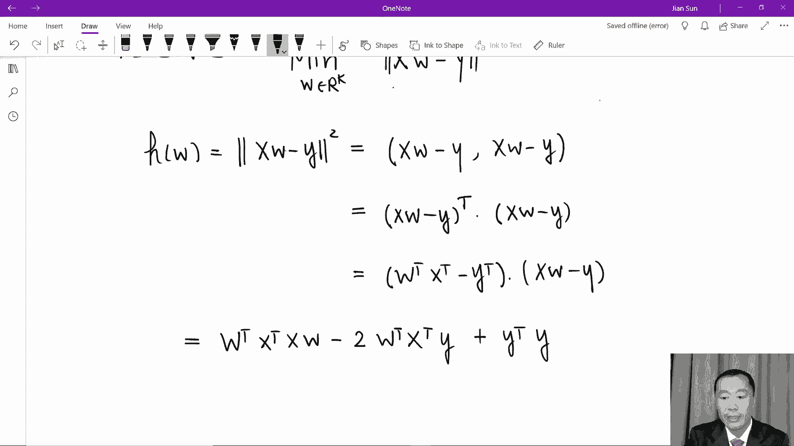

这个函数它是一个高维的多元函数，但如果说这个函数就是一个异为的函数，我们看一看，就是一种特殊情况，我们在这里写一下，就帮助我们来了解，因为学习处理数学公式，我们给大家提了一个建议。

就是经常考虑一些特殊情况以及极端情况，特殊情况就是说W，它就是一个实数就好了，我们考虑W就是一个实数的情况下，也就是W就是异为的，那这样的话呢，X就是n乘以1，那X转质乘以X呢，你比如说我们就叫做小a。

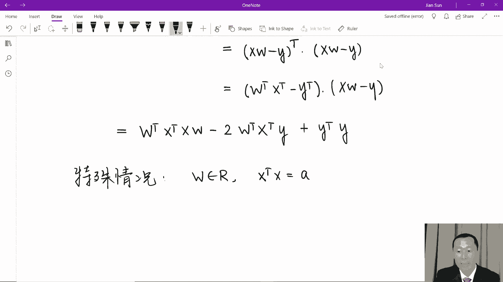

小a是一个大于0的数，第二项我们看啊，这个X转质乘以Y，比如说我们叫做B，B大不大于0我不知道，但是它也至少是个实数，那么Y的转质Y叫做C，C呢当然它就是一个大于等于0的，所以特殊情况下呢。

我们的这个HW你看一看，这不就是a倍的W平方，减去两倍的B乘以W再加上C吗，对吧，好 这是一个什么呢。

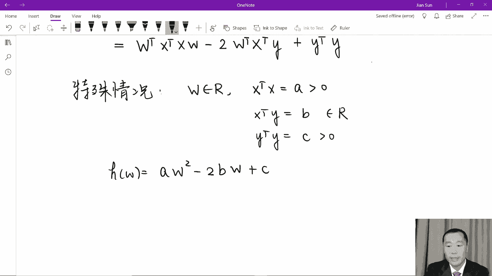

这是一个抛物线，对吧，如果我们把这个抛物线画出来，好 这是这样的一个抛物线，抛物线确实存在一个全局的极小，不仅仅说存在这个极小，而且是一个全局的极小，而且这个全局的极小满足什么呢。

也就是说你要真是去求解它，我们只需要对W求导数让它等于0，那么就等价于两倍的aW，减去两倍的B等于0，所以就等价于这个W就是在B，对 就是B除以a的地方，达到极小，所以在极端情况下。

我们看到这是一个二次的函数，二次的函数它的首相还是大于0的，就是首相的系数这个a是大于0，它是个正的，所以它是存在极小的，所以极端情况，这种特殊情况确实给了我们信心。

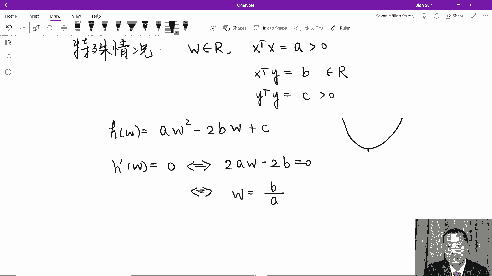

让我们来看一般的情况，就给了我们对于一般的情况它的信心，现在我们再来看，现在我们再来看一般的情况该怎么求解。

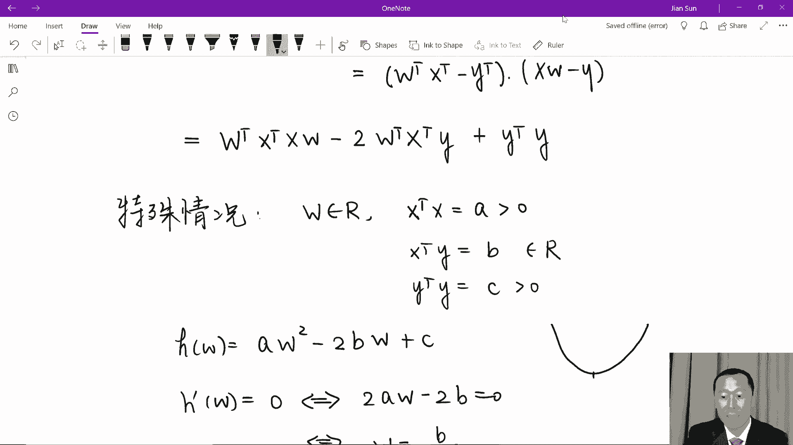

好 我们现在来看一般情况，一般情况作为一个多元的函数，多元函数也没有关系，我们都知道多元函数的极值，我们只需要不是说求一次导数，而是求所有的偏导数，或者在多元函数里我们称为去求它的梯度。

我们让梯度等于0也一样。

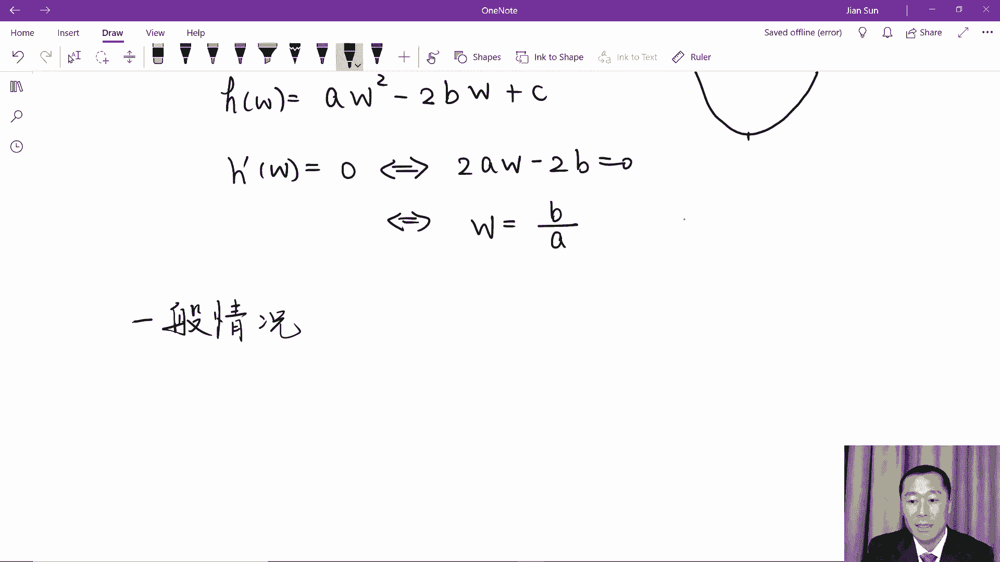

我们现在就来求一求这个梯度，这个梯度，我们现在面临就要去求这个函数，对于w来求梯度，又需要一些我们的线性代数的知识。

我们这里给大家就直接来写出来，大家回去来验证，H 我们对w的每一项。

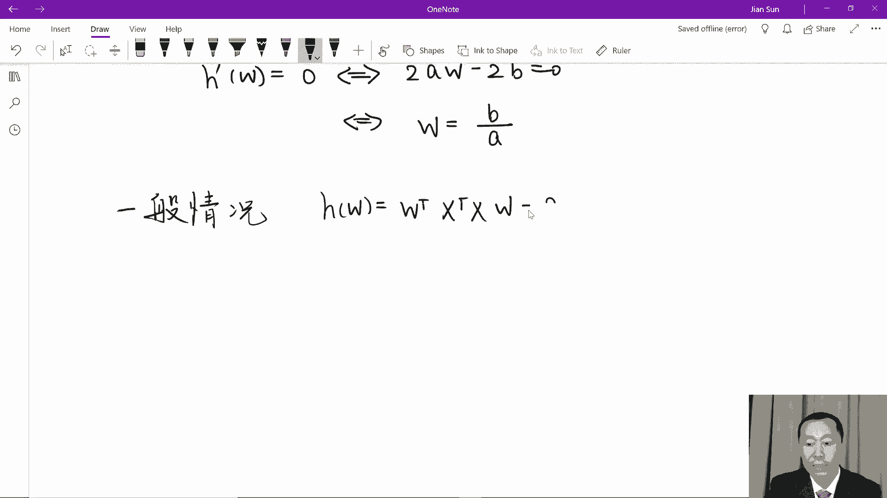

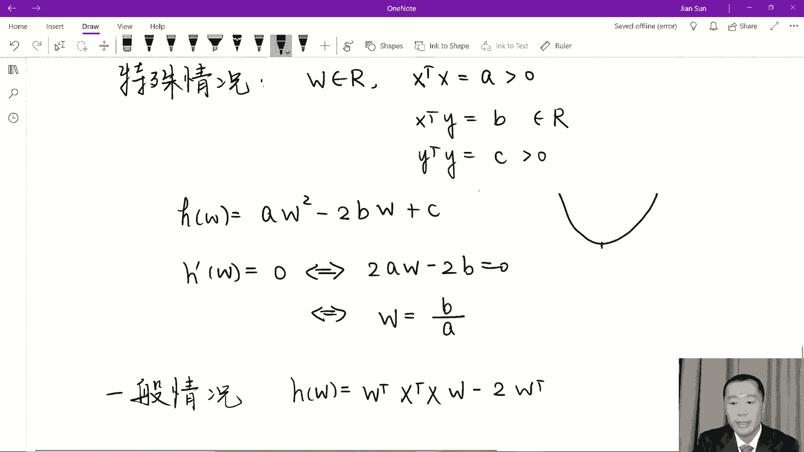

也就是说对w1 w2，一直到wk去求偏导的话，它就等于两倍的wx的转制乘以x乘以w，减去两倍的x转制y。

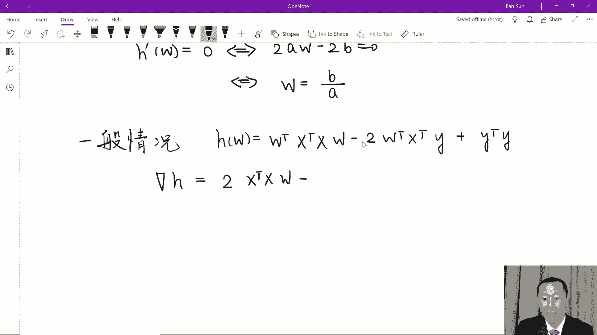

我们在这里利用了什么呢，其实我在这里标注一下，我们实际上利用了这样的一个事实，利用了是一个二次性，如果说我们有这个，写一下二次性，我们用x吧，x是一个向量，x的转制乘以a乘以x。

它对x求梯度就等于两倍的ax，这是我们利用的一件事情，同时我们还利用了第二件事，就是如果x和y分别是两个列向量，x转制乘以y对x求梯度就是列向量y，所以在这里其实是我们利用了这么一件。

这么两个事实我们得到的结果。

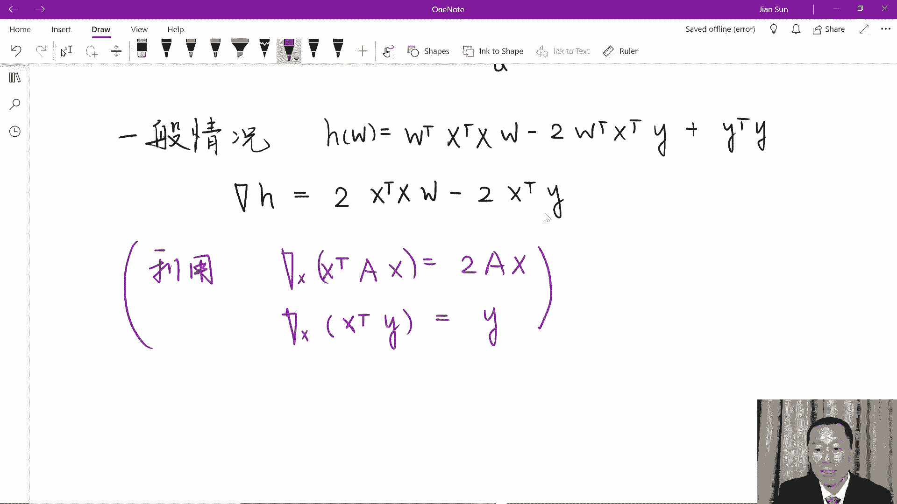

现在我们就令，这个对h对w求的梯度等于0，当然它就等价于说x的转制xw，等于x的转制乘以y，好 我们看到，在w的前面有这样的一个矩阵。

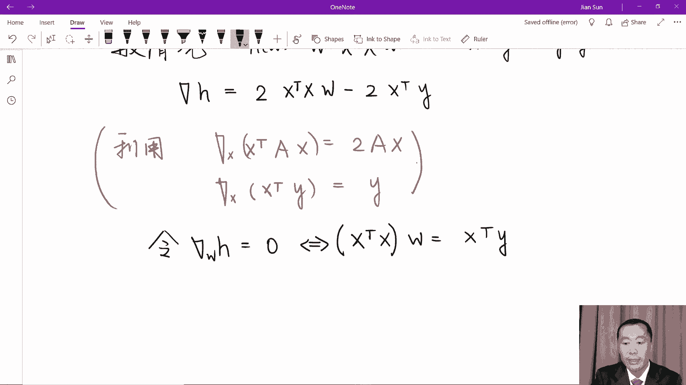

这个矩阵是x的转制乘以x，我们想一想，本来x是n乘以k这样的一个矩阵，x的转制是k乘以n这样的一个矩阵，所以x的转制乘以x就成为k乘以k，这样的一个矩阵。

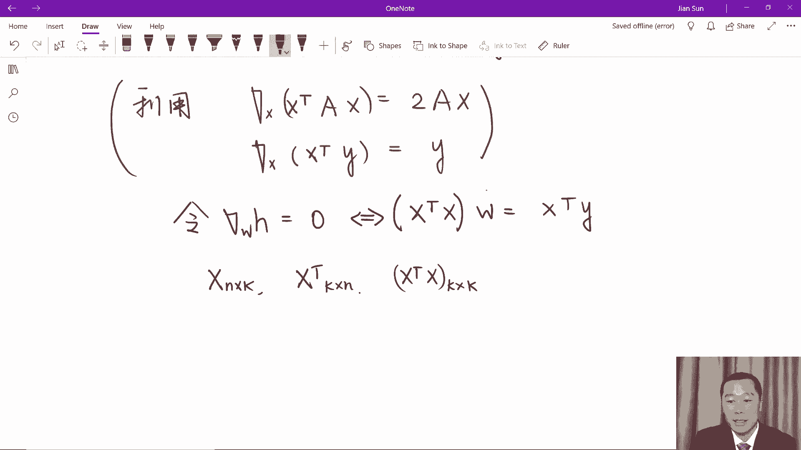

我们有这样的一个矩阵，不仅是它是一个k乘以k的，而且大家看这个形式，就应该知道这个矩阵是半正定的，一般来讲它是正定的，但是更我们为了以防它不可逆，我们说它其实是半正定的，至少是半正定的。

多半其实它是正定的，这是一个矩阵它的转制乘以自己，它是一个半正定的，如果这个矩阵再是一个满质的矩阵，那它就是一个完全正定的，那么在这里它是否是半正定和正定之间的区别，就在于这个矩阵是不是一个满质的矩阵。

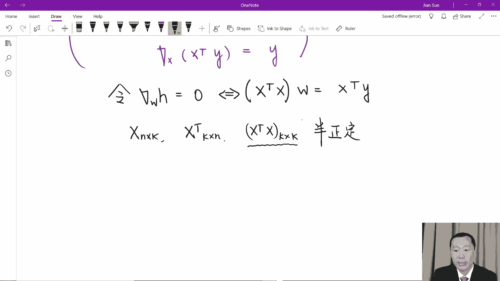

好 我们这里还要再加上一个条件，既然我们看到它可能是个半正定的，我们再加上一个条件，这个条件就是说x是一个满质矩阵，在这里满质矩阵我们看看代表什么呢，就是说x的质它的rank要等于k。

为什么要求它等于k呢，比如说我们不等于n呢，因为我们在这里给定的数据点的个数，要大大超过x本身的维度，所以如果x本身是一个k维的，我们通常给出的这个点是大大超过k维的，所以x作为一个n乘以k的矩阵。

满质就等同于这个矩阵的rank是等于k，而k呢又是远小于n的，所以这样就是一个满质矩阵，当它的rank等于k的时候，自然它的转质乘以x就是可逆的，可逆的矩阵同时呢也就是一个正定的。

正定的而且还是对称矩阵，这就是我们矩阵中的基本知识，从而刚才呢我们就可以解出来w，w就是既然它是可逆矩阵，x的转质乘以x的逆乘以x的转质乘以y。

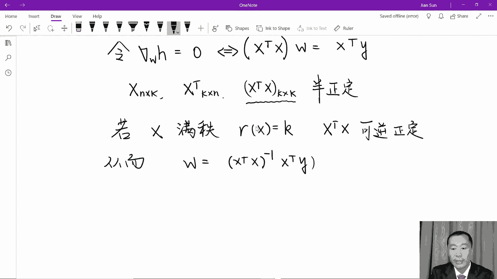

我们就得到了w的这个解，好 这就是为什么我们说呀，线性回归是完全有B形式解的，当然这个B形式解呢也是有一定条件的，这个条件呢就是说x本身呢是一个满质矩阵，但绝大多数情况下其实这个条件是得以满足的。

那万一这个条件不满足，这个B形式的解就求不可能存在，那么这个线性回归也就得不到最后的满意的，令人满意的那么一个超平面。

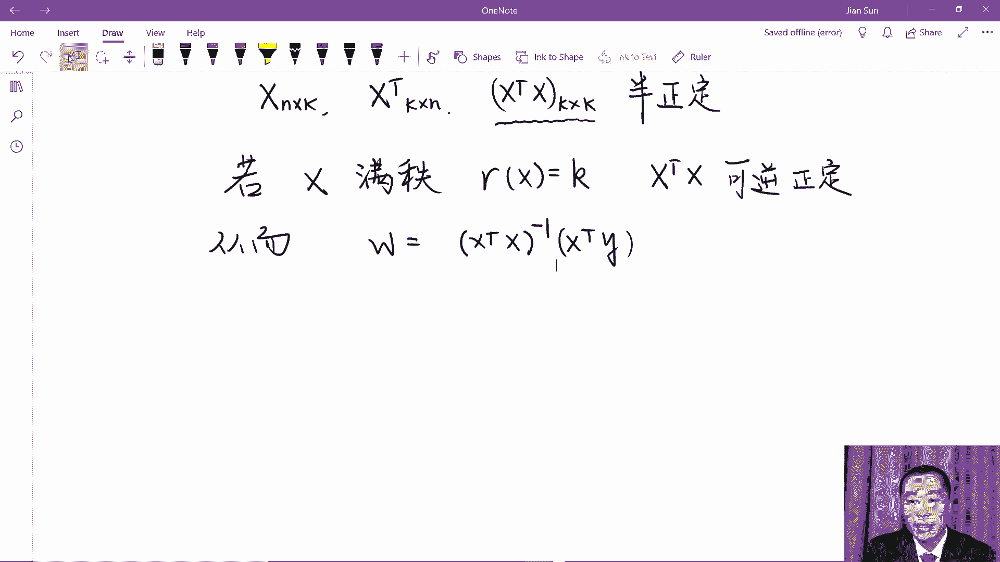

我们得到的这个解呢我们再来看它的极端情况。

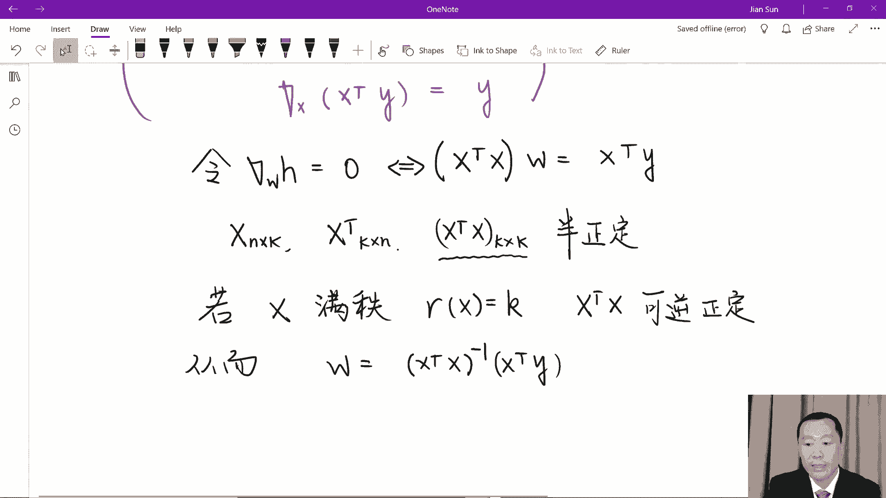

特殊情况 我们又一次来看特殊情况，我们来看看特殊情况下它符不符合我们的直觉，我们再看一种什么特殊情况呢，特殊情况我们来看n=k的情况下，虽然我们一般情况下我们说了n要远远大于k。

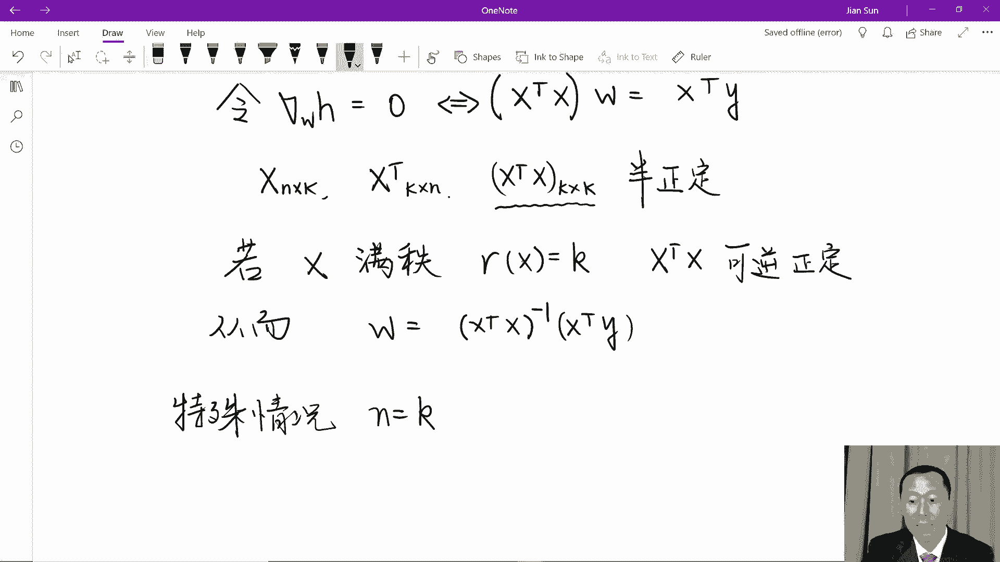

但在这里我们只是看一个极端情况，因为n=k的时候x就是一个方阵了 对吧，因为它的阶是n乘以k的，那么n和k相等 x就是一个方阵，x是一个方阵 同时呢我们刚才说了，我们假定x的质就是n 当然也就等于k。

所以说呢x就是本身就是一个可逆方阵。

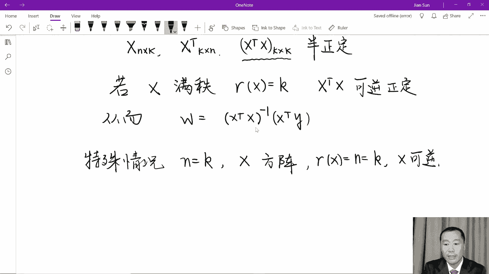

既然x本身是可逆的 那我们看一看，w根据刚才的表达式它是，那我们把这一项写差 写出来它岂不就是，中间的又可以消掉，它岂不就是x的逆乘以y吗。

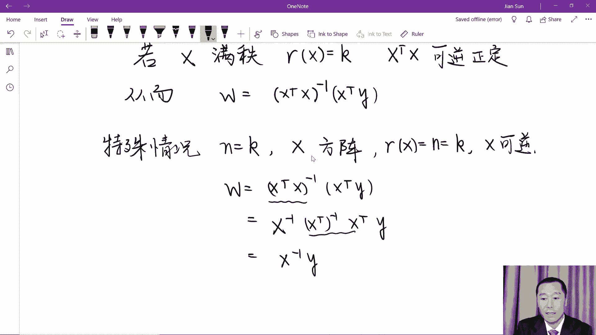

这个令我们吃惊吗 我们来看一看。

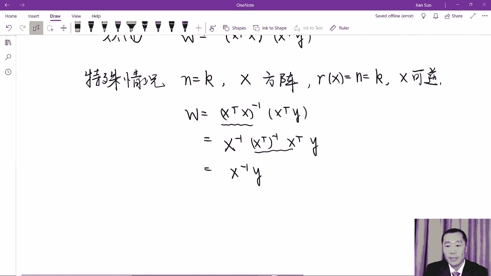

我说这并不令我们吃惊 为什么不令我们吃惊呢，因为当x是一个方阵的情况下，我们本来要去minimize的 极小化的，就是x乘以w-y的模的平方，然而x是个方阵 x乘以w=y是有解的。

这个解呢 当然就是我们眼前看到w=xe y。

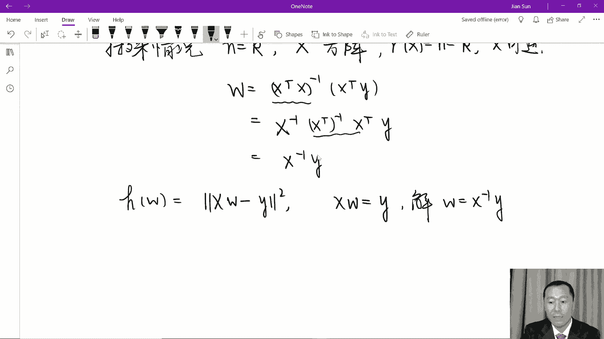

当然在这个解下 这个损失函数就等于0，你一个模的平方永远大于等于0，等于0这已经是最好的情况了，所以这个极端情况就是说，他们所有的这些 我可以取到一个w，就使得在这个w下 他们本身这些数据点。

本身就在一个超平面上，你都不用再去说它跟这个超平面之间，有任何的缝隙 有任何的距离，它本身就在一个超平面。

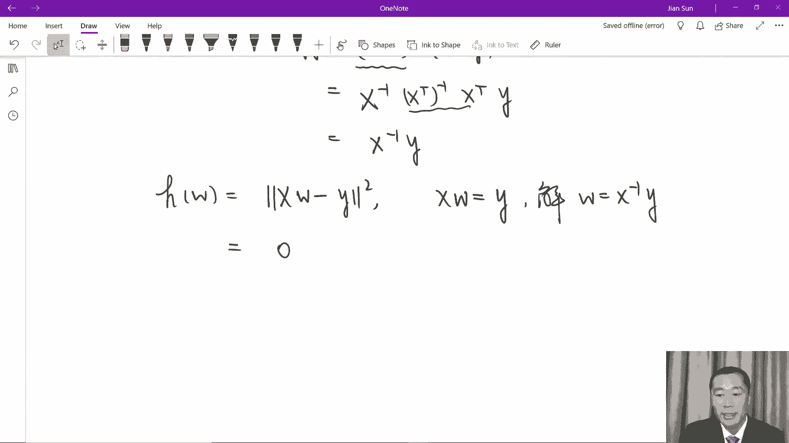

所以我们说这是一种极端情况，而且这种极端情况，我们刚才在线性回归中得到的这个B形式的解，和我们去回过头来看这个问题也是相符合的，一点也不令我们吃惊 就是在这种特殊情况下。

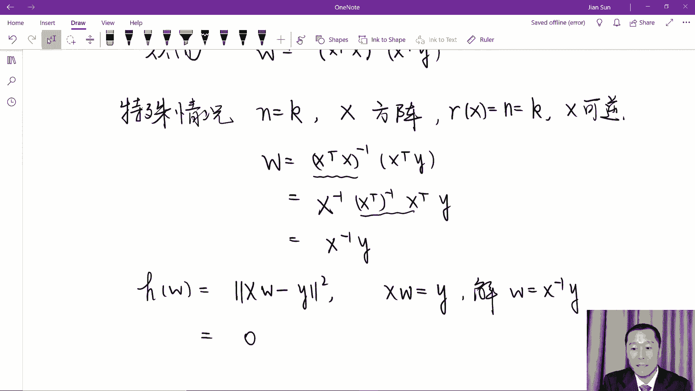

但是一般情况我们还要 就是我们仍然要看，一般情况我们遇到的有意义的线性回归的一般情况下，这个n都是要比k要大很多，一般情况下我们给出的这些数据点，要大大的超过x本身所在的那个维数。

x本身所在的那个维数也就是w，我们要去选取的那个w的那个维度，这同时其实也是从另外一个角度，来提醒我们这个线性回归是有意义的，在这样的一个裁定下，我们来看线性回归是很有意义的。

因为只有在n大大超过k的情况下，我们的数据要比我们的维度要高，所以说我们才有可能去避免过拟合，这是 我们再说 有可能，可以避免过度拟合，好 我们现在呢。

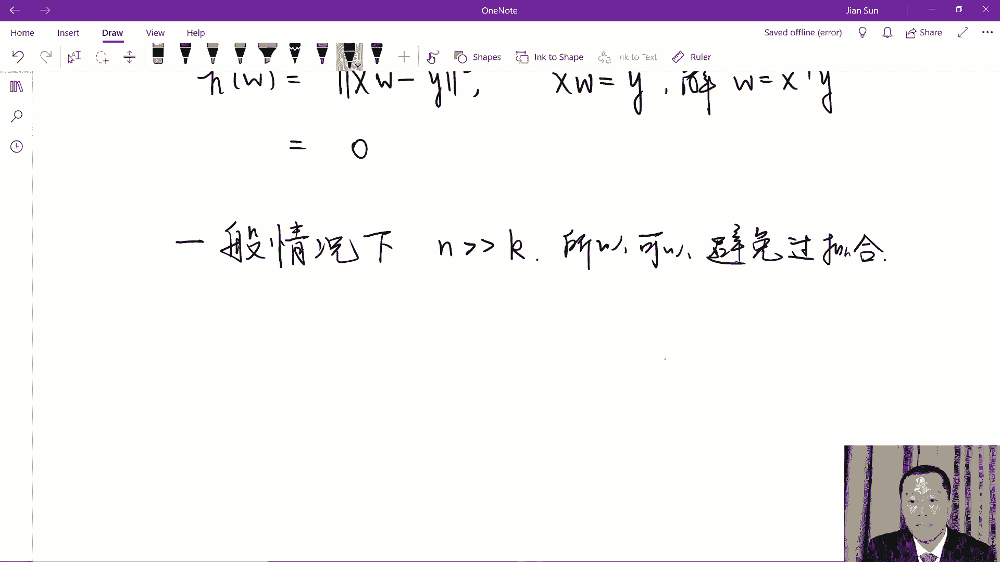

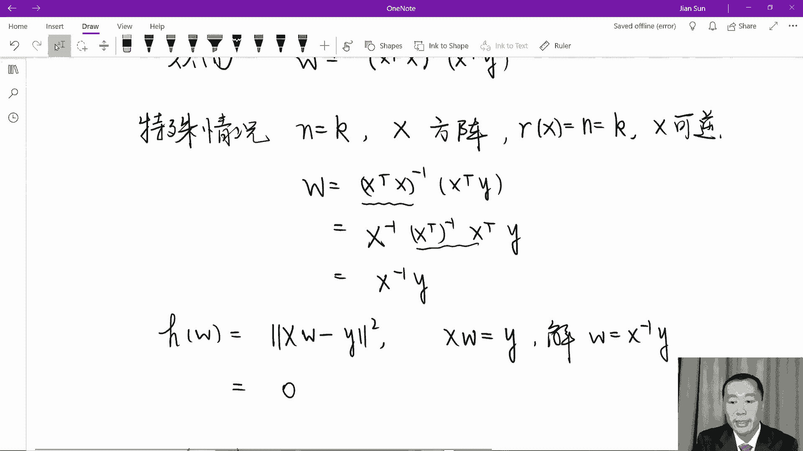

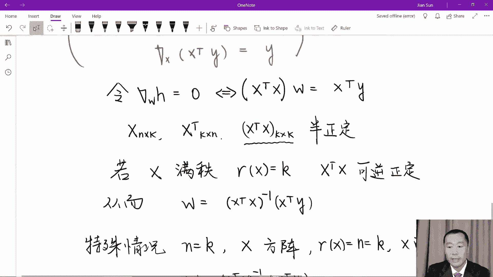

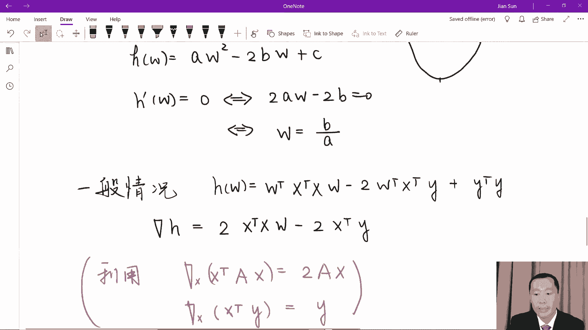

再把问题呢 稍稍改变一下，在这个 如果我们看另外一种优化，刚才我们看到了 我们刚刚定义的这个优化呢，是说x乘以w-y的摩长的平方，它又可以写成是xw-y和xw-y的内积。

但这样一来就相当于我们把x乘以w，每一个它是一个n维的向量，相当于在我们求平方和的时候，把这个n维的向量呢 每个点都等同于，就是它们的重要性我们都看成是相等的，但有的时候我们不是完全把它们看成是相等的。

所以说我们在这里就不是做所谓的欧几里德的这种内积，而是它们之间我们给出区别来，那这种区别我们怎么体现出来呢，我们就可以体现 用一个二次形体现出来，换句话说呢 就是本来欧几里德内积。

就是说的是这个向量的转质乘以这个向量本身，但是在这里呢 我在这里面说一下，刚才是传统的方法，现在呢我们可以考虑一个新的方法，这个新的方法呢就是还是xw-y的转质乘以一个。

w呢是一个正定的矩阵 再乘以xw-y，在这里w呢是一个正定矩阵，所以上述呢我们又可以看成是一个二次形，这个正定矩阵假如说它可以最简单的就是一个对角阵，在这个对角线上呢给出了一些特征值。

它比如说最前面的这个特征值比较大，后面的特征值比较小，那如果我们这样来定义这个正定矩阵，那就说明我们在对于xw-y的处理上，我们比较注重前面的那些项我们看的比较重要，后面的那些项我们看的不是那么的重要。

当然我们也可以反过来，换句话说加入了这个正定阵以后。

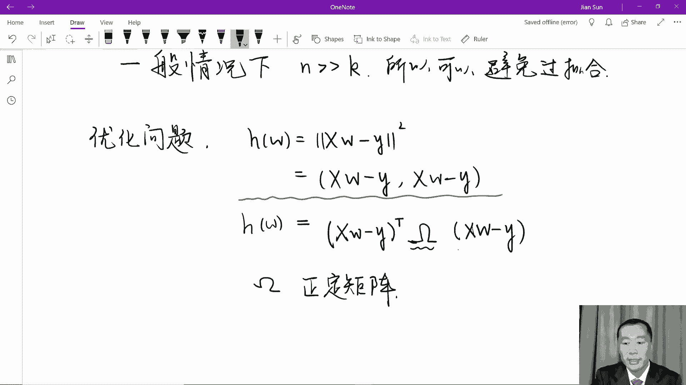

我们定义的这个损失函数呢，它不再是把每个n维向量之间看的是完全平等的，就是每个n维向量的分量之间看的是完全平等的，而是会有侧重点，它有的时候也是有用的，在这里我们也看一看，一旦我们加入这个正定矩阵之后。

我们做的这个回归是不是也有必行事结呢，是有的，我们就跟刚才一样的办法，我们会注意到我们展开，展开之后还是只不过中间多了一个ω，这减去两倍的加上。

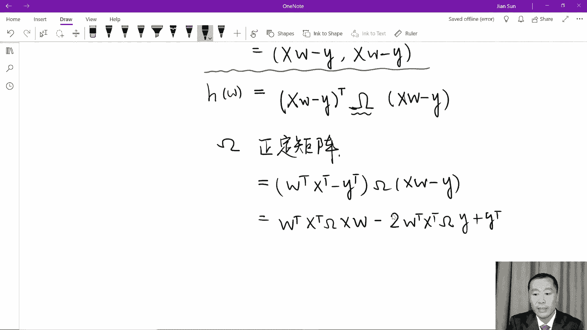

我们一样可以来计算h它的t度，对于w的t度那就是两倍的。

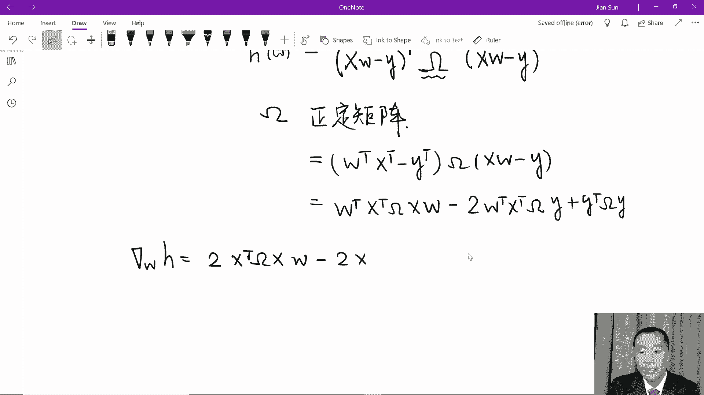

从而我们利用t度等于0的情况下，我们又一次的可以解除w来，那就是x的转质乘以ω乘以x的e乘以x的转质乘以ωy，当然这又是有一个前提，还是说x的本身是一个满质矩阵，这里的ω通常是一个可逆的正定矩阵。

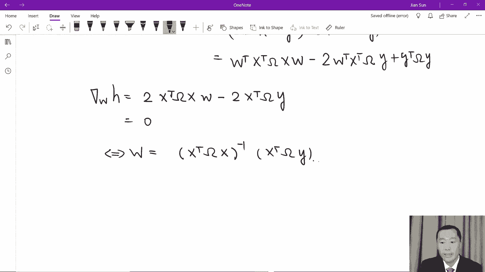

所以你看无论是在原始的欧几里德距离以下，定义的损失函数，还是我们在这里进行了一个二次性推广以后的，这么一个新的距离函数，我们都可以在这个解除一个B形式的解，来满足我们的优化问题，而这个B形式的解呢。

就是线性回归的这个解，所以线性回归它的假设我们再看一下。

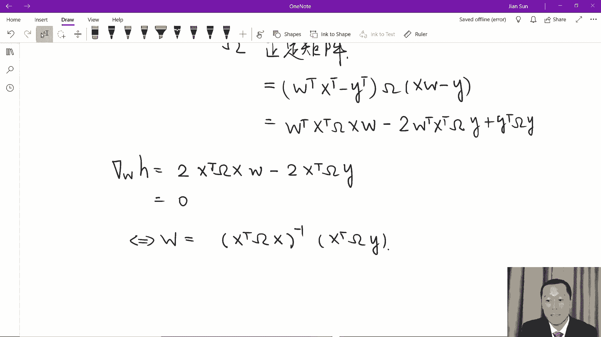

它的假设函数就是所谓的线性函数。

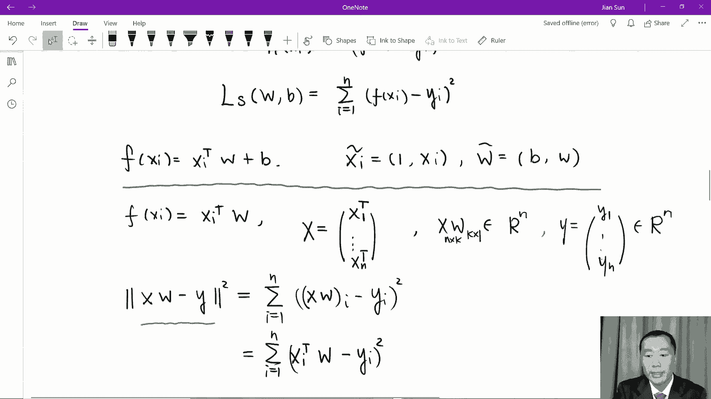

它的损失函数就是通常的平方和，或者是一种广义的平方和，它的优化办法就可以很简单的通过矩阵的方法，我们得到一个B形式的解，这样一来呢就构成我们今天想讲的线性回归的这个问题。

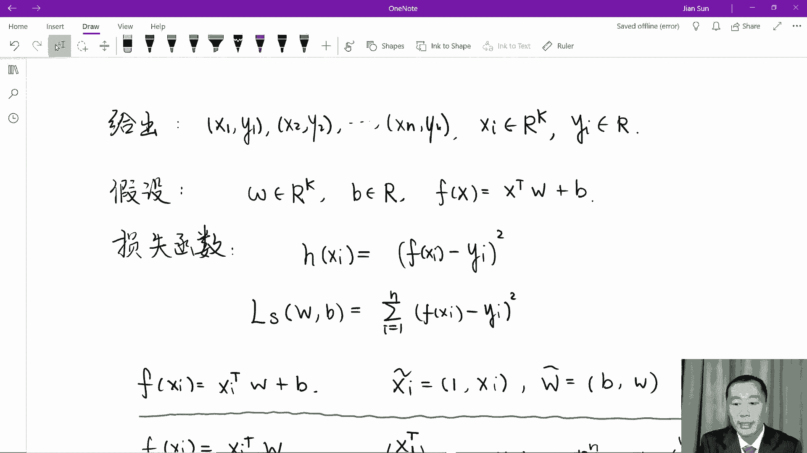

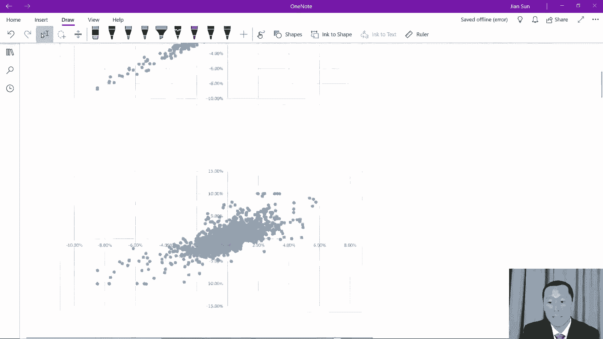

好我们今天要讲的内容呢就是到这里面，那么下一次呢我们会来讲逻辑回归的模型。

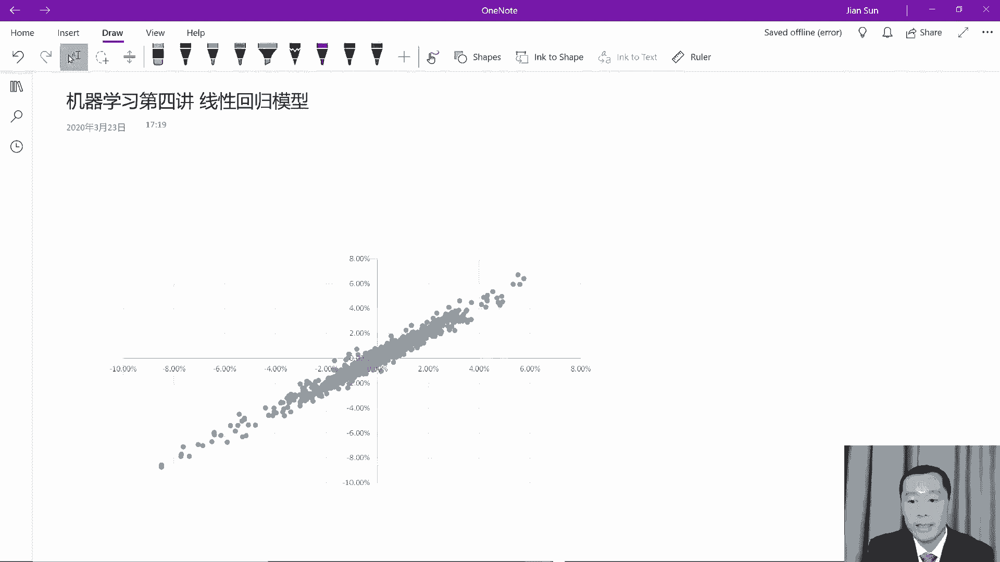

谢谢大家。