# P7：Lecture 7 Support Vector Machine - ___main___ - BV1fv411r7z1

好大家好，咱们今天呢来学习机器学习的另外一个模型，这个模型呢就是熟知的支持向量机，这个模型曾经呢非常的风行呃，因为呢它确实可以解决很多的问题，同时呢还因为一个特点，就是这个模型呢是起源于一个线性模型。

但是呢他却可以巧妙地找到了一个拓展到非线性模型的这么一个方法，这也是为什么后来这个模型非常流行的一个重要原因，那么到现在为止呢，这个模型仍然在机器学习中占有一个很特殊的一个地位。

那我们今天呢就来系统的学习一下什么叫做支支持向量机的这个模型，好，我们来，我们来看我们还是从线性模型出发，到现在呢我们的线性模型学过若干，比如说感知机模型，这是一个线性模型。

我们试图在空间中用超平面去区分两种不同类型的点，同时呢我们还学了线性规划，linuprogramming，这也是一个线性模型，当然这个出发点呢就更直接了当了，也就是说我们把区分平面上两组点的这个问题呢。

换成了这么一个线性规划的几个约束的条件极值问题，同时呢我们又学习了逻辑回归啊，就是这个regression啊，从概率的角度出发来，试图呢去maximize它的极大似然函数。

同时我们把损失函数呢当然就定义为啊自然函数它的倒数，这样一来呢，我们也可以区分这个平面上所有的这些点，我们你看我们从线性的角度看过这个问题，我们从概率的角度看了这个问题。

那么我们现在呢就从一个几何的角度来看这个问题，咱们从几何的角度呢，我们先来看这样的一个几何问题，我们首先呢看r n空间rn的这个欧式空间中，比如说我们有一个点，这是r n空间的点。

同时呢r n空间的超平面是怎么给出来的呢，rn空间的一个n减一维的平面，通常呢是可以用一个线性的函数fx，那就是w的转置乘以x加上一个b给出来，其中，w呢是rn中的一个向量，b呢是一个实数。

好这个超平面呢啊我们现在写的是这么一个函数，那么其实是一个超平面等于零，那才构成了一个超平面，好我们现在来看，比如说二维空间的超平面就是一个一条直线，那三维空间的超平面呢当然就是一个二维平面。

那n维空间呢就是n减一维的一个平面，我们考虑一个点啊，现在我们考虑这个点，比如说这个点x0 ，当x0 呢它是一个向量，如果这个x0 呢就在这个超平面上，就落在这个超平面上。

那么当且仅当啊fx 0就等于零，不然的话呢，那就两种情况，一种呢是fx 0大于零，还有呢就是f x0 小于零，总之呢全空间就被这个超平面呢结为了两边。

一边呢就是函数值大于零的一边啊。

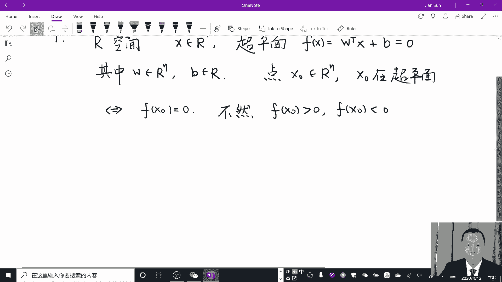

一边就是函数值小于零的一边，如果说这个是我们的超平面，那么很自然的空间就被分成了这边和下面一遍，我们可以说呢在这个超平面上就是fx等于零的，那么上面呢很可能就是fx大于零的，下面呢是fx小于零的。

当然这取决于啊我们那个w指向于哪，比如说啊在这种情况下，这个w在哪呢，w啊就相当于是这个超平面的这个垂直的向量，我们又叫做一个曲面的法向量，就是这个w所代表的那个向量和这个超平面是天然的是垂直的。

所以说如果w是指向上，那自然呢fx上面呢就是针对所有的这些x点呃，正的地方，如果w啊，那当然下面就是fx小于零的地方，如果w的方向反过来，那么fx上下的符号呢也是反过来好。

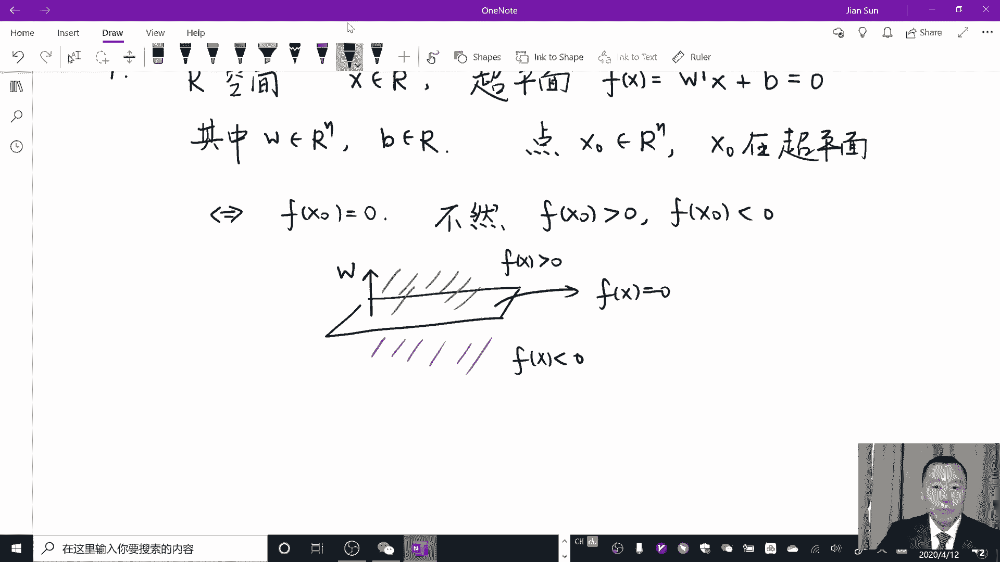

这是超平面的线性性质，那么下面来看第二点啊，知识点就是点到超平面的距离，怎么来描述，点到刚才我们说的那个定义的超平面的距离，怎么来计算这个在我们的中学的平面几何里面啊，其实就经常讲这个问题。

中学的平面几何我们想一想说在二维空间我们有一条直线，这条直线呢它的写法就是a x加上b y等于c啊，如果我们在这个线外有这么一个点啊，这个点是x0 y0 ，那么这个点到这个直线有一个垂直，那么这条线。

那么这个点到这个直线的这个垂直的这个距离l在中学的平面几何呢。

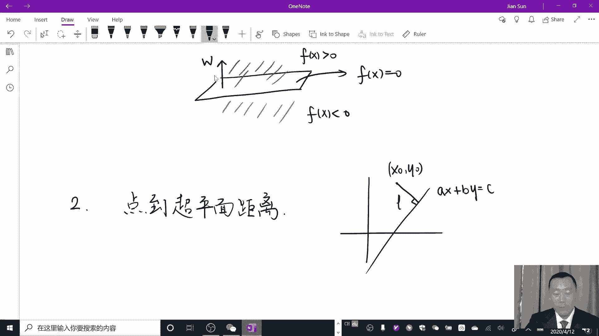

我们就曾经计算过这个l去计算l的方法多种多样，最后呢总之l计算出来是什么样子呢，是这个样子，就是ax 0加上b y0 减去c除以根号下a方加b方，不知道大家还记不记得这样的一个公式。

当然这个距离啊啊通常呢前面还要再加上一个绝对值的符号，因为让这个距离呢绝对的是大于等于零的，我们看到当x0 y0 落在这条直线上的时候，这条这个距离就是零，当x0 y0 不在这条直线上的时候。

这个距离当然就不是啊，零就成为绝对的大于零，那如果这个x0 和y0 啊，它落在这条直线不同的方向上，你比如说它就落在这个地方上，你会发现呢它们的距离，如果说这个啊这两个点啊，你比如说这个点叫a啊。

这个点叫做b a和b呢是关于这条线是呈镜像对称的，你会发现这两个点距离这条直线的距离啊是一样的，但是呢他们却在这条直线一上一下，所以说他们某种意义上呢。

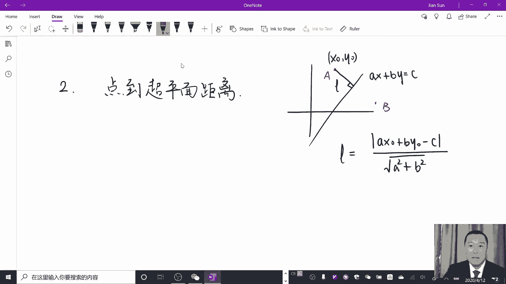

根据刚才我们说的超平面的截取空间呢就会分成两个不同方向，所以这样一来我们也希望距离能够表示出来，所以有的时候呢我们就干脆不加那个绝对值，就是说我们就变成了一个带符号的距离，那在我们眼前的这个距离。

如果我们不加绝对值，就是带符号的距离，就是不仅它给出的距离，而且呢它还能区分这个点是在这条线的左边还是右边，是上边还是下面，这是在二维情况下，那么在高维情况下，我们也来写一下。

如果说高维的超平面的定义是这样给出来的，就是刚才我们说的w的转置乘以x加上b等于零的情况下，我们现在给出一个点，在给出这个点哈，这个点呢是x0 和y0 啊，不是我们这样就没有必要叫x0 。

y0 呢就是这个x0 了，在r n维空间中，我们现在呢想计算这个点到这个超平面的距离，也可以计算所谓带符号的距离，我们看看怎么计算，刚才我们说了，w是法向量，就是垂直的垂直于这个平面的向量。

所以从刚才x0 点那么做这个垂直做垂做这个垂线，这个垂线呢到这个交到这个超平面上，你比如说它的交点是x1 ，那这样一来呢我们总可以写呀。

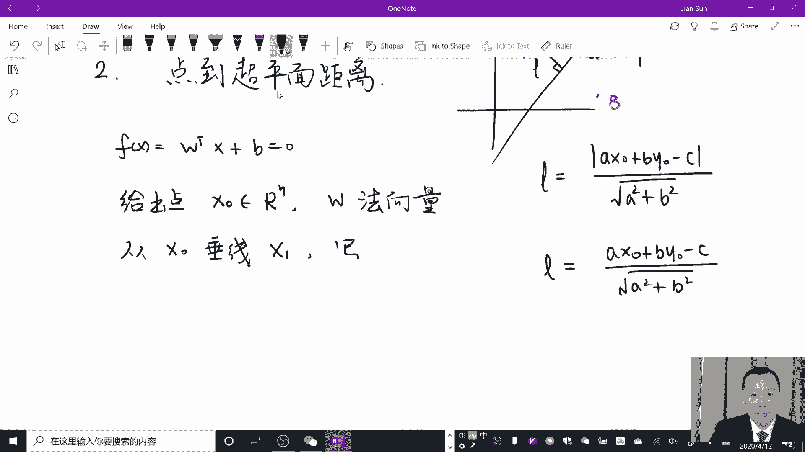

x0 呢注意到w呢是本来就是法向量，所以x0 到x一和也是和平面垂直，既然w和x0 减x一都和平面垂直的，那么他们自然的之间是一个线性关系，所以说x0 到x一呢就是一个长度l乘以w。

但在这里呢我们想把这个w的这个模长把它磨去，那这样一来呢你会看到这个l本身呢它的绝对值左右都取绝对值，那它就是x0 点x一他们之间的距离，所以这个l呢就是我们所要的取了绝对值之后呢。

就是代表了这个点到这个超平面的距离好。

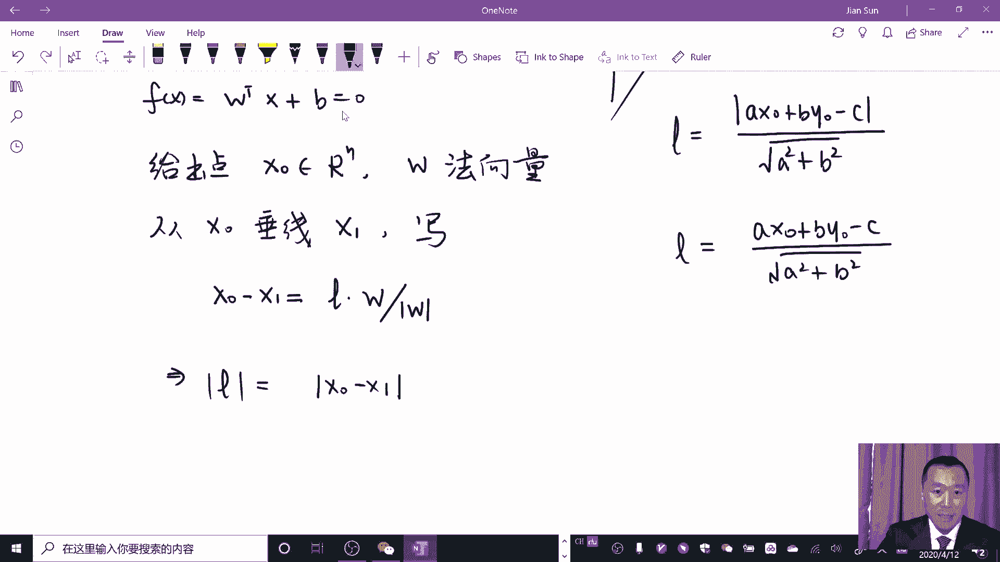

那我们继续来推导这个l是等于多少，你注意到x一呢在这个超平面上，所以呢x一你把它带到刚才的方程中去呢，应该满足那个方程，线性方程等于零，但是x一不是等于x0 减去这个l乘以w除以l的模长吗。

我们带到方程里面去，就是使得fx一它是w的转置，x一加上b他就是w和x一的内积，加上b它就是w把它带进去减去，你计算啊w啊和后面那一项，那就是l乘以w的模长，再加上b它应该等于零，从而呢我们就推出来了。

这个l呢原来就是w和x0 的内积，加上b除以w的模长，当然这就是我们也可以经常写成w的转置乘以x0 ，加上b除以w的模长，当然也可以写成f乘以f在x0 的取值啊。

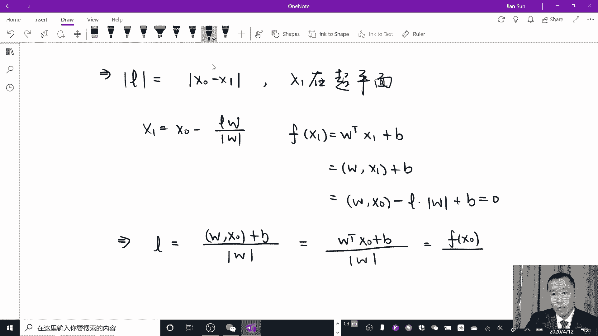

除以w的那几，这就是说在超平面外一点到这个超平面的垂直距离。

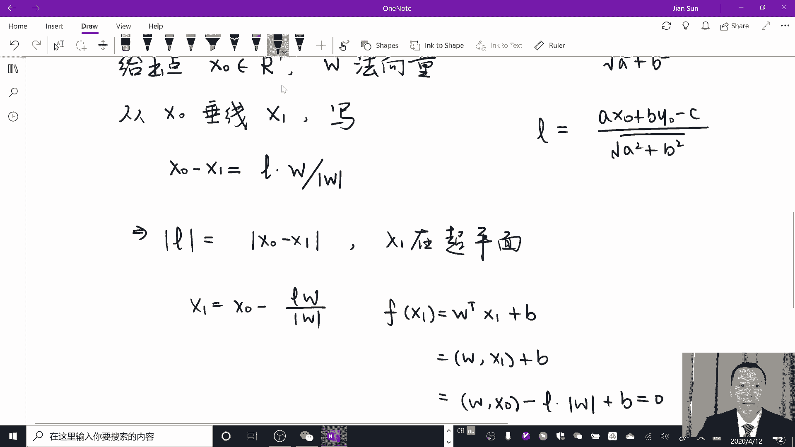

我们就这样啊做出来了，你看在二维情况下。

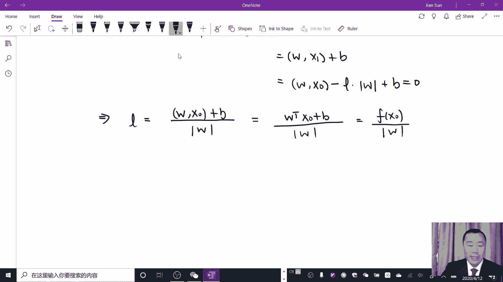

它跟我们平面几何啊。

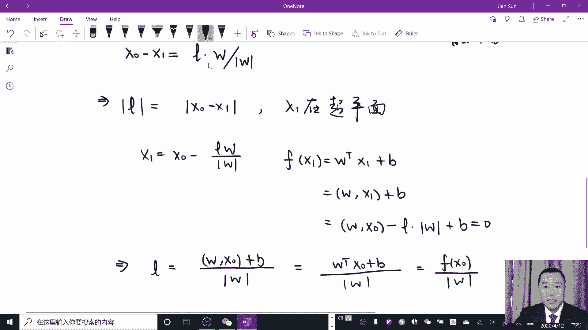

解析几何学到的这个二维的这么一个结果是一模一样，就是一个点不在这条线上，你首先呢把这个点啊要计算它到线的距离，就是把这个点带到那条线所定义的那个线性方程中，距作为分子。

那么分母呢你还要除上这条线x和y前面的系数的平方和开根号。

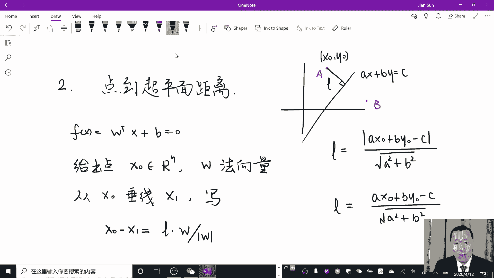

那就是对应到我们这里的w的模长，我们要这些预备知识做什么呢，那我们就用这些人来引入我们一个新的这个平面分类问题的损失函数，我们平面分类问题啊，可以想象成这样，本来呢我们这平面上有一些点，有一些。

两种不同颜色的点，我们试图去区分开，但是你看如果是眼前的这样的话，我们去区分开，可以这样区分，如果回到感知机的模型上，我们会发现啊这样的一条线呢就是满足感知机的膜，感知机的条件。

就是我们已经把它区分开了，但是我们会发现它有不同的区分方法，你比如说这是一种区分方法，那么我们还可以，这也是一种区分方法，那哪一种区分方法比较好呢，啊这个是这个支持向量机呢所探索的。

就是说既然我们可能有不同的线都满足区分的条件，但是呢有些线呢它可能就偏黑色的点，有些线呢偏红色的点，我们能不能取一条那么居中的一条线来作为它们区分的方法，那就是我既不偏黑色，也不偏红色。

那么问题就在于你怎么定义它既不偏黑色，也不偏红色呢，我们就用点到这条线，它的绝对垂直距离，你看在我们取这样，好如果说我们试图做出一条两边都不偏离的这样的一个线的话，我们呢去看每个点到它的这个距离。

垂直距离，你比如这个点到它的垂直距离，这个点到它的垂直距离，这个点到它的垂直距离等等等等，那有些垂直距离呢就比较短，有些垂直距离呢显然是比较长的，那我们在乎哪些垂直距离呢。

当然我们在乎比较短的那些垂直距离，因为呢离很长的那些点呢，其实对于这条线的贡献度应该是没有什么贡献度的，所以我们很可能就会在乎距离它最短的那个垂直距离，使得这些最短的垂直距离，比如在我们现在这个图上。

你比如这个垂直距离比较短，这个垂直距离比较短，我们是希望这样的这种垂直距离呢尽量的区分开，尽量的大，所以在这个里面呢就是我们希望这两个垂直距离又比较大，因为这是最短的那个垂直距离偏大。

因为这样的话我们就不至于说啊，比如说我们在这里面想象这条绿色的线呢，再往上面偏离一点，当绿色的线往上偏了一点的时候，虽然仍然能够区分，但是上面这条黑色的点距离偏离后的这个直线的距离就会缩短了。

那么我们就把它看成新的这条分类的曲线呢，分类的直线呢太过于偏向黑色了，那么同时同理呢，我们如果往下偏离了，我们就会认为它像红色的点太过偏离了，那怎么着才能够说它既哪边都不偏离呢。

那我们的直观呢就会就会看到呢，那就是因为黑色的点在这条线的垂直距离，和红色的点到这条线的垂直距离应该是一样的，那这样的情况下，我这条线既不可能往上移动，也不可能往下移动，而这是我们的这个直观。

我们现在把我们的直观呢转换成啊我们的具体的描述，那将会是这样的，我们在平面上给出了x1 y一啊，在空间中一直到x n y n，同样呢我们在这里考虑二维分类问题，而每一个y i其实呢都是一个实数。

现在我们来考虑啊，如果给出，给出来一个分类平面，这个分类平面呢是w，b给出来的啊，一个是k v空间的向量，一个呢是截距，所以呢我们给出的这个分类平面，分类平面就是fx啊。

等于我们的w转置乘以x加b等于零的形式，那么每个点到这个分类平面带有符号的距离啊，那就成为，就是带正负的距离。

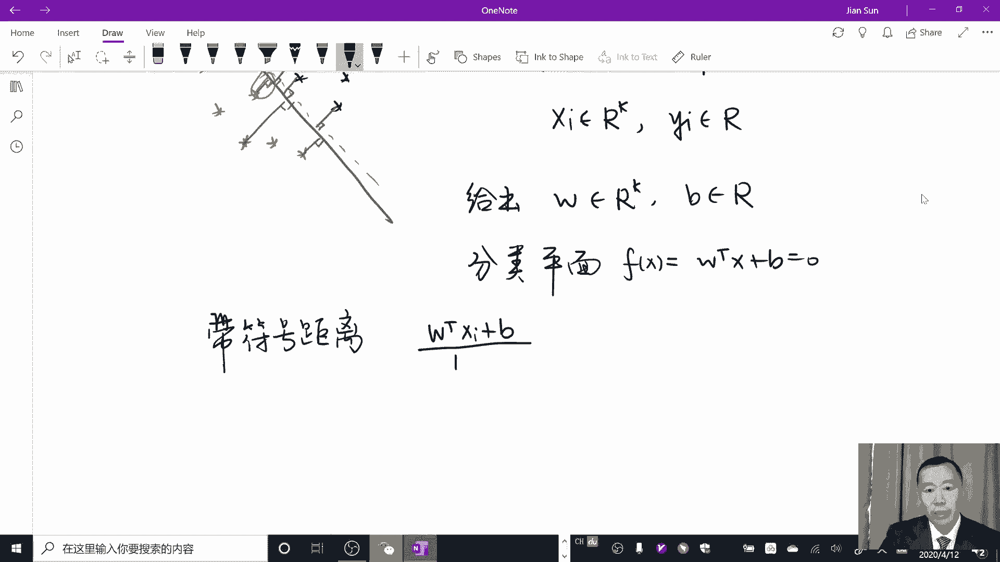

这一方面我们是希望什么呢，我们一方面希望它乘以相应的一些外i是大于零的，那这样一来呢，按照咱们以前感知机讲过的，那就说明确实都分开了啊。

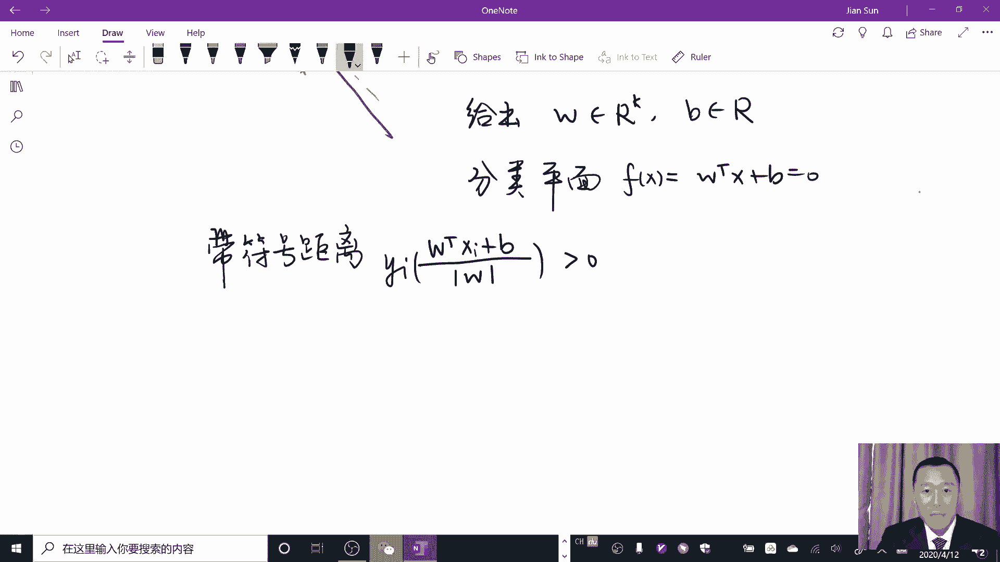

提醒一下，在这里的不是y等于属于r啊，sorry，这是一个分类问题，这个y i呢是取呢正一-1。

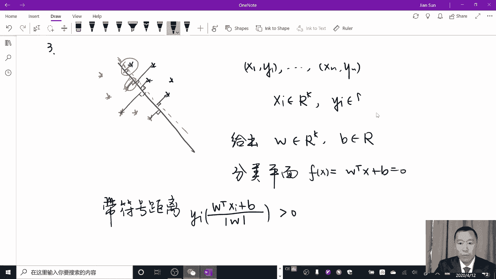

就是呢一边是取正一，一边是取-1，所以我们希望呢带符号的距离是大于零的，但同时刚才我们也说了，我们还希望这是约束条件，在这样的约束条件下，就是这样一个约束条件下，我们是希望目标，希望这个w满足什么呢。

满足最小的就是所有这里面最小的，这是所有这里面最小的那个点到这条超平面的这个距离啊，达到了极大，换句话说就是我们是希望所有的那些最小的点爱它呢能够达到了极大，那我们在哪里去选择极大呢。

在w和b中去选择括号中取到极大的那个量，那这样一来我们找到了w和b的时候呢，就相当于我们找到了这样的一个超平面，这个超平面呢是满足所有的这些点到这些超平面既区分开了，而且呢到它的距离中。

最小的那些距离呢已经极大的就是到了一个极大值，它就不可能了，再大了，那这样的一个超平面，我们就认为呢这是一个最佳的超平面，也是一个最理想的超平面。

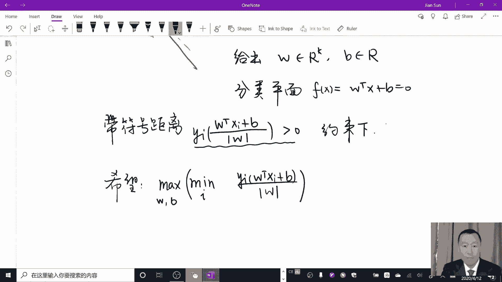

好我们来写一下我们的优化问题，就可以写成这样了，就是max，在所有的w在r k的向量，所有的b在r中去寻找，使得，这个量最大的那个值约束条件呢。

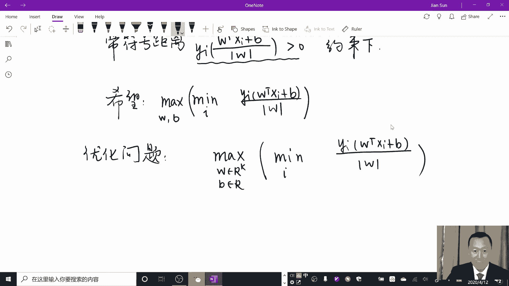

有约束条件就是yi，都大于零，让我们看，这样的一个问题怎么求解呢，展现在我们眼前的这个问题呢，是非常非就是呈现出非常的这种非线性化，嗯，那我们怎么才能把这个问题变成一个。

比如说像类似于线性规划那样的一个我们确实是可以去求解的问题的，我们这里呢来跟大家分析一下，你看眼前的这个量，这个这么一个量，这个量呢其实呃我们想说呢，这个量呢其实类似于我们就是做一个这个类似。

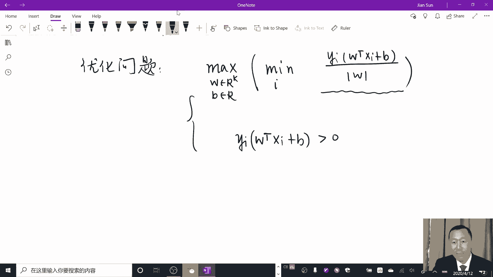

类似于啊我们的这个投资组合中，那么这里呢，这个少校让我们去想投资组合理论，我们回想我们的投资组合，投资组合理论呢一般的我们呢有收益，我们呢还有风险，所以我们的投资组合理论中。

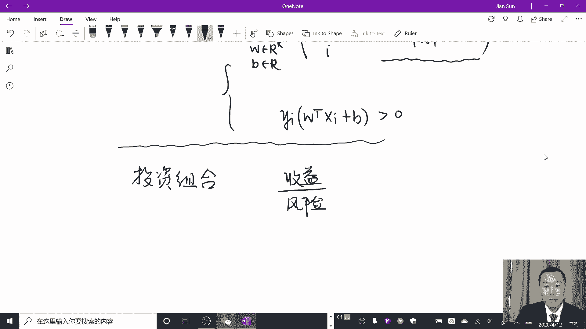

为了去平衡收益和风险之间的关系呢，我们经常可以把它变成这样的问题，就是一方面呢我们要极大化我们的收益，在风险约束条件下是风险，足够小的时候，就是或者是风险固定的时候，极大化我们的收益。

还有一种方法呢就是极小化我们的风险，那么呢这个也是在收益，相对固定或者呢收益，大于等于某一个啊，比如说我是某一个给定的值，情况下去做这件事情好，所以我们在考虑投资组合的时候呢，其实就面临过这样的问题。

就是我们眼前考虑的这个量呢是收益除以风险，但是我们确实可以把它分成两种优化问题，一种问题呢是优化风险是极小化风险，一种问题呢是极大化收益好。

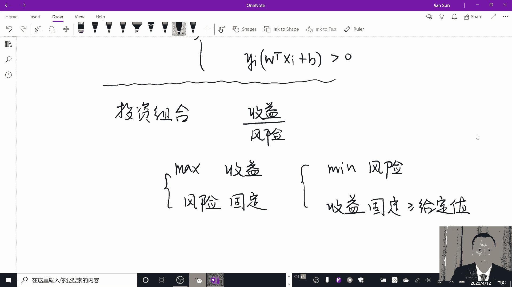

在这样的一个精神的这么一个指引下，我们回头再来看我们上面的这个优化问题，我们把上面这个看成是某种意义上看成是收益好，下面把它看成是风险，所以我们借用投资组合的这样的这个想法呢。

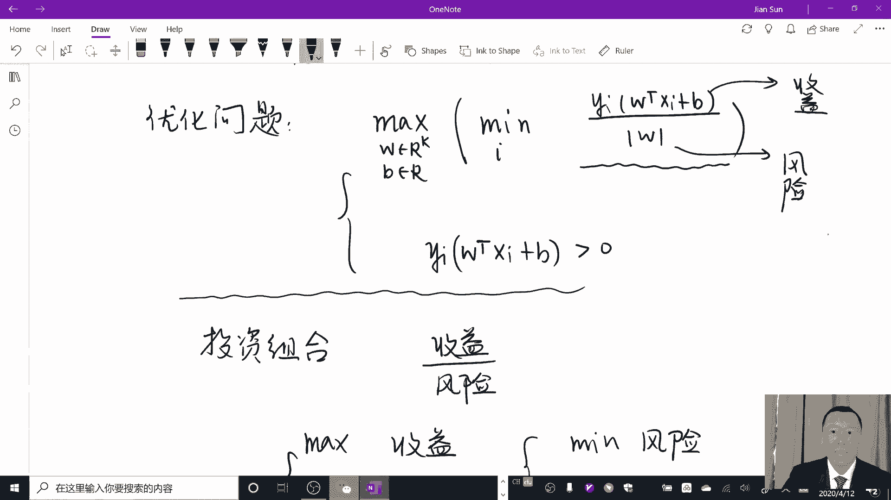

我们同样把这个问题呢就可以转化成两部分，转换成哪两部分转化成优化问题一，就是我是希望让我的比如说收益最大，风险固定，那这样的话呢我们就变成了说我们是希望max，max什么呢。

让我们的风险固定就是在所有的w w模长等于零啊，等于一的这样的这种风险固定的情况下呢，我们是去寻找w和b使得呢这个值达到最大。

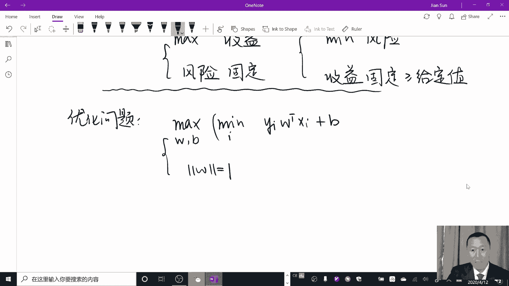

所以这是变成了一种优化问题啊，优化问题同样呢这是优化问题一，我们再看优化问题二，优化问题二就变成了minimize w，但是呢希望我们的风险的部分就是在这里面。

这个风险的部分呢是固定的，或者是大于等于某一个值的，那当然我们这里面就可以写成。

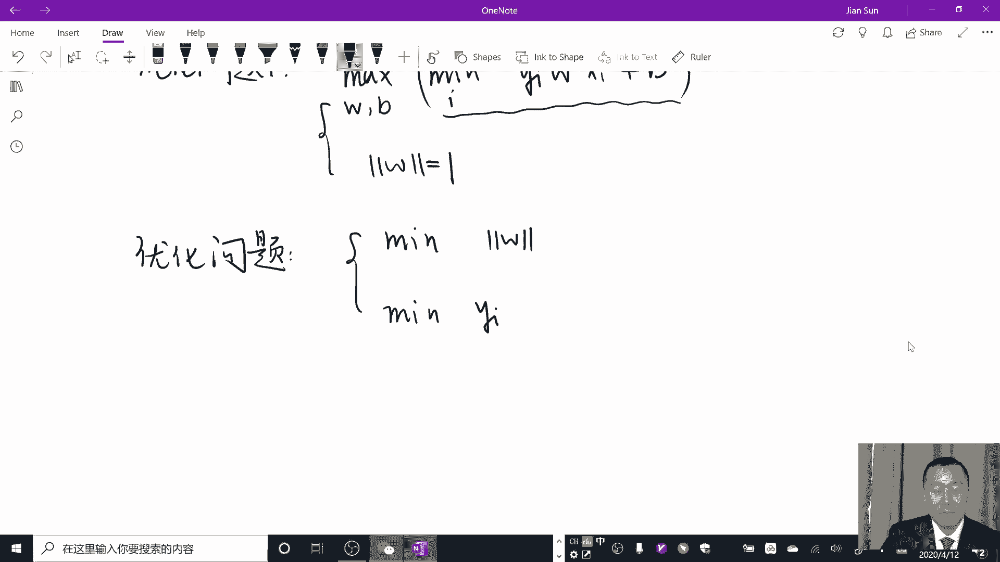

啊这个括号加错了，这样就可以写成，大于等于一。

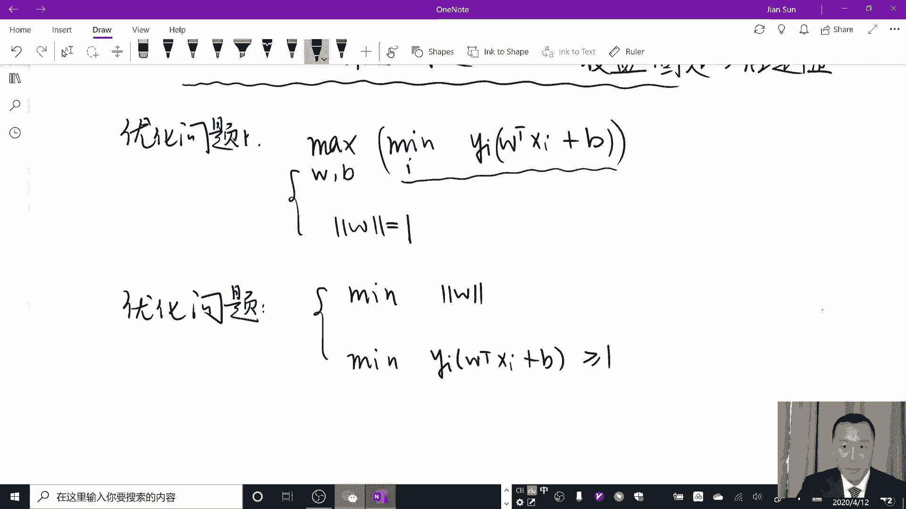

就是我们固定一下，使得在所有的收益大于等于一的情况下，我们要去minimize啊，这是所有的i，这是所有的w和b应该这样说好，优化问题二。

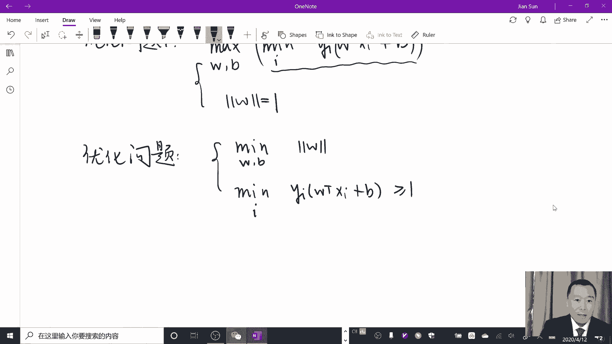

但是优化问题二呢，我们就可以继续的来看优化问题二，就等价于，我们要minimize w的模长就相当于minimize w模长的平方，因为这样它就变成一个二次问题，那么约束呢就是让所有的这些都大于等于一。

最小的那个i都大于等于一，那就等价于每一个都成立，所以我们的优化问第二呢就变得比较简单了，就是在所有的w和b中，使得每一个啊都满足每一个爱，这对每个爱都成立，那每个i呢是小于等于n大于等于一的都成立的。

这个约束条件下呢，我们去minimize w的平方，唉，这个问题看上去呢就就好看多了，但是呢这个问题跟我们整个的呃问题呢其实都是等价的。

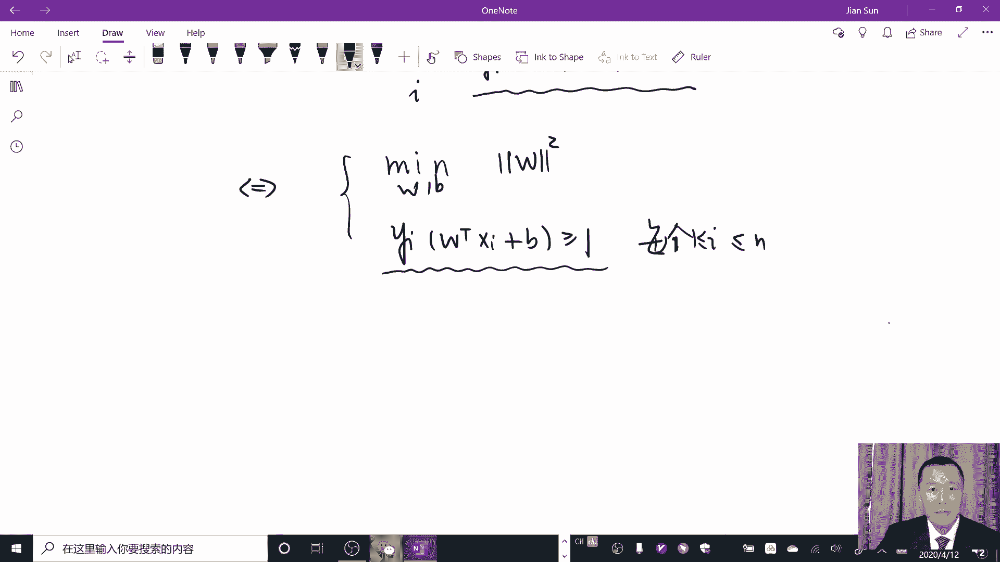

所以到目前为止。

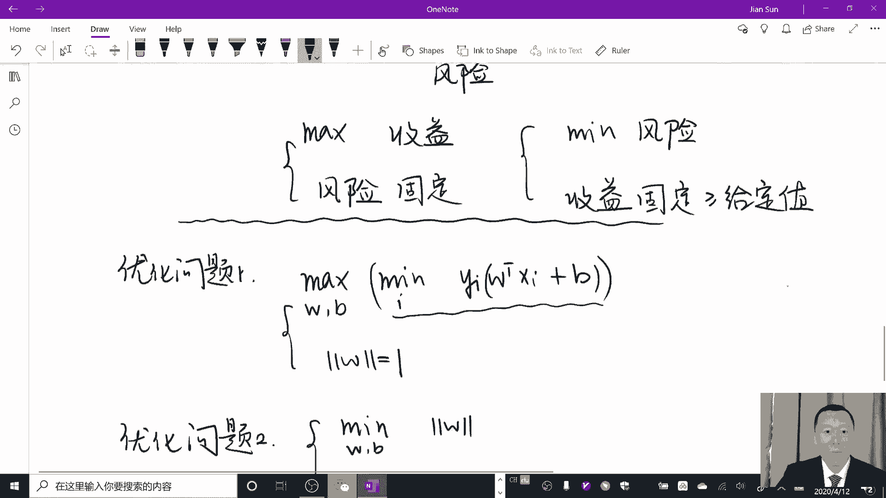

我们的支持向量机就可以化解成下面的这个等价的问题，所以接下来呢我们的努力方向呢就来求解，怎么样求解。

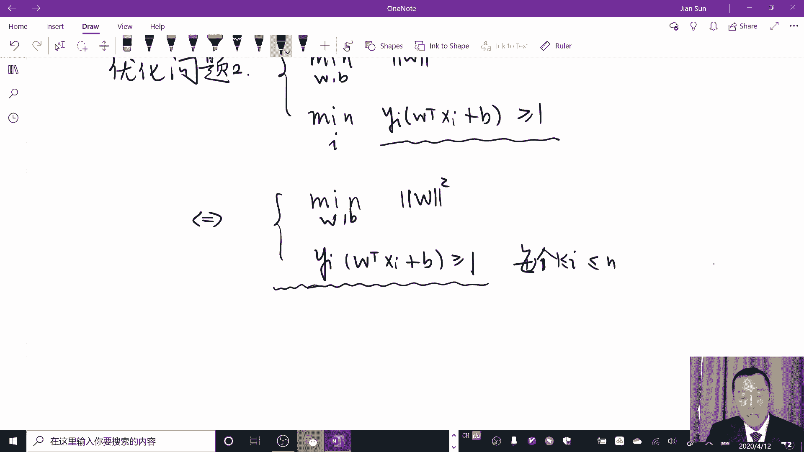

这个就是眼前的这个问题。

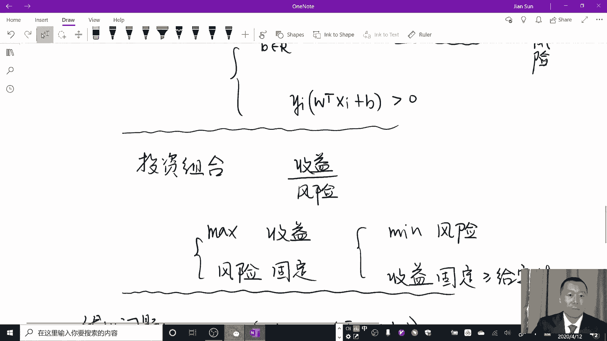

13这四，求解这个问题呢自然就是先引入二次规划，就是上次我们曾经想讲，但是呢没有讲，留到现在来说，眼前的这个问题，我们说的是一个典型的二次规划的问题，什么叫二次规划呢。

二次规划一般的形式跟我们线性规划一样啊，是这样的一个形式，就是我们的目标是去minimize一个二次型，这个二次型呢就是这样的一个二次型啊，那么这个q呢是一个k乘以k的一个矩阵。

那么u呢是rk中的一个向量，而在这样的我们的目标呢是去minimize这样的一个二次型。

那在眼前呢我们就是一样，我们要求minimize是w的平方，那么这也是二次型，那相当于在这里面这个q的这个矩阵就是一个单位矩阵。

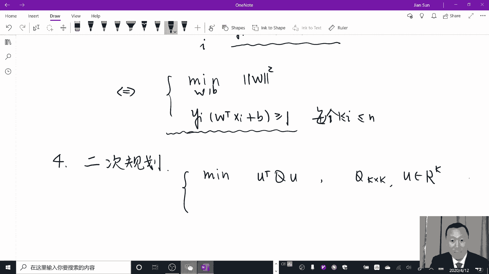

同时呢我们还有一些约束条件啊，这个约束条件经常就可以把它写成为啊，在这个p乘以这个u要啊大于等于，比如说另外一个向量的形式，表示这个小向量是q的形式，在这里呢p呢是一个n乘以k的一个矩阵。

那么小q呢是n乘以一的一个矩阵，而n乘以一的一个向量，所谓这个大于等于呢就是每个分量都成立一般的这个二次规划呀。

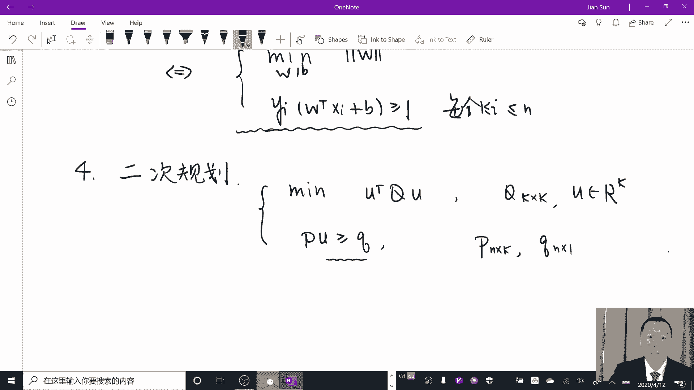

它的一般的形式就可以写成这样，当然你这个符号呢约束条件也可以是小于等于q，所以跟我们的线性规划非常的类似，这个二次规划的形式呢，只不过呢去minimize呢，我们不是一个如果是线性规划的话。

那我去优化的问题就是一个线性的形式，在这里呢就是一个二次型的形式啊，二次型的形式啊，对顺便说一下，你在这个我们眼前的这个这个二次型啊，这个q这个矩阵呢一般呢还要求是一个，比如说正定阵或者是半正定阵。

同时呢后面呢当然还可以再加上一些常数，同时后面还可以再加上一个线形象，你比如说一个这个v和u的这个内积，那么这个v呢也是rk中的一个向量，好同样呢虽然二次规划呢看上去比线性规划呢要更加的复杂。

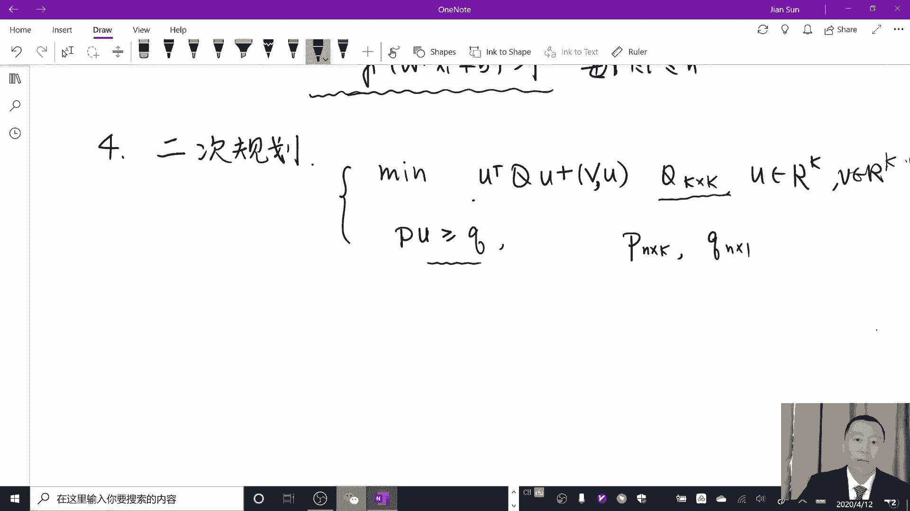

但是二次规划也有现成的比较成熟的软件去求解。

那这样一来，我们的支持向量机，显然这是一个二次规划，因为我们要优化的问题，这是一个二次项，我们的约束条件对于w来讲是一个一次项，所以显然这是一个二次规划的问题，如果放到二次规划中去。

我们自然就很快的就可以得到它的解，如果我们调取软件包的话。

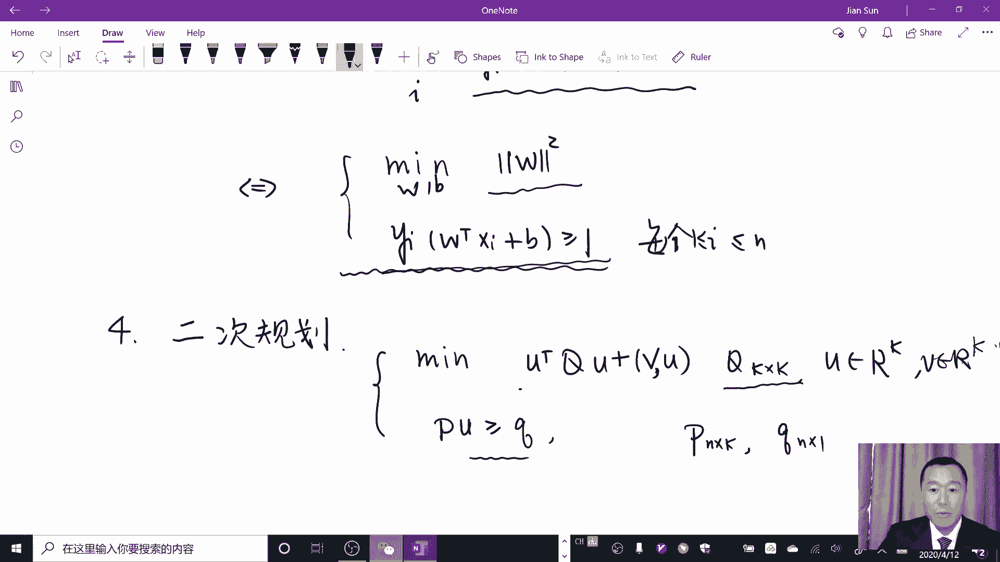

如果我们不用现成的二次规划，我们从另外一个角度看，也就是引入所谓的对偶问题，我们会得到更多的结果，我们来看一看，我们今天就是要重点讲一下这个队伍问题能够给我们带来的结果啊。

这个问题我们看看回到上面怎么来得到这个结果呢。

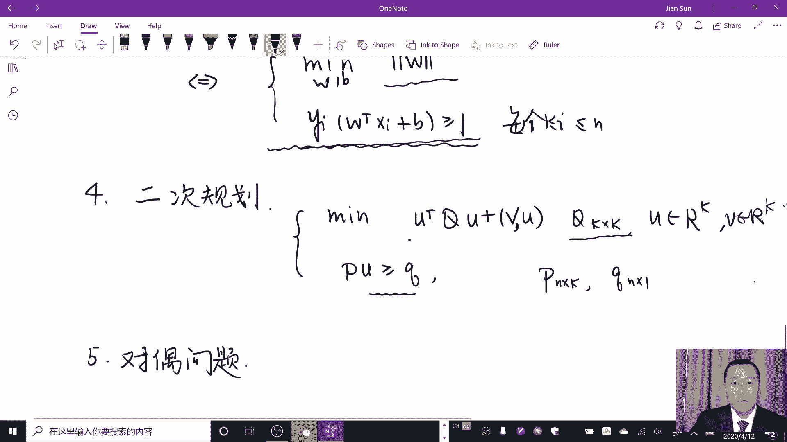

就是眼前的这样的一个优化问题，我们从另外一个角度去看。

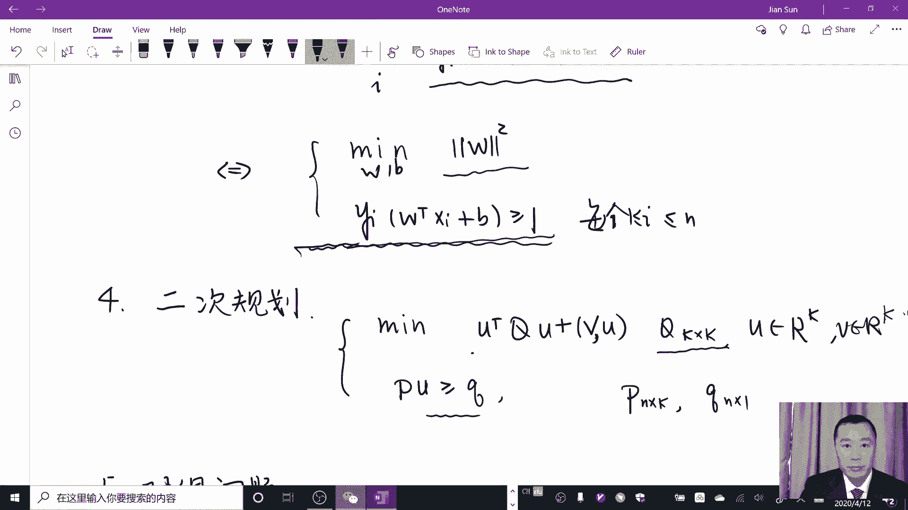

好我们从这样的问题去看。

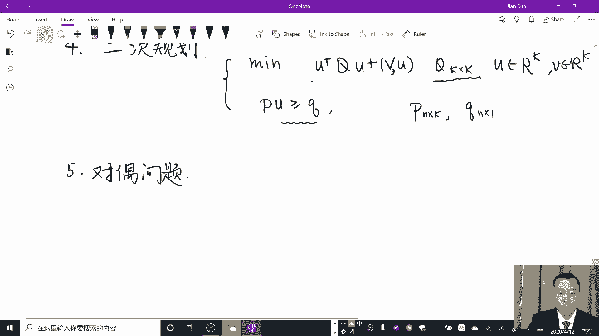

我们不是嗯，我们来看我们就是像拉格朗日乘子法式的，我们受拉格朗日乘子法的启发，我们去看那w的平方加上ai，然后这里面呢是一减去y i，这里面是w的转置乘以x加上b这里的i是等于一到n好。

我们来看眼前的这个啊眼前的这么一个量，然后呢我们去看所有的，首先看max在ai大于等于零中，我们去求它的极大，我们看啊，如果说呀你看它等于什么，一方面如果说约束条件都已经满足了，所谓约束条件满足呢。

那就是一啊减去y i乘以w xi加上b确实是小于等于零，那这样的一种情况下，你在注意到这个a i我们的要求是大于等于零，所以这两个的乘积呢也是一个非正的成绩，既然它永远是小于等于零的。

那什么时候这两个乘积才能得到极大呢，那当然就是a i等于零的时候，所以呢在约束条件满足的情况下，极大化呀，就是w的平方对吧，但是当约束条件不满足的情况下，也就是说当它是正的情况下。

那当然最后得到的极大化之后是正无穷，因为我就可以取a变得很大。

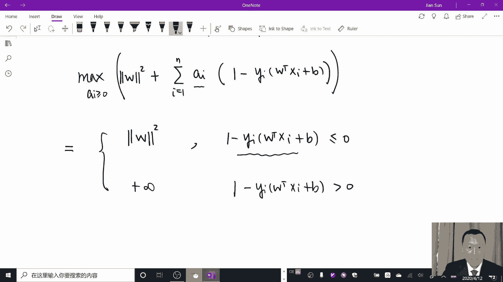

使得得到正无穷好，那这样一来，我再去求极小，对w去选择w和b使得，这个i等于一到n对这个问题求极小的时候。

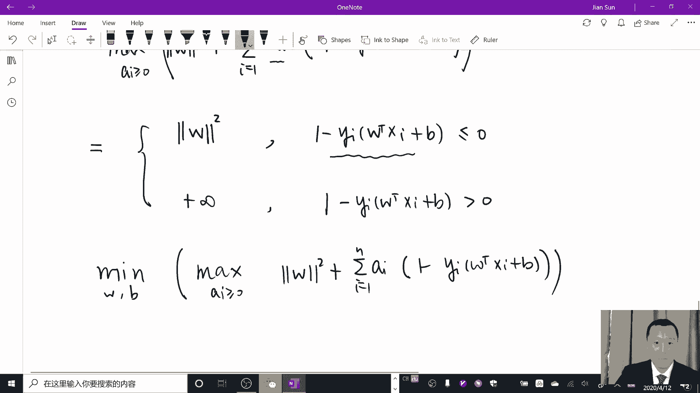

你会看到，那不就是等于对于w方求极小，同时呢还要满足于就是所有的约束条件都满足，就是那些yi w转置x还加上b都要大于等于一。

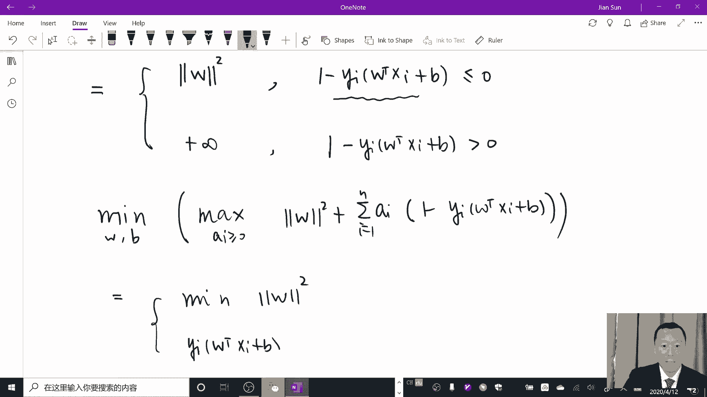

所以我们看眼前我们最早的我们的最早希望的这个约呃优化问题。

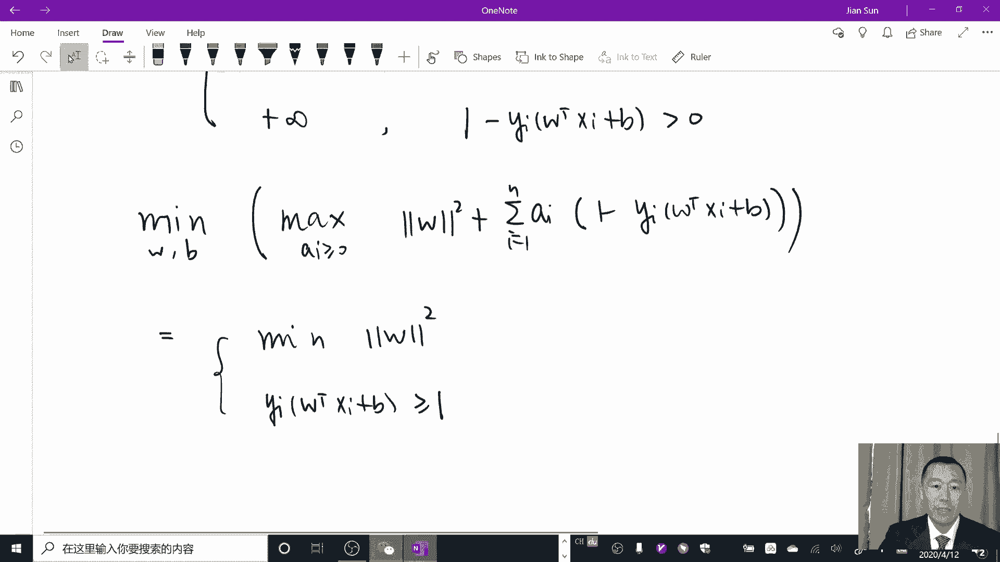

就等价于上面的这个优化问题，所以这样呢我们就把我们目标的一个二次规划的一个问题，转换成我们眼前的这样的一个呃，带有拉格朗日乘子法这种性质的这么一个优化问题，但是呢像拉格朗日乘子法呢。

它里面带进去的这些lambda呢是可正可负的，只不过我们在这里带进去的这些ai只能是正的，它不能够是负的，这是因为拉格朗日乘子法的时候，它的约束条件一般是等于零的这么一个条件。

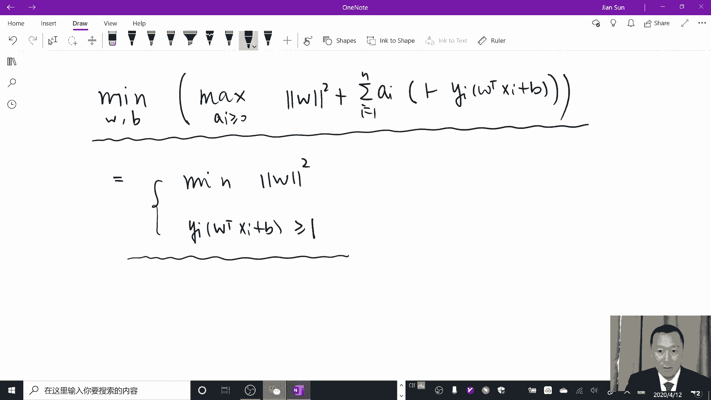

而我们现在这个约束条件呢是大于等于零的约束条件。

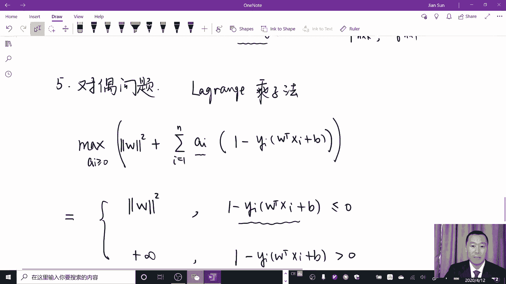

这是为什么我们在这里的对ai的要求呢就是只能是非负的好，所以说我们现在呢又一次把我们的这个目标呢，集中到眼前的这个有这个优化问题上，眼前的这个优化问题呢是mini max的问题。

就是说我们对一个量去求最大值，同时呢再去求最小值，眼前的这个问题就等价于我们把mini max交换个顺序，就是先对w和b求极小值，再去对所有的ai求极大值。

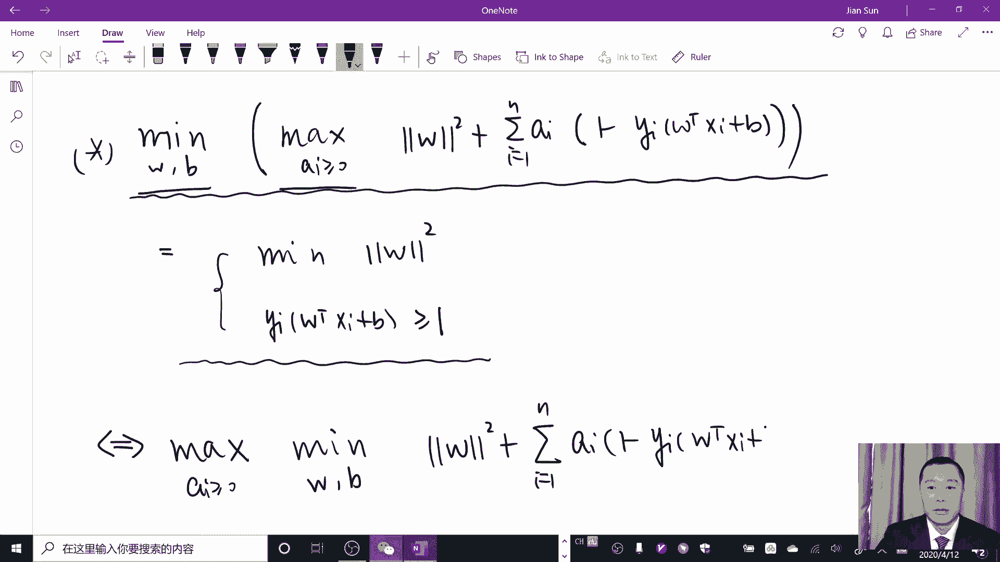

大家可能会问我们是不是任何一个mini max都可以这样去交换来的顺序，而不能绝对不能。

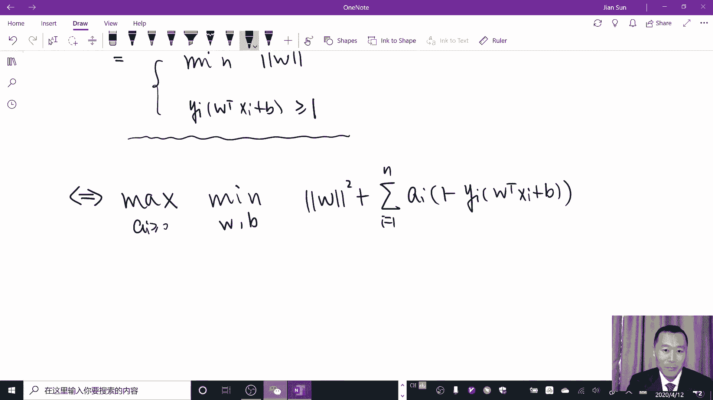

但是眼前的这个问题是可以的，因为眼前的这个问题，我们要里面的这个函数是关于w的一个凸函数，对于这种凸函数，minimax一般来讲是可以的，但是对于一般的任意的这么一个量。

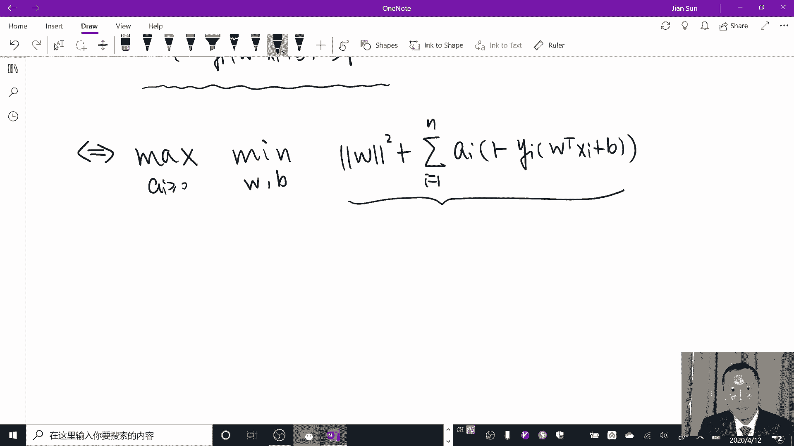

我们是不可以的啊，具体这个地方为什么可以。

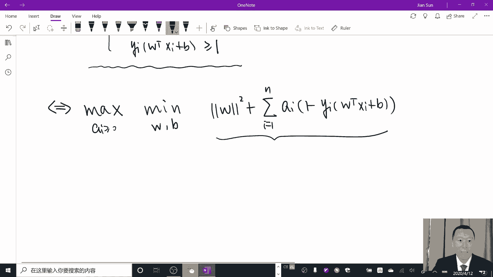

那我们在讲义中给大家详细证明了，我们在这里呢就不去给大家好了好。

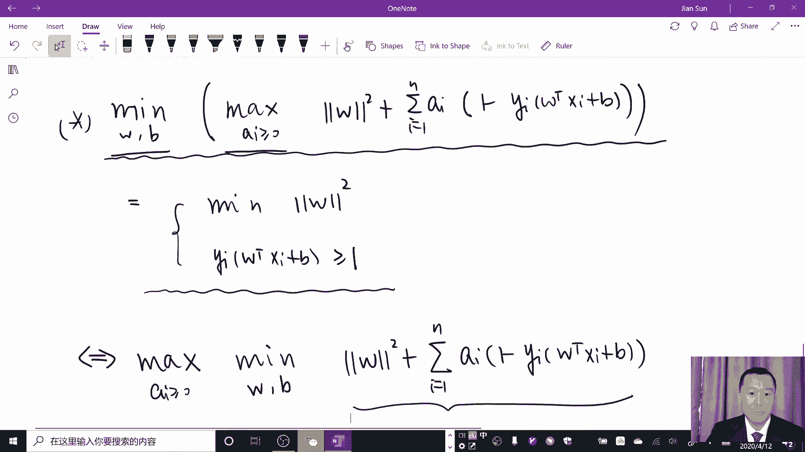

总之呢这里是个关键，就是我们把命和求max的这个环节把它交换了以后，问题就变得更加简单了，我们再看看现在的这个量mean的这个过程就比较简单了，因为我们对于ai暂时就考虑ai了。

我们在所有的w和b中去求眼前的这个啊这个minimize的问题，这个问题怎么解呢，那我们就对w求梯度就好了，对w求梯度之后就会得到两倍的w，它要求等于啊求和i等于一到n，这里面就是两边的w。

你对w两边求导，那这就是ai，这就是bi，这是第一步要满足的，但是你还得对b求导，那同时呢它还要满足呢，a i y i等于零，就是i等于从求和从一到n，所以对于这个minimization的问题。

我们就会得到这两个要求，那同时呢我们就得到了w呢，当然就是1/2的a i y i乘以x i e到n好。

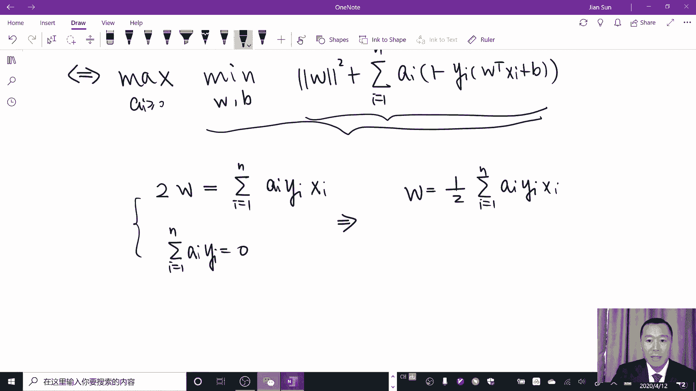

我们把这个再带回去，那么minimize的问题我们看一看。

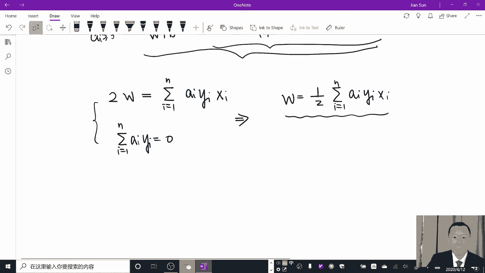

你试一试啊，minimize的问题就变成负的1/4，求和ai aj yi a yj x i的转置乘以x j，这里呢i j都分别从一加到n，然后呢后面呢是加上括号啊，求和ai房里好了。

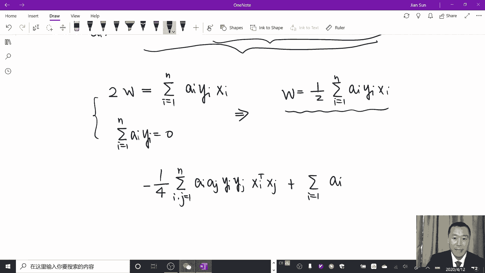

minimization的问题就解决了。

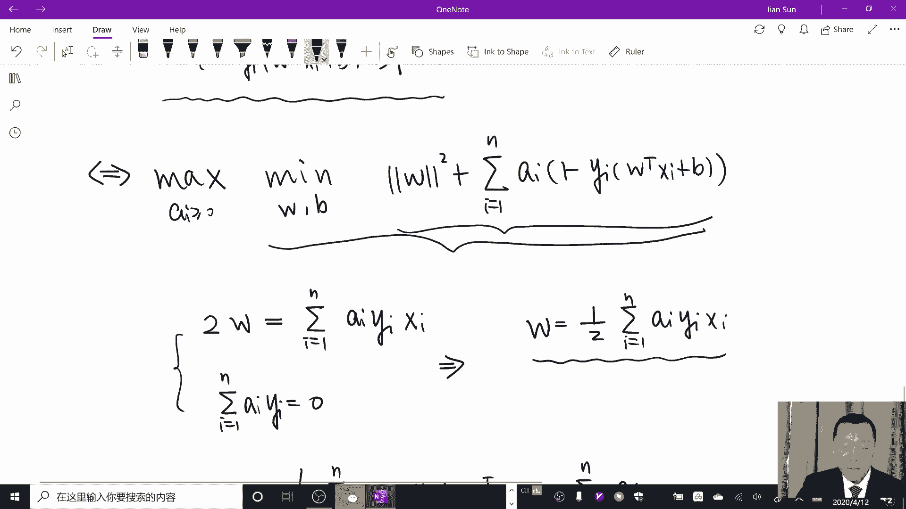

就等于眼前的这个问题，我们在下面在前面再把maximization放进去，就是说我们要在所有的ai大于等于零的里面去挑选。


让这个量最大的那个量，同时呢还有一个约束条件就是a i y i等于零对，就和i等于一到n好。


我们这是在干什么呢，我们相当于是把刚才我们这个二次优化问题经过一系列的转换，转换到眼前的这样一个优化问题，我们看看眼前的这个优化问题里面啊，外i都是给定的对吧，所以我们并不担心这些yi这都是给定的。

所以眼前的这个问题就是针对于ai的一个问题，我们把这个二次优化问题变成了一个二次优化，针对于这些自变量是a i a1 a21 直到a an的一个问题，而且呢你看这个变量里面，我们要优化的这个变量里面。

这些a i啊也都是一次的和二次的，对ai的约束呢也是依次的，首先我们要求ai yi乘相乘相加等于零，又同时要求所有的ai都是都是大于等于零，因为我们对这个a i的约束呢是是线性的一种约束和约束。

而要求max mc的量呢对于ai来讲呢，其实是一个二次型的一种呃的优化，所以呢这又是一个二次规划问题，这是二次规划对于ai的二次规划问题，只不过是对于ai的二次规划，那这个问题当然你可以去调取软件包。

也可以迅速的求解好。


到目前为止呢，我们会看到原来呢我们把关于w的一个二次规划问题。


转换成了关于ai的一个二次规划问题，看上去我们并没有减轻我们的计算量，因为我们最后还是要调取二次规划的软件包，那我们在这个过程中我们得到了一些什么呢。

唉我们在这里呢应该说我们毕竟是得到了一些这个inside。

就是我们得到了一些格外的启发，这个额外的启发呢就体现在这儿，你看在这里呢是关于ai的这个二次型，里面是由yi yj xi和xg的内积组成的，嗯我们得到的启发是说啊，如果是另外一种形式。

其实这丝毫不影响我们眼前的这个二次规划的求解啊。


我们这样想一想啊，如果说呀这个我们有这么一个f，这个five呢是把rk空间呢把它扩张到了你，比如说r m空间，这个k是小于m的，这个这是怎么扩张呢，它把每一个x在这里呢映射到了fx。

它就是一种升维或者是一种非线性的变换，它把x变到了另外一个空间中，但这个变化过程可能是一种非线性的，当然也有可能就是一个简单的升维，但也有可能是一种非线性的，那这样一来它变到rm空间去了。

那么我们原来的那些x1 y一在给定的，现在呢也都变成了说fx 1 y11 ，直到find x n y n，那这里的这个fx i呢，这都属于rm空间了，好我们想一想，在原来k为空间中。

比如说我们是无法做到线性可分的，那是不是在rm空间都可以变的是线性可分的呢，那这样的例子其实我们以前讲过，我们讲过，如果是在二维平面上用圆来区分的，圆的内部的点和圆的外部的点，它是没法线性可分的。

但是我们经过了一次带有多项式的一次二次项加进去，做了一次升维之后呢，在一个更高维的空间，它就变得可以是线性可分了，这就是我们眼前的目标。


我们眼前看到，如果我们进行这样一次升维之后。


在rm空间我们进行支持向量机，我们支持向量机的表现形式将会是什么呢，按照咱们刚才讲的，我们在arm空间的这个表现形式啊，也会是这样，就是求解一个max，这是负的1/4，这就是i g等于一。

一直到n a i k j y i y j，那就变成了fxi和fx g的的形式，再加上所有的ai的求和，i等于一到n约束条件呢也有这个约束条件呢。


就是所有的一样啊，就是a i yi等于零求和，同时还要加上所有的ai都大于等于零，这就变成了咱们的新的约束条件了。


好如果说这是我们的约束条件的话，如果说我们求解出来了，比如说我们解出来了，做了这个二次规划，我们解出来了这些a1 a2 啊，比如说a an都我们都解出来了，那么最后这对于我们的这个所谓的这个超平面。

所谓的这些这个划分，区分原来的点，那我们该怎么区分呢，一旦我们解除这些来了，我们知道，那咱们现在的这个，就是我们现在的这个这个就是所谓超平面，在rm中的这个照片里面，它就会成为啊，说是这样的，就是。

啊你解出这个来之后呢，那么w呢它就会是a i y i和fx i一到n，所以我们现在这个rm中的这个超平面呢。

就是w和x的内积加上b等于零，也就是说这个超平面就是这样决定的，就是所有的求和ai yi xi和x的内积，啊这rm平面啊，这个sorry，这个这个这个x不应该是先让fx更好一些。

这就是fx的内积加上b等于零。


好在rn平面的这样的一个超平面，就等价于啊在这个超应该说是超曲面，就等价于在rk空间的这个超曲面，这个超曲面就是我们眼前的这个超曲面，就是说啊最后啊i等于一到n a i yi fx。

i和y x加上b等于零的这个超曲面。


这回想到咱们这个二维空间，我们曾经说过，在咱们二维平面上，如果说这些点并不是线性可分的，而是说根据他们到原点的距离的话，那我们最后得到这个超曲面呢就是一个零啊，就是一个圆，就是我们所谓的这个超曲面。

但这个超曲面呢在升维了之后呢，很可能就是一条直线，就是对。

在我们的原来的这个空间呢就变成了一个超曲面。


那这样一来，我们自然的就把这个问题变成了一个，就是把眼前的这个问题就变成线性问题，支持向量机就变成了一个非线性的，其中在这里的关键就是内积呀，看成是y加上一个非线性变换之后的一个内积好。


这是我们的第五点，最后我们再第六点做最后的。


延伸，既然我们的内积形式，同时呢我们也可以看到升维之后就变成了fxi和fx j，我们可以更一般地给出一种更一般的内积，更一般的内积就是一个二这个k xi和xg这个更一般的内积。

其实其想象就是从做了一个非线性映射来的，就是这样的更一般的内积，但是这个更一般的内积我们可以脱离这个fine一般的来定义，比如说我们让这个这个fxi和xg啊。

但是呢我们也可以让这个fx i x j啊是一种其他的形式，平方也可以构成一种内积的形式，甚至呢我们可以一般的来写，可以写成一个a加上必备的xi xg它的m次方，其中这里的a b都是大于零的。

m呢是个正整数，甚至呢我们可以呢让这个内积形式呢我们引入一啊更复杂的这种形式。


也就是说呢其实我们可以定义这种一般性的这种内积。


各种各样的形式，当然了，只要但是要满足，只要只要满足什么情况呢，只要这个k一般的啊x1 ，就是这种一般的这种累积啊啊，构成了一个矩阵，对于任何的x一到xn都是positive definitely。

就是都是正定矩阵，满足这个条件的时候，我们说这样的一个内积形式的k就成为一个核函数。


因为这个和函数满足下面那个性质。


它就一定可以对应到这样的一个非线性映射，fine或者是一个升维的线性映射。


满足这个条件，k就称为和函数，之所以成为和函数，是因为它就可以对应到一个f，这个φ是从rk到一个rm空间的一个映射，可以是线性，也可以是非线性，但一般来讲它是一个非线性。

这个函数它们俩之间是一个一一对应的，其中呢更有意思的是呢，这里的m呢还可以等于正无穷。


就是小于等于正无穷，那什么时候m等于正无穷呢，你比如说刚才我们定义的这样的一个函数，可以证明，其实它对应的那个fine是一个把它升为到了一个无穷维空间的。


所以其实这个和函数的有意思的引入。


对我们来讲，它就等于成功地帮助我们解决了一个问题，我们使用什么样的核函数，相当于我们做了一个什么样的一个高维的映射吧，一个线性问题很可能就变成了一个非线性问题，甚至这个映射呢可以映射到一个无穷维的空间。

如果我们做了这个和函数之后，我们的二次规划成为什么样的呢，就是咱们原来一直关心的这个二次规划，它就成为这个样子了，我们要去做maximization。

1/4求和i j等于一到n ai aj i i y j，这里面就变成和函数k xi和x j加上所有ai的求和约束条件，就是所有的a i yi等于零，同时呢所有的ai还得要大于等于零。


一旦我们解出来了，求解出来了，那我们那个划分的那个超曲面该怎么定义呢，这个超曲面就变成了这样一个定义形式了，我们求解出这些ai之后呢，我们抄曲面呢就是类似于它作用在任何一个x上，那就是a i yi。

所以我们最后的分类问题就变成了这个分类问题。


就变成了fx是大于零还是fx是小于零，在大于零，我们是分成一类，小于零，那边是分成那一类，这个问题呢你看对应的一个核函数就求解一次二次规划。


求解的这个二次规划，我们最终就得到了这么一个超曲面的分类问题啊。


关于支持项链接它最后的那些本质的算法。


我们这一节呢就给大家讲了，在这里呢因为我们今天是来讲这个本质的这个算法呢，其中还有一些小小的细节，这些细节呢我们最后呢还要在课上给大家进行补充。


比如说哪些细节呢，就是我们最后求解出来的点呢，所有的这些ai并不是每一个都大于零，可能会有绝大部分的a i都等于零，最后只有少数的这些ai不等于零。


不等于零的那些点就真正构成了，就像刚才我们上面的这个图似的。


有最后你像我们眼前的这个图，它就对应了那些a i m真正是大于零，这个呢也是对应的那个ai的真正大于零，这些点呢就都是等于零的，所以真正大于零那些点呢就是构成了支撑向量，support vector。

这是我们最后就像咱们在机器学习的课程第一讲中讲的，多项式逼近似的，这就是我们最后最终的对我们最有意义的那些支撑的向量，这是一个细节啊，第二个细节呢就是这里的b该怎么去找到这个b啊。


其实呢我们这些优化里面都是带着b的，只不过呢最后呢我们求解了这w和找出这a i之后。


还要把这个b呢也找出来，第三呢接下来的细节呢就是在我们做非线性规划的时候啊。


这个非线性的嗯说话的时候。


这个和函数对应到一些不同的核函数的时候，为什么它对应到一个非线性的映射，那这个呢我们在课程中呢也会再详细的讲一下。


但但是我们今天已经把整个的支持向量机，其中最核心的算法的想想法都跟大家展现在这里了，那么大家呢可以试图去自己编写一个支持向量机的软件包，那主要的核心就是调取二次规划，现在调取支持向量及现成的软软件包。

或者是现成的软件包中，其核函数不满足你的要求，你就需要自己去定义和函数，然后调取二次规划的软件包，用自己的一个支持向量机的新的算法，所以我们学习机器学习呢就是要核心是这些算法。

因为现成的算法往往不满足我们的需要的时候，我们就需要知道如何去编写满足我们需要的算法。


我们今天关于支持向量机的讲述呢就到这里。

