# P8：Lecture 8 Bayesian Estimation - ___main___ - BV1fv411r7z1

好大家好，我们今天呢开始我们又一讲，就是我们机器学习的第八讲，我们今天呢给大家要讲的呢就是一个线性判别法，那么但是这个线性通常所说的这个线性判别法呢，是通过所谓贝叶斯估计。

或者是有的地方呢叫做朴素贝叶斯估计得来的，嗯我们做这一讲呢，一方面是给我们目前的模型呢进一步的来补充，另外一方面呢给下一步呢我们来用大规模的利用贝叶斯的方法呢，比如说在em模型算法。

以及因为马尔科夫过程呢，我们做好一个概率上的这么一个铺垫，就是呢进一步的熟悉这种贝叶斯的这种方法，好我们从吉大四人估计来开始展开我们这个方法的学习，什么叫极大似然估计呢就是通常呢咱们这样说。

比如说我们给定了一个概率空间，啊我这里呢所使用的记号呢是这样的，那么这个omega呢就是整个的，这个就是代表了所有的omega的，代表概率空间的所有的元素，啊这个花钱的这个f呢。

通常呢我们代表就是这是在现在的概率论里面，所经常说的一个sigma代数，大家呢不用慌，看到sigma代数，这就是说sigma代数的意义呢，就是说我们将要给出这个概率空间中的这个子集，以一个概率测度。

但是这样的子集呢我们不可能说随便的一个子集都会有一个概率测度，只有对应于一个这个花写了f里面的这个sigma代数中的子集，我们才会去谈它的概率测度好。

所以这个花起来iphone就代表我们可以给出测度的这些集合啊，最后的这个p呢就是代表这个概率测度了，这是我们通常说概率空间呢就是呃用这三个啊三位一体，我们来代表这么一个这个比较定义好的这么一个概率空间。

不熟悉也没有关系，那么接下来我们说呢，x呢是这个概率空间上的一个随机变量，既然谈到随机变量了，那我们接踵而来的就会知道我们有这个随机变量，它所满足的这个umulative distribution啊。

就是一个累积的分布，有累积的分布呢，当然也就有它的density，特别是这个随机变量是连续的时候，我们就可以去讨论它的这个density，好，我们假定啊这个x所满足的这个概率分布。

它的dd方式呢是小写的这个p加上一个数，当c这是什么意思呢。

这个符号呢就是表明x它的密度函数就是x的密度函数，它的密度函数中啊有一个参数有c的作为它的这个参数，那么有参数的这个密度函数啊，我们经常能够见到，比如说高斯分布，那在一个标在一个这个正态分布中。

你看我们有的参数有mean，就是它的均值是它的参数，我们有三个divation啊，就是标准差，这都是参数，再比如说我们在一个指数分布中，那个指数的那个lambda，那也是参数。

一般来讲我们碰到的密度函数中的都会有一个参数，所以呢我们在这里呢也是有这样的一个参数，问题是呢这个参数呢我们可能是不知道的。

所以说极大自然估计就是我们要讲的这个第一个问题，就是想办法去估计这个参数，估计出了这个参数呢，我们就对这个随机变量有一个更好的理解了。

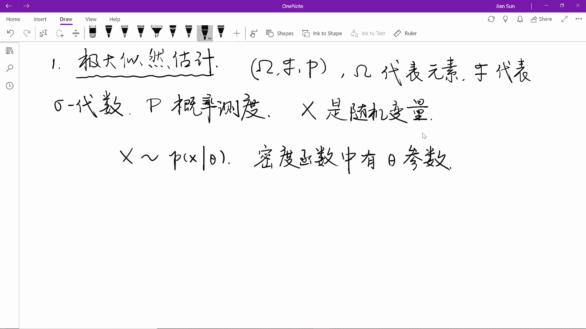

我们怎么去估计这个参数呢，我们当然用统计的办法，我们就是说一次又一次呢来给出这个x的一组独立的这种抽样的样本，比如说啊我们就给出了小x1 ，小x2 ，一直到小x n这呢就是，独立的抽样。

这样具体取值的这样的一组样本，那么在这样一组独立抽样下，我们来看看我们有没有可能利用这一组看得到的数，我们来估计在原来这个随机变量背后的这个c的的这个参数是多少，那么我们看啊，既然是给出了小x1 。

小x2 ，小x一直到小x n，我们看看既然他们都是独立的，那么产生的这些啊，这一组他们的这个密度函数就显然呢就是这样小x一带的这种参数，c等的密度乘以小x2 的密度，一直到小x n的密度。

所有这些的无穷乘积，我们一方面呢又可以用，而不是无穷乘积这么有限的成绩，我们也可以用i等于一到n p x i到c的来表示这样的一个c的呢，我们叫做lc的，所以说你看背后对应着不同的参数。

那么观察到这一组x一到小xn这样的这种密度函数，当然也就给出来了，所以不同的sa就对应了这样的眼前的这么一组n个的乘积，其他四人估计背后的想法是说我们去取一个sa，比如说sa对的。

他就是在所有可能的这个lc它中，那么取到最大的，使得这个l取得最大的，也就是说argument max在所有c的中，我们让这个乘积i等于一到n px i c塔的成绩取到最大的那个c的。

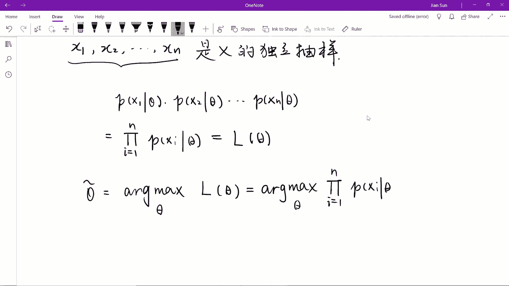

我们将这个c它来带。

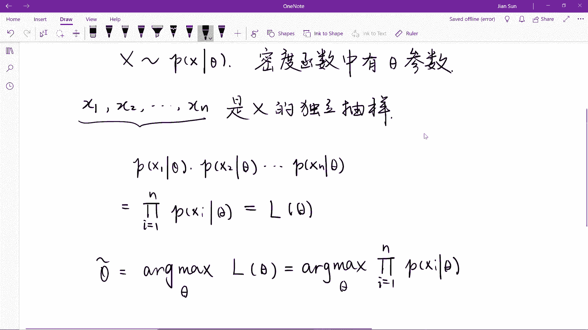

就是来作为我们这个参数的估计，这样的一个参数估计的过程就叫做极大似然估计。

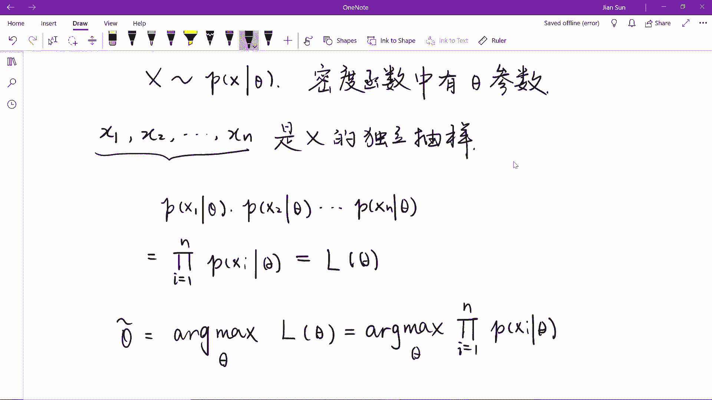

好我们看一看其他三人，估计如果是这样定义的话，我们从另外一种角度来看，既然眼前是一个乘积，我们呢就取一个自然对数，那我们当然知道取自然对数，自然对数呢是一个啊，比如说log log x这是一个自然对数。

自然对数的图像，我们都知道这是一个这样的图像，它是一个递增的，取值呢是从零到正无穷啊，这个取值呢是它的定义是在零到正无穷，取值呢是负无穷到正无穷，但是它是一个严格递增的函数。

所以说原来的函数如果在某个c塔取到最大，那么你前面复活上一个log以后，仍然在同样的c大能够取到最大，但是好处呢就是去加上log之后，那么连乘积就变成了求和了。

所以那么极大自然估计通常也是写成为argument max，那么这里面呢就变成了求和i等于一到n，那么这边呢就是log p x i c的，那么把p x i c的放到log后面是可以的。

是因为作为一个dcity function呢，就是这个小p x i c t啊，其实永远是一个正的，所以说它是落在了自然对数log它的这个定义域中求极大，似然估计既可以去对连乘机去求。

也可以对现在的这个求和去去求啊，两者呢其实是一致的，得到的这个seed hg，得到这个seed to的也会是一致的，我们现在把眼前的这个问题啊，我们用到一个具体问题上，我们看看在一个具体问题下。

我们是怎么应用这个极大似然估计的，那么我们就考虑一个伯努利分布，伯努利分布是一个二元的分布，换句话说呢，x呢取两个元素，就是我们眼前的这个随机变量啊，或者呢他取零。

或者呢它取一取零的这个概率呢是小p取一的，这个概率是q那么q也就是一减去p那这是一个二元分布，这个二元分布我们看一看，如果说我们眼前的这个随机变量就是满足这样一个二元分布。

显然这个二元分布啊背后的这个参数就是p，假定我们并不知道背后的这个参数是p，我们该如何去估计出这个背后的参数来，比如说举个例子啊，我们有这么一个袋子里面呢有很多的球。

那么这些球呢可能是每个每个球呢它的重量，体积啊，大小啊，手感啊都一模一样，但是呢就是可能就有两种不同的颜色，比如说一种值啊，白色，一种叫黑色好，那么从这个意义上来讲，那么当这些球充分混合的话。

我们可以近似的看成这就是一个啊概率空间，我们取出的这个球是什么颜色，它就是一个随机变量，它可以是白色，那么也可以是黑色，但是呢由于我们预先不能打开这个袋子，也不能去清点这些球。

所以说我们就不知道我们去取出的这个球是白色的概率，或者取出的这个球是黑色的概率各是多少，我们怎么办呢，延续刚才我们的说法，我们就要去独立的来进行抽样，那么所有的这些的抽样。

比如说我们得到的就是x1 x2 ，一直到x n，我们来看一看，从我们的这个概率分布的角度，我们知道当x等于零的情况下呢，这个概率就是p那么当x等于一的情况下呢，它就是q或者是一减p好。

我们这里就可以写成了p和一减p x y等于一的时候，那么我们继续看一看这个表达式，你把它带进去，你把它带进去呢，它就是一减p跟我们刚才的对这个不努力的这个假设呢是一模一样，既然如此呢。

眼前的这个例子可以说这是一个离散的密度函数就给出来了嘛，lisa密度函数给出来了，那么我们就把所有的这些抽样的这些密度函数来做一个乘积，好作为一个乘积呢，我们也可以说我们的这个参数是小p。

我们呢要把所有的那这个p一减去x121 减p x1 ，当然我们还要把第二个乘起来，1-1直到第n个，我们把这些盛起来哈，眼前呢乘起来看上去呢非常的乱，但是呢我们可以简单的做一个区分，我们会看到。

那么这就是p有多少个这样的p呢，那就是p的k次方一减p呢，那还剩下多少呢，一共就n个，那么有k个是x等于零，那就是n减k和x等于一，所以这个lp呢其实就是眼前的这么一个比较简单的表现形式。

虽然呢他连乘积看上去很复杂，但其实呢我们稍稍的想一想，他其实就是眼前的这么一个简单的表示，也就是我们简单的区分中x等于零或者一就可以了，眼前我们剩下的问题就是去寻找这个所谓to的p吧。

就是argument max，就是使得眼前的这个表示是最大的，就可以了，根据我们刚才讲的，眼前的这个最大的也就可以等同于求自然对数，那求了自然对数之后，就是k乘以log p加上n减k log一减p的。

对于这样的一个关于p的一个函数，什么时候求到最大呢，那当然我们很简单，我们就对于眼前的这个函数，我们去求导就可以了，我们对p求导之后，也就是f一撇p就等于k除以p这面呢是减去n减k。

这里面就是一减k我们让它的导数等于零，我们就可以求出来，也就是说k乘以一减p等于n减k乘以p，因此就得到k减k p等于np减kp好，最终我们得到了我们希望的这个p two的。

也就是在满足上面这个一亏损的情况下，就是k除以n那么回忆一下我们这里的k的定义呢。

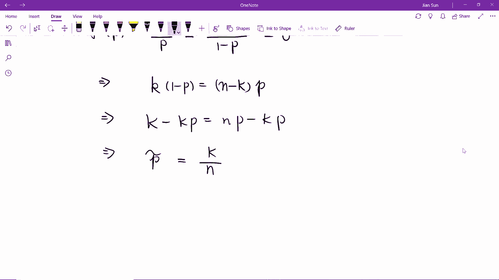

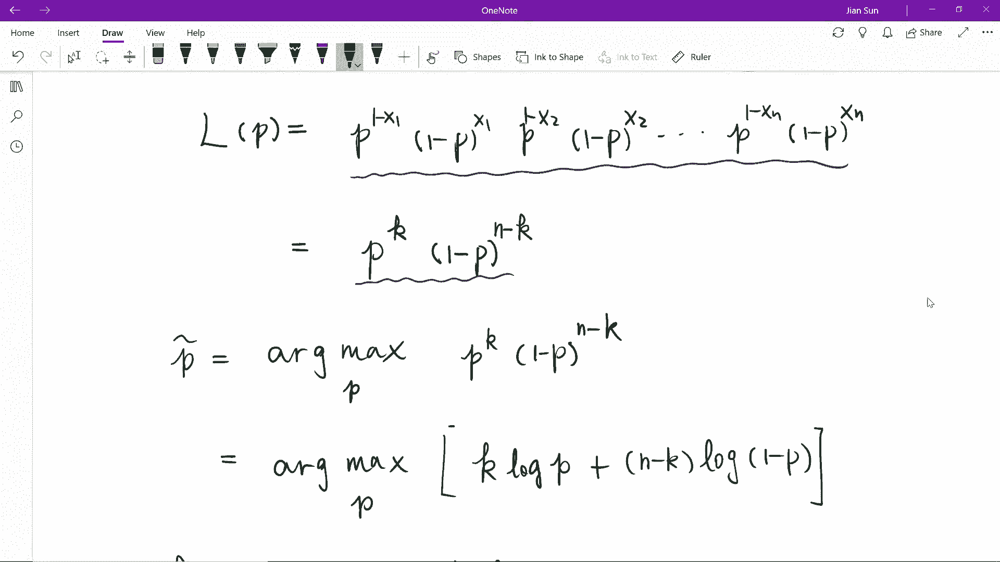

除以n啊，这就是所有的我们用集合表示，等于零的那个集合的个数，再除以n就是我们对于这个x就是原来的这个随机变量，大的x等于零的一个最佳的在吉大四人估计意义下最佳的一个估计。

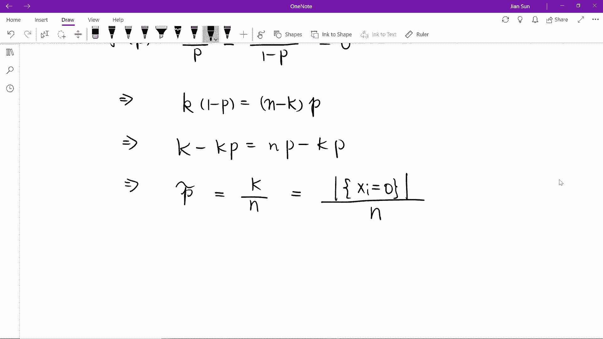

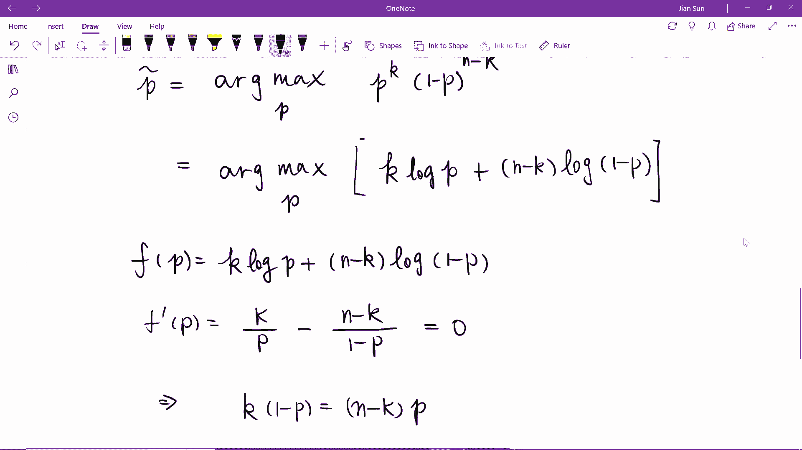

那这个跟我们的直觉啊，应该说是非常吻合的对吧，我们有了n个抽样，其中k是等于零的，n减k是等于一的，当然我们就会去猜测。

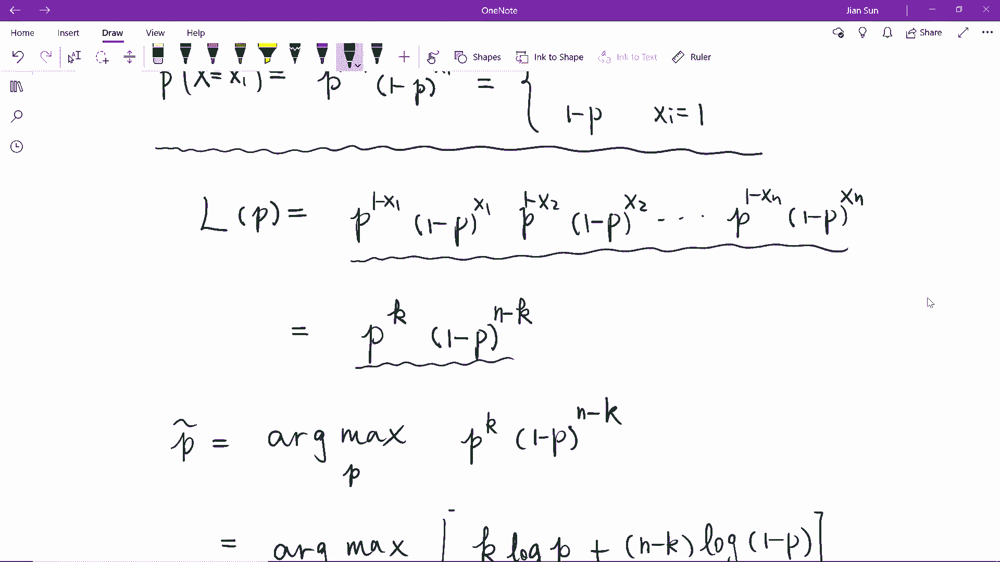

原来在这个随机变量，那等于零的概率呢就是k除以n，所以我们对于最佳的这个p的估计就是k除以n。

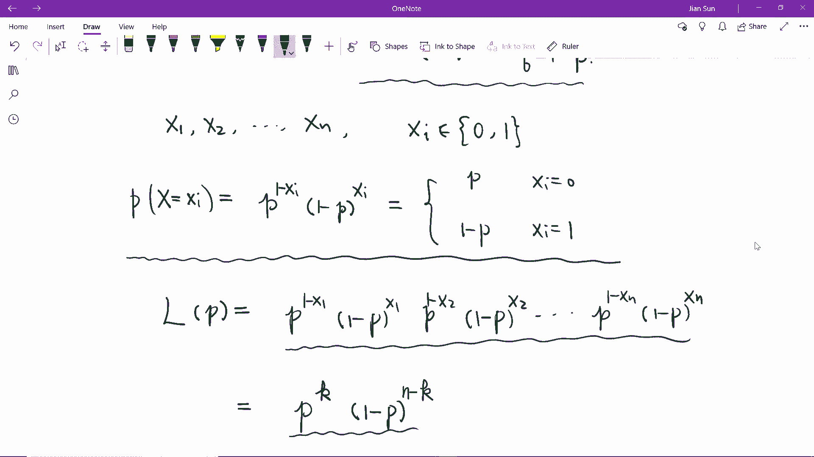

好。

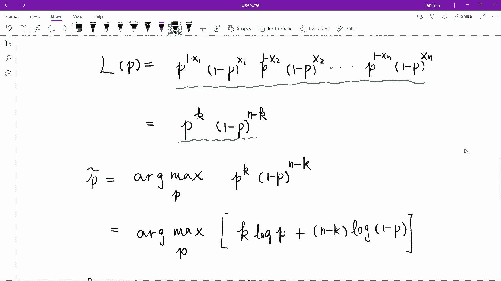

眼前呢就是把几大私人估计，这个概念应用在二元的这个博努力分布的情况下。

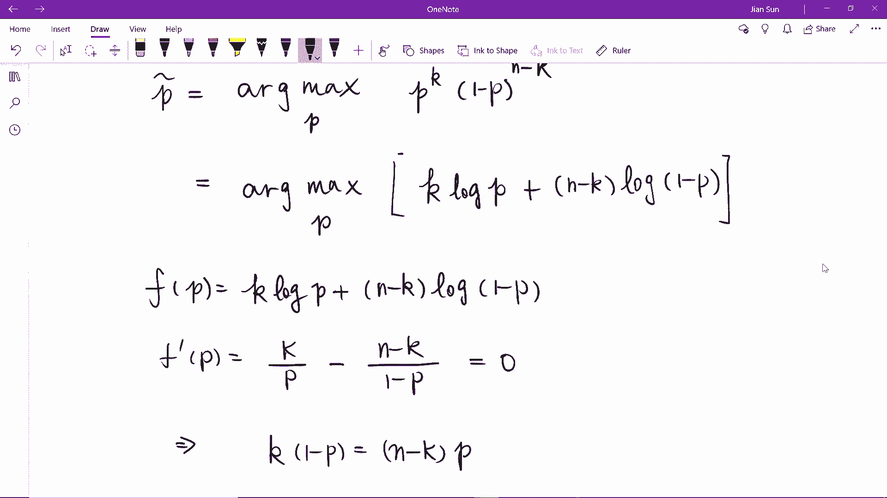

的这么一个简单的应用，在多元情况下，其实道理是一样的，我们留给大家去思考，简单的说一下，就是在多元的博努力分布下，比如说x呀，它的取值是并不是零一了，那么其实它呢可以取若干个值，比如说他们可以取啊。

嗯我们这里举一个例子，我们说呀他以，比如说他以啊小p一的可能性取得一个a1 ，它以小p2 的可能性取a2 嗯，它以小p n的可能性取an，而且背后的这些pi i等于一到n的求和呢不得不少就是一只。

不过呢现在呢所有的这些p1 p2 ，一直到p n这n个未知数呢我们都不知道，虽然说好像我们眼前有n个未知数，但其实呢是n减一个未知数，因为他们要满足其求和等于一这个条件。

所以本质上呢其自由度呢是很简易的，自由度，现在呢我们就去对啊，对我们现在就对，这样我们稍稍把咱的记号改一下，为了把这个变成小k其实是一样的，或为了跟我们上面的统一，我们上面呢是n个呢是表示n个抽样。

我们现在呢也取出n个抽样来，x1 x2 ，一直到x n，当然了，你会看到我们现在呢已经有，就是原来的这个随机变量可以取k个不同的值，所以说我们现在抽样呢，这个n呢一般来讲啊要比这个k要大很多。

这样才有意义，所以当我们有n个抽象的时候，我们当然也想去估计原先的这里面的小p小p2 ，也知道小pk是多少，这个时候处理方法跟二元的处理方法是一模一样的，所以我们在这里呢就不多讲了。

留给大家呢去做这么一个啊小小的练习，这是在伯努利分布下做一个练习，那么留下来的呢我们还要重点讲一下高斯分布，就是正态分布了，我们就叫高斯分布吧，刚才我们说了高斯分布当然就是正态分布。

正态分布它其实是由每一个一维的正态分布啊，有缪这是一个均值，同时呢还有sigma平方，这是作为高层分布的两个重要的参数，满足高斯分布，那么其dc方式呢我们大家都知道是根号下二派乘以sigma。

分之一乘以e的负的是x减去mu的平方除以两倍的西格玛平方，这个就是高斯分布的dancing function，那假定我们现在呢可以取出独立的抽样的一组，满足高斯分布的这样的这个抽样。

它们分别是x1 x2 ，一直到x n，我们的问题呢就是想问其背后的缪是多少，sigma是多少，我们从几大私人估计来看一看，给出这一组抽奖之后呢。

我们其dancing function也就是我们眼前的二根号二派分之一啊，这是西格玛a分之1e的负的，眼前的这个dc方式要进行求乘积，i等于一，一直到n我们呢就要去求argument max。

对于mu和对于sigma求这个argument max，我们来试一试，这就等于我们去求log log之后，这就变成了求和i等于一到n bug之后呢，显然我们眼前的就是两项，第一项就是指数部分。

这一项我们就会出来负的了，第二部分呢加上啊也不是假，其实也是减，我们继续的减减去呢log sa再减去呢log根号下二π，总之呢它是个常数好，所以我们就要去对这样的这种向量来求argument max。

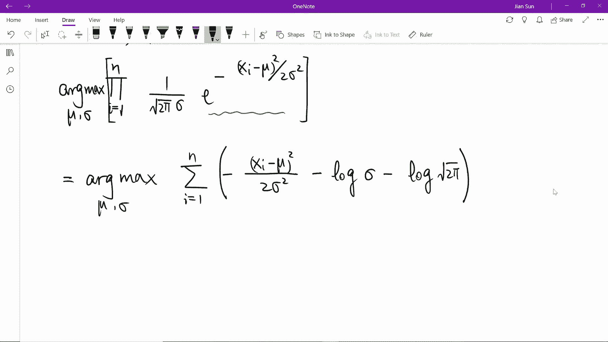

当然它就等同于argument的面，其实argument面我们都不需要写，但是我们这里就写一下啊，最后呢方法我们最后求导的时候呢，其实都是一样的啊。

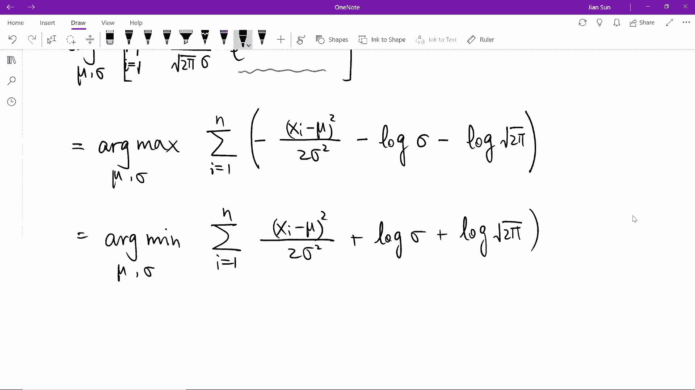

再整理一下，对于mu和sigma，这是几合，这边呢就有n个log。

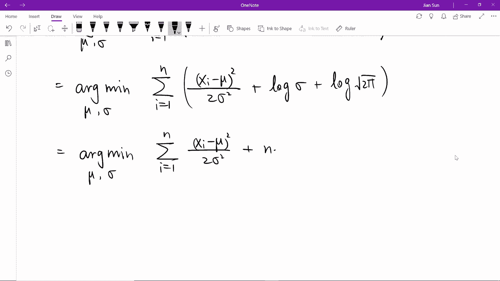

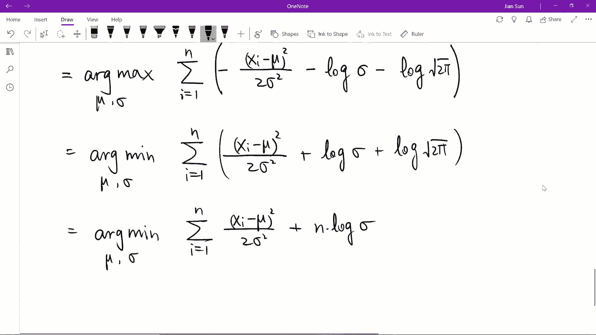

嗯我看一看啊。

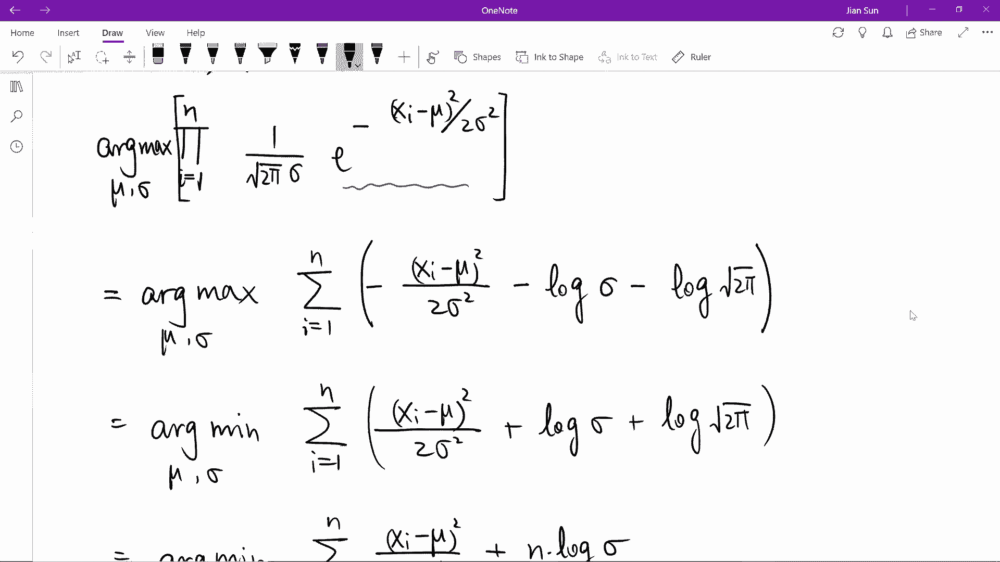

对的好，再加上n倍的，这是一个常数。

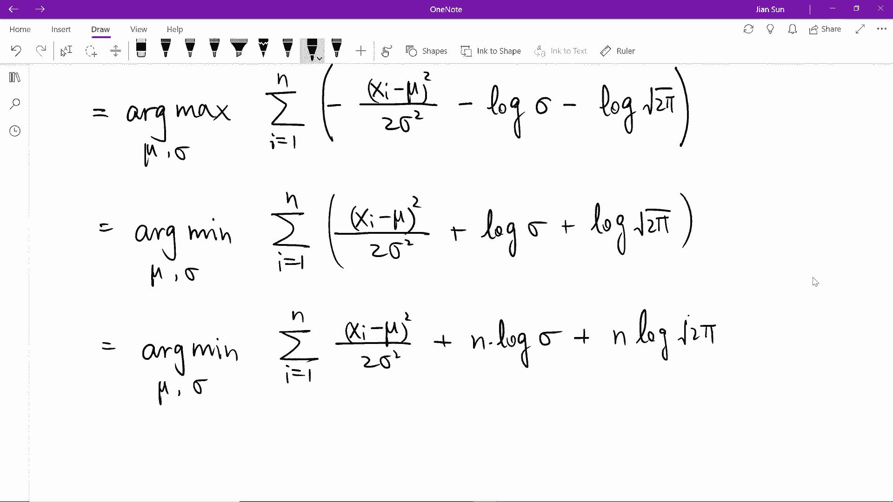

我们想对这样的一个变量求mu和sa的最小值，首先呢我们来看对于缪，所以求最小值，那我们就要去这个对缪来求求导数就好了，我们对括号里面，如果说括号里面我们把它写成是fm和c的表示式的话。

那么f等于u的导数，那就是这个就是求和号i等于一到n啊，我们需要这个式子等于零。

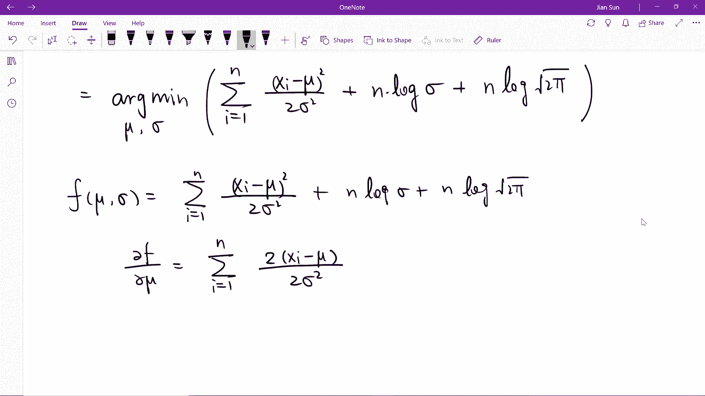

如果让这个式子等于零就推出来呢，谬就是所有的，其实你求不求导呢，其实也容易看得出来，我们会注意到这一步，直接注意到第一项，因为和mu有关的就是第一项，我们看到缪呢是一个值，我们大家都熟知。

那么就是在中就是在他们的重心，也就是他们的均值的地方是最小的，那我们现在只不过又一次验证了这个事实，得到了同样的结论，我们第二步呢对于f对于sigma来求导数。

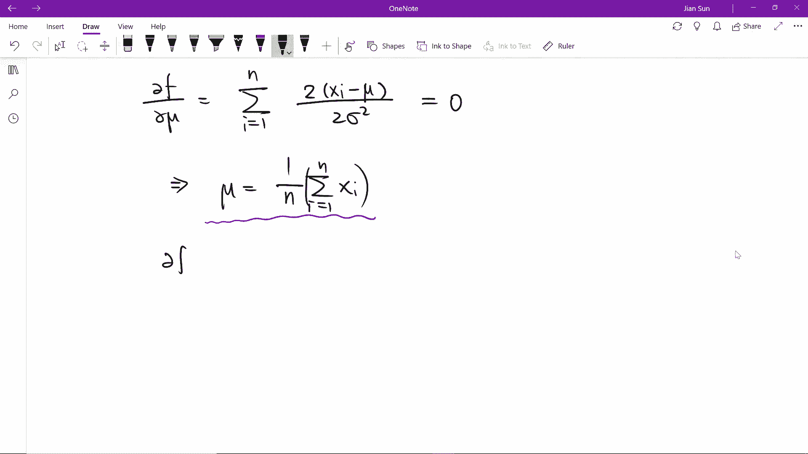

对于sigma求导数的时候，我们注意看一下好。

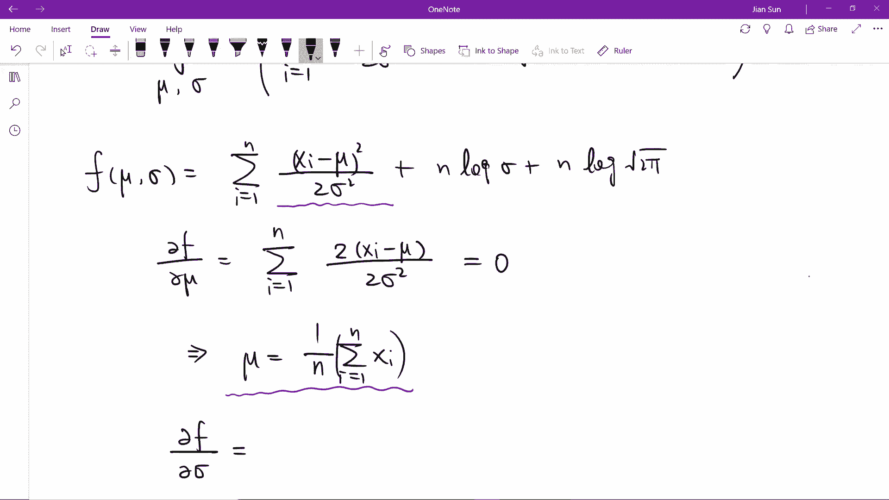

第一项来自第一项的就是负的，这边i等于一到n啊，这就变成了sigma的三次方，因为本来会出一个-2 r消掉，后面呢有一个n啊，除以c的，我们需要它等于零。

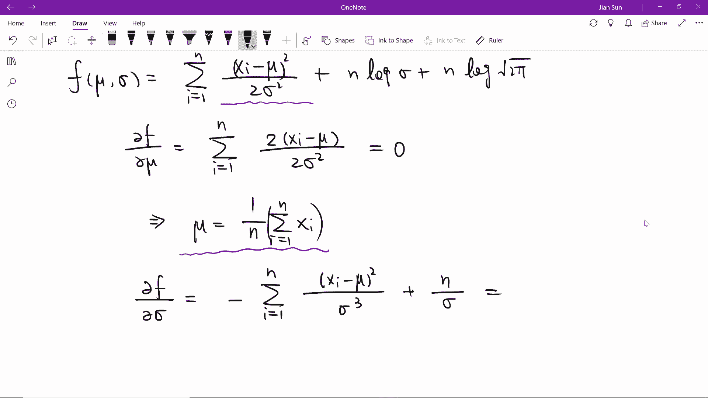

这样呢我们又进一步的得到c的或者是c的平方的一个估计，c的平方的估计就是n分之一，i等于一到n的求和，而mu呢就是咱们的均值，我们看一看在正态分布情况下。

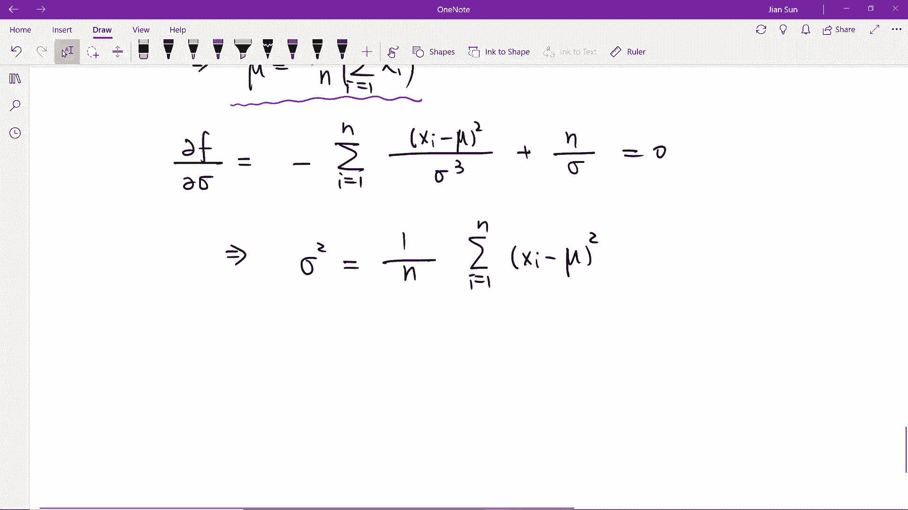

极大自然估计给出我们的参数估计啊，就和我们去一般的去计算一组满足一组正态分布，它的均值和它的方差，这方法是一模一样的，这样呢我们就对于其他四人估计使用在二元博努力分布。

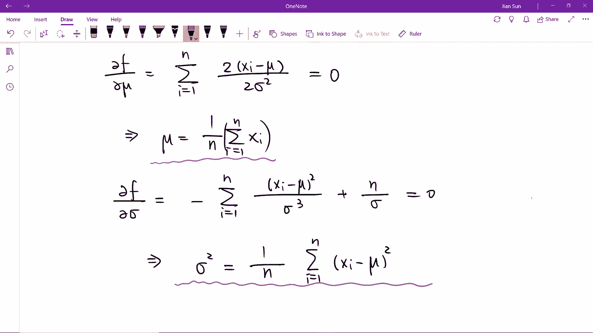

多元博努力分布以及高斯分布情况下，我们大概有了这么一个了解，其中有了这样一个了解之后，我们就可以来看贝斯估计，贝斯估计和我们刚才的这个估计有什么不同呢，在我们刚才这个估计中，而在贝斯估计中。

我们进一步的就考虑c塔不是一个参数，满足一定的分布，也就是参数本身呢也满足一定的分布，就是它不仅仅是一个静态的一个参数，它还是一个随机变量，满足一个分布的随机变量，这个时候问题就变得复杂了。

我们刚才的这些办法呢就不大对了，一，但是它满足这样的一定的这个分布的随机变量，一旦我们这样去说呢，其实我们就要假定哦，它满足了那个随机变量，这里的分布应该是多少，而往往在那个分布里面呢。

可能又有另外一些参数，总之我们还要对另外一些参数呢来进行假设，我们看看在这种情况下，我们来做一些简单的一种贝叶斯，估计好，我们如果说呀我们给定了啊一些抽样，这个抽样我们用s来表示给定的这样一组抽样。

我们目标是去估计对这个参数来进行一个估计，我们现在用就是我们通常所熟知的这个贝叶斯的这个公式来写一下，在这里呢我们就等于是两个随机变量，因为在前面极大自然估计之中啊，这个c的不作为一个随机变量。

它仅仅是一个参数，但是现在c的如果也看成是一个随机变量的话，我们就可以利用咱们关于随机变量的贝叶斯公式，可以把它写一下，如果把它写一下，眼前就是这样两个啊。

s和sa除以ps就是在dancing level上，而分子呢又可以写成给定了cat之后来看s乘以c，它的dsd再除以p好了，现在我们来看在我们原来极大自然估计的时候啊，这一项我们仅仅是估计这一项。

因为在这一项中sa是一个常数，但是在贝叶斯里面，我们不仅有了这一项，还有了后面一项，也就是我们还要把c的所满足的那个分布的dancc function一定乘上去，那才就是那才完整了。

所以呢我们看到如果给定了这一些s就是抽样的样本，我们去估计这些参数c的时候，我们就变成了一个argument max的问题了，argument max c的我们要估计的是给定参数，给定抽样。

我们想估计c的就等于argument max，就是同样的这个seed后面的这个表达式，但是在后面这个表达式中啊，跟c的有关的仅仅是分子，分母呢是跟seed是没有关系的。

所以我们最后就简化成了这样的一个公式啊。

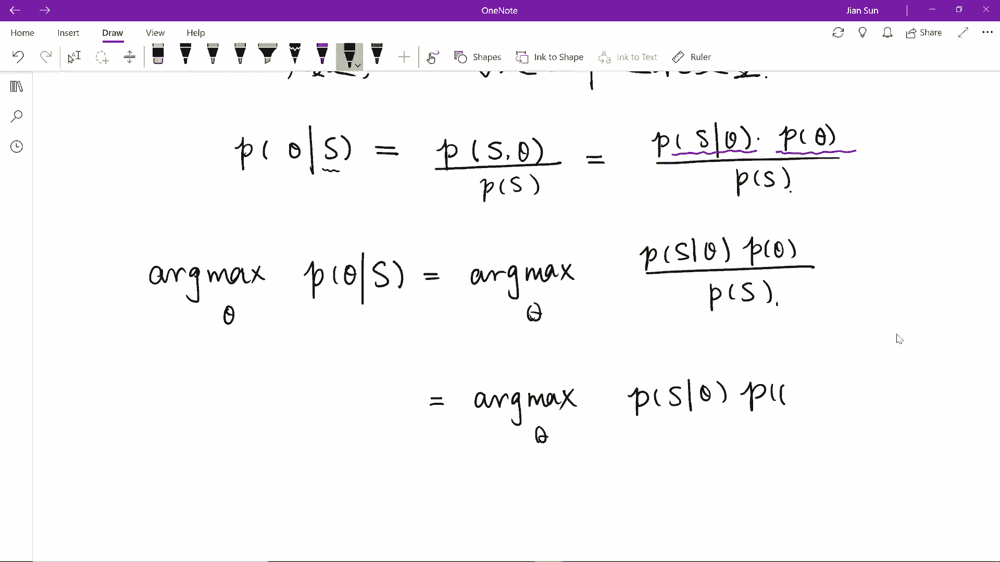

啊最后我们就简化成了这样的一个问题，这就是吉大四人估计和贝叶斯估计一个重要的区别，极大四人估计我们仅仅是去考虑这一项，但是在这个贝叶斯估计中，我们还要乘上一个后面的这项。

就是c的本身可能要满足的这种分布，我们来具体看一些应用。

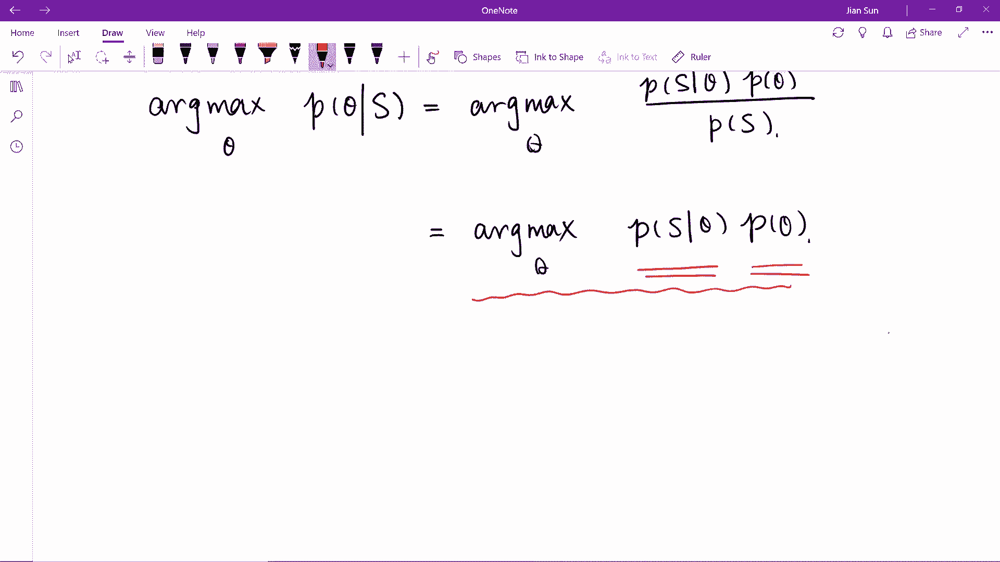

我们看看啊，这是这是我们的理论部分。

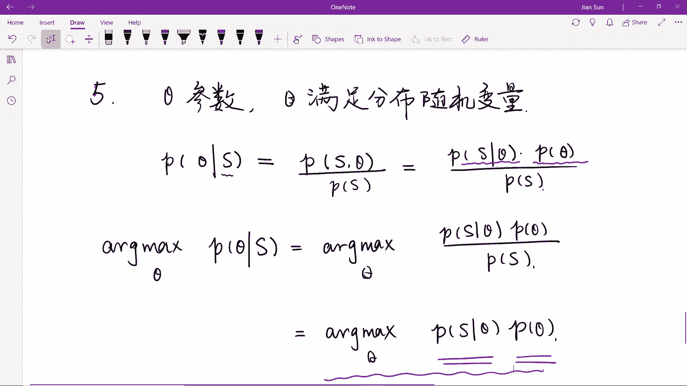

好我们来看一看应用，首先呢我们看这样的一个应用，比如说city啊，满足一个均匀分布，就是满足0~1上的这么一个uniform ribution，均匀分布，如果满足均匀分布的时候。

这个所谓这个pc的当然就是一了，恒等于一，就是c的满足的这个分布啊。

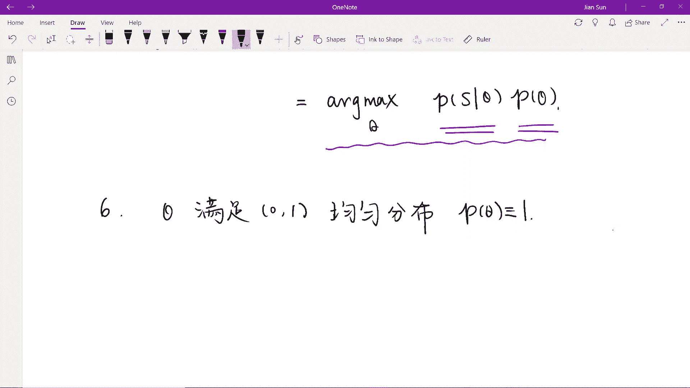

dc function是恒等于一的，所以这样一来呀。

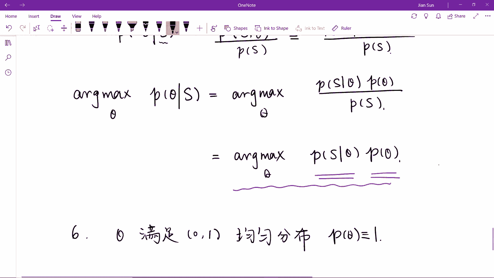

我们的这个估计问题就是说看到了样本，去对这个参数进行估计的时候，就完全等同于了，在右手边就是什么样的seer能够最佳的解释我们的这些样本。

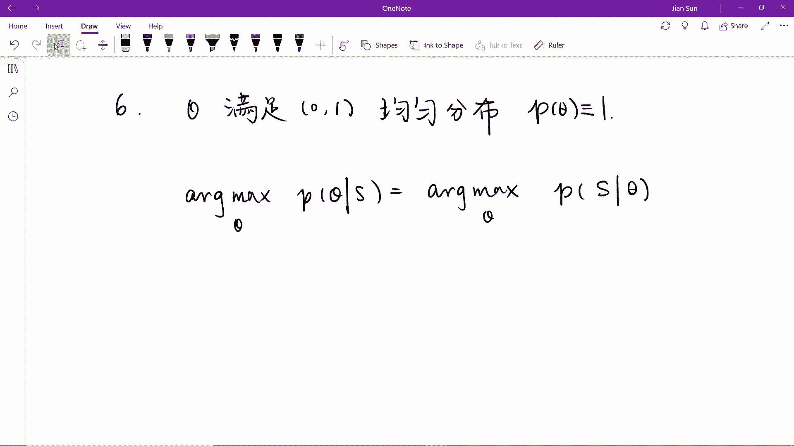

这是我们的几大自然估计就变成了一个问题了。

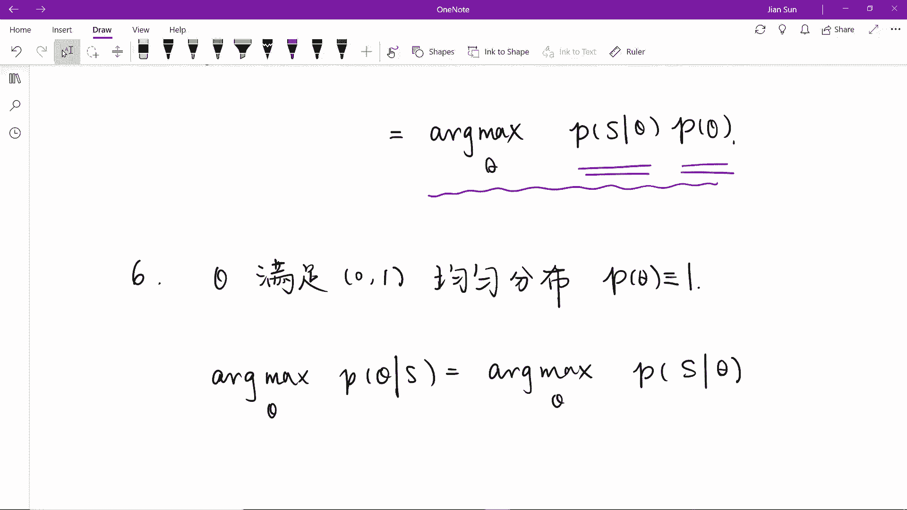

在这种情况下，就是c的本身是一个均匀分布的时候。

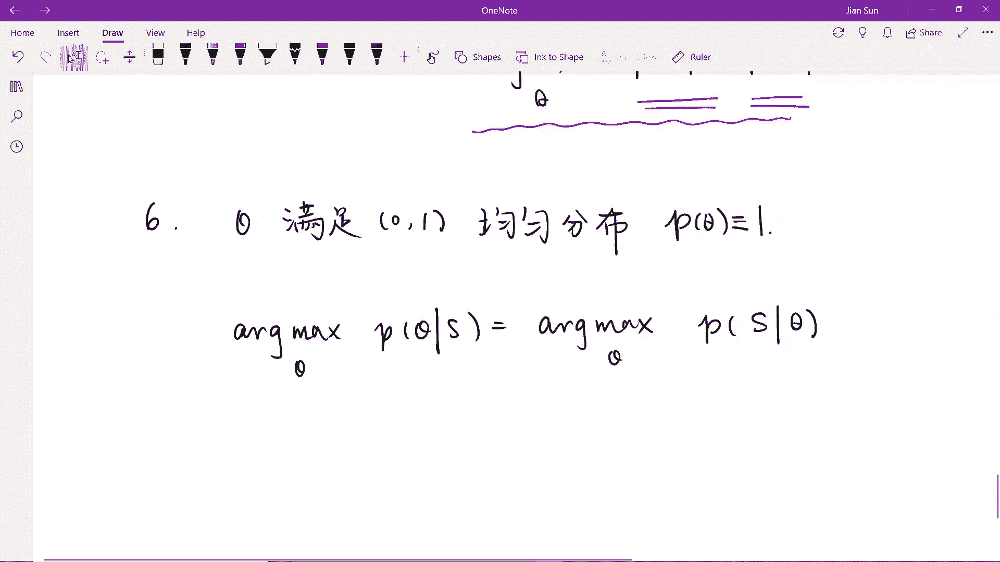

这个贝叶斯估计和极大似然估计就是一回事儿，但是不是均匀分布的时候啊，那么贝叶斯估计和极大似然估计啊就不是一回事了，因为我们这个时候就必须要把c大所满足的这个表示呢要放进去了。

关于贝叶斯估计呢有大量的更多的这种概率统计的这种啊书籍，我们在这里不再赘述，我们更关键的是贝叶斯估计直接对于我们机器学习，它的这种应用在哪里，那么接下来呢我们就给出在贝叶斯估计的这种指导意义下。

我们的一个应用，现在呢我们就回到呃，我们回到我们的分类问题，咱们回到我们的分类问题，就是我们一直在不断做的，用各种办法来做的这几种分类问题，给出x1 y1 x2 y2 ，一直到x n和yn。

每个y i呢无非就是取零或者是一它取两个值呃，我们以前试过各种各样的方法来解决分类问题，那么现在呢我们从的角度，我们来再考虑一下这个问题啊，我们假定啊原来的这些x呀是这样的一种啊。

当然我们要考虑这个问题呢，肯定还有一个出发点，你看我们在locsical regression的时候，有一个出发点就是概率上的一个解释，那么在感知机我们也有一个出发点，就是线性可分。

我们后来这个支持向量机是一个基于几何上的出发点，那么现在呢我们在基于一个概率上的出发点，这个概率上的出发点呢是这样的考虑的，就是我们把x和y看成是一个联合分布，把x y看成联合分布的时候呢。

我们就假定假定对于y等于零的那些x所满足的是一个高斯分布，这个高斯分布呢它当然有它的参数，比如说它的参数就是六零和sigmm 0的平方，这是他所满足的这个高斯分布，这是y等于零的情况下。

那么y等于一的情况下，也满足一个高斯分布，这个高斯分布是谬，一是一个m一的平方，两个高斯分布，但这是我们的假设，现在我们的问题就是根据已经看到了这些独立采样的这些这些点击，xi yi。

我们要去估计眼前的这些系数，如果我们估计出眼前的系数的时候呢，我们再通过我们一会儿想一想，我们再通过贝叶斯的方法呢，我们来给出这个每一个x，我们看一看它能够预测到y会是多少，好我们看一看。

比如说啊这个参数已经给出来的就是mu 0已经知道了，西格ming也知道了，我们再看一看，如果说啊我们这个是观测到了一个新的x，我们想看看这个y这个y呢，当然我们就无非去判断y等于零的概率是多少。

y等于一的概率是多少，那么y等于零的概率是多少呢，我们来利用一下贝叶斯估计，那就是y等于零的概率，以及x出现的概率除以这个x的这个啊这个density哈，y等于零和x的dc除以x的这个dsd。

我们再看看上面呢，我们就把它写成这个是y等于零，x等于y乘以y等于零的概率，下面我们利用这个x啊这个单词就可以分成y等于零啊，加上p x y等于一，全面的展开，就是y等于零乘以这个条件。

dsy乘以y等于零的概率底下，那就是y等于零乘以y等于零的概率，加上y等于一乘以y等于一的概率。

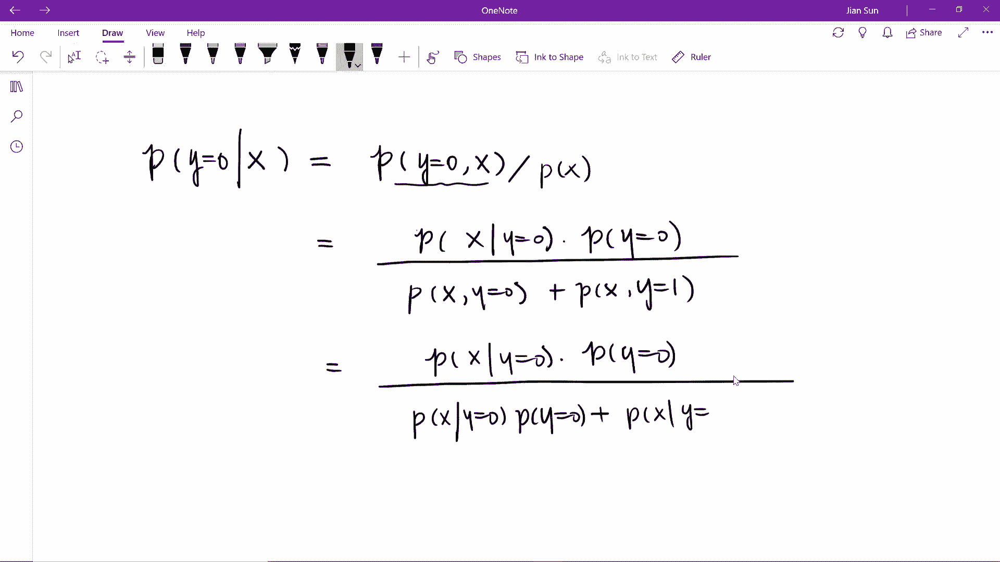

我们看一下，但是呢在这个里面这一项我们已经知道了。

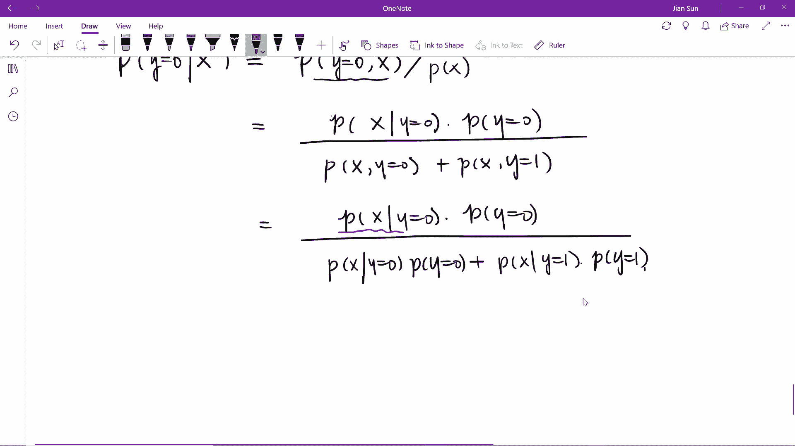

为什么这一项已经知道呢，因为这是我们的假设呀，而且我们已经假设m0 c0 已经被估计出来了。

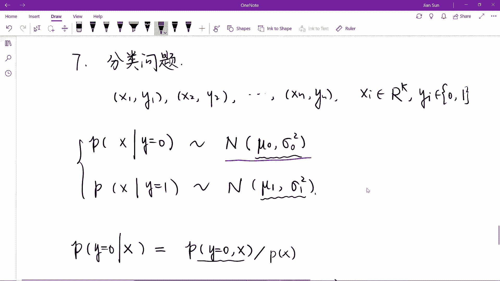

同理呢这一项已经知道了，这一项已经知道了，因此我们只要知道y等于零的概率和y等于一的概率，那么眼前的这个概率我们就估计出来了。

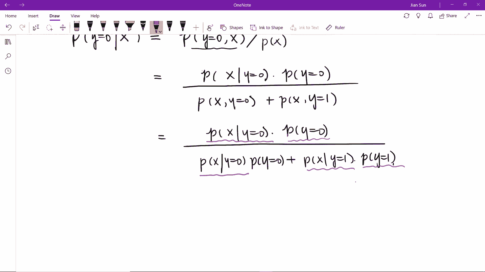

也就是说我们就走向了预测，什么叫走向预测呢，就是给了我一个x，我就可以预测对应的这个y等于零的概率是多少，那么接那当然它的一减去，它就是等于一的概率是多少，那我们已经知道了，如果说所有的参数都知道了。

眼前的这个概率只要大于0。5，当然我的最佳判断就是这样了，说y它就等于零，如果眼前的这个概率小于0。5，那我最佳判断就是让y等于一，总之呢问题的核心最后呢就变成去估计眼前的这些谬零。

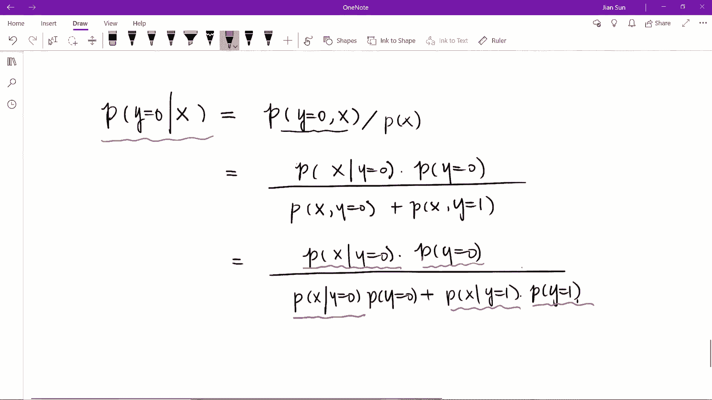

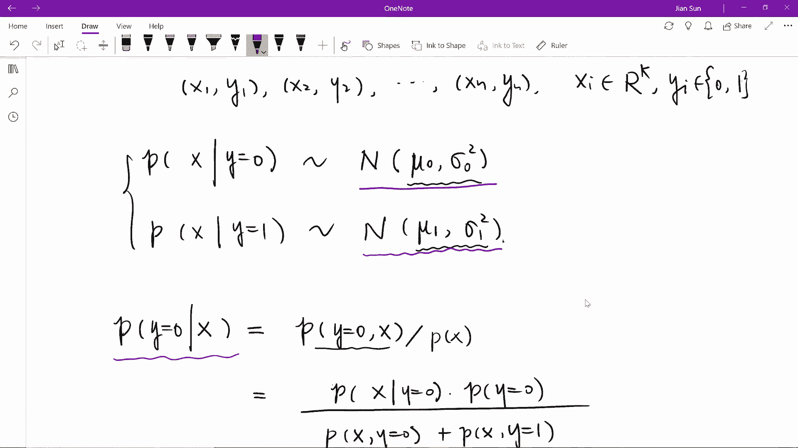

西格玛061西格玛一以及y等于零的概率和y等于一的概率，那我们现在呢就来估计一下眼前的这些参数。

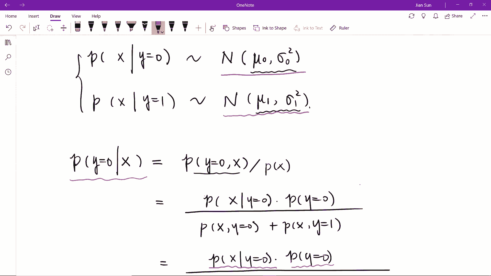

我们想一想，我们不是给出了xyi吗，给出了他出，那么他们俩的这个就是联合分布会是多少呢，一种是y是等于零的，一种呢是yi呢等于一的，好那么就是说y如果就是眼前的这个，就是眼前的这个就是这样写一下。

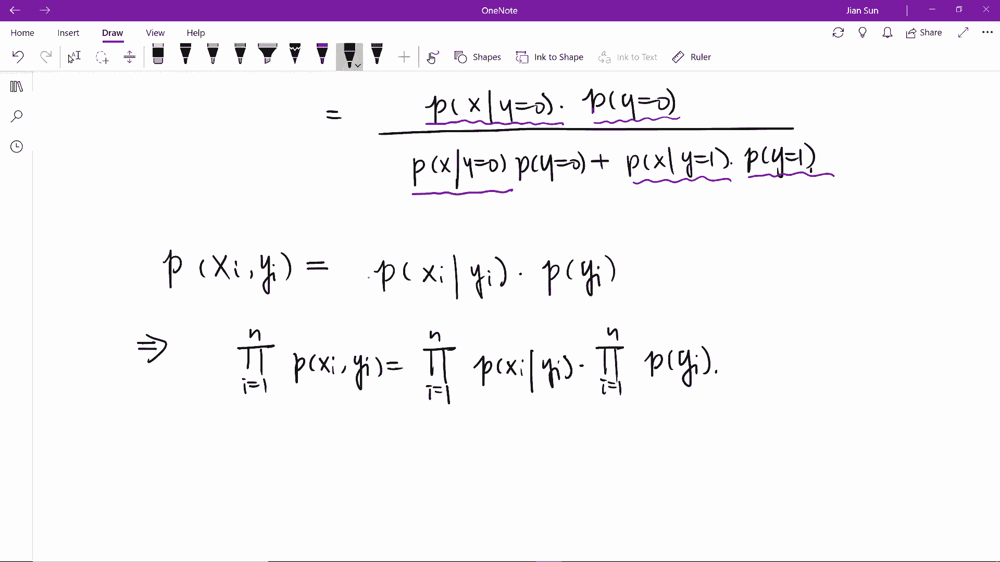

好我们就变成这样的一个写法，我们两边同时取自然对数，那我们就得到了求和。

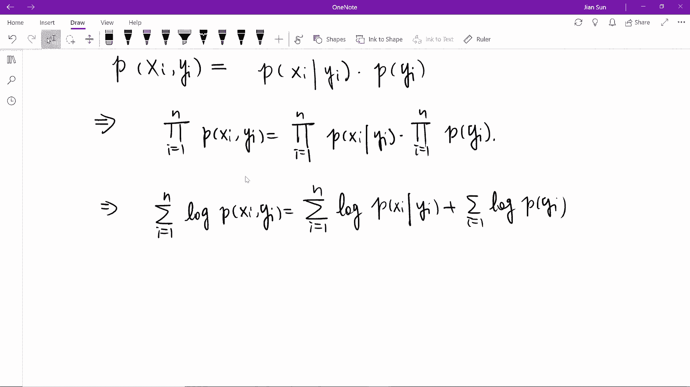

好我们又一次呢来目标呢是对所有的sigma 0 mu 0 sigma 0，所有的参数mu 1 sigma，一来对右手边呢来做这个来自最佳的一个估计，那么当我们对右手边来做最佳估计的时候呢。

我们会看到右手边呢可以分成两组，一组呢就是右手边一组呢就是所有的，这个pixi这个就是yi等于零的那些，这些x呢我们前面，记号啊，反正，所以我们写上这些是y等于零的那些，那么再加上。

lp x j那么这些呢是yj等于一的那些这些是yj等于一的，那么跟我们的参数六零西格玛，061西格玛一密切相关的就是眼前的这两项。

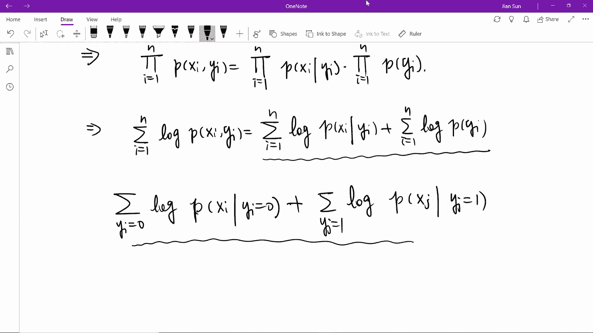

所以我们通过对在这眼前的这两项，试图让缪零西格玛061和西格玛一取最大，我们就会得到他们的最佳估计，但是你们啊我们去看一下眼前的这两项，无非我们注意到y0 等于零的时候，后面的是另外一个高斯分布。

所以显然我们就会得到最佳的这个命令的估计，就是哪些呢就是平均值是谁的平均值呢，它除以谁呢，那就是除以有多少个这个y等于零的个数，我们在这里呢就是假定呢就是有k个啊，这个k呢就是所有的y等于零的个数。

这是对于缪灵最佳的估计，那么西格零的平方最佳的估计呢，当然它就是k方分之一，跟我们刚才大家做，我们给大家不是做了一个铺垫吗，这种极大自然估计对于高斯分布中，那就是谁呢。

这就是对六零和sigma 0的平方的最佳估计，但是xg吧，但是是对应yj等于一的那些，那除以n减k那么这里呢西格玛一的平方呢也是n减去k分之一，那这里呢就是yj等于一。

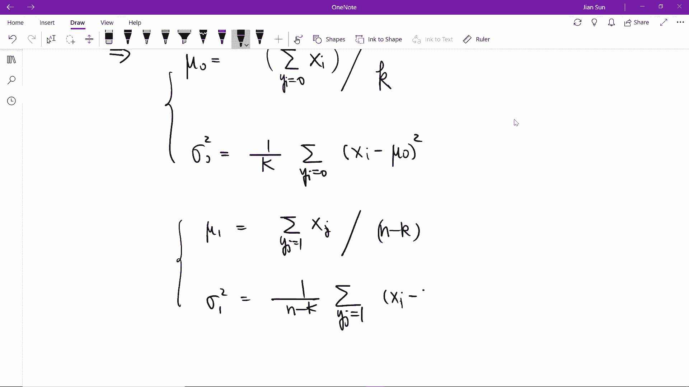

减去扭一的平方。

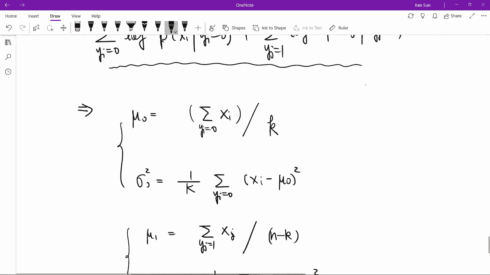

这是从前面两项来的，然后呢我们再来看最后面的这一项，最后面呢其实呢无非他就又回到我们刚才的伯努利分布，因为万i取两个值无非是零或者是一，所以眼前的这个log p呢无非就是这个啊小p加上n减k和一减p。

这个小b呢就定义成y等于零的那个概率。

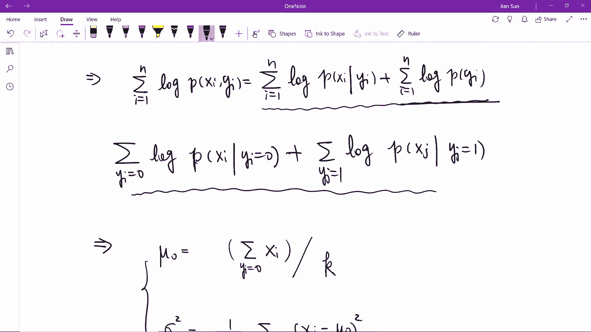

我们最后又得到，就是说啊，等于零，它的概率就是眼前的这个k除以n y等于一的概率，就是眼前的n减k除以n好。

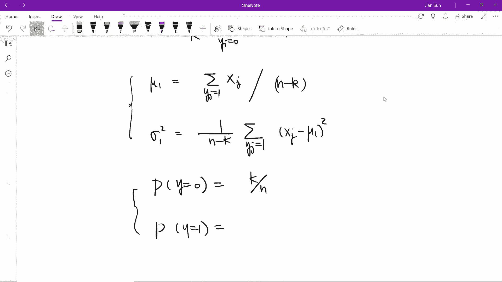

我们呢就在这个贝叶斯的这个估计下。

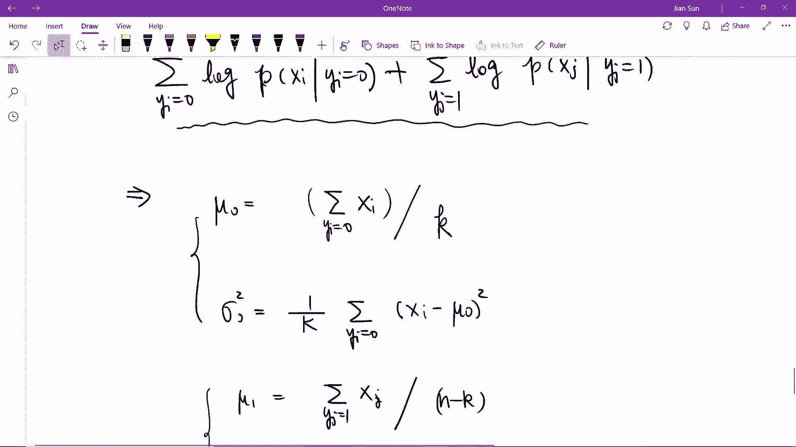

完整的通过了，相当于是我们借助了高斯分布的吉他，私人估计伯努利分布的极大，似然估计就把眼前的这样的一个分类问题。

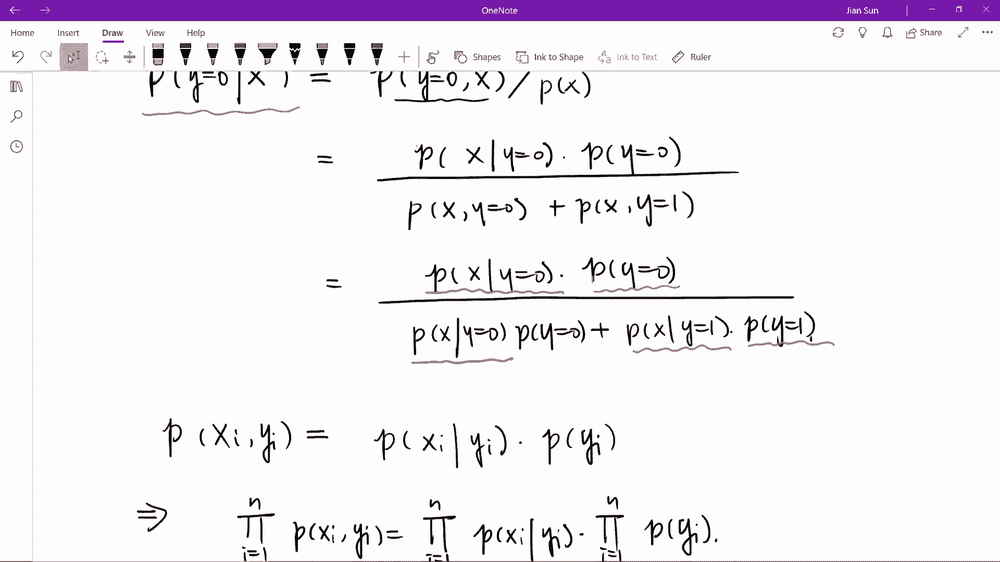

看成是去估计二元的联合分布，两个随机变量的联合分布，一个满足高斯分布，一个满足博努力分布的联合分布，通过贝叶斯之间把它们联系起来。

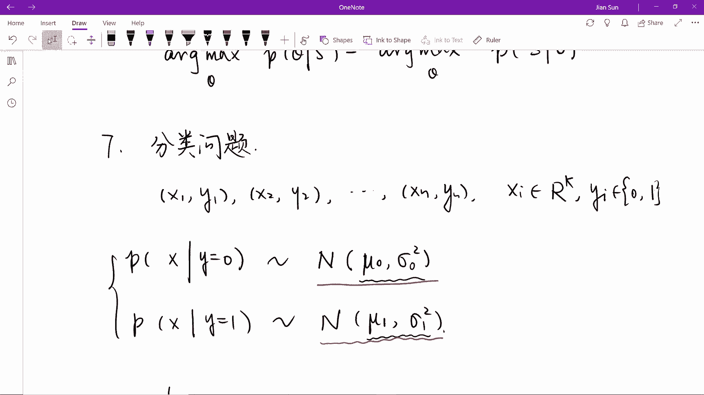

最佳的参数我们估计了出来，同时呢我们也给出参数之后。

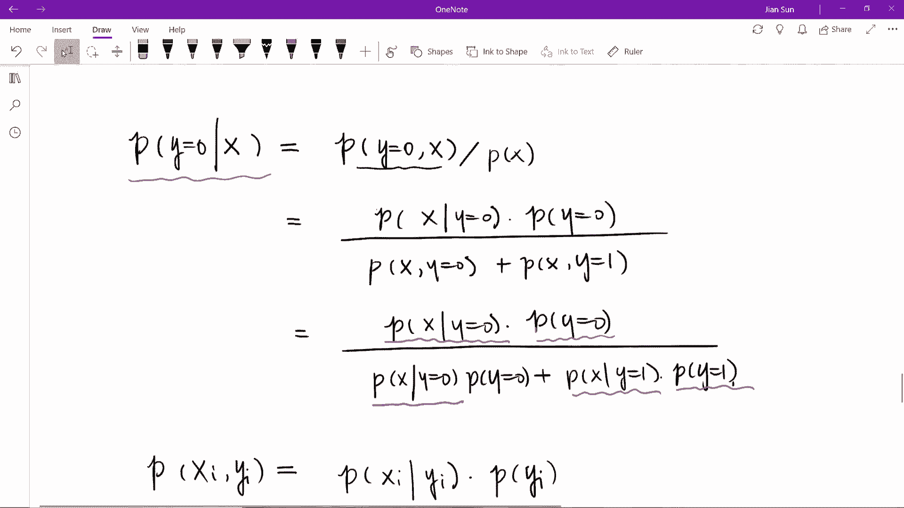

我们也可以去解决了这一个预测的问题，就是当给定的平面呃，给进空间的这么一个x之后，就可以预测相应的y等于零的概率和相应的y等于一的概率，分别应该是多少，这是在给出了之后，我们再看看其判别的中间那条线。

我们在感知基模型不是中间有一条线吗，那么我们在呃老师从regression也有中间的那条线。


我们现在也来看一看中间这条线怎么样，中间在rk这个超平面，我们已经看到就是其分水岭，就是眼前的这个值啊，和1/2的比较，也就是它是大于1/2，还是说小于1/2，那么它和1/2的比较啊。


无非你去看一看，无非就是分母上这两个值谁大谁小的问题。


分母上谁大谁小的问题，我们再写一下，那就是说给定了这个x y等于零乘以等于零的概率和给定x啊，在y等于一给定情况下，x的dc乘以y的一的概率，就是判别它们俩谁大谁小的问题，或者说判别它们俩是否相等。

就可以给出了中间的边界，我们看看在判别它们俩是否相等的时候会是什么样子，这边是啊，这个嘛1/0这个根号二派都同样，我们就不管了，这面就是e的负x减去mu 0的平方除以两倍的是一个母零的平方。

除以n是否啊，就是说要等于西格玛一分支界面就是e的负的x减去mu一的平方，两倍的cm一的平方，这边就是n减k分之n，我们两边取log我们就会看到。


那么就是负的x减去六零的平方除以两倍的sigma 0的平方，两边取log这边呢就等于负的x减去mu一的平方除以两倍sigma一的平方，还有一些其他的像。

那就是加上这个log sigma 0除以sigma 1，同时呢还要再加上log啊，这边是n减k除以k，总之呢加上了这么一些常数，没有关系。


我们再整理一下，我们就会得到原来就是中间的这条边界线，就会是这样的一条边界线。


右手边是个常数，左手边呢是关于x的一个二次的这么一个函数，我们看到当这个semi啊就等于西格玛一的时候啊，左手边呢就变成一个超平面了，这就变成一个线性的了。

sorry我们现在呢还不是这个用不着所谓超平面啊，这个为什么用不着等于超平面呢。

我们现在考虑的是一个一元的分布。


所以我们现在呢啊说一下啊，在这个分类里面呢，我们更正一下。


咱们现在呢其实是考虑了一个很简单的。


sorry，我们现在呢是考虑这里有一个简单的问题。


我们只是考虑了r one。


我们因为我们用的是一维的高斯分布，而回到我们用高维的高斯分布的时候。


我们才能解决rk中的问题，rk中呢跟我们2万种呢其实非常相像的植物。


但是在r中r一中我们已经看到很多的相似之处，当sigma 0等于西格玛一的时候，这个问题呢我们就可以解出来，就是x啊，就可以等于一个它是关于x的一个一次，左手边是关于x的一个依次的象。

所以说呢这个就等于一个常数，换句话说呢。


我们有一个常数就把它分类了，当零不等于西格玛一的时候，这个边界线其实并不是一个常数，那么就是这个边界线呢关于x的一个二次的，关于x的一个二次方程，关于一个二次方程，当然我们也可以求解出来，就是说两个数。

但是呢这是在一次情况下，二情况下呢，我们会在就是说使用二维的高斯分布，我们会看到类似的在二维平面上，这个时候呢零等于西格玛一的时候，我们将会得到一条直线，零不等于西格玛一的时候，我们就会得到一条曲线。

所以西格玛和西格玛一，就决定了它们中间的这个分界是一条直线还是一条曲线，那么我们时间所限呢。


我们在这里呢就把重要的这个想法呢跟大家啊讲了，利用一维的情况下跟大家讲了，我们是如何把吉他四人估计是以及贝叶斯估计融合在一起去，最佳的来得到我们参数的估计，事实上绝大部分的应用是在高维情况下。


就是刚才我们说的，我们试图在高维rk中来进行分类。


rk中进行分类，我们眼前的这个这个特别是眼前的这个正态分布啊，就不应该是一个一维的正态分布，而是一个高维的正态分布，我们在lecture里面呢，我们会具体的跟大家说。

这个高维正态分布在我们的lecture notes里面也有高维正态分布，我们在这里呢就不多赘述了。


我们这一讲关于贝叶斯，估计又一次呢能够帮助我们解决在空间中的分类问题啊。

