# P9：Lecture 9 Bagging and Boosting - ___main___ - BV1fv411r7z1

好我们今天呢来学习机器学习的第九讲，第九讲呢我们主要想讲一下提升和集成的这两种，在机器学习中的这两种方法，那么为了讲这两种方法呢，我们先回忆一下我们以前讲的决策树。

然后呢我们今天呢将会讲基于决策树的提升的方法，特别是讲一下gradient boosting的方法，那么其中的一个具体的例子呢就是在xg boost这种算法上的一种实现。

同时呢我们也要再呃讲一下好的ada boost，那这样啊这个呢这个方法同时我们也是在理论上来说明一下，那为什么ada boost啊，可以这个能够比较有效地把一个弱可分类的这样的一种学习方法呢。

那么把它提升到一个墙可分类的这么一种机器学习的方法，首先回忆一下我们以前决策树，我们以前决策树呢讲的是分类模型，其实决策树呢不仅可以做分类模型，它也可以做呢回归模型，我们特别呢来回忆一下。

用决策树来做回归是个什么样子，其实呢我们再看一个简单的例子，比如说我们看一个一维的情况下，也就是说给出的可监督式的学习，这里的数据呢就是一个一维的特征，那么这里的y也是一个意味的。

因为我们现在要讲一个回归的问题，那么我们现在画一个，比如说这就是实数轴，x呢它在就是坐落在这个实数轴上，当然我们最后给出的呢很可能是啊，实数上的这么一个i i d的这么一个sample。

那么y呢可能是眼前的这个样子，一方面呢，在这里这是y另外一方面，在我们眼前呢我们画出来x和y啊，我们画的是y关于x的一个函数图，同时呢在这里呢有一个明显的分界点，这个点比如说就叫做c。

那么在c的左边和c的右边，我们给出的这个函数值就明显的在level上的这么一种不同，我们可以想象这样的点给出了就是这样的一组三破点，我们给出了x1 y1 ，x2 y2 给出了n个。

那么我们如何去找到一个学习的方法，去学习如何从x到y的这样的一个啊，比如说逼近函数吧，我们借用决策树的想法，在这里呢特征只有一个，如果说只有一个的话，我们可以想象在原始的，所以最初有一个根节点。

在这个根节点呢，因为我们只有一个特征，所以说我们没有其他的特征可选，所以在这里呢我们也没有必要去计算什么信息熵啊等等信息增益了，因为只有一个特征，那么这个特征呢就是x作为它的特征好。

如果说我们把它也分成两个分叉，那么左边呢我们就可以想象的就是x等于c啊，啊比如说右边呢就是x小于c，所以说在左边呢我们就会试图呢把所有的这些y呢给上一个值，比如说我们在这里面想给出一个。

我们用另外一个表示吧，z那么就是说凡是划到左边的，我们都用z来做它的预测，凡是划到右边的，我们都用w来做它的预测，那么这里的z和w显然我们就要去，这里面其实有三个地方我们要判断。

第一个判断c是多少。

啊换句话说吧，我们可以退后一步，我们先不说c是多少，假如说我们c都不知道，在左边判断我们是说x我们换一个x小于d，x大于d，x小于d的时候，我们都用g来做这个函数呃的预测，x大于d的时候。

我们就用w来做这个函数的预测，因此眼前呢我们就要去判断这三个参数，第一个参数就是d选择哪个最好，d是多少，第二个参数那就是g是多少，第三个参数那当然就是w是多少，从我们上面这个图给出的这么一个。

如果我们都知道数据是这个样子的，当然我们这个d呢就应该去选择，就等于c，即便如此，我们仍然要去确定g是多少和w是多少，为此呢我想大家已经熟悉了，我们继续学习，学到这里，我们一直所熟悉的损失函数的概念。

因为我们应该知道，在不同损失函数下，我们给出的预测，或者我们学习的结果是不同的，所以在这里呢我们应该定一个损失函数，比如说我们就定一个l to作为损失函数，换句话说z我们取得好坏。

其标准就是我们的目标是取g它要减去所有的外i的平方求和，对于哪些yi的平平方呢，在所有的z里面求得最小，同时呢我们也要类似的，我们要求w使得求和，使得所有的w减去这些yj的平方。

那么这些yj呢对应的x g呢就是大于使得这两个值求得最小，在l two下我们所熟知的其实z呢就是y的平均值。

所以在这里我们可以说g如果在l two下，我们作为损失函数的话，它就应该是所有yi的这个平均值，当然我们在这里面呢还要除上一个，w显然它就应该是n减k分支，所有的那些yj，而对应的那些xg是大于d的。

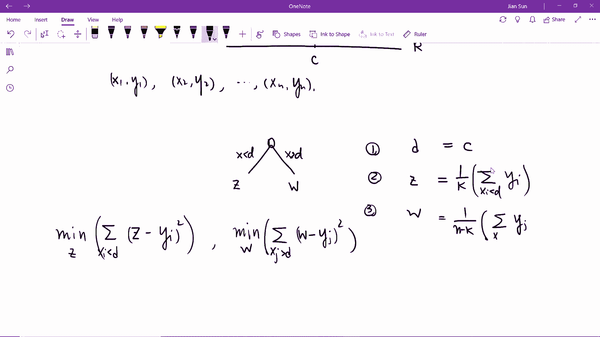

好我们从这个一维的例子。

我们就可以想象，我们做一个tree，我们做一个决策树，那么这个决策树呢就是分成两只，那么分的时候区分的时候，其重点我们要确定这三个参数，第一个参数就是在什么地方来划分，把这个数化成左边和右边。

第二个参数就是在左边，我们用哪一个数值来作为最佳逼近，在右边哪一个数值来作为最佳逼近，因此就是这三个重要的参数的。

这是在feature是一个的情况下。

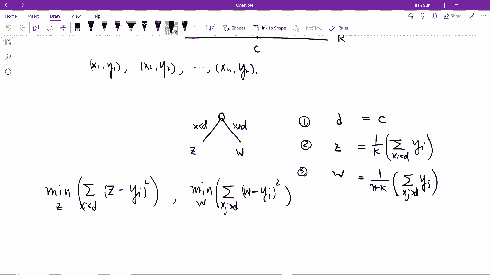

特征是一维的情况下，那当然我们一般在多个特征的情况下。

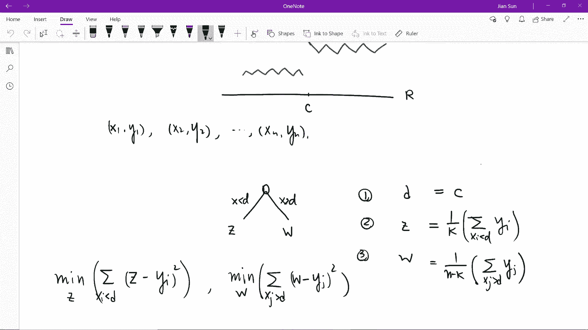

我们应该是什么样子呢，那就是说我们给出还是xi yi，换句话说呢，第二个特征一共是k个特征，在这里的y呢我们还是允许呢，它是一个连续取连续的值，而不仅仅是一个离散值，好在这样的情况下，我们可以想象。

如果我们坚持在每一个特征的维度上，我们都是去把这个特征画成两部分，因此上呢我们也就是应该对应的去k个特征，我们就应该对应的去寻找，寻找有不同的这些特征，那就是呃特征的分界点。

那就是c1 c21 直到c k这k个不同的特征的分界点，那么全空间呢就会被根据，那么全空间就会根据它的b，比如说啊他的第一个特征是否大于或者小于c1 ，其第二个特征是否大于或者小于c2 。

dk的特征大于小于c k就会把这个空，就会把整个的这个空间呢其实划分成若干小的部分，一共多少个小的部分呢，它就是二的k次方这么多小的部分，那么每一个部分上可以想象在这么多的每一个部分上。

我们都应该给它配上一个最佳的啊，就在那个这个每一个部分上，我们给它配上一个最佳的这么一个逼近，用一个常数作为它的最佳逼近，比如说我们可以考虑在l2 情况下完成这个最佳逼近好。

那么这个最佳逼近呢我们想也起一个名字吧，我们就叫做这个这个y一啊，就是这个y那么这个y呢其实是对应那个啊，就是说这样啊定了这个爱，那么每一个这个i j呢就是表示，上述的，上述2k个这么一个立方体之一。

所以我们眼前呢就要去决定二的k次方这么多不同的这些i哈，使得使得我们现在把我们整个的这个损失函数把它写出来，这个损失函数写出来呢，对应的那个yi和这个y i这它的平方和再对所有的j等于1~2，k是最小。

这就是在高维情况下，我们都进行了这么一个表述啊，这个高危情况下进行的这个表述，比如说在二维情况下，我们就可以更直观的来看，在这个平面上，如果说平面上可以分成四份，如果说平面上可以分成四份。

这个地方不一定是零啊，这个地方从x轴上来讲，它可能是就是在x轴上，就这个点呢是c1 c2 ，它不一定是零点，如果说全空间分成这四份，而函数就是原来的这个函数在这四份上表现是比较好，完全是不同的。

而且在每一份上呢是比较相近的，比如说在第一份上，比如说它类似的看上去就像是啊z这块就是w啊，这块呢就是像u这块呢就是像v，换句话说，你比如说在第一块上，它是z加上一个噪音，那么第二块上是w加一个噪音。

第三是u加上一个噪音，第四是v加上一个噪音，这里的ip都分别代表完全独立的一些噪音效，如果说原来的数据的这个y的表现，就类似在我们这个二维平面上的这样的一个表现的话，那么显然我们通过现在的这个算法。

我们的目标就是确定这个c1 c2 ，因为把在x轴上确定了c1 ，在y轴上确定了c2 ，我们就把全平面分成了两份，就是这里的k呢就对应是二啊，四份我们就把全平面分成了四份，而在第一个份上啊，这分别这四份。

那么在这四份上我们应该确定四个常数，就是在这四个份上，也就比如说我们这个地方叫做i1 i2 ，这个地方i3 i4 ，那显然呢我们的最终应该做的就是yi一上。

我们是希望它等于w y i2 上，我们是希望它等于z yi 3上，我们是希望等于u2 yi 4上，应该是希望它等于v，当然这是我们希望。

然而我们是要看实际的这个数据在眼前呢，如果让眼前的这个求和，而且是l o two表示最小，那么显然呢这个我们最后就是y在每一个ig上，它就应该是，它就应该是它除以这个唉这里面含有的元素的个数。

如果说所以说问题在于。

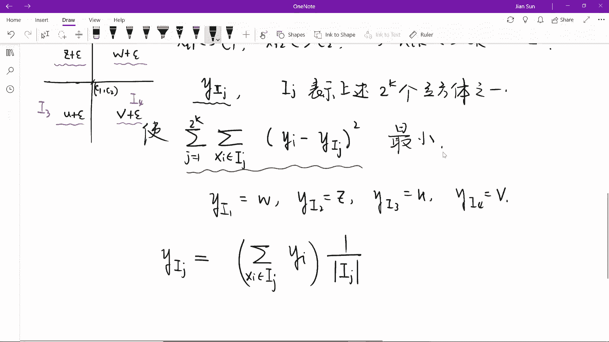

虽然我们想在这里面想找c1 ，c21 叫c k这k个参数使得全空间化成了二的k次方，一旦我们找到了这k个参数，其实呢这里的，其实在每一个小的立方体之中，我们去选一个最佳函数逼近在l two下倒并不困难。

因为这个最佳函数逼近就已经变成了在这个小的立方体中，所有的那些患癌的平均值了，因此问题呢就变成去寻找c1 c2 已知的c k了，但仍然我们去做这件事情，我们看到随着特征的增加，很快它就变成一个空间。

这个空间的立方体就变成指数及增加，那显然呢这样做呢在计算上呢，最后是我们没法去做这么大的一个计算，所以呢我们呢就用决策树，我们就退一步。

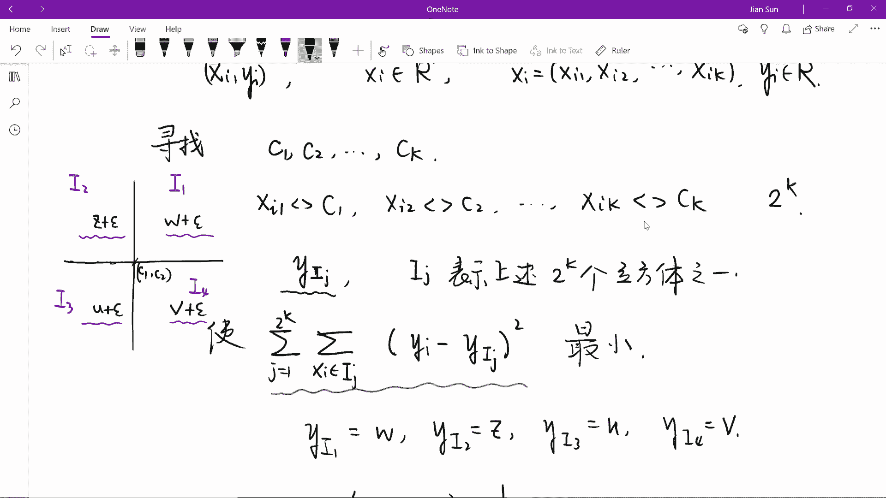

用决策树来做这样的一件事情啊，从那么这个决策树呢最后就叫做回归数，这个决策树怎么做呢，我们来看一步一步的来，我们还是从一个，从一个根节点开始，我们就是还是从最好最初的这个根节点开始。

我们一步一步的去寻找这个分啊，去寻找使用的特征，根据每个特征呢，我们再去寻找最佳的那个区分点，从根节点开始呢，我们去寻找，一个最佳的特征，那么根据这个特征，我们就可以分成把分类分成两部分，那么这个特征。

以及，分割的点，比如说我们选取第一个特征，我们去选取所有的那些点，第一个特征呢是大于c的，那么在左边呢我们就需要用一个平均值来替代，在右边呢也是要用一个平均值来替代大于c的。

因此我们最终的损失函数这是用平均值替代以后的损失函数，加上啊都可以说是啊第一个吧，再加上所有的特征大于c的那些y减去它的对应的平均值的平方，最终的损失函数呢就成为这样的一个损失函数。

好我们的目的呢就是使眼前的这个损失函数呢达到极小，但是我们是去挑选谁来使得眼前的这个损失函数达到极小呢，在这里面minimization的过程中就是优化的，这个过程中，我们其实是去寻找特征，第几个特征。

i以及那个分割点c所以说我们的第一步呢是去便利所有的特征，每一个特征我们再去便利一定的c，那这里的取这个c呢，我们可以去离散的去取，或者用一些其他的办法去举啊，这个不同的算法，它可以有不同的实现。

但是基本的想法就是针对每个特征，我们就选取一个最优的分割点c使得一旦你确定了这个最优的分割点，c上述的值就可以计算出来了，以不同的特征以及不同的c上述的值是不同的。

所以我们要去选取一个最小的这个i以及c，我们就把这个特征和这个分割点作为我们的第一个数的从根，最初的根节点就这样划分出来了，等我们划分出来之后，我们就到了两个根节点了，我们现在就到了两个子节点了。

从这两个子节点我们再去继续，从比如说左边这个子节点，我们再去寻找你，比如说如果我们在上述，我们为了表示它是第一个特征的分割点，我们叫做c1 ，那么到了这个，子节点我们再一次的去寻找其他的特征。

比如说这个特征是第二个特征，我们要去寻找c2 ，我们就继续可以往下面划分，那么这是在左边，那么右边呢也可以，我们这样一步一步的就会把整个的，从最早的啊根节点，我们就一步一步的就可以把这个数建立起来。

那么这个数建立的基本的建立过程是这个样子的，但是我们在建立起来的时候，我们并不一定让这个数变得很大很大，因为这个数变得很高很高的话，我们最终就会导致这个overfitting，导致过拟合。

所以一般呢我们可以设立一定的条件啊，在这一定的条件下，我们这个数就不再继续的去进一步的去划分了，那这里的条件呢其实也可以有不同的条件，比如说我们一种条件，我们可以说数数长啊，不要超过多长。

或者说呢我们在一个到了这个子节点的时候，这个子节点的这个嗯这个损失函数已经充分小了，那我们也不再继续grow这个true这个数了，所以可以设定一系列条件，我们可以想在这一系列条件下呢。

我们去避免这个数变得很纵深，最后呢导致过拟合上述的这个过程就叫做regression tree。

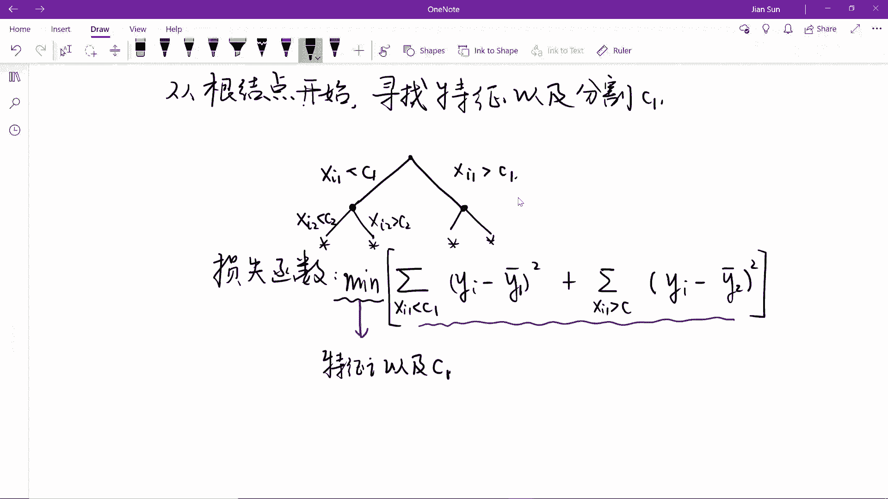

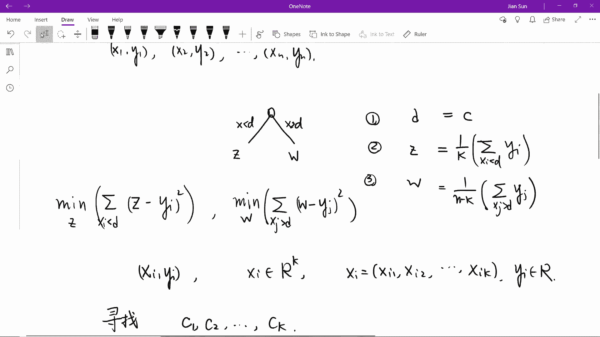

就是回归树的这样一个建立，我们为什么要讲回归数呢，因为我们最后下一步要讲的提升呢，就是建立在这个回归数上，我们可以让得到的这个结果呢可以更更好，就叫做提升了，所以接下来呢我们来讲提升，提升的方法。

其原始的想法是这样的，如果说我们的方法已经很精确了，那我们当然就没有必要提升了，但往往是我们的方法仍然很粗糙，这个时候呢我们可能就需要进一步的提升了，比如说是什么样的粗糙呢。

我们现在可以想象还是借助眼前画一个图，比如说我们还是在一维情况下，那么原始的这个函数呢，它可能是不像刚才我们画的那样，在分别有一个分隔点的两边，它是在这个两边呢是比较平坦的。

如果说本来啊这个函数本身呢就是啊很不平坦，我们非要用这个决策树把它找到一个分割点，使得在分割点的左边，比如说我们用这个点作为分割点，我们非要说在分割点的左边，它是一个线性的，它是一个常数。

在分割点的另外一边，它是另外一个常数，那我们看在这里呢仍然有比较大的区别，就是我们用这个常数来作为函数逼近的话，那么真正的函数和我们的这个常数，那么之间仍然有比较大的这个区别。

所以说呢这就导致我们现在的这个方法呢，其实它的精确度上呢还是具有一定的问题，所以提升的前提呢是这样想的，就是如果说我们的算法本身是一种所谓的弱算法，他们经常的叫做弱分类器。

一会儿我们会从理论上来具体的定义什么叫做弱分类器，我们现在就可以把它理解成呢就是我们这个算法呢能够给呃，从机器学习角度来讲呢，我们能够进行一定的这个拟合，但是这个拟合呢不是特别的精确。

如果说眼前的这个拟合不是特别精确，我们能不能进一步的提升我们拟合的效果，使得我们拟合出来这个效果呢就更加的精确，所以在这里呢我们将沿着两个类型，我们来讲两种重要的提升的这种思路。

一个呢就是我们接下来要讲的这个gradient boosting的这种思路，另外一个呢也是一个比较有名的叫做ada boost的这么一个思路，我们呢从理论上来讲述这两种不同的思路，好我们先看眼前。

我们再看一个例子，用这个例子来说明，g b d t g b d d在这里呢是代表叫做gradient的，不是gradient boosting decision tree。

gradient boosting decision tree。

我们从下面来看，我们如果说我们已经把空间分成两个两，分成这么一个分割之后，假定我们已经建立了这么一个吹，建立了这么一个tree之后呢，我们发现呢，其实我们的给出的预测值或者是逼近的值。

跟实际的这个值呢之间还是有一个比较大的区别，那我们现在就用它们之间的这个区别了，我们还将再建立一个数，而这个数呢是专门来学习眼前的这个区别，那如果说这样的话呢。

我们就可以把两个数结合到一起，可能就会给出一个更好的结果，在数学表示式上呢，我们可以这样想想，比如说原来的是啊xi yi，这是我们给出的所有的样本点，我们呢用了一种学习方法，得到了第一个逼近。

但是这个fx i和原来的这个yi之间仍然有比较大的这个损失，我们把这个比较大的损失呢，我们就叫做yi 1，我们就可以想象原来这些yi呢，嗯那它就是y0 ，所以现在呢我们就可以想象我们给出的这些数值呢。

就是所有的x那么y i一了，就是我们要学的是上一次的那些不同的地方，而不是最原始的那些外i了，我们如果去学这个y一呢，我们又会得到一个函数，那这样的话呢我们就可以记原来的函数呢，比如说是f0 。

这是我们学到的第零次，然后我们又学到了第一次，第一次呢就是他和yi一之间的b键，我们继承yi 2，好比如说yi 2就已经是约等于零了，就是说已经学得很好了，那么这样一来，我们让我们最后的函数。

加上第一次学到的，因为两个相加就会使得我们减去yi 0。

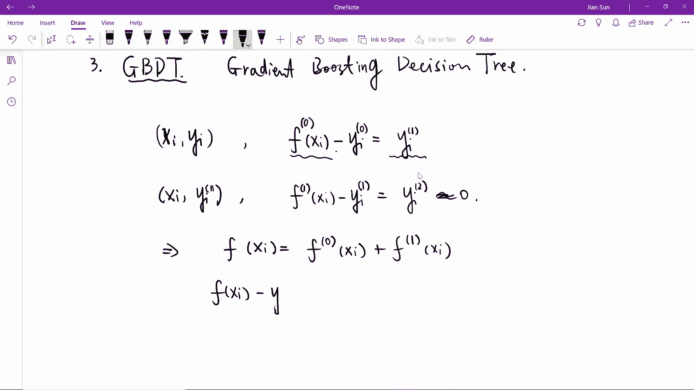

就是也就是减去最原始的那个yi，它就等于f0 ，再加上f1 x i，但是它们相减f0 ，x减去y0 啊。

这里面呢我们反过来就好了，我们处理一下符号，我们处理一下符号，我们在这里呢假定给定的原始的点是x1 y1 x n y n，假如说我们进行了一次学习，学习了之后呢，我们得到了f这么一个逼近函数。

但是这个逼近的函数，那么它逼近的效果我们就用检验的就是yi减去fx i，这对于每一个i我们就可以计算，就是他们我们预测出来的fxi，换句话说我们用于逼近的这个函数跟实际的之间的区别。

如果说这个区别已经很小了，那么当然我们就认为损失函数已经很少了，很少了很少了，所以我们就停止了，不再去继续学习，如果说这个损失函数还是比较大，那么眼前呢我们就可以定义呢把眼前的这个量。

也就是说它们之间的这个差别，我们就可以重新的命名为一组新的这么一组标签，这组标签为了区别以前的标签，比如说咱们上面加了一个一，那么以前呢我们当然就可以都加上零，我们第一次学习到了这个函数呢。

也加上一个领导，现在呢我们就可以想象我们用了第一df 0这样的一个学习，学习到之后跟原来真正的标签的差，我们作为一个新的目标，那么新的目标我们现在就要去学习这个新的目标了，还是跟个样本。

但是这样本的目标变化了。

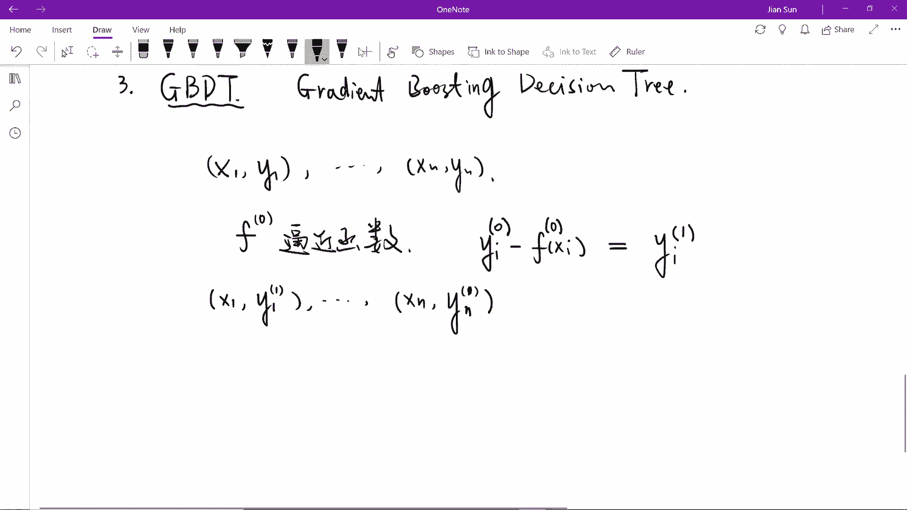

我们又一次的用我们的这个所谓的弱分类学习，我们就得到了另外一个f一作为一个逼近函数，用f一作为这个逼近函数，那它的检验效果呢我们就看y一和f1 ，它在x2 的取值，比如说它就叫做我们又给它叫做yi 2。

如果说到了这一步，他就基本上就是零了啊，或者是从另外一个角度来讲，就是损失函数就已经很小了，那么我们最终就可以确定用一个f这个f是谁呢，就是f0 加上f一就可以了。

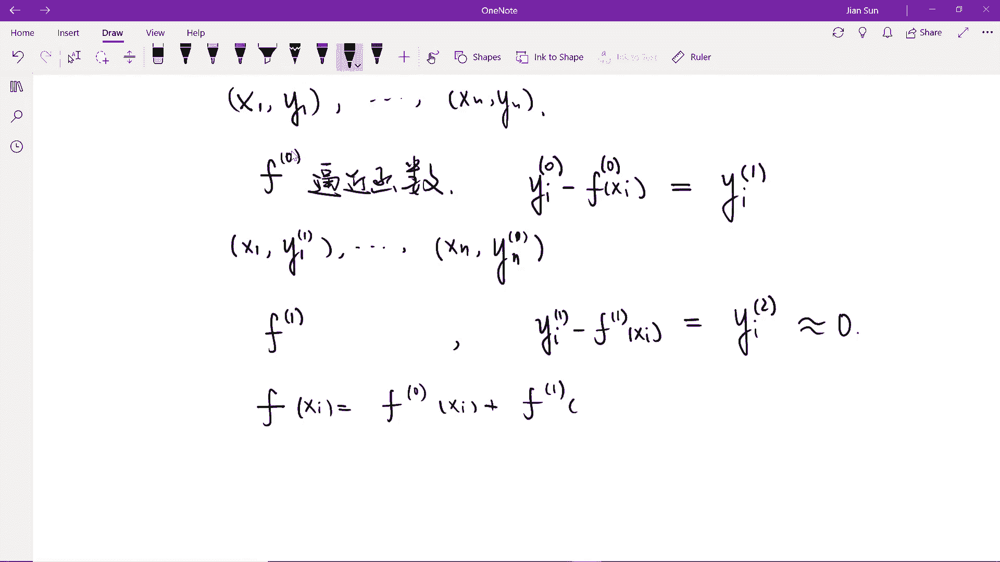

那为什么呢，因为，f这个最终的这个函数啊，减去最原始的yi就可以分解成f0 xi减去原始的yi啊，再加上f1 x i，但是最原始的当然它也就是零，刚才我们定义眼前的这个量呢，它就是负的y i1 。

加上f1 x i，这不就是负的y i2 ，它不是已经就几乎到零了吗，那换句话说，我们眼前的这个函数f作为两个弱机器学习的函数，若假设它就已经变得一个比较强了，刚才是假设呢y i2 就是学习了两次之后。

那么剩余的这个量就已经剩余的损失函数很小了，如果剩余的损失函数还不是很小，那我们还可以再继续学习。

我们刚才形容的这个过程，就可以想象，这就是我们每一次都用一个比较弱的函数，去学习同样的这个样本点，但是我们不断的去更新这个样本的标签，我们把这一系列落的这个函数把它加总。

它就有可能成为一个比较强的这么一个学习的函数，这就是所谓boosting提升的方法的根本想法，那么现在呢我们把这个想法呢用看一个具体的一个算法来实现，那么这个算法就是x g boost x啊。

x g boost，第三第四，我们来看一下x boost的想法，这boss的想法就是延续我们刚才的这么一个基本的提升了这个思路，但是呢它在具体实行上呢，它会计算呢会更快一些。

因为我们刚才呢只是一个非常大的这么一个框架，我们把它落实到具体的一个弱分类模型上，那么呢我们还要看落实到哪一个所谓弱分类模型上，或者是弱学习机器学习的假设模型上。

我们在这里呢就用决策树来替代我们刚才的弱分类模型，好，我们看看假定决策树呢我们都已经可以用了，无论是分类的决策树还是回归的决策数，我们就把决策树呢看成是一种弱分类模型或者是弱啊，假设模型若回归模型。

我们就可以想象我们不断的去做多个决策树，最后呢形成一个强的决策树，那我们看看具体的这个想法是什么样的，我们，来看这个现在这个点，我们先看呢这样的一个问题啊。

就是说我们刚才说了g b d t还没有说。

那我们先说一下g b d t，好在我们讲g boss之前呢，我们先说一下gb t t好，我们刚才说到损失函数，我们现在就具体的把这个损失函数来写一下，如果说一般来讲yi是作为呢最原始的值。

而y i下面我们加一个i来表示的是我们第一次这个弱分类学习之后，或者是若回归学习之后学到的这么一个值，我我们现在的目标呢是在这个值上呢再加上一个新的函数，这个叫做fx i来用于逼近最原始的这个yi。

那么这个损失函数呢也未必是一个l two的损失函数，而是一个比较一般的损失函数，我们看一看呢，对于这样一个一般的损失函数，我们应该去选取一个怎么样的fxi。

那么可以让眼前的这个损失函数呢是变得会更小一点，好我们现在的想法呢其实像眼前的这个fxi是取的是一个这个常数，我们看一看，根据微积分的这个它的展开，眼前的这个损失函数呢。

我们把它看成是两项这样y和x的函数，它既是y的函数呢，也是x的函数，而且呢它关于x呢是可以求导的，所以说它是存在对于x的偏导，以及对于x的二阶偏导都存在，那么眼前的这个损失函数。

我们就用tt对于第二项的泰勒展开，我们可以写一下，泰勒展开呢，我们想象它就是第一项，就是让后面这个f x i呢等于零，加上第二项，那就是对于后面求偏导，求完偏导之后呢会出。

当然它取值的还是在yi和yi had会出来一个fx i，再加上二次项就是1/2，它是平方x手x平方，我们现在呢是希望这个fx i呢是取一个比较小的一个常数，而取一个什么样的比较小的常数的时候。

可以让上述的这个量呢可以达到最小呢啊应该说这是一个约等于，其实这个呃眼前的这个这个想法就是基于下面的这个项目，我们知道对于一个光滑函数，在其任何一个点，我们可以去线性的进行逼近。

如果我们只是说做泰勒展开常数加上一次的微分项，我们实际上就是用了一个线性的函数来逼近的一个光滑函数，但是如果我们去不仅用了第一项，而且还用了第二项，就是二阶求导的话。

那么其实我们用逼近的就不是一个线性函数了，我们逼近的可能就是一个用一个抛物线来逼近它了啊，就像类似这样的一个抛物线，毕竟它了，那既然是一个抛物线来逼近它，我们知道这种抛物线是一定存在一个最小值的。

所以我们就把包括现在这个最小值近似的看成是原来函数的最小值的，那这样一来我们来求一下，眼前把它看成是，我们首先令w等于f x i吧，那么眼前看成就是w的二次函数。

这个二次函数呢我们就简单的把它写成是i啊，比如说我们也不要用l吧，用l0 加上l1 w再加上二分之l2 w的平方。

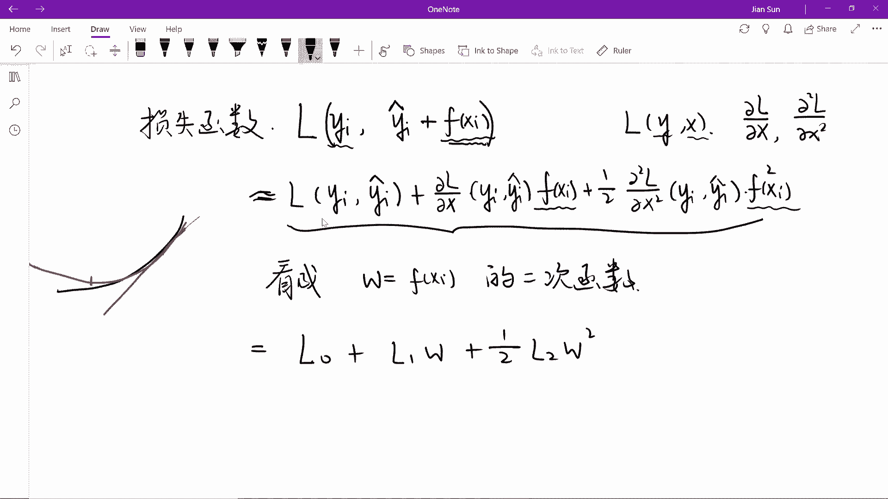

我们看看眼前的关于w这个二次函数在什么地方求得最小值，最小值又是多少，那么为了让他得到最小值呢，我们对w求导数，那就是l一加上l2 w等于零，所以说我们就会求出w就是负的l一除以l2 。

那么进而其最小值那就是l0 ，我们把这一切都带进去，就会发现减去1/2的l一的平方除以l2 。

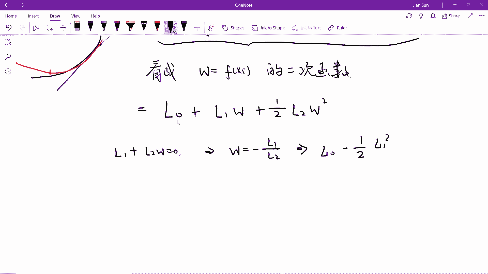

好我们眼前的这种做法呢，其实就是用一个二次函数来取代原来的一次函数。

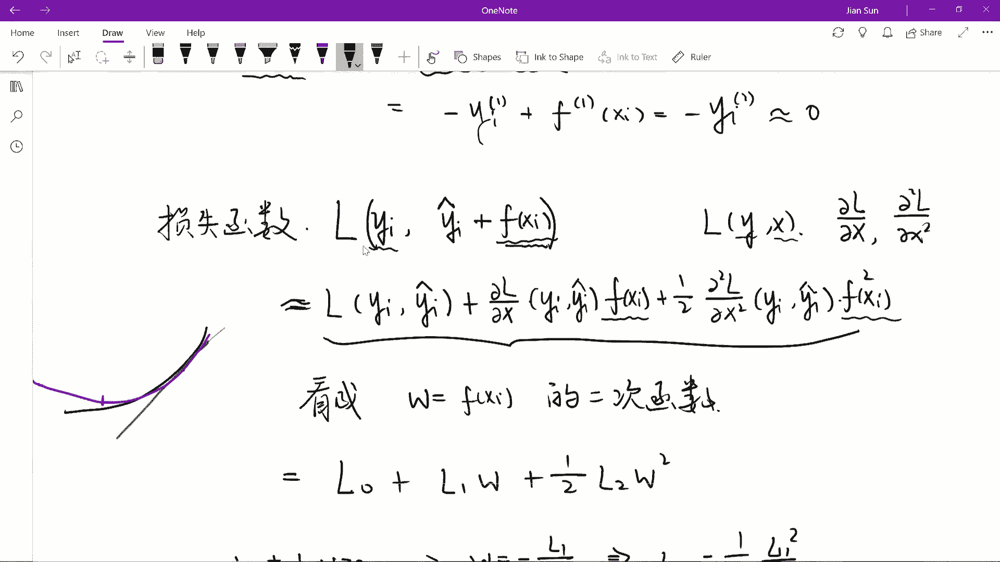

那么而且呢我们就会发现呢，我们用这个二次函数的最小值来近似的唉替代原来函数的最小值，那么如果我们能够求一阶偏导以及二阶偏导的话，我们就应该用眼前的这个值来代替原来损失函数的极小值。

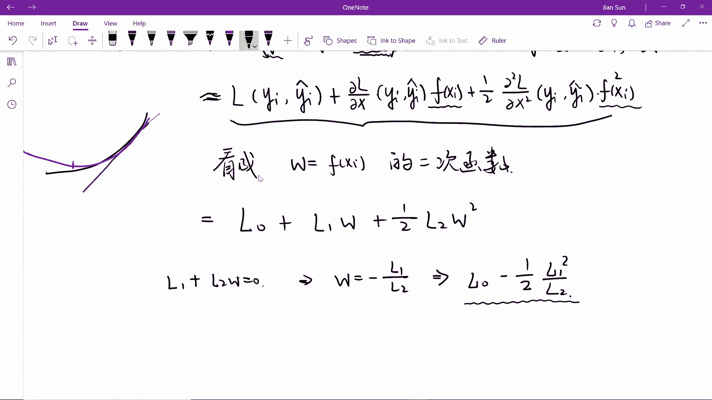

这就是啊应该说是gradient boosting disea，gradient boosting的这么一种想法，我们来进而继续沿着这个呃。

退一步来讲，比如说我们不能够求二阶导数，不能够求二阶导数，但是我们可以去求一阶导数，也就是说在原来的这个表示式里面，这个我们是不用的，我们只用它啊，回想起我们以前求函数极值。

我们要想求一个函数的极值的话，可以怎么办呢，我们沿着它的梯度下降的方法去求，那怎么叫梯度下降的方法呢，回到刚才我们这个损失函数。

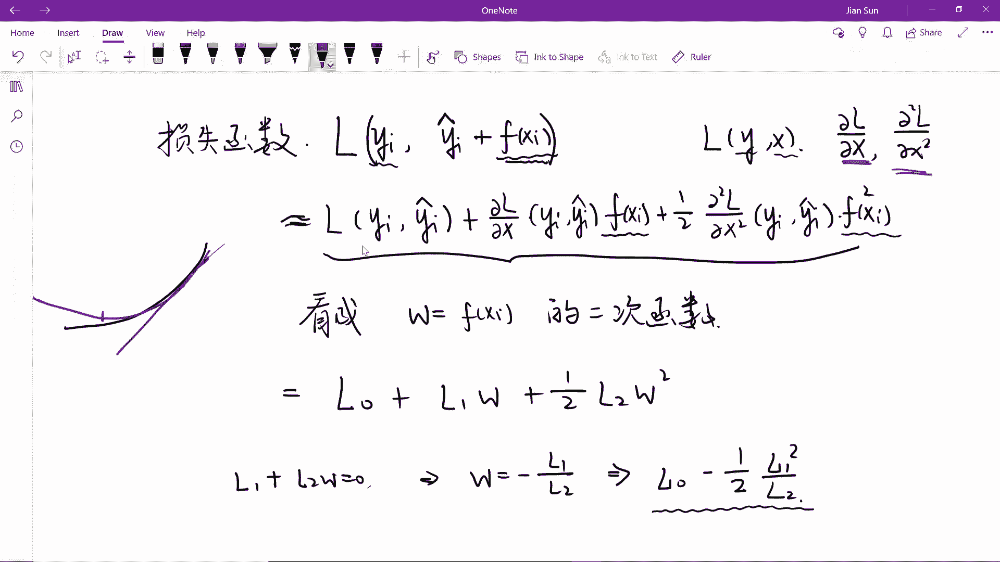

如果说在这个损失函数里面，我们并不想用这种求二阶偏导的方法，我们就回过头来这个损失函数，我们是想加上一个f项，使得它变得更小，那怎么办呢，我们就可以考虑啊。

我们让啊令这个f就是负的整个的这个l像它的第二节，就是我们仍然把它l看成是一个二阶二维的函数，第一个是y，第二个是x，我们是用它对第二项来求偏导的梯度，我们就是令f等于在他一个1a乘以e塔是一个常数啊。

我们这里呢其实就是说就像我们的梯度下降里面也一样，我们可以用用一个常数可大可小的一个常数啊，来代换进去也是可以的，那么这样我们得到新的这个值，也是会比原来的值会小，当啊当我们的这个e的充分小的时候。

好这个呢就联系到了梯度了，这也就是为什么这个方法呢叫做gradient boosting decision tree。

其实我们也可以把它理解成这是一种gredient descent decision tree，只不过呢在你这里呢习惯大家习惯用提升，因此就叫成了gradient boosting decision吹了。

其本质呢其实我认为呢损失函数角度来讲，还不如叫做gradient descent centre，好。

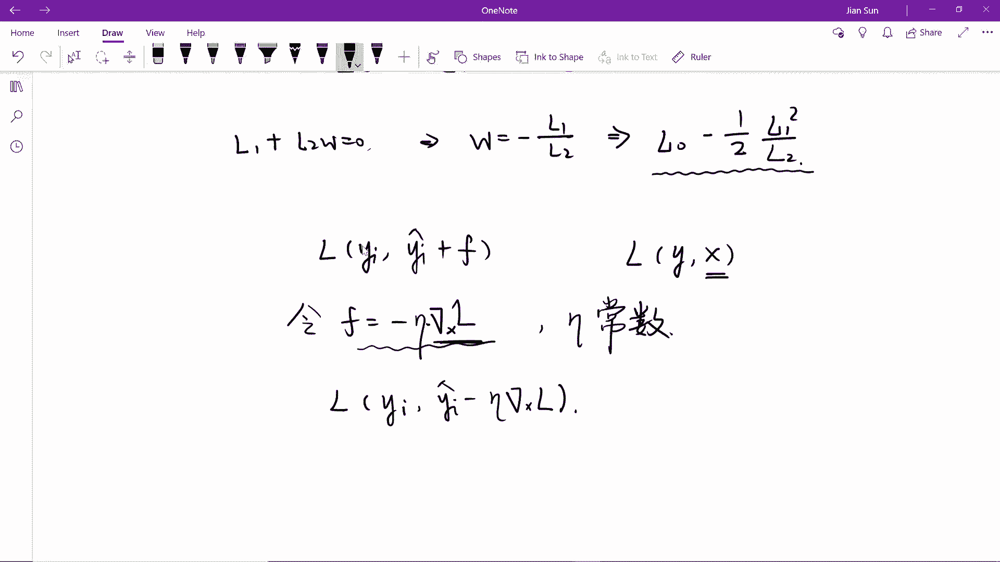

现在我们终于可以来讲啊，actually boost了。

我们讲了gradidc gradient boosting descent tree的基本想法，现在我们来讲xg boost，xboost就是把刚才上述想法落实的这么一种具体的实现。

它呢是基于决策树的一种实现，比如说我们已经用，就是说给定了原来的这些点以后啊，i等于j2 ，一直到n我们的目我们已经用决策树，就是咱们已经决策树啊，用了一次决策树了，用了一次决策书，得到了。

这个why i hate的得到了这个one hit的，那我们现在想在这个one hit上面呢，我们加强一点，我们看看我们怎么做，其实加强的方法呢就是这样，我们想象从一个根节点开始。

根节点呢我们的目标要去选取，我们在这里呢就开始选取一个特征，这个特征呢比如说我们就选取第一个特征，但是这个第一个特征呢我们又要去选取一个分割点，c第一个特征是小于c还是大于c。

这样我们就把所有的呃结果呢就分成了两大类，左边这一类呢都是第一个特征，小于c的对应的那些值呢，就是那些yi右边呢是对应的那些对应的是哪些值啊，就是yj吧，比如说是一个特征大于c的，对应的那些值是y j。

我们现在的想法就是我们要在这个好，不仅是对应的那些是是外i，而且呢每个这些点呢通过第一次学习呢已经有了一次外害的了，这边也是通过第一次的学习，也已经有了这么一个yj hi了。

我们的目标是希望在左边这些点上给它加上一个w，使得yj害加上w和元和他应该具有的这个labey充分地接近，同样右边这些点也应该加上一个y j，也应该加上一个z yj的had，加上z一个常数g之后。

原来应该有的这个lab呢也是在损失函数下应该充分的相不能接近，那比如说呢这个损失函数我们还用l来表示，当然这个损失函数可以就是简单到就是一个l to的，当然它也可以是一般的l，我们就用一般的l来表示。

如果是一般的l，那么在我们看一看，在左边这些节点，这个l就变成了，所有的那些第一个特征小于c的损失函数，加上第一个特征大于c的，我们是希望去选择谁呢，我们去希望去选择特征，看看是不是第几个特征。

是哪一个特征，我们换了，不说特征了吧，夏天啊，就是假定特征我们已经落实了，但其实我们要便利一边特征，我们是需要去选择这个c，我们需要选择w，还有就是我们需要去选择z。

但是在原来的decision处过程中，我们一旦确定了那个c分割点，其实呢从这个prediction角度逼近角度来讲，我们就只需要要那些分割点下所有的y的均值就行了。

现在呢显然不能用均值，因为我们现在前面已经有过一次，why i hate，我们看一看什么样的w可以让眼前，什么样的w和g可以让眼前的这个数据呢可以达到这个绩效好，我们就用刚才咱们的逼近的想法。

这个l y和y i had加上w呢，它就可以td展开，就是y i y i hat加上l e w，我们就不再写里面的这个自变量了，加上l2 就表示求二阶偏导w的平方。

那么我们已经看到了在w等于负的l一除以l2 的时候达到极小，而且呢这个极小值在这种情况下呢，这个极小值就是l损失函数，减去1/2的l一的平方除以l2 ，所以说我们现在就应该知道我们怎么去求这个w呢。

我们还求这样的一个w，我们让w等于眼前的负l一除以-22。

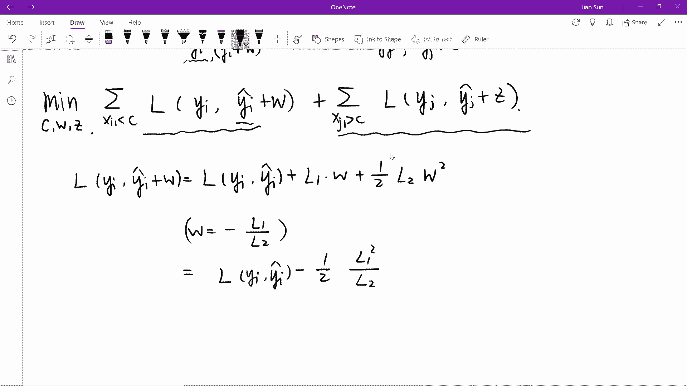

具体的上写就是其实不是一个，而是w应该等于负的所有的那些submission，哪些summation就是对应的第一个特征，小于c的那些，l e的y i y i hate除以对应的第一个特征。

小于c的那些y i why i hate，这是第二个偏导，所以这才是w正确的定义，所以说这里面应该有个求和号，那有了这个求和号呢，我们可以想象上面呢应该是一个相应的这么一个值。

那么同样呢在记呢也应该去同样的进行同样的处理，我们这里就不写了。

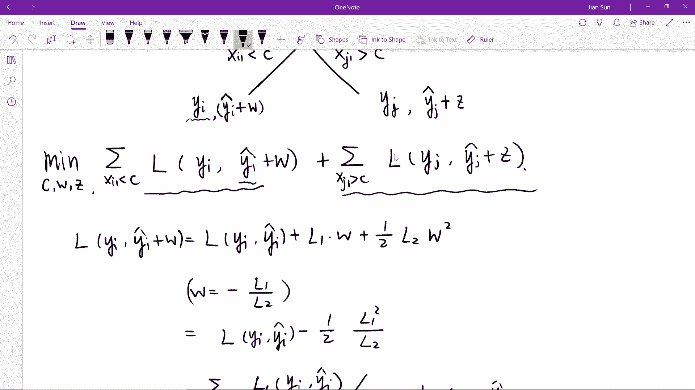

总之呢跟我们以前跟咱们刚才构造这个回归的数一模一样，我们在这里呢需要确定的是三个变量，第一个变量就是分割点是多少，第二个变量w是多少，第三个变量z应该是多少，但是正如刚才我们在回归数中看到的。

一旦我们确定了这个分割点，w和z就都可以立刻计算出来了，根据不同的l不同的损失函数，我们就会得到不同的w以及不同的g，所以说我们现在的目标就变成了从优化角度来讲，我们仅仅去特征。

我们就要去优化这个c就可以了，而去c就是使得我们给啊。

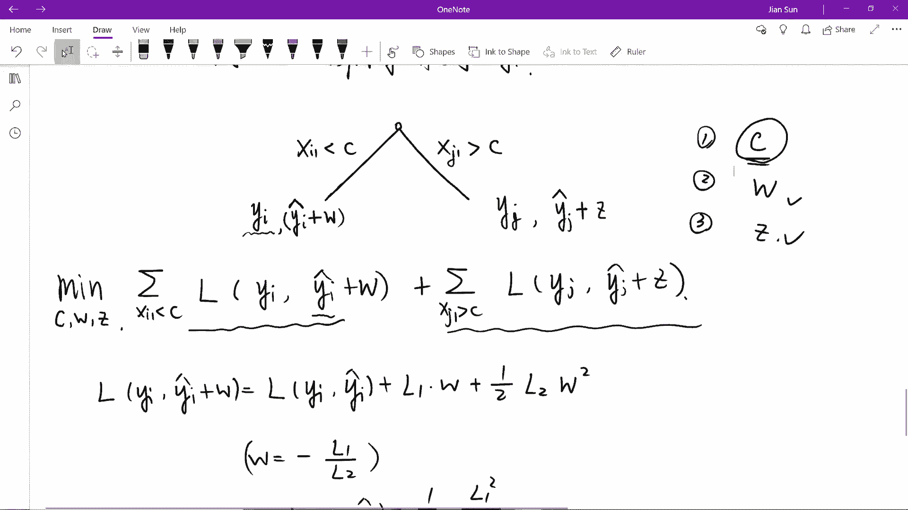

就是下面的这些，就是给出了这个w以及给出了z之后的那个极小值的之和。

最小就可以了，所以又一次我们看到沿用刚才我们的决策树啊，这个decision，这个decision tree里面的回归的想法，我们的目标就是看选取哪个特征，选取哪个分割点解就顺理成章了。

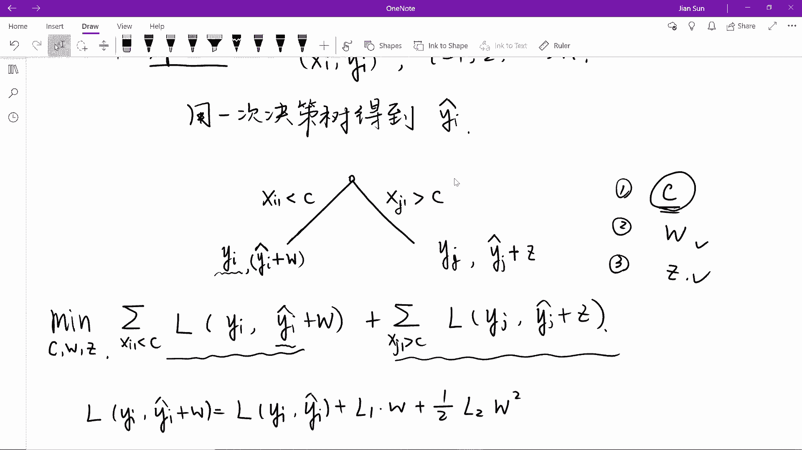

眼前的这个方法其实你仔细的去看就会发现其实它并不困难，那这个方法就叫做规定，就叫做actually boost，我们怎么样具体调用xboost啊，大家呢去调这个python code的时候。

它是有现成的软件包，而且值得一说的是，xboost是近年来呢经常在很多的分类问题中，体现出巨大的威力的这么一种方法，所以非常强烈的建议大家去使用这种方法到我们的这个作业中啊。

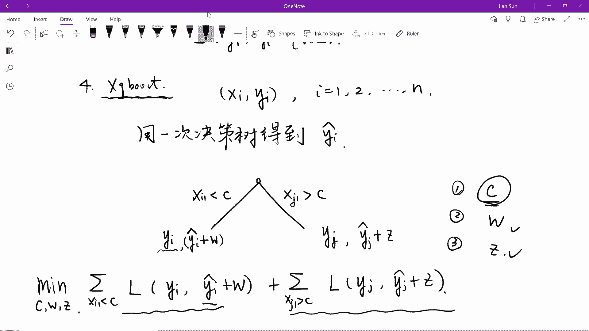

好最后呢我们再讲一个另外一个理论性很强的艾达不。

的算法，ab的算法呢就是从理论上来证明我们如何从弱分类到强分类，是可以是可行的，为了讲这个ada boost呢，我们现在呢再讲一下x1 ，我们再给我们再给出一下机器学习的的一种新的一种表示形式的。

假定我们平面上，而不是平面上，假定我们的数据集给出了n组点，都是独立同分布的这种n组点，但是呢在这里以前我们n组点呢每一个出现的概率是一样的，但是在这里呢我们还给出了它不同的权重。

第一第二一直到第n呢是n个权重，这n个权重加起来是等于一的，如果你不习惯于权重的想法，你就可以想象在这个数据几点中的这个x1 y一出现了，不是出现了一次，而是出现了若干次，根据它的权。

它分别出现了若干次，或者你可以想象在x一和y一非常非常相近的地方，有类似的这些点出现了这么多的次数呢，就跟第一所代表的这个权重是差不多的，在给出了这种点以后呢，我们给出一个分类函数。

这个分类的函数我们来定义一下其损失函数，我们可以给出一个分类函数叫做h x那么其定义的这个损失函数，我们以前试过，我们是如果不同的这个损失函数我们都试过，如果说我们就是说严格的看它分类错误的那些点。

叫它的损失函数的话，我们叫做定义成l这个h，那就是所有的那些hx i和这个yi不等于yi的那些点的个数，所有的这些啊应该叫做，应该把它写小一些，hx i不等于yi就一啊，所有的这些个数的加起来。

但是呢我们由于有这个概率权重，所以说还得把这个di把它乘上去，以前呢我们是假定是等权重的，所以这些bi呢就是n分之一，这里面不等权重，我们只要把di乘上去就可以了，那这个我们就把它定义成是损失函数。

同时我们说一下。

我们现在的处理的是分类问题，所以说这里的yi呢又一次的取两个值了。

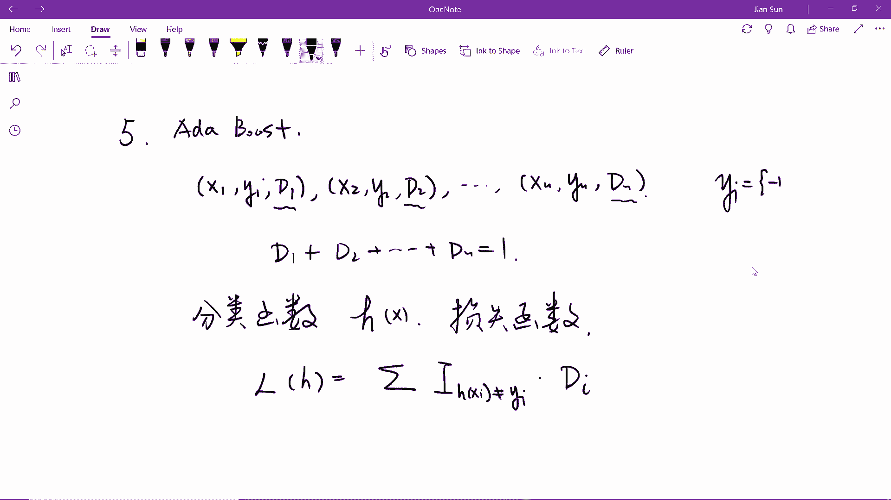

就是-1和一，我们在这样的一个理论框架中去探寻。

首先定义什么是弱分类函数，弱分类函数就是说我们现在有一个，分类器就是分类函数得到了这个h这个h的分类有一定的效果，但它不是特别的好，就是我们希望特别的好的话，我们就希望它的损失函数特别接近于零。

我们说它是弱分类函数，也就是说它的分类效果不接近于零，但是它小于1/2，但是比这个1/2呢要稍小一点，比如说小于1/2减lada，这个ladder是一个正的，只要有一个正的拉姆的满足是一个不等式。

我们就叫做这个h是一个弱分类函数，我们现在就看一看这个弱分类函数如何，慢慢的可以一步一步的加强到强分类函数上几。

基本想法就是这样的，我们可以不断的去重新第一我们的一个提升角度来讲，如果我们回回忆刚才我们讲的xboost，我们是怎么做的，在boost里面。

我们的方法就是把我们的每一次学习的值和原来应该有的值进行比较，比较了之后用它们的差距来作为新的学习的值，那么在这里呢我们不去管它的差距。

因为在这里不存在这个差距，我们在这里是一个分类问题，对就是对不对，就是不对，所以在这里呢其实我们可以调整的是权重，调整权权重呢只要这个分类不正确的这些点，我们去加大它的权重，分类正确的点呢。

我们就可以减少它的权重，使得总类权重仍然是一在这样的情况下呢，我们来重新来做一次分类，我们得到第二个分类函数。

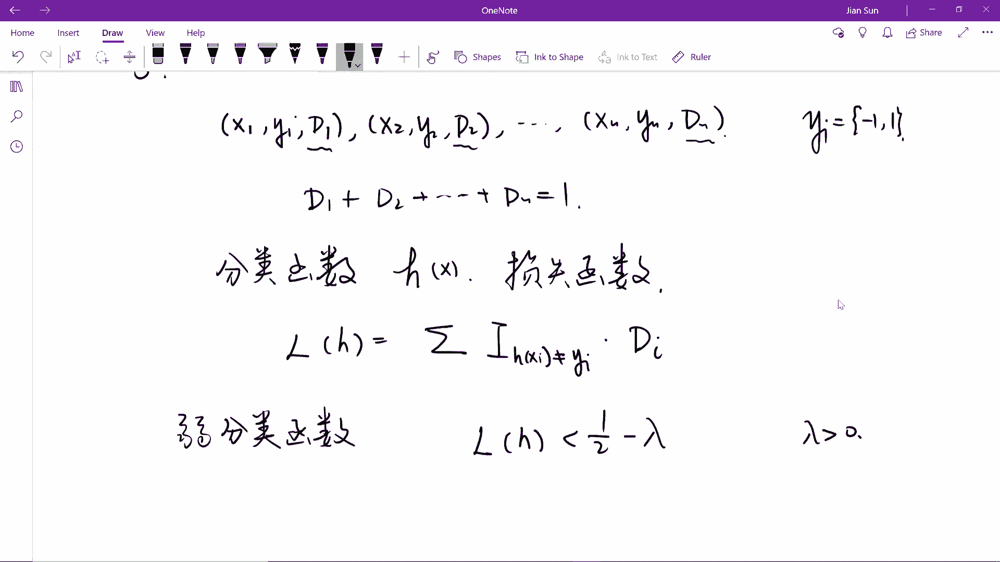

所以我们的目标是得到一个又一个的分类函数，最后呢所有这些分类函数的线性组合构成我们最终的分类函数，我们希望我们最终的分类函数随着不断的往上增加，这个分类函数的时候，我们的这个损失函数会越来越小。

甚至呢是接近零。

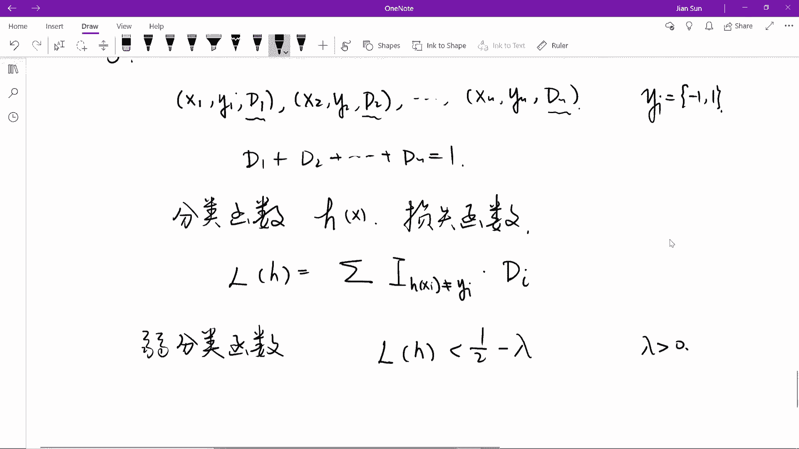

我们看看怎么做到这一点，就这样，比如说呢我们先从我们先从啊啊1y1 ，因为这是一个递归的过程，所以说呢我们先从第一个，选中开始这个权重，我们第零个权重开始，我们上面都标了这个零，开始的时候呢。

你可以任意给这么一组权重，甚至呢我们这些权重呢干脆就是n分之一就可以了，就是说我们从等权重开始，等权重开始呢，我们就学习到了啊，我们就终于学习到了这么一个第一个啊函数了，这第一个函数是一个弱分类函数。

通过这个弱分类函数呢，我们现在来定义下面的，这个下面呢就是重新定义这个权重，重新定义权重呢就是叫做第一了，这个权重怎么定义呢，我们来这样定义，就是e的，但是我们要把它归一化。

所以最后呢我们还要就是说做一个归一，等于一到n这里呢就定义成第一个权重，同时呢我们在这里呢还要在前面加上一个小小的系数，我们在这里加上叫做w1 ，一会儿呢我们再去规定这个小小的系数应该是多少。

我们一会儿放在一会儿来说一下这个这个想法，这个小小的系数也是大于零的。

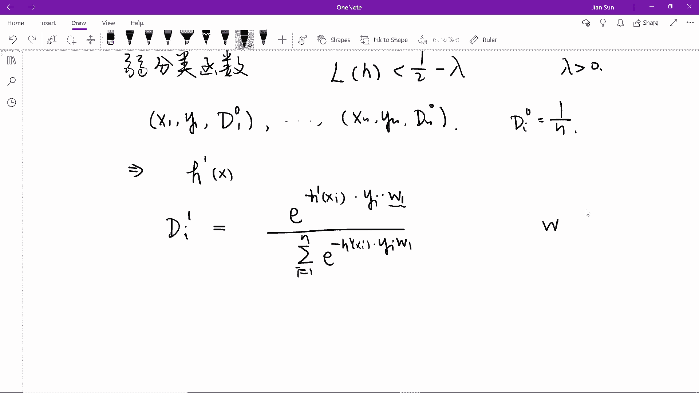

再看一看做做，所以这个分类函数来讲，这个h它也是取不是零，就是一它的取值，因为它是个分类函数，不是零就是一，所以y也不是零，就是一，当这个分类正确的时候，h乘以y就是正义，当分类不正确的时候。

h乘以y就是-1，当h乘以y等于-1的时候，前面又加了一个负号，所以说这个指数函数就会大于一，分类正确的时候呢，这个指数函数呢就会小于一，我们再配以一定的这个w就可以去放大这几个效果。

所以说新的这个权重在分类不正确的这个点上呢就会变得很大，在分类正确的这个点上呢就会变得比较小，有了这个新的选中，我们再一次把这个新的权重带进去，这样的一个新的权重，我们再一次的用我们的弱分类器。

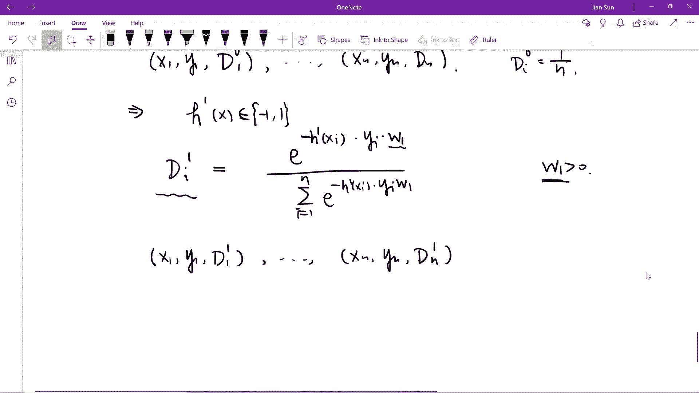

我们就可以得到h2 x h2 x有了，然后呢我们这个h2 x它又是一个弱分类器，也就是说它的分类效果呢可能就是比1/2呢，它的这个损失函数就是比1/2呢小一点点，比0。5损失数比0。5要少。

但是呢我们在这里呢根据这个h2 x我们又要来定义新的这个权重，最新的权重的时候，这里面有一个技术性的这么一个细节，就是有了h2 的呢，我们来定义f2 ，我们f2 等于多少呢，就是w e h。

一点w2 h2 ，所以说我们这个第三呢啊啊第二啊，w2 h，那这个嗯啊第二，那这个第二呢就是e的是的f2 x i乘以yi乘以w，我们在normalize一下。

i呢是从一到n这样我们就得到了第二二又是一组权重。

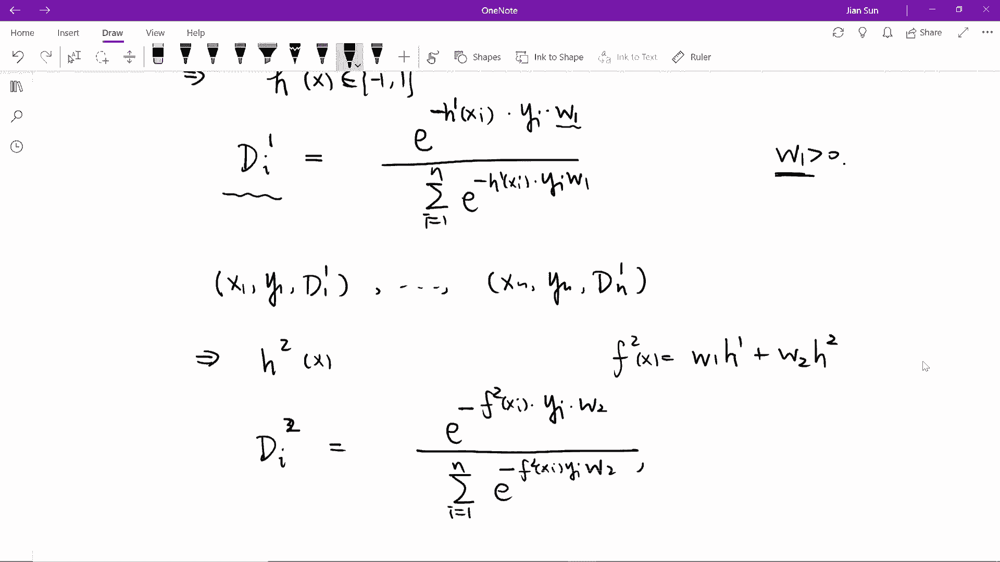

从第二呢我们就得到了h3 x从h3 x呢就会得到f34 ，f3 呢就是w1 h一加上w2 是二加上w3 h3 ，我们一会儿再说w1 w2 和w3 的来历，这样一来我们就终于形成了这么一个迭代的过程。

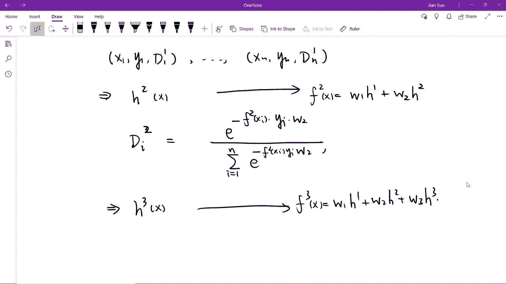

我们看一看这个迭代的过程，迭代的过程就是说我们从等权重开始得到了第一个分类函，弱分类函数，从第若分类函数呢我们就得到了，我们也可以说在第一个弱分裂，这函数值就可以定义这个f一呢就是w1 ，h1 h1 。

从第一个做分类函数就得到这儿。

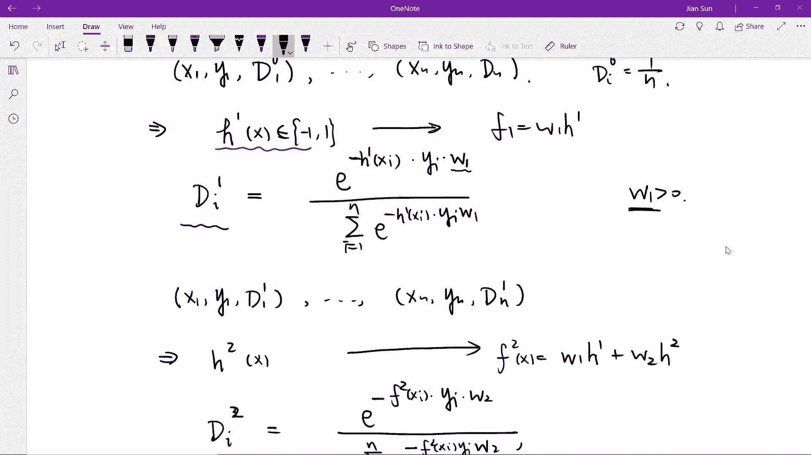

从第一个弱分类函数呢我们得到了新这么一组权重。

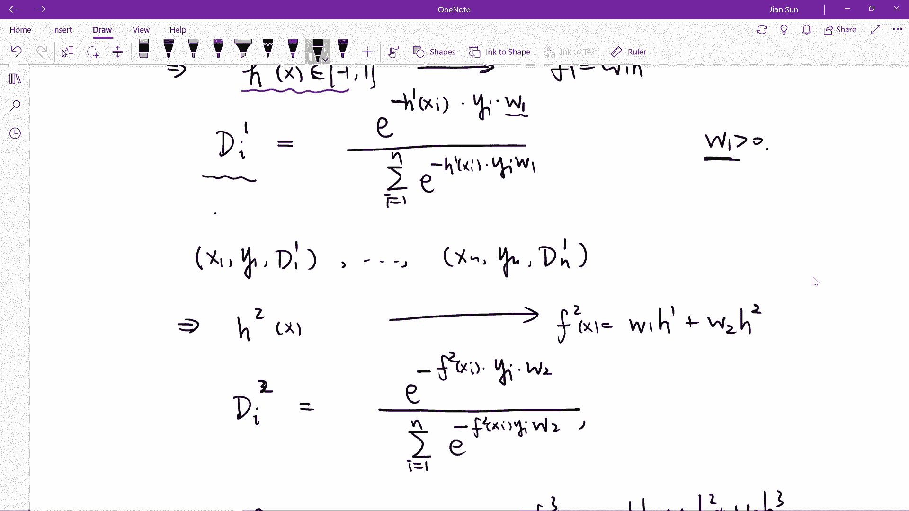

从新的一组权重呢我们就得到了第二个弱分类函数，从第二个弱分类函数呢我们得到了f2 ，f2 呢我们就，这么一个啊，到了第二个，这个其实是第三个权重，从第三个圈中呢我们得到了h3 。

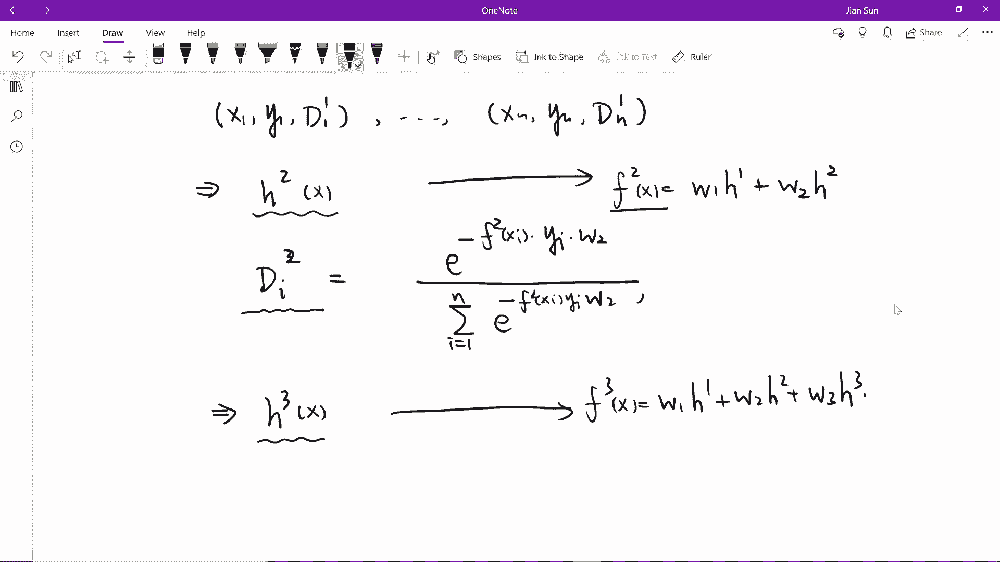

从h3 呢我们就得到了f3 ，经过了一系列呢，我们就得到了这么一系列新的函数，叫做f1 x f2 x一直到f n x啊，我们可以想象这个过程可以无限下去，每一个f都是h的一个线性组合。

我们现在断言这个新的这些函数f其实是给出了一个越来越好的逼近，怎么给出了这个越来越好的，毕竟我们怎么去证明它呢，我们现在就是要证明一下目标是去证明啊，这个新的f作为一个分类函数的线性组合。

其实它的这个损失函数啊就要小得多了，我们看一看怎么证明这一点，我们要想证明f，就是那些点的个数，好首先这些点的个数我们看一看，怎么来啊，这些点的个数除以n啊，的个数除以n。

我们是希望这个作为这个损失函数，它趋向于零，我们看一看怎么来估计它，首先我们来看，如果说fx乘以y我们知道它作为这个分类函数，它等于正一的时候，那就是分类正确，-1的时候，那就是分类不正确。

但是前面又有一个负号，所以说呢如果是我们可以看它，y分类正确，那么这个值是小于一的，如果f x i等于买分类错误，它就是大于一的，你说左边的这个数值呢，它是要严格的小于右边的这个值。

我们这还要除以一个n次方啊，这个n分之一我们现在来看，因此与其估计左边的这个值，就不如估计右边的这个值就可以了，右边这个值呢我们不如再取一个名字，我们叫做z这样呢我们我们知道我们定义g n等于呢。

不要用z n了，gk吧，定义gk等于分之一，所有的i等于一到n e的负的f，目标是来证明这个gk我们的目标，去证明，趋向于零，我们看看怎么来完成这个目标。

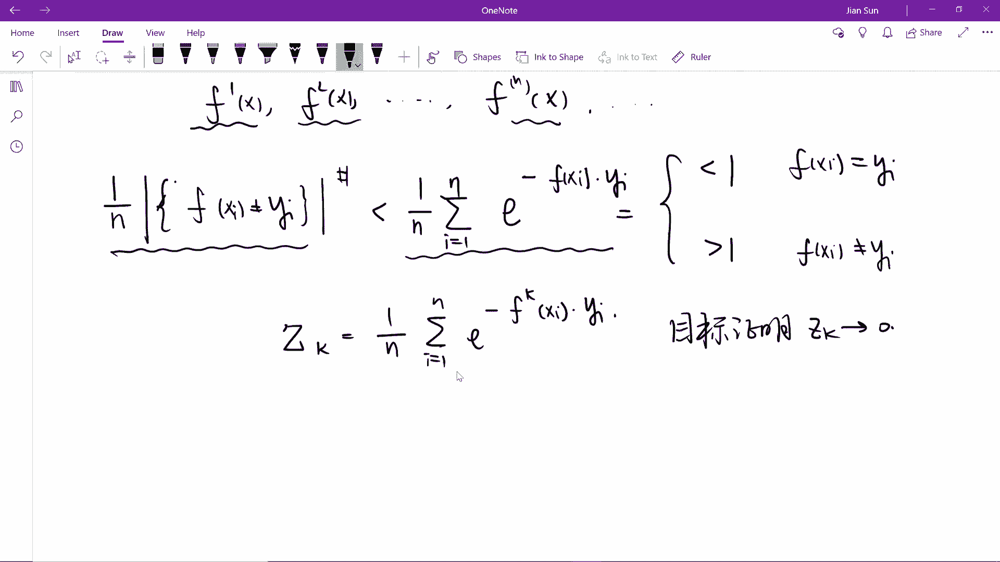

为此呢，加一除以gk，那就是根据表达式就是e的负的f一加1x i乘以yi除以，fk xi yi这里的i呢都是求和，从一到n求和，从一到n我们记住fk加一啊，i就等于fk xi再加上wk加14k加一。

根据我们的定义，每一次f呢就是多了h作为它的这个线性组合的一部分。

因此上面呢我们就可以是上面呢我们就可以分成了两部，是f k，i乘以yi，第二步是6k加一hk加ex i乘以y i，下面呢是，所谓的求和。

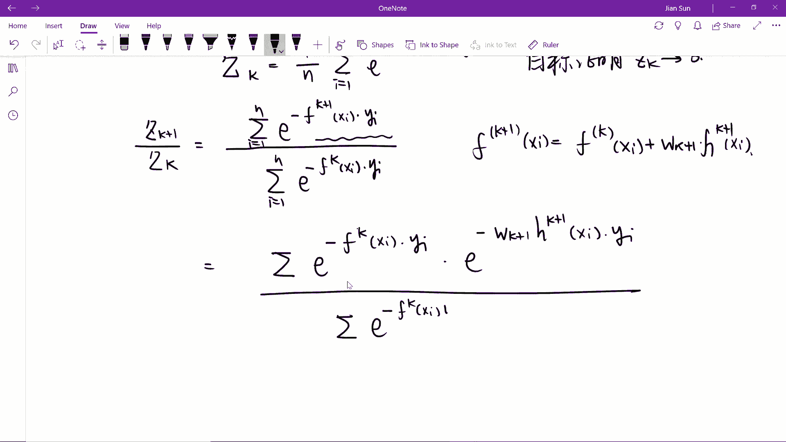

但是这样的话我们把上面的求和呢，就上这个整个的这个求和号拿到最外面来，就是i等于一到n，然后呢每一项，放到里面来再乘以e的负的w k加1k加ex i乘以yi。

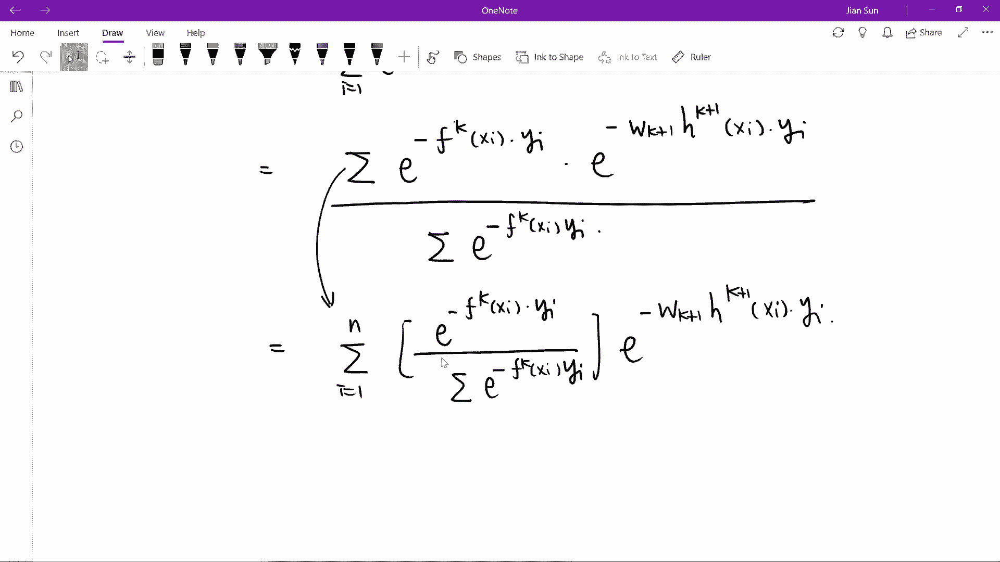

为什么要做这件事情呢，是因为现在在括号里面。

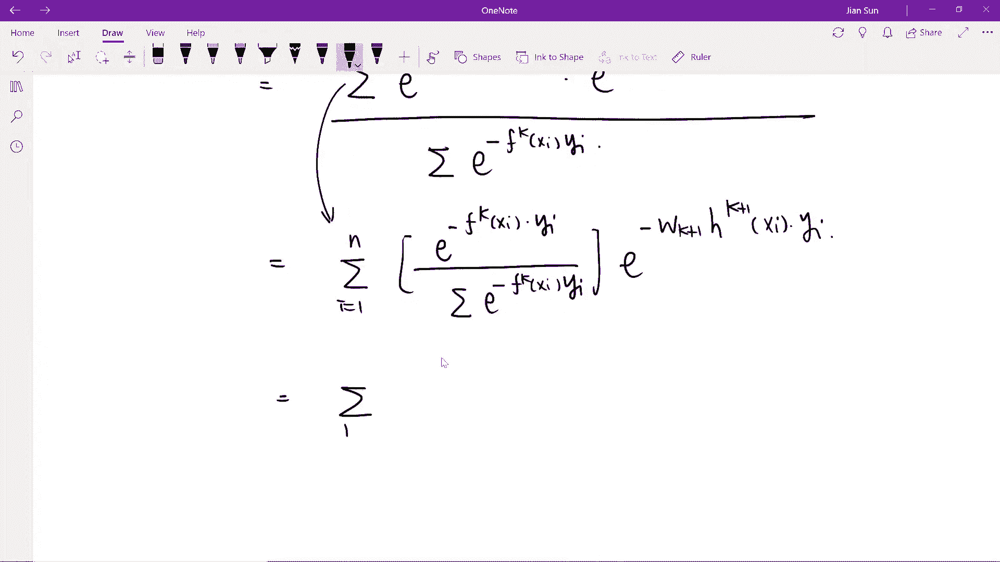

这个根据咱们的定义就是。

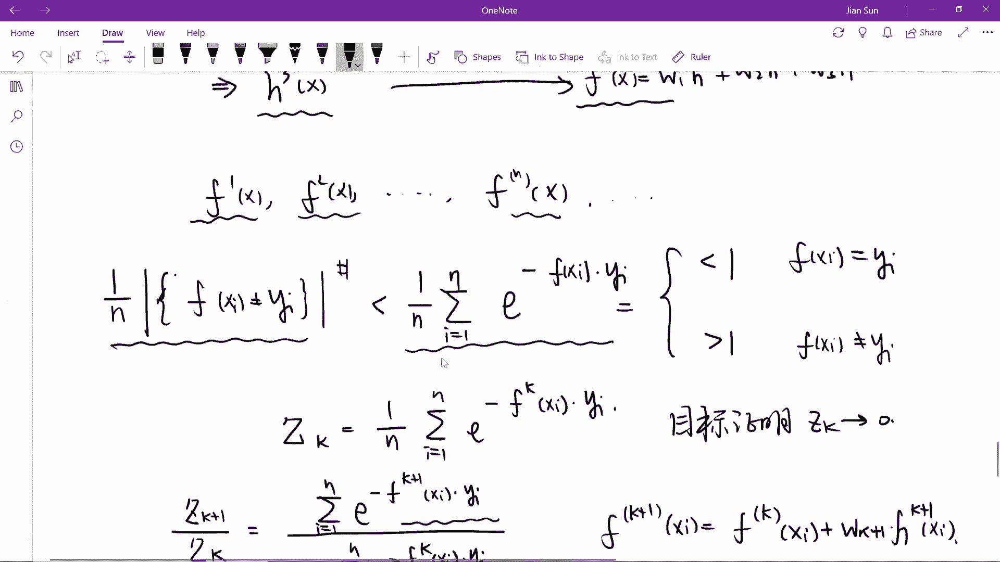

我们说一下刚才在d的这个定义中啊。

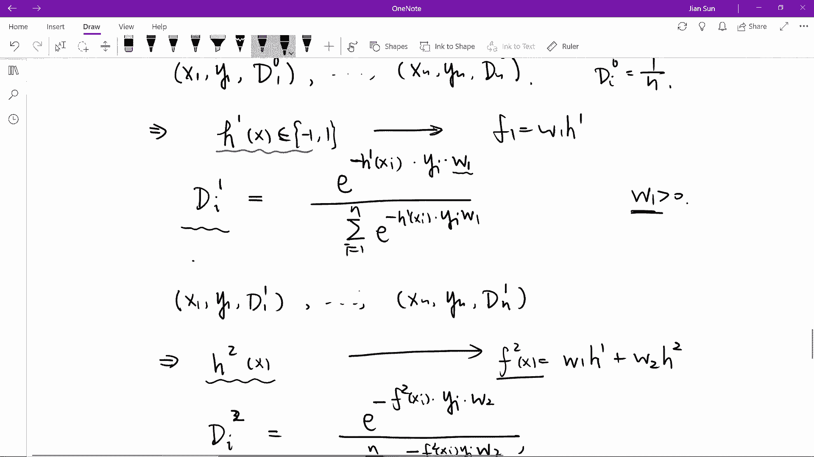

应该没有这个w。

其实就是说我们说一下哈的定义中呢。

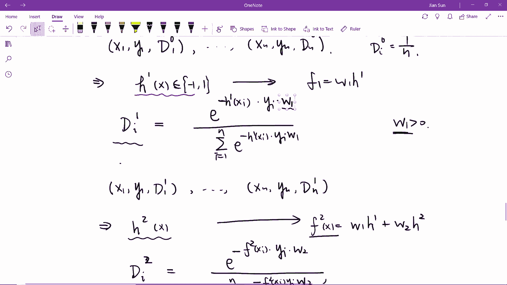

我们就不需要这个w了。

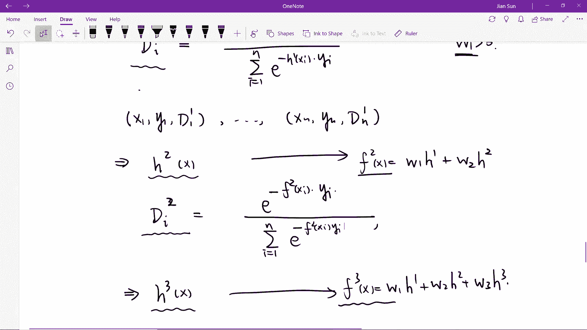

只需要在d的定义中呢把它改成f都是f就可以了。

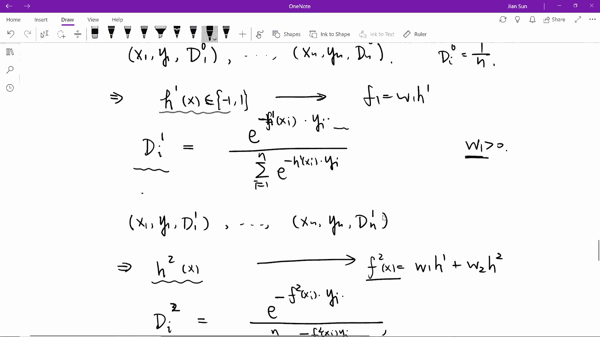

hk加1x i y i眼前的这么一个大的求和。

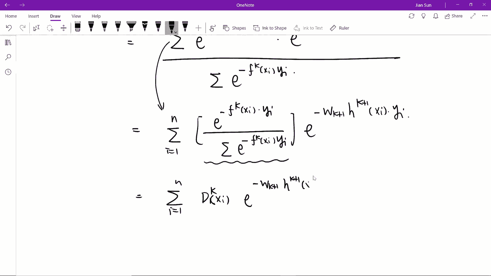

我们可以分成两部分，一部分是所有的这些h k加ex i等一个外来的人相等的那些呢，那就是所有的dk xi相的时候呢，我们知道它就是正一，所以这里面就是e的负的w k加一，还有一部分呢是判断错误的。

就是dk x i6 的正的k加一好了。

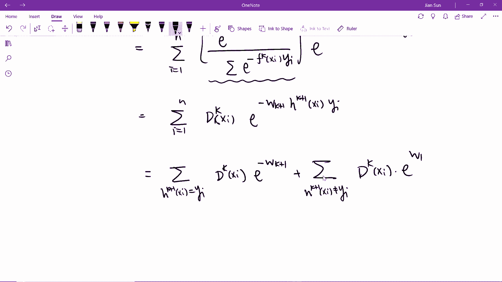

以前的这个我们看一看是什么，首先呢这边呢是我们把因为这个求和就跟是无关的，这是两个常量，我们可以说把这两个常量提出来，我们有一个不同的颜色吧，这就是w k加一，这个就是判断正确的。

这就是说明hk加一判断正确的那些，这是hk加一判断错误的那些判断正确的，比如说我们就叫做减l判断错误的是真的损失，我们已经知道这个损失呢是小于1/2减，跟我们那个损失。

还是我们用同样的损失好眼前的这个值，我们我们现在有一个的变量就是w k加一，我们可以让我们的w k加一取到一个什么值，可以让眼前的这个值尽量的小就可以练了，等于e的wk加一。

眼前这就是一减l除以y加上y乘以l眼前的这个值呢，我们y求导数，我们觉得的l啊减去一减l y y求导数码y方，所以你看我们就可以看到这个y，y方呢当然就等于一减l除以l的时候，啊，二下求得最小。

那么我们再把这个带进去，我们就会发现令是y等于不是这个y方，就是y等于根号下一减l除以l，我们把它带进去，那当然了，y等于它呢，那ww k加一也就取出来了，它就是1/2的log 1 l除以l。

那我们把它带进去，会发现呢，它就是两倍的二项l乘以一减l好了。

你在注意l是小于1/2减减去兰达的，所以说它就会小于等于可以计算两倍根号下，这就是1/2减去拉姆达乘乘以1/2，加上lambda，它就是两倍的根号下1/4减去兰姆达的平方，那么他也就可以把二代进去。

就是1-4倍的兰姆的平方，是一个比较小的数啊，就是这个那不仅小，而且呢小于1/2，大于零，小于1/2的这么一个数。

所以眼前的这个数呢是严格的小于一的一个数。

看到眼前的这个数呢是gk加一gk。

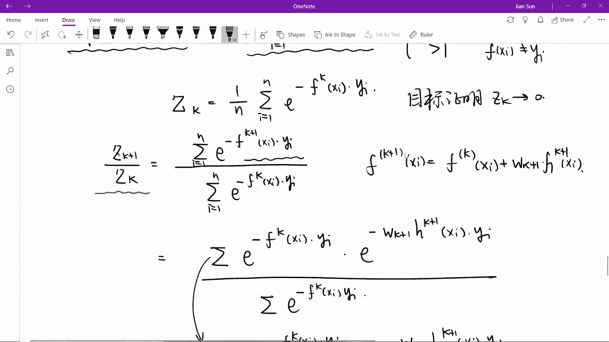

所以说呢都是小于这么一个常数，这样我们就推出来了，根据所有的这些推导，就一般的gk要小于等于眼前的这个常数，一个小于一的一个数，每次方当然这个数就趋向于零了。

我们证明了是个什么事情呢，我们再回忆一下。

通过这么一个非常长的这么一个推导。

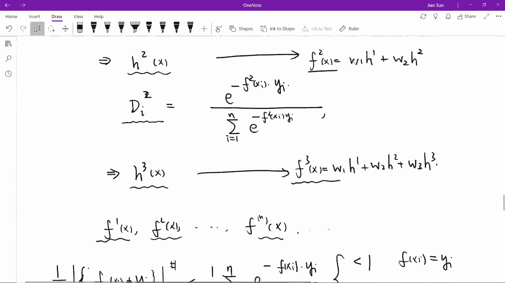

这就是形容了这么背后的这个想法，背后这个想法就是说我们从一个弱分类器的算法出发，每一次我们学到的这个弱分类器，其实呢其效果就是比1/2呢稍稍好一点。

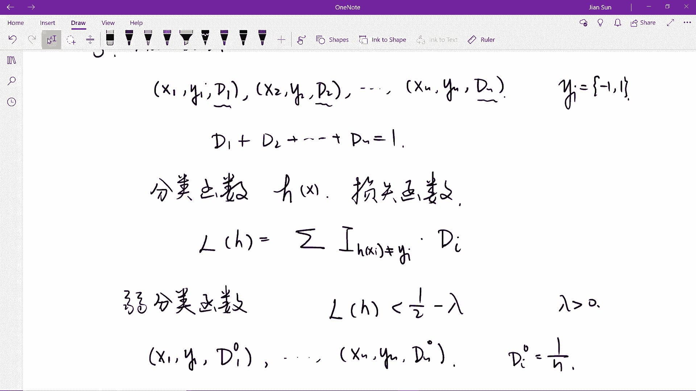

通过这些弱分类器，我们可以做成一个线性组合，我们只要非常仔细地去选这些线性组合的组合系数。

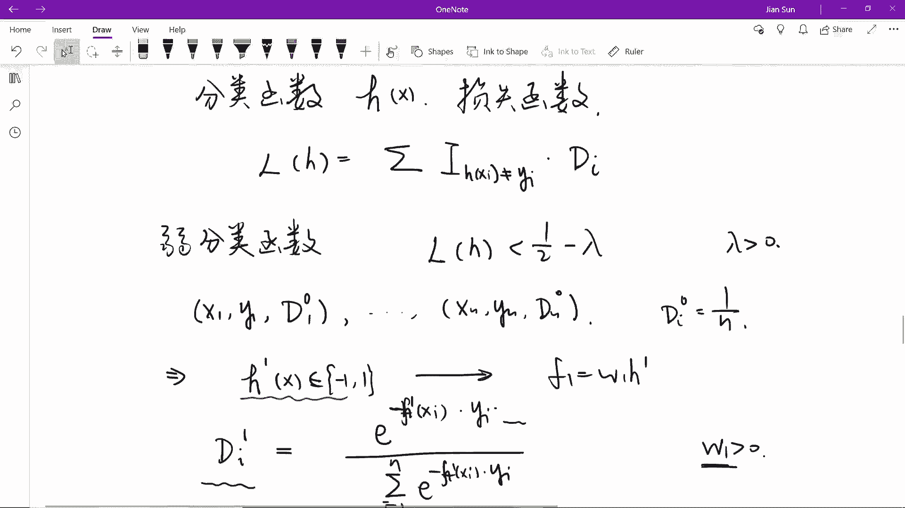

我们就可以使得线性组合以后其实形成了一个强分类器。

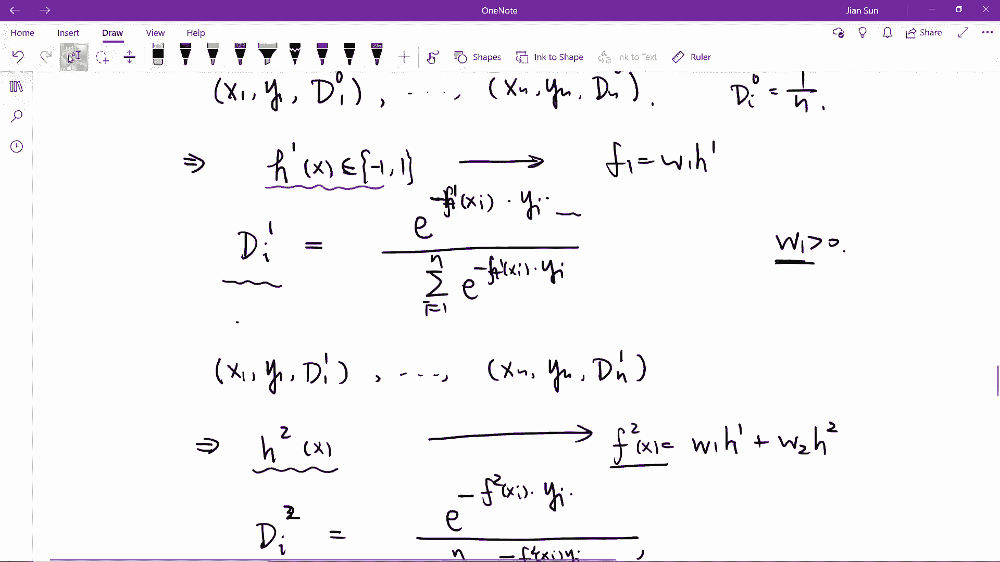

这个强分类器的错误是趋向于零的，at a boost就是为了从理论上来证明它的可行性。

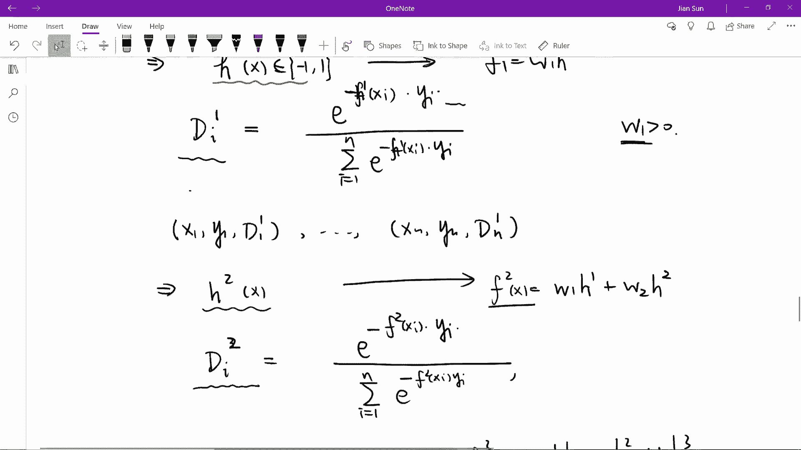

同时呢也给出了一个具体的算法，今天呢讲这个两种提升。

一就是基于gradient boosting的decision tree的提升。

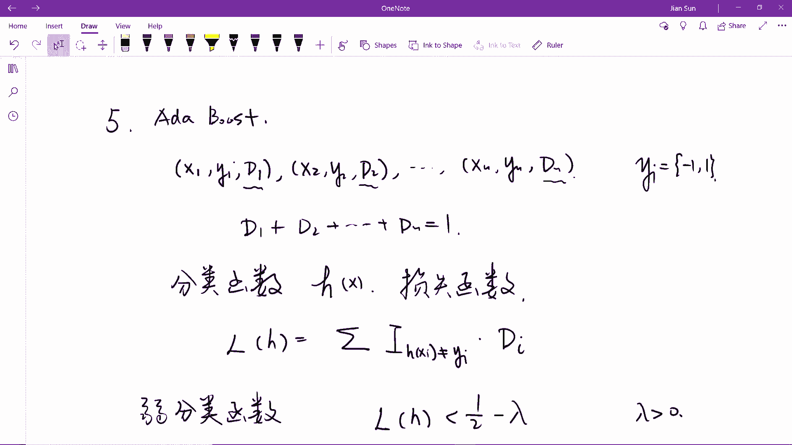

一种呢是基于aa boost的提升，是处理连续问题的，一种是处理力，是处理分类问题的，我们今天呢就是讲这两件事情，具体的更多的一些内容呢和想法呢。

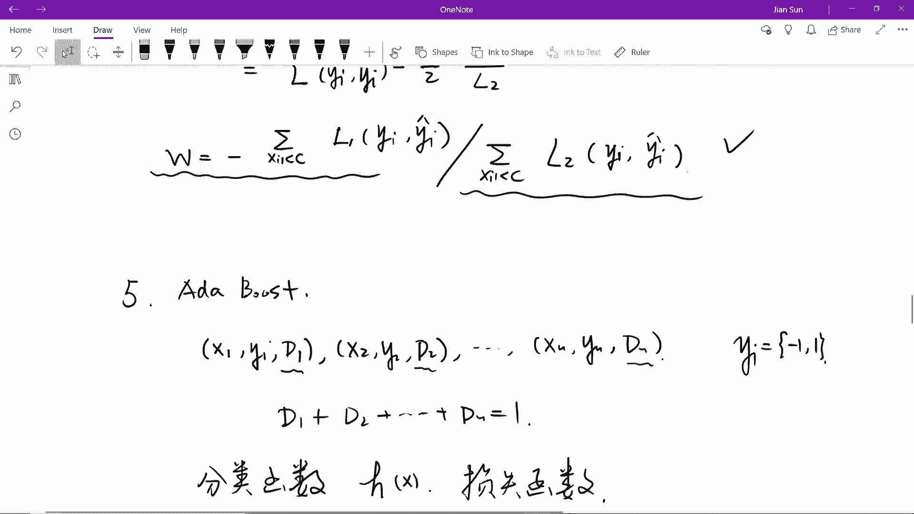