# 复旦大学经济学院《机器学习与量化投资》（Spring 2020） - P10：Lecture 10 EM Algorithm - ___main___ - BV1fv411r7z1

大家好，我们呢今天来讲非监督学习的一种算法，叫做非监督学习的em算法，我们前几次课呢曾经有一次呢讲过贝叶斯估计，那么非监督学习的em算法呢，其实就是贝叶斯估计的一个具体的应用，我们来看看这个问题。

它的导出我们用一个具体的问题来讲，同时呢在这里呢我们先简单讲两句，从监督式学习呢到非监督式学习，它的区别在哪里，监督式学习我们前面几次已经学过很多种不同的学习机器学习方法。

那么监督式学习的一个主要的特点就是给出的数据呢都带个标签，所以说我们的目标就是去寻找数据和标签之间的，或者是一种具体的所谓的deterministic的一种对应关系，或者呢是基于概率的。

比如probabilistic之间的对应的关系，那么非监督式学习呢，就是我们只有数据，而没有给出任何的标签，那我们去学习什么呢，那本质上来讲呢，其实我们就是想学习这一组数据背后它的分布是什么。

换句话说我们主要是想学习这组数据是怎么样被产生的，如果说我们给出的这个数据已经很好地体现了，就是样本，体现了背后的分布了，那么理论上来讲呢，我们就从这个样本呢就可以去学习到这个分布。

这就是这个非监督式学习面临的主要的想解决的主要的问题，我们现在呢来看具体的这么一个问题是什么，才能够导出我们来使用这个em算法，我们还是回到我们以前最早学过的其他私人估计，比如说我们有一个袋子。

这个袋子里面呢有很多的球，具体上说呢有红色的球和白色的球，但是他们之间的这个比例呢我们是未知的，从这个意义上来讲，这个比例比如说是p，换句话说呢就是红色的球呢比上白色的球。

他们之间是p比上一比p这样的一个关系，我们也可以考虑把它看成是一个二元的伯努利分布，这个x呢就是这个随机变量，这个随机变量是说x呢是取成红色的球，这个概率是p x取成白色的球，这个概率就是一减去p好。

在这个意义上呢，我们如果不知道这个比例，但是呢我们可以去随机的抽样，假如说我们可以随机的从这个袋子中反反复复的把这个球呢抽象出来，就构成了x1 ，构成了x2 ，一直到x n，所以每一个值呢不是红色的。

就是白色的，如果我们用球的话，如果用数字的话呢，它可能就是一组零一构成了这样的一组数字，我们根据这样的一组数字呢，我们来估计原来的不努力分布中的这个概率p，事实上啊我们从吉大自然角度。

我们知道最后的估计就是p啊，那么除以n，这个呢是既符合我们对平时的直观，同时呢它又是极大似然估计的一个嗯，简单的通过推导得到的这么一个结论，在整个这个过程中，其实我们就是做了这么一个极大似然。

估计我们现在把这个问题呢延展开来，我们看看，如果说眼前的袋子有两个袋子，不是一个袋子了，所以说我们眼前呢有第一个袋子啊，第二个袋子各自都有，红色的球和白色的球好。

我们现在看看我们怎么进行的这个随机抽样呃，我们看一看我们从第一个袋子中啊，假定我们每一次抽取这个球的时候，是首先我们随机的去挑选一个袋子，这个随机的概率呢叫做w，就是我们每一次从第一个袋子中。

我们就是分成第一个，第二个啊，第一个我们去抽取到的概率是w，那当然我们剩下第二个抽取到的概率就是一点w，所以我们每一次呢是用这样的概率从第一个袋子，或者选定了第二个袋子，我们选定的第一个袋子以后。

或者选定了第二个袋子，也是随机的，从袋子中抽取这个球，当然了，这个球有可能是红色的，也有可能是白色的，好我们现在来，那但是第一个袋子中它的红色的和白色的，红色的和白色的，它们之间的比例呢是一和一减p。

那么第二个袋子中他们红色和白色的比例呢是q减去一减q，我们用眼前的这么一个矩阵，就很容易把这四个量表示出来好，所以说你看我们眼前抽取球的方式啊，是每一次都独立的产生一个随机变量。

决定我们是从第一个袋子中去抽取球，还是从第二个袋子中去抽取球，每一次决定了袋子以后，我们从袋子里面也一样，是每次都是独立的去随机的去抽取一个球，当然这个球可能就是红色的和白色的。

那么根据眼前的这几个参数，主要是三个参数，就是从哪个袋子充抽取球，w第一个袋子中红色球的概率是p，第二个袋子中红色球的概率是q，我们根据这三个参数，我们当然就可以回答一系列的问题。

比如说我们说先说如果说我们按照刚才的这个方式，我们抽取出这个球，我们叫做叫做还是x作为这个随机变量，我们抽取出这个球，它的红色的概率是多少，如果我们知道刚才这三个参数。

那么这个问题呢就比较好回的抽取就是红色无非是两种，一种呢是从第一个带子中抽到红色，一种呢是从第二个袋子中抽着红色，那考虑到第一个袋子中的概率是w，所以就是w p第二个袋子中的概率是一减w。

那就是e减wq，这就是我们抽取出一个球是红色的概率，那当然如果这个球是白色的概率，那么就是从第一个袋子中抽取出白色，或者是从第二个袋子中抽取出是白色球的概率，那这两个概率呢我们也知道了吧。

通过这一些呃参数呢，以及通过这些概率的计算，我们就可以进一步的来计算条件概率，比如说我们就可以问这样的问题，我们已知啊这个x呢是红色球了，我们想问他从第一个袋子中得到的这个概率是多少。

所以眼前呢这就是一个条件概率，那这个条件概率呢我们就可以纵向的来看，换句话说呢，你看以纵向的来看，我们已知道从第一个带子中是w，这边呢就是一减w，我们就可以把这些概率作为权重都分别乘以到。

就是我们在这个概率构成的这样的一个矩阵中，我们直观上想，那么现在红色和白色加权平均以后就是wp，那这边就是w一减p，这边就是一减w q，那么这边就是一减w和e减q好，现在呢我们已经知道是红色了。

那么在红色里面来自第一个的概率，那经过我们这样的一个直观推导，我们就看得出来它就是比较明显，那就是wp这就是既是红色，又来自第一个除以是红色的概率，那就是wp加上一减去w乘以q这就是红色来自第一个。

那如果是红色x还是红色来自第二个呢，那就是上面就变成了e减w乘以q，然后呢除以的还是红色的概率，同理啊，我们就可以知道，如果x是白色，但是呢它来自第一个的袋子。

那么我们就来看刚才这个绿色形成了这个矩阵的第二列。

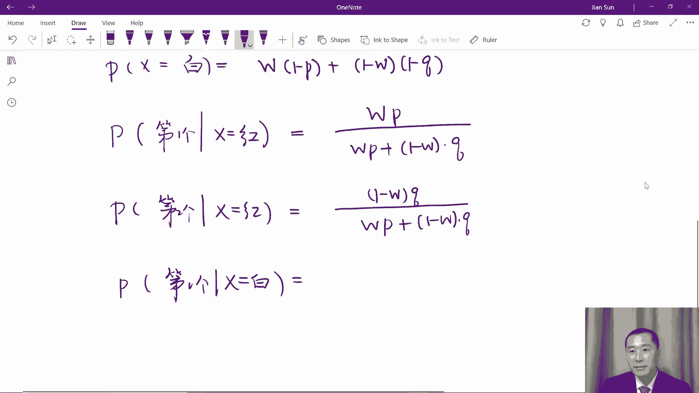

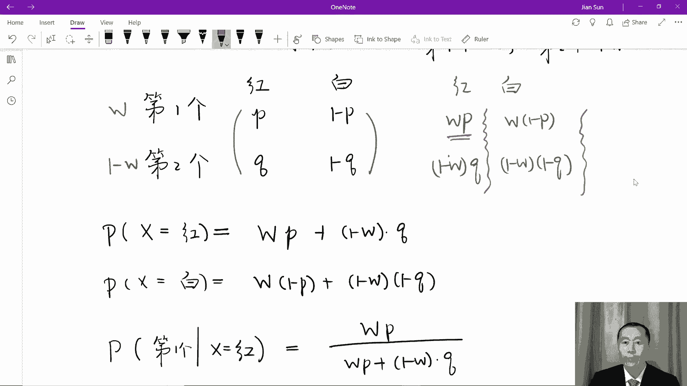

那么就是它既来自第一个，同时呢它又是白色的概率除以呢它是白色的概率。

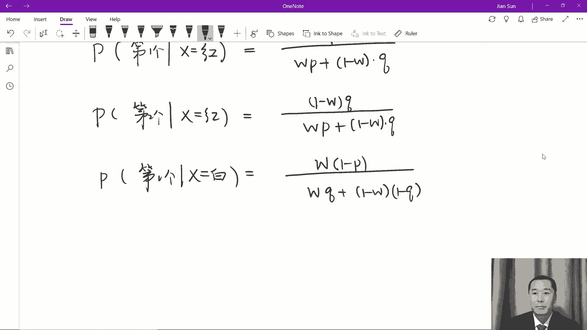

这就是我们现在得到的这个结论啊啊它是白色的啊，sorry，刚才这有点问题，来自第一个同时呢是白色的概率，最后呢我们来看我们就可以问取出的球是白色，但是呢这个白色却是来自第二个的概率。

那显然这个条件概率呢就是由眼前的这个公式给出好了。

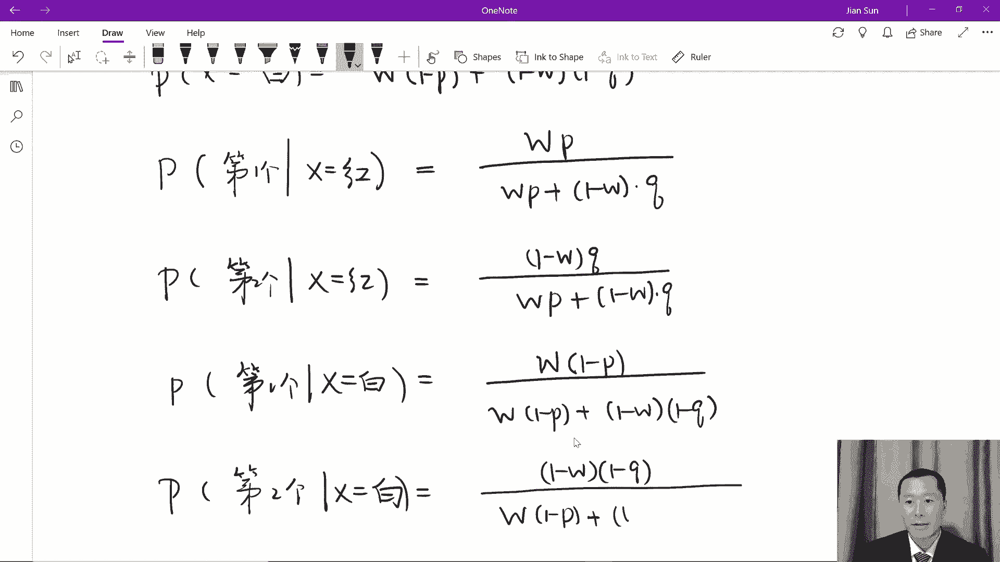

我们根据所有的参数，我们就可以计算出这四个条件概率来，我们眼前呢就是说知道所有的参数，其实我们就可以求出眼前的这些或者是概率。

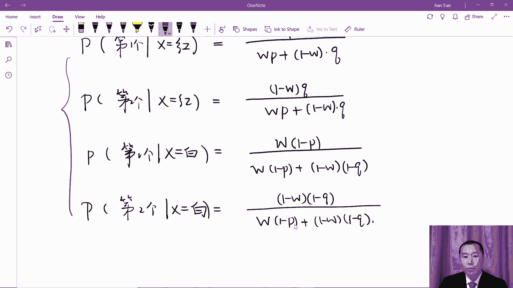

或者是条件概率。

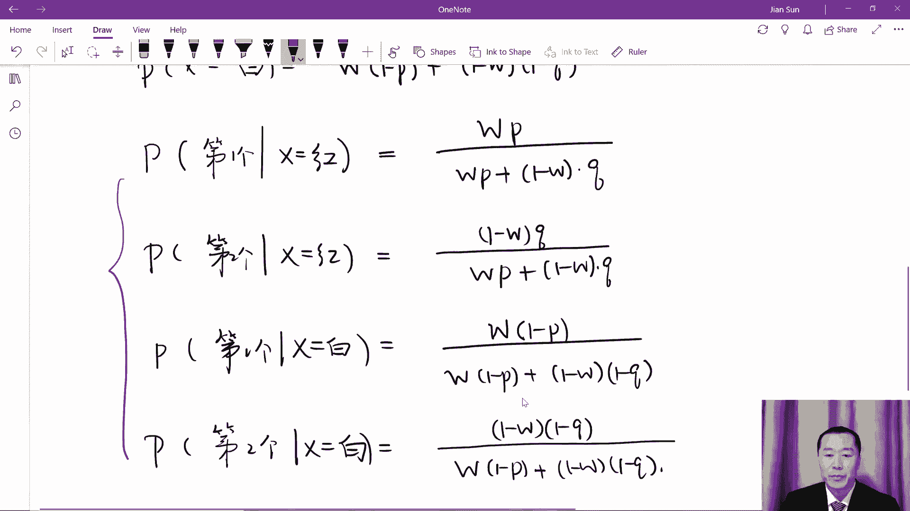

这些都没有问题，现在回过头来，我们就回到参数估计的问题，如果我们不知道眼前的这些参数，但是呢我们就可以随机的按照这样的一种方法去抽样，抽样出来的结果，我们会看到x1 x2 ，我们会抽样到n个样本。

我们从这n个样本，我们的目标是回过头来估计刚才的那些参数就是wp和q，所以我们的问题就是又一次的跟其他四人估计一样，我们是从样本去来估计这些参数，我们现在还是从受到极大私人估计。

我们的这个从极大自然估计角度来讲，我们看一看这些样本出现的概率是多少，这些样本的每一次出现呢，无非它的概率呢我们就可以直接了当地计算出来，其概率呢是它呢或者是从以w为概率，是从第一个袋子中抽取的。

但是第一个带子中我们知道这个啊，我们这样我们现在令我们现在要把转成数字，令这个红色呀就代表一就是从随机变量角度来讲，从白色呢我们就代表零好，从一旦我们设计的这样的一个用数字来代表了颜色。

那就是他从第一个中w为概率从第一个中抽取的，那么它或者是x就是红色，或者呢它是从第二个中抽取的，或者呢是一减去q，这是每一个样本出现的密度，所以根据极大似然估计，我们需要把所有的样本来做乘积。

也就是我们令所有的i等于一到n，e减去p的一减x2 次方，我们要让眼前这样的一个乘积需求极大值，在寻找w寻找p和寻找q使得呢这个连乘积啊得到一个最大值。

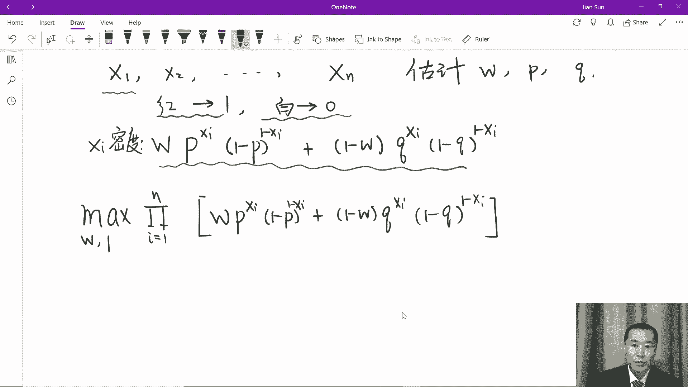

但是这个问题看上去啊非常的复杂，一是因为这里是连乘积，但即便不是连乘积，我们把它取log变成求和，看上去也很复杂，因为眼前的这个大括号中的这个变量啊，似乎呢是非常的就是复杂，但其实你只要代入一两个。

你看一看得到什么结果，你看看得到什么结果，其实就可以把眼前的这个式子变得非常的简单了，眼前的这个式子变得很简单，你会看到是什么呢，眼前的这个式子就等价于还是连乘积i等于一到n。

其实啊他就等价于是wp加上一减去w q d xi次方，再乘以w一减p加上e减w e减q它的一减x次方，为什么呢，因为主观上想嘛x y等于一的时候，你其实它就是这个概率，其实它就是后面的这个概率。

所以说上面看似复杂，其实啊在就是在我们这个简单的框架下，其实是比较简单的，这样一来呢，我们的问题就是去求解这样的一个极大值w p q，对于后面的这个连乘机求吉他。

其实啊我们在以前上次讲其他三人估计的时候，我们已经做过类似的问题，在那个问题中，后面这个式子我们可以做一个替代，就是整个的这个绿色的，我们把它看成是一个大写的p，整个的这个右右手边是一个大写的e减片啊。

这是一个大写的，我们去求，我们就问什么样的这个p能够使等式右边能够这个值取到最大，咱们在伯努利分布的时候，其实已经做过类似的事情，最后的答案就是大写的p，一方面就是w乘以p加上一减去w乘以q等于什么呢。

就等于k除以n，n呢那当然就是总共样本的个数，那与此同时呢，那就是w，一减p加上一减w一减q那当然就等于n减去k除以n，所以呀只要换句话说，只要我们的参数w q这三个参数满足其中的这两个方程。

其实这两个方程呢是一个方程，为什么呢，因为如果上面的方程满足下面的方程就自然满足啊，你一减去，上面这个方程中的左右两项自然就是下面的方程，所以结论来了，结论就是说，刚才我们设计的两个袋子随机的抽取袋子。

然后再从袋子中随机的抽取，求从极大词人估计的角度就是w p加上一减，w q等于k除以n，这就是最佳估计，但是在这个里面有三个参数w和q，所以三个参数一个方程本质上我们多了两个参数。

从而呢你只要三个参数满足这个方程，它就是一个合理的估计，比如说我们给出了就是举个例子，比如说分别给出了p和q，那么呢我们就可以去啊解答解答这个w，同理呢我们给出了w和p，那我们当然就可以解给出q。

我们给出了w和q，我们就可以去解，无论怎么样，两个参数就可以求得第三个参数，只要这三个参数满足眼前的这个方程就可以。

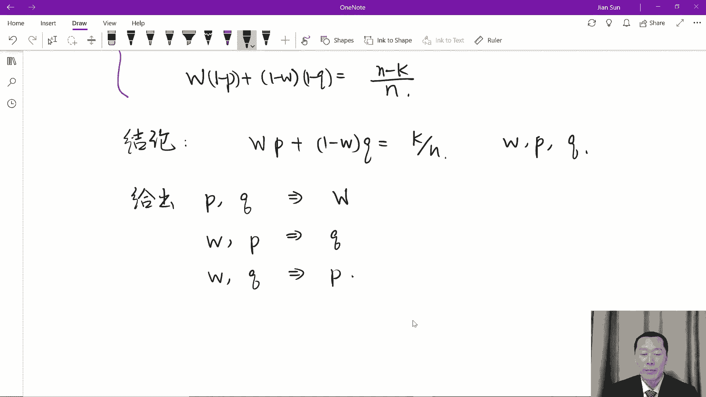

所以这样呢看似我们比较完美的解决了眼前的这个问题，就是说从两个袋子中取球的问题。

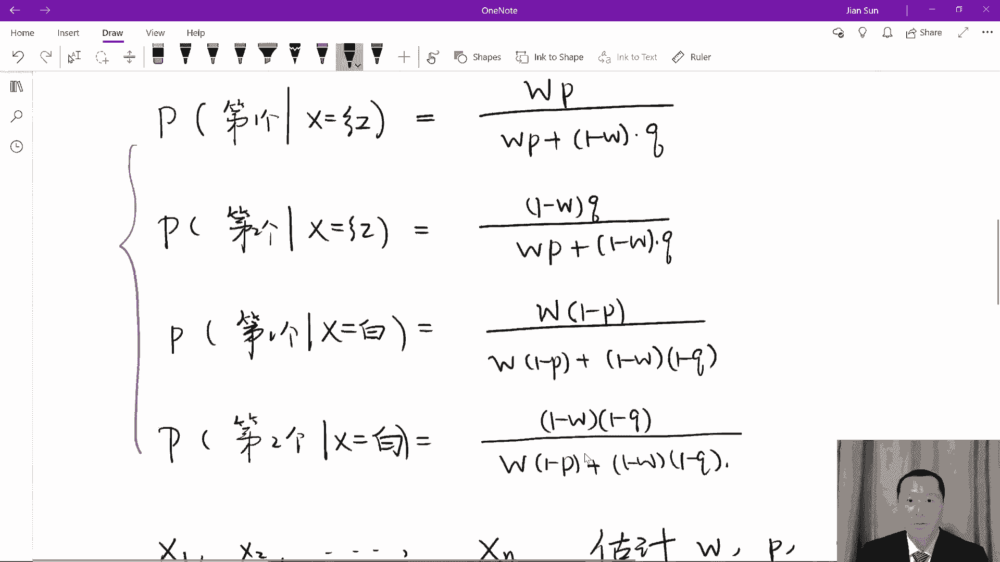

我们用一个b形式的解，就给出了这个问题的结果，我们现在呢再从另外一个角度来重新的审视这个问题，因为从另外一个角度重新审视这个问题啊，在就是一具有推广意义，眼前的这个问题呢不具备推广一。

它可以解决眼前的问题，但它确实是依赖于我们能够刚才的一个很特殊的一个观察。

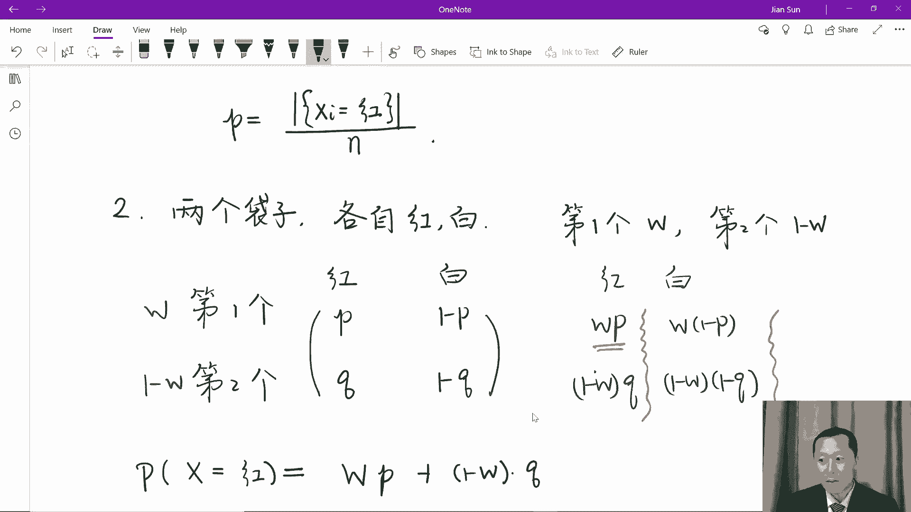

就使得我们能够从伯努力这个分解的角度，能够重新的得到这个问题的最佳答案，但是一般情况下就没有了，好我们来看一看怎么从叠另外一个角度来看这个问题吧，我们现在来看，另外这个角度看眼前的这个问题。

我们现在不妨呢是假设给出来了，给出来了p我们给出来的q也给出来了w，这是我们给出来的这三个参数，既然给出来这三个参数，我们看一看是什么情况，眼前呢我们就想给出了一个一个样本。

在我们眼前x1 x2 等等好，那么我们就通过这些样本我们分别来计算，我们不是给出了参数，同时呢在给出每一个随机变量，这个随机抽取的样本，我们不是可以计算其条件概率吗，我们可以计算当前的这个x1 。

它是来自第一第一个啊，第一组或者是第一个袋子，当然我们要根据它是红的啊，还是根据它是白的来判断它来自于第一个还是来自于第二个，我们根据每一个样本，它等于零或者等于一。

我们来决定你比如说眼前的这个样本就是红的，那么它来自于它又是来自于第一个，那么其概率是多少呢，啊给出了这个参数以后，我们不是可以计算吗，我们刚才不是计算了吗，那它就是w有黑色的，那他就是w啊。

乘以p除以wp加上一减去w，同理呢它来自第二个呢，那就是一减去w q除以啊，wp加上一减去w q，如果当前的这个x一是个白色的，那么它来自于第一个，那就是w白色的，那就是，一减p除以w。

一减p加上e减w e减q，那最后他既是白的同时呢，它又来自于第二个的概率，这四个概率我们就分别给了出来，咱们这四个概率呢我们还可以起给它分别命名，我们不如分别命名，我们起啊。

这个我们叫做a眼前的这个呢我们就叫做红的白的，我们比如说叫做b眼前的这个叫做c眼前的这个叫做d，我们都分别计算出其相应的这个a i b i c i和di中，那根据x一我们有了a1 b1 c1 d一啊。

根据x2 呢，我们也计算出a1 a2 b2 c2 d2 ，好，我们现在想象啊，在我们眼前呢就有这么一个excel表，这是每一行，这边的都是表头，然后呢我们又有了每一列，有了x2 ，有了x3 等等啊。

直到最后有x n。

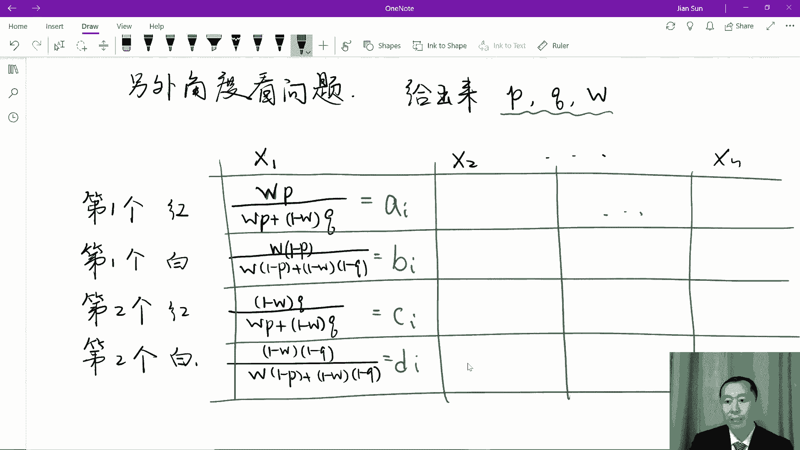

我们从眼前的这个表里面，我们就重新的来计算一下，我们看看从这个表中得到一些什么，估计我们看一看，在这个表中啊，首先每一列的总和，第一列的总和就是如果我们去计算第一列的总和呀，第一列的总和呢肯定是一。

为什么呢，就是白色的，如果是红色的话，那么在这个里面的ai和ci是有值的，白色的话呢，那么bi和di是有值的，那总和呢当然就是一，所以每一列的总和都是一，既然每一列的总和都是一整个这个表的总和。

那当然就是n，我们看看在这个表中，如果我们把每一个元素，每一个格子的元素都看成是给出了一个密度，就相当于是来自于第一个袋子，又是红色的密度，来自于第一个袋子，就是白色的密度，来自于第二个袋子。

红色的密度来自于第二个袋子，白色的密度。

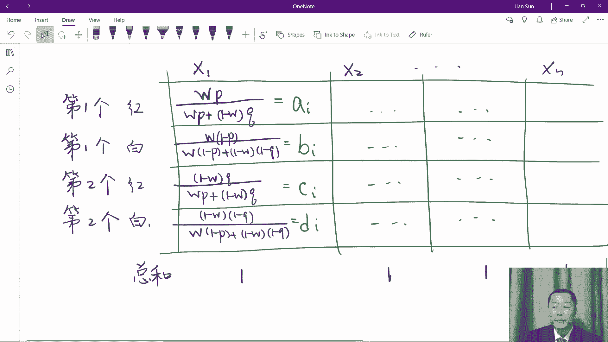

那显然我们看一看，从如果这些都是密度的话，那么我们来自于第一个袋子的概率，来自于第一个啊，我们说好的阿拉伯数字来自于第一个的带子的概率，这个w我们就可以给出一个重新的估计，这个重新的估计呢。

那就是眼前所有的这些，你看所有的第一行和所有的第二行的总和就可以了。

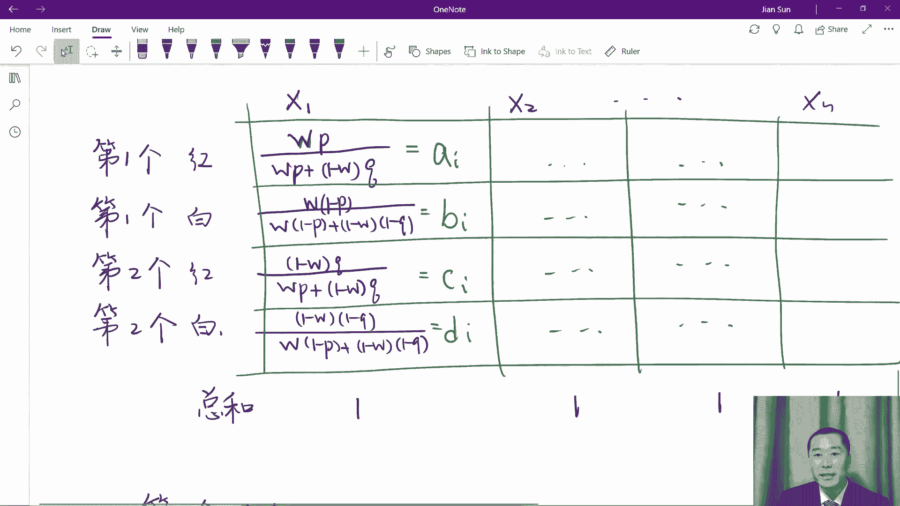

那第一行和第二行的总和应该怎么写呢，那理论上来讲就是所有的那些a i，加上所有的那些bi就是其抽样是等于零的，左，这是所有的第一行和第二行的总和，除以这个表的总和，那就是n，这不就是啊。

我们从密度函数再倒推出这个曲子。

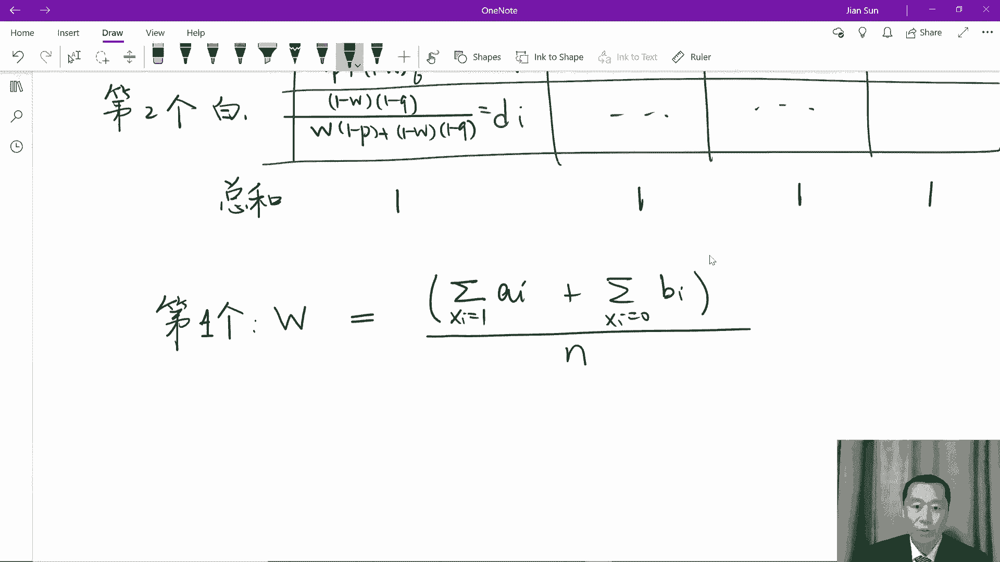

第一个袋子的概率嘛好我们先来看看我们在做一件什么事。

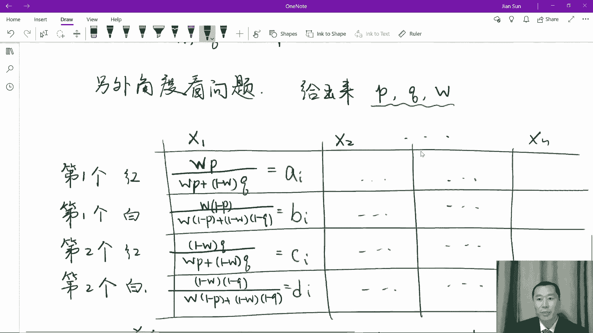

首先呢我们做了三个参数，就是说我们有三个初始值的估计，我们分别为了表标明他们这是初始值，所以我们用p0 ，q0 和w0 来表示有这三个初始值。

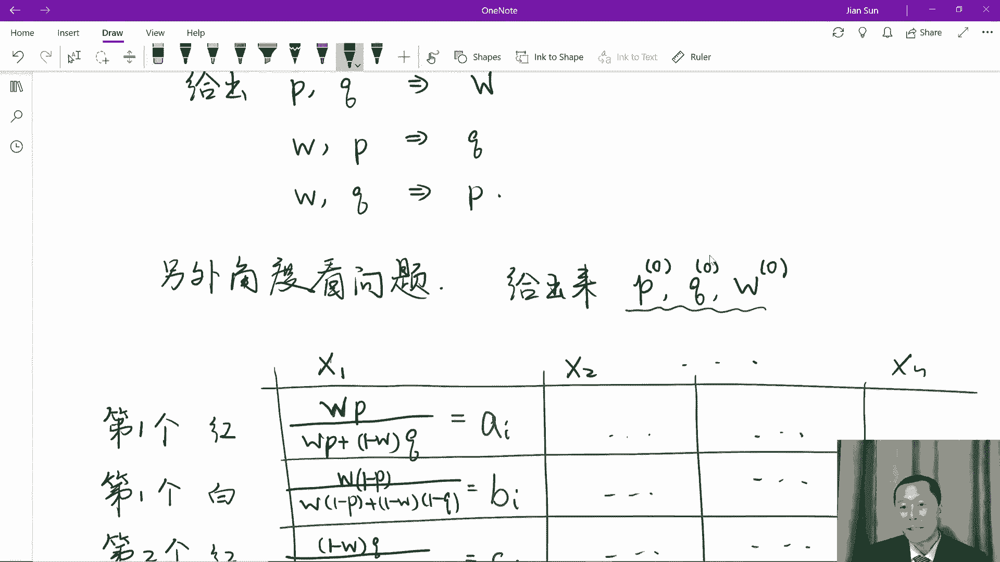

我们再结合我们观察到的样本，我们就可以，计算出一个个的条件概率。

从这一个个的条件概率，我们又基本上啊根据我们的这个直觉，又根据这个表，我们又能够重新对于呃，就是取自第一个袋子的这个概率做了一个重新的估计。

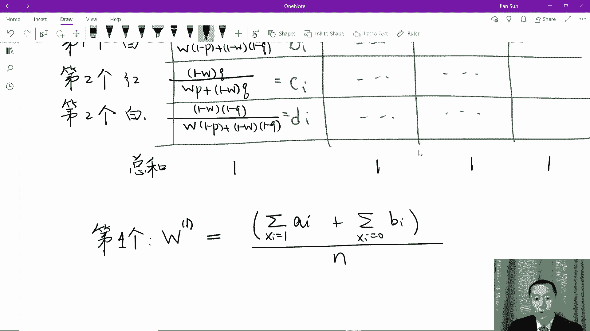

这个重新的估计就是眼前的w1 ，它和我们原来的w01 般来讲是并不一定并不一样的，也就是说我们的出发点，因为我们的出发点是随嗯，就是完全就是随机来的这个出发点。

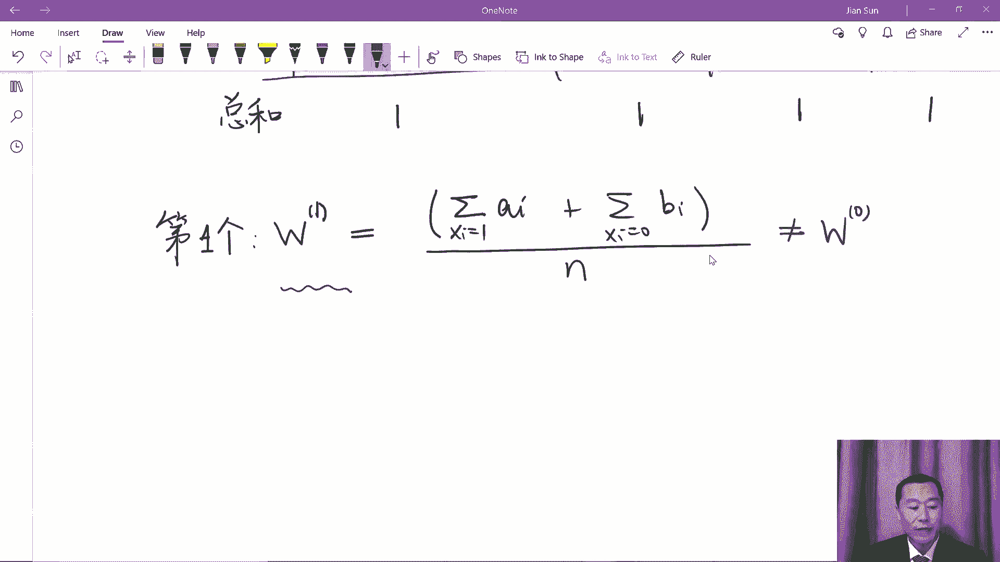

所以这个出发点再结合到我们的样本计算出来的数字。

计算出来这个概率啊，跟我们的出发点肯定是一般来讲不一样的，因为我们已经结合样本了，好我们只看到这是w一的估计，那么我们再看看p的估计呢，也就是说我们现在要计算它既是第一个又是红颜色的估计。

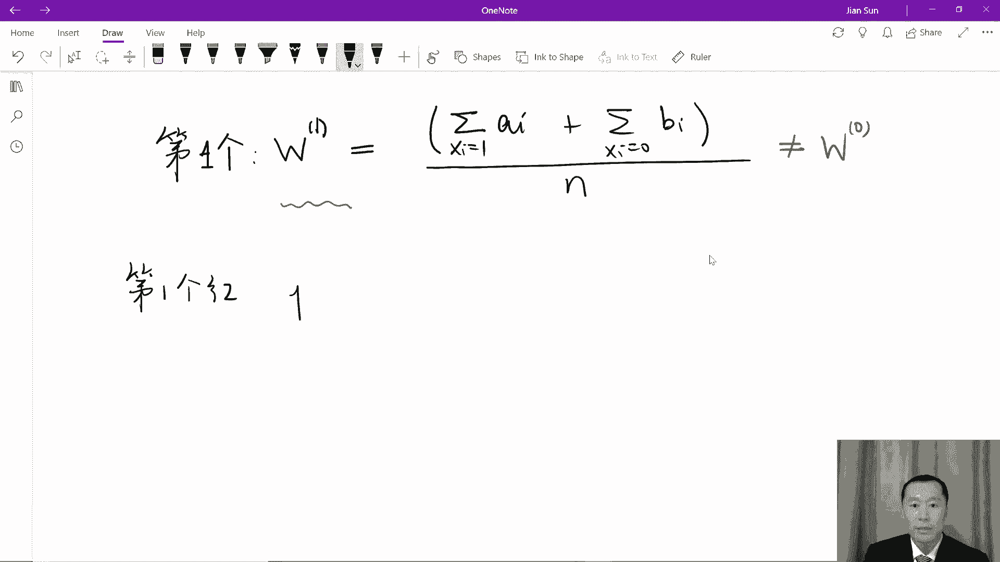

这肯定是一个崭新的估计，我们看看直觉上来讲。

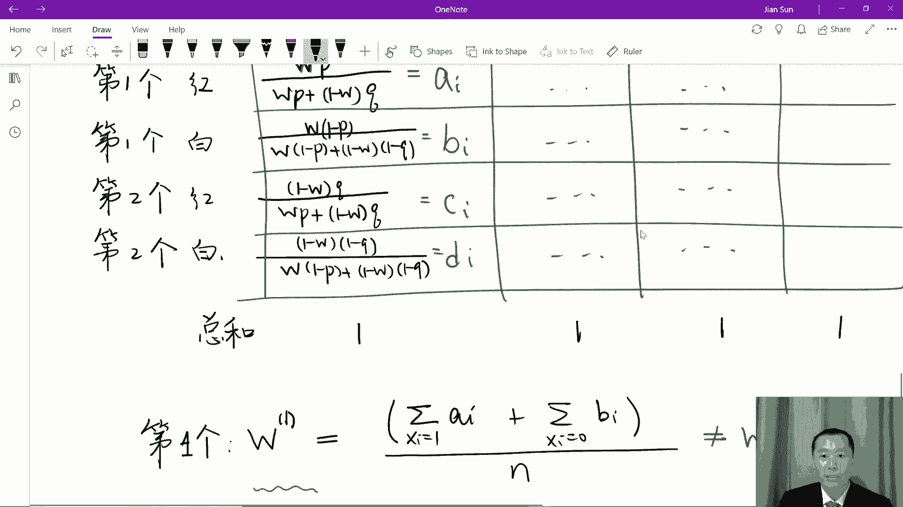

从前面这个表格怎么看，所以既是第一个又是红颜色啊，这是从红第一个红颜色中，那你看我们注意的应该是在当前的这个表四行中的头两行，所以你看第一行和啊。

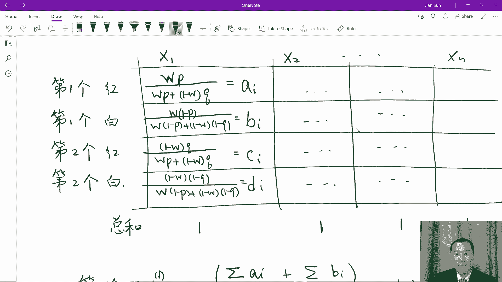

第一行和第二行，这样呢我们就会看到它是红颜色。

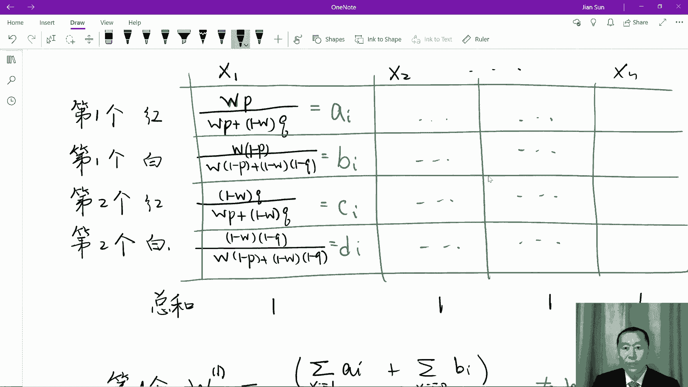

显然我们应该是所有的第一行的总和，第一行和第二行，所有的i等于零的那些bi，这就是p的估计，那同理啊，q的估计那就是来自于第三行，对应所有的x y等于一的除以所有的第三行加上第四行，这就是对于q的估计。

这是来自于第二个袋子，同时红颜色的那个q的一个估计，同理一般来讲它和我们的出发点的那个p0 是不一致的，它和我们的出发点的q0 也是不一样的，所以我们就做了一遍，根据我们的样本。

我们就得到了三个新的估计，这三个新的估计又可以完成我们这个迭代的第一步，就是目前呢给出了三个新的估计了，那就是p一了，q一了，同时呢还有w一了，那我们就可以完全根据同样的这样的一个过程。

又去计算上面的这个excel的表，我们看一看是不是可以得到p2 q2 和w2 对，这个过程是这样的，就是这个过程可以啊，可以就是不断的去延展下去，我们就可以得到p2 q2 以及w2 等等。

那么这个过程我们就会整个这个过程就叫做em算法啊，眼前的这个过程就叫做em算法，那么em算法本质上啊，就是说我们最早的我们看一下。

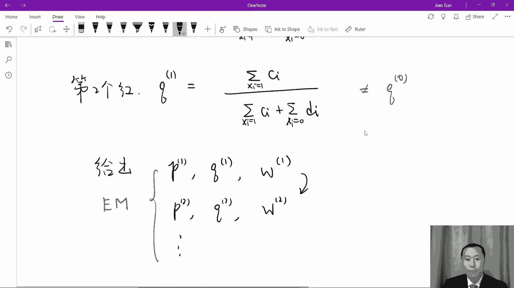

我们最早的集大自然估计就是最早的这个地方，这个集大自然估计求解他的问题可能非常的复杂啊，不过索性是在这个问题上很简单，但是一般的问题可能极大，四人非常的复杂。

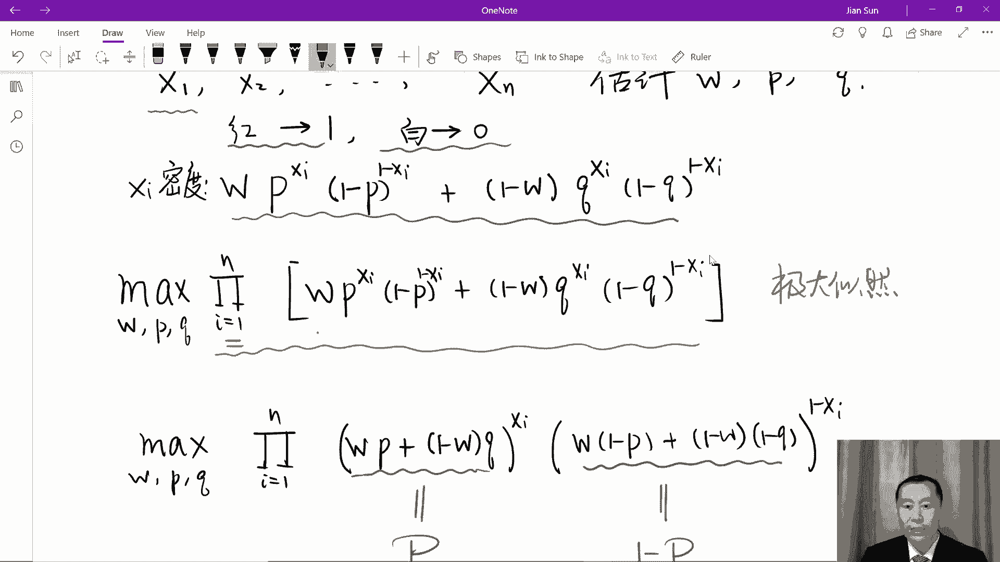

求解不出来，所以我们呢就试图用这样的方法，用迭代的方法就是给出了一个初始值，然后呢我们不断的去计算，根据初始值我们得到迭代一步的值，把迭代一步的值又看作初始值，我们再去迭代两步。

这样我们是希望其实是可以证明的，这样呢我们得到的一般来讲pk啊，q k然后呢w k其实是收敛的啊，他就会收敛到这个一个至少是个局部的，就是在极大自然估计中，至少可以收敛到，未必是全局。

他至少可以收敛到局部的，那么这个极大，这就是em算法，索性呢还是在眼前的这个问题里面啊。

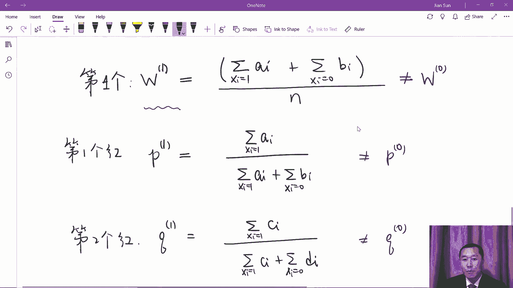

我们非常的lucky，我们的初始值可能未必是最优的，但是我们迭代一步之后。

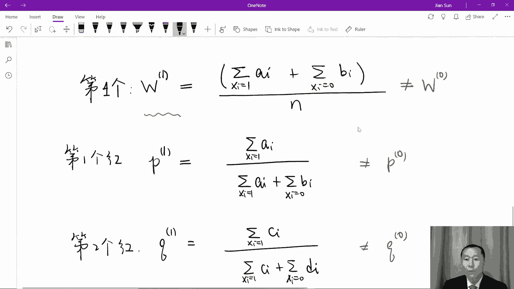

就是w e p一和一和眼前的这个q1 ，其实就可以发现，这是眼前这个问题中w一乘以p一加上一减去w一乘以q1 ，就是我们第一步过去估计出来就已经等于k除以n了，所以眼前的从两个袋子中随机地取球的问题。

我们只要通过第一步的初始值迭代一次，第二次的值就已经是最优了，就已经是最优了，所以呢他就不需要再迭代第三次，你再迭代第三次等等，你会发现都一样了，就不需要迭代了，虽然如此呢。

这个问题仍然让我们了解到em算法一般来讲应该是什么样的一个过程。

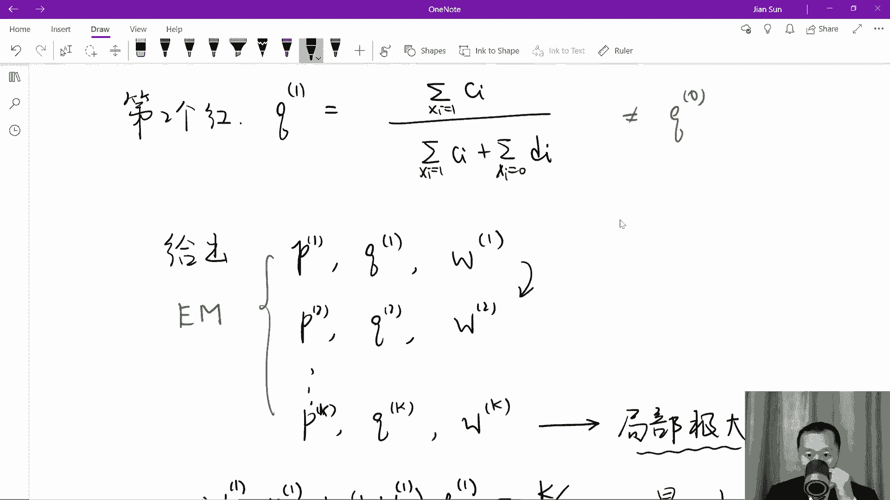

刚才我们说的就已经是最优了，这一点呢大家留给大家自己回去严惩好，我们现在呢把这个问题呢进行进一步的推广，这应该是，第二第三我们把眼前的问题来进一步的推广。

看一个真正是机器学习要去学习的一个更复杂的问题了，推广以后呢，我是这样的，他就不是说从袋子里面取求了，而是说呢从啊根据随机的我们呢来取分布了，我们首先来看这样，比如说高斯分布，我们所熟悉的正态分布。

我们呢在这里面取一维的高斯分布，高维的也一样，我们先从简单的讲解，一般的来讲，高斯分布就是正态分布，还有两个重要的参量参数，一个是命，一个是西格玛平方，一个是均值，一个是方差，这是一个高斯分布。

但如果我们有若干个高斯分布，就是说当然若干个高斯分布，就有若干同样这么多组参数，所以我们眼前有k个高斯分布，每一个高斯分布都是一维的，而且都对应有自己的均值和自己的方差，我们现在想象。

我们现在随机的从这k个高斯分布中去随机的去抽取一个分布，那么其概率呢就对应的是w1 w2 ，一直是w k所有这些w因为它是概率，所以说其求和呢是求和是等于一，好。

我们的问题就是用w i这样的一个概率去随机的选取第二个高斯分布，从第二个高斯分布里面，根据这个高斯分布，我们去抽取一个满足这个高斯分布的随机变量，那么这个随机变量就是啊就是这个x我们用x来表示。

刚才我们这个过程就是先随机的抽取一个高斯分布，再从这个高斯分布中随机的抽取啊这个样本，那么得到的这个随机变量x那么请问x的密度函数是多少呢，就是一般的x它的密度函数，他就是刚才那k个高斯分布的混合分布。

换句话说呢就是w一乘以呢f1 x一直加到w k乘以f k x，这里面f x啊，我们就比如说暂时不写下标，它其实呢就是e的负x减去mu的平方除以两倍的西格玛平方，这是根号下二派，再乘以西格玛分之一。

那当然如果是呃d这个那么就是对应的参数就是这均值也是dj，方差也是dj，所以你看x的密度函数呢，其实就是所有这些高斯分布的一个加权平均值，很容易验证，当所有的这些w呢满足相加等于一以后呢。

所有这些高斯分布呢，确实啊这个加权平均呢也就是构成了一个新的分布，好我们现在又回过头来看眼前的问题啊，又变成这样的一个问题了，就是参数估计给出，x1 x2 ，一直到给出了x n n个抽样的样本以后。

如何去估计出，我们怎么知道估计出这个最优的最优的多少呢，所有的均值，所有的房产和所有的那个概率w派，我们都需要估计出来啊，这个问题呢就变成了这么一个眼前的这么一个统计问题啊，那怎么估计呢。

我们再看几大自然估计的出发点，如果从几大私人估计估计的出发点呢，就是这等于一到k w j f呢是g xi，这个f j呢就是上面所定义的这个f j，所以对于每个x呢。

我们都带到这个函数中去得到它的密度函数，但是对于这个密度函数来讲，其实我们就不是求和了，我们是乘积了，我们就让i等于一到n啊，我们应该用黑色的，就是对于眼前的这个值，我们去求乘积，i等于一到n。

把它放到方括号中，我们使得这个值啊最后达到最大，因为这才是整个样本的密度函数，我们是去选举所有的均值，所的方差，以及所有的w i让这个值来获得最大，这个值获得最大，当然就等价于等价的。

我们就是求把log放进去了，一到n这边就是log log里面再加上一次求和，是j等于一到k w j f j x i，眼前的这个问题啊，一一点都没有给我们得到进一步的化解。

因为我们都知道这个对log呀来求log里面呢是求和，log，外面呢又是求和，就是眼前的这个问题，要想生硬地去求解，对所有的参数，比如说去求梯度，让它们等于零，仍然是不可解的，所以呢，直截了当。

利用其他四人估计是求解不了的，我们就从刚才我们的这个例子中去汲取养分，我们看看能不能用刚才的类似迭代的方法，能够让我们一次一次的迭代，能够不断地得到这个最优的参数，估计好，我们来这样做。

我们想仍然呢只做一个excel表，在这个excel表里面呢，我们有若干行，其中呢我们我们关心的啊是下面是高斯分布，就是我们关心它来自哪一个高斯分布，是从第一个高斯分布，第二个高斯分布，第三个等等。

我们为了减的话呢，我们就考虑两个高斯分布，就是在上面这个问题中呢，我们考虑k等于二，我们先看每一列呢是每个样本的x1 x2 ，等等到最后x n如果给出了x1 ，我们看看它来自于第一个分布。

这个条件概率会是多少，跟刚才一模一样，我们想给出了x1 ，那么它如果它来自于第一个这个条件分布，那就是啊因为我们知道啊，我们这里还要首先啊说先给出这个参数来，我们同样啊这里为了明确写一下。

已经给出了一组参数了，就是所有的参数都给出来了，就是说所有的mj sigma j以及最后的w j也是给出的，所以这组这组参数都是给出来的，在给出参数的情况下，没给出一个样本。

我们可以计算在这个样本观察到同时呢，它又来自于第一个分布的概率，那就是w一乘以呢它的第一个x1 ，第一个高斯分布除以，因为它是条件概率嘛，w1 f1 x一加上w2 f2 x1 。

这就是它来自第一个的分布，那当然它来自于第二个的条件概率密度函数，那就是，眼前的这个，第二个好，这是x1 ，给出x2 ，同理它来自于第一个的第一个高斯分布的条件，概率密度函数。

那就是括号中就都是x2 了，这是第二个，那么我们可以做到第n个，第n个将会是一模一样的，这里面也是它来自于第二个的，我们眼前呢又一次有了这么一个excel表，它有两行组成，除了表头以外，它有两行。

它有若干列，还有这一列，每一个样本都是一列。

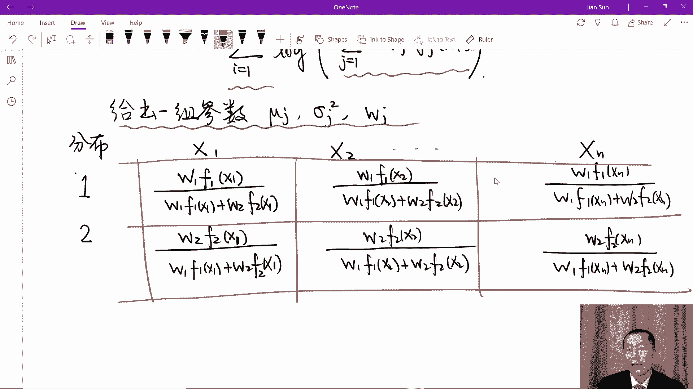

每个样本都是一列，我们通过这些给定的参数同时计算出来的这些条件概率。

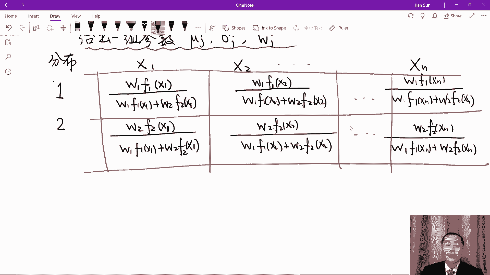

我们又可以来像刚才一样，我们来进行估计了。

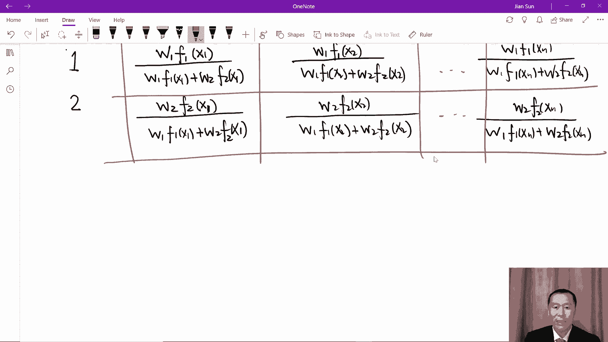

那这个时候我们估计什么呢，首先呢我们来看看总和一样总和每一列的总和都是一，每一列的总和其实都是一，但是呢每一列都有两行，其中第一行的密度呢是属于第一个高斯分布的，第二行的密度呢属于第二个高斯分布的。

那这样给我们的启发就是啊，其实啊我们第一个高斯分布似乎又应该是什么样呢。

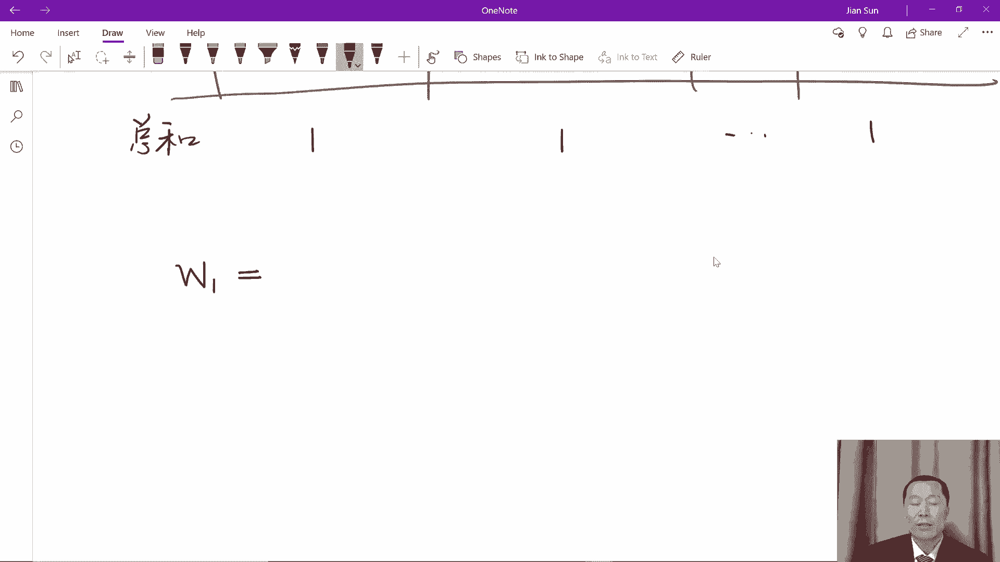

应该是所有第一行的总和除以总数，但总数呢就是第一行，第二行的总和总和总数就是n啊。

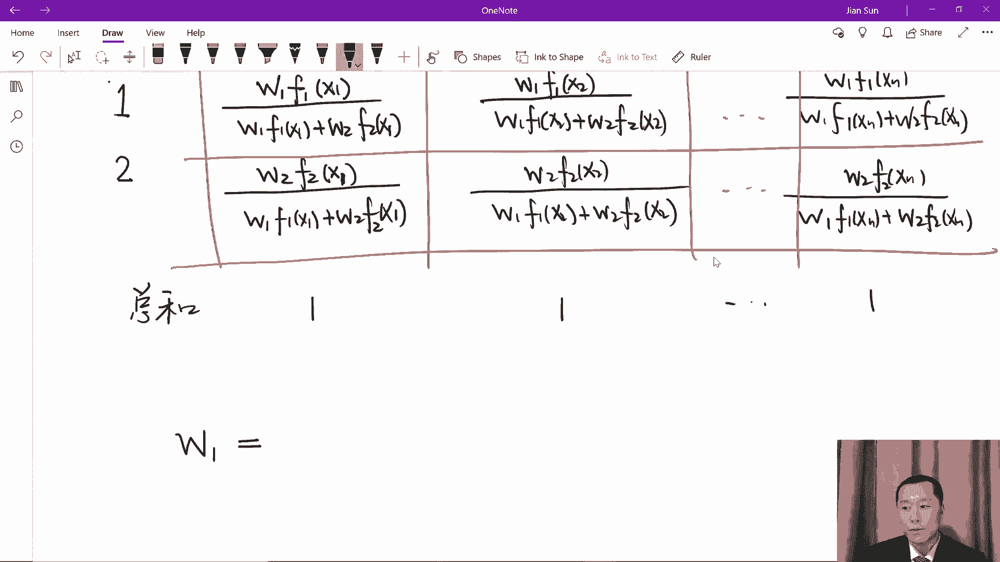

这样一来呢，我们比如说我们在给一个新的命名啊，为了简化记号，那么在刚才里面啊啊x一它呢就可以不是x1 ，分不成这个第一行和第二行吗，第一行呢我们就叫做w11 ，第二行呢叫做w1 。

二二呢第一行是w21 ，打第二行w22 x n呢就是w n1 。

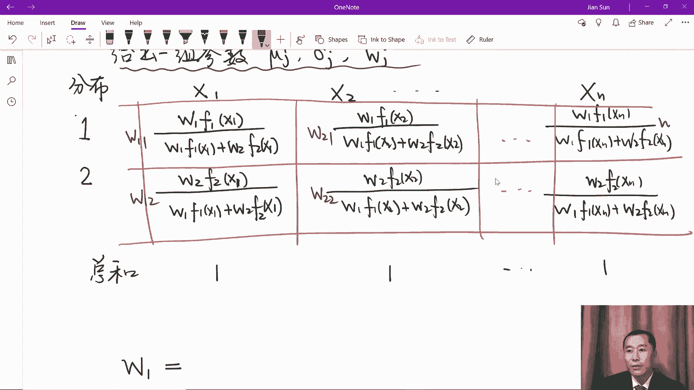

这边就是w n2 ，所以呢我们给出w一的一个自然的估计，就是w所有的i一求和，所有的i一求和i呢就是所有的一到n所有的样本除以总数，总数就是这样的好。

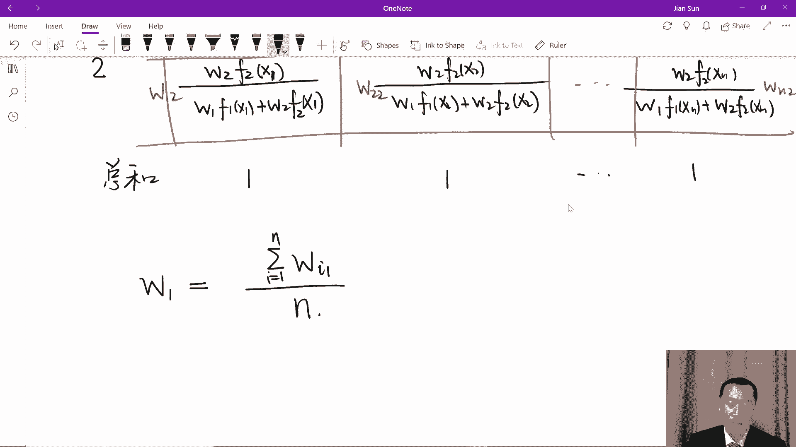

我们现在呢再一次的把我们的上标标进去，给定的初始参数我们叫做零。

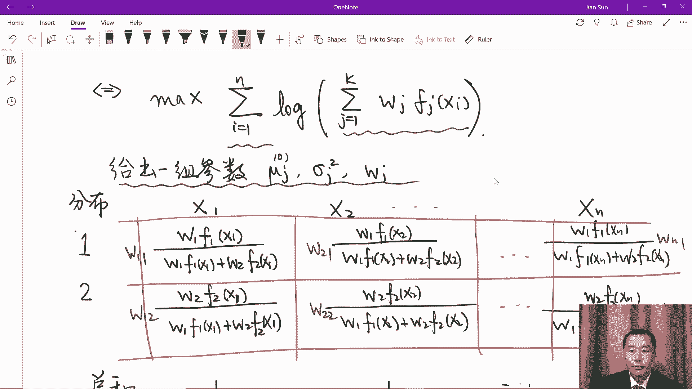

w这是零，我们现在估计出来的第一次估计出来的，这就是一，所以我们把这个迭代的次数加进去，那w2 的第一次新的估计出来就是一减w一啊，同时呢也就等于所有的第二行的i等于一到n求和除以n。

这样的这个概率呢就估计出来了。

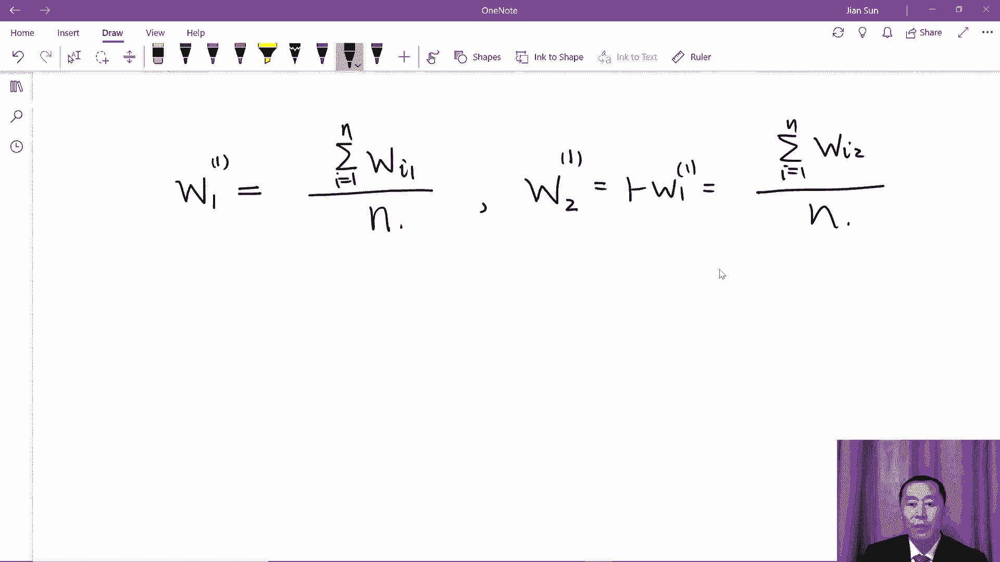

好概率估计出来，我们再看一看那个均值分布，均值方差呢，第一个高斯分布的均值和第二个高斯分布的均值，第一个高斯分布的方差和第二个高斯分布的方差该怎么办呢，我们这样想一想啊，我们既然看第一个高斯分布。

我们就集中在看第一行，第一行原原有，如果说我们在考虑真实纯粹高斯分布的是画，我们会有n个值给了我们n个值，其实估计它背后的高层分布的均值就是这n个数的均值，是现在这n个值啊，它不是真的n个值。

而每一个值其实都给它配上了一个概率密度，就是w i g这样的一个概率密度，这个概率密度呢你也可以把它想象的背后，对应的就是如果这个概率密度大，你就可以想象有若干个同样的copy作为它的这个值。

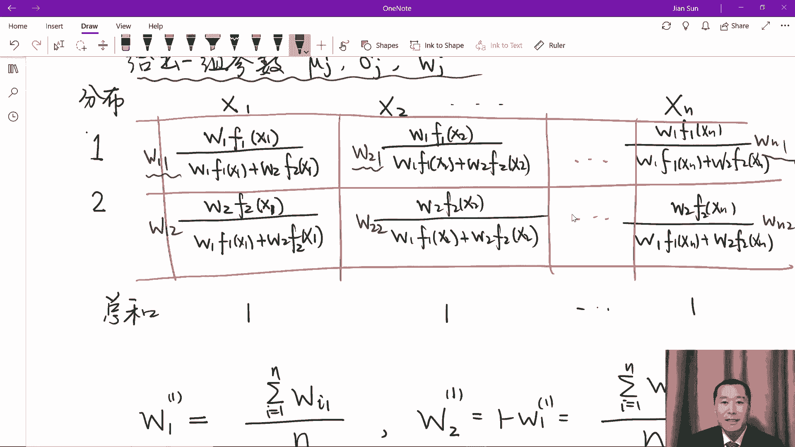

代表着它的这个概率密度啊，所以你如果这样观察的话。

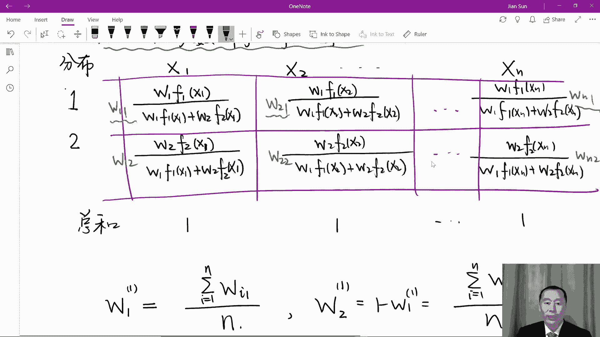

那么第一个高斯分布的均值啊，也就是说我们的这个谬一就容易得到了，那应该是什么呢，好除以谁呢，那除以就是所有的加权平均，因为只有除以家庭平均，你才能让他整个的这个密度加求和等于一。

所以这就是很直观的估计出了第一个高斯分布的均值，那第二个高斯分布的均值，当然你就要用它对应的第二行的密度去甲醛，好那么方差一模一样，同样第一个高斯分布的方差也是呢就是一模一样的加权。

减去它相应的那个均值平方，第二个高斯分布的方差，至此我们就有了新的估计，三个都有了概率均值和方差，既然有了概率均值和方差，就是w1 ，然后呢就是mi，然后西格玛一我们就可以。

这一我们就可以去计算迭代的w22 和西格玛二，你就可以去计算，接下来等等，如果一般来讲你得到了w的n的n n，你发现他已经收敛的差不多了，所以收敛差不多就是说在迭代过程中啊，它不会变化的很多了。

那你就可以停下来了，这个时候也就是我们就会得到了眼前的比较合适的这个高斯分布了，那么我们刚才讨论的是一维的高层分布，那么画在直线上，很可能就是你已经找到了第一个高斯分布，它的均值。

第二二个高斯分布的均值，第一个高斯分布的方差，你也找到了第二个高斯分布的方差，当然你也找到了第一个高斯啊，这个画得不好，因为我把这个概率也画进去啊，如果第一个这个第一个应该是这样，不计概率。

不计权重的话，啊，大家有这个均值，如果方差如果很小的话，他应该很高啊，好那么第二个也没有这么高，第二个可能应该是比较低，那么第二个呢就是唉就比较低好，因为它们都是密度函数，总的积分都是一样的。

不仅如此呢，我们还计算知道了啊，第一个的w啊，第二个的就是w1 ，第二个的这个w2 ，当然了，加上w2 应该满足需求和等于一，在r一上，我没有告诉你每个高斯分布的权重。

你就可以去估计出每个高斯分布的权重，而且每个高斯分布的均值和方差，一般情况下跟刚才的这个过程是一模一样。

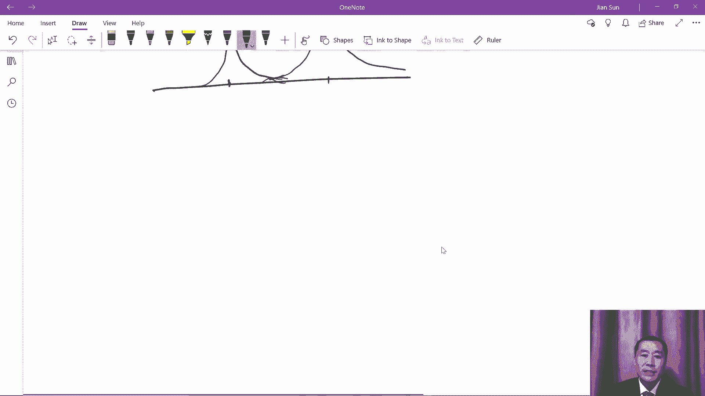

我们不写，不过我们把这个标小标题列在这。

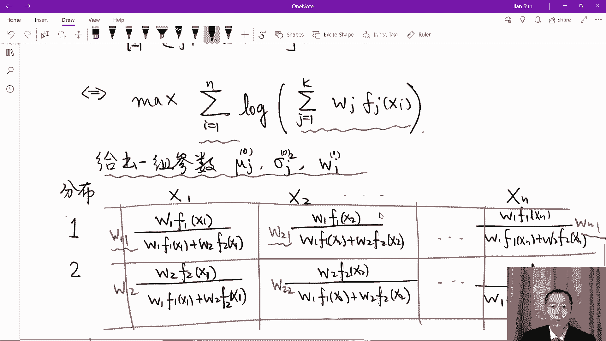

一般情况下，我们刚才讨论的是一维的啊，那么当然有用的是高维的，比如说都是二维空间的，那么其我们这里同样的还有k个密度函数啊，就是f一直到fk，那么每一个比如说fg其实呢都是二维的角色分布，二维正态分布。

二维正态分布我们已经讲过了，我们讲贝叶斯估计哪一节二维正态分布呢，那么显然呢它就涉及到均值呢也是一个二维的向量，他方差就不仅仅是说一个方差或者两个方差了，它其实涉及到是一个2x2的写方差矩阵。

但所有这些你给出我所有眼前的这些样本，x一到xn来，我们就可以利用刚才同样的方法，可以一步一步的把这若干个k歌的正态分布，它的对应的这些w11 直到wk，我们可以估计出来，而且对应的谬一一直到mk。

但是这些谬都是r2 的一个二维向量，而且呢我们还可以计算出来，sigma 11直到sigma k都是2x2的协方差矩阵，也可以估计出来，啊然后我们的二维平面上你就可以看出来，其实如果说给了你一些点之后。

就可以大概看得出来，原来这些点来自于一个啊在这个地方比较为中心的高斯分布，另外一个可能是来自于这个地方的高斯分布，还有一个来自于这个地方的一个高斯分布啊，这是在k等于三的情况下，当然你可以设定k不同。

在这里呢必须我们要说啊，有一个它是抄抄餐，那就是k，所以我们在这里呢估计呢并不是说去估计kk是肯定的，你可以设定k等于一，那就得到一套估计你可以去设定k等于二，又得到一套估计，那么具体k等于多少。

我们需要会有很多的量来帮助我们来判断，不过呢这些量呢更多的呢可以利用我们的这个直觉来进行这个判断，我们今天所讲述的这些内容其实就是em算法。

那么这些em算法呢是属于刚才我们说了。

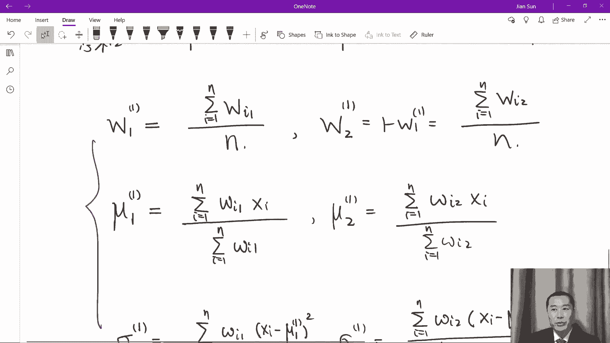

是属于非监督式学习的框架，在非监督式学习里面呢一label，也就是说标签呢是我们没有给出的，我们讲的呢就是具体的这些实践。

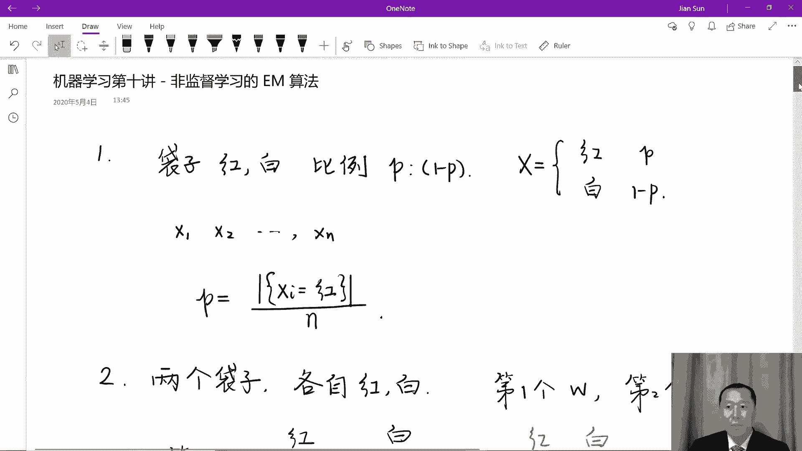

而且我们着重讲述了其背后的直观理论上。

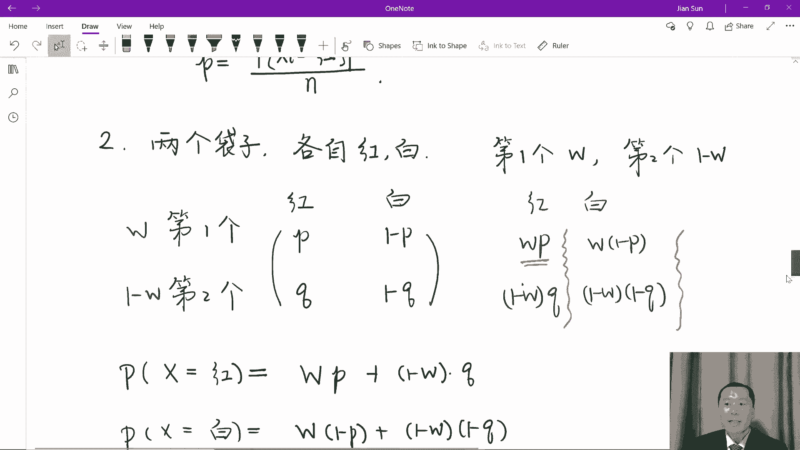

在课上还会再讲一下咱们这个讲义中，以及在我们上课的时候，我们在理论上给出大家进一步的推导，也就是说，为什么我们做的这一切，可以使得我们逐渐地收敛到一个局部最优的这个参数上。

那么这些在理论上又是为什么我们会看到在理论上呢，其实呢它就是凸函数和对应的詹森不等式的这么一个相对应的，这么一个詹森不等式的这么一个应用，虽然理论上是詹森不等式，但更重要的是我们想说是这个直觉的部分。

其实是指引了我们做出了这一系列的这个迭代过程。

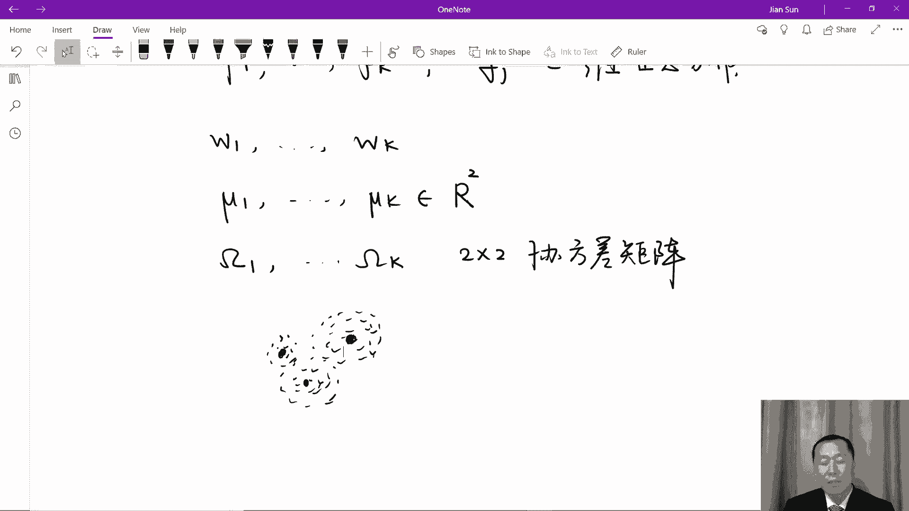