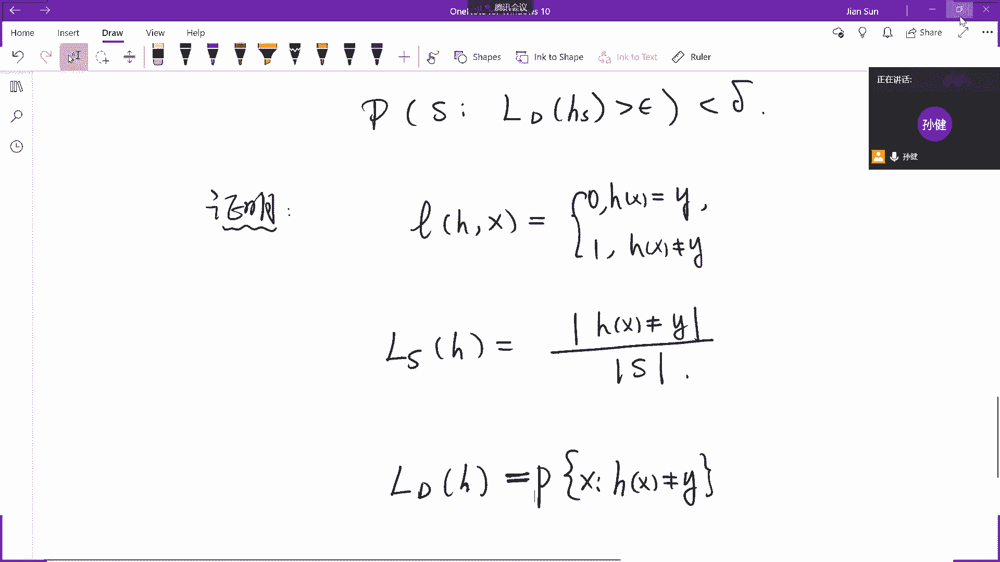
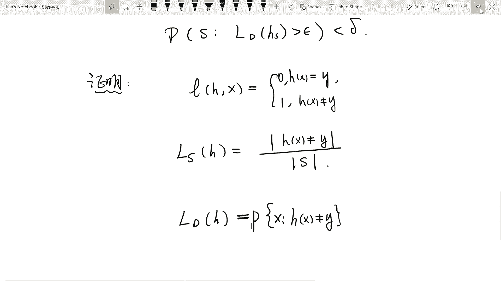
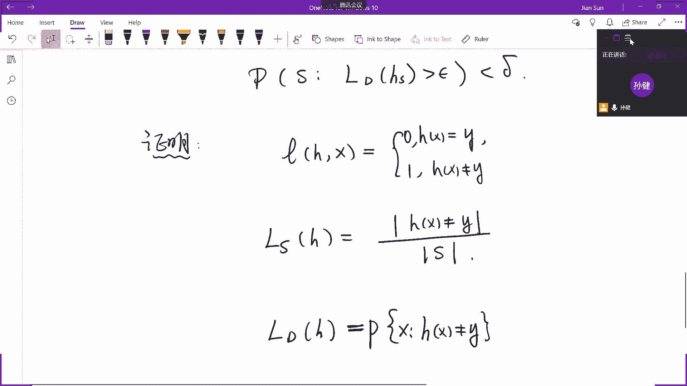
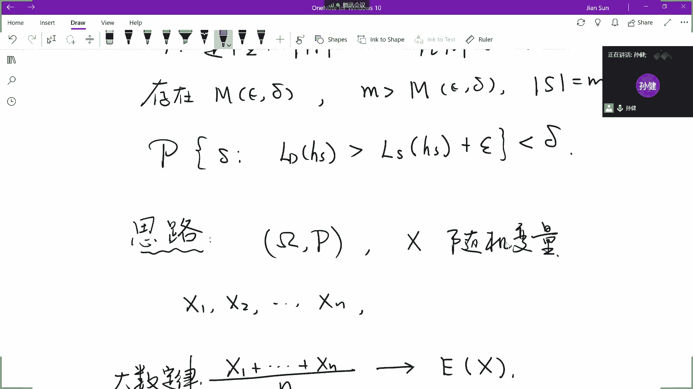
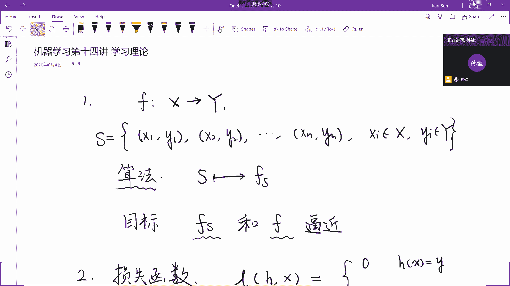

# 复旦大学经济学院《机器学习与量化投资》（Spring 2020） - P14：Lecture 14 Machine Learning Theory - ___main___ - BV1fv411r7z1

所以我们讲了这么多的模型，但是这些机器学习，我们今天要给大家讲一个讲一些机器学习的这些习一些基础的理论，就是所谓的机器学习的学习理论，那么学习理论其实要解决的是一个理论上的问题。

这个理论上的问题就是说我们到底在积极学习，我们到底能解决什么问题，而且呢我们机器学习的问题应该是怎么样的提出，这是我们今天呢要讲的这个问题，所以说呢我们分几步来把这个学习理论的一些基本的思想。

我们展示给大家，咱比如说我们，比如说我们讲机器学习，讲到现在我们想一想，基本上我们的机器学习经常给出的模式是一个什么样的模式，比如说我们来谈监督式学习，监督式学习我们说过，我们有这样两种基本的看法。

一种看法呢是说我们有两个集合，这两个集合上有一个映射关系或者是一个函数关系，但是这个函数具体是什么，我们并不知道，所以说呢我们只需只能够在一个样本上给给了我们，比如说这个样本是当然是有限的样本。

x1 y1 x2 y2 ，然后一直到x n y n给出这些样本，这些one i都在后一个集合，我们试图呢通过所有的这些给出的样本，来我们试图用一定的算法，也就是说我们这里呢需要有一定的算法。

这个算法呢决定了在这个样本上，如果我们这个样本本身我们做一个写成一个集合的形式，这个叫做s s就是代表眼前的这些有限的样本，所以我们其实呢还需要有一个算法，这个算法就给了我们本质上算法是什么意思呢。

就是你认给我这样的一个有限个样本构成的集合s，我就能够得到一个函数，这个函数呢就是这种对应关系，这种对应关系是依赖于s的，那么我们的目标对吧，也就是说我们最终的这个目标就是通过样本上的这个fs。

使得样本和以前真正的那个函数f尽量的逼近或者是尽量的接近的，我们从咱们这个课程最开始的时候，我们就从这个角度来看，那为此呢咱们想一想，我们是开始设定了。

就是比如说我们从什么样的一些函数集中去找这样的一个哈，这个去找这样的一个算法，那为什么我们要从函数集中去找这样的算法，如果我们抛开所有的函数集，那这个问题很好解决，比如说我们就定义简单的定义一个函数。

说这个函数在x每个x1 ，它就等于y1 ，每个x到x n，它就等于y n，凡是不在我这个样本点的，我就把它定义成，比如说统一定义成零，那这个函数就会满足在我们的给出的样本集上，它逼近的非常好。

但显然这不是一个很好的函数，因此上呢我们就得定义一个函数的集合，我们曾经定义过所有的有理数的呃，所有的这个呃多项式做成了这样的一个集合，那么我们的算法就相当于是在多项式集合里面。

去寻找那个最佳逼近的函数，这就是我们从函数逼近的角度，我们来看这个问题，为此呢咱们呢就引入了损失函数对吧，我们知道损失函数有，若干种定义方法，那么在这里一简单来说损失函数呢就是你给我就是我们叫做小l。

你给我任何一个函数，比如说叫做h就是你给了我一个，你这个认为一个毕竟比较好的这样一个值，我都可以在样本内计算出这个损失函数来，样本内所谓样本内计算出这个损失函数来，也就是说啊。

它其实呢是或者说我们在这里呢只定义成再退一步，这样的一个损失函数在样本的任何一个点其实是给出定义的，那有的时候我们看看，有的时候，比如说我们就定义成，如果说这个h得到这个hx就等于对应的那个y。

那么这个损失函数就是零，如果说这个h x不等于y，那么这个损失函数就等于一啊，这是一种定义方法，当然我们还有一种定义方法，比如说我们就是定义成h x减x它的平方。

当然我们也可以定义成hx减x的绝对值等等，这是单个的损失函数，那么在于整个的s上的这个损失函数，我们就可以定义成是整个的单个的损失函数在s上的均值，这是一种定义方法。

因为我们现在的这个s是有限级损失函数的啊，我们这个就用大l了，我们就不用小l了，就是从符号上，我们就从单个的损失函数定义了一个整体的一个损失函数好，那么我们再看我们给出的这个集合是一个呃。

这是一个样本集合，那么全损失函如果在整体上它的这个损失函数，那怎么定义呢，整体上的这个损失函数，由于整体的这个整体的这个所有的这个全空间，很可能是具有无限多个元素，无限多个元素我们当然没法去加总了。

所以这个时候呢我们某种意义上我们就可以利用积分，那我们就需要看在原来整体的这个这个无线，它可能具有无限个元素的这个空间上，我们就需要给一定的速度，我们就可以把它看成是在那个测度下的小的，的积分。

这是在整个的空间，这就是我们现在就有三个维度的三个这种维度的损失函数，单一定义的损失函数，在样本集合上的损失函数，以及在整体集合上的损失函数，有的时候我们在这里加上一个d。

也就是在积极学习的这个有些教材里面呢，我们这里面添上一个d，这是表示在整体集合上的损失函数，好我们一旦把这个损失函数来引入了，那我们的目标所谓的fs和fb进，那也就是说使得他们的损失函数比较小。

这就成为咱们一个比较明确的目标了，这就是损失函数的引入，现在呢我们就是说假设集合我们以前也说过，我们必须要在一定的假设集合中去考虑这个假设集合，我们已经考虑过若干种假设集合了，比如说我们考虑过例。

例如多项式，这就是一种假设集合，我们在所有的多项式中去寻找，那么线性函数，这是一种假设集合，你比如说我们呃考虑这个线性回归，就是线性函数，还有一种假设集合，我们曾经做过啊，这个线性函数。

但是呢要做这个要激活一下，换句话说我们考虑这个逻辑回归里面，我们考虑用的是这样的几种函数，作为这个是作为我们的这个假设集合，还有树结构分类，就是树结构，其实它本质上也是一种假设集合。

我们在所有的这种数里面等等等等等等，我们相当于是每一个模型其实背后多多少少都对应了这样的一个假设，集合好了，就是机器学习的这些若干要素，我们慢慢的都给大家罗列出来，我们有了这些因素之后。

我们现在可以叙述机器学习的目标是什么呢，我们来叙述一下，我们有了呃，你想我们有了这个假设集合，那么我们有了损失函数，那我们的目标机器学习的目标是什么呢，我们的目标我们看看啊，我们分成两个目标。

我们来看其中一个目标，当然我们还要有一个算法，所谓算法意思就是说你要给我一个有限的样本集合，我就能够得到一个让我的损失函数最小的这样的一个，在这个在这个假设集合中。

我可以挑出来一个让我们的损失函数最小的这样的一个函数，那我们有了这些基本的要素，我们看一看机器学习的目标，我们来formulate一下，比如说这个目标，我们可以说我们说是让，你给我一个s。

我们就找到了一个利用我们这个算法，咱们就找到了一个hs，这是在所有假设集合中那个最小的，换句话说呢，他就是argument面，在所有的这些假设集合中，使得lh最小的这个元素，把最小的这个函数提出来了。

那我们知道他的这个在s中的这个损失已经是最小了，但是我们关心的并不是在样本内的这个损失，我们关心的是样本外的这个损失，所以我们是希望他才更小，也就是我们是希望他某种意义上是小于等于et。

那这里的ip是任给我一个很小的一个值好，所以你看我们现在机器学习的语言可不可以变成，把这formly成这个样子啊，就是说任给，一个正的ap系统大于零，我们通过刚才的这个算法。

从s得到的这个hs又得到了这个l dhs一定小于c龙的，如果我们能得到这样的一个结论，那当然我们机器学习就完事大吉了，说明我们的假设集合选的很好，我们的算法也选的很好。

我们在样本内能够得到最小的这个损失函数，在样本外它的损失函数也相当的小，如果说我们不能让样本外的损失函数等于零的话，但是它已经足够小了，但这件事情我们做不到对吧，你看我们这件事情能做到吗。

我们不一定能做到，所以说呢我们要就是说我们怎么才能够保证，我们在样本外也能够很小呢，所以我们把这件事情呢我们要重新来叙述一下，重新来叙述一下，就是说这件事情不一定能做到，为什么这件事情不一定能做到呢。

我给你这个样本，你想稀奇古怪的话，我在样本内学到的能说在样本外一样表现很好吗，我给你这个样本，不能充分的代表原来这个标的本身所代表的那样的一种pattern，或者是拍就是标的本身所带有的那样的一种分布。

那我怎么能够让你这个样本内选择到的这个最小，选择到的这个最优函数在样本外也表现得更好呢，所以说我们现在的这种叙述方法其实是有问题的，我们现在就需要把我们这个叙述方法给它改造一下，那我们怎么改造呢。

我们只能够引入概率的语言，而不是说用现在这种非概率的语言来描述，引入概率的语言，就需要我们在这儿上把这个概率空间加进来，就是说我们原来整个的这个样本集合是构成了一个样这个概率空间的，这个概率空间是。

具有概率，这是个概率空间，那么我们取得这些x其实是这个概率空间的一些，这是样本，这些x你可以看成是这个概率空间的一个随机变量的一个抽样，所以说呢我们现在就用概率空间的语言来描述眼前的这个事情。

举个例子啊，你比如说我们有个概率空间，就是抛硬币，我们有抛这个十次硬币，那么硬币本身是fair的硬币，但是你能说因为硬币是fair的，所以我们抛十次，那么就肯定是最后的结果，就是五次是正面朝上。

五次是反面朝上吗，那肯定不会是这样，也可能会出现六次正面朝上或者四次正面朝上，但至少我们可以计算，也就是说我们可以计算我们抛这个fire的这个硬币，公平硬币，如果十次全是正面朝上，它的概率很小。

至少我们可以说这件事情虽然我们不能说这件事情一定不能出现，但是我们可以去衡量它出现的概率，那么眼前一样，我们把它应用到机器学习，就是说在我们具有这些要素的时候，我们有一个概率空间，上面有一个样本的概率。

这个密度分布，同时呢我们有一个算法，我们从任何有限集合，从这个给出的假设集合中，我们一定能找出一个最优的函数，它的损失函数最小，那我们现在看一看机器学习的目的。

就不是说绝对的让我从有限的样本集合显示出的函数，在整体的空间损失函数最小，那么我们的目标是什么呢，就是这样，我的目标就是说认给，epp大于零，我们是希望我们从这个s中选到的hs。

它在整个空间的损失函数大于一匹龙，这件事情会发生，也就是他可能比b系统大，就是整个的损失函数没有那么小，但是它是依赖于这个s对吧，那么什么样的s会出现这样的情况呢，这些s的概率。

这些s出现的这个概率也就是你所想象，这是由若干个点形成的，有限个点给我出的这个s，它给我的这个s非常非常的不巧，让我在这样的一个样本中学到的这个函数没有代表性，但是这样的样本出现的概率非常之小。

什么意思呢，我们在完整的叙述一下，任给我一个ex大于零，任给我一个delta大于零，都是比较小的数，我一定能够存在一个整数，这个整数是依赖于ap龙，也依赖于delta。

使得我只要我这个另外一个整数是大于刚才我说的这个大m的时候，就能够做到什么样呢，就能够做到给我一个具有m个元素，就是具有m个元素的这样的一个集合s，那么它在这个上面是我们所学到的这个最好的这个函数。

在全空间的损失函数比较大，这样的s出现的概率是小于delta的，可以说是我们机器学习的目标，这就变成了我们机器学习的理论叙述了，我们可以说到目前为止，咱们就把这个机器学习的理论理论叙述。

我们那个比较完整的把它写了出来，我相信大家就经过了这个分析之后，也会比较同意，虽然这个叙述有点像极限的语言，就是econ delta，还有这个大m呀。

但确实这个语言比较比较反映了咱们在选择这些模型去做这些算法，去得到了这个最优的这么一个嗯，就是决策树也好，最优的线性回归的函数也好，他已经比较反映了我们最终的目的和我们的想法，就是这样的一个想法。

包括我们做不到的，刚才我们也说我们不可能做到，说我们得到一个算法，你认给我一个s，我上面学到的函数都是在整体表现最好的，因为这个根你给我的这个样本本身是密切相关的，你给我这个样本不好，那我就学不出来。

你比如说我现在理论上来讲，就像你们在做这个股票吧，比如说我们要从过去10年的股票数据中，我们想学去出点东西，我先随机的生成一个样本，结果我随机生成那个样本非常的不巧，它生成的呢他就是给我生成了第1年的。

第1年的所有的数据它都给我生成了，当然这样概率很小，但它确实有可能发生，但一旦它发生了，我能通过第1年的这些股票数据，学到10年的这些这个股票中间的这些结果嘛，当然就是学不到。

所以说我们不能指望从一个样本中学到最好的，我们只能说从一个样本中学，没有学到最好的，那些样本本身出现的概率很小，这就是这个问题好，那么如果说这是咱们的问题哈，其实还不是最终问题啊。

我只不过是一步一步的来说，如果这是我们眼前的问题的话，我们看看我们到底能做到眼前这样的这个问题吗，我们就给现在呢给大家一个定理，我们看看什么定理，这是第四，第五，我们来看一个定理。

这个定理呢为我们就是说给我们提出的这个机器学习的这个理论问题，其实给了我们很大的希望，我们跟这个定理是怎么说的，定理说呀，我们这个假设集合是有限，当假设集合是有限的时候，而且呢有这样的一个假设。

而且呢你任给我一个s，就是说我能够学到的这个hs，都能够保证它在这个小的这个s上的这个损失函数是等于零的，也就是说我这个算法以及这个假设集合有这样的一个好处，你给随便给我一个有限集合s样本集合。

我所学到的那个函数都是损失，函数是等于零，就没有损失，那么在这样的一个情况下，我们就能够得到一个什么结论呢，我们就能够得到这个上面的这个上述这个结论我们就可以得到了，那么就可以说任意一个ip大于零。

delta也大于零，那么存在，刚才我们说的这个大m啊，使得我们只要这个s的集合个数大于大m的话，那么这个s这个集合本身我们在这个上学到的这个最优函数，在整体上的这个损失函数大于零的概率就小于掉的。

我们所以说呢我们现在来证明这件事，我们看看这个怎么证明啊，所以我们今天讲的这个内容呢不是一个具体的模型了，而是机器学习的理论了，所以我们要一些证明的东西，我们在这里针对特殊情况证明。

我们不是针对这个所有的情况，我们针对哪个特殊情况，就是刚才我们说的这个特殊的损失函数，刚才我们说这个损失函数定义里面，我们采取这样的这个定义，也就是说当我给出的函数本身就是那个标签的时候。

这个损失函数我们定义成是零，没有损失，不然的话就是所以说你从这个角度来讲，那么它在整个s上，它的整个s上的这个损失函数，其实就是说在s里面，hx不等于y的那些数值除以s本身的这个数。

而在这样的一个损失函数的定义下，那在地上这个d啊就是全空间，全空间上的损失函数是什么呢，特别是当全空间是无限多个，那这个时候怎么办呢，我们就可以借助概率的语言，借助概率的语言。

其实它本身形容的就是什么呢，它就是形容的那些x使得hx不等于y，这这这类集合它的概率测度就是它的概率，就是它的概率，所以说咱们不能够用数数，我们说到底数出来多少个x使得hx不等于y。

因为全空间很可能是无限多个元素，我们只能够是说把它化简成是说呃就是所有这些让它不等于hx，不等于y的那些点的概率密度，我们只能把它转换成这样了，现在呢我们就在这种特殊的情况下。

我们来证明眼前的这个问题有问题吗，大家。

我看看啊。

好那我们来继续，好吧，那我们来看看该怎么证明，其实这个证明呢是基于这样的一个想法，比如现在我们考虑啊，我们考虑这样的几个h，这个h呢就是说它的这个全所有全空间的这个损失函数。

就是它大于一平方的这个h既然它是大于1p龙，而且刚才我们说了全空间的损失函数本身就是一个什么样的集合呢，它就是这个s h的这个概率测概率密度啊，就是概率这个这个概率。

那这个s h呢就是所有的那些x使得呢这个小h x不等于y的那些点，所以这些典籍s h很可能具有无限多个，但是呢它的概率呢我们可以计算它的概率，这个这个计算它的这个概率测度。

这个概率测度呢是大于一部戏龙的，那既然它是大于这个ip的，那么我们再看那么另外一个集合，那它的这个补集就等于所有的x使得h x等于y的，那不就是它的补集吗，那它的普及它的概率测度那当然就小于1-1。

因为它的补集加上它的集合本身构成整个的这个空间，所以说既然它上面判断失误的那些概率测度大于一不系统，那么没有判断失误的，那就小于1-1不系统，这是对于每一个这个这个所谓的这样的这个h就是表现的损失函数。

表现不很好的这个h我们得到的这样的一个结论，那这个跟我们的这个典籍现在有什么关系呢，现在我们再来看你，比如说我们现在回过头来说呃，如果说呀我们给出一个s它具有有限个有m个元素。

一会我们来确定这个m到底是多少，既然它有m个元素，而且呢它对应的这个hs是满足是大于1p的，那么这个hs就是刚才我们说的某一个刚才那样的这个h，因为它满足这样的一个条件，但是同时他又在s上呢，它等于零。

所以说任何一个s中的点x属于s，那么你看这个点本身由于它这个这个条件，那就是说明刚才取的这个h它就属于刚才我们定义的那个，就是h所对应的那个表现的好的那个集合。

但是好的这个集合就是它的概率测度不是小于1-1 p线路吗，好我们看一看啊，你这个s里面有m个元素，而且s取的时候都是i d取出来的这些样本，每一个点它都会属于这个s h。

而且呢这个s a s h的这个补给啊，而且s h的补集的概率测度小于11-1平，那就说明什么呢，真眼前的这个s就是眼前的这个s，它出现的这个概率测度，考虑到它是由m个点组成。

那它就小于1-1普西隆的m次方，也就是说啊我们就有了这样的一个啊，等一下啊，它的这个概率测度啊，概率密度，s因为这个s它不是一个点，它是由m个点组成，而每一个点大都出现在刚才那个s h的那个补机上。

所以说整个的这个s的概率密度是小于一减etional的m次方，好这个我们就看到了，但是呢具体这个眼前的这个hs是属于哪一个h的，我们不知道，但是我们知道，因为，这个h整个的假设集合是有限的。

所以刚才我们推导的这个不等式是，前提是我们知道知道那个h，就是我们知道那个优化以后的那个最好的那个h，但是回过头来由于我们不知道它可以是任何一个h，所以我们最终得到一个不等式。

是刚才的那个s它一定是小于h的个数乘以一减p系统的m次方，好了，现在我们面现在咱们就终于可以了，我们利用这个delta就等于h的个数乘以一减p的m次方，我们这个m也就可以这个得到了。

我们这个m呢就是这个delta除以h的个数对吧，嗯然后呢取log再除以log一减一平方，我们就得到了这个我们刚才说的这个大m它是依赖于ip，依赖于delta的，所以我们看到只要让我们的m大于这个大m。

我们就可以让眼前的这个数字，眼前的这个值就充分的小，所以我们就得到了我们的目标，所以证明到这就证明完毕了，我们简单的回顾一下我们说了一件什么事儿，我们说的这件事情。

就是说当假设集合的元素是有限多个的时候，那么这个时候而且再加上一个假设，就是每一次给我一个集合，我都可以在这里面选出一个损失函数等于零的这样的一个假设，如果是这样的一个情况。

我们的机器学习理论是很完美的，因为你任何给我两个很小的正数，我都存在说这个一个大的m，如果我选出了这个样本的个数大于这个当m的时候，我学习效果不好，发生的这个概率就很小很小。

这就是这个我们要给大家讲的这个定理的含义好，那么讲了这个定理的含义，我们在下面再来看，我们是刚才说这是机器学习的一个提法，但现在我们来看这个不合理之处，所以上述不合理的地方在哪儿呢，就是上述那个定理。

刚才不合理之处就是在于我们做了一个假设，这个假设就是说任何一个s我都能够选到一个假设，hs，使得在s中它的损失函数等于零，但我们知道我们一般是做不到这一点的，我们是这个咱们你们在做这个实际的算法的时候。

谁说我们的损失函数完全能够等于零呢，除非你比如说我们这最早讲了一个感知机平面上完全可分的时候，也就是你给我每一次都是完全可分的这样的一种假设集合，那我都可以确实找到一个嗯。

就是这个线性超平面把它们完全可分，一般情况下我都做不到完全可分了，所以这是它的不合理之处，那考虑到这个不合理之处，我们就需要把刚才机器学习的这个原理给他重新修改一下，那修改以后就变成什么呢。

就是我们需要刚才把它修改一下，那修改的时候我们要看到我们原来是想说哦，这个我们就相当于是说hs在样本内表现已经是零了，损失函数它在整个空间的损失函数也应该是很小，但是现在他做不到。

因为它的样本内它都不是说小于，我们，怎么能说在样本外一定也小于etl呢，所以我们现在就要修改成什么呢，我们不求它在全空间的损失函数也很小，它在全空间的损失函数小于不小。

取决于你这个嗯函数在你样本内的损失函数是小还是不小，所以我们现在呢只希望它不要超过你在样本内的损失函数，加上一批龙就够了，所以修改以后，咱们机器学习的目标就变成这个样子了。

就是说呀我不求呃我在全空间的损失函数小于平，我只要小于我在样本内的损失函数加上1p就可以了，那么这个时候呢咱们再把刚才那个定理可以重新叙述一下，就是加上修改以后的这个定理，我们也是成立的。

也就是对于假设集合是有限的情况下，那么给我就是任何存在任何的这个ip大于零和delta大于零，都存在这个大m大m是依赖于一种标的，使得呢只要我的个数大于这个大m的时候，这个集合的个数等于m。

那么下面的这个集合哪个集合呢，就是它在样本内学到的最优函数的损失函数加上1p龙，它在样本外的损失函数比样本内的损失函数加一系统还大的，这样的集合发生的概率要小于等等，这个定理的完整叙述就变成这个样子了。

好我们来看看这个定理该怎么证明啊，其实呢这个定理的证明呢并不难，但是我们它是依赖于概率论的一些不等式，我们在这里就没有必要展开了，但是我们想把这个定理的大概的思路跟大家就是说一下。

也就是说它背后对应的是一些什么样的一些概率论的想法，其实他是跟概率论的这个有一个不等式，叫做切皮雪夫不等式是密切相关的，我们来跟大家说一说在概率论中相对于它是一个什么样的情况，回到咱们的概率论。

我们知道啊，我们想一想，我们有一个概率空间，上面有一个概率这个概率测度，然后呢我们上面有一个随机变量，比如说x是一个随机变量，这个随机变量我们可以i i d的取出一系列的copy来。

比如说x1 x21 直到xn都是跟x具有同样分布的，而且是互相独立的这些随机变量，那么我们知道这个根据大数定律，大数定律说的是啊，在一定条件下，比如说这些随机变量它们是有期望，而且是有均值的。

都是有限的情况下，我们再除以n我们知道在大数定律意义上，它是要依概率收敛到他们的期望呢，这是大数定律，但是这个大数定律我们知道是在n充分大的时候是成立的，但是具体到每一个不是无穷大的n。

我们仍然想知道它跟期望之间的差别有多大，所以我们其实是可以问这样的问题，就是这个x11 直加到xn除以n减去这个期望，如果问这件事情它大于一，这概率是多大，这个问题就跟刚才我们叙述的这个机器学习问题。

其实就是有异曲同工之处，这些x一到xn我们可以说是看到的这些有限的样本，而这个后面的这个均值可以说就是整个全空间上，某种意义上的代表的这种损失函数。

我们是想看我们样本内观察到的这个样本的均值和实际均值大于一，克隆这件事情发生的概率，我们是希望这件事情的概率是随着n的增加而减少到零，就是随着n趋向于正无穷，这件事情是减少到零的。

那么这件事情在概率论中，我们是通过是怎么证明的呢，这件这件事情在概率论中是成立的，在概率论中成立是源于两个不等式，一个是弱一点的切比雪夫不等式，一个是强一点的，叫做hifting不等式。

我们在这里面简单说一下，我们就没有必要再去详说详细叙述了，我们在这里呢不妨设，这个ex等于零，但不能等于零，没有关系，我可以吸收到每一个x里面去，那么这样的话呢，我们就只需要证明啊。

而且那令这个用一个平均值来表示x11 直加到xn，它的均值，那么s本身作为一个随机变量，它大于一系统的概率，我们只需要去看这件事情，那这个概率根据切比雪不等式，它其实就等价于说s的平方大于一平方。

根据切比雪夫不等式，它是小于等于1p系统的平方，上面呢就是s的平方的expectation x平方的期望，但是这个x平方的期望我们是可以求出来的，它呢s是均值，那s平方的期望其实就是n分支。

每一个x的期望就是每一个x的这个方差，所以我们就可以写成这样了，你看看这样一来啊，我们要问的问题就转就转化成我们本来是想问他是不是趋向于零，当n趋向于正无穷的时候，眼前的这个值就是趋向于零的。

当n趋向于正无穷的时候，这个就叫做切比雪夫不等式，那切比雪夫不等式不是很强，但是它却能够保证我们达到我们的目的，那么现在我们在介绍第二个不等式，你们要在机器学习理论中也会看到这个hifting不等式。

也是说的类似的事情，但是呢它会比刚才要强一些，那就是这个均值大于eternoon，这个概率要小于等于e的负的两倍的，上面就是啊负的1/2，我们就可以证明啊它是负的二分之这个ip m的平方，乘以n除以二。

它要比切不切比雪不等式呢要稍稍强一点，所以我们仍然可以看得出来它是趋向于在一定条件下啊，在一定条件下，比如说我们在这些x的方差是一的情况下，如果不是一的话，其实再加上一个常数，也能够看得出来。

当n趋向于正无穷的时候，这个值是趋向于零的，总之呢我们就是说切比雪夫不等式，弱不等式也好，不等式也好，我们都能够保证眼前的这件事情是成立的，而眼前的这件事情成立。

其实某种意义上就代表着我们这边机器学习的这个理论问题是成立的。

但但是它们都有一个大前提，这个大前提就是假设集合是有限度。

假设集合是有限多，这件事情不是特别的实际，因为我们现在接触到的这些假设集合都不是有限多，比如多项式的集合不是有限多，所有线性函数的集合也不是有限多，我们就是看到的目前看到的这些假设集合都不是有限度。

那我们现在理论是建筑在假设集合是有限多的情况下，所以说我们先接下来要简单说一说这个假设集合，我们如何把它这个条件就是等于无限多，把它延展到就是假设集合等于无限多，这样的这种情况下，我们来考虑这种情况下。

我们有什么可以说些什么，其实假设集合啊，我现在就是不加证明的来叙述这个结论，假设集合等于无限多的时候，问题我们的机器学习问题，刚才我们叙述的其实仍然成立，但是假设集合有无限多，它就是仍然成立啊。

我们他不是说这个绝对的都成立，它是要对假设集合的里面的自由度要有限制，虽然都是假设集合的个数是无限多，但仍然它的自由度可以是五花八门，我举个例子，你比如说线性函数，我们在一个嗯l two平面上。

我们再说，比如说呃这个一个函数是线性的，它是r2 到r的一个线性函数，这个线性函数我们表示出来就是a乘以x1 ，加上b乘以x2 ，最多加上一个常数c我们利用去刻画这个线性函数，其实就用了三个变量。

所以这个线性函数从这个意义上来讲，它的自由度有三个，这就是线性函数对吧，这是线性函数，是这样，我们也可以定义任何一个函数，这是任何一个函数，从这个定义在平面到一个平面上。

任意一个这个函数很可能就是任意的一个连续函数，那你说任何的一个连续函数，那它的这个它的这个为数当然就无穷多为，所以说上面线性函数是三维的，那么任何一个这个连续函数就是无穷多位的。

那么机器学习的理论其实就是探究下去可以证明证明什么呢，就是当你这个假设集合虽然它有无穷多个，你会看到无穷多个函数，但是你的维度只要是有限维的，那就可以，你的维度如果是无限维的，那可能就学不出来。

我们在这里呢也给大家举个例子，比如说什么是有限，比如哪一些啊，就是比较有限维的，眼前的这个线性函数，我们看得清清楚楚，就是有限维的，下面我们再举一些其他的例子，我们为此呢我们就要引入一个概念。

叫做vc维度，vc维度，这是采啊采用了两个早期搞机器学习理论的这么两个，这个好像是俄罗斯的这个科学家的名字叫vc维度，其实他想说的维度啊，就跟我们刚才说的那个维度，其实像刻画的是类似。

只不过我们从这个连续函数角度，我们说你是个线性函数，我们有自由度，你是一个多项式，我们也可以考虑你相应的那些自由度，你比如说你是一个这个这个三这个三次的多项式，如果是个一元的三次的多项式。

那你就要有四个维度，你要是二元的三次多项式，那你的维度更多，但是你一个决策树的维度怎么去刻画呢，它就不是一个像眼前这么连续的这么一个东西，所以说呢这两个搞计算机的。

搞机器学习理论的这两个科学家呢就搞出了一个新的维度叫vc维度，vc维度跟我们通常考虑的这种几何和拓扑的这种维度的类似，但是不完全一样，咱们简单的说一下什么是vc维度。

其实它本质想刻画的东西还是一模一样的，我们先来看看怎么刻画这个vc维度，就是我们现在来看这个h啊，假设的集合可能有很多，也就是假设的集合可能有无穷多，但是虽然它假设集合有无穷多。

但是它能够给我们从分类的角度，给我们造成分类的结果，不一定我们看看什么叫做从分类的结果，不一定，分类的结果不一定有那么多，那从这个角度来讲，我们专门来看分类。

比如说我们在这里面呢看若评就是在我们这个考虑的这个空间上，我们有任何n个点，我们考虑分类，也就是说我们现在这个我们考虑这个分类函数，所以我们这个假设集合中都是分类函数，既然是分类函数。

我们就是说任何一个h就是假设集合中的任何一个h，它就是等于-1，这是一个分类函数，所以vc维度呢它主要是考虑这种不连续的这种分类函数，那么我你认给我一个点x一到xn，我把这个任何一个h作用上去。

不就出现了hx一到xn吗，这里面它不就对应了一组无非是什么正一-1-1等等的正一啊，它就对应了这样的一个这个点，你把一个h作用上去，它就对应了这么一个正一和-1的这样的一个序列。

那我们知道我随便给我正一和-1的这样的一个序列，就是我有n个分量，每个分量不是取正一就是取-1，如果从排列组合的角度来讲，那所有这样的序列得有多少个呢。

我们知道所有右手边正一-1构成的n个长度的这种序列的个数，它是有2n2 的n次方格，二的n次方个，那我们再看看左边左边这个x一到xn是给定的，那这个h呢是应用上去的。

随便给我一个h就一个假设一个分类函数，我把它应用上去，也就得到了这么一组排列，但是所有的这些h就是我们遍历所有的这样的h，就是h作用在这个x11 直到x n上，所有的这些h的个数。

他的这些个数不一定就是等于二的n次方格，它一定是小于等于一小一个啊，它一定是小于等于二的n次方格，这是显然的，但是它不一定等于我，为什么不一定等于呢，也许有一些虽然h我可以取无穷多个。

但就是有一些分类它就是达不到，就是有一些特殊的，这样我让他分类，他就是给我达不到，那是有可能的，那这种情况下，我们就用这样的一种情况来刻画vc维度，怎么来刻画呢，我们就来这样刻画，我们简单的说一下啊。

就是说当这个假设函数都是给定的情况下，如果，有这样的一个m，这个m是这样的一个数值使得呀，我任意就是说这个小于就是说任何超过了某个点，比如说x1 x2 ，我超过m个点，就是m m加一个点。

任意给出的这个m加一个点都有，都有这样的这种情况，就是所有的这些作用在这m个加一个点上，就是所有可能的这个我们现在假设集合作用上的这种分类，这样的这个集合的个数小于二的n加一次方，如果有这样的一个性质。

我们就说m就是这个什么的，提h的vc维度，其本质意思就是说我们这个假设集合虽然有无穷多个，但是你真正能区分的点，你只能区分m个点，你到m加一个点，你其实都区分不了了，我们举个看一个实际的例子啊。

看几个实际的例子，我们举这样的一个例子，就是我们现在现在接下来看的这个例子，它都是非常离散化的这种分类，比如说我们就考虑这么r上的r一上的这种分类函数怎么分类呢，是这样的，我随便给出一个点。

然后呢这是一个点，a左边是一个符号，右边是一个符号，当然也可以，左边是负号，右边是正号，也可以，左边是正好，右边是负号，这就是分类函数，其实这个分类函数就是相当于所有的那些fx减a所有的这些函数。

也就是说我的这个假设集合由所有的这样的函数，其中呢a呢是任何一个实数，所以你就是简就是要把我这个平面上的点进行分类，你就用这样的函数来进行分类，我们看看在这样的平面上，你到底vc维度可以是多少。

那现在我在这个直线上，就在我们这个直线上取两个点，任何两个点，这两个点是x1 x2 ，我把这个点给它附上，正好这个点附上负号能不能分类，一定能，你只要取决于一个中间的a你就分开了好了。

所以说一个两个点也是可以区分的，那三个点我看看能不能区分啊，x1 x2 x3 ，我让x一是负的，我让x3 是负的，我让x2 是负的，我先这样吧，我先让x一是正的，x2 是正的，x3 是负的，能不能区分。

能区分，就像刚才我说的，我们只要在这上区分就可以了，所以这样是这样的，这种正和负的排列，你是可以区分的，但我要换一种方式呢，我们就把它换成像刚才我把这个加号啊变成减号。

也就是说我们是希望在有一个分类函数，让我们x2 是正的，x一是负的，x3 是负的，我做不到，因为没有一个刚才我们定义的那个假设集合中的一个函数，能够让我最后得到的分类是x一是负的，x3 也是负的。

x2 是正的，所以你看就做不到，虽然我的假设结合有无穷之多，但是我却完全做不到，所以在这种情况下，我的vc的维度其实就是二，它就到不了三，我只能去区分两个点，而去区分不了三个点，我们再看一个例子。

我们再看这个在这个平面上啊，在平面上，现在我们希望在整个二维平面上来分类了，我们怎么分呢，我们只去求，我们只去截取啊，长方形，这个长方形的长和宽都是平行于x轴和做y轴的，这是一种分类哈，什么意思呢。

只要我画出一个长方形来，它中间就是正的，外面就是负的，整个的外面就是负的啊，或者是中间是负的，外面是正的，这也是一种分类函数，你看它也具有代入比较离散化的分类吧，你看它能区分几个点。

你们回去可以验证两个点可以区分三个点，也可以区分四个点，也能区分，但是到了五个点它就区分不了了，也就是说你平面上你如果用充分，你就你就想一想啊，你这个五个点比较多的时候。

我就可以在这五个点上做出一些特殊的一些安排，比如说正啊正这个就是这个负正或者是这个负，我就使得我做不出一个平行于x和y轴的这个长方形，使得呢我这个长方形的内部是是一个符号。

这个长方形的外部是另外一个符号，刚才我比如说这个是正，我就做不出一个长这个，你们回去啊，这个这个地方符号，你们可以试一下，不是这个这样，眼前不行，那，你看看啊，这地方应该是，就是说啊我们先说六个点吧。

眼前我再加上一个点，这也是正对，这也是正，这也是正，然后这个点是负，这个点是负对，然后其他点都是正，你就做不到一个长方形指的这个长方形的长和宽都平行于x坐标轴，然后使得内部正好是一种呃，是一个分类。

外部是一个分类，所以说哪怕这个时候我们的假设集合是有无穷多，但是其实你能分类的效果是只有有限的，年2月27号是28号的凌晨六点钟啊，今天咱们这几件事情，一个是昨天的北京疾控中心宣布新增病例。

还拿走喜提安徽好，请提醒你喜欢的，啊好，我们现在讲了这个例子，那我们现在说一下结果啊，我们时间也差不多了，咱们现在说一下结果，我们想说的结果呢就是我们先来说一下结果，叙述一下最后的结果。

我们讲了vc维度，那么回过头来最后计算机机器学习理论就是这样，我们判断一个假设集合好与不好，是看它的vc维度是有限还是无限的，只要它的vc维度是有限的，那么这样的假设集合。

我们认为就满足我们机器学习理论所需要的这个假设集合，那么哪怕这个假设集合它具有无穷多个，那么这个假设集合仍然可以满足，我们从样本内过渡样本外的这样一个过程，如果这个假设集合是充分的灵活，维度等于正无穷。

那这样的一个假设集合就完不成从样本内到样本外的一个过程，很有可能就是在样本内做到的呃，给我们做到的这个损失函数很小，但是到样本外这个损失函数却不能够保证很小啊，举一个例子啊。

vc维度等于正无穷的这样的一个例子，比如说我们取啊，刚才我们说的是x这个长方形，这个长跟宽都平行于坐标轴的，那么现在我们来考虑我们如果说我们考虑平面上任何一个凸的图形。

现在我们这个分类函数就变成任何一个to的图形，中间是正，外面是负这个to的图形本身是我可以随便画就多边形图的图形，甚至我可以画一个圆，如果这是我的分类函数的话，我说这个是这是我的这个假设集合的话。

那我说你的这个假设集合的vc维度太太大了，我举个例子，你比如说我任给我圆上的n个点，很多点我这个点上随便给我一个正负的符号，比如正正负正负，然后呢这是正，然后这是正，这是负，这是正。

我都可以找到一个图形，我就是把所有的正的点把它连起来，你看这不就是一个凸的图形吗，我让这个凸的图形稍稍大一点，我就可以把正的点把它包含进去，而负的点就在它们外面，你看这样的一个分类函数。

由于我没有去要求坐标轴平行于x轴和y轴，这样的分类函数具有无穷之维度，理论上来讲就无穷之多，处理这样的vc维度的函数，我们机器学习的理论，至少从理论上我们就爱莫能助了。

他也可能仍然能够完成样本内到样本外的这样的一个保持，但是至少从理论上我们就做不到了，好我们现在稍稍的总结一下，第经济学这类理论，就是帮助我们今天讲述的，帮助我们完整地把机器学习的目标我们就叙述了出来。

写在这个目标下，题体现了样本内和样本外的区别，也体现了概率空间在这里产生的作用是我们从机器学的理论，我们也看到其关键作用的是这个这个就是所有的假设集合，它的自由度，当假设集合的自由度少的时候。

我们有可能就不会产生过拟合，当我们的呃假设集合的自由度是等于很大，甚至等于正无穷的时候，这个时候产生过拟合是很有可能的，这就是我们从机器学习这个理论中学到的内容，好我们呢希望每个同学呢。

我我们能够虽然这个机器学习的理论并没有让大家也完不成，说让大家去做什么模型，那么大家学习这个理论呢，能够从中能够领悟到我们这一学期讲的这些机器学习的，一些重要的一些思考方法，以及其核心，好。

