# 复旦大学经济学院《机器学习与量化投资》（Spring 2020） - P1：Lecture 1 Overview of Machine Learning - ___main___ - BV1fv411r7z1

大家好，我们从今天起呢开始学习咱们本学期的机器学习课程，这个呢是复旦大学经济学院为我们的学生呢开设的，我们这门课程呢主要内容就是现在在大家眼前所展开的，我们这个课程的综述的内容。

我们主要是学习现代的机器学习理论，特别是统计学习的基础理论，以及他们在金融特别是量化投资方向的应用，我们这门课程呢包括了啊传统的机器学习的重要的算法，以及现代流行的一些深度学习的一些内容。

包括了监督学习，非监督学习，概率建模，深度学习等内容，同时呢我们还会讲述呢机器学习的一些理论部分，以及vc维度的定义等等内容，我们这个课程呢既注重理论的完整性，数学推导的严密性。

同时也非常注重大家的实际动手能力，所有课程的作业大家统一都是使用实际的数据以及python来完成，所以我们这个课程呢希望学完之后呢，大家不仅是对机器学习的理论有一个完整的认识。

对他的算法有一个非常清晰的理解，同时呢在完成整个的作业过程中呢，积累出一整套机器学习的实际操作的能力，我个人在这里面分享一下我对机器学习算法的这么一个体会，我们现在生活在这个所谓人工智能的时代。

弱人工智能啊已经在方方面面影响到我们的生活，工作乃至学习中，那么弱人工智能它的主要的形成是依赖于两大技术，一个技术就是我们现在说的大数据的技术，另外一个技术呢就是依赖于机器学习这个技术。

机器学习这个技术呢，它呢就是能够帮助我们把大数据学习到数据中的规律，从样本内逐渐走向样本外的这样的一个泛化的过程，我认为机器学习的重要性，它的精髓就体现在它的非线性性上，什么叫非线性星呢。

比如说我们从经济金融角度来看，传统的经济金融学，其中量化的部分，我们看到的许多的模型，无论是过去的cp m模型，还是后来业界经常用的所谓多因子量化投资模型，这些模型本质上都是线性模型。

大家可能再熟悉不过线性回归了，那么这就是一个非常典型的线性模型，在数学理论也一样啊，我们开始基础数学里面有个线性代数，但是呢无论是在数学还是在其他的应用科学。

我们都存在着一个从线性走向非线性的这么一个过程，在过去呢我们局限于线性，一个方面呢是因为理论发展还没有到达非线性的这样一个理论高度，另外一个方向呢，另外一个方呃，原因呢还是因为在过去我们使用的数据呢。

其实都是数据量相对来讲比较少，所以我们在一个小数据的时代，线性的工具呢很可能就足够用了，而且呢在小数据的时候，我们非要去使用非线性的模型，其实不可避免的会带来过拟合的现象，但是现在呢随着社会的进步呢。

我们突然拥有了大数据，所以在大数据的这个年代呢，我们就有可能为我们使用非线性的工具提供了一个基础，从另外一方面，数学也是这样，从线性代数最后就会发展出非线性的代数，从另外一方面，从微积分的角度。

也是从微积分到泛函分析还是线性的反函分析，传统的线性泛函分析继续往前发展，就会逐步发展出来，非线性泛函分析，在方程也一样，常微分方程偏微分方程也是先有的线性的求解方程的这些理论。

我们从线性的这些方程理论也会一步一步的跨越到非线性方程的理论，总之呢我们会看到在我们的科学界都有着这样的一种不断往前，从线性到非线性的发展的潮流，所以我们我自己的感觉。

所以机器学习也是帮助我们在处理问题的时候，从线性的工具到非线性工具的这么一种发展方式，但是一旦我们使用非线性，在我们选取的数据样本上，在我们选取的优化算法上都提出了一系列新的要求。

所以说就需要我们去学习机器学习的这些算法和这些理论，还有就是它的数据和它的拟合之间矛盾，好我们从现在起。

咱们就开始来学习这门课，好我们现在呢来学习机器学习，正式学习机器学习的第一讲，我们呢想从这样的一个角度呢来引入机器学习，相信大家其实呢会发现，其实机器学习呢跟我们并不遥远，我们早在很久以前。

就已经自觉不自觉地在使用机器学习的这样的一种思考方式，来处理很多问题了，我们这里呢就举几个例子，我们先看几个有意思的这种题目，在我们眼前呢有这样的一些题目，比如说我们先看第一个问题。

第一个问题呢展现在我们眼前的是一些数组，第一个数组是一跟二，第二个数组是二跟四，第三个数组是三跟六，接下来是四和八，五和十，在这个每一对数组里面呢都有两个数字啊，有第一个数字，有第二个数字。

在最后一个数组里面呢，只有第一个数字，而没有第二个数字，我们的任务呢就是通过学习前面这些数组找出一些规律，来把最后一个数组的第二个数字把它填充进去，我相信大家不难看出。

在前面给出的这些数组里面的规律是显然的，就是第二个数字是第一个数字的两倍，那当然最后一个数组给出了六以后呢，我相信大家就会觉得我们就应该啊，它的正确答案应该是12。

我们见面再看第二个问题，第二个问题呢是在我们眼前呢，它不是数组了，而是一个一个的数字，在我们眼前呢有若干数字，第一个数字呢是41，接下来呢是23，9713 -1。

然后这个数字呢还需要有继续延续下去的趋势，只不过呢我们要预测接下来要填写一个什么样的数字，放到这一串数列里面，在最合适的，而从这些数字里面，我们同样要去寻找一些规律，只不过这个规律呢可能没有这么好。

没有这么容易找，我们先看，首先有一个大的规律在我们眼前，就是似乎这些数字是一个比一个小啊，就是呈现出一种所谓递减的规律，但是很快我们这个想法呢就被出现了这个三所打破了。

因为呢你看递减到971突然三冒出来了啊，它比e还大，所以说我们原来觉得呢这种递减的规律呢，我们就认为是不可相信的，我觉得大家很少会有人会觉得三在这里只是一个例外，可以把它忽略啊。

我们还是宁愿相信三在这里面其实还是起着一个非常重要的作用的，好我们接下来来看两个数字之和，你比如说41和23，你要去算它们的和，那就是64，我们来计算23和九的和是30，二，九和七是16 七和一啊。

是八好，我们现在看出一些端倪来了，从64~32~16~8，逐次的减半，每一次呢后面这个数都是前面这个数的一半，所以我们当时猜想八后面就应该是四，我们来验证一下啊，一跟三之和，那果然就是四。

再接下来呢应该是二哈，三跟-1之和果然就是二，所以我们一句啊，我们应该看到了，那接下来-1和后面那个数字之和应该是一，-1和谁之和应该是一呢，那当然就是二。

所以说我们这个问题呢觉得比较合理的答案应该是二好，这个问题也一样，我们重复了这样的一个模式，就是说我们去寻找一些规律，而且呢我们从这个给定的这个数据中找到了这个规律，我们把它泛化到没有给定的数据。

就是所谓从样本内泛化到样本外好。

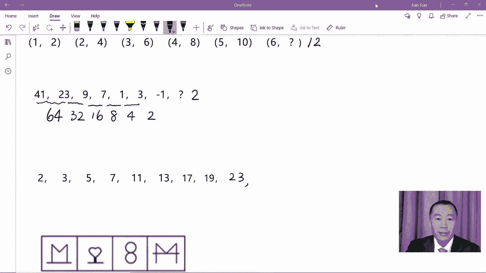

现在呢我们再来看一下底下的这个问题。

底下这个问题呢是给了一串数，那么我们希望呢这串数能够继续延续下去啊，底下这些数是这样给的，235 70 10 30 79 23，我们先来看看，首先出现了二啊，既然你出现二之后，后面就再也没有偶数了。

出现了三，当我们出现三以后呢，我们再看看53579就没有了啊，为什么没有九呢，因为93的倍数，所以说出现三以后，后面三的倍数也就没有了，接下来呢就是五，我们看看出现五以后五的倍数。

后面出没出现70 13，果然13的后面15在这里面就没出现了，好确实如此，我们再看七啊，七七的倍数，那就是14，下一个就是20 14吗，在这里没有，因为14不仅是七的倍数，还是二的倍数，21嘛。

在我们这个数组里面呢，在我们这个一列数里面呢也不存在了，所以果然给出的这列数呢就具有这样的一个特征，这个特征就是没给出来之后，它的倍数就会从整数里面消失了，根据这样的一个特征。

让我们从11 13 1719~23的时候呢，我们就会想接下来会是25吗，那不行，25是五的倍数，那没有25，那有27吗，27也不行，27是三的倍数，没有27能是29吗，29不是任何一个的倍数啊。

所以说我们觉得这个答案应该去填29啊，不仅前面填了29啊，这继续可能还是31等等等等对了，熟悉这个性质的啊，同学应该认出来了，这些就是素数啊，就是所谓的我们又叫做质数啊，就是prime number。

所以说我们给出来的前面都是prime number，当然我们也是沿着这样的一个prime number这找到的这个规律，我们可以不断的填写下去啊，前面这个三个问题呢都是从数字中去找规律。

从给出的数字中找到规律，然后我们把它把这个规律呢作为我们预测下面的数的依据，接下来的这个问题呢就不是数字了啊。

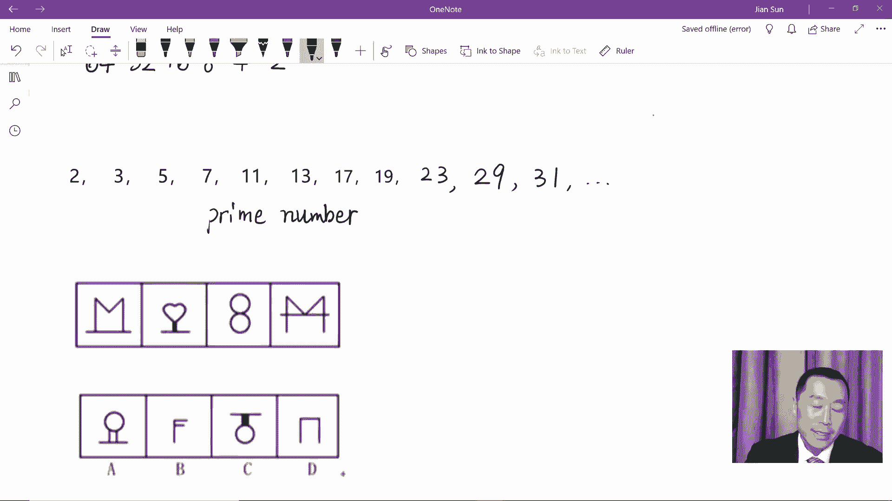

它是图形，接下来这个问题是在我们眼前呢，第一行有四个图形，我们是巡视图，看到这四个图形的特征，然后呢来勾画出接下来的第五个图形，帝国图形从哪里找呢，从第二行的abcd这四个中。

我们去寻找最合适的放到上面，作为第五个图形，同样我们要去找这四个图形的规律，我相信大家呢首先会看到这四个图形的规律都是对称，什么对称呢叫镜像对称，就是说每一个正方形中间的中线。

你会看到这个图形呢是关于这个中线两边呈镜像对称的，既然是镜像对称吗，镜像对称，所以说我们自然的就要去，接下来呢也要去寻找镜像对称的图形，我们看一看底下，我们看一看底下a确实是镜像对称。

b它就不是镜像对称，也是镜像对称，d呢也是镜像对称，所以说b就被我们排除了，但是我们仍然有a c d，所以说单单是镜像对称呢还不够，那我们继续来看前面这四个图，它的镜像对称的每一部分。

比如说我们都看右边这一部分，第一个图右边这一部分应该是个数字是一，第二个图右边这部分是个二，第三个图右边部分是三，第四个图右边部分是四，所以说我们就找到了又一个规律。

我们就接下来在底下来找这个镜像对称的右边这个部分是五的，那a不是d不是，那就是c，所以说接下来的这个我们应该啊最合理的，那就是c，我们从前面啊这四个例子中。

我相信大家都觉得自己找到的这个规律呢是确定性正确的规律，但是有的时候我们的这些规律啊未必是那么的确定，我们只能够满足从概率意义上去找到一些规律，比如说下面这个问题。

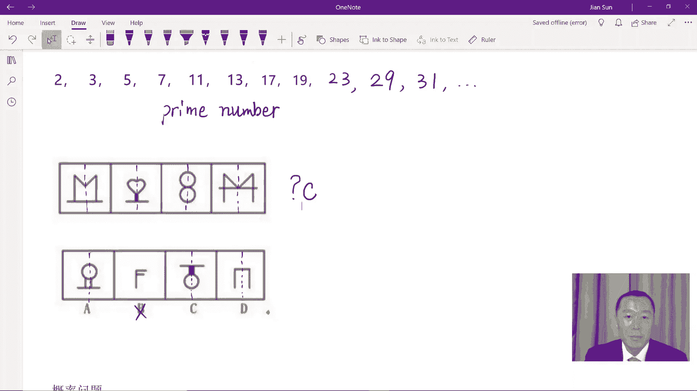

从概率的角度，我们来看下面这个问题。

比如说我们有一个盒子，这个盒子里面呢有很多的球，每一个球跟每一个球它的形状重量，它的外外观都一样，唯有呢就是颜色不一样，比如说有一部分球是红颜色的，有一部分球是黑颜色的，一起啊，混在这个盒子里面。

我们现在呢不能够把这个盒子打开，只能够呢一次一次的向这个盒子里面去随机的抽取一个球，我们像这个盒子随机抽取一个球，我们拿出来看一看是什么颜色的，我们可以记录下来，然后我们再把这个球呢放回盒子里面。

然后我们再次抽取，所以我每次抽取出来的球的颜色呢可能都不一样，比如我们一共抽取了十次，然后十次的结果我们看一看啊，我们这里呢就用r来代表红色，假如说我们看到的是红色，红色红色黑色，我们用b来代表黑色。

红色这应该是十次，我们去抽取了十次，我们把这些颜色都记录下来，现在我们来问，如果我们下一次从这个盒子里面随机的抽取球，大概率应该是个什么颜色的球，所以你看这样的一个问题啊，它就不是一个确定性的问题。

因为我们不可能从下一次从盒子里面真正的随机的抽取一个球，我们准确地知道它一定是红色或者一定是黑色，所以我们来判断这个问题，就一定只能从概率的角度来判断。

所以我们的问题的提法也只是说大概率是个什么颜色的球，让我们来看一看前十次的抽取，造成其中十次球七次都是红的，三次是黑的，所以从前面这个里面呢，我们大概看到红黑至少对这十次来讲。

它是一个七比三的这样一个比例，我相信呢有过一节概率统计知识的同学呢，应该会有这样的建立这样的一种啊直觉，也就是说这里的红球居多，所以我们下一次从这个盒子里面取球啊，估计是红球抽到红球的概率啊比较大。

即便在原来这个盒子里面，红球和黑球的比例不一定是七比三的话，那么恐怕红球被抽取出来的概率仍然是比较大的，所以这样的一个问题呢，你可以把它看成是一种概率问题，所以我们从一些给定的这些数据和事件中。

我们只能够推断出来它背后的一些带有概率意义上的解释的原因，而我们把这样的一个呃解释的原因泛化到没有看到的数据上，我们也只能够用概率的角度来说，很有可能会出现一些什么样的事情，所以这呢就会提示我们。

我们看机器学习的这种方法，并不一定非要从这个确定性的角度来看，同样我们要代理一些概率性的角度来看问题，比如说我们在这里再看这个出租车的问题，假定呢有这么一个城市，这个城市呢有很多的出租车。

但是这个城市的出租车呢它去获得牌照，是按照去报备的顺序获得牌照，比如说第一辆出租车，他获得这个牌照，他就是获得一个1号的牌照，第二辆去报备的出租车就会获得2号的牌照，所有的出租车都是这样获得牌照的。

现在呢你来到了这个城市，你随机的找到了这个街头，然后对面来了一辆出租车，你看了一下这个出租车的牌号是200号，现在你就想知道这个城市大概有多少辆出租车呢，你看这样的一个问题啊。

我我想谁都会说这个问题我不可能正好猜中，我不可能能够呃分毫不差的，正好猜出这个城市所具有的那么多的出租车，那是不可能的事情，所以说这样的一个问题又是一个概率性的问题，它又是需要我们从概率的角度来看。

这个城市大概有多少辆出租车，或者这个城市的出租车是一个什么样的数量级，首先吧因为你看到了200号出租车，而出租车获得牌照又是按照他们次序获得的，所以这个城市出租车的总数是不可能小于200辆的。

它只可能多于200辆对吧，好多于220啊，我们现在来想一想啊，比如说这个城市有1万辆出租车，如果这个城市出租车的总数啊，总数是1万辆的话，那么你看到200号出租车，这辆车的概率是多大呢，所以这边是总数。

这边是概率，那当然我相信大家都知道，这就是万分之一，1万辆车里面，正好我们看中他，这是万分之一，万分之一，当然是很小的一个数，如果这个城市有1000辆出租车呢，你看到它的概率在那就是1/1000。

1/1000也是个很小的数，但是比万分之一要大，如果这个城市有500辆出租车呢，那你看到它的概率就是1/500，就更大了一点，还有没有可能让你看到它的概率继续增加呢，当然可以，那就是这个城市有220。

当城市总数200辆出租车的时候，你看到它的概率就是在所有可能的情况里面最大的，我们刚才在做的这件事情呢，又叫做自然估计，也就是我们看在每个参数的情况下，我们这件事情发生的概率是多大。

然后呢我们呢可以这样来考虑问题，我们能不能优化我们的参数，让这件事情发生的概率是最大的，这件事情就叫做极大，此人估计啊，相信学过概率统计的同学并不陌生，所以极大似然估计呢有提供给我们一种方法。

他在这种方法下呢，我们可以啊发现了一件事情，我们去构造这件事情背后的原因，在所有可能的原因里面，能够方便我们挑出一个原因来来解释这件事情发生，所以极大自然估计呢其实也是能够呃既能够帮助我们解决这个问题。

同时我也想让大家看到，其实这也是积极学习的一个思路。

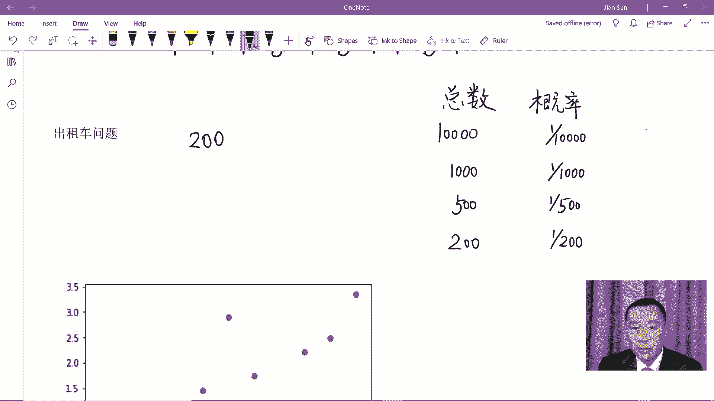

我们从前面一共呢这六个小问题里面，我们就是想展示给大家。

很早以前甚至从大家小学的时候啊，我们做这些模式识别的这些题。

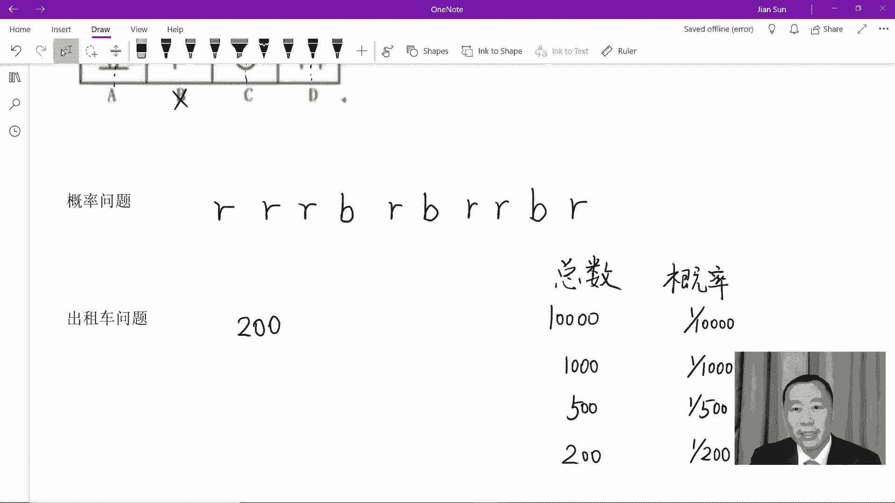

其实我们都是已经在自觉不自觉地来使用机器学习的方法了，我们接下来呢在进一步的来看积极学习啊，假定我们同我们呢从这些嗯这些智啊考智商的这些问题呢，我们现在走入了我们的告别了我们的高中啊，来到了我们的大学。

我们看看在大学里面我们会碰到一些什么样的，我们这个类似机器学习的问题呢，比如说在我们的眼前呢有这样的一个二维图像，在x轴y轴一个典型的一个xy平面上，我们给出了一些点，这些点呢往往是具有这样的一个特点。

我们来写一下啊，他们是二元数组，因为二维的嘛，所以说就是有x一好y1 x2 y2 啊，一般的来讲，在咱们这里呢一共是给出了11个点啊，第一个点的x是零，然后是0。1，0。2，0。30。4。

一直到最后一个点是一点，一般来讲呢其实我们还可以给n个点啊，x n y n我们给出这n个点，我们现在想说呀，从x到y本来是有一个函数的，本来是有一个函数的，就是这个函数呢是给出x啊。

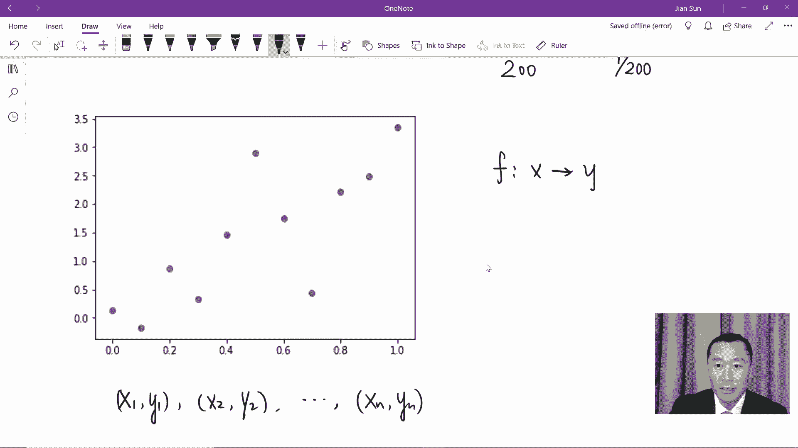

我们就可以求得函数值y本来是有一个对应关系的，但是现在呢这个对应关系没有明确的给到我们，反而是呢这个在这个对应关系之下呢，给了我们一些代表这个对应关系的一些离散的点，我们现在呢是想问。

那原来的对应关系会是什么呢，在我们的微积分课程里面呢，可以这样来看，什么样的函数能够有助于我们把这个对应关系能够猜出来，至少什么样的一个简单的函数，能够让我们非常准确的给出相应的这个每一个x。

我们就能得到相应的那个y呢，简单的函数嘛，我相信大家都不陌生，对多项式的概念，我们来看一般的一个多项式啊，你比如说一个n次的多项式，n次的多项式应该怎么写呢，我们可以用px来表示n次多项式。

就是a n x n加上an减一啊，x n减一一直加到最后的常数项，所以我们看到n次多项式啊，其实它一共有n加一项，同时呢它也就有n加一个待定的这些系数。

从a0 a11 直到a n n次多项式有n加一项啊，我们可以用n p n来表示，这是一个n次多项式，那什么样的多项式就会有n项呢，那当然就是n减一次多项式了，n减一次多项式就可以写成n减一啊。

xn减一一直n x啊，a n减二项，这是一个n减一次多项式。

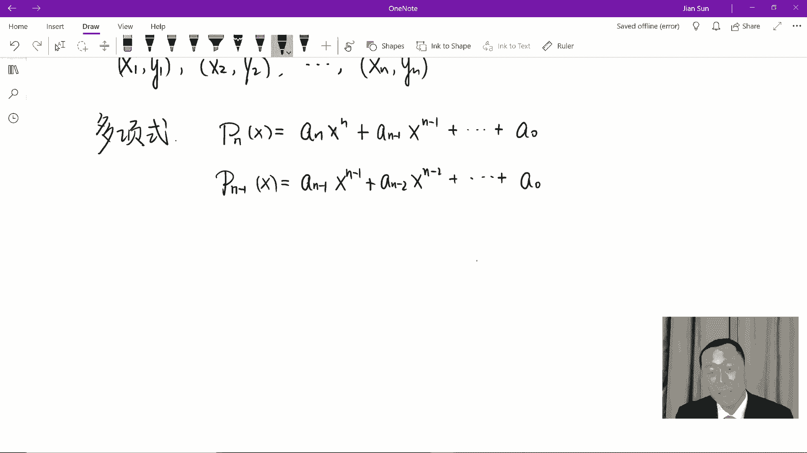

它一共有n个未知数，既然它有n个未知数，我们就用这样的一个多项式来你和上面所有的点，换句话说我们希望这样的一个多项式就是我们函数的对应关系。

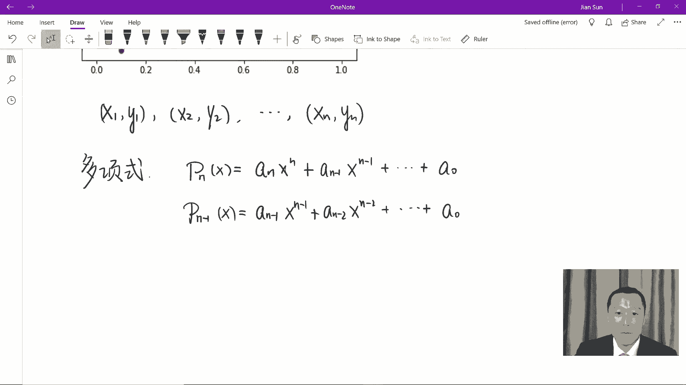

就是说给我一个x1 ，我就得到了y1 ，给我一个x2 ，我就能够得到y2 ，给我一个xn，我就能够得到yn，这样的多项式存不存在呢，啊这个多项式我们只要把所有的这些点带进去。

那就是说我们需要满足an减1x一的n减一次方，一直加到a0 ，我们需要它等于y1 ，同样我们需要x2 a n啊，也是减一，它需要等于y21 直到x的n次方的n减一次方，yn我们需要这n个方程同时成立。

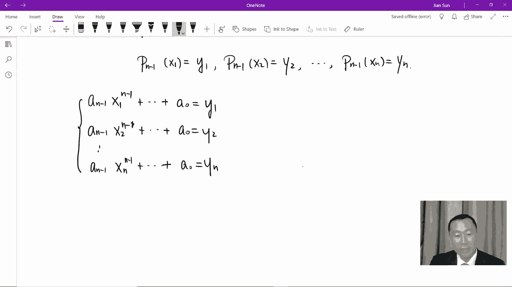

好在虽然每一个方程看上去都是一个多项式，但其实我们这里的未知数不是x，因为x都是给定的，我们这里的未知数是a是a0 a11 直到n减一，对于这些未知数来讲，这个方程就是一个线性方程组，求解线性方程组嘛。

我们其实是关注a0 a1 a直到a n减一，它的系数构成的矩阵，它的系数构成矩阵是什么样子呢，啊他就是这个样子，x一的n减一次方，x一的n减二次方一直到一，x2 的n减一次方。

x2 的n减二次方也一直到一，由此x n的n减一次方，x n的n减二次方也一直到一，这样的一个系数构成的行列式，大家可能啊不陌生，这个行列式就叫做范德蒙行列式，这个行列式等于多少呢。

其中呢i呢就是所有可能大于g的那些数数，对啊，它就不看，它就包含x2 减x1 x3 减x1 x4 减x，一到x n减x x3 减x2 x4 减x2 等等等等，那显然这是一个不等于零的。

因为我们给出的这些x都是不同的，这告诉我们什么呢，就告诉我们这个线性方程组是有解的，因此上我们一定存在这样的一个n减一次的多项式。

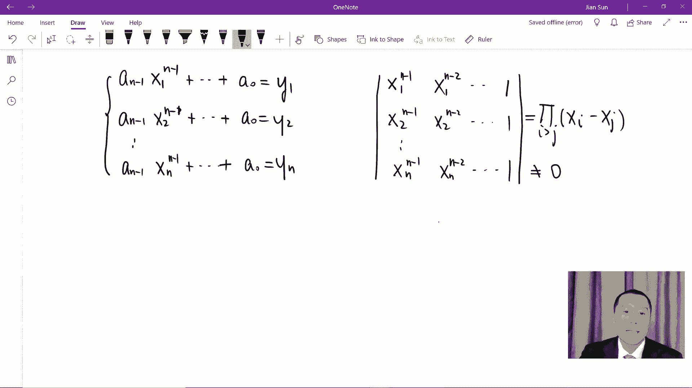

所以这个问题我们就解决了，换句话说。

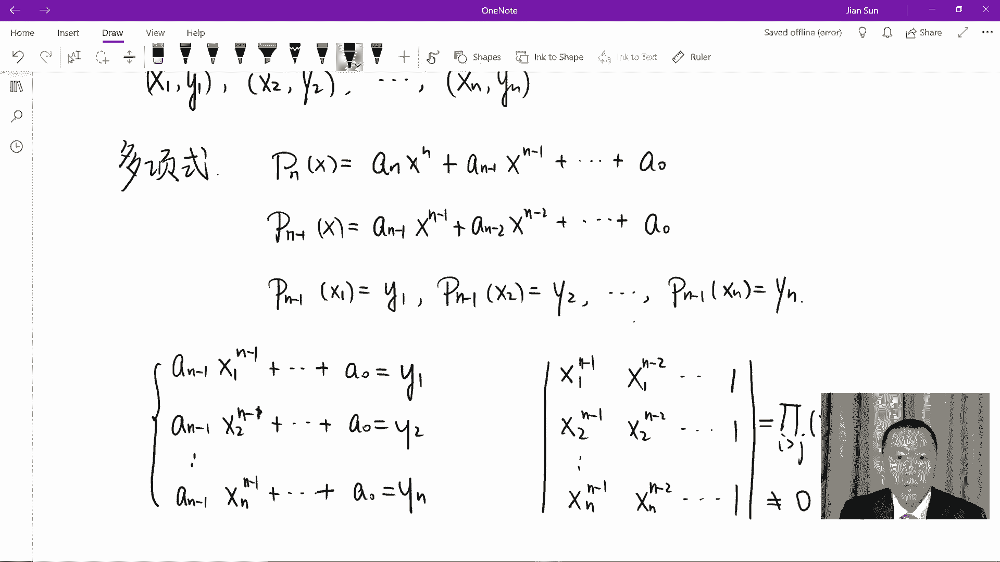

我们虽然并不知道背后的函数关系没有给出，我们啊这样的一个函数关系没有给出，但是呢我们就构造了一个n减一次多项式。

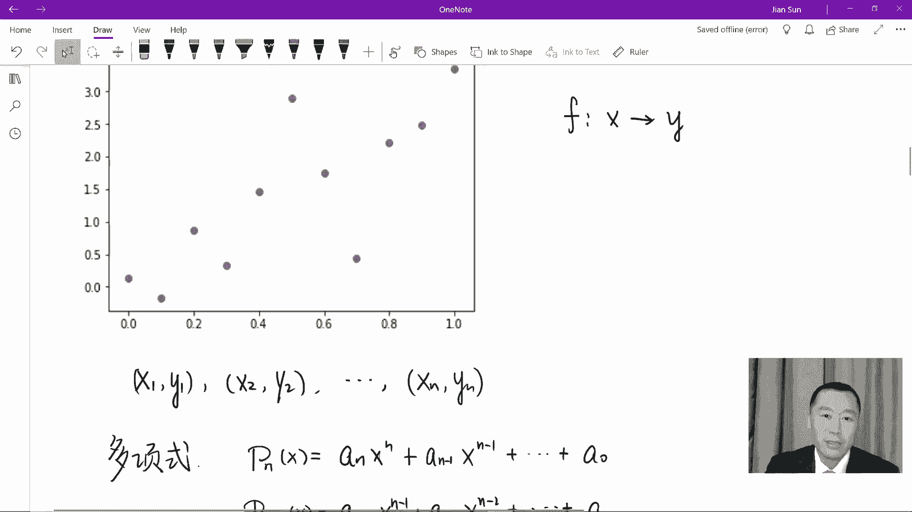

好我们现在来看一看，当我们把这样的n减一次多项式带到函数里面去。

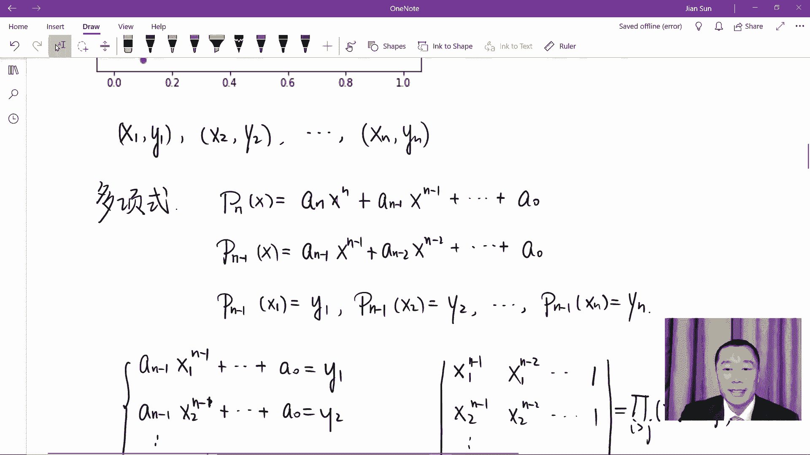

它会是什么样子，给大家看这个图，这就是我们使用了一个十次多项式，来把这11个点把它完整拟合以后的函数图像，虽然这个多项式十次多项式通过了每一个点，但是它似乎也给我们增加了一些担心。

为什么给我们增加一些担心呢，因为我们看到这个多项式啊，它的震荡的浮动幅度特别的大，其实我们在这里跟大家说，我们其实可以不去解这个安装al行列式，我其实直接就可以把这个n减一次行列，是把它给它写出来。

我这里给大家写一下啊，我用一个不同颜色的笔给大家写一下，其实啊我可以给直接写出来这个p n减1x它的样子，它首先是y11000 呢，然后乘以一个大的分数，就是嗯x减x21 直乘到x减x n。

这里呢就是分子分母呢就是x一减x2 ，一直相乘的x一减x n好，这是y1 ，同样呢我们还有y2 y2 呢就是x减x1 ，然后呢没有x2 ，x减x3 ，然后一直到x减x n。

这是分子分母呢就是x2 减x1 ，x2 减x3 ，然后一直到x2 减x n一直加到最后y n项，y n项呢就是x减x1 ，一直乘以到x减x n减一，这是分子分母，就是x n减x1 。

一直到x n减x的n减一。

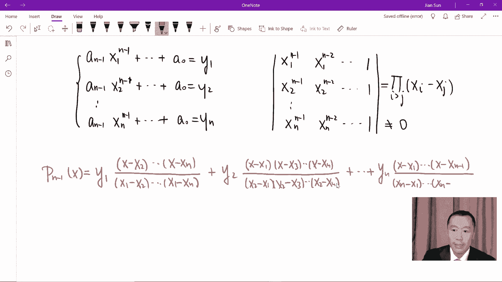

这个多项式就叫做拉格朗日插值多项式，这个拉格朗日差值多项式啊，他非常明确的告诉我们，它作为一个n减一次的多项式，你看它的构成，每一项的构成，你去看它的分子都是连乘积的形式，这个连乘积的形式一般来讲。

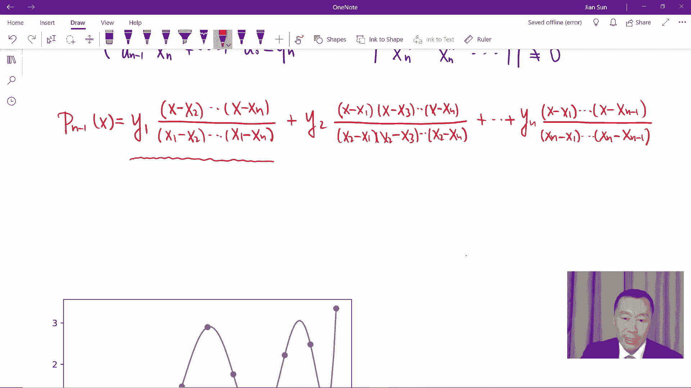

如果我们在这里面看一个连乘积，我们看一看一个连乘积会是什么样子，如果说呀我们看一个c1 ，c21 直到cn，然后我们x减去这些c作为一个连乘积这样的一个多项式啊，比如说我们叫做q x这个多项式啊。

其实啊他就会通过把c1 c2 移植到c n构成它所有的啊根，然后呢这个多项式呢会，上上下下，在x轴的上下不断的来交替的穿过这个x轴，在两边，特别是在负无穷这边。

至于x到底是趋向于正无穷还是趋向于负无穷啊，就是这个q x趋向于正无穷还是负无穷，在x趋向于负无穷的时候，它要取决于n到底是个偶数还是奇数啊，我们在这里面，比如说就暂定这个n是个偶数，那么一般来讲啊。

这个多项式呢在两边都趋向于正无穷，但是在中间呢它会穿越这些一个c，是上上下下这样的一种特殊的震荡形式，其实呢对我们从这个泛化的角度来讲呢。

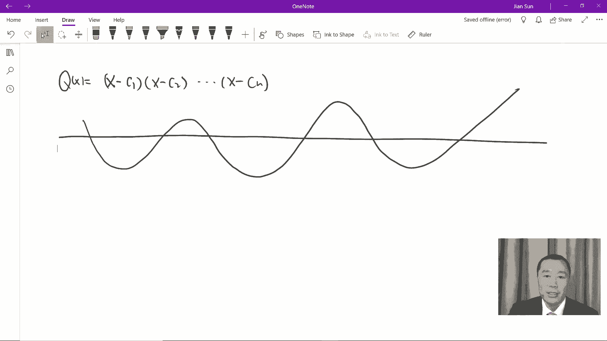

是不是特别的理想。

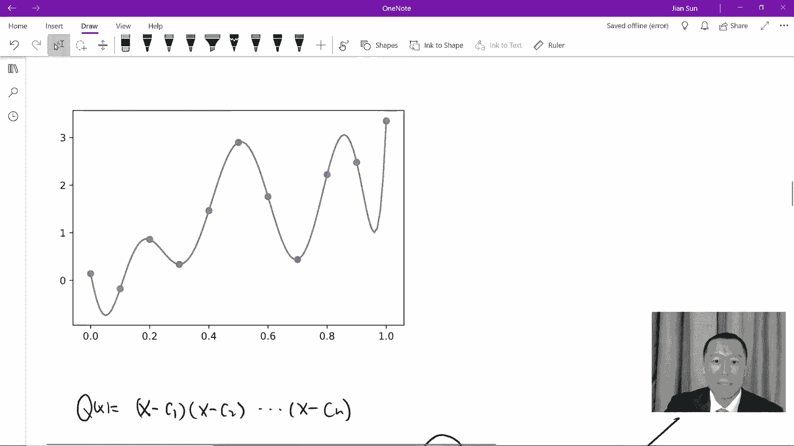

你比如说在这里面我们会看到突然间在这个点它就会掉了下来，凭空就掉了下来，我们在这个时候有没有理由相信这就是背后的这个fx，就是原来背后的那个没有给出来的规律呢，我们再试图想一想。

假定本来背后的规律比较简单，但是这个数值呈现在我们眼前的时候呢，每一个数值都稍稍加带了一点噪音，也也就是说它偏离了原来简单的一个关系，原来简单的这个关系呢，它甚至可以是比如说就是线性函数。

由于噪音的引入，使得它偏离了一个线性函数，偏离的线性函数以后，我们用一个高测的多项式，又把原来每个点都拟合了以后，我们就不仅拟合了背后的函数关系，同时我们把噪音也都拟合进去了，一旦我们把噪音拟合进去了。

这个多项式又带来这种多余的震荡，就使得我们把从样本内变到样本外的时候，就把更大的噪音带了进来，所以这并不理想，换句话说，我们上面看到的这个解决问题的方法，虽然表面上能够把这个问题全面的解决。

但在实际生动的时候却给我们带来更大的麻烦，怎么解决这个问题呢。

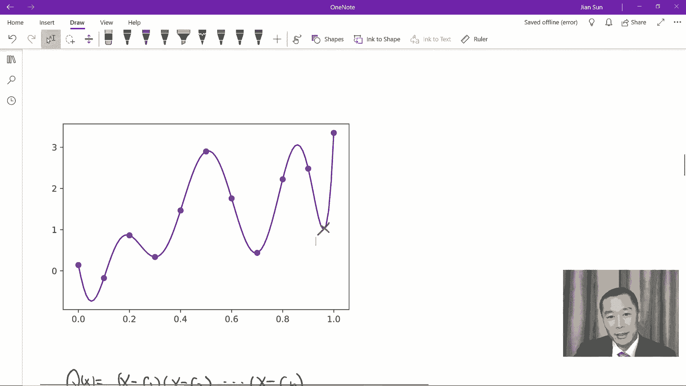

我们看一看，为了解决这个问题啊，我们现在应该是退而求其次，从哪个角度退而求其次呢，我们不能够坚持用高次多项式来做这件事情，我们应该学会用第一次的多项式来做这件事情，因为多项式的次数越低，它震荡就会越少。

但一旦我们用第一次多项式来做这件事情啊，我们很恐恐怕就做不到每个点都拟合进去了，势必有些点呢就拟合不进去了，那哪些点我们要拟合的好，哪些点拟合的不好，我们总是要用一种方式来度量吧。

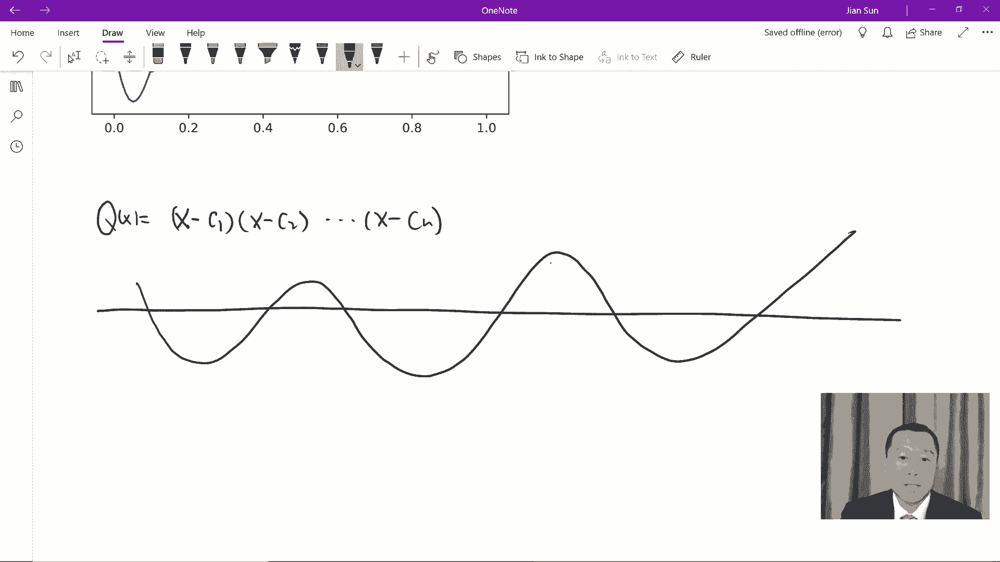

因此在接下来呢我们就会引入两个概念，你看第一个概念，根据刚才我们的叙述啊，我们要引入一个函数集合，第一次的多项式，这就是一个函数集合的概念，或者呢我们有的时候叫做假设集合。

在机器学习里面通常用假设这个词啊，就是说我们现在要引入一个新的集合，这个新的集合我们用下标来k来表示，他呢就包含所有的那些多项式，这个多项式呢它是一个小于等于k次的多项式。

比如说我们现在叫做这个p的degree，小于等于k，所以我们现在可以通过限制这个k，比如说k等于二，那么我们就只考虑小于等于二的多项式，如果k等于一呢，那么就只考虑线性函数。

所以我们现在呢希望引入这个假设集合以后呢，我们仅仅是在这个假设集合里面去挑选用来拟合的函数，这是第一点，但是呢我们也看到。

因为你限制了假设集合，所以我们做不到点点拟合，那么就要引入第二个这个概念，在数学上我们通常叫误差对吧，它叫做损失，所以我们要引入一个度量损失的一个函数，叫做误差函数，或者叫做损失函数，我们怎么来度量。

我们在我们做出来的这个函数的值和它原来的函数值之间的区别呢。

这种度量呢其实有若干种方法，我们在这里面给出几个，比如说为了引出这个度量函数，我们现在要构造一个小l，它叫做一个这个损失函数，这个损失函数呢是说你随便给我一个函数h，他在这个上的损失呢。

你给我的那个y i的区别怎么度量它的区别呢，当然我们就可以利用它们差的绝对值唉，这就是一种度量方法，通过这样的损失函数，我们不仅在这一个点定义，当然我们就可以在整个的给出的那些点上。

我们去定义这个损失函数，那就是把每个小点的啊，有的时候我们不仅要加重，而且还做个平均，但是由于做不做平均。

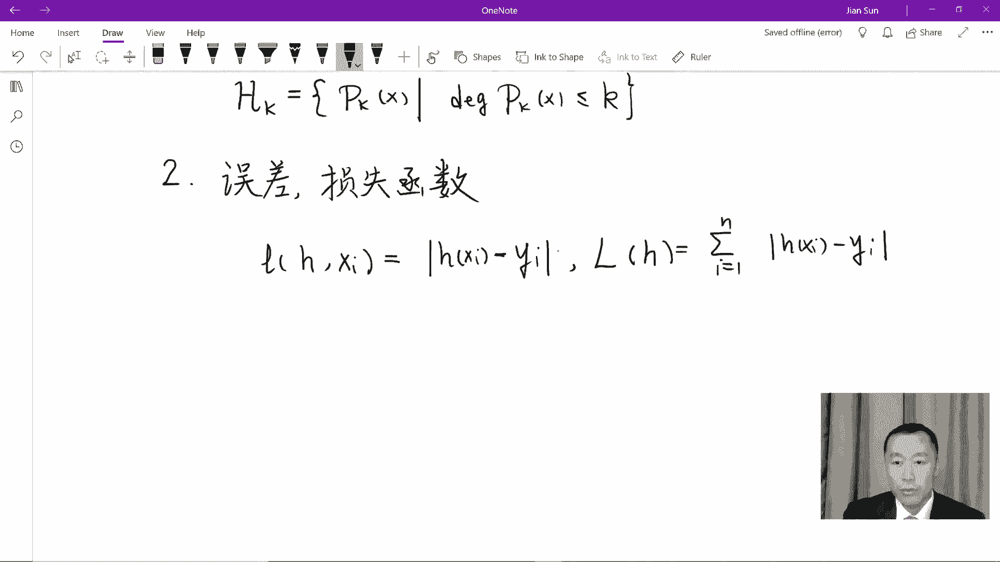

只是取决于一个，它有一个前面有一个常数项，所以说不是那么重要，这只是一种损失函数，这绝对不是唯一的损失函数，你比如说我们还可以利用这样做，我们去考虑，平方啊，如果我们考虑平方差的平方的话。

当然这样就得到了一个新的损失函数，在整体集合上的损失函数，那当然就是个个得到平方，这两种损失函数啊经常用在这种所谓的叫做连续的啊，给出的这些数据是具有连续特点的，有的时候给出的这些外i呢。

它是具有分类的特点，也就是说这个外i呢只取两个圆，两个数值，比如说只取零或者一，就像刚才我们看到两种颜色似的，这个时候损失函数呢可以这样定义，我们不在乎跟y的差别，我们只在乎说这个损失函数啊。

如果这个hx和和这个y不相等的情况下，我们就说它确实造成了损失，如果相等，那就是没有损失的啊，这也是一种损失函数的定义，当然在这个定义下，那当然这个相应的这个整体上的这个损失函数就是一样。

是把个体的损失函数加总就可以了，好在给出了损失函数的定义下。

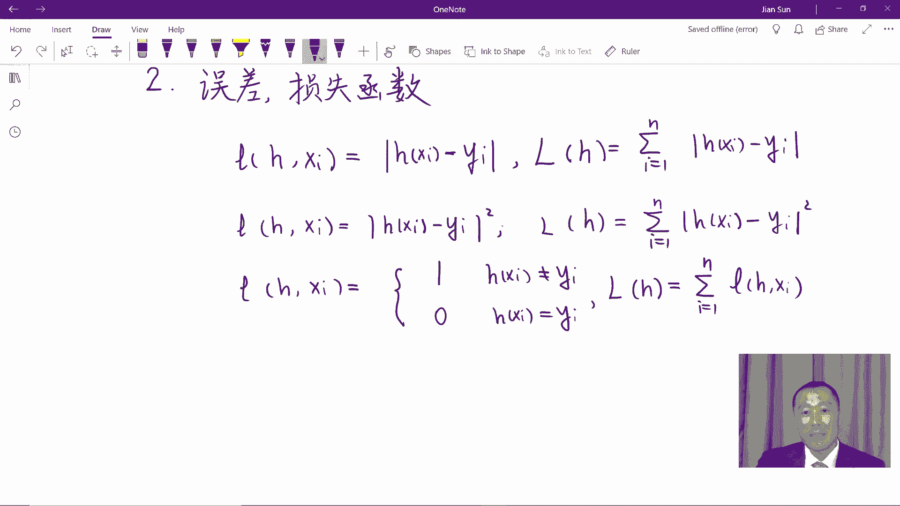

我们看一看我们的目标是来干什么，第一个在平面上已经给出了我们这么多的典籍了啊。

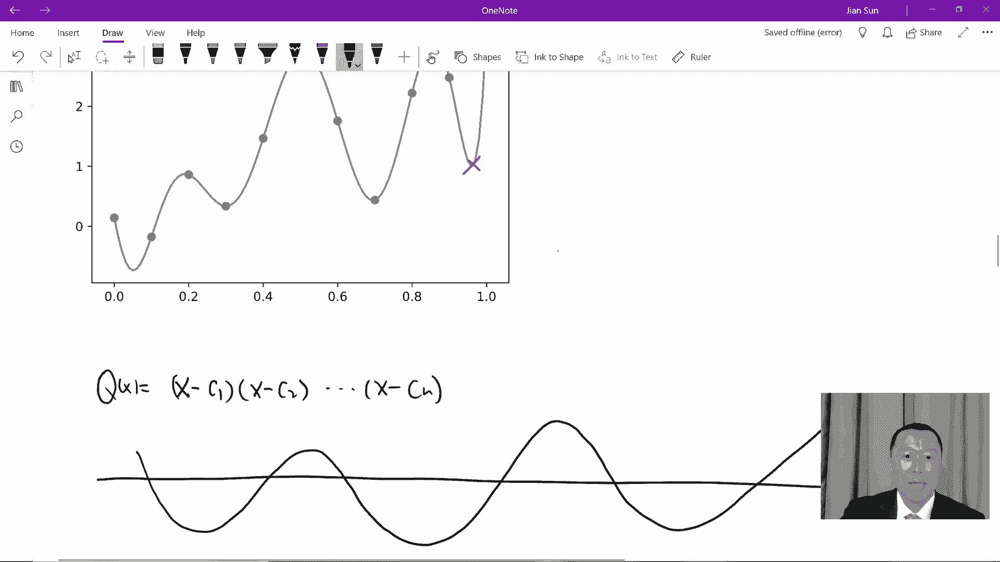

第二一点我们也定义了函数集合了。

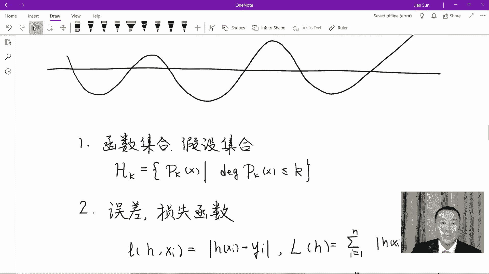

第三一点我们有了损失函数了，那我们的目的是干什么呢，我们的目的我们现在就可以叙述一下，那咱们的目标，就是去寻找所有的那些h使得。

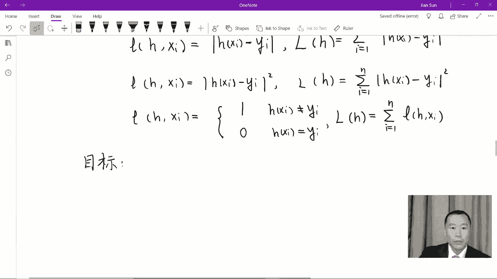

在我们的给出的这个函数集合上，我们去寻找所有的这些小h使得什么呢，使得我们的损失函数最小就就可以了，所有可能的这样的集合里面计算出的损失函数，哪一个这个函数能够让我们的损失函数能够让我们的损失值最小。

这就是我们的目标，当然我们要完成这个目标，我们需要使用一系列的算法来完成这个目标怎么样，通常在我们的这个函数集合函数假设的这个集合里面啊，它有无限多个，你比如说哪怕是线性函数，也有无限多个。

线性函数并不是有限多个，在无限多个线性函数里面，或者是一般来讲无限多个可取的这些假设集合里面，我们要取出使得损失最小的那个。

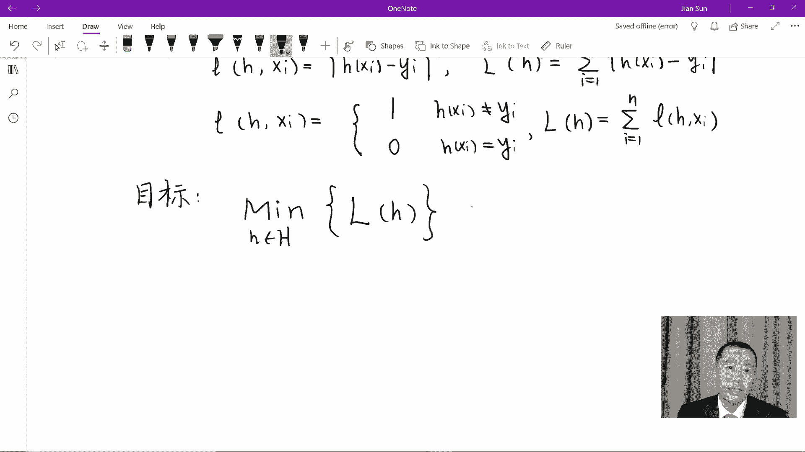

那当然需要通过一系列的算法来完成，我们来看一个例子，比如说我们选取这个损失函数，我们来看一下啊，我们怎么这样才能让他最小呢，这个最小啊其实大家不陌生，其实这就是最小二乘法的来源。

你比如说我们在线性函数里面，我们要取一个线性函数的直线，使得这条直线和对应的平面上给定的那些xy的那个y值，在y方向的平方和最小。

那就是最小二乘法哦，我们在这里呢不仅对于直线来做这件事情呢。

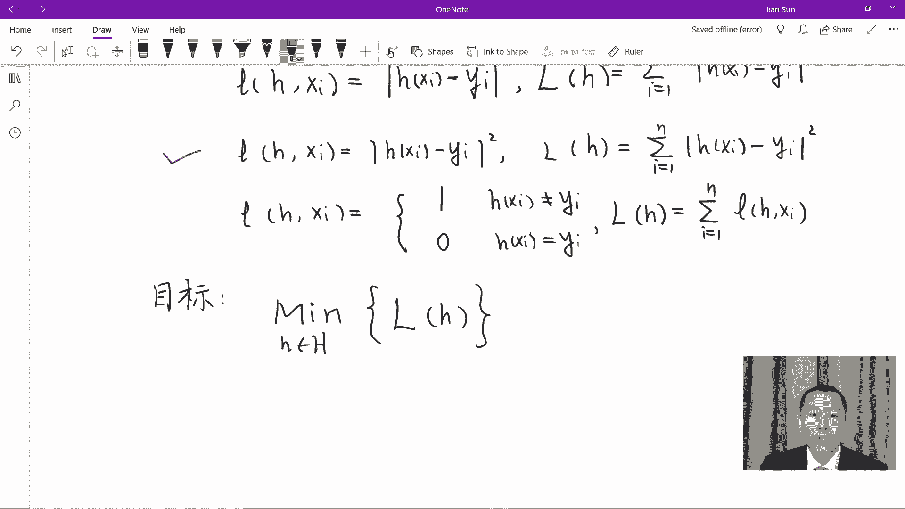

我们同样对一个case多项式，我们也来做这件事情。

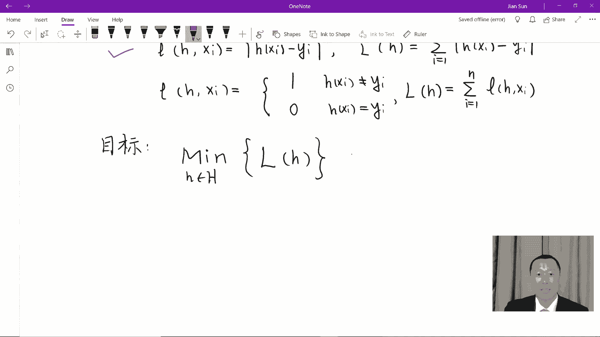

我们看看怎么做，我们这里呢为了记号上的方便呢，我们呢就不用那些离散的点了，我们呢来用连续的，换句话说呢，我们来考虑这样的一个稍稍啊推广了一个问题，就是说假定fx是给出来的一个函数。

我们的目标是寻找一个这个h这个h是一个的多项式，当然它就可以写成ak x的k次方，一直加到a0 ，我们希望做到什么呢，我们是希望使得，刚才呢是在有限个点上求和，那么现在呢我们就在一个区间上。

比如说是0~1上计算出这两个函数的差，同时呢平方求积分，使得这样的一个积分呢最小。

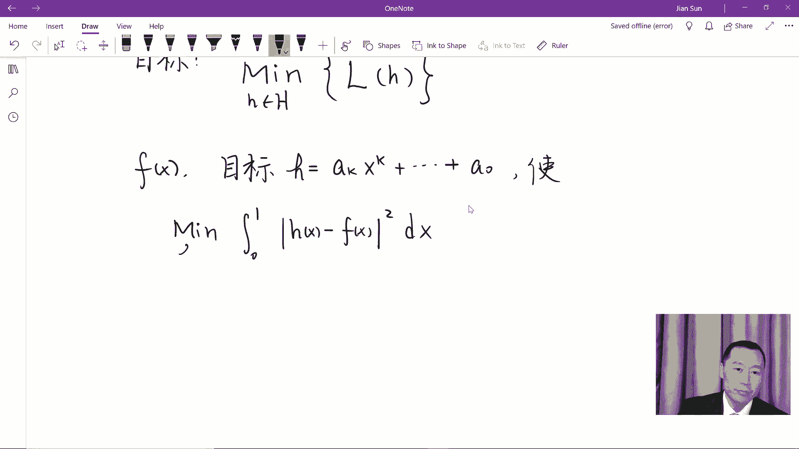

在所有可能的那个小于等于k的k值多项式里面，哪一个函数它能够给我们给出的这个fx它的平方和最小，本质上是求解这样的一个问题，在h这个h这个必须限制成为一个线性函数的时候。

那这个问题其实就是一个最小二乘法的问题，这是一个线性回归的问题，我们看一看一般情况下这个问题是不是容易得到解答，表面上看呢啊这个你把所有的这些多项式系数带进去的时候。

它是一个关于a0 a一到ak的二次多项式，但其实呢我们说事情没有那么复杂，我们可以这样来看，我们设想这样的一件事情哈，在空间中我们有一个平面子空间，好在这个平面外呢有这么一个点。

我们试图寻找这个平面上的一个点，使得这个点跟平面外的这个点的连线，它的距离啊，它的距离最小，也也就是平面上哪一个点跟平面y上面这个点的距离最小呢，我们都知道，根据我们的几何嘛。

应该是这个点向的这个平面做垂直投影，投影的这个点才是我们所需要的点，投影的这个点会有什么特点呢，投影的这个点就使得我们这个点跟投影的点，比如说我们用个符号这个点叫做p投影的点叫做。

那么p q的连线就要和这个平面上是垂直状态，我们把这样的一个概念应用到我们在我们的函数空间里面，其实也是可以的，这个hk呢就可以想象成是我们的这样的一个呃平面，这是一个线性子空间。

这fx呢就是在这个限定词空间之一个函数，我们的目标就是要在这个线性空间中选出一个函数和fx的最小，这个距离的度量就是用这个积分来度量的，如果这个h x h h x已经是最小了，他应该满足什么呢。

他应该满足这样，他应该满足hx减去fx和每一个这个线线性空间中的元素都垂直，这个都垂直，就可以这样来写，就是它们的积分等于零，换句话说我们现在这个问题就变成下面的问题了，它就变成把hx展开以后。

它就是求和，x的i这个i呢要从零到k它乘以aj的积分，就等于fx和xg的积分，那么它就进一步的化简成把求和号拿出来，就是i等于零到k下面的这个积分呢，显然它就是i加g加1/1乘以ai等于右手边的0~1。

fx和xg它的积分，现在我们看到这个，等式，当然这并不是一个等式了，这是一组等式，因为这个等式要对j等于一，这要从啊，不仅是一，它其实要是从零啊，121直到k都要成立，换句话说。

我们现在眼前其实是有k加一个方程，未知数呢一样可以加一个未知数，而且这些方都是关于a它的线性方程，所以我们现在只需要考虑就是新的一个线性，它的这个系数矩阵是由这样的一个i加j加1/1。

作为每一个元素的矩阵，如果说刚才我们看到的是范德蒙行列式，那现在这个新的这个矩阵，它相应的行列式啊，我给大家讲。

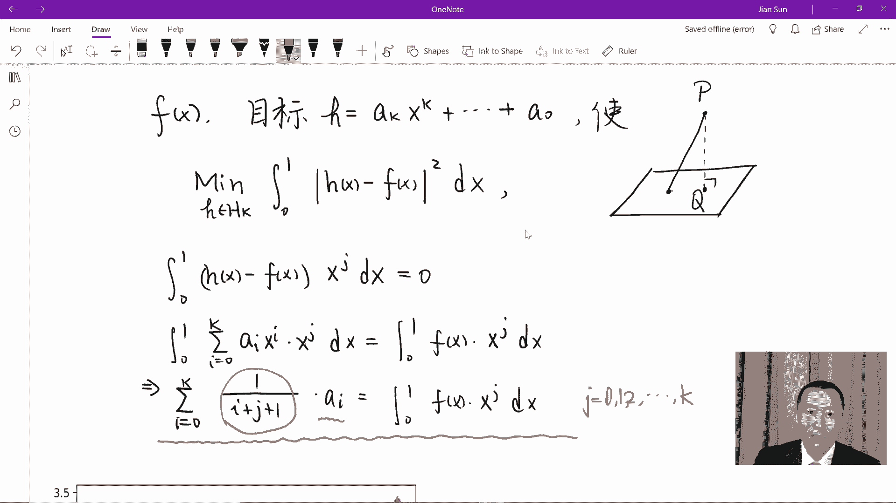

跟大家说一下，它也有个名字叫柯西行列式，科技行列式，一样是非零的。

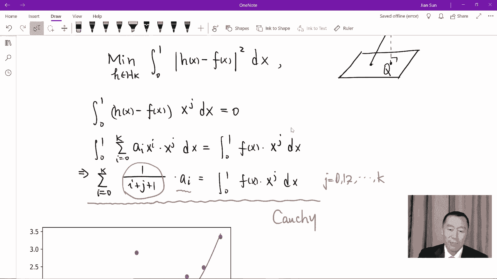

所以这个问题一样是可以解的，我们就看一看解啊，我们再回到用刚才使用在刚才的数据上。

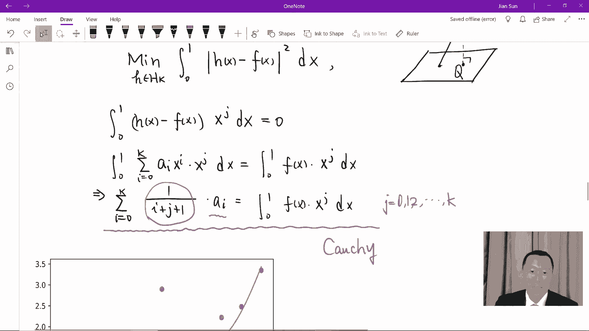

我们看看是什么样子，回到刚才，那是一个点，我们呢在这里用了一个第一次多项式，五次多项式来拟合这些点，因为我们现在在一个五次多项式里面，我们在这个我们在刚才这个损失函数下达到最小的这个五次多项式。

就是我们眼前的这个五次多项式，你看有些点贴合的就比较好，但是有些点我们似乎就被放弃了，比如这个点我们就没有去太管这个点，我们也没有去太照顾到他，那么其他的点都和好。

就是因为我们要把这两个点如果都照顾到的话，那么五次多项式是不够的，我们很可能就是要用到高次多项式，比如说十次多项式，我们是做得到，但一旦我们使用十次多项式，那么就会产生有可能啊。

我们就会这个震动就会变得非常的大。

我们通过这样的一个函数拟合的例子，使得我们看到什么呢。

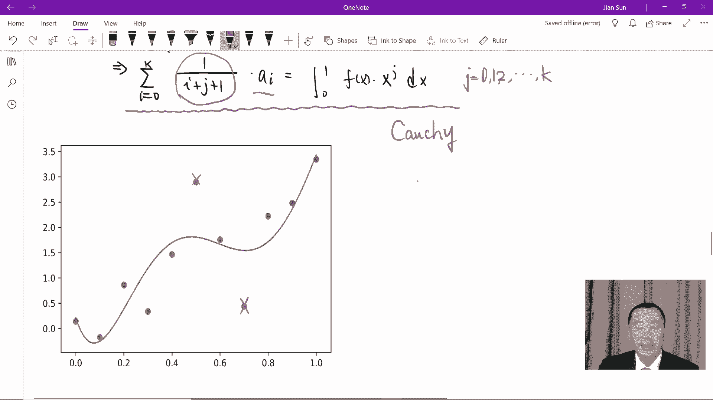

我们会看到给出的点。

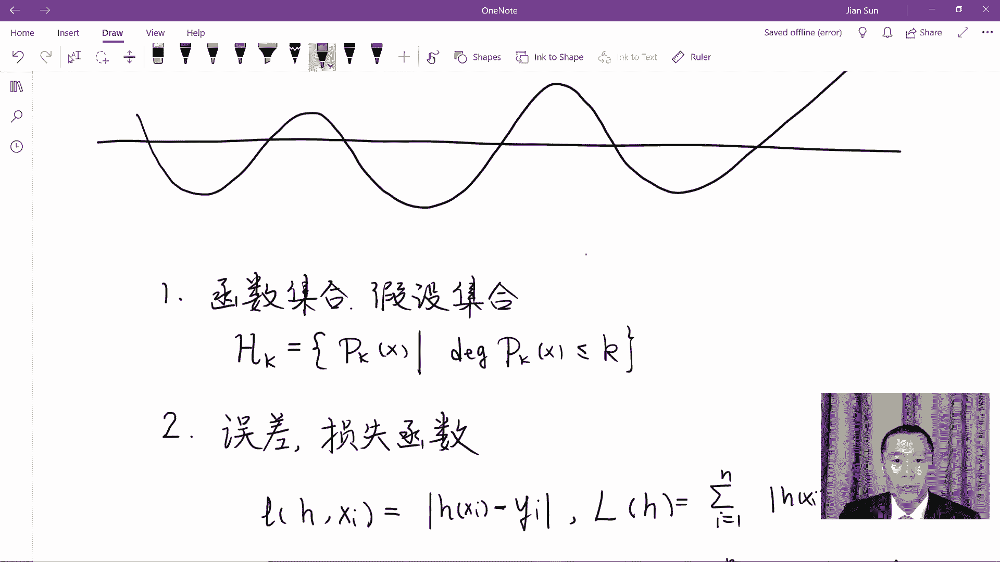

同时呢我们要设计一定的函数集合，同时呢我们还要考虑一定的损失函数，我们的目标就变成了去设计算法，使得在函数集合中使得我们损失函数最小，这件事情我们回过头再来看刚才的这个损失函数，其实都可以有几个名字。

比如说这个损失函数我们通常叫l一损失函数，这个损失函数呢叫l2 损失函数。

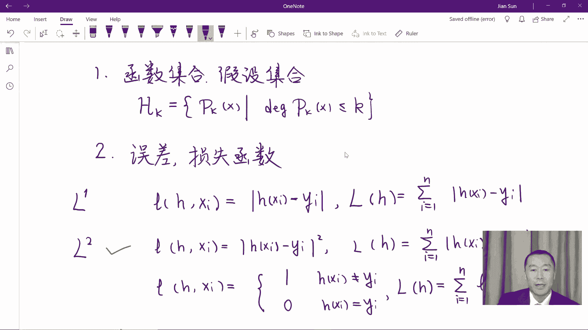

有的时候我们还可以考虑另外一种损失函数，这里面跟大家说，我们考虑一个叫l无穷的损失函数，这个l无穷的损失函数是怎么定义的，我们来看一下这个无穷损失函数啊，我们就不是分别定义在每个点上了。

而是一下子就定义在整个集合上，它就是所有的那些h x和y绝对值最大的，这里面就是爱所有的h x和y的绝对值最大的那个并不是把它们求和，而是去求他们最大的，这就是为什么我们叫l无穷，我们接下来就想看看啊。

在这样的一个损失函数下，我们如何去挑出一个最优的呢，我们怎么考虑这个问题啊，在这里呢我给大家分析一下这个问题呢，其实蛮有意思的，但是呢咱们啊简单的分析一下，我们考虑啊，平面上呢有这样的几个点。

这是一个点啊啊这是一个点，这是一个点，平面上给出的，这是一个点啊，这是一个点啊，这是一个点，我们看看123平面上，假如说有这么六个点，我标记一下，我们现在试图在l无穷这样的一个损失函数下。

我们去寻找逼近这六个点的最佳函数，首先呢来在这个考虑我们的这个函数空间，我们首先考虑的这个函数空间呢是h0 ，h0 这个函数空间就是所有的零次的多项式，那它就是所谓的常数了，一个常数的图像。

那就是一个平行于x轴的直线了，我们在所有平行于x轴的直线上，我们试图让这个l无穷的损失函数达到最小，你想一想会是什么样子，你比如说我们先从这儿开始，如果我们选取这样的一个平行线好。

你看它跟最上面这个点的距离确实是比较小了，但是呢它跟最下面这个点的距离啊，距离就太大了，所以这条线呢当我们画出这样一条线来，它跟最下面这个点的这个距离呢就成为这个损失函数了，这就比较大。

我们试图把这条线呢往下平行的往下移动，平星星往下移动，比如说我们移到了这个位置，我们移到这个位置的时候，它是跟下面这个点的距离很小的，但是它跟上面这个点的距离呢就是太大了。

所以这两个条件都不是最佳的位置，那显然这个最佳的位置在哪就容易能够获得呢，它应该是也是和x轴平行的一条线，但是呢它应该是，我们把这个，它就应该是，一条平行线。

但是呢它和上面那个点的距离正好等于和下面这个点的距离，这才是一个最佳的这条线，这个距离应该等于这个距离，这就是一个最佳的眼线，所以这就是在h0 这个函数空间中，我们求解到的最佳的时代。

l无穷这个损失函数最小，现在我们继续考虑h1 ，h一这就是所有的线性函数了，常数当然也是线性函数，但是我们能不能在刚才这个常数上让它做得更好一点呢，是可以的，你看如果我们让这条线稍稍弯曲一点。

在左边往上抬，这个时候呢我们就会得到的，比如说这样的一条线性函数，他们做这样的一个线性函数的时候，所以上这个点距它的距离也缩短了，所以下面这个点到他的距离也缩短了，但是我们会看到另外一个点。

这右边这个点到它的距离大大地增加了，所以所以这条直线我们目前的这条直线啊，它应该不是最优的，所以我们怎么它能够去调整它呢，使它变成是最优的呢，那反正我们不应该让它倾斜得这么大，而是呢倾斜到准啊。

我们倾斜到一定这个什么样的这个角，什么样的这个角使得呀大概是这样的一个角度，使得最上面这个点到它的距离和最下面这个点到它的距离，最右边这个点到它的距离，这三个距离是相等的，情况下。

一条线应该我们看上去是最优的啊，当然啊这一项就是才能达到最优，所以这是线性函数对，这样一来呢，我们看到在h0 等于常数的情况下，我们能够找到两个点，等于线性函数的时候，我们能找到三个点。

这些点呢我们都有一个名字，这个名字呢叫做支撑点，不仅如此，我们呢给大家来展示一下。

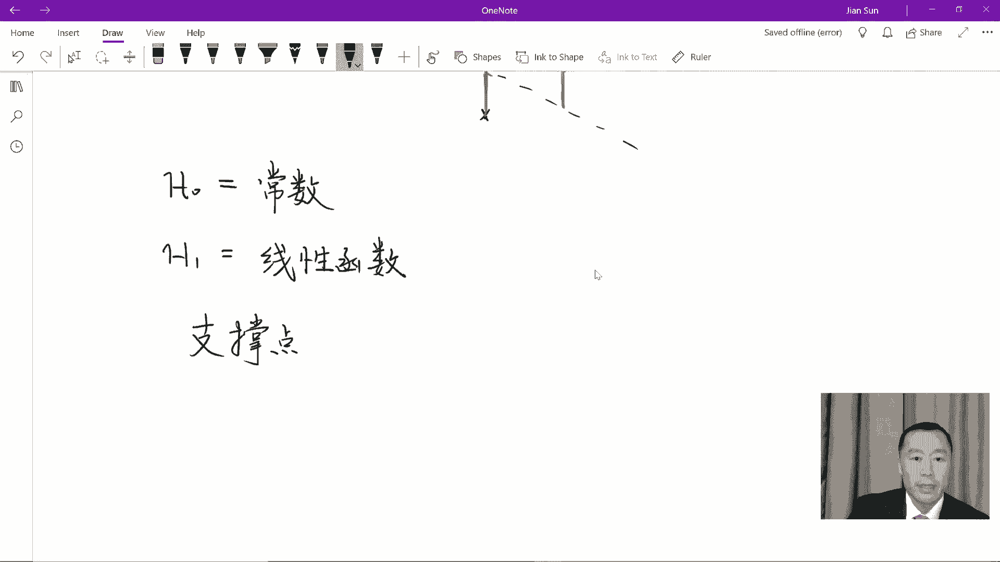

在这个图里面原来平面上有这个11个点，然后呢我们用一次多项式去拟合它，我们会看到有找到了三个支撑点，二多项是你和他我们找到了四个支撑点，三次多项式你和他我们找到了五个支撑点。

一个支撑点到这条线的y轴上的这个垂直距离都相同，不仅如此，它们出现的方式也很特别，那就是交替的一个点，在线上一个点，在线下一个点，在线上一个点。

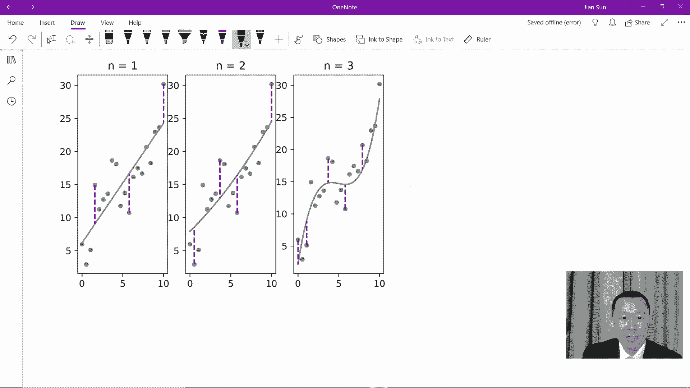

在线下支撑点是多项式加二，这件事情呢我们可以一般来讲，我们如果是在hk这个函数空间中最后的最优的多项式，就比如说叫做h，如果它是在这个空间中，使得l无穷距离最优的那个多项式，一定能够找到对应。

二个支撑点，那就是x比如说我们叫做x一啊啊二，x k加二这些支撑点都满足什么呢，就是每一个x i h在上的距离和这个y i它的绝对值都相同，相同，比如说我们这里面就一个一个写吧，比如说，我们就从一来写。

它和y一的绝对值就等于h2 ，y2 的绝对值一直等于hk加二和y的k加二的绝对值不仅如此，而且还是交替的，那就是在第二个点上和外乘以，在i加一上和y他们俩的乘积是负的。

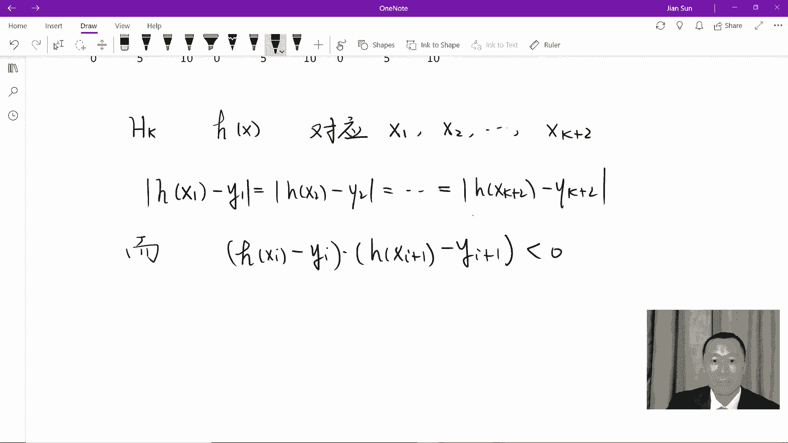

这个结论我们说是对的，最优的多项式一定是这样的啊。

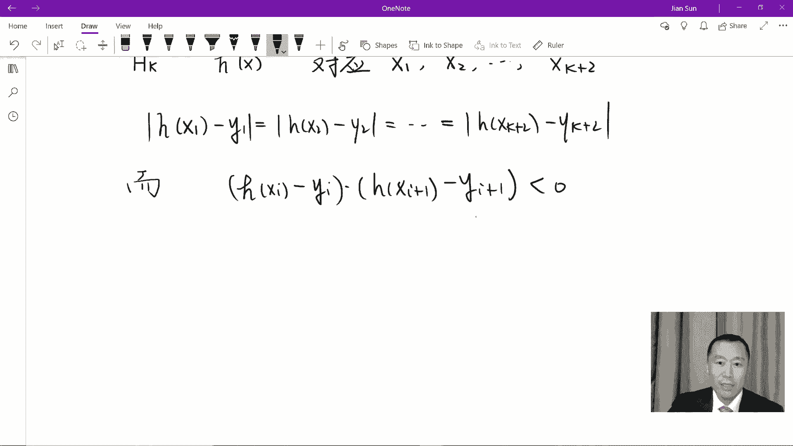

我们现在来证明一下，为什么这就是最优的，如果不然呢，我们就反正反，如果不是这样的话，假定我们有另外一个更好的多项式，px是更好的，dx是更好的嘛，也就是最优的不是h而是p那这样一来的话呢。

它的绝对值呢就应该小于刚才我们看到的h x i减去yi。

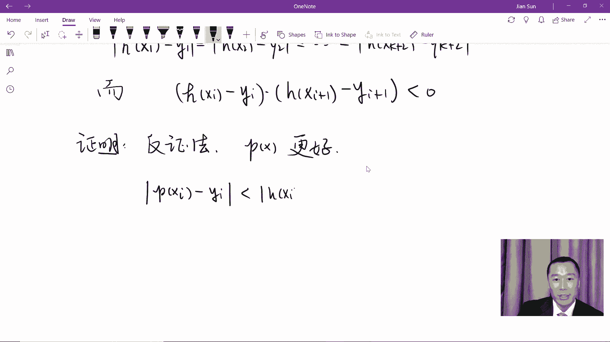

那么在这里呢试图把绝对值号拿掉，因此我们在这里说，比如说不失一般性啊，假设，是一般性呢，假设这个从第一个点开始啊，h一减去y一呢是大于零的，当然如果从第一个点它是大于零的，那hx 2减就y2 。

当然就是小于零的，它大于零，我们又看这个px一减去y1 ，加上绝对值小于hx一减y1 ，那当然它去掉绝对值也是成立，因此我们就会看到就是p x一小于x1 ，第二个点呢px 2减去y2 。

他应该加个绝对值，是前面加个负号也是成立的，小第二个值呢我们看到因为h x一减y一大于零啊，那么h2 减去y2 呢就是小于零的，我前面加个负号，这样一来我们就会看到啊p x2 要大于hx 21。

以此类推。

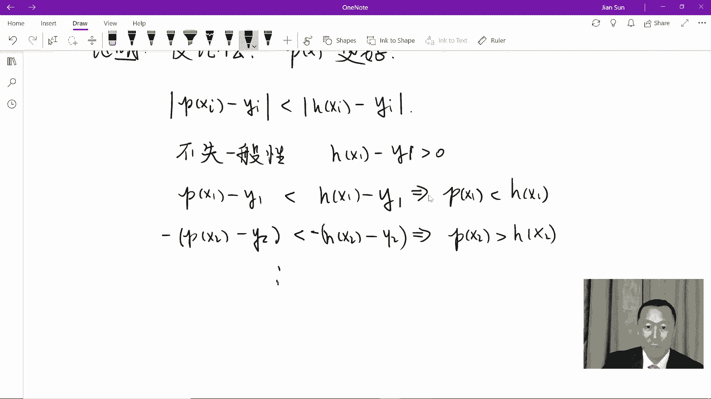

我们就看到这个px呢是大于，那我们就看到px一减去h x一是小于零的，但是px 2减去hx 2是大于零的，接下来呢当然就是小于零的，一直到最后xk加二，但是这个px减去x它也是一个小于等于k次的多项式。

最后一个小于等于k多项式，它在x一小于零，x2 大于零，那就一定在中间等于零，中间的这个点呢我们就叫做，这个点我们就叫做c，所以说我们现在就会看到，一定能够存在一个c一去hc一等于零。

同理我们能够找到二减去h c2 也等于零，我们一共能找到多少这样的c呢，那就要看这个p减h多少次从负变得正，从正又变到负呢，本来还是k加二个点，那么它们中间的这个零点就有k k加一。

所以我们能找到不同的k加一个c使得p减去h，在这些点上总统等于零，可是p x减去h x它也是一个k次多项式。

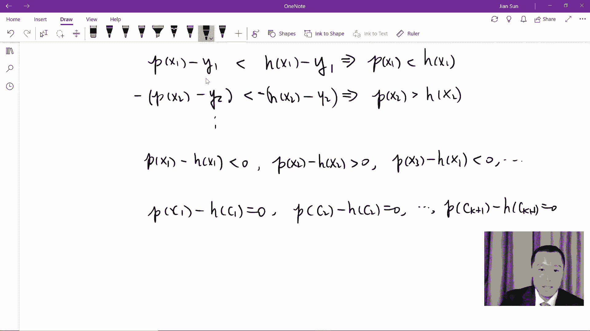

k次多项式有k加一个不同的零点，只能够说明多项式来讲是恒等于h的，所以不是别的，就是指它不可能是一个最优的，到目前为止看我们这个证明就证明完了。

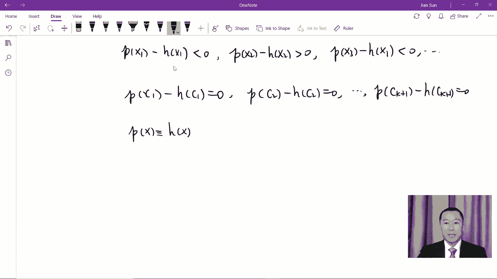

证明什么了呢，我们就证明我们刚刚找到的这个h就是这些对应于这些支撑点的。

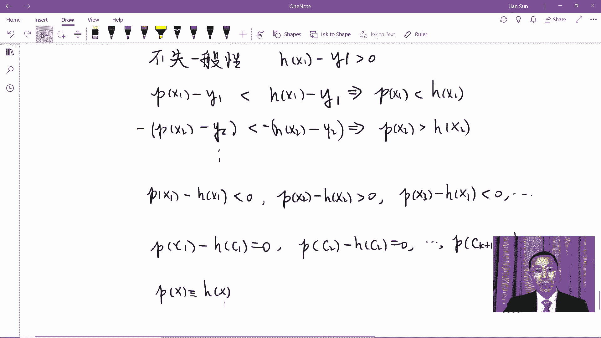

这个h一定是在l无穷损失函数下一下最优的，我们稍稍回忆一下。

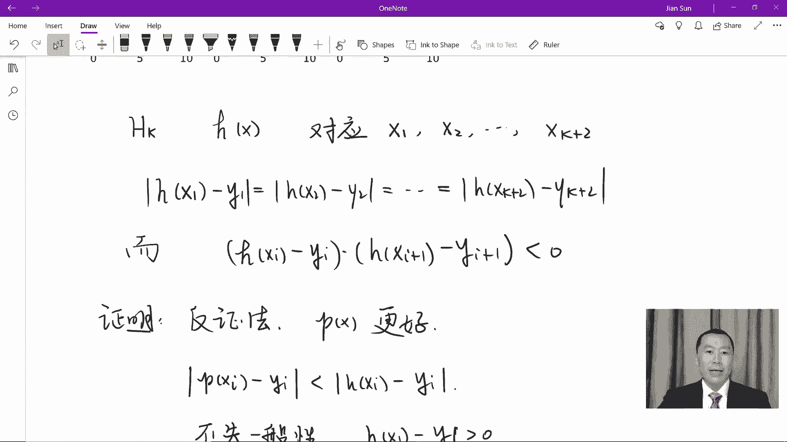

我们这次今天我们讲的内容，我们讲的内容是说从机器学习角度来讲，学习其实并不陌生啊，我们很早以前其实就接触过机器学习，我们已经自觉不自觉地一直在使用机器学习的这些想法。

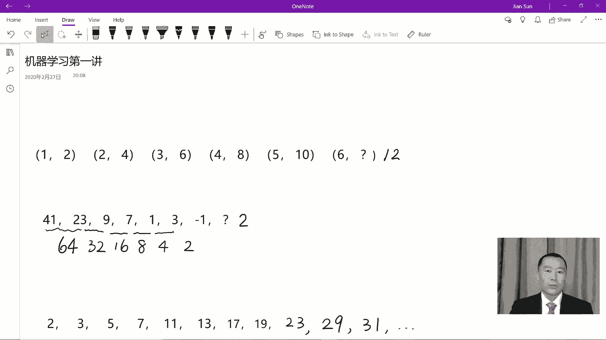

来处理一些问题，这些问题确定问题就是我们通常所说的deterministic的这个问题，而且我们想找到的规律。

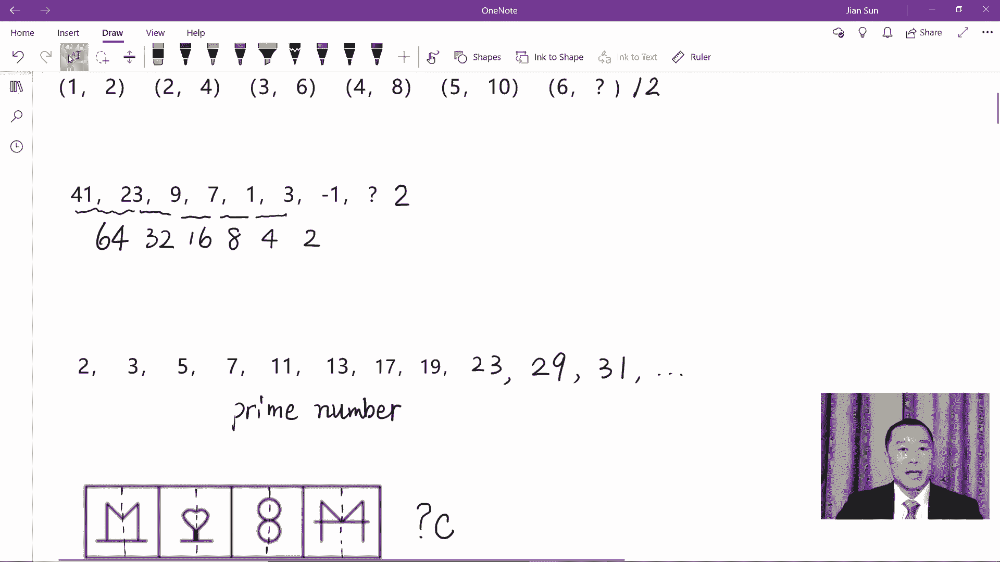

我们也确信这是一种确定性的规律，更多的其实我们想是我们找到的是probabilistic的问题。

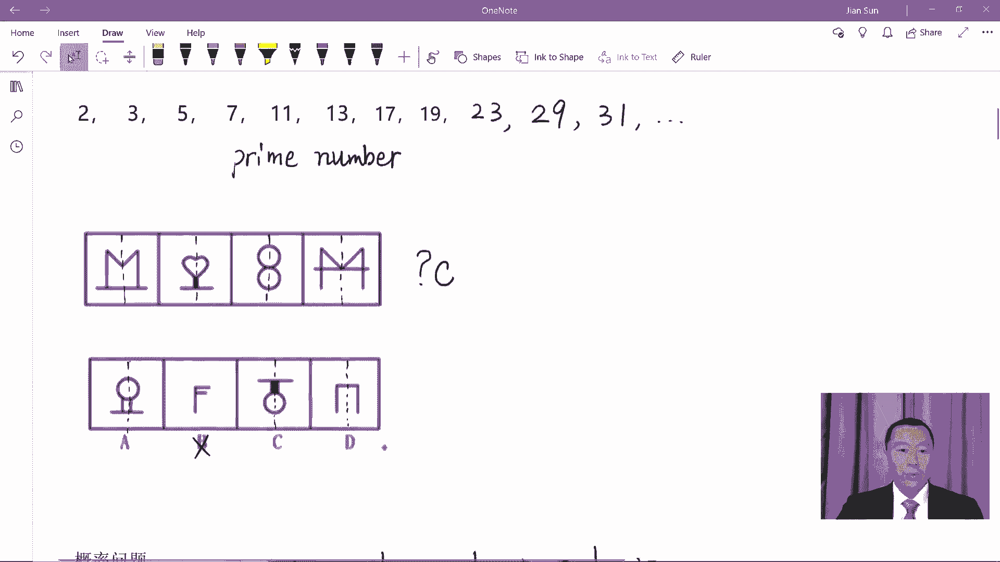

找到这些规律，我们也宁愿相信这是一些概率上的一些规律。

我们的呃不学角度。

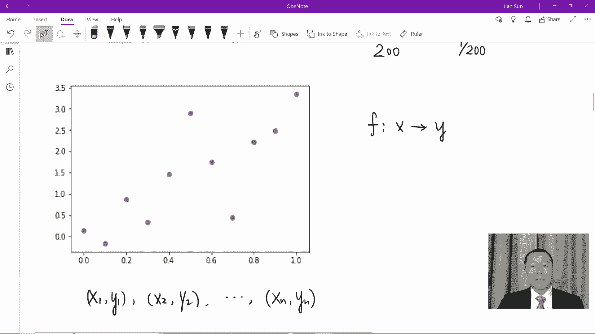

我们也经常遇到这样的一个问题，事实上机器学习最后我们还是要把它转化成类似是一个数学的问题，更严格的叙述它，它就是一个数学问题，我们经常以前接触到的就是平面上的点的拟合的问题，点的拟合的问题。

我们上来来讲，我们可以用多项式拟合给我们的任何多的，只要是有限个点，我们都可以把它拟合上，依旧是多项式的拟合，会带来不可避免地带来的问题就是震荡。

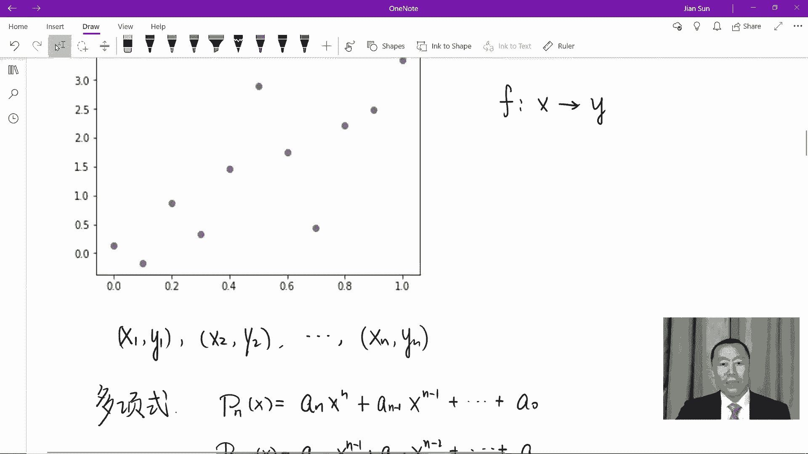

当我们不想这样做的时候。

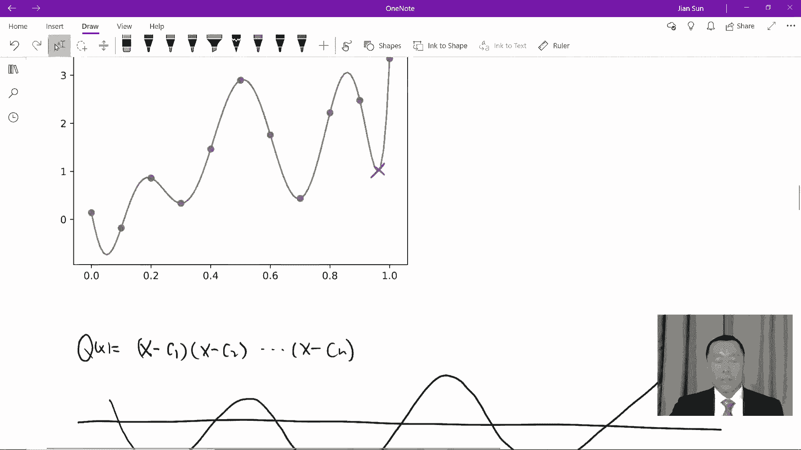

我们势必就要把我们的函数空间把它缩小，但由此而来就会带来损失，所以最后机器学习往往就体现成为一个算法问题。

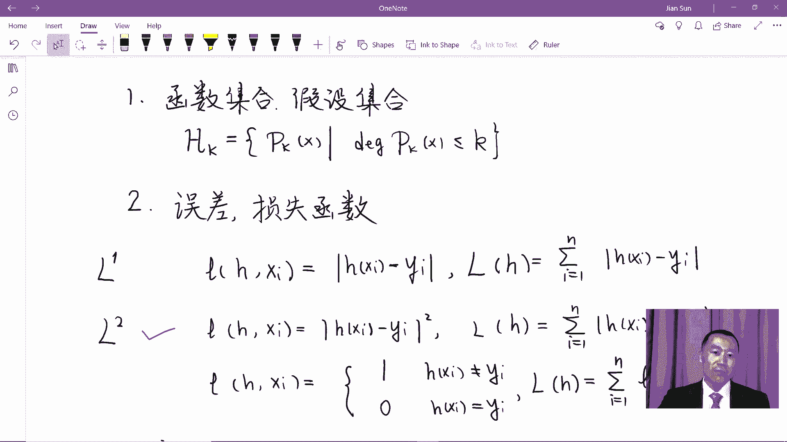

优化的算法问题就是在更小的函数空间和让我们做到更好的拟合啊。

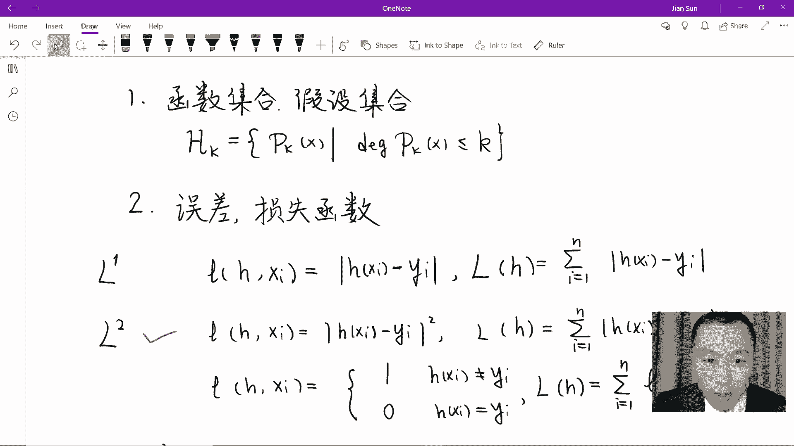

我们的误差函数比较小这件事情。

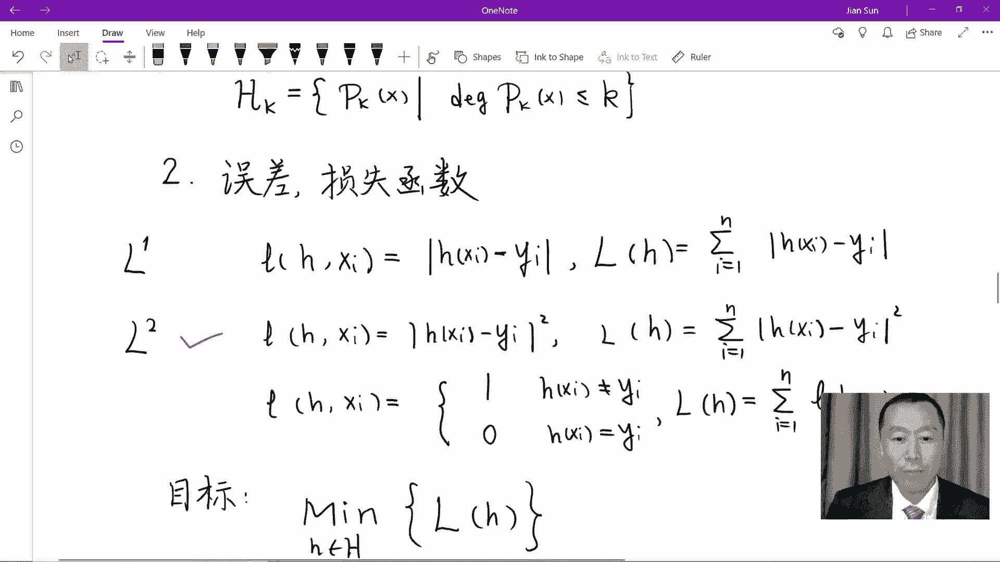

而且呢我们考虑了两种重要的是函数，一个是l two的损失函数，这就对应到我们以后的回归的算法。

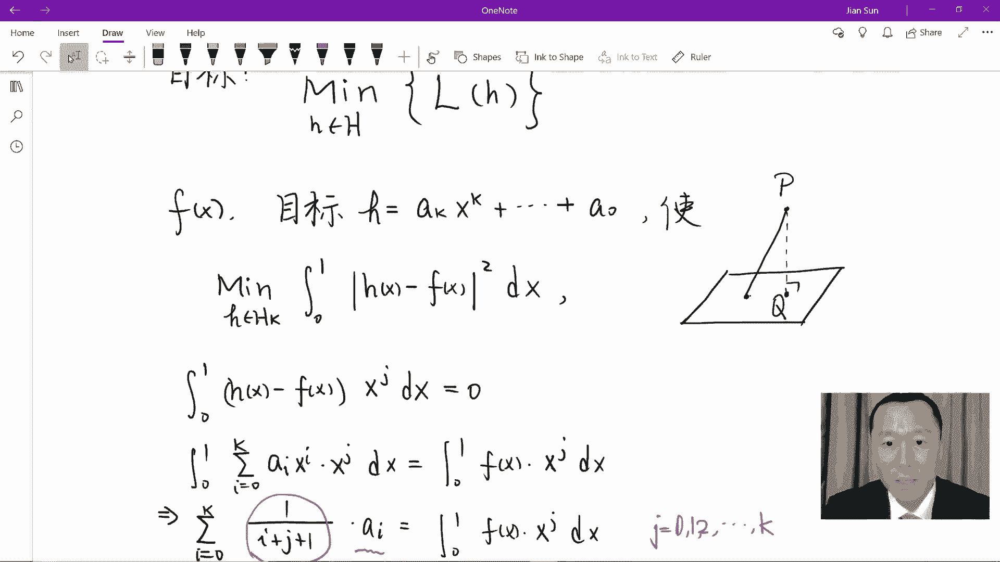

另一种损失函数就是无穷这种损失函数。

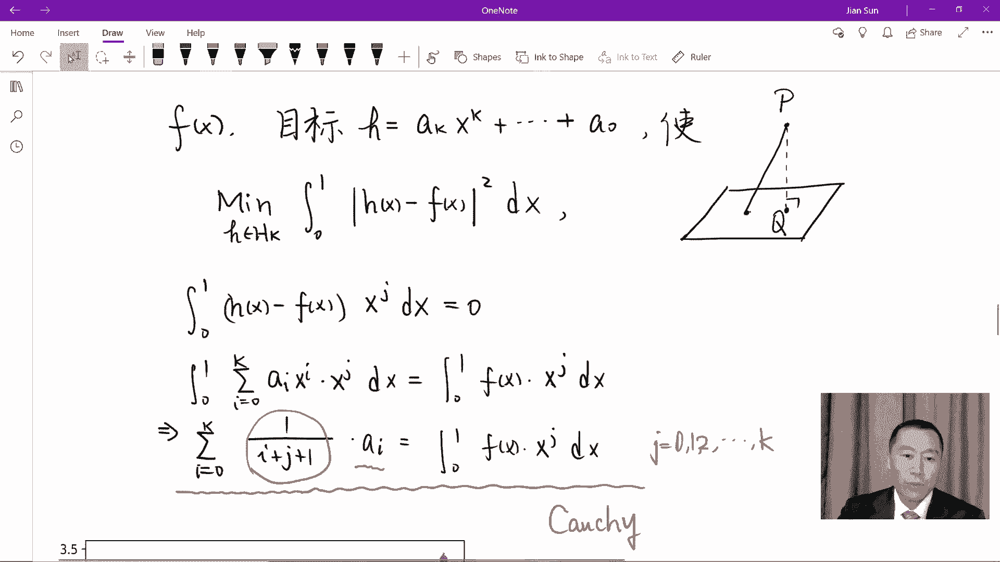

而无穷这种损失函数它看似它的定义呢嗯有一点呢不是那么的普遍，其实它呢跟我们以后要讲的支持向量机有巨大的密切的关系，这也是我们引入这样的一个呃，我们在这里面讲这个算法的问题。

就是其实到了后来支持向量机我们就会看到这个算法的影子，而且在支持向量机我们会看到它和回归有非常不同之处，在这个l无穷的损失函数下，最后起决定性作用的只不过是一些有限的而且个数不多的支撑点。

而其他的点呢在决定最优函数的时候呢，但这一点呢在回归里呢却不一样，在线性回归里呢，每一个点都对最后的最优函数的计算是做出了贡献的，这也是这两种损失，它函数带来的两种算法的结果的不同。

好我们今天呢是个语言的课程，希望大家呢从我们这个课程里面呢看到机器学习是很有意思的，在以后的课程中，我们就会陆续地把这些问题，他们的算法给大家展开。

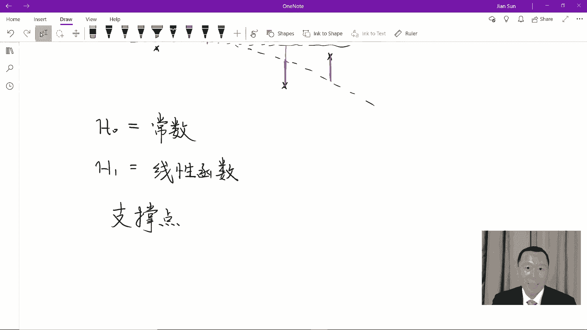