# 复旦大学经济学院《机器学习与量化投资》（Spring 2020） - P2：Lecture 2 Perceptron Model - ___main___ - BV1fv411r7z1

好同学们，我们现在呢来开始我们的机器学习课程的第二讲，在我们开始第二讲之前呢，我们先稍稍回忆一下我们上节课讲的内容，上节课呢是为我们同学呢做了一个关于机器学习课程的语言，这样一个内容，在引言中呢。

特别我们引入了这样的一些概念，什么概念呢，那么就是假设集合的概念给出的数据点的概念，同时呢我们在假设集合里面呢选出一个最优函数的概念，为了来定义这个最优函数呢，我们就引入了一个损失函数。

总之上一次课程呢我们利用这个平面上的差值公式，多项式进行插值，以及呢我们看到它在几种不同的损失函数下，比如说l two损失函数或者l无穷作为损失函数给出的最优函数呢，其实是分别具有不同的性状。

我们在这里呢再用几个非常简单的例子帮助大家回忆一下，比如说我们来看最简单的一维情况呃，我们在一维，也就是说r y上我们给出一组点x1 x2 ，一直到x n它们都是实数，给出这一组实数以后。

我们想看看三种损失函数意义下哪一个啊，能够给出我们分别对应他们最优的点是什么，比如说我们在这里面定义啊l1 l一这种损失函数呢，也就是说我们是希望我们去寻找一个点，这个点呢也是实数，使得呢。

在l e一下这个点到给出的每一个点i等于一到n距离的绝对值极小，这是在l e意义下的优化问题，我们呢不去优化呃，针对这个假设函数空间的函数呢，我们这里呢只是去优化一个点，我们再看看l2 l2 。

同样呢我们是要寻找一个实数，这个实数呢是使得，绝对值的平方和极小，大家来看一看，在r21 下我们会得到一个什么样的最佳点，我们再看看还有无穷而无穷呢就是同样是一个实数。

但是呢这个实数是使得最大值绝对值的最大值小于等于n啊，i呢是大于等于一极小，这三个问题我们看一看这三个问题其实都容易回答。

但是但是我们会看一看这三个问题的解，它会给我们的性状是截然不同的，比如说我们在这里面呢画一条直线，我们把这n个点呢按照次序把它排列开，比如说x1 x n x一是最小的，x n是最大的。

中间呢还有若干点好，我们看看在l首先呢看l e e l e一下，也就是说我们要找一个点呢，使得到平面上这这些点的距离最小，我们看看距离是什么概念，我们随便给一个，我们在这里面随便给一个点。

比如说给出这个点来，那距离最小呢啊也就是说到我们现在给定的这六个点。

最小六个点最小，我们先想一想，能能不能简单一点，我们先不取六个点，我们先旁边啊取，比如说四个点啊，1234，我们看看哪个点到这四个点的距离最小，如果这个点在这的话，那么这四段分别是这四段对吧，好。

这四段呢距离有点大，那么同样的我们看一看还是这四个点，如果这个点取在这儿的话，那我们看看这四段分别是这一段这一段，这一段这一段，换句话说你加总之后，你就会发现它就是这段区间的长度，加上这个区间的长度。

事实上你可以证明，在我们这条直线上，任何一个点到这四个点的距离的和，是肯定要大于等于这两个区间长度的，换句话说，我们现在给出的这个点到这四个点的距离的和已经是最小的，甚至而且呢不仅是这个点。

我们在这个区间中任取一个点，你去看他得到的距离和仍然是这两个区间的长度，所以说仍然是最小的。

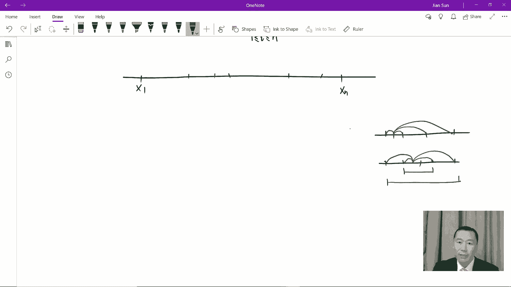

回到我们啊一般的情况回到刚才在平面上绿，我们现在给定这六点的情况下，显然最优的点，那一定是在中间的这个区间上的任何一个点，也就是这个区间上任何一个点到这六点的距离的和最小，为什么呢，因为它会加起来。

就是这个区间的长度加上这个区间的长度，加上最外面区间的长度，所以回答第一个问题。

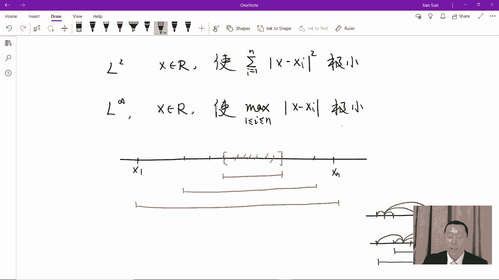

在l一下使得距离的和最小，其实要分机偶，如果n是个偶数的，那么这个x呢就会最优的点呢，就会落在最中间的那个区间中的任何一个点都可以，如果x是奇数，那么你就找最中间的那个点就可以了，仅仅一个点满足好。

所以说第一个问题呢我们就会得到了解答。

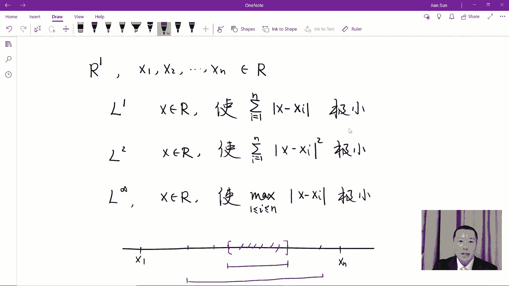

而且我们会看到这个解答呢很有意思，我们再来看第二个l2 ，一下距离的平方和最小，我们大概熟悉这个方差的同学都应该知道。

这个解呢我们是可以写出来的。

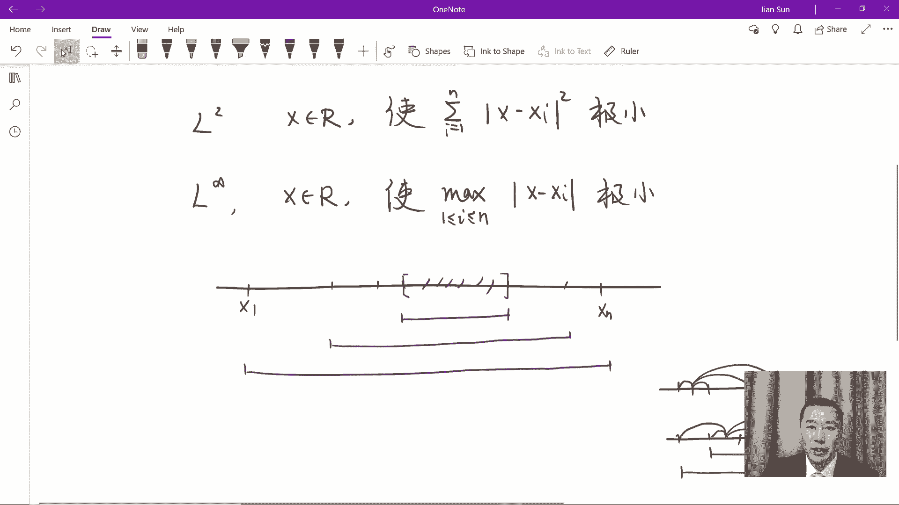

这个解就是它的均值，换句话说第二个问题啊。

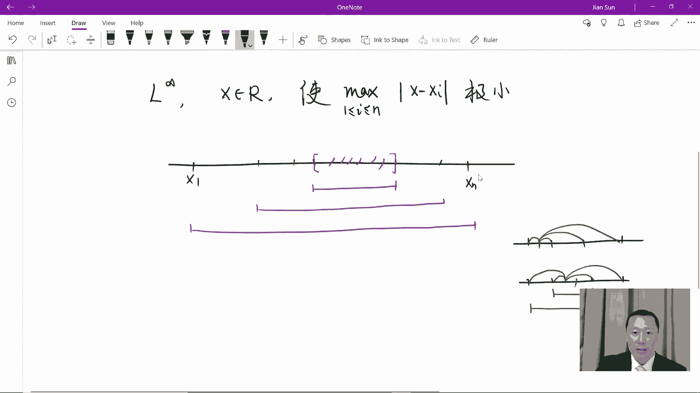

这是在刚才我们看的，这是l一的解，我们再来看l2 的解，l2 的解，为了使得距离的平方和最小的那个点就是argument，的面，argument的面啊，这个所有的x是哪一个x呢，就是x一加x2 。

一直加到x n他们的平均值就是这n个点的均值，而且是唯一，所以说你在l21 下最小我们也得到了解，就是均值，我们再看看l无穷啊，这是l2 级，我们再看看l无穷，l无穷，我们是需要所谓极大值啊。

而这个呢几何直观上非常的明显，因为x一是在最左边，x2 在最右边这个x呢到它们之间极大的那个点，而且使得最小的那当然应该啊，也就是中间其他的点呢都可以忽略不计了，在x2 到x n。

这是xn在x一到xn中间，任何的点我们都可以忽略不计了，而且使得到x一和xn中间较大距离的那个点，一定是x一和xn的终点，所以这个的解就在他们俩这正中。

所以它就是x一和x n的平均点好我们看到l一的解是一段区间。

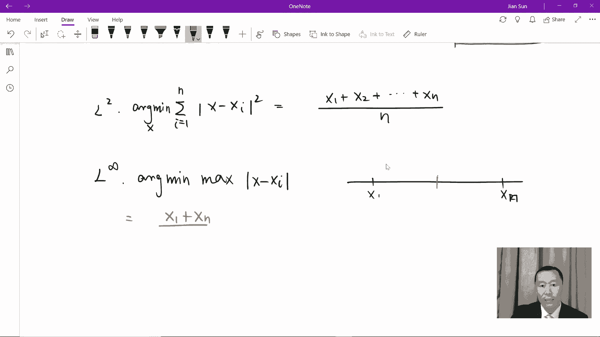

l2 的解就是他们的均值。

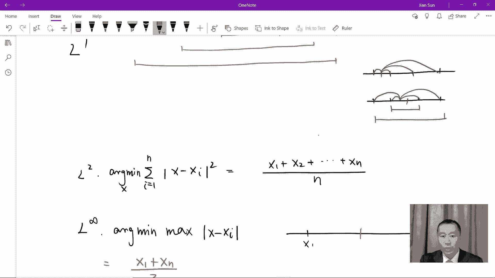

而无穷的解是最小值和最大值的终点，其他的点都可以忽略不计，所以在l无穷下，我们已经看到了它的支撑点就两个，一个是最小点，一个是最大点，所以说我们呢通过简单的在一维平面上的这个性质呢。

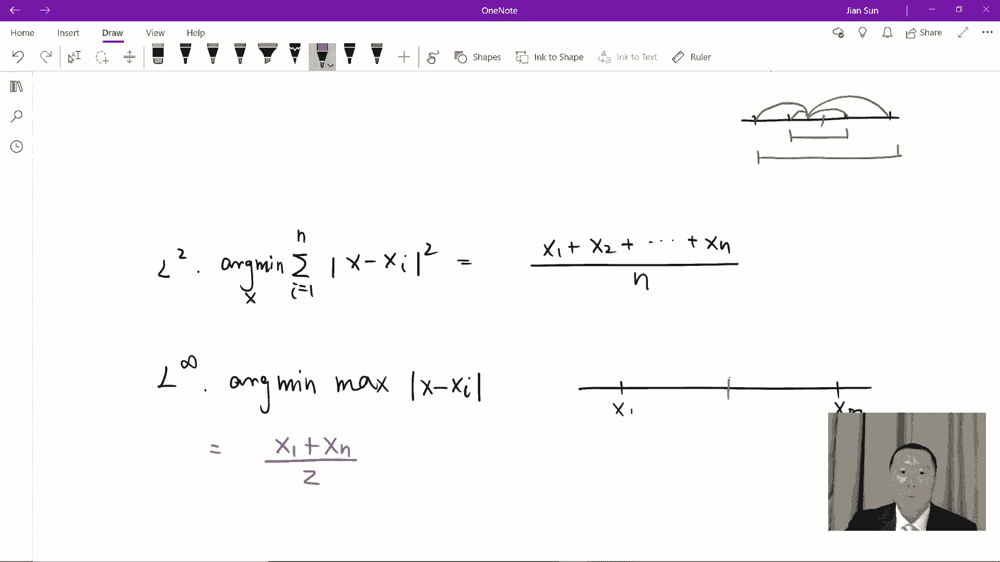

让我们又一次的看到我们选择不同的损失函数就会得到不同的点，那么在一般情况下，选择不同的损失函数的定义，就会让我们得到不同的优化的函数。

好现在呢我们来进入今天的主题感知机的学习。

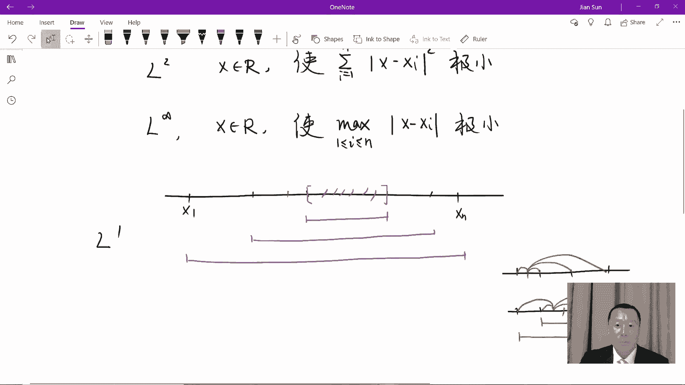

首先我们来看感知机呢是可以说是机器学习中的一个先驱性的模型，很早呢就被提出并解决方法非常的简单，但是呢他的思想却是比较深刻的，感知机一般来讲我们来提出他的问题所在，它是一个分类模型。

它要解决的是一个分类问题，他是要一个分类问题，而且呢它是一个监督式的问题，监督型的机器学习问题，它的输入我们来说一下，给出这是x12 y1 x2 y2 xn yn，这是给我们的样本，那么在这个样本里面。

那么k为那就是不止可能是不是一维了，如果是一维，那它我们叫做特征，就是一个特征是k为呢，其实它有k个不同的特征啊，你比如说我们应用在一个金融问题上，比如说应用在一个信用卡问题上。

每一组点呢很可能就是一个人他还款的一个特征，那么这个x呢可能就是关于这个人他的一些信息啊，你如果只有关于他的一个信息，比如就是收入，那就是一个特征，那么每x呢就在r一中，如果你给出来的收入和总资产。

那就是两个特征，我们用这样的方法来定义这个x好分类问题，每一个yi呢仅仅取两个值，你比如说我们就让他取-1和正一，当然你可以让他取零跟一啊，或者-1跟零，这都无所谓，所以这个地方是非常啊。

没有什么特别的，y取两个值，我们的目标就是要找出一个函数来，能够使得这个函数呢来构建出从x到y这样的一种映射关系，就是在什么样的x上，他的y呢是正一啊，在什么样的x上呢，它的y是-1。

我们从几何角度来讲，我们可以画一个图啊，我们来看看在这个图里面呢，x呢是在二维平面的，哎，我们可以先从二维平面来看，比如说二维平面呢有若干点，我们在这里，所以说它有两个坐标，但是对应的那个y有的是正一。

有的时候是-1，我们在这里呢就用两种颜色来形容它，一种呢比如说是红颜色的，一种呢是黑颜色的，我们叫你们随便点一些点好，我们在平面上呢这样呢就给出了有限的这些点，每一个点呢x都是二维平面上的一个点。

但是呢我们用不同的颜色来标记出相应的y，使得呢我们这个函数比如叫做fx啊，这是一个函数，据说这个函数取什么样的函数的样子，一会儿我们来讨论，我们目标就是啊他希望这个fx i和yi尽量的接近好。

我们来看这是一个分类问题，这里的yi呢不是连续的，既然不是连续的呢，我们如何定义它的损失函数呢，这个损失函数我们就可以上一次我们也提到过，也就是说我们可以这样定义损失函数，就是fx fx i啊。

这个损失函数是说如果它等于yi的时候，我们就定义没有损失，不等于yi的时候啊，我们就定义是个损失，比如说我们这个定义成损失函数啊，它定义成为我们来稍微写一下损失函数，我们可以定义这样的一个损失函数。

就是，零如果fx i它等于yi没有损失一如果fx i不等于yi，所以我们最后呢整个的整体上的这个样本上的损失呢，就是来数个数数一共多少个点，f在这个点上和给定的这个y值不一样。

我们当然是希望损失函数下降到零，换句话说呢，我们是希望能找出一个函数来全部正确的把样本内的函数都做到分类。

举个例子回到一种非常简单的思维，比如说我们可不可以这样来定义一个函数。

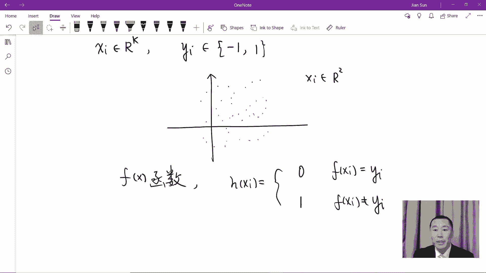

这个是一个简单的思维啊，我们在这里面讲啊，那其他的x呢，你比如说其他的x，都等于-1就好了，换句话说呢，我们就是说给定的分类一模一样，其他的我们都把它涂成，比如说一种颜色，黑的或者是红着。

那你说这样的函数当然我就满足了，在样本内它的分类是完全正确，但是显然呢我们不认为这是一个正确的函数，因为呢这个函数太随意了，他甚至把样本外的点全都涂成一种颜色，虽然它在样本内是完全正确的。

但是我们根本不指望这样的函数，这样随机的一个函数能够给出我们在样本外可以把损失降下来好，所以说我们说这样的函数呢不可能，我们必须要给出一个函数空间来，那么现在呢我们就来看看什么样的函数空间。

我们是在这里呢，是应该是被我们去啊，仔细考虑的好。

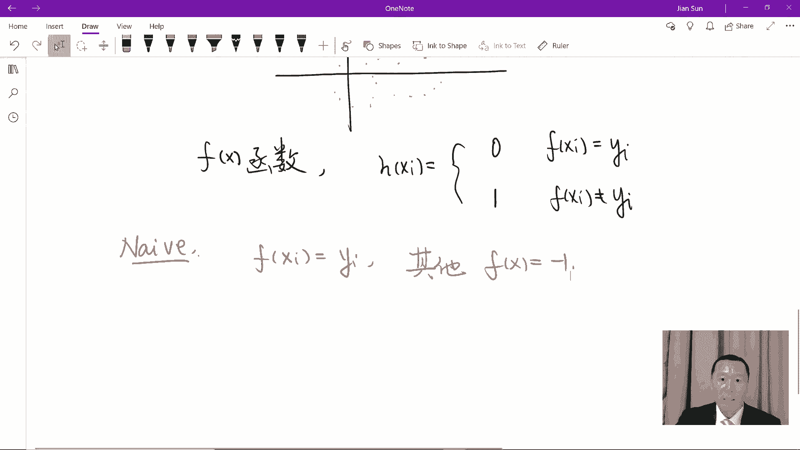

我们说呢这是第一点。

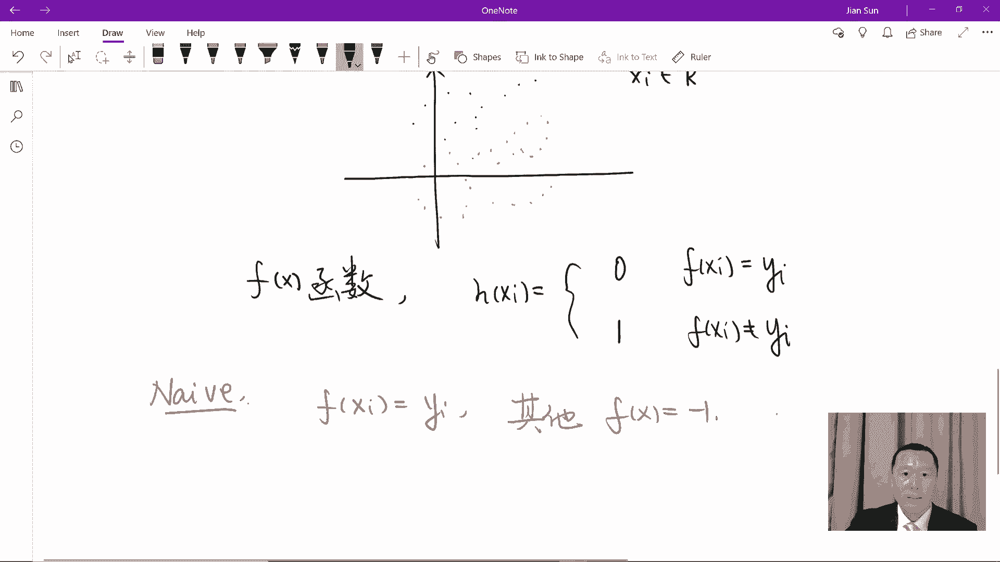

第二点我们来引入这个概念，线性函数，大家呢对线性函数呢应该并不陌生，在我们的线性代数里面呢，我们接触的函数函数几乎都是线性函数，在这里面呢我们稍稍回忆一下啊，比如说在rk空间，这是一个k为的线性空间中。

我们可以定义啊，给定一个向量之后，也就是w是rk空间中的一个向量，我们就可以定义啊，同时呢还有一个实数b是一个实数，这个时候我们就可以定义一个rk空间到实数的一个线性函数。

这个线性函数就是它作用在任何一个函数上，它就是w的转置乘以x加上b好，我们在这里面做一些线性代数的说明，我们考虑w的时候，它是线性空间中的一个向量，我们一定要用列向量的形式考虑，所以列向量w是列向量。

x也是rv空r k空间中一个点，我们也考虑把它看成是一个列向量，所以说w的转置就是一个行向量，行向量可以列向量做矩阵乘法就得到一个数值，所以我们这种表述方式啊是矩阵的表述方式。

我们也可以用我们的一般的内积的表述方式，就是两个向量做内积，w考虑到是kv空间的一个向量，x也是一个向量，当然可以做内积，再加上b它也是一个实数，所以这两种方式啊，接下来我们可能都会使用。

一种是矩阵的写法，矩阵乘积的写法，一种是内积的写法。

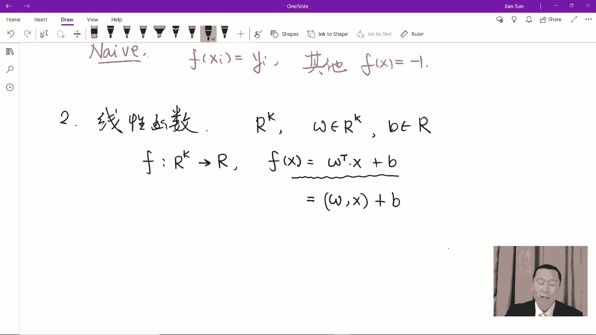

我们考虑线性函数，我们现在再画一个图啊，你比如说r2 空间的线性函数，r空间的线性函数一般来讲就是这样的，y等于ax加上b的形式，我们知道b是截距，a呢啊a就是斜率，所以说在r空间呢。

这个r空间的这个线性函数啊，呃这个r空间的这个一条线是这样写的，那么r空间的线性函数我们看看是什么样子，r的空间呢它的向量呢是x y分量，x y分量的是我们通常可以写成a x加上b y加上c的形式。

这就是在整个r空间中的一个线性函数的样子，那么这个线性函数其实对应到r空间的一条线，就是我们在这里面随便画了一条线哈，当然在这里面我们要说它不一定是这种啊，这个字我们用的这个字母会发生变化。

现在呢就是r空间中的一个线性函数，我们来考虑这个线性函数具有什么特点啊，这个线性函数当我们写完了之后，它呢对应到，这个线性函数等于零的地方，这个线性函数等于零，它就对应到了一条线。

但这条线它的斜率呢你就可以计算出来大概是负的啊，a除以b啊，这个线性函数它有截距，它就是负的，c除以b没有关系，关键是呢这个线性函数的写法可以让我们用内积的形式表示出来。

它就是a和b的转置乘以x和y加上c，这就是我们用矩阵的乘积可以表示出来，在这里值得一提的是，a跟b其实是有一个非常明显的啊，非常明显的几何意义。

就是呢法向量我们在这里面这个向量其实就是a跟b这样的一个方向，所以说我们在二维平面上，我们写出这个线性函数的这个样子呢，其实前面的这个所谓的w的转置，w的部分呢就是这条线和这条线垂直的部分好。

这是二维平面，一般的在k v空间也一样，在kv空间上的线性函数的表示形式是w和x内积加上一个常数，这里的w我们来画一下这里的w一样，这个线性函数等于零的地方就对应到了一个平面超平面。

这个超平面有一个垂直的法向量，这个法向量就是w的方向。

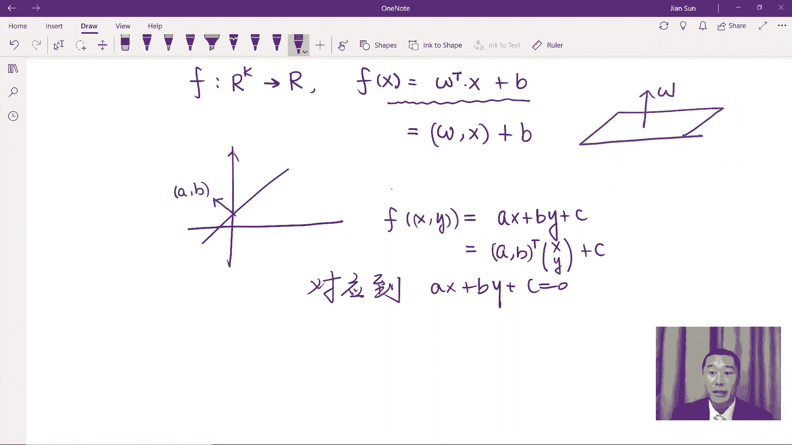

关于线性函数呢。

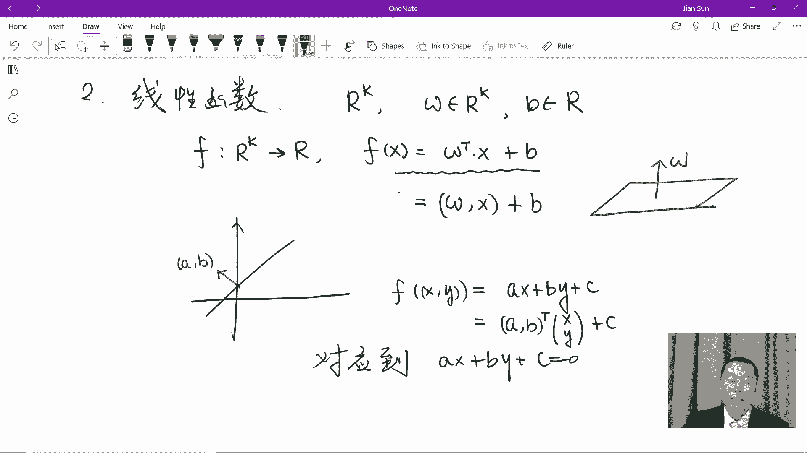

我们来做这样的一个介绍，线性函数很自然的他就会给整个的空间进行了这么一个分类，所有的点落在这个超平面上面的地方和点落在超平面下面的地方，自然的就分成了两类，换句话说，我们现在还回到我们的k v空间。

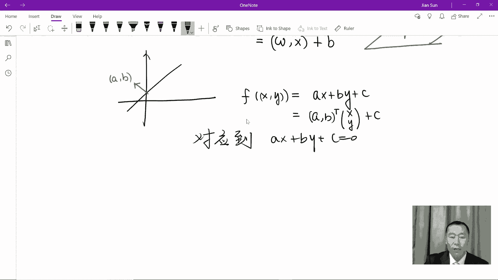

当我们啊没有黑色的，当我们，在kv空间显示成w的转置乘以x加b的时候，我们是把空间自然的分成了两类，一类是这个函数大于零的地方，这是一类，还有呢这是fx，小于零啊，当然还有等于零的。

我们为什么没有说等于零呢，但是因为等于零，就落在了这个线性函数所定义的等于零的那个超平面上，但是那个超平面它的维度啊就已经变成了一个k减一位了，所以相比整个的空间就可以忽略了，就像我们在二维情况下。

一个线性函数对应的那条线上的点，它已经变成一个一维了，所以说我们就可以忽略这条线上的点，我们无论是从这个体积的角度来讲，或者是从概率的角度，概率的测度的角度来讲。

我们暂时呢都把这些点呢就是落在fx等于零上的点，我们忽略，所以忽略这些点之后，我们就把平面分成了分类，分成了两部分，好基于这样的考量。

这是关于线性函数很具有的一种自然的特征，我们回到刚才的分类问题。

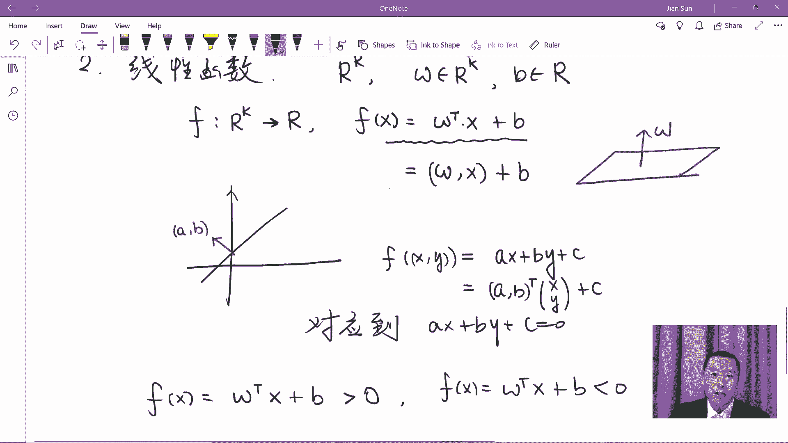

在我们刚才的分类问题里面，我们自然的就会说，如果平面上给了我两种颜色的点，我能不能用一个线性函数，能够把这两种颜色的点画一条直线，在这条两种颜色的点分别落在了这个直线的两端，如果我们能这样做的话。

那么就说明我们找到了一个线性函数，就已经能够自然地区分出我们这个平面上这两种颜色的点。

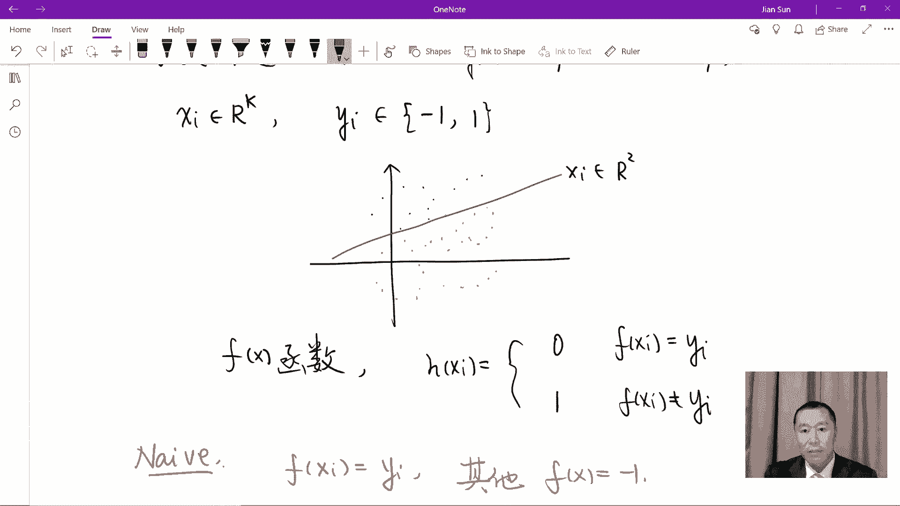

就完成了这个分类了，好我们为什么取线性函数呢。

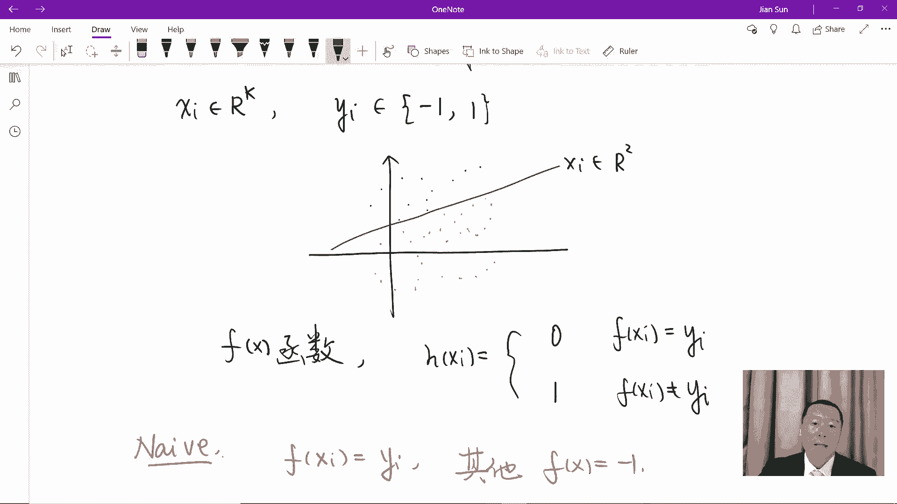

还有一个原因是因为线性函数的参数相对来讲非常的少，我们知道参数少的时候是可以帮助我们过拟合的，现在呢我们把问题叙述一下，感知机的问题，叙述一下感知机，就是回到刚才给出了，这么多的点。

以后其中呢每一个x都是rk空间的，y呢取两个值，我们的问题是，是否可以找到，一个w也是rk空间中的一个向量，使得我们定义一个线性函数w转置乘以x加上b啊。

不仅要找到w还要找到b使得我们这个线性函数满足什么呢，满足在每个点上的分类都合适，我们希望它大于零，我们希望fx i也大于零，如果相应的y i是-1的话，我们是希望啊它大于零，我们是希望它小于零。

总之呢我们有一个另外一种说法，那就是fxi乘以yi是大于零的，对于所有的爱都满足，那么我们说我们就找到了这个线性模型了，这个线性模型第一它是一个线性的函数，第二呢它的损失函数是零。

因为它完成了一个全分类，上述问题就是最早提出来的啊，用线性模型分类的问题，那么解决这个问题的模型就成为最早的这个模型，就成为一个感知机的模型，我们现在来看看怎么样找到这样的w和找到这样的b。

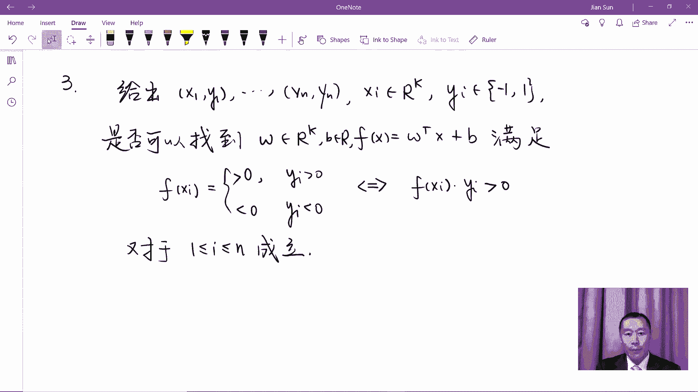

为了简化我们的记号呢，我们现在来简化一下记号，怎么简化记号呢，因为我们现在呢这个模型本身呢函数本身有w有b，我们是希望把wb呢把它放到一起，因此我们引入一个升维的记号，那么现在呢我们引入一个rk加一。

多了一维的一个向量，那么现在就是在rk加一的空间，同样呢我们也引入w啊，w呢就是前面多了一个b，他也是2k加一空间的这个w to的啊。

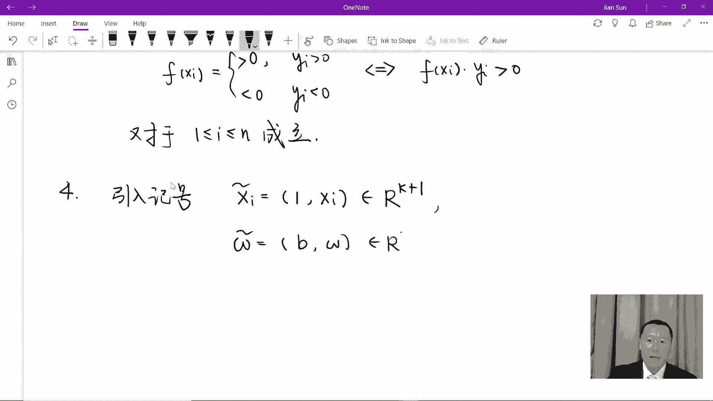

xi q的w to的，所以从而在做了这个记号之后，所以我们现在呢就我们本来就要选去去去寻找w和b分别寻找，现在呢我们把它放到一个向量里面，我们的整个的问题就变成寻找w to a。

我们就把它扩充到一个2k加一为空间，所以说现在仅仅是一个记号问题，问题本身我们就没有必要再去累赘的，每一次加上一个常数了，所以我们现在呢啊就是还引入不要求的几号，但是呢我们心里记住。

其实我们现在用了新的记号呢，已经是在旧的记号上进行了，意味着扩充，我们还引用就是旧的记号啊，不要用q的，所以我们现在的问题就变成了，fx就是没有写cut了，但是呢还是我们没有用q的。

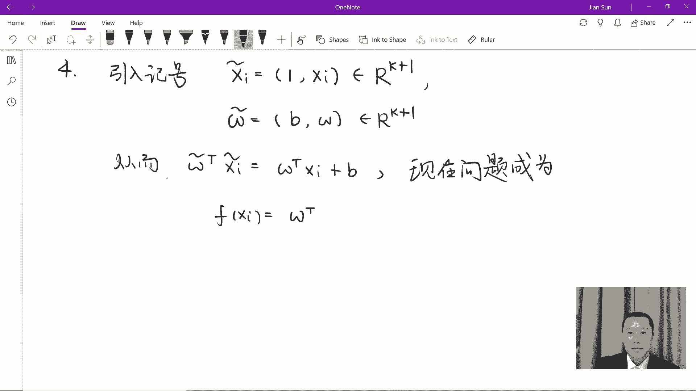

我们现在的问题呢就是寻找这样的一个函数，使得对每一个爱fxi乘以yi都大于零，问题呢又进一步得到了简化啊，至少现在我们把常数也扔掉了，现在我们就来看看怎么找这个这样的这种w吧。

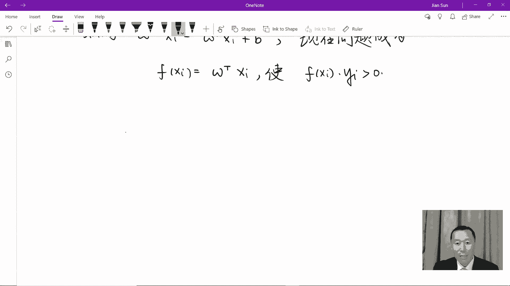

为了寻找这个w呢。

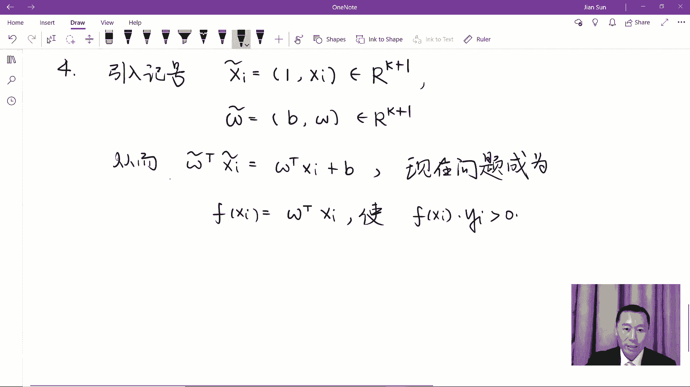

我们来从直观上想一想，我们进行一个直观的探索，如果说我们现在有了一个w，这个w呢没有完成正确的分类，换句话说呢，我们现在就是已经有一个w w的分类呢有错误，也就是说有一个比如说叫做xn。

原本呢y n呢它是大于零的，但是呢w的转置乘以x n却小于零，换句话说分类错误，那怎么办呢，那我们能不能定义一个新的w，定义一个新的w比如说我们定义一个新的w一撇等于呢w呢加上x n。

我为什么想这样定义呢，因为这样w一撇的转置乘以xn，它就是w的转置和x n的成绩，加上xn和xn的那一季好，xn和xn的内积，当然它要大于w的转置乘以x，换句话说，如果说原来我的w分类不正确。

我们把一个明明是等于正的，其实我们把它分成负的，那么现在呢我就让过了，调整我的位置，我加上一个x n，使得我新的这个位置上。

我们来画一个图，大家可以看得更明显啊，如果说原来啊w这个二维我们画一个二维的图，这是原来的w啊，他和x它的内积呢是负的，那么所以说呢这个x n呢可能是在这儿，但是呢我们应该让x n和它的内积成为正的。

所以我们现在怎么调整的呢，我们现在把w往这个方向去拉动，往x n的方面去拉动，我们拉动到一个新的，当然我们这边拉动就做了一个平行四边形法则，就是说等于是我们把w换成了w一撇了。

这样的话新的w一撇和xn的内积就比以前更加大了，当然如果这样的拉动不够的话，我们还可以继续往新的w x n这边去去旋转，去转动，其转动的方式就是去加上若干倍的x n好，这是一种这情况。

如果是另外一种情况呢，我们再看还可能是第二种情况啊，第二种情况，这是第一种子情况，第二种情况呢就是原来的我们的分类是正的，但是呢yn呢却是负的啊，这个呢比较好办，我们也可以来画，就是原来呢仍然这是w。

原来呢这边呢是x n，它们的内积是正的，但是呢x n呢应该被分为负的，所以这个时候呢我们是希望把w呢是往相反的方向旋转啊，成为一个，到这个地方，使得它和x n之间的内积呢变成负的。

所以我们这个时候就可以定义，x一撇就等于w一撇等于w减去x n m，因为w一撇的转置乘以xn就是w的转置，x n减去x n和自己的内积，因此就比以前要小了。

就是有可能使得这个新的法向量和xn的内积变成负的。

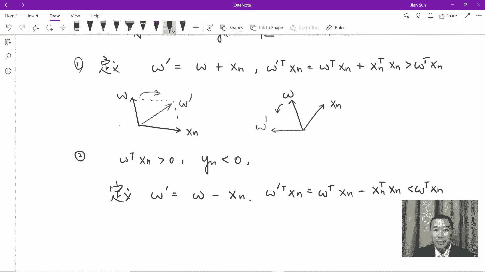

综合两种情况，我们来，给出一个完整的更新，我们把两种情况综合在一起，我们可以说在分类错误的那些点上，我们总可以这样，来对w进行更新，因为我们看到只要是分类错误的点上yn大于零。

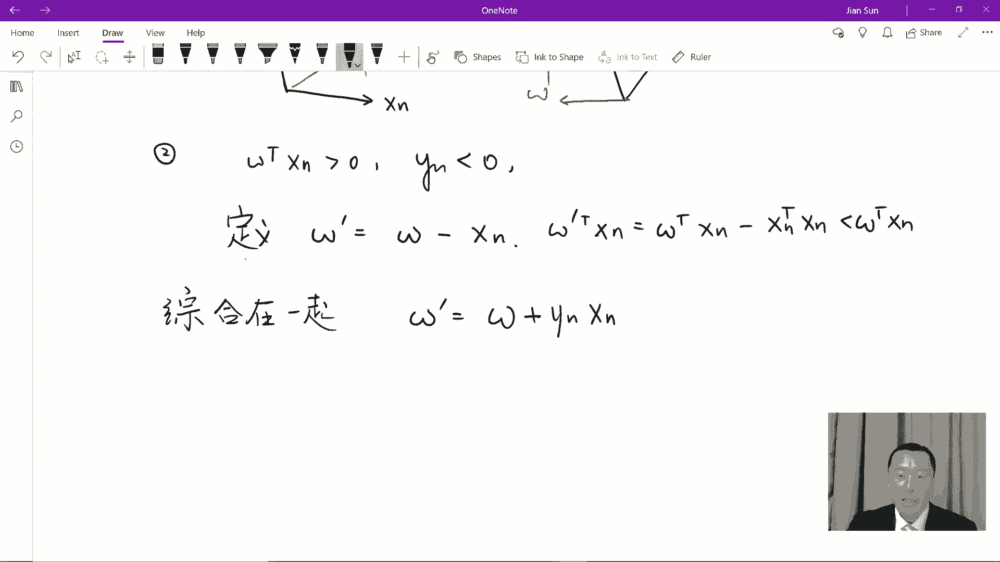

那我们就是加上x n y n小于零，我们就减去x n，因此它就等价于加上了一个yn乘以x n好。

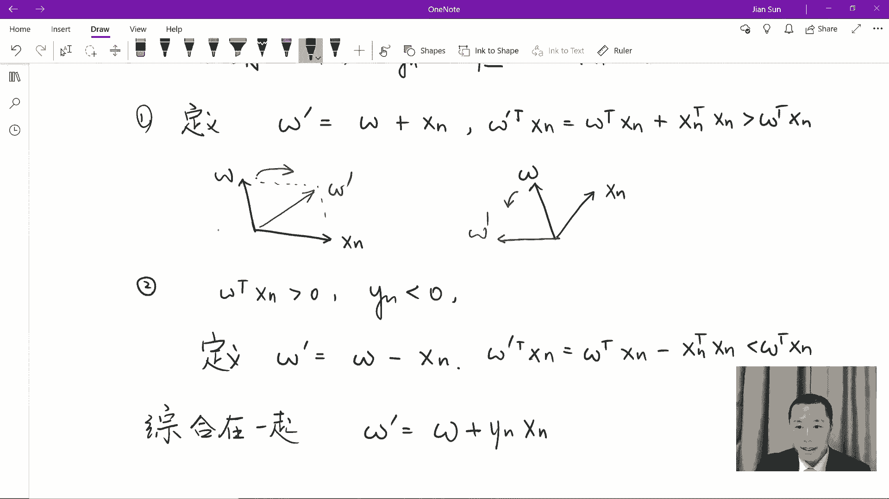

我们这是在做什么呢，我们这是在做迭代，我们是希望什么呢，这是第五点啊，我们是希望我们的目标，或者说我们的希望是使得迭代若干次之后，不断的是不断的进行这样的更改，若干次以后，完成正确分类。

我们看看有没有这种可能迭代啊，我想说我们并不是第一次遇到了。

其实在数学中我们遇到过很多次迭代。

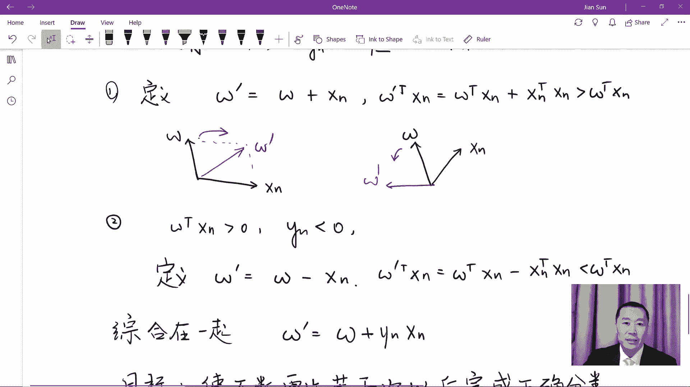

我们这里面写一下，第六关于迭代，我们来说一些迭代的问题，我们并不是第一次遇到，我们这里面举几个小例子，大家还记得吗，连续函数第一个小例子，关于连续函数的零点问题，我们有一个连续的函数。

它在a点他从a到b是定义的，但在a呢是负的啊，在b呢是正的，我们得到这样的一个函数，那么连续函数它肯定中间有一个点是等于零，可是我们怎么把中间的这个点找出来呢。

我们当时呢就是用一种方法，就是不断地利用迭代的方法，不断的去寻找它中间的点啊，我们当时在我们数学分析教科书上是来看二分之a加b就是终点，如果终点你发现和b的函数值是一样。

那我们就把迭代的区间呢就缩小到了啊，从a到二分之a加b了，然后我们继续再看终点，不断的去缩小，重新不断地去定义我们的左右两个区间，使得我们左右两个区间的符号永远相反。

这样区间就会不断收敛到我们要找的那个零点上，对这是一种迭代的方法，我们看到去寻找连续函数的零点啊，我们呢不仅是从理论上，而且是在实践上，我们就是在用迭代逐步的更新的方法来得到，我们再看一个例子啊。

牛顿迭代法，你比如说这是对于连续函数，我们对于可微的函数呢就更好办了，牛顿迭代法，是寻找fx 0点的另外一种方法，牛顿迭代法其实是这样的一种想法，我们同样还是有个fx，它有一个零点。

但是我们怎么找到它的零点呢，我们先随便找到一个点啊，从这个点上，比如说这个点是x n在这个点上呢，我们在fx上去做切线，和这个函数相切，切线呢在和x轴的交点，我们就得到x n加一，在牛顿迭代法中呢。

就是不断的有一个迭代公式，x n等于x n加一等于f啊，等于x n啊，减掉f x n啊，f除以f一撇x n不断的迭代，最后呢在一定条件下，我们一定可以收敛到这个函数的零点，在一定条件下，我们可以证明啊。

这个xn收敛，到零点，到这个比如说x我们叫做x无穷吧，使得f在x无穷这个点呢等于零，就是我们要的那个根。

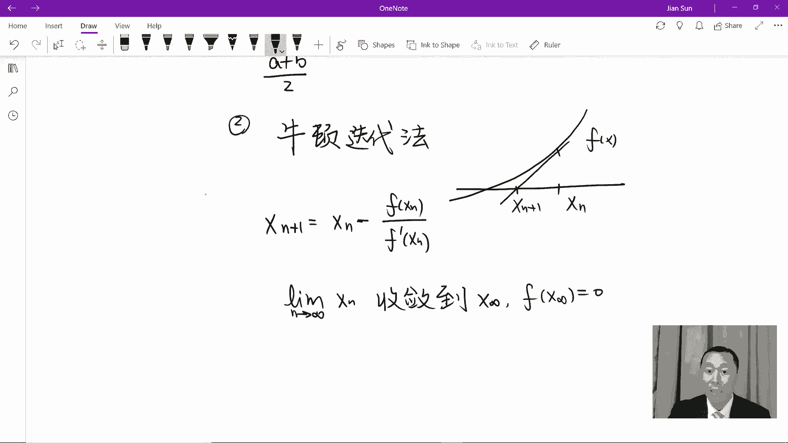

所以咱们看到我们在数学中迭代的方法并不陌生，迭代的方法呢不仅有效，而且呢它就是一种逐步的学习的过程，使得我们逐步的一步一步的靠近我们所要的越来越逼近，好我们现在就回到我们的感知机问题来。

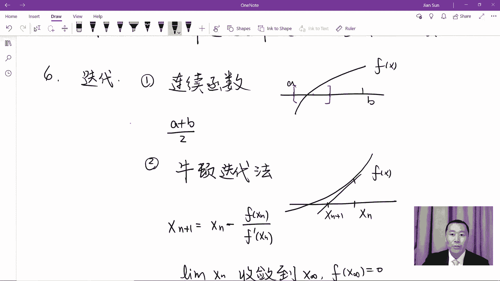

我们来看我们能不能证明迭代的方法在我们的感，在我们的分类模型上是可以的，换句话说，我们刚才定义的那种迭代方式，能够最终让我们找到一个呃法向量，使得这个法向量所定义的线性函数可以完成全这个完整的分类。

为了让这件事成为可能，我们还得加上一个假设，这个假设就是说原来本来给出的平面上的这些点啊，或者空间中的这些点本来就是可以完全分类的，如果他们不可能完全分类，就是红点和黑点完全是混杂在一起。

根本就不可能完整分类，那我们怎么迭代，那也不可能好，所以我们在这里呢完整的叙述一下我们的感知机问题，就是这样，我们来叙述一下本来就存在刚才给定的那些点啊，还是这些点在这些点上啊，一是小于等于a。

小于等于n的本来就存在，我们叫做aw一撇儿，使得，对每一个i都成立啊，对每个i都成立，我们现在定义我们的迭代过程，我们的定义我们的迭代过程就是这样，从任何一个，w0 开始，你认给一个哪个都无所谓。

就就是说在上面这个假设中。

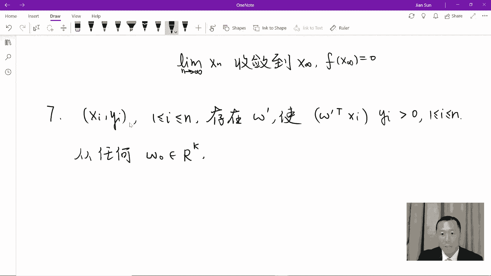

虽然存在一个w一撇，但是我们不知道w一撇在哪，我们只知道它的存在性，我怎么找呢，我们先从任何一个w0 开始，然后我们来看若啊w0 ，它已经完成了全分类了，每个i成立，那么结束，因为我们已经找到了，不然。

一定有，一定有一个x比如说我们就称为是x0 ，一定有一个x0 啊，这个啊不是我们称为x1 ，sorry，我们在这里面把它记好，一定有一个x一啊，就是刚才我们那些点中的一个。

那么这个万一啊和这个w0 转置乘以这个x1 ，它呢是负的，我们定义我们来定义我们的迭代过程，定1w一就使得等于w0 加上y一被乘以x1 。

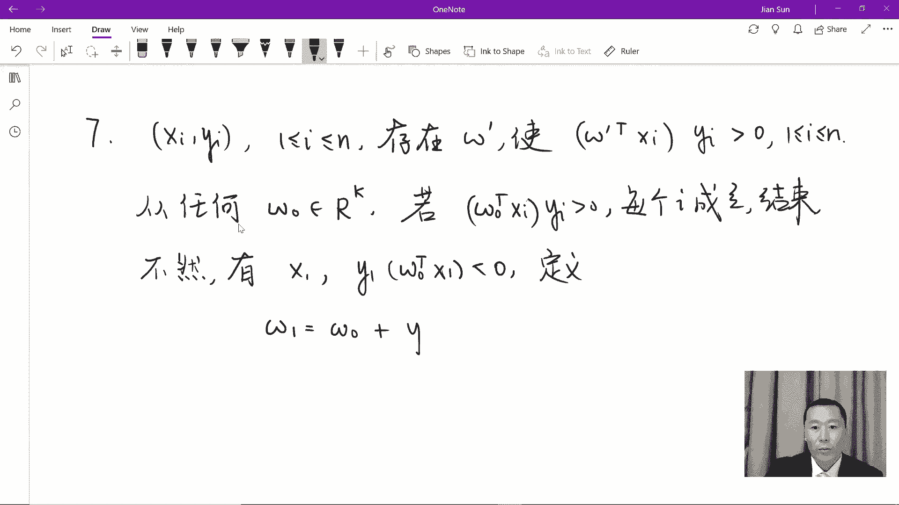

同样如果这个w就完成全分类了，那就结束，如果w一没有完成全分类，那就肯定有x2 ，使得在x2 上w一没有完成全分类，这样的话呢我们就更新w2 成为w1 ，加上y2 x2 。

这个x2 在这里面这个x2 啊就是使得w一上没有完成全分类的点，好我们就延续这样的过程一，一般来讲啊，我们从w n完成全分类，那我们就完了，如果没有完成全分类，那么一定有一个叫做xn加一的点。

使得他x n上在上面没有完成全分类，这样我们就更新到w n加一。

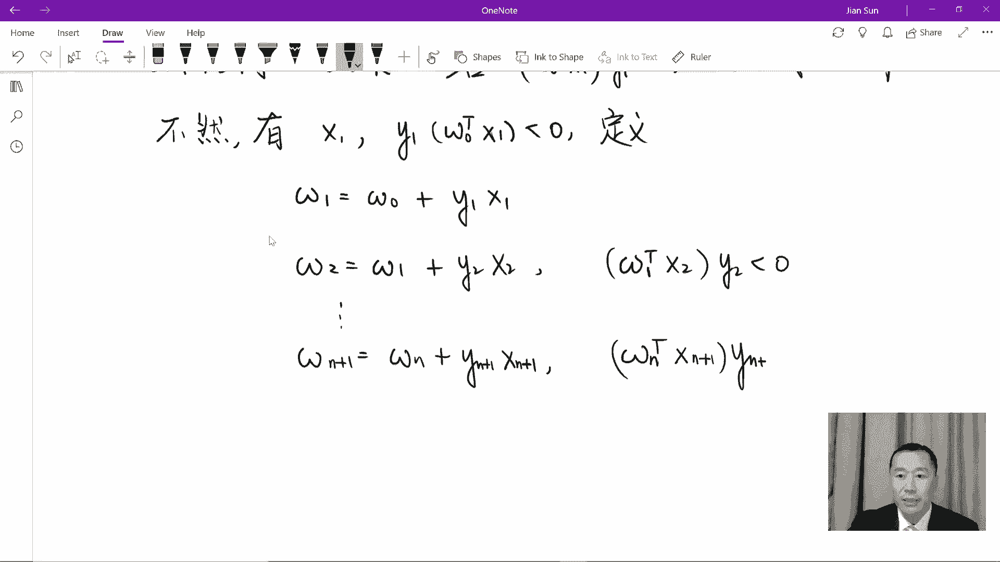

这样的一个过程一定会停止，一定会终止，在有限步终止，他还跟我们收敛不一样，他一定会做了有限步就停止了，也就是有限步后终止，换句话说我们就找到了那个最优分类的w了。

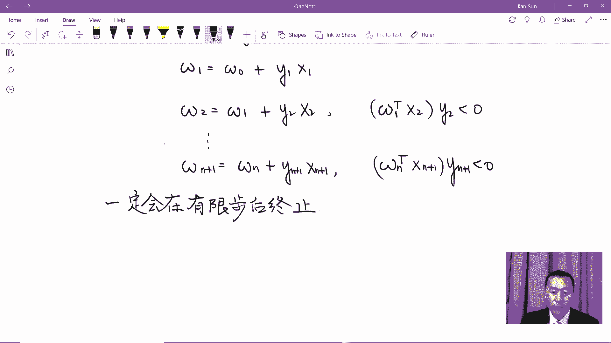

好我们现在的感知机就是说明这件事情就是对于可分类的点，我们利用这样的一种迭代方式，一定能够去找到我们最后能够分类的这样的一个超平面。

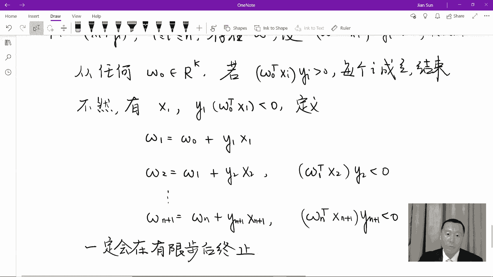

我们现在呢就把这件事情呢给大家证明一下，不仅证明了，而且呢要回去呢利用python语言呢我们实践一下，自己写出感知机的模型，因为这是我们将会是我们的第一个真正的机器学习的模型好。

我们来看一看为什么会是如此，因为我们学习机器学习的模型的关键就在于，不是说我们去如何调取软件核心，我们应该知道这个算法是什么，为什么会成立这个算法的优点缺点，它的计算时间啊等等。

这些才是我们机器学习学习的核心，好我们现在来看看怎么证明这一点呢，我们来看两步。

第一我们只是把要点记在这儿，因为我们有w n加一，等于w n加上y n加一，x n加一，这是不能够正确分类的点啊，我们来更新一次，我们根据线性代数啊，我们两边呢取这个内积模长，我们就会得到w n加一。

它的模长就是自己跟自己的内积呀，它就是w n和自己的那个内积，加上呢x n加一啊，自己的内积再加上两倍的啊，yn w n的转置乘以x n加一，我们来看一看，我们注意到这个最后这个是负的。

这是因为w和w和x n加一是没有完全正确分类的啊，所以说整个最最后这个是负的，它是小于零的，它小于零，我们就会看到整体的它就小于等于的n的平方，加上x n加一的平方，这个x n加一啊。

这个x n呢n加一也好，反反复复，他可能会反反复复的出现，第一次更新之后，我们利用了一个x，后来又更新了若干次，发现呢到了这个x它又分类错了，我们又开始做一次，但无论如何。

这个x就是刚才那些x其中的一个，所以呢所有那些x我们在这里面啊，它有一个上界，所以这个里面呢我们就会等于一个常数，这个常数我们就叫做a好。

你看从w n加一的模长，它就被w n的模长加上一个a，那当然呢那w n呢我就可以到下面就是w n减一，那就指出来又一个a，所以最终呢它会小于等于n个，可能又加上了一个常数，b最初的那个w0 没有关系。

在这里呢a和b是常数，而且呢是大于零的两个常数。

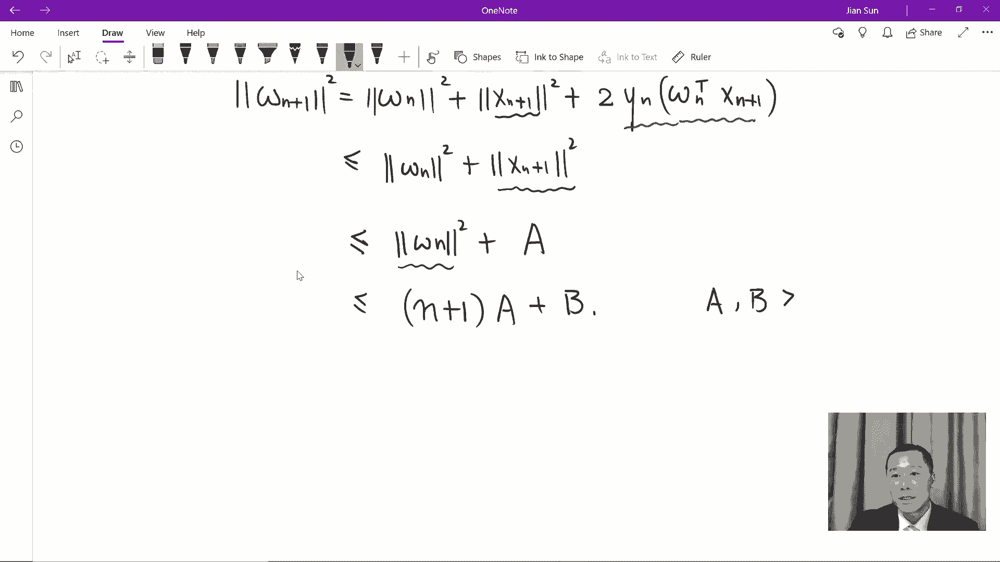

一方面我们会看到，无论我们怎么更新啊，这个w的模长是呈线性增长，模长的平方呈线性增长。

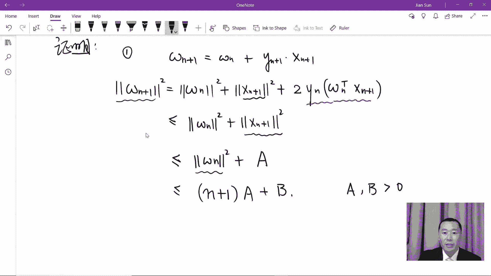

这是重要的一条性质，我们现在再来看第二部分，第二部分我们再把更新的公式写在这里面，我们怎么利用存在一个可分类的超平面那个w一撇呢。

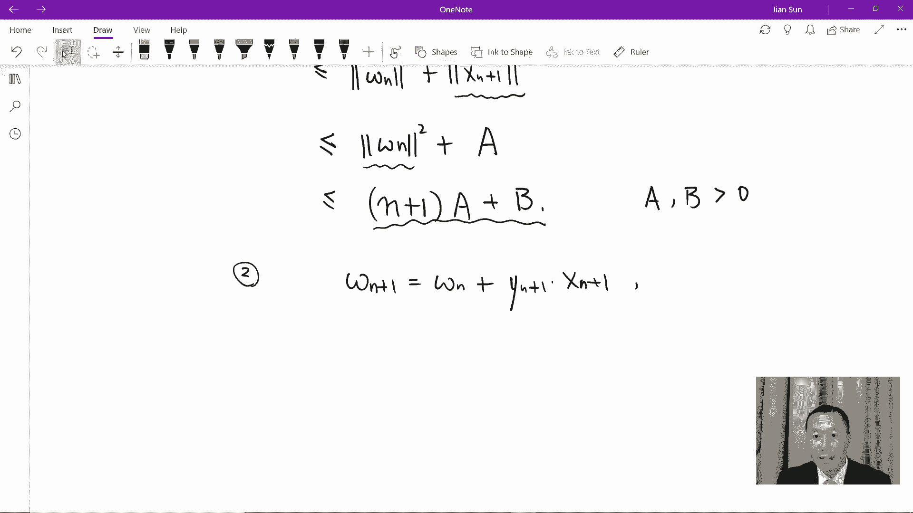

我们把存在的那个w一撇，我们乘到两边啊，和两边做内积，w一撇和w n加一，它就是w一撇和w n加上yn加一，w一撇和xn加一一撇是正确分类的点，因此上整个的这个值都是大于零的，所以我们会看到啊。

它呢整个的是严格大于零的，所以说这个点就是严格的大于等于w一撇和w n加上一个常数c，这个常数c也是一个大于零的常数，无论多小，但是它大于零就够了，好我们这样呢又可以得到不断的往下迭代，迭代n次。

我们就可以得到n个c可能最后加了一个常数d这个c呢是大于零的，d呢可正可负无所谓，关键是前面的这个n倍的c好，另外一方面呢w一撇和w n加一的内积呀，它有个性质。

它的这个内积呢是小于等于每一个的模长的成绩，每一个的模长的乘积，因此上呢我们平方以后啊，这边就是nc加上d的平方，小于等于w一撇的模的平方乘以w n加一的模的平方，但是。

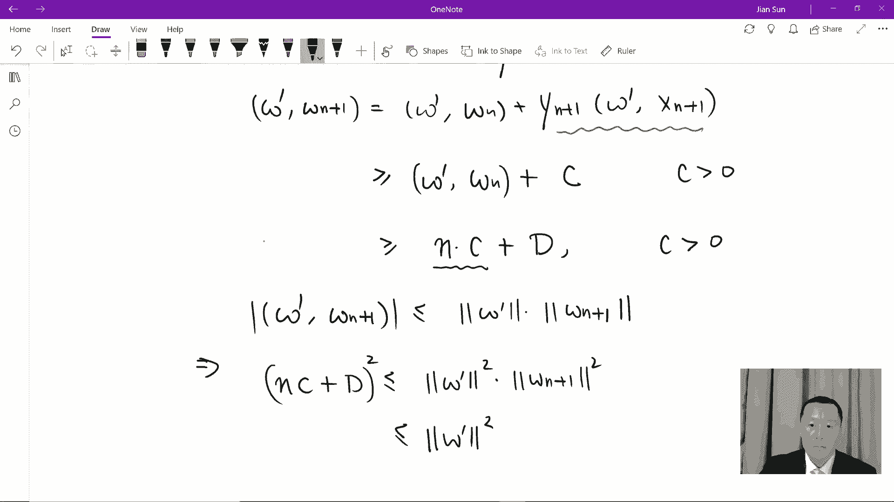

w n加一，我们看到他的增长方式，根据第一步是个线性的增长，所以说这个里面是个n加一倍的a加上b我们看到问题来了。

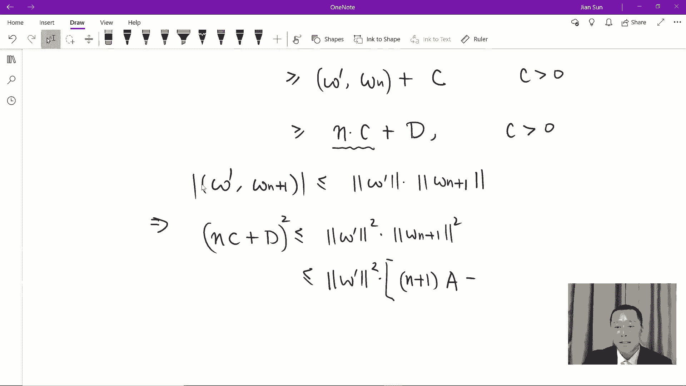

在我们眼前的这个等式中啊，左边是n的平方的一个等式，而且呢系数c的平方是正的，右边呢是n的一个线性函数，如果我们真的这个过程不断的延续下去，那么这个n就会越来越大，越来越大，越来越来越大。

但是左边乘n的平方增长，右边是线性增长，所以n可能趋向于无穷，必然这个不等式在某个n就会被打破，从而，不可能，趋向正无穷，所以迭代过程，会终止，那么终止的那个w就是全分类的，我们的问题得到了证明。

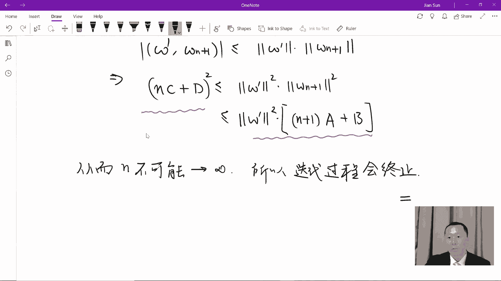

好在这里面呢我们给大家证明了提出了这个感知机分类问题。

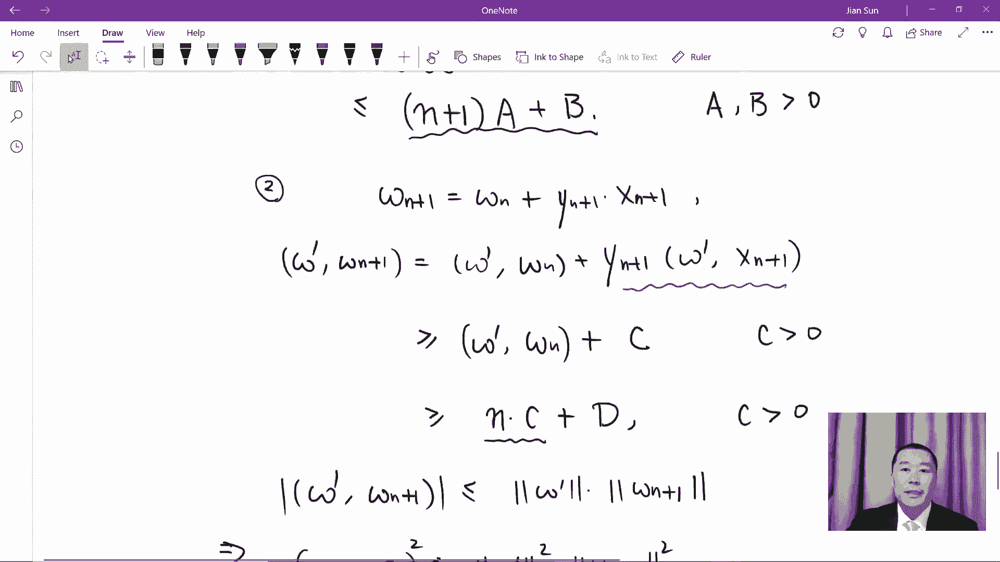

而而且呢我们从这个分类问题呢，为大家解析了，我们如何用线性的函所定义的超平面来解决这个分类问题。

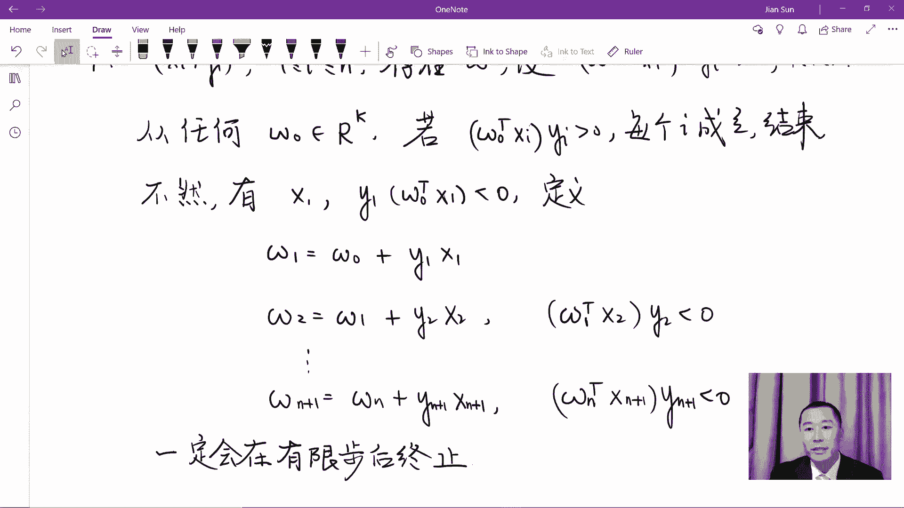

我们提出这个问题，自然就要想办法解决这个问题，我们就要从数学上说明这个问题是如何可以得到解答的啊。

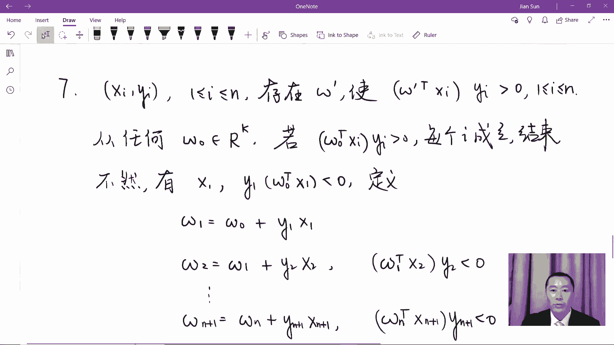

是而且呢是怎么得到解答的，到我们解决这个问题的方式呢，就是用逐渐逐步更新的问题过程，而逐步更新呢，我们在数学上并不是第一次遇到啊，甚至呢我们到目前为止其实已经遇到过很多次了。

我们在以前连续函数1牛顿迭代，我们都是一种逐步更新的过程，但是在连续函数和牛顿迭代的时候呢，其实还稍微有点不一样，那个时候的迭代呢是做了无穷次。

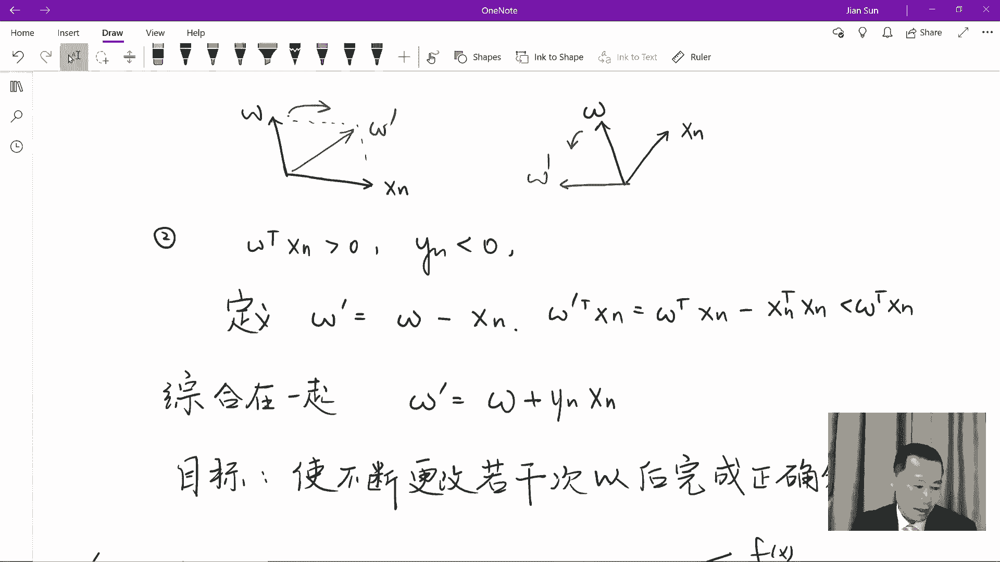

我我们在有限个点，而且是可分的这些平面上的分类问题。

我们证明了是，事实上我们的现在这种迭代过程，只要迭代有穷次，就一定可以正确地分类出来，我们现在这个算法是不是最优的，大家在作业中还可以进行探索，我们的作业呢提出了几种不同的把这个更新过程迭代的过程呢。

我们做了一些修改，大家会看到在某些改进后的迭代过程中，其实我们收敛的到最终的那个最优的那个分类的w会更快速好。

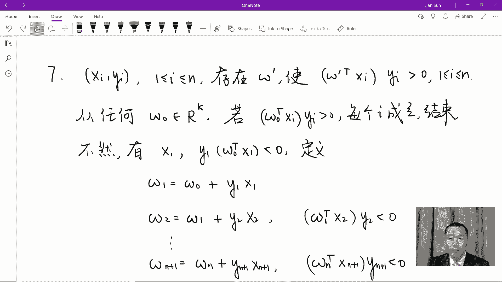

我们今天的课程就是讲的内容就是这么多。

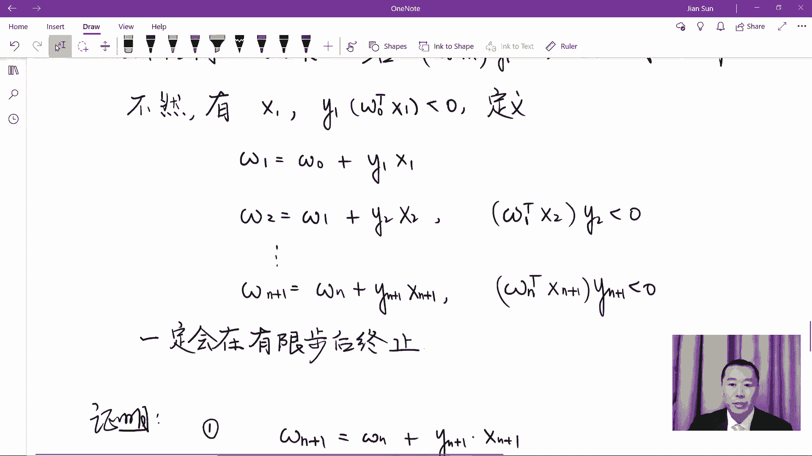

接下来呢作业呢会布置给大家啊，希望大家用python来亲自的来实践感知机模型，以及感知机模型的各种的变形。

