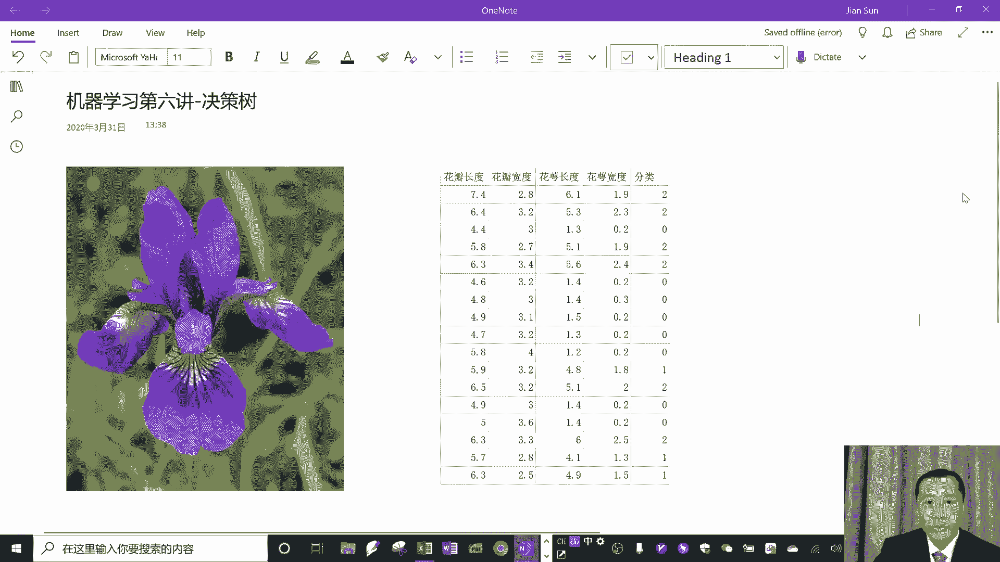
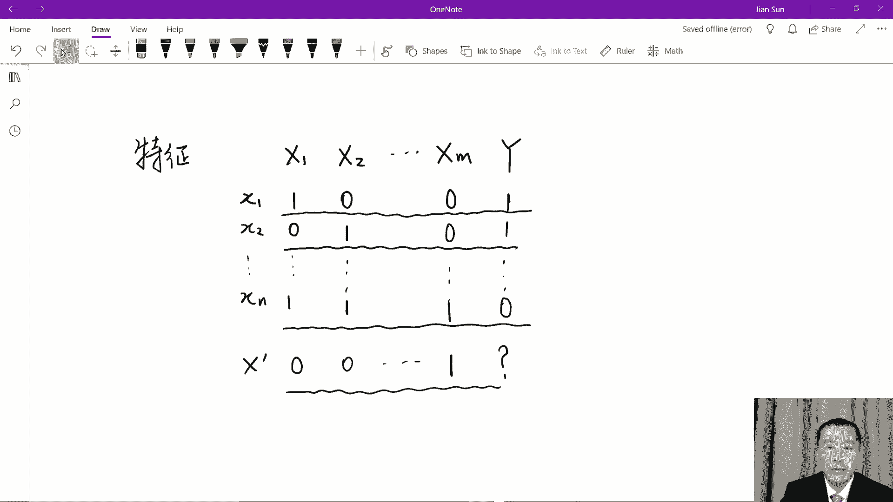
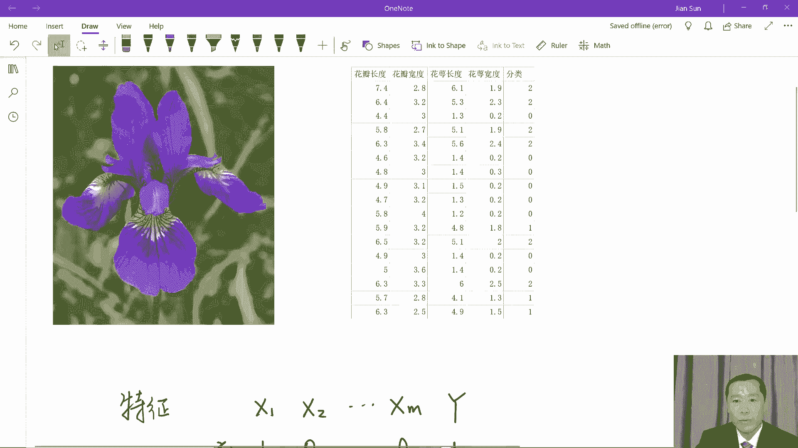
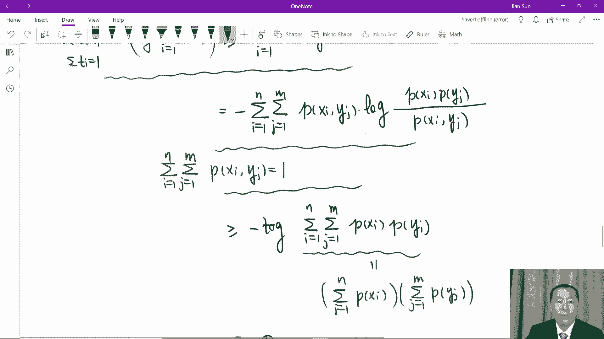
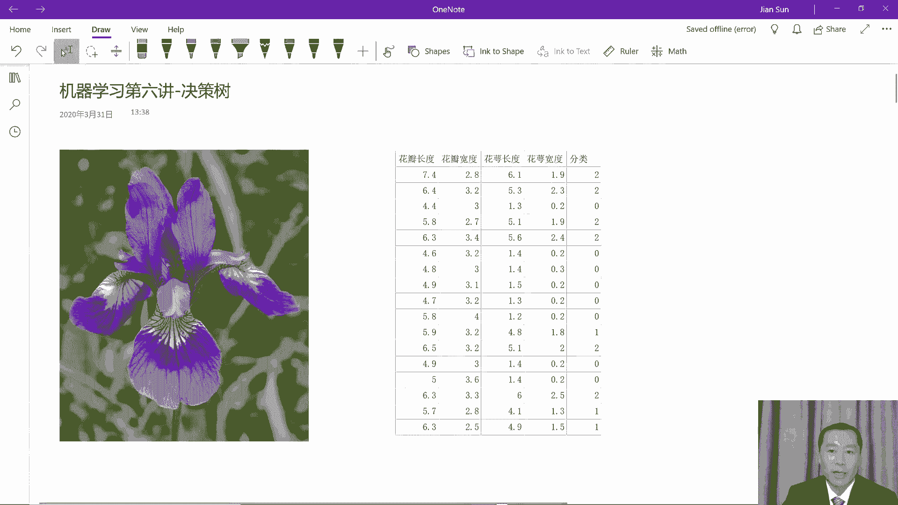
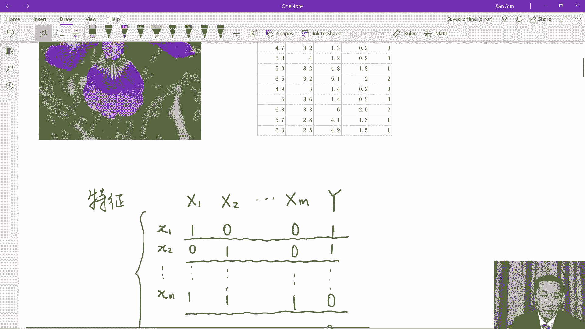

# 复旦大学经济学院《机器学习与量化投资》（Spring 2020） - P6：Lecture 6 Decision Tree - ___main___ - BV1fv411r7z1

大家好，我们今天呢来进行机器学习的第六讲，我们今天讲的算法呢是机器学习中一个很传统，同时也是很经典的一个算法，是决策树的算法，同时大家也会看到，这也是我们在前期讲了很多的线性算法，比如说感知机线性规划。

线性回归，逻辑回归以后，真正要开始进入到非线性算法的，那么第一个非线性算法好，我们看一看什么是决策数，首先在我们眼前呢给大家呈现一个picture，同时呢一组数据，这个picture呢啊是一朵这个花。

那个花的名字呢叫做鸢尾花，英文呢是iris，那我们当然今天不是来讲植物了，所以说我们并不是说对这个花的嗯，它的这个来龙去脉感兴趣，我们呢特别是借助这个花，同时借助它的数据呢来讲决策树的算法好。

在这个画的旁边呢，我们看到是数据什么样的数据呢，这个数据其实是在我们机器学习在网上公共的数据集上都可以下载的，这个数据呢是一共有150组数据，每一组数据呢就像在我们眼前，就是每一行。

每一行呢我们分别给出这个花它的四个特征，它们分别是花瓣的长度，花瓣的宽度，画a的长度和画a的宽度，那么最后一栏呢就是这个花呢给出一个分类，这个鸢尾花呢大概在生物上呢可以分成若干类。

在我们眼前的这个数据呢就是把这个鸢尾花分成了大概的三类啊，我们这里呢也不是说具体的哪三类了，总之呢他们之间在生物的特征上呢可能略有不同，分成这三类呢，在我们的数据上就以012分别来代表这三类花呃。

具体哪一种花分成是零，哪一种分成是一，哪一种分成是二，在这里呢没有把它们之间的关系呢明确给出来，所以我们的目标就是使用决策树的方法，想办法把它们从前面的这四类特征，就是花瓣的长宽，花萼的长宽。

最后呢能够把它正确地分出这是哪一类的院美化来，同时刚才我说了，这个在网上公共数据集上，每个人都可以下载，那么这个数据一共有150组，但是我们这里呢仅仅是截取了前面的这么一小段啊，这个数据呢还有比较长嗯。

真正的去调取这个数据呢，大家在python里面很容易的去调取，好好，那我们来看看决策树是什么样的一个算法，一般来讲啊，我们给出的这种分类问题呢，就像是鸢尾花的这个分类数据一样。

一般来讲这个分类数据除了鸢尾花眼前的这个数据呢。

可能是这样的，我们比如说啊有若干啊某一个带分类的问题，有若干个特征，我们叫，那么这些特征呢我们可以分别写成大的x一这个特征，大的x2 这个特征一直到大的，比如说xm这个特征。

最后的label呢就是以y来表示，这就是我们监督式学习，最后呢就是样本内它的label嗯，我们呢给出了很多组数据，这些小数据呢我们分别叫做x1 x2 等等。

一直是x n每一行数据他们都会带有大的x1 x2 ，一直到大的xm这么多的特征，比如说啊我们眼前的这些特征既可以像院尾花似的啊，它具有一种连续性的特征，那同时呢我们眼前这些特征也可能具有非常离散的特征。

比如说啊啊每一个特征都是分别取零啊，101这两个值，那么这是大的x一的特征，那大的x2 的特征呢也可能只也只取零一这两个值，那最后一直到最后一个特征呢可能也是这样，最后这个分类呢它可以是二分类。

换句话说分类也只取零或者是取一，它也可以是多分类，就像是鸢尾花的分类是它可以分成三类啊，在这里呢比如说我们也是让他二分类，那就是既可以取零，又可以取一，所以一般的这个带分类的数据集呢可能就会长成这样。

它有若干个特征啊，每一个特征的取值呢可能是取连续的值，但是呢一般来讲我们使用决策树的时候呢，大多数情况呢他们还可能更加的取离散的值好，所以这样的一种啊样本类的这种特征给到我们我们的目标啊。

是去学习跟我们以前一样去学习这些数据，特别是从特征到最后呃，label也就是标签它们之间的关系，通过这些关系呢，我们再给出一个新的，那你比如说x一撇儿，我们再给出一个新的特征来。

我们呢试图去预测它的应该归属的那个分类，那么决策树为什么说它是一种非线性的想法呢，是因为决策树这个想法跟我们以前呢不大一样，我们以前是试图去学习一种线性的关系，从数据到最后分类的结果。

我们去寻找一种线性的关系，那在决策树中呢，其实我们是那么在决策树中呢，我们是是先不从横向来看，我们想呢先从纵向来看，也就是说我们想看看第一个特征，第一个特征它不是分成啊，在我们眼前啊。

这个问题第一个特征就是大的x1 ，它的取值不也是离散的吗，好我们就试图呢想看一看他的这个离散的特征跟最后的呃label，跟我们最后的这个y他们之间就有一种什么样的关系，换句话说呢。

我们想看看大的x一能不能就对最后的这个y有一种预测的作用，那同理呢我们也想看x2 到y有没有一个预测作用，或者说xm到y有没有一个预测的作用，那比如说我们回到刚才认为花这个例子啊。

我们看到一眼看上去我们就着重看最后一个栏目，比如说花萼的宽度，我们注意到啊，花萼的宽度在第三行，如果是0。2的时候，分类是零，我们在接下来看啊，花的宽度，0。20。30。20。2啊。

最后对应的这个分类呢都是零啊，当然了，我们没有去看全体的数据，但是眼前的这些数据似乎就提醒我们，其实可能花萼的宽度对于最后的分类啊，就具有一个比较决定性的作用了，所以相比较其他的特征。

很可能呢花萼的宽度是一个对于分类起一个非常重要的作用。

那同样一般的问题也是我们是去寻找啊，某一个特征指导我们分类可能是最有用的，如果我们找到了这样的一个特征，那么也许我们就先从这个特征出发，可能对于我们最后寻找一个正确的分类就已经很有帮助了，基于此呢。

决策树是这样的一个想法，就是我们从最开始啊，就像我们在计算机算法里面是我们去试图构造一个数，那么这个数是什么样子呢，通常呢是一个二分法的数，比如说我们从这个数的最开始的这个节点，我们一般呢叫做根节点。

这个根节点开始啊，也就是说我们还什么都没有分类呢，我们先从这儿呢来进行二分，从这个根节点我们选择一个特征，比如说我们选择x一这个特征，根据x一取不同的值，我们就可以分成了两大类，你比如说x一取一。

或者呢是x一取零，我们根据x一取一，我们把所有x一取一的那些结果放到这个子节点上，把x取零，所有的结果对应的那些标签的结果放到这个子节点上，那这样一来呢。

我们就建立了这么一个简单的这么一个所谓的binary tree，从什么还没有分，根据一个特征，我们就先把最后的结果呢分成了两大类，我们再从每一类开始，比如说我们从左边这一类开始，我们使用x2 这个特征。

我们使用x2 这个特征呢可能又会分成两大类，一类呢是x2 等于一，一类是x2 等于零，那这样一来我们看看我们又分成了两个子节点，我们在最左边这个子节点就对应所有的是特征等于一，第一个特征等于一。

第二个特征也等于一的那些结果，那么往右边的第二个这个子节点，它就对应了第一个特征等于一，但是呢第二个特征呢等于零的所有的那些结果好，我们再看看，再往右边走啊，右边呢还是对应x一等于零。

第一个特征等于零的那些点，在这个点上呢，当然我们也可以再去看第二个特征，但是并不是说我们必须去看第二个特征，也许在这个点上我们开始使用第三个特征也是可以的，也就是说对于x一等于零的这些分类的结果。

我们也可能更好的是去用x3 这个特征再去甄别它的子类，比如说我们又可以分成这边就是x3 等于一啊，这里面呢就是x3 等于零，这样呢我们又分别得到两个子节点，你看我们从开始没有分类开始。

我们依次的使用特征，我们最后呢得到四个子节点，如果这四个子节点我们不再继续划分了，那这个时候呢我们又可以称为这些呢为叶节点，就是叶子啊，因为它们确实已经成为就像是树上的叶子似的，所以说呢我们从根节点啊。

最初我们叫做根，那么到了后来呢呃我们又得到了两个子节点，从两个子节点又把它们看成是新的根节点呢，继续的往下分成若干小的子节点，直到最后我们不分的时候，那我们就得到了叶节点啊，这就像叶子一样好。

如果说呀咱们在最后在我们眼前的这四个所谓叶节点上啊，所有的分类就停止了，那什么时候停止呢，比如说啊所有的y在这里面都取一个值了，你比如说所有的y在第一个夜间点上都等于零了，第二个叶节点上都等于一了。

第三个叶节点上都等于零，第四个叶节点上全都等于一了，那我们分类不就结束了吗，我们已经没有必要再从任何一个这些叶节点再去用特征，再继续往下分了，因为我们的分类到此就全都分好了，这就是决策树的基本的想法。

那么为了去我们把这个算法呀说清楚，不可避免的呢，我们在这里呢就要引入一些数学的概念，而这个数学的概念很有意思，这就是概率中熵的概念，所以从现在起呢，我们就给大家介绍什么是概率中的商。

这对于我们去理解真正的理解这个决策树是至关重要的，好，那么这是决策树的基本概念，那么接下来接下来呢来介绍上，我们在这里呢利用离散的概率来为大家介绍上，首先我们来看假如说在一个概率空间啊。

这是一个概率空间，在一个概率空间中，我们有两个离散的随机变量，x y都是随机变量，所以离散的随机变量就是x呀，它只能取离三个值，y呢也只能取离三个值，比如说x取值，他取我们称为小的x1 ，小的x2 。

一直到小的x n啊，注意到我们现在的讲了，跟刚才是两码事了，所以说不要把现在这些x一到x n啊，跟刚才我们讲的决策数中相混淆，我们现在呢就是纯粹来讲数学中概率的熵的这个概念，好y呢你比如说也取值啊。

它也要取一些离散的值，小的y1 y21 直到y的m，所以x呢可以取n个值，y呢可以取某个值啊，那么现在我们就来看一看，那这样的话我们分别定义小x呀，它的这个概率呢我们就写成小的p x i。

这是为了记号的简便啊，同样那么y作为一个随机变量，它取小的y g的时候呢，我们用小的y小p啊，yj来代表，当然既然这些是所有的概率，根据全概率公式，从一到n的求和当然就等于一，同样小的p y j啊。

这个j呢从一到m所有的求和呢也是一，这就是全概率公式，这个小的概率都是大于等于零，小于等于一的这么一个实数的值，所以我们现在呢就有一个离散的两个离散的随机变量，我们分别定义了这两个离散随机变量。

它们的分布，marginal的ribution，那么我们现在就要来看他们的联合分布，同时y这个随机变量取小的y g的时候，我们定义这叫做小p x i y j，这是他们的联合分布啊，当然既然是联合分布嘛。

我们知道嗯，举个例子啊，小的p x i当然它就等于在联合分布x i y j，所有的j所有可能的j加起来，我们就得到了它的边缘分布，就是x这个随机变量的边缘分布，那同理啊，那这个小的y j呢。

当然就是所有的联合分布里面啊，这个i从一加到n就得到了y这个随机变量的边缘分布，我们有了各自x和y各自的边缘分布，我们也有了它的联合分布，那么我们现在来想一想什么是条件概率，比如说我们想问。

所以这个y啊取了yj了，我问在这种情况下，咱们回想一下条件概率的定义啊，或者是贝叶斯公式啊等等的，那它其实啊就根据定义，它就是说x要取成小x i y呢要取成小yj，同时，同时要除以y要去小y j好。

那就等于什么呢，用刚才我们的记号，那就是小的啊，p x i和y g除以小的，好我希望大家呢不要被眼前的符号呢所混淆，我们用这样的这个符号就是小写的p x i y j等等的。

就为了方便的来表示我们这两个随机变量它们的分布以及联合分布，边缘分布，它们之间的关系啊，好所以一方面呢我们就根据条件概率的定义，我们得到这个，另外一方面呢我们也引入记号。

也就是这个条件就是眼前的这个条件概率啊，我们就用一个新的记号来表达，这个新的记号也是小的，p x i y j好，所以我们呢不去用大写的p来表示啊，严格的来表示就是所有的大写的x和大写的y这两个随机变量。

我们就用小写的p小写的p简化过后的记号，小写的x和小写的y来表示他们的所有的这些分布之间的关系，这就最后这个等式呢就可以出了咱们之间的条件分布，这只是我们的记号，到目前为止呢，我们还没有引入商这个概念。

那么现在呢我们来引入商这个概念，对于x这个随机变量，这是一个随机变量对吧，而且我们看到x它的边缘分布就是小写的p x i，我们来定义它的熵，这个商呢我们用h nox来表示它是什么样的一个定义呢。

它是这样说的，把所有的i加起来，i等于一到n小写的p xi，就是它们的边缘分布的每一个概率分布在乘以vlog小写的p of x i啊，你们如果喜欢用ln的，那就是l n前面的加上一个符号。

这就是熵的定义，好我们现在来看一看，在这样一个定义下，我们会得到商一个什么样的性质好，根据log的定义啊，我们把这个负号拿到后面去，没有问题好现在呢我们就会看得更清楚，回想一下概率啊。

它是一个零一之间的这么一个实数，所以一般来讲呢那一除以这个零一之间的一个实数，当然它就要大于等于一了，因此上啊log里面的这个值啊，它是一个大于等于零的数，所以呢啊再加上前面这个p呢也是大于等于零的数。

因此上商英文就叫做entropy啊，它是一个大于等于零的值，所以这个伤啊android啊，是一个大于等于零的非负的实数，我们来看一看啊，什么时候它等于零，那什么时候等于零呢，我们想一想这个概率上来讲。

我们根据这个概率嘛，每个小p x y都是大于等于零，小于等于一的一个数呃，如果弱，比如说我们取第一个哈，就是第一个这个概率就是大的x随机变量，取小的x1 ，它的概率等于一啊，所有其他的都准零的时候。

就是i大于一的时候，其概率都等于零，换句话说呀，就是这个随机变量以百分之百的概率呢就取消x1 ，就取一个值，而这种情况下，我们来看看这个伤啊，entropy啊，它是不是就等于零呢。

你看androb按照它的定义，他应该是p x一乘以log一除以p x1 ，还要加上其他的对吧，那么其他的就是p x i log一除以p x i这个x呢，那这个i呢是大于大于一，大于等于二，就相当于好。

第一项是零，因为呢第一个概率是一，所以这一项已经等于零了，那么后面呢你看当所有的p x y都等于零的时候，那么这个后面的乘积里面的这个显然是等于零的，但这一项呢我们大家对这个log如果熟悉的话。

就应该知道这这一项很可能是趋向于正无穷的，因为这个log在这个这个p啊，所有的这些趋向于零的时候呢，这个这个一除以这个p x是趋向于正无穷的，那个log正无穷也是正无穷。

所以后面这一项呢其实是等于正无穷，那我们眼前就会有一个零乘一个正无穷的时候，那你说它会是什么呢，啊不用担心后面这项呢其实也是零啊，这个里面呢我们只要熟悉这个微积分的极限，我们给大家提示一下。

你可以算一下啊，x乘以log x当x趋向于零的时候，从正的方向趋向于零的时候，因为log的定义它只能定义在正实数上，其实一个极限就是零，所以说后面所有的这些项相加等于零，这是没有什么疑问的。

只要我们熟悉后面的这个极限，我们就知道，从而在所有的概率都集中在一个点的时候，我们的entrob其实是等于零的，好我们看到我们的商一方面大于等于零，一方面呢在极端的情况下。

就是所有的概率都集中在一个点上的时候，我们的entrob就等于零，这也就是我们取到最小值了，这就是取到最小值的情况，我们看到了entrob大于等于零，但是在极端情况下可以取到零。

我们现在再看看另外一个情况，entroy所谓一个商大于等于零，它有没有极大值呢，还是说它可以趋向于正无穷呢，我们说不可能的，我们再看看为什么，我们看看商的定义求和p x i log。

一除以x i i等于一到n，我们注意到这个log x呀，是这样的，这样一个函数就是log x这样一个函数是个什么函数呢，它是一个不是凸函数啊，正好相反，它是一个凹函数，这是在这里是个凹函数。

二阶导数小于零，所以它是个凹函数或者一阶导数是递减的，凹函数有什么性质呢，啊如果说我们把它叫做fx，那么or函数它就有这样的一个性质啊，就是呃我们这样写啊。

两个点的中间的值要大于等于这两个函数值中间的值，这是凹函数的性质啊，凸函数的就正好相反，你从图上也可以直接看得出来啊，如果这随便给两个点x1 x2 ，这是它终点的函数取值和x一和x2 的函数值的终点。

凹函数具有具有这样的特点啊，那不仅是对于两个点了，对于n个点也一样，那不仅是对于这些点的中间的平均值啊，对它的任何一个加权平均值都一样，这就是凹函数的特点，那反过来呢凸函数也一样。

只不过把不等式要反反号好，log作为一个or函数，那就会有这样的特点啊，就是log，首先呢前面我们注意到这写一下，注意到，这些pixi啊就是一个可以很自然地作为加权平均的。

因为所有的这些p x相加等于一，因此上这个hx我们会看到这一步它就会大于等于，我们就利用凹函数的性质，就把这个小p x呢放到log的后面去，那注意到啊，呃呃sorry，我们在这个地方啊。

我们已经把这个这个就没有符号了，安roy在这个地方我没有必要再写符号了，好我们就注意到我们使用这个凹函数的性质，那我们就把这个凹函数呢利用到这个log上，我们就会发现在这里呢它就会小于等于啊。

就是i等于一到n log，这边就是p x i放进来一除以p x，啊sorry，就是我们把这个log这个相加拿到后面来，我们看看这两个的乘积是一再相加，就是n，因此就是log n，等号呢我们注意一下。

当前等进当等号，当且仅当每一个值都一样，就是这些p那个x都相等，所有这些概率相等嘛，那就当就是当然就意味着每个概率都是n分之一了，而我们现在就看到androb商一方面要大于等于零。

一方面要小于等于log n，而且我们看看极端情况，在零这个极端情况就是所有的概率集中在一个点，概率集中在一个点，在另外一方面，所有的概率都分散开，而且呢是充分的分散开，而且呢每个概率跟每个概率都一样。

分别都等于n分之一，就是让你无法去区分它，这就是熵的特点，我们回想起在我们的物理学，热力学里面也有类似的熵的定义，其实呢它的性质也类似，也就是说商什么时候是极大呢。

让我们这个热力学的这些温度啊分布极其不均匀的时候，这个伤呢就会变得小伤，什么时候变得极大呢，当我们的这个温度的这个分布呢充分均匀和分散的时候呢，伤就会相当的大，好在我们在这里概率呢也是这样。

我们这里定义的这个entrome也具有类似的性质，当我们的这个概率非常集中的时候，那么熵就会变小，当我们的概率非常分散的时候，商就会变大，所以我们利用android啊，就很容易的来给我们的量化了一种。

我们的这种概率分布，到底是在多大程度上，是介于非常集中和非常分散的中间的这么一个位置，这是熵的定义啊，那我们看看有了这个熵的定义之后，接下来我们来看条件上给一个随机变量，我们定义的熵。

那对于两个随机变量x和y两个随机变量，两个随机变量我们是希望定义这个条件上，什么叫条件上呢，是我们想看看在给定了y的情况下，x的分布是如何的变得更加的集中或者是更加的分散，条件上我们这里的概概率啊。

我们这里的定义想一想啊，其实呢他并不很容易，我们想一想条件上应该是什么样子的，一方面条件上按照定义啊，那就是小p x i y，这也就是大的y取yj的时候啊，我们前面是i呢，等于一一直到n log。

同样x i y j，所以对于每一个小的yj啊，我们后面的这部分很容易看到，这就是我们传统的商业定义，但是呢由于呢大的y可以取不同的小的y j，因此我们前面啊还要把所有的小的yj呢再求和j等于一到m好。

这就是条件上的定义，而条件上的定义呢其实不难记，括号后面就是给定的每一个小的y j之后那个x的商，但是呢我们不得不呢对于所有的yj呢来进行一个加权平均，得到这个条件上啊，这个负号还要保留。

因为这个符号其实是赋予到后面这个大括号里面的，而条件上我们看一看它具有什么特点，我们可以想一想，如果我们没有给出y单单是x自己，他有一个集中分散的这么一个程度，就是他自己的安全可以给定的。

我们给定了这个y以后，相当于我们给出了一个更多的information啊，更多的信息对于x它是不是有帮助呢，对于决定x的分散和集中的程度，他如果有帮助的话，我们想直观上来讲应该是有帮助的。

但如果有帮助的话，在多大程度上帮助了x因此我们就想来计算这两个商，一个是x自己的商，一个是给定了y以后的这个条件商，它们之间有多大的差距，我们来计算一下，所以一方面我们按照定义啊，它就是p x i啊。

log p x i，这个呢i等于一到n，这是x上的定义，另外一方面我们还要把条件上加上来，条件上呢就是j等于一到m啊，这个是p y j。

这里面呢就是i等于一到n小p x i y j log小p x i y j没问题，在这我们加上一个括号好，我们现在呢就利用我们的条件概率，我们把这个条件商后面的所有的条件概率。

都用联合概率以及边缘概率来表示啊，那么第一个好还是写第一个，后面的我们加上，好我们注意到啊，这个我们在这这个呢它不就是联合分布除以p y j吗，它就和前面的这个pj就会消掉了。

后面这个我们也用联合分布所写好，那这样一来我们就眼前就是i等于一到n，这就是联合分布了，后面呢就是log我们把也写成联合分布除以边缘分布的形式，好现在呢我们又一次地注意到这个地方，因为在这个地方呢是啊。

在第一项是一个求和号，第二项是两个求和号，同时呢我们认识到这个边缘分布啊，它就是条件联合分布里面，让这等于一求和到m就可以了，因此我们把边缘分布用联合分布求和所替代以后，我们这一步呢就可以继续的简化。

这样一来我们就是两个都变成了求和号，而且呢在第二项中，我们的这个求和顺序呢相交换一下，我们是先从i等于一到n，然后等于一到m这边呢就是p x i y j log p联合分布。

p y j后面呢还要再减上一个log p x i两个合并以后，你会发现就变成了这样，现在最终我们有一个非常简单的表示式了，那就是，现在我们眼前有一个非常漂亮的对称的比较简洁的形式，这个形式是什么呢。

回忆我们推导了半天，推导的是什么呢，我们推导了半天，推导的就是原来x自己的熵减去给定y以后的条件上的值，好我们再重复一下，这就是x自己的熵减掉给定y以后的条件商，在右边的这个表示式里面非常的对称。

可是它关于x y如此之对称呢，它就提示我们，如果我们去计算给定y的熵，减掉给定x以后，看y的商其实是一致的，一模一样的，所以我们也就顺便得到了这样的一个啊这样的一个事实，也就是说。

上减去条件上对于x和对于y其实是对称的，这是第一点，我们得到了这么一个事实，我们再看看第二个事实啊，如果说小的事实的话，这是第一点，第一点我们得到的小的事实就是x和y是可以交换的啊。

然后呢我们还在这里呢给一个名词，这个名词就是叫做信息增益，什么叫做信息增益呢，我们一会儿，信息增益，其实某种意义上它就告诉我们，当我们一个随机变量只是知道这个随机变量的时候，我们知道这个商。

但是当我们给定了另外一个随机变量，我们在知道另外一个随机变量的条件下，我们再看这个随机变量的时候，我们就有了新的信息了，这个信息的信息可能给我们造成一个什么结果呢，就是使得我们知道的更多。

使得我们更确定了，更确定了我们的商有可能就变得更小了，因此这两个的差可能就变得大了起来，因此这部分呢叫做信息增益，一会儿我们还给大家证明，严格的证明啊，这个信息增益是大于零的，我们马上就会给大家证明。

第二我们来看，如果xy是独立的，我们看哈，如果xy作为随机变量是独立的随机变量，那会是什么情况，既然它们是独立的，根据定义它们的联合分布，就是它们的各自的概率的乘积，各自分布的成绩设计定义。

那么这样一来我们就会看到在信息增益的这个表达式里面，在上面的表达式里面，那不就是零吗，因为在上面表达式的最右面log的后面我们会看到是一，那log一当然是零。

所以啊在x和y作为两个随机变量是完全独立的情况下，信息增益是零，信息增益是零，直观上我们也非常的容易理解，为什么呢，就是说给出了y对于我来判断x没有任何的帮助，因为他们两个本来就是独立。

你给出了x对于我来判断y也是没有任何的帮助，因为x y是独立的，摩尔，在信息上没有给我任何更多的信息，所以信息增益是零，第三一点，现在我们就来证明为什么信息增益必然是严格的，大于等于零。

我们看因为根据信息增益的定义，这是信息增益的定义，我们再一次的利用log的这个性质，就是我们利用，利用，log是个凹函数，既然是个凹函数，那我们写一下啊，那就是一般来讲啊。

log如果里面有一组ti x i，这个i呢是从一到n的，一般来讲，而且这组t i ai呢是小于等于零，大于等于一，小于等于一，大于等于零，而且呢所有的t i的求和等于一。

那么这个log在他们中间的就是这些平均值上，点上的取值呢其实是大于等于啊，那么取值的平均值，这就是这个log的定义好，我们利用log的这个or函数啊，这不是log定律。

这是log作为or函数所满足的性质，我们利用这个凹函数的的的性质，我们就会看上面继续推导上，我们前面加上一个负号，这里呢是一堆的求和，没有关系，这一堆的求和呢就是m乘以n个数再求和。

我们加上一个负号之后呢，是为了把log后面的呢是变一个啊，分子分母呢换一下，我们把分母换成换到分子的位置上，分子换到分母的位置上，就变成这样了，好这个时候呢是因为我们又注意到所有的这些求和啊。

m乘以n个数的求和，你把所有的这些系数就是联合分布的系数加起来正好等于一，因此上我利用log作为一个凹函数，你就会看到它就大于等于先这个把log整的提出来，然后呢再求和，啊前面有个大的符号呢求和。

那就是啊这个联合分布和后面的联合分布消掉，就变成了p of x i和y g i，而你这个时候想一想啊，你对所有的边缘分布啊，这个求和，那这是什么呢，就这一部分。

这不就是啊这一部分不就是等于啊对于x的边缘分布求和，然后呢再乘以对于y的边缘分布求和，那不会是别的，就是一啊，所以两个相乘等于一，因此上最后就是零，换句话说，我们又一次利用了log它的这个凹函数的性质。

我们就看出信息增益啊绝对是大于等于零的，所以当然我们就证明了说x的商是大于等于呀，给定y以后，x的上什么时候相等呢，x和y独立的时候相等，只要不独立，只要不独立，我们得到的新的条件上是肯定要小一点。

肯定要小一点，所以我们对于熵的理解来讲，那就说明我们肯定对于x的分布知道的就会更多一点，x的信息我们就知道的更多一点，好到目前为止，我们利用概率中商就完美的给我们了这么一个量。

这个量呢就某种意义上很很好地形容了，我们当前知道的信息是如何地介于很集中，就是很确定的信息很分散，就是非常不确定的信息，他他们中间的这么一个相对位置，这对于我们来构造决策树啊是很有帮助的。

事实上决策树的这个模型呢就是从商条件上这样呢来构造出来的，因此现在呢我们就来讲一下决策树的算法，我们来讲一下决策树的建立好了，决策树的建立呢，它就是这么几个步骤。

这个步骤呢就是基本上就可以说是我们是迭代过程来完成，决策树的点建立，那么是怎么个迭代方法呢，也就是通过构造根节点，决定我们使用哪一个特征过渡到子节点，在从每一个子节点再去决定使用哪一个特征。

继续往下得到下一步的子节点，直到我们所有的分类啊，达到一个分类就结束好，我们看看决策树是如何建立的，我们在这里把这个过程少写一下，先从，最根节点开始就是我们什么都没分呢，先从最原始的根节点开始的。

这个时候呢我们来计算就是商，那这个时候的伤是什么呢，这个时候的伤呢就是说我们就是我们只看给我们的数据，所有可能的这些分类，把它看成啊，我们这不是离散的吗，我们把它看成啊，这是一个概率分布。

而且呢我们看成是等概率的分布，因为我们每一条信息行啊，或者说我们这里的给出的每一个数据，我们不都把它看成是d的分布吗，独立同分布，所以说呢我们把它看成位置相等的，位置相等的。

我们就可以计算出它的一个商量，举个例子举个例子，我们刚才啊用我们刚才的这个例子，就是我们刚才在最开始跟大家说的，在这个例子中，我们使用这个例子，我们在什么都没分呢，在最初的这个根节点上，我们来看。

因为我们最后的分类不就是分成零跟一吗，我们来写一下，比如说这个零也就是这个y等于零的那些点的个数，绝对值不是绝对值，它的个数我们用d0 来表示，同时呢第一呢就是表示最后的分类成一的那些个数。

好所以在在最初的根节点，它的这个伤也就是这个entropy，就是这个y的这个entrop，其实按照咱们的定义，因为这是二分类，整数呢是n个点，取零的时候是d0 除以n啊，取一的时候呢是第一除以n。

所以按照熵的定义，它就是负的d0 除以n乘以log d0 除以n再减去d一除以n，然后是log d一除以n，这就是我们从最初的根节点开始来得到的最远最初的这个商，这个时候呢我们就来判断从最初的根节点。

我们要使用水作为我们的第一个判断的特征，在这个里面其实我们可以m的选择，我们可以取x1 ，可以取x2 ，一直可以取到x m，无论我们取谁，比如说我们取x一啊。

我们就想去计算x一给定之后它的条件上怎么样去计算这个条件上呢，我们在这里简单的写一下啊，x一呢也是取零跟一对吧，所以我们眼前呢可能就会出现若干个分类啊，x0 x一等于零啊，同时呢这个y呢也是零啊。

这样的这个集合它的个数我们就叫做d00 ，还有呢就是x一等于零啊，y呢可以等于11，这个集合的个数呢是d01 ，同时我们继续啊，x一等于一啊，y呢是等于零，这个个数呢就是d10 ，然后是x一等于一。

y呢也可以等于一，这样的一个个数呢叫做d11 ，通过x一呢，我们把我们的类呢就分成了更细了，那现在呢我们就可以利用定义来计算我们所谓的这个，给定了x一之后，我们来判断y它的条件商了。

为了判断这个条件上呢，我们等于是先看x一等于零啊，x一等于零的，我们在x等于零这个条件下，我们来判断这个y是等于零还是等于一，我们在这里呢做个再进一步的，我们来写啊，比如说呀这个，那么现在x一等于零。

它的个数那不用说了，那就是d00 加上d01 对吧，同样呢x一等于一的这个个数，那就是d10 加上第一一，因此呢我们这个根据我们刚才说条件上的概率呢，它就是负的，首先我们来看这个负的谁呢。

x一等于零的概率，x一等于零的概率呢，我们刚才看到他就是啊100加上d01 除以整个的n，这是x一等于零的概率，然后在这个概率下呢，我们来看y呢是可以等于零，也可以等于一的，因此呢这就只有一个大括号。

这个时候y等于零的概率，那就是d00 除以还是x一等于零，然后呢是log这个数，这就是y等于零，再加上呢y等于一的概率，这就是x一等于零，然后呢再减去x一等于一啊，又是除以n。

这里面呢也是在x一等于一的情况下，y等于零，最后是x一等于一的情况下，y等于一，好结束了大你可以去进一步的化简，比如说分子分母可以进一步的化简，我们这里就没有必要往下写了。

总之根据刚才我们的定义得到的这个条件上啊，是肯定要小于等于原来y的这个商的都不用怀疑，因为我们已经证明了好，所以说你给出一个x一呢，我们就会得到一个条件商，当然你也可以给出x2 。

我们也可以计算出条件上来，以至于呢你可以计算到xm，我们也可以计算出条件上来，我们选谁呢，我们选其中最小的内容，我们为什么选最小的那个呢，因为商越小，条件商越小。

也就表明我们越确定对于我们最终的分类就越有帮助，用机器学习决策树中的语言，也就是我们去挑选一个所谓信息增益最大的那个，这就是我们用来做第一个分类的特征，就是第二个特征。

所以我们的这个决策树的第二个特征就有了，那么一旦我们用决定了用第二个特征，比如说我们在这里为了记号的简便，我们就写成x一了，我们就分成了数，就分成了两边了，就像刚才我们说可以是x一等于一。

这边就是x一等于零，然后我们就到了这两个子节点上，这两个的子节点在这个点上，我们又把它当成新的根节点，我们又可以重复地利用我们刚才的这种方法，重复的迭代方法，因为在这个点上啊，我们可以计算它的新的商业。

在这个点上就对应着所有x一等于一的那些结果，我们仅仅把我们的注意力集中在x一等于一的那个子的table中，我们又可以计算它的商，同样x等于零，我们也可以计算在那个子的table中的商。

然后呢我们又去判断哪一个特特征，在分别在这两个子节点上给出了之后，对于我们降低的有帮助，我们就分别去取那样的特征，所以你看自然的根据我们这个算法本身我们就有这样的一个特点啊。

这个特点很可能在大家理解决策树的时候呢，可能会混的地方就是在这两个子节点上，一左一右，在往下分的时候，我们可能是使用不同的特征，没有人说我们在这里面必须还要使用同一个特征，他在这我们可能决定使用x2 。

在这个子节点我们可能会决定使用x3 ，为什么呢，就是因为对于我们的熵信息增益起帮助的，它未必是这两个子节点，未必在是同一个特征，所以在这里谁没有人规定啊，决策书里面说这个地方的x2 和这个地方的x3 。

这个特征必须是一个特征，他未必谁给我最大的信息增益，我就选择谁好，那么这样呢我们从子节点呢作为新的根节点，我们又往下发展，同一笔，我们在接下来的这些节点中，我们很可能再去选择我们信息增益的特征。

继续往下发展，但是我们也可能就停留在这，你比如说在眼前，我们很可能停留在这三个点上，我们什么时候，如果我们决心把这个决策树做完了，我们什么时候会停呢，那就是在这些节点上的伤等于零了，那我们就停了。

什么叫商等于零了呢，也就是眼前我们所有的分类就只有一种分类了，没有说在这个子节点上对应了一个子的table，那个table中的不同的这个y呢还能够取不同的值，只要y都取一个值了，那就是商就等于零了。

我们就没有必要再往下做了，如果你觉得还不等于零，那你还可以再往下做啊，这样呢我们就如果你按照这样的算法不断地迭代下去，我们就可以啊不断地做出去选择特征，我们就可以不断地把这个数一直往下做，直到做完为止。

这是决策树的建立过程，我们我们同时就可以看到，在我们这个决策树的建立过程中，商起了一个非常重要的这么一个作用，我们今天呢我们回忆一下啊。

我们是从这个艾瑞斯这个鸢尾花它的这个数据特征出发来跟大家说呢，介绍了一个新的算法，这个算法不同于以往感知机或者是线性线性规划啊。

或者是逻辑回归啊。

这种算法，而是呢才采取一种非线性的算法，这个非线性算法就是决策树，我们决策树中是从构造决策树是从根节点到子节点，我们这样的一个过程，这个构造过程中我们反复的利用概率论中一个重要的概念。

就是商人商以及条件上的概念，其主要的想法就是说我们选择一个特征，哪一个特征可以降低我们的伤，我们就选择哪一个特征值到我们的商没法再继续降低，直到零为止，那么我们这个数就构造到那个子节点。

称为它成为业界点，就停止在那，这是决策树，好我们这一讲就来讲这个决策树完整的构造过程以及商的这个概念，但是这样构造的这个决策树啊，因为我们每一次势必看到我们就得停到最终的夜节点。

使得我们这个商已经充分降到零了，这样的话呢会它有好处，好处就是你follow就是严格的按照我们这个决策树的这个过程肯定会停止，不好的地方呢显然就会它会造成决这个决策树的。

那另外一方面呢就是对应在机器学习中可能就会造成过拟合，就是它在样本内会表现得非常好，因为完全分类，但是呢它在样本外呢就表现得不好了，怎么处理这样的一个问题，就涉及到决策树的这么一个减脂的问题啊。

这些内容呢我们呢下次再讲，我们为了避免我们这次的lecture过长，所以我们把这部分内容呢放到下次再讲，好谢谢大家。

