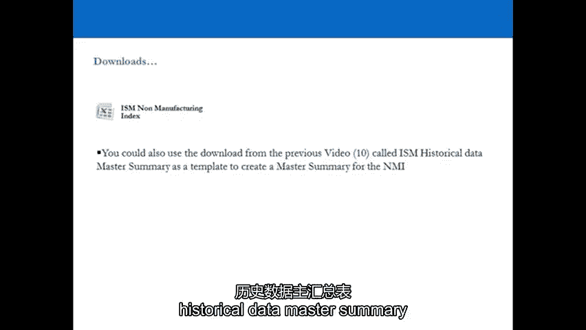

# P11：11-11.第11讲 相关指标 - web3深度学习 - BV1be4y1c7ir

好的，欢迎收看第十一期视频，我们现在要看的是，商业舞台，所以在我们继续讨论所有重要的消费者之前，我们要去看看哥哥，5。如果你愿意看一下这份商务报告，这是关于商业的非制造业报告，或者有时被称为NMI。

现在，非制造业商业报告涵盖服务业，它占U的80%，我们喜欢在视频十中看到的中国经济和制造业，占U的20%，China’中国经济，我们已经解释了很多，为什么我们更重视商业上的非制造报告。

关于非制造业业务的报告，但这并不意味着NMI不重要，非制造业指数其实很重要，因为服务显然占了你的很大一部分，中国的生意，所以我们要看着敌人，我和它的兄弟一起，如果你喜欢，制造业务报告，不是。

所以当你把它们放在一起看的时候，你会得到一个非常，美国的健康和前景非常清楚，中国的经济，因此也可能是全球经济，因为U，它实际上占了很大一部分，所以记住我们在这里看美国，欧洲和中国，但此刻我们仍在你。

在我们进入最重要的U之前，我们的业务，中国的消费者，把这两个领先指标很好地结合在一起，它会帮助你在，生成您的，你的投资组合来定位你的方向，你是不是要很久，短，或市场中性，再说一遍，没有规则手册。

但你需要产生这些想法，并通过这些过程来确保你有一个非常，对世界可能走向何方的很好的想法，不管是上下还是侧身，你要花很长时间，短，或市场中性，取决于你的U，的观点，你对欧元区的看法，你对中国的看法。

以及您的整体全局观，你也会得到地区视角，让我们去看演示文稿吧，让我们来看看非制造业指数，服务业，非制造业指数，就像你对待非制造业商业报告一样，因为妆容可能会有一点不同。

但本质上是50以上和以下的膨胀和收缩，和定性陈述，我们使用它的方式几乎完全相同，所以我们定义了非制造业指数，并以几乎相同的方式定义业务上的信息系统制造报告，和演绎都定位在S和P 500，从两者的结合。

让我们去看演示文稿吧，我们在视频的最后再见，附有非制造业指数摘要，好的，所以我们要继续服务，所以非制造业指数，NMI，这是百分之八十的U，China’中国经济，你一个月有两个号码，你得到一个初步的数字。

大约在月中月底你会得到最终的数字，这是官方号码，所以Prelib号给了你一个指南，至于月底会有什么报道，您对待它的方式与ISSM制造号完全相同，如果在五十以上，如果低于50，它就在增长。

12个月前预测的GDP收缩，但具体来说，指数的构成略有不同，所以现在我们在看服务，我们得到了四个领域同等权重的商业活动，新订单，交货和库存，这就是它最近的样子，那是商业活动和商业活动。

新订单被认为是NMI本身的领先指标，它们是最敏感的，所以商业活动每月都在变化，是啊，是啊，每月更换新订单，别忘了NMI不是真正的商品，买卖的实物。

所以这是我们更喜欢使用制造业指数而不是服务业指数的第二个原因，因为服务可以是法律专业人士和会计师之间的合同，它不一定是一个真正的好买卖的真正的产品，这样它就可以在那里，周围可能会有很多噪音。

但它仍然具有难以置信的预测性，从2008年到现在的商业活动，九十七，自1997年以来的新订单，从哦八开始交货，自哦八以来的库存，你会得到电子表格，回去，改变图表，尽你所能回去练习，只是从数据中创建图表。

了解它在商业周期中的作用，正是这个，你对待它的方式和ISSM完全一样，但这只是服务，买卖的不是真货，所以80%的U，s，经济，有12个月时滞的GDP预测，八十，对它短暂的历史有5%的把握。

它还告诉我们对政策制定者的期望，你也会得到定性的陈述，你用完全相同的方式做，你得到了所有行业的顺序，报告了最大的增长，或者增长最快到报告增长最慢，对待它完全一样，你从中吸取交易的想法。

为什么预测GDP很重要，明显预测股市回报，预测某一特定行业的商业趋势是显而易见的，没那么明显，但你可以读懂字里行间，试着翻译成交易语言，报告中的人实际上在说什么，与ISSM相同。

但你也把它和制造业指数一起用作头部，检查你要看到什么，它们都朝着同一个方向移动吗，但在不同的商业周期中，服务可能会先移动，制造业可能会先行动，他们会互相跟随。

那么如果这些生物连续四年报告在50以上会发生什么呢，然后在和非制造业指数上一样，但后来NMI第一次低于50，你对经济中正在发生的事情有了一个了解，在任何时候，通过看两者，它告诉你的是经济正在吱吱作响。

可能处于收缩的边缘，在那种情况下，反之亦然，在相反的情况下，呃，连续一年，连续十二个月收缩，1。经济收缩的速度一年来首次放慢，在非制造业指数中，你很快就会知道发生了什么，世界上，和SM非制造业指数。

历史数据主摘要。

您可以使用issm非制造业指数以同样的方式填写，它是什么，它会吐出一个结果，告诉你会发生什么，所以通过练习，如果你做了那个练习，这对你有好处，因为你会了解电子表格是如何工作的，这意味着你将学习参数。

以及结果实际说明的决策过程，你在投资组合中所做的，好的，欢迎回来，所以让我们试着总结一下我们所看到的，呃，在非制造业指数的演示文稿中，嗯，服务业的结论，我们对待它的方式几乎完全相同。

就像我们对制造业所做的那样，ISM制造业务报告，除了现在我们只是在服务业，妆容有点不一样，但本质上没有什么不同，服务业，索引，呃，被分解了，我们对待他们的方式几乎是一样的，你需要从中得到什么，呃，在。

你真的需要成为采购经理指数的学生，因为一旦你成为pmouse的学生，你真正成为学生的是所有训练的最大原则，它试图预测未来，所以我想让你现在真正做的是，现在你已经到了这个阶段，就是去那些网站。

去NIS网站下载数据，我们有你的下载，在视频旁边，也可以，你知道那是你的捷径，但你真的需要去这些网站，自己下载数据，绘制自己的图表，并将它们与S和P 500相关联，将它们与国内生产总值联系起来。

甚至将它们与收益联系起来，尤其是特定的行业和股票，所以你知道这让事情更上一层楼，好吧，我在这里向你展示的是真正的，对思维过程和真正重要的指标的介绍，现在你得离开去自学，你必须成为采购经理人指数的学生。

不仅仅是在美国，也在英国、欧洲和亚洲，一旦你成为首相的学生，你会成为最大原则的学生，它在预测未来，作为一名专业交易员，你看到未来会是什么样子了吗，然后把这种解释变成真正的硬美元。

所以现在我们要转向所有重要的消费者，消费者很重要，因为U，s，消费者占美国人口的三分之二以上，s，经济消费支出，所以我们所做的是我们用，与世界上最重要的消费者情绪指标相结合。

这是密歇根大学的消费者信心指数，那么让我们进入下一个视频，我们下期的介绍见。