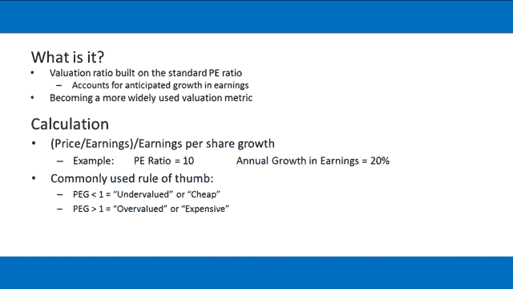
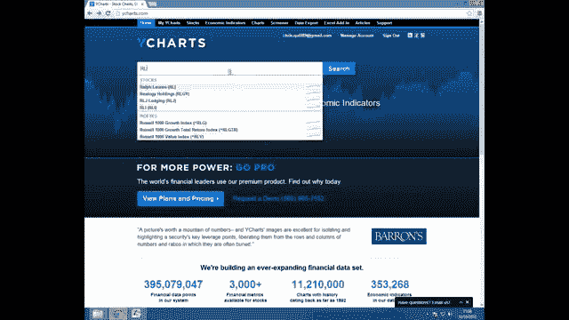
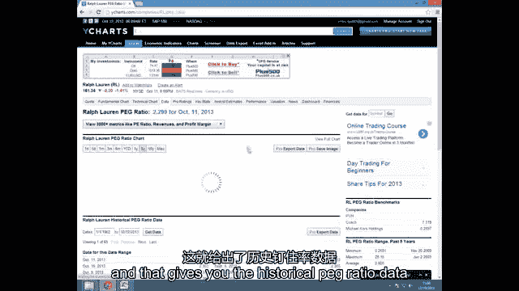
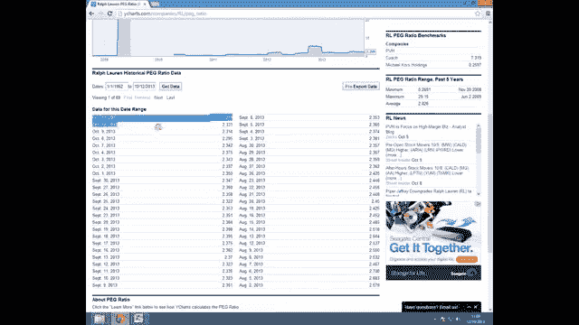

# P19：19-19.第19讲 补充 市盈率与增长比率 - web3深度学习 - BV1be4y1c7ir

在这个视频里，我要计算市盈率与成长率，或PEG比率有时是已知的，并谈谈如何在投资过程中有效地使用它，并举例说明我们为什么以这种方式使用它的一些论点，使用几个Excel示例。

所以这个素材基本上是视频的补充，19个从上到下的钻探，我们用p比讨论类似的事情，那么是什么，PEG比率只是建立在标准PE比率基础上的估值倍数，它旨在改进它，通过核算公司收益的预期增长，现在。

这可以被视为一种改进的原因归结为金融理论，也就是说，我们可以通过对某物未来现金流的贴现来对其进行估值，预测未来现金流量，我们需要能够预测增长率，这就是DCF模型背后的原理。

所以我在这个视频中覆盖PEG比例的原因，它正在成为一个更广泛使用的估值指标，重要的是我们，因为散户知道如何正确处理，就计算PEG比率而言，这相当简单，它只是市盈率除以每股收益的增长，例如。

如果我们有一个P，e，百分之十的比率和收入每年增长百分之二十，PEG比率正好是十除以二十，等于零点五，现在，理论金融学告诉我们，挂钩比率小于1的股票，被低估或便宜，反过来。

一头猪超过一头的股票被高估或昂贵，有时你可能会看到，市场上的分析人士就用这种方法来证明他们推荐股票是合理的，比如说，通过购买，对挂钩比率小于1的股票的推荐，但这是处理盯住比率和投资过程的错误方法。

这也是散户投资者经常落入的陷阱。

所以在现实中，PEG比率和P比率一样被误解，它实际上代表的是市场愿意买卖的价格，公司的收益和收益增长潜力，就像p比一样，没有低估或高估的廉价或昂贵，与p比相似，当股票价格上升或下跌时。

盯住比率可以保持不变，所以如果我们举一个股票的例子A的交易价格是每股10美元，目前每股收益估计为1美元，每股收益估计增长20%，所以我们的PEG比，只有P比率除以每股收益增长，也就是十比二十。

也就是零点五，现在，我们还可以算出去年的每股收益，通过贴现今年的预期每股收益估计，预期每股收益增长，所以这只是通过每股收益得到的，1美元除以1。2的折现系数，这相当于20%的每股收益增长数字。

这等于零点八三美元，所以现在，如果我们想象公司出来，这有效地将EPS增长率改变为8，我们可以用去年的每股收益来计算，因此，随着每股收益数字和每股收益增长数字的下调，所有这些都必须发生。

以保持钉住比率不变，在零点五，价格按比例下降，所以在这种情况下价格只需要降到3。6美元，所以只要股价按比例下跌，与收益和收益相对于上一年度的增长，那么股票就会失去几乎所有的价值。

而PEG比率实际上保持不变，所以在这种情况下，理论金融学实际上会告诉我们一路买这种便宜的股票，从十美元到三块六美元，我们这样做会损失很多钱，在现实中，股价实际上预期每股收益和每股收益的波动。

按钉住比率计算的增长数字，对于盯住比率小于1的股票，他们实际上受到了市场的惩罚，持续缺失的每股收益和每股收益增长估计，因此，市场希望他们一次又一次地错过他们，它准备以低估值出售股票。

因为他们认为公司的收益质量很低，在未来，实际上可能会发生什么，每股收益和每股收益的增长数字将赶上股价，如果你对此提出异议，并实际购买股票，你声称本质上你比市场知道得更多，而你不知道。

钉住比率超过1的股票也是如此，他们得到了市场的回报，持续超过每股收益和每股收益增长预期，所以市场希望他们一次又一次地打败他们，并准备以更高的估值购买这只股票，因为未来的收益和增长又是高质量的。

很可能EPS和EPS，增长数字实际上会赶上不断上涨的股价，如果你对此提出异议并再次做空股票，你声称你知道的比市场多，很多时候你最终会被证明是错的，你的交易账户会有很大的损失，所以事实上。

市场愿意为高质量的收益支付更多，驱使我们得出与视频十九相同的结论，在那里我们展示了没有什么是便宜或昂贵的，所以我们基本上看到了股价可以从零到无穷大，反之亦然，而PEG比率实际上保持不变，所以。

从这个视频中得到的最重要的是，认识到钉住比率是收入质量的代表，和股票的增长前景，所以接下来，我将举几个例子，显示当PEG比率使用不正确时实际可能出错的地方，根据理论金融学，当我们这样做的时候。

它还将作为如何自己进行PEG分析的教程，现在我要向你们展示如何自己做一些PEG分析，并通过几个例子来说明可能出错的地方，当你使用PEG比率时，当你投资时不正确，所以我们要看看会发生什么。

当你购买挂钩比率小于1的股票时，或出售挂钩比率大于1的股票，根据金融理论，并表明考虑盯住比率实际上要好得多，作为公司收益和收益增长的质量信号，我们将要使用的过程相当简单，它基本上只是看看历史价格数据。

和给定股票的历史挂钩比率数据，看看它们是如何随着时间的推移相互联系的，所以我们需要做的第一件事是获取数据，现在在这个视频中，我实际上要跳过我们如何获得价格数据。

因为我们在之前的雅虎财经视频中已经讨论过了，但我要做的是简单地向你展示如何获得PEG比率数据，并将其导入到Excel中，并将其与您的价格数据进行比较，所以要做到这一点，我们只需要去Y图表网站。

然后在这个例子中，我要去看看股票拉尔夫·劳伦茨，所以我要输入rl。

并从下拉菜单中选择Ralph Lauren，然后查找PEG比率数据，只需选择数据数据，并从性能度量下拉菜单，找到PEG比率，点击它，这就给了你股票的历史挂钩比率数据。

你正在看的，它以该库存最后可用的日期开始，现在不幸的是，实际上不可能在Excel文件中正确地导出数据，除非您支付订阅费，但你实际上可以用一种更粗糙的方式获取数据，这就是我们在这个视频中要做的。

这只需要将网站上的数据复制粘贴到Excel中，显然这比普通的数据文件需要更多的时间，所以我实际上不打算通过整个例子，因为这将涉及大约两年的数据，而是，我只想给你看几页，如何将这些数据发送到Excel中。

然后我们要用一个pre，制作拉尔夫·劳伦电子表格，准备好在视频后面进行分析。

从字面上看，它就像复制粘贴一样简单，所以如果你只选择你想要的所有数据，包括网页上的日期和PEG比率，然后在这个选择中，单击复制，右键单击并复制，然后我要把这个粘贴到这个pre里，制作参考和电子表格。

把它粘贴到单元格里，在Excel中，它会给你你的日期列和你的PEG比率列，他们都会正确地排队，你所需要做的就是删除数据集中间的中断，然后你就有了一个一致的数据集，那么你所需要做的就是转到下一页数据。

你可以一直往回走，想走多远就走多远，这样做是为了，然而，你想要的许多页数据继续前进，将其复制并粘贴到您以前的数据下面，并删除数据集中的制动器，然后一旦你做到了，你想回到哪里就回到哪里。

你最终会得到这样的东西，我在左手边，在a和b栏中，注明日期和PEG比率，然后你所需要做的就是去雅虎财经，获取每日收盘价数据，日期范围内所有日期的价格数据，并确保它们与正确的对应，正确的。

所以进行分析的最简单的方法，我们的PEG比率分析，并通过制作图表来观察它与价格的关系，这就是我们首先要做的，我们只是要选择所有的数据，然后插入此数据的折线图，这就给了我们分析所需的所有相关数据的折线图。

我们这里的第一个问题是缩放问题，所以目前PEG比率数据停留在1左右，它使用与价格数据相同的轴，大约一百五十，所以我们要为PEG比率数据创建一个辅助轴，通过选择PEG比线和右，单击它并格式化数据系列。

然后在这里加一个次轴，这给了我们一个次轴，右手边的钉子比轴，下一个缩放问题，我们要解决的是价格数据，只是在图表的顶部闲逛，当实际上，为了更容易地在视觉上解释它，我们想使用更多的图表。

所以我们要改变左手轴，价格轴具有最小值，大于零的东西，所以要做到这一点，我们左键点击轴，然后右键单击格式轴并将最小固定值更改为，在这种情况下，一百个。

所以现在我们可以可视化钉住比率和股票价格随时间的关系，所以让我们来看看如果我们买卖股票会发生什么，根据金融理论，i，e，根据钉住比率，当股票超过或低估时，记住钉子比，当一只股票超过1时，它就被高估了。

当它低于1时被低估，所以我们要以1的PEG比插入一条线，所以我们知道当挂钩比率低于1或高于1时，我只是要格式化这个对象的权利，单击该行并更改，线条颜色到黑色，让它更宽一点。

所以现在我们可以看到PEG比小于1时的日期范围，我低估了，当它超过1并被高估时的范围，所以现在我们要做的是按时间顺序浏览图表，并根据金融理论通过在图表上添加线条来添加买入和卖出信号，垂直线，绿色和红色。

绿色的线是买的，红色的线是卖的，我们将在PEG比率的主要变化时这样做，所以像这个变化，从一个下面到一个上面，还有这里等等，这些变化实际上来自于EPS和EPS的变化，增长估计数，所以让我们从现在开始。

我们要从头开始，所以九月，二千零一一年，我们会说，根据金融理论，这是一个买入信号，因为PEG比小于1，代表，预期股价会上涨而购买股票，我只是想把这个弄得更宽一点，更绿一点，这条线。

因为这就是现在金融理论所规定的，下一个重大变化是在2011年12月底，其中挂钩比率从小于1上升到大于1，所以它从被低估到被高估，所以这可以被看作是细胞信号，然后再一次，在2012年3月底。

它从一个上面到一个下面，高估对低估，请记住，PEG比率的这些重大变化是由修订引起的，伴随着EPS和EPS，增长估计数，这是一个买入信号，因为它正跌破1的盯住比率，我们要插入的最后一行是在六月底。

二千零一十二，其中盯住比率从小于1上升到大于1，估价过高，因此是细胞信号，所以现在让我们考虑一下股票价格会发生什么，在我们通过这张图表发出买卖信号后，所以2011年9月，我们收到买进信号。

但实际上股价下跌了，到下一个单元格信号，同样地，然后我们有一个卖出信号，但股价实际上正在上升到下一个买入信号，通过这张图表，这种情况一直发生，所以本质上，它是，股票价格实际上与金融理论应该规定的相反。

那么为什么会发生这种情况呢，这里到底发生了什么，从2011年9月开始，市场实际上在抛售股票，预期每股收益及每股收益增长下降，如此有效，它在公司对每股收益和每股收益的修订中定价，增长估计数。

当钉住比率从小于1上升到大于1时，就会发生这种情况，因此，股票价格是在这种情况发生之前定价的，然后市场又开始买入股票，预期每股收益和每股收益会有更高的增长，所以他们买了这个。

他们在1月2日左右开始购买股票，预期每股收益及每股收益增长率将上调，向上，然后在2012年3月底证明了这一点，上调每股收益及每股收益增长估计，因此，钉住比率是价值的下降，在图表的下一段中。

这种情况再次发生，然后在2012年6月之后，我们可以看到市场的一个很好的例子，不断购买股票，为高质量买单，收入和增长，这有效地奖励了公司，现在我们要简单地看另一个例子，更明显的是。

市场愿意为高质量的收益买单，这个例子是一家名为3M的公司，所以我们将简单地进行同样的分析，虽然这个要快得多，我们不需要把上一张图表中所做的所有线条都加进去，所以首先要做的是。

通过选择所有数据单击插入创建图表，插入一个简单的折线图，我们将再次解决我们的缩放问题，所以我们要为PEG比率数据添加一个次轴，通过选择正确的PEG比线，单击格式化数据系列并添加第二轴，然后再一次。

我们的下一个缩放问题将使Priceline使用，更多的图表，右键点击价格轴，将最小固定值更改为70，所以在这个例子中，在我们看到的大约一年的时间里，公司实际上是通过股价上涨得到回报的。

预期每股收益和每股收益，不用说，遵循金融理论实际上也会在这只股票上损失很多钱，所以你现在可以在产生交易想法时自己使用这个分析，作为用p比看p比的补充工具，如果我们有长远的想法。

我们在寻找对该行业有溢价的PAS，还有短裤，我们在找这个行业的折扣，这是因为我们知道，p比率意味着市场愿意为高质量的收益买单，低p比，市场实际上是在惩罚股票的低质量收益。

然后我们可以寻找为什么会这样的原因，所以如果没有理由违背市场，很明显你什么都不知道，市场不知道的，你实际上是在与潮流作斗争，同样地，你可以寻找PEG比率高于1的长想法，和PEG比率小于1的简短想法。

你会看到这就像p比一样，市场将继续奖励每股收益增长高于行业平均水平的公司，并惩罚那些每股收益增长低于行业平均水平的人，关于PEG比率分析，你只需要知道这些，我希望你能成功地将这一点纳入你的投资框架。

