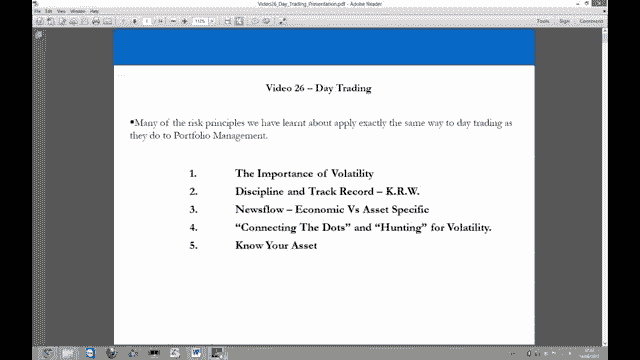
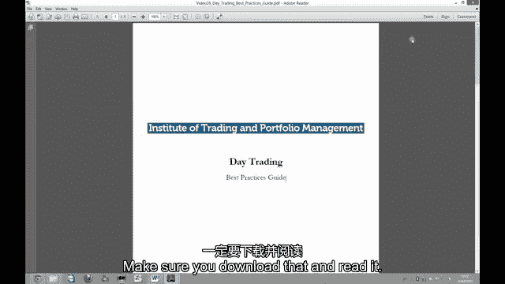
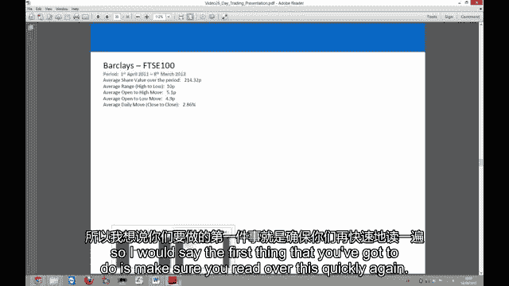
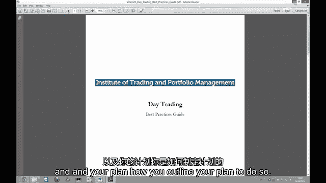
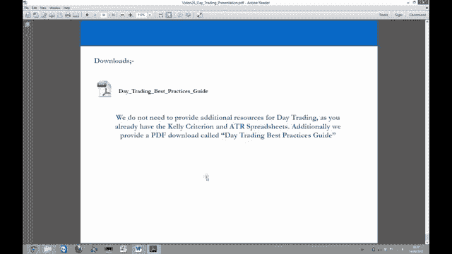

# P26：26-26.第26讲 日内交易法 - web3深度学习 - BV1be4y1c7ir

好的，欢迎回来，欢迎收看26号视频，现在，我们实际上要考虑日内交易或短期培训，到目前为止，围绕短期波动性，我们在视频系列开始时发现的，这就是为什么我们一直在掩盖这一点，仅投资组合管理。

我们在视频系列开始时看到的，在股票市场上大约80%的时间，短期交易的波动性并不存在，我们以日间交易为例，这确实向我们展示了在正常的一天里，一个标准差日，每天交易基础上80%的时间波动性，每日。

就在一天内赚钱而言，这种可能性真的不起作用，当我们研究隐含波动率时，所以固定的隐含波动率，主要股票市场的波动率指数，特别是我们看了500英镑的S和P，世界上最大的股票市场，我们意识到这个波动性指数。

也同意历史波动，当然，它们应该匹配，波动率，标准普尔500的波动率指数，显示百分之八十的时间，VIX如下，年化25%，当你收回它时，意味着每天，标普500的波动性，只是没有任何交易者赚钱，短期。

所以80%的时候我们意识到本质上我们必须成为投资组合经理，然后我们必须从投资组合经理过渡到短线交易员，当波动性增加时，当波动性降低时，所以本质上我们要回到这个想法，作为一个预告片。

你的工作实际上是你是波动性的奴隶，所以18%的时间和投资组合经理在一起，这就是为什么我们一直如此专注于它，这就是我们离开日间交易到这一点的第一个原因，我们离开日间交易到这一点的第二个原因，是因为。

很多技术，我们在投资组合管理中使用的许多过程，实际上也用于日间交易，现在我们知道了这些，我们现在可以将它们应用于日间交易场景，我们真正要看的是寻找波动性，短期的，所以现在我们理解了波动性。

我们可以我们知道如何寻找它，其次，我们看ATR，所以股票或资产每天的平均真实范围，ATR在我们去日费率之前把它拉出来，我们为什么把它拉起来是因为我们想管理我们的期望和设置停止，并据此制定目标。

所以首先识别波动性，第二，设定期望，停止和目标，以确保我们的期望是现实的，许多散户并没有正确的预期，当他们进行日间交易时，第三件事我们有下载，可在下载部分获得，它实际上概述了您应该拥有的所有最佳实践。

作为一个采取日间交易方法的人，所以我们要看的三件事，让我们来看演示文稿，这次的演示实际上是在电脑上进行的，所以我们要在电脑上浏览一下幻灯片，我们在视频的最后再见，浏览日间交通的摘要，好的。

所以欢迎回到电脑屏幕，我们现在来看看日间交易的基本知识，这里的一些原则，你将在本系列之前的视频中看到的相当多的概念，也适用于项目组合管理，但现在我们的时间范围显著缩短了，所以没有一到三个月的时间范围。

我们现在看到的是一天的时间范围，也可能只是几天，所以我们的时间范围显著缩短，然而，你到目前为止看到的很多原则和概念，整个视频系列应用，仅仅因为我们改变了我们的时间范围。

并不意味着我们改变分析资产和交易这些资产的一般方法，我们只需要在时间范围内以更聪明的方式使用我们的资源，我们正在寻找，在这个演示文稿中，我们要在电脑屏幕上做这件事，而不是走到舞台上。

因为在这里得到原则和概念是非常重要的，所以我想在屏幕上做这个会更好。

很不稳定，很难赚钱，我们在下载部分包含了最佳实践指南，最佳实践指南涵盖了所有主要的方法，你真的应该做好心理准备，你的一般准备，你在分析整个市场方面的准备，以及当你真正把日间交易作为一种练习时。

你应该做什么，你应该通读一下这个，你知道当你想到日内交易时，你相信你有能力这样做，你应该很快复习一下，你知道它只有几页，它是，你不应该花太长时间来涵盖这些原则和概念，在方法方面，这很值得做。

因为这将为你节省很多钱，它将为你节省很多钱，并可能为你赚很多钱，如果你继续这样，我在回顾你的日间交易，这在下载部分，最佳做法指南，一定要下载并阅读。

我们现在要做的是通过这个演示，一滑一滑，和，我们首先要看的是波动性的重要性，所以我们在早期的视频中看到了波动性的概念，我们要复习那些，只是为了确保我们有正确的方法，然后我们将研究如何使用凯利准则。

你如何监控你的纪律和记录，并在日间交易中有作为交易者的自我意识，我们还将看看新闻流是如何影响你的，作为日间交易者，以及你如何连接点和寻找波动性，以及你如何知道你的资产，我很了解你的线人。

就是知道资产的波动性和机会，所以让我们开始吧，我们在这里看S和P，五百波动率指数，你可以看到在过去的二十年里，你知道波动率指数的平均水平有多低，你看到的波动指数实际上在15到20之间，作为平均数。

当你把这个倒回到日间交易的情况下，我们已经看到，这意味着80%的时间，我们必须成为投资组合经理，仅仅是因为当你观察每天的波动性时，发生了什么，百分之八十的情况是你在S和P中得到了一个动作，五百。

在正负0。5%以内，并在概率调整的基础上，你基本上是在看恶心，每天的总移动正负三个五个或三个三个基点，所以三点五或者负三点三，当你真正考虑交易时，然后还要付钱交易，我们在视频系列开始时做的理论练习。

我们说过，好的，如果我们支付3个5个基点的往返费用，这只是意味着如果我们在日间交易，S和P的平均股票，五百，在正常的一天，这意味着我们基本上赚不到钱，所以我们不是说日间交易不好。

我们要说的是市场告诉我们，我们做不到，百分之八十的时间，但百分之二十的时间，我们可以做，所以当我们研究投资组合风险时，你知道的，如果我们假设80%的时间我们都是投资组合经理，这就是专业交易员。

80%的时候他们是投资组合经理，为什么？因为他们是波动性的奴隶，市场的波动告诉他们任何给定时间范围内的机会，我们在视频系列的一开始就看到了这个概念，我们声明波动性是交易者最好的朋友。

也是投资组合经理最大的敌人，VIX实际上不是市场下跌的恐惧指数，但实际上是对波动性本身的恐惧，所以这意味着如果波动率指数随它的变化而变化，如果我们假设整个世界都在投资组合管理中。

那么这意味着每个投资组合经理的风险都上升了那个百分比，所以首先，如果波动率上升百分之二点五，它实际上只是意味着整个世界的投资组合风险增加了两倍，百分之五，所以记住这个例子。

我们在那里经营着一百万美元的投资组合，理论上一百万美元的投资组合，你可以回到开始的时候回顾一下，当VIX指数翻倍这一百万美元时，昨天的总敞口，不管我们喜不喜欢都变成了200万美元。

因为从这个投资组合中移动的P和L的大小是原来的两倍，所以所发生的一切就是投资组合经理在没有做任何事情的情况下承担了更多的风险，因此，他们被迫进入市场，减少风险敞口，所以当你看到波动率大幅上升时。

所以我们假设VIX甚至低至10%，在标准普尔500波动率指数中极低，如果波动率是10，它跳到12。5，上升了百分之二点五，如果它从10跳到15，上升了百分之五十，你会发现。

如果波动率指数在低水平上持续了很长时间，你会在市场上得到很多自满，因为投资组合经理已经建立投资组合很长时间了，VIX在那个水平，人们开始感到舒服，VIX将在很长一段时间内保持低位。

然后当世界上发生了什么事情，它突然跳得很好，突然之间，世界投资组合的风险上升了这个百分比，反之亦然，所以反过来也是正确的，当波动率，你知道吗，从，说两个，五岁到十二岁半，嗯，波动率下降了50%。

这意味着投资组合风险下降了50%，在这个例子中，我们说它下降了2。5，这只是意味着世界的投资组合风险下降了20%，这里的小错别字忽略它，它实际上只是意味着它下降了2。5，所以说，这意味着什么。

当我们作为专业交易员成为波动性的奴隶时，我们必须处理这个问题的方法是，我们必须成为投资组合经理，大约80%的时间，我们知道我们不能在短期内进行交易，因为市场不允许我们，然而，历史上20%的时间。

发生了什么很好，我们有机会这样做，所以我们从投资组合经理过渡到日内交易员或短期交易员，当我们给它的时候，当我们有机会这样做的时候，当我们没有机会这样做的时候，我们会过渡回来，我们建立投资组合。

这就是为什么当你看到波动率指数大幅波动时，通常，你看到市场大幅上涨或下跌，因为市场参与者要么去冒险，要么去冒险，所以他们要么取消投资组合，要么重新投资组合，所以很明显我们需要做什么。

我们想在他们面前去冒险，我们想过渡，因为当人们冒着风险，他们在市场上创造短期交易机会，我们必须有现金或保证金来利用这些机会，如果我们完全投资于我们的投资组合，那我们就不能利用他们。

所以我们想努力领先于比赛，我们应该看到的是这个交通灯系统，如果我们被告知不能进行日间交易，因为我们的VIX非常低，通常这是在二十以下，VIX年化波动率的5%，你知道这里没有规则。

你知道你可能想把它限制在20%甚至15%，但通常80%的时间，现在是20度以下，百分之五，标准普尔500波动率指数的年化波动率，所以当它低于那个水平时，它下降了两个五，发生了什么事？嗯。

这意味着世界的投资组合风险正在下降，所以你作为投资组合经理的报酬现在更好了，你正在成为一个赌注，你变得，作为投资组合经理获得报酬的机会正在增加，然后就在另一边，让我们说，比如说，VIX跳了两个。

从一段时间以来的水平来看，五个或更多，这就意味着世界的风险上升了百分之二点五，因此，投资组合管理的全球风险上升了2。5，这意味着现在世界上做投资组合经理的报酬更低了，不管他们喜不喜欢。

他们的风险增加了这个数额，所以他们的PNL摆动，他们的PL波动率上升了这个量，他们可能会被迫去冒险，我们想预测这一点，我们想确保我们对此做些什么，所以这就是我们过渡的原因，这些都是信封后面的号码。

你知道你不能再去当地的书店了，或者去亚马逊，com买一本书，也就是说，在任何情况下，当交易波动性或过渡时，你都应该这样做，但当我们得到许可时，你也许应该考虑做点什么，因为你不希望相反的事情发生，相反。

作为一个投资组合经理，你的投资是完全的，你什么都不做，然后你是头灯里的兔子，然后你必须从你的投资组合中交易，当波动性有波动性时，波动性已经反弹，它现在处于高点，因为你要做的。

为所有的日间交易者提供流动性，让他们从你身上赚钱，所以当我们看到波动率反弹时，我们想做点什么，两个，5年或5年以上，这通常是当我们在某种过渡区时，我们看到波动性在蔓延，还有新闻广告，你知道。

这个消息可以是任何事情，它一直在变化，所以说，这些琥珀色的情况真的可能是任何扰乱市场现状的事情，它们可以是消极的和积极的惊喜，但你会发现它们通常是负面的惊喜，例如，如果我们回到波动性指数。

你知道我们最近看到的波动性的峰值，这一次是美国的收视率下调，在2011年夏天，呃，在此之前，我们在日本发生了福岛灾难，这实际上发生在一个周末，交易员没有真正的机会过渡，呃。

在那之前我们在2010年5月经历了闪电崩盘，这也发生得很快，所以作为投资组合经理，你必须非常小心，你知道的，在2011年我们有两种情况波动性飙升，其中一个动作是在2011年，日本地震发生在一个周末。

波动只是在周一移动，交易员几乎没有机会转型，这就是为什么，当人们在市场低谷时减少风险时，你看到了如此多的成交量，然而，美国的评级下调，这种跳跃波动性是分阶段跳跃的，有很多机会在这个水平附近进行日间交易。

到处都有批发机会进行日间贸易，所以很多日内交易者在这次交易中赚了很多钱，也是在2012年搬到这里，二千零一十二，这是这是这真的来自欧洲，所以我们看到了，呃，西班牙和意大利债券收益率。

欧元区主权债务风险显著增加的地方，我们看到波动性从低到中，达到两个五个级别，我们看到市场上的抛售，这真的是最后一次机会你可以在这次移动中进行日间交易，那里有批发机会，然后随着波动性的下降。

重新构建到你的投资组合中，从2012年下半年到现在，波动性非常大，非常低，所以你被雇来做投资组合经理，真的在过去的九个月里，我们现在是四月份，四月二十三日，当我们制作这个视频的时候。

所以在过去的九个月左右，如果你做过日间交易，你被杀了，如果你是投资组合经理，你做得很好，或者你可能做得很好，所以说，他们可以在任何时候成为任何东西，所以你只需要认识到发生了什么并做点什么。

如果你对风险感到不舒服，也没有，没有，呃，规则手册不幸的是，但我想信封背面的规则是尽你所能做点什么，因为你希望能够释放现金，释放你交易账户中的保证金，所以你实际上可以利用波动性，如果你不。

那你就是头灯下的兔子，你就是坐在那里的那个人，摆弄他们的拇指，想知道发生了什么事，想知道你是否应该做什么，看着你的风险越来越高，最后，你可能会投降，最终交易出你的投资组合，在一个你不应该交易的水平上。

你可能会成为最后一个交易出去的人，这正是我们不想要的，所以不幸的是，没有规则手册，但我想第一步是真正认识到发生了什么，做一些事情，当指数vol处于过渡和上升期时，那么你可能应该考虑交易你投资组合的一半。

所以在你的投资组合中减少50%的头寸，然后采取日内交易方式，寻找这些定向赌注的机会，在一到五天的时间范围内，而不是一到三个月，然后当波动性在转变和下降时，你会做相反的事情。

你可能应该考虑将投资组合中的头寸数量增加一倍，所以百分之百，然后采用基于投资组合的方法，把现金投入到多样化的工作中，多空投资组合，所以再一次，没有硬性规定，告诉你什么能做什么不能做。

当修复急剧上升或下降时，每个人的风险承受能力都不一样，每个人的策略都不一样，每个人的投资组合看起来都不一样，组成也不一样，所以当波动率指数大幅反弹时，你必须解释当时世界上发生的事情。

为什么它上升得这么快，然后如果你不喜欢波动风险，那就减少你的投资组合，减少暴露，因为你需要再次明白，随着波动率的上升，世界投资组合风险正在上升，你的也是，它在上升，你对此无能为力。

除非你真的去减少你的暴露，然后当相反的切入时，所以当波动率指数大幅下降时，你必须解释正在发生的事情，这就是为什么它下降得这么快，很快就会掉下来，因为会发生一些事情，消除市场上的风险，当你进行日间交易时。

你会被告知，如果你当时正在发生这种情况，因为你会发现这越来越难，做日间交易者赚钱，那时你应该把这作为一个信息，建造一口井，多样化，多空投资组合，如果你不采取这种方法。

那么你所做的就是你没有最大限度地利用你的机会，你没有采取专业的交易方法，所以如果你一直只是一个日间交易者，你试图向市场发号施令，也做不到，而专业交易员实际上却反其道而行之，让市场告诉他们什么能做。

什么不能做，这是典型的散户错误，所以你在视频系列开始时看到的所有这些东西，但这就是为什么我们要再经历一次，因为如果你真的要考虑日内交易，那么你需要了解这些东西，你需要明白为什么散户通常会损失这么多钱。

他们中的许多人都这么做，这正是为什么因为他们试图告诉市场他们的机会是什么，只是采取一个非常单向度的方法，而专业交易者采取市场允许他们采取的方法，现在当你真正决定约会费率时。

绝大多数日内交易者亏损还有进一步的原因，我们已经看到了第一个对现有机会的普遍赞赏，所以不欣赏那些可用的一般机会，所以人们并不真正关注市场状况，第二件事是缺乏准备，所以没有类似于投资组合管理的东西。

从来没有一个真正系统的过程来决定该做什么，鉴于市场条件和资产具体情况，第三件事真的是不切实际的期望，所以大多数时候，一般市场的波动性太低，保证100%的日内交易方法，这又是你对市场发号施令的想法。

机会是什么，你在告诉市场，我要这样交易，和市场无关，第四件事是在旧新闻或新闻上进行日间交易，这并不是真正的资产，你认为这会影响，大多数散户当天交易，真的只是在报纸文章上交易，电视头条和旧新闻，然而。

它是如何交付给他们的，大多数是因为它很容易理解，别人很容易让你明白，大多数人，大多数散户在日间交易时，只需使用不依赖于波动性的技术分析系统进行交易，你需要远离这个，我可以按照图表上的一条线进行日间交易。

因为市场不允许你这么做，百分之八十的时间，其次，如果生活有那么容易，我们都会这么做，所有专业交易员都将使用技术分析，日内交易作为日期利率的唯一方式，问题是他们都没有，你知道。

人们被教授助教系统的原因是因为它很容易理解，你被告知你想听的，零售商人被告知他们想听的话，无时无刻不在，那就是交易很容易，你可以从中获得收入，你只需要沿着图表上的这条线，不幸的是，这并不容易。

正如你可能在整个视频系列中看到的那样，这实际上是相当多的工作，但一旦你跟上了速度，你明白市场是如何运作的，你必须如何接近市场，用同样的方式，专业交易员所做的，一旦你走上那条曲线，你只是经历你的过程。

经历我们所看到的投资过程，每周都有你的流程，机会真的会出现在你面前，所以这是第一件事，波动性，我们必须对此有一个适当的欣赏，知道我们什么时候能，什么时候不能，让市场告诉我们机会是什么。

我们要看的第二件事是纪律和记录，我们在之前的视频中看到了凯利标准，所以我们不打算在这一点上做太多的工作，你需要做的是绝对有一个单独的凯利标准，你的日内交易与你的投资组合管理，如果你把它们混在一起。

所以如果你把你的日间交易和你的长期交易混合在一起，您的中长期投资组合头寸，作为一个交易者，你并没有真正学到任何关于自我意识的东西，因为这真的很难分辨，无论你擅长投资组合管理还是不擅长日间交易。

或者不擅长投资组合管理，擅长日间交易，如果你把所有的交易都混在一起，因此，您需要为您的投资组合管理保留一个单独的Kelly标准，和你的日间交易，所以在未来，当你回首往事，你真的可以决定你擅长什么。

你应该从盒子A或盒子B拉的地方，我是，更加集中精力，并将更多的资本部署到每个地区或其中一个地区，所以如果你是一个好的投资组合经理，而不是一个糟糕的日内交易者，那么你应该在你的生活中作为拖车从A箱拉出来。

并做更多的投资组合管理，所以在投资组合管理中，从A框中拔出，部署更多资金，从B箱日间交易中撤出，如果你不擅长日间交易和投资组合管理，当日间交易机会出现时，你需要部署更少的资本或根本没有资本。

这只是意味着你不擅长日间交易，所以你的P和L你的损失无论如何都会告诉你，但你的案件分数也会告诉你，但要确保为投资组合管理保留一个单独的凯利标准，和你的日间交易，现在当你真正去做日间交易的时候，我们要。

我们要看看你是如何解释新闻流的，所以经济和资产特定的新闻流，不管你是采取投资组合管理方法还是日间交易方法，波动性和机会通常在资产类别的两个领域内驱动，无论是在经济上，经济新闻流动发生在宏观层面。

影响国家，货币，商品，债券，股票市场中相互相对的股票和部门，因为当你看股票和行业时，我们在看周期性和防御性，经济预期如此大的变动，或者经济新闻流，这在宏观层面上真的影响着一切，影响国家的宏观层面。

我们在看货币和债券，所以利率，在全球一级，我们在看商品，以及在全球一级，我们在看股票和行业，所以周期性对防御性，在特定于资产的新闻流竞技场中，它确实发生在微观经济部门层面和独特的层面，i，e。

独一无二的，独特的水平，意思是，你交易的资产所特有的，所以货币实际上只是宏观经济和政治的消息流，新闻流几乎是宏观经济，而且需求和供给取决于微观因素，这样就有了影响供应链和商品需求的微观因素。

债券和利率只是宏观的和政治的，和股票宏观经济，宏观经济使用流量效应指数和微观效应部门和独特，现在，如果我们，如果我们通过美国的经济学，我们已经经历了很多这样的领先指标，重合与滞后。

他们中的一些人你知道巧合和落后于你，你可以把它们分为巧合和滞后，但让我们再来一遍，所以我们得到了信息系统制造业指数，非制造业MSI建筑许可证，我们还得到了货币供应量和美国债券市场的收益率曲线本身。

所以你会看到很多时候，债券市场实际上会稍微早于股票定价，预期如此的市场走势，或者期望的改变，和巧合指标实际上是领先指标的滞后指标，所以他们为我们提供了确认，所以我们又一次看到了通货膨胀，因此。

产生一个价格指数和消费价格指数，我们收到了就业形势报告，非农就业人数，申请失业救济人数，工业生产，耐用品，甚至FOMC会议，所以联邦公开市场委员会的会议记录和个人收入，工厂订单号，这些都是巧合指标。

你真的不应该在这些数字上进行日间交易，在大多数专业交易员出来之前，你所做的只是在另一边提供流动性，供专业贸易商交易及滞后指标，绝对不在落后的指标上交易，除非有巨大的物质变化。

与市场上已经完全定价的产品相比，所以国内生产总值本身，呃，美联储的，米色，图书和零售，你知道，这些，这些巧合和滞后的指标是数字，采取日内交易方式的散户，这几乎是全部，这些巧合和滞后的指标。

他们吸引日内交易者在无关紧要的头条新闻上交易，真正重要的是未来市场的走向，不是现在的地方，或者它一直在引导哪里，我们在看未来会发生什么，并对我们未来的期望做出决定，巧合指标告诉我们现在市场上发生了什么。

领先指标应该在6到12个月前告诉我们这一点，除非作为一个零售商人有任何巨大的物质惊喜，你不应该在巧合指标上进行日间交易，新闻流，这样就留下了滞后的指标，这意味着它们几乎完全没用，除非与预期有巨大的变化。

他们非常，非常，很少，就是，所以在接近的时候要小心，你知道，想象一下，如果你是听这个视频的人，现在，那天的交易是在巧合指标上进行的，当他们出来的时候，你每天都在交易，这只是意味着你在市场上进行日间交易。

波动率指数告诉你日间交易的机会极低，而且极难赚钱，你在旧新闻上交易，你在根据专业交易员归类为确认指标的东西进行交易，很大比例的零售商有，简而言之，这就是原因，为什么大多数人都赔钱。

你必须做与唯一的日间交易相反的事情，当市场允许你这样做的时候，如果你要在经济数字上进行日间交易，领先指标上的日间交易，在欧洲呢，同样的事情也适用于领先指标ESI，所以欧洲经济情绪指标。

我们有工业信心指标，它相当于ISSM制造业指数，在欧洲，服务业信心指数，它相当于非制造业指数，但在欧洲，我们有欧洲消费者信心指数，然后是零售业信心指数和建筑业信心指数，如果你想更详细地讲。

然后回到ESI上的视频，再经历一次，上网，去网站，下载如何下载数据，看看指标是怎么，指标实际上是非常简单的，成为首相的学生，所有的信息都是公开的，你只要上网拿就行了，零售商日间交易的最受欢迎的。

通常工业生产，所有国家的每月通货膨胀数字，英格兰银行会议，英格兰银行决定，他们通常落后于所有领先指标，所以说，六个月或十二个月前，印刷，或者英格兰银行也一样，所以当他们真的这么做的时候。

它通常在市场上定价，和滞后指标，滞后指标相同，通常跨越所有区域，所以GDP本身，在中国，我正要给你介绍一个新的，这就是所谓的呃，主要经济指数，所以我们现在有三个可以交易的，即使呃，短期交易者。

所以我们有汇丰中国采购经理人指数，呃，我们有会议委员会领先的经济指数，所以这是三个主要的，你甚至可能想看看中国的出口订单，出口订单确实是一个巧合指标，他们介于领先和巧合之间，这样你就可以决定出口订单了。

是否在全球范围内交易实际上有大量中国敞口的股票，在他们的收入组合或收入组合中，你也可以在此基础上决定交易商品，你可以交易石油，铜，你可以交易食品，中国的巧合指标，如果你用这些交易，你有毛病。

因为它不仅是一个巧合指标，但这些数字可能只是编造出来的，和滞后指标，国内生产总值，失业，零售额与其他地理区域相同，所以我给你整理了一张经济指标表，当他们出来的时候，你根据领先来决定你是否在他们身上交易。

巧合或滞后，你可能会看到的是，当这些数字出来时，市场会发生什么的迹象，如果它们被指示向上或向下，所以当你看这张桌子的时候，例如，ISM制造显示，那么你可能会看到股票上涨，大宗商品价格上涨，债券下跌。

美元下跌，然后我们在这里有发布日期，然后，假设相反的情况会发生，如果你看到制造业下降了吗，然后我们为每一个，作为领先指标或巧合指标很重要，如果你看到，比如说，ppi表示向上，你看，股票上涨。

大宗商品价格上涨，债券下跌，美元横盘，如果你看到这种情况发生，那么不参与可能是一种选择，因为我们不交易或日间交易，巧合指标甚至滞后指标的短期交易，所以只要确保你的定义是正确的，一定要仔细检查这张桌子。

当你做任何交易时，对你来说都是一个非常有用的资源，但主要是短线交易，因为你将能够计算出反应可能是什么，你是否要参加，基于先导重合度和滞后指标的定义，现在让我们继续讨论特定于资产的新闻流。

这可能是你获得更大交易机会的地方，作为短期日内交易者，如果你在交易资产，具体新闻流程，你也有，这些创造了更大的机会，因为你有批发机会进行日间交易，例如，波动率指数上涨50%，在微观层面上。

你会得到实质性的积极或消极的消息流，所以扇区级和唯一级同时，那么你会看到这些特定资产的大幅波动，这就是你应该部署资本的地方，如果你给了自己这样做的机会，你不会得到资产，具体的机会真的存在。

因为这都是宏观经济的、有用的和政治的，只有当你交易特定的货币时，这是因为宏观经济条件发生了变化，影响到那个特定国家，在商品方面，它是宏观的，但如果你得到，影响供应链的特定商品，你将有机会日间交易它。

这方面的好例子是，比如说，美国能源信息管理局，当他们在周三公布石油库存数据时，在库存构建中，你会得到与预期相反的大动作，这基本上影响了供应链，但不一定在宏观层面，市场受到了干预，在这种情况下。

你可以每天交易石油，这方面的其他好例子是，比如说，在粮食商品领域，所以在像玉米这样的谷物中，小麦在呃，像大豆这样的豆类，在牲畜中，像牛和猪，影响供应链的微观经济因素，你可以赚很多钱，日内交易。

你会看到周围有很大的波动，所以你知道，这方面的好例子是在2012年的食品商品中，美国有热浪的地方，我们吃了一些最低的玉米，一代人的小麦和大豆作物，天气真的影响了供应链，很多人赚了很多钱。

飞快地跳进玉米里，从多头交易小麦和大豆，然后呃，事实上，如果你整个夏天都在运行这些职位，你会在这三种乐器上赚很多钱的，在这三种商品中，因为这种趋势实际上持续了几个月，呃，债券和利率，呃。

我们只有真正影响债券的宏观经济和政治消息，特定地理区域国家的市场和费率，微观因素确实影响股票，影响特定供应链的情况最多，VIX指数显著上升的一个很好的例子，同时你有微型，呃。

影响某一特定行业价值链的因素，以及影响该行业和行业内股票的独特新闻，一个很好的例子就是2011年发生在日本的地震，因为随着日本东北部的地震，科技公司不得不将他们所有的供应链转移到泰国。

很多公司不得不这么做，今年晚些时候还会有泰国洪水，所以在美国有一些大的日间交易机会或短期机会，s，技术部门和整个全球技术部门，所以如果你把这三件事都安排好，这就是短线交易中出现大机会的地方。

这是一个很好的例子，通常你每年至少有一次这样的机会，所以你得留意他们，那么把这些点联系起来，以及我们如何很好地寻找波动性呢，当我们谈到特定于资产的新闻流时，我们确实需要考虑五个方面。

我们需要考虑公司的结果，所以收益，公告及盈利警告，市场预期收益数字，或者他们遇到他们，他们对未来的收益发出警告，所以市场现在不得不下调他们的预期，呃，竞标传闻，所以说。

有传言说一家公司将被另一家公司收购，呃，没有人能预见的独特事件，就像，呃，死于车祸的首席执行官，没有人能预见到这一点，情绪发生了如此大的变化，我们所说的市场是指情绪的重大转变，现在对资产的看法完全不同。

因为发生了一些意想不到的用途，了解你的资产，所以这是非常重要的东西，我们将在这里用一些例子，我们将使用一些来自英国的例子，我们将经历ATR的变化，所以平均真实范围的方差，所以这才是你真正应该做的。

如果你今天，贸易，一些东西，你即将进入市场，在日间交易中持仓，或短期交易，一旦你决定了，这是你真正应该做的练习，好的，我要去做日间交易，这个资产现在，很多人毫无准备就进去了。

所以我想说你要做的第一件事就是。

一定要再快速地读一遍，确保你阅读了当天的交易，最佳做法指南，这会给你一个很好的焦点，你是否应该真正采取一个立场。

你如何概述你的计划，然后再来一次，你实际上已经决定我现在要接受一个职位，那么您应该继续查看ATR的方差，所以我们在看这里，脚下的巴克莱，你从4月1日起100英镑，二千零一一年三月，二千零一十二。

所以我们需要大约一年的时间，数据的，我们看的是这段时间的平均股价，我们看的是从高到低的平均范围，所以这是ATR，我们看的是平均开盘偏高，因为我们，我们现在假设市场还没有开放。

我们正在考虑几乎在市场开盘的那一刻买入头寸，平均开盘，低位移动，然后我们看平均每天的移动，在此期间单日接近收盘，你应该解决这个问题这样你就可以管理你的期望，还要正确设置止损和目标。

我们首先要看的是巴克莱银行的波动性，开得很高，所以这是ATR的方差，所以我们只看好处，这里和这里，我们在看不利的一面，所以股票的开盘相对于一天的交易高点，一年多前，你可以看到非常，很少。

巴克莱银行有没有从开盘到交易高点的一天，十便士或十便士以上，英国十便士，如果你早上去市场，你看到实质性的积极消息，你认为这将是一个非常重要的日间交易机会，嗯，你真正购买巴克莱的机会，从它打开的地方。

你需要，你需要清楚地从股票开放的地方购买股票，至少四便士以内，从它打开的地方，有一个止损和一个现实的目标，因为这只股票很少会涨到十便士以上，与它打开的价格不同，所以首先管理你的期望，其次。

相应地设定止损和目标，我们可以在这里看到，平均开盘价实际上只有5便士，所以想象一下，如果你不在公开场合进去，有成熟，积极的消息，你不能进去，然后从开盘开始你以比开盘价高出10便士的价格进入，嗯。

那里的风险回报是不存在的，根据历史波动率，基于基于开放到高，所以你可能想发表声明，那我，我真的会在这里得到机会，还是我只是在自欺欺人，我在做一个流浪汉的交易吗，我应该为这种情况动用资金吗？这是呃。

这显然取决于你作为个人，但你需要在常识上做这些事情，没有规则手册，还记得我们研究价差交易的资本配置吗，我们说没有规则手册你可以买到，它说这是你在所有情况下部署资本的方式，没有，所以说。

你只需要看看这里的胜算做出决定并运用常识，平均开盘价是5。1便士，如果你买这只股票超过五便士，你赚钱的几率其实很大，非常薄，所以管理好你的期望，确保你要么不做，或者B如果你要在巴克莱交易。

你以很好的价格得到了这种情况，风险回报就在那里设定一个明智的止损点，损失和合理目标，然后你就可以继续部署资本，不利的一面呢，嗯，很明显，不利的一面是，日内交易的机会不多，伯基斯，你可能想继续前进。

你可能想看看别的东西，低开的平均价格是四点九便士。如果巴克利有实质性的负面消息，你认为你会进入市场，在开盘时做空它，赚五十便士，你有毛病，你显然没有做足功课，你没有拉高历史波动率。

你需要检查这一点并管理你的期望，以合理的价格进入，并相应地设定止损和目标，我们在这里对100英尺的股票进行了反复分析，脚一百，本身，所以你可以在自己的时间里经历这些，但是ATR练习非常非常重要。

一定要做到这一点，在你把一天的价格放上去之前，一定要做到这一点，它是ATR的变体，但通常在日内交易，你将在公开赛前做出决定，你要走哪条路，你要么做多，要么做空，开赛前你就知道了。

确保你把ATR的方差拉出来，所以开口是高的，开口是低的，历史波动性数据并管理您的预期，知道你要进入的极限，知道你的风险回报，相应地设定止损和目标，如果你不那样做，那你就是我们在英国所说的，到处撑船。

你最终只会付出市场的钱，自己也会赔钱，那将是一个非常，非常业余的交易方式，好的，所以让我们快速回顾一下，波动性的重要性怎么强调都不为过，我不打算在这里再给这一点贴上标签，但一定要再看一遍这个视频系列。

在这个视频系列中，你会意识到为什么我们如此多地提到波动性，这只是因为作为一个交易者，它意味着任何给定时间范围内的一切，如果你没有波动性，你没有机会，只要把这个一般规则应用到你看到的每一个时间范围。

这是散户往往得不到的第一件事，专业交易员从第一天起，因为这是专业交易员从第一天起就被教导的，我们被教导如何真正发现这一点并管理我们的期望，并相应地管理我们的方法，而，散户只是试图对市场发号施令。

他们的方法是什么，这就是为什么他们都搞砸了，这就是为什么零售商，绝大多数人都在赔钱，因为没有对一般机会的欣赏，第二个原因是准备不足，第三个原因是不切实际的期望，第四个原因是在旧新闻上交易。

并且只使用技术指标进行交易，或者在无关紧要的新闻上交易，这不是市场上重要的东西，因为你所做的是，你被当前市场或过去市场的交易所吸引，你只是为专业交易员提供流动性，摆脱已经有伤口的情况。

他们在过去的某个时候预测到的，现在实际上是新闻，然后你对它做出反应，并为我们提供了离开的机会，你真的想做相反的事情加入俱乐部，如果你喜欢专业交易员他们的工作是预测未来，所以作为一个快速的回顾。

只知道波动性的重要性，了解它并监控它，尽可能多地观看视频系列，其次，日内交易记录时的纪律和跟踪记录，你做的每一笔交易，并在投资组合管理的单独凯利标准电子表格中进行。

Kelly标准电子表格对您的新闻流进行分类，不管是经济的还是资产特定的，如果是经济的，问问自己，你应该参与一个巧合还是滞后的经济新闻流，如果它是特定的资产是已经知道的消息，是旧闻了吗，是新消息吗。

如果是新消息，你期望市场波动，那么你必须寻找波动性，并找到新闻将影响的资产，你马上就会得到明显的一个，你必须在价值链的更下游寻找，查找它可能影响的资产，大多数时候，明显的一个几乎会立即移动。

大部分或大部分的机会将在几个小时内消失，所以也许你想关注价值链下游的资产，在哪里移动，大动作会在以后到来，当大家醒来，并意识到这也会影响到这一资产，你知道这里没有规则手册，因为我们在观察不同的资产类别。

我们在股票上看，不同行业不同股票，所以很不幸，我不能给你规则手册，关于你如何寻找波动性，因为如果这影响了波动性，所有行业的消息都是不同的，随着时间的推移，你必须做作业，无论如何。

你都会了解周期性和防御性部门，所以你只需要积累你的知识，最后了解你的资产，当你真正决定了你想去交易什么的时候，你认为波动性会在哪里，你总是要知道历史的波动性，并玩胜算，得到风险。

奖励与开放到高和开放到低ATR，确保你知道你在期待什么，你的期望或预期的最大移动，知道你将在哪里进入这个行业，在长边或短边的最大值，在你真正进入TRA并设置停止之前，知道设置的风险奖励。

损失和相应的目标，根据ATR和波动性，如果这个消息真的会很重要，波动会更大，这意味着你会对好的一面感到惊讶，就你的期望和你的预期利润或损失而言，同样，日内交易最佳实践指南附在下载部分，所以进入下载部分。

你自己进去，下载它，读几遍，至少，将来当你去日间交易的时候，或者你认为你会约会率，开市前三十分钟吧，你得到了你的风险回报，设置条目，你的计划准备好了，日间交易和资产再读一遍，三十分钟前它可能会救你。

在你的一生中赚很多钱，所以只需将其作为资源保存在计算机上的某个文件夹中，好的，所以我们现在要做的就是走到桌子前，并对日间交易进行快速的概要和总结。

好的，欢迎回来，所以你所看到的，真的有专业拖车真正采用的日间交易方法，这可以追溯到视频系列的开头，嗯，这可能是最重要的事情，你应该从这一节在日间交易，最重要的是认识到。

当你应该和不应该真的做日间交易的时候，你知道我们在这里不是说，当天交易是件坏事，我们所做的只是让市场告诉我们自己，当有很多日内交易机会的时候，当周围白天训练机会很少的时候，所以当波动率指数较低时。

所以我们说低于25%或低于20%的水平，它没有上升的迹象，我们在这里说的是，日内交易机会很少，那不是，这并不是说你不应该进行日间交易，周围会有机会，但他们会更难找到，当你去交易它们的时候。

它们将更难交易和赚钱，因为波动性会比你预期的要低，所以这是怎么回事，真的是意识到80%的时候有两件事会发生，附近会有日间交易机会，但它们将更难找到，也更难交易，在20%的日间交易机会发生的时候。

所以让我们说，比如说，波动率指数从，那就是你会看到很多日内交易机会，你会被宠坏的，你将有大量的机会在一天的基础上赚钱，所以这真的是关于有效的时间管理和有效的风险管理，80%的时间。

你意识到他们会更难找到，它们将更难交易，当波动性在20%的时间里跳跃时，那里有批发机会，你会得到更多的波动性和更多的资产，因此，日内交易机会更容易找到，而且它们更容易赚钱，所以这是能够识别的第一件事。

在那80%的时间管理方面，你真的应该专注于交易的投资组合管理方面，然后在20%的情况下试图转型成为短线交易者，短期赚钱的日内交易者，然后当波动性亮起绿灯的时候，当红灯亮起。

从短期培训师过渡回投资组合经理，采取一到三个月的时间范围方法，再次建立投资组合，我们回到这一点，不幸的是，没有硬性规定，我只能告诉你最佳实践指南，你得自称，你什么时候过渡，什么时候过渡回来的情况。

所以这就是重点，这是你现在必须认识到的主要事情，当你真的去做日间交易的时候，你实际上要做的，你必须认识到一些事情，并寻找波动性，在波动率指数较低时创造日间交易机会的情况下，或者波动性波动性是低还是高。

你可能会发现，最好的日间交易机会是那些发生这种独特情况的机会，因为它是独特的，特定于你要进入的资产，因为波动性是在两种严峻的情况下在短期基础上产生的，首先，当市场出现大的图景时，我们已经看到了这一点。

市场波动很大，修复已经恢复，绿灯亮了，它创造了很多机会，第二件事是，不管波动性在哪里都是独特的，发生在资产上，只有特定于该资产，那么波动性很大的两件事真的创造了。

所以这是你在任何情况下都能找到机会的地方，但你会发现很多机会的年龄率，当波动性高时，现在，当你在短期基础上进行交易日交易时，你真的必须经历拉起ATR的过程，并在ATR范围内设置止损和目标。

所以你的所以你的期望被管理，别忘了现在波动性增加了，ATR会变得更大，所以即使你在ATR范围内设定止损和目标，你基本上更有效地管理你的手腕，在更动荡的市场中，这是你必须采取的方法。

那只是为了阻止你自己成为人类，与我们在投资组合管理中看到的方法完全相同，也符合CALI标准，你绝对应该保留一个单独的县标准，对您的投资组合管理可以是标准，作为一个教练，这真的是让你明白的，你擅长什么。

不擅长什么，所以你需要真正专注于，确保，你的日间交易球童标准与你的投资组合管理标准是分开的，所以如果你是一个糟糕的日内交易者，你会得到升值，你在6-12个月的时间里学会了这一点，你只是赔钱。

你的成绩很差，作为一个日间交易者，你不应该把资本部署到自己身上，你已经学会了，并被告知你要买它，那你为什么要冒更多的风险，你不需要给自己钱，嗯，在这种情况下从B箱拉出来，如果你擅长的话。

然后从八号箱抽出来，你知道，当绿灯亮起，将资本部署到你认为会使，在短期基础上为你赚钱，就像在波动性很高的时候，或者有一个独特的情况发生，所以要确保凯利准则是分开的，至少在一段时间内你会知道。

无论你在投资组合管理和日常培训方面是好是坏，如果你把所有的特征放在一个县标准电子表格中，你什么也学不到，很难知道，你是什么类型的教练，你擅长什么，你不擅长什么，所以一定要这么做，简而言之。

这几乎是日间交易，现在，让我们进入下一个视频，让我们进入第二七视频，我们现在要创建一个交易计划，到目前为止，我们所学到的所有东西，创建培训计划相当简单，鉴于我们所掌握的知识，我们只需要迈出第一步。

基本上正确地处理交易，并将所有这些过程到位，这样我们就知道每周我们必须完成什么任务，活投资组合风险管理与趋势转换，从投资组合经理过渡到日间交易员，管理你的自我意识统计数据，那我们就转到下一个视频。

