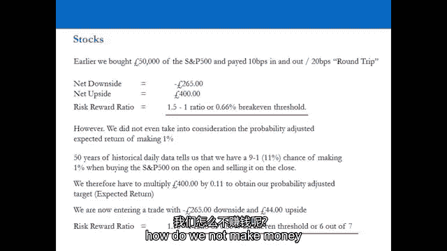
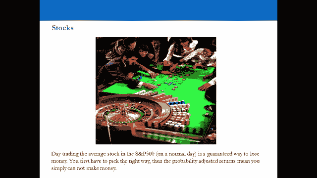
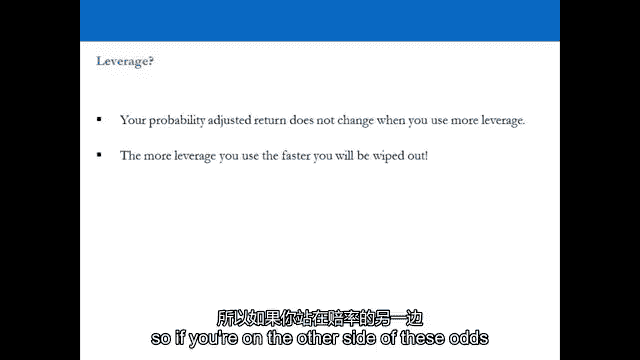
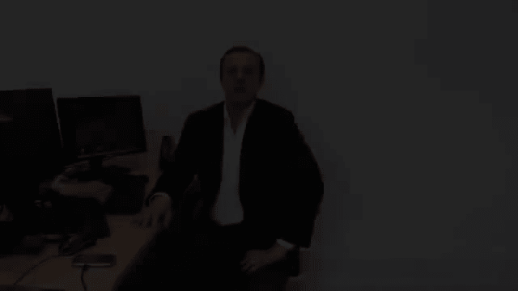

# P3：3-3.第3讲 分布和赔率计算 - web3深度学习 - BV1be4y1c7ir

好的，欢迎回来，欢迎收看视频三，干得好，你在第二个视频中幸存了下来，现在我们要把我们在第二个视频中学到的东西，并真正开始将其应用于现实世界，现在，我们怎么开始，为什么这是现实世界，嗯。

我们在视频中也经历过的这些原则，本质上，我们要做的是尝试采取专业交易员的方法，它总是从下载世界上公开和免费的数据开始，现在把数据下载到Excel中，为什么这很重要，嗯，我们打算一石二鸟。其实。

因为我们要做的是下载S和P的数据，五百英镑，美元，欧元，美元，所有主要的，四对x指数，基本上，你首先会看到的是，在特定的时间范围内，你会看到零售教练所做的，零售教练对那些总是赔钱的人来说怎么样。

他们交易这些工具，并训练他们以一种他们实际上一直赔钱的方式，因为他们所做的与专业交易员所做的相反，就是始终如一地赚钱，你将要看到的第二件事是如何做这个过程，你如何经历这个过程才能真正进入这个世界。

获取数据，下载它，在Excel中操作它，所以你掌握了数据，你了解你即将进入的市场，就现有的机会而言，机会是什么，在这个市场上赚钱，一次，你明白你会开始真正理解。

为什么专业交易员对零售交易员采取相反的方法，因为这真的是你作为一个专业交易员要学的第一件事，就像进入这个世界并获得明智的数据一样--数据很重要，因为数据告诉你，在任何特定市场，在任何资产中。

在任何时间范围内，所以这个过程可以重复，这真的很重要，因为数字不喜欢，所以我们要看的是历史波动，所以任何给定市场的历史波动都会告诉你，你的机会是什么，以及你应该期待的赚到一定数量钱的几率。

当我们经历了历史的波动，将要发生的是克里斯，克里斯托弗·奎尔，我要把你介绍给他，在我们上台并完成演示之后，在研究所工作的克里斯托弗·奎尔，要在他的电脑上通过，你如何一遍又一遍地重复这个过程。

你不应该害怕它，这不是一个困难的情况，因为一旦你真正学会了，你已经学会了，你可以经历这个过程很多很多次，这样你就可以走向世界，下载世界上任何资产的数据，只要你能得到这些数据，你知道这个过程。

你可以计算出你在任何给定时间内赚钱的机会，所以我们要去舞台，现在我们切换到我要介绍的舞台，我正在浏览这些数字，以及这个过程实际上是什么样子的，然后我们会回来，克里斯将向你展示如何真正经历这个过程。

所以你可以在一生中一遍又一遍地为自己做这件事，这真的很重要，因为这是专业交易员的方法，数据不会说谎，数字不会说谎，每个专业交易员都知道，一旦你有了这些知识，它非常非常有力量。

专业拖车员在第一年就会学到很多，甚至几个月后他们加入这个行业，你知道我知道，因为我在这个行业工作过，我在高盛工作过，萨奇一直在纽约参加研究生培训项目，这是你从拖车开始学到的，这是你学到的第一件事。

所以你们绝对应该学会如何通过这个过程，所以你可以理解机会，所以事不宜迟，让我们上台，那部分结束后我在办公室见你，我们将通过克里斯的电脑，Chris将在Excel中向您展示如何做到这一点。

并将互联网作为免费可用的资源，所以你可以一辈子都这样做，好的，所以让我们再来一遍，提供一个框架，让零售贸易商效仿持续盈利的专业贸易商，因此，您可以从相同的方法中受益，一切从哪里开始，它从处理数据开始。

你首先要做的是，了解你即将交易的行为和趋势，只有当你这么做的时候，你可以开始理解潜在的好处和坏处是什么，和，一般来说，在投资银行的任何一个像样的分析师项目上，或者在规模相当大的对冲基金定制培训项目。

规模相当的对冲基金实际上只有20名员工，这将是你被教导的第一件事，你会被教导如何做到这一点的过程，运行发行版并计算出赔率，并计算，计算赚到一定数量钱的几率，所以你实际上可以概率，从上到下正确地做每件事。

数字会不言自明，因为每次你这么做，数字在那里他们在那里，他们是什么，其他一切都只是噪音，作为交易员，你的工作不是与数字争论，这是从数字给你的信息中收集到的，什么重要，什么不重要。

所以我们前面用的例子是S和P，五百，世界上最大的股票市场，我们再来看看股票，看看S和P，五百，我们要做一个S和P的日回报分布，五百回到五十年前，S和P 500是多少，这只是500只股票的平均回报。

所以五百只股票的收藏数字非常，与个股本身非常相似，你可以想重复多少次就重复多少次，在这五百只股票中的任何一只，会发生的是，这些数字会相当相似，股票会，数字会倾向于平均，在大数据集上。

我们这里有一个50年来的巨大数据集，这些数据是从哪里来的，我是从专卖店买的吗，我订阅了一个每月500美元的网站吗，我是每月付给布隆伯格两千美元吗，否，我从雅虎得到的，金融，都是公开的。

我们贯穿整个课程的原则，所有这些信息都是公开的，所以你不必依赖任何东西，你不必是日本公司的高尔夫球手，所以你真的去雅虎财经，点击主页上的S和P 500，你会被带到页面，转到左手边的菜单上，点击历史数据。

你可以选择每天、每周、每月，包括你的不包括股息，点击每日，点击获取价格，滚动到屏幕底部，下载电子表格，你会被高高举起，低而近，OHLC数据开盘高开低走，我们对什么感兴趣，我们对开放和封闭感兴趣。

我们在看S和P的每日波动率，五十年来每天五百，从打开到关闭，那么我们赚钱的机会窗口是什么呢？如果我们在外面买，在衣服上卖，说我们低价买进有点牵强，在高处出售，五十年来的每一天，你得是个超级交易员。

不存在，所以这是一个稍微现实一点的期望，所以我们有一万二千七百三十二个交易日，从1962年到2012年，我们使用性能门，就像回报一样，看看分布是什么，我们得到了什么，我们看到从-0。5%到零%。

三千一百四十一，从0%到0。5%的交易日，三千四百四十七，这意味着在负0。5%到正0。5%之间，一万二千七百三十二个交易日中的一半，大约一半，但是当你乘以频率，你得到了一天的平均回报和更新。

就像这一边的平均回报和零的另一边的平均回报一样，但到了第三点，在低迷的一天下降了3%，更新后上涨5%，所以更新市场的上涨比下跌时稍微多一点，这是有道理的，因为50多年来市场一直在上涨。

但如果我们把频率加起来说，1。股市下跌了几天？市场上涨了多少天？嗯，百分之四七的日子市场都在下跌，这意味着如果你在开盘时买入，在收盘时卖出，百分之四十七的时间，你就错了，百分之五十三的天是在。

所以如果你在公开场合做空它然后买回，你衣服不够，百分之五十三的时间应该是错误的，所以在过去的五十年里，市场上涨了成千上万个百分点，但如果你每天都交易，你就赚不到钱了，因为市场不是每天上涨80%。

每天下跌20%，差不多是五五开，当你选择你的方向时，你是否会是对的，但是分布实际上是什么样子的，所以说，谁知道什么是正态分布，我想你会做的，在CASS教学，这里的商学院，不是在酒吧。

你应该知道什么是正态分布，正态分布，一个标准差是百分之六十八的情况，百分之六十八的时间，是啊，是啊，但是股票市场的分布不同于正态分布，离得太远了，S和P 500的实际分布在均值附近更峰值，尾巴比较肥。

在这些事件之间有一个真空，那么这意味着什么呢，这告诉我们标准差是什么，标准普尔的一个标准差日，五百是百分之七十八的次数，所以就叫八十吧，这意味着百分之八十的时间，正常的一天，市场向上或向下移动第三点。

百分之五和百分之二十的时间，市场波动，它通常会猛烈地向上或向下移动，两者之间没有什么，这有道理吗，这就是我们要交易的动物的行为，但是我们甚至还没有增加佣金，那都是毛数，但是在我们加上佣金之前。

让我们计算一下赚到一定数量钱的总几率，所以如果你在公开场合买了，在过去的五十年里每天都在卖衣服，你赚到0。5%的概率是4比1，所以两个5%的机会赚到0。5%，使百分之一，几率是百分之九到十一。

我们之前看到这个数字，如果你做空是为了赚0。5%，你就会有四点四比一的赔率，和九分半比一的赔率，所以缩短赚钱的几率稍微差一点，这是有道理的，因为市场上涨的幅度稍微大一点，它上升的日子比下降的日子多。

市场上涨了五十多年，所以数字很高，是啊，是啊，现在当您添加调试井时会发生什么，让我们做一个理论练习，计算出佣金的水平，如果我们按标准费率支付，我们根本不能日内交易，因为我们所有的回报都低于零。

如果加上三点五的佣金，这是相当合理的，因为这介于执行率和咨询率之间，因为35。5意味着17块半，十七岁半出去交易，这是一次往返旅行，如果你把它加进去，所以在正常的一天，如果你在，十七步半指出。

在过去的五十年里，你尝试日间交易，你真的没有机会赚钱，这些是数字，这就是野兽，野兽已经告诉你它的所作所为了，这并不难，所有的数据都是公开的，回到这张幻灯片，现在我们知道我们从哪里得到了重点，一个。

11%中的一个，因为你有11%的机会买标普500，根据五十年的历史数据，你会做一个，i，e，它击中了你的目标，所以如果你做相反的事情，你在干什么，你在和野兽争论，80%的时间市场，野兽睡着了。

20%的时间野兽醒来，所以说，如果我们把这些点联系起来，试图找出一个明智的交易策略，从野兽身上赚钱，我们如何把钱赚得很好，首先呢，我们怎么不赚钱。

通过日间交易野兽，因为80%的时间，我们赚不到钱，五天只有一个，他们不是每周一或周五都来，五天一个，我们将有机会在一天内交易和赚钱，或在短时间内，但当你看着，当你翻阅过去的数据时。

那些波动期都是同时发生的，为什么是因为在期望改变的世界里发生了一些大事，然后波动性上升，机会出现，短期赚钱的机会，那并不意味着，机会不存在句号，这只是野兽的本性，百分之八十的时间，没有一天赚钱的机会。

那么你有什么可做的，你要做什么，你必须增加你的时间范围，所以你必须增加你的时间范围，给自己一个赚钱的机会，给自己一个机会，还是给野兽一个让你赚钱的机会，有道理，只是每天买卖S和P。

500美元决定一个方向就像去赌场一样，所以你有两个选择，你要么走进赌场，三点钟喝醉了，m，和你所有的朋友，把钱换成筹码玩轮盘赌，并以娱乐为目的，或者你可以在午餐时间去，完全清醒地打卡。

谁将赢得每天赚钱的机会。

真的被广泛误解了，但这些数字是S和P中每只股票下面的数字，五百，不管别人怎么说，随着时间的推移，都会倾向于平均水平，其他的都是噪音，如果你学过日内交易策略，教你的人要么自己不知道这一点，或者他们只是。

或者他们知道，他们完全不负责任，可能是因为利益冲突，现在你知道这些数字了，他们不会改变，现在你知道这些数字了，你可以知道你知道问这个问题，你可以把这些数字放在任何人面前，给你一个日间交易策略。

谁说我的日间交易策略有效，你可以把这个放在他们面前说不，它没有，它只工作了20%的时间，但是，这就是为什么绝大多数散户只是给市场开支票，每天，因为他们要进去，我在以同样的价格买卖东西，我付佣金。

完全是绝症，你就会归零，主要货币对呢，让我们来看看斯特林我们，美元电缆，谁知道它为什么叫电缆，是啊，是啊，所以用来连接英国和美国之间电报的铜线，所以搅动美元，最近十年的数据。

我们最终会得到什么来让这个变得像样，我们必须把参数从0。5%减少到0。25%，否则它看起来会在页面上看起来很可笑，所以说，但你把数字加起来，你又回到了大约一半的时间，在负0。25%到0。25%之间。

所以两千八百个交易日，你最终得到了一千多个，一千，一百在这些参数内，更新的平均回报是多少，相对于低迷日的平均回报，当乘以频率时，点二三向下，两点二，低迷的日子，四十，百分之九的天，向上天，五十。

百分之一的天数，所以英镑对美元升值，英镑在过去十年里基本上做了什么，它做了什么，它从一个半变成了两个，所以一磅买一磅半美元，买两块钱，然后从两个变成了一个半，这就是它十年来所做的。

所以它在十年内上升了百分之三十三，下降了百分之二十五，所以非常令人兴奋是吗，但每天都有50%的机会不是上升就是下降，分布的概况如何，一个标准差是74%，相对于平均值附近的正态分布，尾巴较胖。

所以不得不说，与股票市场相似的概况，但报酬较少，卖出美元赚到一定数量钱的几率有多大，以3。02比1的比例购买时，可以赚0。25%，百分之零点五六比一，在你决定做空的那一天做空，你有四分之一。

百分之二十五，你得了三点三比一，胜算，和0。5%的6比1，佣金我们还没有加，这些都是毛数，我希望你不会因此而太沮丧，你不需要沮丧，因为这很有趣，一旦你知道这些数字。

你在精神上比市场上百分之九十九的人都强，然后你学会在那种环境中工作赚钱，如果我们付23个基点，你的一美元呢？我们不会太纠结于此，我可以告诉你这和英镑美元完全一样，当日相同回报，上升二十五，下降二十四。

相同的分布概况，百分之七十二点五乘以一个标准差，25个基点，在正常的一天里，在所有情况下都会把你消灭，我们兴奋吗，日间交易货币更加被误解和过度夸大，因为每个人都会告诉你货币市场的流动性如此之强。

你每天有4万亿美元的市场交易，谁在乎液体越多，有些东西是，机会就越少，作为一般规则，流动性不一定是，流动性不足不一定是你的敌人，流动性不足既是你的朋友，也是你的敌人，因为如果你站在流动性不足的正确一边。

一切都会朝着对你有利的方向发展，外汇市场有机会的整个论点，是一个荒谬的论点，对你来说无所谓，因为实际上，每天交易的大部分货币，只是公司对冲他们的货币风险敞口，他们对货币没有看法，他们只是在对冲风险敞口。

作为一个零售商人，这一点也不重要，甚至对冲基金经理，杠杆不会改变胜算，几率保持不变，这只是意味着你使用的杠杆越多，所以如果你在这些赔率的另一边。

你本质上是什么，因为这些赔率是不利的，让我们从那个开始，当你说胜算不大，嗯，让我们用，呃，体育类比，让我们用呃，我们把一个轻量级拳击手和一个重量级拳击手放在拳击台上，所以阿米尔汗和大卫哈，你去西藏赌场。

谁是赌场，是庄家，是威廉·希尔，是小伙子布鲁克斯，所有这些人，是啊，是啊，但公平，他们在做所有的价格，那么他们实际上在做什么，他们在打赌，他们是制造胜算的人，那么博彩公司会给你什么。

在第三轮击倒大卫·海，你觉得他们会让你付出什么代价，1。你在开玩笑吧，你会想要比那高得多的，当你想要千比一或百比一的时候，至少这不会发生，是他体重的两倍，对呀，所以你会得到非常非常大的赔率，是啊，是啊。

你给大卫的赔率是多少，嘿嘿，只是赢得了战斗，你觉得怎么样，埃文斯说她会得到更好的赔率，当你可能变得更糟的时候，你可能会得到与S和P 500相反的结果，你可能得到11比1，正好相反，所以你赌一块钱。

你拿回一美元十一美分，因为他的胜算很大，那么我们该怎么办，作为交易员，如果我们知道这些数字总是对我们不利，我们该怎么办，我们该怎么办，你必须，你必须让胜算对你有利，所以每次你做某事，你知道吗。

胜算对你有利，有道理，因为博彩公司在赔率的另一边，他们90%的时间都会赢，所以你得反其道而行之，为了实现他们得到的机会，他们暴露在，是啊，是啊。

好的，所以欢迎回来，我希望你能稍微理解一下这个过程，你知道这个过程显然是新的，所以不要害怕，一旦你经历了这个过程，几次，你会开始真正理解散户通常会犯的错误，在他们通常交易的工具中，因此。

你将开始真正理解相反的方法，就像专业的方法一样，这种方法，我想你看到的数字可能有点令人震惊，所以当我们看主要指数和主要货币对，这些是散户一直在交易的工具，他们倾向于在很短的时间内进行交易，现在。

我们在这里模拟的是历史数据，和历史波动率分布，我们在这里模拟的是日内交易，我们在一天的基础上使用从开盘到收盘的数据，当你看股市的时候，股票市场标普500，它只是一种表示。

一只标普500只股票的平均回报率，所以当你看到标普500指数中的500只股票时，他们会倾向于这种分布，所以你可以在任何500种股票中重复这个过程，数字会更不稳定，但随着时间的推移。

它们都倾向于向上或向下的中心数字，股票市场的三个五个基点，在下载部分，你会看到其他主要指数的数字，你会看到它们实际上非常非常相似，所以这应该向你发出一个非常非常强烈的信息，在那一点八十五。

百分之八十五的突破，甚至阈值要你概率调整，在标普500指数中占百分之一，应该开始改变你作为交易者的预期，因为这个市场本质上告诉你的是，很少有机会发生在一天的基础上，事实上，当你看分布时。

我们已经看到了在S和P中正常的一天，五百是百分之七十八的次数，这意味着80%的时间，几乎没有一天赚钱的机会，这在主要货币对中非常相似，因为在主要货币对中，正常的一天是73%的时间。

这意味着大约四分之三的时间，基本上没有日间交易机会，或者这些主要货币宠物的日内交易机会很少，我们谈论的是散户一直在交易的工具，斯图美元，欧元美元在下载部分，你会看到更多不同主要货币宠物的数据。

你会看到这些数字在所有方面都很相似，适用于所有主要货币宠物，所以当你看这个的时候，你想得很好，我的目标是用自己的钱赚钱，不要从中获得任何收入，它非常清楚地表明，如果你要进入这个市场。

市场告诉你你的机会是什么，很明显，它首先告诉了你一些事情，它在告诉你，你不能从中获得收入，因为其次也是最重要的，随着时间的推移，你不能从中赚钱，因为当你在一天的基础上交易这些工具时，所有这些都会发生。

在正常的一天里，胜算总是对你不利，这意味着随着时间的推移，你的账户只能归零，您的培训帐户只能为零，现在另一边是什么，另一方面是那些对自己有利的人，因为他们在增加他们的时间范围，现在您可以重复这些过程。

Chris会在下一个视频里给你看，你如何在一天的基础上重复这些过程，按一周计，按一个月计，非常非常直接，别害怕做这件事，因为一旦你学会了怎么做，你已经学会了如何永远做这件事。

这是你作为一个真正的拖车应该学习的第一件事，不是赔钱的散户，想随着时间的推移用自己的钱赚钱的交易者，并扩大他们的账户以变得更富有，现在这些数字不会改变，数字不言自明，市场告诉你你的机会是什么。

你不告诉市场你在任何时间范围内能赚多少钱，当人们利用，这些数字，不要改变，市场不在乎，所以说，你是否在这个训练策略上投入100美元，或者你把十万美元，一百万美元或一亿美元投入到这个战略中。

只是意味着一件事，您的帐户将为零，市场不在乎，它没有记忆，所以我想这可能是最令人震惊的事情是，当您在保证金帐户上进行培训时，你借钱是为了用自己的钱进行保证金交易，无论你在这个策略上押一亿还是一百万。

这是一个根本行不通的策略，那你为什么要投入更多的钱，这在逻辑上没有任何意义，不管你要做什么实际上是在另一边，如果你要利用，你应该只利用实际有效的策略，克里斯将在第四段视频中向你们展示。

你实际上是如何经历这些过程的，所以你可以用Excel，只要你能得到数据，你可以用世界上任何地方的任何资产做到这一点，所有主要资产类别，所以跨指数，库存，如股票，合并货币，商品与种族。

您可以为任何资产这样做，只要能拿到数据，所以让我们去找克里斯，克里斯将在视频四中向你展示如何在电脑屏幕上做到这一点，所以你可以永远这样做，在你的余生中，这将为你节省一大笔钱，它将为你进入策略奠定基础。

