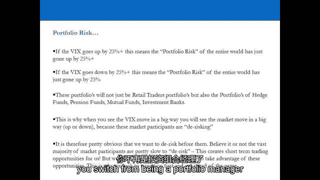
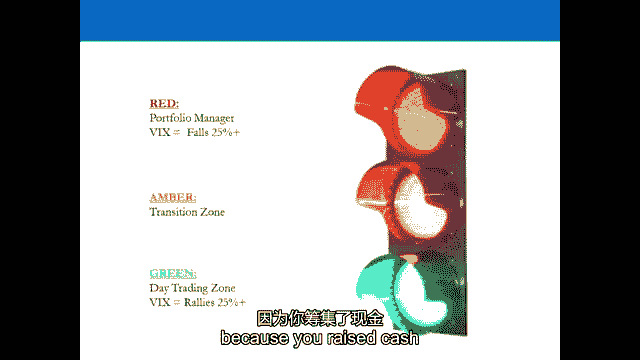

# P5：5-5.第5讲 波动性评估 - web3深度学习 - BV1be4y1c7ir

好的，欢迎回来，欢迎，呃，到第五个视频，在第四段视频中，我们研究的是通过分布计算赔率的重要性，本质上，我们研究了什么是历史波动性，和，历史波动让我们对机会有了很好的了解，在任何给定的时间范围内。

我们都要交易的资产，但同样重要的是，呃，计算未来或预期波动率，在我们即将交易的资产中，散户并不真正理解这一点，并不真的做任何事情，甚至专业交易员，很多专业交易员认为，零售培训师认为。

如果他们研究隐含波动率，当他们看着它的时候，他们以某种方式解释它，他们解释它，他们以不正确的方式解释它，如果你喜欢，你会发现为什么不一定是这样，下一节不是真的，因为隐含波动率实际上是关于两件事。

这是你期望的未来机会，但它也为您提供了一个管理风险的好方法，所以我们不再关注历史波动，我们现在研究的是资产的隐含波动率，将来会发生什么，现在，这里的一个大问题是散户，告诉市场他们将如何交易。

所以让我们考虑一下，如果你要交易或持仓的市场，在接下来的三十天里，比如说，或者期待它上升，那是什么意思，这意味着市场现在期待，短期机会将进入市场，反之亦然，如果隐含波动率在下降。

那么这意味着短期机会有望从市场中出现，现在，成功的专业培训师是做什么的，他们没有告诉市场他们将如何交易，就像不成功的零售教练，他们只是让市场告诉他们本质上，未来的机会是什么，他们适应了。

他们在短线交易者和长线交易者之间转换训练方式，现在，这是我真正想让你做的主要事情之一，从这段视频中，就是当你当我们走上舞台，我希望你把注意力集中在这份声明上，波动性是交易者最好的朋友。

也是投资组合经理最好的朋友，最大的敌人，因为这与机会和风险管理有很大关系，就像在短暂的机会中一样，中期和长期，也管理你的短期风险，中等，和长期，对中长期交易者，依赖于来自市场隐含波动率的信息。

所以请专注于那句话，当我们切入舞台，波动性是交易者最好的朋友，也是投资组合经理最大的敌人，我们接下来要做的是，我们回到办公室后，然后我们将进入视频六，Chris将向你展示如何计算你的，如何计算自己的。

对于任何资产，这样你就可以使用你已经学会的历史波动性度量，并添加到上面，克里斯将在第六个视频中教你的隐含体积测量，好的，所以让我们去舞台，那一节之后我会看你的总结，所以现在我们要更多地关注波动性。

波动性对一个专业的交易者来说真的很重要，资产，资产的波动性概况，决定了你的机会是什么，而不是相反，别告诉市场你能赚多少钱，今天，市场告诉你，有人听说过这个吗，s和p，五百波动率指数。

有人想解释一下是什么，正确，是啊，是啊，但它到底告诉了我们什么，是啊，是啊，隐含波动率，我们之前看到的是历史波动，我们现在看到的是隐含波动率，它是前瞻性的三十天，它是一个年化的数字。

所以期权交易者暗示的是波动性，通过他们的价格，s和p，500个选项，这是未来30天隐含的波动性，然后将当他们预计更多波动时会发生的事情年化，他们提高期权的价格，因为他们不想做空，低价波动性。

如果他们预计波动性会相反下降，会发生什么，选项变得更便宜，但这真的很重要，VIX本身非常重要，因为短期或任何时间范围内的波动性，本质上是交易者最好的朋友，因为如果你在任何时间范围内都有它，你有机会。

因此，能够预测波动性是至关重要的，为什么？因为另一方面，波动性是专业交易员最可怕的噩梦，投资组合经理最可怕的噩梦，对不起，所以你基本上是作为一个交易者，你是波动的奴隶，我们看了历史波动，这是野兽。

这就是它的行为，隐含波动率，就是我们期望野兽在接下来的三十天里的行为，按年计算，有道理，所以当隐含波动率上升时，它上升得很快，发生了什么，专业交易员的方法会发生什么，它改变了，因为在80%的日子里。

关于标准普尔500的历史波动概况，世界上最大的股票市场，什么都没发生，那么专业交易员的做法是什么，百分之八十的时间，它实际上是运行和维护投资组合，有一至三个月的时间范围，但当事情发生时，波动率上升。

预期或隐含波动率上升，那么一个专业的交易者擅长什么呢，他们必须迅速从投资组合经理转变为短线交易者，这有隐藏的后果，人们并不真正欣赏，我们现在要看一个例子，只是一个小投资组合，一百万美元的总风险敞口。

那是一个很大的散户投资组合，但这是一个小银行或对冲基金的投资组合，让我们对这一百万美元的投资组合做一些假设，所以我们有一百万美元的总风险敞口，我们只是假设所有的风险敞口都是现金换现金。

所以我们得到了投资组合的长期价值是50万，短值五十万，以及所有5万美元的职位，i，e，5%的位置大小，如果是S和P，我们对这个投资组合了解多少，五百个投资组合，长与短，嗯，从历史波动概况。

市场在正常一天平均上下三个五个基点，是啊，是啊，所以平均来说，如果你什么都不做，百分之八十的时间，你会赚或损失3500美元，有道理，这就是你的s和p的波动性，五百个投资组合，但是如果S和P。

500波动率预计在未来三十天翻倍，嗯，很明显，你在期待你的利润或损失，一天的波动性将翻倍，所以发生了什么，一百万美元不再是一百万美元了，是两百万美元，所以你什么都没做，如果波动性翻倍。

你有一个典型的标普500多头的空头投资组合，如果波动性翻倍，你什么都不做，你冒了更多的风险，这有道理吗，那么你认为在高盛的早间会议上会发生什么，当所有的交易员在七点进入会议室时，m。

他们有十亿美元的曝光率，多空，衍生品负责人表示，波动性正在蔓延，我们预计它将上升到下周的非，农业工资单，你觉得会发生什么，老板的口信是什么？他们拿走了更多，他们什么都不做就冒了更大的风险，如果你对冲。

你的总曝光率上升了，那么来自高层的信息是什么，减少暴露，把你的曝光率减半，摆脱所有你并不真正想要的职位，你想要的职位，就把一半的头寸交易出去，尺寸，所以如果你在x y z有一个3000万美元的多头头寸。

你的观点是它会永远上升，这并不重要，因为现在当市场波动翻倍时，x y z的风险是翻倍的，你什么都不做，当他们切换时会发生什么，当他们切换好时会发生什么，当你卖出头寸时，你会得到什么，你降低了你的风险。

但你实际上收到了什么现金，或在交易账户中，零售贸易商帐户，您将获得可用的保证金，所以你在你的账户中释放了保证金，是啊，是啊，那么这意味着什么呢，如果波动性开始移动，它开始上升，你减少了你的总体曝光率。

您现在帐户中的缓存暴露比以前高，然后你拿着这些钱去做什么，你被告知一个非常强烈的信息，然后你拿着这些钱去做什么，你开始短线交易，因为现在野兽告诉你，你好，交易员先生，我决定醒来。

我只是用世界上最大的股票市场作为例子，当然啦，你可以，所以如果你想，你知道，这里的过程是最重要的，因为如果我给你看这个世界上最大的股票市场的东西，我会一步一步地指导你怎么做，你理解思维过程。

然后你就可以拿着所有的电子表格开始四处寻找其他的东西，那是你的工作，不是我的，我不是来抱抱的，喂你，就像我们一开始讨论的那样，你必须有自我启动的心态，你已经得到了，因为你问的第一个问题很好，安东。

你能不能，如果我拿着电子表格，我能去找波动率吗，你当然可以，这就是我把它给你的原因，所以你得自己做，当你看到波动率指数上升时，你实际上看到的是，未来三十天的隐含波动率。

你在这个数字中看到的是每上升一个单位，世界上每个人的投资组合都增加了另一个风险单位，在某个时候，如果它继续上升，现在必须降低风险，这并不一定意味着市场会下跌，因为VIX的隐含波动率。

它是未来30天的隐含波动率上升或下降，很多人都忘记了，所以你要尝试做的，作为一个交易者，要根据，你是根据历史波动性来做的，证据，一至三个月的时间范围，这是所有专业交易员都做的。

投资银行的支柱功能和对冲基金，他们这样做是有原因的，这就是原因，然后当波动性上升时，你必须转换，你从投资组合经理切换到动物交易员。

和过渡进程，过渡过程只是一个你筹集现金的时期，因为缓存使您能够利用短期机会，如果你什么都不做，你的风险，如果波动率上升100%，你什么都不做，风险就会翻倍，然后你是头灯里的兔子。

谁会把底层的一切都交易出去，为那些真正预见到它的人提供流动性，谁过渡并做了一些事情来筹集现金，如果你筹集现金，然后你就有权进行短期交易，你没有短线交易的权利，如果你什么都不做，风险就增加了一倍。

你有一点现金可用，所以你想通过撑船来弥补你的损失，只有当你降低风险时，你才有权进行短期交易，你会看到这种情况一次又一次地发生，在投资银行和对冲基金，一个人被前灯挡住了，被叫进房间。

老板实际上不得不放弃这个职位来换取他，因为那家伙现在冻僵了，他不知道该怎么办，然后他要么被告知回家，要么坐在桌子上，忽略市场上正在发生的事情，因为他不被允许进行日间交易。

但这就是一切--这是你学到的第一件事，当你开始学习成为一名专业交易员时，这将是这将是你练习的第一年，作为投资银行或对冲基金，做投资组合经理和转换，这就是为什么你知道，4。

我从来没有说过一个周末或一天就能学会交易，它根本不能，因为你必须经历这一点，真正理解它，所以你应该看波动率指数的方式，真的是一个非常简单的交通灯系统，如果VIX上升一定量，顺便说一句，没有规则手册。

你真的不能去史密斯的水石或黑井，买一本书什么时候买卖波动率，这完全是主观的，你自己的风险都是主观的，这只是信封背面的情况，随着时间的推移，超过许多，很多年了，如果你坚持这个想法和这个过程，你应该没事。

如果它上升两个五，发生了什么事？世界上每个投资组合的风险都上升了25%，你一定在做什么，如果你什么都不做，你是头灯里的兔子，所以你得做点什么，你进入日间交易区是因为你被允许，因为你筹集了现金。

你一直很积极主动，所以这绝不是一个硬性规定，所以不要认为这是一本规则手册，没有规则，对你自己的风险是主观的，是啊，是啊，但这对你一生都有好处，如果你在世界上最大的股票市场交易，是啊，是啊。

如果它在过渡和上升，如果波动率指数本身移动了25%，是啊，是啊，粗略地说，只要把你投资组合中的所有东西减少50%，或者摆脱投资组合中一半你并不真正想要的头寸，你怎么走到那个阶段，我们就给他们排名。

如果你有二十个位置，从一到二十个最喜欢到最不喜欢，这并不难，我摆脱了倒数十名，当它处于转型和下降的时候，世界上的投资组合风险也在下降，那么你被告知了什么，野兽告诉你嘿交易员先生。

现在拥有一个投资组合的风险更小了，所以你开始把现金投入工作，你想投资于一个投资组合，多空投资于你最喜欢的想法，在您自己的风险管理参数内固定，所以只要把你剩余的头寸增加一倍，停止日间交易，这就是你要做的。

你会被告知这个信息，因为你会看到波动性下降，你就会开始赔钱，日内交易，就会变得更加困难，这就是为什么在第一张幻灯片上，当我们说谁是这门课的时候，不是为了，它是为那些从不从他们的损失中得到信息的人准备的。

当你开始赔钱的时候，日内交易，你那天把消息，交易机会现在不再存在，所以你建立一个投资组合，你可以在上面暴露很多很多，在市场不会移动的舒适和知识中，一夜之间把我彻底消灭了，因为现在市场预计世界不会有波动。

有道理，所以没有硬性规定告诉你在投资组合中应该做什么，但这对你有好处，这里的第二个警告，在波动率指数被称为恐惧指数之前，人们一定听说过这一点，但不要把它误认为是市场必须下跌的情况。

所以如果世界上的恐惧正在上升，市场一定会下跌，这并不一定意味着在2003年，波动率指数飙升，那是牛市的开始，因为每个人都预计在接下来的12个月里会有一个糟糕的世界，所以每个人都很矮，发生了什么。

VIX指数实际上上升了，因为人们担心他们的投资组合会亏损，净空。

有道理，根据定义，VIX是一个年化波动率数字，为未来三十天市场的上涨或下跌而计算的，也许一件好事是不再称之为恐惧指数，如果你要称之为恐惧指数，无论哪种方式都是对错误的恐惧。

那么人们对VIX问得最多的是什么，好吧，如果这是一个在S和P，五百是给别人的，当然有，六百你有V型股票，你有V脚，V DAX，你有一个波动指数，在雅虎等体面的网站上公开，金融市场，观看网络。

纳斯达克网站，它们都是可用的，你实际上可以交易它们，那么什么是，刚才的建议是什么，当你有一百万美元的总风险敞口时，你会看到波动性飙升，其中一个建议是你对冲，很多人去购买VIX本身来对冲他们的投资组合。

你是否应该这么做，仅仅因为你实际上还在增加你的曝光率，这是有争议的，所以是的，它可能会提供一个对冲，你把自己锁在聚会之外去做日间交易，你可以把一半的头寸交易出去，今天入党，交易，然后离开。

重新建立你的投资组合，在两者之间赚钱，而如果你刚买了一个树篱，你只是不会损失那么多钱，所以这是有争议的，但又一次，对你自己的风险是主观的，我不能告诉你该怎么做，你得自己拿主意，如何计算货币的波动性。

商品和债券，过程是一样的，你会得到电子表格，所以下周会给你发电子邮件，好的，欢迎回来，我希望你能理解其中的一些概念，因为列报中含有隐含波动率，到目前为止，我们只看了赔率和分布计算中的历史波动性。

隐含波动率很重要，因为它不仅向我们展示了我们未来预期的机会，但它也向我们展示了我们预期的风险，因为作为一个投资组合经理，你会有80%的时间，因为我们已经从历史波动中发现，百分之八十的时间。

没有机会做短线交易者，当你是投资组合经理时，它不仅向你展示了预期市场中的机会，它还向你展示了你的投资组合的隐含风险，所以这两件事真的很重要，零售商人经常弄错的一件事是，就机会而言。

他们告诉市场他们将以一种特定的方式进行交易，这就是我要交易的方式，不管这是什么方式，我都要交易，所以他们不听市场和市场告诉他们的，所以就我们学到的机会而言，看看历史波动，现在当你应用波动性时。

80%的时间，没有短期的机会，它这个，在隐含波动率情况下，指数是80%的时间，VIX指数低于25%，当你退缩的时候，这只是意味着在一天的基础上，我们将得到数字，大致是我们在历史波动率计算中看到的。

所以这支持了我们在历史波动计算中看到的一切，现在，对于专业交易者来说，这意味着什么，供专业培训师使用，他们只是把它，就像它一样，他们允许市场告诉他们机会是什么，市场告诉你的，当你看S和P的波动率指数时。

500首先是80%的时间，短期赚钱的机会很少，这意味着你必须增加你的时间范围，所有专业教练都这么做，专业教练不是你所感知的那样，他们不是每天每分钟都在进进出出地训练。

他们实际上是在一到三个月的时间范围内做多做空投资组合，现在，让我们专注于我实际上要关注的这个陈述，呃，但波动性是培训师最好的朋友，也是投资组合经理最大的敌人。

现在我们看了一个100万美元总风险敞口投资组合的例子，我们真的得出结论，如果波动性上升，那么投资组合风险的波动性就会增加，与波动率指数一致，例如，如果你是一个总风险敞口为100万美元的投资组合经理。

和波动率指数，然后呢，所发生的一切就是你昨天的100万美元变成了一天的200万美元，那是因为你投资组合中的PNL波动现在翻了一番，这就是我们正在讨论的警告，第二个警告，即波动性指数，所谓的恐惧指数。

不是害怕波动率指数上升，因此市场下跌，因为波动率指数的定义是它可以上升或下降，所以它不被称为恐惧指数，它之所以被称为恐惧指数，是因为专业培训师主要是投资组合经理，他们自己也会感到波动。

因为它是他们最大的敌人，现在他们有什么要做好的，他们必须过渡，当他们的风险上升时，他们从投资组合经理转变为短期交易员，在这个过程中，他们筹集现金，或在使用保证金的培训账户中，他们提高了利润，他们。

他们有保证金，这使他们能够进行短期交易，所以他们从投资组合经理转向短线交易者，当波动性降低时，所以它们从一个月到三个月的时间跨度，多空投资组合经理减少风险敞口，释放资本，使他们能够进行短期交易。

然后转回成为投资组合经理，当市场告诉他们必须这么做时，他们解释的方式是，他们得到的信息是，机会在短期内正在增加，你投资组合的隐含风险正在上升，因此，你应该从投资组合经理过渡到短期交易员，然后反过来。

如果反过来是真的，我们看到的第一个警告是这个想法，有某种规则手册，没有，我已经在外教书两年了，一直让我震惊的一件事，观众总是举手，人们总是问，所以说，2。在这种情况下我该怎么办，2。

在那种情况下我该怎么办，没有规则手册，你不能去书店，你不能在亚马逊上买书，它说当你交易的资产的波动率指数，去去做这个，我上升了百分之二点五，或者下降了百分之二点五，你应该这么做，这是个人的事情。

因为有些人喜欢做短线交易，有些人喜欢当投资组合经理，他们是两个极端，你不必从投资组合经理过渡到短期交易员，或者从短期交易员过渡到投资组合经理，但你绝对应该知道你是不是其他人中的一员。

如果你是投资组合经理，请遵循以下内容，你看到VIX在上升，现在的情况是你的风险正在上升，所以如果它上升50%，你所有的头寸都是500只股票，你什么都不做，风险就增加了50%，如果你是投资组合经理。

这是第一件事，如果你只是一个短期教练，嗯，你应该从我们目前所看到的情况中吸取教训，大约80%的时间，没有短期的机会，所以你应该只有在机会允许的时候才交易，因为如果你在正常的一天交易，578%的时间。

机会不存在，你只会赔钱，问题是专业交易员一直被雇佣来赚钱，所以他们必须在一个例子中成为投资组合经理，过渡和转换，这是一个短期交易者，在另一个例子中又回来了，所以当你受雇一直赚钱的时候，这就是你要做的。

你不能就这样不参与，然而，零售培训师，不参与显然是现在的一种选择，我希望你收到了所有这些信息，因为至少现在你知道波动率指数是多少了，我们要继续前进，现在，克里斯和克里斯将向你展示如何。

你从期权价格计算自己的隐含波动率指数，只要你能得到任何资产的数据，加，所以你可以为索引做，行业ETF，股票中的股票，商品，货币，利率债券，你可以为任何事情这样做，只要你能从期权市场得到数据。

作为一个零售商人，这里有一个小警告，因为你没有交易高水平的资本，这个，这个练习对你来说不那么重要，你将要看到的电子表格工作，以及计算公式，如果你喜欢在电子表格中，这是相当复杂的，这是相当数学的。

但作为一名零售培训师，你真的不必一直这么做，你应该欣赏它，理解它，知道当修复上升时意味着什么，我们将要展示的，如果你想在投资银行工作，你就更重要，或者你要去对冲基金工作，因为如果你要去这些地方工作。

你会被期望对此了如指掌，因为你在交易大量的资本，数亿美元，这些措施变得非常重要，但作为一个散户，真的，你应该关注分布和赔率计算的历史波动性，我们要给你看的第七个视频，这是平均真实范围。

这是第二次历史波动率计算，我们现在要给你看的东西更重要，如果你要在投资银行或对冲基金工作，但作为零售拖车，欣赏它，知道你可能应该做什么，如果你是投资组合经理，你会看到波动性，往上走还是往下走。

如果你真的得到了，那是额外的奖励，但不要太担心，如果你觉得它有点太复杂了，克里斯现在将在视频六中向你们展示这个，我会看到你回到视频七。

