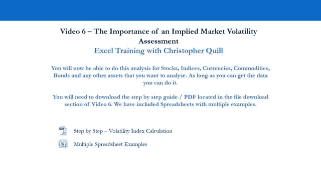
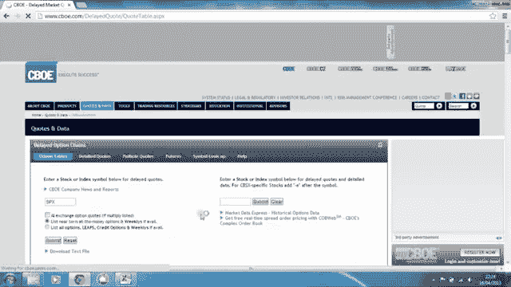
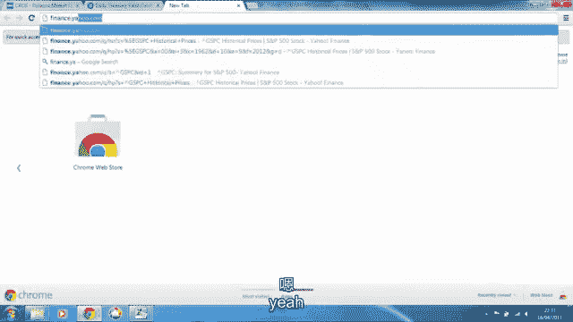

# P6：6-6.第6讲 波动性评估 - web3深度学习 - BV1be4y1c7ir

好的，所以我们现在要再去找克里斯，克里斯将向你展示如何计算你自己的预期，或隐含波动率指数，所以你可以对多个资产这样做，只要你能得到期权数据，所以让我们去找克里斯，克里斯现在会教你怎么做。

在这个视频里，我将给你们举一个例子，您可以计算任何给定资产的隐含波动率，所以看隐含波动率有用的原因是，因为这是我们唯一的前瞻性波动性指标，我的意思是它不依赖于历史价格数据。

就像计算回报的分布或平均鞋子范围，所以它的工作方式是，我们使用一个理论期权定价公式，从市场上观察到的期权价格中收回隐含波动率，在我们开始之前，我会在随附的电子表格上做一个快速的笔记，这个视频。

它已经设置好了，因此，您只能从基础资产的看涨期权中计算隐含波动率，在期权有效期内不支付股息的，所以在这个例子中，我们将考虑500英镑的期权，推断标准普尔500的前瞻性波动性。

所以让我们从打开隐含的vol电子表格开始，所以一旦你打开电子表格，它应该是这样的，现在在左手边，我们有数据输入，这些是我们将要放置的细胞，数据，用浅蓝色突出显示的，是我们唯一需要在这个电子表格上编辑的。

所有其他的，当我们把它放在，当我们输入这些输入和市场上观察到的期权价格时，我们会得到一个观察到的期权价格和一个理论期权价格，我们所做的是，最小化观察价格与理论价格之间的差异，通过将理论价格改为观察价格。

我们通过改变这个单元格中的隐含波动率来做到这一点，所以说，我们获取数据输入的方式是通过电子表格的资源部分，在这个例子中，我们看到的是S和P 500，所以资源部分的设置是为了能够很容易地找到我们的数据。

当你来做你自己的隐含波动率计算，您可能希望添加到此资源部分，所以让我们从打开CBOE网站开始，在S和P 500上寻找选择，所以说。

如果我们点击CBOE，电子表格资源部分的链接，我们去引用和数据悬停在上面，然后离开，点击延迟报价经典，我们可以只使用标准延迟报价，但有时有点喜怒无常，所以我们将在这个例子中使用延迟引号。

我们把SPX放入下面的小费自动报价框中，点击提交，所以SPX是S和P的报价器，500在CBOE网站上。

我们得到了，在此网页上，我们要注意的第一件事，标的资产的现货价格，S和P500显示在此选项数据表的右上方，那就是一千五百七十四点，五七，这是我们电子表格所需的输入之一，所以我们现在就把它放进去。

所以一五，七，四，接下来我将解释这张桌子是如何摆设的，所以我们只看看涨期权，记住，所以我们在看这个网站的左手边，所以调用列，在呼叫列下，我们有所有期权合同的合同名称，1。我们有最后一批货。

也就是期权的价格，上次销售价格，我们有成交量和未平仓的兴趣专栏，它们是流动性的指标，当我们看期权时，从期权中退出隐含波动率，我们想用流动合同，因为价格更可靠，所以当我这样做的时候，今天是4月16日。

所以我会在五月考虑选择，五月届满，所以我用中间的一栏向下滚动到五月和日期，五月十三日，这里，中间一栏也有执行价，所以我们去签五月的合同，我们要去找一份流动性好的合同，并有执行价，那离钱很近。

所以这意味着中间栏中列出的执行价格，离现场很近的，标普标的资产价格，五百，所以我们下去，我们要找到一个可能的看涨期权，执行价一千五百七十元，所以我们给我一千五百七十五，所以这个，它有不错的流动性。

所以我们点击左手边的合同名称，打开这个，它给了我们关于这份合同的更多细节，所以让我们继续，把下一段数据放入我们的电子表格中，这是我们正在考虑的期权的执行价格，也就是1570。

所以在1570年进入下一个牢房，下一个输入是期权的到期日，在我们刚刚导航到的这个页面上，那是2013年5月3日，正如你所看到的美国格式的日期，现在我的电子表格是以英国日期格式设置的。

这将是您提供的默认格式，所以我把这个输入为3，5，2，13，你可以看到这是自动的从今天到那个日期的天数，并自动计算到期时间，以年数为单位，这代表，然后放入理论期权价格，好的，所以在我们继续之前。

让我们指出，你需要改变这个H5单元格的格式，与系统时钟的日期格式相匹配的日期单元格，因此，如果您在系统上使用美国日期格式，您需要将此单元格的日期格式更改为美国格式，如果你不，电子表格的自动化不起作用。

我们是对的，单击单元格，转到格式化单元格，然后改变这里的位置，按，好，我要按取消，因为我的已经设置成英国格式了，所以我们从CBOE网站获得的最后一条数据，是观察到的期权价格，所以观察到的期权价格是18。

93，我们要用上次的销售额，所以18。93，所以我们把189。3放进10号牢房，现在最后一条数据，最后一个输入，我们需要计算我们的理论期权价格是无风险利率，因为我们看到的是500美元。

我们将使用短期债券，所以如果我们点击这个链接获得无风险利率，我们找到一个一个月的，四月份开始的收益率，所以零点不是百分之七，所以我们输入零点零7%，这个单元格已经设置成以百分比显示自己。

所以我们就放了零点七，这是我们最后的数据，现在你可以看到理论期权价格与观察到的期权价格不同，那是因为我们用的是隐含波动率，或者零点一的波动性，这是电子表格打开时的默认值，我们要做的是改变这个细胞。

通过改变波动性来改变理论期权价格，这样我们就可以匹配观察到的期权价格，我们通过最小化这个细胞来做到这一点，这正是这两者的区别，所以让我们继续这样做，如果我们导航到数据，然后右手边的求解器。

如果您还没有安装求解器作为插件，在附带的PDF中有一个如何做到这一点的指南，所以你可以通过安装求解器，然后从这里继续，所以让我们点击求解器，如果你已经安装了银色，它应该给出已经内置的参数。

所以你不需要按任何东西，你只需点击解决，如果没有，它就会起作用，您需要输入这些单元格，所以我们无论如何都要经历它，所以我们要做的是设定目标，也就是卖F十七，即理论期权价格与观察期权价格之差。

我们正试图尽量减少这种情况，20号牢房，也就是波动性，所以你可以很容易地自己设置，然后我们点击解决，这告诉我们几个结果，告诉我们它已经收敛到一个解决方案，所以它的发现和隐含波动率，偶尔。

银如果找不到解决办法，就会有点喜怒无常，你在电子表格中没有犯任何其他错误，试着自己改变波动率细胞，所以这是你唯一应该换牢房的时候，没有用浅蓝色突出显示的，试着改变这种波动性推销自己，所以这个理论定价卖。

刚刚开始向市场价格移动，然后再给求解器一次机会，通常它会第二次起作用，所以我们只要按，好的，这给了我们零点一的波动性，两个，我们在市场上观察到的，那是前瞻性的17天，它把它扩大到。

按年计算该期权内的隐含波动率，所以我们能做的第一件事就是把它和VIX进行比较，因为VIX也是一个，给了我们一个量规，对S和P波动性的理解，五百，所以如果我们去，是啊，是啊，金融，金融，是啊，是啊，他。

说标准普尔500的VIX波动率，现在是139。6，与我们的十二点二相当接近，所以如果你把这个数字乘以一百，那么这就是它应该给的，所以12点2对13点6，呃，以百分比的形式得到它，所以有一点差异的原因。

只是我们计算的方式，与VIX的计算方式相比，所以我们只使用了一个期权价格，并暗示，计算出给定期权价格的隐含波动率，VIX使用了一种更复杂的方法，它平均了许多不同的，嗯。

从一吨不同的期权价格给出的隐含波动率，有一吨不同的选择，不同的执行价格，也用呃，近期和长期，如果你想知道更多关于为什么这个会更低，一般来说，这应该低于VIX，嗯，那是因为一种叫做波动微笑的东西。

在所附的PDF中提到，基本上它表明从期权计算出的隐含波动率，执行价格接近金钱，呃通常低于那些离钱更远的人，所以当你得到VIX时，这是用许多不同的执行价格的平均值计算出来的，它会更高，一般不是很多。

而是一点点，那么我们的S和P期权的隐含波动率，五百差不多了，所以让我们想想我们将如何解释这一点，再多一点，我们知道标准差，所以让我们把它改为前瞻性的，每月前瞻性的标准差，所以23号牢房将使用。

我们键入equals，二十法郎，也就是我们的隐含波动率，平方根所以SQRT括号十二，这样我们就得到了每月的标准差，根据年化波动率计算，它是每月的，因为它使用的是12的平方根，一年就是十二个月。

所以我们找到了每月的标准差，所以如果你想找到两个月的标准差，你只要在这个括号里用6，我们将格式化这个单元格，以百分比显示自己，好的，所以这显示了3。5的标准差，前瞻性一个月的2%，所以这意味着。

如申报表呈正态分布，这就是我们所考虑的，或者当我们看到回报时我们所看到的，资产分配，如果它们是正态分布的，我们可以说六十，百分之八的时间在下个月内，我们预计S和P的基础资产，五百移动三点。

上涨或下跌5%，从历史上的卑鄙运动中，也是，如果你知道正态分布是如何工作的，我们可以把它放大所以晚上95%的时间，有一个九十，S和P在两次内移动的概率为5%，标准差在下个月内上升和下降。

这就是我们对这个数字的解释，所以你可能想回到退货分发视频，看看正态分布是如何工作的，并提醒自己一般的回报分布，基本上，这让我们意识到，期待着交易市场的机会，因此，随着隐含波动率的上升。

我们可以从短期交易中获利，当它往下走的时候。