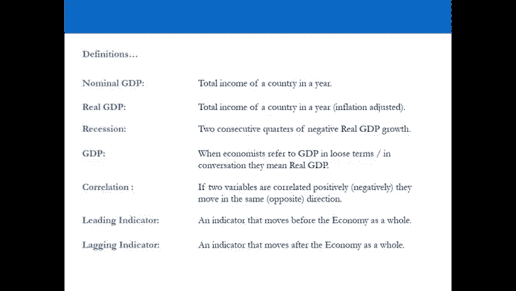
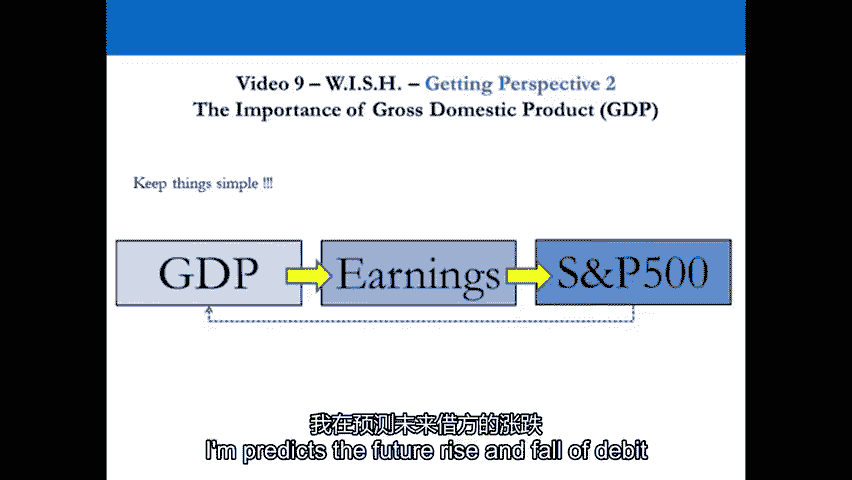
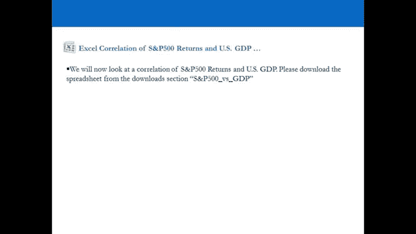
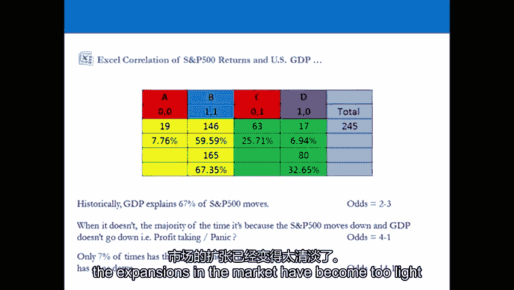
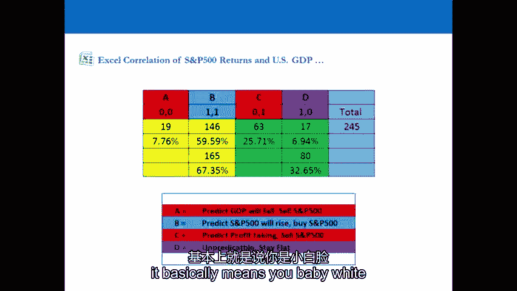
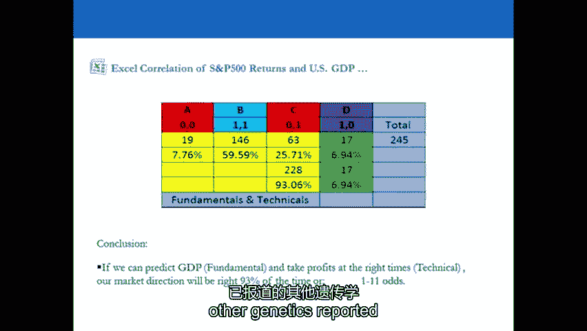
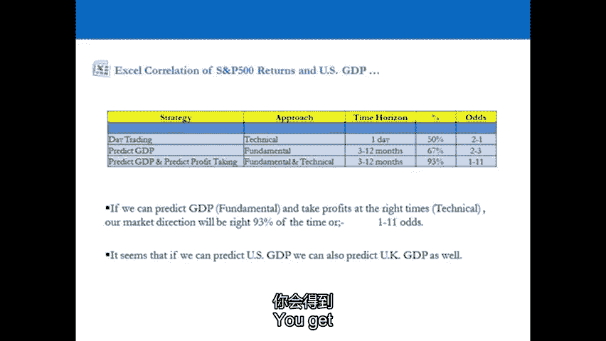
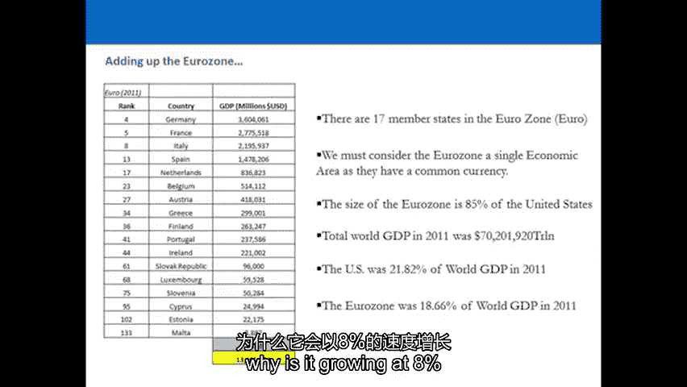
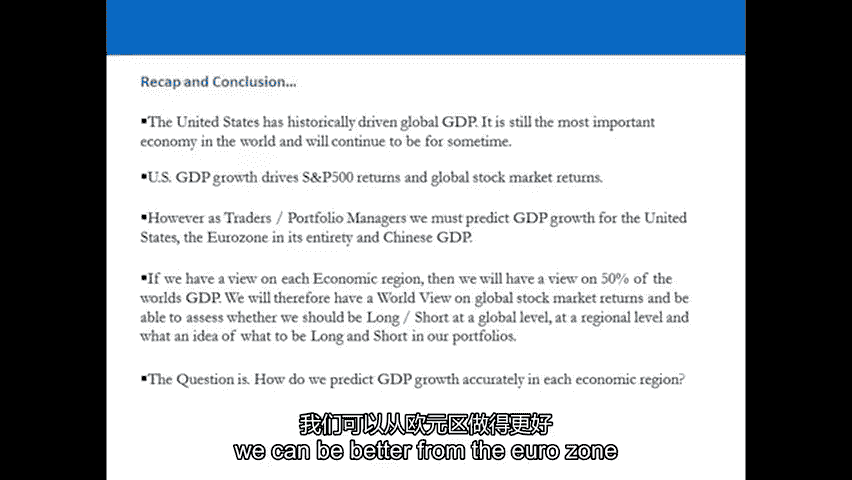

# P9：9-9.第9讲 愿望框架 获得洞察力 - web3深度学习 - BV1be4y1c7ir

好的，欢迎回来，欢迎收看第九期视频，呃，在第八个视频中，我们通过观察和定义我们实际上所处的市场类型来获得视角，不管是牛市还是熊市根据专业拖车的定义，现在我们将继续获得更多的视角。

我们将试图了解是什么推动了全球股市的回报，真正推动全球股市回报的是什么，是一个国家的收入，国内生产总值，我们要看看国内生产总值是多少，并获得国内生产总值的历史视角。

国内生产总值相对于全球主要股票市场和股票市场回报，我们将研究主要是美国的国内生产总值，我们去演示的时候你会看到的，为什么这如此重要，我们将把这与世界上最大的股票市场联系起来。

我们要把这个和标普500联系起来，你会看到的，当我们这样做的时候赚钱的几率，如果我们跟随并能够预测GDP，用股票市场作为预测的代理，你会看到的，现在胜算将大大有利于我们，我们还将比较美国的国内生产总值。

相对于整个欧元区，还有中国的GDP，当你把所有这些区域加起来，你实际上得到了世界总收入的50%，如果我们能找到一种方法来预测美国的国内生产总值，欧元区国内生产总值和中国国内生产总值，我们将有一个非常。

对未来全球股市回报的很好的看法，这就是我们接下来要做的，在我们定义了，为什么GDP如此重要，看看它如此重要的原因，现在我们要走到舞台上，我希望你们真正关注美国的规模，为什么预测我们。

GDP成为专业交易员最重要的事情之一，一旦你了解了美国的相对面积，欧元区和中国的GDP与世界其他地区的对比，你真的会明白什么驱动，股市回报率，然后我们将进入下一个点，我们将尝试开始预测美国的GDP。

欧元区GDP与中国GDP，使用预测未来的指标，好的，让我们来看演示文稿，演讲结束后，我会看你的总结，在自上而下的系统过程中，我们要做的第一件事就是看国内生产总值，我们首先要看的是为什么它如此重要。

一旦你意识到全球GDP某些参数的重要性，你会开始真正理解为什么市场会以这样的方式运行，这个就在顶部，这是我们的世界观，国内生产总值会增长吗，国内生产总值将收缩，它会在美国和欧洲的合同中增长吗。

在中国生长，这些是你必须有的观点，这些观点将决定你在所有资产类别中的投资组合方向，所以如果你认为GDP会收缩，你非常，很长，你的书所代表的一切，您的交易帐户，与你所相信的完全相反，所以你有愚蠢的姿势。

你的书必须完美地表达你的想法，将来会发生，所以让我们弄清楚一些定义，在给定的一年里，名义国内生产总值完全上升了这个国家，经通货膨胀调整的实际国内生产总值，按价格调整，衰退，连续两个季度实际GDP为负。

当你在电视上看到一个人和经济学家谈论GDP时，他们需要一个实际的国内生产总值，所以他们松散地使用GDP这个词，但这意味着实际GDP，你知道什么是相关性，我不会告诉你那是什么，你应该知道，先行指标。

滞后指标，在整个经济之后移动的指标。

那么我们对什么感兴趣或感兴趣，会议表明对什么，预测枪的运动，那么经济实际GDP是多少呢？可以有名义上的升值，但真正重要的是真正的G，这就是股票市场的因果关系，实际国内生产总值，我现在就把它称为gdp。

假设它是实际国内生产总值，是啊，是啊，带动公司盈利增长，公司收益的增长导致了S和P的价值，五百块上去，然而，标普500指数本身就是一个领先指标，并预测广发银行未来的兴衰。

因此至少到了，一家公司报告，市场已经动了，当GDP报告时，市场已经动了，国内生产总值每季度报告一次，它是向后看的，它告诉你过去三个月发生了什么，市场告诉你将来会发生什么，因为每个人都在交易这个市场。

并把它作为他们观点的表达，在世界上试图预测未来，我正在用领先指标来做这件事，所以说，默认情况下，市场成为领先指标本身就有道理，我们现在要看的是一个粗糙的加冕礼，S和P的，五百和国内生产总值。

回到1950年，这样大家就可以，呃，在学位上花很多钱，数万英镑学习如何做相关性，但是如果你把两个变量放在电子表格中，给他们一个零或一个，在给定的时间范围内，它们是否一起移动。

你仍然会得到字面上相同的答案。

所以市场每天都有火车，但是每个季度都有GDP报告，q 1国内生产总值，所以一月，二月三月在四月底报道，Q2全科医生7月底报，十月底公布第三季度国内生产总值，和Q4，四年GDB于1月底报告上一年度。

但市场每天都在训练，所以如果它们向同一个方向移动，我们可以用标普500来预测国内生产总值，现在就把它买下来卖了，如果你有两个变量，只有四件事会发生，他们要么都倒下，他们都上去了，一个下去，一个上去。

或者一个倒下，一个上去，一个下去，所以在一段时间内可能发生的四件事，是啊，是啊，所以你在这里做的，你把每个季度的GDP数据在季度后一个月报告，你喜欢它的时间，所以你看着，所以你把它作为月份。

所以q 1是4月，是啊，是啊，你每月拿500英镑的S和P，因此，每报告一个数字，国内生产总值就会报告，本月有三种收盘价，然后你说，在公布gdp之前，标准普尔指数是上升还是下降，有道理。

所以让我们从1950年Q1结束时的这个开始，美国的国内生产总值是1。69，6。8万亿，一六九六八万亿，好的，那是万亿美元，有人知道今年美国的gdp会是多少吗？去年你说50怎么样，那是十五十六万亿。

你可以看到自1950年以来美国的GDP增长了多少，四月份的标准普尔500指数是17。5，1950年4月3日，呃，S和P 500是1540，现在，一千五百四十，所以如果你以17英镑半的价格买它。

你会做得很好，这是一个很大的结果，但顺便说一句，如果你每天都有白天的特质，你输钱了，国内生产总值上升，所以说，这是一个，这是一个按年计算的本地生产总值数字，顺便说一句。

所以每个季度你都得到美国的年度国内生产总值，所以它从一六九上升，六点八，所以一七四七点三，所以说，据报道，在那个时期是上升的，S和P怎么了，五百，我从十七岁到五十三岁，到1877年，对不起，十七六十四。

所以它是向上的，所以那个月标普500上涨了，在那个季度，当季国内生产总值上升，是的，那么我们该怎么办，但我们在不同的栏里给他们打分，我们有四种情况，一个零，零情况是在四分之一的时间里标普500指数下跌。

然后GDP被报告下降，一个情况是在四分之一，标普500上涨，GDB报告上涨，那么零一是什么，我先付五百元，国内生产总值上升，然后一个零s和p，五百块，国内生产总值下降，我们认为结果是什么。

所以我们来猜一下，一个中哪一个的数字最多，六十多年来，市场一直在上涨，他得到的是什么，国内生产总值从一个，六九六兆到十五兆，这里的结果是，什么的百分之六十，四分之一的60%，所以我们总共有二百四十个。

五个季度，S和P 500上涨了，然后在那一步之后，据报道，与上一季度相比，国内生产总值为正，二百四十五分中的一百四十六分，19个报告为S和P，向下五百步，然后GDP被报告下降。

所以它们都朝着同一个方向移动，67%的时间，在过去的60年里，67%的课程，当它不存在时会发生什么，当它们向相反的方向移动时会发生什么，但绝大多数时候，B 500的s下降了，当它出错时，GDP会报告它。

25%的时间，那为什么，为什么会发生这种情况，这是因为股票市场对国内生产总值的期望值太高了，本季度，所以市场在获利回吐时下跌，然后GDP实际上是向上报告的，所以期望超越了自己，市场价格太高。

一切都有道理，自1950年以来，你只能看到7%的时间，P 500上升了，国内生产总值下降了，所以你几乎可以说这永远不会发生，很少发生，所以大多数时候会发生什么，两件事中的一件会发生。

他们要么朝着同一个方向前进，或者当他们没有的时候，市场的期望太高了。

从历史上看就是这样，gdp解释了标准普尔500指数中67%的季度变动，就赔率而言，这意味着什么，这意味着我们现在有3到2的胜算，如果我们能准确地预测它，五十岁以上，五十，我比日间交易强。

这就是为什么当你增加你的时间范围时，从长远来看，你有更好的机会赚钱，因为你的胜算越来越大了，当它不在的时候，绝大多数时候，是因为往下走了五百步，国内生产总值不会下降，它上涨了。

你会得到获利回吐或市场的短期恐慌，25%的时间都是这样，所以在给定的一年里发生这种情况的几率是4比1，有道理，所以如果一年有四道菜，一年一次，我们应该期待什么，我们可以期待市场上的一些获利回吐。

市场的期望变得过高，然后是之后报告的国内生产总值，但是P500下降了，国内生产总值上升，但是P500已经下降了，在我的住处，我们一年有四个季度，现在发生了什么，如果我们从根本上预测GDP会发生什么。

我们设法在正确的时间获利，但如果你这么做了，你绝对是个超级巨星，这基本上意味着你会是对的。

你一生中93%的时间，从现在到你退休的那一天，百分之九十三的季度，但如果你要那样做，你就要退休了，非常年轻，在精神上像专业交易员一样，你每年都进去，目标赚钱，预测一至三个月的本地生产总值。

用股票市场来代表我的观点，然后当我认为会有获利回吐时，我获利，然后报告GDP。

我们开始得到，就这么简单，那是每个人的做法，你一生中百分之九十三的时间都不会是对的，但如果你能在67到93之间，你不可能不赚钱，你只需要给你的火车计时两次，现在这只在索引上，商品你也。

因为这是经济中的总需求，所以商品是最，商品是周期性的，这样你就可以得到，你通过预测全球和区域来获得全球商品的观点，gdp，您也可以通过这样做获得货币视图，你也可以通过这样做获得你的利率视图。

为什么是因为利率政策对预测的反应，gdp，我们怎么看，所有的，呃，世界各地的政策制定者在制定利率时，所以他们在一天早上醒来，决定我们今天要提高利率，因为我昨晚做了个怪梦，当然不是。

他们对发生的真实事情做出反应，我将来会影响国内生产总值，所以你可以对费率有意见，如果我不能，需求正在崩溃，他们会砸得更低，你可以对这些事情有看法，这就是你得到它们的地方，所以你得到了你的。

您可以跨资产类别获得您的观点，股票市场指数，指数，周期性商品，货币，您所有的主要货币对和汇率，你从你对世界的看法中得到了所有这些观点，你可以做多种交易，所以如果你甚至不想成为一个男人。

或者想交易其他东西的拖车，贸易除外，大盘股指数，期货，商品，货币和汇率，你交易除此之外的任何东西，你不想交易股票，你不要尝试选择，你不要一秒钟就尝试，tx，你什么都不想尝试，你不想走得太深。

那是你的方法，你可以有一个世界观，根据你的世界观来交易这些东西，并试图在正确的时间获利，所以回到对专业教练所做的事情的看法，这就是他们所痴迷的，专业趋势和对冲基金经理痴迷于预测GDP。

让我们来看看一些贝壳，一幅画胜过千言万语，你喜欢图表吗，读者喜爱CH，好的，让我们为美国争取一些国内生产总值的升值，呃，名义国内生产总值从1791年到2011年，变成负数，二千零八年，两千零九年。

英国名义国内生产总值正增长，从1946年到2009年，美国实际国内生产总值对我们来说是最后的，八十岁到八十岁，二次探底，九一一二千零八，2008年有什么特别之处，两千零九年，那次衰退有什么特别之处。

你想要那个，记住衰退的定义是什么，是什么，为什么二千二千零九一特价是什么？四点多了，因为我们连续得到了四个，所以q 3和q 4 0 8，七十年来从未发生过的Q1和Q2 O 9，这就是为什么它很特别。

这就是为什么你现在看到，这就是利率现在为零的原因，当我们翻到下一页时，我们要看看英国，你认为英国在过去的四届会议上是什么样子的，你不需要知道任何关于英国的事情就可以交易足部。

因为英国的gdp只是美国的gdp加上一个k，它们覆盖在那里，你认为英国在世界上有什么权力吗，当你开车下堤岸，你看着议会，你说呢，当你看着，我看到一个服从欧洲法律的顺从机构，所以他们没有力量。

当你开车经过英格兰银行时是什么，你看到了什么，你可能会看到一个中央银行，我看到美联储的傀儡，过去的两百年证明了这一点，如果美国在增长，英国也会，如果美国打喷嚏，英国也会感冒，也会收缩。

你作为教练所做的任何事情，如果你在英国统计数据的背面交易，回顾过去，你是个白痴，如果你根据英国零售商交易脚板，英国零售额，你是最后一个发现尸体的人，因为12个月前就已经预测到了。

这不是通过看你说的英国统计数据预测的，这是根据美国预测其国内生产总值的统计数据做出的预测。所以似乎如果你能预测美国的GDP，你也可以预测英国的国内生产总值，你不需要在英国看任何东西。

看什么，如果你对台湾指数有什么看法，s，GDB正在崩溃，销售时间一，你的观点会是什么，如果美国国内生产总值正在崩溃，卖手，为什么美国国内生产总值如此重要，这是二千零一一个数字。

所以二千零一十二的数字很快就会出来，可能会很有趣，世界前25个经济体，u，China’中国的经济规模是中国的两倍，如果你把美国以外的24个国家加起来，u，s，你得了43分，一大万亿。

美国的经济仍然是这个数字的三分之一，美国经济只是推动本地GDP，几乎你可以对一切都有看法，如果你能预测ug，但我们在欧洲集体看待欧元区，因为当你把所有拥有共同货币的国家加起来。

你得到的欧元达到13万亿欧元，这样我们就可以看到美国，我们可以对整个欧元区有一个看法，所以是百分之八十五的U，s，经济，如果你把它们都举起来，全球国内生产总值，七十万亿我们是二十，百分之二。

你的区域是十八岁半，但我们也得看看中国，为什么？因为它以8%的速度增长。

但是如果你，如果你把它们加起来，你得到百分之五十，占世界国内生产总值的，那张桌子上写着如果一切都和现在一样，中国将在25年成为世界上最大的经济体，所以这就是为什么我们要看它，GDP的未来。

全球股市的未来将只取决于几件事，是否U，s，可以把自己从混乱中解救出来，和中国的增长，因为约翰将成为25年最大的经济体，这就是我们如何获得预测GDP的世界观，从历史上看，全球gdp是由美国gdp推动的。

到目前为止，它是世界上最重要的公司，把美国想象成一个肥胖的消费大国，整个世界都依赖于那个消费者的消费，如果消费者节食，剩下的都在这个GRI上，它推动了全球GDP，推动了标准普尔500米，和p。

500个回报也将推动世界其他地方，所以我们必须试着预测美国的国内生产总值，欧元区和占世界一半的中国GDP，我们可以对其中任何一个发表意见，也可以看好美国，看空中国。

我们可能会被埋葬在欧元区，看好中国，然后你也有了一个整体的看法，在全世界，这样你就可以，如果这三个经济体正在收缩，全球GDP将更低，在被报道为下跌之前，股市现在会下跌。

因为人们会提前6-12个月开始销售，其实不是，因为它们将由领先指标调整，这将会发生，好的，欢迎回来，我希望你设法，呃，很好地了解那里的数字，我们看到的数字实际上是两倍，我们看了美国的面积。

美国与世界其他地区的规模，按国内生产总值分列的前25个国家，这是第一件事，我们看到的第二件事，这是最重要的，因为就其国内生产总值和规模而言，美国真的非常重要，我们把国内生产总值。

我们观察了从1960年到今天，我们发现U之间有很高的相关性，China’中国现在的国内生产总值和季度股市回报率，如果我们要用标普500作为代理，表达我们对美国未来国内生产总值水平的看法。

这就是我们想看到的，我们希望看到它们都朝着同一个方向移动，我们得到的结论实际上是在过去50年左右的时间里，发生的事情是S和P，五百设法预测国内生产总值，它三分之二的时间都是这样。

所以现在当你把这个和日间交易进行比较时，比如说，当我们在视频系列的第一部分看到一个训练时，我们不再看到事情一半一半的情况，我们不再看到这样的情况，如果我们每天交易500美元，从1960年到今天，1。

我们现在算是赔钱了，如果我们跟踪了一个月，三个月的时间范围和预测的国内生产总值，三个月，六个月，九个月，十二个月，我们实际上会赚更多的钱，这就是你作为一个专业交易者要做的，我们。

gdp是迄今为止你能预测到的最重要的事情，因为它告诉你投资组合的方向，不仅仅是在美国，也可能对世界其他地方，当我们看这些数字时，我们看到了三分之二的相关性，就像标普500预测的那样。

gdp和gdp的走势与标准普尔相同，历史上三分之二的时间或四分之三的时间，当标准普尔500指数在预测GDP方面实际上是错误的，通常是由于特定的原因而错误的，这个具体的原因实际上是对GDP增长的预期过高。

所以你每一年都要努力做的是，作为一名专业教练，就是试着预测，四个季度中至少有三个季度的国内生产总值，因为我们不是超级英雄，你知道的，每个专业拖车都知道他们会弄错。

所以我们允许自己每年至少有四分之一的时间出错，知道即使我们每年有两个季度弄错了，如果我们有良好的风险管理，我们实际上仍然可以赚钱，所以如果我们每年都来我们试着得到四分之三的分数。

那我们75%的时间都是对的，在每个季度，我们实际上总是着眼于至少6到12个月的未来，试图预测未来的国内生产总值增长，现在，预测美国国内生产总值增长，可以为我们提供一个长的、短的或平的好主意。

或在我们的投资组合中保持市场中性，不仅仅是在美国，而且在全球范围内，但我们必须谨慎，我们还得看看欧元区和中国的GDP，因为你注意到的是，欧元区的面积几乎相当于整个美国，但中国也在以8%的速度增长。

意思是二十五，中国实际上将是美国的大小，所以中国对每一年都变得越来越重要，当我们作为专业培训师预测全球GDP时，我们试图预测美国的国内生产总值，首先因为这是历史上最大也是最重要的。

目前我们试图预测欧元区的GDP，因为这是一个与美国面积相同的共同货币区，或者只是小一点，我们试图预测中国的GDP，因为相对于美国和欧元区，它每年都变得越来越重要，所以我们也可以得到一个想法。

不仅仅是股票市场的全球方向，从美国国内生产总值，我们从把它们加起来得到股票市场的全球方向，如果我们把墙加起来，找到欧元区，GDP增长抵消，美国GDP增长或被中国抵消，欧元区和美国。

那么我们对迈克尔·麦库里的整体印象是不同的，我们甚至可能想寻找地理暴露，所以我们可以看看长，美国做空欧洲做多中国做空欧洲做多，美国，所以我们得到了一个全球视角，但我们也得到了一个区域视角。

现在你明白为什么GDP如此重要了，我们现在必须学会如何实际预测它，那么外面有什么，世界上提前6到12个月预测GDP的国家，或者有很好的时滞，所以我们可以用全球股市作为我们的代理，好吧。

我们现在要进入第十个视频，你会发现我们所说的，这些指标是领先指标，因为它们领先于国内生产总值，他们领导着股票市场，股市本身实际上是一个领先指标，因为它领先于GDP，所以让我们继续看第10个视频。

在第10个视频中，我们将从世界上最大的领先指标开始，如果你想，你可以随时添加更多，但你得把解释它的原则弄对，记住我们在本系列的第一部分中谈到的这个原则，我们谈到的专业培训师观点和专业培训师方法的原则。

想把世界上相关的信息，百分之三的信息可能会让你赚钱，为了消除所有的噪音，嗯，这是信息，信息，百分之三的相关信息，GDP和成功预测GDP的重要性，我们用领先指标来做到这一点，但你必须正确解释领先指标。

然后把它变成真正的热狗，嗯，我们将在第十视频中学习这个，现在我们将从预测gdp开始，拥有世界上最大的指标，最大的领先指标。

