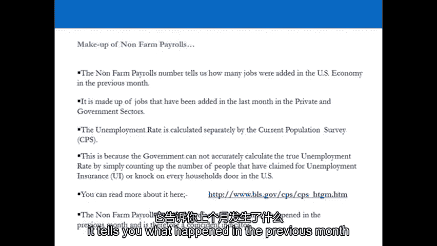
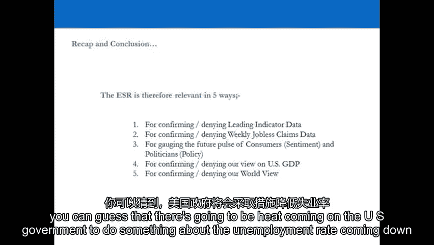

# 【高盛专业交易课】从0教你如何做交易 （中英学习全集） - P14：14-14.第14讲 相关指标 - web3深度学习 - BV1be4y1c7ir

好的，欢迎回来，欢迎收看第十四期视频，我们将在这段视频中集中讨论确认指示器，现在确认指标是他们说的，他们是，我们使用最好的专业教练来确认或否认什么，我们之前在想，在它们出来之前六到十二个月。

因为在我们看到领先指标之前的六到十二个月，作为交易员，试图预测未来，并在那个时间点利用市场，作为我们观点的代理，所以我们要么买入，要么做空，要么在我们的投资组合中，有市场，在那个时间点的中性暴露。

然后在未来的某个时候，六个月后十二个月，我们有我们所说的确认指示器，这些确认指标由重合指标和滞后指标组成，巧合指标告诉我们整个经济正在发生什么，此时此刻，就像现在在现在，或者例如在现在周围。

所以也许在过去的三四周里，我最想让你关注的，这是就业形势报告，因为就业情况报告包含非农业工资单号，就像美国过去四周增加的就业岗位一样，这是一个经典的例子，非农工资数字是一个巧合指标。

它告诉我们现在发生了什么，在美国，China’从经济到就业，它是一个很好的例子，因为业余和零售教练的交易决策是建立在非常短期的基础上的，在非农工资单上，这就是重点，因为我成功了，和业余零售教练。

这是最大的错误，因为他们用的是指示器，告诉他们现在发生了什么，专业交易界四个月前就被告知，这将是非卷工资号中的情况，以及美国的就业状况，就像在，如果U的健康，China’中国的经济将会好转。

然后显然六到十二个月后，将会增加更多的就业机会，如果它会恶化，显然六到十二个月后，这将对美国的就业产生净负面影响，当非农工资数字出来的时候，所有专业教练都知道情况要么会改善，还是他重写了。

经济学家根据他们的估计，在6至12个月前的领先指标上没有形成工资单，但也包括在非，农场工资单号码，所以实际发生的是当无过失工资单号码出来的时候，所有发生的都是业余和零售拖车，他们总是赔钱。

是那些在另一边提供新流动性的人，专业交易员出仓交易，因为他们预测到了这一点，专注于非农工资单，作为一个专业教练，这是一个确认指标，它确认或否认你已经持有的观点，所以说，比如说，如果你认为世界真的很好。

你相信从领先指标来看，美国国内生产总值将扩大的世界，你会认为非农就业人数总是会增加，现在可能会被打败，如果它不好怎么办，否认你的观点是正确的，所以你可能要改变你的观点，但这种情况很少发生。

让我们去看演示文稿吧，确保您再次看到它们是什么的确认指示器，尽量不要听市场上的喧闹声，因为每天，每周，每个月，你会被民粹主义媒体告知，这个数字真的很重要，你应该专注于这个，很多都是无关紧要的。

到目前为止，我们所看到的领先指标是，百分之三的信息是真正相关的，会让你赚钱，你要做的就是把它，解释它，把它变成真正的美元，但一路上你要勤奋，不偷懒，勤奋地实际查看确认指标，并确保您的观点是正确的，或者。

如果他们错了，做点什么吧，好的，让我们去看演示文稿吧，我会看到你在另一边，好的，让我们通过确认指标，所以每个月发布的确认或否认使用的指标，我们首先要看的是就业形势报告，我们要看的第二个是你。

s耐用品和装运，第三工业生产，它们都是巧合指标，他们告诉你现在经济发生了什么，就业情况如何？报告，什么是非农工资单，有人知道什么是非电话工资单吗，这是美国增加的工作岗位数量，s，上个月经济，基本上。

每个人都把注意力集中在两个主要的数字上，你就是在那里得到它的，它就出来了，多久一次，多久，呃，非农就业人数出来了吗，有人知道吗，每月在就业情况报告中公布，它告诉你上个月发生了什么。

就美国增加了多少就业机会而言，但我们每周都能看到一些东西，这是另一个巧合指标，它实际上告诉我们非农就业人数会是多少，有人知道是什么吗，C。初步索赔和继续索赔，申请失业救济人数。

你听说过那是前一周的每周数字，这到底告诉了你什么，它告诉你有多少人，4。最近一周申领失业保险金的人数，所以你把四周加起来，它应该会给你一个很好的想法，农场工资单号码将是，发生了什么。

所有预测非外国就业人数的经济学家，他们不改变他们的估计，因为他们懒惰，但所有的教练都大致知道会是什么，所以当它出来的时候，即使它超过或错过了数字，老的，它已经在市场上定价很高了，不仅仅是因为那个原因。

但因为你无论如何都会知道这一点，领先指标中的六个月前或十二个月前，那么全天交易者做什么，短线交易者关注非农就业人数吗，如果它错过了大的或打败了大的，他们试图在那天买卖市场，他们都迟到了。

他们错过了所有的大好机会，因为他们错过了12个月前的领先指标，六个月前，他们，他们没有关注最初和持续的申请失业救济人数，计算出上个月增加了15万个工作岗位，在美国，s，经济是经济学家们的共识。

但经济学家的一致估计是旧的，他们还没有更新，然后报告的数字是20万，这并不重要，因为在过去的四周里，持续的索赔和最初的索赔都在下降，这意味着它会打败，所以我们都知道它会打败。

所以我们曾经有一句很棒的谚语，在高盛的非农工资单上，第一步就是错误的一步，所以不管在市场上的前五分钟是什么动作，在非农工资单之后，这是第一步，是错误的举动，所以每个人都对此做出反应，但是他们迟到了。

所以你你得到，你走另一边，为你提供流动性，有道理，这是非农总就业人数，非形式工资单的长期趋势变化，这是我们每个月看的数字，所以你在左手边，五万十万，十五万，美国增加或减少了多少工作岗位，s，经济。

相当简单的数字，你是如何看待它的，U的长期趋势，中国市场，长期增长趋势，百分之三，有多少工作，国内生产总值增长3%，美国有多少工作，China’中国的经济每个月都要增长，才能达到gdp增长的3%。

从历史上看，至少要超过25万，如果不超过三十万，所以我们得到了过去几年发生的事情的照片，立刻不看它，如果我们知道，那么如果U，s，经济增长率在1%到2%之间，工作岗位正在增加，但远低于长期趋势。

我们得到了什么，我们增加了70个工作岗位，五千又十五万，在过去的三年里，但它一直在下降，非常缓慢，私人就业总人数，你可以通过看图表看到，以及自那以后非农总就业人数的变化，在商业周期的一部分。

当经济扩张的时候，几十年来，增加的工作岗位较少，这么多关于长期的关于大局的趋势，美国可能存在结构性问题，s，劳动力市场，这告诉了你美国私营部门的故事，例如，让我们采取这样，这是90年代初的。

所以在90年代，当U，s，经济以平均三倍的速度增长，发生了什么事，每月增加250至40万个就业岗位，在20世纪初，现在每月增加50到30万个工作岗位，大约一百到一百到一百五十，这差不多就是我们得到的。

所以在漫长的时间里，结束，从长远来看，在过去三个商业周期中，相对而言，美国创造的就业机会较少，s，经济，我们经历的每一个商业周期，你所看到的是一幅监管的画面，因为如果你监管劳动力市场，事情就是这样。

我们在谈论最低工资之类的事情，这就是当你调节时会发生的事情，当你监管劳动力市场时，那是政府雇佣，私营部门是最重要的，美国发生了什么事，s，政府，用U，s，现在的政府，美国增加的工作呢，s，政府一级。

我们期待，公共部门将创造大量新的就业机会，在美国，s，有很多伤口，所以你现在看到的是私营部门，为公共部门的存在买单，所以你可能会在私营部门得到30万个工作岗位，所以非农总就业人数是两百人，那是。

那是目前的趋势，这就是到处都在发生的事情，所以就业情况报告给了你一个快照，并真正证实或否认你六到十二个月前的想法，如果你期望国内生产总值增长，你预计非农就业人数将为正，你可以猜到它的速度是多少。

你知道的，给或拿五万十万，是啊，是啊，所以你试图预测未来会发生什么，你会在ISM制造业报告中看到什么，在非制造业报告中，你会看到企业报告说他们将开始雇用人，因为你已经到了每个报告的就业领域，你要成为。

你们打算雇佣更多的人吗，如果连续12个月高于50，非农就业人数将为正，我要起床了，然后它确认或否认已经发生的事情，领先指标已经告诉你的，C。初步索赔和继续索赔，所以当美国有人失业时，发生了什么。

他们向劳工局申报失业保险的统计数字，他们每周都报告，前一周，所以到了非，私营部门或政府部门的农业就业人数出来了，或两者兼而有之，众所周知，每周申请失业救济人数他们每周四都出去，这是持续索赔的长期趋势。

那么这告诉你持续的索赔是什么，定义是什么，基本上是长期失业，趋势如何？自那以后的趋势是什么，呃，六十年代，是啊，是啊，长期，但这是一个绝对数，别忘了人口的增长，所以最好给它一个百分比。

但它的百分比仍在上升，告诉你美国的长期结构性失业，s，处于长期上升趋势，所以你也会得到这个，你会在电子表格中得到ASR和失业申请，对确认或否认领先指标有用的是什么，确认或拒绝每周申请失业救济的数据。

所以如果所有的领先指标都做得很好，而政府什么也没做，你可以猜到会有热量来。

他们得做点什么，和消费者，你在看什么，也有花钱的倾向，因此，消费者情绪将是积极的，增加到U的工作岗位越多，s，经济，人们会对他们的未来前景感到满意，确认或否认你对你的看法，s，gdp。

因此确认或否认一种世界观，耐用品和装运重合指标一个样本中的85个行业，但它们很大，它是制造业内部的资本投入，所以当公司在大件商品上进行重大投资时，因为他们要建立一个新工厂，他们会要求很大，笨重的。

重型机械，等，耐用品订单报告，这些货物的装运情况告诉你上个月发生了什么事，在这些行业，如果人们进行高度资本密集型的投资，是啊，是啊，如果企业自己在做，这应该遵循ISSM，原来如此，在绿色中。

你通常得到的是全新的订单，然后他们剔除了那些对使报告不准确极其敏感的部门，一两个巨大的订单可能会扭曲数字，所以他们他们，他们用一个剥离的数字来进行运输和防御，所以说，比如说，上个月在航空航天工业。

你觉得发生了什么事，你认为上个月发生了什么事？在美国航空航天工业中，什么，他们目前在政府层面削减了什么，国防开支所以只要一次国防开支的削减就会对这个数字产生巨大的影响，所以他们拆掉了它。

也拆掉了运输工具，这样你就可以看到数字了，所以你在公司里看到的，我是说，你就会，你会看到像这样的公司的报告，比如说，你知道的，包括波音公司的一个订单的影响，可能对耐用品和装运订单有影响。

然后你就可以去掉波音公司订购的20架飞机，然后你就能更好地表达U中的一切，China’中国经济，是啊，是啊，他们基本上就是这么做的，但你会得到电子表格，经历它，上网，谷歌IT，都是公共信息。

了解耐用品报告，它在那里确认或否认什么，你已经看到了12个月前的制造业数据中的领先指标，是啊，是啊，确认或否认采购经理人指数，确认或否认我们的数据，gdp，确认或否认你的世界观，报告容量利用率。

它每月都在变化，同比，在商业周期中，但现在发生的事情，所以它遵循ISSM，这就是它在总体水平上的样子，这就是它所有组件的样子，所以它实际上可以让你对各个行业正在发生的事情有一个很好的了解，比如说。

采矿材料，商业设备，消费品，它告诉你现在发生了什么，你得到电子表格，看一下，穿越历史，自己学，去谷歌，玩弄数据，看一下报告，看看网上的多篇报道，都是公开的，重要的是你如何对待信息，所以它确认或否认。

确认或否认采购经理人指数数据，确认或否认你对美国国内生产总值的看法和你的世界观，好的，欢迎回来，你看到的是美国的确认指标，它们是你每个月都会看到报道的主要内容，所以让我们做一个快速的总结。

我们看到的是就业形势报告，我们还看了每周，初次和连续申请失业救济人数，所以这些每周都出来，你应该在他们上面，我们还看到了耐用品号码，耐用品的数字实际上是在跟踪美国的大件商品，这也是一个巧合指标。

我们现在也看到了工业生产，你再看这些的方式，它们的确认指标，你需要看到他们的本来面目，它们都是巧合指标，因为它们告诉我们目前整体经济发生了什么，及时，所以通过他们和就业情况报告，非农就业人数。

把这些都放在一起，因为最终在非农就业人数中的，真正从每周初始和继续的地方开始，当你看非农就业人数时，这是日间交易社区中最受欢迎的数字之一，因为它会在当天造成波动，然而，很多时候那里并没有赚大钱。

第一步就是错误的一步，事实上，那是市场上的一句名言，仅仅因为我们已经被告知几个星期了，几乎经济学家的估计可能是错误的，经济学家改变他们的估计很慢，所以每当有测试版或失误时，大多数时候。

你都是第一个拿到工资单的人，这是错误的举动，因为人们已经预料到了，然后日内交易者基本上给那些预测到它的人，流动性出仓，所以就业情况报告，以及每周初始和持续索赔，它很重要。

因为它证实或否定了你当时所持的观点，但你几个月前，在美国和世界各地，它实际上可以预测就业部门是否有大问题，在就业人数中，它可以预测，呃，未来政府行为。

消费者可能会开始对非常糟糕或非常好的就业数据做出反应，仅仅因为它在主流媒体上，但如果它在这里或那里，它总是符合预期，你不会看到政府政策或消费者行为情绪的实质性变化，转向耐用品，耐用品是大件商品。

所有的电子表格都在那里，你应该下载视频旁边的电子表格，看看耐用品电子表格中的数字，因为有时你必须通过剔除大的情况来阅读数字，如运输、航空航天和国防，因为一个订单可以移动整个数字，的，耐用品的复合数。

所以有时候把这些数字分开是好的，当你每月这样做的时候，你浏览这些数字，并把它们放在你的电子表格中，你会明白我们的意思，这只是你必须习惯做的事情，和最终数工业生产，真的。

当你把耐用品和工业生产作为巧合指标时，他们在告诉我们什么，他们在确认或否认我们作为专业教练获得的观点，几个月前在制造业采购经理人指数中，所以当工业生产数和耐用品数出来时。

这是我们已经相信的PMIS的延伸，制造业采购经理人指数，就像在不是，所以你在一月份的ISA中看到的，比如说，可能会在六个月到十二个月的时间里开始发生，所以在同年的6月到12月之间。

看清这些东西的本来面目，它们的确认指标，不要，无论你做什么，作为一个散户，你都会犯错误，这是真正的业余错误，通过看到一个确认指标并根据它做出交易决定，你可以看到一个很好的非农就业人数。

所以你去买500或，你去买你最喜欢的500美元的股票，那真的很业余，这只会给你带来麻烦，因为非农就业人数十有八九是预测出来的，所以看看他们的本来面目，查看您的确认指示器。

作为确认或否认你已经有的观点的东西，因为在任何一个时间点，你将持有一个代表你观点的投资组合，而绝大多数时候，你可能会看到确认指示器中的数字，在巧合指标中，在绝大多数情况下，实际上会证实你已经相信的。

好的，现在我们要从确认指示器开始，我们已经涵盖了美国的领先指标，所以现在我们有了一个完整的曲目，一套预测美国国内生产总值的指标，我们可以用来在500宽度的S和P中占据位置，现在我们要做的是尝试创造。

试着对全球GDP有一个真实的看法，所以现在我们要采取我们已经建立的相同的原则，在美国，领先指标，并将这些原则推广到欧洲和中国，你将看到的是指示器，欧洲和中国的领先指标实际上与美国非常相似。

它们的设计方式非常相似，所以这让我们的生活很轻松，所以我们现在要去欧洲，我们将从整体上审视欧元区，在第十五段视频中，所以我会看到你在另一边。

