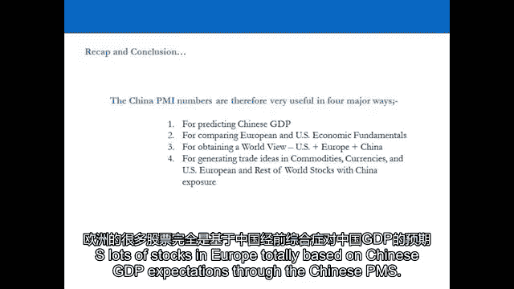

# 【高盛专业交易课】从0教你如何做交易 （中英学习全集） - P15：15-15.第15讲 相关指标 - web3深度学习 - BV1be4y1c7ir

好的，欢迎回来，我们在第16个视频中，我们现在要看看中国的GDP，所以我们要搬到一个新的经济区域，我们已经研究了美国和欧洲，现在我们来看看中国的GDP，特别是，我们要研究的是中国gdp的构成。

我们会试着更好地了解这个国家，我们还将关注领先指标，中国主要采购经理指数，并利用这些领先指标，潜在地产生贸易想法，首先也是最重要的，把它加入我们的世界观，所以当我们把美国、欧洲和中国的GDP加在一起时。

我们实际上获得了世界收入的50%，这是非常，现在非常重要，中国很重要，因为它正以每年8%的速度增长，它以每年8%的速度增长的主要原因之一，是因为它的出口市场，中国现在确实是世界的工厂。

中国的出口市场占其国内生产总值的30%来自出口市场，它在美国和欧洲的两个最大客户，当我们去演讲的时候你会看到什么，就GDP的构成而言，中国的GDP依赖于什么，它百分之三十的市场是出口的。

占其国内生产总值的30%，因此，70%是国内需求，在国内消费方面领先于经济，但其中30%是出口市场，及其美国和欧洲的两个最大客户，并结合了美国和欧洲，所以我们实际上发现，美国和欧洲GDP总和每下降1%。

或者从看它的角度来看，另一边，追加，我们在中国的GDP中得到了10个基点的移动，所以你，中国和欧洲的需求实际上对中国的GDP非常非常重要，我们还要看看pmouse的组成，因为这也很重要。

当我们看到中国的领先指标时，我们有政府的官方统计数据，我们也有私营部门的统计数据，是私营部门制定的领先指标的统计数据，官方统计数据是由政府做出的，你在中国经常看到的是两者之间的分歧。

这是因为这些PMIS的组成略有不同，当你每月看BMIS时，你会注意到，有时私营部门，首相显示的数字与官方采购经理人指数完全不同，而专业交易员往往更关注私营部门，MIS而不是忽视官方的PMIS。

官方的之二仍然很重要，因为它们在市场上创造了积极或实质性的负面情绪，但作为专业交易员，我们正试图消除噪音，我们要做的是切断它，并试图了解经济的真实情况，让我们去看演示文稿吧。

让我们来看看中国gdp的构成，试着更好地了解这个国家，也看看PMIS的组成，以及我们如何使用领先指标，PMIS预测中国GDP，因此，将这一分析纳入我们对全球GDP的整体世界观，让我们到舞台上去。

我们在视频的最后再见，浏览中国本地生产总值摘要，所以在中国和中国的出口，占国内生产总值的30%，所以他们的出口增长完全依赖于美国对这些商品和服务的需求，和欧洲，机电产品占五七。

所以美国和欧盟的劳动密集型产品是17%，需求的17%，每一个用于中国出口，那么这意味着什么呢，所以如果中国大约有三分之一的出口，出口到大约三分之一的中国人，gdp，那只能意味着一件事。

美国和欧洲对这些产品的需求每下降1%，敲点百分之一的中国人，gdp，如果美国人打喷嚏，世界感冒了，中国现在也没什么不同，中国正在采取什么措施来应对这种局面？有人知道吗对不起，是啊，是啊，因此。

他们正试图转向更依赖国内的需求，主导经济，但这需要一些时间，你得到了电子表格，所以你也可以看到，有一点提醒，U，S将被中国接管，所有东西都等于二十五，有两个指标可以预测中国的GDP。

有官方的采购经理人指数，还有汇丰银行发布的私人部门汇丰中国采购经理人指数，它是一家私营部门的银行，专业交易员往往更关注汇丰私人部门采购经理人指数，为什么，因为两者之间经常有分歧，原因有二，一个。

我希望中国没有人在看，其次，官方的采购经理人指数有点笨拙，反应比较慢，因为官方PMI是中国跨国制造企业前三百名，但是HSBCPMI也包括许多中小企业，他们的收益对商业周期更加敏感。

因为他们失去了一个客户，他们的收入也被抹去了，是啊，是啊，而大型跨国公司则更加多样化，所以在可靠性方面，专业交易员真的喜欢看汇丰采购经理人指数，从来没有一个巨大的，巨大的差异，但有时你可以一般来说。

有很大的差异，但有时会有我是说去年，比如说，为期九个月，由，我觉得，十月十一月十一日，汇丰银行官方采购经理人指数预测汇丰银行私营部门，pmi预测中国经济收缩将放缓，官方采购经理人指数预测增长。

但这是原因之一，比如说，去年三月，在内地住宅发展方面有很高的曝光率，因为实际上中国经济正在放缓，不是很多，从8。5%到7。5%，为什么我们认为那是因为欧洲是垃圾，欧洲对中国的出口市场产生了负面影响。

这就是为什么它被限制在8。5%的增长，实际上增长了7。5%，但那开始来了，一年来开始出现的，这是五号的官方采购经理人指数，那是汇丰银行的期末考试，呃，汇丰银行期末考试，采购经理人指数。

那么这告诉我们什么呢，现在中国有望大幅复苏，因此，中国预计将以更快的速度增长，但你不能把中国的东西搞混了，每个人对中国都会犯一个大错误，纵观美国过去的六十年，从我们今天所看到的，你可以很容易地得出结论。

S和P500可以用作气压计或仪器，预测GDP并用它来代表你的观点，不幸的是，在中国，你不能做同样的事，作为一个交易者，有一件事你绝对应该知道，好公司不代表好股票，这两者并不总是联系在一起的。

苹果是一家伟大的公司，但是股票被谋杀了，中国经济棒极了，但上证综指每年都在下跌，为什么上证综指每年都走出去，他得小心点，所以你的经济以8%的速度增长，但市场每年都在下跌，2。为什么会这样。

去年8月在上海做了一次演讲，在上海对冲基金大会上，给上海的125名对冲基金经理，告诉他们为什么，他们都同意我的观点，哈哈哈哈，所以它被称为上海综合指数，从国际贸易商的角度来看，我只说了三十分钟告诉他们。

为什么他们都坐在那里，竟然有人走进中国说这种话，但这是真的，但这是真的，好的，原因如下，总是在下一张幻灯片上，好的，当你看到西方世界发生的事情，那是婴儿潮一代，以不断增长的速度增长的人口。

所以总体人口增长和变化率是正的，发生了什么，实际发生的是，当那些人成年后，他们加入劳动力大军，所以你有更多的消费者，但你也有更多的储户，因为美国实际上有养老金基础设施，那么，随着时间的推移。

市场需要什么才能结构性地上涨，在持续的基础上，因为所有那些工人每个月都像小兔子一样拼命工作，从他们的两千块钱中拿出来，他们每月得到一百美元的报酬，他们把它放在养老金里。

然后养老基金经理用那一百美元去买盘，那么当人口持续增长和养老金基础设施，你每个月都有一个股票市场的保证买家，供不应求，因为没人想卖，因为他们知道买家下个月会回来，事情就是这样，那是结构性牛市，是的。

几十年来，你的经济可以以2%的速度增长，它可以以3%的速度增长，它可以以它真正想要的任何速度生长，如果你有，市场就会上涨，几十年来，当这种情况改变时会发生什么，当人口没有增长时会发生什么。

然后那些为养老金存钱的人现在开始领取养老金，股票市场的保证买家，每个月都变成股市的保证卖家，这导致对股市的信心大幅下降，这正是我们现在看到的，因为所有婴儿潮一代都退休了，领取养老金。

反正他们的养老金很少，但你现在得到的是美国共同基金每个月的净流出，这意味着统一的U，China’中国的市场不再有可靠的买家，英国市场不再有可靠的买家，有保证的买方，那是真的，因为这是真正的需求。

谁现在是西方世界股票市场的买家？中央银行，中央银行已经取代养老基金成为西方世界股票市场的买家，这就是过去四五年发生的事情，所以他们只是在创造不存在的需求，取代消失的真正需求，中国发生了什么，嗯，首先呢。

美国和欧洲是你们最大的出口客户，所以当美国在欧洲发展时，你们不能增加出口吗？这是第一件事，所以他们采取措施是正确的，使他们的经济转向更由国内主导的需求，主导经济，第二次大规模人口，但没有人口增长。

独生子女政策，你有一个以上的孩子，每个孩子还是一万美元吗，粗略地说，无养老金，基础设施，在中国，没有人把钱放在上证综指上，然后把钱留在那里，以为他们65岁的时候会有养老金，没有养老金的文化。

文化倾向是投资于有形资产，所以这是一种非常不同的心态，英国在五个，市盈率的五倍半，U，It’差不多，这并不意味着它从28倍下降了，因为如果它下降一点点，大陆的人就会买。

他们甚至在谈论在香港引入100年抵押贷款，就像他们现在在日本做的那样，这是西方世界可能发生的事情的线索，因为第一个经历我们现在正在经历的这一切的国家，在西方世界是日本。

因为他们比西方世界早十年出现了第一次婴儿潮，优越的医疗保健系统，是啊，是啊，有什么事吗？发生了什么事，日本市场怎么了？中央银行自1992年以来一直是股票市场的买家。股市下跌了七十五点。

所以我们在西方世界最好小心，所以如果我们变成日本，那是个真正的问题，我认为美国倾向于日本，但你有，你必须一直从字里行间去体会，看着中国的GDP说，因为你的经济以8%的速度增长，我要买上证综指。

每年上证综指的轮廓在11月-12月左右，每个人都为明年感到兴奋，好吧嘿，我们将再次以8。5%的速度增长，我们买上证综指吧，所以人们从11月到12月就进去买了，一直到三月中旬四月左右。

然后报告第一季度的国内生产总值，然后每个人都知道中国今年的GDP报告是多少，大约在那个时候，然后会发生什么，没有买家，没有养老金，人口没有增长，人们不把钱放在上证综指上，美术，有形资产。

然后市场就下跌了，所以你会得到中国的采购经理人指数数据，你会得到一个电子表格，它基本上预测某些事情是否发生在U，s，和欧洲，当增长预期改变时，这将对中国的出口产生多大的影响或增加多少，因此国内生产总值。

所以你所要做的，只是，你知道他们都有联系，所以你只要锻炼就行了，中国经济增长预期过高或过低，反之亦然，那么，为什么我们要在12年的时间里很好地看待中国的GDP呢？他们可能是世界上最大的经济体。

以8%的速度增长，所以我们不得不看着他们，认为他们是我们的傻瓜，不要，因此，为了预测中国的GDP，比较欧洲的U，s，中国的经济基础，如果你两者都恶化了，中国将努力增长，所以如果你在美国有很好的条件。

期望可能太高了，s，或改善美国的条件，s，和欧洲不断恶化的状况，或者一个抵消另一个，中国今年的经济增长将很难超过预期水平，显然忘记了你的世界观，在商品方面产生想法，货币，和u，s，欧洲。

和世界其他对中国有敞口的国家，所以你有很多公司，尤其是，比如说，矿业部门，其收益远远超过50%受到中国需求的影响，像负材料和商品公司，这样你就可以，你不必真的去香港交易，或者交易中国前三十只股票。

和中国前三十只股票，反正在纽约证券交易所上市，所以你可以用美元交易，但外国人实际上不能，呃，我忘了添加的另一个原因，绝对没问题，外国购买有限，因此，所有拥有养老金基础设施的国家实际上都不能购买中国股票。

但在中国，你只能做多股票，你不能缺货，所以你不能对冲自己，你可以做空指数，所以你可以做空上证综指，发生了什么，上海的每一位对冲基金经理，太疯狂了，有一个策略，多头股票空头指数，这就是他们所能做的一切。

所以什么时候什么时候，你的策略是什么？多头股票，空头指数，在预测汉语的四个主要方面很有用，gdp，比较欧洲和美国，产生贸易思想和商品，货币，以及对中国有敞口的世界其他股票，那很重要。

你可以在美国交易很多股票，欧洲有很多股票，完全基于中国PMI对中国GDP的预期。

其他国家呢，比如说，澳大利亚，有人知道就出口而言，澳大利亚经济的百分比是多少吗，取决于中国的需求，如果中国经济，如果中国经济放缓1%，澳大利亚经济会发生什么，无增长，澳元会发生什么。

中央银行需要把它贬值，增加出口，你从你的世界观中得到你所有的观点，你只需要从头开始，一路往下走，你就会到达那里，只是需要一点练习，好的，欢迎回来，我们将在这里简要介绍一下中国的国内生产总值。

现在从演示文稿开始，有几件事我们必须从，分析中国GDP，我们在这里的目标是把中国的gdp加入到全球经济中去，中国是世界第二大经济体，如果我们把欧元区加起来，美国和中国，我们占全球GDP的50%。

所以这是非常非常重要的，当我们看到中国的GDP和GDP的构成时，我们得到了一个非常严峻的结论，百分之七十是内需，国内消费，百分之三十是出口，所以中国真的依赖于它的出口市场，我们意识到。

当我们把美国和欧洲加起来，每1%，美国和欧洲合计国内生产总值的变动，这相当于中国国内生产总值的10个基点，百分之一，所以让我们就把它当成现在的样子，我们正试图从更大的角度来看待中国的GDP。

并试图利用它，并试图找到一种有用的方法来提高中国的GDP，作为交易者把它变成真金白银，所以当我们看到首相的，首先呢，我们关注汇丰的采购经理人指数，我们更重视它。

汇丰采购经理人指数比官方采购经理人指数有更多的公司，这些公司是中小型企业，为什么这很重要，这是因为他们的收入对内需消费更敏感，国内消费，以及通过在美国的出口进行的国际消费，美国和欧洲。

当你看HSV CPMI时，你经常会看到什么，官方的采购经理人指数是分歧的，因为HSD C采购经理人指数先移动，那些公司的收益更敏感，所以我们用汇丰银行的采购经理人指数和我们在中国也意识到的。

在看演示文稿时，出于多种原因，我们不能使用我们使用的相同的因果关系，在美国和欧洲，所以如果你回想一下在美国和欧洲，我们用领先指标预测GDP，我们在指数中持仓，商品和货币，现在在美国我们主要使用S和P。

欧洲五百，我们在用欧元股票，六百，还有每个国家的国内指数，预测这些国家的国内生产总值，并在其中采取立场，但我们在中国做不到，由于演示文稿中强调的原因，我们不能那样做，因果关系不起作用。

中国股市目前存在结构性问题，如果他们解决了这些结构问题，上证综指将成为一个更好的代理，预测GDP并在其中占据一席之地，但我们不能那样做，那么我们如何很好地利用汇丰采购经理人指数呢？

使用它的最好方法实际上是现在在中国以外的地方采取立场，我们可以在中国采取立场，我们可以采取国际拖车的立场，在代表上证综指的ETF中，股票市场上的美欧，所以我们发现一些行业和公司的收入和利润占比非常高。

他们的利润很高，这两者都与中国的GDP有关，所以我们在那里的股票市场上持仓，我们现在也持有大宗商品和货币的头寸，比如说，货币状况，如果你有一个国家有很高比例的出口，哪些是中国的需求主导的。

所以澳大利亚是一个很好的例子，澳大利亚的呃经济，他们很高比例的出口到中国，澳元的价值非常重要，看中国的GDP，所以我们可以交易澳元，当我们看到汇丰采购经理人指数统计数据时，我们可以交易商品。

我们可以在全球范围内交易股票，欧洲，香港，其他任何地方，我们有的地方，收入和利润占比高的股票，与中国GDP挂钩，这就是我们作为专业交易员在中国使用采购经理人指数的方式，我们不在上证综指中持仓。

我们当然可以通过ETF来做，但我们也在努力寻找更聪明的玩法，在世界各地的股票部门，在货币和不平等中，所以领先指标真的结束了，我们已经走过了U，中国和欧洲，你应该庆幸自己，你应该给自己一点掌声。

你吸收了很多信息，因为现在基本上我们曾经得到的，我们已经经历了这些过程，在任何一个时间点，你会有一个世界观，你会对全球GDP有一个看法，你会对地区GDP有一个看法，所以我们甚至可以到我们采取立场的地步。

比如长美国或欧洲，长欧洲，短美国，长瓷器，做空欧洲，长美国，我们现在可以采取这些立场，我们也有大宗商品的头寸，我们也有大宗商品和利率的头寸，当我们去股票市场的时候，我们现在要进入下一个层次。

所以想象一下我们产生想法的过程的思维导图，我们有，我们有清洗，也就是守门部分，我们有风险管理，有纪律的；有纪律的，我们有统计贸易，自我意识，当我们进入股票市场，我们进入下一个层次，我们仍然在想法中运作。

我们现在从宏观层面到微观层面，也就是工业部门和库存水平，所以我们先来看下一个视频，这将是我们到目前为止所学到的一切的回顾，我认为在这个阶段基本上澄清一切是很重要的，到目前为止我们所学到的。

然后我们要采取下一步，也就是去股票市场内部的行业层面，好的，让我们进入下一个视频，我们来回顾一下。