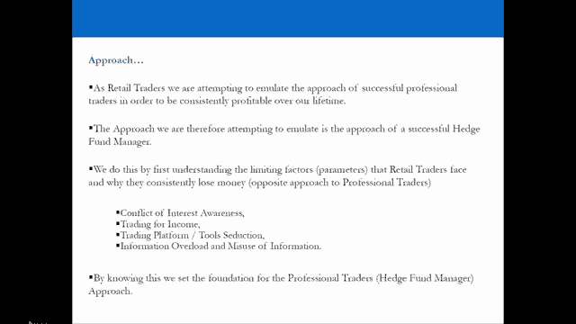
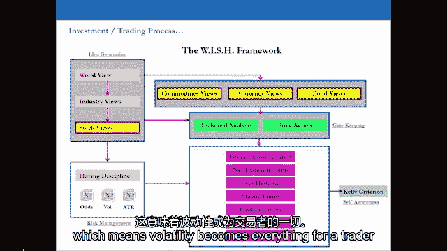
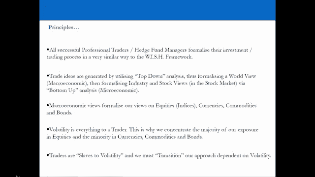

# 【高盛专业交易课】从0教你如何做交易 （中英学习全集） - P16：16-16.第16讲 扼要概述：到目前为止我们学到了什么 - web3深度学习 - BV1be4y1c7ir

好的，欢迎回到屏幕前，我们实际上要在这里做什么，就是回顾一下我们到目前为止学到的重要东西，在整个视频系列中，我认为现在是做这件事的好时机，仅仅是因为到目前为止你已经看到了很多信息。

我认为现在这是个好主意，只是概述和形式化，到目前为止，我们学到的所有重要的东西，到目前为止，我们学到的重要的东西，可以细分为三个方面，这是我们正在采取或寻求采取的方法，我们正在使用的投资或交易过程。

以及支撑我们的方法和投资贸易过程的原则，所以让我们从我们现在寻求采取的方法开始，回到视频系列的开头，是试图模仿成功的专业交易员的方法，这样我们就可以随着时间的推移持续盈利，我们意识到我们的目标。

比如用我们自己的钱在金融市场上交易一直用这些钱赚钱，我们意识到，鉴于这一目标和我们对专业贸易世界的分析，目标与成功的专业对冲基金经理的目标最接近，所以我们采取的方法真的是，试图效仿对冲基金经理。

成功的专业对冲基金经理，我们所做的是在我们开始研究成功的对冲基金经理方法之前，我们首先奠定了基础，在理解散户强加给自己的限制因素方面，导致他们持续亏损，我们意识到，大多数零售商不成功的主要原因。

为什么他们总是赔钱是因为他们，对专业交易员采取相反的方法，这被分成四个区域，所以没有意识到利益冲突，以为交易是为了收入，被引诱使用大量工具，并认为所有的答案都在工具和交易平台中，也遭受信息过载和滥用。

所以通过理解限制因素，我们设法让自己，一个基础，导致专业交易者使用的许多原则，为了采取正确的方法，所以通过奠定这个基础，我们就可以理解为什么专业交易员和对冲基金经理。

做他们所做的事情就他们所采取的方法而言，以及他们采取的投资过程或交易过程。

实际上，我们看到的投资或交易过程是一个模板，几乎所有专业交易员和成功的对冲基金经理都使用的模板，作为他们的投资或交易过程，这个会有很多变化，但本质上，这个框架为您提供了一个骨架。

可以在您的一生中使用的模板，持续盈利并效仿成功的交易者，在过程方面，它被分成四个区域，所以首先创意生成，其次是守门，第三，有纪律或风险管理，到目前为止我们所做的，我们已经经历了创意产生的第一阶段。

所以我们现在已经正式确定了我们的世界观，当我们在专业人士使用的整个投资或交易过程中观察时，我们可以在每个阶段插入过程，就我们自己的专业知识而言，我们想要的任何东西，但我们要确保把它插到正确的区域。

这是专业交易者使用的过程，这是用来确保持续盈利的框架，并随着时间的推移增加资本，因此，我们使用这个过程，我们可以插到四个区域，我们拥有的任何专业领域，但我们只需要确保我们把它们插入过程的正确区域。

我们还研究了波动性，我们一会儿再讨论这个，但我们很快意识到波动性，波动性等于机会，机会是交易者的一切，这意味着波动性成为交易者的一切。

所以让我们继续讨论原则，到目前为止，我们真正学到的重要东西，到目前为止我们学到的最重要的事情，一旦我们确定了限制因素，所有专业的拖车和对冲基金经理都有一个非常坚如磐石的投资和交易过程，就像愿望框架。

他们以一种非常相似的方式将他们的投资或贸易过程正规化，我们还研究了贸易理念的原理以及它们是如何产生的，和贸易想法实际上是通过利用自上而下的分析产生的，这样我们就可以形式化我们的世界观。

这就是采取宏观经济的方法，在背景下了解大局，然后我们继续在股票市场上正式化我们的行业和股票观点，我们将在接下来的视频中看到这一点，但这就是专业人士产生贸易想法的方式。

贸易想法是由专业人士通过利用自上而下和自下而上的混合产生的，宏微观分析，你或我们对股票的看法的宏观正式化，所以指数，指数一级的股票，货币，大宗商品和债券重回波动。

我们很快意识到所有的交易者都是波动性的奴隶，专业交易员实际上不会采取一种方法，他们采取多种方法，它们在依赖于市场波动性的方法之间过渡，所以交易者是市场的奴隶，是波动的奴隶。

他们在投资组合经理和短期日内交易者之间转换，取决于市场允许他们做什么，这些都是非常，非常重要的原则，在这一点上，它们需要正式化。

现在来谈谈我们遇到的其他原则，我们意识到的是，交易者我们必须是自我启动者，我们寻找自己的信息，我们不依赖别人为我们提供信息，我们绝对不是为了收入而交易的，我们寻求在有生之年尽可能扩大我们的交易账户。

我们试图在没有资源的情况下赚钱，我们利用公开的信息，正确地解释它，并通过专业人士将其转化为真正的硬美元，这样我们就能赚钱，靠自己赚钱，不依赖别人，我们正在收集世界上我们可以获得的少数信息，相关的信息。

我们真的在利用这些信息来消除市场上的噪音，所以绝大多数，我们每天遇到的97%的噪音，这实际上不会让我们赚钱，这是我向你们简要介绍的一个原则，我想做尽可能少的工作，获得最高回报，风险最小。

这是一个非常重要的原则，这将变得更加清楚为什么这很重要，随着我们进入视频系列的下一个阶段，所以请记住这一点，作为交易员，我们也在这里寻求不要努力工作，我们希望聪明地工作，我们在世界上有四万两千资产。

因此，我们有无穷无尽的赚钱机会，我们聪明地识别这些想法，和最有可能让我们赚钱的想法，全世界有四万两千资产，我们必须聪明地工作如果我们努力工作试着分析每一个，我们最终会一事无成，所以我们必须聪明地工作。

有一个专业的投资和交易过程，并效仿聪明的对冲基金经理，我们试图用这42000英镑的资产来破坏我们自己的想法，这是一个非常重要的原则，随着我们通过视频系列，这将变得更加清楚，我们用想法宠坏自己。

我们知道想法只是想法，还不能交易，我们绝对不会爱上我们的想法，所以再过一遍这些原则，再次通过进场，确保你了解投资和交易过程，以及在专业的贸易世界里事情是如何做的，一旦你开始真正理解这些东西。

那么你就有很大的机会持续盈利，现在我们将从我们的领先指标开始，我们将继续讨论行业层面和库存层面，在股票市场内。

