# 【高盛专业交易课】从0教你如何做交易 （中英学习全集） - P17：17-17.第17讲 自上而下训练 - web3深度学习 - BV1be4y1c7ir

好的，欢迎回来，欢迎收看第十八期视频，现在我们已经涵盖了世界观层面的所有领先指标，在投资过程中，现在我们要进入股票市场的下一个层次，这是行业层面的，我们将开始考虑行业，甚至考虑股票。

当我们走得更远的时候，现在记住，我们连袜子都没看过，然而，我们基本上经历了世界观正式化的过程，我认为股票市场，我们接下来要做的是去行业层面，你将被介绍到许多新的概念，你以前可能没见过。

可能是这里最重要的概念，真的是冒尽可能少的风险的概念，以获得最高的回报，我们在之前的视频中提到过这个概念，这个概念作为预告片，因为这个世界有太多的信息，做尽可能少的工作的概念。

就像专注于真正真正重要的事情一样，做最少的工作以获得最高的回报，风险最小，这是我真的希望你专注的事情，当我们经历这些的时候，呃这个视频，现在你们将被介绍到beta和alpha和beta的概念，真的是。

呃，市场回报的概念，以及我们如何对冲市场风险，那么我们如何获得更高的回报，但在获得更高回报的旅程中，本质上是为了获得更高的回报而冒更小的风险，这就是你如何成为一个高效的交易者。

所以尽可能做最少的工作来获得最高的回报，以最小的风险和理解beta和alpha的概念，你还将被介绍到新的不同类型的交易，现在这些不同类型的特征是它们的结构意味着，我们在应用这个原则。

所以你会被介绍到这些特征，和自上而下的过程，真正从世界观到行业观，到股票，你在这些原则上真的有基础，你需要理解他们，在做尽可能少的工作方面，从你的世界观来看，进入这个阶段有一种倾向，所以如果，比如说。

如果你相信全球GDP将大幅增长，你的反驳，你倾向于看涨股票市场，所以你要集中精力暴露自己，收入对商业周期更敏感的公司，所以你要沿着这些扇区，这些部门被称为周期性，你的倾向将远离我们所说的防御。

防御性部门，就像股票市场中收益对商业周期不太敏感的行业一样，如果有的话，这样你就可以沿着周期性和短期防御，如果你的观点是反之亦然，你要做空坐多防守，所以如果你对全球GDP的看法是负面的。

试着理解这些新概念，演讲结束后，我会向你做一个总结，我们还要做的是在电脑屏幕上，我将向你们展示如何利用，在行业层面出类拔萃，让我们到舞台上去，我会在这个视频的最后看到你的总结，和电脑上的评论，吱吱叫。

所以让我们进入行业层面，当我们达到这个水平的时候，我们假设我们已经实现了一个世界观，就像我说的，这个过程和得到答案一样重要，你们要不断练习，经历这个过程，所以在这一点上。

我们假设我们已经获得了一个世界观，所以我们查了英国所有的首相，s，在欧洲也做了同样的事情，在中国也做了同样的事情，我们现在已经确立了我们对世界的看法，那么这意味着什么呢。

我们已经确立了对周期性和防御性商品的看法，货币和汇率，和债券，现在如果我们要在股票市场上走得更远，我们得从上往下钻到下一层，行业水平，然后到底部，库存水平，这就是我们下一章的定位，在行业层面。

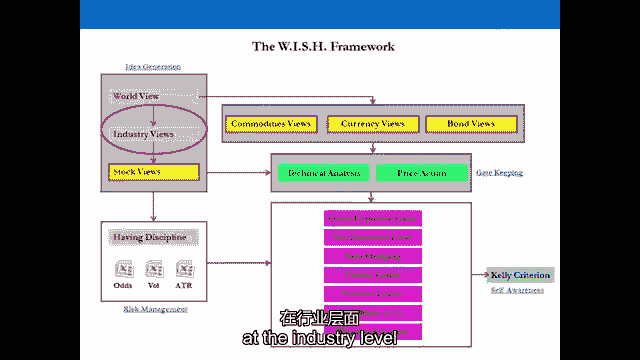

在任何市场，任何股票市场，只要保持简单，在市场内，有工业部门。

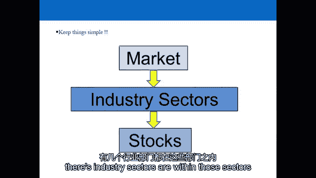

在这些部门中，有些股票会跑赢，和表现低于该行业的股票，和所有的市场，和，这就是你应该如何显示自己的思维导图，当你作为一个交易者看股票市场时，所以如果你对国内生产总值有看法你想在市场上，你要寻找扇区。

将跑赢市场的公司，否则拥有那个扇区就没有意义了，你还不如拥有市场，所以如果市场上涨18%，你去买一个扇区，思考它在思考，它会表现得更好，它比市场低5%，发生了什么事？你的表现低于市场，你还不如拥有索引。

所以在那个行业是死钱，然后你要去找股票，你认为会跑赢行业和市场的公司，短边也一样，中间的东西都是死钱，你还不如拥有市场，或者做空市场，甚至在商品上也这样做，货币或汇率，2。我们尽力避免资金断流的情况。

即拥有行业和股票，或者做空行业和股票，钱会表现得更好，如果我们只是通过在指数中有一个位置来表达我们的观点，现在的行业水平，你可以绘制出我们所说的世界上几乎任何行业的价值链，所以某种商品被加工。

被制造商变成产品，在批发商那里出售，批发商把它卖给零售商，谁把它卖给消费者，价值是沿着链条创造的，所以一种商品以一美元的价格出现了，制造商以两美元的价格把这种商品加工成一种产品。

批发商以三美元的价格出售，批发商以四美元的价格卖给零售商，零售商以10英镑的价格卖给消费者，价值是沿着从无到有的链条创造的，这就是价值链，这可以映射到世界上任何行业，你可以拉出一个扇区。

这是一个你必须经历并练习的过程，你拉一个扇区，让我们说，比如说，就像平底锅一样，平底锅，欧洲电信部门，你拉起美国的电信部门，你沿着这个行业的所有公司所在的链条绘制地图，他们实际上是做什么的。

贸易思想的来源，你得到了你的贸易想法，最初来自你的宏观经济分析，这将为你产生想法，我们已经看到你可以从issm得到你的想法，从非制造业指数中获得想法，你可以从欧洲各行业的采购经理人指数中得到想法，各国。

但当你往下钻的时候，你也可以通过分析价值链在微观层面上获得它们，会有影响价值链的需求和供应因素，所以如果出现供应冲击，打击零售商需要时间，如果出现需求冲击，打击制造商需要时间。

但如果你把所有的公司都绘制出来，你看到冲击来了，意想不到的举动，你会知道交易在哪里，会让你赚钱的，因为交易总是在不明显的交易中，所以有一个供应冲击，打击零售商需要时间，贸易可能不是与制造商。

因为现在已经知道了，交易可能是做空六个月后受影响的零售商，如果有需求问题，你可以做空零售商，它可能在六个月内不会击中制造商，你可以做空制造商，那是你得到大部分回报的地方。

当你从顶部向下钻到行业和库存水平时，但很简单，所有部门都可以分为周期性和防御性，所以当你看标普500指数时，250到300只股票可以归类为周期性股票，其余的可以归类为防御性的。

所以如果我们认为GDP在上升，我们在市场上做多的倾向是什么，什么类型的部门，如果我们认为U会收缩，s欧洲，中国国内生产总值，我们会倾向于什么，防御性的，你可以实际上有整个美国行业的行业分类，s，和欧洲。

所以在美国他们被称为G，i，s，演出，在欧洲，行业按股票划分，T O XX，就像在欧元股票六百个行业一样，是啊，是啊，对他们来说有真正的分类，你可以把它们作为产品进行交易，你可以在ETF和CFD上交易。

在美国如此周期性，分类要广泛得多，然后你在超级部门中有子部门，所以这些被称为超级部门，能源材料，工业，消费者自由支配财务，然后它，在欧洲，汽车及零部件，银行，石油和天然气部门，采矿，金属，化学品，建筑。

财务，工业，媒体，个人物品，在美国主食，我们所说的订书钉是什么意思，保健，欧洲的电信服务和公用事业，航空航天，食品，饮料，农民与生物技术，电信公用事业，公用事业分成电力，煤气和水，所以让我们假设我们有。

我们有，我们现在的处境，它介于，说，三月和七月，两千零九年，我们已经看到了首相的全球低谷，第一次，所以我们开始倾向于市场上的多头偏见，因为我们认为GDP在未来实际上可能会扩张，icm可能会回到50以上。

谷底的pmi，他们正咄咄逼人地接近50岁，这是一个如何完成这个过程的例子，并在行业和库存层面进行锻炼，你实际上可以看哪些交易，我们要看看明显的，你会看到那些显而易见的人实际上仍然支付荒谬的钱。

如果你在正确的时间进去，所以我们在这里看到的基本上是三月份的，哦，九到现在左右，这些交易在这里支付了多少钱，所以你坐在那里，你看到首相的屁股，你看好这个世界，你现在看好gdp。

你认为gdp收缩已经触底了吗？什么交易你能马上做得很好，与这种世界观非常明显的是油价周期性商品，gdp扩张，我们去买些油吧，那是多少钱，因为百分之一百七十，你还能做什么，让我们说。

你以为油价在那个阶段会翻倍，从40美元到80美元，你还能做什么，我们本可以买S和P的，500个能源部门付出了100%的代价，顺便说一句，这些都是未杠杆的数字，所以如果你用杠杆，你会得到那个的倍数。

所以如果你有三四倍的杠杆，你会在五号油里，六百，不错嘛，市场本身上涨了130%，那么我们在那里看到了什么，全部加价一百七十，500能源部门，增加一百，s和p，五百块自己起来，一百三十。

我们马上看到了什么，谁注意到了这个问题，周期性部门，能源实际上表现低于市场，我们认为那是什么，答案其实是，当你开始了解扇区时，你就会知道这一点，例如，当你穿过这个价值链，你开始列出所有公司所做的事情。

S和P中的绝大多数重量级石油股，五百，他们是大型石油和天然气生产商，当油价上涨时，他们不一定赚钱，因为发生的事情，所有这些家伙，租用钻机和平台，是的，还有设备，只是，它非常。

它非常具体地适用于大型石油和天然气行业，这是一个，这是一个全球性的，这是一个全球性的情况，大型石油和天然气公司的全球性问题，当价格上涨两百%时，平台上的租金就会上涨设备价格也会上涨。

所以他们赚的钱不一定和其他人一样多，当油价上涨时，所以收益增长的速度，当油价上涨时，它比人们预期的要低得多，所以说，去收购大型石油公司是一个非常明显的交易，当你认为油价在上涨的时候，但这是有缺陷的。

因为他们可能不一定赚钱，但你会知道，当你开始了解每个部门的特点时，你的工作是真正，当你开始的时候，从几个扇区开始，很好地了解他们，在价值链上绘制它们，在周期性和防御性中寻找贸易思想。

然后在接下来的一两年里积累你在许多行业的知识，然后你就会，你不会，你会成为一对夫妇的专家，对相当多的夫妇也很体面，但几年后，你会对很多行业都很了解，因为你要看所有的生产报告，所有服务报告。

一路上你会学到知识，所以在这种情况下我们最好把钱放在指数里，或者在油价本身或者在石油中，所以试着从投资者的角度来想象一下，你把钱给了一个非常聪明的对冲基金经理。

他把自己标榜为终极实物商品和全球自然资源股票，对冲基金经理，在2009年，当他看涨时，这是很好的，他把你所有的钱都存起来了，500个能源部门在地面上，你们会很兴奋地互相争斗，因为他让你的钱翻倍了。

但实际上，如果你把它给了另一个知道这件事的对冲基金经理，他会买油价，你会上升百分之一百七十，如果我们看看赫尔默和佩恩这些人，他们在陆上和海上钻探，勘探公司，他们拥有钻机，然后把它们租给所有的大出租车。

石油和天然气生产商，每当油价上涨10%时，他们会做什么，他们在钻机租金上增加10%，他们重新谈判合同，他们别无选择，只能付钱，因为如果他们不付钱，他们的竞争对手下周就会出现，走上钻机开始钻探。

在同一时期，他们上升了215%，所以他们跑赢了市场，他们的表现超过了该行业的两倍多，它们的性能超过了所有的价格，这是他们接触的唯一商品，所以他们的收入增长速度比，比如说，像雪佛龙这样的人，当油价上涨时。

这些家伙回来得更快，反过来，当它往下走的时候，他们赔钱更快，所以在部门内，在周期性部门内，你的股票比其他股票更具周期性，这在任何部门都是一样的，即使在防御性股票中，防御性股票比其他股票更强。

这是他们收入的来源，在价值链中，以及他们对商业周期有多敏感，在那种情况下，你会在海拉竞选中到处都是，因为你假设我们在这里假设，你有你的世界观，你知道这个行业的这些股票，因为你已经把它们映射到价值链上了。

和，你知道的，每个部门的基本特点，消费者自由支配部门呢，非必需消费品部门的表现比能源部门高出一倍，数量的两倍以上，在那种情况下，如果这个板块上涨215%，就会有股票，会有股票，在那个部门。

上升了120%，会有股票，在该行业增长了340%，该板块是其中所有股票的平均回报率，公用事业呢，表现明显逊于大盘，明显低于我们观察过的所有周期性行业，所以你可以看到价格的变化，这实际上是有效的。

你知道的，周期性确实表现出色，当gdp扩张时的防御性部门，当GDP收缩时，它们的表现严重不足，所以你显然会倾向于周期性波动，你相信gdp会扩张吗？你可以看到把这些点联系起来并不难，当你第一次看到。

ISM收缩一年多来首次放缓，那是gdp触底的时候，国内生产总值收缩已见底，你应该，你应该加入周期性，然后反过来，当GDP放缓时，增长首次放缓，你需要加强防御，我想做空，周期性，但所有，基于前提。

你将超越行业和市场，否则就没有意义了，所以我相信你们都知道市场回报率是多少，正alpha回报超过beta，负alpha回报低于市场回报beta，你作为交易员的工作，如果你在看资产类别。

如果你交易所有的资产类别，你作为交易员的工作，如果你选择在行业和股票上持仓，就是跑赢市场，否则就是死钱，你还不如拥有市场，做空市场，你还不如在大宗商品上持仓，货币或汇率。

因为你可能会以更低的风险获得更高的回报，这是关键，作为一名股市交易员，你的工作不仅仅是产生阿尔法正阿尔法，但这也是为了以尽可能低的风险产生这种情况，作为交易者，你想去有钱的地方，但你也想去有钱的地方。

并冒最小的风险得到它，那是你的工作，所以我觉得当你，比如说，上网或打开电视，或者看报纸，你看到人们，制造关于表现低于市场的对冲基金的负面头条新闻，因为，如果对冲基金经理要求，他们希望每年有12%的回报。

8%的波动性，市场怎么做并不重要，因为这就是为什么投资者把他们的钱给了对冲基金经理，有道理，因此，对冲基金经理比市场上的其他人承担的风险更小，获得一定的回报。

所以如果我们作为交易员的工作是获得尽可能高的回报，为了最小的风险，你可以做的各种交易结构，制造那种情况，比如说，你做多S和P 500消费者自由支配部门，做空公用事业板块，并在此过程中对冲市场风险。

所以当你对冲市场风险时，你冒的风险少了，以获得行业将给你的回报，这有道理吗，好吧，来看看你是怎么做的，但假设你已经对冲了一个风险，在你所面临的所有风险清单中，是啊，是啊，跨部门，成分传播，所以说。

让我们进入消费者自由支配领域，选择一只我们认为会大幅超过预期的股票，部门和市场，所以我们看着一家餐馆，在美国的股票，奇波特尔，墨西哥烤架，所以我们认为他们的每股收益增长会很荒谬。

它的表现将超过该行业的其他部门，性会胜过市场，我们缺乏能量，这是美国的公用事业公司，美国110亿美元的大股票，使它们成为消费者自由支配部门和公用事业部门的组成部分，在同一部门内呢，所以你觉得。

会有一个消费者，表现将低于其行业的可自由支配股票，并表现逊于整体市场，你用它来对冲风险，墨西哥烤架，所以你在对冲市场风险和行业风险，这有道理吗，所以你试图获得尽可能高的回报，为了最小的风险。

但让我们通过一个例子，呃在英国，只是为了让你坐下来试试，你试着理解方法，让我们来看看，呃，这是英国零售领域的经典价差交易，所以它们本质上都是超市，如果你在1987年进行价差交易。

那笔交易会给你百分之百的报酬，所以乐购的表现比塞恩斯伯里高出1300%，乐购的回报率是一千四百，塞恩斯伯里的回报率是百分之百，所以基本上你在1987年对冲了，市场风险和部门风险，二十五年来。

你没有这种风险，那你做了什么，你已经为塞恩斯伯里的表演付出了代价，百分之百地获得乐购的性能，减去130%来对冲所有这些风险，在那段时间里，所以在整个交易过程中，假设你做了二十五年的生意。

想想市场上发生的所有事情，发生在市场震荡的世界里，市场下跌了一二，百分之三十，所以1992年，英国被踢出1987年，八十七撞车事故，第十一个二千零一年，亚俄债务危机，九十七，九十八。

看看现在影响整个市场的所有这些事情，你的价差交易会发生什么，在那种情况下，你的交易会发生什么，当你做多一只股票时，同一部门的另一个，发生了什么，好吧，如果你是，如果你有很好的对冲。

你们适当地规避了市场风险，在这种情况下，你不应该指望赚钱或赔钱，因为它们都下降了相同的数量，那你到底在做什么，你已经对冲了市场风险和行业风险，如果英国的食品供应链出现问题会发生什么。

两只股票都会受到影响，所以它们都下降了相同的数量，你在那个行业里到底在做什么，这和长CMG Chipotle完全一样的贸易，墨西哥烤架，短麦当劳，你实际上是在孤立同伴，风险，所以你是说。

我不想冒市场风险，我不想暴露在行业风险中，我想隔离独特的风险，并接触CMG或乐购的企业计划，所以你把自己暴露在每个公司的管理收益计划中，并对冲这两个风险，所以你得到了130%的回报，长乐购。

肖特·塞恩斯伯里，这是无杠杆的，所以想象一下，如果你这样做了三四次杠杆，你们的表现大大超过了股市和整个行业，超过二十五年，但风险要小得多，因为当时所有拥有市场的人都接触到了80，七撞车。

他们接触到英国被踢出M，他们暴露在俄罗斯亚洲债务危机中，九七九八年的危机，他们接触到了九月，第十一届，你不是因为他们都摔倒了，所以你没有赚到钱，也没有损失钱，这就是我们现在所说的规避风险的意思。

如果你做的时间更短，人们变得懒惰是因为他们认为我不需要对冲，因为世界很美好，这笔交易我只做三个月，但世界很好，然后会发生什么，日本发生了地震，你损失了所有的钱，现在看看Chipotle。

墨西哥烧烤和麦当劳，那个行业是怎么说的，嗯，你是，你在对冲市场和行业风险，但这种交易实际上说明了什么，嗯，CMG的运营计划，他们会，他们会把它放在你面前，他们对市场负有受托责任。

告诉他们接下来两年的运营计划，三个，五年，他们两年前的运营计划，即使现在，就是在欧洲开一定数量的店，欧洲一定数量的餐馆，和U，s，每月，你觉得股票是什么样子的，在过去三年里相对于对方。

你认为股票是什么样子的，让我们先看一下每个行业的风险概况，价差交易，你在规避市场风险，你在对冲，你在规避市场风险，你有部门风险，你有股票风险，因为你接触了这个行业的所有股票，如果其中一家公司爆炸了。

你接触到了，因为你在这个行业拥有他们，他们会有一个小的，它们可能对该部门的总体业绩有很小的贡献，但你仍然有风险，跨行业成分的利差率是多少，无市场风险，部门风险和股票风险，同一板块的两只股票呢。

无市场风险，无部门风险，但你有股票风险，但你知道这一点，因为当你进行这些交易时，你隔离了风险，你带着它，你，让他们知道你孤立的风险是什么，你面临的风险是什么，所以让我们来看看这些特征，当你看这些交易时。

你会做什么，它们被称为价差交易或比率交易，你拿股价，或者你想做多的资产的价格，你把它放在比例的顶部，那是分子，那是，这是惯例，当你把这些交易放在一起看的时候，在这里，我们有500个消费者自由支配部门。

公用事业部门，所以美国消费者自由裁量权部门的代码，你可以在ETF上交易，非常流动，很容易，你可以在几分钟内进出，代码是消费者自由裁量的x l y，公用事业部门的代码是LU。

你只需要把Excel Y的价格除以XLU，你得到一个比例，这里的比率是1。36，我们觉得这看起来怎么样因为2009年，你看过演出，这就是它的样子，所以付了76%，所以这比市场支付的要少，也比。

消费者自由支配部门本身，是啊，是啊，但你做了什么，你实际上已经对冲了市场风险，所以你已经付了钱，潜在回报，为了获得回报而冒更小的风险，你在市场上会发现什么，当你拿着，当你，当你避开。

你的预期回报会更低的风险，本垒打交易是当你对冲风险时，你实际上得到了比市场和行业更好的回报，那是本垒打交易，这就是你应该一直寻找的，这是你花更多钱的一个例子，你付钱是为了承担风险，跨部门成分这么久。

短厘米，能源公司这么长时间，消费者自由裁量权，我们缺货，a u，实用股票，那里的回报是多少？自2009年以来的4115%，它看起来像什么，所以你可以看到比例从1，所以四点六，大概，这是上升的比率。

因为当你看到这些比率时，这就是你想要的，如果你很长，上面的资产，分子，短，底部的资产，分母，你在找什么，你在寻找上升的比率，在同一时期支付了百分之一百九十四，这就是它的样子，你觉得最受欢迎的行业是什么。

在所有这些交易中，最受欢迎的是什么，所以你刚才看到的，有一个支付业绩以对冲风险的例子，但您仍然可以以较低的风险获得性能，是啊，是啊，最喜欢的行业是什么，那个，是啊，是啊，你这么说是对的，因为这个。

你更长的消费者自由支配部门，做空公用事业部门，你支付500英镑来对冲市场风险，你得到76%的回报，你的回报低于市场，低于这里的行业本身，这个，你已经对冲了市场风险和行业风险。

你得到了百分之一百九十四的回报，这个你得，你有百分之二百的回报加上这个，所以你基本上支付了两百的回报来对冲行业风险，这是一个很大的代价，所以有点主观，但这低于消费者自由支配部门的表现。

所以这是最好的交易，现在有意义了吗，你一开始是怎么知道的，你没有，你只需要经历这个过程，试着弄清楚你想接触什么，你为什么要接触它，尽你最大的努力跑赢市场和行业，通过选择行业中最好的股票或最好的股票之一。

我在做空一些东西，能很好地对冲风险的任何一种行业股票，然后如果你对冲风险，你会得到有效的，你会得到很好的回报，但如果你打出本垒打，你将规避风险并获得回报，所以自上而下的过程回顾，如果你在市场上。

通过使用领先指标，查看该扇区，通过分析价值链，所以你必须开始，你知道，我建议你从两个区域开始，把它们都映射到价值链上，只要写下，拿笔和纸，写下所有的股票，公司在价值链上的位置，学习扇区，了解公司的工作。

决定该行业是跑赢还是跑输市场，如果你看好国内生产总值，你会有周期性的倾向，所以你对周期性的看法会很好，如果我默认看好国内生产总值，我认为周期性波动会跑赢，那并不难，更困难的过程是通过行业内的公司。

找到你认为会，大幅跑赢行业和市场，因为他们是我有行动计划的人，它优于该行业的其他公司，但有办法识别它，我们现在做的，当我们穿过扇区时，当我们通过库存水平时，同时你必须决定，这是主观的。

因为这也是在你的投资组合当时的背景下，把自己暴露在你所在部门的一件事上太多，这是最后一部分，这就是风险所做的，我其实想接受并暴露自己的这种特质，然而，这对你的投资组合当时的样子是主观的。

因为如果你当时有一个非常非常有风险的投资组合，那是个人情况，没有人能给你这方面的指导，在这里你必须，然后理解在这种情况下，你可以冒更多的风险，也可以不冒更多的风险，所以说，有一个不同类型交易的风险简介。

你可以用来，试图在该行业跑赢市场，所以如果你刚刚接触到指数，你只是买卖500英镑的S和P，你有市场风险，行业风险和股票风险现在你的股票风险应该不大，但纵观历史，有一些例子表明它可能在哪里。

最近发生过一次，谁能告诉我最近在S和P发生的一件事，五百为什么你会为什么如果你拥有S和P，五百一只股票实际上会毁了你的一年，在去年年中，苹果在S和P的等待是什么，五百，4%等待是什么，在等待什么。

去年年中的纳斯达克，苹果在等待什么，那500美元以上的那一叠呢？在过去七个月里，它表现不佳，这是拥有像纳斯达克100指数这样的指数的一个例子，并对一种股票有大量敞口，这就是人们卖苹果的原因之一。

这就是人们不明白的，人们看着苹果就走得很好，他们做的手机很好，看起来很便宜，没人在乎，他们只是不想在投资组合中暴露，所以他们把它们扔掉，这也是我们稍后讨论苹果的原因之一，这是一个很好的例子。

所以我会给你发一些电子表格，里面有一些扩散贸易的例子，我们在这里做的事情，我们在哪里再次下载这些数据，公开提供，这只是雅虎的每日股票数据，金融。

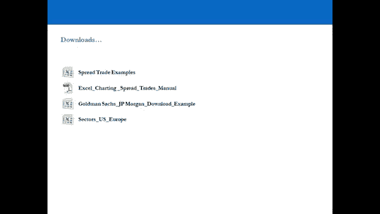

你下载它，你画图表，你在你的价值链上规划你的行业，你开始弄清楚为什么事情会移动，他们移动的方式，去发现行业内公司的运营计划，开始决定你想接触谁，你为什么要接触它，你想冒什么风险，以及如何对冲。

是否值得去做，因为如果这不值得做，别这么做，就去市场买吧，所以你会得到，关于如何实际进入的一步一步PDF指南，下载数据，通过所有步骤并识别这些交易，以及你如何看待他们，你如何决定哪些好看。

哪些看起来不太好，我们举了一个例子，然后是你可以用来查看所有扇区的工作表，在美国，你也得到了，所以这是美国所有行业的全面细分，和欧洲，你可以，他们都有现场链接，你可以点击它们，它把你带到网站上的行业。

上面有所有的估值，好的，欢迎回来，我真的希望你能掌握一些主要的概念，如果你不是一直回去看演示文稿，并确保这些概念坚持下去，所以这里的原理，你知道的，做最少的工作以获得最高的回报，风险最低。

那么这一切是如何很好地适应的呢，当我们看着，呃，我们的世界观，然后我们到行业层面，从我们的世界观来看，我们可以很容易地在股票市场上拿一些，所以如果我们看涨，看好GDP，我们买标普500。

如果我们看跌gdp，我们卖标普500，当我们到行业层面和库存层面，我们真的不想去太久，表现将低于股市的股票和行业，否则我们只能通过股票市场，在股市里越陷越深是没有意义的，如果我们能得到同样好的回报。

只是在市场上交易，你知道，反之亦然，如果我们看跌，我们不想做空行业和股票，在那些最终表现优于市场的行业中，我们还不如把市场作为空头或对冲，当我们做多行业和股票时，相对于空头部门和股票。

这里获得最高回报的整个概念，因为最小的风险真的适用，因为在对冲基金界，真正重要的是你的风险调整后回报，所以你会看到我们通过跨部门利差率的例子，跨部门成分价差率及部门内成分价差率。

这些例子你可能注意到的是，你对冲的风险越多，你往往得到较低的回报，现在，这绝对没问题，因为你实际上冒了更少的风险来获得回报，本垒打交易是指你基本上对冲了尽可能多的风险，但你得到了你本可以得到的回报。

或者得到更好的回报，如果你不规避风险，那是本垒打交易，这是专业交易者一直在寻找的交易，所以记住那些不同类型的交易，跨部门成分分散贸易，跨扇区价差贸易和介绍扇区成分价差TRO。

因为这些是你会一直看到的特征类型，所以当你看好这个世界的时候，你看好一个行业，你有很多不同的交易可以做，你可以做一个跨部门的传播率，你可以在行业内寻找股票，并进行跨行业成分价差交易。

你也可以在你交易的地方做一个扇区价差交易，同一行业中周期性较强的股票，相对于同一行业中周期性较低的股票，如果你能经历这些过程，经历这些层次，并设法对冲尽可能多的风险。

仍然能得到很高的回报甚至比你能得到的更好的回报，如果你不在其他交易中对冲这些风险，那你基本上就击出了本垒打，因为在那次交易的一生中，假设世界上发生灾难是三个月，或者在扇区发生了什么。

市场上发生了一些使一切都下跌的事情，那么你的短裤就会像你的肺一样往下掉，你不会被阻止或被迫退出交易，在得到回报的旅程中，如果你能冒最少的风险得到最高的回报，那么你是一个非常有效率的交易者。

因为在你一生中的某个时候，作为一名教练，这是毫无疑问的，它很有规律地发生，你知道，在过去的十年里，我们看到了很多情况，十五年，在有外部冲击的地方，和世界上没有人预料到的外在冲击，市场波动很大。

如果你在采取立场，在那里你冒了很多风险，但你没有对冲，比如说，市场风险和部门风险，你很快就会损失很多钱，而如果你对冲风险，你可能根本不会损失任何钱，事实上，你可能会从中赚钱，所以这是一个非常重要的概念。

确保你的头在这些，呃，围绕这个概念，围绕这些交易，因为这些是交易的类型，你会在股票市场上一直看到，现在我们要转到电脑屏幕上，我要告诉你如何进入，对于股票，基本上绘制和分析价差交易，让我们到电脑屏幕前。

一旦你学会了怎么做，它将开始成为第二天性，然后你可以开始建立多种贸易想法，即使你有一个想法，您可以建立多种不同类型的交易，利用我们所研究的交易来产生想法，以获得最有效的TRA。

所以让我们通过计算机屏幕上的一个例子来学习如何做到这一点，然后我们要进入视频十九，我们要更进一步，我们将开始关注股票，所以让我们去电脑屏幕，我们九十期视频见。

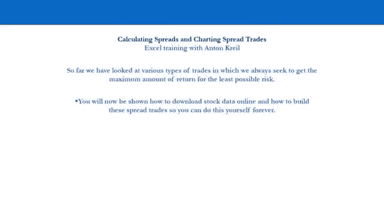

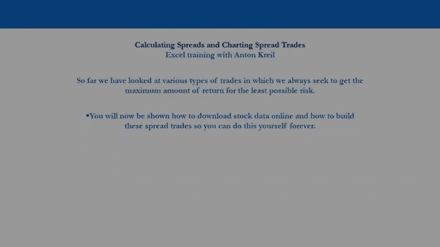

好的，所以欢迎来到电脑屏幕，现在，我要给你看什么，以下是如何生成或分析价差交易，实际上，这是想法产生过程的一部分，因为我们在这里要做的是产生一个想法，并假设一开始我们实际上有一个世界观和行业观。

现在我们在寻找潜在的特征，我们在这里要做的实际上只是使用几种资源，并且只能公开获得的信息。

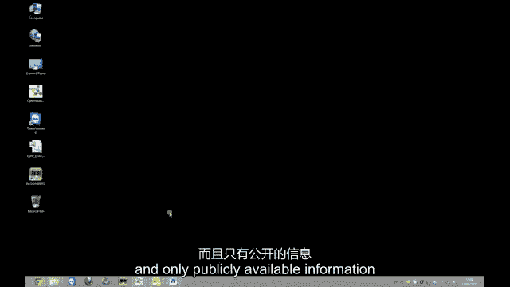

所以我们将使用Excel和互联网，基本上就是这样所以我们首先要做的是，我们要去雅虎，金融。

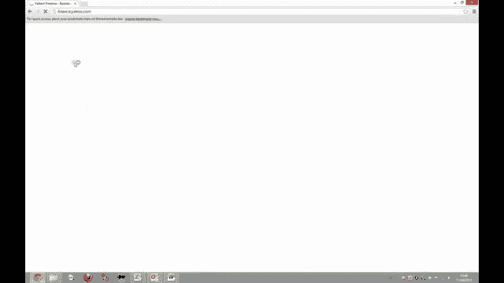

我们在这里做的是，我们会假设我们有一个世界观，我们有行业观点，我们的世界观是乐观的，我们倾向于周期性行业，所以我们要看看金融部门，我们将特别关注银行，我们将考虑走很长的路，因为高盛对周期更敏感。

这是因为高盛是一家纯粹的投资银行，所以首先，我们只想下载每天的数据，高盛的数据可以追溯到1999年5月。

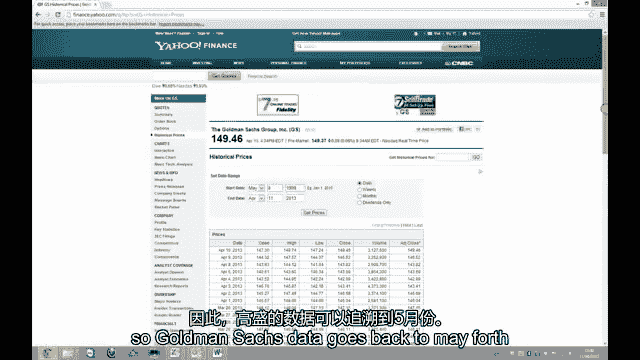

为什么因为那是他们上市的时候，那是IPO，所以我们滚动到底部，我们只需点击下载电子表格，我们有数据来这里，我们有开盘高低收盘成交量和调整收盘，我们要的人在这里，调整后的收盘价，因为这包括股息。

我们只是把它整理一下，我们称之为GS，所以这很简单。

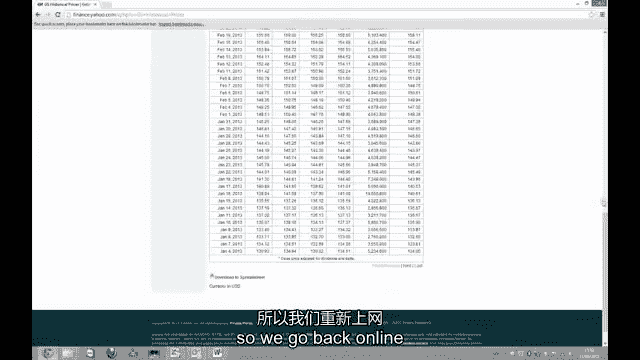

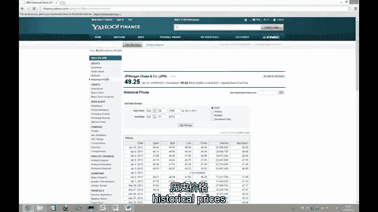

追溯到1983年的每日数据，滚动到底部，下载电子表格。

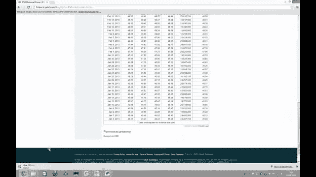

这是我们的数据，所以我们复制这个，我们只是走捷径，到我们早些时候的电子表格，所以我们在这里插入我们的GPM数据，现在我们想创建传播，我们要做多的股票，或者我们希望做多的资产，总是在分数的顶部。

所以我们总是希望做空分子和股票，总是在分数的底部，我们所做的就是把高盛的股价除以JP，摩根股价，我们得到三个位置，零，三个，四，七，二一，我们在这里要做的只是，把这个放到小数点后两位。

所以我们有三个位置，零三，我们要一路自动加油，现在让我们向下滚动到数据的底部，我们可以看到那天的差距是1。71，现在价差是三点零三点，在此期间，我们在这里要做的是获取数据，我们要创建一个图表。

所以我们一直向上滚动，我们已经开始在这里创建图表，现在我们要做的是，我们就把这个标签去掉，我们得选择图表，对呀，鼠标并选择数据，我要给它起个名字，所以我们就叫它GJPM吧，我们想去横轴。

我们需要选择相应的日期，我喜欢向下滚动，只是为了确保我们安排好了合适的日期，用正确的数据，所以1999年5月4日，然后我们一直向上滚动，一直到顶部，我们就有了，这是我们从1999年开始的传播，现在。

我刚在这里选了日期，我们再来一次，选择日期格式轴，我在这里所做的就是整理，整理图表，我要选择y轴，我要把最小值改为1，我要把最大值改为6，所以我们可以更好地看待这一点，我要把主要单位改成第二点，五个。

我也要把图表的线变细，SO格式化数据系列，我也要改变颜色，开始了，你可以看到在1999年5月的开始，这个区域的价差是1。7，现在是三点零，三个，当你直觉地想到这一点时，有点道理。

因为美国的国内生产总值比1999年高得多，高盛性，就收入而言，一个企业的周期性要大得多，所以你会期望利差更高，介于两者之间的一切呢，嗯，我们能做的就是把它覆盖在商业周期上，因此，将此叠加到GDP增长和。

或者我们可以把这个覆盖在不上，我们可以在一秒钟内做到这一点，首先，我要给你看什么，就是我们如何在这个图表上添加一些技术，所以让我们添加一条趋势线，这样我们就可以得到一个长期趋势，所以这里的线性趋势线。

我们得到了利差的长期平均趋势线，所以我们可以看到它现在在下面，我们还可以做的是添加，所以在趋势线上，我们可以添加移动平均线，所以让我们看看60天移动平均线，我们可以改变它的颜色，让我们把它换成绿色。

我们还可以加上一个更长期的移动平均线，所以让我们说，二百五十天移动平均数，让我们把它变成紫色，所以你就是这样添加的，呃，技术装备，现在就这种传播而言，我们可能想看看这种利差与商业周期相比是如何表现的。

所以让我们在这里重命名这个图表，这张纸，并将其更名为GS JPM制造，所以我们想看看这个，让我们回到互联网上，让我们谷歌ISSM。

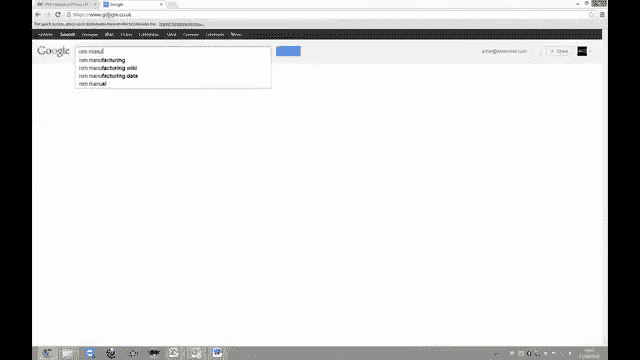

我们开始了第一份关于商业的ISM制造报告。

我们希望所有的制造索引都在一个文件中。

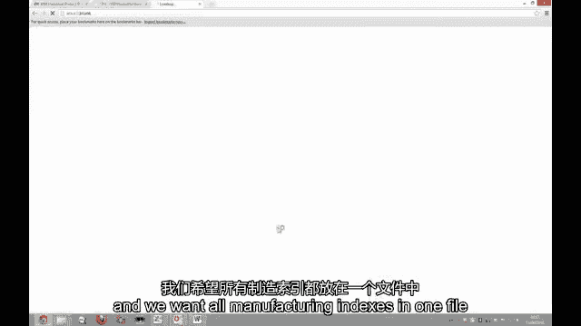

就等着下载吧，这是一个相当大的文件。

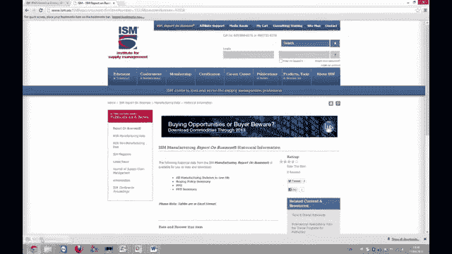

我们想要的是PMI数据，采购经理指数，所以我们开始了，采购经理人指数，点击进入那里，我们有什么，我们的采购经理人指数一直追溯到1948年，所以只要启用，那就是在这张纸上铺开，只回到九十九。

所以我要去挑选1999年5月的所有东西，我要复制它，我要弹回我们的另一张床单，我只是想在这里，我们要叫那个日期，我们将把这个菜单称为ISM制造，把这些加粗，我们可能想做的是把这些数据翻转过来。

所以我们在顶部有最新的数据，所以我们能做的就是过滤，我们可以把这个分类，呃，从最新到最老，从三月二十三日开始，我们现在要做的是让高盛，这样我们就可以开始比较利差和商业周期，那么我们下一步做什么呢。

我们这里有每月的数据，那么让我们去看看高盛的月度数据。

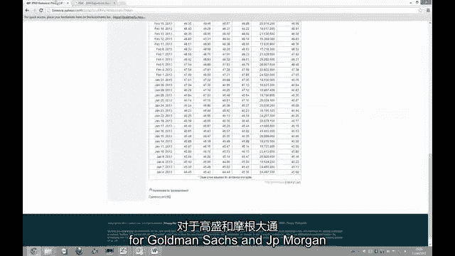

所以我们这里有JPM，我们想把这个改成三月，二十三，我们需要每月的数据，获得奖品，把那个放错角落了，走错地方了。

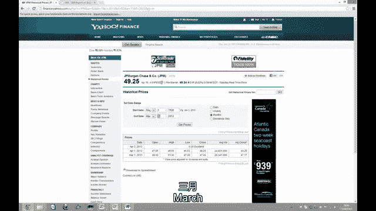

从2013年3月1日到1999年5月，所以我们把这个下载到我们的电子表格中，你在这里看到了很多，那太好了，那正是我们想要的，所以我们只要把所有的数据，我们称之为GPM，我们先确认一下，是的，排得很整齐。

现在我们想要高盛的数据，所以我们重复同样的过程。

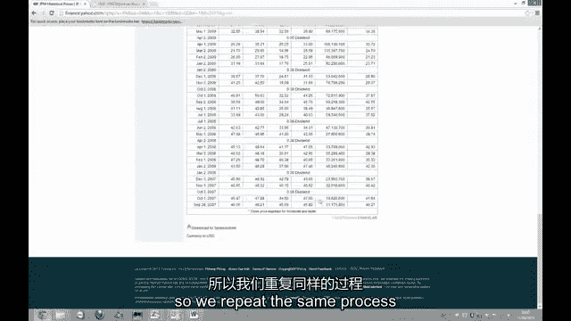

1999年5月4日正确我们把它改成了2013年3月1日，我们需要每月的数据，我们下载电子表格。

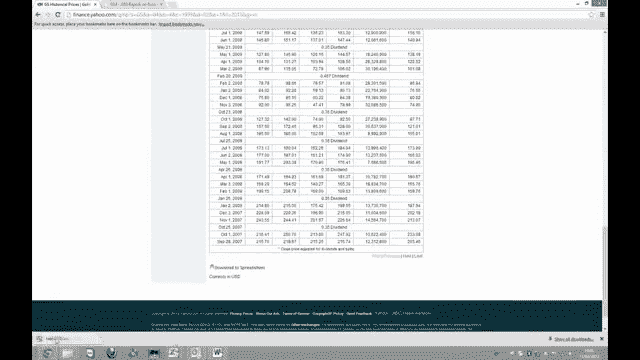

所以是的，2013年3月1日，两个，一九九九年五月四日，我们想得到所有的数据，复制，我们想坚持这一点，在这里叫GS，这将是GS而不是JPM，我们做的和之前做的一样，戈尔曼腿除以j，p，摩根。

我们想让它再次回到小数点后两位，我们只是自动加油，很好，一切都很好，我们要画那个图表，再把这个标签去掉，选择数据，把日期排好，给它起个名字，所以g jpm，ISM制造，让我们把这个排好队。

所以你在里面得到了正确的日期，我们现在要做的是，我们要选择一个新的系列，我们想要这个专栏在这里，b栏，现在看起来有点奇怪，但在制造业数据中，这看起来不会奇怪太久，我们想再次得到相同的日期。

所以一切都排好了，那很好，那很好，好的，我们现在要做的就是，我们想把制造数据放在次轴上，所以我们选择行格式数据系列，然后点击辅助轴，大家可以看到，它们都出现在同一张图表上，ISSM在右手边，高盛。

所以我们现在要把这个整理一下，所以在左手轴上，我要创造一个最低限度，最多六个就可以了，主要单位点二五，在右手轴上最小，说三十，和一个由两个人组成的大单位，我们可以在那里看到，当我们走近一点看。

我们可以开始观察与商业周期相比，这种价差的行为，你可以很清楚地看到，从9月份左右开始，二千零六，所以大约在这个时候，一直在朝着与ISSM几乎相同的方向前进，事先，这是值得怀疑的。

你在这个时期绝对可以看到，整个时期都在这里，在哪里是，这可能可以解释，因为高盛在1999年5月才首次公开募股，这可能与IPO价格有很大关系，但肯定是从九月开始的，哦六，我们已经看到ISM解释了很多动作。

在高盛，你可以在这里做别的事情，您可以通过复制图表来放大，所以复制下面，只要改变日期，这样我们就可以放大了，去了解最近发生了什么，所以我们可以在这里看到，比如说，有一个双重阻力水平，大约4。5。

从2010年11月开始，它一直在射程内，一年以上，所以几乎回到一月，二千零一十二，你还可以在这里改变单位，这样你就能更好地了解发生了什么，所以我们可以把这个改成两个，把最多改为五个，改变次要单位。

一个的主要单位，你可以看到发生了什么，你可以看到这里有一些动量，因为60天移动平均线正在穿越，二百五十天移动平均线从下面，这可能标志着传播中发生的某种变化，似乎发生在十月左右，二千零一十二。

让我们回到ISSM的情况，我们也可以在这里做同样的事情，将其复制到格式轴下面，让我们从2008年开始看看这个，让我们把日期排好，所以看起来更好一点，我们从上面的图表中知道，它开始发生在9月6日左右。

ISM在很大程度上解释了高盛的举措，你经历的很多过程，你知道的，我们刚刚经历的这个过程，你要经历这个过程，很多，当你产生想法的时候，尤其是具有传播特性的，当你产生想法，建立和维护你的观察列表时。

在同一个文件里，你把你所有的想法都放在一个文件里，这就是我们要做的，我们在这里努力工作，走向世界，获取真正相关的信息，正确地解释这些信息，并把它变成真金白银，你刚才在这里看到的就是一个很好的例子。

我们已经走向世界，我们使用了公开的信息，我们已经下载了公开的数据，重要的东西，我们已经开始研究，和商业周期，我们看高盛的那个，在这种情况下，您可以使用任何领先指标，你知道，我鼓励你试试这个。

你去看看消费者的情绪看看消费者的情绪，覆盖到零售股票上，看一下建筑许可证号码，看看建筑许可证，覆盖在房屋存量上，看看你可以对冲市场和行业风险的利差，就像我们在这里做的那样，所以别忘了这个铺面。

我们实际上正在研究这个，如果我们真的把这个交易，我们在对冲市场和行业风险，我们仍然得到惊人的回报，所以想象一下如果你我们在这里的某个地方，这是GDP增长的开始，你在看高盛。

假设你设法在三分上得到了这个价差，在牛市的高峰期，你可能已经离开了，你可能会在五点左右离开这个摊位，那就是两百分，三百多分，所以这是一个很好的66%的回报，但在整个时间里，你实际上已经规避了所有的风险。

所以你可以去找其他领先指标，你看看消费者的情绪，看看ISM非制造业，看看建筑许可证，获取所有领先指标数据，都是公开的，现在开始产生贸易想法，我们稍后再看，下一步是为了构建，管理，并维护您的观察列表。

你的观察清单上会有多种想法，记住一个想法在这个阶段只是一个想法，我们仍然必须通过技术因素和价格行动来为我们的交易计时，我们将在明年晚些时候向您展示，在其他视频中，这就是电脑屏幕上的内容。

这就是你基本上产生和规划你的贸易想法的方式，获得对他们行为的欣赏和理解，让我们进入下一个视频。