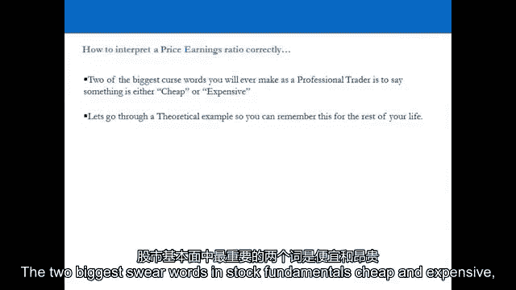
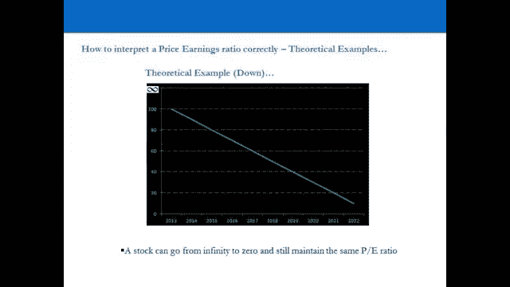
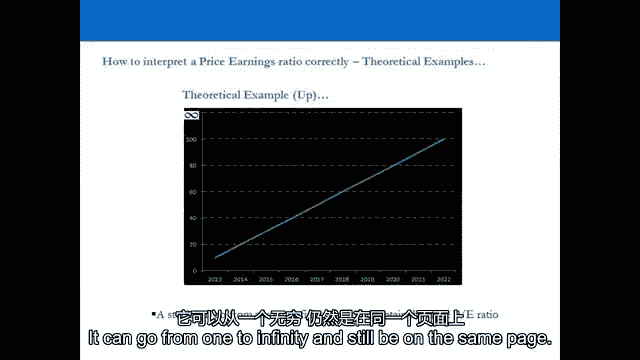
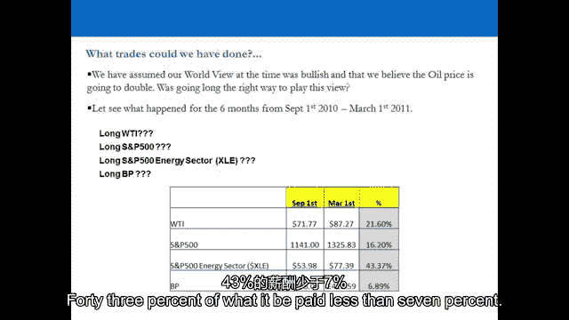
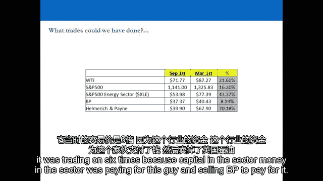
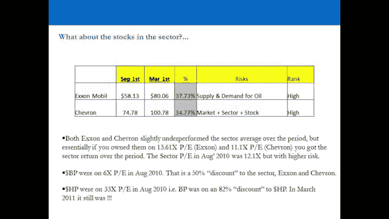
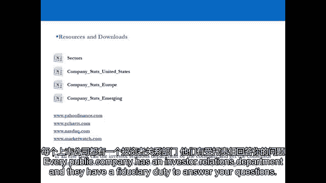

# 【高盛专业交易课】从0教你如何做交易 （中英学习全集） - P18：18-18.第18讲 自上而下训练 - web3深度学习 - BV1be4y1c7ir

好的，所以欢迎回来，欢迎收看视频，十九，我们现在要看股票，所以我们看了世界观，我们看了布景，当我们从股票市场的世界观到行业观时，我们发现我们会有看涨的倾向，看跌或市场中性，取决于我们对U的看法，s。

欧洲华人及其全部，全球GDP，我们可能倾向于Cycliccali的部门的情况，e收益的周期性，或者我们可能会倾向于防御，收入的非局部性，但是当你进入下一个阶段时会发生什么。

当你真正打开一个扇区时会发生什么，并查看一个扇区中的所有股票，你怎么知道哪一个是最好的交易，不管是长的还是短的，不管是在周期性还是防御性部门，那你是怎么知道的，我们要回到这个原则，尽可能少做功。

做尽可能少的工作，就是获取市场上最重要和最相关的信息，通过正确的解释把它变成真正的硬美元，我们现在要看的是，是大多数人认为的标准行业指标，我们要看价格，市盈率，然而，世界上绝对显而易见的。

在零售贸易商甚至专业贸易商的培训领域，研究分析员，真正认为自己是投资和贸易领域专业人士的人，真正明显的是，实际上广大的，绝大多数人真的误解了这个指标的含义，我真的希望你能学会这些原则。

你得到这个原则是非常非常重要的，我们要去做演示，看看这到底意味着什么，为什么它对你如此有帮助，选择股票和选择交易，一旦你有了你的世界观和你的一套观点，为什么它是如此有用的工具。

当我们试图坚持做尽可能少的工作的原则时，以获得最高的回报，风险最小，让我们去看演示文稿吧，这就是它变得有点有趣的地方，所以我们要用一些类比，真正会留在你脑海中的东西，让这些原则脱颖而出。

所以你永远记得他们，让我们来看演示文稿，演讲结束后，我们来总结一下股票观点，以及如何正确选择股票，好的，让我们继续，呃，股票视图，所以在这一点上，我们假设我们有一个世界观和一个部门观，所以我们。

让我们说，我们发现了一个我们认为会跑赢市场的行业，你在这一点上的倾向并不难，因为你认为GDP会扩张，那么为什么你要做短周期，如果你认为GDP会扩张，当然不是你想长期循环，记住这句话。

你的书必须完美地代表你对世界的看法--它总是必须的，否则你的投资组合与你的想法不一致，这太疯狂了，所以让我们假设你认为市场在上涨，你在看你认为会跑赢周期性的行业，现在你在寻找行业内的股票。

你认为会胜过你的，你如何识别这些股票，所以如果我们要从根本上看这些股票，做这件事最好的方法是什么，首先要看的是p比，然而，市盈率是市场上最被误解的基本面之一，被绝大多数人，思考p比的最佳方法是什么。

世界准备为公司的收益支付多少，问题是整天停止交易，每天，在市场上有一个买家，在这个价格上有一个卖家，这意味着该语句为真，反过来，世界准备以多少价格出售该公司的收益，人们总是对此感到困惑。

所以让我们通过一个例子，我想让你想象一下，你现在有购买周期性股票的倾向，你拉起这个扇区，所有的股票都在这里，用p比，但我已经把股票的名字拿走了，所以这里的名字，名字应该在这里，但我已经删除了。

因为你应该马上对这些股票有意见，我们会解释为什么，我们觉得股票怎么样，所以这个行业的市盈率是12倍，我们认为5点的这只股票怎么样？八倍分区，所以让我们这是一个当前的PE，那么今年我们对5。

8的股票有什么看法，是的，所以到目前为止表现不佳，便宜吗，好的，我们觉得三楼的股票怎么样，四倍收益，在二楼的那个，三倍收益，它们贵吗，好的，所以用这个，在五点八，你在这个行业有百分之五十的折扣。

用这个一对三，四次，你为这个行业支付了百分之三百的溢价，在估价上，哪一个便宜，哪一个贵，答案就在那里，股票基本面中最大的两个脏话，物美价廉。

世上无难事，只怕有心人，什么都不贵，当你在电视上看到一个分析师说某样东西很便宜，把它关掉，当你看到他的朋友说它很贵的时候，把它关掉，它们是交易桌上最大的脏话，世上无难事，只怕有心人，什么都不贵。

这个人给出了答案，否，只是收益的质量，那么为什么人们在这个时候，此时此刻想象一下，这是你在周三下午的中午找到的，股票在市场上直播交易，有人买，有人在卖，为什么人们准备付钱。

这家公司的利润有百分之三百的溢价，为什么人们准备出售这家公司的收益，给这个部门打五折，还记得现在交易的股票吗，人们以六倍的价格出售它，他们的收入质量很糟糕，市场在说什么，市场现在正在发表声明。

想想世界上所有研究这只股票的分析师，他们每周都和公司说话，他们花了几个小时、几个小时、几天、几天、几周、几周，建立荒谬的DCF估值，他们得出的结论是，这家公司对他们所有人都很了不起。

他们不仅会达到他们的收入，他们可能会把他们的收入花光，在接下来的五年里总是跳动，都在那里的价格里，它告诉你市场的想法，这个怎么样，所以世界上所有每天与公司交谈的研究分析师，周，月份，建造巨大的模型。

写三百页的研究报告，每天24小时和他们的12人团队一起分析一只股票，他们得出的结论是它很便宜，市场的结论是完全相反的，市场得出的结论是，这只股票应该得到该行业50%的折扣，因为它是垃圾。

他们宁愿卖掉这个，买下这个，因为这家公司有增长，那家公司什么都没有，如果你持相反的观点，你基本上是在发表声明，我知道一些市场不知道的事情，你没有，因为这都在那里的价格里，市场认为的一切都在那个价格中。

在市盈率中，所以你应该从中得到的信息实际上是相反的，而不去看你已经确定的公司的名字，市场喜欢哪一个，市场讨厌哪些，所以说，比如说，让我们来看看1999年科技繁荣时期的几个例子，当公司首次公开募股时。

他们没有收益，但他们预测在2035年，他们要赚点钱，所以当他们来到市场，他们在无限的PE电流上，如果你在三月份做空那只股票，会发生什么，1999年首次公开募股时，你不会，你就会被解雇。

因为它会在你脸上上升百分之三百，你会失去你的衬衫，人们为股票支付无限倍的收益，你们争论，这是一个典型的例子，那个时期到处都是人，与市场争论的专业人士，但如果你走了很久参与进来会发生什么。

在交易中设定了20%的止损，然后就离开了，我赚了你一个月投资组合的5%，你发大财了，你会在一个月内赚15%的投资组合，因为它高达百分之三百，你明白我的意思吗。

市场保持非理性的时间可能比你保持偿付能力的时间长，所以如果你认为这是不合理的，你正在做空它，你只是在争论，让我们通过一个理论例子，让我们通过，呃，让我们，让我们，让我们看看一只股票。

在市场上的交易价格是十美元，全年盈利预测为一美元，现在是一月，你以十美元的价格购买股票，他们预测今年的收入为一美元。十倍的p比是多少，公司二月份宣布，他们今年不会达到每股一美元。

因为他们在供应链上有一些问题，他们现在预测每股收益为90美分，那么发生了什么，他们已经收到盈利预警说每股收益将比预期下降10%，股票要去哪里，为了保持10倍P的比率，每股9美元，一个月后。

公司宣布他们不会达到每股90美分，引用商业条件的重大变化，他们现在预测每股65美分，股票必须去哪里才能维持十倍，p，六块钱，五十，然后呢，五月份，公司宣布他们无法达到每股65美分。

他们已经把三个关键客户的合同输给了一个竞争对手，他们现在预测每股一美分，公司要去哪里才能维持它的十分之一，股票在五个月内下跌了百分之九十九。然而，它还开了十次，你开始明白P是怎么回事了吗，反过来呢？

所以一月份十美元的股票，每股收益一美元，他们在二月份宣布，他们将超过每股一美元，他们现在预测一美元20，股票必须去哪里才能维持十倍十二，公司三月份宣布，他们会超过一美元二十，在过去的六周里。

商业状况发生了实质性的好转，他们现在预测每股两美元，它必须去哪里维护，二十块，然后在五月，公司说，在过去的六个星期里，它又变得疯狂了，他们现在预测今年是四美元吗，四十块，P是完全一样的。

股票可以从无穷大到零，但仍然在相同的PE上，它可以从1到无穷大，但仍然在同一个p上。

这就是为什么这两个字，物美价廉，都是完全可笑的，如果你买的东西是该行业50%的折扣，你在发表声明，我知道一些市场不知道的事情，我一定在里面，如果你在市场告诉你的地方做空了什么。

我要为这家公司的利润付百分之二百的溢价。在扇区上空，你在争论，你在做你知道的陈述，市场不知道的事情，你在里面，因为整个市场的观众，他在世界上的每一只股票上做的工作都比你多十倍，在付钱吗。

以五折的价格出售，你们会是同样的人，我们将通过一个例子，这是一种娱乐在我们休息之前放松一下，让我们看一个例子，的呃，情人节买内衣，我试着用会永远留在你脑海中的类比，所以你永远不要搞砸。

所以对于女性观众来说，只要假装你真的收到了礼物，是啊，是啊，哈哈哈，所以想象一下你在办公室里，六便士，m，在情人节，你忘了带你的女朋友，你妻子的情人节礼物，但你就要离开了。

你知道再过一个小时她就要给你做晚饭了，一辆出租车在外面等着你去买，百货公司的内衣，你到了商店，你猜怎么着，因为今天是情人节，所有的内衣都卖光了，除了三项，在同一个机库里只有三件东西，你必须做出选择。

出租车在外面发动引擎，如果你吃饭迟到了，她会杀了你的，没有礼物你是不可能回家的，所以你必须做出选择，你有内衣，五十元，内衣b，一百五十元，内衣C，五百元，谁买内衣AC把手举起来，谁买内衣，b。

所以我们已经确定了所有便宜的家伙哈哈哈哈，你以后不准来酒吧，举手谁愿意接受哈哈哈哈哈哈哈，谁想收到内衣B，好的，如果你喜欢内衣，你去买了人们认为便宜的东西，你意识到你选择了被认为是昂贵的选择。

内衣B既不在这里也不在那里，这只是百货公司里普通的内衣，关键是价格只是质量的一个信号，价格是质量的信号，所以如果我现在告诉你内衣A是70%，聚酯，百分之三十的棉花，你只能在它撕裂之前用三次吗。

当你把它带回家的时候，反正你女朋友也不会想穿的，因为它很便宜，三十分钟后，她会扇你一巴掌然后说，我从来不穿那个，只有一个女人举手说我真的想要那个，我可没这么说，所以我更喜欢那个选择，我妈妈为了省钱。

喜欢什么，如果我告诉你这是百分百的真丝，你会得到50个用途，当你把它带回家的时候，你的女朋友会不知所措的，她会接受训练，直接换上了，在接下来的三个月里，你会是最好的男朋友，A似乎不再便宜了，现在很贵。

B也不再贵了，它现在，现在很便宜，但你实际上为C支付了十倍的倍数，绝对没有便宜和昂贵这回事，公司的倍数告诉你，市场愿意为公司收益付出的代价，他们支付的是收入的质量，所以你在那条信息中被告知的一切。

当某物在该行业的百分之三百溢价时，他们有这个行业中最高质量的收入，或者被认为有，然后你得去看看这是否合理，但有一种倾向，你可能找不到任何东西来证明，做空它，反之亦然，在便宜或被认为便宜的股票上。

在该行业的大幅折扣上，所以如果你在该行业溢价时做空这些股票，你在和市场争论，你的意思是，我觉得它很贵，当市场在说，嗯，绝对不是，我准备付钱，你在和市场上的其他人争论，什么都没有，你知道，总的来说。

市场还不知道那只股票，这就是他们付出代价的原因，这是收益质量的信号，所以我们用了科技繁荣的例子，另一个例子怎么样，像Facebook和Groupon这样的股票去年上市时。

So Group在去年2011年底的Facebook上，Groupon过来了，收入超过一百倍，Facebook在首次公开募股中的市盈率达到了125倍，所以你在看，我们以前看过这个行业。

那里的股票是市盈率的34倍，股票的市盈率是六倍，一百二十五倍市盈率的股票怎么样？他们怎么样，我们买吗，我们做空他们吗，谁在乎，世界上有四万只股票，当你被吸引去给自己买Facebook时，你所做的一切。

正在读报，倾听媒体，没有看到更大的图景，你不必参加，只是让市场有它的乐趣，以后再处理，它是世界上四万只股票中的一只，会有例外的，但作为一般规则，你不应该试图与市场作斗争，看看估值。

估值实际上告诉你市场的想法，市场上所做的所有工作都是由信号表示的，收益质量的价格，你被告知，一条消息，你拿着这些信息，你去看看这是否合理，如果你认为这不合理，你还得自己想，我在和市场作斗争。

因为这将是一个难以置信的原因，你们为什么要逆市场而动，没有人见过的东西，或者想到，世界上也有例外，当然啦，但你不必参与，不参加是一种选择，让我们来看看一个真实世界的例子，它会开始变得更清晰一点。

当我们看一个真实世界的例子时，我们开始监控我们如何在投资组合中构建交易，在我们看了扇区之后，我们将在2010年夏天考察英国石油公司，英国石油公司在2010年夏天发生了什么，是啊，是啊。

所以他们有深水地平线，漏油，墨西哥湾，2010年夏天发生了什么，七月八月九月，我们在ISSM有一个趋势，在那里它长了十一年，十二，十三，五十岁以上十四个月，向我们发出信号，GDP将在12个月后扩张。

Q E二，我们坐着看彭博电视，有一个深水地平线，英国石油公司的灾难，英国石油公司从每股6英镑涨到4英镑，市场上的每个分析师都在电视上说它很便宜，你应该买它，你的观点是世界将扩大国内生产总值，油价将翻倍。

你看到的是能源部门，在石油行业寻找走长的股票，你买英国石油吗，也许在一段时间后，当第一个稳定下来，好的，所以让我们假设价格稳定下来，你买吗，bp，好的，很多人都这么做了，事实上。

绝大多数散户交易员仍然拥有英国石油公司，两个，三年后，买它的人因为它最初最终成为一个交易头寸，然后当它什么都不做的时候，它最终会在你的养老金中，它开始了你在上面找借口，但让我们看看发生了什么。

股票就是这么做的，在这附近，大约在这个时候，每股400便士，每个人都在说英国石油公司很便宜，每个人都应该买它，这是英国《金融时报》的头条新闻，比每个分析师都多几倍，谁是这个行业的人在彭博社的电视上。

CNBC，说它便宜，但你很乐观，英国石油公司是否代表了你对世界的完美看法，这是你必须保持纪律的地方，我们之前看到的部门是主要的综合石油和天然气部门，这正是p比，这是8月份的截图，二千零一万。

我不得不保存那个并收集它，因为这是一个完美的例子，那是英国石油公司，英国石油公司的市盈率为6倍，人字形在11号，康菲石油在13号，埃克森在13号，企业石油和天然气，股票在三十岁吗，四次。

我们买英国石油吗，让我们看看答案是什么，所以在那之后的六个月里，实际发生的事情，看看我们本可以有的所有选择，就在油的旁边，就靠油，这么长WTI的U，今日油价，那六个多月的报酬是什么，百分之二十一。

什么是S和P支付了16%，能源部门支付了43%，英国石油公司支付了不到7%的费用。

你在这个行业表现不佳，你的表现低于市场，你的表现低于所有价格，让我们看看扇区，让我们看看扇区，S和P的十大持股，五百能源部门，斧头，在列表的后面，哈里伯顿国家奥威尔沃，这是能源部门的权重。

那么你付多少钱，当你购买能源部门时，最大的两家控股公司，大概占三成，我们知道他们在吃什么，他们的扇区平均倍数是11，十二次，所以你基本上是在支付行业平均倍数，是啊，是啊。

所以你为这个部门支付了百分之百的溢价，你得到了六倍的回报，非常感谢，还有什么，我们还能做好什么，让我们来看看我们之前看到的股票，掌舵与痛苦，在九月，你还记得赫尔默吗，我们看到的那个是钻机老板。

钻机所有者，是啊，是啊，上升了215%，那是股票当时的历史价格，那时是三十岁，四倍收益，在你获得70%的惠普后的六个月里，那是拥有的站，而不是英国石油公司，那么为什么英国石油公司的股价是。

英国石油公司没有进行六次交易，因为它很便宜，它的交易价格是六倍，因为该行业的资本。

该行业的资金为这个人买单，并出售英国石油公司来支付，世界上没有一个专业人士想拥有英国石油公司，因为他们知道他们不会得到超过六点的回报，油价上涨的十二个十八个月，但他们在这些人身上得到了回报。

所以他们把它们卖了，从英国石油公司得到了钱，并把它投入到这些人身上，他们付三十，四倍收益，并以6倍市盈率出售英国石油公司，你做那一行冒的险呢？但是如果你，如果你在这六个月的时间里买了WTI。

你所面临的风险是特定于石油供应和需求的，全球，微观和微观层面的全球石油供需，500美元，你会有市场部门和股票风险，能源部门本身，你有供求风险，加上市场，bp，你会有供求，加市价加股票风险，和HP。

你会有供求市场和库存，但如果你反其道而行之呢，最聪明的交易是什么，以最小的风险获得最大的回报，最明智的交易实际上是做空英国石油公司，做别人告诉你要做的相反的事情，在主流媒体上，因为没有什么是便宜的。

没有什么是昂贵的，所以如果你真的做空了，你得了60分，比这个行业的任何东西都高2%，高于任何其他交易，风险显著降低，因为现在你已经对冲了整个时期的市场和行业风险，这就是为什么英国石油公司上了六次。

因为每个人都准备卖掉它来进行交易，或者与之非常相似的交易，筹集现金以支付更好的交易，这就是为什么，当你连续几个月每天拉起屏幕，有人以四英镑的价格出售，这些以四英镑的价格出售的人是谁。

他们是谁他们是仙女教母，否，他们是真实的人，他们做出了一个决定，英国石油公司在六次，其实很贵，这实际上是34倍的廉价头盔运动，这是市盈率的一个重要教训，永远不会忘记，是呀，会有奇怪的例外。

但不要把你的一生都花在试图识别例外上，一生都在听市场，它告诉你什么，顺应潮流，你这样做，你会非常富有，这个行业的其他股票呢，如果我们讨论内衣的房间里的大多数人，男性和女性追求平均回报。

你选择了普通的内衣，如果你刚刚买了这个行业的平均股票，在11点，十二次，你会得到略低于扇区回报的回报，但明显高于bp，这不是巧合。

你会一次又一次地看到这种情况发生，比你看到异常的次数多十倍，你每天在市场上都会看到这种情况发生，当你真正明白你在做什么的时候，当我在投资银行的交易大厅工作时，我在我交易的行业的研究分析师。

会走到交易台前给我研究报告，告诉我某样东西便宜或昂贵，在这种情况下，每个专业交易员的反应是把研究报告还给他们，说滚出我的桌子，因为没有什么是便宜的，没有什么是昂贵的，事实上，我们更有可能拿起电话。

或者走到一些销售人员面前说，采取相反的立场，所以这就是你要做的，当你看股票时，这就是你要经历的练习，基本面，如果你想，请随时去拿公司最近的资产负债表，损益，现金流量，去看看25个分析师，研究报告。

你要得出的结论，是吗，它证明了它的倍数，让市场为你做所有的工作，在英国石油公司，想象一下有多少资源投入到世界各地的研究分析师身上，他们的结论是英国石油公司很便宜，它不便宜，现在市场上有个人在卖。

想想那些资源，所有的钱和所有的投资都是为了得出结论，英国石油公司很便宜，不是市场告诉你它的市盈率是六倍，现在市场上有人在卖，想象一下你坐在那里，一个分析师，你是高盛的石油交易员，还有一位分析师。

他对英国石油公司的评级从6英镑起是买入，一直降到四磅，发表了一份新的研究报告，称英国石油公司甚至更便宜，只有四英镑，你去没有狗屎，夏洛克，就在下面，它的下降是有原因的。

因为他们有500亿美元的债务要偿还，在接下来的五年里，用未来的收入，我想卖掉它，因为当价格上涨时，它就赚不到钱了，我想拥有惠普，把你的研究报告拿走，也不要打电话给任何客户，很尴尬，那就是他们。

你在交易大厅里的对话，对呀，你的亲戚告诉你你需要知道的一切，你不需要努力，只要聪明地工作，让市场的其他部分为你努力工作，让他们工作和奴役，为你计算出股票应该在哪里交易。

然后把PE作为一个信息并正确地解释它，这是人生的选择，如果你想去投资银行工作，那是你一生的疡，做了二十年的研究分析师，做DCF模型，得出英国石油公司便宜的结论，请随意，我坐在家里。

通过看体育来收集所有的信息，意识到到底发生了什么，卖给研究分析师，你不必努力工作，你可以聪明地工作，那是更聪明的工作方式，这就是专业交易员在许多情况下发现的，很多，很多年了，所以那个人在研究部工作。

我在交易台工作，因为他想努力工作，我想聪明地工作，这不是巧合，所以下次情人节记得内衣的例子，我记得每次你和部门的亲戚拉起一张桌子，有一大串股票名称，忘了名字是什么，只是无关紧要。

如果某物对其所在行业有50%的折扣，它打五折是有原因的，现在市场上有人在卖，我准备按这个价格继续卖，也许不是某人，可能有多个人，如果你持相反的观点，你在争论，你在发表声明，我知道一些事情，市场不知道。

反之亦然，如果它是在该行业的300%溢价上，你做空了，我知道一些事情，市场不知道，我们再来一次，还有一个快速的例子，苹果，在苹果的最后两年，市场价格收益情况的经典例子，他声称对苹果股票了如指掌。

有人知道苹果的市盈率是多少吗，在2011年，少一点，是啊，是啊，大约是收入的二十二倍，是啊，是啊，库存从2011年到2012年，它从什么水平做了什么，粗略地说，它是从，差不多，是啊，是啊。

苹果的EPS增长是多少，二千零一十一到二千零一十二，二千零一一二每股收益为六十，百分之五，这是预测的，或者稍微少一点，他们超出了预期，这就是为什么股票翻了一番，人们为65%的每股收益支付了22倍。

增长是有意义的，他们赚了钱，它是该行业的溢价，但去年夏天六七百美元，苹果的市盈率是多少，当它超过600美元时，所以让我们说，六百五十，为什么人们会以这个行业的折扣价650英镑出售它，三星迎头赶上。

你只有一个理由，因为EPS对2012年的增长预测，是百分之二十二，2。这家公司已有多年的发展，它们所有的生长都在11到12岁之间，所以现在人们以低于行业的价格出售它们，其中一个原因是其他平板电脑制造商。

其他智能手机制造商正在迎头赶上，但同时，市场上的每个研究分析师都认为这是一个强劲的买入，但他们是拿起电话的研究分析师，说我们预测明年每股收益将增长22%，合乎逻辑的问题是什么，1。

你为什么不降低这只股票的评级？如果去年一只股票的每股收益增长了65%，你对它的买入评级很高，现在它的每股收益增长了22%，你告诉我它有22%的每股收益增长，因为它在你自己的预测中，1。

你为什么不把这只袜子降级，1。你为什么不把股票评级下调为持有1。市场表现错了，不他们，事后看来，他们实际上是对的，他们会是对的，因为股票被谋杀了，所以说，为什么市场上没有任何研究分析师下调评级。

股票在政府里是个笑话，在班上一直在上涨，差不多了差不多了，因为苹果有一百个，资产负债表上有1000亿美元，他们不想惹恼公司，因为他们不想失去工作，如果苹果开始接管世界各地的公司。

他们公司的银行部门错过了所有的并购业务，因为他们是市场上唯一下调评级的人，这真的把苹果惹恼了，所以他们没有从中得到任何银行业务，但这是很明显的东西，有45名分析师对它进行了强劲的买入。

所以他们对这个行业的折扣是12倍，市场上的每个人都说他们很便宜，每个人都吃苹果，苹果将成为第一个万亿美元的公司，大家都这么说，便宜十二倍，它应该以每股一千美元的价格交易，不是六块五一份，每个人都很长。

整个世界都很长，苹果，接下来发生了什么，他们十年来第一次没有达到收入预期，股票被谋杀了，它被谋杀后现在怎么办，顺便说一句，一半的人现在降级了，因为它只是一个，呃，下调评级是合理的，因为股票现在移动了。

他们总是反应很晚，研究分析员总是，你很少会得到一个研究分析师，他们冒着风险说股票要跌了，尤其是家喻户晓的最爱，就像苹果，谁的资产负债表上有1000亿美元，这是体育课的一个经典例子。

所以一年前它开了22次，一年后它开了十二次，而且很便宜，干得好，它沉下去了，干得好，倍数在一年内从22下降到12，你得出的结论是它很便宜，你买得很好，但你还是那个告诉我它很便宜的人，和其他人一样。

同一个人预测每股收益将增长22%，去年你预测的是65%，那你为什么还没把股票准备好，我在苹果做了什么，购买十二月二千四百罢工看跌期权，价值两万五千美元，只是把它们卡住了，和美国的一个家伙打赌。

谁是最大的苹果球之一，他每天都在推特上，直接拿出了两万五千美元，和他打赌，到2015年底，苹果将低于400英镑，当时是六点半，他接受了赌注，所以如果在2015年底超过400，我必须付两万五千美元现金。

我要带他出去吃饭，任何地方，在伦敦的任何地方，他在纽约，他必须反其道而行之，如果低于四百，苹果在哪儿？现在，四点半，现在他不知如何是好，哈哈哈哈哈哈哈为什么，因为如果他通过做空苹果来对冲头寸。

到了550，然后是三百，他会损失更多的钱，因为他会一直被挡在外面，这个职位怎么样？这个多少钱，三百五十，不是一个大职位，微小的，投资组合中的小额，把它粘起来，忘了它吧，那是九月和十月做的。

只是在股票下跌时非常缓慢地扩大到这个位置，它从两万五千美元的头寸中支付了10多万美元，我去三角洲了吗，不，我不在乎，减，这是体育的一个经典例子，当你变得更老练的时候，你可以去做那些特质，但是。

在2011年上升了22次，在二千零一十二次，把这当成一个巨大的信息，你知道的，收集所有的信息，当我八月在中国参加奥运会时，奥运会期间我不想在伦敦，因为我觉得那是浪费时间。

所以我去了中国做一些能有效利用我时间的事情，我遇到的每个人都在扔掉他们所有的苹果产品，我买了三星的产品，三星在中国的增长速度是苹果的十倍，所以当我回来的时候，我开始寻找我能押的赌注。

而实际上没有暴露在做空股票的风险中，我想在日历上看得更远，打个赌，我一年多都不用想这件事，所以我只是用钱买了很多，看跌期权，十八个月后我就忘了这件事，三个月后，杀死它，这是PE的一个巨大信息。

苹果是去年的经典例子，你不能拿起报纸，你不能把电视打开，而不是听到分析师说它很便宜，世界上没有一个人说上会到四百，现在六个月后他们都降级了，市场如何运作，好的，在资源和下载方面，呃。

你会得到一个叫做扇区的电子表格，里面有所有的实时链接，所以你可以去看看世界上的每一个部门，它直接带你去网站，给你所有的估值，用所有的股票，你将会，你可以为你使用公司的统计数据，s，欧洲和新兴市场。

你从雅虎哪里得到你的PS，金融给你p p倍数，Y图表给出了历史p倍数，现在那个点，Booking。com给了你更多，现在那个点，Booking。com给了你很多东西，给你所有研究分析师的全部情况。

他们在预测什么，他们的建议是什么，对今年和明年的共识估计是什么，和以后的一年，网络是一个伟大的资源市场，也看网络，如果其他一切都失败了，他们会给你一切，你不能在网上任何地方公开获得体育，拿起电话。

你被允许和别人说话，拿起电话给公司打电话，每个上市公司都有投资者关系部门，他们有受托责任回答你的问题。

拿起电话告诉他们你是股东，只是说，市场对你明年收益的一致预期是什么？如果他们没有，他们必须告诉你，这是非法的，我不是在开玩笑，我十几岁的时候经常这么做，因为没有互联网，嗯，有，但插上电源一分钟要一英镑。

你拿起电话那时我十六七岁，我与沃达丰的财务总监和投资者关系部门进行了交谈，说我是股东，告诉我你的预测是什么，市场对明年的预测是什么，他们必须告诉你，有没有人在投资者关系部门工作过，但如果你真的这么做了。

你会看到他们整天无所事事地坐着，无论如何，如果他们，如果他们接到来电，他们会很兴奋的，所以如果其他一切都失败了，只要拿起电话，你被允许，现在是今年，然后是一年，因为当你开始到年中的时候。

明年开始变得更加相关，一旦一家公司报告了一年中的两个季度，正向P变得更加相关，因为它开始达到一个众所周知的地步，股票今年会是什么样子，在Q3之后，都是关于明年的，q四不相关。

因为你总是向前看6-12个月，好的，所以欢迎回来，希望你喜欢我们使用的类比显然有点有趣，但他们的娱乐性是有原因的，因为这个原则是如此重要，没有什么是便宜的，什么都不贵，这个原则是如此重要。

我们需要让它变得有趣，所以你绝对记得，这是什么，物美价廉的原则，你真的真的要抓住这个，我怎么强调都不为过，如果你说某样东西很便宜或很贵，你真的需要给自己一巴掌，因为他们是职业交易世界上最大的交易。

世上无难事，只怕有心人，什么都不贵，当我们通过这些例子，理论上的例子，市盈率为10的股票，它可以在，它可以在十个体育课上，一直到一套，它可能会一直在PE上下降到基本上为零，在另一边。

股票可以永远在同一个PE上，一路向上，它可以在同一个PE上，一直到无限，理论上，当你听到有人告诉你，别再告诉你什么东西很便宜了，或者告诉你某件事很贵，你现在知道怎么解释他们在说什么了，他们是什么。

他们告诉你的实际上是胡说八道，所以很多研究，其他人会出去做很多很多的工作，写一百二百页的研究报告，你说东西很便宜吗，然后他们就会去买，否则他们会说服人们买它，但它从来没有真正赚钱。

不管你实际上应该想做什么，在这种情况下，寻找真正的资产，你应该购买的，甚至可能使用廉价的，我说你被告知是一个伟大的投资或伟大的交易，你甚至可以用那套便宜的，就像英国石油公司的例子一样，作为对购买的对冲。

这是一个部门，有一个很好的理由，这是一个非常非常重要的原则，请记住，真的试着刷一下，世界上没有便宜的东西，世界上没有比这更贵的东西了，那很贵，因为一个人的便宜就是另一个人的贵。

一个人的贵就是另一个人的贱，它只是被你感知到的，也是目前经典的例子之一，苹果绝对是这方面的经典例子，在二千零一二年，所以从2千11个苹果到2千12个苹果，呃，每股收益预计增长60%。

加上所有研究股票的分析师，约有四十个，五个，分析师们总共预测了60%，加上2011年的每股收益增长，从二千零一十一到二千零一十二，每一个，其中一位分析师建议强劲买入，或者现在买入股票，苹果在2011年。

售价350英镑，每股400美元是在20，二乘二十，二乘四，然后在2012年，当时股价是每股六百五十美元，这只股票的市盈率是1213倍，远期收益，为什么，因为E，苹果从2012年到2013年的增长预测。

其实是二十岁，百分之二，大约二十个，在所有相同的分析师中平均2%，所以你必须把这里的点连接起来，问一个问题，如果同一个分析师有一只股票，这只股票叫什么名字并不重要，如果同样的分析师有一只股票。

这是有希望的百分之六十五的每股收益增长，从2011年到2012年，他们会建议，他们在大力推荐购买，或者对该股票的买入建议，一年后同样的分析有两个两个每股收益增长，同一个分析师怎么能不下调股票评级。

因为在这种情况下，就其增长潜力而言，股票实际上已经见顶了，在2012年夏天的时候，每个人都说苹果很便宜，每个人苹果或十二三倍的收入太便宜了，它是在该行业的折扣上交易的，应该是一千美元一股。

一旦发生这种情况，任何有任何知识或估价意识的专业拖车，在专业的贸易世界里，任何关于贸易世界如何运作的知识或感觉，当时看着那个在想，苹果便宜是有原因的，原因非常非常明显，因为每股收益的增长正在迅速下降。

或预测将迅速下降，世界上所有的零售商都被抓了出来，绝大多数零售商都是做多的，他们在下山的路上被抓了损失了很多钱，可能是那些在上升的路上赚了很多钱的人，大多数零售商可能是从整个苹果的情况中走出来的。

在两三年的时间里赚不到多少钱，所以这是一个经典的例子说明了为什么东西从来都不便宜，为什么东西从来不贵，现在我们也使用示例，呃，科技繁荣和脸书和小组，我们做了这个声明。

市场保持非理性的时间可能比你保持偿付能力的时间长，不要和市场争论，因为市场在告诉你价格，而PE的价格是质量的信号，所以请永远不要说东西便宜或昂贵，不要和市场争论，世界上有四万只股票，如果你想争论。

你去和别人争论，因为如果你和市场争论，你只会被碾死，不要参与，这也是一个选择，世界上有四万只股票，回击，别担心，如果某样东西看起来很贵，或者某样东西看起来很便宜，你可以随时不参加，那是另一个选择。

你被宠坏了，这里，世界上有四万只股票，好的，我们现在要继续前进，我们要进入下一个视频，我会在第20个视频中看到你，请试着掌握所有这些情况，倒带视频，再看一遍，确保你明白没有什么是便宜或昂贵的。

