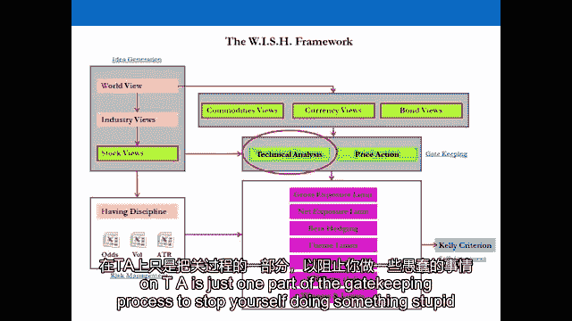
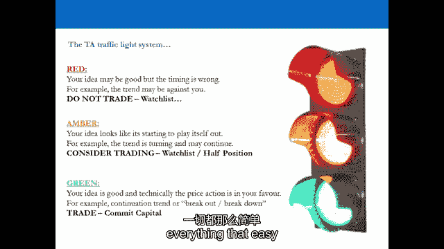
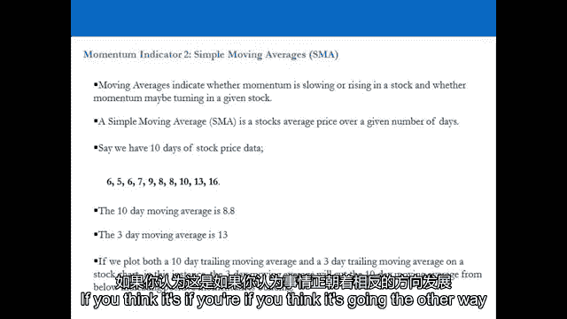
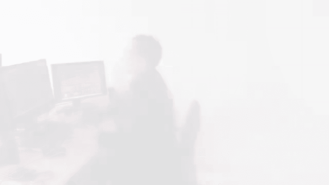

# 【高盛专业交易课】从0教你如何做交易 （中英学习全集） - P20：20-20.第20讲 把关 配置资本 - web3深度学习 - BV1be4y1c7ir

好的，欢迎回来，欢迎收看第二十期视频，我们将从想法产生的过程中继续前进，现在我们要进入第二个圣人，这是极其重要的，称为守门，作为你的想法和你真正的资本之间的障碍，是你设置障碍试图阻止自己做傻事。

就像接受一个想法，然后马上把这个想法表达出来，所以让我们再次快速地运行这个，这个概念，你的想法在这个阶段只是想法，他们不是交易，一个好主意最终可能会变成一个坏品质，一个坏主意通常最终会变成一个坏品质。

所以说，当我们看到这个的时候，让我们想想这个例子，我们认为我们有一个非常非常好的主意，我们以100英镑的价格购买股票或资产，我们决定如果它在90度训练，我们只是要去交易，所以从一百到九十，我们交换。

我们马上就把这个想法提出来了，它几乎在几天内就达到了90，所以我们最终被迫交易，我们基本上停在托盘前，击中我们的止损，但资产从1900增加到400，你刚刚作为拖车在那里做了什么，是你能做的最糟糕的事情。

你有个好主意，你马上穿上，你错过了计时，你被证明是对的，但你真的赔钱了，这就是为什么我们有守门的屏障，来阻止我们，这个时机好的特点，但这也是为了阻止我们进入糟糕的交易。

所以想象一下你买了你买了100英镑的资产，它以90英镑的价格交易，你换了，然后这个资产就变成了零，嗯，那很好，你在上面覆盖了一些风险管理，在九十岁时把自己停在外面，但你本可以为自己节省十个。

通过有一个适当的守门过程，所以你根本没有真正进入这个行业，看着这里的人，产生一个想法，并立即进行交易，这就是为什么我们有一个守门过程，守门过程是，因此，使用技术分析来更好地安排你的交易时间。

并阻止自己进入糟糕的交易和价格行动指标，我们要看的价格行动指标，最重要的是观察列表和您在观察列表中使用的过程，以确保您在及时的情况下进入良好的交易，你尽量不参加比赛。

所以你的投资组合中的任何东西现在都有极高的赚钱概率，到这个阶段，我们所做的是，我们通过世界观产生了一个或多个想法，世界观给了我们对股票市场的看法，商品，货币和汇率，在股票市场中，我们已经深入研究了。

我们已经从指数水平通过行业水平到股票水平，我们从上到下钻，把它结合起来，对PE进行了一些自下而上的分析，现在我们继续看门，这本质上是我们的想法，洁面是正确的想法，在时间上，你可能来早了，你可能会迟到。

可能是原创的，它可能没有独创性，这里的重点是阻止你自己，把好的交易和坏的交易放在一起，现在很多零售培训师认为自己在技术分析方面很有用，很有知识，那很好，你可以在这个过程中投入任何你想投入的技术分析。

但这里的要点是，我们从ta的角度来看两件事，首先它是在守门阶段进来的，它不会为你产生想法，这是零售商总是犯的第一个错误。很容易认为仅仅看图表上的一条线就会让你知道什么时候，事实上。

这条线只是跟着价格走的，最重要的指标是价格本身，其次，这是对技术分析的曲解，或者当你拉起图表时对图表的曲解，所以我们要经历很多很多的场景，在演示文稿中，当你看图表中的某些东西时。

零售培训师经常曲解他们所看到的，这意味着它变得无用，而不是作为一个工具有用，所以让我们去参加演示文稿吧，让我们迈出守门的第一步，看看技术分析，我们在第20期视频的最后再见，届时我们将对技术分析进行总结。

t，好的，所以让我们进入守门的舞台，所以让我们假设现在你有很多很多的想法，你有世界观，你有想法和商品，汇率，你在部门里有想法，库存，你下一步做什么，显然每个人都认为他们的想法很聪明，没有人列出一堆想法。

因为它们都是垃圾，每个人都认为他们的想法很棒，那么你下一步做什么，你必须在你自己和你的资本之间设置一个障碍，你的想法和你的资本，在你的想法和你真正的钱之间设置一个障碍的想法是阻止你自己。

做一些愚蠢的事情，什么是，我们昨天讨论过的做交易员最烦人的事情是什么，当你在写作时，你赔钱了，所以你买了一只100英镑的股票，因为你觉得这是个好主意，你在92岁时被拦下，然后是四百，如果您有进程。

在你的想法和你的资本之间设置了障碍，你不太可能做傻事，所以我们要做的是通过这些过程，以最好的方式计时，所以当东西最终出现在我们的投资组合中时，至少我们已经完成了工作，如果我们错了，我们只是错了。

最好是错的，赔钱比赔钱对，这有道理吗，那么我们该怎么办，我们采用技术分析的筛选过程，t a和价格行动指标，如果所有的行星都对齐了，所有的框都勾选了，那么我们可以认真考虑为这个想法投入资金，对一个想法。

这就是我们现在要讨论的，这部分工艺的技术分析，TA只是守门过程的一部分。

阻止自己做傻事，首先，不要把技术分析和产生想法的工具混为一谈，零售培训师的做法完全相反，所有的过程现在都是相反的，专业教练是怎么做的，专业培训师将从高层开始，然后向下工作，然后拉出图表。

看看图表是否与他们的想法一致，所以你的基础是第一位的，你的世界观，你的行业观点，您的扇区视图，阻止你，你把图表拉出来，不是拉图表，当事情出错时采取立场，然后找出原因，然后证明它是正当的。

然后得到一个世界观，然后把它放在你的养老金里，它变成零，这是做事的相反顺序，所以不要混淆，但正是它开始并产生了新的想法，绝大多数技术分析指标对价格做出反应，他们跟着价格走，价格本身就是重要的指标。

所以它不会给你交易的想法，它所做的是，它给你一个过去发生的事情的图形表示，我可能会给你一些线索，当你可以安排你进入交易的时间，也不是没有用，挺有用的，我们会讨论一些你可以看的东西，时间位置好一点。

试着把它想象成一个交通灯系统，在那里你得到了你的基本观点，在你认为世界会上升的地方，比如说，你认为一个教派会上升，你认为会有一个站，然后你把图表拉出来，图表字面上说不可能，你现在应该买这个。

在热带系统中是红色的，只要把它贴在你的观察名单上，当技术对你有利的时候，那么时机更好，如果你把图表拉出来，从技术上来说，一切都与你的想法一致。

它看起来是一个很好的入口，不要害怕投入一些资本，意思是这是个不错的主意，如果是琥珀，你可能太早了，和红色一样，它可以上观察名单，或者你可以先发，我们所说的半位，起跑位置，当你说，嗯。

在这种情况下我的理想尺寸是买价值一万英镑的，但目前技术车不在这里也不在那里，所以我要买五千英镑，看看会发生什么在交易中设置相当大的止损，给自己一个赚钱的机会。

该头寸对你投资组合其余部分的贡献应该不会伤害你，短期内，第一个TA的大错误，我们已经讨论过从一个镜头中获得一个贸易想法，完全是业余的，缺少你从根本上看好的资产，因为技术面看跌，所以你拉起图表。

技术上看起来股票正在下跌，但你到目前为止所做的一切，说一年后的库存会更高，你被图表做空所说服，然后它穿过屋顶，反之亦然，走得更长，我让你从根本上看跌，你把图表拉出来，看起来技术上一切都很好。

看起来它会永远上升，你所做的所有工作都是看跌的，你被孩子说服买一些，然后它减半，再一次没有比知道真实情况更糟糕的感觉了，是对的，他的母亲，这种情况一次又一次地发生，即使在职业世界里。

这就是你被解雇的原因，当你走进办公室要求增加资本时，因为你在这种情况下做了大量的工作，你从根本上看好它，然后图表把你吸进去变短，然后你最终赔钱，你会因此被解雇的，所以在你放弃机会之前，你会有基本的倾向。

现在这是你必须小心的地方，因为当你从根本上看好某件事时，技术上还不太清楚，或者从根本上看跌某事，技术上还不太清楚，你现在最好不要参加，但当你有基本的倾向时，很难控制那些情绪，阻止自己做傻事。

你必须把它放在观察名单上，等待申请，耐心没有错，你最终可能会买到比原来更高的股票，当你第一次开始看它的时候，但技术现在都在，都对你有利，那笔交易的风险回报现在更好了，所以在技术方面。

你想怎么复杂就怎么复杂，如果你觉得有必要在技术上变得复杂，你比我更了解ta，你们中的一些人可能会，请随意将其添加到此部分，但看看它是什么，这是一张图表，图表跟随价格，所有技术指标都跟着价格走。

价格是最重要的，所以你可以在你想要的地方添加任何数量的技术，任何你想去的地方，那很好，但当你看着你的时候，对待它的本来面目，把它放在它应该在的地方，不要倒退，从技术开始，然后找出什么，一探究竟。

你应该做某事的根本原因，因为孩子在叫你做某事，如此频繁，触须会告诉你什么不该做什么不该做，考虑到你看跌的基本倾向，当你看到这个时，你会缩短库存吗，否，你就等它破了，如果你的基本倾向是看涨，这将是。

这证实了你，你的想法，所以你现在在寻找潮流周围的入口，如果你能得到它，趋势股下跌，如果你的基本倾向是看涨，你买这个吗不，把它贴在观察名单上，等它向上折，等待它打破潮流，所以嗯，你为什么带着一块大师石。

你会变成那样，那么交易的风险回报，可能比以前好多了，但你必须做一个新的基本面分析，你一个月前的所作所为，是啊，是啊，你还是会，你会再看一遍，看看是否有什么变化，它值得在渠道底部购买吗。

那仍然是一个有效的条目吗，谁说在那一点上是海峡的底部，如果我看到这样的频道，现在你在与潮流作斗争，你看你在与潮流作斗争，因为整体趋势是愚蠢的，你最好有抛光剂，如果你有看涨的基本倾向，这是图表。

你停下来等着更好，只要把它贴在观察名单上，你要看什么，在世界上所有机会的背景下，是啊，是啊，全球四万只股票，世界上四万资产，对不起等于四万个机会，实际上是40000的三万九千九的次方。

因为你有很多伸展的Traso，世界上有无限的机会，如果你的基本倾向是看涨，只是时间最好试试，通过等待价格来确认你的想法来更好地计时，你知道我们试图预测什么吗，6-12个月后会发生什么。

当你开始看到它慢慢发生，那时你就会确信这实际上是一个正确的情况，是啊，是啊，那么对股票或资产进行投资呢？如果你有看涨的基本倾向，在这种情况下你该怎么办，半位，所以你会说，这是红绿灯上的琥珀。

谁说这是一个数字，他说是红色的，是红色的，因为它还没有从通道上断开，然而，他说是绿色的，你只要在完整的位置上，这是一个有点主观的范围股票，它介于观察名单和心脏位置之间，嗯，所有告诉我的是。

市场上有人认为六点很便宜，这就是他们买它的原因，在市场上销售，我认为八点很贵，这就是他们卖它的原因，但没有便宜和昂贵这回事，所以你可能会等它爆发后再承诺，或者你可能会承诺一点并不重要，那告诉你的是。

目前市场已经搞砸了，这有道理吗，为什么搞砸了，因为我们知道没有廉价和昂贵这回事，这只股票在12个月内可能会达到40美元，这个范围是完全不相关的，你会在市场上一次又一次地看到这种情况，你有一个左肩。

一个头和一个右肩，价格实际上发生了什么，你在过去看到过看涨的趋势，你在上面被吹了一下，现在价格势头正在放缓，在这一点上，它坏了，所谓的领口，和技术分析，你所期望的是一个向下的移动，这是在附近。

从领口看头部的大小，所以从领口开始的头部，八美元到十一美元，所以一滴三美元，如果你的基本倾向是看涨，你看到了这一点，你在这里，所以你买，观察名单上没有贴纸，如果你的基本倾向是看跌，它打破了领口。

你是做什么的，你，那是明亮的绿光，做大，把止损放在领口以上，头肩倒转怎么样，你的基本倾向是看跌，你看到这个，涨了三美元，如果你的基本倾向是看涨绿色，所以再一次，它告诉你什么不该做，什么该做。

当股票出现双顶双底时，然后你看到一个双顶的突破，你看到了突破，以前的支持，这和我们已经看过的东西完全一样，看涨的基本介词，把它放在监视名单上等着，你可能是对的，十二个月后。

股票在12个月内可能会达到30美元，但目前的时机是猪肉，你想看到在你采取立场之前稳定并向后断裂，带故障的双底怎么样，错误的突破，我们称之为，波兰的基本倾向，你是做什么的，有一个错误的突破。

不是这里也不是那里，这是一个数字，如果低一点，就留在观察名单上，也许你可以买一些周围的支持，看跌的基本倾向，是琥珀色还是红色，让它断开支撑，确保它，你想要你的想法背后的动力，你会看到很多这种看涨的航班。

基本上买家已经进入市场，现在他们正试图得到更便宜的价格，但他们还在那里，然后它打破了向上的通道，这是一个旗帜队形，如果你的基本倾向是看空一面旗帜，突围，基本倾向被打磨在一面旗帜上爆发，三角旗队形怎么样。

钢笔的队形和旗子完全一样，而是会聚成三角形而不是通道，这里的基本倾向是看跌，什么都别做，把它列入观察名单，如果你的基本倾向是看涨，参与进来，看跌旗与看涨旗相对，卖家已经进入市场。

他们试图以更高的价格出售，但最终他们不得不接受更低的价格，如果你的基本倾向是看涨，这里的动量下降了，什么都不做，把它列入观察名单，你的基本倾向是看跌，在上面跳来跳去，看跌的笔也一样，当你看体积的时候。

体积呢，所以又是一样的，结合大量的体积，或高于正常体积，如果你在这种情况下看涨，你看到，这个动作的音量很大，就像在最高的音量中一样，已经一年了，你很乐观，你最好等着，在你真正承诺之前，你需要它来稳定。

所以与其在这里大量购买你，我被拦在这里了，你在这里以同样的价格购买，当你有向上的动力，当音量较低时，如果你看跌怎么办，如果你看跌，这是一个很好的信号，变短，相对强度指数，谁知道这件事。

所以上一次市场会议的平均时间是十四天，上涨收盘价的平均值和14天下跌收盘价的平均值，所以标准的RSI测量会告诉你，如果它超过70的指数水平，已经超买了，如果它低于30的指数水平，已经超卖了。

但这是完全错误的看法，因为股票可以在70甚至80以上，在指数上甚至90，价格就会横盘，然后指数可以下降到50，所以价格可能永远不会下降，这样就不会落水了，相反，它没有超卖。

这是用错误的方式来定义正在发生的事情，用语言，这是错误的看法，当一个RSI的指数水平超过70时会发生什么，八十，九十，而且真的很强壮，只是证实了你的乐观看法，你可能会错过交易。

所以你得把它和其他技术结合起来，它是动量指示器，将它与我们刚才在这里看到的趋势技术结合起来，下定决心，现在是不是进去的好时机，因为短期动量证实了你的观点，股票可能资产可能永远不会下跌。

但是RSI可以让动量变慢，但它一直在上升，有道理，所以我们可以用指数移动平均线，如果你想加上，在那很好，但是我们会看简单的移动平均线a，只是为了得到原理，所以它只是告诉你资产中的动力是否在积累。

或者势头正在放缓，所以如果你看一个典型的情况，你看的是非常短期的，移动平均线，我们得到了过去十天数据的十个收盘价，六，五，六，七，九，八，八，十，十三，十六，这些收盘价的十天移动平均线是八点，八。

这是一个简单的举动，这是一个简单的平均数，三天移动平均线是十三，所以最近三天，十三个，十六，但是如果你画一个十天和三天的移动平均线，六七天会发生什么，三天移动平均线实际上会从下面削减十天移动平均线。

所以当你在移动平均线上得到这些交叉时，如果你的观点是它在往那个方向发展，它就证实了你的观点，但如果你认为它是，如果你是，如果你认为它会走另一条路。

再一次，你会有你的基本倾向，所以你可以退缩或参与，你是守门人，没有其他人，我们在股票市场中使用的移动平均线是什么，有人听说过金十字架吗，有人听说过吗，当50天移动平均线穿过200天移动平均线时。

当你走进市场，你会听到很多人谈论50天和200天，移动平均线，但什么是五十天，什么是二百天呢，你得从字里行间去体会，总是质疑它是什么，五十天代表什么，一整年的四分之一，一个月有多少个交易日，二十。

所以不是四分之一，它是什么五十，你想用什么工作，但是什么是五十天，为什么市场上的人使用50天移动平均线，那么十周代表什么呢，好的，让我们移到两百，两百天代表什么。

这些是技术分析本身在市场上最常用的移动平均线，两百天是什么意思，我不是说4乘以50，二百个，这是经济没有大的结构性变化的天数，就像发生的一切都仍然相关，好的，那么为什么不是一百九十九天，哈哈哈哈哈哈。

你一针见血，因为它是个整数，从字面上看，这并不意味着什么，这是个骗人的问题，哈哈哈哈五十不代表什么，两百不代表什么，那么股票市场中有意义的移动平均线是什么呢，我们在这里交易什么，库存，然后在股票市场。

一个月有多少个交易日，所以这是我们重要的移动平均线之一，一个季度有多少个季度停止报告，季度本地生产总值报告，我们就在股票市场，四分之一，六十天，一个交易年度有多少天，一个交易年度有多少个交易日。

视年份而定，两个，五十二，五十一，两个，五十二，所以二百五十天，那是在股票市场呆了一年，公司每季度报告一次，国内生产总值每年报告一次，五十天不算什么，两百天不算什么，所以你会看到很多人在谈论五十岁。

在两百天里，他们都会交易大约三个小时，然后他们都会消失，那么，如果你有看涨的基本倾向，会发生什么呢？在20天移动平均线上从上面穿过60天移动平均线，如在动量下降中。

这意味着你一个月的移动平均线已经超过了你三个月的移动平均线，这意味着下个季度很有可能，价格动能将为负，如果60天和250天交叉会发生什么，所以你的三个月移动平均线从上面穿过你的一年移动平均线，你很乐观。

这告诉你，在接下来的六到十二个月里，你可能是错的，所以它甚至可能不是一个开始，甚至把它放在观察名单上，但请随意将其列入观察名单，如果你想，这种势头可能需要六个月的时间才能在，在，的，在，资产，当你在做。

当你在市场上遇到技术分析时，坐下来，问一个显而易见的问题，什么是五十天移动平均线，这并不意味着什么，200天移动平均线是多少，有自己的目标，我的目标是什么，我的时间范围是一到三个月，我在股票市场交易。

所以如果我交易股票市场，一个月有二十个交易日，一年60又25又250，我是做季度报告的贸易公司，季度和年度报告的国内生产总值观点，对我来说最重要的移动平均线是什么，只要问一个显而易见的问题。

所以你可以在里面添加任何你想要的TA指示器，但这概述了方法，你的基本倾向，它是否同意，确认，或者否认你在想什么，这会阻止你做傻事，i，e，花一百英镑买东西，在92岁时被拦下，然后是四百。

请随意添加任何内容，不要把ta和为你产生想法的工具混淆，你需要，你需要有你的观点，在你拉出图表之前，一个好的交易将是一个与你的世界观一致的交易，同意你对股票市场的行业观点，和你的股票观点。

技术上开始起作用了，那时所有的框都打勾了，那时所有的行星都对齐了，那是你说作为守门人，我现在很高兴允许资本进入这种情况，你的想法可能是个好主意，但这可能是一个不合时宜的好主意，所以做你自己资本的守门人。

这是第一次筛选测试，好的，欢迎回来，所以我们刚刚看了我们的演示文稿，呃，作为守门过程一部分的技术分析，当我们通过TA的时候，我们显然在看它，作为好想法最重要的时间指标之一，也阻止我们提出坏主意。

所以这个的全部意义是用ta作为一个工具，为我们的想法增加价值，例如把一个想法变成一个好的交易，因为一个好主意不一定是一个好交易，你可能会因为一个好主意而被阻止，因为你时机不对，然后你就会证明是对的。

我们已经讨论过几次了，这里最重要的可能是你的基本倾向，所以当你通过世界观，行业观点，股票视图，你到达了守门过程，你的想法已经准备好变成交易了，你可能会有一个基本的倾向，你可能犯的最严重的错误就是。

然后拉出图表，然后改变主意，忘了它吧，你会有很多想法不断地通过你的想法管道，因为你要有这些过程，您将每周部署这些流程，如果你拉出一张图表，图表与你的基本倾向不一致，这并不意味着这是个坏主意。

这可能是你有过的最伟大的想法之一，你只需要把它贴在观察名单上，你只需要等着更好地计时，所以请确保不要违背你的基本倾向，当你拉起一个镜头，那只是一个非常非常业余的，我不是你的错，因此。

技术分析是守门过程的一部分，总结一下，这是你贴的东西吗，作为你的想法和你真正的资本之间的障碍，在你承诺资金进行交易之前，你想把它作为一种工具，本质上为你潜在的好交易增加价值。

因为此刻你的想法只是一个想法，我们要进行下一个，也就是价格行为，我们将看看你是如何制定你的观察名单的，以及你一周又一周所经历的过程，在生成你的观察名单方面，确保您的观察名单是最新的，在为你提供特征方面。

它得到了正确的服务，因为你的想法在观察名单上，然后你的观察列表在你的技术分析的同时为你提供了特征，好的，让我们进入第二十一段视频。

