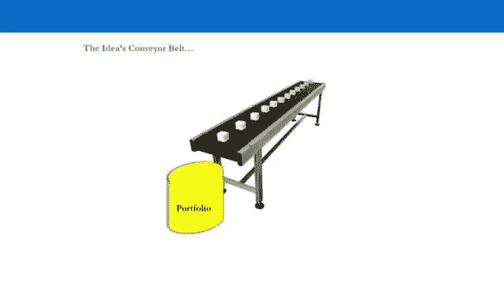
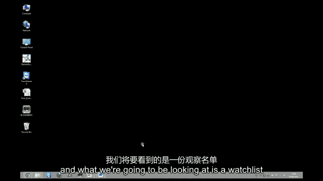
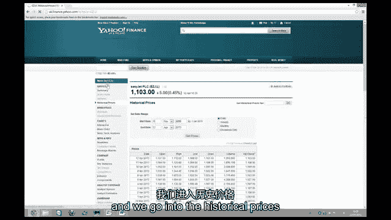
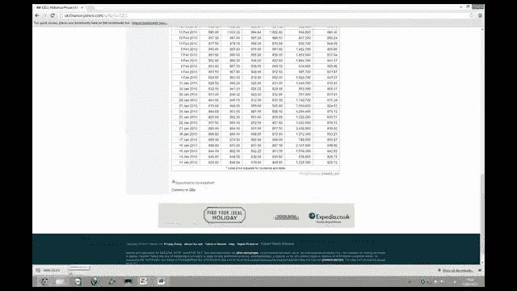
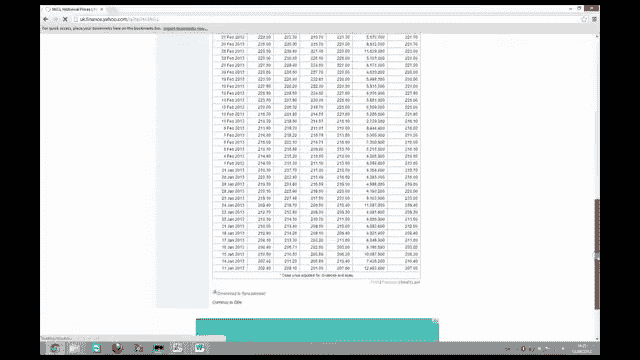
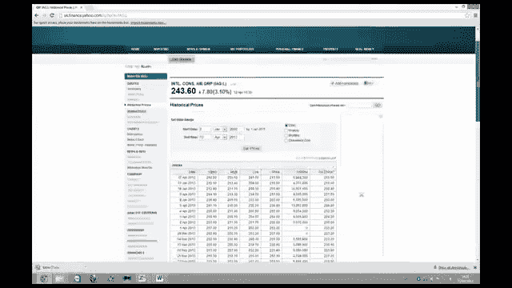
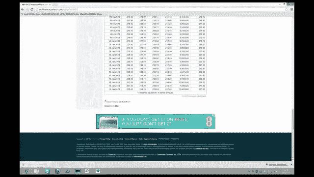

# 【高盛专业交易课】从0教你如何做交易 （中英学习全集） - P21：21-21.第21讲 把关 配置资本 - web3深度学习 - BV1be4y1c7ir

好的，欢迎回来，欢迎收看第二十一价格行动视频，价格行动是我们军械库中的第二件武器，在网关管理过程中，所以在这里我们再次试图净化我们的想法，我们在这个阶段的想法仍然只是想法，当我们监控价格行为时。

我们结合我们的技术分析来做这件事，我们在观察名单上这样做，教你最简单的方法，这是通过这样做向你展示，我们要做的就是直接进入电脑屏幕，我要给你看一个观察名单，上面有许多价差交易，货币和商品交易。

我们将仔细研究这份观察名单，我将向你们展示你们每周所经历的过程，为了，所以让我们到屏幕前，我会在视频的最后看到你，对守门过程进行了全面的概述和总结。

好的，所以欢迎回到电脑屏幕，我们将要看到的，下面是守门过程，以及您所经历的监视过程，价格，行动和技术，我们要看的是一份观察名单。

所以我们要看，主要是这个名为观察列表示例的电子表格，另一个电子表格被称为观察列表传播，观察列表传播基本上只是观察本例的模板，我们还将上网获取公开可用的数据，我们将经历这份观察名单上的过程。

当你开始的时候，你每周都会经历的，所以说，让我们看一下这个电子表格，这里有很多概念你必须学会，首先，当你看着这个观察名单，你会看到很多，你在这里需要明白的是，这是第一件事，当你管理一个投资组合时。

你必须看看你在投资组合中真正想要的总风险敞口，然后你必须创建一个观察名单来服务于总曝光率，所以当我们看这个例子时，此示例在观察列表中有两个四个价差交易，我们也有，四个X和商品，所以能量，金属和食品。

现在，如果我们只是停留在股票，我们这里有二十四个价差交易，现在你在看什么，当你看到这个电子表格时，实际上是选修这门课的人的一个真实例子，他们完成了课程，然后创建了自己的观察名单，八周后。

他们现在正在运行他们的观察名单，并每周更新一次，当你看着它的时候，首先你要注意的是他们有两个四个想法，他们还有六种情况实际上已经从观察名单上删除了，事实上，当您查看所附文本时。

这些价差交易现在实际上已经成为投资组合中的实际头寸，我们从你的总暴露量向后工作是什么意思，好吧，如果例如，你想要一个二十四万美元的投资组合，这个人实际上有，然后为该投资组合服务，你将需要相当多的想法。

所以如果我们从24万，如果这个人自己的持仓限额是两万美元，所以如果他们在做价差交易，长两万块少两万块，然后呢，这只是意味着他们的投资组合中有12个头寸，或六次价差交易。

所以这相当于24万美元的总风险敞口，所以如果我们从那开始倒退，我们将创建一个观察名单，实际上很好地服务于我们的投资组合，那么很明显，我们不能只有六种传播的贸易思想。

因为这一切都发生在你经营你真正的投资组合的时候，向自己承认我们不是超级英雄，我们会做错交易的，所以在任何一个时间点，你会有赢的交易和输的交易，如果你没有一个维护良好的更新和新鲜的投资组合。

因为有很多新的想法出现，许多新想法出现在观察名单上，那么，观察名单不能为你的投资组合提供良好的交易服务，替换亏损的交易，所以你在这里想做的是，当你运行你的观察名单时，有两件事，首先。

你试图阻止自己做出不好的品质，所以你的想法会被列入你的观察名单，你在阻止自己首先做糟糕的交易，也在错误的时间进入潜在的好交易，这是我们稍后要讨论的第一件事，当我们看一个特定的例子时，但其次，你想做的是。

你试图用好的想法和好的品质来宠坏自己，如果我们只看一下数字，我们有二十四个行业或二十四个想法，对不起，在观察名单的这个阶段，六个实际上已经被取下，它们已经成为真正的位置，所以这将留下18个想法。

如果这个交易者有六个价差特征，那么十二个头寸，他们的投资组合中有六种价差交易，这意味着他们的观察清单上有三倍的想法，就像他们在实际投资组合中的实时头寸一样，作为一般的经验法则。

你真正应该做的是你的观察名单应该有一个最低限度，真的是两次半，想法的数量，与真实交易或投资组合中的真实头寸相比，所以你应该用它作为一个比率，所以不管这个，无论你的投资组合有多大，在职位方面。

你的观察名单应该至少有，在你的观察名单上有多少想法，所以这是现在的第一件事，让我们稍微浏览一下电子表格，开始分解事情，当我们看一个活生生的例子时，我们会讨论一些其他的概念，所以说。

我们要看的例子是Easy Jet，i a g，这个想法在这里的观察名单上，易捷航空和IG，他们都在英国的伦敦证券交易所交易，易捷航空是一家低成本航空公司，IAG是一家全球航空公司，主要是欧洲和跨大西洋。

但它是一个全球运营商，IAG基本上是英国航空公司和伊比利亚航空公司，IG国际联合航空集团是这两个品牌的控股公司，对于那两家公司来说，所以说，我们在长易捷航空的观察名单上看到了这个想法，短IAG。

和长长的入口，这个想法的简短条目给出了观察名单上的4-3-8，我们实际上还没有进入这个位置，这是一个参考价格，所以我们指的是时间，这些股票的价格，在我们把他们列入观察名单的时候。

这给了我们一个四三八的参考价差，所以当我们从这里滚动的时候，我们在这里重复了一遍，但我们也有目前的情况，秘书长关于当前局势的报告，这是你每周更新的，所以目前的情况给了易捷航空十个。

31和IG国际联合航空集团在两点五，八点九，当我们在这里滚动时，这给了我们一个传播，三百九十八，这意味着总体上，与最初被列入观察名单时的参考价格相比，这一利差下降了9%，它已经在观察名单上七个星期了。

这是，这是你在这里必须理解的第二个概念，所以概念一，你需要的交易数量，或者你需要在观察列表上为你的投资组合服务的想法的数量，背靠在，所以用大量成为好交易的想法来宠坏自己，所以不要忘记这个概念。

我们现在要讨论的概念实际上是主要原因，为什么我们有一个守门过程，为什么我们要做一个观察名单，那真的是因为，我们要确保我们不做糟糕的交易，用我们的真金白银，但我们也想确保我们不会错过好的特征。

所以我们又回到了这个购买资产的例子，比如说一百美元，或者一百元的股票，然后在这个阶段，这是一个想法，你必须假设的是，世界上每个人都认为，当他们有了交易的想法，这是个绝妙的主意，否则你是不会考虑投资的。

所以只要假设你得到的每一个想法，你知道的，你显然会认为这是个好主意，你知道我们都是凡人，一直以为，他们当然有，但这是典型的散户错误，典型的散户错误是得到一个想法，然后马上开始交易。

专业交易者意识到他们只是人，他们有一个把关程序来确保他们不做任何事情，愚蠢的，所以想象一下如果你买了，你觉得你有这个好主意，你以一百英镑的价格买这只股票，你认为一个好的止损是九十。

然后你就直接在那个阶段以100英镑的价格进行交易，这只是一个想法，所以你把交易定在一百，然后你在90岁时被阻止，然后就到了五百井，那是交易的原罪，你刚刚所做的实际上是你提出了一个想法，在那个阶段。

一个想法只是一个想法，这不是交易，你马上就把这个想法提出来，你被挡在外面，所以你赔钱，但你会证明自己是对的，你本可以做的就是把交易列入观察名单，然后等待这个想法真正开始奏效，然后你投入资本。

你直接投入了资本，但你只是被阻止了，然后你错过了赚400美元的机会，现在想想相反的情况，你有这个想法，你马上穿上一百个，你在90岁时被阻止了，然后它就归零了，嗯，事实证明，这是一个坏主意。

也是一个糟糕的交易，它这个，你刚刚损失了百分之十，你本可以避免失去那10%，通过在观察名单上伸出援手，监控价格行为，从不将资本投入到不起作用的交易中，所以你可以为自己节省10%。

这就是为什么我们有一个守门的过程来阻止自己，错时潜在的好特征，阻止我们陷入糟糕的交易，满了，停止，你必须有这个守门过程，并确保你每周都通过它，足够的想法使他们成为，或者其中很大一部分成为好交易。

别忘了你监视名单上的一切，是一个勾选所有框的想法，就同意你对世界的基本看法而言，行业观与股票观，所以当它被列入观察名单时，它是，这与你的观点基本一致，然后你要做的是净化你的想法。

你试图通过把你的想法列入观察名单来增加它的价值，和监测价格行动和技术，所以你试图为这个想法增加价值，并进入这个想法，当价格行动是好的，技术是好的，现在，这里的这个例子，易捷航空IAG，在七周的时间里。

这已经失去了九个观察名单上的人，想象一下如果这个预告片直接把这个想法放进去，他们会损失9%，这并不是说这笔交易不是一笔好交易，这实际上可能是一个惊人的交易，但我们在这里要做的是。

我们正在努力确保以一个好的价格进入，我们正在努力确保我们只是不进入交易，那很糟糕句号，所以让我们来看看这七个星期的细分，我们可以通过滚动看到的，价格波动很大，第六周几乎所有的表现不佳都来自这里。

当我们从绝对值来看价格行为时，它不工作，这种交易不起作用，所以我们现在不应该在这项贸易上投入资金，当我们看到我们所有其他的交易，我们在看什么，我们在看一堆有效的想法，和一堆不好用的想法。

信封背面的两个规则，如果你喜欢，你知道吗，在承诺资本方面没有规则，这是第三个概念，我们一会儿就来讨论这个问题，信封背面的两种，投资时的经验法则，就是，首先，你不应该把资本投入到失去交易或失去想法上。

这是第一件事，其次，你所寻求的是价格行为的一致性，如此始终如一，正回报，如果我们往下看，我们可以看到，我们这里有一些可能是潜在交易的想法，价格行为是积极的，每周回报看起来相当一致，所以这个。

积极和相当一致的价格行动，所以我们不打算讨论这份观察名单上的每一个想法，你可以在自己的时间里做那件事，因为你在下载区有电子表格，但只要知道这里的概念，所以你明白你不会把资本投入到正在亏损的头寸或想法上。

你不把资本投入到亏损的交易中，或者失去价格波动的想法，你要找的是相反的，你在寻找积极的价格行动，你在寻找回报的一致性，如果你一生都这样做，这不仅会在守门过程中为你节省很多钱，但它也会让你赚很多钱。

因为你是，你在净化和增加你所拥有的每一个想法的价值，这只能是一件好事，所以我们现在要做的，现在我们已经了解了这三个概念，所以我们再过一遍，变成好交易，所以这些交易中的一部分会变成好交易。

为您的投资组合服务的足够想法，这是第一件事，其次，最重要的一个，我们有守门过程的原因，阻止自己错过潜在的好主意，并阻止我们自己进行糟糕的交易，句号周期三，投入资本，再一次，这里没有规则手册。

我们一会儿再来讨论这个问题，没有资本投入的规则手册，信封的背面，经验法则，不要在交易中投入资金，或者在你的观察名单上不起作用的想法，价格波动较大。

你希望相反的积极价格行为具有一致性或在回报上表现出一致性，所以它们是你需要马上习惯的三个概念，现在，我们现在要经历的过程是，我要模拟一个更新你的监视名单的过程，现在你会注意到这里所有这些交易。

所有这些想法实际上都在，如果我们翻到床单的底部，电子表格实际上在它们自己的单独表格中，所以我们在这里要看的是作为一个例子的轻松喷气IG，所以我们要点击这张纸。

我们可以看到易捷国际联合航空集团有自己的表格，在那张表中，我们有数据，股票和价差，我们有每日的数据，如果我们在床单上向下滚动，每天的数据可以追溯到2003年，我们还有图表，我们有一张图表。

可以追溯到传播的开始，所以从数据上看，我们放大了过去两年的图表，我们要经历这个过程，现在你每周都在看你的监视名单，更新和维护它，所以你必须这样做，我要给你看什么，现在你必须对你的每一个价差都这样做。

别太担心，一旦你习惯了这些过程，它成为第二天性，你每周都会在几个小时内这样做，它给你的生活增加了很多价值，并为你作为交易者增加了很多价值，因为它为你节省了很多钱也让你赚了很多钱，所以我们要做的第一件事。

我们要模拟这个想法，现在是周末，你现在正在更新你的观察名单，我们要数五行，我们将在数据区域中插入五行新的行，我们现在要做的是上网，我们会得到易捷航空和IG的数据，计算传播并更新整个观察名单。

所以让我们上网，让我们去雅虎财经。

我们将点击进入那里，我们将看到什么，我们会得到什么，现在我们要得到简单的喷气机数据，所以我们点击易捷航空，我们进入历史价格。

我们这里有每天的数据，我们想要得到的数据实际上来自这两个，三月五日至三月五日，包括三月二十九日，我们想在这里呆五天，所以我们基本上是在模拟今天是星期六，四月，四月，前二十三个，你坐在家里的办公桌前。

在办公室里，无论你喜欢在哪里做这件事，你在更新你的观察名单，所以让我们得到这个数据，我们向下滚动，我们点击下载到电子表格，我们只是打开。

带有数据的电子表格，当我在做这个视频的时候，顺便说一句，今天是4月13日，所以最后一天是4月12日，所以我们要去掉这里的所有数据，因为我们想要的是二十九的二十五日，所以这就是我们想要的数据。

如果是星期六，四月一日，这就是你将要看到的，当您下载此数据时，实际上在英国的这一天，星期五，二十九，那天是银行假日，我们的衣服和前一天一样，没有成交量，但这是一个星期五。

我们要做的第一件事就是复制这些数据，我们要回到，在纸上填上日期，我们再回去，到简单的喷气机数据，并采取调整后的关闭，包括股息，我们回到简易喷气机并插入它现在我们需要IAG数据。

所以我们只是经历同样的过程。

将此下载到电子表格中。

国际联合航空集团。

确保我们在这里有正确的日期，我们有两个，二九分之五，我们把这些价格放在这里，把它们，然后当我们更新我们的传播时，我们只需点击这里的框自动加满，和自动填充，通过拖动，所以你可以在这里看到价差，上周的价差。

所以我们还在这里模拟今天是四月星期六，第一个圣二十三个，一周前的价差收盘价为398，二二，现在价差是四二，六个半，所以价差基本上上升了6%左右，这是个好消息，因为这意味着积极的价格行动。

所以我们将在一分钟内更新这张表，但首先我们要更新图表，所以现在我们点击图表，以及单击选择数据时将看到的内容，我们只从第八行中选择了第八行，所以我们要选择第三排来更新镜头，所以我们点击系列编辑。

你会看到这里有八个，我们只需要把它改成三，对于横轴上的日期，我们再次这样做，我们更新一下，在这里你可以看到利差随着它的积极价格行动而更新，把钥匙扔了，我们在下面的图表上做同样的事情，对呀。

鼠标选择数据编辑将垂直轴和横轴的D更改为D三，我们可以看到它在那里更新，所以现在我们要回到这里的主床单，我们的主要观察名单表的顶部表，我们在那里监控价格行为，我们将更新第八周。

因为这是我们刚刚提取的数据，雅虎财经，我们得到的数据是第八周的，当你看公式条时，你会看到，公式是S七，减去u 7的和到a 7，基本上是七，这个细胞，价差的总回报，减去和，到目前为止的七周。

就像一个快速的侧记，此公式当前在此单元格中，因为我已经把它拖过了，是在第七周的牢房里我现在所做的就是把它拖过去，所以你得自己做，在做下一步之前，一定要把它拖过去，下一步是对第七周的单元格进行硬编码。

以确保第八周成为活细胞，然后你就把上周的表演打出来，所以上周的表现是百分之一，所以我们要在上面打百分之一，这就去掉了公式，现在我们在这个细胞里有了第八周的配方，你现在可以看到牢房里的东西已经亮了。

所以细胞变成了生命，所以现在我们要做的是把我们更新的，价格到当前列，这将更新第八周，所以让我们回到床单上，我们的价格是一元八角和两元五角，三点二，所以我们输入十八十和二五，三点二，顺便说一句。

这些是英镑，这么容易，喷气和IAG，鉴于他们在伦敦证券交易所交易，它们都是以英镑计价的货币，所以这是10英镑80英镑，这是两镑五十三，你会看到价差已经更新到4，2，7，第八周的表现是6。5%。

所以这是正确的，因为我们知道价格从3。98降到了4。26，这里是一个四舍五入到小数点后两位的数字，所以总价差下降了2。5%，所以它仍然不起作用，因为它已经被列入观察名单，但在过去的两周里。

它设法找回了什么，它在第六周损失了很多，所以我们还在关注这个，我们还没有投入资金，可能吧，但我们现在要通过，你如何将资本投入到潜在交易中的想法或过程逻辑，所以我们要以此为例，但视频这一部分的主要概念是。

我们刚刚经历的，是你在更新方面所经历的过程，你的观察名单所以更新过去五天，更新您的顶表并推断价格行动，现在我们将继续讨论你将如何实际投入资本，我们还要把这个牢房改成第八周，所以不要忘记这些过程。

你必须为每一个价差交易这样做，你知道你也必须这么做，例如惠普思科，如果这是你的主意之一，你只是做同样的事情，选择五行插入，获取数据，更新图表，对呀，鼠标，选择数据，经历这些过程，这将拯救你。

让你在一生中赚很多钱，这件事很值得做，一旦你习惯了，每周只花你几个小时，你知道我倾向于在周六早上做几个小时，你所做的是，当您更新这些进程时，你知道你在这里有很多想法。

如果你的观察清单上有足够高质量的想法，所有将要发生的事，你的观察名单将开始为你的投资组合服务，因为好的交易会呈现在你面前，所以好的想法会变成好的交易，它们最终会出现在你的投资组合中，那么你将要看到的。

一周又一周的交易都会呈现在你面前，他们会抬起头，挥挥手说，你好，商人先生，我现在正在工作，我是你的主意之一，我现在正在工作，这通常是开始投入资本的积极迹象，所以要确保你有足够的想法。

确保你记得我们在视频开始时经历的概念，每周都要经历这些过程现在进入资本承诺，这可能有点难让你明白，但不幸的是，你不能去当地的书店，你不能上亚马逊，com，买一本在所有情况下都叫的书。

这就是你如何部署资本，因为它根本不存在，每个零售商都在寻找规则手册，每个专业交易员都知道没有一个，因为就投入资本而言，你必须根据每一笔交易本身的优点来进行，所以让我们以这个简单的喷气IG为例。

看看它的个人优点，我们在这个阶段已经知道，从参考价格来看，当我们把它列入观察名单时，价格行动到目前为止并不积极，当我们看它们的时候，我们在这里或那里，当我们看技术时，我们在。

我们处于我们称之为琥珀的情况，我们在做区间交易，所以这是过去两年，我们能做的就是，只是为了更好地说明这一点，所以让我们把这个，把这个做成红色，把它的厚度增加一点，让我们更好地描述这实际上是在做什么。

所以自从它被列入观察名单以来，我们总体上有负价格行动，我们有波动的价格行动，所以整体价格波动不是很大，我们现在正在研究技术问题，技术上真的给了我们一个琥珀色的情况，不难推断出这些事情。

所以我们在这个范围内，当我们看到整体技术时，你知道他们看起来不错，所以我们这里有一个两年的图表，在过去的两年里，我们有一个非常强劲的积极趋势，现在我们在一个范围内呈横向趋势，总的来说。

我们也有一个非常好的积极趋势，所以这里整体看起来不错，我们在这里要做的是解决，我们应该在适当的时候投入资金，我们这里有很好的支撑水平，呃，我们有这个阻力水平，我们在这里或那里。

我们看起来在一个短期范围内，如果我们看看过去两年，你知道这是个大动作，你知道的，我们真的想成为在顶部购买这种传播的傻瓜吗，你知道我们希望看到积极的价格行动，我们想被证明是正确的，这将继续走高。

所以我首先要做的是，一些合乎逻辑的事情是解决的，这里的阻力水平是多少，所以让我们来看看，这是在二月的某个时候，所以在2013年初，如果我们查看左手边的数据，我们可以看到这个四五，三个。

八十四似乎是价差的交易高点，这就是我们的阻力水平，四，五个，三个，八十四，现在如果你觉得勇敢，你可以在这里做什么，这总是一个选择，所以第一个选择是不参与，那总是一个选择，第二个选择是投入你所有的资本。

在这种情况下，在琥珀色的技术情况下，价格没有积极的作用，可能有点傻，你还不如根本没有观察名单，或者守门过程，如果你把所有的资本都投入到这里，但第三个选择是投入一些资本，所以我想说如果你觉得勇敢。

你实际上可以进去，也许采取我们所说的首发位置，所以你从一些东西开始，所以说，让我们说，比如说，你认为你的全部头寸大小会很长，一万美元的易捷航空短，一万美元的IAG井，在这种情况下，如果你觉得勇敢。

你可以做的是在每一边部署5000美元，所以你把半个位置放在，如果你在这种情况下把一半的头寸放在，它给你选择，它给了你一些选择，所以说，让我们说，比如说，我们知道现在是4点27分。

假设我们在四点二十七分开始营业，嗯，百分之十会停止什么，叶，所以让我们解决这个问题，我们把它乘以九点四二十七倍，九点是三百八十四，所以我们把这条线的颜色换成绿色，我们称之为理论止损。

所以这将是一个384，所以在这里，所以我们有一个很好的支撑水平在四百或四百，我们在384英尺处理论上有止损，但止损是全仓的，所以满仓10%的止损，是相当明智的。

它的宽度足以让我们有机会在一到三个月内赚钱，你显然会去用ATR仔细检查一下，我们会在后面的视频里做，呃，但这是一个完整的位置，如果你有一个首发位置会发生什么，嗯，它给你的第一个选择是你可以扩大你的止损。

如果你把半个位置，你可以双倍止损，所以我们可以拿四个，27乘以8就会有20%的止损，这里的止损是3-4-1，这给了你选择，你知道你也可以，比如说，如果这个掉下悬崖，在未来，达到了这个水平。

你知道你实际上可以，如果它开始再次显示积极的价格行动，去购买另外的50%，最后得到你的止损，比你们的平均价格低百分之十，所以说，这给了我们第一选择，它给我们的第二个选择是。

如果它继续表现出积极的价格行动，并通过这个阻力等级四，五十三，八十四，然后我们就可以去买另一半的头寸，如果它显示并同意我们的观点，并突破到新的高度，你最终会得到低于阻力位的平均价格，这可能成为新的支持。

你的止损将远低于你的平均价格，如果你在上面放10%的止损，所以首发位置确实给了你选择，但正如我所说，那是你知道的，如果你觉得勇敢，这里也没有承诺资本的规则，不幸的是你不能，2。你买不到那本书。

亚马逊网站，如何在所有交易情况下投入资金，没有规则，你只要用你的常识，你知道吗，作为一个交易者，你能做的最好的事情，就是尽可能多地产生高质量的想法，然后有一个把关过程，试着给想法计时。

如此好的想法最终成为好的交易，尽量不要把资本投入到糟糕的交易中，所以你有守门的过程，试着通过尽可能多的好主意来宠坏自己，变成好的特质，然后用常识部署资本，五十三，我想是在七号，是的，四个，五十三。

八十四，如果它通过那里交易，你知道这可能是一种情况，你开始增加一个获胜的DRA，我们将进一步研究这个概念，当我们进入视频系列的心理学部分时，所以不要太担心这个，你应该学会赢和输交易的概念。

或者输赢的想法，当我们进入这个交易心理学阶段时，所以当你看到这些模块后，你可能想再看一遍这个视频，这样你就能更好地欣赏和理解我们在这里看到的东西，但是这个四五三的阻力水平，让我们介绍一下，输赢特征。

所以如果我们在一个，假设我们在这里放了一个完整的位置，让我们假设我们把一个完整的位置，我们感到超级勇敢和超级愚蠢，我们把一个完整的位置，我们现在训练的地方，我们的止损是384英镑。

那就是四二十七乘以点九，这给了我们10%的止损，所以四二七，9点给384作为止损，但当我们以1比3的比例制定目标时，我们不把我们的目标称为软目标，这一切都会在后面的视频中变得清晰，所以不用担心。

所以我们提供了更多的好处而不是坏处，在每一笔交易中，我们必须把我们的目标视为软目标，有了这些软目标，我们需要，我们需要看到他们是现实的目标，所以我们有所谓的硬止损，无论发生什么，如果价差真的在那里交易。

我们交换，如果它到达我们的目标，我们经营交易，我们甚至可以增加位置，然后我们把止损提高到平均价格以上，所以我们还能赚钱，所以在这种情况下，如果我们从4 2 7减去384，1。这个特点我们得四十三分。

所以我们的止损是损失43分，如果我们把它乘以三，我们得到了129分，那是我们的软目标，一百二十九分加上四分，二十七，现在是五百五十六，当我们回顾这种传播的整个历史时，它从来没有以556英镑的价格交易过。

所以有一个目标现实吗，五五六的软目标，想想这个，现实吗，嗯，我猜你们大多数人可能会说不，但事实上，可以说，这既是现实的，也是不现实的，所以说，你会说这是不现实的，因为它从来没有在那里交易过。

但如果你看看传播的历史，想象一下如果你在这个时期在这里，你说我不会把这个摊开，因为如果我把这个价差放在一比三的比例上，有10%的止损，我的目标必须在这个水平上大约70分，所以这意味着，三百四十人的目标。

三百五十分，它从来没有在那里交易过，它从来没有交易超过三个，如果我们在这个时间点观察它，这将是最高的，你就不会穿上它，你就会错过所有这些好处，看到这就是重点，这可以说是现实的，也是不切实际的。

因为这种传播可能会无限，理论上，它可能会永远上升，如果你在看价差交易时，你知道的，这就是为什么我们有股票，我们想在分数的顶部做长，和我们想在分数底部做空的股票，因为这意味着在所有情况下。

我们都在看长图表，我们正在考虑把价差拉长，这就是我们用的短语，我们要做长线，理论上它可以无限，所以在这种情况下，你知道的，当你看例子时，你看到的是一个从未在某个目标交易过的价差，嗯，可以说。

这既现实又不切实际，因为你在这里看到的是一个蔓延，那是，你知道吗，处于或接近历史高点，在过去的两年里，它刚刚进入了新的历史高度，至少在过去的18个月里，价格的作用是非常积极的，它可能会继续下去。

当我们总体上考虑这个例子时，我们有短期负价格行动，在总体和不一致方面，就中长期价格走势而言，我们的总体情况是积极的，在承诺资本方面在技术方面，对不起，在技术方面，我们在琥珀上，我们目前正在研究大脑训练。

当我们把所有这些加起来，只是用常识，在承诺资本方面，我们可能要勇敢地把首发位置放在，我们总是可以，如果我们看到，如果我们看到这种价差消失，我们得到更低的价格，4。如果我们能以更低的价格买进，那就太好了。

然后我们有积极的价格行动，但如果它刚刚爆发也同样奇妙，在这个价格下，我们在某个地方有一个完整的头寸，它打破了阻力，因为这可能是表演的来源，易捷航空将在其个人图表上爆发，并开始高交易量交易。

这将证实技术信号，将确认非常积极的价格行动和技术，所以我们只是想用一些常识来部署我们的资本，而且会为我们节省很多钱，在我们的生活中赚很多钱，所以再一次，这里没有规则手册，所以别担心。

你只需要从资本部署方面的经验中学习，并通过过程和清单，我们不会把每一个例子都讲一遍，你只需要学会如何运用常识来做到这一点，你知道的，如果你去，如果你看到负价格行动，总体，每周价格波动，负技术，它没有。

它开始不符合你的基本倾向，你投资显然是个傻瓜，你知道这个，这就是为什么我们有所有这些过程，这就是专业交易员所做的，不幸的是，散户没有这些流程，这是他们一直赔钱的主要原因之一。

所以让我们快速回顾一下观察名单，你的观察名单上有足够的想法来服务于你的投资组合，我们之所以有一个守门过程，确保你理解这些概念，我们每周经历的过程，一定要仔细检查，推断价格行为，技术上好吗，丑陋。

或者无处可去，也不打这里也不打那里，红红的，绿色或琥珀色，如果一切都符合你的基本倾向，那你就会投入资本，别害怕，如果完全不匹配，不要投入资本，那就太傻了，如果它不在这里也不在那里，如果你觉得勇敢。

你可以投入一些资本，如果你觉得勇敢，但不要抱有幻想，你只需要知道你在做什么，你可以整体部署资本，在资本部署方面，没有规则手册，你只要用你的常识，好的，所以差不多就结束了，总结呃，观察列表示例。

您可以在下载部分获得这些工作表，确保你每周都经历这些过程，就像我说的，一旦你这样做了几个星期，它成为第二天性，所以只要习惯就行了，别太担心，就目前而言，你会学到更多关于我们所研究的一些概念。

在这个视频的后续视频中，所以你可能想回来再看一遍这个视频，好的，那么我们继续我们下期视频再见，好的，欢迎回来，所以让我们总结一下价格行动和技术分析，让我们总结一下整个守门过程以及我们如何看待它。

我们现在应该如何使用它，我们意识到技术分析是我们可以使用的一个工具，为了给我们已经产生的想法增加价值，所以我们最终可以产生一个潜在的好交易，避免坏交易，这也正是我们使用价格行动的方式。

当我们每周在观察名单上监控我们的价格行动时，您还可以从WatchList电子表格中看到，我们还在同一个电子表格中包括我们所有的扩展图和我们的技术分析，而且很简单，你知道每周你可以在周六早上做这个。

你只要把过去五天的股票数据，在商品方面，货币，在价差中，计算出价差，只需监控价格行为，和，很明显，你不想把资本投入到不起作用的火车上，然后呃，错过了表现良好的特征，每周一致的回报和价格行动。

结合了非常好的技术，所以你知道，最终在你的观察清单上的显然是你认为是好主意的想法，所以你想把资金投入到那些技术上很好的想法上，价格走势良好，表现出一致性，所以不要害怕，你把资本投入到这些特质上。

当这些交易真正成为真正的交易时，它们最终会出现在你的投资组合中，它们现在是真实的头寸，当您运行投资组合时，让我们倒回去，试着弄清楚我们真正应该在这里做什么，在我们的观察名单上，当你管理投资组合时，你是。

比如说，呃，经营，说有十万美元的曝光率，如果你的仓位限制是百分之十，我们很快就会讲到风险管理，你就会明白我们所说的位置限制是什么意思，如果你在投资组合中给自己的限制，一个头寸不超过你投资组合的10%。

所以你的风险敞口是10万你的持仓限制是1万，如果是这样的话，当你完全投入时，你会有十个职位，当我们把这个倒回去的时候，很明显，你不能只有十个想法，你必须有，至少是你观察清单上想法数量的两倍半。

就像你在投资组合中的真实头寸一样，这就是我们的意思，当我们看到思想的传送带时，所以每周你不仅仅是在监控自己的投资组合，你的生活作品集，你也在产生更多的想法来取代想法，在你的观察名单上不起作用的。

所以你有你的投资组合，你有你的观察名单，你有更多的想法产生在上面，你的观察名单上有有效的想法，也有无效的想法，在你的投资组合中，你有有效的交易，也有无效的交易，对你的投资组合起作用的交易。

你把它们放在你的投资组合里，不起作用的交易，你可能会在某个时候用观察名单上的想法来取代它们，现在正成为好交易，和你在观察名单上的想法的交易，这些想法随着时间的推移而不起作用，你将被新鲜和新的想法所取代。

更新你的观察名单，并保持您的观察列表最新，这些是你每周都要经历的过程，所以在任何一个时间点，你都会有你的生活作品集，你会有你的观察清单来思考你必须做的两件事，每周一次，R是更新您的观察列表。

其中包括更新所有统计数据，还能在你的观察清单上刷新新的想法，摆脱陈旧的想法，但也要用现在正成为好特征的想法来取代投资组合中亏损的交易，显示出良好的技术分析，好价格行动，每周都有良好的稳定回报。

这些是你必须做的事情，所以你，如果你有十个位置，你不能有十个想法，你的监视名单上至少有25个，所以只要把它作为一个经验法则，经验法则是无论你在投资组合中拥有多少特质或职位，把它收回来。

并拥有至少两倍于你观察清单上的想法，你每周都在监控，那么接下来会发生什么，你有一个生活作品集，当你有一个生活作品集，你需要风险管理，你需要有纪律，而是要有纪律，你需要有正确的心理。

让我们进入下一个视频视频号22，我们现在要去看看训练心理学，你会发现这有点有趣，你会发现这很令人惊讶，但要认真对待因为这些信息非常非常严肃非常直白，但如果你得不到它们，你可能会损失很多钱。

在你的投资组合中有真正的头寸之前，你需要有正确的心理，让我们来看第22段视频。