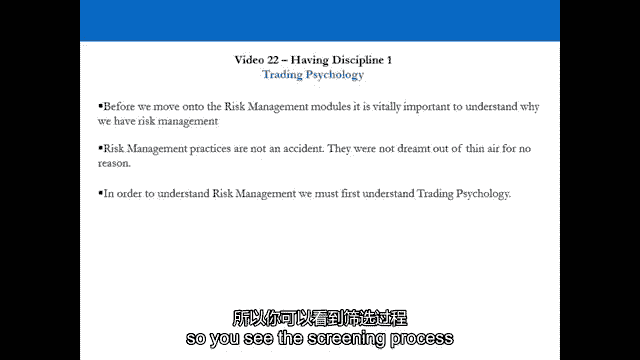
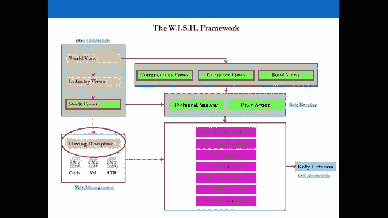
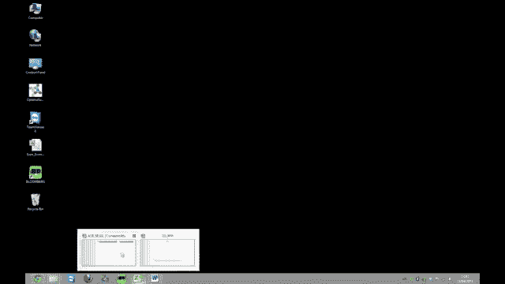

# 【高盛专业交易课】从0教你如何做交易 （中英学习全集） - P22：22-22.第22讲 有纪律 风险管理 - web3深度学习 - BV1be4y1c7ir

好的。

欢迎回来，欢迎收看第二视频，我们现在要进入这个过程的下一阶段，我们正转向风险管理，特别是这里，我们将迈出第一步，建立一个有效的风险管理程序，那就是为你的训练心理学奠定基础，所以在这个阶段我们所做的是。

我们实际上是在假设我们已经经历了整个想法产生的过程，我们已经通过了守门过程，所以我们有一个位置或数量的位置，我们实际上想要采取，它们将成为我们投资组合中的实时头寸，我们如何有效地管理风险，嗯。

一切都要从交易心理学说起，所以我们要做的，首先是去演讲，接受心理训练，以确保你已经奠定了坚实的基础，我们要走到电脑屏幕前，当我们走到电脑屏幕前，我们将寻找，但是前面的一个例子，呃。

就使用这个例子作为一个真实的位置而言，并决定如何管理周围的风险，然后我们要通过ATR，所以我们前面看到的平均真实范围的波动性指标，在视频系列中，我们要用那个看。

我们如何使用ATR来决定我们的有效股票损失和目标，在我们所做的所有交易中，一旦我们在电脑上完成了，你的训练心理学会有很好的基础，以及如何设置，在你即将进入的每一笔交易中有效地止损和设定目标。

然后我们会回来做一个总结，并通过我们刚才讨论的训练心理学方面的所有内容，用于设置的ATR波动性指标，止损和目标，然后我们进入23号视频，所以让我们到舞台上去，在演示文稿上，之后我在电脑上见你。

好的，我们现在要找点乐子了，交易心理学。

所以我们看到了筛选过程，我们有主意了，我们有监视名单，我们有助教流程，我们通过它来确保我们不做任何事情，愚蠢和时间位置，还有就是，但结合起来，在我们采取立场之前，我们必须确定。

我们的头脑是否真的是正确的，成为商人，在我们的余生中交易，风险管理过程不是凭空想出来的，他们在那里是有原因的，现在我们将展示，现在我来告诉你为什么我们要玩一个游戏。

我们要交换弹珠，我要和你交换弹珠，所以是我和房间里的其他人对抗，在这种情况下，你会得到报酬，所以我付你钱，好的，嗯，我们有两箱，方框a和方框b，A盒子里有三个蓝色弹珠，一个红色大理石。

盒子B有一个绿色的大理石，如果你把你的手放在盒子A里，你拿出一个蓝色的大理石，我付你一千英镑，如果你把你的手放在盒子A里，拉一个红色的大理石，我什么都不给你，如果你把你的手放在B盒子里。

只有一个绿色的大理石，它支付七百，你会拉它，我得付给你七百，谁说盒子A举起手来，所以大约是五五开，这是此刻的一个镜头，一枪毙命，请安静场景二，让我们玩这个游戏，完成它场景二相同的情况，但现在你付钱给我。

如果你把你的手放在盒子A里，顺便说一句，你还在把你的手放在盒子里，如果你把你的手放在盒子A里，你拿一个蓝色的大理石，你付我一千英镑，如果你把你的手放在盒子A里，拉一个红色的，你什么都不付我。

如果你把手放在B框里，你得付我七百，谁说盒子A，谁说B框，好吧，那完全是歪曲事实，因为在五五开之前，现在是九十，对不起，十分九十，是啊，是啊，所以房间里有很多人说两个人都是同一个盒子。

所以房间里的心理是混乱的，你在冒险，是啊，是啊，在B框里你不是，你肯定，所以方框A被称为风险不确定性，在这个场景中，当你得到报酬的时候，你想做什么，冒险或获得一定的回报，嗯，是五五开，那是，是啊，是啊。

所以如果我说你有百分之五十的正确和百分之五十的错误，那么是哪个盒子呢，你得到了，当你得到报酬时，你想冒险吗，是不是像，呃，有四种可能的方法，所以说，薪水是多少？我们马上就会讨论这个，A箱的支出是多少。

所以大家，A箱的付款是750，是啊，是啊，这基本上就是，好的，冷静点，冷静点，冷静点，一切都会解释清楚的，你不必谈论这件事，好吧，箱子速度是肯定的，当你得到人类的报酬时，这是人类的天性。

就像他们得到报酬时的确定性，在通常的情况下，得到报酬时房间的分割，通常有七八成的人会去买盒子，因为当人们得到报酬时，他们倾向于确定性，在这种情况下，当你付钱的时候，当你付钱的时候，你想冒险吗。

还是你在支付时想要确定性，通常百分之七八十的房间会在这里，人类，人类就是这么做的，交易员想在这里，交易员想知道他们的缺点，所以A箱的支出是750，B箱的支出是七百，放大那些数字，更明显的是。

人们会感到困惑，因为这些数字稍微接近，是啊，是啊，当你在人类心理学的训练中看到这一点时，这是什么意思，嗯，这意味着当我们看我们的投资组合时，假设我们有十个位置，我们有五个赢家和五个输家，一个人。

会增加所有输家的头寸规模并从所有赢家身上获利，最有可能发生的事情是什么，失败者将继续失败，交易者会反其道而行之，交易者会割下他们的输家，把钱加到他们的赢家身上，那么你在训练中要做什么呢？

你必须与人类相反，说起来很容易，当你坐在舞台上的演讲厅里，但当涉及到真金白银时，让我们来看看一个典型的高盛面试问题，我们以前经常问这个问题，我们会做一个，你以一百英镑的价格买一只股票，你坐在交易台上。

现在是星期一晚上十点，所以十点市场既不在这里也不在那里，你以100美元的价格买了一只股票，训练场另一边的一名销售人员，因为你要在下午四点十分整理你所有的头寸，离收盘还有二十五分钟。

你看到你以100英镑买的股票了吗，在，以93英镑的价格交易，你有三个选择，市场二十分钟后关门，你不能坐以待毙，谁说买更多，谁说保持，”她说。好的，谁说等一下，谁说，买更多，你还在比赛中。

其他人都离开了游戏，你回家，你有一个很好的意大利肉酱面，看一点电视，祝你有一个愉快的，和你妈妈在电话里聊得很愉快，你去睡觉，第二天你走进办公室，开市，你在早上八点二十分跑完所有的位置。

你昨天100英镑买的股票现在是82英镑，三个选择，买更多，出售或持有，谁还在比赛中，谁说买更多，谁说卖好，谁还在比赛中，你每天都在为世界各地的大客户做大量的价格，你看看钟，现在是四点十分。

是时候再检查一遍你所有的位置了，你昨天以100英镑买的股票是93英镑，今天早上已经八十二岁了，当你在检查你的位置时，昨天卖给你的那个售货员，对着你尖叫，说，这家公司刚刚宣布他们将达不到预期的收益。

下一年，股票直接涨到五十一，买更多，持有或卖出谁说买更多，所以市场关闭，你一个也没卖掉，看电影，在电话里和你的兄弟姐妹聊天，去睡觉，第二天醒来，去上班，过去两年的所有分析师，他们对这只股票有强烈的买入。

现在发布他们所有的笔记说，出售，我降低了他们所有的估计，我把价格目标定在十便士的公司身上，谁还在比赛中，哈哈哈哈，游戏里有更多的人，顺便说一句，你现在在撒谎，然后市场以20欧元开盘其他股票。

持有或出售谁还在游戏中，不喜欢哈哈哈，你是做什么的，你买更多吗，好的，谁卖得好，所以我们还剩下几个人，现在老板叫你去相反的地方，我想请你解释一下这三天你都干了些什么。

那些在93点切入的人从B盒子里拉了出来，那些持有，或者一路买了更多，当他们失败的时候，他们在寻找风险，当他们向市场付款时，你在那里的场景是付出，这是非常重要的一课，问题是交易者为什么要阻止它。

当他们倒下的时候，他们别无选择，客户把它卖给了他们，他们不得不和客户做生意，这只是一个假设的情况，但这是一个非常现实的场景，实际上是因为它每天都在发生，每时每刻都在发生，只是一个例子，忘记。

忘了一个交易员在船只银行，想象一下你以100美元的零售价买了这只股票，交易员，经纪账户，好的，冷静点，这是一种非常简单的看待它的方式，但这正是人类的心理，如果你在这种情况下买入或持有，也没什么好难过的。

你不做某事，如果你不做任何事情来确保你的缺点在这里得到保护，你只是个普通人，因为人类就是这么做的，当他们向市场支付时，他们在负面情况下寻求更多的风险，在那种情况下，你必须是非人类，做一些直截了当的事情。

相反的情况呢，你花一百美元买一只股票，你在当天晚些时候检查你的位置，它变成了120，你是做什么的，买更多，持有或出售，然后是一百四十，买更多，持有或出售，然后是两百，如果你买得更多，持有还是卖出哈哈。

你看我们要去哪里，如果你以120英镑的价格获利呢？想象一下，如果你在第二种情况下以120英镑的价格获利，我们只是在看你投资组合中的赢家和输家，所以是的，你产生了想法，是的，你要经过筛选过程。

试着给你的想法计时，但猜猜你的投资组合里会有什么失败者，你会有赢家，你对他们的所作所为决定了你是一个交易者，所以如果你这样做，很多很多次，你根本坚持不了多久，你需要做相反的事情。

这就是为什么我们有止损和我们所说的软目标，我们有软目标，这样我们就不会限制交易的上行空间，我们很难止损，所以我们限制了交易的下行，我们所说的软目标是什么意思，您下了一个订单，当您调用它时自动启动。

所以你在上面放一个目标，你说，如果我要以100美元的价格买这个，我可能认为一个艰难的明智的艰难的止损是92，和软目标，一百二十五，你手里拿的是什么，你在停站时基本上有一比三的比例，对目标的损失，是啊。

是啊，如果股价涨到125，你交易吗，嗯，你不需要，因为你现在在赚钱，你的地位很高，当你以一比三的比例赚钱时，你的地位很高，你现在是贸易界的王子了，你可以做任何你想做的事，除了交易，什么是明智的，嗯。

你赢了二十五美元，如果你现在把你的硬止损移到17，如果你被挡在外面，你还能赚17美元，它是，它是，它现在变成了自由贸易，如果你把你的头寸扩大一倍，到125怎么样，你们的平均价格是一百一十二。

你必须停止117英镑的损失，你还是会赚钱的，你是贸易界的王者，寻求风险框a，接下来会发生什么，最有可能的情况是什么，你要么被阻止赚钱，但最有可能的情况是，它将继续，那可能是140，一个，六十。

在这种情况下如果你卖出25美元的利润，你在你的投资组合中实际上在做什么，你在杀死胜利者，为失败者打开毁灭你的大门，你是人，那是个多头头寸怎么样？对这种情况有一个轻微的警告，做空怎么样？嗯。

为什么你对空头头寸有硬止损，空头头寸的理论上的缺点是什么，准确地说，所以你最好，如果你要有困难的止损，确保超硬短裤是，如果你让某物跑到无限，你不只是人类，你真是个愚蠢的人，你在短线上最多能赚多少钱。

理论上是的，因为如果价格从现在的100%降到零，所以如果你做空100美元的东西，它就变成了50美元，好吧，它仍然可以下降100%，更多，它还是可以归零的，所以你做同样的事情，你滚动你的停止，损失减少。

别害怕做这件事，我经历过我们首次公开募股的情况，在科技繁荣时期每股20英镑的股票，他们在六个月内增加了两倍，达到每股60英镑，一年后，我们做空了他们5便士，因为5便士，它仍然有百分之百的缺点。

公司发生了什么，它破产了，我们在这笔交易中赚了百分之九十九，别害怕做这些事，非常客观地看待他们，不是作为一个人，我们在做什么，比率性状，我们用比率TRA做什么，想象一下，如果你把股票A除以股票B。

所以寨子是在五点，你要走很远，股票B在250，你做空了，所以比例是二，你如何对待与止损和目标的A比率，你沿着2的比例，你想让它上升，你想让它去无限，你的多头股票A和空头股票B，那么，如果比率是2。

10%的止损是多少呢？第二点，所以你的止损是一个，1比3目标的比率为8点，你的是什么，按1比3的比例，你的软目标是什么，你的目标是第六点，止损的三倍，所以你加一分六，两点六，当比例达到你的目标时。

你该怎么办，多买股票，多留一点存货，B展开止损，因为现在是自由贸易，完全一样，当你看一种货币时，一种货币与价差交易完全相同，除非你买一种货币，你得再卖一个，所以买股票A就像买英镑对美元。

当你买股票A对股票B时，这只是比例，按原样对待，所以止损和目标有些主观，但如果你看大帽，s和p，500只大盘股或欧元股，六百，所有大盘股指数，你将得出什么结论，你的止损会在7%到12%之间。

关于大盘股情况，你会乘以三，你会问自己是我的目标，现实的，好的，不要不要忘记，方框a和方框b，因为交易有一件事，如果你做一段时间，当你变得很擅长交易时，你就会意识到。

这种心理和风险管理将渗透并延伸到你生活的各个领域，盒子a盒子b，让我们经历一些情况。

你已经在一家公司工作两年了，你刚刚去参加了你的第二次推介会，你的起薪是四万英镑，你第一年后的第一年，你和你的老板开会了，你老板说今年不能给你奖金了，你明年要升职了，但是我们今年不能给你升职。

这就是现在的历史，你要去参加第二次会议，你走进办公室，你的基本工资还是四万英镑，你的目标是在第二年年底升职，你老板说对不起，我们不能给你加薪，而且没有奖金，事情真的很艰难，拳击手或拳击手。

你能到别的地方去吗？好的，让我们来看看一些场景，让我们来看看一些场景，否，它确实适用于你生活的每一个领域，相信我，你在那种情况下，你的决定是对的，我要走了，你不需要马上走出门，你已经决定要离开了。

所以你去，非常感谢，老板和你回到你的办公桌，你下一步做什么，你会得到一份合同，给你40英镑的保证基本工资，还有60英镑的保证奖金，你下一步做什么，那是那是那是盒子，好的，你在寻求风险，是啊，是啊。

你下一步做什么，我来告诉你为什么你要冒险，因为你的好处是无限的，你的缺点是四十，你的优势是无限的，谁说如果你去找你的竞争对手要800万美元，他不会答应的，所以你对一个竞争对手，你你，你去找你的竞争对手。

你得到一份合同，基础四十，保证奖金六十，你下一步做什么，你，回去给你老板看合同，你的老板说我会给你同样的，你下一步做什么，回到竞争对手那里说，我老板是，我真的很高兴，我在哪里，2。

他把工资从基本工资的40元提高到基本工资的70元，你下一步做什么，你就一直从A盒子里拉，直到其中一个屈服，就是这样，你处于有利地位，你在那种情况下没有输，因为四十还没有减少到三十或二十。

你从四四方方拉出来，好的，下一个情况，我们把它翻过来一点，所以我们用一个女性的例子，继续用我的例子，所以这个故事的主题是女性，你和一个男人约会，你去吃晚饭，那家伙真的真的很好看，这么好看。

你整个星期都在告诉你的朋友，你迫不及待地想和他们一起去吃饭，你觉得你真的很幸运，你去吃晚饭，谈话很糟糕，所有男人的价值观都和你完全相反，拳击手或B盒子一个时间表另一个日期，B盒子再也不给他打电话了。

谁说盒子A，哦你好哈哈哈，谁说B框，好的，所以你去另一个约会，晚饭后你也会有同样的印象，我也是，你的盒子是什么，b，如果第二天之后什么也没发生也没关系，你希望发生什么，第二个拷问是谈话中的南方。

如果你在那之后不想要别的，所以是在我们有的第二秒钟之后，这并不意味着你必须，正是这样，你从博斯皮德拉，如果你拉，如果你选择从B框拉，你基本上是非人类，所以这是人们一直在做的，你会一直看到的。

所以人们去了，继续留下来，会去约会，保持关系，他们实际上讨厌的，他们经历了十年的痛苦，生儿育女离婚，然后发生了什么他们离婚后从B盒子里拿出来哈哈哈，反过来想想，是啊，是啊，从相反的角度来看。

所以你去吃晚饭，一切都很神奇，所有的行星都对齐了，1。你还要再去吃晚饭吗？你当然知道，你从A盒子里拿出来，你又来了太棒了，从箱子里拉出来继续继续继续，是啊，是啊，你可能会在某个时候被拦住，哈哈哈哈。

但如果平均真，如果，如果，如果ATR很窄，那这家伙就不会反复无常了，现在这就是这，这不是开玩笑，这其实挺严重的，当你开始把这个应用到你生活的多个领域时，你在交易方面变得成功了。

当你开始这样想的时候你的生活就开始变得非常非常顺利，在财政上和质量上，因为你开始意识到好处和坏处真正意味着什么，风险在你生活的各个领域到底意味着什么，我们所经历的职业情况，第一个例子。

是研究所里一个家伙的真实故事，但他在约克郡的一家工程公司工作年薪4万英镑，在那里四年了，他希望升职，他从来没有得到过，所以我叫他从A箱拉出来，你认为有什么竞争对手可以从你那里得到一个价格吗，所以是的。

去看看他们，从他们那里得到一个价格，那是你接下来四周的目标，召开会议，从那家公司的董事那里得到一个价格，所以他去做了，他们给了他六万英镑的升职，他做了什么，打电话给我，问我他下一步做什么。

回到你的老板那里，给他看合同，对你的老板说，你知道老板，我真的不想离开，因为我真的很喜欢这家公司，这是我开始的地方，但我有这个合同，我不知道该怎么办，你能帮我吗，他的老板做了什么。

他接下来做什么给我打电话，所以把它写进合同里，不要相信一个字，他在说，把它写进合同里，好的，得到它，合同给我打电话，我下一步做什么，把它带回给竞争对手，回去和竞争对手的主管开会，把合同放在他面前。

说我现在真的束手无策，没有多少，我能做到，你在那里已经四年了，到这个时候，这时那家伙真的很喜欢他，给了他一百块，还升职了，他回到老板那里，我说，不要，你知道的，别再去签合同了。

因为它现在变成了一个有点荒谬的spiv情况，你的老板真的会生你的气，所以回去找你的老板，我只是说他们口头上给了我一百块，有他的电话号码，如果你想打电话给他，我对这种情况很开放，但我宁愿呆在这里，因为。

呃，如果我动了，它扰乱了很多，老板做了什么，他工作的地方，是的，从现在开始六个月，经过所有必要的训练才能到达那里，一百二十五，我就像，好的，让我们不要厚脸皮，就拿着吧，哈哈哈，他和他去年的交易账户。

让我们猜猜他杀死了它，为什么？因为他有很强的想法，他经历了他的筛选过程，他一开始在训练账户里有一万五千英镑，六个月后是什么，三十岁六个月后是多少，六十，这基本上就是去年发生的事情。

他从4万英镑的基本工资到一份没有前途的工作，给公司内部的一名经理一百二十五，我把一万五千英镑存入一个培训帐户，变成六十英镑，我真的改变了他的生活，但这不是火箭科学，你只需要非人类，如果你花了你的一生。

只要接受四万英镑就意味着这是你在世界上的位置，你应该接受它，你其实是，你只是在自己身上获利，你在出卖自己，因为当你出生的时候，你在零，现在你23岁了，你是，你有四万，你在推销自己。

在你职业生涯的任何时候都是四四方方的，这就是训练能为你做的，所以即使你一开始只有少量的钱，如果你应用这些原则，你一直在赚钱，你经历了所有的过程，你让这些过程渗透到韩国的关系中，你生活的各个领域。

你会看到你的生活会越来越好，因为在这个世界上取得成功的人，是在正确的时间从A箱拉出来的人，并在正确的时间从B箱中拔出，世界上相处不好的人是人类，不幸的是，我们就到此为止，休息十五分钟，好的。

所以你看到的是交易心理学的概述，在我们总结你在演示中看到的东西之前，在那里，我们将把你们在演讲中学到的关于训练心理学的知识，并将其应用于现实世界，所以我们要看一个真实的例子，我们要看的例子是长期高盛。

所以你在早期视频中看到的行业内贸易成分，我们首先要看的是如何使用ATR，平均真实范围，你在以前的视频中也看到了，最初设定了我们在交易中的止损，然后你就可以设定1比3的比例。

你的软目标和交易过程中发生的事情，所以在不同的情况下会发生什么，所以当你设定初始止损和软目标时，你要做的是你要上台，在那里你经历了想法的产生，你已经通过了门禁，现在你准备把一个位置。

你现在所做的是分析股票的波动性，设定你的初始止损和你的软目标，所以你基本上是在冒险管理这种情况，考虑回报而不是风险，然后计算你在资本部署方面要做什么，也要制定策略，在未来的某些情况下你要做什么。

当这笔交易要么是赢的交易，要么是输的交易，我们在这一点上这样做的原因，这对于制定在某些情况下该做什么的战略是非常重要的，所以我们要做的第一件事是设置风险回报，然后我们要看看风险回报之后的风险。

我们将研究这些场景以及它们是如何发展的，以及我们在某些情况下的所作所为，当我们进行交易时，所以让我们转到电脑屏幕上，我会告诉你怎么做，我们视频最后见，获取训练心理学的完整总结，好的，欢迎回到电脑屏幕。

我们现在要做的是，我们要看一个价差交易的例子，我们要看看努力设置，止损和软，以及你实际上是如何进行这个过程的，你是怎么做的，以及你是怎么做的，真的，呃，我们利用了我们在以前的视频中使用的相同的过程。

使用ATR，平均真实范围，我们要做的是，我们将使用几个电子表格，我们将使用ATR表，我们在之前的视频中看到的，我们还将关注高盛，所以这些都可以在相应视频旁边的下载部分获得。

我想当你考虑设置你的硬止损和目标时。

最重要的是要强调的是，你的止损真的应该足够宽，让自己赚钱，在你选择的时间范围内，但也不够宽，因为你纪律不好，所以这方面又没有规则手册，你得看看时间范围，你打算从事的交易，看看这段时间的历史波动。

并计算出什么是明智的止损，一个明智的止损实际上是一个，在您选择的时间段内，合理的止损是指在这段时间内，止损范围足够大，使你有机会赚钱，也是现实的止损，这样你就不会纪律涣散，通过设置一个可笑的宽止损。

然后当我们设定软目标时，我们把它们按1比3的比例设置，所以很快，止损只是一种情况，如果你以100英镑的价格购买股票或资产，您在您的经纪平台上输入退出交易，它允许你在资产达到一定价格时自动进行交易。

假设你的止损是90，这是10%的止损，你以100英镑的价格购买资产，它下跌10%的交易在90，你自动交易，在我们的例子中，这里有一个软目标，你会发现当人们设定目标时，他们通常会设定我们所说的硬性目标。

当他们到达那个目标时，他们会交易出去，但那是不正确的，你应该在你获胜的位置上运行，所以你赚更多的钱，所以作为一个交易者，我们所做的是，当我们设定止损时，我们实际上是在保证我们的缺点，因此。

我们从B框中提取，当我们设定软目标时，我们不能保证我们的优势，事实上，我们在做相反的事情，我们从A箱拉出来，我们要么在运行我们的位置，要么在赢得位置，或者冒更多的风险，我们可能会增加那个位置。

我们首先要看的是，我们如何使用ATR计算波动性，所以我们可以在一个真实的例子上设定一个明智的止损，所以我们看的例子是高盛，价差交易在三零，四，我们这里有传播的整个历史，如果你还记得之前的视频。

当我们研究我们是如何产生这个想法的时候，以及我们是如何解决的，那个呃，这种传播的历史，它的行为，我们在这一节，高盛对高盛，JP摩根，价差与ISSM指数的关系，ISM制造业指数，所以只要打开这两张床单。

打开高盛，打开ATR，现在，我在这里做了什么，雅虎，金融，所以所有公开的信息，你正在看的这个电子表格，以下是您可用的原始atr电子表格，呃，它看S和P 500，公式会完全一样，当我们计算每月波动率时。

所以我们使用的是完全相同的过程，这只是一个聪明工作的问题，快速地这样做，以了解波动性是什么，或者已经超过了我们预期的时间范围，所以现在让我们直接进入这张纸，我这里得到的是，采取兴趣部门。

金融部门的成分价差贸易，特别是在银行业，我们基本上有一个看涨的交易，但我们在对冲市场风险和行业风险，当你走得很远时会发生什么，一只股票或一只股票在一个部门和空头，一个行业中的另一支股票。

你到底发生了什么，你抵消了波动性，所以，或者你打算，因为你在对冲市场风险和行业风险，所以说，隐含的情况是你在对冲市场波动，和部门波动，你在隔离这种交易中独特的或股票的波动性，所以当我们考虑止损的原则时。

足够宽，让我们赚钱，但不够宽，我们纪律不好，我们需要记住这一点，因为我们实际上是想对冲市场风险和行业风险，所以我们在对冲市场风险和行业波动，所以市场波动和部门波动，你在正常的一天会看到什么。

当没有消息的时候，如果你在高盛做空，JP摩根，你可能会看到高盛被解雇，百分之二，所以发生的一切都是，就价格变动而言，他们几乎相互抵消，以及它们在正常一天的波动性，这就是你通常会看到的。

当市场涨跌1%或不到1%时，大部分时间都没有消息，向同一个方向移动，所以你抵消了这里的波动性，所以我在这里所做的就是，我去了雅虎财经，你可以看到，我有每月的数据，我已经收集了九个月的数据。

所以一二三四五六七八九，但你会明白为什么我们一秒钟就花了十个月，因为我们得到的ATR的结果是九个月，所以我们取了十个月的数据，我花了十个月的原因，是因为我想得到对波动性的赞赏，每月。

所以如果我们要看一个一二，这笔交易的三个月期限，我希望在这里得到赞赏，超过四分之三的样子，所以九个月，你所要做的就是计算出每月的ATR，但是这段时间的月平均R，所以你所要做的，从字面上看。

就是进入ATR的电子表格，我们这里有十排十排，所以我们要坐十排，我们要把这个剪切粘贴到这里，这告诉我们从高到低，所以它给了我们真实的范围，所以c2减去d2，所以这个，这个单元格减去这个单元格。

它每月给我们从高到低，我们将对高盛重复同样的过程，所以我们也要把这个贴在这里，叫那个高减低，所以我们现在得到了真实的范围，我们想要得到的是以百分比表示的平均真实范围，因为我们想知道以百分比计算。

什么是明智的止损，在一到三个月的时间里，地平线，我们要做的是，我们将再次剪切和粘贴从这个列在这里，现在这个列，如果你还记得在最初的ATR电子表格中，S和P 500，计算出滚动一天的平均真实范围。

所以在滚动的基础上，一天的平均真实范围，所以基本上两天的平均百分比，但是滚动，如果我们真的剪切和粘贴，将相同的公式复制粘贴到这里，它不会给我们一天的时间，会给我们一个月的时间，所以平均两个月。

显然没有最后或最后，呃，这个单元格中的值，因为它是，它需要参考上个月，所以我们把它去掉，我们这里得到的是，这就是为什么我们取十个月的数据，我们这里有九个值，我们要重复同样的过程，我们称之为ATR百分比。

把它处理掉，我们现在要解决的是，九个月内每月从高到低百分比范围的平均值，所以我们把这个加起来，做一个自动求和，我们将除以9，这给了我们9分，百分之四，对高盛重复同样的过程，11点1分，百分之四。

所以我们这里有什么，在十个月的基础上滚动的每月平均真实范围，然后计算出百分比的平均值，平均真实范围，百分比平均真实范围，所以这给了我们一个欣赏的机会，我们可能应该看什么，为了设定我们的止损。

所以如果我们把止损定在，比如说百分之十，这给了我们一个有纪律的止损，也给了我们一个很好的赚钱机会，而且是的，我们也可能在一个月内被拒之门外。但那很好，你知道我们在这里是受纪律约束的。

所以我们要有足够的纪律，我们设定一个现实的止损，不是疯狂的止损，想象一下如果我们设定20%的止损，只是这不现实，你知道你可能会倒下，一个月内13%，然后下降13%，下个月再增加7%，然后你就会被阻止。

所以你不能忘记，也是，你在这里有你的守门过程，所以你知道，在这个阶段，我们实际上已经通过了这个想法，创意生成与把关过程，现在我们实际上想把这个交易，所以我们做了这个假设，所以在这个阶段。

我们可能会有积极的价格行动，积极技术，它符合我们的基本观点，所以说，一个合理的止损可能是10%，所以在两者之间的某个地方，我们看到它在三点交易，哦四，所以让我们把这些放在牢房里，所以电流是三点，哦四。

还有很多损失，会是三点零，四乘四点九，止损的价值，止损的点数是3。4，减去这个，所以是三点，所以它是，我们可以称之为30分，这意味着我们的目标是，所以按一比三的比例，以点为单位的目标。

所以我们可以把这个，我们把这个放在这里，这将是当前的价格，加，三次，我会停下来，所以我们的目标点，那将是3。9，我们的目标现实吗，它以前在那里交易过吗，是呀，它已经，它已经在那里很多次了。

在传播的历史上多次，如果我们只看图表，我们可以看到，事实上，如果我们看长期趋势线，长期趋势线几乎在我们的目标上，我们现在的软目标，我们必须在这里得到的几件事，所以让我们，呃，复制这个，让我们改变。

更改这里的日期，这样我们就可以放大了，所以我们必须在这里为你找到几个正确的概念，所以我们现在看到的是一个放大的情况，所以我们把这个复制下来，这样我们就不用一直上下滚动了，我们要开始插入一些线条。

所以我们可以理解这种特性的风险回报，我不是说去做这笔交易，这只是一个例子，说明你实际上是如何经历的，计算止损的过程，具体目标，然后你将如何部署资本和交易这种情况，所以我们要把它格式化成一条红线。

所以它很突出，好的，所以我们的入口三点零四点，我们假设按现在的价格买进，我们的止损到七十三，让我们把这个换成绿色，大概在这里，在长期趋势线附近，让我们把这个换成紫色，这是我们目前正在进行的风险回报游戏。

那么会发生什么，如果它在这里交易，我们停在，我们在交易同时做多和做空的股票，别搞砸了，很多人出于某种原因认为当你的交易价差时，你穿上一长一短，当你被分散的时候，到你的止损，你把自己停在其中一个位置上。

你跑传播的另一边，这太傻了，你已经进入了一个你的想法是相对交易的行业，所以两只股票都可以上涨，两只股票都可能下跌，只要A股表现好就没关系，库存b，那是你下的赌注，如果它的表现不超过。

它在两个头寸上的表现都低于你的交易，当你被拦下的时候就会发生这种事，所以当你交易的时候，你把它们同时穿上，当你交易出去的时候，你同时把两个都脱掉，这就把我们带到了下一个情况。

也就是单只股票头寸的自动止损，我想让你想象一下你有一个股票职位，和一个长长的，股票B空头的头寸，你在股票A上设置10%的自动止损，股票B的10%自动止损，显然股票A的止损较低，股票B的止损更高。

你在这里做的是在单个头寸上设置自动止损，你可以在每个经纪平台上很容易地做到这一点，但你不能在每个经纪平台上做的是止损，关于价差的实际比率，所以现在想象一下在那种情况下，股票市场下跌了百分之十。

股票A和股票B一起下跌，百分之十，它们都下降了10%，发生了什么好事，你现在缺货了，你身材矮小，股票B和你的裸空头股票下跌了10%，然后接下来会发生什么，让我们说，比如说，之后的下一个情况是市场。

然后反弹，上涨10%，发生了什么，股票B上涨了10%，你被股票B拦住了，所以你最终在股票A上损失了10%，在股票B上损失了10%，但在整个过程中，什么都没变，股票A和股票B都回到了以前的价格。

这就是当你在单个头寸上设置止损时会发生的事情，你不想做的是做多一只股票，做空另一只股票，并在个别头寸上设置止损，不幸的是，如果你的经纪平台不允许你在比率上设定止损，你什么也做不了。

你要做的就是更新你的电子表格，更新你的观察名单，确保每周你都知道利差在哪里交易，每天进入你的交易账户一两次，看看价差在哪里交易，如果价差击中你的止损，你把他们两个都换掉，你得自己手动做，你。

如果你不能在比率交易中自动做到这一点，唯一的选择是你可以，你只能在单个股票头寸上设置止损，不要设置单一股票头寸止损，就在上面，自己手动做，不用担心，别担心止损交易，我们已经通过了交易心理学的东西。

你现在应该完全意识到如果你在交易中输了，你应该从B框拉出来，你不需要担心，因为你的投资组合里会有赢家，好交易者和坏交易者的区别是什么，不仅仅是有一个投资过程，就像愿望框架。

但也要对你的失败者做正确的事情，我对你的获胜者做了正确的事情，如果你做相反的事情，你是人，那你只会赔钱，因为这意味着你从A框中抽身，寻求更多的风险，当交易对你不利时，当交易对你有利时。

你从B盒子里拿出来，在你的目标上交易，我们不会那样做的，那只是意味着你是人，人类的对立面是商人，我们知道如何理财，我们不担心交易出了问题的交易，所以你得手动操作，当你做价差交易时，但是别担心。

从长远来看，它会让你赚钱，好的，回到这个例子，现在来看看我们为什么要努力，止损和软目标，假设你把这个位置放在三点上，零四，你摆出一个，两万美元这么长，一万美元的高盛股票，假设这真的到达了你的目标。

三个月之内，这是一个奇妙的情况，你下一步要做的是你绝对不要交易，你接下来要做的很简单，你要么跑这个位置，或者如果你觉得勇敢，你有房间或资金可用，您的交易帐户中可用的保证金。

然后你可以寻求增加这个获胜的交易，你可以为这笔获胜的交易增加更多的资本，那么我们如何做好这件事，假设你有一个两万美元的头寸，这实际上达到了你的目标，我们现在可以从我们的目标，也就是三九二。

三百九十的百分之十，还是什么，呃，百分之十的止损在395，所以这是我们的上衣，这是我们的目标，三百九十五，如果它到达它，我们只想弄清楚在这种情况下我们要做什么，所以新止损，将是这个的90%，也就是3。

5我们把止损降到3。5，所以我们现在要在这里的某个地方，我们的原价在这里，我们是否希望我们的入门价格是，如果我们要增加这笔交易，我们想要的是我们的入门价格，所以在这种情况下你所要做的就是。

确保当你添加到这里的位置时，在滚动的基础上，你的平均价格刚好低于你的止损，这意味着什么现在这意味着你基本上有了一个自由贸易，我所说的自由贸易是什么意思，嗯，你的止损高于你的新平均价格。

所以你的投资组合中有一个获胜的交易，那现在变成了自由的情况，你的止损高于你的平均价格，这意味着即使你被阻止了，你会赚钱的，所以你可以坐在那里看，最有可能发生的情况是什么，嗯，当你有一个获胜的交易时。

最有可能的情况，它会继续获胜，如果你增加了那个位置，你的止损远远高于你的新平均价格，那么这只是意味着你有一个自由的情况，你可以坐下来放松，这笔交易现在是否对你不利无关紧要，因为你还是会赚钱的。

我们想确保我们不做的是相反的，它在一个软目标上交易，然后看着它再上升一百个点，就是说你，这意味着你从B盒子里拿出来，当你看到一个获胜者，这是我们不想做的，现在回到止损，我们这里有10%的止损。

你经常会发现的，这里没有规则手册，所以你又知道了，又不是说，你不能去书店或亚马逊，com和buy称为历史上所有交易情况的止损和目标，在你未来的生活中，它就不存在了，你只要做明智的事就行了。

所以你的止损必须足够大，给自己一个赚钱的机会，在你所看到的时间范围内，但足够现实，你没有纪律不良，你的目标在一比三的比例上变得不现实，你会在大盘股和大多数中盘股的情况下发现什么。

你在美国的大盘股中会发现什么，和欧洲，和五百英尺，参见DAX CAC 40，所有主要指数，你会发现的大写情况，你的止损将被计算在7%到12%之间，当你在一个不错的时间范围内看一个月的简历时。

所以我们假设九到十二个月，你可能会发现你的止损将被计算在内，现在在7%到12%之间，这对你的软目标意味着什么，这意味着你的软目标在一到三，会在21%到36%之间，所以止损7到12，然后按1比3的比例。

21%至36%的软目标，所以你必须通过这些练习，只要确保你了解每月的波动，和每月波动的参数，在你将要采取的位置上，而且也是，你必须了解价差中的风险回报，你正在进行的交易。

以及在不同的情况下如何发挥风险回报，在我们开始之前，我们确实在这里做了一个假设，你知道你在这个过程中，现在你已经到了真正决定接受这种特质的阶段，在这个视频的任何时候都没有说过，以高盛为例。

你知道这只是一个例子，所以看看它是什么，我们只是在看这个价差交易，好的，如果我们现在真的想穿上这个，我们如何设置止损，软目标和，我们如何在所有情况下实际发挥风险回报，所以首先我们要冒险。

也就是交易对你不利的时候，我们通过手动止损来冒险，精神上的止损，因为我们不能在大多数经纪平台上设置止损比例，我们通过交易多头和空头来冒险，当比率以预定义的心理止损交易时，我们手动交易两者。

我们怎么玩奖励，我们增加了一个胜利的位置，或者至少我们运行它，那么我们是如何冒险的，回报是当我们在冒险的时候，我们从B盒子里抽出来，当我们玩奖励的时候，我们从A盒子里拉出来，这些都是你必须习惯的概念。

我们在投资组合中损失的那些头寸，我们对摆脱它们感到很好，别担心，为什么，因为你每周都在更新你的观察名单，你现在在你的观察名单上的任何一个时间点，一堆现在已经成为好特质的想法，当你除掉失败者的时候。

你在用新的交易取代他们，所以已经成为好交易的想法从你的观察列表中删除，这个过程一遍又一遍地继续，就像传送带，所以你在用这些想法宠坏自己，你对减仓并不感到难过，因为你用新的想法取代了它们。

在任何一个时间点，你的投资组合中都会有赢家，这是你如何对待你的失败者，以及你如何对待你的赢家，这让你作为一个交易者与众不同，所以希望你已经掌握了这些概念，在一到三个月的时间范围内，设置ATR相当简单。

我们只是按月查看近代史，制定ATR，您可以将这些公式剪切并粘贴到电子表格中，显然知道它们是如何计算出来的，了解公式以及它是如何计算出来的，但你知道，作为捷径，你可以把它们剪下来粘贴进去然后算出来。

然后当你真正进行价差交易时，设定合理的风险回报方案，并确切地知道在某些情况下你要做什么，那真是，你知道的，从一开始就有一个计划，你将如何对待这个职位，当你将来遇到某些情况时，良好的风险管理，好的。

所以让我们继续前进，我希望你已经设法理解了概念，我们下期视频再见，了解更多的风险管理，好的，欢迎回来，那么让我们通过这个总结一下交易心理学，很明显我们在舞台上看到的，你们中的很多人以前不会看到。

我们确实用了一些例子，一些现实生活中的例子有点有趣，但他们又一次很有趣，所以它的基础和基本原则会在你的脑海中停留，这里最重要的是你的交易账户在许多情况下，就你的心理和表现而言，你的财务表现将反映你的。

你往往会发现，那些运用成功的财务策略的人，不管是在他们的交易账户上，还是在他们的业务或职业生涯中的财务上，遵循这个训练心理学，不管他们知不知道，所以当他们赢的时候，他们寻求更多的风险，当他们输的时候。

他们实际上看到的风险更小，或者他们保证他们的缺点，这就是为什么当你试图让你的训练心理正确时，在你的一生中，纠正这种心理是非常重要的，所以我鼓励你在这里做的是尝试三个月，你这样做没有坏处，所以你不妨去做。

在你生活中的所有场景中尝试三个月，不仅仅是在财务上，但在你的个人生活中也是如此，试着掌握正确的交易心理，并将其运用到你生活的各个领域，很明显，不能保证你会取得成功的结果。

但你应该试试三个月后就知道了然后回顾一下，如果你对结果满意，那你现在就应该继续这个策略，就直接将其应用于培训而言，我们看了一些东西，我们研究了一比三的比例策略，这很重要，因为你在交易方面所做的任何事情。

上行应该远远大于下行或潜在的上行，我们使用硬止损和软目标，我们是按1比3的比例做的，为什么我们使用软目标，那是因为我们不想从B盒子里拿出来，当我们赢的时候。

我们实际上希望继续被投资或在获胜的交易中持有头寸，所以我们不从B箱拉，我们实际上要做的是绝对地运行头寸并滚动止损，我们甚至可以从A盒子里拉出来，并以谨慎的方式在该职位上增加更多。

以确保我们的新止损当我们滚动，我们的止损比我们的平均价格高得多，但我们实际上从A框中提取了，我们在寻求更多的风险，这是一个向你展示如何设定止损的例子，和广告集的软目标。

我们还使用ATR来计算合理的止损和合理的软目标，在一至三个月的时间范围内，现在我们在传播率上做了这个，你应该如何看待价差率，只是把它们看成一只股票，从技术上来说，把它们当作一只股票来对待。

在风险管理方面将它们视为单一股票，所以我们设定了股票损失和目标，以了解不同的价差交易，如果我们在一只股票中持有一个头寸，我们会做得更多，或任何单一资产，简而言之，这就是训练心理学。

我们现在要做的是进入下一个视频，也有纪律，我们将开始更多地研究具体的风险管理策略，我们可以部署到我们的交易账户中，所以我们对我们的整体投资组合有纪律，把交易心理学固定下来，这不是一蹴而就的。

需要一段时间，至少几个月，一旦你意识到了它，你至少要意识到它，你在现实生活中这样做，在您的培训帐户中，你为什么这么做就变得很明显了，所以请以任何可能的方式部署这个，让我们看23号视频。

