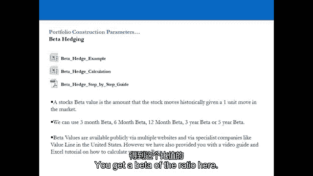
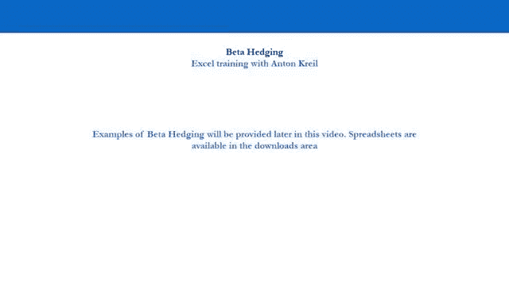
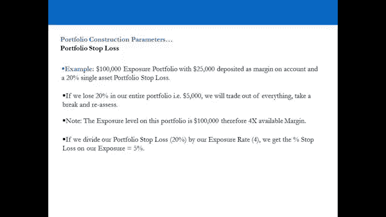
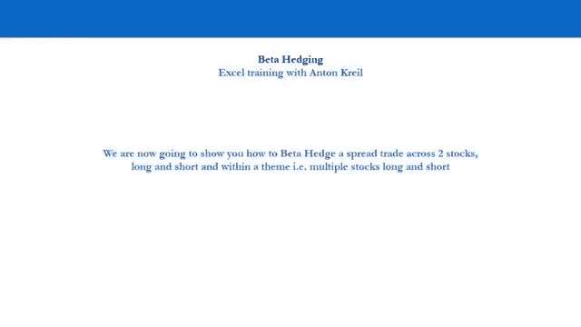
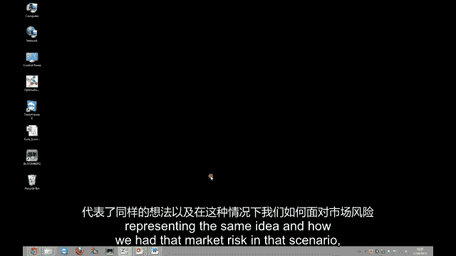
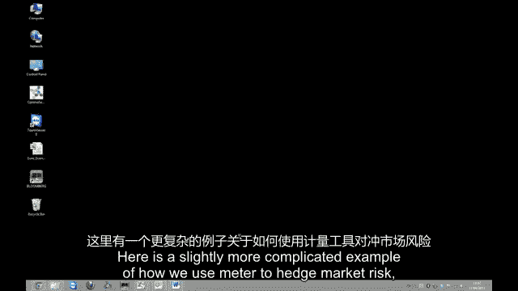
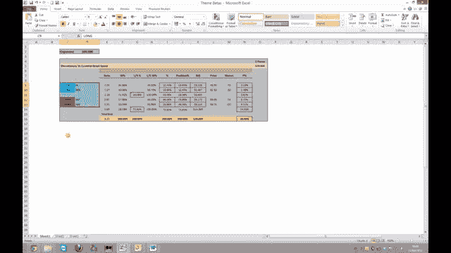
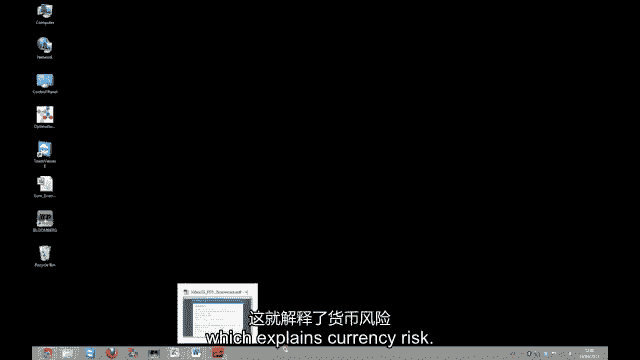
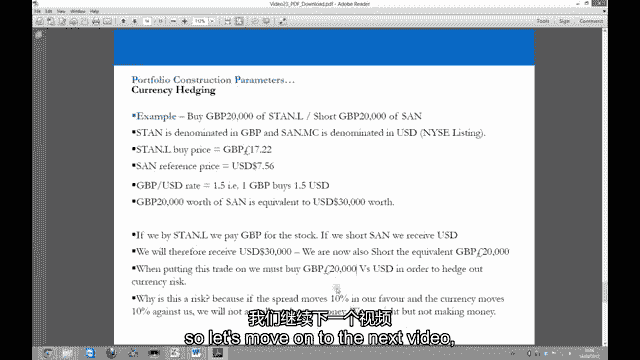

# 【高盛专业交易课】从0教你如何做交易 （中英学习全集） - P23：23-23.第23讲 有纪律 风险管理 - web3深度学习 - BV1be4y1c7ir

好的，所以欢迎回来，欢迎收看第二十三期视频，我们风险管理阶段的第二个视频，所以现在我们又在舞台上了，我们假设我们实际上有位置，我们现在经营一个投资组合，我们要向你介绍什么。

这里有很多投资组合的风险管理参数，专业对冲基金经理使用的，我们将停止所有基本的，但我们也将在这个视频中向你展示测试版的介绍，我们如何对冲市场风险，在视频系列的早期，你会记得，我们在考虑贸易想法。

当我们对行业和库存水平产生想法时，我们在看不同的，呃，性状类型，就像在跨部门特征中一样，跨部门组成性状与拦截器组成性状，现在所有这些都是传播特征，本质上你所拥有的，当你采取蔓延，交易是一种情况。

你自然地对冲了一定程度的风险，当我们看贝塔的时候，我们要看的是什么，呃，我们要看看如何，我们实际上机械地经历了对冲市场风险的过程，因此，我们将讨论投资组合的基本风险管理参数，所有对冲基金。

对冲基金经理使用，我们也要稍微先进一点，我们将介绍测试版，以及它如何运作的机制，如果你对冲市场风险，对于单个价差交易或多个价差率，让我们去看演示文稿吧，演讲结束后，电脑上就会出现，我会教你怎么做。

我们正在使用测试版，并使用这些公开可用的统计数据，然后在24号视频中克里斯会在电脑上向你展示，你怎么计算，打自己，让我们去看演示文稿吧，演讲结束后在电脑上见，并在视频的最后总结风险管理参数，好的。

让我们继续，呃，风险管理，进一步的纪律，所以我们知道该怎么对待失败者，我们知道如何对待获胜者，我们结婚不是为了失去我们，赢家的好处可能是任何东西，所以结婚可能是一个考虑因素，但当这些位置在你的。

在你的投资组合中，你可以有额外的风险管理参数来保护你对失败者的不利影响，我们可以通过其中的几个，再说一遍，没有硬性规定，你在布莱克威尔斯买不到书，史密斯说这是完美的投资组合。

以下是你应该应用的所有风险管理情况，那本书叫做，这就是你应该如何交易，有成千上万的人应该告诉你一些事情，所以没有规则，但这些是你将应用于标准投资组合的风险管理情况，第一次总接触限值。

所以在零售经纪账户中，如果我们建立一个典型的帐户，我们可能会在账户上存两万五千美元，那两万五千美元是多少，这叫保证金，它是抵押的，它被经纪人用来支付你的损失。

那么当你的投资组合增加了一千美元的时候会发生什么，二十五变成二十六，经纪人把一千美元存入你的交易账户，当你在投资组合中损失一千美元的那一天会发生什么，你得付给经纪人一千美元，变成二十四。

这就是利润的目的，但是经纪人当你把两万五千美元存入大额账户时，股票会让你，大约是你所放的曝光率的十倍，你存入账户的钱，所以你可以一直到25万美元的曝光率，那么我们能做什么呢，我们就可以。

我们可以以我们想要的速度暴露自己，所以说，我们试着找到最佳位置，在我们被允许接受的最大暴露量之间，我们在账户里的号码，所以这个电子表格的曝光率，基本上就是，这是一个非常简单的电子表格。

只是如果你杠杆十倍，如果你损失了10%，你出局了，如果你杠杆五倍，如果你输了百分之二十，你出局了，所以它只是通过所有的暴露率从一个到一百多个，如果你有一百倍的曝光率，那么在四个X内呢。

你的户头上有多少钱？真的，这就是你能做的，所以你在你的账户上存了两万五千美元，s，价值250万美元，如果你损失了百分之一会发生什么，你出局了，每个零售交易员几乎立即获得最大敞口，太疯狂了。

所以总暴露限值，与接触情况相比的数字例子和百分比例子，如果你用两万五千美元开户，你想给自己一个赚钱的机会，你永远不想接到追加保证金通知，在你的生命中，如果你收到保证金。

叫它只是意味着你是一个完全不负责任的交易者，这意味着你不知道如何负责任地部署资本，所以你阻止自己成为人类，所以你在大盘股上设定一个1到10的风险敞口率，FX永远不会，有没有超过七八次曝光。

你可以在不被阻止或收到追加保证金通知的情况下赚钱，什么是追加保证金通知，这只是意味着你的整个投资组合都停了下来，你见过比以前更多的，我唯一一次接近是在90年代末，在科技繁荣时期，我们过去所做的。

因为结算是T加3实物库存，你会申请IPO，比如说，假设我只有一万英镑可以交易，获得一万英镑的拨款，因为每个人都在申请IPO，你得申请五万英镑，然后他们转身说你们的分配是两万五千英镑，所以如果你是明智的。

你拿十个，如果你是愚蠢的，你拿两万五千，因为你不用付三天的钱，所以如果它上升了，你交易出去赚大钱，因为你永远不用付钱，是啊，是啊，现在不一样了，所以我做了几次，但后来我停了下来。

所以我没有接到要钱的电话，是啊，是啊，都一样，如果你一接到要钱的电话也是一样的，你买不起，你停在，因此，总风险敞口限制了大盘股的四到五倍，但要做到这一点，你得先赚钱，所以当你开始的时候。

你要把你的投资组合从零开始建立到，如果你是大盘股的话，可能是暴露的三四次，然后当你赚钱的时候，你建造啊建造啊建造，你可以接受更高的曝光率，所以让我们通过一个小例子，所以假设我们有两万五千美元的存款。

我们只是说我要把自己的曝光率限制在四倍，我将把自己的曝光率限制在以前的四倍，在我增加头寸之前获得5%的回报，是啊，是啊，如果你在这里赚5%，你的投资组合会发生什么，如果你有一个多样化的，长。

空头投资组合，八到十个职位，会发生什么，如果你赚了百分之五，如果你赚了5%，你暴露了四倍，会发生什么，所以你的曝光率是100，是啊，是啊，所以你要赚五千，你二十五岁，现在是三十岁，现在。

你的帐户上有三十个可用的存款，如果你增加你的曝光率，同时增加你的多样性，你实际上并没有像你想象的那样增加你的风险，因为这个姿势，这里和这里相比，对投资组合损益的贡献较小，所以当你踏上旅程。

你在做一些事情，当你赚钱的时候，你从A盒子里拿出来，因为现在你要去增加你的曝光率，那你在干什么，你的意思是，其实，我对这种交易游戏很在行，我要在自己身上投资更多的钱，所以我要增加我的曝光率。

所以你从你的投资组合的A框中提取，是啊，是啊，你增加了你的曝光率，现在你有百分之二十的缓冲，但你更多样化，所以现在你有，假设你的投资组合中有12个职位，而不是8个，所以实际上你的风险保持不变，大致是的。

现在，如果你从15万，赚百分之五，所以你在150英镑上赚了5%，你赚了七千五百英镑，然后你的投资组合里有三万七千五百英镑，你上升到两到五，有道理，所以你在赚钱的同时增加了曝光率。

但你必须有一个最终的极限，因为一旦你开始超过六次，不管你有多多样化，发生了什么好事，你的投资组合会有波动性，如果是长空，500英镑投资组合，在正常的一天里，你能赚什么或失去什么，三十五个基点。

如果你在S和P中有两个标准差的一天呢，五百，一切都出了问题，你可能会损失百分之二，所以一旦你开始超过五个，六倍水平，你开始玩危险的游戏了，现在如果你把货币混合在里面。

你的投资组合的构成和波动性开始看起来不同，这就是为什么专业交易员在大盘情况下坚持五倍，作为总接触限值，因为一旦你开始复习，你开始用两个标准差天玩一个危险的游戏，你可以一次停在很多位置上，又回到了起点。

在理想的情况下你想做的是在这里的某个地方，混合了大盘股商品，在两步赚钱后，在这里之间的某个地方有四个X，每个月都有稳定的回报，试图每个月都做这件事，是啊，是啊，如果你这样做一年会发生什么，到年底。

你会上涨25%，发生了什么很好，如果你是，如果你暴露了五次，那你就上升了20%，你的钱翻了一倍，年底你对自己说什么，一个，我对这种交易游戏很在行，我喜欢我的钱翻倍的事实，当我赚钱的时候。

我做了所有正确的事情，当我赔钱的时候，我做了所有正确的事情，我有纪律，我增加了获胜者，我见过失败者，我今年涨了20%，平均暴露率为5%，我的钱翻了一倍，看来我对这个游戏很在行。

在你的交易账户里再存两万五千美元，然后加倍，从A框中拔出，第二年重复冲洗，在你的交易账户里再存5万块，那你已经有两年的记录了，你即将在第三年把数字吹得天翻地覆，接下来会发生什么，每个人都想给你钱。

投资你，现在你是一个专业的交易者，零售商贩是做什么的，字面上，相反的，一开始就暴露了十次，损失百分之十，一整年都在努力工作，再存一万，再来一次，这就是你要做的，净暴露限值是多少？那是总暴露限额。

如果你想在你的投资组合中设定一个净风险敞口限制呢，让我们通过，让我们穿过网，所以假设你设定了50%的净限额，在十万美元的投资组合上，所以5万美元，你的净敞口只是以美元计算的。

你的长期曝光减去你的短期曝光超过你的总曝光，所以让我们来看看案例一，长曝光五十，短曝光50，你的净曝光率为零，你的毛一直都是100在这里你的网，零病例，两次长曝光，70短曝光，三十个净长，百分之四十。

如果你在交易股票，那么你做这么长时间实际上是在做什么，你要长网吗，如果你采取净头寸，在那种情况下，你将净赚市场的百分之四十，所以你实际上是在看市场，所以你是否应该有那40%是值得怀疑的。

因为你可以去买500英镑的S和P，因为那是你的观点，是啊，是啊，继续，案例三长时间曝光，四十个短曝光，百分之六十减百分之二十，净空头，所以你实际上是拿20%的赌注现金换现金，市场会下跌。

所以你已经接受了市场风险，所以你要问自己这个问题，我应该把标普500卖了吗，或者卖掉市场，管他的管他的，索引是，你喜欢做空，但有一个限制可以阻止你做傻事或做傻事，比如在市场上有很高的曝光率，现在每个有。

每个人都有养老金，他们有三十只股票做多，没有空头，当市场上涨时，他们认为自己很聪明，那些股票没有上涨是因为那些股票很棒，股票是伟大的公司，他们上涨是因为市场上涨，他们的长期市场风险，部门风险和股票风险。

他们都跑进了一个山洞，你再也没有他们的消息了，当你在熊市的时候，股市跌了百分之五十，因为他们的养老金下降了50%，所以在这种情况下，你接受了市场风险，所以对自己诚实。

所以有一个净暴露限制可以阻止你这样做，如果你愿意，你可以做一点--没关系，但要知道你所面临的风险，所以也许你把暴露限制在25%，25%的净暴露限额，说永远永远，永远不会，我永远不会太久。

两万五千美元或以下，市场的两万五千美元，因为这基本上是你所处的位置，对冲市场风险怎么样？假设你有两万块，价差交易限额两万英镑，或者一万英镑的限额，在一个位置上，我们将继续讨论位置限制和主题限制，下一个。

你如何对冲两只股票的市场风险，所以贝塔是指市场移动的每一个单位股票的历史移动，所以市场动了一个，如果股票的贝塔值是1。15，历史显示股价将上涨1。15，但当你对冲市场风险时，你有两只股票的贝塔值。

那么你如何对冲市场风险呢，但你要做的是把贝塔比，长的除以贝塔比，短的，你得到了传播的测试版。

你得到一个比率的贝塔，是啊，是啊。

所以就贝塔对冲而言，我们要发给你的是贝塔对冲的例子，你刚刚看到了一个测试版的一步一步指南，这个指南将向你展示如何计算你自己的测试版，在Excel电子表格中，通过获取市场和股票的历史数据。

这样你就可以公开出去找打手，你可以得到三个月，六个月，十二个月，三年，五年，但如果你愿意，你可以计算你自己的，如果你很难找到测试版，现在警告测试版并不完美，所以这并不意味着，如果我们想规避市场风险。

我们可以一直成功，因为贝塔值只是股票相对于市场的历史数据，它可以改变，如果它真的改变了，你会在你的投资组合中被告知它已经改变了，因为你会因此赔钱，你不会明白为什么当市场移动一个单位时。

历史测试版并不像你预期的那样工作，所以这不是精确的科学，因为贝塔可以改变，所以我们依靠它作为工具，尽我们所能对冲市场风险，但我们的生命并不依赖它，在专业的贸易世界里，每个人都忘记了这一点。

当他们花数年时间建造复杂的模型时，然后贝塔就变了，但这就是为什么你的投资组合中有其他风险参数和风险管理参数，阻止你成为人类，不承认你的测试版计算是错误的，当你错的时候从A框中抽出来，这有道理吗。

所以你会有主题限制，单一资产持仓限额，一个十万美元的投资组合，加上10%的单仓限额，怎么样，所以你就对自己说，如果我的总曝光限额是十万，我决不会做一个超过一万美元的工作，当你赚钱的时候。

猜猜你的单停位置限制的名义值是多少，往上走，所以你实际上因为无所事事赚钱而得到奖励，这是伟大的，这就是我们想要的，所以非常典型，这是一个很好的例子，我们今天经历了一个两万五千美元的情况。

你把它放在保证金账户里，在第一步中，你有十万美元的风险敞口是一个非常典型的机构交易员的简介，所以平均每个机构的交易员在他们的交易账户里大约有3万英镑，有的有十个，有的超过101个人他的账户超过30万。

但当你把它去掉时，平均轮廓大约是3万英镑，所以通常大多数人都有15万磅到15万磅的曝光率，类似的东西，这就是你的投资组合的样子，在电子表格或交易帐户中，你只有五个长的，五条短裤，百分之十的职位限制。

如果你在价差上做贝塔调整交易，那么你的价差是两万限额，你的现金换现金，当你把它们加起来时，它的情况必须低于2万，所以你在价差上的总敞口不高于你的主题限制，投资组合止损怎么样。

所以你会希望在一个多样化的多头空头投资组合中，但如果你有五条长裤和五条短裤，但有些会起作用，有些不会起作用，但是净净，你可能会赚钱，也可能会输一点，你在投资组合中的大盘股上做止损，p，五百英尺一百。

如果你把股票损失在每一个10%的头寸上，你认为什么是明智的投资组合止损，如果你被挡在外面，一个位置，将使你的投资组合损失1%，止损尝试，即使我们把一个放在投资组合上，在投资组合上设定止损。

这给了我们赚钱的好机会，但不是在愚蠢的领域，我们没有纪律，因此，明智的投资组合止损可能是10%，或者在五到十点之间。

因为百分之十只是意味着你所有的位置都错了，你被挡在外面了，所以你无论如何都会被阻止的，因为它们同时让你的投资组合损失了1%，你是做什么的，停止你自己，休息一两个月，并重新评估，因为你显然做了个噩梦。

如果你向一块木板扔十个飞镖，挑了五条长裤和五条带飞镖的短裤，你答对了一个，所以你在十种情况下被阻止，十分，在十个职位的投资组合中，你的选择和想法一定有什么问题，所以你你停了下来，你去度假，你想一想。

想想交易是不是，这是适合你的职业，但关键是如果你从两万五千英镑开始，你有十万的曝光率，你的交易账户就会减少到15英镑，你没有出局，你还有现金，你还有能力，你还有筹码可以回到桌子上。

这就是为什么你的投资组合有止损，所以如果你有10%的止损，你的投资组合是十个职位，五长，五短，在S和P上，五百只大盘股，或非常大的流动性货币和商品，你在这些头寸上有10%的止损，他们都出了问题。

一定有什么东西，真的真的错了，所以在整个投资组合上坚持10%的止损，掉一万，最坏的情况是什么，你还有十五，但你退出了B框，因为交易可能不适合你，所以对于风险管理部分来说很简单，所有这些风险管理。

风险管理参数基本上决定了你的投资组合将如何在最大参数下进行结构，为什么我们有那些最大参数，因为我们试图阻止自己成为人类，所以位置限制，主题限制，净接触限值，总接触限值，坚持在这些参数内。

你就成了人类的对立面。

好的，欢迎回到电脑屏幕，我们现在要看的是测试版，特别是我们如何使用测试版来对冲市场风险，所以我们要看一个简单的例子，一只股票多头对一只股票空头，稍后我们将看一个更复杂的例子，通过一个主题。

我们有两个肺和两条短裤，代表相同的想法，以及在这种情况下我们如何对冲市场风险。

所以让我们从一个简单的例子开始，在这里，我们正在寻找一个交易，我们在哪里，我们正在考虑长人字形和短阿斯利康，现在这个交易，如果你回到原来的笔记，这项贸易是一项跨部门的组成价差贸易。

因此风险略高于其他利差率，所以我们在考虑长人字形和短阿斯利康，我们正在考虑做多周期性股票，而做空防御性股票，因为石油行业的人字形，阿斯利康在制药领域，所以石油部门，雪佛龙的收益，所以雪佛龙在石油行业。

雪佛龙的收益对商业周期更为敏感，比阿斯利康，所以如果我们支持我们的观点，在这个阶段，我们显然看好这个世界，因为我们倾向于做长周期和短防御，如果我们看跌世界，我们根本不会考虑这笔交易，我们会反过来看它。

所以说，我们这里有打手，我们给了雪佛龙1。32的测试版，阿斯利康的测试版是1。12，现在这些是雪佛龙和阿斯利康的真正对手，你可以在网上或下载部分获得的实际打手，在我们提供的电子表格中，为了说明目的。

这里给出了虚构的打手，所以别担心，你可以在网上找到真正的打手，或在下载部分，我们只是用这些打浆机来说明，所以我们给了雪佛龙一个1。32的测试版，阿斯利康的测试版为1。12。

雪佛龙和阿斯利康的贝塔比是一分，一个，七，八六，那么这意味着什么，这只是意味着市场上每移动一个单位，一分，一个，七，八，比阿斯利康多六倍，这就是它的全部含义，所以就投入资本而言。

这意味着你在雪佛龙上投入的每一美元，走得很长，人字形，你得少一分，一七八六，那是一美元，所以一美元十八来对冲阿斯利康的市场风险，因为阿斯利康的动作比雪佛龙少得多，所以让我们从美元承诺的角度来看看这个。

所以说，让我们说，比如说，你有一个，限制你的投资组合在一次价差交易中获得两万美元，这意味着你对任何人的价差交易施加的限制是两万美元，所以如果你向雪佛龙承诺了一万美元，你必须根据贝塔比率做空。

一万一千七百八十六美元的阿斯利康，嗯，如果你那样做了，这将使你超过两万美元的限额，所以你的曝光率是两个，一个，七，八，六，这打破了你的极限，所以你不能那样做，所以你必须，你实际上必须做空。

你不得不说你必须花不到一万美元的时间，为了达到你自己规定的两万美元的风险敞口限额，所以为了确保你在你的限度内，你得走很远，九千一百八十美元的人字形和短，一万八百一十九元，我们为什么要这么做。

我们为什么要对冲市场风险，嗯，让我们更深入地考虑一下这个问题，所以想象一下，如果市场现在下跌10%，假设我们有这笔交易，市场下跌了10%，所以雪佛龙会下降13。2%，阿斯利康将下降11。2%。

在那种情况下，想象一下如果你只是长，一万美元的人字形和短，一万美元的阿斯利康，会发生的是你会在这个特性上损失2%，在这种情况下，你基本上有一个隐含的市场风险，因为如果市场下跌10%。

你实际上会在这种特性上赔钱，因为市场每移动一个单位，雪佛龙就移动一个单位，雪佛龙动作超过阿斯利康，那么你到底要做什么，嗯，你要做的，实际上是在阿斯利康方面投入更多资本，所以现在想象一下。

如果你使用贝塔比率，你对冲了这个市场风险，嗯，如果市场下跌百分之十，那么你就会有更少的钱投入到雪佛龙这边，阿斯利康方面承诺的更多资金，与一万美元长，一万美元短的例子相比，这意味着如果市场下跌10%。

即使雪佛龙会下降13。2%，阿斯利康将下降11。2%，你做这笔生意不会赔钱的。所以在那个动作中，你实际上会出来，粗略地说，你会出来不赚钱也不赔钱，现在显而易见的问题是，当市场上涨时会发生什么，嗯。

当市场上涨时，情况是一样的，如果市场上涨百分之十，雪佛龙将上升13。2%，阿斯利康将上涨11。2%，你在这笔交易中不会赚到钱，也不会赔钱，但这没有抓住重点，因为你实际上是在对冲市场风险。

你隔离了行业和股票风险，市场是下跌10%还是上涨10%，没关系，因为这笔交易的全部意义在于你在对冲市场风险，所以当你做这笔交易时，你在这里发表的声明，不管市场做什么，随着时间的推移。

雪佛龙的表现将超过阿斯利康，如果你看好这个世界，在这个例子中，我们假设你的世界观是乐观的，你倾向于买入周期性股票，做空防御性股票，显而易见的问题是，如果你打破了对冲，市场上涨，那你为什么要做得那么好。

这么说吧，如果你想在市场上下注，那你就可以买下市场，所以你只要去买500英镑的S和P，但在这个例子中，你实际上所做的是对冲市场风险，所以在日常的基础上，你不会在这种特质上赚钱或赔钱。

但当消息在某个时候传出时，雪佛龙的一个竞争对手提高了他们的收益，人字形同情地上升，嗯，人字形会上升，阿斯利康将什么也不做，想象，比如说，如果雪佛龙提高了他们的收入，嗯，人字形本身就会上升，五先令十先令。

阿斯利康不会做任何事情，所以，你在这里所做的只是对冲市场风险，所以在每天的基础上，在股市的正常一天，当什么都没发生的时候，你没有任何消息，没有赚到或损失任何钱，但如果有外部冲击，因为你被对冲了。

你应该从那种情况中走出来，赚钱或赔钱，所以这就是为什么我们打树篱，这就是我们对冲市场风险的原因，这样我们就可以隔离我们想要暴露的风险，如本例所示，我们希望暴露在长期的周期性中，我们想暴露在矮小的环境中。

非周期性，所以当基本新闻流通过时，雪佛龙和雪佛龙的收入会更高，我们接触到了，但在这个过程中，我们实际上是在对冲整体市场风险，所以你应该能够理解这是一个相当简单的情况，现在我们能做的就是，比如说。

看看贝塔比非常高的例子，非常高，所以让我们来看看，比如说，如果我们把贝塔比改成三，当我们把贝塔比改成3或者贝塔比变得很高时，总暴露量很大，远离我们自己强加的两万美元的价差贸易限额作为我们的例子。

那么我们该怎么办，我们得把这个带进来，至，美元长人字形和短人字形，一万五千美元的阿斯利康，当你有很高的贝塔比时，你真的要开始问自己这个问题，你知道在一个非常非常高的贝塔比，这真的是一个有效的特质吗。

因为每5美元每1美元的资本，我承诺长的一面，我必须在空头投入三美元的资本，这只是意味着你的空头非常渴望资本，这意味着这可能不是一个你的资本得到最好利用的交易，你最好，你最好做什么，可能会发现，呃。

贝塔比率实际上较低的交易，我想你最好确保你的贝塔比低于2，你真的应该在资本承诺方面质疑自己或质疑一个行业，也就是说贝塔比大于2，因为这只是意味着空头或对冲非常渴望资本，意味着卖空的股票需要大量资金。

以对冲市场风险，应该有更有效的短裤，或者更有效的对冲，你可以承诺资本，以对冲市场风险，所以你应该一直质疑一个大的或大的贝塔比，这是一个简单的例子，明白你应该在这里做什么并不太难，就你的过程而言。

正在经历想法产生的过程，把你的交易列入你的观察名单，正如我们所看到的，并妥善管理您的观察名单，然后决定什么时候要进行交易，是否要对冲同市风险，如果你想对冲市场风险，你想对冲多少市场风险。

如果你想对冲所有的市场风险，那完全没问题，一切都是关于选择，和，如果你在投资组合中的市场敞口有一个净限制，那么你就知道你必须在这个参数内，为了进行特定的交易，请记住，有一个贝塔比以上，你需要。

你需要质疑，真的因为这可能不是一个有效的对冲，或者是对冲市场风险的有效方法，这是一个简单的例子，现在让我们来看看更复杂的主题打拍器的例子。

好的，所以我们要看的例子，是一个稍微复杂的例子，说明我们如何使用beta来对冲市场风险。

我们在这里看到的是一个主题或趋势，你可能已经识别出，你想以多样化的方式演奏这个主题，所以不只是用一只股票做多一只股票做空，你想真正代表这个主题或趋势，通过有两只股票做多，两只股票做空。

我们在这里看到的是自由裁量和必要的零售支出，所以我们在找高端零售商，和短低端零售商，我们正在研究如何在这种情况下对冲市场风险，所以我们在找长梅西百货和迪拉德百货，这里有几件事。

如果我们考虑长期自由裁量支出而不是必要的零售支出，或者长的高端零售商对短的低端零售商，我们可能在这里假设，嗯，我们在这里假设我们的世界观是乐观的，所以我们假设我们在这个阶段。

我们已经检查了所有的领先指标，他们指出GDP增长，我们预计在未来的某个时候GDP会有很高的增长，现在我们关注的是零售业，并决定我们如何表达这一观点，如果我们看零售行业的多头两只股票。

做空零售板块的两只股票，基本上，如果我们对冲市场风险，我们也在对冲行业风险，所以我们在这里看到的是扇区内的传播特征，因此，部门内的成分价差贸易，我们在之前的视频中看到的那些，所以说。

让我们来看看这笔交易，并试图找出如何对冲市场风险，当我们有两只股票做多，两只股票做空的时候，让我们假设在这个投资组合中，我们总共有十万美元的风险敞口，我们每个主题的限额是两万美元。

这是我们自己设定的限制一个主题不能超过两万美元，我们在这里所做的是，我们给肺和短裤分配了贝塔值，这些贝塔值不是真正的贝塔值，这些是我们为了说明目的而分配的虚构值，所以如果你想买真的，只要上网。

获取真实的或在电子表格中获取它们，从下载区，在视频里，我们在这里看四只股票，长边的梅西百货和迪拉德百货，空头的目标和家庭美元，我们给梅西百货分配了一分零一的测试版，迪拉德的1分2秒，七，目标点五。

7和家庭美元点32，我们要做的第一件事是解决，我们如何将这笔钱分配到投资组合的多头，和投资组合的空头，我们要做的是首先计算出总打浆机的总打浆机，把所有这些打浆机加起来，所以我们得到了三点一七。

我们还把长边的贝塔加起来，我们得到2。28和短边的贝塔，我们得到点89，如此直观，如果我们要分配这笔钱，我们看到的是，长的贝塔比短的贝塔高得多，这有点道理，因为如果我们从长的方面看Cyclicalon。

或者多头周期股票多于空头周期股票，你会期望在长的一面有更高的贝塔，因为股票的收益对商业周期更敏感，股票可能会有更多的波动，如果市场上的股票比空头的股票移动一个单位，所以这是第一件事。

然后我们要分摊这笔钱，如果我们要分配这笔钱，很明显，这笔钱的大部分必须分配在短期，这些钱的一小部分必须在长期分配，但我们能准确计算出两边有多少，接下来我们计算f列，我们计算出贝塔贡献或权重，百分比。

每个beata的权重，梅西百货是一个点零的测试版，1除以总贝塔数3。17得到3。2%，迪拉德百分之四十的目标百分之十八，家庭美元10%，我们把长边的贝塔或贝塔权重加起来，得到长边对总贝塔的贝塔权重。

也就是百分之七十二，我们在短边也这样做，我们把打浆机的重量加到总打浆机上，我们得到了beta对总beta的短侧贡献，这是28%，所以我们从长边得到了72%的贝塔贡献，我们现在有28%的贝塔贡献来自短期。

如果我们分配这笔钱，我们分配它的方式实际上与这些测试版相反，所以我们把它们翻过来，我们分配我们的钱20，8%的长方和72%的短方，所以这是我们做的第一件事，我们已经把这两万美元算出来了。

它有多少被分配到长边，以及有多少被分配到短边，嗯，分配给每一边的是什么，与他们的打手的重量相反，这很明显，因为如果我们要对冲市场风险，那么很明显，因为短边比长边移动得少得多，我们得在短裤上花更多的钱。

在短的一面比我们在长的一面，接下来我们要做的就是，比如说，所以如果我们在长的一面停留一秒钟，我们必须计算出二十个，我们在长边分配的两万美元中的8%，这28%中分配给梅西百货的百分比是多少。

分配给ILO井的百分比是多少，让我们以梅西百货为例，我们会告诉你这是怎么做的，所以说，我们做的第一件事就是，我们计算出梅西百货的贡献，Beata到贸易的长Beata，所以我们把1点0 1除以2点2 8。

我们得到44%，我们把一二七除以二二八，我们得到56%，然后我们锻炼，让我们看看这里的公式栏，h 9乘以g 11，我们计算出28%中的44%，这就给了我们12点，百分之四。

我们用百分之二十八中的百分之五十六计算出百分之五十五，然后当我们在长期分配我们的钱时，然后我们必须翻转，再做一次相反的事情，以获得我们必须分配的百分比，在梅西百货，我们得分摊15分，六。

我们钱的百分之四，在迪拉德的比赛中，我们必须分配12分，四，我们钱的百分之四，这十五点六，4%和这12。4%，百分之四是总额，这两万美元是整个交易的一部分，所以如果我们看看短的一面。

如果我们做同样的练习，我们会看到的，因为家庭美元的贝塔值最低，当我们在短边重复同样的过程时，家庭美元，四十，我们6%的钱必须暴露在家庭美元上，两个6必须暴露在目标上，当我们从长的方面加起来。

我们的钱分配的百分比，我们得到的钱是长期的一部分，如果我们把百分比加起来，2。我们的钱多得可怜，我们得到百分之七十二的百分比，我们得到分配给空方的资金的百分比，使百分之百，所以我们得到了个人的权重。

我们的钱，我们的钱被分配到每个位置，然后我们用美元来计算，所以我们正在计算这两万人中的，所以十五分，六，两万人中的4%，所以迪拉德的3000多美元，两千，四百八十七元，多头暴露的美元总额。

短边五千六百一十五美元，在目标，我们分配五千，一百七十二美元，和家庭美元，我们从两万美元中分配两万美元，九千，213美元，所以总共，一万四千，三百八十五美元，结果是百分之七十二和百分之二十八。

我们把每只股票的价格，这告诉我们我们要买卖多少股票，然后我们也在这里锻炼，这些头寸在我们投资组合中的百分比规模，所以这只是K9，这是三千一百二十八美元除以十万美元，我们对每个位置都这样做长边和短边。

所以长边和短边的每个位置，和总的长边和短边，这就是你如何从你的贝塔值计算出来的，你如何对冲市场，在一个有两个肺和两个短裤的主题中冒险，现在你可以变得更复杂，如果你想，你有三个肺和三条短裤，四肺四短裤。

但我不建议一开始就那样做，你应该做什么，当你，你应该做什么，当你开始的时候就是努力赚钱，只是做价差交易，一只股票长，少一只股票，然后当你赚钱的时候，毕业后做两只股票多头和两只股票空头，如果你能赚钱。

然后你可以在以后变得更复杂，你可以变得更聪明一点，一旦你赚钱了，所以你可以看到这有点复杂，呃，你在下载区有这个电子表格，所以只需下载它，并尝试自己对工作表进行反向工程，习惯这些行业并不难。

这些行业都很典型，交易地点，如果你有一个想法，但你不想只做多一只股票，做空一只股票，你实际上可以代表同样的想法，通过多样化一点，变成两个多头和两个短裤，这样就可以对冲市场风险了。

在两个肺和两个短裤上使用贝塔，现在我们进入下一个视频，我们下期视频再见。

好的，欢迎回来，这是对测试版的介绍，我们看到的是两只股票的测试版和一个主题的BEA，就像在你已经确定的主题中一样，你认为这将作为一个整体想法或趋势在某个行业内发生，你如何表现那件事，对冲市场风险。

同时通过多个日志和多个短片来表示主题，你在这个过程中刺猬市场风险，如果你机械地想这么做，然后参考电子表格用两只股票完成步骤，很直接，我们只拿测试版，嗯，贝塔比，这给了我们定位和尺寸。

我们必须在贸易的任何一方，现在我们要做的是做一些你可能认为不会立即发生的事情，我们要做的是看看我们是如何对冲的，跨两个地区交易的货币风险，例如，在美国采取立场，你实际上会有隐含的货币敞口。

我们要研究的是如何对冲这种风险，然后呢，然后呢，我们将对风险管理参数进行全面总结，我们已经看了投资组合，但首先让我们看看屏幕，我将向你展示如何有效地对冲货币风险，好的，所以欢迎回到电脑屏幕。

我们要看的是货币对冲，当你做跨国价差交易时，你通常会发现什么，所以价差交易，在两个不同的地理区域有一个长的和一个短的，用两种不同的货币，你会发现当你做这些特质的时候，你最终会有隐含的货币风险。

所以我们首先要看的是货币的概念，作为价差交易，我们将回到观察列表示例中，你在下载区有，我们要进入演示文稿，看看一张特别的幻灯片，这解释了货币风险。

所以让我们打开观察名单，这对你来说很熟悉，在那里，我们所有的贸易想法都在示例观察列表上，如果你向下滚动，你会看到我们有一个四x的部分，我们还有一个商品区，能源，金属和食品，第一件事。

我们只需要克服这个概念，呃，4X交易实际上只是一种货币，默认情况下是价差交易，所以货币交易默认是价差交易，如果你仔细想想，货币交易，呃是价差交易，因为你实际上不能在不卖出另一种货币的情况下购买一种货币。

所以当你把你的外汇交易列入你的观察名单时，没有长也没有短的价格，只有一个入门价格，所以如果我们看看欧元，比如说，嗯，在这个货币对中，你不先卖欧元就不能买美元，所以价格就是价格，当你。

并用货币对更新电子表格，你们的参考价格，当你看着他们的时候，你把它们放在你的观察名单上，就在这里的传播区，相应地，然后呢，当您为当前情况下的参考价格更新货币对时，你把它们放在这里的时价里，让我们说。

比如说，欧元美元在观察名单上，呃，七周前，嗯，七周前大约是1点28分，一二九，我们再把它放在这里作为参考价格，然后我们把它放在这里，目前的情况，也就是你的美元在1点31分交易。

所以你只要用那种方式更新就行了，没有长的，也没有短的入口，这只是买卖欧元的代价，所以这是现在的第一件事，我们将研究货币对冲，所以当你，当你持有一种股票或一种货币的资产的多头头寸时。

以及股票或其他货币资产的空头头寸，所以它们是用不同的货币计价的，嗯，这进入了我们的投资组合构造参数领域，你可能会设置的地方，呃，通过在投资组合中声明此参数，嗯，如果我做这些交易，我应该避一避。

我的货币风险，它很容易理解，也很容易做到，几乎所有的经纪平台，所以与其让你走得更长，同一货币的股票和较短的股票，我们现在考虑用两种不同的货币来做这件事，这意味着你有一个货币头寸。

所以让我们来看看这个例子，让我们说，比如说，我们想买两万英镑的渣打银行，这是一家亚洲银行，在，英国和美国，但我们想在伦敦用英镑做这件事，所以我们正在考虑购买，两万英镑的渣打银行和短缺，等值金额。

两万磅桑坦德，西班牙银行，所以标准实际上是以英镑计价的，桑坦德是以美元计价的，如果我们在纽约证券交易所上市，现在，让我们说，市场参考价格，十七磅，二十二，在纽约，参考价是七美元五十六，和。

让我们假设英镑美元的有线电视费率是1。5，所以说，价值两万英镑的圣诞老人，现在相当于三万块钱，当我们对我们购买的股票进行价差时，我们必须支付购买费用，用我们购买它的货币，当我们做空一只股票时。

我们实际上收到了那种货币，因为当你卖的时候，你收到卖股票的钱，所以你最终得到的是隐含的货币风险，所以这个例子，如果我们买渣打银行，我们付英镑买股票，如果我们做空桑坦德的空气，我们收到U，S元，因此。

我们最终收到三万U，S元，我们还缺两万英镑，那么你要做什么来对冲货币风险，你实际上必须做三个特征，你得买渣打银行，你必须做空桑坦德，然后你要买两万英镑对一美元，以对冲货币风险，所以你总共做了三笔交易。

你现在同时做，为什么这是一个风险井，仅仅是因为，比如说，价差对我们有利百分之十，但是货币对我们移动了10%，在我们的一生中，我们有这个传播，然后当我们同时解开价差的时候，所以当我们真正从价差中交易时。

所以卖渣打银行，我要买回桑坦德，货币对我们不利，那只是意味着我们实际上赚不到钱，所以你要做的，实际上只是在一开始就对冲了这种货币风险，所以如果价差确实对你有利，你的货币不动，并不抵消价差中的移动。

所以这很简单，如果你这样做，只要确保你知道货币风险就行了，如果你不想冒这个风险，请确保，你只是把它对冲出来，你可以很容易地做到这一点，你只要计算出你的货币敞口是多少，所以你付钱买的是什么。

比如你用什么货币付款，你收到什么货币，然后做相反的交易，把它对冲出来，同时做所有三笔交易，所以你没有货币风险，然后当你放松的时候，你只要同时解开这三个位置，那么你将在你的经纪账户中看到什么。

你会看到三个位置，在本例中，你会看到，渣打银行价值两万英镑，你会看到短桑坦德敢，你会看到少了三万美元，然后你会看到英镑美元的多头头寸，相当于两万英镑或三万美元，基本上就是这样。

然后你只是放松那个位置或所有三个位置，当你想交易出价差时，所以不管你是否被阻止了，或者你在获利，当你每当你放松，你只要把它们三个都解开就很容易理解，试着把你的头绕过去。

这只是专业交易员理解的结构参数之一，确保他们尽可能地避开，或在必要时，所以只要理解它，当你再先进一点的时候，当你开始价差交易时，你应该从长距离开始，和以同一货币计价的空头股票，但你知道，当你赚钱的时候。

你变得更先进了，那么这是你可能会遇到的事情，因为你会开始想做跨地域的分散交易，跨越不同的货币，你所要做的就是了解你的货币，风险对冲，然后当你放松的时候，你同时展开所有的位置，好的。

那么让我们进入下一个视频。

我会看到你在另一边，好的，所以欢迎回来，在这个视频里，我们已经通过了很多风险管理参数，您可以部署在您的投资组合中，以确保，本质上你不是人，你在做相反的事，你要确保参数到位，阻止你真正成为人类。

所以这些都很重要，因为当我们回到交易心理学模块时，您将从该模块中知道，我们必须部署这些参数，确保我们在这种情况下做正确的事情，和所有专业对冲基金经理，所有经营多头空头投资组合的专业交易员，部署这些参数。

他们知道他们必须阻止自己成为人类，所以本质上我们是在看从盒子A和盒子B中提取，在正确的时间，我们研究的风险管理参数是总暴露限值，净接触限值，单位置限制，我们也考虑对冲某些风险，所以我们考虑对冲市场风险。

用呃，两个位置的测试版，跨多个位置的测试版，我们也考虑对冲我们的货币风险，我们是作为专业拖车来做的，因为我们知道我们不应该不必要地冒这些风险，所以当我们实际上要从盒子里拉出来的时候，我们这样做。

我们几乎是机器人，因为我们知道，如果我们保护投资组合中的不利因素，那么只要是这样，缺点就得到了保护，我们活着是为了另一天的战斗，最重要的是，我们也可以有赢家。

它们付出的代价远远超过我们确保或保护的不利因素，这使您能够长期，当你通过你的想法有想法，发电和贸易，通过已经部署的网关过程或已经成为，它们现在已经被放在投资组合中，这确保了你作为交易者的下行受到保护。

这就是为什么你现在必须有风险管理，你绝对应该再看一遍这个视频，并确保你已经了解了基本的风险管理原则，我们现在要看24号录像，克里斯将向你展示一个相当先进的技术来计算你自己的测试版，让我们看24号视频。

