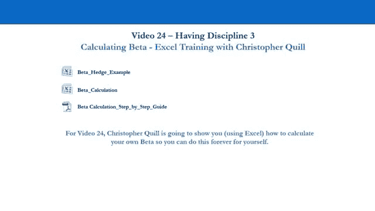
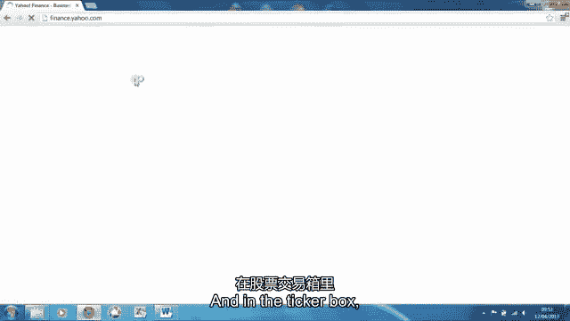
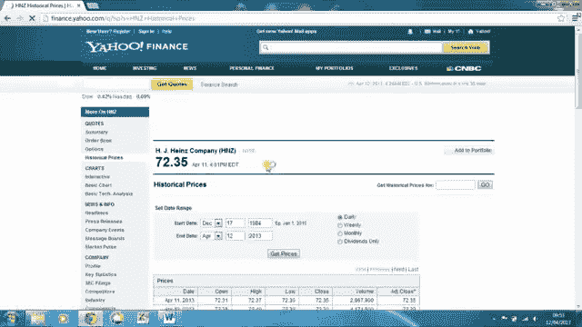
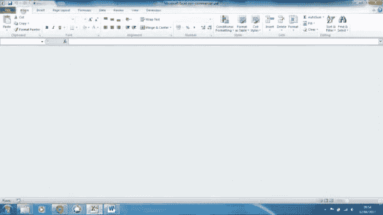
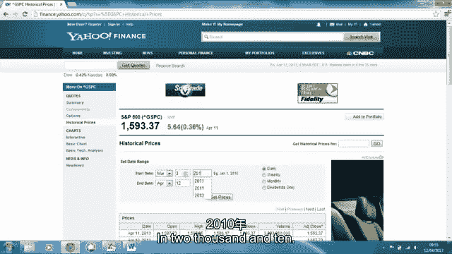
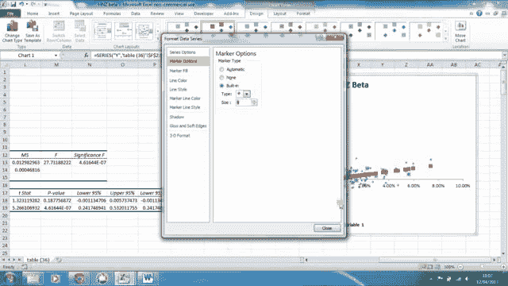

# 【高盛专业交易课】从0教你如何做交易 （中英学习全集） - P24：24-24.第24讲 有纪律 风险管理 - web3深度学习 - BV1be4y1c7ir

好的，欢迎回来，欢迎收看24号视频，克里斯要在电脑上给你看的地方，如何计算自己的测试版，只要你现在能得到数据这里有几件事，你会去计算自己的测试版的唯一原因，是因为你在其他地方得不到测试版，有很多呃。

在线资源，你可以在那里获得测试版，所以去所有典型的金融网站，你会看到你会在大多数网站上获得大多数股票的测试版，你通常会看到三年的测试版，上这些网站的问题，有时候，你实际上不知道你看到的时间有多长。

在下载部分的加热器方面，你正在看的那个，呃，在所有的电子表格中，你看到的测试版，有五年滚动测试版，它来自美国一家名为Value Line Now的公司，如果你有一个五年的测试版，在很短的时间内。

披萨会有很大的变化，所以，如果你要更新这些电子表格，使用这些在线资源，你真的不必太频繁地换披萨，如果你要使用在线资源并下载它们，如果你用的是五年或三年的披萨，但是如果你用的是非常短期的测试版，很明显。

你必须更经常地更新这个，所以如果你用了三个月，六个月或一年测试版，那你就得更新它们，但我不会太担心，如果你用三年和五年，你现在可以每六到十二个月更新一次，当你计算自己的测试版时，测试版的另一件事是。

它实际上离真正的，零售拖车应该非常担心的是什么，因为你真正应该担心的是，你的姿势和正确的姿势，那是最重要的，这真的是次要的，我们向你展示的原因之一，这是因为很多人会有目标，呃，有一天在这个行业工作。

所以要么在对冲基金工作，要么在投资银行工作，这是另一件你应该知道和理解的事情，并能够计算出你是否要进入这个行业，从散户的角度来看，如果你真的能得到测试版，因为披萨不是一个完美的衡量标准。

如果你能得到测试版，你正在努力，你试图尽可能准确地对冲市场风险，但我们都知道这不可能百分之百准确，因为依靠测试版或者依靠它百分之百的准确性，不是很管用，测试版只是我们使用的一个度量。

试图尽可能地对冲杰克市场风险，贝塔可以改变，但如果你使用它的时间足够长，它应该是相当准确的，所以不要太担心，如果你在电脑上看克里斯，你觉得这对你来说有点太先进了，如果你能得到测试版的数字，那很好。

如果你的目标是有一天在这个行业工作，这是你必须学会的，所以让我们转到电脑屏幕上，克里斯会教你怎么做，你已经下载了，五年滚动测试版在下载部分第四测试版，你可以去拿这个号码，让我们来看演示文稿。

克里斯会教你怎么做，我们视频最后见，总结了我们到目前为止所学到的一切，好的，所以现在，Chris将向你展示如何计算自己的测试版，以防你不能从我们通常看的网站上公开获得测试版，或者你认为测试数据不可靠。

所以我们将使用美国非常著名的股票，克里斯现在会教你怎么做，所以让我们计算测试版，把它拿走，克里斯。

在这个视频里，我要告诉你如何计算你自己的贝塔值，使用Excel，所以说，贝塔值只是衡量股票对市场敏感性的统计指标，和按市场，我们通常所说的行业惯例是使用股票所处的指数，我们正在看的股票是在。

所以在这个例子中，我们将使用亨氏作为我们的股票，消费必需品，我们预计对市场的敏感度很低，我们将看到它的回报与标普500的相关性，它在哪个索引中列出，由此我们可以获得它的灵敏度，也就是它的贝塔值。

所以让我们开始吧，我们需要做的第一件事是收集我们的数据，所以如果我们去，是啊，是啊，他资助了，在票箱里。

输入符号框，在左上角，我们输入h和z表示Hz，然后在左手边导航到历史价格。

现在我们要计算一个三年的贝塔，这是很典型的，以及彭博社等网站和其他金融网站，他们通常会给你三到五年的滚动节拍，因此，我们将获得3月3日的数据，二千零一万，到2013年3月3日我们每周都会收到，请按。

获取价格，滚动到网页底部，然后单击下载电子表格，此时，您可以将此文件保存在硬盘上，或者您可以直接打开Excel电子表格，就像我们要做的那样，一旦你在里面，就把它保存下来。

好的，所以我们就去归档，另存为，并保存在桌面上，将其保存为Excel工作簿，这很好，所以说，我们在这个电子表格中要做的第一件事是，只需调整日期列，这样我们就可以看到所有的日期，好的，所以要计算贝塔。

我们还需要标普500的价格数据。所以我们可以为亨氏和S和P 500创建返回列，看看它们是如何关联的，所以如果我们回到雅虎财经，输入s和p，并从下拉列表中选择s和p500，再回到历史价格。

我们需要确保我们在相同的范围之间选择数据，和我们以前一样的频率，那是3月3日，二千零一万。

三月三日，每周二千零一十三，确保通过单击更新表，获取价格，滚动到网页底部，然后单击，再次下载电子表格，我们将继续打开这个电子表格，你不需要保存这个文件，所以现在我们有了原来的床单，也就是母鹿回归。

呃价格价值，这是我们的标普500呃价格，所以如果我们去后面的母鹿床单，我们要做的是去掉所有这些数据列，我们不需要在我们的贝塔值中计算回报，所以我们要做的就是留下关闭列和日期列。

所以如果我们选择B列并保持控制，然后选择cd f和g，这样就会选择打开的高音量低音量和调整关闭，然后在选定内容中右键单击并按删除，这样我们就只剩下A栏中的日期了，b栏中亨氏的收盘价。

接下来我们要做的是输入标普500的收盘价，嗯，到这个电子表格到C列，所以我们要做的是回到P500电子表格，我们选择列E，一旦选择复制，我们只需按Ctrl C，然后回到后面的电子表格中，转到单元格C一。

按Ctrl V粘贴，好的，所以为了更清楚一点，我们要做的是重命名列b和c，而不是只是关闭，我们将把它们重命名为相应的，嗯，其适当的资产名称，所以在B1中，所以B1会把它重新命名为h和z。

实际上是为了使H和Z的价格保持一致，s和p，调整列是必要的，这样我们就可以把所有的东西都放进去，好的，所以在D栏中，我们要做的是在这段时间里为母鹿创造回报，所以让我们在那个专栏里，她会在专栏里做这件事。

e中的e将返回括号h和z调整列，in f会做类似的事情，但是有了S和P，所以我们输入返回，在这个单元格中，现在我们需要使用单元格e 2和f 2中的返回公式，所以在第二个，今日的，减去前一天收盘价。

除以前一天收盘价，这给了我们回报，我们可以很容易地把这个公式复制下来，通过导航到电子表格的底部，如果我们点击A列B和C中的B中的数据，我们可以按下控制和向下快速地到达数据的底部，我们穿过e栏，按控制键。

换挡向上，来选择所有我们想要复制E单元格中公式的单元格，向下到，所以我们选择了所有的细胞，我们只需按Ctrl-D，它就会复制所有的返回，我们将对S和P做同样的事情，所以等于今天的收盘价，减去昨天收盘价。

除以昨日收盘价，今天给我们回报，同样的东西将导航到电子表格的底部，控件向上移位以选择单元格，Ctrl d向下复制所有单元格，就往下走，和电子表格，我们将看到那里有两个细胞，在底部有错误的。

这是因为我们的退货公式需要前一天的价格数据，很明显在最下面的一排，没有前一天，所以那是，呃，这给了我们一个错误，所以我们要做的是，我们只需通过选择这两个单元格并按，在键盘上删除，好的。

所以现在我们得到了我们的回报，会让这个看起来更好一点，通过选择Pines和S p列中的所有返回，所以我用了控制移位，从单元E开始，我用了控制移位，右箭头和向下箭头来快速选择所有这些，用所有选择的。

在选定内容内右键单击，转到格式化单元格，我们要改变类别号，百分比2，小数点后没问题，所以在下一步中，我们将计算贝塔来做到这一点，我们需要使用位于数据选项卡中的数据分析工具，呃，在右手边这里。

如果你的Excel上还没有安装，你得手动安装，使用一个叫做分析工具包的插件，在附带的PDF中有一个关于如何做到这一点的指南，让我们继续点击数据分析，我们进入回归，回归只是一个统计过程，我们用来衡量。

模型中的某些变量可以解释我们正在测试的另一个变量，嗯，所以这也允许我们获得这些变量的灵敏度测量，呃，这就是测试版的本质，所以不得不，也许把那个，呃，让我们在这里做的事情更有意义，亨氏，亨氏是我们的变量。

我们正在用S和P的模型来测试它，所以我们在测试S和P的回报有多好，解释母鹿的回报，通过建模来比较它们，它将向我们展示，和系数，即s和p的灵敏度，五百，它会给我们一个S和P500的系数。

向我们展示了母鹿对S和P 500的敏感性，好的，所以如果你想了解更多关于回归的知识，让我们继续，在附带的PDF中有更多的解释，网上也有很多资源，你可以看看，但让我们继续开始。

所以我们的y输入范围是亨氏返回，所以在y输入范围框中，我们将点击单元格E并按下控制移位和向下，这将选择所有亨氏返回，然后我们单击X输入范围框，对S和P也做同样的处理，所以我们点击F2，F2控件向下移动。

选择所有这些单元格，我们想展示呃，我们在这个电子表格中的回归，所以我们从一个新的工作表更改输出范围，要小心，因为这会将我们的选择抛回Y输入范围，您已经选择了，我们不想编辑它，所以请确保单击输出范围框。

我们将把它显示在单元格I到，就在我们按OK并显示我们的回归之前，我们需要确保单击下面的线拟合绘图框，它将向我们展示我们回归的图形解释，所以只需选择它并按确定，好的，所以就在我们，稍微编辑一下这个数据。

让我们只是嗯，或者在我们看这些数据之前，我再解释一点，让我们编辑这些列，以便它们正确地显示所有这些数据，所以所有仍然被选中的，我们就带着丝带回家，然后在宽度上自动配合。

这让我们可以更容易地看到所有这些数据，现在我们要编辑之前的图形，在我结束之前，我总结一下我们实际上在这里看到的东西，所以只要把图做大，通过单击并拖动图形的右下角，所以这里有几件事我们需要做。

第一件事将编辑图形的名称，所以不是x变量，而是一条线拟合图，我们就叫它，右手边的这些标签，所以我们只需选择并按删除，呃，我们希望能够更好地看到我们的图表，所以这里的这些点，你可以做的是编辑这些点的大小。

所以他们不太打扰人，它们不会聚集在一起，或者它们似乎没有那么多聚集在一起，所以如果我们选择一个蓝色的省道然后再次点击关闭，如果我们双击其中一个蓝点，转到标记选项并将标记类型更改为内置，类型还可以。

我们会缩小尺寸，所以我们可以更好地看到它们，把它减少到四个。

对红点也做同样的处理，所以单击关闭，然后双击其中一个红点，内置标记选项，把它缩小到四号，好的，这样我们就可以更多地了解我们正在处理的事情，和权利，所以最后要做的是重命名轴标签，首先x轴是s和p500。

y轴是，好的，我们将通过点击和拖动这些标签来移动这些，所以这更有意义，好的，所以这个轴水平轴代表S和P 500的回报，相对于y轴，也就是欣茨返回，所有这些点都显示了给定的一周，与S和P 500相比。

HIDS的回报是多少，我们可以看到的是，增长率较高，比亨氏的回报率高得多，我来演示一下如果你盯着这个看，百分之五，骑着母鹿回来，穿过，好的，SNP的5%大致在这里，我们的实际价值都不在那里，好的。

也就是说S和P返回亨氏，得到百分之五的回报，S和P回报通常会高得多，或者把它倒在头上，我们能说的是与标普500亨氏回报相比，嗯，如果S和P 500的运动，就少得多了，所以松树对市场的敏感性。

到标准普尔500很低，这就是我们所期望的，因为这是消费者的自由裁量，对不起，对不起，消费必需品，这意味着它受商业周期的影响较小，总是有一些需求，所以它有相当稳定的回报，它是一种防御性股票，好的。

这是对图表的一点解释，什么，这是什么，所以我解释，蓝点是什么，它们都是亨氏的个人回报，对S和P 500，红点基本上代表了两者之间的最佳匹配线，所有的蓝点，好的，所以这就像我们的模型线。

这条线的斜率代表Hinz的灵敏度，到S和P 500，所以这条线的斜率也是我们的贝塔值，在这个数据摘要中，我们给出了那条线的斜率，输出x变量一系数，所以细胞J 19，那就是我们要做的。

我们的贝塔值大约是零点三八赫兹，这又有道理了，这是一种防御性股票，所以我现在要把手还给安东，他将更多地谈论我们在这里讨论的内容，并给出一个简短的总结，以及如何使用测试版，为什么它有用。

为什么我们要做我们今天在这里做的事情，好的，欢迎回来，所以你刚才看到的，是一个一步一步的指南来计算你自己的披萨，你可以进入下载部分，我们有PDF格式，它将带你完成整个一步一步的过程来计算你自己的仪表。

就像我之前说的，你知道你真的不需要为你所做的一切去做这个，你确实设法得到了，你知道的，准确斗鱼在线，你有一个很好的资源来获得一个像样的，一个还剩很长时间的测试版，你不必太担心这个。

你绝对不必为每一个职位一步一步地这样做，你的投资组合里有，这太疯狂了，从散户的角度来看，最重要的是你有正确的位置，然后你尽最大努力对冲市场风险，如果你想去做那件事，记住，你实际上可以用现金换现金。

就像一万元一样，少了一万美元，但如果披头士截然不同，贝塔比高，现金换现金作为一项交易不会很好地工作，所以你可能想尽可能多地对冲市场波动，所以一步一步的指南就在那里，你可以随时回头看视频。

如果你有什么困难，然后呃，看克里斯再经历一次那个过程，但你知道绝对不要对你做的每一笔交易都这样做，那只是做了太多的工作，没有真正的价值，你添加到你的投资组合中，呃，如果你能在其他地方得到测试版，另一个。

我们提到的另一件事，你知道在这个过程中，如果你的目标是在这个行业工作，有一天你想在投资银行工作，你想在对冲基金工作，那么这其实很重要，你必须明白这一点，如果你在投资银行工作，你会在对冲基金下。

就那件事而言，你会看到你自己的投资组合，你会看到我们所说的风险值，所以你的投资组合可以赚或损失的钱，在一个标准差上，两个标准差和三个标准差日，后台和中间办公室做了很多假设。

就他们输入到你投资组合中的打手而言，所以你实际上必须理解这个过程，所以你知道，当你看你的投资组合时，就处于风险中的货币价值而言，真实情况是什么，你每天可以赚或输，所以如果你的目标是这样。

你应该在这个行业工作，你绝对应该从里到外学习这个，从散户的角度来看，别太担心，你可以用现金换现金，如果贝塔比高，你将尽可能地对冲市场风险，如果你能从一个像样的网站上公开获得测试版。

如果你在任何地方都找不到测试版，那也没关系，然后试着通过这个练习，好的，所以现在我们几乎完成了风险管理过程，但作为拖车员我们最不应该做的就是遵守纪律，就是有自我意识，对自己作为拖车的能力的自我意识。

这就是我们下一步要做的，我们要看25号录像，开始研究一些标准的行业指标来衡量你作为交易者的表现，所以你明白你的弱点在哪里，你的优势在哪里，以及你需要在长期中位数上努力的事情，就你的弱点而言。

所以让我们转到视频二十五。

