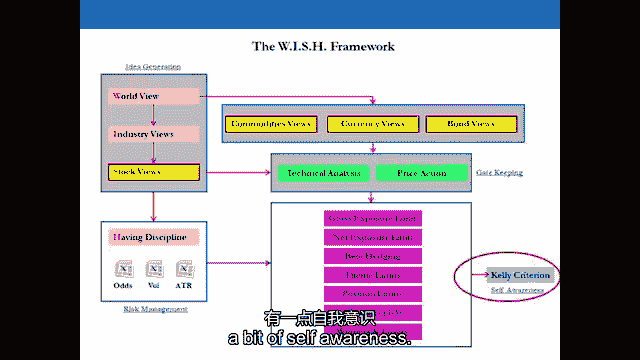
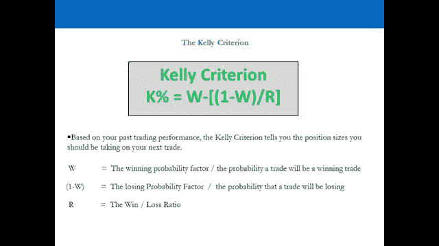
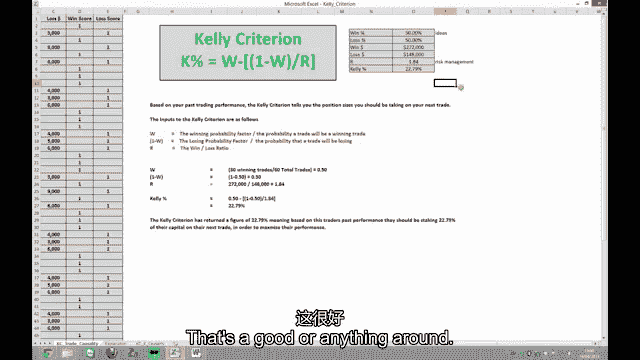

# 【高盛专业交易课】从0教你如何做交易 （中英学习全集） - P25：25-25.第25讲 有纪律 风险管理 - web3深度学习 - BV1be4y1c7ir

好的，欢迎回来，欢迎收看第二十五期视频，我们现在要继续关注作为交易者的自我意识，现在自我意识很重要，因为对于散户来说，你的办公室或家里没有风险经理，你本质上没有一个老板来衡量你作为交易者的能力。

也要找出你的长处和短处，为什么一个老板会在投资银行或对冲基金之后这么做，嗯，专业的拖车会有风险经理和老板，确定是否应向这些拖车投入更多资金，你没有这个，你必须自己决定你应该为自己部署多少资本。

以及何时部署，所以你需要的，真的是衡量自己的一种方式，关于你应该部署更多的资本还是更少的资本，以及衡量你的长处和短处的方法，所以至少你知道你可以明智地部署资本，就你的弱点而言，你需要努力的是什么。

专业教练有这个奢侈，零售教练没有这个，这是主要问题之一，因为人们并不真正知道自己的能力是什么，总的来说，他们应该为自己部署更多还是更少的资本，所以我们现在要做的是去演示。

并向您展示一个漂亮的行业标准指标，称为凯利标准，在这个过程中，我们还将在计算机上进行，在那次演讲中，我要告诉你这到底意味着什么，所以我们将通过一个理论拖车的数字，您还可以下载电子表格，你应该下载这个。

看看数字，这样你就可以了解公式是如何工作的，所以让我们回到演示文稿和电脑屏幕，我们在25分钟的视频结束时见，凯利标准的完整摘要，好的，我们将继续讨论所谓的凯利准则，所以我们谈到了这个想法。

当我们赢的时候，我们想寻求更多的风险，我们已经谈到了当我们输了的时候，我们希望寻求更少的风险，我们想从B箱拉出来，所以赢的时候打A，输球时的方框B，但是如果我们回顾一下我们过去的所有特征呢。

我们看了我们的记录，我们实际上开始考虑我们是什么样的交易者，我们想要的是自我意识，所以我们知道我们是什么类型的交易者，零售商人的问题之一是他们没有老板，所以你没有，你没有人告诉你你是否优秀。

那么如果一个对冲基金经理有一个由八名交易员组成的投资组合，他会怎么做呢，其中三个赚钱，五个输了，对冲基金经理会怎么做，好吧，对冲基金经理，那些赔钱的人只是在交易员的投资组合中失去头寸。

对冲基金经理不交易股票，指数，货币，商品，有交易员为他们工作的对冲基金经理，将他们的交易者作为头寸进行交易，对冲基金经理，交易人类，或者希望不是人类，基金经理的基金是做什么的，交易具有人类特征的人类。

去找一个基金经理谈谈，简而言之，问他们是做什么的，他们会说我用人类做交易，交易人类，他们就是这么做的，唯一的问题是我们告诉交易员你们，你没有人告诉你，不管你是否准备好了，向你部署多少资本。

什么时候做这件事从你身上拿走多少资本，等等，等等，但你能做的是使用相同的过程，许多对冲基金经理用来自我意识的工具，基本上，这基本上告诉你你是否优秀，你的特征的历史，所以只是有自我意识。

不仅仅是你是否优秀，但你擅长什么，不擅长什么，你做你不擅长的事情，有一件事会告诉你你是否优秀，很明显，你是否赚钱，但如果你在赚钱，这是你的东西的混合，行为的，你擅长什么，你不擅长什么，从整体上看。

你是否值得更多的资本，如果你做多少，以及何时应该部署它，所以我们要看看凯利准则，一点自我意识。

所以根据你的交易表现，凯利标准基本上只是告诉你你应该承诺多少，以资本价格到你的下一笔交易，它始于20世纪50年代的赛马场，赌徒们去赌马的时候用它，去赛马场。

所以他们带着一百美元去赛马场，他们很好地进行了第一场比赛，让我们把问题提出来，如果你带着一百块钱去赛马场，今天有十场比赛，你在第一场比赛中投入了多少，好的，所以你失去了你的十美元。

你在第二场比赛中投入了多少，好的，你失去了你的九美元，你在第三场比赛中投入了多少，是啊，是啊，所以你所做的是，是啊，是啊，在反面，带着一百块钱走上赛马场，你押了十块钱，你的马进来了，你总共赚了十八美元。

你下一步会做什么，你会冒更多的风险，是啊，是啊，所以凯利标准基本上奖励交易者，他们通过说你在下一次交易中投入了更多的资本来赚钱，你脱下和穿上的边际利率，那是凯利告诉你要做的，是啊，是啊。

但当你回顾你的过去时，这是一个很好的试金石，比如说五六十笔交易，你是什么类型的交易，所以让我们看一个例子，所以我们这里有一个理论上的交易者，谁做了六十笔交易，关于贸易一，这个商人赚了五千美元，赢了。

所以一个人赢了，学校，关于第二项交易，这个商人损失了五千美元。所以一个在丢失的分数中，到目前为止，这一行还没有赚到钱，他们得到了50%的胜率和50%的败率，是啊，是啊，你一直往下走，我们这里有结果。

所以赢家的交易员赚了27万2千美元，在他们的失败者身上，这个商人损失了十四万八千美元，他们赚了三十块钱，他们在三十岁时赢了，在三十个交易中赚钱的，三十岁时亏了钱，所以胜率五十，损失率50。

一个好的交易者，所以基本上，凯利标准说在下一次交易中，这个交易员应该穿两个，他们在下一次交易中敞口的3%，他们在下一笔交易中23%的钱是明智的，所以60多个托盘，这个行业有百分之五十是对的。

百分之五十错，他们在获胜者身上赚了272英镑，在他们的失败者身上输了148英镑，赢家赚的钱和输家输的钱之间的比率，一点八，四，凯利标准说，你下次交易的23%的钱，所以首先是这个交易者，任何说好的人。

谁认为这个交易不好，谁认为这笔交易只是普通的，好的，答案是这个行业非常热，W是什么，W是什么，什么是R，是交易者产生想法并安排好时间的能力，百分之五十好吗，什么是R，R是交易者管理风险的能力。

因为他们可以有很多好主意，但如果他们不经营他们的赢家，不削减他们的输家，他们的R会很糟糕，好，这是一个很好的或任何东西在两个左右。

加号很棒，超过一个好的大小数量的性状，所以如果你，如果你回顾你的第一年，你做了60笔交易，你的胜率是50，1。你的损失率是50%，你的r是一分，八，四，再加上如果太神奇了，你做得很好，很明显你在赚钱。

你有好主意，你有很好的风险管理，现在作为一个对冲基金经理会发生什么，如果你坐在后面，你有一个由20名交易员组成的团队，你有每个交易者最近500次交易的电子表格，你在电子表格中绘制图表。

你也在绘制每个交易者的图表，每个交易者都是他们的盈亏，它们都在一张图表上，他们在实时移动，你会看到那些非常非常好的交易者开始变坏，你会看到那些非常非常糟糕的交易者开始变得好起来，你是做什么的。

你从那些开始变坏的人那里拿钱，把它给那些开始做得很好的人，现在这不是百分之百的科学，但这正是，这是对冲基金经理所做的一个例子，所以他们实际上会记录他们人类的表现，这有道理吗。

现在回到你投资组合中23%的问题，这是一个非常高的数字有一个职位，在你的投资组合中为此做出贡献，但这说明了什么，比如说，如果你给它一个限制，说，你一开始就持有一个占投资组合5%到10%的头寸。

这开始表明它是投资组合中的大赢家，如果你最初的单一资产头寸限制是10%，会发生什么，你的单只股票持仓限额是百分之十，你应该添加到它，你应该出去吗如果如果。

如果增加它意味着你超过了你自己强加的10%的头寸限制，你应该加进去吗，现在你绝对应该，因为凯莉告诉你你可以，你是个好商人，在这种情况下，你可以感到安慰，因为你很好，你知道你在做什么在几乎每一种情况下。

因为过去60年的交易表明，作为一个交易者，你知道什么时候增加赢家，什么时候减少输家，那是什么，那意味着什么，如果你在银行或对冲基金工作，那就意味着你得去见你的老板，并请求允许做这件事。

我很想为这个获胜者增加一点，我可以增加吗，我可以打破我的单一股票头寸限制吗，目前绝对超过5%，现在发生了什么，如果它，如果对你更有利，你是做什么的，你去问你的老板允许增加更多，你一直从A盒子里拉。

你不停地滚动止损，直到你被阻止，当你开始你的单一职位时，每年会发生一两次什么，的限制，比如说百分之十，那些获胜者开始出现，和你的历史，正如一位交易员所说，你知道该怎么对待你的获胜者。

你知道该怎么对付你的失败者，所以你可以在你的记录中得到安慰，你知道你在做什么，每年一两笔这样的交易会给你报酬，你一年所有钱的百分之五十，因为你会从10%到15%，它会继续，你从15%到20%，你会继续。

你从20%到25%，你会继续，你会不停地停下来，损失，当你做完的时候，会让你发大财的，发生了什么，你实际上如何退出这笔交易，你没有，你只会被挡在外面，你只要继续前进，每个目标都是软目标，在这种情况下。

你被阻止后会发生什么，你把这笔交易纳入你的凯利标准，你的分数会很高，在接下来的6-12个月里，你做了什么，你只是给了自己继续像动物一样交易的许可，因为你我们的学校刚刚爆棚了，这就是你要做的。

所以把你做的每一笔交易都放在凯利标准中，从自我施加的位置限制开始，但那些位置限制是软的，只有当胜利者出现时，你才被允许打破限制，你永远不会打破失败者的限制，永远，监控你的方钻杆标准，你的K分。

如果你去面试，把你做过的所有交易的记录打印出来，把你的案件分数钉在前面，留给那个，或者刚刚采访过的人。

你采访了你，如果你做了几百笔交易，你的r值大约是2，你的案子得了23分，二十，百分之五，你的W 50，不管是谁都会很惊讶的，如果你这样做，它和你简历上的学位一样值钱，在这个过程中。

你可能会为你的学位买单，这就是你要做的，你知道的，何时将资本部署到自己身上，什么时候不，如果你到了第一年的年底会发生什么，你有一个很好的W，得到了很好的R和很好的K分，你想在你的交易账户里放更多的钱。

方框a，你很擅长交易，那你为什么要限制自己，向月亮射击，但你落在群星之中，你在贬低自己，冒更多的风险，因为你无论如何都要停止损失投资组合，所以没关系，你不妨冒更多的风险，但如果出了问题。

你最好从止损投资组合中交易，我见过噩梦般的情况，在那里，人们从他们的交易账户中的两万英镑，一年超过30万英镑，到第二年年底，他们就归零了，因为他们没有在投资组合中加入风险管理参数。

好的，欢迎回来，所以你所看到的，有凯利标准，凯利准则是一个度量，最重要的是，你用它作为一个度量来告诉你，就资本而言，你应该向自己部署什么，所以我们已经通过了风险管理参数。

我们首先研究了总暴露极限和单位置极限，嗯，县标准也给了你一个很好的意识统计数据，它告诉你总体上你现在是一个好的还是一个坏的交易者，如果你是一个好的交易者，你赢了，你应该从A盒子里拿出来。

你应该冒更多的风险，你如何承担更多的风险，你做两次，你要么增加你的培训账户的曝光率，或者你在你的培训账户上增加更多的钱，例如，如果你以两万五千美元的保证金开立交易账户。

一开始你的风险敞口是10万到12万5千美元，所以四到五次以上，假设有八个月的时间，你很始终如一，你设法将两万五千英镑翻倍到五万，所以这意味着根据你的暴露水平，你得到了一个20到20。

你的钱有5%的回报在持续的基础上做这个扣除佣金的事情，假设你已经做了8到12个月，嗯，这里发生了什么，这个时候你可能被告知什么，根据凯利的标准，你很擅长交易，你的利润告诉你你很擅长训练。

所以你应该从这里的A盒子里拿出来，你应该增加你的暴露水平，你现在应该考虑在你的交易账户里放更多的钱，如果你得到相反的结果，我们该怎么办，假设你一直在亏钱，你只是要击中你的投资组合构造参数之一。

也就是对你的头寸进行止损，对你的整个投资组合进行止损，你的止损就在那里，这样你就可以保存资本，然后再试一次，所以你不一定要从你的培训账户里拿钱，这只是意味着总的来说你，在那段时间里，你一直不擅长交易。

你的W会很糟糕，你的R会很糟糕，这意味着你的，你的获胜概率，你的W和你的风险管理能力，你的是那些的结合，只是意味着你很坏，所以从A箱拉出来，可能也从B箱拉出来，这就是凯利要给你看的，当你开始正确的时候。

这就是你要做的，作为一个专业的投资组合经理或采取这种方法，凯利准则的第二件重要的事，就是识别自己优势和劣势的能力，如果你的W真的很好，所以你的想法很好，但你的风险管理很差，那么很明显。

你需要努力进行风险管理，你需要增加我们的，你需要努力让这个数字变得更好，如果你的风险管理很好，但你的想法很差，很明显你需要花更多的时间，你需要付出更多的努力来产生更高质量的想法，也在守门站点。

你可能想试着更好地计时这些特征，或与您的价格行动指标，确保你采取了正确的方法，所以它可以在整个想法产生阶段出现，而且还有守门，所以如果你的W不好，这就是你现在需要关注的。

我们已经通过了凯利标准和自我意识统计，这很重要，你还需要了解的是，根据你的投资组合构造参数，如果肯尼标准建议，你在一个位置上做得更多，在你的投资组合中的一次交易中。

与你自己对你的单一头寸资产的百分比限制相比，你可能不应该超越你自己管理的统计数据，例如，凯利标准是建议你的下一次交易，或者一个职位最多应该是15%或20%，那很好，很高兴知道。

但如果你的限制是你自己投资组合的10%，你应该坚持，因为你不想在一个职位上投入太多的钱，或者一个想法，你自己的位置限制，防止你过于自信，不要在一个想法上投入太多的钱，所以凯利标准，如果它推荐了更多。

那就太好了，把它放在背景里，保持方钻杆准则运行，你绝对应该用你自己的风险管理来覆盖它，因为我们现在已经经历了所有这些事情，我们已经通过了纪律一，两个，三和四，这样做，我们通过训练心理学，确保你明白。

确保你的基础是正确的，试着把盒子a和盒子b的策略部署到你生活的其他领域，这是预告片的思维方式，这是你必须习惯的思维模式，其次，我们看了投资组合的构造参数。

一定要将这些参数的一部分或全部部署到您的投资组合中，如果你不，你只是掉进了业余交易者的陷阱，这是你不想要的，你需要保护你的缺点，你保护你的缺点，因为你了解心理学你了解自己作为人类的弱点。

我们还研究了我们已经通过测试版的对冲技术，您可以使用基本的beta方法，您也可以使用高级方法，如果你的目标是在投资银行或对冲基金工作，我们也通过了凯利标准的自我意识统计，所以你知道在任何一个时间点。

你作为教练有多好以及你自己作为教练的能力，这样你就可以负责任地将资本部署到自己身上，所以我们已经通过了整个风险管理，现在我们进入下一个视频，确保你通过风险管理和自我意识统计，这可能是许多次的标准。

在你真正开始将资本投入到真正的交易中并建立投资组合之前，这是非常重要的东西，我们将把好的交易者和坏的交易者分开，你显然想成为一个好的交易者，随着时间的推移，持续赚钱，如果你不做这些事，你就不会这样了。

请一定要把这些视频看很多遍。