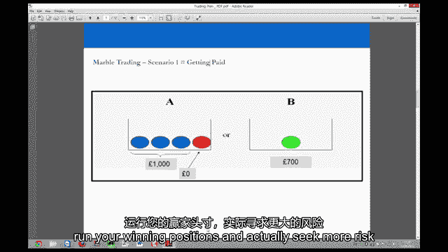
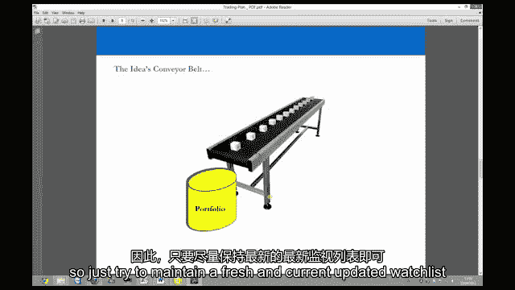
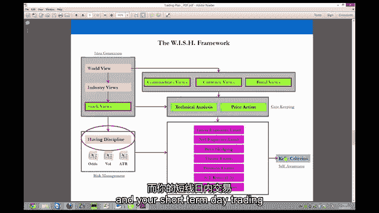
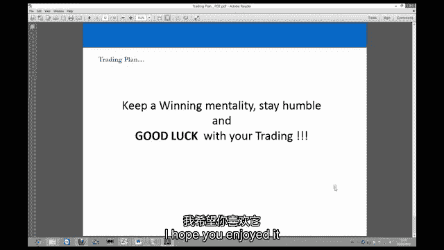
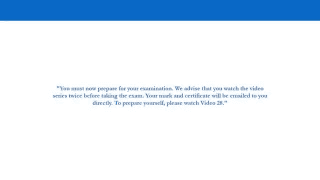

# 【高盛专业交易课】从0教你如何做交易 （中英学习全集） - P27：27-27.第27讲 交易计划 可操作的步骤实施 - web3深度学习 - BV1be4y1c7ir

好的，所以欢迎回到电脑屏幕，我们要看的是，现在是一个明智和典型的交易计划初学者采取这种专业的交易方法，所以我们要用这里的例子，我们已经在，我们要在这里开一个理论保证金帐户，有两万五千美元的保证金。

和以往一样我们想给自己一个赚钱的机会，所以我们将设定总暴露限额，所以我们实际上从来没有收到过经纪人的追加保证金通知，我们在这里看到的是欧洲的一个典型情况，我们交易杠杆CDS的地方，和在股权空间。

我们看到的是五倍的曝光率，假设一个多样化的，多空投资组合，而且对货币的敞口率在6到8倍之间，和商品四到五倍，在美国，事情可能会有点不同，所以只要和你的经纪人确定你的风险敞口率可以和不可以是多少。

采取了五倍于股票敞口的方法，货币是六到八倍，商品是四到五倍，所以真的要起床，到那个点，你得先赚点钱，所以我们应用了专业交易员总是应用的这个原则，当我们赔钱的时候，我们减少暴露。

因为我们没有权利继续经营和以前一样多的资本，但当我们赢钱的时候，我们寻求提高我们的曝光率，因为我们有权投入更多的资金，所以我们将通过这个例子，我们有两万五千美元的保证金，真的。

你可以使用这种方法的最低资本大约是15000美元，你采取的多样性是你需要采取的是不可能的，你的风险会变得过于集中，和你的头寸大小，如果你想让它多样化，只是太小了，所以我们这里有两万五千美元。

最低是一万五千美元，你知道我们不，呃，在这里假装你可以用1000美元开一个交易账户，在股票上杠杆十倍，一百倍的杠杆作用，我们真的不提倡，因为这是典型的散户到交易者的策略，不幸的是。

如果你想采取专业的方法，就有，就所需资本而言，一种最低的进入壁垒，所以最低是一万五千美元，这里我们要举两万五千美元的例子，我们还将假设5%的回报，在我们增加曝光率之前，所以这可能需要几个月。

因为我们使用一到三个月的投资期限，我们所有头寸的交易期限，所以在第一步，我们在八到十个仓位上有十万美元的风险敞口，这意味着我们在20分钟内暴露了四次，已经存入的5000美元，如果我们暴露四次。

这意味着我们有两个5的垫子，这意味着我们可能会失去两个，百分之五之前，我们收到一个神奇的，然而，如果我们跑了很长时间，短，八到十个职位的多样化投资组合，这是非常非常难实现的，所以这给了我们很大的安慰。

因为我们不会被阻止，或者当我们现在迈出交易的第一步时收到保证金通知，如果我们设法获得5%的回报，在最初的几个月里，我们的十万美元，这意味着我们的交易账户将有105个风险敞口。

因为我们的利润已经从二万五千增加到了三万，然后我们将曝光率提高到五倍，因为现在我们有权投入更多的资本，就像接受更多的暴露，然而，与此同时，我们实际上在增加。

将我们的头寸定位在投资组合中的10到12个头寸，这意味着即使我们增加了曝光率，我们实际上在增加我们的多样性，所以我们的风险可能不会上升，即使我们在赚钱，我们的曝光率更高。

五倍的曝光率给了我们20%的缓冲，而不是四倍曝光的2。5垫子，然而，我们更加多样化，所以随着我们的曝光率上升，你会发现你的PNL摆动会稍微上升，但你实际上会更加多样化，然后在第二步。

当我们有十五万的曝光率和三万的利润时，如果我们假设几个月后有5%的回报率，所以现在，让我们假设我们总共训练了，四到六个月，就再赚5%而言，这是一个明智的目标，那么你们的保证金就会增加到37。5万美元。

在这个阶段，我们真的可以开始冒更大的风险，我们将曝光率增加到六倍，我们存入保证金的金额，这意味着我们有22。5万美元的风险敞口，同时我们又一次，增加我们投资组合中的头寸数量以增加多样性，记住。

在这一切发生的整个时间里，我们坚持我们的风险管理原则和交易心理学原则，所以当我们在心理学方面增加曝光率时，我们正试图减少我们的输家，增加我们的获胜交易，并用新的想法取代它们，也覆盖了我们的投资组合。

八到十个位置也是，十岁到十二岁，是十二到十四个位置，用合理的风险管理参数覆盖这些投资组合中的每一个，所以如果我们看看这里的典型例子，当我们开始的时候，这里的一个典型例子可能是十万美元的投资组合。

我们在这里已经解释过了，现在在股票的十个职位上，目前这里没有硬性规定，你可以有一些商品敞口，你可以有一些货币敞口，但要习惯这种围绕，价差交易和主题，一开始，这是一个明智的方法，所以你在看，呃。

长边五万的曝光，短边五万，你可以被树篱，如果你想，那完全没问题，但是十万的总暴露限额，跨越十个位置，所以五个肺和五条短裤，限制你的净暴露，你对市场风险的净定位，你在这里能做的实际上是当你开始的时候。

因为当你开始的时候，你在投资组合中的风险敞口为零，分两个阶段构建投资组合，所以分两个阶段建立每个职位现在拿一个5000美元的职位，然后是5000美元的头寸，如果有机会在价差突破时获得更好的价格或价格。

用合理的风险管理参数覆盖你的投资组合，我们已经见过很多了，但让我们来看看，呃，这里又是一些基础知识，你可能想在这里做什么，顺便说一句，这个电子表格可以在下载区获得，你可能要做的是限制你的网络定位。

所以在这个迷你投资组合中，限制是三个五个净长的短曝光，我想说一个明智的方法，当你开始的时候，只是有一个最大的净更长的短曝光，百分之五十的限制继续止损和软目标，记住每一次止损都是一次艰难的止损。

您不能自动将它们设置在您的经纪帐户中，因为我们在价差上做你的止损，和我们艰难的止损，大型股和中型股的利差在7%到12%之间，意味着我们的软目标是2 1到3 6，所以你应该把这个一比三的规则应用在你的。

在你的投资组合中进行价差交易，你也应该应用并覆盖一个真正的投资组合，在你暴露的情况下停止损失大约10%，所以在我们的例子中，我们刚刚在你的曝光率上花费了一万美元，第一步十万美元就是你整个投资组合的止损。

所以如果你从最初的两万五千美元中损失了一万美元，那你还剩一万五千美元，你可以活着再战斗一天，你只是重新开始，你休息一下，从交易中休息几个月，然后寻求再次建立您的观察名单，建立你的想法，然后重新开始。

你永远不想接到追加保证金通知，所以一定要在你的投资组合上覆盖整个投资组合的止损，会发生什么是因为你有八到十个位置，你在你所有的头寸上都有7%到12%的止损，为了实际发生这一点。

这意味着你必须把你所有的价差交易都弄错，这不太可能，所以如果你所有的价差交易都击中了，假设你的10%止损在7%到12%之间，那你就会被停在，如果你把每一笔价差交易都弄错了，当你有八到十个位置的时候。

所以四到五次价差交易，如果你把每一笔价差交易都弄错了，那么显然有什么严重的问题，所以你应该停止你的整个投资组合，你可以，当然啦，做你想做的树篱，所以如果你想冒一点市场风险，没关系，但只要通过测试练习。

并确保你有你想要的风险，以及你想对冲的风险，用树篱围起来，你可能应该寻求跨部门的混合，跨部门成分和部门内成分传播特性，尝试一下，一切都是为了一开始的实验，所以你不必在所有的交易中都做得很大，就像我说的。

你可以有初始头寸，并寻求建立交易，当你得到更好的价格或突破时，因为在突破时，他们已经赢得了交易，因此，您可以寻求添加到这些交易中的任何一个，如果你要做跨货币价差交易，一开始可能不是最好的办法。

但随着你的成长，你做了跨货币价差交易，如果你不想要货币风险，确保你从对冲货币风险开始，所以你做我们说过的三笔交易，在对冲交叉货币价差贸易货币风险的例子中，当你赚钱的时候，当你从第一步到第二步再到第三步。

在你赚钱的头六个月里，你可以寻求增加你的曝光率，确保你在增加你的多样性，而不是集中你的风险，你也可以寻求持有货币头寸，你实际上对，所以这与在价差交易中对冲货币风险是非常不同的，因为如果你对货币没有看法。

你应该把它对冲出来，但如果你对货币有看法，当你在货币上的头寸增加时，你可以采取，记住，它们将比股票波动更小，你可以在商品上持仓，这将帮助你作为一个交易者在中长期内发展，你可以在不同的资产类别中敞口。

当你把货币敞口作为一个经验法则时，试着限制你的货币定位，你在交易账户中的股票敞口规模，但还是要看一到三个月，那么我们所说的那口井是什么意思，假设你在第二步，你的投资组合中有15万美元的风险敞口。

就股票敞口而言，那么如果你要持有货币头寸，试图将他们限制在15万美元，所以不要检查你的股票敞口，当你接受货币敞口时，和我们已经看到的货币，通常比股票波动小得多，作为全面的一般规则，在主要货币对中。

所以这种类型的暴露对初学者来说是合适的，那么如果你有保证金交易账户，你会看到什么，和你的经纪人，比如说，可以让你进行一百倍的曝光，嗯，你会看到的是，你实际上只是利用了很少的利润。

当你把自己限制在那个尺寸的时候，然后如果这些货币头寸真的赚钱并成为获胜的交易，然后它们成为寻求更多风险的选择，所以从不超过股票敞口开始，你投资组合中相应的股票敞口，比作为初始头寸的货币头寸更多的敞口。

还记得我们一直想从A盒子里拿钱的时候，我从B盒子里拿出来，当支付时，我们需要确保我们正在削减或失去特征，确保我们不会在那里暴露得更多，当我们得到报酬时，确保我们从A区出发，并寻求运行我们的胜利位置。

不获利，运行你的获胜头寸，实际上寻求更多的风险。

在回收井方面，你总是会有一个投资组合，你要经营你的赢家，裁掉你的输家，你观察名单上的想法必须取代你的失败者。

所以确保你每周都维护这个观察名单，你可能应该每周看8到12个小时，这可以用全职工作来完成，每周8至12小时，周三晚上可能三到四个小时，星期六或星期天早上三到四个小时，所以你为这一周做好了准备。

更新您所有的价差，产生新的交易想法，一周中有几个小时，你也会进入你的交易账户，你知道的，只是为了检查你不需要每天交易的东西，你在这里的时间范围是一到三个月，每件事都应该每周审查一次。

所以一周中有几个小时，你总共会进入你的交易账户，几个小时来检查东西，也许每天只有十分钟，周三晚上的预算，三到四个小时，这样你就可以更新你的观察名单，检查价差，确保你的失败者没有损失太多的钱。

或者达到止损，所以如果你需要运行你的赢家，你可以用它们来交易，可能会增加他们，然后在周六或周日做同样的事情，星期一的计划，把这些，我确保你的想法是新鲜的和最新的。

如果有什么东西在你的监视名单上已经很长时间了，很长时间，那么你可能应该寻求将其从观察名单中删除，并用新的想法代替它很长一段时间，可能两三个月，不代表这是个坏主意，这只是意味着这可能是一个陈腐的想法。

或者你只是太早了，这将是你的决定，这里没有规则，所以试着保持一个最新的观察列表。

坚持计划，你知道吗，粘在这个上面，坚持这个投资过程，坚持交易过程，确保你的想法是最新的，始终保持你的世界观，确保你总是跟上现代技术的领先指标，您可以将自己设置为在电话上接收警报。

您可以在电子邮件中获取提要，这一切都很容易保持在一次之上，你已经了解了领先指标的实际含义，以及你如何利用它们并解释它们来赚钱，在你的投资组合中赚真正的钱，确保您的观察列表在守门过程中始终更新。

远离坏主意，在你的观察清单上保留好的想法，就像赚钱的想法一样，始终如一地赚钱，但试着把时间安排对，在价格行动中进行技术分析，当你寻找机会时，一定要确保，您的风险管理概述正确，总是看看分布和ATR。

检查历史波动率，确保赚钱和风险管理的机会真的存在，确保你的止损是明智的，你的目标实际上是明智和现实的，并确保用合理的风险管理参数覆盖你的投资组合，最后但并非最不重要的凯利准则。

确保你所有的交易都符合凯利标准，并确保在投资组合管理中单独执行此操作，和你的短期日间交易。

方钻杆判据，在监测波动性方面，一定要掌握市场上的隐含波动率指标，确保你在看美国的VIX，确保你在看欧元股票上的V股票600，确保你在看德国的V DAX，和英国的V脚。

如果你看到这些隐含波动率指标急剧上升，你得考虑做点什么，我们已经讨论过很多次了，你只是不想成为前灯下的兔子，确保你正在考虑或考虑做某事，如果你真的想过渡，可能是最好的办法，记住这里没有规则手册。

你只需要做一个明智的决定，如果你觉得不舒服，就过渡而言，可能是最好的事情，只是为了确保你在做什么，先从你的失败者中交易出来，所以只要进入你的投资组合，换掉你的失败者。

筹集一些现金，这将使你能够进行短期交易，根据凯利准则，我们刚刚经历过，确保你为你的投资组合交易保留一个单独的凯利标准，和你的短期或日间交易，总是监视你的W和R，并确保每十到二十次交易。

你一直保持在你的工作上，看看你是成为一个更差的交易者还是一个更好的交易者，确保你做季度审查，确保你对你的案件做年度审查，给你的W和R打分，在这些时期，问问自己，你应该从你的培训账户中增加还是拿走钱。

就像在你赢的时候寻求更多的风险一样，当你失败时，寻求更少的风险，女士们先生们，这是一个典型的例子，说明你应该如何开始采取专业的交易方法，保持必胜心态，记住获胜的心态，不是出去寻求很多风险，试图变得富有。

快，保持必胜心态，实际上是在寻求变得富有，在一段时间内进行交易，并在一生中获得稳定的回报，直到退休，保持谦逊，一定要让市场告诉你该做什么，不该做什么，不要让自己告诉市场什么是可能的，市场比你大。

它比你聪明，只要保持谦逊，祝你交易好运，1。祝你万事顺利，这不是一个容易的游戏，但一旦你掌握了这个过程，这对你来说是最好的过程，作为一个初学者，作为零售贸易商，走出去，采取专业的方法，在你的一生中。

你会有更高的机会持续赚钱，通过这种方法。

