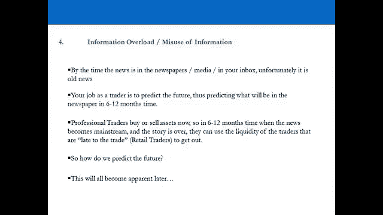

# 【高盛专业交易课】从0教你如何做交易 （中英学习全集） - P2：2-2.第2讲 专业人士vs零售交易员 - web3深度学习 - BV1be4y1c7ir

嗨，欢迎回来，欢迎收看第二视频，你成功地活了下来视频一干得好，如果你还记得在第一个视频中，我们基本上定义了什么是专业交易员，现在，我们可以试着继续研究一个成功的专业交易员到底是做什么的，现在。

本系列视频的目的是为您提供，零售培训师，其框架使您能够始终如一地模仿，有利可图的专业教练现在达到这一点，我们首先要做的是，为什么现在大多数散户都在赔钱，你可能在想，这真的是真的吗。

大多数零售教练亏钱好吗，是呀，他们有，大多数零售商都会因为一些特定的原因而亏损，这就是散户市场的问题，这就是我们现在要解决的问题，如果你要始终如一地效仿，呃，有利可图的培训师，成功的培训师。

你首先要明白，糟糕的业余零售教练犯的所有错误，这个，将为您提供一个基础，使您能够走向持续的盈利能力，和效仿成功的专业培训师，这就是你在这个视频中将要看到的，你会看到粉底，你会看到散户赔钱的原因。

一旦你得到了，我们将努力找到一种方法，它模仿成功的专业培训师，所以让我们到舞台上去，让我们来看看那些原因，我希望你时刻考虑你在这里的目标，就是用自己的钱在金融市场上赚钱，当我们经历这些原因时。

你会看到一些真正会奠定基础的家庭真相，这将使你，让我们到舞台上去，我们视频最后见，我也是，你在舞台上看到的一切的总结，有人见过这个吗，这是一个，这是一个一直在谈论的行业统计数据，在零售贸易市场。

1990年规则，有人知道它代表什么吗，百分之九十的交易者的资本接近它，意思是百分之九十的零售商损失了百分之九十的钱，九十天内，哈哈哈哈哈哈哈，这是一个众所周知的统计数据，我们在这里看到的是，呃。

保证金账户，保证金交易账户当你把钱存入账户时，钱就在那里，并为你提供抵押，以获得更高的风险敞口，所以另一边的经纪人会借钱给你交易，根据你在交易账户中预先支付的金额，所以百分之九十的人都赔钱。

但这里的目标是赚钱，但是是什么导致了方法上的差异，为什么会存在，这对你来说真的很重要，因为当你了解家庭真相和你所经营的行业的参数时，一旦你理解了这个框架，您可以选择以不同的方式操作，并在框架内操作。

因为在一天结束时，你别无选择，你仍然需要进入市场，那是这个行业的基础设施，这是你真正成为零售交易员所必需的，但你如何在这些参数内运作并取得成功，第一步是了解参数是什么，欣赏他们。

一旦你明白了你可以想出如何以一种有利可图的方式在内部运作，那么它为什么存在呢，利益冲突，你必须意识到这一点，它为什么存在以及它是如何工作的，就像相信一个软件会给你所有的答案。

你需要赚钱和信息过载或滥用信息，利益冲突，意识，你在看什么，有很多，非常简单的公式，字面上支撑着这个行业，一切都回到这个价格时代，音量次数，佣金，所以牛市中的价格，在牛市中，当市场上涨100%时。

价格是原来的两倍，音量翻倍，人们收取更高的佣金率，因为他们可以，所以在熊市中达到顶峰，股票市场价格下跌，成交量减少，因为对投资领域缺乏信心，或者在一般的世界里，每个人都在为全球可用的少量业务而战。

所以每个人都降低佣金率来生存，仅此而已，这就是整个行业，但这造成了很大的利益冲突，利益冲突导致人们，做他们并不真正想做的事情，在平淡的一天，在没有头寸的那天，市场即将开盘，我们这里要用的例子是S和P。

五百，所以你的交易账户里有一万美元，经纪人会让你承受十倍于S和，p，五百，或在全球任何大盘股中，所以你决定，好的，今天，我觉得自己很聪明，我要买五万美元的公债，公开五百，因为我认为今天市场将上涨1%。

那么百分之一是多少，一百个基点，所以你觉得，你的风险管理意识，但你很聪明，所以如果你有1%的目标，当你赚了百分之一的时候，你就会被交易出去，如果出了问题，你为什么要裁掉这个职位。

因为你学过一些非常聪明的风险管理技巧，或者至少你认为你被告知一些非常聪明的，巧妙的风险管理技巧，你在目标上贴一个1比3的比例，与目标相比的止损，是啊，是啊，那么什么是止损呢，当第三点出错时。

你会自动交易，三个损失，所以你在，但如果你赚了1%，你就会自动交易，所以你在上面贴一个1比3的比例，每个人都被告知这是一个，你知道，管理风险的好方法，但这到底意味着什么，如果你一生中做了一百万笔交易。

你在上面贴一个1比3的比例，在每一笔交易中，让你打破，即使你需要得到百分之三的交易正确，所以百分之三十三击中了你的目标，你会自动交易出去，百分之六十六达到你的止损，你打破，即使如此，如果你让。

如果你答对了40%，很明显你在赚钱，那么如果你付佣金会怎么样，买入十个基点，卖出十个基点，所以这叫往返，你花十块钱，你花十块钱把这个位置放上，你花十块把它脱下来，发生了什么好事，你的好处从总的角度开始。

百分之一，五百元，你的缺点，一百六十五，只要你做一个往返的费用，你的净损失变成了265美元而你的收益变成了400美元，你从3%的盈亏平衡阈值立即上升到66%，他们在教你的时候忘了提这一点。

如何方便地尝试，66%的盈亏平衡阈值是可能的吗，你觉得怎么样，我现在可以告诉你，世界上最好的交易者一半的交易都是对的，对于一个业余零售商人来说，得到60英镑，他们6%的交易是正确的几乎是不可能的。

所以我们在研究所有84个交易员，今年只有一个人的命中率超过了66%，胜率，他为什么会得到那个，因为他刚进来，在年初的时候得到了很长的一切，所以一路上，你知道他知道他的风险。

因为我必须确保他真的明白他在做什么，但在很长的时间里，空头投资组合专业交易员，他们会做对大约一半的交易，大概百分之五十五，但对于一个业余零售商人来说，要得到60英镑，他们交易的6%，正确是疯狂的。

这样你就可以看到，非常，很快你的赔率就会改变你赚钱的赔率，但我们在这里没有看到的是，谁能把这里的点联系起来，看看百分之一的目标，我们在这里什么都没做，是对一天赚1%的可能性的分析。

通过购买500英镑的S和P，那么有人猜测的可能性有多大，嗯哼，是什么对不起，几乎为零，好的，谁同意谁不同意，好的，让我们把它的百分比，我们认为在一天内赚百分之一的概率是多少，在S和P中，五百是。

他说百分之十差不多是百分之十一，那么我们该怎么办，你有可能调整那百分之一，当你的概率调整它会发生什么，你的缺点超过你的优点大约四倍，那么会发生什么，你实际上只会被阻止，那是你做过的世界上最愚蠢的事。

作为一个交易者，但每个人都这么做，所以让我们看看数字，我们将更深入地研究这些数字，在哪里，这个数字实际上是从哪里来的，一分钟后，只是想阻止这个问题，你从哪里得到这个号码的？好恶心，净人数，太恶心了。

是三个，百分之三，盈亏平衡阈值净是六十，百分之六，我们得到了，我们从后面得到11%的数字，回顾50年的标准普尔500个数据，我们马上就会看到，但基本上百分之十一的几率是九比一，赚那些钱，九比一。

所以你必须把你的优势乘以一点一的概率，调整到，所以你最终会有大约45磅的收益，向下265磅，那么我们从哪里得到这个号码呢？五十年的数据，我们要经历它，一会儿，你得有你的数学，数学头脑，我们会经历，呃。

交易收益第一，所以说，我们已经经历过一个月赚一万美元的例子，在国际四大市场交易，但实际发生的事情，当我们看主要货币对时，我们在交易什么，所以我们很出色，美元欧元美国，美元，很明显，如果你对市场发号施令。

你认为你每个月能挣多少钱？市场实际上决定，我只是不打算搬家，所以连续二十天，你想用什么来交易一个月赚一万美元，实际上不会移动它，保持同样的价格，你以同样的价格买卖它，一百次并支付佣金，能不能赚一万元。

当然不是，你不能对市场规定你能赚多少钱，在给定的时间范围内，市场决定你能赚多少钱，所以说，这是明目张胆的，这取决于你交易的资产的波动性，但从来没有人告诉过真正的波动率数字是多少，因为如果你被告知。

那么没有人会真正交易，也就是说，我不能置身事外，因为没有人在做，我们很快也会看看这些数据，但是当你看到主要货币对的10到20年的历史数据时，英镑美元，正常日欧元美元，我们稍后也会讨论。

我们认为正常的一天，波动率是上升还是下降，第二点，百分之五，25个基点，就像我说的，我们将看看我们从哪里得到这些数字，以及我们如何绕过他们，以及我们如何在参数内操作，我会给你一个免费的软件。

你可以下载到你的电脑上，你可以在卧室里交易，可以从你的iPad上控制，我很肯定苹果很快就会，它会让你有能力在手表上交易，但如果我给你一个免费的软件，我为什么要那样做，所以为了鼓励你做对这件事。

免费的东西和工具越多，我给你那个闪光灯，有闪光灯，发出性感的声音，你就越容易被诱惑去按按钮，所以如果我在你家放个游戏机，它只是有闪烁的灯光，发出很多噪音，你每天晚上从学校回家，当你吃晚饭看肥皂剧的时候。

它每隔五分钟就发出一次声音，但是玩这个游戏花了你十便士，在某个时候会发生什么，你只会对电视上的东西感到厌烦，你要放10便士看看会发生什么，那你会上瘾的，然后我每个月过来把机器清空，然后我们重新开始。

原理是完全一样的，这就是为什么像史蒂夫这样的人，乔布斯对我来说是不同的天才，因为他们知道通过设计和功能，如果他们把性感的东西放在你手里，让你为此付出代价，更可笑的是，你会在某个时候，按下按钮。

下载你生活中不需要的每一个应用程序，因为这些都不会让你赚钱，它只是让供应商，提供者的钱，对我来说，这就是为什么史蒂夫·乔布斯，是个天才，他知道这就是为什么他把它设计得如此漂亮，所以你会去买，但你会得到。

你会得到很多诱惑技巧，没有什么比免费收到东西更诱人的了，你会做什么，你会看到很多诱惑技巧和营销，例如贸易，就像一个拥有终极精度和能力的专业人士，那是目前彭博电视上的一则广告，让我们来经历一些家庭真相。

你拥有的屏幕数量是否使你成为一个更好的交易者，他们是，它们是线性的，关系是线性关系吗，我的屏幕越多，我以线性方式赚的钱就越多，显然不是，在某个时候，我会有这么多屏幕，我甚至不能把它们放在我的房间里。

你只需要两个屏幕，你只需要一个用于你的交易应用程序，顺便说一句，您需要为您的应用程序提供一个屏幕，用于管理您自己的风险，因为没有一个交易平台能为你管理你的风险，回到最基本的。

像专业人士一样以极致的精度和能力进行交易，不是为专业交易员准备的，是为零售商准备的，世界上没有任何专业交易员使用这些平台，这是个噱头，我们知道什么是专业交易员，是个男的，投资银行或对冲基金经理。

如果你把其中一个交易平台放在对冲基金经理面前，他只是笑了，因为他们有直接的市场准入，他们只是为了获得流动性，他们打电话给银行，他们并不真正关心他们使用什么平台，只要它执行得好，在团队中说到做到。

他们被收取他们想要支付的费率，很基本的，它是一种执行工具，不会为你做任何事，但人们的看法是，你拥有的设备越多，你会做得越好，这被塞进了人们的喉咙，因为它是免费的，这就是让你点击的情况。

另一边的人知道如果他们免费给你一些性感的东西，你要点击，这是错误信息，没有专业交易员使用它们，而且平台的所有功能都将出售给你，作为你需要交易的东西，你没有，平台上不应该有你需要的任何东西，除了买卖。

因为除此之外，你做的都是自己的工作，你不应该依赖平台上的任何东西，除了一些，所以让它进入你的头脑，你最终会像乔治布什一样倒挂交易，在你应该卖的时候买，在你应该买的时候卖，所以当你看着它的时候。

你看到了什么，大多数人看到手机，我看到一个陷阱，当你看到那个的时候，你看到了什么，这就是你在交易屏幕上看到的，所以你会看到买进和卖出的价格，但你会看到相反的情况，这就是专业交易员所看到的。

专业交易员看到他们卖给你的价格，他们从你那里购买的价格，所以他们看到的和你看到的相反，我真的很喜欢这个说法，人类不能交易，他们只能是人类，你需要真正明白，在接下来的两天里我们将使用大量的技术，你会是。

呃，可能明天左右，午餐时间，下午，但你必须让自己对人类脱敏，因为人类是可怕的交易者，人类不能交易，所以你必须马上让自己脱敏，最重要的，这些家伙，对冲基金经理，他们可以进入赌场，你们这些家伙，不要。

你仍然通过经纪人进行交易，然后去交易所，所以你必须了解这些参数，那么这是否意味着专业交易员比零售交易员有优势，这是否意味着他们有优势，当然不是，不是执行力使你成为一个好的交易者，精确和全面控制的交易。

它不是，那不是，是什么让你成为一个好的拖车，你可能会在执行上节省一点钱，但最终从长远来看，那不是能让你赚钱的东西，如何执行，你支付多少只是交易的一小部分，不到百分之一。

百分之九十九的交易是知道该买什么该卖什么，什么时候做，以及如何正确地做这件事，百分之一实际上是按下按钮，我们将用一个快速的类比，日本企业高尔夫球手，谁在这里打高尔夫，你看到一群人，他们有所有的装备。

但不知道，所以这些人每个人的包，俱乐部，我们有，这里的黄金俱乐部，金鞋，五磅一个球，射程球的顶部，每人总共一万四千八百美元，然后左边的人拿着他的一千英镑俱乐部走了过来，挥杆没打中球。

每个人都咯咯地笑着说再试一次，Yoshi，老实说，日本企业高尔夫球手在一个周六周日的早上，你到处都能看到他们，太搞笑了，但他们什么都有，他们有所有的装备，但他们就是不能玩。

你最好做的是拥有一个7-9-1俱乐部，我要去练习场学习如何先击球，一旦你能击球，把你的障碍降低到一个值得尊敬的水平，一旦你做到了，你去投资自己，买一套合适的高尔夫球杆，买几件合适的衣服，鞋子。

然后很有规律地玩，但你也得享受它，所以当你什么都不知道的时候，为什么要从一切开始呢，你甚至不知道自己喜不喜欢，因为日本公司的高尔夫球手不是来打高尔夫的，是来做生意的吗，你会得到各种各样的东西，有特色的。

免费的东西只会让你的生活变得更糟，作为一个交易者，你会被告知这给了你优势，但这不会给你优势，让你有优势的是自己做每件事，在市场上寻找信息，百分之三的信息实际上是相关的，我正在收集这些信息。

理解它并把它变成真正的硬钱，没有交易平台能为你做到这一点，交易平台仅供执行和执行，这还不到你作为交易员所做的百分之一，只要你了解人类的行为，你会明白这个平台是用来做特定的事情的，只是买卖，不为别的。

除了自己的工作，你什么都不用依靠，你想成为那个拿着七九的人，不是日本高尔夫球手，所以我们将从Excel PDF开始，去获取公开可用的数据，健身，赚钱的几率，亏本，适当的风险管理，正确的想法。

如果你能用七九做到这一点，然后你就可以让所有日本公司的高尔夫球手五年后，但本质上，从它对理智的虚荣心开始，理智的是出去，获得3%的相关信息，并将其转化为真金白银，你不需要所有的设备来做到这一点。

都是公开的，它只是找到它，正确地使用这些信息，并把它变成真正的钱，其他的都是噪音，信息过载或信息滥用怎么办，我们在看什么，我们在看左手边的一份报纸，报道一个标题，美元跌至历史新低，让我们展示美元。

每个人都会卖掉它，当它出现在报纸上的时候，碰巧报道昨天的新闻，每个专业培训师都知道，我已经十多年没读过《金融时报》了，绝对没有意义，这是失败的底稿，你不会从主流媒体上得到你的交易想法，报纸电视在线。

因为他们的目标和你的完全相反，报纸的目标是销售报纸，电视台的目标是获得收视率，网站的目标是在该网站上产生点击量，那么他们会怎么做，他们会报道耸人听闻的头条新闻，让愚蠢的人，做傻事。

你会做的最愚蠢的事情之一就是买报纸，专业交易员的工作是六个月前，那个标题是预测它会发生，把位置放在上面，然后它开始建立势头，移动开始发生，因为信息开始通过专业交易社区渗出，慢慢地，但肯定。

在三到六个月期间，新闻过滤到主流，六个月后，当这篇文章出现在报纸上时，专业交易员在报纸上报道的那天做什么，他们利用白痴的流动性出去，因为它可能已经移动了30%到40%，当它移动的时候，你需要什么。

在另一边，你需要流动性来摆脱头寸，那是公众进来的时候，因为现在它已经被过滤到公众面前了，如果你不消费，你做专业交易员做的事情，就像获得正确的信息一样，这将使你能够预测未来，六个月前担任这个职位。

然后交易出去，所以六个月后的白痴们，所以你现在的工作是预测，六个月或十二个月后会发生什么，现在就占据这个位置。

得到他是一个非常重要的心态，那么我们如何预测未来，今天下午我们要开始预测未来，让我们结束第一次会议，专业交易员是在投资银行工作的全职交易员，作物功能或对冲基金，目标，散户的目标是利用自己的钱。

并从中赚钱，所以你和对冲基金经理的关系更密切，对交易者行为的感知功能确实被广泛误解，投资银行的交易员得到的最少，世界上最不性感的工作之一在现代在现代，因为你五点就起床了，六点钟在对面。

你每天80%的时间都在监督算法，为什么会发生它的发生是因为错误的信息，错误信息实际上源于行业中发生的利益冲突，专业交易员需要另一边的流动性，所以发生了什么，你需要99%的人口是羊，为了这种情况的发生。

所以专业交易员预测未来，羊告诉你现在发生了什么，这是滚动的，所以每天都是同样的情况，每一天的每一分钟，你需要意识到利益冲突，因为一旦你意识到了这一点，你意识到了参数，你可以决定是否要做这件事，甚至尝试。

其次，如果你这么做了，如果你了解参数，你可以学习如何在它们里面操作，当你学会如何在其中操作时，随着时间的推移，你赚钱的机会要大得多。

好的，欢迎回来，你刚才在舞台上看到的真的很重要，这真的很重要，因为一旦你确定了零售拖车亏损的原因，以及为什么绝大多数零售贸易商亏损，你可以进行下一步，下一步就是，我们会在后面的视频中这样做。

实际上采取了相反的方法，而相反的方法是现在所有成功的专业教练所做的，让我们再过一遍这四个原因，所以我们可以总结一下，很清楚地了解主要的原因，为什么零售教练和绝大多数零售教练实际上是亏损的。

让我们从利益冲突开始，它是，认识到利益冲突的存在是非常重要的，因为利益冲突导致大多数时候，作为一个零售商人，如果你交易你被告知交易的工具，就像大多数人教你如何交易它们一样，所有将要发生的事，就是。

你最终会陷入一种境地，在我们在演示文稿中看到的数字中，这些数字清楚地表明在大多数情况下赔率实际上对你不利，现在，专业交易者做什么成功的专业交易者实际上做相反的事情，他们意识到数字是什么。

他们采取措施确保胜算对他们有利，我们将在第三段视频中看到这一点，接下来我们来看看零售拖车交易的最受欢迎的乐器，他们是如何训练他们的，这些数字实际上是什么，所以我们实际上可以把这些信息，并使用相同的过程。

使胜算对我们有利，我们会在第三个视频中展示给你看，那是一个非常，确保你在上面的非常重要的原则，总是，确保胜算对你有利，这是第一条原则，第二条原则从交易换取收入的想法中引出。

现在我们已经在之前的视频中看到了所有成功的专业教练，事实上，所有专业培训师都已经有基本工资了，没有人为了收入而交易，也没有人从他们的交易账户中提取收入，那么为什么散户认为他们可以很好地交易收入呢。

这是因为营销和错误信息，每个人都喜欢告诉你你想听的，你想听到的是训练很容易你可以每月赚钱，你可以补充你的收入，或者全职工作，从中赚取很好的收入，不幸的是，每个专业交易员都知道这不是真的。

这就是为什么他们有基本工资，所以在职业世界里，以交易换取收入是不存在的，那么它为什么要存在于零售贸易商的世界中呢，这是一个非常非常重要的原则，你需要接受，因为这变成了一种情况。

专业教练因为他们知道这一点，他们以非常不同的方式看待市场，这就是你应该离开市场看市场的方式，因为专业交易员看待市场的方式，市场决定了你作为拖车的机会，在任何给定的时间范围内，不管是某一天，一周。

一年一个月，没关系，市场告诉你你的机会不是什么，相反，你不告诉市场你能赚多少钱，一天之内，周，年月，市场告诉你，让我们回到欧元和美元的例子，比如说，你要交易这个市场，但你意识到欧元美元一点也没动。

所以这是一个理论上的例子，欧元兑美元在过去的一年里一点也没动，所以去年每天的价格都是一样的，好吧，这一切都会发生，你要以同样的价格买卖欧元和美元，你永远赚不到钱，因此你不能有收入，你赚不到钱。

你不能亏本，你什么都做不到，你什么都做不了，这是所有专业交易员都知道的，这是基本的，但每个人都怀念这种情况，每个人都认为训练是为了收入，当专业交易员知道，这是市场决定你机会的重要原则。

市场的波动性决定了这些机会，所以本质上你作为交易员的工作，你会听到这句话说很多，很多时候你是波动性的奴隶，拖车的工作是成为波动的奴隶，在任何给定的时间范围内，这是原则二，没有参加培训。

市场决定了你的机会，而不是相反，你是波动性的奴隶，现在让我们来看看交易平台和工具的第三个问题，所以我们研究了日本企业高尔夫球手，人们查看他们的交易平台，某种能赚钱的资源，这不会让你成为一个更好的训练者。

这就是事实，是什么让你成为一个更好的教练，实际上是能够不使用任何资源和工具，所以不花几千美元买软件，拥有一个全唱全舞的交易平台，什么能真正让你赚钱，就是能够在没有任何资源的情况下赚钱。

因为一旦你可以在没有资源的情况下赚钱，然后你可以用任何资源赚钱，这就引出了原则四和原则四，信息滥用的过载，每天你都会听到世界上很多信息，这对这种情况很重要，这对这种情况很重要，事实是实际上。

你每天在金融市场上听到的绝大多数信息，不会让你赚钱，这不会让你成为一个更好的交易者，这不会让你一直有可能，为什么因为你在民粹主义媒体上看到的一切，所以在报纸上，在电视上，在线，在网站上。

在社交媒体网站上，在绝大多数情况下，这通常都是旧闻，它在谈论过去，专业交易员知道他们的工作是预测未来，所以如果你能预测未来，预测明天的报纸会有什么，或在网站或电视上，所有将要发生的是。

你要在这个位置被使用之前就占据它，当它被使用时，那些对这个消息做出反应的人，为你提供流动性，所以世界上97%的信息，每一天都无关紧要，这不会让你赚钱的，交易是怎么回事，就是，这实际上是一个三步的过程。

即识别相关的信息，这可能会让你赚钱，这在过去被证明是赚钱的，然后接受这些信息并正确地解释它，世界上有很多人知道这些信息是什么，但他们没有正确地解释，一旦你解释了它，而是把它变成真正的硬美元，这是原则四。

识别相关的信息，正确地解释它，并把它变成真正的硬美元，消除所有现在没有任何意义的噪音，一旦你这样做了，你可以，一旦你这样做了，你有，你明白为什么零售商总是赔钱的四个方面吗。

你可以继续找出是什么让我们成为一个成功的教练，实际上，这是关于做相反的事情，这就是我们在第三个视频中要做的，所以我发现了这些问题，理解它们并真正坚持这些原则，因为它们是我们将坚持的原则。

在这个视频系列中，现在我们要进入视频三和视频三，我们要开始调查零售商人，每个人都交易的工具，他们交易的方式，一旦你看到这些数字，你真的会明白零售拖车面临的问题，以及您可以从这些信息中获得的过程。

以确保赔率实际上对你有利。