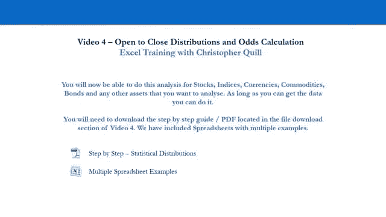
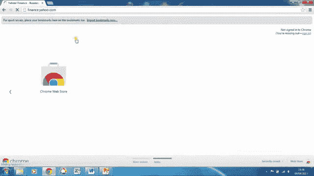
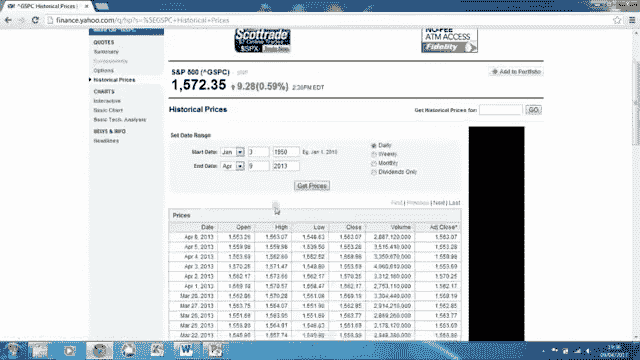

# 【高盛专业交易课】从0教你如何做交易 （中英学习全集） - P4：4-4.第4讲 分布和赔率计算 - web3深度学习 - BV1be4y1c7ir

好的，所以现在我们要去找克里斯托弗·奎尔，克里斯现在会在电脑上向你展示如何计算你的分布，最初是500便士，但您可以将其用于任何资产，所以把它拿走，克里斯。

所以在这个例子中，我们将研究S和P的日内交易策略，在大约五十年的时间里，通过计算这些每日回报，我们应该很好地了解S和P是如何，500基础资产每天的行为，所以我们将从雅虎财经开始，获取数据，所以说。

然后在自动售票机框中，我们键入S和P，并选择第一个，呃，下拉项目S和P 500，这给了我们一个S和P 500的总结页面，根据雅虎财务，该资产的最后可用价格，但我们要看看左手边的历史价格。

并通过编辑顶部给出的输入来更新历史价格表，所以我们在寻找1月3日之间的数据，一九六二年十一月九日，每日频率20012，所以一旦我们设置了参数，我们通过单击获取价格来更新表格，我们滚动到页面底部并单击。

在此阶段下载电子表格，您可以选择将电子表格保存到硬盘驱动器，或者就像我们要做的那样，你可以直接打开电子表格，一旦打开就保存它。

打开电子表格，我们只是要去文件保存，因为我们将把它保存为标普500返回分配，我们将其保存为Excel工作簿，我会把它保存在我的桌面上，所以很容易找到，所以我们要做的第一件事是调整这个日期列。

这样我们就可以看到日期了，所以我们只需点击列交集，然后用这样的列通过点击和拖动来调整它，这是S和P的所有价格数据，500来自我们所选择的时期的每日价格数据，所以在我们的例子中。

我们只使用开盘价和收盘价来计算每日收益，所以让我们继续，通过在H栏上标题来做到这一点，在单元格H 1中返回，然后在H 2中返回，键入我们的返回公式，也就是，当日收盘价，减去当日开盘价，除以开盘价。

以当天的百分比回报计算，然后我们要应用公式，我们只是嗯，放入整个返回列的H 2单元格，所以一个快速的方法，即单击从A列到G列的数据中的任何位置，所以呃所以卖两个，比如说。

并按Control和向下快速导航到电子表格的底部，然后找到最后一个，H列中的单元格，所以是H12000，八百零四，然后我们按Ctrl，向上移动以快速选择我们要将公式实现到的所有返回单元格，然后用选中的。

我们只要按Ctrl键，d将该公式从单元格H 2向下复制到列的其余部分，所以现在我们得到了回报，我们希望能够分析它们，并用分布来解释它们，所以我的意思是，我们希望能够了解每天有多少回报，s和p。

每天500个退货在我们设定的特定范围内，我们将通过在数据中创建间隔来设置这些范围，所以在j列单元格j中，用，然后呢，我们要做的是想出一套合理的间隔，每天交易500英镑的S和P。

所以我们感兴趣的范围的下限可能是负2%，比如说，因为我们只看每日数据，所以看任何两个更宽范围的东西都是毫无意义的，因为它不会真正向我们显示数据集的核心，所以我们从-2%开始，所以减去零点，零二。

我们进入J号牢房，然后我们将以0。5%的增量上升，所以在下一个单元格j 3中，我们键入零点减去零点，减去零点，并且快速地利用我们设置的这个间隔，并将其复制到正2%的上限。

我们选择这两个细胞j 2和j 3，然后点击，选择所选内容右下角的小黑框，把它拖下来卖十块，这就给了我们加零点，零二，加百分之二，好的，所以我们将使用这些间隔来创建一个表，分配表a。

看看我们每天在这些间隔内着陆的频率有多少，好的，所以要做到这一点，我们得去丝带上的数据，右手边的数据分析，如果你在这一点上没有这个，有一个，在附带的PDF中有一个如何获得此数据分析选项的指南。

您可以通过在Excel中安装一个名为分析工具包的外接程序来实现这一点，所以继续点击数据分析，我们想创建一个直方图数据，这基本上是一个频率表，然后按OK，我们要创建这个桌子，从我们的返回数据。

所以我们在输入范围内选择，H 2单元，按Ctrl键，快速移动和向下移动，选择整个返回列，bin范围只是我们想要定义范围的间隔，因此，我们有兴趣解释我们的回报。

所以我们的bin范围只是我们在j列中创建的间隔，从J到控制向下移动，选择到j十，现在，我们希望在此电子表格中显示此直方图数据，我们正在工作的工作表而不是新的工作表，因此在输出选项中，我们选择输出范围。

你可以看到这把你扔回输入范围框，我们已经用我们的退货数据填写了，所以我们需要小心地把它点击到输出范围内，并在电子表格中选择位置，我们希望这个频率表为B，我们将使用2号单元格，好的。

所以我们点击l 2并按确定，这给了我们一个直方图的表格格式，所以基本上是一个频率表，这本质上意味着如果我们把第一排，比如说，在这个表格中，这意味着二百八十五天，S和P 500，收益率小于或等于负2%。

下一排，三百四十五天，收益率在负2%到负1%之间，百分之五，好的，这就是桌子的工作原理，如果你走到底部，最终你会有三百零七天的谎言大于，所以有用的是如果我们，可视化地解释了这些数据。

所以我们从这些数据中创建一个图表，所以要做到这一点，我们只要把数据挑出来，单击并拖动到M12以选择该数据，然后转到功能区列上插入，前两个D柱形图选项单击，这给了我们数据的直方图，好的，所以目前。

我们可以看到，很明显，我们分配的更多回报接近于零，好的，这就是我们目前能知道的，更不用说它的尾巴了，它看起来像一个钟形曲线，有点像一口井，很像目前的正态分布，在哪里，你在尾部的回报频率比在中心的少得多。

好的，所以我们应该整理一下这个图，让它更容易解释，我要把电子表格放大，很容易做到这一点，你可以控制住，然后使用鼠标滚轮放大和缩小电子表格，我们要用一些更合适的标签来代替这个水平的x轴。

所以我们可以理解我们的频率所在的范围，我们的数据频率位于，所以要做到这一点，让我们在列n中创建一个范围列，所以N 2将键入范围，数到三，我们将键入应用于此bin值的适当范围，以此类推。

我们将在所有这些细胞中这样做，在我们这样做之前，从N 3到N 12，虽然，因为我们要输入这篇文章，我们要格式化这些单元格，所以他们知道这些单元格将显示为文本或理解为文本，所以我们选择这些单元格。

在选定内容中单击并单击格式单元格，然后我们想把类别更改为，然后按压，好的，好的，所以我们从第一排开始，然后下一个范围是负2%到负一点，5%以此类推，只是使用呃bin值作为参考，有点乏味，但它是。

这是一件好事，因此，您实际上可以通过定义的正确范围以图形方式理解数据，在最后一个牢房里，我们将键入大于2%的内容，好的，让我们调整这个列宽列n，所以它可以包括所有的文本，它不会重叠成另一列，好的。

所以说，现在我们要将横轴标签更改为我们在这里创建的范围，所以要做到这一点，我们点击图形，右键单击并选择数据，然后我们要更改水平类别轴标签编辑，所以我们点击编辑。

我们将其从当前选择的这些bin值更改为这些范围值，我们只需按OK和OK，你可以看到它更新了我们的直方图，现在我们可以理解这些条的真正含义了，就其适用的范围而言，好的。

所以接下来我们要做的是删除这个系列标签，所以我们只需点击第一季并按，删去，假设我们要向这个图添加一些访问标签，所以我们可以更好地理解它，所以要做到这一点，我们去功能区中的图表工具布局，然后是轴标题。

并将标记主水平轴，首先选择轴下面的标题，这给了我们轴标题作为标题，所以我们想选择那个，删除它，并更换为每日退货范围，点击关闭它，然后同样的事情到垂直轴标题，它是旋转的标题，选择它并删除。

我们将把它重新命名为频率，好的，这样我们的直方图就完成了，所以我们可以图形化地看到每天S和P回报的频率，在这些范围内，历史上，在我们考虑的这段时间里，好的，所以我们。

我已经讨论过这个分布是如何很像一个正常的钟形曲线的，但对于那些稍微熟悉正态分布的人来说，你可能会注意到这些栅栏不会很快消失，正态分布，基本上意味着尾巴稍微胖一点我们可以看到视觉上的意思，有更多的极值。

会发生什么，我们将在我们的数据中证明这一点，因为我们继续，但我们已经可以看到这不是一个正态分布，我们可以使用Excel为我们的数据集提供一些汇总统计信息，去做那件事，我们去数据，和数据分析。

然后我们将选择描述性统计并按OK，我们的输入范围是2号单元格的返回列，选择整个返回列，我们将回滚到电子表格的顶部，我们希望我们的输出范围在这个电子表格上，所以我们的描述性数据在这个工作表上。

因此我们将输出选项更改为输出范围，然后记住单击输入范围进入输出范围，我们将使用单元格T 2来显示描述性统计数据，我们可能需要确保我们在底部选择汇总统计数据，显示我们的描述性统计数据，然后按，好的。

所以这个会，这将加载一些，我们数据的一些汇总统计，所以它做到了，现在我们只需要调整列宽，所以我们可以看到这个数据，更容易地看到这些统计数据，好的，所以让我们来解释其中的一些，所以平均来说。

这只是S和P的平均每日回报，在我们所看到的历史时期有500个，好的，所以这是零点，百分之三，直觉上我们会知道这是积极的，因为我们知道标普500指数从1962年开始上涨，中位数是数据集的中间数。

如果我有一个百分之一的数据集，百分之二和百分之十，数据集的中间是百分之二，中间的数字，直觉上，通过看到中位数，中间的数字高于平均值，我们知道高于平均值的值比低于平均值的值多，所以低于平均值的一定更极端。

所以我们可以把这解释为，负值比正值更极端，好的，所以让我们继续，标准差是下一个，我们就，我们就可以，我们可以把这个解释为数据分散的度量，好的，所以在正态分布中，你可能知道大约有60个。

数据频率的8%在一个标准差内，均值的两边，所以在这种情况下，这将是一个，均值的两边，那不一定是真的，事实上，在我们的经验分布中，这是不正确的，我们将进一步了解，所以请记住，这是衡量。

接下来我们来看看峰度和偏度值，这些只是帮助我们理解数据是否正态分布的值，所以酮症值是A，是数据峰值的度量，尾巴与正态分布有什么不同，所以Excel显示方式的正态分布，峰度值将为零。

所以这个高酮症值基本上意味着我们的数据集，我们的经验数据集更加丰富，尾巴有较高或较胖的回报，好的，所以在我们的数据集中，胖胖的尾巴，偏斜值作为负数意味着，基本上我们的肥尾巴是负的肥尾巴。

比我们的正尾巴大，意味着极端消极的运动比极端积极的运动更有可能发生，好的，所以我们看的下一个值是范围，这只是我们数据中最高日回报率之间的差异，设置为最低每日回报，它被分成最大最小值，这是下两个单元格。

所以我们可以看到最低的日回报率是负20%，它是，和最大正回报，也就是百分之十，所以再一次，这支持了我们关于偏斜的想法，消极的极端比积极的极端更大，总和只是整个返回列的总和，有效地，除此之外没有别的意思。

当然不是你会产生的回报，如果你从1962年到1963年持有这项资产，向二千零一十二道歉，嗯，最后，计数是我们数据集中的交易日数，所以现在我们稍微解释了一下我们的描述性统计数据。

让我们显示数据中范围的频率，就概率而言，所以我们可以更容易地解释它们，好的，所以在O栏中，让我们用，我们把公式，对不起，你知道，三个，我们键入概率公式，也就是频率，在这个范围内的天数。

3除以总的交易日数，这是我们描述性统计中的计数，也就是你十六岁，这将给我们一个百分比，但是在我们把这个公式输入单元格之前，我们要按f4，这就把这些，围绕方程的分母，当我们的光标在分母上时。

因此它修复光标所在的单元格，当我选择，当我按F4的时候，就在这时，它固定了分母，这基本上可以让我们把公式拉下来，将公式复制到下面的单元格，它会适当地向下移动分子，但它不会改变这个细胞，分母，好的。

所以只要按，进入，然后再次选择该单元格并向下拖动此公式，虽然这仍然是选定的，如果我们对了，单击该选定内容并格式化单元格，以便它们的百分比显示为百分比，好的，这样我们就可以看到，比如说，那五点六。

我们的4%，嗯，我们每日返回值的数据在负一个点内，五到负一分，百分之一，好的，这样我们就可以这样解释所有这些概率，嗯，基本上对于第一个值，那就是两点，两个，我们3%的回报率低于负2%，所以小于。

或等于负2%，理解和解释这些概率的另一种方法，呃，更容易的是，如果我们以累积百分比显示它们，这将使我们能够分析数据的部分，所以如果我们头列P，所以P列，P2细胞，我们把一个累积的，适当调整列宽。

这一次在第一个细胞P3，我们只需要输入等于O 3，在单元格p4中，我们键入等于p3，然后我们可以把这个公式复制到P4单元，这将给出我们的累积概率分布，好的，当我们可以解释这一点时，这意味着什么，呃。

比我们正常的概率列好一点，因为我们可以开始说，嗯，十，十点五，百分之六的数据是假的，嗯，回报率不到负1%，好的，所以百分之十点五的时间，标普500指数的回报率不到负1%，你可以把它翻过来说90%的时间。

标准普尔500的回报率大于负百分之一，所以你可以按照你喜欢的方式解释这些并操纵它，你喜欢什么，现在让我们继续整理一下电子表格，嗯，如果我们整理一下我们刚才看到的这些值，会在这些单元格周围创建边框。

所以如果我们选择，那么l 2向下到p 12，然后转到功能区上的主页选项卡，并且仍然选择此范围，去边境，下拉并选择将在这些单元格周围提供边框的所有边框，我们将把图形移到右手边，只需缩小电子表格。

在我们继续之前，将图形移到右手边，所以我们的电子表格看起来更好一点，好的，所以我们基本上已经完成了，考虑一些基本的统计数据，并对我们的分销工作有了基本的了解，嗯，使用到目前为止给我们的优秀工具。

但我们能做的是进一步操纵这些数据，以获得一个真实的，深入了解正在发生的事情，我们将通过过滤器来做到这一点，筛选返回列，然后分析数据的子集，所以在我们继续，让我们在电子表格的顶部添加三行，创造更多的空间。

所以我们只需点击左手边的第一行，和权利，单击单击插入，一个，我们能做的是一旦我们过滤了这些返回，我们来看看子集的平均值，所以首先，让我们将筛选器添加到返回列中，好的，所以我们点击H4单元，回报。

返回列的顶部并转到数据，功能区上的数据选项卡并选择筛选器，这将下拉箭头应用于这里的所有列，a至h，它允许我们根据这些日期筛选和排序所有这些列，高开，低回报，不管这些，例如。

我们可以把所有这些数据从最新的改为最古老的，就日期而言，两个最老的到最新的，所以是十个，日期现在颠倒了，所以现在我们得到了回报，关闭，开放的，1962年的所有数据，好的。

所以我们就去撤销它把它变回最新的到最老的，所以现在我们知道我们可以过滤我们的回报，我们首先要做的是计算出收益子集的平均值，所以要做到这一点，我们需要创建一个细胞，当它被过滤和排序时，这个返回列的平均值。

我们做了我们想做的一切，所以在牢房里，并调整列宽，在L2中，我们键入公式来计算子集的平均回报，它是括号的小计，一个表示平均逗号，作为返回列的参考值，现在是H5降到H12807，好的，这给了我们一二。

我们整个未过滤数据集的平均回报，你会注意到这显然和我们的意思是一样的，作为一个数据集是平均值和同一事物的平均值，由于四舍五入，显示略有不同，但它们是相同的值，但是当我们更改返回列时，会发生什么。

这个平均回报会在这里改变，但意思是，描述性统计数字，这些都是从我们的总数据集中固定的，所以这些不会改变，好的，所以可能有用的是如果我们明白，我们的数据集，所以要做到这一点，我们筛选返回列。

所以我们点击这里的这个过滤器，过滤器数，我们要做的是过滤它们，我们把零粒，这只会给我们正回报，好的，所以在我们继续之前，这是未经过滤的，其实，让我们只命名M细胞1有平均正回报的停顿，和m为负平均负回报。

好的，正如你所注意到的，当我过滤这些回报时，它实际上隐藏了一大堆行，因为它去掉了所有的零和负返回值，所以说，比如说，我们从第五排到第八排，它影响了我们电子表格的其余部分，但是别担心，当你清除清除。

将恢复正常的筛选器和返回列，你还会注意到细胞中的平均回报，l 2变成了所有正回报的平均回报，所以我们能做的是，因为这一直在改变我们的平均回报，无论我们展示什么，我们过滤的任何东西都会复制这个。

单击单元格副本，我们把它粘贴成一个，将平均正回报表示为一个值，它是固定的，所以它不会改变，对于负的，我们也可以这样做，所以我们转到返回列中的数字筛选器，现在我们又得到了L2的平均负回报，我们要复制那个。

我们要把它作为一个值粘贴到第二个单元格中，好的，所以我们现在能做的是计算S和P，五百已经上上下下了，并计算出，占我们数据集中总天数的百分比，在我们继续之前，我们需要创造一个细胞。

它可以做类似于平均回报的事情，但只是为了计数，所以它只是计数，实际上在我们继续之前，我们将取消筛选这个返回列，好的，然后在T细胞中，我们要做的是创建一个名为count的单元格，然后在U中。

我们将键入用于键入返回子集计数的公式，所以这将是小计，和之前差不多，与平均回报相似，括号为两个，这次是为了计数，你可以从这里的下拉菜单中看到，然后用逗号表示参考数字，哪些是返回列。

所以这是H5控件向下移动以选择整个返回列，把括号合上，好的，这就为我们的数据子集创建了计数，对于我们未经过滤的数据，因为我们事先把过滤器取下来了，我们可以验证这一点，因为它与我们的描述性统计数据相同。

在这里倒数，当我们改变过滤器时，这将会改变，所以让我们在电子表格的顶部添加另一列，变成第一页，然后我们要做的是计算出S，P500是正的，我们的数据集，所以让我们再次过滤返回到大于零的正数过滤器，好的。

这改为数到七，六千，七百零七，所以我们放了六百七百，您可以复制和粘贴这些值，就像我以前做的那样，或者直接打出来，因为这次很容易，负片也一样，所以比这次少，小于零，好的，这是六千六天，所以很明显。

这将会错过几天，因为会有零点的日子，所以让我们也数一数，所以在单元格N4中加零作为值，并通过过滤返回列返回列来计算出返回列的频率，呃，等于零，好的，我们数到了九十，所以我们把90个放在牢房里，哦四。

好的，因此从返回中清除筛选器，以百分比计算出正数的百分比，负和零，所以对于P2中的正数，我们键入等于O 2，除以，这是我们数据集中的阳性天数，除以总天数，我们定下来卖给你二十个。

这样我们就可以把这个公式再抄下来，你可以把这个抄下来，这个仍然被选中，我们会好的，在选择格式单元格中单击，并将该百分比更改为小数点后两位的百分比，好的，所以我们现在可以看到我们一天中52%的时间。

S和P 500已经产生了正回报，四十六点，九负和接近或接近一，它是，所以我们现在能做的就是，我们要算出平均回报率，如果你预测，当标普500上涨时，你在那些日子里走得很远。

你计算出你在整个期间得到的平均每日回报，好的，所以如果我们输入平均回报，然后在Q2单元格中我们键入equals，我们可以把它复制到底片上，所以这个，呃，所以我们得到了平均负回报和平均正回报，你应该。

所以我会解释一点，所以细胞，这个单元格Q二，这是指你将获得的平均每日正回报，如果你预测标普500指数上涨的所有日子，你投资了那些，在这整个期间的所有其他日子里，你每天的平均回报是这个，负数也是一样的。

好的，所以让我们改变这两个百分比值，现在说So n到n三，选择它们正确设置单元格格式，在选择格式单元格中单击，将百分比更改为小数点后的位数，这里的平均回报也是一样的，所以这告诉我们这些平均回报。

所以即使你预测了负面的，积极的一面，只在那些日子里投资，其余的时间都平淡无奇，或者剩下的时间不要投资，你工作的利润率仍然很小，好吧，因为我们每天都在交易，这些是我们每天得到的平均回报，如果我们。

即使我们预测对了，他们会被交易成本之类的东西抹去，他们是，他们不是，几乎不值得每天交易，当你有了这个，当你有正常的波动性时，好的，这就是这些值告诉我们的，我们要在这个电子表格上执行的最后程序。

就是找出有多少个交易日在平均值的不同标准差内，在我们的数据集中，好的，所以说，我们需要做的其实是，首先，我们将在电子表格上清理一些空间，所以如果我们在电子表格中再添加两列，我们要做的是计算标准差返回。

1的值，上下两个和三个标准差，平均值，好的，所以在第二牢房，一二和三在x二，y 2和z 2，分别是，上面代表一个标准差，高于平均值的一个、两个和三个标准差，然后再低一排，低于平均值1-2和3个标准差。

所以那是在W3号牢房，卖W4号牢房，他们说，计算出这些值，这些返回值，我们在三号牢房做什么，我们将键入等于平均值，所以我们总是从平均值开始，然后对于高于平均值的一个标准差，因为我们在上限。

我们只要加上一次标准差，好的，对于下界，我们从平均值开始，减去一个标准差，好的进来，在下一篇专栏文章中，我们将把这个方法应用于两个标准差，所以我们从平均值开始，我们加上两倍的标准差，对于下界。

我们从平均值开始，我们减去标准差的两倍，和同样的，最后一列等于平均值加三倍标准差，平均值减去三倍标准差，好的，所以现在我们得到了代表一个的返回值，两个，和高于和低于平均值的三个标准差。

现在我们将这些保持为小数，嗯，我们需要把它们输入到我们的返回过滤器中，对不起，这里有返回过滤器，呃，一分钟后，所以我们要找出收益回报之间有多少个交易日，在这些值之间，好的，所以我们就。

我们将找出在我们的经验分布中有多少个交易日，大约是正负百分之一，也就是一个标准差，然后我们对两个标准差也这样做，和三个标准差，我们将把它与正态分布的天数进行比较，会给我们这些标准差，好的。

所以在一个B2细胞中，我们再打一次标准差，这一次一二三沿着柱子下去，然后我们输入实际，所以这将是我们经验分布中实际天数的列，在这些界限之间有一个，两个和三个标准差，好的，我们将把它与正态分布进行比较。

然后我们将比较这些值的百分比，好的，所以这是一个C3是实际的，a d 3正常a e 3实际百分数a f 3正常百分数，所以让我们过滤我们的返回列，我要把电子表格放大一点。

在标准差返回值之间筛选我们的返回列，因此，如果我们单击返回列上的筛选器，我们去中间，我们希望给出大于或等于，我们一个标准差的下限，这就是这里的值，这样我们就可以输入负零，零点九七二并且小于我们的上界。

这不是一点零三一按好的填充到那个，我们看到我们有一万零六十二天在这些值范围内，所以我们只要把它输入到C3细胞，一万零六十二，好的，我们也这样做，对于两个标准差，所以过滤，在这段时间里。

我们使用这些上界和下界，所以下面，对不起，大于零点，零一九，七，四，小于零点，零二，零三，两个，过滤器，那就是一万二千二百零八，你可以看到在牢房里你们五个，这是随着我们的回报子集而变化的计数。

说一万二千二百零八，对于三个标准差，我们也这样做，负零点，零，两个，九，七，五，和，零点，零，三个，零，三个，三个，一万二千，六百三十六，所以我们把它放在这里，好的，让我们现在进行正态分布。

我们将从我们所知道的正态分布开始，我们知道百分比，频率的百分比，应该在一到两个交易日之间的百分比，与平均值的一个标准差，二和三，好的，所以在正常的情况下，分配，六十，八点，百分之二，六十八点。

两个百分点和交易日将在一个标准差内的平均值，九十五分，4%的交易日将位于平均值的两个标准差内，就他们的回报而言，在平均九十九点的三个标准差内，8%的交易日将发生，好的，所以让我们填写正常的。

给出我们总数的实际天数，在我们的数据集中有12803天，我们可以计算出正常的天数，这是由正态分布预测的天数，该分布将位于，两个和三个标准差，所以这只是在83会打字，等于在一个标准差内的百分比乘以计数。

我们将把计数单元按F4固定在你22周围，然后我们可以把这个涂下来，我们可以看到我们有12000个，七百七十七天，正态分布预测的将位于平均值的三个标准差内，好的，给定一个一万二千八百零三天的数据集。

所以让我们把这些实际的日子也转换成现在，所以这是每个摊位的实际天数，在平均值除以计数的每个标准差内，好的，所以C3除以计数，将再次修复此单元格作为引用，这样我们就可以把它抄下来，把这个抄下来。

如果仍然选中，将格式化这些单元格，以百分比显示它们，在我们解释这些最后的结果之前先想一想，让我们选择单元格x3到z4，并将所有这些标准差改为，让我们先做这些，所以我们的标准差。

与平均值的一个标准差大致表示百分之一的上限，和负1%的下限，好的，这意味着两个标准差大致是，大约是这个数字的两倍和三倍，所以根据标准差值在直方图上的位置，我们看到的上限是百分之一，和负1%的下限。

所以我们从这个酒吧看，所以这里的条是一个标准差，好的，在我们的经验分布中，它几乎占了我们数据的80%，而在正态分布中，它大约是六十八，降低10%，这意味着i经验分布，还有更多的交易日更接近均值，好的。

也接近于零，我们应该指出它接近于零，所以这意味着我们的分布更加峰值，这是由我们前面讨论过的酮症值预测的，它比正态分布更有峰值，当我们走得更远时，我们观察更深的标准差，进入分布的尾部，我们可以看到。

我们的经验分布比正态分布占更多的比例，当我们得到三个标准差时，它开始减少，我们的经验分布占98。7，而正态分布占百分之一，当你走得越来越远，这种差异会更加显著，所以基本上我们要说的是。

我们的经验资产分布往往有更胖的尾巴，比正常预测的更极端的运动，那么这一切意味着什么，好的，所以两个关键的事情，第一件事，事实上，80%的时间S和P几乎不移动，使产生回报变得更加困难，好的。

尤其是当你考虑交易成本时，这意味着当我们看到每日交易时，我们的机会很小，尤其是在波动性较低的时候，好的，这就是这些平均回报所给出的，我们在这里也看到了，第二件事只是要意识到的事情，通过分析回报的分布。

我们可以理解尾巴有更大的风险，在分布的末端，所以他们实际上比你想象的更有可能，好的，所以这意味着可能会有几天，当你被抹去你账户的位置时，大约一百天一次，我们有一个相当大的变动，超过3%，这可能是。

如果你在错误的方向上找到了位置，可能会把你消灭掉，好的，所以它们是两个主要的东西，所以关键是，我们需要理解的关键是这些，这基本上意味着，当波动性较低时，机会很小，另一件事只是留在你的脑海里。

风险比正态分布预测的要大，和，我们还应该指出，这可以这个电子表格，您可以在任何期间将此方法应用于任何资产，任何频率，所以一个星期，比如每周，每月。

