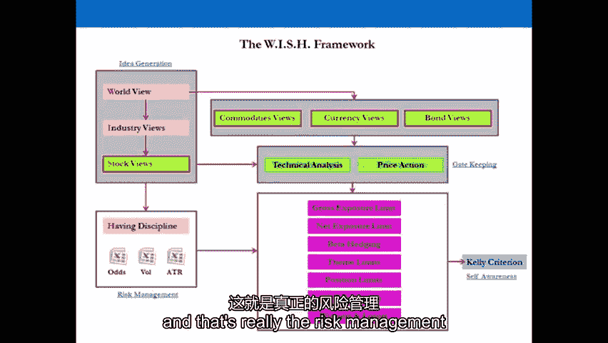
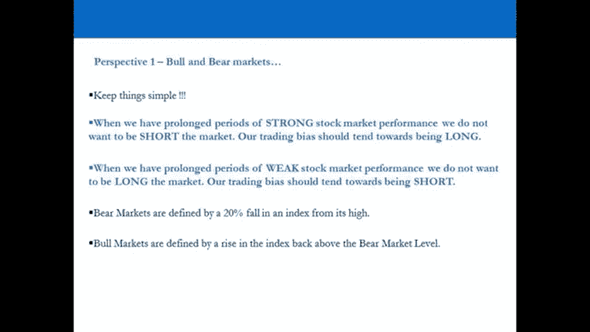
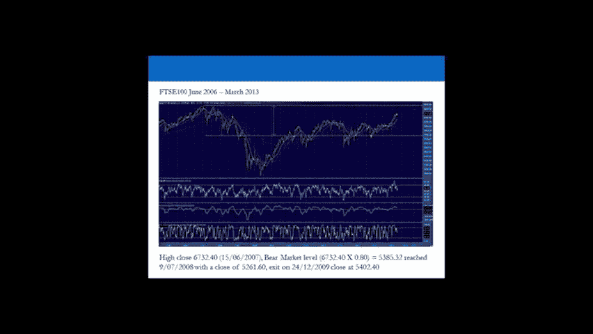
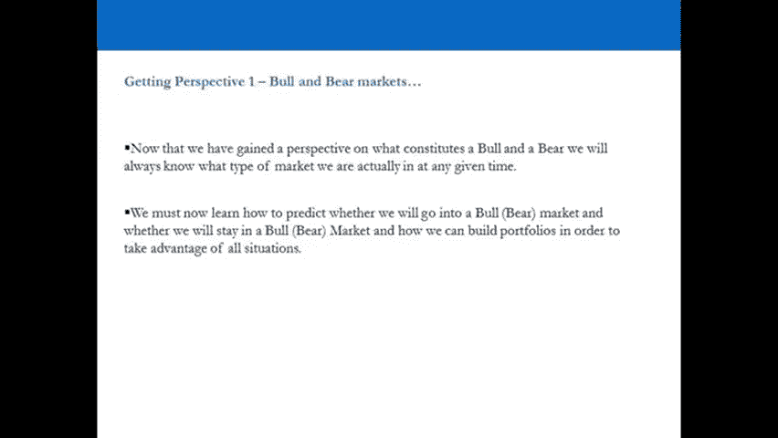
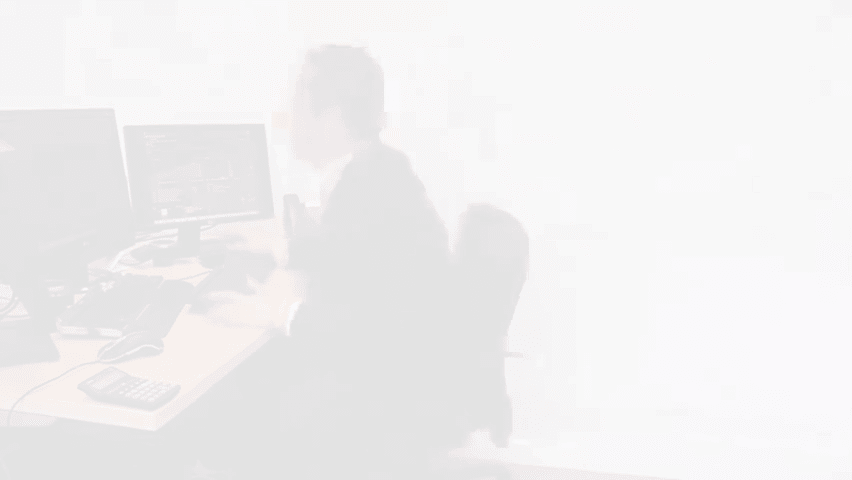

# 【高盛专业交易课】从0教你如何做交易 （中英学习全集） - P8：8-8.第8讲 愿望框架 获得洞察力 - web3深度学习 - BV1be4y1c7ir

嗨，欢迎回来，欢迎收看第八期视频，他在前七个视频中幸存了下来，在整个过程中，到目前为止我们所做的，我们实际上取得的成就是，我们采取了真正定义散户交易者为什么，现在绝大多数散户都是赔钱的，通过这样做。

我们实际上已经学会了我们的原则，什么不做的原则，专业交易员在接近金融市场时实际做什么的方法原则，这是非常重要的，我鼓励你努力尝试硬代码，你头脑中的这些原则，我鼓励你继续回去看那些视频。

以确保你完全理解这些原则，现在，我们实际上要做的是，我们将开始建立我们在专业贸易世界中所说的，系统的资产选择过程，现在，系统的资产选择过程在行业内非常非常重要，当我们在这个系列中看到我们的目标时。

为你们提供一个框架，零售培训师，使您能够效仿成功的专业交易员，正如我们和对冲基金经理讨论过的那样，你的目标非常一致，现在，你将在这里看到的是对研究所愿望框架的介绍，愿望框架实际上是一个模板。

系统资产选择过程的模板，这个模板这种方法被大多数，绝大多数对冲基金经理，成功的对冲基金经理，当你看这个视频的时候，你会意识到，为什么系统的资产选择过程如此重要，我们要做的第一件事是。

实际上定义了什么是系统的资产选择过程，然后在同一个视频中，我们实际上要迈出第一步，也就是定义我们所处的市场类型，不管我们是在牛市还是熊市，这很重要，因为如果你了解你经营的环境。

那么你就对更大的趋势有了更清楚的了解，但这也很重要，因为牛市及其市场经常被错误地定义，被主流媒体曲解，专业交易界对牛市和熊市有不同的定义，一旦我们定义了系统的资产选择过程，并定义了我们在哪个市场。

然后我们将进入框架的第一阶段，也就是想法的产生和想法的产生是你工作的绝大部分，这将带我们一路走到视频20，然后我们继续守门，在守门之后，我们进入风险管理，然后我们转向作为教练的自我意识。

这是任何系统资产选择过程的四个阶段，在专业贸易界具有诚信，这个过程可以被任何人用作模板，所以这四个阶段是创意产生，守门，风险管理和自我意识，请注意幻灯片我们展示了整个过程，把这张幻灯片记在脑子里。

真正记住它，因为这真的是专业交易者的模板，所以我们要做的第一件事，定义系统的资产选择过程，定义我们在哪个市场经营，一旦我们这样做了，我们将继续实际建立创意生成，然后为视频系列的其余部分构建整个过程。

好的，让我们来看演示文稿，我会在视频的最后看到你，有一个完整的总结，所以现在，我们要开始一个过程，在那里我们将试图操纵这些赔率对我们有利，如果我们能做到这一点，那我们就是簿记员，我们是庄家。

你会发现大多数专业交易员，船舶VE对冲基金经理的支持功能，他们将有系统的过程，他们经历，创造一个胜算对他们有利的局面，在大多数情况下，那么我们首先要做的，真的，你必须了解市场的历史行为。

就像我们来自哪里一样，了解我们目前在处理什么，所以你可以对未来做出预测，所以首先我们要做的是定义什么是系统的过程，然后获得视角，然后我们进入下一个阶段，它实际上是在系统上构建所有的过程，如此粗鲁。

什么是系统的过程，通过一系列的过程来寻找合适的，成功概率高的良好投资交易，这是一个想法产生的过程，我们称之为守门，风险管理，和自我意识，在所有的资产优势中，所以它是，这是不分青红皂白的，我们实际上要在。

所以在股票中，货币，商品和炸弹，全球可用仪器4万台，在这四万个机会中，哪些会给我们最大的成功概率亲和力，所以自上而下的方法，我们从世界的顶级开始，我们向下努力。

一种自下而上的方法是从四万个资产中挑选一个，我只是在做一个资产的工作，特定资产的基本分析，多样化的方法是两者的混合，所以你试图从两个学科中吸取最好的东西。

所以这个，我所说的愿望框架，本质上是一种利用，从每个领域来看什么是最好的，并给我们最大的成功概率将它们结合在一起，所以我们尽可能地增加胜算，对我们有利的尝试赚钱，它能适应任何情况。

你会发现它将作为一个过程来工作，可能在你的一生中，现在不好玩了，它不是有限的，就像你在接下来的一天半里看到的一切一样，除此之外，你不必再做任何工作了，就过程而言，你可以走开，把东西添加到过程中。

但是在正确的水平上添加东西到过程中，所以以后不要偏离这个过程，以健壮的方式做事，这里重要的是过程，这就是它看起来的样子，所以左上角我们有创意生成，我们要做的第一件事就是了解世界。

我们的世界观决定了偏见的定位，股票，但在指数水平上，如果我们把注意力集中在股票市场上，我们必须自上而下地工作，然后我们转向股票市场中的行业，然后我们会转向这些行业中的股票，我要交叉股票，商品。

货币和债券，然后我们把这个情况叠加，通过技术分析，价格行动指标，让我们对坏主意关上大门，并对好的想法持开放态度，就像在，我们正试图正确地安排我们的想法，那么当你真正投入资本的时候，这些立场变得真实。

它们成为你投资组合的一部分，一旦它们进入你的投资组合，您可以使用各种风险管理参数和工具，以确保您的缺点得到保护，所以当坏事发生时，你不会爆炸，你活着是为了改天战斗，你回来，你变得更强壮。

所以当你有真正的位置，你可以有总暴露限制，股票市场净风险敞口限额，对冲测试版，单位置限制，停止目标比率，以及你如何处理赢家和输家，你经历了什么过程，这真的是风险管理受到了纪律约束。

所以确保当你有真正的位置时，你有纪律一直做正确的事情，然后你要么成为一个好的交易者，要么成为一个坏的交易者，你的统计数据会告诉你你是好是坏，3。最重要的统计数字是你赚了还是赔了。

但是你可以把它和其他统计数据叠加在一起，找出你作为交易者的行为，你可以有自我意识，我将向你们展示一个很多对冲基金经理使用的工具，决定是否将资金分配给另一辆拖车上的教练，这很重要。

仅仅因为你没有老板告诉你该做什么，那么为什么专业人士使用系统的过程，是因为他们有外部投资者，如果你做了，如果他们不依赖系统的过程，他们不会出去，投资者实际上以20英镑的价格向某人推销。

500万美元的资本把你的对冲基金，你走上前去，你在一页上说，这就是我所做的，我每天为你买卖一美元，我试着提出十点，你不会得到2500万美元，给你钱的人的目的，首先，人们有不同的目标。

但大多数时候是为了保护那笔钱，绝对值，它的价值，防止通货膨胀，并暴露在涨跌的市场中，所以它们可以在所有情况下被对冲，那是，这是第一个目标，所以他们不想看到有人到处撑船，他们希望看到一个有稳定记录的人。

谁长谁短，谁在低波动性下获得体面的回报，这就是为什么，这是投资者希望从对冲基金经理那里看到的，那么为什么要使用这些系统的过程呢，这是因为很明显，为了保护这些钱，为了赚钱，也是为了筹钱。

他们永远无法筹到钱，如果他们不向人们展示他们的投资过程，他们如何做出决定，所以技术指标，只是你知道，几个指标对这些人来说不够好，他们显然对我们来说不够好，但即使作为零售教练。

我们必须对大多数对冲基金采取同样的方法，这个过程和你今天要学的很相似，我们让两个人投资对冲基金，呃十一月，一个人在二月玩，嗯，这些人是研究所的交易员，就像通过我们交易一样。

我看到他们所有的位置并帮助他们，我们试了大约一年，当他们在对冲基金面试时，他们有一个初学者面试，他们没有真正得到任何关于对冲基金的信息，如果大家喜欢的话，然后他们回到第二次面试。

他们得到了对冲基金的投资过程，十一月去的两个人，他们在十月份接受了采访，当他们看到这个特定对冲基金的投资过程时，他们可能在上面，就在电话里说这基本上是你的框架，什么，如果他们真的很相似，很多过程都非常。

非常相似，从创意生成开始，自上而下或自下而上的方法，两者在股票市场上的结合以货币为主，商品和债券，所以你经历了一堆过程，吐出想法，所以它就像一台吐出想法的机器，然后呢，你得决定现在是不是投资的好时机。

对那个想法，所以你覆盖了一个筛选过程，筛选过程是阻止自己做蠢事的重要指标，作为一个交易者，世界上最糟糕的事情就是进入一个位置，你说的对，但你被阻止了。

所以你为产生这个想法所做的所有工作都证明了你是正确的，但你实际上是赔钱的，这比你错了就赔钱更糟糕，因为至少当你赔钱的时候，当你错了，你错了，有道理，这就是为什么你有筛选程序来阻止自己，做傻事。

所以想出好主意，我需要买一只股票，那是个好主意，但你去买它在顶部，呃，给我百分之十，然后它就涨了百分之百，这太疯狂了，这就是为什么你必须有一个筛选过程，当头寸变成真实头寸并处于危险之中时的风险管理。

确保你的缺点得到完全保护，和自我意识，交易者指标，以知道你什么时候应该部署更多的资本给自己，或者从自己身上拿走几个，我对自己也很诚实，因为数字不喜欢，所以那是，所以这是一个系统的过程，基本上。

世界上有成千上万的对冲基金声称拥有，所有的钥匙，所以所有这些在投资中都是惊人的，但本质上，它们都符合这一想法，一代，守门，风险管理，和自我意识，所以现在我们知道什么是系统的过程了，我们可以开始建造一个。

但首先，让我们透视一下，我们即将进入市场，所以我们要了解市场，以另一种方式，到我们已经看到的，如此具有历史意义，失业波动性，我们必须了解它是从哪里来的，它今天在哪里，它可能会去哪里，这一切意味着什么。

他们的问题你应该一直问自己，每天，这个市场从何而来？今天在哪里，它要去哪里，都在哪里，我们训练你的头脑进入这个过程，那个想法，进程，你应该问问自己，一天十次，所以我们看历史股市表现，我是说，首先。

我们想基本上定义我们实际上在哪个市场，我们是在牛市还是在坏市，所以让我们问这个问题，现在，我们所处的市场，现在我们是在池中还是熊市，他们正处于牛市，但公平市场形式的实际定义是什么？好的，媒体中的定义。

所以当你拿起报纸或打开电视时，媒体对熊市的定义是一个指数下跌20%，从今年的高度，牛市是指一个指数上涨20%，从今年的低点，所以你拿今年的高点乘以8就过了那个水平，你在一个更好的市场，今年的低谷。

乘以一点二，如果到了那个程度，我们正处于牛市。

不幸的是，媒体的定义不是专业交易员对熊市形式的定义，所以忽略媒体，专业培训师对拉盘和熊市的定义，打电话给任何人，在城里华尔街的一个大养老基金，亚洲任何地方，打电话给任何对冲基金经理或问他们。

他们会告诉你球的真正定义，这是熊市，比上一个商业周期的高点下降了20%，牛市比一年上涨了不到20%，而是回升到上一个商业周期设定的熊市水平之上，这有道理吗，所以让我们看看我们现在在哪里。

十月九号五百美元，和七个，在上一个商业周期，顺便说一句，我们稍后会继续讨论商业周期的定义，我们看看美国的商业周期，七月九日，标普500指数收盘于1565点的高点，熊市水平乘以八点是多少，1252点一二。

它在7月9日通过了那个水平，哦八，所以差不多一年后，在十二点四十四点关门，六九，然后它在十二月二十一日退出，二千零一万，所以当市场真的真的很安静的时候，就在2010年圣诞节前，发生了什么事。

美国正式走出熊市，所以我们进入了一个完整的市场，2010年12月21日，所以当每个人都在买最后一周的圣诞礼物然后跑回家的时候，美国已经进入了一年，脚呢，一百，六月十五日四点。

七熊市水平五三八五现货二七月九日，哦八，2。你在哪儿见过那个日期？正好在同一天，所以美国和英国进入了熊市，由专业交易员在同一天定义，你觉得那是什么，七月的夜晚，我不知道你们什么时候庆祝圣诞节。

我说你想要，因为美国进入了一个更好的市场，所以每个人都卖掉了世界上的一切，就是这样，是什么并不重要，美国进入了一个糟糕的市场，只要设置好，但它离开了脚座，十二月二十四日退出，哦，不错嘛。

所以在S和P 500之前整整一年，你明天可能就会明白了，但我们现在就从它开始，我只想发表声明，你可以考虑一下。

指数的构成，S和P之间的差额，指数中的公司类型，如果我们用专业的交易定义，跟随商业周期来确定他们所有的市场，这对足部索引的构成有什么启示，相对于S和P 500指数的构成，参与并构成该指数的公司类型。

足部公司的构成，这些公司的收益对整体商业周期更敏感，比美国公司的组成，所以当商业周期转向时，先做什么，因为周期性先走，所以镜头是相对于P而编造的，当你比较时，500个敏感的收入是的。

标准普尔500是一个代表500家公司的更广泛的指数，相对于循环，防御性的百分比更高，7月16日开始抛售，哦七，熊市水平六四八四五五三月份达到，再早在脚上看对不起早在P，但后来在足部，你为什么认为那是。

事后看来，你可以把这一切合理化，所以一道菜很坦克，沉重，所以现在我们知道熊市的球是什么了，我们会知道，我们在任何时候都处于什么样的市场，是啊，是啊，如果你做了一件事，如果你在任何商业周期中做一件事。

如果你只是在指数突破市场水平时做空它们，还是打破足球市场水平，回到牛市，你买了它们，如果你这样做，你只会赚钱，因为随之而来的所有资金都将进出市场，基于它发生在每个商业周期。

但是我们如何预测我们将进入牛市，或者进入熊市，这样你就可以在它真正发生之前定位。

就是这样，它是一切的关键，如果你能知道六到十二个月后会发生什么，我们是进入熊市还是保持牛市，还是进入牛市，你会赚很多钱，如果你能在你的余生中做到这一点，你可以非常，非常富有，好的，所以欢迎回来。

当你看完演示文稿时，你会意识到我们看了几件事，我们首先考虑的是定义系统的资产选择过程，并向大家介绍愿望框架和愿望框架作为模板，现在确实是专业交易员的方法，我们在演示中提到的一件事是。

如果你想在我们正在进行的愿望框架中添加任何东西，你可以随意添加任何你想要的东西，但你必须确保当你做的时候，你加上什么，你是你想在愿望框架的正确区域添加的东西。

现在这个框架实际上是自上而下和自下而上方法的结合，覆盖技术分析和价格行动指标，作为培训师的谨慎风险管理和自我意识统计，我们要浏览所有的视频，直到20个视频，这实际上是工作的大部分，也就是创意生成。

然后我们要继续守门，然后我们有风险管理和自我意识统计数据，你在演示文稿上看到的这张地图，请记住，但请随意添加任何你想在任何阶段做的事情，如果你认为自己在技术分析方面非常有用，然后您可以添加您的技术分析。

技术分析阶段的ta指标，它在守门范围内，但请不要把它添加到想法生成中，这一切稍后会变得清晰，我们做的第一件事就是定义了系统的资产选择过程，并向您介绍愿望框架，我们在演讲中做的第二件事是定义牛市和熊市。

我们为什么要这么做，我们这样做只是为了获得视角，以及我们在任何一个时间点的位置的快照，所以现在在你生命中的任何时刻，现在您有了这些定义，你可以看看全球的市场，准确地定义你在哪个市场。

通过使用专业交易员对牛市和熊市的定义，而不是人口众多的媒体对完全市场和熊市的定义，所以现在我们已经定义了系统的资产选择过程，你已经看到了愿望框架的介绍，专业交易员模板。

我们已经定义了我们现在所处的市场类型，我们实际上可以继续前进，预测我们将来会进入什么样的市场，因为这就是专业培训的意义所在，它对主流媒体的报道没有反应，现在，它不会对我们现在所处的市场做出反应。

它真正是关于，预测我们未来将处于什么样的市场，建立你的想法，建立你的投资组合，你对未来的期望是什么，这将变得非常清楚，市场本身是一个折扣机制，和前瞻性指标。

因为所有的专业交易者都在用市场作为预测未来的代理，现在，如果你是一个零售交易员，他预测正在发生的事情，现在，你实际上所做的，为专业人士提供流动性他们预测了我们的未来，在这个阶段，在过去的某个时候。

你必须训练你的头脑去预测未来，这是专业交易员的方法，这就是我们现在要继续的，然后我们往下走，所以我们要做的第一件事就是想出，我们认为一年后市场会在哪里，一旦我们得到了，我们现在就可以各就各位了。

因为市场现在被用作代理，一年后的预期，好的，让我们进入第九个视频，真正开始定义想法产生的过程，从宏观层面开始，然后我们就可以往下走了，我们九号视频见，如果你想再看一遍任何一个视频。

回去把这些原则记在心里，你从视频1到视频7学到的，并试图得到系统资产选择过程的定义，以及你心目中专业交易员定义的牛市和熊市，确保这一切都是一成不变的，因为这些原则将作为我们前进的一个非常重要的基础。

