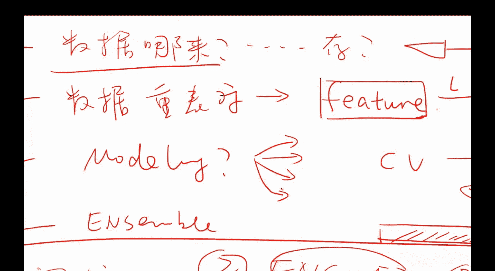
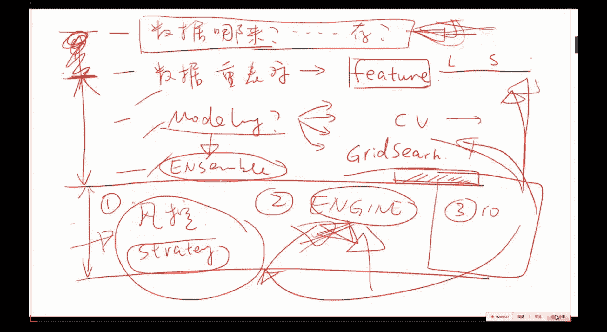

#  - P7：第07课_机器学习与量化交易项目班 - 大数据狂人 - BV1V24y1Y7eY

今天的在今天的课程咱们主要讲三件事，讲三件事，第一件事就是关于嗯，我们之前的这几次作业的一个点评啊，这是第一件事，第二件事呢是如果你的模型啊怎么做，你说方老师这个实在是机器学习不专业呀。

弄的这个模型很一般，怎么样呢，能够让你你有十个很烂的模型，怎么样呢，把这十个很烂的啊化腐朽为神奇啊，让这十个很烂的三个臭皮匠顶个诸葛亮啊，把它弄上去，这第二件事情，第三这件事情呢告诉大家啊。

当你会建模之后，量化交易往哪儿走，和我们未来这三次课我们要学的东西是什么，最后是啊，如果你还是如果卡在了数据处理这块，但是又很想做建模怎么办，就是说相当于给大家一点这个啊补救的，这个嗯措施啊。

大概啊争取两个小时把这些事情都搞定，ok啊那么我们现在正式开始，正式开始是这样，然后这个这个视频大家都看了吧，就是嗯我们上次讲这个遗传算法，讲这个讲这个遗传算法的时候。

我给大家展示的这么一个呃通过遗传算法，有两个比较有智能的这个人啊，啊机器啊，他们来学习怎么样的抢食啊，这个相信大家都看了啊，那么我觉得大家的这个作业呢读的时候，我就感觉啊看到大家这么努力的在做啊。

但是感觉就是觉得大家在很努力的，在想获得一个食物，但是姿势呢不是很好，这个是主要的一个想法，就这这让我觉得有点像这个图哈，那么但是呢也也有好的，也有非常好的，那么今天呢咱们说一下，基于这个嗯。

他那名字我就先不说了，基于这个比较比较啊，做得很好，这个同学我给大家以他的这个作业的方式，我跟大家说一下啊，我所期待的这个作业和怎么样的，基于嗯这个作业的结果，然后接着往下做，比如说这个沪深300。

这个咱们这个有一个作业，是关于这个沪深300股指的一个，预测和分类问题啊，那么我希望大家给我教的时候呢，就教这个，因为你那个ipad notebook你能够储存为啊，你能够储存为这个嗯html格式。

就说其实你不需要把这个，其实你是不需要把你具体函数的实现给我的，这个这个是你放到你自己的这个库里头的，或者说你任何的你这个项目里头的，你需要给我看的呢，是你做完这个模型建模的这个结果。

然后根据你建模的结果才能提出啊，一些有建设性的一些意见，而不是说比如说呃这呃冯老师这个程序啊，bug怎么办啊，这种问题呢我建议大家你在stack overflow啊。

或者任何的一些嗯呃python的一些文档中，这个是你们自己可以解决的，而我能够我能够帮助你的呢，是你做完这个东西之后，你把结果返回给我，然后我通过看你建模的这个逻辑，我来给你提出啊力所能及范围内的。

我来给你提出我的一些想法和建议，这个是嗯你很难通过啊，网络或者论坛的形式得到的，那么所以说我希望大家呢，就是说到时候交的时候呢，就教这个，你教一个嗯，就是运行，就是你通过啊。

通过这个ipad notebook运运行之后的，这么一个脚本就行，然后呢比如说啊每一个函数，你import的，你的这些各种各样的你自己的一些函数，比如这个同学他import的这是他自己的行。

这个函数的具体的实现，你不需要不需要交给我，除非你觉得哎这块啊觉得很比较比较得意，或者怎么样，或者说是希望提出些建议，这个时候你可以给我，因为这样的话，我能够以最大的效率来。

快速的给你个人来提出一些建议，那么比如说这个同学他做的就蛮好，他就是呃给的，我就是这么一个啊点html的这么一个文件，然后呢呃呃你能够写一下这个title。

你就是把它做成这个markdown的这个这个格式就行，大家自己查一下就行，那么拿到任何一个数据呢，我们要干的事情，第一件事情就是说先看看这数据整的对不对，就是说我们现在先要看一下。

这个数据是不是有问题啊，那么就是一些数据的在干任何事之前，先先先先先看看头啊对吧，就是说然后再再做一点简单的可视化的工作，让我们做模型的，就是为下一步的做模型嗯，相当于先做一个热身的工作啊。

这个同学他也做到了嗯，也就是说他先拿到了他的数据，然后差不多啊把这投石行啊划一下，就是通过这个啊pandas的这个data frame的这个head，这个这个函数，然后呢。

你就嗯你就可以把你的计算的这些指标的，这些函数全部给他给它进进行一个转化，然后画出来画出来之后呢，呃在建立这个啊训练集，跟这个啊预测集同时定义以后，你的x跟y，然后呢你就可以啊。

再做一些这个数据的一些清洗工作，比如说把空值啊什么的给它干掉，然后呢你就可以做我给你留的作业了，然后把这些做作业呢，就以这种方式啊进行一个呈现，比如说嗯选选了前20个这个特征，比较重要的特征。

然后把他的这个importance啊画出来，然后再去做这个啊啊，这个这个分类和回归的这个任务，比如说这个这个图，就是啊沪深300股指的预测图啊，蓝色是真实值，然后绿色是绿色纸。

所以说呃呃呃那么其实啊这个也是对的，就是说如果你呃就这么硬，做这个分类和回归任务的话啊，回归任务的效果会好一点，分类的任务，你看也基本上都是在50%出头，0。512。

但是呢就是说啊做完这个比还是举例子吧，比如这个同学呢，他就是抱歉这个同学他就是用了这么几个模型，一个是有线性回归，有lda kda啊，还有这个嗯sm还有这个随机森林，然后呢他就把这几个模型的这个结果。

就这confusion matrix啊进行了一个一个汇报，那么其实真正好玩的和真正你你真正要做这个，在平时做量化的过程中，大概你80%的时间，当你把前面这些工作都做好了之后呢。

你80%的时间是要在这个上面花时间的，而不是简单的写这么一个follow，然后print出来，然后说啊好或者不好啊，就完了，那么其实真正好玩的地方呢也都是在这儿啊，举举个简单的例子吧。

比如说这个分类任务哈，首先嗯嗯再看他这个以我我的这个数据为例吧，因为我我这个数据已经我都帮你提取好了，嗯对以这个为例啊，会说的更更有意义，一些就是呃咱们的最后最后一个作业。

我给你的那个啊这个我给你的这个数据集，就是我帮你把数据啊脏活累活我都给你干好了，然后一共是332维的啊这么一个向量，它要对应一个啊真实的这个y值，进行一个啊回归的这么一个任务。

那么呃刚开始你先把数据读进来，然后呢嗯这一步很重要，就是说嗯这个这个同学他也做了，就是说你要做任何的回归分分类任务，你最好先把这个啊这些你要回归的这些啊，结果你进行一个plot。

就是说比如说我们这里是一个啊回归任务，那我们就应该把这个y值你画出来看一下，那么你话说看一下，你立马你就能得到啊，其实这个y值他每一次的这个跳动是0。5，这是第一，第二的话呢。

他们的每一次的这个这个波动不会超过一啊，这是第二啊，然后呢最重要的一个是啊，如果是分类任务的话，一定要把每一类的这个histogram画出来，就说你一定要把比如说有，比如说这个分三类的任务。

涨跌或者不涨不跌，那么你要把这三类的这个嗯，就是它的这个这个count要画出来，这样的话呢，比如说大部分情况下，他都他都是不涨或者不跌的，那么这个就会嗯你就会立马意识到，ok，我现在的这个分类任务。

是一个类别不平衡的一个事情，大家明白吗，就是说嗯而类别不平衡的事情呢，是你需要用一些类别不平衡的一些手段，来做额外的处理的，举个例子，比如说我们在训练集中99%的啊，这个样本它都是一类。

另外1%的是另外一类，那么我们如果建立了一个预测的模型，我们全部预测为，就是我们闭着眼睛全部预测为啊一类的话，那么你也有99%的正确率，但是这是不是一件好事呢，这明显不是一件好事。

是因为你把那些1%的你全都不管了，你就说啊，ok那既然大家都是嗯嗯第一类，那我就全预测为第一类就完了，那么你你你你你就把最值钱的那1%的啊，所要预测的那一类的你就丢掉了，所以说当如果你拿到的这个数据集。

它是一个非常类别不平衡的一个问题的话，你一定要用类别不平衡的手段来做一些处理啊，这个是你就是说啊大家一定要避免的是啊，我闭着眼睛啊，拿一个这个svm，然后我这么废他一下啊，好很开，很开心，坏呢啊。

就不知道该怎么办了啊，然后又说机器学习没用啊，那么这个是这个是有问题的啊，字体大一些是吧啊，其实不需要看字，就是说呃，其实大家并不是太需要看到他在写什么啊，ok那么比如说这个同学在在我拿的这个。

我给大家这个数据集上，他就先做了这么一个啊可视化的这么一个工作，画完之后呢，画完之后呢，他就开始啊，他就开他就开始建立这个训练集啊，x和y就是把y那一列给拎出来，然后把x拿出来，然后呢做一个这个标准化。

然后再又做了一个回归测试，就是你先用这个线性回归，先看看怎么样做完之后呢，r方值是0。06啊，r方值这么低，大家心里一定别着急，其实在金融中你拿到的数据嗯，就是在其他的一些机器学习领域呢。

你的r方值在百分之啊，这就在0。9以上是很正常的嗯，但是在尤其是在机器学习和一些基因工程的一，些数据中，鸟要防值基本上都挺使啊，你要能到0。1就就相当不错了，所以说这个峰值这么低没关系。

然后另外这个啊一个是r方值的一个评价，另外一个你用m c，就是说这个mirare air也可以做一个啊，比较好的一个评价，然后这个同学呢他就嗯说啊，你看到这个线性回归，他是0。064。

然后他就又用了一个这个几个这个啊，曾进过的这个呃心性回归的问题，加了一些正则化，然后又用了一个随机森林，然后分别汇报了一下，那么其中有一个方法，比如这块就做的比较糙了，比如说这个随机森林。

如果你用默认的随机森林的函数的话，如果没记错的话，它只是十棵树，而你有300个300个维度，你用十棵树嗯，基本上你是不会嗯，你是不会得到什么有意义的一些结果的，所以甚至这个r方值会得负啊。

今天那个思考题，既然r峰值是一个从从，从这个从这个公式上来看，r方值应应该永远为正的，为什么我们在实践过程中r方值为负啊，这个问题啊很有意思，我希望大家回去查一下，也是一个很经典的问题啊。

网上你随随便找就就有很多解释给大家，嗯天啊，给大家剧透一下，造成二峰值有的时候会为负啊，当你为负的时候就就比较尴尬了啊，别人都考上，别人最低考零分，我怎么考了个负分呢，啊其实这个不是说这个公式坏了。

而是啊我先不说，大家先去看一下，然后呢他就又发现这几个事呢，比如说这个领回归啊，0。06481啊，0606481啊，比这个480高了那么一丁点，然后又呃然后他他就觉得哎大概领回归啊，应该是一个值得啊。

zoom in的就是值得重点考察那个对象，他就对领回归做了一个这个啊cross validation，然后做完之后发现啊没什么结果，然后他又尝试着说300维，那我们降个维吧，降个维降完之后发现诶更差了。

然后啊他就觉得不是很爽，不是很爽，但是这个同学的整个做作业的流程和啊，这个方式以及编程的这个习惯，是我们我在看到大家所有做作业里头最棒的，一个非常好，但是呢呃我要点评的是什么啊。

我要点名的是这个我要点名的是这块是需要，就是说当你做完benchmark，从这个测试一下，其他方法到网格搜索领领回归的这个这个参数，这块啊，这块做的太糙了，这块其实是来钱的地方啊。

啊你来钱的地方你做的是太糙了，太糙的意思是什么呢，啊第一当你看到这个随机森林，他的儿峰值很低的时候，你应该进行一个思考，究竟是为什么，比如说我随森林干到1000棵树的时候，会不会比较好。

就是说先就是你在嗯，你在选一个事情的时候，你最好是先啊，我看看还需不需要再看这个东西嗯，再看看他这个呃，对差不多这个这几个作业做的都都差不多啊，都是一样的，那么我们现在开始在白板上写吧。

可以可以可以给大家做一个这个，反正因为这个也没有对好，没没有问题，就是说是比如说比如说我们什么叫做，比较细致的做这个事情哈，比较细致的做这个事情是，首先第一个是数据的分析，数据的分析是比如说举举个例子。

以及是否类别是否不平衡，是否它是class，而在金融数据中，其实大部分的这个问题它都是不平衡的啊，大部分都是不涨不跌，或者说是小涨小跌，你要有个大涨的呀，或者大跌的这种异类，它有的时候也是噪声啊。

它这个是比较少的，而要看根据你的这个任务呢，你要干的事情，其实恰恰是找一些呃比较少的地方，那么在我们才能在这些地方进行一些，套利的一些行为，所以说数据分析这一块，那么手段呢一般就是说计算一些。

就是通过通过计算一些这个这个比较基础的，这个统计量，statistics，以及一些visualization，visualization，其实非就是说这个可可视化呀，就是他这个叫，这可视化其实很重要啊。

因为有的时候你算了一些值之后，你发现啊，其实我plot一下，我一眼就能看出来，立马就能看出来问题在哪，或者说对，就是说先先先把这一步要做好，刚才刚才那个同学的作业呢，这一步其实做的已经不错了。

但是你做完之后，你要动动脑子，要要想，就是说比如说是否类比，就是说你要有目的性的来画一些东西，就是我画这个图之前，我最好先心里预设一些，我画这个图，我想解决一个什么样的问题啊。

把这个这个事情啊要有就是这个意识是要有的，比如说你啊，像我刚才反复强调的类别不平衡的问题啊等等，这是第一啊，第二第二之后呢，就会根据你对这个数据的分析和理解，你来你来在第二步呢你就再选择一些这个呃。

你中意的就是根据这一步，根据我数据分析的这个结果呢，我们来选择有目的性的，选择一些呢选择一些这个分类器啊，一些分类器或者这个回归啊，啊一些啊啊回归器啊，就classify或者这个regressor。

那么比如说我们要选的时候，那么像刚才那个同学，他做的其实是嗯嗯有一些瑕疵的，就是说比如说我们先先对每一个的这个分类器，你比如说对于rf来说吧，你最好是要要要干，至少是你需要先要知道这个rf在什么时候。

比如说这个是你的准确率吧，你最好是要有这么一个图啊，就准确率大概值比较低啊，然后你的横坐标应该是number，比如说number of trees，就是说你你你你你要有一些比较细致。

对于每一个每一个这个模型，你要有一个比较细致的一些分析啊，比如说嗯当我们的树长到800的时候，我们的准确率啊，在这个呃这个验证集上，它就它就不大涨了啊，然后你基于这个事情啊，你再分析一下具体是为什么。

然后就是其实是相当于一个呃，你先做一个不是很暴力的一种这个cross validation，来把一些参数，就是先你先粗筛一些一遍参数，而不是比如说而不是而不是这个同学嗯，他所做的直接用一些默认的。

然后用默认的选一个比较好的，比如你看他是三个先用三，先用了三个默认的，然后三个默认里头挑了一个呃，不不为负值的感觉，还有可能靠谱的，然后把它呢再用了一个这个quest validation。

但是问题是什么呢，问题是当我没有得到这个结果之前，我就非常那就是说当当我得到这个，当我看到他所给我的这个结果之前，我心里就会说这个领回归如果用默认参数的话，他肯定跟线性回归差别不是很大的对吧。

那么就因为领回归，其实它本质上就是一种加了这个加了，加了这个正正则化的这个线性回归，而且你在用默认参数的话，他肯定不会有一个比较好的一个表现，而其他的一些这个参数呢，它是比较需要这个比较需要这个啊。

对这个超参数的一些理解的，尤其是比如说随机森林啊，随机森林啊，啊啊啊嗯嗯你的这个数据的维度是300位，那么你十棵树他每次只选啊根号，根号各300个feature，那么你十个数很难啊。

这么把所有的这些feature都都看不到，然而且他的那个树的那个深度，我忘了这个它是呃是五还是啊no，就说呃尽可能的先先先对每一个比较具有，就是每一个比较具有高模型复杂度的模型。

你自己心里头先再多一些实验，然后再跑，如果性能不好，首先要停下来，看看为什么究竟是类别不平衡的问题，还是你的这些特征的一些问题，还是你模型本身并不适合这个问题，那么啊进行一些一番分析之后。

你再对这些事情做这个领回归的一些参数，一定就是说嗯原则就是不要偷懒哦，然后要多想写一下吧，第一不要偷懒啊，第二呢是要迭代的，迭就是说要嗯就是嗯说嗯，就是说要迭代的这个呃，多思考你这个模型的结果。

第三个呢就是说也许有的时候嗯，比如说我第一次我还没试过2000个数的时候，我认为大概200个肯定能搞定，然后有一天我就，就就觉得啊这个事情是不是我这个cross validation。

我并没有把这个模型嗯真正的给他探索完毕，然后我就把所有的可能的事啊，我都试了一下，然后突然发现其实嗯在这一类数据上，当我们的树在2000棵以上的时候，我们才刚开始呢，就是故事才刚刚开始。

就说我们的这个就是说这个啊参数的这个，寻址空间，parameter的这个这个呃space嗯，最好不要想当然的去去做啊，因为有的时候也许你忽略了一些问题啊，让你在一个很小的一个寻址空间里头再找你。

怎么你怎么找，你也找不到一个比较好的一个结果，那么像刚才那个同学，他做的这个r方值是0。06x对吧，那么我希望大家嗯在下一次给我说呃，因为今天的这个作业啊，还是我给你的这个数据集。

然后再加上我今天教你的方法，我希望大家嗯在下一次的时候啊，就是接着这个往下做啊，嗯能做到0。07加之后啊，那个这这个时候呢我们才刚刚开始才需啊，才刚开始咱才能谈事儿啊，那么就是说希望大家。

接着我刚才的这几个主要的思路，然后呢再把这个模型往上提一下，做到0。07比才才才叫做嗯，ok那么如果是0。06的这个结果呢，那就相当于只是在只是在就就是说啊试了一下，很黑盒。

这个东西拿来用一用看嗯也不知道好不好，如果好，也不知道为什么好，那么这个是不好的，因为其实归根结底呢，归根结底我们要干的，我们要干的所有的真正有意义和有价值，和你的这些嗯和你的这些跟别人不一样。

特立独群的地方，百分之呃 60%啊，在这里啊，另外40%在特征的选择啊，因为后面的这些，这基于你预测模型的这些策略呢，其实嗯金融界已经都帮你做好了，嗯这个是你只要按部就班的来做就行。

而你的所有的创新力呢啊基本上都在这儿啊，ok嗯关于呃关于这个作业，大家啊我再说一点再再说一点哈，嗯啊先啊我还是先不说了吧，关于这个作业大家有什么问题没有，对就是说嗯用我给你的数据。

然后你们来真正的在这个数据集上做，你能想到的各种机器学习的模型，30%的测试机，在测试集上的表现的r方值要在百分之嗯，0。07以上啊，然后啊一定不要有bug啊，有的同学给我汇报了，在这个数据集上。

他做到了0。999啊，这个不用看就知道是有问题的，得是连续的，是连续的，就是你不要把它进行一个shuffle，因为这样的话你就作弊了，甚至啊你其实只需要给我你做的这个呃。

就是呃就就像这个我刚才做的这个作业的，展示一下，你不用给我具体的这个嗯实现结果，你只是只需要做一个汇报式的东西，然后呃根据这个结果呢，我来帮你分析怎么样的嗯来思考这个工作，然后能做到嗯零七以上呢。

我就嗯咱们能聊的就能更多一些的关于模型，而目前这一步我能给大家的建议就是啊，先把模型这个做戏啊，然后咱们再看，啊如果是指数的这个那肯定是要高的，刚才那个同学指数做的还是相当高的，嗯在0。9以上。

但这个数据你就不要想了，嗯嗯那么嗯，那么是这样，就说是啊，再说一点，在关于这个呃提feature啊，tea feature，这一步其实也很有意思，而且很多的金融机构，其实这一步他们是知识产权是保密的。

ok对于每一个时刻t啊，我们要有这么几组的东西，一组是所谓的长线的一些常见的一些feature，包括了如果你对个股来说的话，你能爬到的基本面的数据也应该放进去，然后是一些这个短线的一些feature。

和你自己定义的一些你自己的一些嗯，就这两个呢其实每一个做量化，大家大差不差，都知道放进去，然后你自己的一些feature呢，这个是啊一些比较好玩的一些东西，这些东西可以包括很多啊，比如说比如说这一列呢。

可以是比如说如果如果比如说这个股票是，比如说是招行的吧，如果这个股票是招行的时间序列的，这个这个数据，然后我们要提的是啊，这个这支股票的每一个时刻，它所对应的这个feature啊。

你把它的长长线的这些放进去了，短线也放进去了，你还可以放什么呢，首先你可以放l p的数据，比如说跟在这个时刻，在这在这个时间区域内，比如今天今天跟招行出现的所有的这些新闻的，一个你的一些呃。

你这个新闻的这么一个feature，比如说你这个新闻的这个啊情感指标啊，就比如就是说他的这个sentiment，可以0~1的一个数啊，等等的一些你定义的一些，你在任何一个书跟论文中。

你灵感告诉你你应该放进去的一些东西啊，长短线不拘啊，那么就就是说大概呢大致分这么三类啊，长线短线，基本上任何一本金融学的书都会教给你，而自己的呢这个就是啊跟这个建模一样，是各显神通的一个事情。

你可以放进去，你认为任何认为有意义的一些一些东西，嗯嗯那么其实就是这个features，它也是一个好的feature，其实也是非常重要的，有的人他的岗位职责就是什么事不干，专门干这个事，还有问题没有。

长线短线，主要feature我上次好像全都说到了，在我给大家举了有八个例子，然后还给大家了一个链接，然后还有一本书叫主动投资，那个里头也提到了，就是你就任何的这个跟技术分析有关的，这个这个书里头。

他都会会给你各种各样的一些一些东西，最后留两分钟大家关于作业啊，所以说今天的今天的作业，这周的作业跟上周作业的数据集是一样的，任务也是一样的，但是希望大家嗯嗯来来来来来，把它做的做的详细一点。

为什么我给你这数据，因为我现在也不指望你们提一个好的feature出来，我给你提好，然后你们来你们来做，因为因为其实你的大部分的在做量化啊，交易过程中的时间都在这个建模这一块，是最最重要的。

所以说我希望大家把这一块再再再多练一下，那如果没有什么其他问题的话，嗯嗯英文书啊，课后给，那么其实今天呢我要跟大家讲的是，是这么一个事，情，能有声音吗，好，其实今天要跟大家讲讲的一个主题，是关于嗯。

一个嗯也是每一个做机器学习量化的人，他所需要具备的一个东西就是什么呢，是这个东西，集成学习，这个我把它叫做这个，我起的名字叫as saving method，就是说按c位。

就是嗯就是说嗯嗯嗯就是嗯怎么翻译呢，就叫应该你可以，你可以想着就是说救命的神器啊，有声音吗，喂喂喂，嗯好好好好ok ok ok好好，就是说这个方法呢是救你命的啊，什么意思呢。

就比如说你说我实在是不好意思呀，我这个模型还是或者一个是你觉得你模型不行，另外一个是你觉得我还想做的更好，怎么办啊，我把这个模型已经做到极致了，我怎么办，或者说我嗯这嗯这不是三部吗。

第一部是第一步是选特征啊，选这个第一步啊，feature，extraction，这是你要干的事，第一步，第二步是建模model，这个model你有可能建立了一系列的模型。

比如说是这个model one model to，一直你建立了十个模型，你第三步一定要在任何的严肃的工业界生产中，你一定要干的是一件事情，是什么呢，是这个on symbo。

就是说把你原有的这些model，你能不能有以一种比较聪明的方式好赖都不说，只要他比如说对二分类任务，只要比50%强，他都是个都是个事儿，对不对，总比扔硬，就只要它比扔硬币强。

那就说明你学到你这个模型学到了一点点知识，当你有几几千个这种东西的时候，你有没有一种可能性，你把这些模型集成起来，你给他变一个好的啊，就是说嗯嗯中国的俗话就是啊三个臭皮匠，顶个诸葛亮。

就说你现在是有很多臭皮匠，你怎么样的能造出来一个嗯比较不费力的，能够造出来一个嗯很好的一个模型啊，这个是我今天想教给大家的，因为其实大家做量化，比如说之前的这个数据的存储啊什么的啊。

首先第一你可以找别人干啊，第二呢也有各种各样的网上这种开源的，在线的这个平台啊，可以直接拿来用啊，如果你的你你你你想要的feature不是那么嗯，非常独特的话，比如说非得要文本，然后再再再再怎么样的话。

目前一些主流的开源的这个在线的平台，已经能给你干了，就比如说前面你说老师不好意思，这个mysql我就是不会啊，就是存不起来，那没关系啊，你存不起来数据没关系，有各种各样的一些平台，你能用。

你拿到这个平台之后，就是你这个事情是你怎么躲，你也躲不过的事情，至少有这三部和后面的这个呃，第四步就是strategy，就是说当我们有一个啊性能是70%，正准确率，你是95%。

信心自信度的这么一个模型之后，我们怎么样把钱放进去，就是这个事情呢，是所谓的这个策略开发，这个是我们下一步要讲的事情，先不管这个就是光这个关于策略的呃，关于这个建模的这个pipeline啊。

ensemble，一定是你要所停留的最后一站，而且是一定要做的最后一站，ok啊所以说今天我一定要教给大家，ok我们有了那么多烂的分类器，我怎么样的，我不会吹灰之力，我往上至少提一个点吧。

嗯用unsample的方法啊，这个是我们今天啊主要要讲的一个事情啊，大家有问题没有好，没有问题没有问题，我我说今天主要讲这么几个，一个是讲这个stacking啊，blending，和这个voting。

这其实是一大类，而且比较简单啊，特别好实现啊，easy，但是important，第二类呢要给大家介绍一下啊，这也是每个人都应该有的一个知识，就是这个阿达boost，这个算法这个算法呢如果你们看一些。

如果你们之前没学过，你们自己看一些书的话，就很容易头大啊，我用，嗯最简洁的一个方式啊，给大家做一个介绍，因为这个目前我也同样没有看到，任何把阿达布斯特的精髓讲到的啊，教材。

因为这个是这个是纯理论的那帮人搞出来就玩，纯粹是基于啊统计学习的理论，然后推出来的一个模型，这跟神经网络有本质的不同，就这阿拉伯斯这个，它其实跟s v m那那一挂的模型很像，他是就是数学家。

你就坐坐坐下之后，纯推硬从零就推出来的这么一类啊，很牛的一个模型，而且它有理论保证，它的保证是呃，呃他的这个他他这个错错误的这个界，当我们这个模型足够多的时候，它能无穷趋近于零啊。

这个很厉害的一个一个东西，这个也是希望大家必备的一个，就在你的这个技能树里头，你一定要有的这么一个东西，然后还有这个stacking blending，也是啊非常简单而高效有效的。

能够让你几个模型能变好的一种方式啊，啊今天讲这两件事情，我现在要讲stacking blending跟voting是啥好，那我们现在啊上车好，那么先看看今天因为对这些事情实在太熟了，我就给大家现推了啊。

今天我们就是说我们一个一个，最基本的一个任务是什么呢，比如说我的这个你有这么一个分类器，一class fire一啊，我把它叫做h吧，比如说我们有这个h1 ，它是一个分类器啊，比如说我们现在考虑正负分类。

就是说我可以是正一，就是正-1就是跌，那么我有一些h1 ，然后有一个h2 啊，有h3 点点点，有比如说有h 10，比如说这个h一是一个比如s v m h2 ，大概比如说是一个随机森林h3 。

大概比如说是一个这个logistic regression啊等等，你就是你有很多的这些分类器啊，大概比如说你训练了十个分类器没有问题吧，你有十个分裂器呢啊，比如说嗯然后现在新来了一个x啊。

h一说他应该是正一啊，h2 说啊他应该是正义啊，h3 说他应该是个-1啊，h 10说他应该是个啊正义啊，如果你有这十个结果，那么最简单的一个方式呢，就是所谓的一个voting的一个机制啊。

就是说啊我把这些所有的结果我做一个vote，就是说其实vote他的数学上，就是说我求一个sign，把这些东西全加起来对吧，submission of hi，就是说我正一-1啊，我全加起来啊。

看它大于零啊，我就预测为正一，小于零，我就预测为-1，这是最简单的一个方法，这不是随机森林，不是随机森林，就是说我现在有嗯啊，随机森林的最后一步也用了voting，但是呢其实随机森林你们仔细想想。

随机森林是不是有很多，很很很的决策树构成的，那我们能不能让这些决策树是其他的模型呢，没有问题啊，不着急不着急，全中这些不着急啊，最近这个叫做hard voting啊，硬投票啊，硬投强行投票啊，对吧。

那么我们现在就是说呃，我们呃就是呃对这个比如说你有十个啊，别人给你的不错的分类器，你谁也信不过啊，而且觉得大概都挺可信，比如说他的正确率是70%，它大概是67啊，他是他低1。6啊，63啊。

他这个稍微高一点73啊，你觉得反正大差不差的，你就投吧，投完之后呢，你根据这些的就这个啊预测结果，你做一个分类啊，这个是你的，就是我能给你的，最简单的一种集中学习的方法啊，叫做啊硬投票啊。

那当然这周这个硬投票肯定有不少，很不好的一个问题啊，就是说你没有考虑到你也比较牛的人的预测，你把比较牛的人跟比较不牛的人，你把每个人的这个这个权重放成一样了，就跟这个刚才这个啊同学说的一样。

就是说这个每一个的他这个位置都是一样的，每一个每一个分类器的这个vote呃，他的这个这个这个权重都是一样的，那这个不行，你这一人一票你不好使啊，你一定比如说你们你要抄作业，你也你你至少你也要抄。

你班里学的比较好的那个同学的，以他的为主吧对吧，那么呢下一个基于这个方法呢，立马就有人提出来了，我们能不能这样做，我们这个大分类器呢，它应该是比如说h一的一个嗯阿尔法一倍啊。

加上这个h2 的这个阿尔法二倍啊，加上这个h比如说n的这个阿尔法n倍，我给他来一个权重，这个是blending，的一个核心思想，就是说比如说如果比如说h一是一个s v m，h2 。

比如说是一个这个随机森林hn，比如说是一个这个logistic regression，那么我发现诶这个s v m比较牛逼啊，我给他的权重最好是比如说0。7啊，给他是低一点，0。4啊，给它是比如说是0。

3啊，那么现在就有一个很直接的一个问题，操权重怎么来，是由你拍脑袋决定呢，还是怎么定义，这个是一个很好的问题，那么现在的问题就是，how to define，怎么样定义这个这些权重。

怎么样定义这个分类器的这些权重啊，大家我建议大家现在坐在这个嗯电脑前面，你们自己想一想啊，如果你如果比如说你老板给你这个问题啊，你该怎么回答，很好，那么一个那么第一个方法就是说我来定义啊。

定义法就说我操啊，谁预测的牛逼，我我信谁啊对吧，谁挣钱我信谁啊啊对吧，那么就是说第一类呢，就那么最简单的这么一类定义权重的方法，比如说是s v m，它的准确率是70%，对不对。

这个这个老jc regression，他的他的这个他的这个叫什么，他这个准确率这个accuracy，他这个准确率比如说63%啊，那我们他的这个权重肯定就应该大一点，他这个权重肯定就应该小一点。

那么这个权重呢就应该是，比如说你可以定义为它的accuracy除以这个，你给他normalize一下，所有的这个accuracy之和，这样的话呢就是啊你做的牛逼的，你的权重大一点，你做的比较。

你权重小一点，对不对，这是一个任何人都能想，这是一个这种方法呢，叫做成员方法啊，就是啊咱也没学过什么机器学习，反正这个事情也很显而易见啊，谁预测的准，我让谁做呗，也行啊，这不并不是不行啊。

没有任何问题啊，可以你可以这么做嗯，呃我不建议用实盘表现，因为咱们现在在做的事情都是还没到实盘的，就说我们放时，我们在实盘里跑的模型，最好是一个集成的结果，所以是个集成弹，弹弹升机的一个问题。

就是假如说你还没实盘，你兜里就十块钱，你就舍不得花，那你还不敢实盘的啊，当然实盘表现也完全可以，我同意啊，啊在就是说这个思想是一种红方法，甚至可以是比如说h一是什么呢，h一是这个基金的一个表现。

h2 是什么，h2 是另外一个基金的表现，你现在是想比如说你想分配一种权重啊，关系啊，你怎么弄啊，那么呃再回到这个股股票的这个问题上，那么这个blendy是怎么做的呢。

本来定做的方法是他用机器学习的方法来做嗯，他是用机器学习的方法来做，他是怎么做的呢，嗯我给大家，如果就是因为就是说其实这些方法，只要你只要我把问题提给你了，因为我们在做量化的时候。

其实提出一个问题的意义，比解决这个问题更重要，因为解决问题的方法，只要你受过比较好的训练，你都能想出来，但是问题本身比问题还重要，假如说你现在不许维基百科啊，如果你是，就是说如果你现在听到了这个问题。

我说请用机器学习方法来做，你该怎么做，我只给大家两分钟的时间来思考一下，ok是这样，是这样，这样大家想的有点儿嗯，已经想到技术性细节了，其实我是想让大家想的是嗯什么方向，方向是这样，ok方向是这样方向。

比如说嗯我们在测试机上啊，他干的这个事情是这样嗯，比如说嗯就是其实他的这个想法非常简单，是对预测做回归，在预测上再做一个监督学习的任务，什么意思呢，这样比如说你看啊，这是啊class fire一嗯。

比如说咱们做一个回归任务吧，比如说是这个regression一啊，这是regression 2，这是regression 3，这是真实的y值，real值，他说是0。3，他说是0。2。

他就对于一个x来了一个x哈，来了一个新的x，他说是0。3~0。2，他说是0。15，真实支持多少，真实值是0。27，我怎么样学出来呢，那我们我们就在我们的这个validation set上。

我们对这个数据对他预测的这个结果，我们再跑任何一个监督学习的一个分类器就行，不需要是线性的，最简单的方法是线性的，就是说这块你可以是一个线性的呃，组合，也可以是一个线性组合之后的一个非线性变换。

没有问题，那么在这个里头就是说比如如果线性，那么我们是不是建立了一个新的训练集，这些新的训练集的x是你的y的这些prediction，而它的对应的呃呃这个y值是是真正的y值。

就是说你在prediction上又做了一层的这个啊，监督学习的任务，这个观点非常重要啊，大家一定要掌握，因为今天呃后面所有事都是基于基于这个来的，什么意思呢，我们又建立了一种一个新的训练集。

这个训练集的输入是你的这些模型的预测值，输出是真实的值，那么我们有了输入，有了输出，是不是就会自动学出来一个权权重，0。3乘以它啊，0。1乘以它啊，比如说0。8乘以它。

也就是说我们的这个我们本来有一个x，我这个x特征重表示为，比如说你有n个分类器，就特征重表示为一个n维的一个一个东西，这个东西呢是prediction of啊，一prediction of 2。

就第二个分类器给你跟prediction of嗯，然后你在这个上面，你再做一个这个预测的这个这个分类器，你把这些的权重你再学一遍，他有点像r b f啊，但是啊也也不像，就是说他是对他是对什么呢。

他是对你预测结果的一个权重的一个再学习，因为这个问题就是嗯这个是我一再强调的哈，我们在遇到一个新的问题的时候，我们一定要心里想，我们想得到什么，我们想得到这些权重，我们会什么。

我们只会监督学记里的分类和回归，那么我们要把从我们想干的事情，跟我们会干的事情中硬凑出一条桥来，而我们这而我们这个桥就是说，ok我从这个角度来思考这个监督学习的问题，我同样可以把这个参数学出来，但是问。

但是在于它跟神经网络不同的地方在于什么，神经网络的每一个节点是一个非常简单的，logistic regression，而我们这个里头的东西，它背后可以是一个极其复杂的一个模型，比如他这个s v m。

他那个什么呢，它是一个它它就是一个深层的multi layer perception，它是一个神经网络，他那个什么呢，它它可以是一个更深层的一个神经网络啊，那么就是说我们的这个这个积分类器。

可以是任何事情，而并不拘于神经网络的那些嗯，神经元，有问题没有，这就是blending，什么意思呢，就是说啊，如果再用一个比较好的一个图表示来说，这个是我们的分类器一的一个结果。

这个是我们的分类器二的一个结果，这个是我们分类器三的一个结果，你最好有，那么比如说十个分类器啊，十十个结果，你把这十个结果呢你再做一个，你再做一个这个集成，就是说你在这个上面，你再做一个新的一个分类器。

ensemble的这个分类器，这个三炮可以是任何的模型，可以这个sample本身是个svm，因为它的维度已经比较低了，对不对，你这个这个东西也可以是一个线性回归的。

一个一个一个linear的一个model啊，也可以是一个神经网络啊，n没有问题，也可以是一个这个随机森林啊，run forest都可以，那么这个是这个这个牛牛就牛在了，它的这个性能提升是白给的。

白送给你的，你自己兜里已经装了十个分类器了，你这么一搞，他只好不坏啊，它它不可能坏啊，那么立马就如果你足够聪明的话，你立马就会说哈啊你这么做，我能不能我能不能嗯给它再复杂一下，再复杂一下，怎么来这么晚。

卡斯特尔一class file 2，比如他是s v m，它比如说是一个随机森林啊，他比如说一个这个random forest啊，比如说它是一个呃这个，嗯什么呢，嗯这个比如说这个嗯嗯xgboost啊。

然后他比如说是一个a n n啊，你有这你你有这么这么多西，那么你是不是现在要学出来一个，集成学习的一个方法用，比如说你用了一个这个say on semble，这on sample。

比如说是你又用了一个svm，把这些预测的全权重出来了，但是呢你同时会觉得卧槽我用s v m能集成，我能不能再用一个随机森林，用一个随机森林来把他们集成的，没有问题啊，因为因为这是个监督学习任务。

你想用什么都行，然后你再用一个什么呢，你比如说你又用了一个这个a n啊，你再把他们再一集成，然后你把集成的集成呢，你再做一个线性分类器，就你能一直往下做下去，比如说你在你你你到最上面这一层了。

你用个linear的东西就行，你就能一直就往下走就行啊，这个东西呢也是很棒的啊，在实战效果中也是蛮好，嗯嗯不一定啊，而且如果大家在集中学习中做了过，拟合了一个很一个很很有可能的问题是什么呢。

一个嗯不一定不一定不一定不一定，一个很很有可能的问题是，你做的这个东西是就是说是什么，你做的这个y值的，这个，这个就是说你的这个y值的，这个一跟y值的这个二，y值的这个n跟我真实的这个y y值。

你做的这个训练集，是是在你的这个训练集上做的，这个做法是错的，就是说这样做是一个很常见的，一个不对的一个方法，如果你你是在这个training training data data上做的话。

应该怎么做呢，应该做这个，你在validation set上做就是什么意思呢，这是我整个是我的这个x train，我在x train上我训练一个模型，训练这个c class file 1。

然后我对class file 1，我在他的另版，比如说在这个validation set上，我做一个做一个预测，我得到了class fire一的这个啊预测结果，然后coser。

因为这个训练结果对应的是有这个y值，真实值的，然后你拿它把这个东西拿出来，当做你的这个监督学习的这个东西，然后呢你再在，然后你再在这半拉训练你的class file 1。

然后你在这个部分上预测你的classifier一的这个，这个预测集，你再把它再再给它贴成一个完整的这个训练集，就说一定不能在classifier一上训练了。

把classifier一训练集上这个预测结果做这个啊，接触学做这个不能定啊啊，给大家啊三分钟的时间来来啊，是两两边都要做，给大家给大家三分钟的时间来提一些问题，我去拿杯水好，我我回来了。

我看一下大家的这个这个问题啊，那最后用什么数据做测试，你在你的validation set上再做，然后你测试及到你你不认定完了，你才能测测试集，你只能看一次测试及你看两次，就你这事儿就就麻烦。

这还没到呃，sharp ratio呢，因为sharp ratio是取决于你的return，而你的这个回报呢是取决于你的这个策略，而你的策略呢是取决于你这个这个这个，你的这个这个这个啊啊啊啊。

这个凯莉的这个这个这个ratio，这这这还没没弄完啊，不一定是非要50%，50%啊，最好是k呃，最好是呃所谓的k折交叉验证，嗯好吧，看来大家还是有些疑问的，我再给大家再再讲一下哈，是这样。

ok我们现在不是有这么一个数据集吗，我们现在有这么一个数据集，这是我们的这个x train，这个是我们的x test，没有问题吧，在这个里头呢，在这个里头我们的x test一直不用啊，一直不用。

一直憋一直憋一直先先别用啊，我们在这个train这个训练集上呢，我们做一个k折的这个交叉啊，一个k折的一个划分啊，比如说五折啊啊五折吧啊四折好了，ok我们画一个四折的这个交叉验证。

ok然后我们在这个数据在这部分上呢，我做一个s v m没有问题吧，我在这个数据集上做一个svm，比如说我们把它叫class fire 1，我们这class 21，我们是不是能在这个上面我们做一个预测。

然后呢我们再再就是说，然后我们同样的四折交叉验证对吧，我们在这三这三个块块上，我们再训练一个s v m，然后我们把这一块的这个它还是class 21，我们把它的这个y一值拿出来。

同样的我们通过这种方法我们走四遍，我们就会有一个真正的一个y1 ，这个y一呢是在整个的x上都有的一个y1 ，而这个y一呢是我们c一所预测出来的y1 ，这个是我们的y1 ，这个才是我们的y一对吧。

有了y一之后，我们呃我们要干的事情，我们有了y一了，我们还得有y2 ，对不对，我们还得有y3 ，对不对，我们队y1 y2 y3 ，我们再做一个监督训练，y直在训练集上，全部这些都在训练集上玩的。

我没有阿尔法一，阿尔法二，阿尔法三，如果我们这个这个模型是一个，线性回归模型的话，四个怎么怎么会变成有一个的y值啊，是这样，你看哈，我们每一个x值不是对应一个y值吗，每一个x值，每一个x值对应的。

这比如说这个就是一个x，这是一个x，这是一个x，我们一共有1万个x，每1万个每一个x都对应一个y的真实值，真实知识就是real值，对不对，这个rap值就比如说是涨或者跌正一或者-1。

这个就是我们要做回归的对象，而y1 y一上面有一个小帽帽，y1 head的是什么呢，是我第一个分类器所预测的这个玩意，比如说真实这是y一我我这个这个臭皮匠，他说是-1，然后然后他在这个数据点。

他说是-1，在这个数据点他说是正义，就是说这些y y一的heat是我svm，就这个臭皮匠所预测的东西，第二个玩意呢，是我另外一个臭皮匠所预测的东西，比如说它是s v m训练的东西，这个呢是什么呢。

这个是一个神经网络做了一个结果，你可以有政策啊啊一般是实折，现在大家还有问题没有，四折以后不用选，四折之后你就把你看，你不是有一个训练集，训练集上，我在这一折上，我预测的这个结果，我只占了25%的数据。

我想把其他的也都预测一下，我做一个比较大的一个训练机，试用了四次，左边的四个y一整，那对于某一个分类器做kh还是要还要做，不用做voting了，给大家讲一个简化版本吧，简化版本，你这样你就别别费神了啊。

比如说你你训练集中，你拿出70%做训练，你训练一个svm，你在这啊，你用这个svm，你在这个30%在这个测试机上，整个这些都是这个x training啊，这都是extraining。

你用70%的svm训练了，在30%让你做一个预测，y一这个y一它是有多少行，比如说你你一共有有1万个点，那么它就有3000行，它有多少列呢，它这个列数就是我x这个dimension的这个，这个维度。

这是你的y1 ，它那么它对应一个真实的y对不对，真实的y也是啊3000行啊，它它它它对应的是多少列啊，是在这啊，y不应该是啊，不不应该是d5 是一，就是它有3000行啊，你y值如果是一个回归任务的话。

它是一维的，那么你这个真实值其实也是3000行啊，真实是一维的，那么这个是svm，然后你再训练一个随机森林啊，他占70%的这个数据，你在他训练上了，你在这个validation set上。

你做另外一个预测，y2 他也是3000x1的这么一个东西啊，然后你再做一个，比如说a n，你同样会生成一个y啊，k啊，它是3000x1的，然后你现在要干的事情是，你想知道这些这些个分类器或者回归去。

他们的权重是多少，你怎么办呢，你把他们的预测跟真实的这个结果，你做一个监督学习就行，所以说我最后就想干出来，就是y值，它应该等于阿尔法一的y1 ，加上阿尔法二的y2 ，加上阿尔法等于零。

加上阿尔法n的y n，我们这个事情不要voting啊，我们这个事情就用监督学习就行了，我这对吧，怎么合并，这个合并的方法，就是你认这是个监督学习任务呀，y一只你有了输入是y1 y2 y3 y4 。

输入是这四个臭皮匠所预测的0。2，0。8，0。9和1。1，真实值是什么，真实值是1。2，这这个值你知道吧，这四个值是你训练过的东西所预测的一个结果，你怎么样把，怎么样把这个这个对应关关关系确定呢。

你做一个监督学习啊，你再训练一个任何一个嗯随机身体也好啊，svm也好，线性回归也好，你就能学出来这么一个对应关系了，我认为大概大家，基本上都听懂了吧，听懂的点点头嗯，那么现在就就就是说你这么能做一个。

你用另外一个呃这个这个这个这个stacker啊，或者blender，你也能做一个，你再做一个，就是你能做这么两层，最后再用一个离呃一个线性的，再把呃呃集成的集成在一学啊，就完了，好。

那么接下来呢我再跟大家讲，这个集中学习中的另外一个啊终极大杀器啊，这个这些东西没有什么很难的地方啊，会把算法听明白了，你自己就手撸了，但是阿拉boss的很麻烦，阿拉布斯的你如果不知道原理应用的话呢。

嗯是很很危险的一件事情，而这个原理呢又在大部分的书上，又写得太数学了，所以说我我今天给大家讲一下，这个传说中的这个，阿达boost他这个叫自适应的boosting的一个方法啊。

adaptive boosting，好，行那大家这个课后再讨论，或者说你课后再看，我看我这个视频，你在这个stagging blending啊，你就会明白，那么我现在希望大家嗯别着急啊。

嗯你们现在就就就就就就就听这个阿达布斯嗯，因为这个事情是一个比较独立的，另外一个事情，大家要专心，别这这块也挺麻烦的，所以嗯大家准备好了吗，好，那么我们现在讲这个阿达boss的哈，超酷啊。

你这玩意儿超酷，唉这玩意太酷了，嗯我想想啊，ok我现在假设你不认定没听懂啊，但是你看完视频就会懂，但是你现在又不懂，好，咱们从头说哈，稍微稍微复习一下刚才说的东西啊，其实我们现在就有很多叫所谓的这个。

弱分类器啊，比如说我们现在就分两类，正一或者-一二分类问题没有问题吧，那么二分类问题呢，你会有一个你这个分类器，这个臭皮匠它会有一个准确率，对不对，零是最牛逼的啊，从来没做对过啊，百分之百分之百啊。

这是真正最牛逼的啊，次次都做对，什么叫弱分类器呢，弱分类器，就是说它比50%能稍微好那么一点点，大概在这，这个是我们的嗯，一个叫所谓的弱分类器的一个定义，阿拉布斯要干的事情是我们怎么样呢。

有很多的弱分类器，我们能给他变成一个非常强的一个强分类器，而这些理论上能证明嗯，在理想状态下，他能无钱，555无穷，必，因为百分之百，这是我们要干的事情啊，很疯狂的一个事情，那么我们要干的事情。

其实就是我们要有这么一个呃，集成学习的这么一个啊集成学习这个分类器，这个分类器是什么呢，它应该是一个这些弱分类器，等一个投票啊，等于然后呢我们现在要干的事情，最好他应该是一个加权的一个投票，对不对。

投完之后呢，我希望这个h越好，越牛越好，每一个小h希望这个大h越牛越好，每一个小h就是一个独立的一个弱分类器啊，可以是一个啊线性回归，也可以是一个这个嗯，s v m也可以是个神经网络。

也可以是个随机森林，没有问题，那么他背后的思想是什么，他背后的这个假设，比如说这个是我们真正的这个呃，这个所谓的solution space，如果我们的h一在这一块做错了，我们的这是h一在这块做错了。

如果我们的h2 在这块做错了，如果我们的h3 在这一块做做错了，那么我们让这h1 h2 h3 ，它们进行一种投票的话，这个h就能百分之百做对了，对不对，就比如说啊你同桌啊，你就选选择题，第一题做错了。

你坐前面的那个人选择题，第二题做错了，你做后面那个人选择题，第三题做错了，但是你要抄这三个人作业的时候，你让这三个人作业每一题进行一个投票的话啊，这嗯这个h一做错的这个地方。

就会被h2 跟h3 他们做对，这个就被投下去了，这样的话呢就会让你你你你抄作业的这个人呢，每道题都做的比每个人做得都好，这个是我们的一个理想状态，但是现实是什么呢，现实是很有可能很多情况下是。

h一在这儿做错了，h2 在这块做做错了，h3 在这块做错了，就是说比如说有某一题是一个很难的一个题，这三个人都不会啊，这三个都不会，你抄作业，你抄完之后，你你用这种投票的方式呢也有问题，对不对。

那么我们现在这个想干的事情，就是说我们怎么样解决，在这种情况下对这个数据进行一些处理好，那么我们要干的第一件事情是什么呢，第一件事是这样，我们的第一个关键的假设是对样本加权，不是对分类器了，对样本加权。

对样本加权是什么意思呢，比如说我们以前的这个loss函数，是不是等于n分之一的，你的y的这个预测值，减去y的这个真实值的平方，我们要干的事情，就是说我们要minimize这个loss。

而这个loss呢它是y的这个预测值，是你这个模型theta的一个函数，那么就是minimize这个loss，它是对嗯这个theta的一个函数，而在这个loss函数里头，我们的每一个样本。

它的这个权重是一样的，那么我们要干的事情，如果他的这个权重不一样的话，那么比如说有些样本的权重比较大，有些样本的权重比较小，如果要求某些样本很重要，你不能分错了，你比如说你某一个样本。

第i个样本它极端重要，他这个vip你要分错了，我让我会让你的loss变得特别大，那么我们怎么实现这个事儿呢，我们就对样本加一个权重，真实真实点，预测的平方等于预测减真实的平方好。

那么就是说我们要对样本加一个权重，我们要求某些样本，请你给我权重变大，如果他做错了，我要惩罚惩罚的更多，那么我们当有了对样本的这个权重之后，我们再学习去训，再训练一个呃分类器的时候啊。

这个分类器就会对某一些样本格外的小心，那么就会对某一些题啊，它就会格外的就会让他往对那边走一走，这个是第一个核心假设，那么写出来他的这个流程是什么呢，那么就是说我们要干的事情是这样。

就说我们原有的这个数据，我们要就是说这个阿拉阿拉布斯呢，他要怎么干呢，他是说我对于原来的这个训练集，我先训练出来一个h1 ，没有问题吧，然后呢我在训练出来的是这些s1 ，我有一些点做对了。

有一些点做错了，然后呢我对这些data，对于h一做错的地方，做错的地方，进行一个进进行一个加权强化，对做错的这些样本，变了一个带权重的一个新的数据集，我再训练一个h2 没有问题。

那么我们再在这个原来这个样本上，我们再看看h2 在哪些题上做错了，我们再把h一跟h2 做的不一样的地方，我们在在对这一部分的数据集，再做一个家庭强化，我们训练出来一个h3 ，然后我们在a h呢。

我们在对h1 h2 h3 ，然后我们再做一个加权，那么现在的观念就是我这个权重怎么来，好很好，权重怎么来，就是真正阿拉布斯汀啊，他值得一个啊，获得这个哥德尔奖的一个一个方法啊，chef啊。

他现在在普林斯顿大学，这个可是机器学习历史上，为为数不多的几个大新闻加怎么怎么加权，这这个事情我的我马上就会说，这是这前面是第一个关键点，那么这块还是第一个关键点，就说我我们是需要加权强化的，怎么加权。

马上会说别着急，那么第二个关关键点是什么呢，第二个关键点是其实我这个h啊，我能够h1 h2 h3 对，他就是其实我现在还没说这个阿拉布斯的里头，对这些就是一个是对数据加权，另外一个是对分类器加权。

阿达布斯里头对分类器加权，跟刚才那个呃不ending的加权方法完全不一样，我待会儿会说第二个关键的思想呢，就是说我其实可以递归的，这么看我每一个弱分类器，其实你还可以再分成啊。

三个小的弱弱分类器的一个加权，对不对，就你能一直迭代的，这么它是一个迭代的一个过程，它能一直往下走，没有问题吧，就是说我们想就是一定发现一个方法之后，立马就可以扩展，可以。

你其实可以把真正的最后这个方法能看成啊，一些方法的加权带，一些方法的加权，带一些方法的加权，这是阿拉布斯的第二个核心假设，没有问题吧，嗯没有问题吧，那么第三个核心假设是什么呢，就是说嗯嗯，想想啊。

就是说第三个核心假设，就是说我们的阿拉boss的里头，我们的每一个小h，其实我们可以选最简单的叫做这个树桩啊，因为弱分类器里头没有比树桩更弱的分类器，就是说只有一层的决策树啊。

只有一层的这些决策树它是什么呢，它就在我这个x这个空间里面只切一刀啊，这边的是正样本，这边的负样本用很多树桩来做这个事情，那么有很多树桩来做这个事情，我的以前的这个啊，所谓的这个艾瑞。

其实它是不是就是等于submission of，你做错的这个地方，就是你对这些做错的地方，你求一个和，然后你算一下，那么这样其实就属于嗯对每一个样本没有加权，或者说它每一个权重是一样的，对不对。

那么嗯好，那么其实我们现在那么就可以真正的来讲，我们怎么样的，比如说我们现在有很多树桩了啊，h一啊，有h2 啊，有有hn啊，我们想对它做一个如果是二分类的话，我们做一个这个啊啊。

如果是正一正-1的分类的话，我们对它的一个呃一个集成，其实就是把它们全加起来，看看它大于零还是小于零，对不对，那么其实现在的关键就是，我们一个要判断这个呃对这个呃呃数据加权，另外一个是什么呢。

另外一个是对这个就是说对对这个呃分类器，甲醛啊，二意识到二分n，现在的关键就是关键就是怎么样选择w打，怎么样选择w和怎么样选择阿尔法，这个是我们的关键，你就先假设你不知道树桩那个事。

比如说这些树桩都是svm，没有问题，其实我们的关键问题就是怎么样确定w，这个w是对于训练级来呃，对于训练样本来说的，这个阿尔法是对于什么，对于class file来说的，这个这个大家有问题没有。

这块大家有问题没有没有问题好，没有问题的请举手啊，梳妆别着急，先不管梳妆啊啊啊，好好好，那么我们的阿拉布斯的，假如说假如说比如说现在你知道这个东西，阿达布斯的算法其实就能写出来了，它是什么呢，它是这样。

第一步啊，第一步我们就让这个wi啊，每一个数据的这个样本啊，等于在初先初始化啊，每个数据的这个样本权重都一样，没有问题吧，这是第一步，然后我们基于这个权重一样的这个训练样本，我们是不是能训练一堆的。

能训练一堆的分类器，在原在最初达达boss里头，他就他就训，比如他训练了1000个决策树桩啊，就是随机的训练了1000个很简单的决策树，然后呢我们就选，我们就选出pick，the best ht。

对不对，让他minimize，他的error rate在dt轮的时候，这个error rate就是加过权之后的这个error，就是我刚才说的这个errot，其实就等于loss。

这个loss函数在t在dt轮的这个loloss函数，因为每一轮我们这个这个权重是要不断更新的，对不对，那么我们有了，然后基于这个东西，我们会决定这个这个弱分类器，它的这个权重应该是多少。

它们它这个权重应该是阿尔法t，没有问题吧，那么如果我基于这个呃，我们有了这个这个弱分类器，我们就根据这个弱分类器就能计算出来，就能计算出来，啊啊啊这个嗯嗯这个应该叫做calculate。

这个w r w t，下一轮的这个需要更新的这个w t，然后我们不断的迭代再来一遍哈，这是第二部，这是第三部，阿拉布斯就是这么一个不断迭代的一个过程，咱们再再看一遍哈。

我们首先对所有的训练集的这个每一个x，让他的权重都一样，在这个权重都一样的情况下，我们挑选出来你这个所有的分类器中，让这个错误率最小的那个分类器，并且决定了这个分类器它所对应的权重。

待会我告诉你怎么计算啊，这个是不知道的啊，这个是我还没讲的地方，然后呢再基于你这个分类器再计算一下，我们他哪做错了，我们把哪块让它就相当于强化啊，怎么强化，你现在也不知道，但是他这个路是这样的。

就是说用一个公式就能计算出来一个新的w，这个新的w我再选出一个这个这个弱弱分类器，然后再用这个弱分类器再选一个新的w，然后再再强化强化了，强化这一系列的h之后呢，我就有一个大h。

就等于啊这个阿尔法i h i3 倍ation加一个，阿拉布斯，其实他的这个红方法就是这样的，那么现在怎么看，怎么样计算这个啊，我刚才说的这个两个阿尔法跟这个w，有问题没有，做错了就是你在学。

就你不是有了ht吗，你有了ht之后，你让ht预测一下，再跟真实值比较一下，看谁做错了，决定全称，我马上要讲，这不是打了个问号呢，做错了，就是我们有x1 ，它对应了个y1 ，我有个x2 ，对应了个y2 。

我有个x n，我对应了个y n，然后我的分类器x一我预测的是y啊，我预测的是y一的heat，x2 预测的是y2 的heat，我两个比一下，你就你就你就知道了，因为我们现在有很多分类器啊。

好然后那么我们现在看这个w这个w啊，这个w i它在t加一时刻啊，就是他我怎么样更新这个这个这个东西，怎么样更新它呢，他啊他这个东西应该等于什么呢，应该等于1/2的啊，w i t时刻啊。

就是上一轮这个w乘以什么呢，乘以e啊，注意啊，不要头大啊，负的啊，这个啊阿尔法啊啊再乘以这个嗯，这个应该是我这个预测的这个h啊x啊，再乘以这个真实的y很可怕啊，看上去草怎么e都出来了。

这个是啊今天我们的这个奇迹之一啊，这应该是t如果这个这也是t啊，首先这个公式能看懂，不知道这个公式就是说看阿达boss，刚开始的时候容易看晕，这个公式知道在哪用不卧槽，这个纯理论，这纯理论推出来的。

这个是最牛逼的一个地方，这个不是拍脑袋，这个你改任何一个地方，整个理论就就崩塌了，就是说我们这个更新是在这儿更新，我们每一轮的这个w t加一的每一个轮次，这个轮在这意义是什么呢。

意义就是说首先看字面上的意义，我们这不是训练集中有很多样本x啊，一个点每个点都是一个x哈，比如说x是二维的x一跟x2 ，每一个x它会对应一个权重啊，这个权重决定了我们权重。

会决定我们训练训练模型的这个结果啊，这个权重这个这个w每一次会被更新，这个更新是取决于我的，这个首先取决于这个模型的置信度的，就是因为这个阿尔法，你可以看成它的一个置信度啊，就是这个模型的牛逼程度啊。

这个模型的牛逼程度，跟这个这个其实它有个行话叫做margin，但是你不要管啊，这个是什么呢，如果它是正的，说明什么真实值和预测值，两个亿乘是正的，说明预测对了，对不对，就是说如果是正正-1的分类问题。

如果yi等于正义，我h a它是大于零的，所以啊两个正正一乘它是正的，那就说明我是预测对了，如果yi是-1，而他预测的是正的一个数，他们一乘就是它们的乘积，如果是正的，就说明在这个点上。

我这个分类器预测正确了，如果他的这个成绩是负的，就说明在这个点上，我的预测跟真实值是不一样的，那么呃这个是怎么来的呢，这个背后其实是有一个理论解释的，就说如当我们把这个loss函数。

定义为刚才的那个呃加过权的这个全职之后啊，我我我们是能硬推出来这个结果的，具体的推我就不推了，但是呢这个并不是大家想的这么吹，我的一件事情，因为当时这个发明人他说他为了想这个公式，差不多想了1年。

就是什么也不干了，而且他把这个他把这个公式叫做婚姻拯救公式，因为他每个周末都在想这个事情，他老婆差点跟他离啊，后来又想想了1年之后，他终于想出来了，然后冷就就就就就跟老婆。

就就周末又一又一又能过这个夫妻生活了啊，这不是我编的，这是真的，你们可以去啊，算了，我就不说谁谁告诉我的，那么就是说啊这个事情呢，就是说啊就就就很棒啊，那么他老子也就又又理他了，而这个事情呢。

给给机器学习界留下了一个巨大的遗产，就是嗯他的这个背后的非常美妙的，这个呃理论的这么一个结结果，那么我们啊就可以证明啊，当我们有这个w之后呢，理论就能证明就能证明什么呢，就能证明我的阿尔法啊。

就能证明当我的阿尔法，那么我的阿尔法如果是1/2的这个，自然对数的一减，我的这个呃error rate啊，这都是t哈，除以这个l rate of t，我阿尔法的更新公式用这个来。

如果阿尔法的更新公式用这个来的话，理论上就能证明我的这个错误的这个error b，它是以指数形式衰减为零的，什么意思呢，就是说明就说明我们阿拉boss的这个结果呢，会以指数的形式啊，趋近于百分之百正确。

有问题没有啊，有问题没有，这个里头还没有sigma，什么是西格玛啊，这个阿尔法是吧，你是想问的是这个东西是吧，还是这个东西啊，e e是你的错误率啊，在这一轮迭代上，你这个弱分类器做错的地方。

就相当于你这个loss，有听懂的没有，不会过拟合啊，这个是更牛的一个地方啊，然后阿达啊，这个我待会儿会说他它它神奇在哪，先说关于我，你看现在你会算每一轮这个alphd会算了吧，每一轮这个wt会算了吧。

再看这个这个流程，wi会算吗，第一步初始会算了，然后选一个最好的，让它最小，当你有lil rate之后，你根据这个error rate你算出这个阿尔法，然后再根据这个再根据这个阿尔法。

你就能算出这个这个w，对大家再再看一遍看看，比如说你现在要做这个阿达boss的，每一步都是能实现的吧，就是你这数你都知道怎么算了吧，好再说一个更神奇的一个地方哈，再说两个更厉害的一个地方。

两个更厉害的地方是这样，我们这个其实我们要算这个，你们注意哈，当我们足够仔细，你真正要去实现这个的东西的时候，你就会你就会开始想这个事情啊，这个不是这个是z啊，抱歉哈，这个z就z是一个什么，z。

是一个相当于一个一个normalization，的一个factor啊，就是让这些w这些权重加起来能为一啊，就是说我每一个训练样本，这个权重加起来又要为一啊，那么我们仔细看一下，我们能不能减少这个计算量。

怎么样优化这个计算哈，我那么我这个w它其实要干的事情是什么呢，它其实就是说我的呃，它其实是等于这个啊啊啊这个w i啊，它其实是什么呢，它其实是根号下啊，e的t啊，除以这个e的啊，e减这个阿瑞啊。

当他做对的时候，如果他做错的时候呢，他就是一fc 6除以这个fc了，就是说啊这可是当他做错的时候，你把这个w你带回去啊，你就会嗯有这么一个结果，没有问题吧，那么我们看看这个z，就这个z它其实等于什么呢。

z它其实应该应该等于这两项之和，对不对，就是说我做对了所有的权重，加上我所有做错的这个权重，那么z就应该等于啊，你把这个题啊提到提到前面来，就是说根号下fc龙t除以这个一减x x龙的t，乘以这个。

这个嗯submission of这个啊这个啊啊w i啊，那他是做对的做对的，这样做，correct，加上这个根号，下一减这个fc龙除以你把它带进来三倍，ation of w哎，他做错了，没有问题吧。

啊那么那么大家注意这个东西是什么，这东西其实就是我们的arr这个东西是什么，这个东西其实就是我们的一减lv的呀，this是这个这个所谓的normalization啊，factor啊。

就是这个我们在公式里的这个东西，那么那么这样立马就能我们就能做这个啊，做这个简化计算，那么其实这个z呢它其实是什么呢，它其实我们在具体编程的时候，它其实就是两倍的这个absolon乘以一减absolu。

因为你把它展开带进去啊就行，对不对，有问题没有，那么这样做呢，就能够让我们的这个整个的计算呢，做的非常简单，然后更进一步的呢，当我们这个i这个t加一，它不是等于，他吗嗯那么呃这个是当当这个啊。

当这个当这个x是嗯正确的时候，那么当x错误的时候呢，它不是同样一减x龙，这是x错误的时候，对不对，那么我们如果是嗯把这个嗯，把这个呃把这些全加起来的话呢，就是就就变成了1/2的这个，1-1减f c龙。

然后你这个全加起来，w t这是他做correct的地方，然后呢那么我们看一下这个东西是什么，这个东西刚才不是说说过了，它应该是一减f4 龙吗，它跟它一乘等于了1/2，这个是今天的一个啊。

更神奇的一个地方，什么意思呢，就是说在每一轮迭代的时候，我在做correct的地方，那我们做错的地方呢，也等于1/2，什么意思呢，什么意思呢，听结论什么意思呢，我们在每一次更新权重的时候。

其实就是让我们对做错对的地方，这是理论推出来的一个结果，就是说其实我们每一次做更新权重的时候，就是把这些训练集中的这些样本，做对的地方给它重新，让他们变到2% 50%的权重。

做错的地方给他扩展到50%的权重，然后对于做做对的这些地方的50%的，每一个人是均匀的一个权权权重，比如说我有我有啊，比如说我训练集有100个训练集，这是100个训练集，比如说我有80个x是做对的。

有20个x是做错的，下轮迭代的时候我怎么办呢，我们把这80个x，他们总共的权重是占50%的，这20个就占了50%，然后这80个总共占50%，每一个占多少呢，每一个占，而对于这做错的20个呢。

对这做错的20个，每个占的是1/2x1/20，这是真正的阿达布斯特的权重更新公式，这样就会让你的计算一下，就就就就快的啊啊啊飞起了，有问题没有，这个叫什么呢，这个叫做嗯，这个叫做这个这个名字是这个叫做。

这有三个高的嗯，感谢上帝的石头，什么意思呢，就是其实我们在比如说你在攀岩过程中啊，这个悬崖峭壁很陡，你只能往上不能往下，就是说是你只能往前走，不能往后退的一个东西，在很多情况下，你发现你怎么也上不去了。

马上要掉下去的时候，你突然发现悬崖峭壁上有这么一个小小的，特别小的一个石头，你会不顾一切地把脚压到那个石头上，让自己往上走，那么能够让刚才那么复杂的计算化，简到只需要计算这么1/2个啊，跟1/2个。

这件事情是让阿拉布斯的享誉全球，跟在整个业界有巨牛逼的一个地位，的一个关键所在，就是说你这模型他就能玩起来了，那么这个就是阿拉布斯的这个算法的救命时，啊他的关键是这样。

他的关键就利用了这么一个小的一个计，算的一个trick，计算这个trick是什么呢，就是说我smission of wt，你把这个看的足够时间长，就是你盯着这个公式，你这个式子你盯着足足够长。

你就会发现它其实等于一减l rate，你把他代入到之前的所有w跟，阿尔法的这个这个这个公公式里头，你就能推出来啊，这个全职更全职更新公式里头的，这个submission of wti等于1/2。

这个你回去再看一遍我的推导，你就明白了，那么他这个事情，现在理论计算机界现在一直还没有解决的，一个问题是什么呢，一个问题是当我们这个迭代的次数多的时候，我们这个测试艾瑞是指将，就是说它永远不会过拟合啊。

这个是很神奇的一个地方，就是说阿达boost的嗯，你轮数越来越多的时候啊，他这个错误率会一直往下降，但是也不能解释，没有一个很好的一个解释，这个是一个还是一个所谓的open problem。

嗯有一些有一些这个部分的解释，但是没有完全的把这个事情啊解释明白啊，这个取决于任务本身，然后再给大家说一个你们的这个as saving，是啊，好消息啊，news啊，你甚至刚才那个1/2都不用写啊。

sk learn里头有，sk learn里头有阿达boss的这个红方法，你能够定义你的base exmor，20mate，就是你能定义你每一轮这些小h是什么，如果你不定义的话。

s k l会给你实现一个角色树桩，但是我强烈不建议你角色树桩哈，那么你要就是说，你听了这个阿达布斯这个原理之后，你就你就会明白，角色输入桩并不是你的唯一选择，它其实是一个红方法，他也不会到顶它。

它就会基本上就是也很平滑，他也不他也不反弹，反正就有点像随机森林的那种感觉啊，当你随机森林从2000棵树干到1万颗的时候，你的错率倒也没降啊，就是倒也没有over f。

你很少有人听说过谁把随机森林给干的，over f没有，但是你要说性能提升的，你2000颗升到1万颗生，你性能也提升了不了多少，反正就是这么这么一个相当于渐进渐进的，这么一个可以理解为一个渐进收敛嘛。

嗯嗯好，现在是提问时间，而今天的建议是什么呢，今天建议是大家做这个，上周的这个作业的时候啊，用starking啊，或者这个阿达boss的方法，把你的这个呃呃分类器再往上走一下，然后嗯如果没往上走。

大概说明你大概做错了啊，简化之后怎么做呢，简化之后，这个阿尔法计算，阿尔法还是按照刚才那个公式算啊，根据你这个l rate你算啊，呃呃你计算权重呢，计算权重，其实你就每一次更新完之后，你把你每一个对。

就是你把所有做正确的这些样本，他的这个权重总体变为50%，对于做错的总体变为50%，然后就用这个简单的公式进行更新就行，其实你这个嗯嗯也有也有点小技巧，但是我就先不说了，嗯相当有代码实例。

因为我跟大家说了，sk 2已经把这个函数给你写好了，你只需要你只需要阿拉boss的点fit就行，嗯是这样，是这样，这是两件事情，两件事情，深度学习也可以压大boss的，就是比如说我训练了一个神经网络了。

然后我又我又阿拉布斯的理想啊，肯定会再往上走一点的，而你看，因为呃因为之net的很多比赛经常是嗯十几个嗯，就深度卷积神经网络的一个集成啊，肯定会再往上走一点，招聘的不是阿达boss的啊，因为你看啊。

阿达boss是一个迭迭代的串行的一个方法，而招炮的呢，它其实是一个并行的一个简单的一个加权平均，它相当于招炮的是什么呢，招爆的是他的这个方法，是我们刚开始讲的最简单的这个东西。

一个hard voting，你们要写的事情，就是说你们要实现，你们要做做，要做作业，在那个数据集上，把那个r方值干到0。07以上，而作为这个你要做一个嗯，纯数据科学的一个预测任务的时候。

在你计算力允许的前提下，能做集成，一定要做，这个是我今天给大家的一个最重要的一个，一个信息和一个嗯一个目的，集成算法和提升算法是同一类东西吧，啊我不知道提升算法是什么，是什么意思。

今天讲的这个stacking啊，voting啊，blending啊，阿达boss他都叫做都归集生存，都归集成学习比啊，都归集成学习管，都是集成学习啊。

其实starking跟blend blending这两个词用的很模糊啊，这个就算一种staking啊啊或者不能顶啊，这个嗯因为在90年代的时候，大家在混淆啊，blending其实是什么。

blending，其实是当时他们这个呃一个数据科学比赛，叫做netflix的一个啊百万美元的一个数据比赛上啊，这个这个团队他用了一种我刚才说的这种嗯，stagging的方法，他们把它叫做了不能顶啊。

这这无所谓，这两个词现在嗯基本上在业内是在胡用啊，在混用啊，有一些些许的不一样，但是基本思路都是都是这样，begging是这样嗯，biding是我们对这个数据集。

就是我们这个biding是随机森林干的事情，就是随机森林，你们记不记得我们随机森林训练，1000棵树的训练集是哪来的，你1000棵树每棵树的训练集最好不一样，bin就是我有放回的采样。

硬干出来这么1000个新的训练集，这是随机森林所运用到的技集中学习的方法，是用了一个begging，加了一个号voting，什么意思呢，我再说一下哈，就是说我这不是我有一个原始的训练集。

是x我有放回的采样，我生成了个x1 ，有放回的采样，生成了个x2 ，有放回的采样，我生成了个x n，然后我对于每一个新的这个有放回的采样啊，就是这个里头很可能是有一些是重复的。

那么我对他训练一个决策树dc深邃啊，训练一个dc深邃啊，这些decision tree的一个集合叫做随机森林，所以说随机森林它用了第一个呃，集中学习方法是begging啊，这块是这块是bg。

所以这里用到的第二个随机的地方是在于，我每一个decision tree，我在整这个数的时候，我只随机的选取啊部分的维度啊，进行一个啊切割，而不是对所有的纬度做一个暴力的搜索。

所以森林就这么简单两件事情，能推荐就是你们去看sk learn aa boost的api，它里头有差不多七八个啊，非常好的样例，去看sk learn里头这个ensemble，这个页面里头这个阿拉布斯。

在这个api和user guide，他这个里头会link到一个令到四个哈，link到四五个，这个example告诉你嗯，阿达布斯的各种的用法，有压力的begging在ek learn里头也是有的。

如果你在hi里混入了一些分类器，正确率小于50%的分类器嗯，小于5%的分类器，如果是二分类的问题的话，就说明你把这个分类器取个负号，它就大于50%了，这是第一，第二的话呢嗯我感觉他会学出来这个符号。

比如说嗯对比如说有一个分类器，它永远给你完全错误的，这个这个这个这个返回的话，你通过监督学习的方式，是能把这个符号学出来的，他就会发现诶这个这个小伙他永远唱反调，那么我永远给她倒着来。

那么就就能学出来了啊，这个嗯是这样嗯，begging这个词就源于bootstrap啊，它它的意思就是说我基于bootstrap的这种呃，aggregation的一种方法。

就是基于bootstrap的集成的这种方法叫做bg，所以再总结一下，我接下来想跟大家说的这个再跟大家总结一下，我想说的话，今天想说的话，就是这个啊抱歉，就是说我们在哪，我们其实这门课走到现在。

我们回答了这么几个问题啊，以及第一个是数据哪来啊，啊马上获取自己存啊，怎么存啊，怎么存，这一步如果你你给嗯做失败了，你就直接用这个，比如说矿top或者这个优矿网的这些东西，你自己做啊。

第二部数据怎么表示啊，怎么重表示啊，表示这个意思就是说我们怎么样的提取feature，啊这一步很重要啊，大家要做一些，比如说这个long term的跟short term，跟一些其他的这种各种的指标。

第三个就是所谓的modeling the modeling the model啊，那么就有各种各样的啊机器学习的各种的方法，要学会用cross validation的方法，挑出来一些比较好的。

第四个呢是on symbo，这个之前我们要干的是所有事情，都是一个根基啊，嗯其实主要是从这儿到这儿吧，就是这个数据的获取，其实从这到这是根基啊，拿到feature跟怎么样的做一个。

你最后交给你老板一个非常好的一个model，这两个事情很重要，但这块还跟钱没关系啊，接下来我们就会说啊，大概接下来我会说三件事，第一件事你有一个模型了，别人告诉你啊，这个模型嗯。

他大概率在80%的情况下，预测的都是对的，然后我的信息大概是95%，然后你现在有100万啊，你怎么投这个钱进去啊，比如说你有三个模型啊，你要不要杠杆，你如果要有杠杆，你要放多少啊。

这些东西呢其实都属于风控啊，和真正的这个啊啊对这个strategy啊，就是你的这个strategy，你的这个策略其实取决于两件事情，第一件事情是你对未来的预测能力，第二件事情是你基于你对未来的预测。

你怎么样的让你的利益最大化，就这两件事情其实是两个独立的事情，我再说一遍，第一件事情是你对未来的一个预测，这个事情是数据科学的事情，就是这个事情是数学的问题，你第二件事情是你基于你对未来的一种预测。

你怎么样的让这个预测使得你的利益最大化，这个是纯金融的一个问题，这是我接下来三节课里要讲的第一件事，第二件事是我会把所有的东西放到一块儿，教给大家，怎么样建立起一个这个自动交易的。

这么一个engine啊，怎么样做一个这个自动交易的整个的系统用啊，这个基于呃呃呃呃，基于事件驱动的这个方法来做一个所有事情，连一块儿的这么一个引擎啊，第三件事情就是我会给大家大概分析啊。

十篇左右的这个真正的这个做量化的，这个案例啊，给大家真正的嗯在这一步啊，这一部跟这一部里头找各种的灵感，因为在平时做量化真正要做的时候，每天要干的事情其实就是看看别人怎么做的，然后找找灵感。

看看这个灵感是让我多了一个feature呢，还让我改了一个模型呢，还是怎么怎么的，其实就基本上你们结课之后啊。

数据有了，基本上啊也就不会再再做了。

你就天天你就更新啊，维护就行啊，风控这块呢嗯其实也比较固定，嗯大差不差的，因为这个东西，这个东西它其实是嗯已经非常成熟了啊，你只要按部就班的来就行，你以后的这些工作呢都是你基于有一个引擎了。

这引擎不管是你自己的，还是你拿优矿在优酷上做做做实验，你以后的结课之后的大部分工作，都是在挑选一些新的feature跟开发一些新的模型，而这两件事情会占据呃，大家呃今后的嗯大部分的这些时间啊。

其实我给你的我上就是刚刚才有同学问数据，我们的这个这个上一次的这个作业三，我给你这个数据就已经非常好了，这个就是我说的那个那个数据，还有问题没有，最后呃四分钟时间留给大家提问，好怎么怎么挽救。

还停留在数据分析的措施，就是说嗯ok嗯叫做就是说比如说呃不会爬数据，这这块黄了啊，那你们就去用这个通联啊，啊不是啊，是叫通联吗，或者油矿啊，你就用别人给你的数据有啥做做啥就行，嗯刚才要说什么来着对。

那么就是说呃对底线就是大家以后哈，比如说引擎也不会写啊，这个数据也不会爬，那你就用别人开源那些写一些东西，但是这三件事儿啊，你是必须得会的，如果你的model实在不行，你就把你当sample做好。

嗯就会让你的猫嗯，这个model这个过程能稍微容易一点啊，这个是我对这是我想说的一个事情，啊关于这个数据质量这个问题啊，你们往前看，这个我在课堂上都说过了，啊这个同学大概是后来进来的，所以问了很多嗯。

头两节课怎么说的，一个一个一个一个事情啊，调参数没有方向感，怎么破啊，多调啊，嗯就是说没有方向感，我感觉嗯这个问题大概大概是在于，是不是你还没有调过这个参数。

你先扎扎实实地调几遍cross validation，这个是我能给你的一个建议，就是啊不是扎扎实实做一遍，这个所谓的这个格点搜索，还有问题吗，呃那位同学的作业，我需要跟那位同学进行嗯商量之后。

然后来进行一个判断，格点搜索就是说我们就是就是暴力c v，刚才这个同学总结的很对，有含代码的书嗯，上次推荐那个earnest什么陈，他写的是基于matlab的，然后我每节课也给了大家很多的代码。

我不知道你要什么样的代码，格点搜索太慢啊，唯一的方法就是嗯并行化啊，这个python的并行还是很容易的啊，给我红包啊，啊对他那个关于遗传算法的书，我会嗯嗯马上给大家这节课有很多代码，因为这个新来的同学。

你看这个群里头的附件里头，你慢慢找啊，对遗传算法的代码也会给大家好，那如果没有什么问题的话呢，大家记住啊，从下次开始，我们就开始啊离开机器学习的世界啊，走向另外一个天地，然后最后呢在最后一节课上。

我们又会回来，我给大家做一些比较好的一些案例分析，给大家看看，嗯一些别人做的一些结果，天帝就是怎么样的当一个小码农啊，来写一个引擎啊，好那么今天就嗯今天就到这里，今天第七次啊，还有第八次，九次十次。

还有三次课，ok嗯大家晚安。

