# P4：第04课_机器学习与量化交易项目班 - 大数据狂人 - BV1V24y1Y7eY

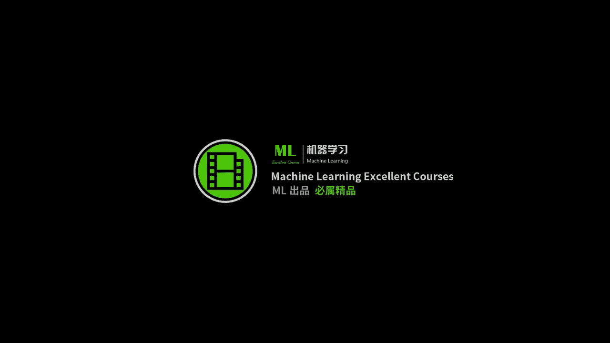

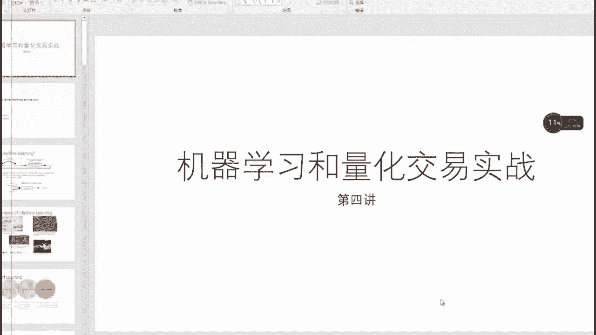

现在能看见屏幕了吗，现在呢好看见了是吧。

ok ok那我们现在可以正式的开始，那么今天呢我们进入我们的这个第四讲的，这个学习，从这一讲开始呢，啊就是说从这一讲开始啊，在接下来的2~3次课，我们会正式啊来，实战，那么在接下来的这个2~3次课里头。

我们的会将重点主要放在，怎么样用机器学习的方法来做量化，前面的准备工作已经嗯基本完成了，我们现在就可以正式上车了，就是利用啊怎么样的通过海量的数据来建立，你的这个预测模型。

就是说也就是说接下来2~3次课，是我们最嗯最量化的一个部分，那么在之后就是呃关于回测呀和风控，然后在最后就是我们的这个自己，量化平台的一个搭建，那么就是接下来是未来两周是最数学的两周。

所以大家做好心理准备啊，不过也没有，那么就是我讲的东西，我一般就是尽可能的把最最简单，就是说用最简单的方式来告诉你嗯，它背后的一些东西，我尽可能的避免一些，看上去很吓人的一些公式啊。

好那么我们现在可以上车好，ok线性回归图优化，嗯嗯对，就是我我就是打算咱们尝试一遍，假设大家数学水平是高中生水平，嗯不行，还是高考生水平吧，好好我们上车啊，好那么就是说今天我们要讲的东西是这样。

今天东西我们要讲的东西，我们今天呢就是直接从这个线性回归模型，我们一路撸到这个所谓的核方法，然后呢基于这个核方法遇到的一些问题，我要介绍一下机器学习的一个最重要的一些呃，一些技巧。

那么主要是一个要讲这个啊这个线性回归模型，然后要讲这个所谓的领回归，和他一个孪生的这个双胞胎啊，就是朗诵这个方法，在这三个方法，其实在目前的嗯实战应用中用的非常广泛，就是说啊不要小看这个线性模型。

线性模型未必不是好呃，未必不是坏事，尤其是当你比较聪明的用线性模型的时候，一般因为一般来说当数据量很大的时候，线性模型就能够体现出这个呃，数据背后的真相了，你并不需要做一些呃多复杂的一些模型。

另外呢呃从线性转到非线性呢，我会跟大家介绍一个，目前也是很常用的一个方法，叫做所谓的嗯和方法哈，名字听着很酷很牛逼，但其实一点也不难，然后基于前面讲的这个这四个模型呢，我会着重跟大家介绍一下。

怎么样的来做这个所谓的cross validation，然后呢再利用sk learn把今天讲的所有模呃，所有事情以sk learn啊，咱们实现一遍啊，然后最后呢再从这个呃呃呃机器学习嗯。

在嗯结合我们上一节课拿到数据这件事情，我们来嗯引入我们的下一个话题，就是我们的这个x怎么定义啊，这个就是我们今天的这个计划，ok啊那我们现在开始os就是线性模型。

ordinary linear square，啊啊啊least square就是嗯，最小二乘应该叫应该叫嗯最小二乘嘛，对就是说嗯他其实是跟线性回归模型，你可以把它看作一个嗯同义词。

ok那么我们今天的计划就是把这些事情搞定啊，我会说的慢一点啊，然后前面前面的六张啊，骗子跟啊这个python python班的那个机器学习是一样的，但是我的侧重点会不一样，所以如果你嗯听过那个班的课。

一定不要走神啊，因为有这东西不大一样，ok就是说呃机器学习是这样好，那么传统的传统的我们要编程，比如说我们传统的要做一个交易系统，我们的这个策略呢是由人工定义的，什么意思呢，我我有一个程序员。

或者说你的一个交易员，然后呢嗯嗯你观测到了一些呃事实啊，比如说你觉得这个嗯，嗯这个移动平均线这样穿过去之后，股票就会涨，你把这些规规则呢写成一个嗯fails的这些程序，你告诉这个计算机。

那么计算机看到了一个嗯，某一个规则被触发之后呢，他就会输出，他说如果输入了是m a c d和呃，这个呃就就是说ma 5和ma 10，如果他是这样的一个关系，那么我就输输出是一个它是看涨的一个信号。

如果是相反，那么我就看跌，那么这个是一个传统的一个编程的一个方法，ok这个是一个传统的一个编程的方法，那么机器学习跟传统的方法最不一样的地方，就是你的这个规则不是由程序员制定的。

而是从数据中自己学习出来的，什么意思呢，就是当你只要告诉我这一个程序啊，我如果是这样，那么它就涨，如果是那样，他就是跌，如果又是这样，它也有是涨，如果是那样，他就是不涨也不跌。

如果你告诉他大量的事实之后，有一个程序呢就会自动生成一系列的规则，就是这个规则是由计算机从成呃，从数据之中挖掘出来呢，啊那么这个有有一些好处，就是他也许挖掘出来的啊。

这个规则比你一个人制定的要更科学更合理啊，这这是因为他能够看到的，比你看到很多的这个数据，同时能够啊从高维高维数据中挖掘出来一些，你只通过看这个图表，很难看出来的一些背后的一些隐藏关系。

那么这个是积极学习的一个嗯，很重要的一个事情，ok你像传统的机器学习，它能干的事情也很多，比如说嗯给我一个这个呃一秒我可以告诉你。

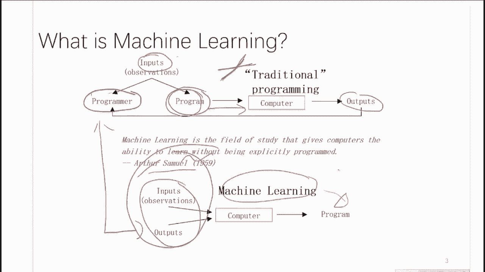

它是垃圾邮件，或者它不是垃圾邮件，或者输输入一个这个照片，我输出这个照片上的所有的字符，就是相当于啊对这个呃呃呃字母的一个识别，那么还有现在比较火的这个啊自动驾驶，以及这个嗯这个电影的这个推荐。

那么他们这个背后使用的都是机器学习啊，这美妙的地方是在于，你识别这个手写数字用的模型，比如说是svm跟你做一个股票分类用的模型，背后的数学原理是一样的，就是说它是具有满满强的，这个鲁棒性和普适性的啊。

也正是因为如此，目前的人工智能才是啊比较的火爆，一种是所谓的这个监督学习，就是说你给我一个x。

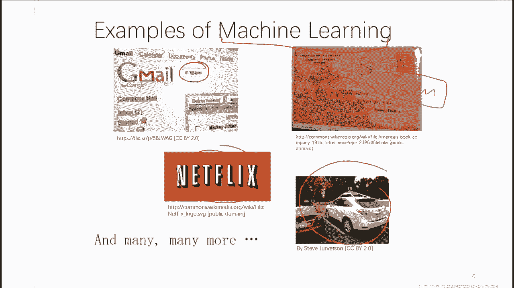

再给我一个y，就是跟x对应的一个一个关系，它可以是一个值，也可以是一个呃类别，就可以是看涨，可以说是看跌，也可以是具体是到底是多少钱，ok这个是所谓的监督模型的这么一个框架，第二个呢是所谓的非监督模型。

这就是我给大家的呃，留的这个作业二，就说我有很多的时间序列，你能不能自己的给我找出来一些聚类啊，发现这两个股票是一组，那两个股票是另外一组，这个是非监督的，就是说你没有教给他一些这个y值的这些信息。

我直接从x值里头，我们能能不能自己发现一些规律，ok这两个呢是比较像的一些事情，因为它们的区别仅仅仅在于就从输入来看，它们的区别仅仅在于有没有这个y值好，那么这个另外一个是呃跟跟量化有关的呢。

就是所谓的这个啊强化学习，强化学习，这样你有一个环境，这个就是相当于你的大盘啊，然后你有一个，你这个就是你这个一个一个一个一，一个交交易员，那么你呢要不断的给环境一个action。

就是说你给环境一个买或者卖的一个一个行为，这个环境内会返回你基于这个action，他给你的reward，那么你要干的事情呢，就是说我们怎么样的选择一系列的这个action，使得这个reward的最大啊。

这个是所谓的强化学习的一个具体的这个假设，那么你可以看出来，强化学习跟前面这两个都都不大一样，那么它所需要的这个啊，数学模型也是截然不同的，马可夫决策过程mvp。

这个可以大家嗯嗯就是嗯回去可以先预习一下，就是所谓的马可夫决策过程啊，而强化学习，就是说我通过很大量的数据来学出来，这个马可夫决策过程，它的这些参数是什么，process。

这个马可夫决的过程是一类非常强大，和能解释很多事情的啊一大类啊啊啊过程，那么就是说啊啊啊啊啊，就是啊，很多的强化学习算法都是基于这个假设啊，在做的，我们接着往下走好，那么呃监督学习。

其实嗯还是嗯比较嗯嗯嗯嗯嗯是最简单，也是最重要，同时呢也是工业界应用的最多的一类模型，它可以分两类，一类是分类，一类回归分类是什么呢，比如说我这个x一是啊，他的这个price，这个呃x2 呢也可以。

有可能是，我们在下一场会着重告诉大家，怎么样算很多的东西，比如说你这个可以比如说你可以想成mma，那么每每一个这个金融产品呢，它其实比如说你你可以在这个平面上，把这些点给它画出来。

那么如果在这个区域的呢都是看涨的，在这个区域的呢都是看跌的，然后那么我们来了一个新的，时间序列中的一个点，我们计算了这两个维维度的这个值之后，我们把它画到二维平面上，那么分类问题就是说。

如果我们给定了很多的历史数据，我们怎么样的对一个新的一个点，来来判断这个时间点所对应的嗯，这个这个点他应该是看涨的还是看跌的，ok那么回归问题呢，就是说嗯比如说它是意味着它仅仅是一个呃。

price of price of tea，然后这个是你的price of嗯，就是嗯t加一啊，就是说那么嗯嗯这个呢就是一个回归问题，就是说我你给我一个时间，那么我需要预测出来这个时间。

我对应的下一时刻的这个呃，这个这个价格应该是多少，你不要告诉我是涨或跌，你要具体到一个具体的一个数，那么这个就是所谓的啊啊回归问题啊，那么分类问题的回归问题，在这个量化中都是极其常见的啊。

就是呃你好呃呃呃就是极其常见的两类模型，基本上呃我们在今天跟今后的作业中，都会遇到啊，啊关于这两个事情，大家有问题没有，好ok好，那么我们接着往下走哈，啊当然在再好好先看这个，那么非监督学习是什么呢。

非监督学习是比如说我有一个嗯，就是说我在一个平面中，比如这个维度是300，这个是一个三维的空间，就是每一个点它对应的是一个300维的向量，比如这个x它是一个300x1的一个点，就这个小红点。

它的里头的值有可能是price of a t减一，然后price of t减二等等，还有你计算的各种的嗯，这些指标的一些值啊等等，你大概总结了有300个这个所谓的这个指标，就是针对于每一个时间点。

你大概总结了300个指标，那么在300维空间中，我们建立了很多的，就是我们从你你今天所建立的这个数据库中，你抽取了很多300维的这个点，比如说你一共抽取了啊1000万个历历史记录。

那么就是一个10000000x300为的一个大矩阵，它每一行呢对应的是一个时刻的一个啊，你计算的这么一个呃feature vector，那么我们非监督学习要干的事情，就是说我怎么样的呃，用聚类的方法。

就是用一种聚类的方法，我们把呃他们呃就就发现这些啊，是啊是啊，时间序列归一类啊，然后这些时间序列呢是另另一类，那么嗯这样做呢是没有一个监督信息的，你有监督信息做也没有问题，但是呃非监督学习呢。

嗯他比较重视，就是说在我没有一个监督信息的这个情况下，我怎么样把这个聚类给做出来，ok那么这个compression，其实呢呃是所所谓的这个降维，就是说我们现在这个不是300维吗。

300维我能不能给它降成一个啊，200维，或者说是20位甚至是两维，我如果是两维，我就能画到平面上了，对不对，如果是20维的话，我的目的是什么呢，目的是我这300维。

但这些feature是我自己拍脑袋想的，我今天想起来一个我撂进去了，明天我又想起来一个，我又撂进去了，后天呢我把这前两个尝了一下，我又变成了第三个，我又撂进去了，就是我撂了很多。

有可能是很冗余的一些这个这个特征啊，就是说我这个300维，我这个300维中的某些列有可能是非常冗余的，或者说是它是没有意义的，比如说我第298列，我我啊，我认为的这个feature是我今天早上吃饭没有。

那么这个肯定是跟股票是没有关系的，我们怎么样呢，通过一种压缩的手法，或者说降维的手法，把别人定义好的一个高维的一个嗯，一个比较粗略的一个估计，来给它压缩到一个所谓的流行中去，叫做呃流行。

这个是一个很数学的一个呃呃说法，其实你可以就是嗯嗯，这也是一个很就是你你其实你能理解的，在低维空间中，用另外一个点来来来进行有效的表示，也也就是所谓的叫低维嵌入，嵌入嵌怎么写，embedding。

就是说我怎么样呢，呃用低维空间中的一些点来体现一些，其实看似高维，但是其实它的本质是在低维空间中，一个流行上的一些点，ok啊还不是投影啊，投影是projection，而这个embedding是一种。

就是嗯更拓扑的一种说法，投影指的是一种正一般投影的话。

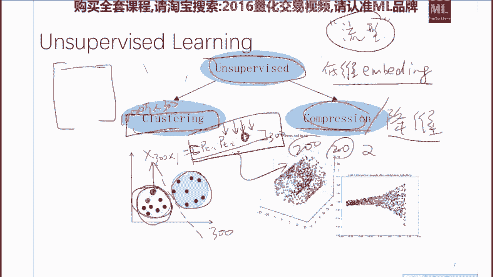

他是跟嗯正交性，就是说跟跟这个就是跟跟跟垂直这个概念，是有关的，而一个流行的嵌入呢，它有可能是嗯比如说像这个画出来的，它有可能是一个啊一个曲面啊，一个紧的一个空间，我们那么比如说我们要做这个量化的时候。

我们一般来说有有可能是我们在做监督，学习之前，我们先用非监督的方式对数据进行一个降维，降完为之后，我们再用这个分类的方法或者回归的方法，举个例子，比如说我以前是有x500 为，跟对应一个y值涨或者跌。

我们先把x500 先降到x55 50，然后呢我们再做这个，降完为之后，再在这个数据集上嗯，在学习出来一种映射，这个也是非常常见的一个范式，那么它的好处是，我们嗯嗯对特征进行了重新的变换。

通过这种变化能够提高我们特征的质量，这个是嗯非常合理，而且同时我们能够大大减少啊，建模的这个时间啊，因为有很多模型，它的这个嗯复杂度是随着这个嗯，你的这个feature的这个数目啊。

成一个都多项式级别的，这个训练时间的一个增长，ok好我们走，那么sk 2是，是啊相信大家现在已经知道了，是python中一个非常著名和常用的一个，机器学习的一个嗯一个包，目前除了深度学习中的神经网络嗯。

他嗯嗯该有的都有了，就是说一个呃，就是他帮你把函数已经写的非常好了，你学需要干的事情就是两三行的呃，调用它就可以了，就是能大大的减少你的这个嗯建模的这个事件，就是其实你用sk learn做实验。

你就会发现，其实你数据预处理的这个代码的行数，跟可视化的这个代码的行数，是远远多于你真正建模的那七八行啊，如果你要不做这个啊，quervalidation的话，大概你建模的这个代码大概也就是两三行。

三四行顶多了，那么这个表呢是一个非常好的一个，相当于指导图，就是说嗯他来的，他的目的是告诉你具体是用应该是用哪个模型，因为这个网站上罗列了非常多的模型，我们到底是用s v m好呢。

还是要用一个线性回归模型就行，那么这个是一个非常实用的一个啊，相当于一个备忘录吧，那么就是说当我们的，比如说我当我们的样本点数嗯，还不到50个的时候，你任何机器学习的模型你都你都别想了。

你就你就再去搜集比较多的数据，当比比如说当你的样本点超过10万个的时候，你就直接做这个随机梯度下降的一个线性，分类器，或者随机梯度下降的一个线性的一个回归器，就行啊，那么比如说嗯。

当你的这个数据量在10万以内的时候呢，那么你就可以考虑一个呃，这个还s a m的这个模型，或者是一些比如说这个nau base啊，尤其是针对这些文本数据，那么呃呃相应的针对于这个聚类算法。

跟这个降维算法，那么他们也都有这个相应的推荐，唯一我要补充的一点就在这，就他这个降维的这个手段，我不是嗯很赞同我建议大家就记住一点就行，你如果想降维这个，我在不同的场合我应该都都强调过，如果要降维的话。

对于小于3万个点的数据，我建议你是先用pca降到50为，然后再用一个叫t s n e，就是也在s s n e，抱歉啊，t s n e给他降到两位，或者降到你想要的维度。

如果你要做降维的visualization的话，就是说在b嗯嗯嗯比较小的这个数据规模下，你最好是先pc到50倍，然后在t s n e到两位，嗯嗯这两个函数呢s k n都提供了，ok啊。

唯一的原因就是因为t s e是啊，在降维手段中最棒的一类，但是他是特别特别慢，如果你在3万个点左右的话啊，每一个点如果是50维的话，或者不是每一个点，如果是100枚，你有一三万个点。

你做t s n e是基本上跑不完的，那么你可以先做pc，先先给他降到嗯一个比较低的一个啊，d v流行中去，然后呢，你再用t s n e，把p c a的这个结果在做进一步的降维。

如果你的点大概只有只有几百个，只有比如说是500~2000个的话。

那么你就可以直接考虑用这个t s n e的方法，来做这个呃降维的这个这个方式啊，那么这个是我要强调的其他的这几个人啊，这个表总结的都蛮不错的，大家啊照猫画虎看着用就行啊，有问题没有没有问题。

好我们啊这个表你们回去回去从群里下就行好，就是你从群里下我的这个呃pdf的讲义，你放大了看好，那么就是说在sk 2里头，我们要呃逐步回归，是一个呃非常不推荐的，一个很老的统计学习的啊，统计学的一个方法。

这个只在嗯嗯嗯嗯，只在那帮在七八十个点以内搞一个统计学的人，他们喜欢用，但是是一个完全可以被替代的一种啊方法啊，他其实就是用一种贪心的算法，来对特征做了一点点的选择，但是我们嗯有有比逐步回归。

从理论上更棒的各种方法，所以我不认为在任何场所啊，嗯如果你要使用逐步回归的话，我觉得用我今天要讲到的，另外几个线性回归的方式啊，都会比他做的更好好，如果没有问题了，我们接着往下走好。

那么就说一个最简单的这个sk learn的，这么一个调用的流程，一般就是分这么冷宫啊，分散步啊，第一步就是你先写一个，获得这个训练集和测试集的这么一个函数。

这个是取决于就这个get data是你来定义的，就是说呢你你你要做什么事儿，你要你就说你生成啊所对应的一些数据，而这个trainx一般来说是一个矩阵，ok，这个春节x一般是一个是一个什么样的矩阵呢。

是n就是说我有多少个，多少行乘以d的一个矩阵，这个d就是我每一个每一个小x的这个维度，每个小x的这个维度，而这个n呢是我一共有多少个时间点，就是一共有多少个n的点，而每每每一行呢。

就是说我这个时间点我所提取出来的一个，我对这个时间点的一个向量，ok，那么呃呃这个y值呢，一般来说是一个n乘以一的一个一个向量，它要么是零啊，零一的分类就是它可以取值为零，或者一。

或者它可以取值012345啊，不不不不不就是说嗯嗯，对咱们先说零一吧，就是说如果是看涨或者看跌的话呢，他就说他是一个嗯n乘以一的这么一个零一的，呃，一个向量如果是多分类的话呢。

它就是n乘以啊c的一个矩阵，每一行呢是比如说我是五分类，那么它就应该是00101啊，零那么它代表的是第三类，如果是1万代表的就是第一类，那么如果是回归问题的话，那它就是一个n乘以一的一个实值。

这个向量它是啊100 100。3啊，这个是25。8啊等等，那么他的这个呃呃我们在做这个，我们在做这个呃嗯在做机器学习之前，我建议大家都把你生成的这些玩意，儿，你把你你用一个函数叫做嗯嗯嗯就是train。

x。shape就是一个小的一个debug的一个方法，就是你最好做任何事之前，你要print这个train x。shape，因为呃再多说一句，一般来说这些东西最好是。

要么是pandas的这个data frame，要么是这个南派瑞的这个方式来进行储存的，那么你就会啊把这个他这个shift都都print一下，就是至少要保证这个x跟y这个行数啊要一致。

然后这个是我们的这个数据的准备过程，这是第一步啊，第二步就是说我们调用一些sk learn里的东西，就是我建了一个model，这个是some model，你这个里头你可以就是sk learn里的任何。

你想干的事情，它可以是svm，就是s a m一个括号就行，或者是啊一个，比如说啊拉手，那么就是狼，或者呢是一个比如说一个lol s对吧，都可以建立了一个空的模型之后呢，这个模型的参数就是每一个模型呢。

你可以看作是一个黑箱，这个黑箱上的这个旋钮，就是你比如说你们家这个收音机啊，如果有的话，是上面是有很多这个旋钮的，有几个旋钮就说明这个模型有几个参数，而这个参数旋钮具体有多少度，就是参数的值。

比如说我们这个模型它一共有五个参数，就是它有w1 w2 w3 w4 w5 ，那么每一个每一个参数呢它可以取任意的值，比如w一看他可以取，比如说张三说他是0。3，李四说完应该是0。6吧。

那么机器学习要学什么呢，他就是要通过如果我们输入一个训练集，我一个点fit，就是会让模型来学习一组，学习一组这个w的组合，使得这些这一组的w，在这个训练集上的表现是最好的，我再说一遍哈。

就是说机器学习学的是什么呢，机器学习是以一组输入的训练集为输入，他通过你指定的这个模型学习出来，或者说计算出来这个模型所对应的，所有参数的一个最优组合，这个最优组合能够使得在这组最优组合下。

这个模型在你给定的训练集上的表现性能最好，ok比较绕哈，那么但是嗯只能这已经说的是最啊，就是啊最不绕的一种方式了，那么我们学习完了之后，我们这个model呢就会存这个model。

存的就是这个model它对应的这些参数，举个最简单的例子，线性模型的参数就是这个w，那么当你学出来这个w的这个组合的时候，比如说是1。21。3，我的x那么肯定也是对应的一个二维的东西，0。60。9。

那么那么这个f就是一个一个简单的点称，那么我预测完的时候，我就直接嗯嗯来一个x，因为我w已经学出来了，你给我一个x，我给你个y，给我一个x，我给你个y，这个因为这个w一点21。3已经学出来了。

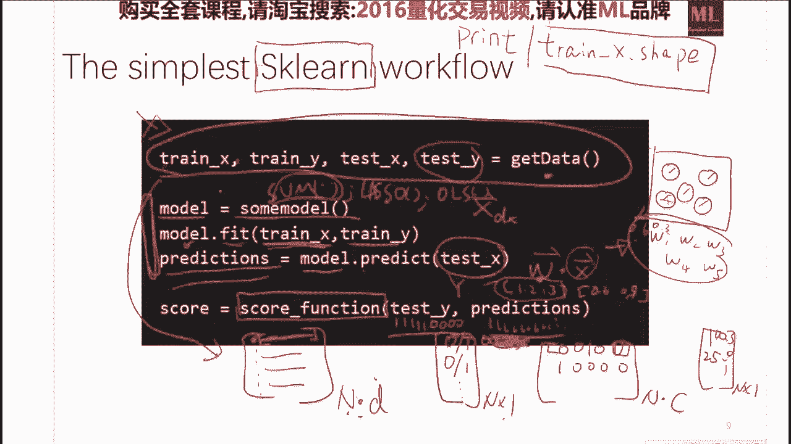

那么我们要评估一个模型的时候呢，我们就model。predict，我们做了一个这个预测，当我们给了一些新的测试集的时候，我们会基于这些测试集，就基于这些新的x我们得到了一些啊，这个prediction。

有了这些prediction之后，sk那里头定义了各种各样的一些打分的函数，就是说你要把真实的这个测试集中的y，跟你的这个prediction做一个比较，就说比如说真实集里头他是涨涨涨，涨涨跌跌跌跌。

然后你预测的呢是比如说是涨涨涨涨涨涨涨涨，你全预测为涨了，然后那么它就会有一个这个打分的函数，来评价你到底预测了百分之多少的情况下，你预测是对的，或者百分之多少，像你预测是错的。

ok那么一般来说一个最简单的一个流程，就是分这么几步，我获取数据学习模型啊，学习完模型之后，我们要对模型进行一个评分啊，如果评分比较你比较满意，你才能做下一步的回测啊，如果评分你都觉得操什么玩意儿。

你回测其实也都不用做了，你就你就知道不行，但如果评论很好，你回撤也不一定好，就是说什么机器学习，大部分的时间是告诉你不能做什么，但是不会告诉你能做什么，好吧嗯好嗯嗯，有问题没有，但用的也比较。

就是这个这个是就是说呃，一个一个降维学习的一个算法，基本上来说是嗯嗯最好是跟数据有关的，就是最，就或者说最好就是我我们在做一个降维的，这个过程，一般来说呃，最稳妥的方法是用不同的这个降维手段。

分别做一下实验，然后选出一个最好的，因为因为因为这您的流行假设的一个关键角色，他其实被能被嵌入在低维空间中去，那么一个最最但是你的这个数据源不一样，那么这个dv流行也就不一样，那么在有很大的可能是嗯。

这个算法在这个数据集上表现不错，那个算法在那个数据上表现不错，但是我个人的最喜欢的算法是tsn，这个局部线性嵌入算法也比较嗯，就是大家用的也比较多，但是我个人来说啊，要我选的话。

我一般选t s e也就大差不差就都可以了，但是嗯呃也但是并不是说它不值得尝试好吧，y如果是多维度的话，不需要降维，就是说我们的这个回归算法，就是比如说我们的回归算法是完全可以，你给我一个x是五维的，2。

63。8，7。9000，一共五维的，我想学出来一个映射映射到一个平面中去，就是说我们s k论里给出的，所有的这个回归算法，就是以regressor嗯为后缀的，所有的这个回归问题。

我们想学出来一个多维的映射是可以直接干的，因为这个归根结底其实就是一个硬一，就是一个一映射关系，对吧，嗯啊啊，score成绩好，完全不等于回撤好，我们这个score呃跟回测是两码事。

我们这个score是，比如说我们这个test y，也是基于某一个时间点拿出来的，计算的一个呃呃呃呃呃，一个涨或者跌的一个事情，而我们要做回测的时候。

我们要考虑到比这个scoring function啊复杂的多，呃呃呃也要这个严密的多的一一系列的过程，就是说score成绩好是完全不等于灰色好的，如果score成绩不好啊，我就不建议你做回测了。

甚至于回溯成绩好也并不一定能代表挣钱啊，在一定也要实盘的做一下啊，就相当于这个模型的这个score，模型的这个score是小于这个呃back test，然后是它是小于这个实盘的，好好好。

我们接着接着往下走，那么这个是一个相当于你做机器学习的一个，果蝇的一个数据，果蝇数据就是生物学家，所有的东西都会在果蝇上面做，那么我们积极学习做呢，这个是一个非常典型的一个果蝇的数据集。

它是一些花儿的一些分类，一共有150种花，那么我们想对这些花儿啊，一一共有150个数据点，然后一共有好像是3~4类的这个花，然后我我们怎么样定义这个花了，那么嗯它就是定义了四个维度。

就跟我们做这个做一个时间点的一个x，是一样的，我们定义了每一个x它分四维，比如说是他花的直径啊，这个花瓣的大小啊，花是否对称啊等等，他选了四个维度，那么每一个花呢，就可以以一个四维的向量做一个表示。

就相当于我们只要有了一个向量化的一个表示，之后，我们就能建立一个数学模型，你给我一个x，我告诉你他是01234中的哪一类，那么这个是一个非常典型的一个数据集，在sk learn里它是内置的。

你直接就用这个，你看这个是他的这个呃呃呃啊，这个这个这个非常著名的这个数据集长的样子，它就是一共有150个点，然后他一共有四个维度啊，每个维度是一个实数值，然后它对应的这个类呢是0~4类中的一类。

ok那么我们用sk 2来调用的。

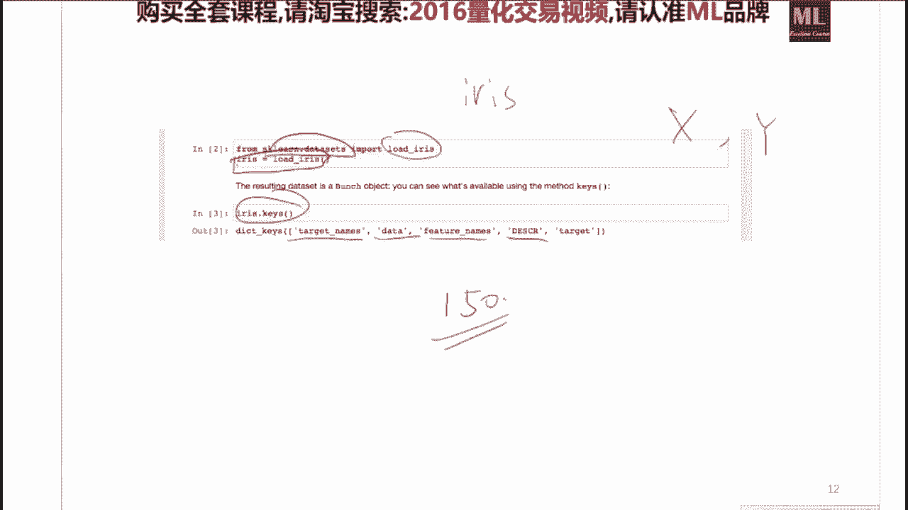

其实一句话就出来了，因为这个sk的这个包已经内置了这些数据。

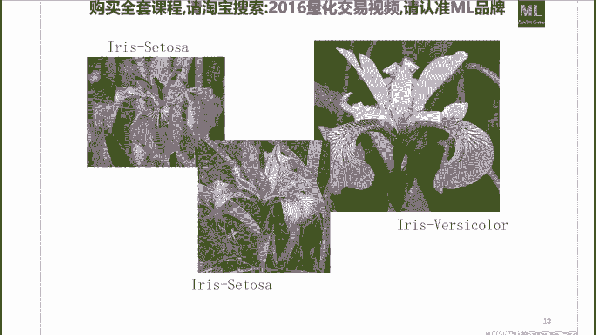

就是你只要用这个sk learn。data set，import load errors，这个艾瑞斯就是这个花名啊，就是这这一类花的这个这个名字，就是因为它属于很很有名，他甚至有了自己的一个名字。

这个就叫艾瑞斯data su，那么我们把这个艾瑞斯大set的载入之后呢，我们就会得到了相应的这些一个一个字典，一个字典里头它不同的这个值，就是我们的这个x跟这个y值，就是说我如果大家要做这个呃一些呃。

机器学习的这个尝试的时候，这个是一个蛮不错的一个数据，那么但是它的就有一个问题，就是说它的额数据集太小，它只有150个点啊，这个是嗯做统计的人就够了，但是做机器学习的还是觉得实在是太小了啊。

那么相应的呢还有一个数据，就是所谓的这个手写数字识别，那么这个是嗯应该一共是有6万个6万个点，就是6万个点，每一个点，它是一个28x28的一个矩阵，就是它一共有6万个28x28矩阵，那么呃每一个矩阵呢。

就代表了一个小的这个图像，因为我们把一个28x28的一个矩阵，如果它是以0~255呃为一个值的话，那么它其实就是一个黑白的一个图片，就有专门的函数，可以帮你把任意的呃呃一个矩阵给你画出来。

就是他画的规则就是啊零是嗯应该是白色，255就是纯黑，如果是比如说30，它就是比较灰的一个颜色，那么嗯嗯如果你只有，这只是一个平面上的一个矩阵的话，那么它就是一个黑白的图像。

这个也是啊你们的这个比如说b m p啊，这些格式背后的编码的一个方式，那么这个数据也就是说我是0~9，它要分十类，那么我给你一个28x28的一个矩阵，引擎，学习出来一个分类器，告诉我他是零还是一还是二。

那么这个是一个极其重要和经典的一类数据集，它有一个名叫emilist，他也是这个所谓深度学习的三巨头之一，在90年代的时候，自己辛辛苦苦搜集出来了这么6万个字。

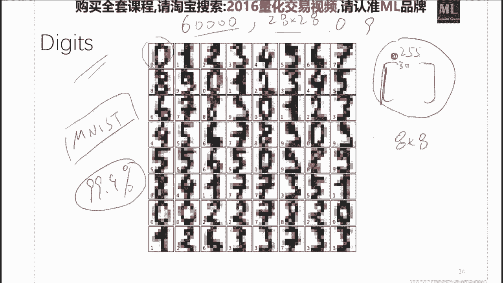

在sk里头也能直接调用，但是sk n里头他把这个压缩了一下，大概压缩到了几kg啊，它是8x8的，就是我们现在在这个里头，pd出来的是一些8x8的矩阵，所以你看到它这个分辨率是要小很多的。

那么也有很多这个实验基本上都会汇报一下，他在这个数据集上的一个表现性能，目前做的最好的应该是99%点，九几就是99%的，9。9的这个准确率啊，那么这个也是嗯做的是，就是大家在这个数据上。

已经把这数据基本玩坏了，就是你你你平时玩的模型，如果不做深度学几段是不可能避得掉的，ok ok那么我们还有一个我们在做实验的时候，我们也会经常的要，比如说尤其是我们做这个做量化的时候，我们有可能经常的。

比如说我想生成一些周期性的数据，这个数据是一个人造的数据，怎么办啊，sk learn它有一个非常好的一个接口，叫做sk 2点data set import make啊。

你能make这个classification，也可以make regression，就是你能自己造出来你任意想的一个分布的，满足某种分布的一些图像呃，一些点，然后呢你如果造出来一个数据集。

拿出来一些当当训练，再拿出来一些当测试，来验证你这个模型是否合理啊，那么这个是一个非常棒的一个数据，它甚至能比如说你比如说嗯，嗯我你可以告诉他说，请你给我造出来一些点，这些点呢以这条直线为中心。

然后它均匀的呢，有一点点一点点的这个高斯噪声，没有问题，他就能立马就能给你造出来，就是说它是一个非常方便的一个，做实验的一个数据，比如说嗯嗯嗯，请你在三维空间中给我造出来这么一个s的，这个形状。

然后呢要求他在这一头呢嗯都是这个零类，这头呢都是一类啊，中间呢大概是一些其他的类别，没有问题啊，用sk 2能够非常便捷的用一行就能调出来，这个我也希望大家回去看一下。

他们这个官方的这个api的这个文档啊，就是啊对cular data set import make啊啊，ok那么我们这个啊再再复习一下，我们这个监督学习的这个这个流程，就是说我们嗯有一个训练集，训练集。

这里头有x有y，然后你把x跟y放在一个模型里头进行训练，训练完了之后呢，我们在测试集中，我们拿出一些x让这个模型进行预测，然后你预测的这个预测值，跟我们在测试集中的这些玩。

就是x test跟y test做一个比较，就一个evaluation，然后挑出来来来验证，你这个模型在他没有见过的数据集上，表现性能还行啊。

那么这个是最简单的不带cross validation的一个呃，呃一个方法，那么也有很多人犯的错误，就是他直接在这个上面做完训练之后，在这个上面做了一个评估，就是我自己又对这个训练集中的xt。

做了一个预测跟训练集中的y t做了一个比较，他说哎你看我在去，我学出来这个模型，在你给我这个数据上，它的误误差为零，那你敢不敢用的，你是肯定不敢用的啊，因为这个就过你河了，ok这个我之前也讲过。

我们接着往下走，那么就是说从a从sk learn提供的接口来说，它所有的啊模型都长得是这个样子，就是说你任何一个estimator，就是任何一个分类器也好，回归器也好，一个降维的东西也好。

你都要有一个mate表，fit你的这个training x跟training y，然后你再estimate点这个predict，你的这个x test，然后呢你再有一个s matter。school。

那么这三句话呢，是你今后啊不管是上课还是课程结束之后，你要反复写的三句话，就是说这个是一个啊sk 2，给这个做机器学习的一个一大贡献，就是它提供了这么三种非常简洁和用户友好的。

这个啊这个抽象的这个基函数类，就是你一切的模型，都就就是说你的你自己写一些的，今后的一些新模型，你也应该按照这种流程来做啊，会嗯比较的简洁和清晰和明了，ok好，那么关于啊前面的这些嗯。

事情大家有问题没有，应该没有好，那我们那我们接着接接接接着往下走，那么今天呢我就要给大家介绍，从这个线性回归模型，一直到目前最前端的大家在用的这个，你可以想象成高级，线性。

模型就是说从最简单的这个o l s，就是对最小二乘，一直到我们现在工业界和学术界，大量使用的一些线性的方法，嗯嗯在量化中是嗯非常嗯好使的这么一类东西，那么我们今天来给大家看一下，因为我最担心的是。

如果你自己去看维基百科的什么laso啊，看维基百科的这个呃领回归啊，看维基百科的，更尤其是看维基百科这个所谓的核方法啊，你看到第第三段的时候就想放弃了，那么我今天的目的就是我给你说一遍。

他们背后的人话是什么，然后你再回去再去看，你就明白啊，他他原来是想说这么一个简单的事情，这个y值不一定是某个股票的价格，是你想你做建模的时候，你想干的任何事情，就是你想预测的任何事情。

而预测某一个时刻的价格呢，是一个嗯或者某一个时刻的一个回报和呃，这个是一个呃蛮常见的嗯一类任务你可以做，你你可以做任何事情，就是你你对吧，嗯不一定是某个股票的价格了。

好那么我们先来看一下这个线性回归模型啊，线性回归模型是这样，就是说我们有一个y对不对，我这个y等于什么呢，线性回归认为y应该等于这个啊啊啊啊，x乘以theta，对不对，这个theta呢就是我们的这些。

就是说比如说嗯我y值就是我样本点是n个，或y是n乘以一的，x是n乘以d的，就是d就是我这个x的维度，这个c的是一个d乘以一的一的一个向量，就说我是一个一个y，是一个n乘以一的一个向量。

然后我们的线性回归模型认为这个是一个矩阵，n乘以d为的，然后乘以这个呃，这个这个c c a，c a是是一个d乘以一维的一个参数，那么那就是一个训练集中的所有点，成了一个向量，得到了一个新的向量。

你看他这个维度也是d跟d是一样的，所以得到的是一个呃，这个n乘一的这么一个一个向量，那么它的这个几何解释就是呃，这个x跟y是一种线性的关系，那么学出来这个参数呢就是一个所谓的平面啊。

就是一个或者一个超平面，如果用一维的，比如在一维空间里头，它就不是个矩阵了，那么在一维空间里头，如果这个是x，这个是y的话，那么它就它就简单的是x乘以一个小c的，这这这两个就都都是实数了，它就不是向量。

再加一个这个呃他的这个截距的这一项，这个结局这一项一般来说，比如说是b那么如如果我要把它写成嗯，这种点乘的方式呢，我一般来说是给x加一个常数项，就是x跟一点成了一个，嗯跟b这样的话。

我就能让我把这个东西整个看作一个c的，我就能就就能写成一个比较简单的一个形式，就是y等于x乘以c的，那么这个是线性回归啊，这个这个是最最简单的线性模型，那么线性模型呢它是它是有一个闭式解的。

就是说我们如果有一个线性模型，如果你认为这个输入和输出，满足一个线性关系的话，这个theta你是直接就就能算出来的，这个算出来怎么算呢，就是你训练集的这个x的这个矩阵，它的转置乘以x。

他求个逆再乘以x转置在乘以训练集中的y，就是它是一个b世界，这个是很酷的一件事情，那么比如说我们有一个嗯10万个，十10万个点的啊，50维的这么一个矩阵啊，那么你就对这个矩阵。

你啊矩阵的transpose乘以，他的话就变成了50x50的一个句矩阵了，就一下子就把100000x50的这个东西，变成很小的一个小矩阵，那么你对这个小矩阵你再求求一个逆，然后再乘以它的这个转置。

再乘以y，你就会得到你要的这个线性模型的这个参数，ok关于线性模型有问题没有啊，线性模型一定不能有问题，如果有问题，后面就听不明白了，线性模型大家应该都没有问题吗，对好嗯，嗯好好好很好啊，我很欣慰啊。

那么线性模型是这样，这个我今天要跟大家讲一讲，这个传说中的这个所谓的领回归呢，还有这个传说中的被捧上天的这个拉，so他们是怎么来的，就是说我真正的从这个嗯历史发展的这个角度，咱们来看一下这个事情。

因为我离学术圈比较近，所以我知道啊，你不用说，这也不是我编的哈，我们来看看，如果你是一个很聪明的科学家，你能不能把这个事件给推出来啊，那么我们今天就尝试着自己，把接下来的这个领回归给他撸出来好吧。

那么好，我们走走看，因为真正的了解一些嗯，比较高级的这个线线线性的方法，对你这在选择一个模型中是至关至关重要的，ok那么我们来看，就是说在一些搞数值分析的一些人，在做这个线性回归的时候。

他们发现了一个技巧，就是任何一个程序员他都知道，如果我要求一个矩阵的转置，程序矩阵的逆，有的时候呢这个这个矩阵的转置乘以矩阵之后，它很可能不存在一个，你就是说这个矩阵是一个病态的一个矩阵。

ok那么我们如果一个病态矩阵，他要求你，他求不出来，你怎么办，好一个最经典的一个trick，就是说比如说我这个是3x3的一个矩阵，那么如果它的逆不存在的话，一般来说我们可以干的一个很小的trick。

就是抱歉啊，我们能干的一个很小的一个嗯，很有效的一个trick，就是我们在对这个矩阵加上一个，比如说0。1，0。1，0。1，然后对角线元素是0。1，其他地方的元素都为零的这么一个矩阵，你把这俩加起来。

你再求逆啊，就能求了，这个是能数学上啊，就是这个数值分析是能证明他确实是啊，对矩阵的求逆是有帮助的，这个本来呢，这个本来是一个计算上的一个trick o，问题来了，问题是人们发现呢我们如果用了这个公式。

就这本来是一些搞数据计算的一些程序员，就是不能叫程序员，就是一些搞数据计算的人，认为我本来的本意是想算一个线性回归模型，我现在用了一个这个小技巧，来逼近一个线性回归模型。

那么作为一个原始的一个一个想法是，那它的性能很可能不如它，对不对，这个是一个很自然的一个想法，但是问题是，如果你这样做了，往往能比你不这样做的性能，在测试集上的表现还要好，那么这个事情就有意思了。

我再说一遍哈，如果你加了这一项，你求出来的这个c，它，再次，你把这个c大再放到你这个线性回归，这个模型中去，你会发现它的性能呃，在这个测试集上，是比纯粹用线性回归模型的，这个b世界要来的好的。

唉这个事情呢，那么这帮数学家就就就开始想了，那么他们想的第一个结果就是什么呢，就是说我们其实线性模型，线性模型这个c大是怎么推出来的呢，线性模型的c大，就是说请你给我找一个theta。

这个theta呢是让这个y减去x theta，他的这个transport乘以y减x theta是最小的，就是说啊x theta是预预测的，这个数y呢是真真实的值，然后这个transpose乘以它。

其实就是说它的平方最小二乘，也就是从这儿来的，就是说最小二乘，就是说我是想要呃得到一组这个theta，使得这个东西是最小的，就是说我想得到一组c，它使得这个函数这个这个函数是c你不知道的。

只有sa你y你是知道的，x也是知道的，那么就是说啊，最小二乘的这个二乘就指的是他这个平平方，就是呃你如果用矩阵表示，就是它的转置乘以它自己，那么这个是最小二乘的所谓的这个cos函数。

那么这个东西的cos函数，我们逆推一下就能推出来，如果我要minimize这个函数的话，我如果要让这个函数最小的话，就是说嗯最小二乘的这一项加上一个呃啊，就是相当于这个thea。

就是c塔这个平方向前面乘了一个，德尔塔平方的这么一个系数，如果我们想要这个glc它最小的时候，我们就能推出来这个这个sa啊的值应该是它，那么我们怎怎么推呢，很简单，就是所谓的求导就行啊。

导数对这个导数就是什么意思呢，什么意思呢，就是说我们要干的事情，是我们要干的事情是最小化这个函数，最小化这个函数是以它以这个theta为变量，那么我们怎么办呢，就是让这个函数对西塔求偏导。

然后求完偏导之后让它等于零就行，那么呃j theta对c a这个偏导，就是你把这个定义写出来，然后呢你在嗯把它展开，然后呢你在对c他这个变量求偏导，求完偏导之后呢，你让它等于零。

那么根据我们学学学过的这个呃，导数的这个定义，我们就知道啊，他在这个偏导数为零的地方啊，取极值啊，又由于它呃是呃呃呃一个凸函数，所以它是一个你看看嗯就是一个呃global的，就是它是一个全剧最最优解。

那么你让他为零之后，我们就能求出来这个c它的这个值，那么这个回归起了个名字叫做领回归reach，这个就是传说中的rich regression，过。

那我们再仔细的看一下这个ranger gression，他在干什么，就是我们读这个图的时候，我们呃它的本质是什么呢，它的本质是你看哈，我们对就是我们要让它最小，要让它最最小的，那么这个东西就不能大。

这个东西不能，那说明了什么，比如说我x是五维的，就是x比如说是x1 x2 x3 ，一直到x5 ，那么这个theta呢就对应的它是五维的c a1 ，c a2 ，我们先不考虑成立项，其实不用考虑成像。

比如这是x0 就行，就是说考虑不考虑长相，无所谓，c a31 直到c到五，那么这个theta transport乘以c的，其实就是c a一的平方，加上c2 的平方，一直加到c a5 的平方。

这些平方和前面加了一个这个系数，这个系数是超参数，这个是你来定的，就是说啊我来我我我要求啊，我的这个最小二乘的这个cos，加上0。1倍的这些所有参数的一个平方和，要最小，ok那么这个是呃。

呃所谓的领回归的一个目标函数啊，那么它的一个几何解释，就是从图优化的这个理论来讲，它是什么呢，它是这么一个意思，咱们慢慢看哈，唉大家先消化一下这个目标函数给大家啊，两分钟的时间自由提问。

因为这块是嗯今天要讲的东西中，最美妙的一个地方，嗯也许大家就在这儿听一次，其他地儿也听不着了，所以大家先用啊，3~35分钟的时间，先消化一下我这里写的这个乘法函数，然后我们一会儿接着玩好。

我们呃问题一个一个回答一下，大家问的都都很棒，都是嗯都是我需要跟大家再强调的一个问题，咱们一个一个看哈，就是说如果不带惩罚项，求导之后推出来的是什么呢，如果你不带惩罚项，如果你的j of theta。

这个能可以留作作业了，只要theta如果仅仅是这个最小二乘，你对它c a求偏导，这是一个通用的一个方法，你就会求出来，就是说求出来这个最小二乘的b世界，最小而成的闭式解，其实也就是通过求导。

求导这一项为零的这个方法来求出来的，ok这个是第一个问题啊，第二个问题是是怎么提出来的，ok第二个问题从历史的角度来讲，他是逆着提出来的，这个就需要一点天才了，就说他盯着这个看了很久。

他说哎我操这个东西不就是他的一个呃最大，虽然估计的一个呃呃呃呃呃呃解吗啊，这个这个就需要一个呃呃呃，就是呃也一个一一个非常牛的一个天才来啊，只要你盯着他看，时间足够长，你会发现哎我操这个东西。

其实就是如果你把他的这个呃，目标函数写成这个样子，那么我对它求导为零，我用人眼我就看出来了，很显然嘛，这个东西就是它的一个呃最大，似然估计的一个值，最大，似然估计你你就可以嗯，嗯认为是对这个乘法函数啊。

呃呃呃对c a对参数的求偏导之后，为零的那个值，你现在可以这么你这么想就行，ok再往下看，啊那么那接下来我会跟大家详细的说，我这么做，因为因为人们是什么呢，人们是当人们看到了，就在实践中实践。

认为这样做是好的，那么人们就会提出来各种各样的一些解释来，接下来我们就会花时间来看我们怎么样的解释，这样做为什么要比不带这个乘方像要来得好，ok ok好，咱们往下看，咱们现在开始解释。

但是当这个往后忘了吗，那么当他发现了这些事情之后，就当从历史的角度讲，他们定义出来这个东西之后，我们能不能对他做一种另外的一个，一个一个一个解释，这还不是laso la so，是我待会要讲的。

这个是所谓的领回归reach，回归，领回归跟他是嗯只有一个地方不一样，待会我会说哈好，那么我们看我们要对它最小化，对它最小化呢，就是说如果它很大的时候啊，它就比较小了啊。

如果他很小的时候呢啊它又会比较大，就是我们怎么样呢找到一个平衡，那么我们先把这个目标函数重新写一下，我们想让glc它最小，那么其实呢又又又又，由于这个德尔塔平方是你是你的一个超参数，是是是你定的0。

1也好，一也好，1。5也好，那么具体选几，这个我最后会说怎么样用cross validation来选，那么这个东西是一个超参数，就是说啊拿到gfc的时候，这个东西这个数是你知道的。

ok那么我们想要让glc它最小，那么我们换一种写法，就是换一种写法，它就是让呃呃theta transport乘以theta，就是theta的这些平方和它小于等于一个常数，这个常数呢是啊啊。

这个这个呃德尔塔的一个函数，那么比如说是这就是个常数0。2或者0。3，让这个是我们的这个所谓的这个这个，这个这个约束条件，在这个约束条件下，这一项最小跟他这两个是完全等价的一回事。

就是如果我要minimize，如果我要minimize j of theta的话，他跟minimize这个事是完全等价的，有问题吗，关于这个等价的这个呃这个这个事情，ok那么如果它是等价的话。

我我我们来把这个东西我们画一下，就是比如说它是分为c塔一跟c塔二，那么如果是c塔一跟c塔二的话，theta transports theta，它其实就是thea一的平方加上c塔二的平方，对不对。

那么c a一的平方加上西塔二的平方，小于等于一个常数0。3，它是什么呢，它其实你画的这个平面中，它就是一个你你把它这个等高线画出来，它就是一个一个的同心圆，那么嗯他嗯等高线是一个一个的同心圆。

那么你要画出来啊，这个c大一跟c大二的取值呢，它其实就是一个嗯，二维空间中的这么一个抛物线，ok就是说我们的这些点的要求，比如说当我们这个等高线一旦固定了，这个这个值，就是我们这个德尔塔的这个值就是0。

3，就theta就都在这儿，然后比如说0。5，那么c啊sa呢它小于等于它，它就是都在这个里头好吧，那么那我们再看哈，我把这个擦掉，因为都用了红的颜色，这就不大好了，那么那么我们再看这一项。

这一项是什么呢，这项其实是个椭圆，就是在空间中，你如果嗯就是你，你如果你看不出来的话，你就认为它是一个椭圆就好了，因为我告诉你他是椭圆，那么它是在空间中的，是一个一个的椭圆。

就是它它的这个等等高线是一个一个的椭圆，那么最小的值在什么时候取到呢，其实就是在这些圆的等高线上，跟这个椭圆的切线上，当我们变换这个，当我们变换这个德尔塔平方的这个大小的时候。

它这个最他这个最优值就会从我们线性回归的，最优质的这个点一直到零，什么意思，比如说我这个德尔塔是100万，如果这个德尔塔是100，德尔塔平方是100万的话，我想让这个函数最小。

那么你就这一项就可以忽略不计了，那么这一项忽略不计是什么意思呢，这项忽略不计的意思就是说我要让它最小，那么它什么时候最小呢，他们俩都为零的最小，那么在这就是说如果我的这个惩罚惩罚因子。

这个这个惩罚系数特别大的时候，我学出来的一个模型，是是一个毫无意义的一个模型，就是说我x一乘了个零，加上x2 乘了个零，等于y就是我的模型就是零跟零了，那么当我们的这个德尔塔平方逐渐减小的时候。

它的这个最优解就逐渐的从零，一直挪到了线性回归的呃，就是这个o r s就是最小二乘的这个最优解，那么就是当我们的就是说呃我我们这个灯塔，我们这德尔塔方控制了，我们这个解释要往啊这个啊这边走呢。

还是要往这边走，有问题没有，对这个就是嗯从图优化的角度来解释，领回归的一个最本质的，它的一个本质是什么，它的本质就是呃，我通过控制我这个超参数的这个德尔塔平方，来嗯，让他的这个最优解在这两个嗯。

嗯嗯嗯凸函数之间进行一个啊一个组合，那么我们具体要是在这个这个德尔塔，是在这好呢，还是在这好呢，那么这个就是需要我们接下来的事情，来判断这件事情了，好那么我们来看嗯，如果我们来画画出来的话。

如果这个轴是如果是德尔塔的平方分之一的话，就是随着德尔塔的变大，随着德尔塔平方的变道，我这些c c它的这些值就是随着德尔塔的变道，我们这些c c a的这些值就都往零走了，这个是具体的实验做出来的。

比如说这个维度是一个数据集上的一个数，这个维度是呃呃呃，这个c塔二是数据集上的另外一个维度，它所对应的系数，这一共有一维，二维，三位四位，五位，六位，七位八位，那么它一共是八维的数。

那么我们做做实验就会发现，当我们sa的平方增大的时候，他们确实就都回到零了，那这是很那就是必然，那个事情是因为我们这个从图上我们一看，我也能看出来，当你提高我们都是塔平方的时候。

我们求出来的这个最优解肯定就趋近于零了，ok但是它一般的取值范围很好，这个问题不要太大啊，你大了，一般就嗯就基本上全在惩罚它的这个平方河，不能超过一个数了，所以说你这个同心圆一般来说不要太大。

有一点就行，那么到底是0。5还是1。2，你是需要做实验来验证的，待会儿我会告诉你怎么做这个事情，o，好那么这个事情呢就叫做所谓的shrinkage，这个它其实有一个天生的一个好处。

就是说如果比如说我们的这些x一嗯x2 ，它对应的这个c a1 c a2 ，因为我们这是个线性模型，就是x一加加x3 c的三，如果我们这些x的质量很很一般的话，我们加了一个德尔塔平方向。

就能够相当于让他们的这个是得到的，这个最优解就都会小一点，你会发现你看诶他们都嗯嗯，就是说就是就是说都会往他们嗯，不重要的那个方向走一走，那么这样有一个好处呢，就会啊防止某一些x如果它质量很不好的时候。

就会防止它起到比较大的一个作用，这个是领回归跟线性回归比它本质的一个不同，就是说我能够那么通过这种方法呢，能够让它在测试集中泛化性能比较好，就比如说我的这些呃，这些feature我也不知道哪个好。

反正我知道肯定有一个应该不咋地，那如果我直接走线性回归模型的，是认为每一个变量，每一个x就是每一个x的维度，大家都是一样重要的，那么我们学出来的这个参数呢，肯定是嗯不好使呢，是因为我们没有考虑。

我们想把一些维度以人为的进行一些，所谓的shrink，就是说啊这个这个这个缩水啊就是人为的呃，呃来把一些变量的这个这个，这个他的这个影响的这个因素呢来进行啊，一一些缩减，这样这这种缩减的方式呢。

实践证明是对我们的泛化能力是有，一个非常好的一个帮助的，对领回归就等于线性回归加r，它是完全等于就是领回归，我这不是说就是red吗，red reich regression。

就是它就是它分别出现在片子中的这块，跟片子中的啊，跟片子中的这块跟片子中的这块，这个shrinkage的意思，就是说是领暗不是没有出现在这，就是这个rk指的，意思是说。

这个领回归使得这些系数啊都变小了啊，当你调节这个超参数的时候，但是他的目的呢是做到了，一做到了一定的这个特征，选择的这个方式，ok好我马上就会说来了一个l l的区别，今天让你啊一定会看明白好。

那么我们再再看一个事情，领回归有一个缺点，领回归有个什么缺点呢，是比如说我x有500枚，ok如果我x是500为我做了这个领回归，做这个领回归之后，我选出来的这个东西，我同我有一些就是我虽然降了。

但是我没有降到零，就说我没有没有一个特征，真正的特征选择的一个过程，而我想要的事情是什么呢，这500为中大概有20维是嗯，我昨天晚上特别困的时候选出来的一些feature，我现在又觉得他大概不太好使了。

但是具体是哪个我也忘了，就是你能不能你就你你也别给他顺了，你直接给他干到零行不行，就是说你从500维的这个特征中，你给我选出来一组最好的，比如说有x1 x25 x86 ，选出来一些质量最高的这个子集。

然后我在这个上面做一个啊，具有一定泛化性能的一个线性模型，可不可以，那么这个就是朗诵他想干的事情，他怎么办呢，他这样干，请看哈拉，so干的就是说你看这个是range，这个是领回归，领回归，领回归。

干的是当我们变换这个这个超参数，德尔塔平方的时候，他确实是有往零走的趋势，但它并不会走到零，而如果你用拉兽做的话，你是你当你增大这个德尔塔平方的时候，他有的东西一下就被干到零了，然后他就一直是零。

有的有，有的呢社会在很晚在在你它在它很大的时候，他才为零，那么当我们选择一个合理的这个德德，德德尔塔的时候，我就会把这八个变量直接选出来了，四个变量，这两个变量就被干死了，那么我们以后做东西的时候呢。

我们直接就能从八个变量就降到了六个变量，而这六个变量呢是一个非常重要的一些变量，那么因为在电话中嗯，你我相信大家也知道，这个特征选择是一个非常重要的事情，好咋干的，我就教你，现在就会教你咋干的。

请看老宋是这样，你看哈，我们不就是想定一个glc塔等于一个东西吗，等于你前面这个这个r s s，就是我把这个东西叫做r s s哈，就是嗯sub嗯算了，我还是，我把前面这个东西就叫做这个呃最小二乘吧。

啊啊我们把它叫做这个最小二乘这一项，这一项是不能动的，这一项就是我们的这个最小二乘的这个，这个椭圆，那么我们这个东西我们之前的这个领回归呢，就是相当于呃这个glc，它等于它加上一个之前的领回归是呃。

c c大一平方的，加上c a2 平方，一直加到c a d的平方，那么我们能不能看一方式，就是说我不要平方了，我给他求个绝对值，加个和完全也可以啊，这是你人为定的，那么它的几何意义是什么呢。

它的几何意义是，他的这些等高线就成了一些菱形，而这些菱形呢的这些呃呃呃，顶点呢都是分别在这个theta的这个这个轴上的，那么一些菱形跟一些椭圆，他们所相交的地方可以数学证明，不过不是很难啊。

你随便找一本比较好的统计学习的书，他就会证给你看，他就会证给你，他们的交点处只会在这个轴线的，就是在坐标轴上，那么又由于当我们变换，就是当我们变换这个嗯这个德尔塔平方的时候。

我们这个等高线就会越来越大或者越来越小，所以我们的最优解呢都是在，如果到了这一点之后，一一旦到了这一点，它就会一直就停留在这一点，那么这样的话呢就会造成了c a1 ，从这一点之后它就都是零了。

这样呢其实也是laso这个论文中证明的方式，就通过这种方式呢我们就能证明出来，用laso的这个方法，它对应的这个c塔i能直接被干到零，有问题没有，不是三打2=0，就是说你看你看啊，我们的这个我们的这个。

对比一下这个我们刚才的这个领回归哈，我们这个领回归不是我们要干的事情，是他这是一些同心圆，同心圆跟一些，跟一些椭圆，每一个就是因为这个同心圆，它是一个连续的一个事情，就是说我这只画出来的部分。

因为它这个等高线，它是一个连连续的这么一些一系列的一些原有，无有无穷多个，那么我们的最优解呢，都处于每一个等高线跟它的这个呃，切点的这个地方，就是我们的一系列的这个最优的解，都在都在这条线上。

而laso呢他这个一系列的最优点呢，一般都是嗯嗯，都是在一个轴线上，随着一个轴线走，一直走到他的这个等高线的这个顶点处，然后又又上去了，那这样的话你就能从图上就能证明。

我们当我们变换德尔塔到某一值的时候，肯定会让一个一个theta的一个维度到零，然后再回再回去，而在这个领回归中呢，它是必须得到了原点之后，我们的这些theta才同时为零，而用拉so的话。

它到零的这个速度是不一样的，就是有的到零了，有有有有的还没到，菱形看不懂好，那么我们看看这个菱形是怎么出来的，ok你看哈，因为这个圆是怎么出来的，一样的事情，你我们看哈。

他的这个等价的就是说我们这个gf theta，它它的等价的这个公式是什么呢，是我们要minimize一个c a一加上，比如说只是二维c塔一，加塞塔二小于等于一个常数，一个常数。

然后他的这个呃y减去x c呢，它的这个平方对不对，那么这个东西是什么呢，这个东西你如果是就用这个，你把绝对值打开嘛，就是嗯嗯他只有四种情况，就是c带1+4带二等于一个常数，c带一减c带二等于一个常数负。

c大一减c大二等于一个常数负，c大一加c大二等于一个常数，初中数学吧，你把这四条线画出来，那么在这个c塔一跟theta 2这个空间中，它就是这四条线了，当你变换这个常数的时候，这四条线的大小就不一样了。

你想想这个圆是怎么画的，圆是不是就是c大一的平方加上c大二的平方，小于等于一个常数，当我们变换这个常数的时候，我们这个圆的大小是不一样的，如果点在这个c带一上，那肯定是c大一被干到零的，c大二还没有干。

被干到零啊，不是啊，c大二被干到零了，c大一还没有被干到零，对哎呦，操说口误了，在在这个轴上的话是c大二为零的，c大一还没为零，有问题没有好，ok ok c大二为零，好好对。

那么就是说朗诵就这个任远航同学总结的很对，就是老so它是它不是相当于它是exactly，就是呃一个呃最小而成加一个还有利于政策，这个图只是二维的表示，但是高维它是一模一样的，就是高维的证明是一模一样的。

那么我们现在有了这么两种比较好的一个嗯，线性回就是两种比较好的线性模型之后，我们想从线性干到非线性怎么办啊，一个非常简单的方法，就是我仍然是线性的，但是我把x给它变成非线性的，什么意思呢。

比如说我以前的x是x一和x2 ，这两个也许这个是price of t减一，这个是比如说price of t减二，我先不跟大家说筷子，别别把大家大家给说乱了，就是你们先假设这个x是input吗。

比如说现在我们之前不是一直考虑的，是一维的吗，我们之前不是一直考虑的是我有一个x，你给给我一个y他都在一一维空间中，那么我们就比如说我们观测到的点，长得是这个样子的，或者说我们观测到的点长成这个样子的。

就是输入是一维的，x输出是一维的y我们要做回归，那么你看当我们拿到这个训练集的时候，我们画的画的用python画出来之后，你看你说卧槽，他肯定不是线性的呀，我们该怎么办呢。

那我们有一个非常简单的一个方法，就是ok，你这你这一个你这一个方向它不是线性的，那你这一个方向它不是线性，那我我们能不能从这一个，我们先从x给它变成一个ex跟x平方，这三个变量。

然后对这三个变量我再做一个线性回归，就是说比如说我原来的，我原来的这个训练集是什么呢，我原来的训练集是，我原来的训练集是x是一列，比如说5。2y呢对应的是7。6，x是2。2，y对应的是1。3，x是1。

6，y对应的是3。6，那么我们有这个训练集，反正以为队以为嘛，那么我们要干的第一件事呢，是我们把x给它干成一个三维的一个东西，就是它分别是你们计算一下x的平方是多少，再计算一下x是多多少多少。

那么这就是5。2和5。2的平方啊，这个是y，那么这样的话，一下就一下从一维就就变成一个嗯，呃一下从一个线性就变就变成一个非线性了，那么我们现在就相当于有两个变量，一个呃呃输出的这个y值。

然后我们对这些数我们做一个线性回归，那么做完线性回归之后，我们有一个x，我们相应的计算出来这个x，它所对应的就是当我们有一个新的这个x，新的新的这个x的时候，我们通过这个新的x呃。

就是新的这个x这一这一个数，我们算出来这222个数，我们再带进去，我们求出来的这个theta，那么画在相应的这个平面上，我们就会画出来一个曲线啊，这是嗯很简单的一种方式对吧，那么通过这种方式呢。

我们就能从啊线性的魔性走向了非线性，但其实我们做拟合的时候，还是用的是线性的模型，我们只不过是对输入数据做了一个非线性变化，有问题没有哦，l1 l2 就是一个l1 l2 ，就是我们刚才的这个东西的一个。

比较专业的一个名字，就是我们把我们把这个东西叫做l2 。

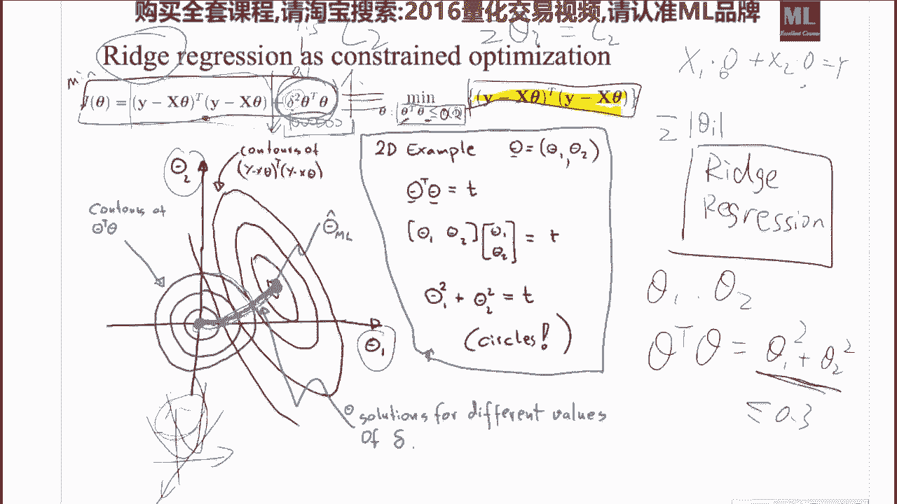

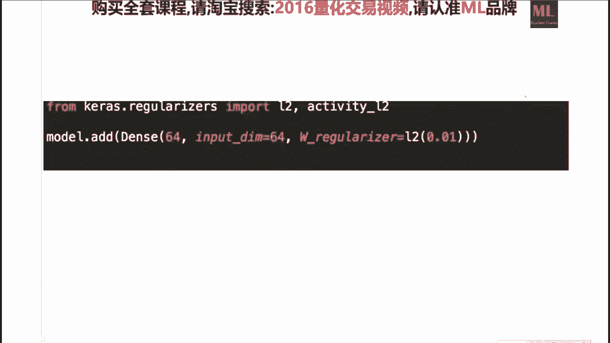

我们把这个就是我们把这个嗯，这样我们把这个嗯i，i的平方，我们把就是一些数的一些平方和叫做l2 ，我们把一些数的绝对值，它叫做l e啊，嗯名字而已，好，那么我们看就是比如说我们对于一个平面中的。

比如说我们有x一和x2 ，就是我们训练集中就是x一跟x2 ，如果我们做一个线性回归模型，那么它就是一个线性的一个超平面啊，就是三维空间中的一个面对吧，那么如果我们做一个非线性变换。

我们把x1 x2 分别嗯都平方一下，我们再拟合出来的这个平面呢，它就是一个啊曲面了啊，这个也是很常见的一个事情，就是也是比较好理解的一个事情，嗯有问题没有好，那么我们接着接着往下走。

ok那么比如说我们可以把你直接把一个x，我给它干成一个14位的一个嗯，就是我们给它干成一个有14次方的这么一个，多项式行不行啊，完全可以没有问题，然后那么一个比较合理就是防止因。

如果你要比如从从一次给他干干到14次，那么一定要注意的是，你我们一定要加这么一个所谓的正则项，就是我们对这10 14个变量，我们做一个线性回归，我们一定要加一个这个所谓的这个呃，l two norm呃。

就是说我我我们要加一个这个二次方的，这个正则化项，前面这个要要有一个系数那么一样的问题，如果当这个系数特别小的时候，就相当于我们这一项基本没有，如果这项基本没有的话，就相当于我们对一个14次呃。

对对一个14次的多项式做了一个线性回归，那么如果我们没有惩罚这一项，就会让它过拟合，什么意思，当这个数特别小的时候，基本上我们这个曲线就会非常的曲里拐弯，就会就会基本上让你训练集中的每一个点。

都会通过它，就让你的这个训练误差为零啊，这是一个很不好的事情，那么如果它特别大特别大，说明什么呢，我刚才已经教过大家了，如果特别大的话，这些系数都会倾向为零，就都就这些数都会特别小。

就是如果这个德尔塔平方特别大的话，这些c大都会特别小，这些c档都会特别小，就是会就会让这些让让这个曲线特别不敏感，就是就相当于劝你喝这个就是过拟合，这就是欠你喝，那么我们如果选择一个中庸之道啊。

选择一个合理的这个德尔塔呢，就会让他哎长得不错，基本上都通过了，同时在刺激中啊玩的也不错，那么一个关键的问题就是，哎这个字他怎么怎么选，你说是1。25，我还说了2。8的，到底应该是几。

ok那肯定会有差异啊，你看差异差异就在这，如果我们纯用纯用一个xz跟s2 ，我们拟合出来的是一个平面，是一个线性方程，如果我们做了一个平方向的话，我们拟合出来这个决策边界是一个曲面。

平面和曲面是有本质的区别的，嗯就是嗯差别就在于一个是线性的，一个是非线性的好，我们接着看，那么这个kernel regression呢，kernel regression是这样。

康纳康纳尔干人干的更酷哈，是一个常见的一个变式，它是这样，它就说是什么呢，比如说我们看一维的哈，这个是大家一定今天要听明白的啊，因为这个事情是我们以后，或者你以后要预见到的一些和方法的。

一个最重要的一个解释，他是这样，我看哈，就是说我对这个x刚才那个对x的那个变换，是一个很打义务的一个变化，比如说我直接对x就给他嗯x一的平方，x2 的平方点点点x n的平方啊，就比如x t的平方啊。

就是对他的一种多项式的一个变化，而kernel呢他是说我对每一个x，我给它变成一个这个样子，什么意思呢，先不看数学，一看数学就晕哈，那么我们从图上看是什么意思呢，这个是x，比如说我们x是一维的。

这个是y对吧，那比如说我们观测到的这些点，大概长的是这个样子的，这是你看到的点，训练集中的点，就是你有一个x有一关，这是你观测到的一些点，那么比如说真实的，如果你开启上帝视角的话呢。

它真实背后的这个分布，它大概长的是这个样子的，比如说它是长的是，长得是这个样子的，ok那么我们现在的目标就是说，我们能不能求出一个函数，这个函数的解解析是我们算出来，它是这个样子的。

那么这个就是我们的真实的目标，我们怎么做这件事情呢，我们做的方法很简单啊，我们做的方法很简单，我们就是比如说在x等于一，x等于二，x等于三啊，x等于四这些地方，我们画一些正态的分布啊。

就一些bell shaft的一些一些curve，相当于一些鸡，这些小曲线如果我们对它进行一些缩放，就是每一个这个东西，每每一个这个相当于有点像正态分布的这种呃，呃呃啊。

对称的这些东西就叫我们的这个所谓的kernel，这个函数，它是由一个超参数，是这个这个拉姆达跟他这个呃缪，这个缪就是我们的这个均值，就是我这个对称点的这个地方啊，那么这个拉姆达呢控制的是我的这个宽度。

就是这个这个的宽度，这两个是超参数是需要你定的，ok那么我们要干的事情是什么呢，我们要干的事情就是说我们的y呀，y值它就应该等于一系列的这些kernel，的一个线性回归，也就是说我们要让这些。

如果我们对这些东西进行一种线性的组合，比如说嗯嗯他是1。2+2。3+6。5，从理论上是能证明我们能拟进任何函数的，以任意精度什么意思，比如说嗯嗯如果他是1。2+2。3，这两个是1。2+2。3的话。

那么就是你给我一个x，我算一下x再上再这条线上的值，比如说是1。6，再算一下x在这条线上值，比如说一算是0。6，那么就是1。6+0。6乘以一个它的系数，1。2就能到账，那么就是说我们要学出来。

那么我们就用之前的这个领回归，或者拉手做一个这样的线性回归模型，我们就能把这个嗯真实的曲线逼近出来，那么一个一个问题，问题在哪呢，就是我们怎么选择这些这些函数，就是我们怎么选择它的数目，这是第一个问题。

你想用八个呢，想用十个，这是第一个问题对吧，第二个问题，你如果想用十个的话，它们分别就这些机应该放到哪，是应该放到1234呢，还是5678呢，还是嗯1。5还是2。8呢，嗯有一个很很简单的一个trick。

这个trick是什么呢，就是说我在每一个训练集等x出现的地方，我都放一个小盒，我对只要我训练集出现了一个x，我就给他来一个小盒，这个和怎么计算的，就是e的负拉布达分之1x减去啊，mi的这个平方啊。

那么这个是一个方法达，这个是一方法就造成了什么呢，造成了如果我们训练集中有1万个点，那么我们如果训练集中有1万个x，就是我们的训练集，如果是10000乘以，比如说x是50为的话。

那么我们给它做完变换之后，我们每一个每一个点都有，那么它就会变成了呃一个呃，每一个每一个点它它都是1万为的，就是他这个维它它的这个维度啊，是跟你的x的数目相关的，跟你的x的维度是没关系的。

是跟你x的数目x有1万个，又由于你在每个x处的点都有一个小鸡，那么我们这个y呢就要对这1万个小鸡，对这1万个小鸡做一个线性回归，那么这个呢计算复杂度就比较麻烦了啊，我们有没有一个好的方法呢。

还有就是说我们在呃这个训练集中，我们做一个所谓的k means聚类，就是这个k你可以自己定，比如说我k我定成，请你给我定成20个聚类中心，那么我就只需要做20个小鸡就行，那么我们这个y值呢。

就是对一个20位的一个变量，做了一个线性回归，这个也是啊同样常用的一种方法好，那么呃它有一个名字，因为这个方法很重要，它有两个名字，一个名字叫做rbf径向基函数啊。

redis被rr应该是read this basis function，还有一个名字叫做kernel kernel function，这两个名字都是很常见的一个事情，这个跟嗯嗯嗯。

我们以后会听到的所谓的高斯过程回归啊，里头的这个所谓的核方法啊，它是嗯讲的是一个事情，ok这个是今天最美妙的一个呃呃呃啊，线性回归的一个应用啊，这个在金融中有大量的地方啊在使用啊对啊。

希望大家能够掌握嗯，留三分钟的时间提问，对核不一定是只是高斯核，而高斯核是一个很常用的和任何的，就是说呃给大家讲一个技巧，就是任何其实和干的事情是计算相似度的，你任何一个相似度度量的一个函数都可以。

那么你们在svm中就会学到一个定理，只要这个和它所对应的矩阵是一个半正定矩阵，它都是一个不错的和，你最简单的和你可以，你比如你那最简单的和是什么，求求个点点点乘啊，x跟y的点乘，你想哈x跟y的点乘。

其实就是一种相似度的度量，因为当它当它是垂直的时候，他们点乘为零就说明它很不相似，当它呃最大的时候，说明他们都在都贡献，就说明他们很相似，对通过通过这个这个k means来确定核的个数。

是非常好的一个方式，r b f里头不包括k miss这一步，r b f盒里头就是正常的r b f函数，是需要你告诉他有几个核的，跟这些核是跟谁来计算的，sk 2里头有一个rbf。

这个函数就是也是在sk 2点data set里头计算啊，这个r b f啊，那么你是需要给他指定这个事情的啊，你这个你其实这个其实没什么，只要嗯你如果学过调和分析的话，你就知道，这些东西就是一些鸡。

而我们学坏的这个东西就是在泛函空间中嗯，由这些基表示了一些坐标，比如说你父列你这态你就想成你这样，任何函数是不是能写成多项式，无穷个多项式的和泰勒定理吗，嗯一样的，就是说只要他们这些鸡是正交的。

这些机是垂直的，就就就相当于坐标变换，你们在一个泛函空间中，你们对一个函数进行了另外一种表示方法，你复列级数也也是一种表示方法，对不对啊，你这个啊泰勒级数也是一种表示方法啊。

那么你这个任何的这些kernel的这些函数，给它加起来也是一种表示方法，没有问题，是一回事啊，大家有人会这个傅立叶，我非常欣慰啊，这个这个对跟芙列变换是本质是一样的，kernel的参数是你得给他。

ok我马上就要说这一点来咱们看请上车，你看哈一样，我们这科no，你看啊，如果我们的这些小鸡，它这个这个拉姆达太小了，这些小鸡就就就很瘦，这小鸡很瘦的一个结果就是嗯就是过拟合，如果这些小鸡都很大。

你把这么多这么多很大的这些小鸡，你全加起来呢。

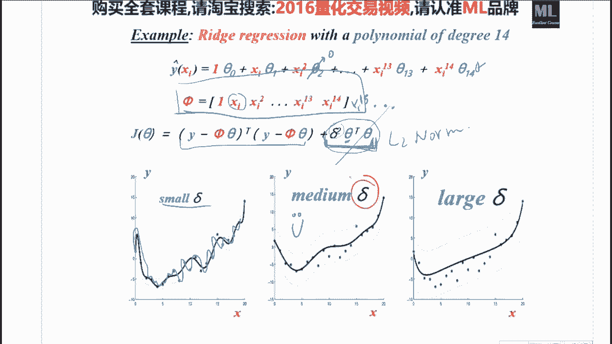

拟合出来就是一条直线，你如果选一个不错的一个这个拉姆达的话呢。

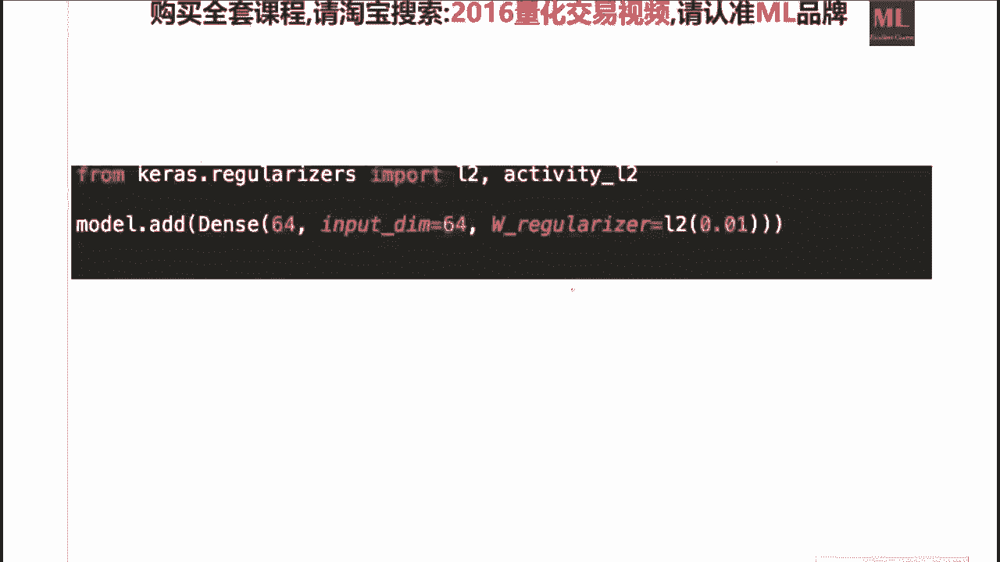

唉一样我们就会拟合的很漂亮，我们在测试集上的效果就很好啊，我们就有可能有不错的回测效果，大家都开心，那么核心问题你看我讲的是一致的，我其实今天所有的话，就是我今天的讲课逻辑是是是串下来的。

你想找一个合适的拉姆达，跟我们之前看，我们想找一个合适的这个德尔塔啊，跟我们再往前看啊，我们想找一个这个合适的，这个合适的这个这个东西，跟我们想找一个合适的，就是跟我们这个在这个框架的不合理的地方。

其实都引入了，我今天要说的另外一个工程上的一个事情，就是这样，如何选择我们的这个一些超参数，比如说是这个科闹的这个大小，就是比如说这是这个灯塔，或者说我这个poly no 6。

就是说我这个x到底是14位好还是18为好，这个东西我们怎么办，我们用这么一个方法叫做嗯，嗯cross validation的方法，这个是嗯我相信做机器学习的人司空见惯，但是嗯如果做统计的话。

或者没有接触过这个的话，嗯会嗯嗯不是很适应，我们先看我们传统的方法是怎么做的哈，我们传统的方法是，我们从金融数据库中拿到了一些数据，这个是x我们有对应的label，这个是y对不对。

那么我们把这个x和y呢，我们分成了70%的训练集，30%的测试集，我们在这70%的训练集上，我们给定了一个，比如说德尔塔，我们给定为1。5，然后我们学习出来的一个这个r b f啊。

不是我们比如学习出来的一个laso，然后我们获得了一个model对吧，没有问题，然后我们怎么样给别人说，我们这个model的表现性能呢，我们就是在这30%的数据集上，和我们已经训练好的这个laso。

已经训练好这个拉，so然后我们得到了一组这个预测，然后在这个30%的真实值上，我们计算一个他的这个误差，也就是说我们的这个performance有了这个之后呢，我们就可以给别人说啊。

我们这个这个这个这个测试集的误差，比如说是啊95%的正确率，就说明我们一个分类任务，95%的情况下都是对的也行可以，那么一定走到这儿的时候，你不要不要就停下来了，很多人走到这儿的时候就停下来，就直接上。

直接去上回撤了，直接上回测有一个什么问题呢，你会发现你的这个模型只吃进去了，70%的数据，你浪费了30%，对不对，你这30%你只是用来了汇报了一下，你做的怎么样，但是对我学习参数这件事情我没用上啊。

比如说我要做老素，我要求这个transible x它的这个逆呃，不是加一个德尔塔德尔平方，我没用上，我这个30%的x这个太亏了呀，对不对，那么当我们确定这个玩意儿不错的时候，我们要把要要要回头过头来。

把这70%加30%的数据放到一块，再重新去再给一个德尔塔平方，比如还是1。5的情况下，再重新训练一个final model，你在哪去做回撤，这一步是很多人忘的，就这一步是很多人忘的一个事情。

有应该没问题吧，好那么这还没完，那么我们比如说当我们有很多的，比如说我d的平方，我想取一强取0。5，想取0。2，想取0。01，在这种情况下，我怎么挑一个合理的der塔呢。

如果我们直接在测试集上选就就不行，在测试几点就叫所谓的这个data snooping，就是从统计学上来说，你这样做的话，只会挑一个利于你的一个结果，而这样的话很可能在真正的呃呃嗯嗯。

现实的这个呃预测过程中，他表现不是很好，那么我们一个科学的做法应该是这样，还是我们拿到的这个数据，这些x跟这些y，我们拿70%的数据当训练，这没有问题，拿出15%的数据当测试，这也没有问题。

然后我们拿出来15%的数据呢，当做一个叫所谓的验证机，叫做validation set，这个wifi怎么用呢，是这样，我仍然在70%的这个数据上，我训练这个模型，但是训练模型的过程中，我给这个模型。

我让德尔塔等于1。5，我让这个模型德尔塔等于啊0。2，让这个模型德尔塔等于一的0。1，就是你把所有可能你觉得想试的东西都让他学，学出来，你就会得到一个model 1。

model 2跟model 300分之70的数据嘛，不同的超参数嘛，学出来了三个模型嘛对吧，旋转了三个模型之后，你需要分别在验证集上选，就是你学出来的模型一，在验证集上得一个95%的一个分。

全外的模型在验证机上啊弄一个啊，这个百分之八十八十八的一个分啊，这个大概比如说是75%的这个准确率，那么你这三个模型里头你会认为啊，那么我这个最最好的这个模型呢，应该是这个啊model one对吧。

那么这个是应该model one，你有了这个model one之后啊，有了这个model之后，你再就就确定了这个model one所对应的这个超参数，它应该是比如说1。1。5，对不对。

当你确定了这个操参数之后，你再在这个70%的训练集，跟15%的这个验证机上，结合你最好的这个1。5的这个超参数，你再训练一个你的这个模型，就是你这个best model的一个升级版。

就是你多看了15%的数，然后你再在你的这个，然后你给别人汇报，就是因为这些东西都是你自己在家偷偷啊，两个人之间比赛的时候，你这是你自己选的，你选完之后，你你张三跟李四之间说，唉你你的准确率怎么样啊。

我的是95，这个95是你你升级后的那个best model，跟你的这个测试集上的一个performance，比如说大概就到了95。3%，这个是你拿出去跟别人比这个数，当你比完之后。

你觉得哎这个数确实不错，你要真正让要让它进入生产过程中的时候，你在用百分之百的这个数据进行一个训练，跟你确定的这个超参数得到一个final这个model，然后然后最后写论文的时候。

或者说你最后你写汇报的时候呢，你汇报的是这个准确率，使用的是这个模型，ok那么嗯一个嗯我们的操参数很可能不止一个，比如说在svm里头，它需要有选一个c，需要选一个这个伽马，那么这个c的这个值呢。

一般来说有可能是比如0。5啊，啊到1~1点五啊。

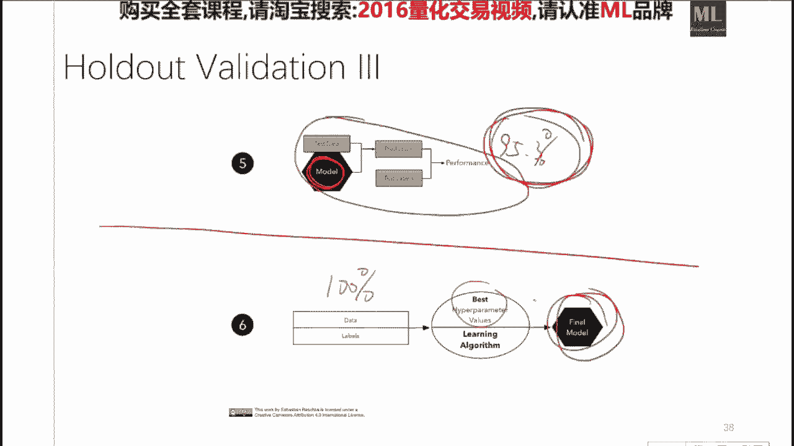

到啊五啊，比如说就是你把你根据你把你想试的这些数，你全都很暴力的，你写出来一个列表，那么这个伽马呢，它也可以是从0。011直到很大嗯，到100~1000对吧，那么他们这两两之间，每两两之间一个组合。

就代表着一个新的模型对吧，那么这个s v m里不是这个sk 2里头呢，它有一个非常方便的一个这个这个这个呃，cross validation这个函数，你就需要参传入这这两个超参数的列表。

它就自动的很暴力的，两两的就两两的就就计算出来啊，这两两操参数的对应的这个模型，在验证集上的一个呃性能呃，呃0。9就是颜色越白，它的这个性能越好，颜色越黑，它的性能越烂。

那么你就能画出来一个所谓的叫做热力图，heat map，画出这个热热力图来，热力图上的每一个小方块就代表着一种模型，超参数的组合，那么我们看这个表就能看出来啊，超参数的组合是这三个的时候。

它的模型性能是不错的，你就一眼就能看出来了，那么当我们超单数大于三个的时候，我们就就就就不能这么画了，我们就得222个两个的超像素，分别的画这个热力图，大家有问题没有，这个是最笨的一种方法。

但是其实一般来说这样做就就够了，还有一些启发式的算法，就是说我不想把这些玩意儿全算完，这不是太累了，有有些比较聪明的算法，你们看s v m里的这个quest lidation，它有一种用一用遗传。

基于遗传算法的方法，我算完这个点了之后，我就就以一种启发式的方法，我直接算这个点，然后再算这个组合，然后再算这个组合，就是我避免了吧，所有完所有东西都算完，因为这样算的话，太慢了，那么嗯嗯嗯嗯嗯嗯。

当然另外一个事情，就是说我们一定如果n sk ln的话，最好把这个事情能够并行化啊，这样的话能够大幅提高你的这个呃，呃交叉验证的这个这个效率，ok啊一点一点看复联在时间序列里头很有用，因为父列这个东西。

它非常有助于帮助你寻找一些周期性的规律，就是说你可以干的一件事情，就是说你在他的频谱域上，在做这个线性回归模型，操参数有木有一般范围啊，有就是说嗯，不同模型的这个超参数一般会有一个经验值啊。

默认有有的一般是0。1，有的是0。01，有的是一啊，这个不同的模型，因为不同模型它的超参数的意义不一样，呃这个你只要稍微查一下，你看你在用哪个模型，在今天介绍的模型中，一般是0。1或者一就大差不差了。

一般是啊，比如说蓝色的话还是0。1，我觉得是一个比较比较正常，和人类的一个选择方法，然后一般sk 2有一个非常好的地方，就是sk 2里头所有模型的超参数，它都给你帮你提前设好了，一个默认的就是根据啊。

大家老百姓们平常的这个多年的临床经验，证明啊，一的话就问题应该不是太大啊，你就你就你就你就用就行，但是不进行cross validation，就是不做这个事情，你的操参数的选择永远是盲目的。

也就是说比如说你告诉我，你闭着眼睛选了个c跟，闭着眼就闭着眼睛选了一组超参数，就是我脑袋一拍，我认为0。5跟一啊，然后你告诉我，在我脑袋一拍的情况下，我学会的模型的表面性能是90%。

那么你有极大的可能性，做一点比较仔细的这个超参数的选择，你肯定往上干1~2个点是很有可能的，ok啊这个c跟干嘛，这个是svm这个模型里头来的嗯，这个嗯就另外一件事了啊，你可以把它看作嗯。

比如说拉兽只有一个超参数，但是有很多其他的模型，它的超参数是多于一个的，超参数本身，你可以用贝叶斯方法的这个态度来对待，就是说你可以把每个超参数看作一个呃分布，但是这个嗯也我们大家目前可以不用去啊。

关心这个事情，ok啊，我们看一下这个basis到是这个东西吗，这个东西我们不用挑x，我们只需要挑这个，我们只需要挑这个挑这个g的这个位置，基的这个位置，一般来说对x做k means，做k means。

那k个聚类中心我们就定位，就是说我们这个缪的这个位置就行，ok啊，是不是，这个东西就是说我们到底是x的一次方呢，还是到十次方，还是80次方啊。

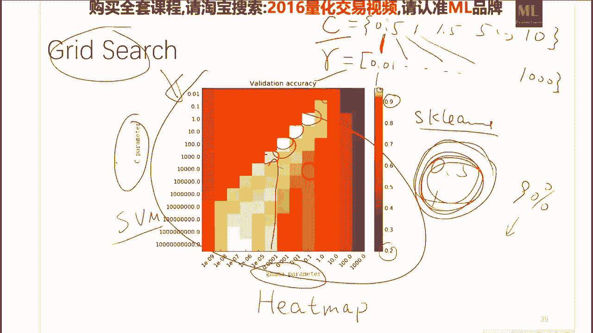

嗯很不幸啊，没有什么套远思路，老中医的来啊，一般来说嗯根据所谓的奥卡姆剃刀原则啊，模型越简单越好，越复杂越越危险，如果你模型比较简单，就把你的事干了，一定要选简单的那个模型，因为大自然一般是以比较简。

单的规律来呈现的啊，miui是这样啊，每一个miui就是它的这个他的这个这个地方，而这个mi呢是我们对比，如说我们对这个x做了一个五五聚类，那么这5g类的这个聚类中心，就是我们这一个没有的这个坐标。

啊我不建议考虑，因为其实嗯其实这些东西就是一些，你可以你如果这个其实就是嗯就是这些东西，它其实也构成一组基，对不对，他们在泛函空间中，他们也是两两垂直的，嗯就是说你x一点五的话，不必要，而且没有意义。

k means在空中，ok我们现在不是关键，就是说我们现在既然已经知道，我们能对这些一些这个这些机做一个线性，线性的回归嘛，那么一个嗯很很重要的一个问题，就是我们怎么样选择这些这些基的这个位置。

那么这些机的位置和这些鸡的数目，那么我们要确定这些鸡的额数目的话呢，我们可以人为的确定，我们就就说比如说就是50个啊，那么具体在哪呢，我们就对这个训练集中的x的这些点，我们做一个50聚类。

这50g的聚类中心，就是我们的这些基的这个位置，对这个特征值增加没有什么思路，就是纯靠经验，而且根据奥卡姆剃刀原则，你三次方做的不错的，你就别干到十次方了，每个科诺的拉姆达呃呃你可以都都不一样。

但是目前其实都一样，就已经做能做的可以了，还有人甚至想把美克拉姆达做成一个随机变量，但是不必要不必要啊，你因为其实我们最后拟合的是这个c塔，那个拉姆达，你给他取的一样就行，没有什么理论依据。

就是大家觉得这样做是一个，非常符合直觉的一个事情，就是在在这些x出现比较集中的一些地方，我们做了一些基的这个拟合，ok k面是也没有什么开麦，就是一个非常好的一个嗯。

就是满足k means所对应的那个损失函数的一个，有效的非监督的通过迭代的方式来寻找它的嗯，聚类中心的一个方法，没有什么特别的地方，ok说了这么多，然后我们现在也有了数据了，也知道怎么建模了。

关键就是我们这个x怎么定义，就是说我们对于每一个时刻t请你，就比如说我们要做一个，这个沪深300股指的一个预测，我们对于每一个时刻t，比如说每每一天，你能不能给我一个输入的这个向量，比如说它是50维的。

然后我想预测这个在t加一时刻，他这个是x对不对，t加一时刻这个y值它应该是多少，比如这个y值就应该是price of t加一，这个是我们要预预测的target，那么我们输入呢，就是上一时刻。

我们能计算出来的很多的这些features啊，这个就是量化的一个关键了，那么我们如果有了这些x，有了这些y我们用今天学到的呃，线性的方法也好，跟我刚开始说到的，sk里包含的各种各样的方法也好。

我们就能学出一个映射关系来，那么我们在每一个时刻的时候，每一个时刻的时候，我们计算一个x放到一个呃呃呃函数里头去，这个函数在这个时刻告诉你，它下一个时刻的y应该多少，你做预测就行了，就是这么简单。

那么关键就在于我们怎么定义这些x呢，各显神通，各种各样奇奇怪怪的定义方法，比如说我x可以有这个之前的一些，价格的信息啊等等，还有一些他的这个volume啊，没没有问题，然后什么high啊。

这这low啊等等的，那么在在这个链接里头，我给大家送上了一份啊小礼物，这个链接里头就是把所有的技术分析的，这些指标全给你罗列了一遍，就是目前常用的市面上的，所有的技术分析的指标全体成罗罗列一遍。

那么今天的作业就是请你把这些东西，这些指标写成函数，就是说比如说我们一个moving average 5，这是一个指标吧，那么请你写成一个函数，它是一个function。

那么就是你用你用python define啊，ma 5输入的是一个x，那么我需要return的是这个x的一个嗯，嗯这个嗯ma啊，就是说嗯今天这周写完没关系，反正你们慢慢写，嗯我们在下周的时候。

我会告诉大家具体怎么样的啊，有哪些呃注意的地方，然后那么这些东西是我们构建这个x的一个呃，主要的源泉啊，所以你可以共享到你自己的giub，也可以发给我，ok嗯嗯第一次作业。

第一个交给我的同学有一个物质上的奖励，而且不是很low啊，邮件就行好，最后再给大家留啊，三分钟的时间提问，要选，因为你想啊，你如果要用k means，你其实只能定定出来的是这个东西。

你k means只能定出来这个m，你这个拉姆达是你k means是mean不出来的，你k means只能mean在我这些鸡在哪，但是我这鸡长得多胖，就是我下一章说的，我这些鸡在哪，我k means能定。

但是这些鸡有多胖呢，是我人为定的啊，第一个是昨天的作业，今天这个作业我并没有强行的要求，因为这个但是我要跟大家说的是，如果你已经开始做量化的话，这个是一个非常好，非常好的一个。

你的一个idea的一个一个一个一个地方啊，这个时间序列的问题，我们呃这个是今后说的事情，跟今天说的嗯没有关系啊，那没有，这这个我是你，你不要管这个事了，就是说我们就是说我们要做ma 5的话呢，我们干嘛。

我们的输入是一个t对吧，输出的输输的是一个时间的take，对不对，跟跟他的这个呃跟跟你的这个时间序列，那么我输出的输出的是什么呢，输出的是这个我是一个数啊，是一个数，是ma 5，这个数。

你自己去看这个嗯，网页中的这个定义，你就你就知道怎么做了，kona supra在实际中怎么选啊，在实际中三个都做一下啊，course validation啊，去每个谬附近的方差可以决定入。

嗯这两个是独立的事情，这两个超参数是互相独立的，就是你你他它长它这个这个这个肌长在哪，跟鸡有多胖，这两个事情没有任何关系，拉姆达就是这个鸡的这个，他的这个其实是他的这个virus嗯，你可以看到它。

你可以想成他的这个胖瘦吧啊，ok接的接的个数可以比完全可以比x的尾数多，没有问题，因为比如说x维度是二维的，我有八个聚类中心，这个是完全合理的一个事情，嗯其实嗯，其实这两个事情就是说难联系。

其实你只要习惯了它，其实本质上是嗯本质上是一样的，本质上是相当一样的，这个背后啊，郑余全，其实郑一轩就是就是这个这个父列级数，但是嗯目前用的人已经很少了，我没有见过嗯非常著名的成功的案例啊。

这个kernel你不用理解相似度，这个kernel是在其他的语境中，比如说你在做高斯过程回归的过程中，这kl把它理解为相似度，比较好理解，而在这个里头你就把它理解成一些基的线性，一些基的线性变化啊。

一些基的线性组合是最好理解的，不要不用理解为相似度，怎么理解相同也能理解，来咱们理解一下啊，来咱们现在理解一下，看定义，这个科诺其实就是每一个x每一个你看啊，你训练集中的每一个点。

你训练集中的每一个点啊，都跟这个kernel求了一个相似度，对不对，就相当于你对这个呃，你你把这个原来的这个数据进行了重新的一个，feature的一个表达啊，那么你这个你你你x离它越远，就是你这个数。

就就比如说我我有一个新的一个x它它在这，那么新的x它在这，他跟他要求的话，他就就跑到很远的地方，就说明这个机对它的影响就比较小，所有技术比较麻烦，不是比较麻烦，就是说嗯就是说如果你这么做了。

其实你是对他做了一个傅立叶变换而已，所有技术指标都是量价计算得来的，x中只加量价，再加上其他内容的，可以啊，你完全可以加，你可以加任何，你甚至可以加这个新闻啊，你新闻的一个你把新闻进行某一种编码之后。

你放进去也可以，没有任何规律在约束着你不能干某个事情，你也可以加上今天的心情，但是这个只不过也许不大好使啊，但是嗯就是说就是说他这个建模最好玩的地方，就在这儿，就说建模的嗯，建模的这个嗯嗯嗯。

最大的乐趣就在于你建立的模型，是你对这件事情的一个理解的一个，形式化的表达，比如说我认为比如说就是你哈，你如果认为这个事情，他的这个输入应该考虑到了某些新闻文本，那么你在建模中就把它加进去就行。

然后你再通过做实验的方式来验证你的想法，是对的还是不对的，这个是所有乐趣的地方，就是我怎么样建立这个模型，跟怎么样选择x，也是所有的这个乐趣都在这个里头，具体的卡点数据，这个是最最痛苦的一件事情。

没有什么乐趣呃，我不认为这个呃仅支撑跟这个事情相关的，我只认为应该是呃，因为讲说实话哈，因为如果你们学过傅立叶变换的数列变换的话，你们就知道呃这个嗯嗯如果你在这个频谱域中，你跟他做啊。

无穷多无穷多次卷积，任何信号都会趋向于一个正态分布，所以说嗯应该是正态分布，它的这个比较符合自然规律吧，嗯大概是基于这个理念，而又由于很多大自然的这些数据的sample。

都是也许在某种程度下满足一些大数定律，这样的话就会造成你如果用一个高斯核，会比较比较方便吧，我觉得嗯有有一点关系，就是他们都是所谓的啊，这个梅斯河啊，就是他们表达方法来看都是一样的。

但是他们的目的是嗯不大一样的啊，svm中的核，是为了对输入做一个非线性的一个映射，映射到无穷维空间中之后，在那个空间中求一个点击，再回来，它跟这个变换本身啊意义不大，他只想知道这个变换的。

这个变换后的点击的结果，而镜像机的和更多的是在考虑一个，我今天说的这个东西啊，ok如果没有什么其他问题的话，今天就到这里，今天呃就不留作业了，然后我给大家留的那个ipad snotebook。

大家一定要看啊，那个ipad notebook里头就是今天讲到的啊，这线性回归啊，科啊这个这个呃呃la sol跟rich，这这这三个函数在sk那里具体是怎么用的，我就啊就就就不不浪费时间。

在这给大家讲代码了，大家回去要看一下，然后由于昨天的这个作业大概比较重，所以今天呢就主要是大家啊，做一个下节课的一个热身活动，了解一些比较重要的，这个就是从线性回归到，目前大家工业界都在用的各种的线。

线性模型的方法，那么希望大家在未来的一周啊，多花一些时间放到作业上，然后嗯多多跟数据打交道，你的感觉就会越来越多啊，那么今天就到这里。

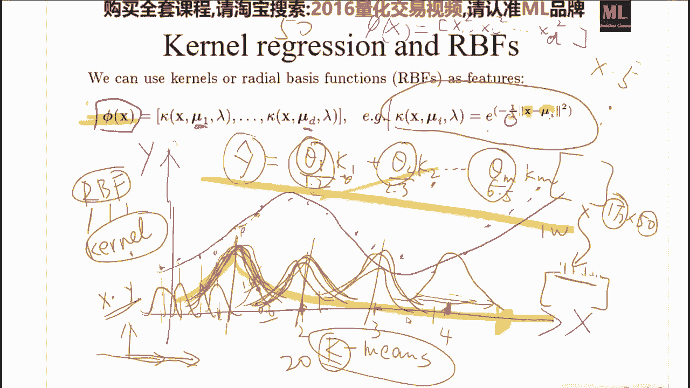