# P5：第05课_机器学习与量化交易项目班 - 大数据狂人 - BV1V24y1Y7eY

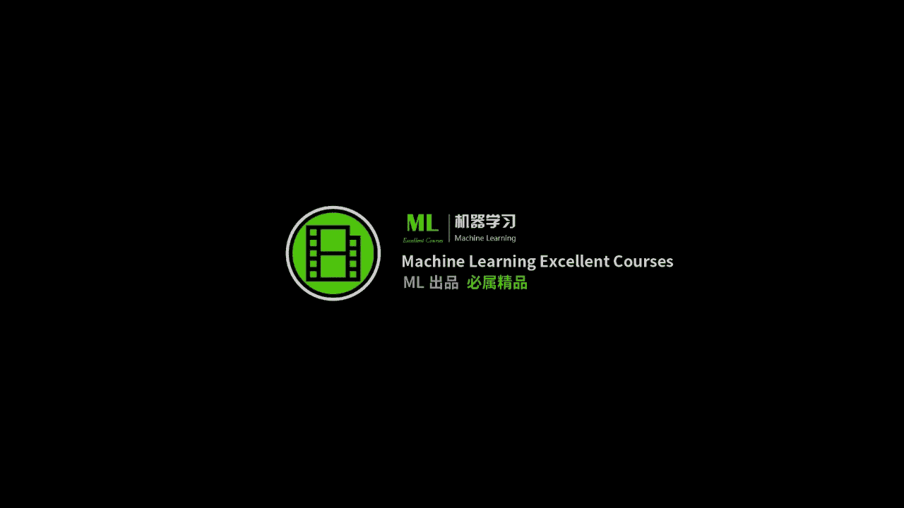

ok那我们今天就开始我们的这个呃，第五讲的课程啊，因为好像这几天我看到又有新的同学加入了，所以如果新同学在嗯，就是说在在理解我们接下来的课程中，有一些问题的时候，不要着急，如果有什么问题。

你直接跟我呃问就行，因为啊然后呃其实从这节课开始，我们的真正好玩的地方才开始，所以说倒也倒也没关系啊，嗯ok那我们现在开始正式上课，ok啊，第一次作业，第一作业第一个教的同学是比较快的。

是星期一晚上就交了，然后后来的其他几个同学也都陆陆续续嗯，目前我收到的有效递交者啊，对错先不论啊，目前应该是这些个同学啊，如果有漏的，你可以跟我说一下，因为我还没有批改完，所以说还有是有些同学是想。

就是说想让我明天明天晚上的那节课讲，那也行，我想着那就再多给一天吧，那么另外关于交作业的一个格式，有这么一个建议，就是说呃大家最好给我教这个呃一呃一个notebook，就是说嗯包括了。

就是说这个notebook就包括了你的这些函数调用，跟这个呃呃print出来的这个结果，因为这样的话，我就不需要直接的再重新跑你这个程序了，因为我不清楚你用的啊语言跟包。

还有一些其他的这个环境是否跟我的环境一致，所以如果你能提交一个比较，就是已经已经有结果的一个ipad notebook的一个，这每一个demo会嗯会让我对，会让我能够更有效的给你的作业的结果，提出建议。

因为毕竟我们这个不是一个编程的课啊，我们最重要的就是说，你你能得到的最有效的反馈，其实是你已经编好程序的结果，然后我告诉你啊，怎么样做会改进，这样的话收获会更大一点。

然后另外就是如果你写了一些比较复杂的函数，嗯嗯嗯如果放到这个notebook里头，它不是嗯不是一件很优雅的事情，所以你可以单独的把你的这些啊，helper的这些函数啊，跟notebook一块提交。

然后你import就行啊，这个都没关系，嗯关于关于作业，大家目前遇到的就是没做完的同学，目前遇到的最困，最困难和最头疼的地方呃，也可以啊跟我说一下，ok那这个应该嗯就先说到这儿啊。

有什么需要补充的地方吗，大家关于作业，觉得难度啊，或者说嗯难度方面，如果就主要针对还没有教的同学啊，不咱们先先先都聊作业，先先先不闲聊啊，嗯对齐确实对齐的话，我建议大家看这个啊。

我给大家的那个呃一个参考书，就是python跟金融数据分析那块有专门的地方讲，一个是对齐，一个是清洗这个细枝末节啊，就是会就行了，那那那那好吧，那我们呃去这个这个问题咱们就不在课上说了，咱们往下走啊。

ok那么我们现在先看一下这个，我们往回退一步啊，我们看一下我们现在到哪儿了，那么我们之前嗯大概用了两次课的时间，学习了怎么样的从这个获得数据，并且把这个数据存起来，但是现在的问题是什么呢。

现在问题是我们现在存下来的数据，它其实是一个原始的一些呃，就是嗯就是所见即所得的一些数据，并没有经过一些这个变化，也不能拿拿来当做这个训练集，ok那么这个，但是但是这个就相当于你要开一个饭馆。

你得把菜先买回来，然后你再说是你炒川菜啊，炒卤菜啊，你做西餐啊，你才能做，那么我们现在是相当于有了菜了，有了菜了之后，我们现在呃看看怎么样的拿这些原材料，我们能做点东西出来，那么这节课跟下一节课呢。

呃是最有意思的两个事情，就是说主要是我们怎么样呢，把这个数据进行一定就是一定程度的一种转变，转变成我们的所谓的这个训练集，或者说让模型能认识的数据，这第一第二呢是我们我们怎么样的，基于这些数据。

我们来建立一些预测的模型，这个是我们这周需要关注的事情，然后我们接下来要干的事情呢，就是说所谓的建立一个基于事件的回撤的，这么一个一个流程，因为你的策略跟你的模型其实是两件事情，这个是我要强调的。

就是说我要警告大家一件事情，你建立一个好的预测模型，就是说你这个模型能够精准的预测，明天是涨还是跌，跟最后的你这个策略其实是两回事儿，后面那个事儿比这个模型还要复杂一些。

因为有更多的一些其他的因素要参考，那么我们这一周呢主要关注的是第一件事，就是说我们好歹先得预测的比较准对吧，你预测准了，我们就能拿着你预测准的这件事，我们就能说事了，就能就能基于你比较预测准这个东东西。

就能找到有可能挣钱的点了，但是你如果预测都不准的话，你想做一个好的一个strategy，那是更不可能的事情啊，就相当于你有一个好的模型，相当于给了吧，你好枪，但是你怎么样呢，打赢这场仗呢。

那是另外一回事，那是策略的，那就是对，那那是完全就是说呃是两个，你最好把它看作是两个独立的事情，而且如果你在一个团队里头的话，也很有可能这个事情是嗯两个人在做的事情，ok那么我们今天就是看我们怎么样的。

拿这个你们你们上周爬下来的这个原始的数据，来建立一个真正的基于统计学习的，预测的这个模型，ok嗯关于我们要讲的这个事情，大家有问题没有，等一下我得回复一下这个同学好，那么我们接着再往下走，ok。

那么现在就是说，我们怎么样建立一个训练集的问题，ok啊训练集是这样啊，因为我这个手写笔，不知道被不知道被谁他妈给拿走了，训练节，我们现在其实是需要建立这么一个，我们现在有的表格是这样子的。

这个是时刻t对吧，那么嗯比如说我们嗯这个t的话，你可以比如说它这个就这个就是时间哈，它会有一个id 1231直点点点，然后我们是已经爬到了一些属性了，就是说相当于，open啊，close high啊。

漏啊等等，就是一些数，这个是我们上周已经得到的东西，那么我们怎么样建立一个呃呃，机器学习能够认识的，这个这个这个这个训练集呢，就说我们需要把你现在已有的这个这个表，转化成为什么。

转化成为转化成为同样是这个时间，这个t对于t的每一个时刻，比如说这个是t0 时刻，你要把它就是说你你你所拥有的t0 时刻之前，就比如说这块是t0 ，就是你把所有的t0 时刻之前的信息。

转化为一组新的features x11 直到x n，然后它对应的就是你的y y是什么呢，y是你要预测的t0 时刻，下一刻的一些你想预测的东西，就是说涨啊还是跌，这是一组。

也有可能是比如说直接就是price of y，或者是啊price of t0 加一，或者是return of t0 加一对吧，那么就是说我们今天的第一件事情，就是说我们怎么样呢，把这个从啊训练啊。

就就是从原始的金融数据，转化成为监督学习的这个framework，就是说因为我我们上节课已经学到了，我们有啊嗯就说监监监督学习的这个流程，那么我们这节课呢，主要就来看我们怎么样得到这些x。

然后我们得到了这些x之后，我们就能建立各种各样的统计学习的模型，来对y进行预测了，当然我然后我们下一节课呢就会基于啊，你所选出来的这些x，我们怎么样的选出来一些更好的，就就是说更好的一组子集。

或者说更好的一些基于这些x的再变换，让你的这些特征的质量更高，因为这个是去呃，其实是在你建模过程中，让你模型准确率比较高的一个决定性因素，就说你的输入的呃呃，数据的质量，对你的这个模型预测的结果。

起到至关作用的作用，而不是模型本身，ok就因为当你的模型足够大的时候，其实线性模型已经做的蛮不错的了，但是当如果你的x的质量很不好的话呢，呃你用什么模型都不好使，这个我也也是我反复强调的。

所谓啊垃圾进垃圾出的这么一个道理啊，但是这节课呢我先告诉大家，你能够选x的方方面面有什么，你先选什么，然后下一节课呢我们来看看我们怎么样的，从这些，比如说你选了300个x，你怎么从300个选到50个啊。

有各种各样的其因技巧，各种奇奇怪怪的方法就都出来了啊，什么遗传算法啊什么的，就是你能想到的很黑箱的一些东西，也有一些很白香的一些东西，比如说嗯基于贪心的特征选择的办法啊，这个也是比较常见的。

但是现在基于生产法的也有，那么我下节课呢就会把常见的比较有效的，这些方法都教给大家，那么也就是说这节课跟下节课两个一，一块儿干了这么一件事情，从原始的金融数据变成训练机。

基于训练集建立一个比较精准的模型，然后从下节课开始，我们就转向了所谓的事件交呃呃，呃事件驱动的交易系统，然后我们会基于这些事件，激动的事件驱动的交易系统，我们来基于再加上你所有的模型，我们来做这个啊。

基于事件驱动的回测和策略的调优啊，就是大致的这个时间分配是这样，然后如果有时间的话，我还会再多教大家几个比较重要的，机器学习的一些方法啊，和一些比较奇怪的数据，比如说文本数据怎么办。

嗯因为其实归根结底啊，比如说你获取金融数据这件事情，每个人都会也没有什么嗯，你做的比他要好很多，或者他做的要比你好很烂啊，坏坏很多的事情，而这件事情就是说你怎么样的选特征，和基于特征，怎么样的建立模型。

这个是在量化这个领域里头啊，他的这个分歧最大的一个地方，就是分歧最大的意思就是说嗯好的能做的很好，差的能做的很差，就是大家的这个水平基本上都在嗯这个地方，这个环节呃呃呃起到了一个作用。

所以说也是做量化这个研究啊，最有趣的地方其实是今天跟明天两节课，那么两节课很可能cover不掉所有事情，所以我会在接下来的课中，我每节课在挤点时间出来，再多给大家介绍一些啊新的思路。

帮助大家来建立自己的这个炼化，建模的方法论吧，或者说是嗯让大家比较开阔眼界，知道啊还能这么干，那么这个是我的一个计划，ok大家有问题没有，暂时没有，好很好，那我们接着往下走啊，好。

那么现在的关键问题就是说，我们怎么样选择这个features，嗯features是比较积极学习的话哈，predictor呢是比较统计，学习的话就是比较偏统计的人，他们把它叫这个叫啊，predictor。

其实就是这个x你就是你这个x的x1 ，一直到呃xd你这些xd的这些指标啊，你们做做这个，做计量经济的喜欢把它叫做因子啊，就factor啊，它是一个东西啊，这个其实它是一个关键。

问题是你作为一个量化建模的人，你对这个模型跟问题的理解，基于你对这个问题的理解，决定了你要用什么样的x来预测，不同的人呢会有不同的选择方式啊，举个例子，比如说啊啊对啊，先先说一下。

就是说他的这个过程是一样的，就是说嗯嗯选择f4 的过程是一样的，但是基于不同的这个哲学方法，和基于不同的信念，会有不同的选择方式，而不同的选择方式会造成不同的结果，所以这个是做实验。

就是但是啊呃哪个更有效呢，是必须得通过实验来决定的，所以所有的你很多的时间呢，其实都会在这个上面做各种各样的实验，就是哎我今天突然觉得加个这个大概可以，那你就赶紧加进去，然后试一下。

然后看一看有没有效果啊，并没有说是有一个嗯完全正确，或者说肯定能证明你这样选是正确的，呃，理论他只能说是ok你选的这一组，在你所选的这个金融产品上确实是works的。

那么ok这个就是你需要非常庆祝的地方，然后我们大部分时间呢，大部分时间呢你都需要做很多的这个研究，来判断你的这个选择是否是正正确的，那么有一个问题就是，如果你学的在选的这个东西不是很好，怎么办啊。

下次课呢我就会教你，你如何从选出来的一坨，也许不是很好的特征中进行自动筛选和变化，就是说啊我大概我也不知道，反正就瞎逼选吧，选了那么几百个啊，但是我也好像也不是，也不知道怎么再提升这个东西了。

那么下次课呢我就告诉你怎么样的，从现有的就是你同事给你的这么一组feature中，你怎么样能把这些feature变得再好一点啊，那么这个是下次课的一个问题好，那么就是说这个基本的方法和原则。

就是因子的选择，取决于你对问题的理解，举个例子，大家认为啊，沪深300股指这件事跟什么事情是有关的，如果你觉得沪深300股指跟比如说嗯今天的呃，人民币汇率有关，那你就就你就你就你就想。

就是说我们在选股之前呢，这个问题其实是呃呃呃，就是说，需要你自己把自己关在一个小黑屋子里头，根据你多年的对经济的理解的经验，和你看的各种各样的论文，和你在任何场合听到的一些话，和你看的一些书。

你起启发到的一些灵感，比如说我觉得沪深300股指期货，或者或者先不说气话，沪深300股指这件事，我觉得他应该跟人民币汇率有关吧，我也觉得跟这个黄金的价格应该也有关系，对不对。

那么我觉得似乎跟美国的这个sp 500的这个，这个指数是不是也有关系呢，而且我觉得他跟就是中国的，沪深300的这个性能呃，这这这这这这个走势也许跟这个嗯嗯嗯，英镑的这个关系是不是也有关系啊。

啊你说的这些啊都是有可能的，所以说我们要干的是什么呢，你把你觉得有可能的东西全他妈都都选进来哈，就都选出来就行，选完之后呢，嗯再通过一些特征选择方法再进行细化，所以说因子的选择完全取决于你对问题的理解。

如果有的时候你灵光一现，觉得这个这个产品，它肯定跟那个东西应该是有关系的，赶紧做实验啊，就是说比如说现在比较火的什么铀矿啊，什么大家花的大部分时间都是在啊，有有有这么一个idea了，赶紧去验证一下。

因为有很多大量的千奇百怪的一些书啊，他里头大概提到了不经意提到的一些话，让你突然觉得这两个事也许是有关的啊，那你就去专门的去做一下，另外就是说比如说呃呃对于这支股票，也许这个呃这个因子它的重要性比较大。

对于另外一只呢，也许它是不是很敏感，所以说对于不同的这个啊金融产品的这个价格，他的这个因子的重要程度也是不一样的，所以你要你要你要做的这个实验的，这个量就比较大了啊，那ok啊，那么就是这样。

你可以选的这个这个因子可以很烂，就是嗯它的质量可以不是很好，但是当你的因子的数目很多的时候啊，每一个因子都贡献了那么一点点嗯，都往正确的那个方向走了那么一点点啊，到最后你的模型就会很好。

那么今天啊在作业最后一个作业里头呢，嗯我给大家提供了一个数据集啊，大家在那个数据集上可以先做一下这个，我最后说大家先别急着往后看哈，跟着我的思路来，ok如果说是什么模型，在中国都没有没有效的同学呢。

我也建议你用建模的方式来证明给我看啊，就是说啊你看啊我我这么做了啊，我的模型预测率啊，对于涨跌问题来说，我一直正确的是50%啊，你就是你要证明给我看啊，你的你你建立的模型是一个随机游走模型啊。

就需要用证明来啊，需要用数学来证明出来，也也是个蛮有意思的事情，如果你坚信这一点的话啊，毕竟是一个量化的课程，大家嗯要摒弃这个呃老中医的思想，不管是说它有用还是说它没用，都需要证明出来好吧。

ok咱们再往下走，那么常见的feature大大家现在说一说啊，常见的feature，那么最简单的就是所谓的这个time lags，就是说嗯，嗯今天我在这个片子里提到的每一个啊。

求feature的这个函数都在附件里头有，哎呀我这这什么手写笔，什么被狗给拿走，我我我用鼠标吧，我再写一下啊，今天的所有的所有的这个所有的这个方法，features，都在这个扣子里头，狗牌一样。

大家就猜着看吧，啊，因为人类大脑的这个，人类大脑的这个识别能力还是可以的，那么就是说tx很简单，就是说我们在时间t这个时刻我往回看一点，就是比如说我们在时间替我们的x一直到x5 。

是分别它往前五个窗口的这个呃价格，就比如说这个是非常make sense的。

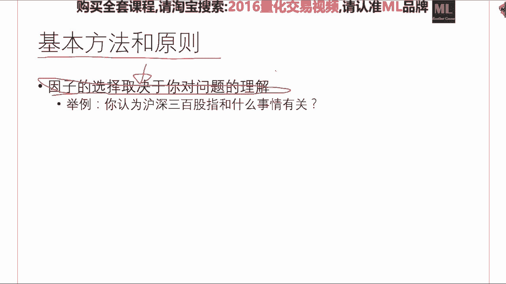

就是说比如说我们在这一时刻，想知道下一时刻的价格，我们先往回看看，往回看五个点或者20个点，或者100个点或者1000个点啊，这几个是比较喜嗯，没有签个到200个，就这几个窗格的大小。

是一个比较常用的一个选择方式，所以说他的这个输入是你这个symbol啊，你这个股票的symbol，和你的起始时间和你的终止时间，和你的这个时间窗格啊，那么这个呢是这个函数，所就是啊所所需要的输入输出。

我建议大家嗯一定不要拿来就用，我强烈建议大家嗯看完这这个这个要求之后，自己先implement你这个函数，然后再跟我给你的这个答案你做一个比较，就这样的话，因为嗯也有同学表示过呃，呃听这门课。

如果你想得到最大的收获，一定是嗯在在在在学习编程中来学习这些知识，如果只是不下水就想学游泳，光看的话是有问题的，现在卡不卡嗯，不卡不卡好，有一个人同时说不卡就不卡哈，好走啊。

第二种feature呢是这样，就是说我们对这个对这个东西做一个啊，做这么一种变换，就是说我们在t时刻，比如说我们对这个呃e u d数据吧，就是就是我们在t时刻，我们把这个呃呃开盘价啊减去啊。

t减一时刻的这个开盘价，再除以t减一时刻的开盘价，就是相当于做一个小的这个嗯这个normalization，然后把这些东西啊也当做一些features，或者说只用这些的features。

而不用啊比较简单的这个time lags好，那么呃一个嗯我我的建议是什么呢，我的建议是你把所有的可能的features全算出来，先全料全撂进去，就是说不要关注呃一种这个这个feature。

就是说嗯再往下走哈，这个是很很浅显的一个一一个事情哈，啊那么呃这这种的feature的计算方法啊，也很常见啊，就是说他这个拉姆达是你的，这个拉姆达是你的超参数啊，就是说相当于这个window size。

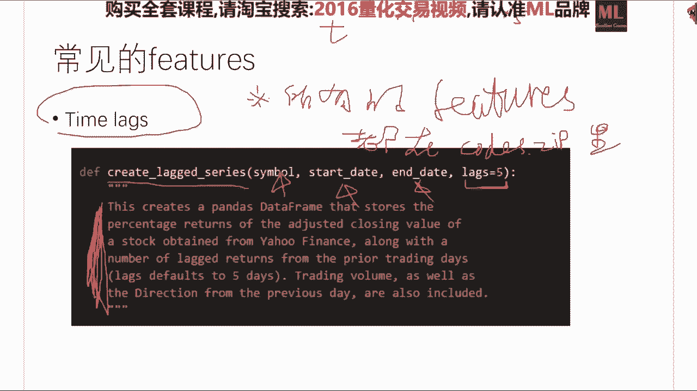

这个是你需要做这个交叉验证来来寻找的，一个就是最优的，这个window size，是需要你做做这个cross validation来寻找的，他看的就是说我呃，呃呃就是往前看拉姆达的窗格。

我选出来这个啊啊啊price的这个最高价，嗯嗯这个是具有一定鲁棒性的一种处理方式，也是在呃呃时间的金融时间序列里头，一个比较常见的一个trick嗯，就是说我们分别算出来这四个值啊。

然后呢再针对这四个值不是用来呃直接用的，直接能用的是这样用，就是说我们在t时刻的，在t时刻的这个嗯，嗯这个普price减去t减一时刻的这个price，再分别除以它这两个啊。

基于拉姆达这个ph值跟p l值啊，就是还指跟low low直，然后呢这个就相当于一个新的feature x1 ，这个相当于第二个新的feature x2 ，有很多人基于这两个feature呃。

就能建立一个不错的预测模型，然后呃有呃，大家现在有问题没有，没有对，他就是很很straightforward的一种做法，就是简单的，如果你pandas做到现这feature，它背后没有什么道理。

这道理就是我认为这个因素会对，会对未来的这个价格会产生一定影响，但是这个是有一点点道理的，这个背后金融学是有一点点小定理的，不过嗯这门课咱们在选feature的这块，大家不用关心，你往后往后看。

全是老中医的东西啊，咱们看这个这个是另另外一些常见，这个我也把它叫做一些features，就是说啊再回到刚才的这个沪深300股指期货，这个不是沪深300股指的这个价格预测上面啊，这个指数预测上面。

我认为这些说到的都应该跟它相关，那么这些东西你也应该通过你建立好的数据库，在预测，比如说股指的时候，也应该把它碰到你的这个呃，呃呃呃训练集的x中去，比如说这个嗯嗯sp 500。

或者说是这个啊这个这个这个汇率啊，或者说是嗯就是各个国家主要这个交易所的啊，这个股指的这个这些因素呃，如果你认为这些features，对你所关注的金融产品的价格也会有影响的话。

他都算是你的feature，它都可以当做你的x，就是说想到什么先往里料啊，再接着看，那么这个也是一个features，那么有的人就基于这一个features，就可以做交易了，但是如果你要嗯。

但是我个人是我个人是强烈反对，只用一个这个啊啊啊features来指导你的交易，一一，因为就是说你还是心里头还是觉得不安全吧，嗯那么这个c4 i呢是如果大家做这个，做这个的所谓的这个技术分析。

这是一个很传统的一个技术分析的一个方法，就是说它计算出来这么一个指标啊，啊他啊，就是看他跟这个，就是说他这个计算公式就在这哈，这个typical price就是说你在这个时刻啊，参考了他的这个啊。

open跟close跟high low的一个一个一个平均值，然后减去你的这个typical price的一个，moving average，然后再除以一个它的这个standard deviation。

然后0。015是一个呃经验的一个系数，这个也在我们的这个附件中也有一个实现啊，那么它是干嘛的呢，它是跟这个正100跟-100比，它相当于一个异类检测，就是它当于它大于正100的时候啊。

就就相当于是他他已经被over over by了，那么如果它小于-100的话，那就说明他是一个比较被低低估的一个啊，一个产品，那么有有的人就只看这，就是有的人就只看一个数啊。

这个数if if else if它大于100，我们怎么办，if对付它小于-100，我们怎么办，然后如果他在挣100或者-100之间，我们就持有，或者说我们就什么事也不干啊。

那么但是作为统计学习的这种方法来说，你可以说啊，也许你这个是有用的吧，那么我们也把它当做feature的一份子，也给他算进来，ok啊，这个也是嗯，用现成的公式一算就行啊，那么这个e a m也是嗯。

is of movement，这个也是一个比较常见的一个指标啊，ma typical price是这样，ma是moving average，typical price是在这个时刻的你的嗯。

high low跟这个open close的一个军啊，一个均值，这个我们也在cci。py中实现过了，你直接看我我给你的这个函数的实现就行，ok然后这个图呢就是我给你的那个例子，所跑出来的一个结果。

底下是cs，上面是股票的价格啊，就是今天我出的所有图都是背后都是有代码的，我就不贴了啊，贴贴代码这种事情还是没有意思，大家下课自己看就行了，不用占用太多的课堂时间，那么这个cci也是一个。

就是很常见的一个技术指标，那么这个e evm也一样，就是嗯各种人总结了一些，很老中医的一些公式啊，因为刚才有有同学提到，有同学提到这个这个飞车背后的道理啊，这个事情很抱歉啊，飞车背后其实很多情况下。

并没有特别强的一个道理，只觉得如果你觉得，因为你可以计算一下他的r峰值，如果你觉得他的儿峰值大于你所心目中，就是一个feature，是否对于就是就是一个input的这个变量。

是否对output有统计意义上显著性，那么你可以跑一个这个，跑一个这个这个这个这个的统计测试来看看，如果看完之后，你觉得确实对，解释这个啊嗯啊response是有帮助的，那你就把它加进去，如果没有。

你就不加，就这么一件事情，你说呃理论上这个e v m啊，能不能证明出来他肯定是怎么样的，我个人是比较悲观的态度，因为有各种各样更老中医的方法在后面，但是但是我们我们现在，我们现在其实嗯不担心。

这个feature是老中医选出来的，我们现在不管这个feature是呃，呃你基于什么样的原理选出来的，我们背后都有嗯非常科学的方法，来对这些feature进行重新的变换和重新的表达。

让你的x是一个嗯比较合理的一个x，能够在嗯首先能够正，就是说首先你的模型的泛化能力会好，就是不管你的feature怎么选的，我我我经过一定的这个quest flidation之后。

我们再没见过的数据上表现不错，同时回撤的表现也不错，这就行了，ok啊应该是呃emmmm，抱歉对，那么这个ema也它主要是跟零比啊，就是啊对对对，有很多搞这个纯技术分析的人，他就看这个东西啊。

那么这个movie average这个大家也非常熟悉了，这个就是所谓的移动平均啊，它有一个参数是它这个窗格的这个大大小，拉拉姆达啊，你可以是木ma 50，也可以是ma 200，那么这个图呢也是在m a。

py中呃，呃跟大家有所这个实现跟介绍啊，这个图我觉得是是相当于一个基本功吧，啊，就是说大家可以，应该在不看到这个源代码的前提下，自己应该能实现出来任何一个时间序列的ma值。

它相当于一种去噪的一种平滑的方式，但是嗯除了简单，但是就是比如说他跟卡曼滤波器比，它的制造能力肯定是不好的，但是呢经过大家多年的临床经验证明，ma值是一个蛮不错的。

尤其是这个所谓的rolling ma值，它是一个相当不错的一个一个，因此它有助于判断下一个时刻的啊，这个价格，因为他也是蛮有道理的，就是说相当于他把呃，前面那些时间的信息考虑进来了。

当你要判断未来的走向的时候，他把一定量的历史信息加入到你的模型中去，那么这个所谓的rnn呢，他其实干的事情，就是说我我不走这个moving average了，我把每一个时刻的这个信息呢。

都通过机器学习的方法，有选择的记住或者忘记啊，这个就就就就相当于起到了，这个目标压位置的这么一个作用，那o然后这个lc一样，就是lc是嗯，就是因为所以所谓的技术分析的这些指标什么，其实是浩如烟海。

我建议大家的是呢，当你看到一些嗯比较经典的一个，这个技术指标的时候，就应该回来把它进行一个算法的实现，加到你的这个呃，这个呃你你你的这个量化平台中去，然后随时来进行一个验证跟计算。

ok那么这个也是一个很经典的一个技术指标，这个大家知道怎么算就行，因为嗯也跟大家roc。py，就告诉了大家怎么算，这个东西ok这个就是这个bb啊，这个bulinger band。

这个是在第二节课的时候也给大家讲过的，嗯跟大家着重讲过的一种老中医的技术方呃，技术分析的一个方法，那么我们同样是完全可以实现一个几行的，python的程序来计算在每一个时间点，他的这两两个标准差的。

这个就是两个标准差的所造成的，你这个办的是什么，那么它也可以作为你的嗯，它也可以作为你的这个这个x的一个选择，还有这个force index，这些都很无聊，咱们就不讲了，你们回去自己看，这个是fi。

py，不占用大家时间了啊，还有还有更多啊，我我建议大家就是这个网站，我上上节课已经已经强调过了啊，不是计算a oc那个l o c啊，两码事儿啊，嗯嗯嗯那么这个网站呢我是啊蛮推荐的，就是说我建议大家呢。

我今天已经给大家实现了，这么常见的这些技术指标了，而网站上呢还有大量的没有见过的，这个就是啊我没有实现过的啊，这些技术指标，我也建议大家自己在课后呢把这个网页上的，你觉得有道理的嗯，嗯我觉得有道理的。

我已经帮你实现过了啊，也有一些也许我觉得没道理，你觉得有道理，这个无所谓啊，那么这个作业零就是这样，作业零就是建立你自己的啊feature expression库。

并且可以命名为一个相当于一个data utility的，这么一个你自己一个小函数库，那么你你以后用的时候呢，你就直接import feature utilities，就可以计算各种各样的啊这个特征值。

然后你不断的把它拼起来就行，比如说我在这个时刻，我要以moving average啊，bulinger band，跟这个各种各样的这个啊啊技术指标都作为x，你就很能很轻易的把一个时间点变换成为一个。

100维或者200位或者300维的一个向量，一般来说，50跟300是一个比较常见的一个选择，关于作业，零和我之前讲过的所有事情，大家有问题没有啊，pandas比南派的好处是pandas要更快一些。

你可以做做一些实验啊，而且pandas的这个它主要主主打的就是嗯，他他的这个这个这个data frame，这个数据结构好像是南派所不具备的，大家有问题没有，现在可以提问，好啊，这个问题很棒。

就是说验证一个feature它到底是该选还是不该选，这个是我们下节课的一个核心问题，这个问题是一个极其重要的问题，先剧透一下一件事情，最简单的一个回答，就是你计算你所选出来的这个features。

跟你的训练集中y值比，如果是回归问题，你计算r方值啊，这个你们可以查一下，在sk learn里头有这么一个函数，在sk learn。metrics里头，你import r to square啊。

r to score，然后他就能计算你的这个input的，这些x对于y值的这么一个，你可以理解为一个解释度的这么一个，从0~1的一个指标的数啊，一是特别好，零是特别烂啊，那么这个数越大。

就说明你的这些x选的越好，还有问题吗，那么所以说今天大家需要掌握的最后一个嗯，脏活累活，就是你怎么样的，把你的原始的金融数据进行一种特征变化，获得一个新的训练集，这个是你的原始的肉data。

然后你要变成你的training training的呀，这个是最后一个脏活累活啊，嗯一般比较好的量化模型的非洲数目啊，这个这个问题问得很大，呃，如果你要这最最正确的，最最正确的回答是取决于问题。

但是如果我告诉你这个答案的话，你肯定心里也不爽啊，一般来说啊我见过的哈嗯嗯20是一个坎，50是一个坎，300是一个坎啊，一般来说这三个量级是比较比较常见的，20 50或者300。

好新闻事件如何转化为量化指标啊，这个呃非常好的问题，ok啊，新闻事件如何转化成量化指标呢，这个很简单啊，比如说你新闻事件，你可以把这一段的文本变成一个t f，i d f进行编码。

那么它就会变成一个向量吧，那么这个向量就是你的x，如果你要用这个所谓的呃呃word to vector，或者是说一些嵌入的方法，同样你给我一个文本，我给你个向量。

这个有各种各样的自然语言处理中的一些方法，来做这个事情，再说一遍，哪个事情再说一遍，好新闻是吧，新闻一个，比如说tf idf，它的输入是什么呢，它的输入是一个它的输入是嗯，一段文本输出是一个向量。

word to vector是输入一个词，输出一个稀疏的向量，输入一个稠密的向量，并且可以做加减，就是说它的这个编码质量会稍微好一点，指标数能训练啊，不能啊，这个指标数能通过遗传方法来学习出来。

但是不同的问题，它的指标数最优的这个子集应该是不一样的，就是说另外一个问题，就是说这个指标数其实啊训练处，就是我们知道一个指标数这个事情并不值钱，值钱的是这些指标是否达到了我们的要求。

就是说我不关心你到底有几个指标，嗯这个没关系啊，但是多多益善，就是说如果你我我再强调这个啊，如果你的这个指标啊，你你其实是越多越好，你你给我干到1000个，然后你再用一些非常呃呃呃呃非常有效的特征。

选择的方法，你选到一个子集就行，就是指标在初选的过程中啊，一定要越多越好，不要管它重合啊什么的，你只要别计算错了，一个最大的错误是什么呢，最大的错误是你这个时刻，你相当于这个时刻的x。

你不小心的把下个时刻的数据给算进去了，就是这种事情会让你的预测模型啊，令人发指的好，让你在回测过程中令人发指的挣钱啊，但是啊很抱歉啊，就是说你这个是一个非常常见的错误，就是说我们在计算每个指标的时候。

我们不小心的把下一个时刻的这个，price价格给算进去了，这个是一定要不得的，但是在初选的过程中，你有什么先撂进去，掉进去之后呢，再用特征选的方法给选出一个子集出来就行，这个没关系啊。

而呃那么大家再回顾一下指标说明了什么，指标说明了每你选的每一个指标都反映了，你认为这个指标有可能帮助决定下一个时刻，你所关注的金融产品的价格，而你的这个选择方案是取决于。

你这个作为量化的这个呃量化建模的这个人，对这个世界的理解，这完全是一个价值观和方法论的一个事情啊，那么我们看下一话题，tf idf它是一个，这个叫嗯term frequinverse。

tom fury啊，那么呃，那么就是说当我们有了这个怎么样计算，这个指标的函数之后，我们就能建立训练机了，因为计计算指标跟这个嗯，这跟这个建立训练集中间还有一个小gap。

就是说我们比如说我们会算ma了啊，比如说会算ma 5了啊，那么我们怎么样呢，从这个原始的这个肉data中转化成一个嗯，这个x跟y值呢啊，那这个也是非常简单的一个事情，对于每一个时刻t啊。

我们分别的把这些指标啊计算出来。

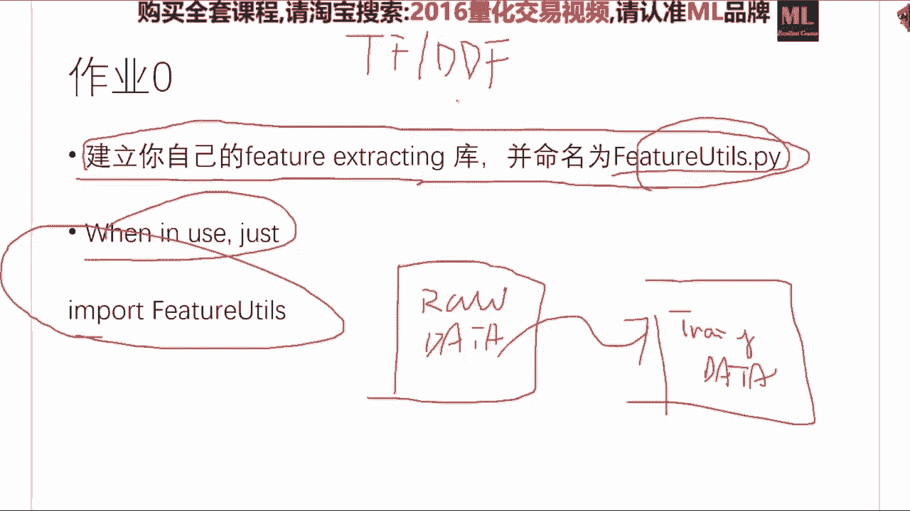

然后连起来连成一个很大的一个向量，然后这个y值呢就是我t时刻想预测的。

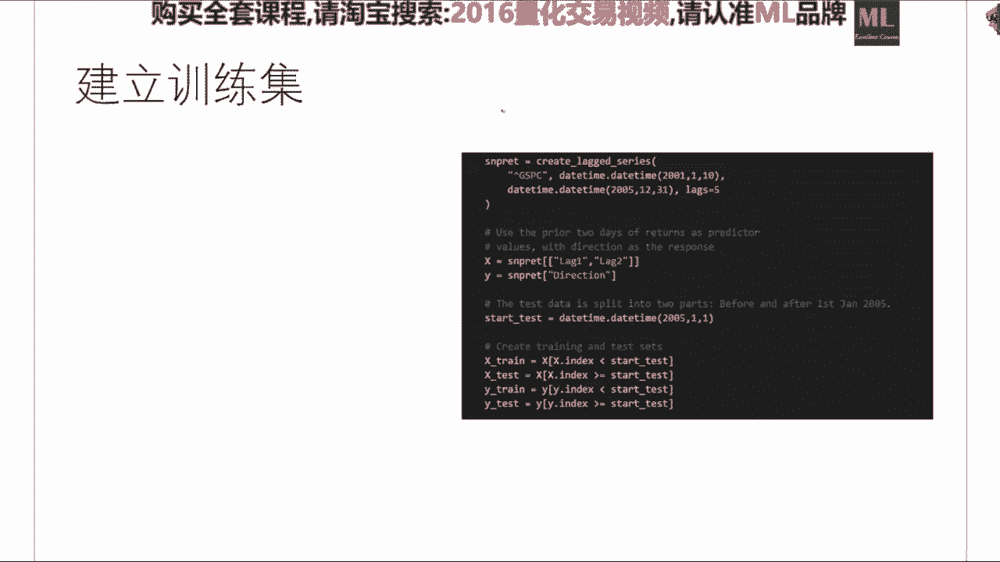

下一个时刻或者下几个时刻。

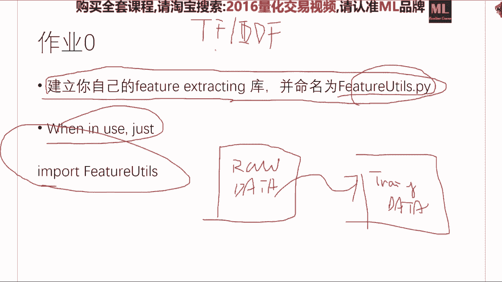

这个是由你定的，比如说我们假设，我们现在只想预测下一个时刻的，y值的涨跌情况，那么这个y值呢，你还是要根据原始数据来计算出来这个y值啊，如果是分类问题，你可以001啊，如果是这个回归问题。

那么就是你还是需要从原始的数据中来进行，一个一个计算啊，其实很简单啊，这个是一个啊基于这个lg的嗯，一个数据怎么样建立这个训练集和测试集啊，这个就是最终结果，这个也在那个y的长度，y没有什么长度。

如果你是一个回归问题的话，y是一维的，就是y是一个实数，如果是一个分类问题的话，嗯一般来说有两种编码方式，如果比如说你是嗯，你不是在用神经网络在做，比如说你是要用这个logistic回归或者svm。

这些来做的话，如果分两类问题，y值可以是正一或者-1，也有这是一种编码的方式，所以他就用一个一个数就能表示，第二种编码方式呢，如果你要做分类问题，比如大涨小涨啊，不涨不跌啊，小跌大跌。

那么分镇这么五类的话，你你可以是12345分，那么这个是第一种方式，第二种方式呢就是说所谓的one hot encoder，那么1万，这是一类，这是大涨啊，幺零啊，01000，这个是比如说小涨啊。

00100，这个是不涨不跌啊，00010，这个是小d啊，以此类推，就是说嗯y呢y y其实没有什么程度，y只是你所需要预测的下一个的一个一个东西，ok leg的长度一般来说就是50数20啊。

那么具体长度是多少呢，需要实验验证哪个最好，对对你，一个是可以针对不同的leg对y验证，这是第一种方法，第二种方法是你可以分别把ma 5，ma 10嗯和ml是全撂进去，全部当当这个当这个x都没有问题。

lee leg 2表示的是这个window size啊，你可以运行一下这个程序吧，把这个leg的数目print出来，你看一下，ok那么我们其实费了这么大劲儿，到最后是想得到这四个训练机。

那这四个东西一个是叫做x train，一个是x test，一个是y train，一个是y test，x train，它的这个它一般来说是n乘以d的一个矩阵，y train一般来说是n乘以一的一个向量。

就是说我们要从n个相当于n个时间点，每个时间点我们有一个地位的向量，我们要映射到一个一维的向量中，这个一维的向量可以是分类，可以是回归问题，而我们的模型呢就是要输入一个x train。

输出一个y train，ma 5就是你的这个所谓的移动平均，而这个五呢是要往前看五个数，就比如说此时此刻我的ma 5，就是我昨天的价跟我前天的价跟我大体进价，我往前看五天的价格的一个平均值。

它是一个数o那么举一个举个例子，比如说我这个x train，他一共有你在n个时间点上啊获得的，那么它一共有地位，所以我要干的事情是我有这个时刻的一个x，我对应的是y x中的第一个元素的一个一个值。

这个呢第二个呢就第二个x顺的这个向量，d为的一个向量，对应的就是y train中第二个这个数，那么我们要学就需要学要学出来一个函数，它输入是这么一个矩阵，输出是这么一个向量，到我们来一个新的一个x的。

一个d为d维的一个东西的时候，我这个x这个f同样能够给我一个白值，这个就是我们的呃目标，而基于啊而啊而这个呃机器学习呢，他主要干的是这个事情，但是大家也可以感到庆幸的是，这个事情是最数学的。

而这个事情也是最有，其实是最有含金量的，也是最难的，但是呢你需要编程的地方，在这个里头是最少最少最少的，因为这五节课来，我反复跟大家介绍的sk learn，跟今天要介绍的另外一个报叫cross。

这两个包呢已经把大部分的工作都帮你做了，为什么呢，因为机器学习的训练，是一个非常标准化的一个一个过程，而不像你数据的预处理，它是非常的任务相关的啊，这个活儿需要这么干，那个活儿需要那么干啊。

就是它的代码的可重用性比较少，而机器学习比如说你训练一个s v m啊，你不管训练什么数据都是这么训练的啊，所以说你可以用一些非常工业化的，一些商业的一些包来做这些事情。

那么我们今天呢我就给大家介绍接下来几个嗯，呃最常用并且有效的机器学习的方式，我们来基于我们现在得到的数据，我们怎么做这个预测模型，ok那么给大家四分钟的时间休息一下，然后有问题全部问到这个群里头去。

我会一一的跟大家做一个解答，到现在是08：56，我们九点钟来进行这个回答，我还不一定是一维度的，我还可以是多维度的，请看这就是一个五维的，还有三分钟大家积极发问，是我刚才好像退出了，大家现在能听到吗。

能能好能看见吗，ok ok那我们现在接接着上车哈，好我看一下大家的这个问题啊，需要gpu编程，需要gpu，但是不需要gpu编程，因为现在的python的包，已经都帮你做了这个并行的处理了。

如果你要用这个对说一下并行好，就是说如果你要用这个sk learn哈，说一下这个并并行的事情，如果用sk learn。

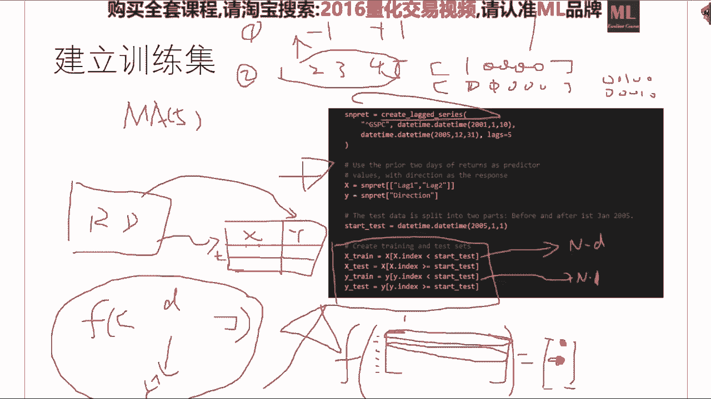

sk learn里头能够并行的这个呃呃算法，它一它后面一律有一个这个参数叫number of jobs，就是说嗯你要你要你的并行的。

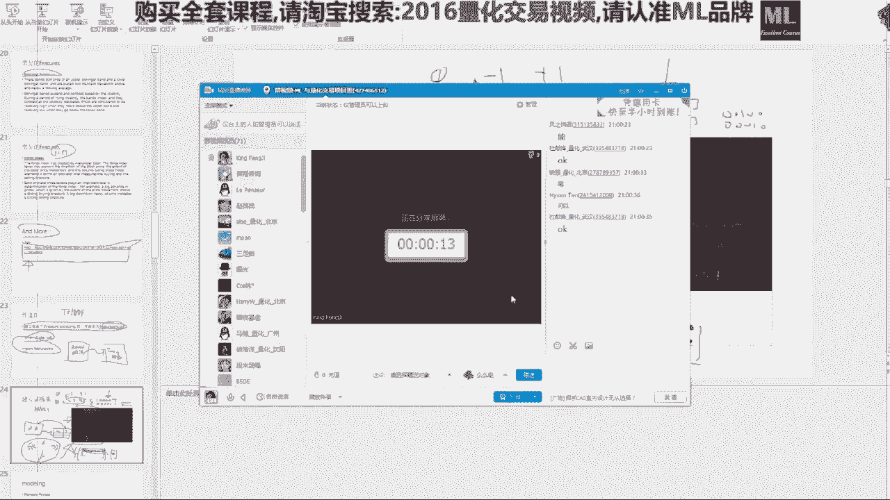

这个这个这个这个呃呃呃进程是多少，那么一般来说如果比如说你是嗯你你有八个盒，那么你就直接写为-1的话，就会让你的cpu满载的进行自动并行啊。

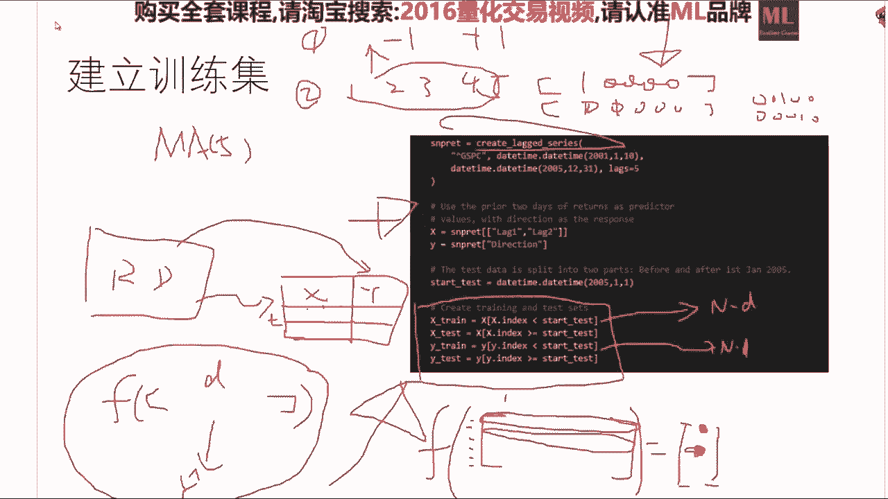

这个是一个很好的一个一个方式，如果你是用的是要做深度学习的话，deep learning的话，他已经会帮你自动运行，你不用管这些事情，好再往上看啊，tf i d f这个呃。

大家嗯一个是可以看数学之美那本书，另外一个是可以直接参考sk learn，它能够帮你自动的来做这个事情，它有一个很好那个啊data preprocessing，这个这个这个这个这个这个modular。

然后他会帮你直接把一个文本变成一个向量，o一我很想讲文本跟量化的事情，我看看有没有时间啊，编程事件很容易会讲，如果我要讲的话，就是我讲的每一个算法，都肯定是会有编程的东西的。

量化的核心竞争力在于特征选区啊，量化的核心竞争力，特征选举是量化的核心竞争力之一，ok那我们就嗯看来大家对这个事情很很感兴趣，那咱们就嗯我争取用嗯半节课的时间吧。

正经一个小时的时间给大家把nlp的这个好好，那大家既然都感兴趣，没问题啊，这个也是很好玩的一个事情，我个人的建议是n l p用来选股没问题，你如果n lp要做用用来trading的话呢。

呃如果你nlp用来确定nlp的这个指标，一定不能作为单一的因子，就是你不能把x全部设为nlp，你最好让lp作为你的这个factor的一部分来做，会更好，刚刚才跟我说过选啊，不是刚才我跟大家说过啊。

选factor的时候一定是多多益善啊，大家稍稍等一下我，我把这个啊好好，那我们接着走哈，这个随机森林是呃一个非常重要的一呃一类，在金融数据中所运用到的一个算法啊，他其实随机森林和随机森林相关的。

所谓的这个g b d t就是基于梯度的这个呃，boost这个trees它其实是比呃深度神经网络，在很多情况下它是不分伯仲的，深度神经网络，它其实是在于它的这意义是在于，对于一些我们不知道怎么表示呃。

输入的这个前提下，我们学出来一个新的一个表示方法，最简单的例子是一个图像，我们对图像的这个输入，我们其实人类不知道该怎么表示一个图像，只知道我们用一个这个这个这个矩阵的方式啊。

把这个图像的每一个像素点的这个灰度值嗯，告诉电脑，那么这种表示方法是比量化的，这个这这这个特征选择是要糟糕得多的，那么深度学习的干的事情，就是说，我们既然我们不知道什么是一个好的表示。

我们就拿这个像素的灰度值呢，我们学出来一个层级的重新的表示方法啊，然后呢，再接接接上一个非常简单的一个，soft max的这么一个分类器，然后就可以做非常棒的计算机视觉的分类问题。

但是呃这个金融数据跟图像数据的，一个关键的不一样的地方，就在于我们其实对于金融数据的这个feature，engineer的这个部分已经做得不错了，就是我们基于我们所选，基于人类的专家知识。

所选出来的这些features已经蛮好的了，那么基于这些features，我们在做这个嗯神经网络的话呢，嗯他会就就就就很容易就就就大家都会嗯，知道就很容易就会overfit了。

那么所以说这个是需要注意的一个地方，而而随机森林它是一个泛化能力极强，而且随机森林的一个超参数，森林的这个数目的个数啊，理论可以证明这个森林的个数越大啊，他的这个测试误差不会降呃，不会不会提升。

就是说你比如说你200棵树跟1000棵树，你的这个错误率呃，也许会呃，呃也许不会变，但是肯定不会往不好的方向变啊，这一点呢就会让你的建模过程非常爽，就是你不用担心，比如说神经网络。

你从三层干到五层的时候，你就overfit了，但是你的一个随机森林，你从200颗干到1000颗，你不会overfit，你顶多是算了半天，你发现白算了啊，就是你算到1000颗的时候跟200颗。

你的这个性能提升不大，但是毕竟你你不会出错啊，那么这个是一个比较呃随随机森林，一个比较好的一个性质，ok那么随机森林是基于数，那么我们用很简短的一点时间，我们介绍一下这个随机森林，随身是基于数模型。

就是这个数模型就说是呃所谓的决策树哈，举个最简单的例子，二维的一个例子，这个是呃nba每个nba球星的收入的数据，那么每个nba球星的收入啊，一个建模者认为大概取决于两件事情，一个是他从业的年份。

另外一个是他头球中的这个次数，颜色越偏，这个呃呃紫色的说明挣得越少越偏，红色说明挣得越多，那么我们当我们有了这个数据之后呢，就能把这个每一个nba球员的收入情况，划到这个二维平面上去啊。

就是啊红色点说明挣得多啊，蓝色点说明挣得少，那么一个明显的一个趋势，就是从业时间越长，我挣得越多啊，如果投球数目越多呢，我也会挣得越多啊，那么呃这个决策树是什么，决策树就是说我怎么样的选。

把这个这个空间递归的进行一些啊，不重叠的一些划分，使得每一个子区域他们的这个所谓的纯度啊，最大决策树就干的就就这么一件事情啊，我再说一遍，就是说我觉得树要选的事情是，这是根节点的时候啊。

嗯没有任何呃对对空间划分的地方，我觉得数每一次是一个垂直的划分，就是问，比如说他的这个从业年限是不是大于5年，如果是轻，如果是大于5年，我们就走到这个节点，小于5年就走到这个节点。

就相当于这个从业年限是否等于五，是我们对这个空间的第一次划分，然后我们在这个空间里头，再再找到一个最优的一个切割点，使得切割点的左边跟右边，他们的这些工资的这个这个方差是最小的，所以是一个优化问题啊。

而这个而这个决策树，如果你要找到一个最优的切分呢，它是np难的，因为每一个维度都有不同的组合方式，而你这么你要对空间一直划分完的话，它是一个嗯np的那个一个问题，那么决策树呢。

是对这个真正的我们的目标的一个逼近，它怎么逼近的呢，它是用一个贪心算法来做的，就是我每一次的切割，只要我每一次切割是让现有的划分项，最好的一次切割就行，那么它其实不是最优解。

每一棵决策树他肯肯定不会达到最优解，但是他通过贪心的这种算法，能够大幅的降低我们的这个寻址空间，ok就比如说啊这个就是学出来的一个决策树，就是说我们要看这个从业年份是否大，是否就跟这个4。5年比啊。

如果小于4。5年，那么我们就是当我们这个空间划分完了之后，我们来一个新的一个点的时候，我们就看他处于哪一个子空间中，然后呢预测的时候呢，比如说我我一个点在这，然后就说有人就问，请问这个球员他挣多少。

挣多少钱，我们怎么回答这个问题呢，我们就把这个点它所在的区域的，所有的这个这个这个收入，求一个平均值返回给你就行啊，很简单啊，那么就是说如果是从业年限小于4。5，4。5年的话，我就会告诉你他会挣啊，5。

11个百万，如果他是大于4。5年的从业年限，我会问你第二个问题啊，他的投篮数目是不是小于117。5次，如果是啊，ok那他就大概挣600万，如果不是，他大概挣674万，就这么简单，如果就是说。

那么决策树的深度，其实是你这个模型的一个参数，它可以一直这么切下去，切到你训练集中只剩一个点，那么这棵决策树呢我要求你只能切两刀啊，你很明显你还可以再切，就比如说在这在这个600万的这个俱乐部里头。

你再看他的从业年限，你还可以就记一直往下切，而这个数的这个这个长度呢，是指的是我们每一刀切下去，我们针对于上一刀，我们对于这个区域里的所有的y值的这个方差，我们减少了多少。

就相当于我们这一刀的效率是多高，那么很明显我们这个数呢越切他的这个树的，这个，这个我们所能够减少的，这个这个virus会越来越少的，ok这个就是比如说我们跑了一个绝招术算法，用我刚才说的这个贪心的算法。

我们切出来的这么一个划分啊，其实你你要求比如说这个是要求只能切两刀啊，你也可以切石头，你就你就这么一直换下去，画到最后呢就每个区域里就一个点啊，但是这个就很容易就过拟合了啊，这个就是我们决策树。

我们所需要的这个所谓的目标函数，我们想达到的事情是什么呢，想达到的事情是最小化，这个事情就最小化，你所预测的这个平均值和真实值之间的。

这个这个嗯r s s就是嗯residual sum of squares，那么这个事情我们是用什么样的算法做的呢，我们是用贪心算法做的，每一刀让它最小，我们就认为他们大概总体会最小。

但其实每到最小并不能保证我们总体的最小，但是也大差不差就行了啊，这就是决策速，ok那么这个是另外一种切换方式啊，你就可以看到在另外一个数据集上啊，那么决策树的优点是什么呢，决策树的优点很明显。

这个跟深度学习最不一样的地方，就是决策树学出来的是一个白盒模型，它不是一个黑盒模型，白盒白在哪呢，我学会之后，我能很明确的告诉你，我的这个决策规则是什么，我的这个decision入是什么。

就是说当我们学到了这个东西之后，比如说对于量化，那么学完这棵树之后，它是可以解释的，他就说我认为这个股票会涨，那么这个模型就会告诉你，他说我第一步啊，我先看他ma 5啊，大概是多少。

第二步我再看他的另外一个指标是多少啊，我因为这么几部下来，所以我认为它会涨，或者或者说它会跌啊，这个事情很多人很喜欢，因为在做一些重大决策的时候，你很难把你的所有的这个风险都压在一个。

你都不知道他为什么做出，这个决断的一个事情上，而决策树呢就是说其实实现好的一个决策树，是它能完全等价于一组if then else，就说if怎么样，我就怎么样啊，l else怎么样，然后我就怎么样。

然后就就就就是说他的这个决策规则，是一个透明的，这样的话呢对于一些重大的一些决策的时候，嗯是需要的啊，嗯嗯而不是一些很难解释的一些黑盒模型，这是第一，但是呢觉得说不好的地方是什么呢。

就是说决策树的这个如果你只用一棵树啊，它的表现性能很差啊，大家已经看到了，它其实只是对一个区域里求了一个这个均值，而这个区域还是垂直着这么做的，就是说它和它解释性很好，但是它的这个表现性能呢啊很不好啊。

怎么办，那么我们就用这个提升学习的方式，就是我一棵树不行，我他妈我学1万棵树出来，让这些树进行一个投票啊，行不行啊，答案是这个是理论可以证明他肯定会好，而且是只好不坏，但是有一个最大的问题。

所以森林随机森林的基本基本的方法就是说啊，我一棵树性能不行，我同时学十棵树，这十棵树比如说第一棵树说应该是长，第二棵树说应该是爹啊，第八棵树说应该是长，然后你们投个票啊，只要十个数里头八个说是涨两个。

说跌的，咱就咱就按涨赚啊，那么这个这个这个这个思路是集中学习的一个，呃呃呃呃传统的一个思路啊，没有问题，好事坏事是什么呢，坏事是，如果你在同样的一个数据集里，学这棵决策树的话，你同一个算法你跑了十遍。

这十个数是一模一样的，就是没有任何嗯，就不可能是这个数涨说涨那个数说跌啊，那怎么办呢，集成学习啊，写一下吧，集成学习是目前我们想提高一个，提高一个系统的一个神器，或者说其实是唯一的一个选择。

他他因为因为集中学习的理论，理论依据就在于集中学习可以证明给你看啊，嗯越多肯定是越好的啊，那么我们集中学习一个关键，就是说我们的每一个所谓的积分类器，它的这个差异越大越好。

就是说嗯集成学习能够有非常好的表现，性能的大前提是，我集中学习里的每一个积分类器，它们的vance很大，这样的话才能保证我们啊，你在这个数这个地方做的不错，我在那个地方做的不错。

大家凑一块就把这张卷子答完了啊，不能是每个集成学习里的每一个积分类器，大家都只做会做这个选择题，第一题，其他题都不会，那你们再vote，你们也vote不好啊，但是如果你的每一个每一个积分类器。

你们所啊擅长的地方都不大一样的话，理论上是可以做到百分之百的啊，当然这个是一个理想的状态，但是能够我能够证明给你看，他是能做到无穷啊，任意好的啊，那么随机森林就是说他ok我想训练100棵树。

但是这100棵树我想让它长得尽量不一样，我们怎么办呢，我们把随机的因素加进去，我们怎么随机，我们第一个随机是这样，不是你要100棵树吗，你100棵树如果训练集都一样不行吗，ok那我这样我有放回的踩。

我从训练集中，我有放回的采样出100个啊，新的训练集出来啊，这样的话，我这100个新的训练集本身就不大一样了，我在这100个新的训练集上，我分别训练100棵决策树，这个决策树，每一棵决策树，我在第二步。

第二个随机因素在哪呢，在于每次维度的选择，注意看，我们在比如说这个是二维的一个事情，一个是x一个是x2 ，当我们是高维的时候，比如说我们到x100 了，我我觉得树不是要要对空间进行划分吗。

我如果一只训练一棵决策树，我每一次的贪心选择是要便利这100个维度，每一个维度上我要选啊，从从这儿写好不好啊，从这儿写好不好啊，从从这儿写好不好，然后再看这个维度啊，从这儿写怎么样，从这儿写的怎么样。

从这儿写怎么样，把这些所有的可能刀术，就是就是对空间的划分全部算一遍，挑一个最好的啊，这个是一个贪心的一个一个一个一个一个算法，而随机森林不这么干了，所以森林是每一次我选一个维度的子集出来。

比如说x1 x 10 x25 ，随便选一个子集出来，在这个子集上再做一个贪心的选择，ok那么这样的话呢就能够让每一棵树啊，它就它就以非常大的概率它长得不一样啊，这个是听上去很疯狂的一件事情。

但是啊啊随机森林这个leo briberman，他是一个非常嗯伟大的机机器学习，加上他在2001年提出来的这个算法，他还证明给你看了啊，这样做啊是是有道理的，而且理论能证明他是有这么一个棒子在。

那么随机森林是一个非常棒的一个事情，那么每一次选择一个，这个是老中医的一个事，每一次我们选择哪些呃feature进行分间划分的，一般来说是根号p个p是你的这个维度。

比如说我们这个在t 10和x是100维的，那么我每一次选随机的选十位进行一个选择，那ok那么这个是随机森林，另外一个是大家肯定听说过的所谓的xg boost，x g boost的。

其实它是一个它它不是一个算法，它是一个算法库的名字，就是它是一个算法包的一个名字啊，它是什么呢，它是其实是gradient based tuesday，对啊对。

great and beast decision trees gb t t，他是什么意思呢，就是说这个它它也是训练100棵树，但是它跟随机森林不一样的地方，是随机森林的那100棵树是并行的训练的。

而这个啊我这两个词我就一混用了哈，而这个xg boost呢，他干的事应该是我第一棵树拟合的是这个y值，第二棵树是拟合的，这个y值跟真实值的一个残差，我用第二棵树来拟合，第三棵树是我拟合的。

这个是残差的残差，我在做，就是它是一个线性串行的一个模型，就就是说这个基于呃呃呃呃，基于梯度的这个呃呃这个decision tree呢，它其实是有点像把一个一个数进行这种数列，级数的一个分解。

然后每一个级数就是每一个级数的这个系数，是这个呃呃，这个信号在这个在在在，在这在这个机上的一个一个投影的一个，系数的值o大家做量，如果机器学习的班，我会花一节课的时间来讲这个事情做量化的话，你们不用管。

你们只知道这是另外一个集成学习的方法，我们的输入是一个x，输出是一个y，而我们需要调的参数，是这个我们的这个森林的树木的这个数量嗯，不是残差学习，就是说我们每一次拟合的是它的残差啊。

就是他你可以它是一种，它是一种啊串行的一个模型啊，而这个sk 2里头，它的gb t t实现的效率不是很高，如果大家要用gb t t的话，我推荐大家，那么目前只有这么一个做的是最好的。

微软是前天刚推出了另另一个开源的，但是还很不完善，比较完善的包，就是这个包泰森包，它有一个跟skt一模一样的一个接口，是大家在用起来的时候是感觉不到困难的，但是效果非常好，那么这是作为大家来说。

你可以把它当做一个嗯黑盒的一个模型来看啊，你给我一个x，我给你个y，你要调的超参数是啊，一个是树的深度哈，另外一个是树的树木啊，还有一些这个呃正则化的一些系数，对他就是当你数目越多的时候。

我们这个残差就就就就就越来越小了，关于这个gb dt大家有有有什么问题，好好嗯对应的python的包叫xg boost，我再写一下啊，这个是呃数据科学中的一个神器啊。

那么大家如果听说过cargo竞赛的话，所有的这个开国竞赛的第一名，除了一些计算机视觉的问题，基本上都是在这个包上做一些调参的一些事情，这里和random force比较下优劣。

首先run first适合啊，适合并行啊，因为它是一个天生的一个并行的事情啊，这个是random force的一个一个好的一个事情，而g b d t呢在老这个只能是老中医哈。

老中医来看gb t t的性能会好一点，但是如random first，从呃呃理论上的，就是他的理论保障会更更多一点，而g b d其实已经有点丑了，就是从做理论的，这个从做集成学习理论这个角度来看啊。

他会丑，就是说他的他的这个他的这个一些理论的，这个借的这个保障并不是很好啊，有点像这个不会灌，你喝这两个都很难过，你喝将g b d4 作为随机森林并行的分支，可可以吗，其实是可以的，你可以试啊。

但是呢其实不必要，因为集中学习它每一个的积分类器的假设，就是一个弱分类器，你不需要不需要就随机森林的每一棵树都极烂，你就基本上用不成嗯，就是我不需要就随机森林从根底下起，他就不希望他每棵树很牛啊。

会很有效嗯，只其实嗯这是我能想到的唯一的方法，能够让它真正有效的啊，如果对于这种集中学习的方法不调参的话，嗯嗯那是很不好的一件事情，好其他语言的包是这样，xg boost的，它提供各种语言的接口。

包括了c加加python r和matlab和茱莉亚，每个积分累积完全可以，ok好好问题，这个集成学习其实是一个叫做所谓的红方法，就是说提升学习，他并不关心你这个积分类器是什么啊，你只要告诉我。

你这个积分微器的一个返回的一个结果就行啊，相当有理论啊，有一本书就是嗯嗯，有一本书就是专门干这个事情的，相当有理论啊，那这个每一个分析分类器完全可以，就是说比如说呃blending啊，大家可以查一下。

和这个sticking，这个是两种，这个是两种非常常见的集成学习的方法，而这两种常见的集中学习的方法是嗯，他不管你的这个积分类器是什么的，你可以是一个线性回归啊，一个s v m，一个神经网络。

一个随机森林，加上一些其他的乱七八糟的东西啊，都都都都都没有问题，算烂分炼器，就是你比如说你可以做一个实验，你用随机森林的一棵树，因为什么呢，它虽然是全生长了，但是它其实只这一棵树只考虑了部分。

而且是少部分，你的这个x的这个这个这个这个这个顶dimension，所以说它并比如说你有100枚，我这棵树，它真正看下来只看了一个少部分，所以说它的效果并不是很好写，这本书的作者啊，跟我我就不说了。

这个嗯是能再详细说几句吗，ok不是，是这样，是这样，随机森林是集成学习的一个呃，应用，集成学习的定义是对于很多积分类器的结果，我们再做一个二次的一个分类和预测的事情，这个都叫做集成学习啊。

三个三个臭皮匠顶个诸葛亮啊，就说我怎么样的，把不同的分类器的结果给它集成起来，获得一个更好的结果，这件事情叫集成学习，而随机森林是集成学习的一种实现方式，ok就是说比如说我们有一个svm。

有一个线性分类器，有比如说我们有三个分类器，那这三个分类器是三个同事给你的，然后你要做预测的时候，最简单的集中学习的方法就是一个voting啊，你这三个人，你两个人都说是的时候，我就说是还有什么问题吗。

而真正的你要你要是做一些严肃的这个数据，科学的，这个，或者说是你要严肃的做一些，真正你要用的东西的时候啊，集中学习是只会对你的性能做提升，而不会影响你的性能的一件事情，就只好不坏的事情。

就是这一部分集成学习所能给你的性能提升，是白送你的，什么意思呢，就是说呃呃呃就相当于是无风险的，把你的模型给提提升好了，只要你会用的话啊，是这样啊啊对，就是说我们如果你自己搞的这个分类器，不是很好啊。

你用集成学习的方式肯定会有所提升，但是具体能提升多少，这不好说啊，xgboost的呃，是嗯一另外一种集中学习的方法啊，如果你是用了一堆比如s v m啊什么的，这种积分类器。

你要用我刚才提到的一个叫blending，一个叫stacking这两种方法来做继承，或者你用一个voting来做医生，肯定是只好不坏的一个事情，ok啊。

aa boost跟g boost的区别相当于java跟java script的区别啊，blending跟stacking的包啊，没有，因为这个是一个红方法，这个几行就就能写出来，你们这个并没有。

因为它是它的输入，是一些分类器啊，啊机机器学习的量化策略的开发，如果你要成功一点的话，嗯没有不用集成学习的了啊，阿尔法狗用的不是通用学习的方法，嗯阿尔法go嗯，这就是只有民科才会认为他用的是。

它叫通用的学习，目前通用人工智能啊，学术界还没弄出来，他只不过这个是记者朋友们的一种误解啊，可以可以送给大家一个不ending，因为这个我天天在用，所以我随随手就给大家啊，其实我不是很清楚，潘婷飞呃。

呃朋友想提afro，你的问题是什么，也许你呃我没有正确回答了你的这个问题，因为我不大清楚阿法go在这个里头的呃，你你想说什么，红方法对红方法是这样，红方法它本身不是一个方法，它是一个你可以看到一个嗯。

嗯嗯就是所谓的meta algorithm，就说嗯他是嗯针对于一些，就是嗯就是在算法之上的一个，一个一个比较笼统的一种方法，比如说阿达布斯的啊，他是他只不过是一个方法，就这么说吧，对最好的一个例子。

红方法就是说就是集成学习的方法，最好的例子你可以想成动态规划这个算法，动态规划本身它并不是，就比如说你没有人会给你说啊啊，这个函数是动态规划，你调用它就行，动态规划是一种思考问题的方式。

而集中学习中的很多算法，它也是类似于动态规划那样，你是要基于你自己的任务来做啊，嗯对啊，这个是一个比较比较好的一个类比好，那我们接着看哈，这个是一个实验结果，实验结果你看这个呃就是越低越好哈。

这个是错误率随机森林，在这啊，xg boost的分别在这儿，然后这条线指的是这个每一个这个呃呃不是，这个是呃一个呃两棵树的一个boost啊，这个是一个啊啊呃呃呃不是。

这这个是一个呃一个一棵树的一个boost，这个是一个两棵树的一个boost啊，所以说如果你要数越多的话，它一般来说是这样啊，所以说在一般情况下嗯，这个嗯基于梯度的啊，这个啊boosting treat。

它的性能是比斯伊森林啊确实是要好一些的，这也正是因为这个原因啊，这个g boost的是一个集结成功的嗯，一个软件包它在它也可以，他也可以直接分呃进行分布式处理啊，差不多嗯30万个数据点。

每个点是60为的，大概在几分钟就能跑完，是这样啊，那个随机森林是随机森林是啊，我看这个里头说的，这个x轴的坐标是竖的呃，这个数的数目，而这个呃呃，每一条线的这个颜色是每一棵树的深度，对我说错了。

因为我们在每一次拟合残差的时候，我的这个boosting the tree也可以选择一个树的深度的，在这儿请看，这就是我们每一次你和这个，你和这个残差的时候，就相当于你做这个泰勒展开的时候。

你每一次你和这个长差的时候，你是要用一棵树来拟合的，他这个树可以是一层的，也可以是两层的，那是五层的，一般来说呃xboost的默认深度是三，一般来说这个也是要做这个调参的，一般你3~5就够了。

你不要太深，因为你你合的是上一轮的这个残渣太深了，容易overfit，或者说容易就一般来说在五就不错啊，3~5啊是一个比较合理的一个选择啊，是这样，是这样，这个完全是一个经验的问题。

对于这个boosting tree的话，深度并不需要多深，因为boosting tree他的这个树的树木，其实是真正的这个深度，而随机森林里这个树的深度呢是树的深度啊，说的有点绕啊，我再说一遍。

boosting的话，它1000棵树是意思是什么呢，意思是他把这个残差拟合了1000遍，而且是迭代着做的，而随机森林那1000棵树呢是我1000棵树分别的，你直接你和这个y值这两个。

它的本质的区别在这儿啊，是的，只能用交叉验证来做，没有其他的方式，没有或者说没有其他的简单的方式，你如果用贝叶斯方法，也能比交叉验证做的稍微聪明一点，但是还是得调参。

就是贝叶斯方法其实是让你的交叉验证啊，能够比较快速的一个方式，对交叉，对暴力枚举是交叉验证的一种方式，而贝叶斯方法也是交叉验证的一种方式，它可以避免暴力枚举，尤其是比如说你在做深度学习的时候。

你训练一个神经网络，四周过去了，你要把所有的深深深度神经网络的参数，暴力枚举一遍的话，嗯那就就麻烦了对，那么你要你要调的这些参数呢，一般来说就是数的数目啊，还有一个是所谓的正则画像啊。

shrinkage parameters，你就把它考虑成一个结构，风险的误差的一个系数，然后还还有就是说这个每一次选择的这个，feature的这个数目，贝叶斯如何印证。

这样用一个叫所谓嗯嗯嗯嗯就是叫贝叶斯优化，那么它只是基于高高斯过程混淆，这样我还是写一下吧，解一个bandit problem，bandit problem，它的主要思路是这样，听好了啊。

他主要思路是这样，我们假设我们的所有的这个参数，就是交叉验证参数，这个寻址空间，我们嗯嗯嗯你你你把它想成平面上，在平原上你要找这个石油，ok我们在平面上需要找石油的话，我们需要钻井钻一个井钻下去。

然后看看这个井底呃，看看这个地地里头有没有石油，但是我这一井我我拿这个钻头钻下去，我我是有一个成本，对不对，我这个成本，其实就是我这个这个模型的训练的时间，ok而这个bandit problem呢。

他就是说我每这么一井钻下去，如果我一看啊，里头大概告诉我啊，这个石油的数目只有一点点，有或者没有用高斯过程回归的方式，我在每一个qq点上，我就能对整个的分布做一个后验的，一个一个逼近，然后我每一次选过。

比如说我在a d我转了一口井下去，就是这个参数组合我求了一个值，然后呢基于这个参数指和，我就知道这整个的参数，等参数空间的每一个组合，对所对应的它的这个utility这个函数。

然后我选择一个我最不确定的地方凿下一口井，画出图来，是这样，比如说我们这个参数是两维的，这个是拉姆达，这个是n然后两两组合两两组合，这是我们需要暴力枚举的一个空间，而高斯过程回归能给你干什么事呢。

是你求了这个值了，你得出一个他的这个模型的一个表现，他就会告诉你其他所有值大致可能是什么，然后你再然后同时还会告诉你，其他所有值的组合，一会告诉你大致可能是什么，比如这两个参数。

他告诉你大概是95%的正确率，然后他就会告诉你啊，这两个这两个参数的组合，它大概是93%的正确率，但是我的信息是80%啊，它它就会把整个的分布全给你，然后你下一次选择这个选择这个组合的时候。

你就选择一个你最不确定的地方啊，再走下去，然后再跑一遍高速过程回归，这样的话你几轮迭代下来，你基本上你就能找到一个最优解了啊，这是我最高屋建瓴的一种介绍方式啊，但是呃这个背后，其实。

由于如果你不是做非常耗时的暴力搜索的话，呃做这个事情是不必要的，嗯比如说你训练一个东西，一个小时或者几个11分钟就够的话，你是不需要走这个事情的，当然你的成本很高的时候，你就需要考虑了。

ok那么这除了这个呃呃呃嗯随机森林这一类，那么很常用的，还有就是嗯一个其实它是一类所谓的journalize，linear model，它其实是一种线性模型，嗯他就是所谓的大名鼎鼎的这个。

logistic regression，它它是用来分类问题，分零一分类的问题，就是说他对这个x的这个参数做一个线性变换，之后，给它转换成一种，用这个logistic函数来做一个非线性变换。

那么它的这个输出的值呢，就是这个就是我们我们把它如果叫做z的话，那么它的函数的样子就是这样的，这个是零，这个是这个值，这块值是0。5，然后它是无穷接近于一的，那么就是说当这个z值越大的时候。

它这个你可以你可以把它能够解释成为，它是一类的概率，所以说如果我们这个线性组合它的这个值越大，它是一的这个概率，它是一类的概率就越大，它是这个线性组合这个z值的值越小，那么它是零类的概率就越大。

那么这个其实也是嗯，以前的神经网络的这个神经元的这个激活函数，一般也是用这个logistic函数，但是现在已经没人用了，现在用其他的激活函数，那么这个也是如果你要做分类任务的话。

logistic regression是一定要试的，而且基本上应该是作为你的baseline，就是说你不能做得比这个还差吧，你做的比比这个好还不好，其实当你数据做高频数据的时候。

你想做的比这个好还比较难啊，但是这个要作为你的背，就是相当于你的这个嗯，奔驰mark拉斯上一次讲过了，这个问题是做分类用的，这个问题是做回归用的啊，这两个线性模型是一定要试的。

哎也也是一种bassline，具体怎么实现，看上节课啊，这个东西跟这个东西跟呃，前面的这些sk learn里头封装的都非常好，一行就有还有就是分类问题是svm回归问题，svr也是一定要试的一件事情。

然后他们也有他们对应的一些超参数，用我上节课讲的这个cross validation，你就能做啊，那么这个a n啊，这个所谓的神经网络，这个我还是觉得大家，因为根据我最近的一些实验结果来看。

我还是建议大家做一下嗯，做一下是这样，神经网络我建议大家只用这个mlp就行，就是说p就是多层多隐藏的这个神经网络，神经网络它其实就是说我的输入，这是我的x x，比如说它有d为的。

那么就是x11 直到x d然后这一层的隐藏呢，它是什么呢，它就是说我有一组权重，这种权重就是w1 w2 ，一直就他们的一个线性，他们的就是他们的一种线性组合，算出来一个数，然后我再用一个激活函数。

比如算出来一个z值，然后我再用这个logistic regression，给它输出为一个0~1之间的一个实数，然后我再用另一组w我在算另外一种线性组合，我再算出来一个数。

然后它又能输出一个0~1之间的一个数，然后我这样这样其实是可以再这么干一次的，再把他们当输入再进行输出，然后如果我要做回归任务的话，我到最后比如说这是这是d位的，然后我能给它变成啊啊。

比如说这比如说是50位的，我能给他变到30位，然后这块是20位，然后20位到，意味，这个意味，到最后就是一个简单的logistic regression，或者说是一个其他的激活函数，常见的激活函数。

现在用的最多的是叫ru的，还有啊用用用这个双曲函数的也有啊，这两个现在用的比较多，sigmoid呢基本没人用了，这个基本没人用，然后如果我们要实现这么一个n n的话，一点也不难，用这个包cross。

要实现我刚才这个三引擎的，大概嗯五行代码就能搞定啊，就是说这个包是做啊，这个monkey layer perception，一个目前我能给大家推荐的啊，最傻瓜的一个呃，嗯一个库啊，一个库。

最多可以做无形成，取决于取决于你的模型的定义，我定义，最多可以做到你的内存fit不下啊，我现在就是在讲深度学习啊，其实深度学习这个词这个概念早就有了，多隐藏的神经网络的各种论文，在80年代就就都在做。

可以做cn cos，其实主要是做cn r n的，这样做是他最小的儿歌的一个应用，torflow可以，但是封装的不够好，cross的cross是基于就是cross是基于tf和co实现的啊。

你要我建议你如果为了建模简单，你直接用它，因为它的底层是这个或者这个，啊cpu版gpu版都可以，没有gpu cpu也行，没有问题，完全可以，这是一个呃很正常的一个特征变换的方式。

ae是所谓的auto encoder啊，这个我明天都会说，奥特曼coder是深度学习，一个比较比较成功的一个应用啊，这个我明天说吧，大家知道就行，就相当于对特征进行一种重新的变化。

就比如说这个其实也是可以当看作特征，重新变化，比如说当我们学好，当我们知道这些w是什么的时候，我们来一个新的x，我们把把它隐藏的这个激活值，我们看作一种新的feature，然后再加上一个s v m。

没有问题，就是说比如说我们先用嗯一个auto encoder学完了，学完之后，我们把它这层拿出来，再接一个随机森林，再接一个s b m嗯，这个也是很常见的一个处理办法，对，那么a n的话。

作为这个a n它全名叫人工神经网络，深度学习的定义，就是我们的隐藏大于一个的时候，你都都叫做深度学习，这个没有什么神奇的地方，它你需要你作为建模的时候啊，不是不是m l p是说我还是说全名吧。

mountain layer perception，多层神经网络，而bp是什么呢，bp是我们训练这个神经网络所用到的一个算法，叫做back propagation，什么意思呢。

我这些w我现在还不知道是几，是0。3还是1。5，还是2。6还是3。8，我们不知道我们需要用计算机学出来，我们怎么学，怎么有效的学，这个是一个大问题，在80年代之前，没有人知道怎么有效的寻找这些w。

所以神经网络一直活的不很不是很好啊，那关于神经网络的历史，我可以再讲一个小时，但是不想啊，那么就是说bp是怎么样的，bp是通过其实bp的核心思路是动态规划的思路，通过链式求导的方式啊。

是一个非常巧妙的呃，动态规划的一种实验方式，就是通过求导的链式法则来，大量的减少了重复运算，使得寻找这个w变得非常有效啊，这个是你所能听到的最好的一种总结方法，我再说一遍哈。

如果你们之前听说过bp的话啊，就是啊back provocation，就是后后向传导还是什么，中文不知道，就是说他是去他是要学习这些w，它的核心思想是通过动态规划的方式来利用了，求导求偏导的链式法则。

有效的求出来我的这个当我们y值变化的时候，它啊y对于x的一个偏导，它通过链式法则把这些w只求一次就行，避免了大量的重复计算啊，反向传播好谢谢，那么呃，那么我们要写这个写这个n n的这个函数。

a p i的时候，我们要给这个给这个curse，给这么几件事，第一我们的损失函数是什么，如果你是分类问题，你的损失函数是所谓的这个cross entropy啊，如果你是一个回归问题。

你的损失函数是m i c啊，你只要告诉他你你要最小化一个什么东西，就说你要你要最小化你你你你这是你的预测值，这是真实值，你要你要想让预测值和真实值最小，你怎么定义这个最小，如果是分类问题。

一个很好的定义方法是计算它的这个快，centroy，如果是回归问题，一个比较好的定义他们之间的差异的一个事情，是所谓的m s啊，另外还有一些其他的技技技巧啊和超参数，这个就是一个一层两层啊。

三层这个就是一个三层的神经网络，用curse来写的。

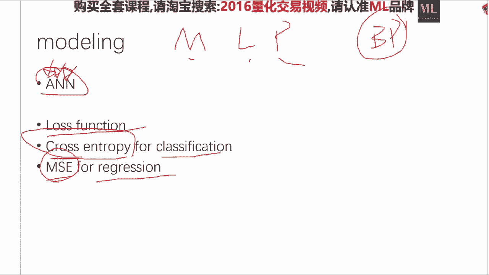

我们来看一下哈，首先我们要建立一个sequential的这么一个model，那么首先我们的输入维度是784，为我们第一层隐藏是512层，就是这是784，mc是最小方差，最小均方差对就是嗯对是。

那么我们看啊，比如说我们要建立一个输入是784，为第一层，隐藏是512维，这就是model点，at activation是ru就是它的激活函数，是这个ru很好的一个激活函数，招聘的是什么呢。

2012年赵rey hinton才提出来的一个，如果你的层数要做深啊，你很容易陷入局部最优啊，就很容易陷入局部最优，招报复的是一种技巧，他是在他是在做bp的时候，以0%点，这里是零点，0。

2/200概率，随机的把一些神经元关闭，这样的话呢就相当于我们训练，建了大量的神经网络的一个集成，这又到了集成学习了，就是说这个是一个极其不要脸，臭不要脸的一种大量训练，练积分类器的一个方法。

它是什么方法呢，我在每一次back propagation的时候，我随机的把一些神经元关掉，就假设它不存在似的，然后我做这个做预测的时候呢，我把这些w做一个average。

这样的话就相当于用一种极其巧妙的方法，训练了大部分的这个东西，0。2，这在这个里头是0。2代表的20%，它最大取一，最小取零，所以这个是科斯的一个参数啊，0。2就是20%的意思，就是你不用写那个百分号。

你写0。2，他就知道你是20%啊，照bob的一般来说，取0。5是一个比较人类的，一个比较大众化的一个老中医的方式，当然这个也是一个没有任何理由啊，你这炮越大，你这个这个神经网络就越不越不稳定。

差异性就越大，就不是这个这个事儿不是太好，这第一层，第二层就是再爱了一个512层的，一个以ru为activation的，一个具有00。2兆帕的rate的一个隐藏，然后你如果你是一个回归问题的话。

你在512位，你再干到一维，那么这这就做完了，然后你的activation你可以选择，比如说这个双曲函数，然后你这个model summary非常棒，它就会它就会自动的print出来。

你这个model这些每一层有多少个参数啊，而且主要是每告诉你每一层有多少个参数，对招豹子就是做了个集中学习，这是招豹子的本质，然后你这个当你输入这个model compel的时候。

就正式的完成了你这个model的这个这个创建，compel，你需要告诉他，你要你的loss函数是什么，和你的这个optimization是什么，就是说你的这个优化方法是什么。

目前来说用的比较好的一个是s g d嗯，就是这个当你数据比较大的时候，ig d就不错啊，还有一个是阿达姆，还有是阿达德尔塔老中医啊，没有什么为为为什么，另外一个就是这里所谓的所谓的rms prop。

这个是对于啊卷啊，不是这是对于这个呃rn来说是唯一的，你应该选那个方法，但是对于这种嗯很满意，我的多层多多隐藏的东西，你无所谓，选哪个都行，你这个metric是什么，metric。

就是说我在做这个在print我的这个测试集，在这个误差的时候，你直接可以把metric传给他，他到最后就会告诉你，我训练完之后，我的测试误差是什么，而且他会告诉你每一轮迭代的时候，我的测试误差是怎么样。

一点一点照顾下新的是一个非常棒的一个，就是就是说嗯这个chus，他的这个训练过程的这个printing，比sk 2做的要好得多，那么当我们有了这个model之后。

我只那么我们后面的东西长得就很像sk learn，有model。fit，有model点，predict这两个函数，你model点费的就是x train，y train，办事赛。

就是说我们数据特别大的时候，我们需要做这个嗯，batch update，就是每一次一般来说是128个批处理，128个训练，128个训练，然后这个number of epoch。

就是说我们要迭代的这个轮数，一般十轮差不多，就是你一直要轮数的选择，就是当我们的这个test sta比较稳定的时候，我们就啊，或者说我们这个training error比较稳定的时候。

我们这个轮轮轮数就可以停了啊，然后这个malidation set，就是嗯我们要在这个要汇报的这个测试误差，ok这个没有什么，为什么，这个纯粹是老中医的方式，一般来说我个人建议呢。

一般来说隐藏是二的几次方啊，这是第一啊，第二来说变化不要太大，你512跳到一，这是我给大家举一个很简单粗暴的例子，我建议如果你要做两个隐藏784，你最好是512128再一。

或者说是512256128 64 一啊，嗯轮数跟迭代次数啊，轮数就是迭代次数，batch size是batch size啊，轮数等于迭代速度，它都是所谓的这个number of epoch。

不是batch size，batch size是这样，ok当我们做，比如说做，你回去你们要看一下s g d是怎么做的好，这个是需要看的，就是呃一个随机梯度下降，什么叫batch size呢。

就是说我每一次就是如果当我们数据巨大的时，候，当我们比如说我们有100万个数的时，候，100万个时候，我们直接的，如果我们把这100万个呃，训练集完全的料给这个神经网络，或者任何一个训练算法。

然后求如果是线性回归问题的话，就要求一个矩阵的逆，对不对，那的数据太大了，我求你求不过来，或者说我神经网络来说，我这数据也太大了，我fit不进去，我们怎么办呢，我们假设我们有。

我们把这个训练集切成了128个，128个，128个，然后每一次料给他128个，然后他他就他对这128个呃，都跑一遍之后，再对这128个的错误积累到一定程度，再做back propagation。

就比如说嗯x一给他了啊，他算一个error啊，这个error我留着啊，记住了，x2 是一个error，记住了，当我们算了128个x error的时候，然后我们把这128个的，和我们集体的做一个字更新。

他是这样做的，嗯嗯嗯ok好，就是说嗯大家可以看这个安住，in他有一他有专门的大概20分钟的一个，就是他的那个机器学习里头的某一某一周，有关于怎么做这个batch update。

就是怎么样在大数据规模下做这个数据更新，这块sumalization，这个我上次说过了，咱们就不说了啊，就是你的这个模型肯定有操参数，你一定不要只用默认的就去出去炒股去了啊，你赔啊。

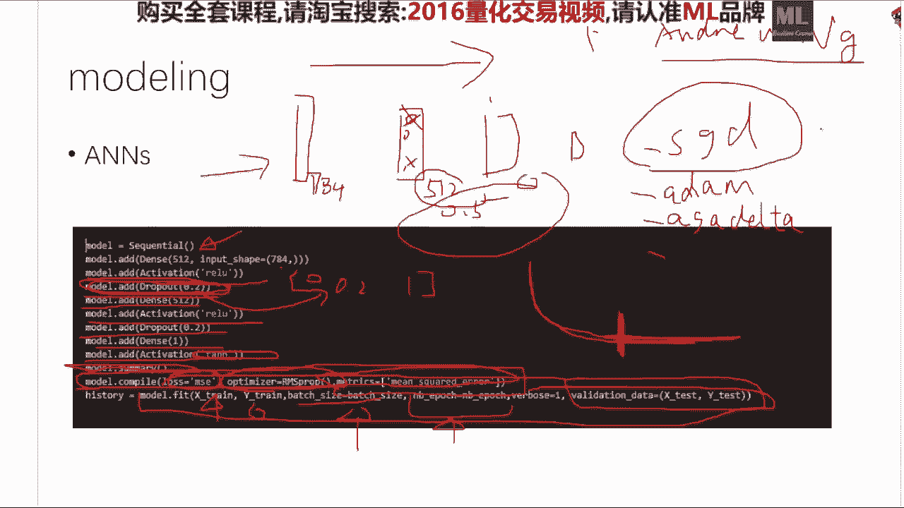

一定要把这个很仔细的，在这个超参数这个空间一定要做一下，也是只好不坏的一件事情，肯定不会比你默认的啊差太多啊，一般来说肯定会比默认的好，因为你没有任何理由能够保证你的默认参数。

在这个数据上的性能是最好的啊，好第一个作业哈，第一个作业来，第一个是这样，沪深300股指的预测分类和回归模型啊，不是说你挑一个，你俩都你俩都要做哈，俩都要做第一。

然后第一是至少需要你需要选择十个feature，这个feature你自己定，这feature你自己定，第二呢你需要plud出来这个feature importance，参考我给你的这个链接。

模型呢是需要进行啊，汇报这个cross validation的这第一第二呢，你的这个结果，需要把这个你的这个在测试集上的结果，进行一种可视化，如果是分类任务。

要把这个confusion matrix plot出来，sk learn里头有自带的，sk learn里头有自带的这个confusion matrix，怎么怎么做的一个方法。

回归任务是同时还要干这么一件事情，这就是大家常常干的啊，一定要干啊，这个一定要干，啊再说一下模型无所谓啊，模型我建议大家用一次随机森林啊，再用一次这个啊线性的，再用一次线性的模型，如果你学有余力。

或者说你电脑够用啊，你用用这个这个an啊，无所谓，feature importance，不是计算correlation啊，预测t加一就行啊，请预测啊，好再明确一下，预测t加一，因为我们这个是股指。

而且是n doc的数据，e o d数据，嗯请参见这个里头就是随机森林里头啊，我我刚才讲过了，就是说我们有另外一种是定义feature importance，的一个方法，就是就是说我们在随机森林的。

或者说决策树的每一刀切下去这件事情，他对这个子空间划分所对tm c降低的这个贡献，这个也是一个很好的fishing po tse的一个方法，而现在目前工业界里头所有的在应用的场所下。

所用的所有的这个数模型，它的这个feature importance都是这么干的，他并没有计算啊，correlation啊，请参照这个页面，那么回归任务还要干的一件事，就是说这个是真实值，对吧啊。

这这个预测值一定要学着pd一样真实值啊，大概是这个样子啊，对把这个要画出来，ok第二个就是说股票价格的预测，就是说啊我请大家干这么一件事，情，你在沪深300股指期货中选择出来。

价格在十块到50块的同时呢，它的这个average呃，呃daily volume就是他的这个这个daily volume，在这个啊中间的这个嗯，嗯33%的pertile里头。

你对这些的股票价格分别写一个大loop啊，分别的啊要有cross validation啊，要有各种的这个东西，并且汇报什么呢，汇报你的这个表现性能最好的一只股票啊，大家关于作业有问题没有。

然后请以这个ipad notebook的形式运行好的，这个就是你在ipad no book里已经运行完了，你存为一个html也好啊，你存为啊，你输出一个pdf啊也行啊，你给我啊啊对对。

不是ipad on console，是ipad on notebook，最后再给大家留啊四分钟的时间啊，需要查一下嗯，嗯这个是嗯，你查完你就这个是最基本的一个统计学的一个，你查这个东西。

你查box plot，你还能学多一点，是这样啊，boothday啊，超过deep learning是要看在什么数据集上啊，啊对，middle，嗯就是嗯，嗯这个问题嗯是这样，是这样，在很多数据集上。

deep learning都干不过嗯，嗯随机森林啊，如果当我们的表示足够好的时候，包括老嗯什么都没有什么，你们不用去看，而甚至如果是啊，不不不不不不不需要画这个box plot啊，就是说是什么。

就是说如果你要做deep learning，你最后也应该也可以，也一也可以用一个集中学习的方法，让你的这个性能再做一步提升，因为很多的这个image net的比赛，他们都是比如说用七八个嗯。

深度神经网络做一个集成啊，肯定会再好一点，只不过现在有人就一个已经够好，大家懒得做这件事而已，后面能讲下rnn吗，啊现在你看哈大家点的菜哈，就是点的菜，一个是这个nlp啊，这个r n啊。

还有有人说这个强化学习我都特别想想，因为这三个事情我都特别有激情，而且我还干过，确实干过不少这个相关的事情，我都即将讲，咱们看时间，我尽量的满足大家啊，回归问题能用决策树解决。

你去看sk learn里头有一个random forest regressor，和random forest class fire，这两个东西分别干的就是分类和回归啊，我的我如果大家这个课反响好。

我可以开这个量化中级班啊，或者高级班啊，私人问题就不要问了，老师就不是吹牛逼的人吗，你这么了解我，如果我开中一班，如果大家的作业坚持到了最后，坚持到最后的最好的头几个人的中级班的学费。

我自费掏钱请你上啊，但是前提是如果我有时间开中级班的话，嗯嗯这两个月内是肯定没有时间了，好再说一下作业的啊，终于有人问正常的问题了，所以要是这样嗯，你现在不是有这么多股票跟这么多数据了吗，先干这件事。

情，先把符合这个要求的股票全选出来，然后这些时间序列你分别的做一种啊，就是分别的暴力的试试各种的模型，然后选择出来你在这些个股票中，你能学出来的最好的一个结果，请大家看一下。

我这个里头有一个这个文件叫做forecast。py，那个文件里头是告诉你，怎么样的对一只股票进行一种暴力撸，就是暴力的，用各种的嗯这个分类器来做这件事情，然后你们在暴力路上，再暴力的把这个股票做一遍。

就相当于两个for loop啊，把这些事情全干了，嗯你可以，这个其实我建议你就呃11年内的一个均价吧，有应用场景相当有应用场景，因为神经网络是有有定理可以证明，神经网络可以逼近任何函数。

所以说它是一个性，至少它就是你可以把神经网络就看作，就分类和回归，他都能干，那么你能你能你你能分类，你需要分类和回归的事情，都可以选择是你网络作为一个工具，所以说它自然是有嗯应场景的。

ok那就是今天的作业，然后很不幸啊，明天的作业的话还会有我不会呃善待，因为今天作业善待大家跟上周一样，明天还会有类似的作业，然后我们明天再说啊，对33~66，那么呃今天就讲到这里啊。

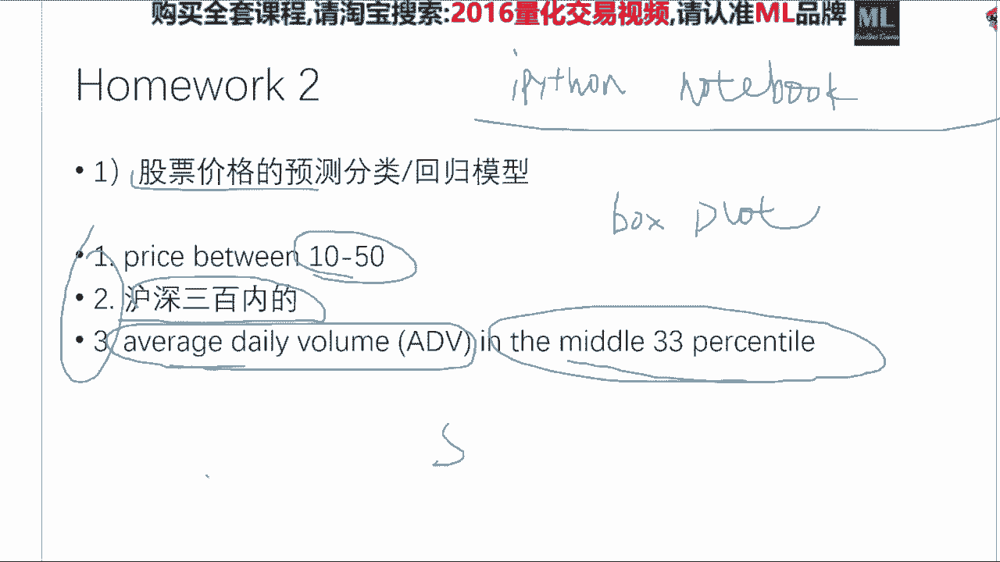