# P9：第9课_机器学习与量化交易项目班.mp4 - 大数据狂人 - BV1V24y1Y7eY

好，那我们今天开始最后一周的这个上课，首先，今天上午这个事件向大家郑重的道歉，这个心里非常的沮丧，因为给大家实实在在的添了不少的麻烦，所以这次向大家再次郑重道歉，然后上午心情也一直没缓过来。

但是有一个稍微好一点的事情是，今年的这个AAAI2017，这个是国际American Association of Artificial Intelligence，这个就是人工智能界的国际顶会之一。

然后说我其中的一篇论文给录了，然后心情能稍微好一点，这个就是现在这个机器学习顶会大概有这么几个，一个是这个一个是这个SML，然后一个是这个PJK，还有一个这个全球网络的顶会，然后跟数据挖掘有关叫KDD。

差不多就是这么几个会是目前大家比较认的，相当于因为计算机跟这个，跟其他的自然学科不一样的地方就是，计算机它比较重视会议而不是特别重视这个期刊，因为原因就是会议是当年发当年投当年就能够发表。

这样的话有一个好处就是，因为这个东西更新换单太快，你要是投一个期刊的话，它这个评审的过程肯定会超过一年，那么这个事情就不是很实时，所以大家现在国内是花了很长时间，才重视这个会议的这个会议论文的这个东西。

因为以前因为你要升一个什么国家基金的话，你作为计算机是跟数学物理他们一块比，或者其他那些工科一块比，其他工科他们那个会议是很就是，你不需要干什么就能去的一个事情，所以说中国是花了很多年才把这个计算机。

这个会议的地位提到了跟期刊一样，所以就是大家以后如果关注一些论文的话，如果看到是这么几个会议上发出来的，你就会知道这个应该就达到了目前的，国际的顶尖的水平的论文，一个是NIPS， KDD。

这个是跟数据挖掘有关的，AAAI是人工智能的，SML是跟机器学习有关的，International Conference on Machine Learning，然后一直开始它是什么都有。

这个机器学习人工智能都会有一些，AAAI是美国人工智能学会的原著会议，一直开始就是International Joint Conference on Artificial Intelligence。

然后今年的NIPS是在巴塞罗那开的，然后今年的这个，SML也是在巴塞罗那，他们都是在今年的这个12月，这个地方还不错，OK，那我们今天正式的来讲我们的这个事情，这两节课的干货会非常的多。

所以大家做好准备，另外就是说，因为今天上午的这个课我准备上去的时候，很多事情是跟这个微信群里的发的，所以说如果没有进微信群的同学，可以选择加入，加入之后这个课就算结束之后，也会有跟这个方面相关的东西。

我就撂到那个微信群里了，大家保持，我不会走，大家这个不用担心，我会这个一个多月来，跟大家产生了蛮深厚的感情，所以说这个微信群到时候，大家如果加入的话，应该不会有什么太大的坏事，OK，对。

就是主来发的这个地址，大家可以看一下，然后对微信群是一个事，然后另外一个事就是我们这两节课，我的安排大概是这样，今天这节课把这个关于，自存组合理论的这个内容讲完，讲完之后呢。

今天的后半节课跟明天的上半节课，主要跟大家review一些，做的蛮有意思的一些论文，让大家看看这个，如果做积极学习跟量化相关的这个东西，别人是怎么做的，和怎么样的展现你自己的这么一个方式，最后呢。

还是确实第二件事，OK，第三件事情呢，是主要是要跟大家说一下，怎么样的如果你想进入这个，Quant这个行业，怎么样的求职，面试的问题有什么，怎么样准备面试，学完这个事情之后，你还应该学什么。

还有就是学完这个事情之后，我没有讲到的事情，有哪些你从哪去看，等等的相关的这方面的事情都会有，其实这个是我非常重视的一个事情，就是说，一个课是不可能把所有课程，所有东西学完的。

根据我教给你这门课的这个骨架，你怎么样的在这个骨架上，建立你自己的这个体系结构，建立你自己的这个，这个就是相当于知识储备，我帮你把书架打好了，告诉你这一层放什么，那一层放什么。

然后每一层都给你放了一两本书，那么你要干的事情呢，是把你自己的书架，把书填满，就是像滚雪球一样的知识，就会越来越大，那么所以说我也会跟大家说一下，量化作为这个行业，作为一个职业来说。

你们的这个职业规划和你们以后，如果要求职，需要注意什么，这个是一件事情，然后，我想想，差不多对，差不多我争取用，今天跟明天上午，明天上午是上课啊，这个大家别忘了，我是忘不了，明天上午的这个时间。

就是用四个小时的时间，我来争取的把这些事情，给大家cover掉，OK，这个高级班是这样，高级班我是非常愿意上，但是开高级班有这么几个要求，就是听完这个课之后，我希望大家用几个月的时间。

消化一下这方面的知识，同时我会明天给大家一些，我个人认为很有帮助的读书列表，大家先把自己先提升一下再来上，这样的话，因为我强调的是上上这个课，不能跟碳北剧园看完就就撂了。

我是真心希望大家有一些比较好的进展，所以希望大家需要再再再消化一下，再来上，要不然的话，我在这儿讲完了，你们要是没听明白的话，我心里是过意不去的，这个学业道德不允许我这么做，所以说大家听完这个课之后。

今天你们就看看，我给你发的这个这个群里的这些论文，你就会发现，原来就是这东西吗，看来上课都讲了，如果你有这种感觉的话，我会很开心，然后同时呢，还有一些没有cover掉的，包括一些金融方面的知识。

我明天会告诉你从哪看，因为这门课毕竟是给大部分是CS出身的人学的，所以说有很多金融的知识，我没有讲，比如说关于期权的定价很重要，但是这个的日是一个纯金融的一个知识，我如果讲了的话。

会对这个初级班的其他同学不是很，就说这个课的内容不是很平衡，但是并并并并不说明这个事情不重要，那么就希望大家如果要上这个高级班的话呢，在初级班高级班的中间这一块，你们自己需要看一些东西。

把这些事情看明白，然后这样的话，我高级班就能再给你说一些，目前的思路是怎么做的，要不然现在给大家讲，大家也听过就听过就好，这样是不好的，所以说，对大概我的这个授课的这个计划就是这么做的，还有什么问题。

啊对啊，其实我还想干的就是说给大家说一下，这个再多说几句求职吧，如果有感兴趣同学的话呢，现在这边有一个做的蛮不错的，这个一个是公募一个是私募啊，都是我都是可以推荐人的，所以大家如果感兴趣的话。

你可以跟我微信私聊，我而这两个负责人跟我关系都很好，他们做的也蛮靠谱，所以说我也可以给大家，如果有合适的机会的话，我可以就说关于就是这个岗位的话，我这边是永远是缺人的，给大家推荐到比较不错的地方。

相当于内推吧，给大家一个福利，然后第二个事情呢，就是说我明天第二个事情就是说我明天呢，看看有没有时间会给大家，因为我也面试过不少，这方面的这个这个岗位的人，所以我会给大家说一下，如果我来面试的话。

我会问什么问题，大家需要做一下这个准备，有时间的话，我会跟您家说一下，如果更有时间的话呢，我可以做一个模拟的面试，如果群里头哪个同学说，我想当一个被面试的，那么咱们可以在群里头公开的，我把你面一面。

这个如果感兴趣同学在今天11点半之前，跟我报名，但是你要做的事情就是，你需要跟我一块在群里头说话，看时间吧，如果有时间的话怎么做这件事情，如果没有就算了，OK，看看有什么有价值的问题，值得我回答的。

跟课程有关的，看来是没有，好，那我们今天开始讲课哈，讲课是这样，今天是先会跟大家讲一个是关于这个矩阵的这个特征值，因为我不讲特征值，就是说讲完特征值的一点初步的一些基础，从这个特征值的定义到SVD。

给大家稍微复习一下它的本质，然后呢，再跟大家说一下怎么样的利用，特征值最神奇的地方，宇宙的秘密，就是说怎么样利用特征值来对你的资产进行一个，这个profile allocation。

就是说你的这个资产组合的这个权重，就是大家记不记得，比如说卡不卡，有不卡的没有，好，就是说我们之前不是说过我们要要minimize，我们的一个风险吗，这个风险就是说，比如说我们有十只股票要进行操作。

我们怎么样的确定这每只股票的这个这个比例，这个东西其实它的本质是跟特征值是有关系的，OK，就是他这个事情，他其实本质跟特征值是有关系的，所以今天我会跟大家说怎么样利用特征值来做这件事情，第三个呢。

就是说我会再用剩下50%的时间，跟大家过大概五篇这个paper，看看别人就是你的，就是别人他们是怎么来做这些事情的，大概我争取用这两个小时来把它做了，好，好，现在现在开始，好，详细解析下思路啊。

对是就是说是跟大家说一下怎么看这些论文，因为现在的有一个就是说论文啊，你是看不完的，每年像鼎慧的论文都会有上千篇，你全部看是肯定，其实是可以全部看，就是说你主要是要把这些论文。

一个是他的这个这个introduction，就是说他提出了一个什么样的问题，问题是最重要的，跟他的解决的大致框架是什么，技术细节不需要看，当你需要研究某一个特定问题的时候，你再看，这个代码代码要讲代码。

我明天跟大家再说一下，对这个还有咱们作业的事情，所以说还有一个问题，就是说这个看论文的过程，我先跟大家提个醒，论文它不是书，论文是有大量的瑕疵的，尽信书则不如无书，是最最适合形容你看论文的这个事情。

看论文看什么，看的是别人是怎么解决这个问题，跟别人是怎么提出这个问题的，而他在解决过程中，其实会出现大量的错误，一定要有批判的一个角度来看，不要迷信任何一篇论文，你看完论文之后，你就说啊。

他这个点还挺好，那我就记住，他这个点挺傻逼的，你就一定不要去用，就是说在这种情况下，你自己才有可能进步，如果你把每个论文当作金颗玉玉的话，那你就完了，你就不可能有任何的，真正收获的地方。

对这个是我跟大家需要提醒的一个事情，OK，那咱们一件事一件事来吧，好吧，先说这个这个矩阵的特征值，大家还有印象没有，好，那我就给大家以极简短的，几分钟的时间跟大家大致把定义说一下，特征值是这样。

为什么要特征值呢，特征值从名字来看，它就极其重要，对是什么意思呢，就是说我们，我们要干的事情就是说，对于一个矩阵，一个方阵，一个比如说是100乘以100的一个矩阵，这个矩阵呢。

如果我们把这个矩阵看作一个线性变换，对不对，我们怎么样的刻画这个线性变换，那么这个线性变换是什么意思呢，这100乘以100的一个矩阵，乘以一个100乘以1的一个向量，它应该是一个几维的一个东西呢。

它应该你看啊，矩阵乘法嘛，它俩是一样的，那么就变成了100，这两头的这个大小，乘以100乘以1的这么一个向量，它干的其实你可以把，你可以把这个矩阵看作一个函数，这个函数干的什么事呢。

它是把这个函数是一个映射，这个映射是把一个100维的向量，变成了另外一个100维的一个向量，而这个函数怎么实现的呢，它是用矩阵来实现，所以说这是一个线性变换，就是矩阵跟线性变换。

就是你们要是数学系的话呢，你们学的是高等数学对吧，高等数学其实学的是这个线性变换，而这个这个线性代数呢，它主要学的是这个矩阵论，就是这两个其实是本质上是一样的，为什么就是说线性变换的角度来看。

任何矩阵是一个函数，这个函数能把一个100维的一个，一个向量变到另外一个100维的一个向量，那么如果这个矩阵不是方阵，比如说这个矩阵是50乘以100的话。

那么就把一个100维的一个向量变成了一个50维的，那么如果是2乘以100的，就把100维的向量变成两维的，这不就是分类问题吗，0或是1了，所以说这个矩阵其实就是任一切线性模型的，这个参数的一个一个选择。

那么我们在刻画描述一个矩阵的时候，我们是把它的所有的这个矩阵的元素给别人，这当然是一种方法，但是这个并不是本质，就是说你形容一个人的时候，你是应该说他的这个，你就把这个人给他呢。

还是说OK我给他几个维度的一些特征，那么这样的话呢，更能够深刻的刻画出来这个矩阵的本质，那么数学家对于每一个数学对象，数学家都发明了一系列的方法，来刻画一个数学的对象，一个一个一个一个一个object。

一个mathematical object，一个数学的对象，矩阵就是一个数学的对象，那么怎么样刻画这个数学对象呢，一个非常好的方法就是用特征值跟特征向量。

这两件事情就相当于能够完完全全的把这个矩阵就能够形容了，就比如说别人说你给我矩阵，你不要给我矩阵，你把你把这个矩阵的所有特征值，跟所有特征向量给我，我就知道了这个矩阵的一切信息。

这个大家是不是听得很好熟，是因为你们要在学这个机器学习的时候，你不需要给我任何东西，你只要把他的这个联合分布给我，我就能回答关于这个联合分布下的一切的推理问题，它是一样的，OK。

那么这还没到特征值跟特征向量，这目前是光到这个矩阵的这个就是从变换的角度来看矩阵，OK，这个是一个比较正统的一个角度，那么特征值他想干的是什么事呢，特征值他想干的事情是一个非常特殊的。

当我们给定一个矩阵，100比如说是100乘100为的，这个矩阵是给定的，这个是不变的，这个这个是不变的，那么我们，我们想要什么呢，我们想要的是请你当给定一个矩阵之后，请你找出来很多的这个x。

使得ax=λx，比如说这个是100乘100的，这个是100乘以1的，λ是一个常数，它可以是实数也可以是负数，负数的负数就是那个，是那个a+ab这个负，这个负，这个λ它可以是实数也可以负数。

而这个x就是这个x本身100乘以1的，我们是要找到什么，我们是给定一个矩阵，我们要找到所有满足这个等式的x跟λ，而这个事情是一个非常不显然的一个事情，它的本质是什么呢，比如说x在这个方向上。

他们要求的是这个矩阵a，作用在这个x之后还在这个x的这个方向上，这个是特征值跟特征向量的一个本质，也就是说，请你给我一组x，使得ax之后它跟x是平行的，并不是所有的x都能满足这个等式。

其实大部分的x都不满足这个等式，因为你没有任何理由相信，一个线性变换之后这个x还在这个轴向上，就是在这个100轴的这根线上，有问题没有，好，那么这个事情我们怎么办呢，其实非常简单。

如果就是比如说大家这个数学比较好，就是你只要记住这个特征值的定义，你就能把这个特征值求出来，咱们求其实非常简单，你看你不就想求ax=λx吗，那么我们先求λ对吧，我们先求λ我们怎么办呢。

要求λ就把它就就给它挪过来，那么就是ax-λx，x是向量，λ是常数，a是个矩阵等于0，然后再怎么办呢，提取公因式，那么就是a-λ，那么这一个矩阵减一个实数怎么减呢，不能减，只能λ乘以一个单位阵乘以x。

它等于0，那么到了这一步了，也就是说我们要求的是a-λi，乘以这个x等于0，然后怎么办，然后你会发现其实这件事情，它说明了一个什么呢，说明了一个矩阵乘以一个非0的，一个非0的一个向量它为0。

说明了这个矩阵是不可逆的，说明这个矩阵不可逆的，那么就说明了这个矩阵的这个行列式为0，也就是说determinant of a-λi=0，啊我操，到了这一步了，那你就爽了，你把行列式的这个公式带进去。

你把a，a比如说是个123567999，那么它减一个λi就是1-λ，6-λ，就是它对角线元素上分别减了一个λ，它的行列式等于0，那么这个就是一个关于λ的n元次方程组，你解这个方程组就完了。

那么一个n元次的方程肯定有n个根，这个根有可能是实根有可能是虚根，也就是说我一个矩阵的这些λ，它有可能是实数也有可能是负数，但它一定是有几个呢，一定是有n个这个n就是矩阵的这个阶数n乘以n，这是第一。

第二呢我们没解出来一个λ，我们就会有对应的这么一个x，而没解出一个λ，比如这个λ我算出来λ1=6，那么就是a-6x=0，那么我就反过来要求，对应特征值为6的这些x是什么，这些x其实是5成多个。

那么你只需要找出来一个就行，当我们的这个λ有这个重复的时候，比如说这个λ如果这个a是3乘以3的，那么这个λ比如说等于6 6 2的话，那么肯定它这个，你看这有两个6了。

那么肯定就是说我其中一个特征空间是一个2维的，就是说我这个对应这个λ为6的这个特征值，它有一对这个空间是两维的，另外一个λ等于2的时候，它这个特征值肯定都在这条直线上，这就是线性代数的本质，有问题没有。

好再来一遍，就是说是任何一个矩阵，任何一个矩阵都会有n个特征值，对不对，n个特征值，如果当你的特征值有重复的时候，就说明这个特征值所对应的特征向量，所在的那个空间是大于1维的，那么就会有。

比如说你先看正常的情况，正常情况比如说对于一个3乘以3的矩阵，它的特征值分别是1 2跟6，那么就说明1对应一个x，2对应一个x，6对应一个x，因为你一个ax等于λx，你现在已经求出来一个λ等于1了。

那么就是ax等于1x，那么这个x其实是有无穷多组的，但是这些无穷多组，其实它都是一个，为什么呢，是因为这些x，它都在一条直线上，如果这个情况是，当你的这些特征值不重复的时候，如果你的特征值一重复。

那就麻烦了，如果你的特征值一重复的话，比如说是1 2 2，那么就说明什么呢，就说明你这个特征值，这个2所对应的这个特征值的这个x，它是嵌定的，就是你解a的时候它是嵌定的，也就是说你能解出一组这个x来。

它都能满足它，也就是说ax等于2x的时候，你就能解出两个垂直的x，它都能满足，就一个x在这个方向上，一个x在这个方向上，这个没关系，这个这个知识你不需要懂，你需要懂的是下一个知识，然后好，好，好。

那么我们最关注的是什么呢，我们最关注的其实是这件事情，就是你现在先先记住，就是任何一个n乘以n的一个矩阵，能给能求得一组lambda值跟x值，这些lambda跟x分别叫做它的对应，叫做特征值跟特征向量。

每一个特征值有一组对应的特征向量，可以是一个也可以是n个，就是说这是你需要知道的第一件事，因为什么呢，因为这个a是一个任意的方阵，所以这个特征值跟特征向量，在很多情况下它有可能是虚数，叫虚数，好。

那么我们其实更关心的一组矩阵，它是什么呢，它是一个比较特殊的矩阵，叫什么矩阵呢，叫做symmetric，就是说叫做对称，第一我要求它对称，第二我要求它的这个对称就行，咱们就先考虑对称。

就是说a等于a的transpose，就是说我所有的这个列，我让它站起来等于行，比如说1231224，它的这个转制就是什么呢，就是1224，所以说那么你明显的它是不等于它的，所以说并不是所有的矩阵。

都是都有这么好的一个性质，那么对称阵呢，是非常非常非常好的一系列的一个矩阵，而在具体应用中对称阵的应用是极其广泛的，也是极其美妙的，它在这个就不说了，它是非常重要的一个东西，那么我们现在看看。

如果一个矩阵它是对称的，它有两个非常重要的结论，第一对于对称阵，它所有的特征值lambda都是实数，这是一个非常非常重要的一个结论，第二所有的lambda所对应的这些，所有的lambda所对应的特征。

叫做特征跟A跟vector，它们是互相垂直的，就是说所有lambda所对应的xi是互相垂直的，这个是一个极其重要的一个结论，那么我们如果要，就是说是好，那么先说，对于非对称的矩阵A，我们是如果。

就是说有声音吗，有是吧，那么对于非对称的这个A呢，我们有这么一个结论，A等于什么呢，A等于S，这个Sigma，S的逆，当然它是有一个前提的，就是说对于非对称的n乘以n的一个矩阵。

那么它有一个这么一个结论，叫做对角化原理，就是说我任何一个方阵，它都可以写成一个方阵乘以一个对角矩阵，再乘以这个方阵的逆，而这些方阵是什么呢，这个S就是说我所有的这些特征A跟vector，x1， x2。

所有的特征向量，你把它按列给它塞成一个n乘以n的一个矩阵，再乘以什么呢，再乘以这些特征向量所对应的特征值，从lambda1， lambda2一直到lambdan，然后它非对角线元素全是零。

再乘以这个S的inverse，前提是什么，前提是如果我的这个矩阵的特征，A跟vector的逆存在的话，这个是一个非常大的一个假设，如果它存在的话，我们是可以写成这个条样子的，有问题没有，好，对。

这个是一个非常简单的一个结论，那么这个结论它的用处是什么呢，它其实这个结论极其好用，为什么呢，其实这个结论是，就是说是显然的，显然在哪呢，因为我们不是已经有了ax=lambdax，就根据定义就能把这个。

就能把这个a=Ss的逆推出来，那咱们先推一下，那么比如说这个，我们先看看as=什么，as不就等于a*，S的定义就是说，我们把所有的这些特征向量，x1， x2按照列，我们给它写出来了，到xn对吧。

那么我们给它，我们把这个a乘进去，我们乘进去ax=什么呢，ax=lambdax，那所以这一步，a*S它就等于ax1就等于lambda1x1，那么它就变成了这个，lambda1x1。

然后lambda2x2，然后lambdanxn，对不对，那么我们把这个矩阵，我们再给它拆开来看，拆开来看它其实它就等于什么，就等于x1的这个向量，x2的这个向量，组成的这个矩阵，乘以一个对角阵。

lambda1到lambdan，上面都是0，就是说因为你根据矩阵乘法的定义，这个就是矩阵乘法的定义，矩阵乘法的定义，定义，就能从这一步退到这一步，那么这个东西是什么，这个东西我操，这不就s吗。

这个东西是什么，这不是sigma，那么就是说明什么，我们就退出来了，as=ssigma，这个是对于任何方阵都成立的，横等式，谁都能成立，那么如果s能求逆的时候，a=ssigma，这就叫对角化。

矩阵的对角化分解，其实根据这个矩阵的这个特征值的定义，你根本不用记住，根本不用记住这些玩意，你自己就能推了，有问题没有，没有问题，没有问题，那其实好，那么我们再看今天的主角，主角是什么呢。

主角是a=a的transpose，对不对，主角是a=a的transpose，然后我们现在已经有了一个，a=ssigma，对不对，那么我们看看，如果任何，你想啊，任何一个矩阵，你都能写成ssigma。

对不对，那么当a=a的逆的时候，我求一个矩阵的逆是很费时的，对不对，那么当我们一个矩阵具有这么美好的一个对称的性质的时候，我能不能不用求这个逆，答案是，我们就要求一个，矩阵的逆，我能不能不用求这个逆。

答案是，你是可以的，为什么呢，就是当这个矩阵是对称的时候，它的所有的特征值都怎么了，都互相垂直了，都互相垂直了说明什么，说明这个s的每一列是互相垂直了，那么说明这个s。

如果当一个s的每一列都是互相垂直的话，那么这个s就叫做正交阵，那么当这个s为正交阵的时候，s的逆是等于s的正交阵，s的逆是等于s的转质，那么这样的话，那么这样的话，我们的a就能写成了。

当它是正交阵的时候，一般来说有一个特殊的记号叫q，那么a就等于q，sigma q的转质，这个是现行代数中最萌的一个，这个是现行代数中最萌的一个，就是长得最萌的一个公式，就是a=q。

sigma q的transpose，这个q是它的所有的特征值，这个q是所有的特征项量，这个q是所有的特征项量，这个q是所有的特征项量，这个q是所有的特征项量，这个q是所有的特征项量。

这个q是所有的特征项量，这个q是所有的特征项量，这个q是所有的特征项量，这个q是所有的特征项量，这个q是所有的特征项量，这个q是所有的特征项量，这个q是所有的特征项量，这个q是所有的特征项量。

这个q是所有的特征项量，你看啊，a其实是一个新的面换，那么它是一个离散的，在范函分析中有一个连续的，就对于一个连续的新的面换，同样能够分解成这么一个成绩，同样能够分解成这么一个成绩。

那么这个是范寒仲的一个公式，那么普定里的离散的表现形式就长这个b样，那么普定里的离散的表现形式就长这个b样，那么普定里的离散的表现形式就长这个b样，那么普定里的离散的表现形式就长这个b样，有问题没有。

好，好，好，我们今天我为什么要讲这个东西呢，就是因为今天这个玩意要派上大用场，就是因为今天这个玩意要派上大用场，ok，那么当然我们讲一个题外话，题外话是什么呢，题外话就是说当我们对于。

比如说如果我们知道任何一个矩阵，它如果能写成s，sigma s的e，这个同学既然提到它有什么用，假如说你不是干量化的，你如果有这么一个分解，就是说你能求出来任何一个矩阵的特征值，特征值跟特征向量的话。

你就能求矩阵的高斯密，在极快的这个时间复杂度里，怎么求请看，比如说我们要求a的平方，你怎么求，既然a=a，a的平方是不是等于a*a，那么a*a是不是就等于，是不是就等于，s sigma s的e。

再乘以s sigma s的e，那么s的e跟s一乘，那么s的e跟s一乘，那么s的e跟s一乘，那么s的e跟s一乘，那么a的平方就等于，s sigma的平方，s的e，a的平方，那么a的，a的一万次方你怎么求。

一个矩阵的一万次方，它就等于，因为别人已经给你了这个，这个矩阵的特征向量了，合同准指了，你就一万次方乘以s的e，一下就求出来了，一下就求出来了，这个是目前MATLAB里头求矩阵的n次方的一个方式。

这个是目前MATLAB里头求矩阵的n次方的一个方式，这个是目前MATLAB里头求矩阵的n次方的一个方式，这个是目前MATLAB里头求矩阵的n次方的一个方式，当然如果你要参加这个百度的面试的话。

当然如果你要参加这个百度的面试的话，他们是，这帮人的数学很差，矩阵的快速密，你其实是能用分置的方法，就是能在logn中，logn不来求快，但是也没这个快，因为你想，这个东西你已经有了，这个东西你只是。

它是一个对角线元素，5 6 7 0 0，你就直接把这个对角线元素中的每一个元素，直接给它干到一千次就行，这个比矩阵的快速密不知道要强到哪去了，是因为矩阵的快速密，它并不知道这个矩阵的这两个东西，好。

那么这个是一个小知识，既然你要用的问他怎么用，这个是最直接的用法，有问题没有，有问题没有，说实话啊，矩阵的特征，跟特征相当于一个极其美妙的事情，它值得用一门课来讲，那么今天我是。

把所有的跟今天你要学到的这些知识，我给你，我给你摘出来，摘出来之后呢，就是，你将将能够听懂今天的，金融那块的东西，所以说，是这么个路子，接下来大家，一定要去听，要听什么呢，要听这个MIT，这个公开课。

他这个，讲这个新型态术的，这个linear algebra，这个课呢我刚才的每一页，差不多是他用了一个小时，所以刚才是这个东西，他是一个小时，这个东西是一个小时，差不多是三个小时的，这个事情，那么。

但是我是建议他，大家是要，要听的，Ok，这个S不可逆怎么办，你没辙，如果S不可逆，你是不能那么干的，你不能说这个矩阵是不是对称的，如果他告诉你是对称的，这就可逆了，你就挺开心，好，那么我们再看。

再接着走，那么传说中的这个SVD，它是什么呢，就是矩阵的这个终极大杀器，这个是对于任意矩阵的，这个是对于任意矩阵的，SVM一样是每一个活在21世纪的理科人所必备的一个知识。

因为这个玩意儿目前在广泛应用中，应用在你生活中的方方面面，你现在应用到的每一个APP里头，背后在哪一块，不定着就在求着一个SVD，我们来看看SVD到底是个什么鬼，SVD听明白了PCA就非常明白了。

因为SVD跟PCA其实是两个完全等，不能说等价吧，就是两个完全不同的角度，来看待同样一件事情，好，那么我们要干的SVD要干的什么事情呢，我们SVD想干的事情是对于任意一个矩阵，注意任意啊。

我们要对于一个任意矩阵，我们要分解，我们之前不是对于，如果当A等于A transposed的时候，我A能够分解为什么，盲盲的对不对，我A能分解为这个盲盲的这么一个矩阵，但是这是一个简单的矩阵。

我们要分解，为什么盲盲的这么一个矩阵，但是这是一个极其特殊的情况，就是说当这个矩阵是对称阵的时候，而你在实际生活中，见到的矩阵有可能不是对称的，你怎么办，那么就说明SVD它能干的事情是，我不能分解为。

这两个Q是不一样的，那么我就给它分解为，这个鬼东西，这是什么东西呢，就是说对于任意一个矩阵，我要把它分解为，它要正交，这是个正交阵，正交阵就是说，这个矩阵中的每一列是互相垂直的，成一个对角阵，对角阵。

就是说它的对角线元素是有的，其他非对角线元素全是零，再成一个正交阵，这个玩意是对于任何的，SVD干的事情就是说，比如说你用Python就是SVD，这个M，它会给你返回这个U，Sigma跟V。

你给我一个A我给你三个矩阵，这三个矩阵分别是有两个是正交的，有一个是对角线的，那么它其实是脱胎于这个玩意的，因为这个玩意，这个东西是相当于上等公民，对于上等，对于一等公民来说。

你给我一个A我能给你一个Q，一个Sigma，它们能写成这三个的乘积，那对于草民来说，我草民也想干这件美妙的事情，那么对不起，你不能干这么美妙，你只能干到这种美妙程度，就是说我这两个Q是不一样的。

但是它们是正交的，这个是我能做到最好的事情，那么它的本质是什么呢，那么它的本质是什么呢，它的本质是这样，其实我今天为什么要讲到特征下来，是因为今天的所有推导，你只需要知道，你只需要知道AX=λX。

你只需要知道AX=λX，这是你只需要知道的事情，我今天讲的你看我讲到的每一个定理，全都是根据这个推出来的，你没有用到任何额外的知识，拉格朗日诚字法你没用到吧，秋刀你也没用到吧。

虽然它是非常常见的一些东西，那么我们看看，我们怎么样的运用，根据这个矩阵的特征值的定义，纯粹的定义来把这个玩意推出来，纯粹的定义来把这个玩意推出来，三分钟就推出来了，有问题没有，有问题没有，好没有问题。

其实就是说，他要干的事情其实是什么，你看你不是想要A=什么，A=U，σ，V，那么其实你要稍微还记着点，那么其实你要稍微还记着点，这个信息代数的话，那么他其实干的事情的，就是说从一个矩阵的这个航空间。

他取出来这么一组正交机，这些玩意是U，都是这个大U里头的，这个是V，一个是U一个是V，虽然看上去，这两个是不一样的，他干的事情是什么呢，其实我要干的事情是，就是说我从他的航空间里头。

就是你就想象一个空间里头，有一组正交机，正交机的意思就是说，这些U它们都是互相垂直的，就是U1跟U2是垂直的，跟这个U3也是垂直的，那么一共有几个呢，是取决于这个矩阵的rank。

就是说这个矩阵航空间的这个维度，那么他干的一个事情是什么呢，我要干的事情是，我把这些U我通过矩阵这个，切面换，变到了这个AU，变到了AU，那么变到了AU它在哪了，它就跑到矩阵的这个列空间里头去了。

这个是RM的，这个是RM的，这个列空间里头，我把矩阵中航空间里的这组正交机，通过这个线性变换，所变换够的这些，这些个玩意儿，它们仍然是正交的，就是说仍然我要求它这个V也是正交的，我再说一遍啊。

这个是非常重要的，就是说我要求这些U是正交的，这些UI是正交的，我经过了一个线性变换，AUI，让这个，让这些AUI仍然是正交的，也就是说，这个我给它定义为VI的话，让这些VI它们也是正交的。

UI是正交的，对不对，我要求一个线性变换，使得在航空间中的这组正交机，在线性变换之后仍然是正交的，同样它跟AIX等于LAMBDAX一样，它并不是很显然的一件事情，你并不能满足，胡乱找那么一组。

什么几把玩意儿的这个正交机，你让它线性变换，之后它仍然是正交的，这个事情可不是对于每一组正交机都能满足的事情，那么我们要干的就是说，求出来，要在这个空间中，请你给我找出来一组，非常性质良好的正交机。

使得它被变换之后，它仍然是正交的，这个是我们的目的，我们给定的是什么，我们要求的是U跟V，使得AU等于V，同时这些V跟U都是正交的，有问题没有，没有问题，好，那么我们会什么，我们什么也不会。

我们只知道定义，那么定义是什么呢，定义是这样，我们不是有这个A，我们要算AU对不对，AU是什么呢，就是说我们把这些正交机，都写到一个这个这个这个矩阵里头，就是U1，U1是一列，U2是一列对不对。

然后UN是一列，它等于什么呢，那么我们要求它，我们要求它是，就是说，我们要的是，我们要的不是AU，等于这个Uσ，对不对，因为我们要的是AU1等于σ，1V1，AU2等于σ2V2，就是说我们之前的这个东西。

你可以就是说，因为因为他们正交的这个事情，并不影响我们往前面成一个系数，因为这个系数只不过是让它变大了，或者变小了，并没有改变它的方向，好，那么这个是我们，我们要求的这个东西。

我们要求的这些U跟V满足的这个，这个定义，那么我们就要求，要求的这些U跟V满足的这个性质，那么我们用矩阵的这个写法，就是说我们把它写成矩阵的话，就是就是什么呢，就是说AU等于什么，我们把这些U。

U1 U2，一直到UN，它乘以，乘以σ1，σ2，一直到σN，这步没有问题吧，就是说我们要求要A，U1 U2，一直到UN，等于，这个应该是V，抱歉，V1 V2，一直到VN，乘以一个对角阵，这个是我们要的。

我们，这是我们要干的事情，就是说我们当我们知道一个A的时候，请你给我求出来这组U，使得这个玩意成立，我们要干的事情就是求U跟V跟σ，对不对，有问题没有，没有问题，没有问题好，那么我们看看我们怎么求。

我把这个，大家这个问题弄一下，我们怎么求，那么我们用矩阵的写法就是AU，等于，AU，等于V，对吧，这是我们要干的事情，那么因为既然这些U都正交了，对不对，那么我们就两边同时，我们把这个U挪过去。

因为这些U都正交了，说明这个U是可逆的，那么A就等于VσU的逆，而我们又知道，正交矩阵的逆，等于什么，正交矩阵的逆，就等于VσU的transpose，没有问题吧，没有问题吧，没有问题。

那么接下来就是今天你所需要记住的，唯一的一个数学的一个小trick，这个trick是什么呢，看好了，等式两边同时乘以A的transpose，同时乘以A的transpose是个什么东西呢。

就是Atranspose，就是正交能表达，这个特征有什么好处，什么意思不懂，那么我们先看一下，我们A等于它了，A的transpose等于什么呢，A的transpose就等于。

两边你给它transpose，那么就是U乘以σV的transpose，你把这个等式两边同时给它transpose，那么就是U乘以σV的transpose，那么就是U乘以σV的transpose。

那么就是U乘以σV的transpose，那么就是U乘以σV的transpose，你把这个等式两边同时给它进行一个转制，你把这个等式两边同时给它进行一个转制，那么现在的今天的这个trick就是说。

我Atranspose乘以A，你看看，它跟它组成等于什么，就等于，UσV的transpose乘以，UσV的transpose乘以，UσV的transpose乘以，这俩A又抵消了，就等于什么呢。

就跟那个求快速密是一样的，就等于Uσ的平方，Uσ的平方，这个就是SVD就推出来了，这个就是SVD就推出来了，什么意思呢，来我们看一下，任何一个矩阵，首先啊任何一个矩阵的转制乘以，这个矩阵本身。

这个矩阵是不是我们，它也是个矩阵吧，它是个B，这个B它是对称的，怎么证明呢，因为B的transpose等于A的transpose，对不对，X的平方还等于，X的平方的自己，那么这个B它是一个对称的。

对一个对称阵我们就有，萌萌的一个分解，QσQtranspose，对不对，那么我们看我们把这个等式两边。

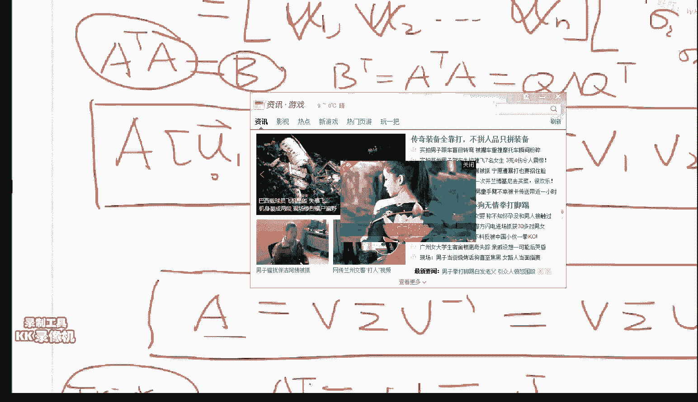

同时成了一个A的transpose，那么它是一个对称阵，它的对称阵应该存在一个，萌萌的分解，它存在一个萌萌的分解，这个A不就是我们要的这个萌萌的分解吗，所以说矩阵的SVD分解怎么算，就这么算，非常简单。

任何一个矩阵我让它的转制跟自己相乘，相乘之后我们对它进行萌萌的分解，萌萌的分解的这个特征值的求完根号，就是我们的SVD的这个对角阵，它的这个萌萌的分解的这个U，就是我们的SVD中的这个U。

那个V怎么办呢，我们给A乘以A的就是，这个A乘以A的就是，这个A乘以A的就是，我们给A乘以A的就是，我们刚才是A的transpose乘以A，那么我们的A乘以A的transpose，就把U就把V就求出来。

它就等于V，sigma^2V，有问题没有现在可以问了，今天的数学已经全讲完了，接下来就是就是音容了，我差不多就是用了半个小时时间吧，就是那个老头的课差不多四个小时，把这些内容讲完了，把这些内容讲完了。

那么就是说，今天希望大家要记住的事情就是什么呢，我们给你一个矩阵，这个矩阵一定要干的是，尤其是对阵阵，你一定要干的事情是，把它的特征值跟特征向量求出来，而在正交的这些方向上，能够体现出来这个矩阵的。

能够体现出来这个矩阵的，统计学的信息跟物理学的信息，因为这个SVD它有它的物理意义，跟它的统计学的意义，相当于它在这个方向上，它的这个方差是最小的，好，给大家两分钟的时间，进行消化跟提问。

那么我把重要的结论写在这，就是对于任何的，任何这个矩阵，A=U，SIGMA VTRANSPOSE，两分钟的时间，两分钟的时间，好，对，就是这个首先SVD没有前提，SVD是你给我个实矩阵就行。

SVD是你给我个实矩阵就行，它的统计的意义就是PC，SVD的统计学的意义就是PC，SVD的统计学的意义就是PC，因为SVD它其实就相当于一把刀，你这个刀你怎么玩，这个就另说了，你PC它是怎么玩的呢。

PC它是这么玩的，你们看一下，首先我们这个，我们这不是求出来了这么一组，我们这不是求出来了这么一组，这个这个这个这个，一组好的这个正交基，这个U，U1 U2一直到UN，任何一个正交基，任何一个正交基。

你能够重新的把一个向量，在这组正交基上把坐标进行重新表示，而，而，而我们要干的事情，什么叫做PCA呢，我们PCA要干的事情就是我们求出来了这个，这些不是特征值吗，特征值我可以从大大小排个序。

我从大大小排序之后，我从大大小排序之后，我从大大小排序之后，我从大大小排序之后，PCA干的事情就是9对应的，这个特征值的这个特征向量的这个方向，这个特征值的这个特征向量的这个方向，这个是U1。

这个6对应的就是U2，3对应的呢就是U3，那么我们任何，任何情况下来了一个新的这个X，任何情况下来了一个新的这个X，这个信号，我们能够用，用，用这些U的线性组合进行表示，就相当于以前的X。

比如说是36925，那么他的机是什么，他的机是这个OG里的机，就10000，010000，0011就是说他这个机是这个，这个你的这个坐标轴的这个机，那么我们不要用这组机，我们用这些特征向量所构成的机。

我们用这些特征向量所构成的机，那么这个系数给他重新进行一个坐标变化，那么这个系数给他重新进行一个坐标变化，我们取最大的那几个就能够让这个X，我们取最大的那几个就能够让这个X。

有一个非常棒的一个一个一个表示，PCA要干的事情就是说，我们只取前两个的特征值，我们只取前两个的特征值，所对应特征值所对应特征向量的这个系数，这个就是二维PCA，这个SVD跟RBM，这个SVD跟RBM。

这个SVD跟RBM，其实是两回事情，其实是完全是两回事情，其实是完全是两回事情，其实是完全是两回事情，是这样，SVD干的是一个降维的事情，是这样，SVD干的是一个降维的事情。

就是说我SVD是最简单的进行特征重表示的方法，就是说我SVD是最简单的进行特征重表示的方法，而RBM或者AUTOENCODER，而RBM或者AUTOENCODER，或者任何其他的这种降维方式。

或者任何其他的这种降维方式，是一种非线性的降维方式，是一种非线性的降维方式，这两个他的目的不是太一样，这两个他的目的不是太一样，其实是一个部分在物理学中的这个就讲多了。

其实是一个部分在物理学中的这个就讲多了，我其实一直想写一个这方面的一个介绍，我其实一直想写一个这方面的一个介绍，是因为我目前没有看到任何人弹簧的这个系统，是因为我目前没有看到任何人弹簧的这个系统。

是因为我目前没有看到任何人弹簧的这个系统，他有非常漂亮的一个弹簧系统的稳定态的求解，他有非常漂亮的一个弹簧系统的稳定态的求解，他有非常漂亮的一个弹簧系统的稳定态的求解，跟SVD是一样。

相当于他把这个就是说在每一个方向上，相当于他把这个就是说在每一个方向上，他进行了一个结偶合，他进行了一个结偶合，结偶合之后呢，在每一个方向上的这个平衡是整个系统的一个平衡。

在每一个方向上的这个平衡是整个系统的一个平衡，我只能说这么多了，这个回头我可以给大家写一下，这个我看啊，这个UV Sigma的值直接从Q得到，这个UV Sigma的值直接从Q得到，你说的非常对。

而Q是怎么来的呢，我先说A transpose A 跟 A transpose Q的，我先说A transpose A 跟 A transpose Q的。

我先说A transpose A 跟 A transpose Q的，我先说A transpose A 跟 A transpose Q的。

我先说A transpose A 跟 A transpose Q的，U=Q 对你说的非常正确，U=Q 对你说的非常正确，不对，不对，RBM不是基于物理的动量原理来的，RBM不是基于物理的动量原理来的。

RBM是他基于了这么几个事情，RBM是他基于了这么几个事情，他第一个基于了统计物理的能量函数，他第一个基于了统计物理的能量函数，这个是那个，这个是那个，他的那个能量函数是叫做，他的那个能量函数是叫做。

他的那个能量函数是叫做，第二个事情呢，第二个事情呢，他是基于图模型，他是基于图模型，他是基于图模型，他不是神经网络，他是基于图模型，他不是神经网络，他不是神经网络，他不是神经网络，他不是神经网络。

他不是神经网络，他不是神经网络，他不是神经网络，他不是神经网络，他不是神经网络，他不是神经网络，他不是神经网络，他不是神经网络，他不是神经网络，他不是神经网络，他不是神经网络，他不是神经网络。

他不是神经网络，他不是神经网络，他不是神经网络，他不是神经网络，他不是神经网络，他不是神经网络，他不是神经网络，他不是神经网络，他不是神经网络，他不是神经网络，他不是神经网络，他不是神经网络。

他不是神经网络，他不是神经网络，他不是神经网络，他不是神经网络，他不是神经网络，他不是神经网络，他不是神经网络，他不是神经网络，他不是神经网络，他不是神经网络，他不是神经网络，他不是神经网络。

他不是神经网络，他不是神经网络，他不是神经网络，他不是神经网络，他不是神经网络，他不是神经网络，他不是神经网络，他不是神经网络，他不是神经网络，他不是神经网络，他不是神经网络，他不是神经网络。

他不是神经网络，他不是神经网络，他不是神经网络，他不是神经网络，他不是神经网络，那么我们现在看金融看量化，那么我们现在看金融看量化，那么我们现在看金融看量化，今天给大家说一个量化里头非常著名的定理。

今天给大家说一个量化里头非常著名的定理，今天给大家说一个量化里头非常著名的定理，今天给大家说一个量化里头非常著名的定理，今天给大家说一个量化里头非常著名的定理，今天给大家说一个量化里头非常著名的定理。

今天给大家说一个量化里头非常著名的定理，今天给大家说一个量化里头非常著名的定理，今天给大家说一个量化里头非常著名的定理，今天给大家说一个量化里头非常著名的定理，今天给大家说一个量化里头非常著名的定理。

今天给大家说一个量化里头非常著名的定理，今天给大家说一个量化里头非常著名的定理，今天给大家说一个量化里头非常著名的定理，今天给大家说一个量化里头非常著名的定理，今天给大家说一个量化里头非常著名的定理。

今天给大家说一个量化里头非常著名的定理，今天给大家说一个量化里头非常著名的定理，今天给大家说一个量化里头非常著名的定理，今天给大家说一个量化里头非常著名的定理，今天给大家说一个量化里头非常著名的定理。

今天给大家说一个量化里头非常著名的定理，今天给大家说一个量化里头非常著名的定理，今天给大家说一个量化里头非常著名的定理，今天给大家说一个量化里头非常著名的定理，今天给大家说一个量化里头非常著名的定理。

今天给大家说一个量化里头非常著名的定理，今天给大家说一个量化里头非常著名的定理，今天给大家说一个量化里头非常著名的定理，今天给大家说一个量化里头非常著名的定理，今天给大家说一个量化里头非常著名的定理。

今天给大家说一个量化里头非常著名的定理，今天给大家说一个量化里头非常著名的定理，今天给大家说一个量化里头非常著名的定理，我们现在要决定你就100万啊，我们现在要决定你就100万啊。

你需要买这么你自己挑了，你通过你自己学习算法，你挑出来这几个我预测的特别准，其他的我都预测不明白，比如说我一共有20只股票吧，比如说我一共有20只股票吧，我有20只股票我就觉得我对这20只。

我有20只股票我就觉得我对这20只，我玩的还不错，100万我怎么把这100万花出去，我是每一个股票我都用10万的，我是每一个股票我都用10万的，这个比较少，还是怎么弄，对吧，那么今天咱们要解决这个问题。

这个是在放空里头很常用的，也是很常见的一个问题，那么我们其实就相当于，那么我们其实就相当于，在每一个时刻t，在每一个时刻t，在每一个时刻t，其实我们有的是一个相当于一个多变量的。

其实我们有的是一个相当于一个多变量的，其实我们有的是一个相当于一个多变量的，这个是每一只股票，这个是每一只股票，这个是每一只股票，比如说这个是招商银行，比如说这个是招商银行，这个是这个格力。

这个是这个是格力，这个是格力，对于每一个时刻，对于每一个时刻，对于每一个时刻，这个是不是一个n个变量的一个，这个是不是一个n个变量的一个，这个是不是一个n个变量的一个，它就是随机变量。

也就是说对于每一个10颗T，我们都会有一个这个N维的这么一个统计出来，没有问题吧？当然我们不仅有Price，我们还能算一下它的这个return对吧，我求这个r。

r那么就是说t-t-1/t-1就是说我的这个return，我们同时呢就会有这么一个ret，r，2t，r，nt，那么我们每一时刻都会有这么一个数，那么我们是不是积累了，比如说我们往前看十年。

我们就会有N个，就不用n了，这个n已经用过了，我们有m个这么多的这些个高维中的点对不对，我们有m个这个高维中的点，我们能干的第一件事就是第一我们能求出它的平均值了。

第二我们能求出来它的covariance出来，什么叫什么叫covariance？这个就是斜方差，斜方差，什么意思？比如说在E位情况下，比如说我给你一组数2679801520，你如这个比如说是t时刻。

t20刻我给你个它，t30刻我给你个它，我给了你这么一坨数，你能干的第一个事情是求出它的mean出来，对不对求出它的这个均值出来，第二件事是能求出它的这个variance能求出它的方差出来。

这是对于E位的情况，对于高维的情况呢，对应的就是对于高维的情况，对应的东西是我能求出来它的平均向量，这个是一个n维的，同时能求出来一个斜方差，这个是一个n乘以n的一个矩阵，有问题没有？

斜方差矩阵大家回去看一下，好那么那么，好等一下啊，看来我已经用完了我的那个什么，我再给大家再加一点加一点这个白的，好，好，那么我们现在对于我们不是对于每一个时刻，我们都有了这么一个n个投资组合。

我们的这个return嘛，R1 R2一直到Rn，那么我们有了大量的这个数据之后，我们就能求出来这个sigma，就是说我的斜方差矩阵，矩阵，我们想我们想求的是什么呢，我们想求的是W1 W2一直到Wn。

这个时刻的这个W，有问题没有，我能把这个东西这是一个时数吗，我能给他直接写成一个向量，这个向量就是n乘以1的一个向量，那么那么这个金融学中的一个非常重要的一个，一个结论是什么呢，是你的风险，啊。

W是就是说我给这个股票投百分之多少的钱进去，给这个股票投百分之多少的钱进去，给这个股票投百分之多少的钱进去，投资组合的这个权重，好那么那么金融学这个是纯金融的一个结论，金融学里头的一个结论是什么呢。

我的这个大家一定要记住，我的风险等于什么呢，看好了，这个结论很重要，这个我就不跟大家证了，这个一证一学习就又过去了啊，就是说就是说我的这个风险。

我的这个投资组合的风险等于我的这个投资组合的这个allocation的这个权重，乘以这他们的这个return的这个协方扎矩阵再乘以这个这个W，你看这一个向量一个列，一个一个航向量啊。

这是1乘以n的乘以一个n乘以n的再乘以一个n乘以1的，它是一个实数算出来之后，它是一个数对不对，啊，有有一个啊，有一个定理就是说，协方扎矩阵是半正定的，其实你都不需要考虑他是不是半正定的这件事情。

你只需要知道一件事一件事来啊，咱先不说这个这个这个这个协方扎矩阵，那么一个最重要的一个结论是什么呢，最重要的一个结论就是说，特征这个协方扎矩阵的特征向量，所对应的就是这个这个这个risk。

这个risk就等于这个lambda最小的这个，你你不是想让risk最小吗，risk最小的时候呢，它等于这个协方扎矩阵的最小的那个特征值，而这个w呢，就是这个最小的这个特征值所对应这个特征向量。

这个是金融学里最美妙的一个结论，我再说一遍啊，我再说一遍，你有了这个协方扎矩阵了，你是不是能求出来它的所有的特征值跟特征向量，而神奇的地方就在于，你求出来的所有的特征值的最小的那个。

就是你的这个risk，就是你所追求的那个risk，而你所追求最小的这个risk的这个w，就是它的这个eigenvector，就是它的这个协方扎向量，有问题没有，好，我们不是要把这个risk最小吗。

那么risk最小能够数学能够推给你看的是，我risk最小的时候呢，当然你要满足这个w在这个L2上是个球，那么这个先不说，就是说我们，我们要求出这个最小的这个risk，它其实就是这个最小的risk。

跟这个w的关系就是这个协方扎矩阵的SVD分解之后，它的这个lambda最小的这个lambda，跟这个最小的lambda所对应的这个x，就分别就是你的risk，你的风险跟你的这个风险组合同时就求出来了。

一个协方扎矩阵是个矩阵吗，这个矩阵你能求出来它的特征值分别是9，8，7，6，5，你把最小这个宅出来，最小这个宅出来之后，它所对应的这个特征特征向量，这个这个特征向量，这个x你要求它这个x。

因为这个x它是一个权重，你要求这个权就是说，它的这个每一项的和加起来之后，为1之后呢，这个risk跟它就有这么一个关系，对好，这个大家明白了，协方扎矩阵是这么来，你看我们，很好看来大家正在思考这个问题。

协方扎矩阵是什么，协方扎矩阵就是我们T1时刻的时候，历史数据，这是2015年1月1号的所有的股票的return，return你是能算的，T2是什么1月2号，我们有m个这个高位空间中的这个观测之后。

我们就能求出来协方扎矩阵，因为比如说我们有，这个就是简单的统计学的计算，比如说我们有，刚才我说过了，我们观测到了55679，我们立马就能求出来它的平均，它的平均跟它的这个variance。

在高位空间中我们观测到了n个数之后，我们立马就能求出来它的这个，协方扎跟它的平均向量，这个矩阵，协方扎矩阵有这么一个极其美妙的性质，第一协方扎矩阵肯定是方阵，这个是根据定义来的。

第二协方扎矩阵等于它的转制，方阵协方扎矩阵必然是个方阵，大家去你们去，去没几百颗吧还是，没几百颗协方扎矩阵你们看一下，好，对称的说明什么，宝宝们对称的说明什么，对称的是不是说明了。

我前面说到的一个对称阵的特征值是实数，它的特征向量是，一个对称，一个对称阵，它的特征值，它的特征值是实数，它的特征向量互相垂直，特征值实数说明什么，说明我们的这些资产组合的这个w，不。

我们资产组合的这个风险，它是一个实数，那么他们这个这些w呢，对啊，这个w就没什么，就是说我们至少能保证这个risk，你不可能是个你的风险是个5加上3i，这种risk是没有的，是因为这个这个协方扎矩阵。

它是一个对称的，但是要注意的一个是你们具体在在搞在玩的时候啊，一定不要选最小的这个最小的这个，因为最小这个它是什么方向的，它是市场的一个方向，一般来说不选择，你要选择的是第二小的，就第二小这个w有图啊。

来，终于有图了，就说比如说我们对这个这是苹果，这雅虎这谷歌啊，这就说我们对于我们这个所有的这个。

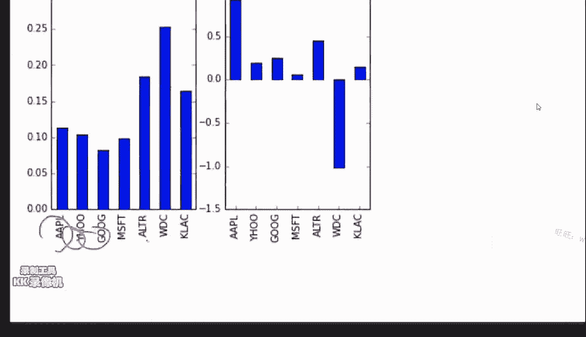

IT板块的这个这个股票，我们分别算出来了，它的这个协方扎矩阵，算出来这个协方扎矩阵之后，我们算出来的最小这个w，我们算出来最小的lambda，我们就能算出来这个lambda，所对应的这个特征值。

这个特征这个特征项量，这个特征项量就是我们这个w，就是我们这个w，那么最小的这个所对应的w呢，它是它是这个样子的，就是苹果占百分之十几，它这个wdc占25%。

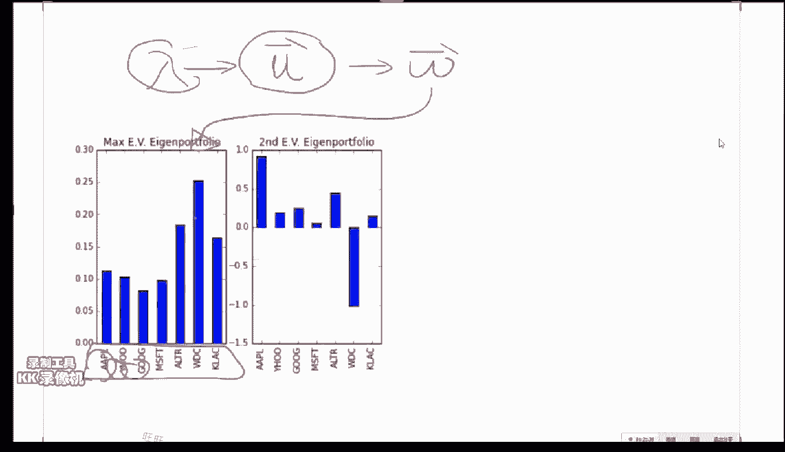

不要不要这么干，这个方向呢，可以证明这个方向是整个市场的这个方向，你如果这么玩的话，就跟你直接按照这五指一篮子买是没有区别的。

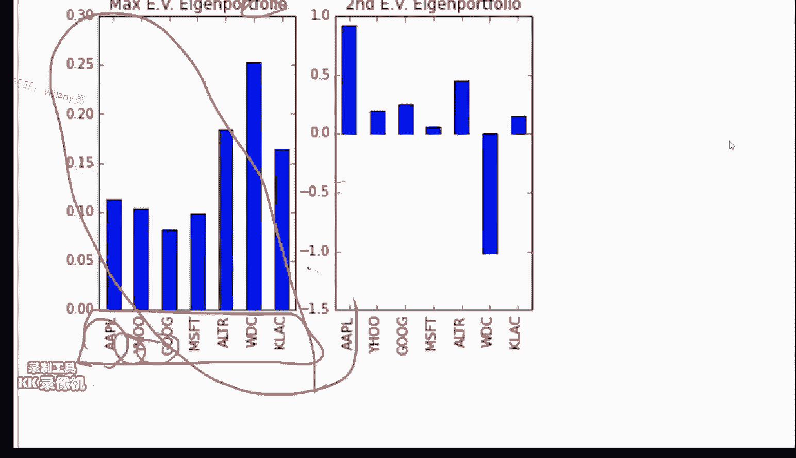

你要买的是第二个，第二个这个，这个这个这个这个，Eigenvector的这个Eigenportfolio，这个portfolio是自然组合，这个叫做特征自然组合，有了这个知识之后，你们就能玩了啊。

你们你们你们就能就能你们就能进行判断了，那么这是第一种方法，来咱们再看第二种方法，第一种方法都没问题了吗，看来今天要脱糖啊，今天大概预计脱糖，哦好，负的是short，如果你当你比如说在做A股的时候。

你不能short的时候，你就自动的自动的把它变为零就行，就是不吃仓，就是你如果你你所你所干的事情，没有办法进行short selling的话，你就一个小的trick，就是说当你求出来一个负的W的时候。

你就自动的就就就就不吃仓就行，算出来不会应用可以讲讲吗，就说你算出来之后，你算出来之后，你不是有个0。2 0。3吗，0。4吗，那么你在做回测的时候，你就在这个时刻，我要买买多少。

你就按照你算出来这个东西来买就行，是的，Eclipse同学说的是对的，因为咱们这个是个实战的课，我就不拽词光给大家说怎么求，选第二项，选第二项你求出来这个W就是你要，你看啊你一个矩阵。

一个矩阵这个矩阵是比如要330。9，0。5，就就就你比如你比如一个矩阵3366吧，66。5，这个矩阵你用一个SVD这个这个函数，你是能求出来他的这些lambda值的，这个lambda值分别是比如说0。

2 1。1和5，这是两维的就是两个0。2跟1。1，它所对应的特征向量是0。2，所对应的特征向量是1。2跟，不敢1。2 0。2跟0。8，这个1。1所对应的特征向量，比如说是0。1跟0。9，那么这个0。

2就代表了我第一只股票，我持仓的比例是20%，第二只股票持仓的比例是80%，这个取决于你的交易频率，你更新的越频越好，好那么第二种方法，第二种方法是刚才那个同学说。

提到的这个最小variance的这个方法，我们换一种角度来看这个问题，换一个角度来看这个问题，我们不是这个既然这个risk，它等于什么，它等于w transpose，它是w 对不对，假如说。

不会这个特征值特征向量，怎么办，那不会这个特征值特征向量，那我们就这不就是个最优化问题吗，我们不就是想minimize，想找到一组w，使得w transpose sigma w它最小。

然后我们有一个什么要求呢，我们的constraint是，w的就是就是w1加上wn得等于1，对不对，就是说subject to，这是一个典型的一个最优化的一个问题，对不对，那么这个最优化的问题很好求啊。

任何找一本图优化的书，它就能告诉你w等于什么，w就等于这个sigma的逆乘以，这个1，这个就是我把它就写成1吧，因为这样好写一点，sigma的逆乘以1，transpose乘以1，非常简单。

就是你稍微有一点，大家学过SVM没有，用这个拉格朗日乘字法，你一下就把它求出来了，那么这个是另外一种，还用不到KCD，那么这个是另外一种最优的，这个w*的算法，图优化问题最好的，图优化问题其实很难。

很难入门，很痛苦，不知道你们听没听过我讲的SVM，那个是一个比较好的，如果没有听过的话，目前只有一个讲的，极好的图优化的课，叫做斯坦福公开课，图优化初步，但是那个课很深，大概你听到第三节的时候就晕了。

如果大家要看的话就这样吧，就是斯坦福这个，网易公开课上好像有，就是网易公开课，就是说好像网易公开课收录的是加了中文字幕的，大家如果不需要中文字幕的话，就随便的都有，网易公开课上好像是。

我不知道有人翻译没翻译，好还有什么问题没有，那么很明显这个是我们的另外一种求最优的一个方法，那么这个结果的话，这个是我们刚才优化的方法，这个是我们的特征值的方法，所求出来这个W。

你看你哎就是很明显是不一样的，这个人告诉你要干这个事，这个人要告诉你要干这个事，那么他这个性能呢，性能我没有放上来，性能是在美股上是一般来说，你用这个特征值会好一点，但不一定你都得试一下。

这是我们今天讲的第二件事情，然后再给大家讲第三种，就真正的我们用的一个方法，有问题没有，这前两个都是很常见的一个方法，接下来我要跟大家讲一个，基于这两种方法的一个叫高档的一个方法。

但是要理解这第三种方法，你这前两种最好知道我在干什么，所以给大家一分钟的时间进行提问，这个多少天的数据，这取决于你的交易频次，一般来说不要超过三年，三到五年之前的那个数据，一般来说是效果不是很好的。

而且同时你最好80%用历史数据，同时用你的这个模型所预测出来的数据来做，这个会更好一点，然后天天更新，这个市利，Risk就是金融学定理推导证出来的，就是风控理论，他们有一个金融学一个非常重要的一个。

资产组合理论他们搞这么多年就搞这么，没数不多几个拿得出手的定理，今天我讲的是一个其中一个，也不是娱乐用的，你这么用其实是讲道理是就已经很好了，有很多年很多人都在用这个方法，因为这个风控这个事情不好说。

有有这个我们明天慢慢说，不着急一件事一件事来，好那么第三种方法是要做一个，相当于做一个filter的这么一个操作，把他们之间的这个。

就是把你的这个covariance matrix里头的一些随机因素拿掉，这个背后就就深了，我就跟大家说算法吧，什么意思呢，这个是叫做，这个是基于随机矩阵理论，叫random matrix。

random matrix，matrix，theory，好，一塌糊涂，随机矩阵理论，他讲了什么呢，就是说我们随机矩阵理论研究的是随机矩阵，就是说我这个矩阵中的每一个元素是一个正在分布中随机采样出来。

就是啊，比如这个矩阵0。1，0。25，就是说我是一个完全随机的这么一个矩阵，那么不是股票，他不是有一个方向是随机游走的吗，那么我们想把这个比较随机游走的这个这个分量给他滤掉，这个是这个算法。

一个核心的一个目的，那么随机矩阵，他有一个非常能证明出来，因为，就是说毕竟你假设的每一个矩阵的元素是从高斯分布中采用出来的，那么我们随机矩阵是能证明的呢。

他是有一个专门的这么一个distribution，如果你对一个随机矩阵算他的这个特征值，这个特征值的分布一般是一般长的就是长的是这个样子，大概是0到0。5，0到这应该是0。5，0到1之间大于1就非常小。

这个是他的这个概率分布图，这个PDF Probability Density Function，这个是一个数学的一个早就有的一个结论，没有问题吧，这个是早就有的这个这个这个分布叫什么呢，这个分布叫。

写写写清楚点，换个颜色，换个颜色，叫这个分布啊，我专门做了个小抄，今天做的唯一的小抄，就这个分布啊，大家可以去查一下，那么就是这个分布，他恰好这个也是非常漂亮的一个数学证明啊，就是说这个分布。

他恰好就是一个随机矩阵的特征值的分布，很牛逼哈，很牛逼，对那么我们要干的事情是什么呢，我们要干的事情是这样，那你就这么玩就行了，既然有你这个分布有了那就好办了，就这么玩啊，来我们看下一页。

第一步我们不是有这个Sigma吗，我们Sigma我计算这个这个这个这个这个SVD的这个Sigma，就是说我们能求出这个lambda1一直到lambdan对不对，第二步，我们把这个这些个lambda属于。

就是属于这个分布里头的属于这个分布里头，属于这个分布的这个，这个均值跟标准一个标准差之内的这些个数，比如说其中有10个lambda在这个在这个范围里头，我给他择走，没有问题吧，我给他择走之后呢。

我们就只剩下了，比如说以前是以前是比如说我们这是十只股票，以前是比如说100只股票吧，100只股票，那么我们这个lambda大概是是是是100个，我们转一下在这个区间里，肯定大概只剩下60到70个了。

我们就有lambda1，lambda2，lambda5，一直到lambda比如说80，我们把这些剩下的这些lambda跟他，然后把在这个区间里的所有lambda，我都给他设为0了。

lambdai我就为0了，for lambdai在这个区间里头，然后我们再用刚才我说过的这个矩阵的SVD分解，就是说这个不是蒙蒙的分解，因为因为这个这个sigma。

它等于sigma的这个transpose，所以说我这个sigma不是能写成q，它q transpose吗，我们把我们把这些个这些个特征值都都给他设为0，我们求求出一个新的sigma出来。

获得一个新的sigma，然后呢我们再找再做下一步，有问题没有，就是说就就设0，就是说把这个方向不要了，因为这个是一个分布的意思，就是说我们在他的均值周围一个标准差之外的这个区间上，他是有可能取到的。

而且尤其是我这个sigma，他又不是个随机矩阵，他一个随机矩阵才会都在大部分都在这个区间，我这不是随机矩阵，我把不是随机矩阵的随机因素就是给他去掉，你可以想成取到了悬谷作用。

但是他其实取到的是把这些投资组合中基于时间的波动的随机因素给他去掉，只剩下他的真正的那个，在在就是非随机因素，相当于把他的这两个一个信号给他拆开，拆成一个随机因素和非随机因素，不是把应该是在0。5在0。

2到0。8之间的去掉了，大于1的都留着，大于1的好啊，少见啊，原始矩阵是你的这个sigma，这个sigma不是对应了一系列的lambda值吗，我们把这些lambda值。

如果掉在这个区间里的lambda值都给他干掉，干掉之后呢，我们再用这个sigma等于q，q transpose，就是把这个在这个区间里的sigma都为0，我们重新算一个新的斜方差距，然后再对他再做这个。

这个什么，sigma就是特征值的意思，然后对他再做这个，这个东西，对他再做这个东西，我算出来全种，对，这个大写的这个是斜方差矩阵，那不用不用一次就行，这个不需要循环，这个不是一个要循环的事情。

这个是我真正玩的东西，晕了没事，晕了你回去再听一遍，然后我再总结一遍哈，最后总结一遍，晕了没关系，晕了没关系，我再说一遍哈，我们要干的事情不是要求斜方差矩阵吗，斜方差矩阵怎么求，大家现在晕不晕，好。

我们现在能求出来一个斜方差矩阵，我们就能任何一个矩阵，我们都能求出来他的特征值跟特征向量，那么我们要干的第一步就是，把这个斜方差矩阵求出他的特征值，然后把这些特征值，调在某一个特殊区间的特征值都设为零。

再对这个矩阵进行一个恢复，恢复出来一个新的一个矩阵，然后对于这个新的矩阵，我们再做刚才我说的第一种方法，或者第二种方法的任意一个方法，求出我们的W，对，说的很对，好，看结果，结果就很显然的好了。

为啥设为零，设为零的意思就是说，我不要这个方向上的东西了，因为今天我处心积虑，讲了这个SVD，就是想跟大家说一下任何一个矩阵，它能写成一个，它的意义其实就相当于是什么，它就相当于，这个矩阵能够分解为。

它在不同的方向上的另外一种基的这个表达，而每一个基的这个方向，就是它的这个特征，特征向量的这个方向，而我们要干的这个过滤的意思就是说，有些方向它是不好的，它是随机的，给它干掉，你就不要有这些维度了。

我们再重建这个，因为我能分解就能合成，我们有了特征值跟特征向量，你只要给我一组特征值跟特征向量，我们就能构建出来一个矩阵，那我们把这些方向上干掉，重新构造出来这个矩阵，它就理论上来讲。

它的随机性就会小一些，不是我有了这个A一瓢了之后，我再求这个W，我要求这个W和为0，这个W还没求呢，当我们把这些特征值给它干为0之后，我们有一个新的矩阵，这个新的矩阵，你就假设我不知道之前的所有事情。

我突然拿到了一个更新过的A一瓢，那么我再用刚才我说的这个第一种方法，或者第二种方法，你再往下就行了，重构A的话，就是用这个用这个萌萌的这个东西重构，对不对，这个，这中间这个矩阵是所有的特征值。

Q是所有的特征向量，所有特征值是知道的，所有特征向量你也是知道的，那么你把这三个东西乘起来，你就能重构了，对所以我今天处心积虑讲的东西，是完美的一个一个整体，这不是降维，这是升维了，还不完全是。

它是倒着做，就是相当于逆链这个PCA，这样你们回去消化一下，明天早上我在，怎么去掉垃圾信号，是这样好吧，再来一次，再说一个这个事情，就说我们现在，我们对其实大家现在不懂的是这个事情，我们有了一个。

我告诉你，我告诉你，它的这个特征值，delta1等于，比如对于2为的了，delta1等于2，delta2等于2。5，这个特征值所对应的特征向量是，比如说是，X1，它如果是1，这个向量，X2，它如果是。

-1，这个向量，如果你知道了，一个矩阵的特征值，跟一个矩阵的特征向量，我就知道这个矩阵长什么样了，这个矩阵长什么样呢，长Q，它，Q transpose，Q是什么呢，Q就是把它写成列，就是1 1。

-1 -1，就是宝，这个就是X1，这个就是X2，然后我们再把它的所有特征值写成一个对角阵，2 2。5 0 0，然后我们再把它再转制一下，这是-1，这是1，这个是负的，这个是正的，正1。

然后我们把它一转制就是1 -1，1 -1，1 1，就是说，只要你告诉我了一个矩阵所有特征值跟特征向量，而我又知道这个矩阵它是一个对称的，那这个矩阵我就能立马我就能我就能重构出来，这个是大家。

没想到的一件事情吧，那么我们，刚才我不是说了吗，刚才，先记住第一件事是，如果知道sigma跟这个X，我们能够重构出来一个矩阵，好，那么我们现在不是有一个sigma吗，这个sigma就是斜方叉矩阵。

斜方叉，我们把这个斜方叉矩阵，我们先求出来它的所有sigma1，sigma2，sigmaN，或者叫lambda都行，就是它的所有的特征值，跟它所有对应的特征向量X1，一直到Xn，然后我们要干。

这这是第零步，第一步第一步第零步是算，这是你任何一个python的包，它都能给你算，numpy就能算，第一步这是第零步，第一步呢，就是说我们把这些sigma，我们把其中那些sigma值给它设为零。

怎么选呢，谁为零谁不为零呢，就用我刚才说到那个随机矩阵的那个分布，这个分布中最常见的就是这个分布的min值，加上一个standard deviation，就是加上一个标准差，就是0。2到0。8，0。

2到0。8这个区间的，所有的特征值全部给它干为零，那么就会变成了lambda1 0 0 0，lambda比如说12345，然后它对应的有x对不对，都是x，那其实如果它为零的时候。

这个x不管为谁都都没有用，对这是第一步，第二步呢，我们有了一组新的这个sigma跟这个x，我们能构建出来一个斜方差一片，它等于什么，它等于这个萌萌的对不对，只不过这个时候的这个对角阵里头。

它的对角线元素有几个为零了，因为我们人为的给它干为零了，我们有了这个新的斜方差矩阵之后，我们就说这个新的斜方差矩阵，把随机因素去掉了，第三步，我们根据这个新的斜方差矩阵，我们来算出来。

我的这个risk=w^t，然后我们再算这个w是什么，用我刚才说到的第一种方法，或者第二种方法，求个自由化也行，好，这个流程，我刚才说的这三分钟，是大家回去复习的时候，着重听的这几分钟，应该没问题了。

我不，PCA是不make sense的，PCA它选的是最大的那几个，而这个选的是在这个区间里的那几个，特别小的人也留下了，而PCA它只选最大的这几个，对0。2 0。8，我举例子，你需要查。

需要计算那个distribution，的mean值跟variance，这个是你需要算的一个常数，第一种方法跟第二种方法不等价，它们都是常见的方法，等价的话，它的结论会完全一样。

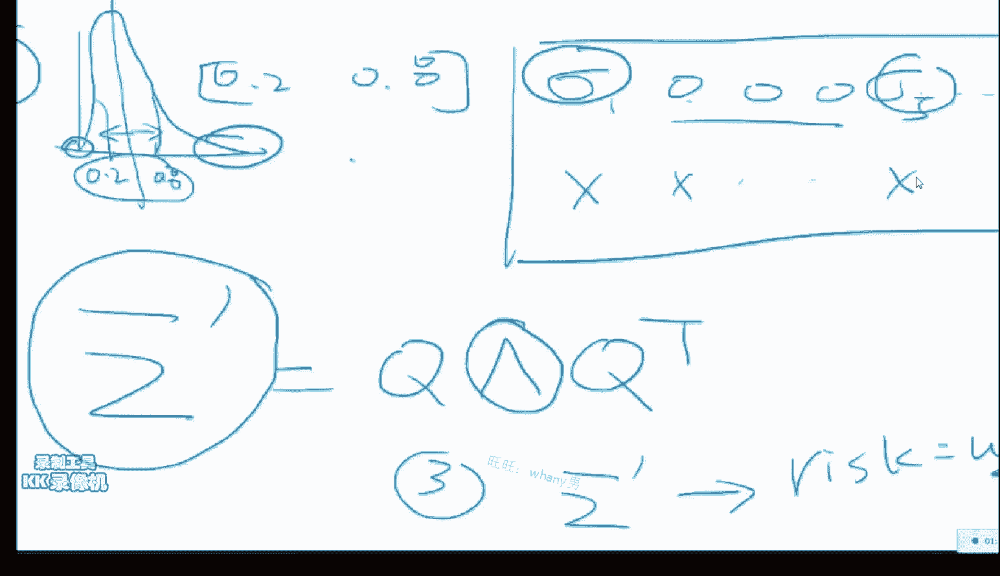

但是明显，刚才这个性能来看，这两个是不等价的，得到了新的斜方差矩阵的用处。

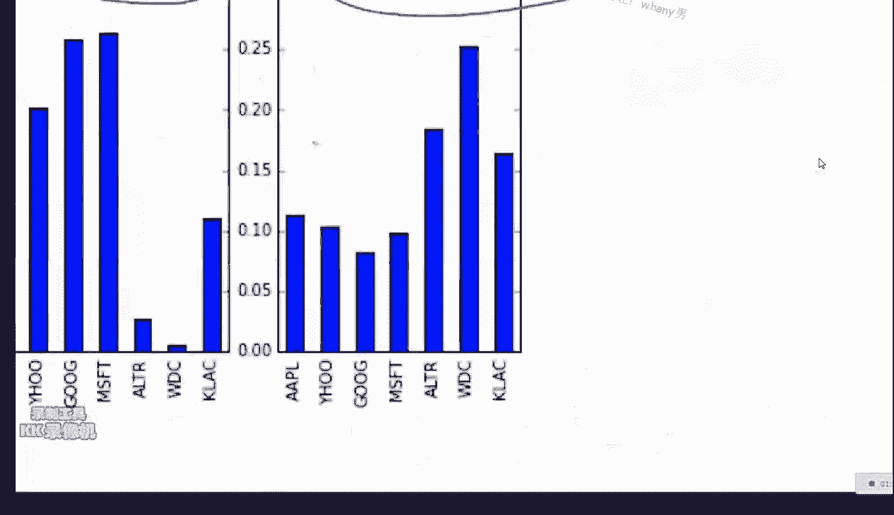

就是我归根结底是要求，这个W的，我要求W，你得给我一个比较好的这个斜方差矩阵，我才能求出一个比较好的W，而你这么原始的这个斜方差矩阵，它有比较大的随机性因素，我这么滤波过后的斜方差矩阵。

我的随机性因素小了，我的W就会小，就会好一点，所以归根结底，其实今天我们的主题不是要求W，就是说，我们有十只股票，我没有一百万，我这十只股票，一人投多少钱，这个归根结底的终极人生问题，对吧。

risk值就这么算吧，risk值就等于它，如果你有了斜方差矩阵，跟你的这个这个这个这个W之后，risk就等于它，今晚干货是挺多的，好那么我们看效果，效果还是蛮好的，看请看。

这个就是我们的minimum variance的，这个这个这个这个这个，这个quadrature failure的这个表现，就是说我们的第二种方法，第二种方法其实是蛮常见的。

就是说我们要minimize，一个W transpose sigma W，subject to这个W的平方和，W的和为一，那么用这种方法呢，就是最小方差的这个方法的，我们的表现，这个是这个是训练级上的。

这个是测红色的是测测试级上，然后那么我们如果用了这个，滤波之后的这个表表表现呢，它长的是这个样子，你明显能看到蓝色的是滤波的，它的还会明显的会比这个黑色的要好，你就是说W啊，这个W的平方和。

你就是求W啊，你要求W，你先得知道这个邪魔双剧阵，不同的邪魔双剧阵会给你不同的W，对不对，好，今天的非论文的部分已经讲完了，那么看来肯定是得脱膛的，那么脱膛这样，这样给大家，因为明天的话明天其实是。

那么给大家这个两分钟时间，先把今天问的提问问完，然后我今天给大家讲一篇论文，然后明天的再讲，ok，就是是一个subject to，它是一个缩写叫做就是约束subject to。

就说我们要让这个东西最小的同时，你请保证所有的这个W的所有和都得为一，好，ok，横坐标时间，纵坐标是你的这个这个收益，再两分钟，今天这个是很不积极学习的，但是很数学跟很金融，但是大家一定要会用。

因为这个这个问题很严肃，就是你有这么多钱，怎么样的管理你的配置你的资产，对，因为蓝色的比他高啊，不仅有一篇论文，还有十几篇我今天都没发，这个是今天大家要看，红色的是测试测试级，黑色的是训练级。

在这个上面就是对应的点是一样的，从第二百，从第二百三十点以后是测试级，前面是训练级，这个这个就是一个残位控制的一个方法，这个就避免了就是，对这个评论是是这个意思，好，说几个说几个论文，说几个论文。

现在你们就可以看这个，就可以看这几个这几个论文了，我看看这边是什么，这边是一个，这边是做高频的，他们有五分钟，五分钟的五分钟的频率啊，就是你们看这个，看这个我给你发的这个论文，你们其实不用这个很多论文。

你只需要直接你看前面讲的都是这个模型是什么，你不用管你这模型是什么，我不都说过了一个神经网络呀，什么他其实就是用了个简单的，这个非卷积的多层神经网络，Multi-Layer Perception。

然后呢，他是用了五分钟，就是每五分钟一个点，就是用了非常多的，他在CPU上训练了十个小时，但是他用到了一个神器，叫做这个智强快协处理器，就是说长得有点像个GPU，但是他里头好像是60个核。

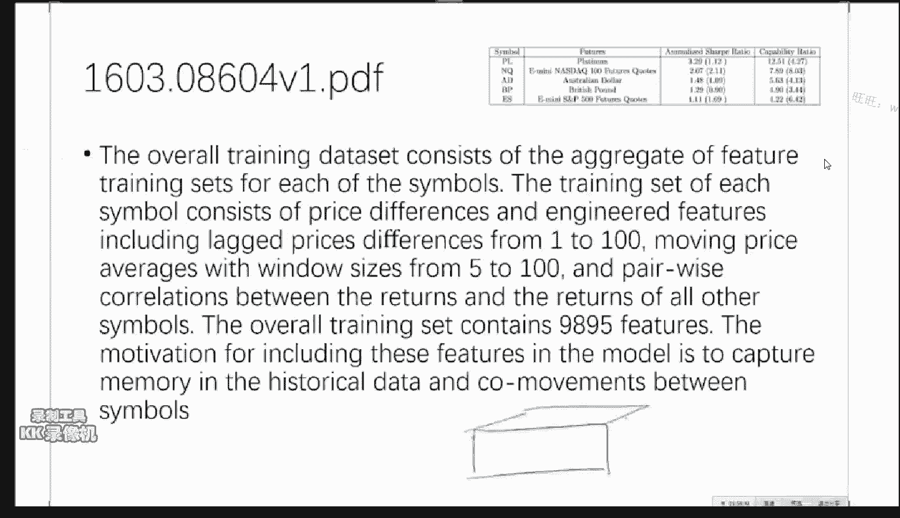

60个Core，每个Core是四个线程，所以就是240个线程，就是一个现在英特尔能做到是60个核，但是他长得是一个很像GPU的一个玩意儿，他在那个上面训练十个小时，那么那么他这个干的事情模型。

其实是我再强调一遍，看论文一定不要觉得这个论文就肯定对呀，最牛逼，你就一定要看对你有帮助的地方是什么，那么这个东西对咱们有帮助的，我看没有什么太多的地方，第一个就是说，对于高频交易来说。

就是他这个是五分钟，五分钟一个点，然后他每个点的feature是可以看到是9895位，那么这么大的一个体量的一个数据，那么他就用了一个叫做mini-batch，就是说批处理的这么一个权重更新的方式。

因为你不可能一次性的把你的所有训练机载入进去，那么mini-batch SCD，然后他得出的结论是在这些期货上，这些期货上的sharp ratio还是可以的，在3。29左右，这个次高频吧。

跟我们用的这个EOD相比来说，这个东西不贵，因为这个东西他用的还挺烂的，他用的论文中是上一代，现在这一代叫KNL，KNL呢他有个牛逼的地方是，他其实就能当个CPU了，之前的只能当个斜处理机。

你必须得有一个I5或者一个I7，当做你的这个boot，就是说你的操作系统boot运行的这个CPU，那么他当做一个斜处理器，他们之间通过PCIe来进行访问。

那么现在这个KNL他自己就相当于一个超级牛逼的一个CPU，那么你的这些程序能够无缝的链接，你以前写的各种的在I7上能跑的程序，在这个两千个不是两百个线程上的这个设备上，就不用改动任何代码都能跑。

我觉得是可以的，他这个我他这个做的最恶心的地方就是，他既然用到了一个神级网络，然后但是他在用一个CPU进行训练，这个是一个非常笨的一个方法，不知道他为什么，大概他不知道有GPU并行这个事情吧。

他在CPU上两百四十个线程训练了十个小时，你用一块太阳能插肯定是三个小时，肯定是能搞定的事情，价钱都差不太多其实，因为我刚好最近在做这个两个的设备的性能比较，所以我非常清楚这件事情。

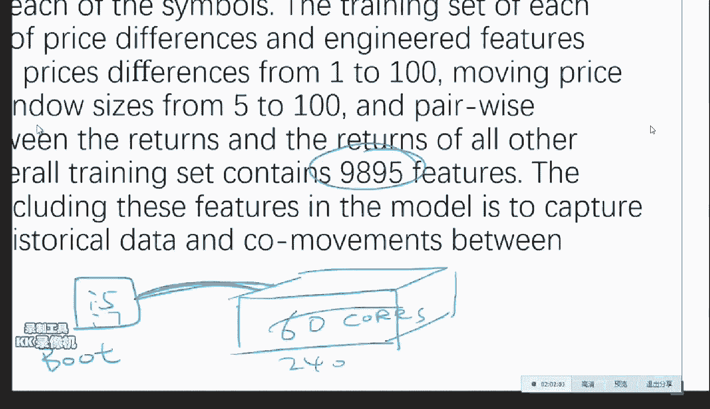

OK这个论文就过去了，这个论文很简单，这个论文是一个相近的一个论文，这个论文更大意义，OK这个论文一看是这个论文一看，我刚才说这篇论文一看，他是金融那边的人过来做的。

而我们说的下篇论文一看的是机器学习这边的人过来，他做的最大意义的地方在什么呢，在于他的这个特征提的很恶心，他这个特征提的就是说一个一个lag的这个return。

就是说我就是每日的return跟这个每个月的这个return，他给拼起来了，其他的东西都没用，都没用之后呢，我们就组成了这么一个项量，然后他先用了一个dbn再用了一个mlp，然后做分类。

然后在这个在这个validation set上比，他跟这个这个这个这个logistic regression比了比啊，别人的错误率是50%，他错误率是46%，是高了差不多四个点还行。

但是其实如果你特征提的好一点，我这个mlp肯定能也在就就在一个比较好的一个范围内，那么这篇文章其实大家就看一下他这个过程，那么他傻的地方就是他这个特征其实是很一般的。

就说在在在在这个市面上有大量的这种论文，我们看的时候一定不要逐行的当圣经一样的去看，你看的时候你就就就呵呵几下，你就过去了，这个东西我明天要细讲，这个是或者说明天我稍微多讲几句吧。

就这个是这个大家回去要看一下，这个是欧盟的中央银行他们出的这个框的这么一个，一个报告是关于情感分析的，一般是就是这个深的这个限制布尔茨曼基，你可以就是一个一个一个深度神经网络。

你可以把它看作一个autoencoder，现在有一个方向就是说什么呢，就说如果我们之前的这些东西再搞，他的东西也都是基于历史的价格搞的，那么他的这个额外的信息并不是很多，那么纯粹根据历史价格你再搞。

现在也有人就觉得是不是不够啊，因为有专门的一些经济学的论文，他认为市场的非理性还是蛮重要的，尤其是市场的情绪这个事情，就是说你有很多的投资者还是存在大量的投资者，如果你算出来一个数是买。

但是当你看到大家都在卖的时候，你心里也慌你也就卖了，那么这个东西呢，其实就相当于一个群体的一种非理性的一个行为，而怎么样的把这个非理性的这个行为，放到你的这个量化建模中去呢。

一个很响耳一见的一个方式就是通过这个搜索，搜索评是牛还是熊，就是看大家讨论的这个这个热度，那么他就是这篇论文的就根据推特，跟这个谷歌搜索熊市跟牛数的这个词评的，就纯就看这两个词的出现的频率。

他想研究一下就这就这一个指标，能不能对这个市场未来的走向有一个预测，那么他的结论是第一能，第二是推特比Google要准，第三是推特能够决定Google的这个搜索，第四是推特的结果不适用于中国股市。

这不废话吗，中国，但是他他他他他的这个研究方法是一个，很样本儿样本儿间的一个一个方法，对大家的求职蛮有帮助，打不开吗，打不开在是不是没解压好还是什么打得开，后面这后面这个我们明天说后面这个说一下吧。

后面这个他其实就是说你唯一一个能可取的地方，就是他的feature提的是这个样子的，然后他又做了一些奇奇怪怪的各种各样的分类器，然后搞出来的一个模型只要看一下，就说我们看这个尤其是看这个这个稿。

他其实有一个专门的稿叫research，矿，就是这个矿在一个比较严肃一点儿的这个这个这个这个地方，他每个矿的干的事儿是不大一样的，有些矿他干的事情就是就是做research。

自己发明些model也就是说，他的这个东西不会直接的进行实盘交易，所以他就每天天马行空的搞些东西，然后比较自由干的事情是比较好玩，但是离钱会远一点，那么这个这种的这个这个风格就是一看就是。

是适合做这种矿的一些一些一些东西，就是说自己提一点小feature，然后跑一跑各种各样的模型，然后进行一下这个validation，然后来做，矿的工作比这些论文的不一样的地方是在于，他们会更短一些。

差不多四页，你给老板他们交四页纸就够了，长得比较像这个东西，当然你的form如果比较小的话，比如说就十个人左右的话，你写也不用写，写PPT就行，把你的代码交一下就行，那么明天开始呢。

我会大量的跟大家再介绍一些比较更多的高质量的，严肃的一些论文，同时跟求知有关的一些问题，以及最后最重要的杰克之后怎么办的问题，今天最后给大家留两分钟的提问时间，我最希望大家的感觉就是看完这些论文会觉得。

这个论文中提到的每件事，冯老师都告诉我给你，而且你会给这些论文提出两到三个建议，就觉得他们傻逼的地方，这个如果能做到这一点的话，我会非常开心，因为我给你们的这些论文都是有一些傻逼的地方。

因为目前没有什么比较靠谱的，看不懂英文怎么办，这个你可以直接跳到这个experiment，就是实验那一节，然后我会把我给你的这些论文的大致的脉络，明天三分钟一篇给你过去，让你最大效率的好快速的看这些。

不要一个字一个字看，看不过来的，会提到，大家这个作业我看只有一个人交了，好像交的人两个人交，关于作业有什么问题没有，跑通了没有，这样调通的有没有，请告诉我，先不说跟你的那个结合，沟通的一个，行好没关系。

那么我明天会争取给大家说，老师不在了之后，你们怎么自学的一个事情，同时再给大家一些这个资料，讲了，这我得看一下，我看一下内容，因为每天早上我早起之后，大概会三分钟的时间看很多的东西，有三分钟一篇的时间。

我已经没有办法记住每一个论文，具体说的是什么，你可以发给我，你说的这个是不是一个书啊，那个书是不是还带一个代码，这个书还可以，都会只要那个，但是前提是要入那个群，数据上模型太慢怎么办。

换一个好电脑或者在一个云上跑，或者找一个有好电脑的朋友，求求他让他帮帮你，一两天很正常，做deep learning的训练一个模型，一两周都是有可能的，如果你要这属于你的任务。

如果你的任务你的算法能够并行的话，GPU肯定是不错的一个选择，我现在的所有事情都离不开GPU，大家可以学学Tensorflow，这个这个这个框架蛮好的，那是我发错了，我明天再给大家发一个正常版的。

Tensorflow用的都不多，就跟深度学习有关的都会比较依赖，可费不用，可费主要是做，至少我没用，可费主要是做这个什么的，主要是做图像的，CNO比较偏底层，写代码写的太累。

Tensorflow一行CNO得十行，这段怎么办，做音乐方面的，做音乐方面的其实他有专门的库，都是基于这个，你可以基于Tensorflow或者CNO，在网上搭很多风光，已经有人做了，你不用直接做。

没有人用可费来做音乐，按照我所了解的情况，可以在大型机上搭建环境训练模型吗，可以，大型机是什么，就你们学校的这个服务器是吧，可以啊你偷偷搭就行了，那个叫KOROS那个也很好。

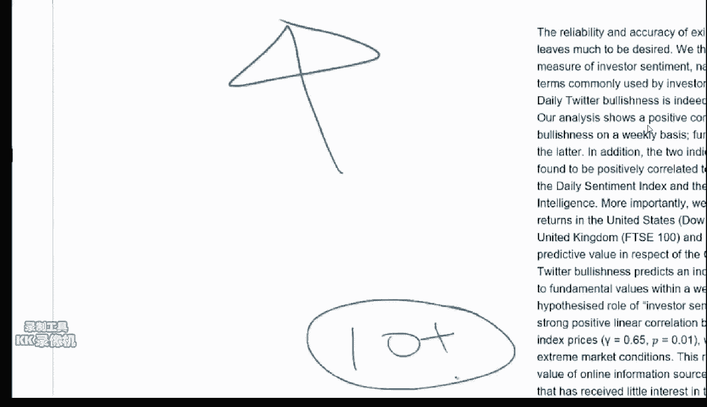

KOROS的一个小小的缺点就是，他风光的比较多。

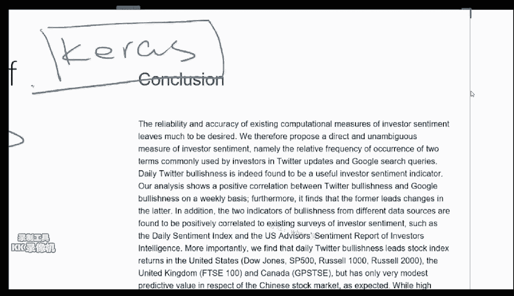

你想做一点，你自己的事情的话就不是太灵活，泰坦查还是有必要的，量力而行，毕竟是钱，对微信群是，大家待会帮他发一杠维码吧，稍微说一下硬件，可以配一个小型工作站吧，整个的I764G内存，一个1080GPU。

差不多吧，我觉得主要的就这几个，就来一个三屏的显示器，一个HHKB的键盘，一个水冷，差不多万把块钱吧，系统无版图吧，这个因为你要搭这个Tensorflow的话，无版图比较优厚友好。

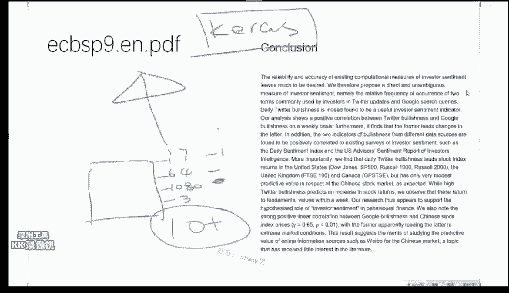

以前大家用的是这个NLTK，但是现在如果要做深度学习的话，一般是这两个都会用。

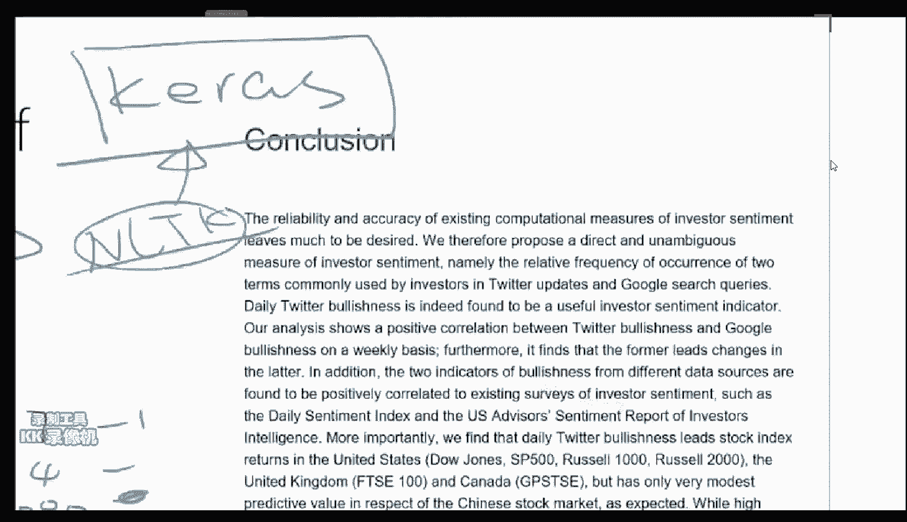

然后还有一个你做World Embedding，一个Gensum一个NLTK一个KOROS，这个都离不开，一万左右一万左右对，一万五以内肯定能拿下，屏幕的话，DELL一个23寸的16：10的。

他只有这么一款16：10的一个DELL，23寸这个是比较好的，一般你这个乘以二，这个大概一个是1400块钱，比较好的一个专业品，他这个比例比较稀少。

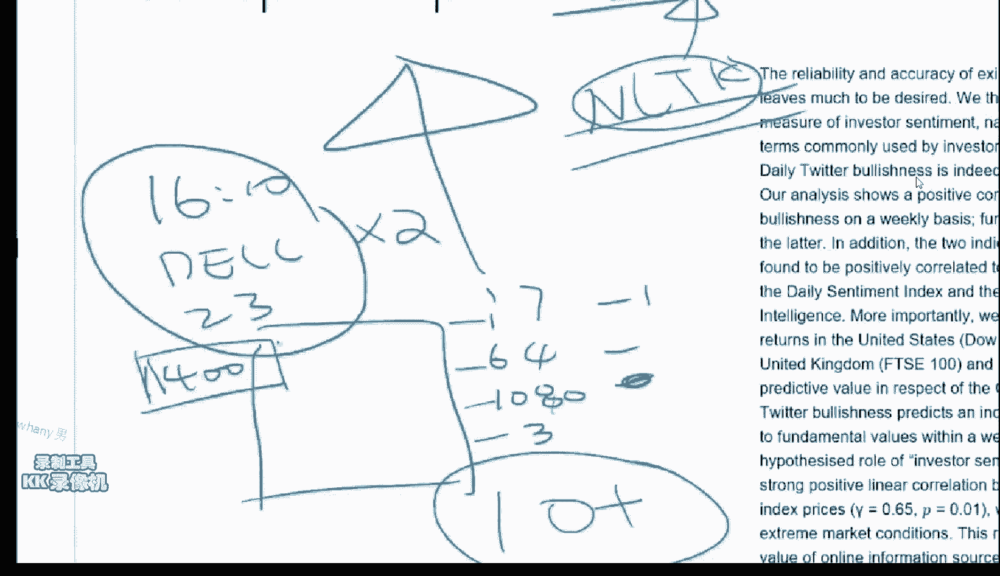

可以旋转，我个人很喜欢的U2415，不是U25我记得是U24，这个非常适合我们做编程，一个转过来一个横着就行了，然后这个I7的话就是I7了，I7 6700K，然后64G的内存，不用买多好的差不多的就行。

64或者一把，64G吧，因为你一般是比较小的一个主板，然后1080就是GPU，这三个就差不多，这个同学配的这个电脑，我很喜欢，我个人是非常喜欢的，椅子也蛮好，上面他应该是有三个电脑，其中一个这个电脑。

他是有三个电脑，CPU都行其实无所谓，根据你的预算来，这个是单GPU的，如果是如果你要上四个泰坦的话，就是你要买一个准系统，买一个超微的准系统，因为这样的话主板比较大，然后就是四个泰坦X。

然后128G的内存，然后两个E5，2690V3，这个是我的一个配置，我现在有两个，一个是我平时自己用的，这个是我做计算的，这个大概花了七万七点八万，这个大概花了一万多，行行，那么如果，AMD的深度学习。

主要是别人写的库不是很多，如果你基于OpenCL好好写的话，就说你需要干的事情太多了，我认为是的，一般来说我强烈建议大家，如果没有双屏的话，最好咬咬牙买一个双屏，当你有双屏的时候。

你的办公效率会提升好几个点，然后扩展来用，不适合做实验，因为你的效率会很低，行，那如果没有什么其他问题的话，我们明天大家早点起，我们十点见，今天就先到这里，谢谢大家，晚安，拜拜，(音樂)。

这种东西不能吃。

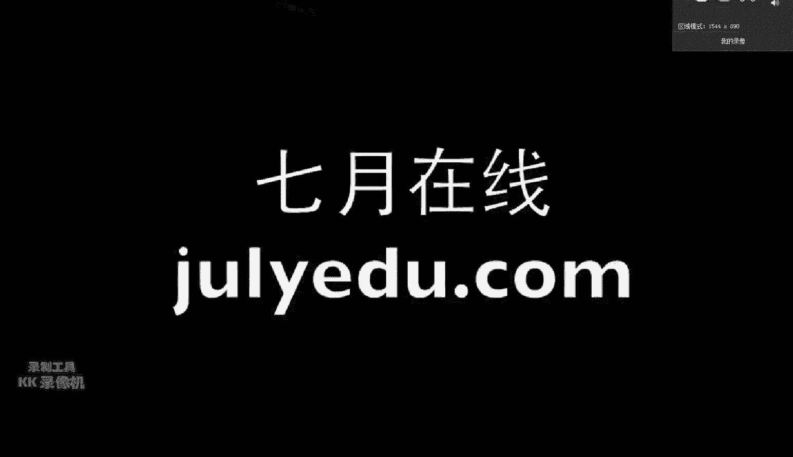