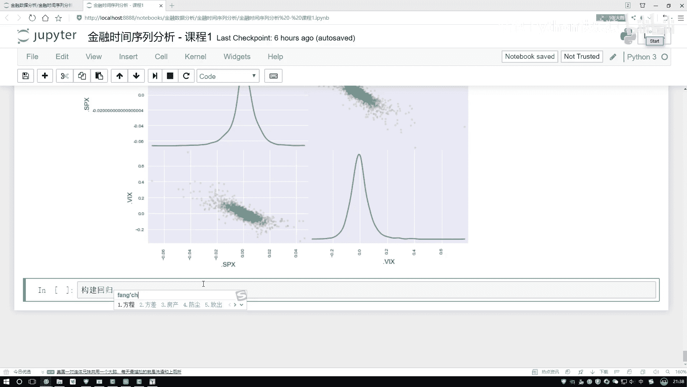

# P11：5-回归方程与相关系数实例 - 人工智能博士 - BV1aP411z7sz

这边写一下吧就是构建回忆方程，其实啊构建这个回忆方程方法其实特别多，好多工具包都能去做的，咱随便算就行，这里呢咱也没导其他工具包，咱就拿这个Numpy来去做吧，Numpy当中啊就是有一个fit函数。

这个fit函数帮我们去构建或者说帮我们去训练一个回忆模型，其实它也不是训练了，就是帮我们去计算一个回忆系数就行了，怎么变小了，恢复一下，然后呢这里边需要我们传接几个参数啊，在之前不是有这样一个数据吗。

把这个数据拿过来，你得告诉我在这里边，你要去看就是你要去计算这个回忆方程的时候，你得去告诉我有几个参数，第一个你是谁跟谁的关系啊，是不是你把这两个指标给我传进去啊，好了这个指标啊。

咱刚才说了一下是这个点fpx是吧，然后再把还有第二个指标，计算他俩之间的一个关系，第二个是一个vx，然后呢还有第三个参数，第三个参数这样就是，咱们现在说这个回忆方程，那你比如说这个是个y。

然后这个是个x，那你说正常情况下咱是y=kx+b是吧，那其实呢不光，y=kx+b什么意思啊，那这块就是有一个x的一次项，然后这块乘上了一个x的零次项是吧，那其实上来说不光我可以有一个一次项。

我还可以有什么啊，x的二次项，x的一个三次项，x的四次项吧，但是大家通常情况下，你见过这么高阶的吗，好像没有吧，一般我们都是一个y=kx+b比较常见吧，那其实这里啊就是啊，你可以不光做一个直线。

做一个曲线也行，怎么描述呢，指定一个dg值，dg值等于1的意思，就是说这里啊只有x的一个一次项，和x的一个零次项，没有x二次项，那你指定成2呢，你指定成2它是有x二次项，x的一次项，还有一个x零次项啊。

它是这个意思，这里啊咱就你看这个任务当中也不设计什么曲线吧，所以啊咱定位当中也没必要写个2，直接指定成一个1就完事了，哦我看一下问题，这块它报了一个错，我估计是在求一些逆矩阵，因为在做这个线回归当中啊。

会要求逆，求逆当中啊肯定会出现点小问题，咱来看一下吧，看一下我的输入有没有什么毛病，我把这个输入给它打印一下，大家输入输入当中有一些空值是吧，这样咱把这个数据啊再稍微处理，构建回放之前。

我说呃当前我的一个结果，你得等于呃干什么，得对它进行一个jump a是吧，jump，然后a一下，jump a当中，然后我直接其实不用做一个返回值了，我直接的原始数据更改吧，原始数据更更当然更改。

你指定一个in place，然后等一个处值就可以了，行然后咱们再来做，啊这就没问题了，咱现在就得到了我当前这个方程的一个结果吧，方程结果就相当于这个，呃这是一个k，这是一个b啊。

相当于我们已经把这个方程给它解出来了吧，行了，那我们现在已经方程能进行求解了，能进行求解完的一个方程，你说我现在能不能在图当中把这个结果给它画出来啊，那既然有方程了，咱来把这个结果给它画一下。

呃画过程当中我们来去呃重新画一下吧，在这里还是啊对它进行一个pro的操作，呃第一步我得先把这个散点图画出来吧，底下有这个散点，然后再画这条线吧，行，然后在这里先把这个散点图画出来。

然后这个看值等于一个散点图，散点图当中，然后呃去指定一下吧，就是在图当中你可以指定一个x等于谁，然后还有一个参数，y是等于谁，x我就等于这个吧，x跟之前一样千万别变了，然后y也是跟之前是一样的。

然后呢这是我们一个三点图，然后图稍微的大一点，这个size等于一个十六就行，我要看一看对不对啊，啊行，这是我们现在大致画出来的一个三点图，然后呢不光我们要画三点图还要干什么。

还要在这个图当中啊继续去画什么，一个规律方程吧，好了，然后说把这个图得到，然后在这个图当中我要继续去画，继续去画就是再plot一下，呃把我的规律方程给它plot进去，规律方程当中啊就是。

呃其实规律方程它也是由一些点构成的一条线是吧，就是有最少有两个点构成这样一条线嘛，那这里，啊你就指定我的一个点是什么，点来说第一个值呃x是这个是吧，我把这个指定出来，就是在这个里边，然后它的一个x。

x我也拿过来，名字别指定错了直接复制好了，这是我的一个x，然后呢我要知道这条线当中，这条线里边每一个x值我都知道了，我是不是还要知道这条线当中每一个它的一个y值得多少啊，y值，哎呀y值怎么算呢。

这里边哎呀咱用这个南派这个包来去做啊，咱没办法直接去算这个y值，但是我们是不是有这个系数啊，咱可以用这个系数来反过头来求它的一个y值是吧，行这块给它个返回值吧，这块就是一个regression。

然后一个回归有一个返回值，返回值啊就是我该求解出来那样的系数啊，然后有这个回归值之后就相当于现在是y=kx+b，你这个x不是我在这写出来了吗，然后咱该求的求出来的就是这个k和这个b吧。

然后我现在回传过去，我是不是就能把这个y求出来了，相当于啊这个画图挺麻烦的，咱就不用这个包了，这个画图挺麻烦的，然后这块我得去回传一下，回传一下计算它的一个y值。

然后回传过程当中你得把当前你求解出来的这个回归方程给我传进去，不管回归方程然后它得用它把y求出来，那是不是也得把x数进去啊，x我这要数进去啊，这里我再把它拿过来，把它当做一个x数进去是就行了，看一下。

哎结果出来了，这个线别是蓝的了，蓝的太难看了，然后给它改个颜色吧，这里还改成一个红色的，哎这个红色线怎么没了，我看一下，在这一块，然后我去指定了一下，哦不对，在这个框后面是吧。

在这一块指定一个红色的线行了，现在我们是不是把这个回归方程咱就给它画出来了，啊这里回归方程一画出来之后，是不是结果就一目了然了，非常容易我就可以看到当前两个指标之间到底什么样的关系，全部给它画出来了吧。

当然就是指标之间啊，你最好还做一个预处理，因为你看现在的数值是多少，我们现在的数值不是针对于原始的它那个究竟是多少吧，而这一块算了什么，它的一个增长率吧，啊，所以说这一块注意一点啊，你要做这个回方程。

或者说当你要统计结果的时候，你得看一看怎么样把这个预处数据做预处理，或者说预处理成咱们是什么样的一个数据，相对来说啊会更合适一点，然后又想到一点，就是这个两两数值之间啊还可以干什么。

不光我们能用回归方程来去计算，还有什么相关系数吧，来看一下这个相关系数，相关系数啊其实画起来也非常简单啊，但这个大家写一下吧，那就不用写了，直接这个我看这个数据，数据当中是不是就两个指标，就有两个指标。

咱可以直接画啊，就那两个指标直接画得了，在这当中直接算相关系数，这个表是不是就算出来了，非常简单，我们给算什么，他们之间的一个相关系数吧，好了自己跟自己的是一，然后他们两者之间对角就是非对角线上。

肯定是一个对称的，你跟我的相关系数和我跟你的相关系数怎么样，都是一样的吧，这样咱就把这个结果给它画出来了，然后呢如果说大家要想去，我想一想还可以统计哪些指标，那比如这样，现在还有一个问题啊。

哎我再给大家描述一下，把这个任务做的稍微再难一点，我说现在咱还有这样一件事，啊现在我不光啊，要去统计它这个相关系数了，然后你看咱的原始数据当中有什么，这个当中我没写这个问题，我把这个问题存给大家列一列。

然后呢我把这个问题啊再列一列，我说新增加一道附加题吧，呃根据这个年份，啊不是根据年份就是随着年份的变化啊计算，然后呃他们之间相关系数的变化情况，然后并展示，哎可以吧，好了把这个题做的稍微难一点。

那大家可能会问，那这个怎么做呀，第一点随着年份的变化，我们是不是得考虑一个时间了，但是你说你考虑一个时间点，合适吗，肯定不合适吧，肯定要做什么，一个窗口吧，啊在这里我们要做很多个窗口了，比如这里是这样。

啊比如说第一个时间点，那第一个时间当中取200个窗口行吧，然后第二个指标取这么200个就是都是一样的，取相同的一个窗口，取完窗口之后，然后去计算啊和两个指标之间的一个关系啊，这就行了吧。

这里啊就是我们现在要做的一件事，随着年份的变化，计算起相关系数的变化，写在哪吧，写在哪当中啊，大家看的应该会更直接一点，数据拿过来啊，数据当中我先拿这么第一个指标复制吧，不用写了。

呃直接这个第一个指标拿过来，啊咱们这个标本指标，呃这个指标当中，然后我说，哎呀要去算，然后它跟另一个指标之间的一个关系，那这怎么算啊，那其实是这样，我们在这个指标当中啊，我是不是说。

我要看随着年份的变化，然后它跟另一个指标之间的一个相关系数，变得怎么样了，那是不是说我得对当前这个指标，哎既然随着年份的变化，我得随着年份构建出来很多个窗口吧，好了，在这里我说我构建一个窗口吧。

我先看一下这个窗口，我构建选个吉利数吧，选个250个行吧，呃我看一下window的255，然后呃做一个窗口，做一个窗口完之后，然后接来用我这个窗口去算这个相关系数，算相关系数，你得告诉我，它是跟谁算啊。

跟谁算，这里边有好多个窗口，那肯定就是每一个窗口，都要去跟我另一个指标去算吧，好了，我把另一个指标拿过来，这是我另一个指标，呃，这里理想的这样就是你算这个相关系数，如果你前面传进来的是一个序列。

因为这是滑动吧，啊，滑动好多好多个窗口是吧，滑动窗口之后，那你接来第二个，它只是一个指标值，那其中啊，它会每个窗口都跟它计算吧，每个窗口都跟它计算，那是不是相当于随着时间的变化。

咱把这个相关系数的变化给它求出来了，好了，在这块相关系数当中，我去指定第二指标，第二指标指定出来了，直接点plot应该就可以了吧，直接点plot一下，点plot当中呢，呃，指定它的一个大小稍微大一点。

一个十一个六，这就完事了，呃，来看一下这个结果，看一看，这块啊，就是你看它一条直线，因为什么，因为这块写错了，这个指标没写进去啊，之前复制习惯应该是嘛，vs吧，再直线一下，行了，当前我们这个变化情况。

咱是不是就给它算出来了呀，好了，这是就是随着我时间的一个变化吧，然后我这个点sps，我的标准指标和我的一个恐慌指数，然后之间它的一个变化情况是不是画出来了，将刚才画了多少，看一看之前咱算的应该是一个啊。

这个就没了，我看看啊，大概是一个我之前记得是啊，这呢是一个负的第二八级是吧，大概是在都是负的，大概是这样的一个位置是吧，但是这个位置是算什么，从整体上来看，但是现在呢，我是把它怎么样画成了一个窗口吧。

随着时间的一个变化，我能算什么，就随着时间的变化，我这个指标随着时间的变化跟当前这个值，然后它的一个变化情况，在是不是形成出来了，好了，跟大家看了一下，就是啊，又额外增加一道附加题吧。

看了一看我们这个相关系数啊，该怎么算，以及现在细数啊，咱都能玩出来哪些个花招啊，能做的事其实蛮多的，行了，这节课就跟大家基本上说到这里了，跟大家主要说了一下，咱们当前啊，对于一个金融时间序列啊。

一些基本的处理方法，以及呢，在pandas还有numpad当中，怎么样据这个工具包，做一些统计啊，分析啊，以及计算，还有展示这个工作，建议大家啊，就是看完咱们课程之后，哎，把这些东西自己啊。

照着先做一遍啊，不用把这个答案去掉，能把这个代码理解，他做一件什么事儿，或者说稍微改一改，你这么做，哎，你取了，这你取了十点，我不带，我取八天，这也行啊，把这个结果稍微练习一遍啊。

咱们内容相对来说啊。

还是比较多的，这个是一个时间序列，哎，咱们基本的处理方法。