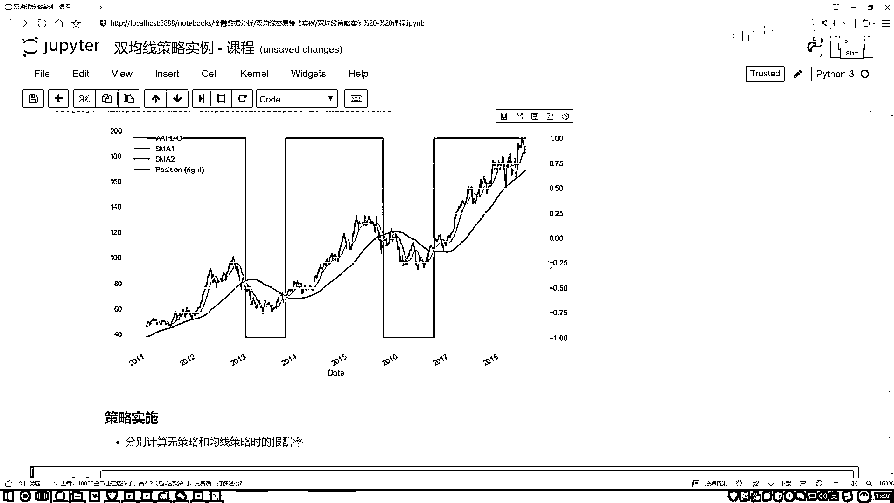

# P13：2-买点与卖点可视化分析 - 人工智能博士 - BV1aP411z7sz

好了我们第一步导进来咱们当前所需要的这些工具包，安排pandas map plot，这不用说了，咱们把之前的全复制过来就行了，然后呢读数据，还是我们之前的那个data。csv。

指定我们的索引第一点是什么，第一点索引就是咱们当前选的那个时间是吧，然后把时间解析一下，然后把这个结果拿到手了，拿好之后一会儿我会选股票，这里是有几个股票是吧，咱就拿这个苹果这个股票来当例子。

给大家做这样一个实验，然后这个info咱也不用去看了，这是咱的一个数据，好了我们完成这样几个事，来看一下吧咱们要做一事啊，首先第一件事，你说我们要去选择苹果的股价，并且呢在咱之前在做例子的时候是不是说。

可能有问题什么问题，数据当中可能会存在缺失值吧，一存缺失值，你做一些实验窗口的时候可能会有问题吧，所以说咱们在预处理的第一个阶段先干什么，把缺失值全部的给它去掉吧，这个是我们要去做的一件事。

行了在这块我们先把这个数据拿到手，我说这个data，我把这个data拿到手吧，等于什么呢，等于我把我当前的数据给传进来，我只需要一列就行了，就是苹果的这一列吧，好了把苹果这一列名字我给它复制过来。

然后接来现在把这个列我有了，然后干什么，不要忘记我们要去去掉这个缺失值吧，再做一个jump a，然后我打印一下这个data，data。hide一下，行了我们现在数据就这个不就是，咱现在我想要的数据吗。

只有苹果这个股价了，第一个这咱做完了，非常简单吧，先做了一个去缺失值，第二步，计算我短期和长期的一个均线，短期和长期，第一步你是不是先告诉我，这个短期咱要多少天，这个长期咱要多少天吧，好了我来写一下。

一个短期，然后呢再来一个长期，这里这样就是短期和长期啊，咱给它写的稍微的大一点，因为咱们这个数据啊，你看我这边看不出来，这边数据咱一共多少条，有这么2000多条，大概是得有个七八年的一个数据了。

所以说在七八年的数据当中啊，如果你这两个值指定太小了，在咱图当中画的，那就太不清楚了，所以说我先把这两个指标值啊，画的稍微的大一点啊，咱来看，正常就是短期可能五天比较常见，长期是二十天比较常见。

但是我也该说了，咱们任务现在来说数据量比较多，我把这个数值稍微的设置那么大一点，咱好观察，现在第一步，我先把这个短期和长期的一个时间，设出来了，那接下来呢，接下来我们设算这个均线了，或者说算这个走势了。

这该怎么算，在咱们当前的我的这个数据当中，我是不是要对这个数据做什么，做一个各种窗口吧，得把好多窗口全做出来吧，好了，把我当前的一个短期先传进去，这是我窗口的一个大小吧，每个窗口算什么，哎，咱该说的。

比如这都是收盘架，算收盘架什么值，是不是一个均值啊，在这里我再点命一下，把这个均值拿到手，是不是行了，然后这里我说我计算了一下，然后计算完之后，我把这个结果回传到咱当前的DataFrame当中。

并且给它指定个名字，可以吧，好了，然后我们来执行一下，执行完之后，把下面也执行吧，下面就是第二个，然后这个改成一个二就得了，执行两次，我看这边出现个小问题，这个Kerror原因是因为现在当我把这个数据。

就是加了一列之后，现在这数据当中不有两列吗，有两列数据，然后我再做这个rowing的时候，你就得去指定好了，你对谁来去做这个rowing这样一件事吧，因为现在我数据当中它就不是有这么一列了。

所以我得给它指定出来，就是在数据当中，我对我看的名字，对我的苹果的股价，这会多加一步，其实正常情况下，在上面多加一步也行，然后再执行一下，行没问题了，然后看一下我们当前这个数据，点hide一下。

这边会出现好多缺失指示，那也正常，因为前面几个窗口，你得最少得有42个窗口，才能有这样一个值，好了点tile一下，tile当中，我们是不是能把它的一个短期，sma1是短期，这个a2它是一个长期是吧。

好了，这一步完成了，就是分别咱计算了一下，这个短期还有长期均线，我们的一个结果，然后如果大家想画图很简单，你可以画图展示一下，对我们这个data当中，你不是有这些指标吗。

对data我直接的我去点plot一下，是不就行了，图当中你去指定一下这个图，它的一个大小，咱指定的稍微这么大一点，看结果，好了，这图是不是有了，你看这个图当中，是不是发现了一些事，咱可以来分析分析。

它是不是有几个焦点，你看，我们先来看红色的，就是原始骨架，咱就不看了，咱就看短期和长期，然后有红色的，还有绿色的，然后找一找，我们当前红色的这里，红色的和绿色当中，会有一些点，那这些个点。

是不是都是我们需要考虑的，一些对象了，来看第一个点，第一个点绿色的，我的短期军线，跟长期军线就交叉了，并且箭头往哪的，往下的说明干什么了，你说此时咱们是该买还是该卖，这是什么，这是死亡，这是死亡交叉。

给卖了这个东西，然后再看一看，我看有没有往上的，找一找，在这里这个位置，这个位置可能不太明显，来看一看这个位置，这个位置挺明显的，这个位置怎么样了，交叉完了，怎么样，是要涨了吧。

这一块就是我们的一个黄金交叉，我们的一个买点，好了，跟大家看了一下，就是在这张图当中，我们已经能够显示出来了，当前一些我们的一个结果了，然后这个数据咱再处理处理，上面咱之前看的时候怎么样了。

是不是有很多个缺失值，所以说咱得把缺失值，一会去掉，我看第三问，第三问就是做一个标记，标记一下，短期和长期均线的位置关系，其实说白了，尼古尔指定的标志位，有precision，表示是。

短期均线是大于长期均线，还是一个小于长期均线，然后做这个之前，咱得把缺失值去掉，刚才是给大家看了，数据当中，我们的缺失值还是挺多的，我不用，要不然你写这个东西，然后等号等于data，要不然在这边写上。

就是一个，U place等于一个true，相当于在原始数据当中，执行这样一次修改的操作，好了去掉一个缺失值，然后在data当中，我们的问题，不是说你指定一个标志位，然后通过标志位，表示的是。

当前我们的一个位置，它是短期的，是大于长期的，还是小于长期的，安排点位置一下，位置当中去指定一下，当前在我的data当中，算一下，我们的一个短期，把这个直接浮过来，我们短期的，和长期的之间的关系。

短期的是否是大于长期的，位置当中有三个参数，第一个参数就是判断，第二个参数就是满足条件下，返回什么，第三个参数不满足条件下，返回什么，指定一下是可以了，好了，指定完之后，我来去点hide一下，看结果。

点hide一下，你看这里，咱们多了一个标志位，好了，我们短期的，长期的标志位，是不是都有了，标志位为1的代表什么，是不是就是我们的一个短期，是大于咱这个长期，你看，从数值上，也是我们当前的这样一个结果。

然后这个图其实能画出来，在之前说圈区列手，其实好像说说这个东西，对我们的data，你可以去dial plot一下，dial plot当中，然后咱之前说的时候，是不是说你得去画什么，得去画第二个轴。

要不然这个结果，sector y，在这个y当中，然后你去指定一下，这个y轴，这两个y，这个y轴，然后用谁来当做，是比较合适的，我这个复制过来，reposition，这就行了，然后指定，图也是稍微大一点。

fixed size，等于一个10，都号6，来看一下，这个是咱们当前结果，咱之前瑞拉画过了，好了，那我现在咱们要做一个策略了，做什么策略呢，你说这个股票，如果，我就什么都不管，就是从我。

从我这个最早一个点，买进来了，我就不管了，然后到最后这个18年，第八年中旬的时候，我说把它卖掉，我看一下，之前的一块钱，相当于现在几块钱，这是什么都不管的前提下，现在你说我们还应该什么都不管吗。

好像不应该了吧，为什么，因为我们之前是不是设计一种策略了，我可以怎么样，有的时候我可以卖掉，有的时候我可以再买进，是吧，好了，我们来想一想，如果在这个时候，我们能把这件事做出来。

是不是相当于咱能保证什么，始终我是一个盈利的状态，比如这时候这样，这个时候在这个点的时候，比如说现在你有这么100块，就是就假设你的总值是100块钱，然后你去给他，这时候咱们该怎么样，给他卖掉。

然后这块的时候，如果他变成80块钱，你再买进来，那什么意思，那是不是说这个时候，礼拜底你还是赚了20，是不是这样一件事，就是这里意思，不是说他现在往下走了，就是咱是稳赔的，因为咱该设计策略了。

我可以怎么样，我可以在这里就给他卖掉，然后下一个点我再给他买进，是不是就完事了，咱刚才不是说了吗，能计算出来哪个点该买，哪个点该卖，所以说就是，永远都是什么，按照咱们这个策略来说，相当于开挂似的。

你事先能先知，按照咱们的策略来说，永远都是盈利的，因为正常情况下，你看什么都不管，这100变80，应该是亏20，但是我们反而怎么样，我们在这点卖了，在这点买进来，我们反而怎么样，赚了20，是这个意思。

所以说一会儿，咱们会一直去赚下去，咱们来看一看，就是你什么都不管的时候，咱的最终的一个报酬率，或者说一块钱，能等于现在多少钱，以及我按照咱之前设计的，我们的一个，买点和卖点，咱都能通过双均线算出来。

然后来看一看，我自己设计的气头，咱们能够一块钱。

最终赚多钱。