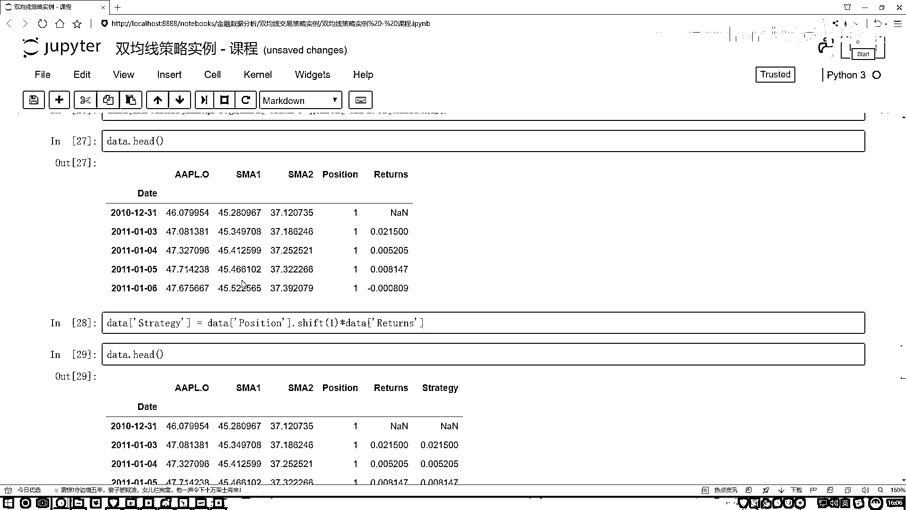

# P15：4-均线调参实例 - 人工智能博士 - BV1aP411z7sz

行了，说完这个双刺剑测试之后，接下来我们看第二个，第二个问题是什么呢？就是现在有个问题啊，哎呀，你这个结果你说跟哪些因素有关系？，大家可能会告诉我，那跟很多因素都会有关系的，那这里咱们该怎么办？

咱们可以这样，你说现在我能不能去找一些参数，比如说我们的一个短线和一个长线，那也不是短线长线，短期和长期，我能不能设置一些不同的值来去看一看，短期究竟是5天合适呢？还是10天合适呢？。

长期是20天合适呢？还是4天合适呢？，我可以算一下这样的组合吧，在探险当中，我们可以很轻松的做这样一个迭代，好了，把迭代工具先导进来，我们先把这个迭代工具给它拿到手，from，咱们迭代工具当中。

imported，imported product这个东西，它就是能帮，给大家解释一下它是做什么的，其实很简单啊，就是它需要让我们，切换了，SMA1，还有一个SMA2。

它需要让我们分别去指定好两个参数空间，参数空间你可以自己随便指定，比如说从20，然后到61，只要取不到61，最多取到60，然后这么4个一加是吧，这里你也可以指定一个range。

range当中从多少长线再稍微大一点，180，然后到280吧，然后取不到280，取到281，然后10个一加，行吧，然后这样，然后再指定一下当前我这个结果，这个参数空间的意思，就是它这个组合的意思是这样。

就是得能去帮我们去计算出来所有的一个组合，比如这里，你看这个20跟180行吧，20就是有这样一些组合，一会算完之后，20，180，这是一种组合是吧，然后20，然后这个20，190，然后20，200。

然后20，210是吧，然后二十万是多少？，24180，然后2419，这个便利操作能帮助我们把所有的一个结果，全部给它便利掉，是这个意思，然后呢，一会儿把咱在这里复原的话当中写对吧，这一块我们可以写一下。

复原当中我要做便利了，便利当中我要拿到咱当前的两个参数，就是一个长线和一个短线，因什么？，因这个谱大当中，然后我把这个结果给把当前两个参数空间转进去，这是第一个参数空间，然后这是第二个参数空间。

能把所有结果全拿到手，然后在这里做便利，然后便利过程当中呢，我会把当前我们的每一个数据全部给它指定出来吧，就是一个data，data我看一看之前，哎呀，这个data当中我得重新算了，在这一块这样吧。

把咱数据重导一下吧，然后之前那份数据可能让我做乱了，我为了保险还是重导一下，在这里，好，这咱把这个数据在这里重导一下，这里也重导吧，导一下咱这个数据，data就是等于我们刚才传递的数据当中的。

只需要我们的一个苹果股价，咱们再把它复制过来，苹果的股价把名字指定出来就可以了，然后现在就是我们拿到数据了，拿数据之后不要忘记对数据还要做这样一个去缺失值的操作，我就全复制了，因为都是相同操作。

但是也不给大家去写了，这里还是第一步去缺失值，去完缺失值之后，然后下一步就是我们要去算，要去算三个值，一个是returns，一个是SMA1，还有SMA2是吧，这三个结果也都复制过来。

这是一个returns，方法都是一样的，这是把returns给它复制过来，然后接下来SMA1，还有SMA2我也复制一下，再往上，这块把它拿过来，好了，这是一个SMA1，然后我把这个改一改。

这是一个SMA2，然后这块分别用一个2就可以了，然后看一下，对当前的数据，然后这块也加上一下，刚才咱们就忘了这里我需要加上，就是当前是对谁做这个操作的，然后对我的股价。

这个也是对我的股价来执行这样一个操作，执行操作完之后，然后肯定这块我估计又会有缺失值，再把这个缺失值的东西加一遍，接下来就是，我们再去把上面的判断给复制过来，就是一个precession的一个东西。

找一下相当于把我们之前所有结果，咱要做一个汇总了，正常写代码，其实也就是把上面的结果，都写到一个函数当中，只不过说再给大家讲解过程当中，可能为了方便，我就给大家一行一行去写到。

方便咱去展示每一行它的一个结果，其实实际上它就是一个函数而已，然后这块我看一下，这块再看一下我们的一个策略，好了，然后一个我看一个precession咱有了，returns也有了，我们的一个策略也有了。

这步整完之后，再去掉一个缺失值，每一步都会有缺失值，去掉缺失值之后，然后最终我会有一个结果，把这个结果也拿过来，结果就是复制这个，把这个结果给拿过来，这是当前结果，好了，有结果之后。

我说我对这个结果做一个展示，展示就是一个results，这个results咱写好看一点，给它写成一个表格的一个形式，就是results，这样一开始的时候，我先创建一个表格。

results=我的一个pandas，创建Dataframe，先是空的，然后一会咱往里去传，在这个result当中，result=我这个results里边，然后我判断一下。

把它当前但凡我需要的东西全加进来，还是加一个Dataframe，我把它做成一个表格的形式，在这个Dataframe当中，我用一个key value的形式，把我的一个列名，和它实际的值给传进去。

第一个名字就是一个smae是吧，好了，smae，然后它的值就是这个smae，然后第二个我直接复制了，第二个就是我这个smar，把它都复制过来，然后多号也复制一下，好，有好几个，这是smar。

这也是smar，然后第三个，第三个就是我的一个returns，这个returns，把这个returns复制过来，这也是returns，然后下一个就是咱们的一个策略，我的这个策略，策略拿过来，策略。

好像复制错了，在这里这是我找一找，这是名字，这是value，名字value，名字value，该复制这个了，这是我的一个策略，然后再复制一个就行了，最后一个，最后一个咱们写一个，就是我的一个输出结果。

输出结果相当于，就是我当前的一个预测值，然后比你的一个结果值，就是咱用这个策略的结果，和不用这个策略能好多少，我不是把它放到当前这个里当中了，那行了，这一块我稍微改一改，等于我的一个策略值。

我把这个策略值拿到手，这个是我的一个策略值，是吧，用我当前策略值，然后我要去减法，减去一下，当前我什么都不做的时候，它的一个结果，这个returns，然后这里咱还得改一改，这块直接是return不行。

我在这块不是把这个returns，都放到这里了吗，得给它列一下，我看一下，这是returns，然后returns它的一个结果，这块稍微改一改，这块我看一下，这写乱了，smar，然后是returns。

得把它改一下，在这个当中，它是取returns这个结果，然后策略当中也是一样的，我把这个也复制过来，也复制过来之后，然后它取我策略的一个结果，这就行了，先来试一下，看结果能不能出来，就让新需要写这么多。

看一下，他说在我算returns过程当中，然后就没有了key，这怎么改，先来看一下，看一下，最简单的一个找错方法，就是它到哪遇到问题，然后在前面咱给它打印一下，行吧，我说我看一下当前这个结果。

它到底咋地了，这个data行不行，好了，重新执行一下，我们来看一看，我看一看打印出来的结果会是什么，打印出来这个数据当中，这有个data，只有我的一个索引，但是你看它像是，把这个数据当中。

像是没有这个列了，是吧，这源于什么，我们当前取完之后，咱们得到的是一列数据，一列数据当中，没有给我代这个名字，所以此时，我们得稍微改一改，我得把这个东西，再加上点东西。

你让它接着成为一个data frame，才行，所以这块咱这样，咱把它给它加上一个data frame，data frame给它包起来，这就行了，应该，再来执行一下，好了，果然不出所料，又报错了，看一下。

这块我得再重新执行一下，因为刚才改东西之后，都得从头来执行，来看看，这回又报错了，但是报错不太一样，看一下是哪里，最后一行，我做result table的时候，构建我这个数据表的时候，然后他说了。

数据表当中，你必须指定一个索引，我不需要索引，不需要索引也没招，就是人家说了，里边是必须去指定索引的，怎么办，人家说指定索引，自己指定，index随便指定成一个值得了，然后我来执行一下，好了，执行完了。

来看一看，先看一下结果怎么样，我该随便指定索引，看一看，你看随便指定个0的索引，但是感觉有点奇怪，这么对吧，咱们辨识这边指定0了，我先给他指定出来索引，然后我说再给他一个null一下，用原始的索引。

就是按那个数字012345678，再标，这个索引我给他忽略掉，然后再执行一下，来执行，在咱们传件索引，传索引的时候，应该是给DataFrame传索引，是吧，然后一个null的时候。

应该是对于Apana来说，我不需要再给他加索引了，是不是，应该这样一件事，所以说，咱得把这个括号给对应上，咱想想怎么改，在这里，这个index应该是对于DataFrame当中，我再加个括号。

我看对不对应上，当前怎么加中文逗号，加上一个逗号，你看现在对应了DataFrame，你看DataFrame这亮了，所以说现在一个null，我对应了，不是这些指定index。

对应DataFrame当中有索引了，然后再看最后一个，我这个一个nullindex，他说是对于我这个Apana来说，我不需要再加索引了，来看一看，当前我这个括号，这个括号好像多了一个，再去掉一个。

对应上了，对应是有判的，行了，咱再执行一下，这回没问题了，展示一下结果，这回我们的索引当中，你看01234咱就全有了，SMA1 SMA2，对于不同的结果，我展示10个，对于不同的一个，就是那什么。

不同的一个参数选择，咱得到结果returns，还有我们策略得到结果，你看，对于不同的结果来说，第一个挺有意思，就是看咱们out，out相当于就是我们这个策略，比啥也不做的时候，强多少，第一个你看。

如果说你选的窗口不太合适，反而还不如啥也不管了，是不是，但是大问题来一下，还是比之前要强一些，然后甚至有的，还是一个处于持平的状态，行了，这给大家看了一下，咱们又给大家对比了一下，就是怎么样去。

基于我们不同的参数，去选择一下，什么样的一个结果，才是一个合适的，这给大家说了一下，在判断当中，怎么样借助这些工具包。

来完成我们的一个双精线策略。

给大家做了一个分析，还有操作的一个实例。