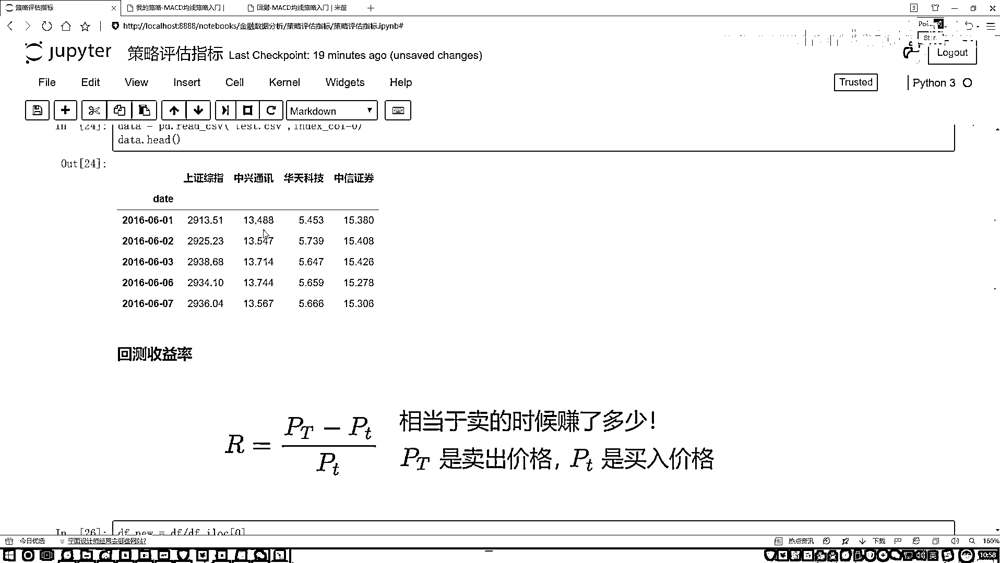

# P16：1-回测收益率指标解读 - 人工智能博士 - BV1aP411z7sz

这节课咱们来说一下策略的评估指标，先说一下，评估指标指的是什么东西，当我们做完了一个策略之后，那肯定要在历史书记当中进行一个测试，看咱们这个策略到底是赚了还是赔了，那赚的赔了它并不是一个词。

你告诉我比如说赚了多少呢，那相比于大盘来说，我们比大盘有什么样的一个优势呢，以及当我做了这样一个投资之后，或者说当我做了这样一个策略之后，我会遇到哪些个风险，我做这个风险是值得还是不值得呢。

以及我的策略跟别人策略相比，那有什么样的一个优势，这个就是我们要做的一个策略评估指标了，我现在大家看一下就是后续咱们要用到的，一个策略平台，这里我先不介绍这个平台干什么的。

咱们先来简单的去了解一下我的一个结果，咱们讲策略评估指标主要是做分析的，你看这里咱们就其他都不管，就是看出结论就行了，你看这里是不是说当我们做了某一个策略，你不用现在去管是做什么东西。

等后面课程当中我会详细给大家去解释，当前我们这个平台它做了一件什么事，以及我们要做什么样的策略，什么样的实验，我们现在只需要关注就是有哪几个指标，你看这里，这些指标是我们最常去说的。

然后一会我会在咱这个notebook当中，也给大家去讲这些基本的评估指标，它们都是什么意思，以及我们的计算公式是什么，主要就是大家可能看这个计算公式，看起来挺长的挺闹心的。

没关系最好是去通俗的理解就可以了，我建议大家就是对这些指标一说，你就知道大概什么意思就行了，不用把公式背下来，公式我只给大家简单的描述一下什么意思，主要咱还是得知道这些指标表达是什么东西。

其实说白了就是为了让大家能看懂什么，看懂就是咱的一个分析结果当中，呈现出来的各一个指标，它都是什么样的一个意思，行了我们来看一下这里有哪几个指标，先说第一个叫做一个回测的收益率，一个来咱一个去说。

一会我会在下面就是咱编写代码，编给大家去讲每一个策略，然后它都是做了一件什么事，第一步这样咱们还是先把工具包给导进来，工具包导进来这块加上了一些字体，主要是方便咱们去写我们的一个中文的数据。

咱们一会可能要画图，第一步还是先把这个数据给读进来，然后一会咱们基于我们现在的一个本地数据，来做一下我们的一个策略，先不用咱们刚才给大家说这个平台，先用python当中给大家捋一捋都是什么意思。

等后续咱就不自己算了，全是基于这个平台，它自动帮我们生成出来的，读下数据，然后我说指定一个index，就是一个日期是第0个就可以了，然后指定我们数据名字叫做一个data，然后看一下咱们的数据长什么样子。

行了，这就是我们这个数据，然后反正就是有股票有一个指标，在这些指标当中，你就看它发生一些变化，然后当它发生变化的时候，我不是想看吗，你的上边你不是跟我说了有这么多指标吗，咱来看一看这些指标该怎么样去算。

这是给大家提供的一个样例数据，然后我们就一个去说，先说最重要的一个，也是最基本的一个，叫做回测的收益率，你看这里，这块什么，第一个指标就是回测的一个收益，回测收益它是这样一件事。

就是当你做了一个策略之后，你肯定也要最终知道，你的策略，比如说你说选从15年到20年的，一个某个股票，某个股票数据，然后你选了一个策略，然后什么时候买什么时候卖，然后得到一个结果。

这个结果就是最终你赚了多少钱，但是注意点它是什么，它不是一个钱多少，是相对你一开始有的一个本金，你赚了多少，你看这里，比如说它是一个4%多，你就大概知道了，我折腾多年，我大概值得我赚的一个钱。

相对我的本金来说多了多少，大概这样一件事，行，然后给大家看一下，就是我们的一个区间公式，区间公式非常简单，回测收益率，你看这里有一个PT大体的意思，就是说咱们现在的一个卖出价格，就相当于一开始。

你是有笔钱，然后有笔钱之后，你去买了一些股票，这是你一开始有笔钱，买了股票，然后后来隔了一段时间，给它卖出去了，我们现在分子当中，是不是相当于是你赚了多少钱，但是注意点，赚了多少钱，是相对谁来说的。

是相对一开始你有多少钱，咱们来说的算了一个什么，回测的一个收益率，回测收益率，是咱们在计算策略，或者说做评估的时候，我们最常用的一个指标了，主要就表示着，我们当前这件事做的怎么样。

这是我们的一个回测收益率，然后给大家来看一下，就是咱们回测收益率，该怎么样去做这样一个计算，其实这样，我们一块画图，你可以画一个图，比如这样，现在我们是从比如说，15年的，16年的，17年的，18年的。

你可以看一下，就是随着时间的一个变化，你的一个回测收益率，它的一个变化情况，我们是可以求这样一个变化情况，怎么求这个事呢，是不是说你用每一个时间点，它的一个PTA值，比上什么，比上最开始，它的一个值。

就可以了，来看一下当前我们的一个做法，后来这里我说这样，我说现在我构建一个，DataFrame，DataFrame当中都是一些，我的一个比值数据，就可以了，这里就是我们先不做这样一个减法。

因为我们可以这样，你看这个东西，我们是不是可以这一块做什么，这块做个除法，后面减什么，减去一个1，是不是一样的，咱一会直接减1就行了，我不做那么复杂，最后减1，相当于把这个公式，给它做了一个化减。

来写一下是吧，你说第一步要算什么，是不是算一下这两个数据，它的一个比值，怎么算，那我说我构建一个DataFrame，好了，先构建一个DataFrame，在DataFrame当中，是不是说。

对于我每一个时间点，我的一个结果，这是一个结果，要比上什么，最开始，我的一个情况，好了，最开始的情况，那就是我什么，第一个数据就可以了，好了，对于DataFrame当中，我说点Lc一下，Lc当中传谁。

第一个数据是谁，索引为0的，这样我构建完之后，咱们现在得到什么，就是我当前的第一个事，这我就做完了吧，好了，咱们现在把第一件事做完了，然后给大家画个图，给看一下，在当前这个结果。

对它我说我去做一个Plot，然后我指定一个FigureSize，等于的稍微大一点，来看这个图，这是什么，这就是相对一开始，一开始是1的情况下，我相对一开始，比如一开始是1块钱，我现在把这1块钱。

变得怎么样了，通过我这样一个策略，是吧，行了，那然后咱还没算完，我们要算什么，一个回测的收益率，好了，那我说最终咱的一个回测收益率，然后一个Return值，等于什么呢，等于在我的Dayframe当中。

去干什么，对于我的每一个，咱们算最终的回测收益率，最终回的收益率，那就是最后一个值，不要忘记还要减什么，公式当中告诉我们，最后还要减谁，减去一个1，是不是就可以了，然后把这个东西，我说做成个表格。

再展示起来，看着好看一点，现在我说我构造一个Dayframe，在我当前Dayframe当中，把我的一个结果给传进去，然后用它的一个。values，这是我的一个数值，然后指定了数值之后，我说指定一个列名。

我的列名，我自己叫做一个名字，叫做一个回测收益率就行，好，叫做一个，回测收益率行了，然后指定我的一个索引，指定了索引，然后就拿原来索引就可以，。index也行，我们来执行一下，我看一下遇到小问题。

-1没有在我的一个索引当中，Dayframe当中，我得去。ioc一下，然后再执行一下，这样我们是不是，就把回测收益率给算出来了，相当于我跟一开始相比，我现在是赚了多少，通常赔的可能性也有，因为你看这里。

其实这里我们是没，你就假装是吧，就是这个数据，就是我们做了一个回测之后，咱得到的结果，其实这东西，它就是正常的一个走势，我们没有做东西只是读件了，你就当做是我做了一些测试之后。

我得到了每一天它的一个收盘价。

就当做这样一个值就行了。