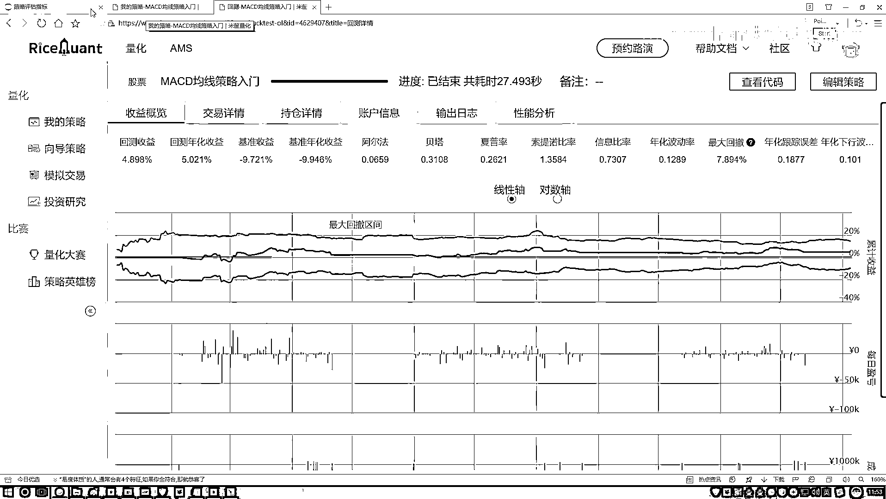

# P18：3-最大回撤区间 - 人工智能博士 - BV1aP411z7sz

接下来咱们来说这个最大回撤，先给大家看一下就是在我们的测验分析当中，最大回撤表示的是什么东西，你看这里它是有什么，是有这样的一个区间吧，这个区间什么意思，好像说从哪儿到哪儿是持续了这样一个最大回撤。

还有这样意思，其实这个最大回撤，它不能从这个字面意义上来解释，它其实描述什么，大家记住眼行了，它描述的就是你炒股票，这个惨劲，什么叫这个惨劲，它说这样一件事，就是当我们在炒股的过程当中。

那肯定会有一些跌的时候吧，那最大的时候，不是最大的时候，最跌的最惨的时候，持续的那个区间，我们就叫做什么，最大的回撤区间，在这里我再给大家解释一下，通过公式咱们在这看一下，什么叫做这个惨劲。

它是这个意思，这个PI表示的是，你某一天的一个股价，可以吧，这个PJ表示就是，反正J都是I后面的，比如说I是第十天，那J就是第十天之后的某一天，当然这个某一天，那你说怎么样找这个某一天。

它叫做一个最大回撤，就是这样一件事，这个股票在下降的过程当中，这一块可能有一个区间，那是连着五天，比如说从这个十块钱，跌了五块钱，这是有这样一个五天，然后后面还有一个更大的，更狠的，从这个比如说这块。

它又涨去了怎么样的，然后这里它还有一个，比如说从这个十五块钱吧，跌到了一块钱，有这样一个更大的区间，相当于就是我们整个，要便利一下，便利什么呢，便利在咱们的数据当中，哪两点之间，是下降最惨的。

并且我们还要把这个天数，给计算出来，比如说我说现在连着三十天，反正可能中间，可能中间这块有一点涨的，也没关系有点涨的，但是整体还是往下去走的，反正我说连着三十天，我是经历了最惨的一次，从多少钱。

跌到了多少钱，但是这个描述的不是一个多少钱，因为你看下面有什么，别忘了还有比上什么，比上一下这个PI，相当于就是你缩水了多少吧，大概是这样一个感觉，这个我们叫做一个最大回撤，它并不是一个评估。

你的策略好不好的，而是评估什么，因为当我们在评估的过程当中，其实不光，我们要看这个策略好不好，还要看什么，你的一个风险吧，这是一个风险，什么叫风险，哎呦你说你炒一个股，然后你把全部家当都放里了。

然后之后有一天你发现了，哎呀这个最大回撤区间，连这十天要我命了，从这个15块钱一直跌到多少了，是不是挺吓人一件事啊，当然可能它后面还涨起来，是不是，只是说它最大的一个，这样一个跌幅。

或者最大的这样一个回撤区间，是多大的，这个以及就是你的一个缩水成了多少，这个是我们要去描述的一个指标，在这段时间当中，你的一个惨劲儿是有多惨的，所以说最大回撤，大家以后看到了，你就想。

这个是一个风险指标，描述的就是，你做这个策略，可能整体上来说还是赚了，但是中间会有那么一段时间，让你非常惨，这个时间就是你最惨的那段时间，我们就叫做是一个最大回撤，那你说股票当中啊，风险重不重要。

重要吧，08年的时候，多少人都跳楼了，是不是不是多少人跳楼，个别案例啊，有些人就都跳楼了吧，08年的时候，那股市当时有机率好像从6000多点，直接的跌到了1000多点，基本上就当时我爸也炒股啊。

当时08年的时候，然后那时候我们全家还去那个海南玩呢，然后当时可能就是，哎呦也是电脑没有那么普及，然后也没实时的去看这些信息，然后在外面玩的时候压根没管股票，然后走钱，走钱我记得都是股票啊。

我爸那股他是16块钱的，然后回来的时候跌了多少了，剩4块多，然后赶紧都卖了，因为实在是挺不住了，这就是当年08年这个股市，大盘直接就是我记得，我可能记不清啊，我记得好像是6000多点。

直接跌到了1600多点，还是多少点啊，基本上所有人都是亏了吧，而且都亏的差不多啊，人均当时说是人均亏10万，但是我觉得可能10万是不止了，大部分人都是几十万几十万的一个亏，这个最大回撤区间啊。

就描述的是啊，在某一段时间，你的一个惨劲是有多少，那你看在我们这个汇率策略当中啊，怎么样，这块他是不是会帮你做统计啊，统计出来，哎你的一个回撤区间里边哪一块啊，他是什么，是有这样一个最大的吧。

啊这是我们的一个最大回撤区间，然后呢咱们写一下吧，就是我们的一个计算该怎么去算，首先我们来想一想，这里边需要我们算什么，那算指标其实蛮多的，那得算最大的一个区间吧，哎呦那你怎么知道一个区间。

它是一个大还是小啊，是不是我们都得一个一个去做计算，然后选择出来什么，其中那个最大的吧，好了现在大家看啊就是，有这样一个函数，Pandas点啊，我先给大家举个例子啊，这个Circle当中随便传一些值啊。

就拿那个光影例来说吧，然后我贴上一个空值得了，空值不会参与到计算当中，然后再填几个值，给大家介绍一个函数，然后我们给大家讲怎么去写，行我现在就创建就创建一些数啊，然后我对这些数做一些操作。

做这样一个操作就是一个啊，不是ComSum是ComMax，什么叫ComMax呢，相当于啊就是，对于第一个数来说啊，你前面搜的最大多少，那对于前两个数来说最大多少，对于前三个来说最大多少。

对于前四个前五个来说，最大的是多少，属于这样一件事啊，第一个就是自己，然后这个a n值是是这个东西，是会影响我们就是不考虑的，然后接下来前三个的多少，然后这个多少这个多少啊，这就是一个ComMax操作。

但之前是不是说过一个ComSum操作啊，啊跟那个操作是类似的，只不过这里咱算的是一个Max，那这要算什么呢，我们不是要算从哪到哪最惨吗，那好了我们先找个制高点吧，在这里比如不是找制高点。

找这样一个累加的一个就是Max核吧，对我们数据来说，呃先拿咱们数据，对于我的DataFrame来说，选择其中一个吧，我看选哪一个，随便选的得了复制一个，呃咱们来举个例子，选一个数据，选数据来说呢。

然后我说对他呀，做一个这样一个ComMax操作，然后去点Hide一下，好了就是，呃你看上面数据当中，最开始数据呢，最开始数据当中，这是2913，这是2925，2938是吧，然后对看这个是2934吧。

好了6月6号是2934，然后呢你看这里，这里6月6号，它是2934吗，不是吧，因为前面有比它更大的吧，所以到这一块就是还是2938，这始终啊会去帮他选，他的一个那个那个最大的一个值啊，是等于多少的。

然后我们来计算，怎么算呢，我把这个结果拿过来啊，就是还是对他做了这样一个ComMax操作，要算什么，你看这公式当中，它是不是一个减法呀，相当于我这块，我要再减去某一天吧，好了那我说，哎呀减去某一天。

那减去哪一天啊，那我不知道，那我就是现在有这样一个指标，这指标什么意思呢，哎呀，从6月2号之前最大值，然后这个指标6月7号之前最大值，那我用每一个值减去我当天这个值行不行，咱现在算一下。

这块可能稍微有点绕，大家简单看一下我写的这个过程就行了啊，其实不用太注重咱们的一个具体的公式啊，因为后续咱们所有的计算方法，都是通过那个就是这里，直接帮咱们计算出来的，这块只是帮大家先去熟悉一下啊。

我们该怎么样去做这样一个操作，然后行这块现在大家看结果中间结果，然后我说我点hide一下，那你看这是什么意思啊，用前几天最大值，然后减去当天的实际每一天的一个结果值吧，哎这为什么是这为什么是零了。

因为当前就是你看第一天最大值是第一天，第二天最大值第二天，第三天最大值第三天，恰好是跟他当天是相等的吧，啊所以说会出现一些零，然后呢你说，我们现在算这个值之后，那你得到了一些咱计算的结果。

这些计算结果是我想要的吗，这是每一个回撤区间吧，哎是不是啊，是不是每一个区间啊，那我要算的是什么，是不是一个最大的呀，所以在这里接下来我们要算什么，我还要去点上一个max吧，哦还没点max。

这块还有这样一件事，还有什么，别忘了在做max之前，你还要比上一个pi是吧，好了然后我说再比上这个东西，我先写一写，现在我们把这个减法我们已经做了，减法做完之后呢，然后接下来我说呃在这里。

然后做完减法之后再去做一个除法，除法就是比上当前这个结果值，是不是就行啊，比上我们当前结果值，哎但是注意点，你比上那个结果值要比上什么，是不是也要去对他做一个commax操作啊，这步别忘了。

也要做一个commax操作，然后我把之前结果，我说我全括号起来，在这些我得到了这么多剧烈，做完的一个结果，我找谁啊，咱是不是找最大的呀，所以说此时你别忘了，你还要干什么，再点max一下，是不是就行了。

来执行一下吧，看一下我们的结果，那多少，30。7是吧，这算什么，最大的一个回撤区间啊，然后你想把每一个小区间算也行，但是我们现在算什么，是最大的一个回撤区间，等于个3%，就是最大一个回撤区间。

这个区间使得你的一个结果，然后变成了就是你的一个怎么说呢，就是一个跌幅吧，是有大概多少，大概这个意思，这个是我们的一个回撤区间，咱们该怎么样去计算，其实说白了就是这个图当中啊，这块阴影部分。

黄色淡黄色阴影部分当中啊，给你指定出来的，我们当前的这一部分的结果，这个就是一个回撤区间。

说白了就是你那个惨劲啊，有多惨的意思。