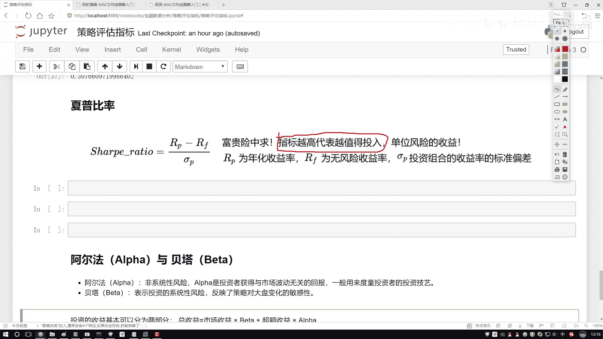

# P19：4-夏普比率的作用 - 人工智能博士 - BV1aP411z7sz

接下来咱们来说一下这个下坡比率啊，那先解释一下它是描述什么的，咱们之前是不是提到一个风险啊，诶那我给大家先举个比较好玩的事啊，咱们在那个朋友圈当中啊，是不是经常看到一些搞笑的东西。

诶比如说之前我看到说那个叙利亚，招那个雇佣兵，然后只要会扛火焰筒就行，然后会怎么样就行，然后工资日结，一天工资就三万就五万就十万的，是不是还挺高的呀，那他的工资日结，为什么这么高啊叙利亚那块。

因为他们怎么样，风险非常大吧，那这个小比率它是描述这样一件事啊，那我干什么都有风险，那相对来说，我这个风险跟我的一个收入来说，它是值不值当的呢，相当于啊我们要算一下，对于单位的一个收益来说。

诶我的一个收益是怎么样的，其实这个小比率啊，它描述这样一个指标，指标越高表示什么，单位风险来说，诶对于单位风险，我的一个收益会怎么样，越高吧，那其实我们要去做这样一件事，比如说现在我要去选股。

那有可能有好多股票，那好多股票算完之后我算一下，看谁啊，咱们如果说单从一个指标来看，就刚看这个下坡指标，我要看什么，那肯定是他高的呀，因为越高代表着，诶对于单位的风险来说，我的收益也会越高吧，所以说啊。

这个指标就描述的是，诶在这里你看也有啊，这块咱们的一个，诶这个下坡指标是吧，这个指标当中啊，咱们就可以计算一下，对于单位风险来说，我到底是值得呢，还是不值得呢，当然我们希望这个指标怎么样，越高越好呀。

单位风险，我的收益要越大才是越合适的，然后咱们来说一说吧，那这个哎呀，风险这个事儿，或者说风险跟收益这个指标，这个事儿啊，咱们该怎么去算啊，那其实这样，你说咱们现在就平时存钱的时候啊。

可能大家听过两种存钱方式啊，一种就是到银行里边，他会先去啊看一下你的一个人的，承受能力你的一个风险等级，看一看是不是适合买这个理财产品，如果你这个老年人去的啊，就七八十岁，像我爷爷之前还没理财。

买理财的时候去了，那人家肯定要让你买什么，就是那种就是没有风险的，就是固定收益，比如说一年啊，就给你个3%，反正就是不为亏本，一年到了就给你3%，这叫什么，就叫做一个固定的吧，或者你买一些国债啊。

相当于到就是时间到了，就给你这钱，不可能有点风险的，那比如咱说这样吧，就说咱这个宝本的固定的，我说他是一个5%，整个高点行吧，然后呢，然后就比如我去了，我去他看我哎呀，这个中年人去了。

然后他有一定收入能力，然后他有点抗压能力，我说给你介绍一款我们理财产品吧，然后咱们这款理财产品啊，他是可能是有组合的，不可能不一定光是一个，可能给你介绍一堆投资组合，我就拿一个纸来说了。

比如说给你算了算啊，当前的一个收益可能是一个15%的，那相对来说你看，我买固定收益才5%，是不是太少了，那我买点风险的，是不是15%啊，那此时我可以算什么，他们之间怎么样，是不是有一个差异啊。

相当于就是我们指出两个指标，一个呢，就是你的一个投资的，你的一些组合产品，这样一个收益率，以及呢，你的一个市场来说，一些无风险的一个收益率，我们要算他们之间的一个差值，是要算这样一个指标，然后呢。

再用这个差值比什么，比上就是当前，你不选了这个投资组合吗，比上一下你投资组合的一个标准差，咱们要算这样一件事，大家可能觉着这个公式计算起来，稍微麻烦一点，没关系，我们重点是什么，你只要去理解这个小比例。

这个锐收值表示什么意思就行了，然后呢，给大家来算一下吧，就是刚才解释了，就是单位风险，哎，你的一个收益到底能有多大，那怎么算呢，按照咱们刚才这个来说吧，比如说啊，我说我现在买了一款理财产品，然后呢。

我的一个returns，这块我在算过程当中，我得把之前我的一个回报率拿过来啊，之前对之前在我们做这个回报率的时候，还做了额外一件事，就是对数据当中缺失值做了一个填充，因为数据当中可能有一些哎。

就是停跑了，或者是有一些其他因素，或者读取数据当中因素导致了咱这个指标，它是有缺失的，我们在这块就是全部用它前一天值，如果一个数据缺失了，当做它缺失的那个值啊，多做一步，然后呢，用我当前我的一个啊。

我的一个回报率，然后呢，减去咱们该说的是一个0。05是吧，然后不要忘记啊，就是咱们得按照这个年来去做的，所以这里我再比上了一个250，然后接下来，咱们来去计算一下这个小比率啊，小比例做的过程当中啊。

其实挺麻烦的，在这个returns当中，你要去算它的这个变化差是吧，你得有一个均值，然后再比上什么，再比上它的一个STD，然后呢，前面前面的过程当中啊，这里啊，它只是一个形象的表示，然后它少了一步。

少了一步就是lampi点，然后我去得把当前这个结果再给它去开一个根号，开根号就是你加上一共咱们的数据，它是有多少天的啊，就这里把这个数据一共是有多少天的写进来，然后呢。

接下来再去乘上我们当前的该算的这个这个标准的一个偏差就可以了，然后我想想就没有什么问题，没什么问题，看一下结果吧，看结果咱们算出来了，就是对于啊，我的每一个指标来说，咱们当前的一个下坡指标是全算出来了。

哪个最合适啊，肯定中兴吧，为什么，因为当前这个指标值，它是一个最大的吧，单位的一个风险能够使得我的收益是最大的，然后这个都是负的负的就不看了，我们希望当前我们指标肯定哎，我们要是一个越大越好的。

这个就是在这个测验当中，咱们提到了啊，有这样一个下坡率啊，我们希望他的结果要越大是越好的。

