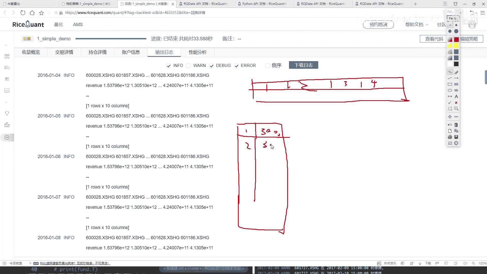

# P26：3-策略效果演示与指标分析 - 人工智能博士 - BV1aP411z7sz

我们想法是什么样？我们想法是横着来是吧？，就是横着去写每个股票名字，第一个股票，然后第二个股票，然后第三个股票，然后第四个股票，我们一般怎么样？我们一般大家是不是都喜欢这样啊？，就是竖着去写。

我说第一个股票，然后他的一个财务的一个营收，怎么怎么样，第二个股票，营收怎么怎么样，第三个股票，第四个股票是不是？，咱把它稍微改一改，这个咱们来改一改，这块我说我在执行这个结果的时候。

然后我说把最后的一个结果稍微给它去变一下吧，来，把这个东西稍微改一改，对这个Gain Frame做什么？，其实只需要对它做一个转制是不是就可以了，然后咱们来看一下吧，就是打印一下它的一个转制的一个结果。

先来试试这个结果对不对，然后对的话咱再往下走，转制一下，转制完之后其实这一步咱还没完，在Before Trading的时候，我们最终要的目的是什么？，不是说打印出来给你看一看吧，是把那什么。

那十个找到手吧，所以说这块就是我们最终想要得到的，这块我是在写一下吧，最终我说我们想要得到的结果应该是对它先做一个转制，来看转制的结果，转制的结果你看就是竖着的，就是这个东西，就是一个股票名字。

然后后面是它实际的一个指标吧，那第一个就是一个Index，一个索引，后面就是一个实际的一个值是吧，行了，那此时我们只需要把索引拿到手就行吧，你看有没有什么变化，看起来就是，这间隔太短了。

看不出来什么变化，行，咱不管了，一会儿策略我分析吧，在这里我说我把它的一个Index拿到手，这个是我想要的一个股票名字，然后我把股票名字给它重新的设置一下，在这个Context当中我说把它当作是。

一会儿我要返回的一个结果，或者说你就把它存到我的一个Context当中，这一会儿这个就是咱们要的，这个就是互联300当中选了一个10个，随便指一个名字得了，好了，这是我们现在这个打印。

咱一会儿也不需要了，打印一堆东西没什么用，行了，这是我们的一个笔复吹顶，我们在做交易之前，已经能够把这些个筛选工作给做完了吧，那接下来就是一个Handlebar，这里就是我们要实际的做一些事情了。

这里咱就不Path了，咱们来写，往下一点，再往下一点吧，放中间给它，好了，我们来写吧，第一步要干什么，首先我们要去做一个判断吧，判断什么，当前啊，我这个Context当中或者说当前。

我是否是持有一些股票，这里给大家看这个API，先看这个API，然后咱们再参考API去写，其实就是给大家准备的所有的这些例子，都是一点点翻API翻出来的，API当中可解释的东西其实蛮多的。

找一找那个Context的东西，我找一下，Context，啊不，不是在这里，在这里，在这个找一找它的一个Context，这是行情股票，这是它的一些数据，啊，没来数据，还是刚才那个里边。

刚才这里边其实有这个Context，来找一找，交易相关的，咱们一会儿也要去用啊，然后这儿Context，哎，找到了，这块其实我们需要这个，就是咱们的一些组合的信息了，我直接把这个复制过来，咱们来写啊。

这块就是我要看一下，我当前我的一个账户当中啊，我的一些信息的情况，然后这块有一个指标，叫做一个Position，咱们来看一看，这块，啊，这块就是他有一个咱们点进去，点进去之后呢，他有一些属性啊。

咱们来看一看，我们一会用这个就是一个Position，Position你看啊，他说的是一个包含所有仓位的字典，相当于就是这里边描述的是，你现在手里有哪些个东西吧，你都买啥东西了，是不是，好了。

那咱们来写一下吧，首先第一步，把这个Context找到手，我刚才是不是复制了一下，Context来这里，把它我说我先复制过来，先看看我手里有啥东西吧，这个关掉，好了，在这里我说我先去做判断了。

我看我手里有什么东西，都手里东西的什么来着，Position是吧，因为Position当中描述的是，你的一个所有仓位的一个字典，所以说咱把它先拿到手，那既然啊，它是一个字典，那肯定是一个。

keys当中存的是你所有的东西吧，那好了，我说我先做一个判断吧，如果说呀，在你的字典当中啊，你这个所有买的东西那都是空的，那是不是说你现在手里啥也没有啊，好了，先做一个判断，如果现在都是没空的时候。

如果能为空的时候我要干什么，那我说我现在是不是就不等于零，就是现在我是一个不为空的时候，不为空的时候，咱们是不是要去卖一些东西了啊，因为只有第一次的时候，咱们是去把所有就是买这么十只股票，然后后续啊。

就从第二天开始，咱们都是要去不断做判断吧，因为后续后续的时候就都不为空了，只要不为空的时候，我们就要去卖出一些东西吧，再要看一看我手里有的和现在哎，这个股票池当中给我渗染出来的，是不是一样吧，那好了。

我说我现在要去便利一下了，便利我手里有这些东西，便利啊，我的一个所有在手里有的，那就是这个KISS吧，这KISS当中保存的就是咱所有有的这些个，就是买买买的这些股票是吧，好了，如果说，如果说呀。

当前这个股票那没在咱当前指定的我的这个股票池当中，股票池啊，这里我看一下，哎，这块呢，咱是不是指定好一个名字了，好了，我说我做一个判断吧，如果说呀，你没在我当前的这个股票池当中，额。

我看一下这个股票池当中，然后我就是给他要去卖掉吧，来看一看吧，卖怎么写，API当中啊，这里他会给你有详细的一个介绍，在上面这是交易相关的吧，交易相关的其实有挺多东西做啊，咱有一个比较方便的就是这个还说。

order我们的一个不算值相当于你填个百分数就行了，点击给大家看一看，这里呢，需要你主要就是传递两个参数，第一个参数就是卖谁，第二个参数就是你希望经过你交易完之后，然后他的一个就是占你现在的一个百分比。

那比如这样，你说你现在经过了一个交易，经过交易之后，你要写个零什么意思，那写个零的意思就是全卖吧，你看这边写了，就是投资组合占现在的一个总和啊，这是一个百分比，如果一呢，那你就是把它买满零了。

就是全卖了啊，这样一个意思，行了，我把这个东西直接复制过来吧，复制过来，然后咱们要进行个交易了，然后他的一个ID就是我的一个股票，然后右边这个第二参数，咱们现在要干什么来着，是卖还是买啊。

你不在我的交易池当中，哎，那我是不是不在我筛选的结果当中，你不咋地，那我是不是就卖了，卖完之后，你就空了，那是不是占零，占百分之零就行了，这个是我的一个卖的操作，好了，那其实啊，不光我们就有卖的操作。

还得有什么，还得有买操作是吧，每一天，好了，咱们这里再写啊，在啊，这块还是一个编辑的操作，复制过来吧，好了，编辑一下咱们的有股票，在呃，这块就不用这个了，编辑什么，编辑我的股票池吧，然后把这个复制过来。

编辑咱们现在筛选的这个池子，那接下来，我是不是要去买了，卖完了，那是不是剩下的就该买了呀，好了，咱们来看一下吧，怎么样去买，还是这个函数啊，我直接的给他复制过来就行了，然后去买我当前股票，但是买多少呢。

这个策略啊，都是大家可以自己定，你可以根据他的一个，咱们不是说了吗，有财务数据，你给跟他的一个财务数据，他的一个涨幅设置一个百分比，那是不是也行啊，或者说咱们公，咱们简单点吧，那就是平均啊。

平均一下得了，每一个都占到一个整体的一部分，然后我看一下context当中，然后咱们之前，哦，直接把这个复制过来行了，我的一个300，一共多少个，那咱们这一笔上整体啊，一个浪值相当于什么。

我做了一个平均买的一个操作吧，好了，咱们也不管买多少，就平均买就得了，下面这个给他删掉，行了，然后最后我来检查一下，哦，最后一个pass没问题，行了，这个咱们基本单元写完了，然后先来运行一下吧。

看一下他这个结果啊，看没有什么问题，看这个结果一会儿咱们来给大家说一说，就是这个结果当中啊，包含的这些个信息啊，他都是什么意思，哎，我看着都打，怎么恐怖呢，直接我干到负的30%多。

可能因为咱们这个时间的选择啊，稍微的可能这个东西就是跟时间是有关的啊，一会儿咱们来去换个时间，再来看结果，哎，行了，刚才吓死我了，刚才可能就是刚开始的时候可能比较赔吧。

这个回测的年华寿宴比这个基准年华寿宴都要都怎么样，都看着更可怕，是不是，行，咱来看这个结果，那现在我说我设计了一个策略，先从整体上来看吧，这些指标是不是转给大家说了，还有些指标，咱现在不用的。

咱们等到时候后去，怎么说，策略用的时候，大家解释啊，就先看前四个得了，看这边其实你就主要看什么，你的一个回测就是我们设计的策略啊，他的一个效果，以及呢，你跟着这个指数走的时候啊，就啥也不玩的时候。

他的一个效果看起来反正都是赔了，是不是，但是我们的策略能让你怎么样，少赔一点吧，然后最大回车区间战略战的还行吧，不是特别大，占了17%多啊，这是咱们基本的一个指标，那下不定运的肯定是一个负的。

因为这都已经赔了，咱们的单位风险肯定不值得，是不是好了，这是一个收益的概况啊，咱们大概画出这样一个结果，然后呢，右边啊，还有这样一个交易详情。

我对于大家点进来咱们简单的看一看。

