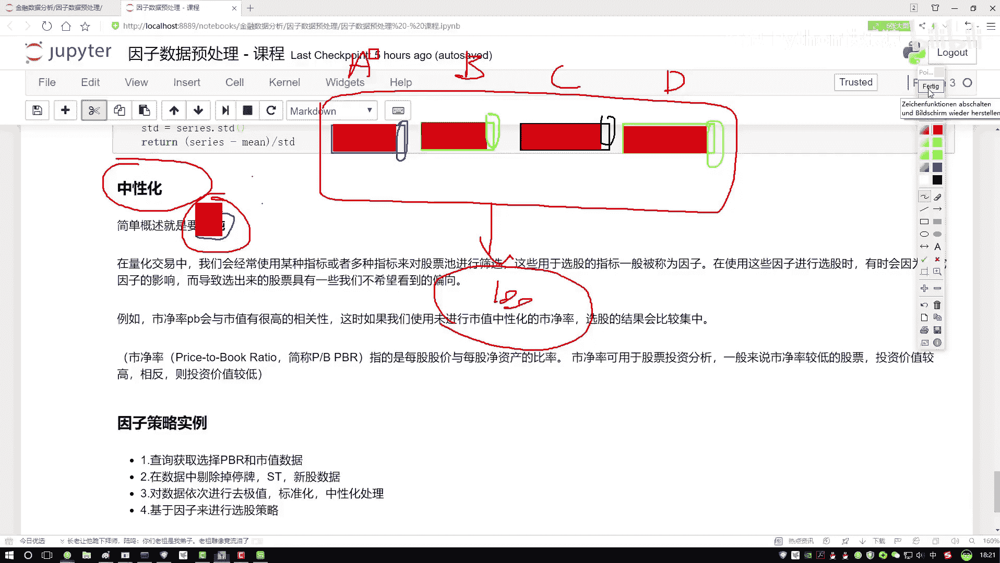

# P33：6-中性化处理方法通俗解释 - 人工智能博士 - BV1aP411z7sz

接下来咱们来看最后一个知识点叫做中性化，先给大家解释一下这个中性化它做了一件什么事，你看这点我首先对它做了一个概述，我说它的目的就是一个提纯，那什么叫做一个提纯呢，咱们先别看这些知识点。

我先给大家举个例子，比如说现在我说我想去设计有这么一个策略，然后我说在这个策略当中，比如这个策略当中我是有些因子，我说这个因子当中有第一个因子，然后还有这么第二个因子，然后我再画个黑色。

然后第三个因子再来一个黄色，就说我们现在有四个因子，然后好像说这样一件事，这四个因子都会对我的结果产生影响，然后我想去对比分析一下，比如说这里咱们就说了有一个ABCD，那么四个因子把线拿过来。

这是一个A因子，然后这是B因子，这是一个C因子，这是一个D因子，我说它们都会对结果产生影响，我说A因子小的时候，然后B因子大的时候，C因子这个D因子那个时候，对它们做一个筛选，然后好得到咱们哪些股票。

这个说白了，我们要在股票池当中选择一些股票，咱要去玩或者说去买一些股票，要通过一些指标来去观察，但可能有这样一件事，无论这个ABCD，我怎么去选怎么去设计，我得到股票总是那几个。

为什么会比如说现在我说我做一次选股，选股之后选了这些个里边，有这么100只股票，然后我想我然后我做了一些判断和分析，我怎么选，每次我说这个策略在变的时候，每天选的时候，可能都是这100个，大家可能会说。

咱们现在有ABCD，我们有4种因子，为什么咱总选到的都是些相同的，是不是说ABCD当中，可能有一些共同点，来我再画一画，可能这样一件事，我说在这个A当中，你别看它是个蓝色，蓝色比如说A表示一个。

那个市经率，好了，咱们说它是市经率，然后在这个A当中，可能绝大部分，都是跟市值有关的，我现在拿这个就是一个，就是一个实体的红色，表示是一个市值，那B这个特征，你看它虽然是另一个因子。

但是它可能绝大多数当中，也都是跟市值有关的，C当中也是一样，D当中也是一样，各位我们看就要有这样一件事，你给我选出来的4个因子，但是这4个因子当中，绝大多数的成分，都是一样的，那既然你说。

它们绝大多数成分都是一样的，那我怎么玩，那相当于都是一个事，没法得到一个多样性，或者说这4个因子，我没有把它自身的，或者说把它自身的一些数据，或者把它自身一些指标体现出来，因为什么，在它的内部当中。

绝大部分都是一样的，你看A因子跟市值关系特别大，B因子C因子D因子，都是跟市值关系特别大，那最终给我们的感觉好像就是，不管你用啥，那都是市值决定最后的一个结果，那好像有这样一件事，那什么叫中性化呢。

再来看这个我说这个意思，你看这里我说什么，叫提纯，那我问大家一件事，我把它正好给盖上了，条块笔这块咱们写了，要做一个提纯，你说在A因子当中，纯的是哪，哪块是它所特有的，或者说现在我说。

我想去找出来4个同学，4个同学当中，我去观察他们，你说我希望找的是，他们的一些共有的特性，还是他们的一些个性，我希望是个性，把个性表现出来，都有个东西，那有什么价值，你有我有他也有，都知道个事一个常识。

你说对结果有什么影响吗，没影响，所以此时我说在A当中，我要把他纯东西提出来，把他有价值的信息，B当中是不是也是一样，那C和D，是不是方法都是一样的，说白了，我们要做这样一件事，对于一些因子来说。

把他独特的部分提出来，把他有价值的部分提出来，这个叫做一个中性化，我先给大家，直白的解释一下，什么叫中性化，然后说完这个例子之后，咱们来看一看，说在量价交易当中，我们经常会使用一些指标，或者多个指标。

对股票池进行筛选，说白了，我经常会做一些清仓操作，然后我去买一些不同的股票，就是股票池，比如说固定10个，我今天买这几个，明天买那几个，我要做一些筛选，然后我们筛选过程当中，有些指标。

我们把这指标叫做因子了，所以说在我们使用这些因子，选股的过程当中，有时候，会因为什么，有时候会因为一些其他的影响，比如说刚才咱们四个因子，那都跟市值有关系，那是不是市值起绝大多数作用。

从而导致咱们选出股票，有一些可能，我们不想看到的一个倾向性，没准它都是一个，都没什么变化，是这样一件事，比如说，刚才咱们看了，我说市净率这个值跟市值，大家都知道，肯定有很高的一个相关性。

如果说咱们不用什么，不用中性化的结果，选股就会都比较集中了，因为这里边，绝大多数都跟市值相关的，没体验出来一些差异，就这样一件事，然后咱们说市净率，因为一会我们也是拿市净率，然后跟做策略，所以这块。

跟大家介绍一下，这个市净率它就是说，美股股价，美股股价它有一个价格，这咱知道吧，跟什么做一个比值，跟美股的一个净资产，做比值，什么叫净资产，就是它的一个总值，减去它的一个债务，这叫做一个净的，是不是。

然后市净率它有个特点，一般情况下，就是对于我们买股票来说，什么特点，当咱们在买股的过程当中，你说我们希望市净率大点好的，还是小点好的，理论上情况下，我们希望小点好的，因为小点的。

它的一个涨幅空间可能更大，它给我的一个，就是我付出风险，它给我的一个回报的，可能性会更高一点，将来来说就是值得投资，咱赚钱可能性，会更高一点，这个意思，现在大家就是概述了一下，中性化是一件什么事。

然后一会咱不在农作物当中，就写代码，因为这里边我们需要一些因子，比如说现在，我们得知道市净率，比如说我还想知道这个市值，你得最少把这两个东西拿出来，我才能去做中性化这个事，但是在我农作物当中。

没有这两个值，你必须在平台当中，用人API把数据，把指标调出来，所以说一会在平台当中，给大家进行演示，这里先这样。

我先给大家说我们计算方法。

一会在平台当中，我们拿一个策略，来给大家举例子。