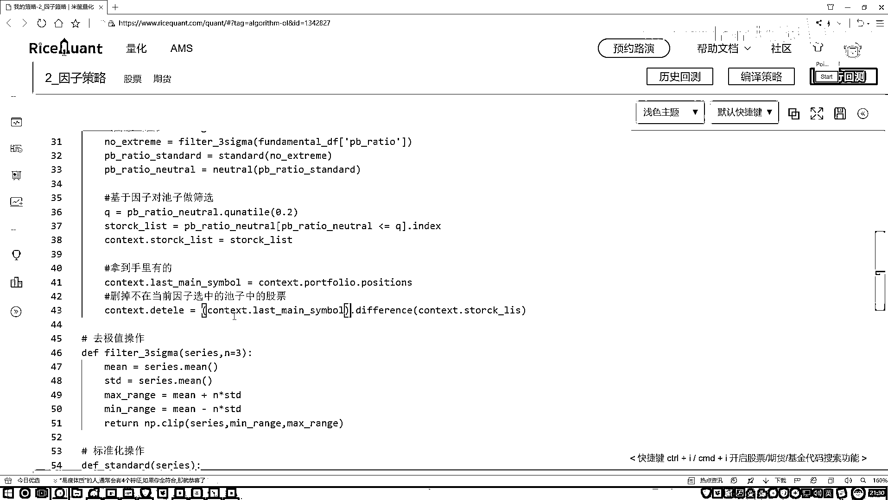

# P38：4-股票池筛选 - 人工智能博士 - BV1aP411z7sz

好了，那咱们现在就是这个中性化操作我们也写完了，那这里回头来看一下吧，现在我们是不是在这块就可以去执行咱们刚才写那几个操作了，好了，一个来执行吧，在这里，该写了，预处于操作。

预处于操作当中咱们一个来写第一个，第一个就是咱们去做一个3Sigma，3Sigma当中我们要传进来什么，对谁做呀，对我的设置做，还是对我因子做呀，对因子做吧，好了，把我们的因子拿到手。

这里边咱的一个结果还没有个返回值，我给它个返回值吧，在这块，我说咱们现在得到一个返回值，把它复制过来，把它复制过来，Fundamental，Fundamental当中它指定一个名字吧。

Fundamental，然后做DateFrame就行了，然后在这个DateFrame当中就有我们需要的，我们想要的这个指标了，好了，把它拿过来，Fundamental，然后对其中谁操作呀。

是不是咱们之前写好的，我们当前的一个失竞这个东西，好了，把它传进来，然后这样咱们做的第一步就是我的一个去，我们的一个离群值，去完离群值之后，然后咱们写一下吧，就是现在，现在我这个指标就是没有什么。

没有我的一个集值了，咱们现在做了一个没有集值的，虽然没有集值之后还没完，我们还得再做什么，是不是说再做下一个操作，做一个标准化的一个操作呀，好了，把咱们当前这个结果传进去，下面我做了一个标准化的操作。

相当于，相当于一个标准化操作，就是这东西吧，直接把它拿过来，然后再点上一个Standard，Standard等于我当前的结果行了，这是我做了一个标准化的一个操作，做完咱们这个标准化操作之后。

接下来还有什么，还有一个中性化操作吧，好了再给它复制过来，再复制过来之后，我说他就叫这个名了，得了，他就叫做预处理完之后，然后杠这个东西，然后等于咱的这个结果，好了，等于我们这个结果。

然后把上面这个值再传进来，是不是可以了，那现在我们就完成了，咱们所需要的所有的预处理操作了，那接下来呢，接下来是不是说我现在啊，哎呦我要对这个因子做一些筛选了，好了，咱们来指定一下，对因子啊。

不是对因子，基于因子啊，对池子，对咱们的股票池子做一个筛选，或者做一个调仓，做筛选吧，做一个筛选操作，筛选操作，咱们想一想怎么去做啊，是不是这里，哎，你得给我指定一个指标啊，比如说我是个Q，Q当中呢。

你说是小于这个因子，是小点好，还是大点好啊，咱们之前不是说小点好吗，所以说我对当然这个指标，我看一下吧，他的呃，比如说从小到大啊，就是百分之二十的时候，他是得多少。

就是我们希望选出来前百分之二十最小的可以吧，好，这里我们来指定一下，切一下吧，咱们来选多少个，那我就选这么呃0。2个吧，现在选了百分之二十，然后呢，这里这是我做了一个因子的策略，然后接来接来。

是不是说我要去选股了，那好了，现在我们要选股，在这个选股过程当中，我消费怎么样，我们看一下当前，当前我得到这个结果，这个是我的一个因子，对我的因子当中我要做一个，所有的股票当中啊，都有这个因子是吧。

那所以说我现在可以做判断吧，做一个筛选吧，在这里，哎，我说现在啊，如果说啊，他的一些值啊，如果说他的指标怎么样，没有满足我的要求，没有满足什么，咱该不是说了吗，我们自己指定一个范围，通常啊。

就是我们这个市净率啊，我希望他不是小一点的时候，能怎么样，能使得咱这一个收益，或者说我们那个期望收益吧，可能会更大一点吧，所以这里哎，咱们说小于等于一个0，小于等于一个百分之二十，那个值啊，是不是行了。

我们现在先来选小一点的那一些，然后呢，我需要把这些股票找到手，点击一下，这是不是，而这个东西判断是据值去判断的，据值判断完之后，咱们现在相当于传进来，所以我得到了什么，所有的股票吧，好了。

那这这这这什么股票，这是不是说我这是我现在想要的，这个股票判断完的，我想要的这批股票，好了，我们拿到这个股票，一会儿咱要对这个股票做一些做一些交易，操作，我们先把它传到这个contest当中。

contest当中，stock list等于一下，我当前的一个结果，这块不改了，直接把它传过来就行，好了，这是我们现在有了一个stock list，然后接下来呢，就是我们要干什么，我们要执行一些调仓。

还有买进买出的一些操作了，在这里就是我们要做买进买出，那你是不是说你得知道，买什么，或者说你把哪些要删除出去，然后剩下的是在股票池当中去选，首先我们得看一看，一会儿有哪些不在这个池子，好，我得写一下。

删掉，删掉不在当前，当前那个因子选中的池子中的股票，咱们要做一个删除，删除怎么写呢，来写一下，删除，我是不是说得把这些股票给它删一下，删完之后，我也知道你删了什么东西，好了，这是一个返回值。

返回值当中就包括了所有我要删的，那来想一想，哪些是我要去删的，那肯定是之前咱有的，并且给我当前池子是不一样的，这个是我当前的我的一个池子，好了，我把它复制过来，这是我当前的一个池子，我先给它括号括起来。

我们要看的肯定就是，现在手里我的股票，跟我们当前池子，不一样的，我得有一个different操作，different操作，好了，这是对谁，是不是说现在我手里有的这些，好了，我们先拿到手里有的。

这块咱们还再写一下，就是拿到手里有的，拿到手里有的咱们也指定一下，在context当中，把不用复制上面的，咱这也有，在context当中，我们要找谁，是不是找我们现在我的一些账户的，一些信息。

在账户信息当中，我要看什么，我池有什么东西，position，没有，这是position，找一下，看一下，在我池有这是一个，IO是吧，没什么问题，他怎么没有这个东西，position，咱试一下。

一会看一看，这个API有没有问题，有问题还改，我记住了，它是一个position，好了，这是我现在手里有的，咱先拿到手，然后，指定个名字，这个就是我的一个context，第二，咱们最后一次手里有的。

咱指定一下，我们最后一次手里有的，这些个股票，就叫做股票得了，好了，然后我是不是用现在手里有这个东西，跟我当前池子的，跟我当前池子的，做一个判断，判断完之后，difference什么意思，就是说。

当前你手里有这些股票，不在你池子里边的，这是difference，咱把这些股票给他拿到手，是这个意思，然后我把前面，记得给他复制一下，好了，这完事了。

这个就是咱们当前完成了一件事。

好了，那点set一下。