# P3：2-时间序列分析 - 人工智能博士 - BV1aP411z7sz

首先呢，咱们先看第一步，第一步干什么，第一步去读取我的一个数据，在这里呢，就是我们选择一个股票，这里选股票是一个微软的一个股票，我们可以拿到他就是他的股票的一个，到今天为止。

他的一个历史情况是等于什么的，然后这块呢，我们先来看一下，点hide一下，看一下我当前的数据啊，他长什么样子，这块呢，他有个data，就是他的一个时间，然后呢，我们一会关心呢，我们一会要预测的就是这个。

就是他的一个收盘的一个价格，就是我们要关注的是他的一个价格，就是你看这些东西还是很多的，我们观察到最后的就是他的一个价格，然后呢，这个ds就是我们一会要的，这个y也是我们一会要用的。

这就是我们当前的几个指标，这几个指标，我们现在来执行一下，我先把这个东西重新导入，重新执行一下来看一下，哦，在这里，这块第一次执行的时候可能会稍慢一些，因为在第一次执行的时候，他会去先去导这些库。

然后你观察就是这个这行代码，他有没有报错，这行代码若是报错了，那你就是这三个库，他肯定是估计你是没有装好，你需要把这个三个库装好之后，我们才能去得到下面的结果的，然后这块我们就想出来当前的结果了吧。

那接下来呢，咱们来看一下吧，我的一个数据他是怎么读进来的，在这里呢，我们还是debug去做，哎，在哪去了，哦，在这里，我就是把这个Nordbook当中的代码，直接的给它复制过来了，然后呢。

在这里咱们就是先debug吧，你看在这打个断点啊，一步一步跟大家说一下，这块呢，你打一个MSFT啊，它是一个微软的股票，然后一会呢，咱们预测时候再看一下亚马逊的股票。

这些股票都是你可以通过自己的名字来进行一个指定的，你想看什么股票，咱们就看什么股票，这里要推荐大家就是当我们拿到一份代码，你不熟悉的时候怎么办，你不熟悉的时候，你去看这样一个类，比如说F5跳进去。

你去看这样一个类啊，你就是瞪着眼睛看，这东西啊，看看你就乱了，看看你就混了，这东西看起来太麻烦了，我建议大家怎么办啊，你就不如啊，把这个东西跑通了，然后debug一遍，debug看一遍。

这东西做一件什么事啊，它就一目了然了，首先呢，来看吧，一开始传什么，传的是咱们这个MSFT吧，这是我一个股票名字，然后呢，把它变成一个Upper，变成大写，然后呢，这里就是去读这个数据，这个呢。

就是咱们刚才的那个，那什么，刚才咱们指定的，安装读数据的那个工具包吧，去get一下咱们的数据，这块呢，可能之前说稍微得等那么一小会儿，你看我现在按了一个F6，他在读的时候，可能得稍微等一会儿，然后呢。

他就会帮我把这个股票数据给他返回来了，你看股票数据先要读完了，你看这个是我读进来数据啊，它是从这个1986年3月13号开始，然后后面有一些指标，咱这个里就是关于具体的一个股票，咱就不分析了。

咱们给大家讲的还是这个时间序列，这个东西该怎么去做，至于这个股票啊，什么涨了跌了，他这个开盘价收盘价是多少，这些我最最下对咱们来说是无所谓的，也不用管，反正一个明显趋势啊，一会儿咱会看吧。

一会儿看整体的一个趋势，看一下这个股票，然后呢，第一步啊，我把这个股票进行reset一下，特定index值，这是我当前的一个股票，然后呢，股票当中啊，我把它的一个YS，这个YS啊，就是我需要指定。

你看咱之前啊，就是说的这个时候。

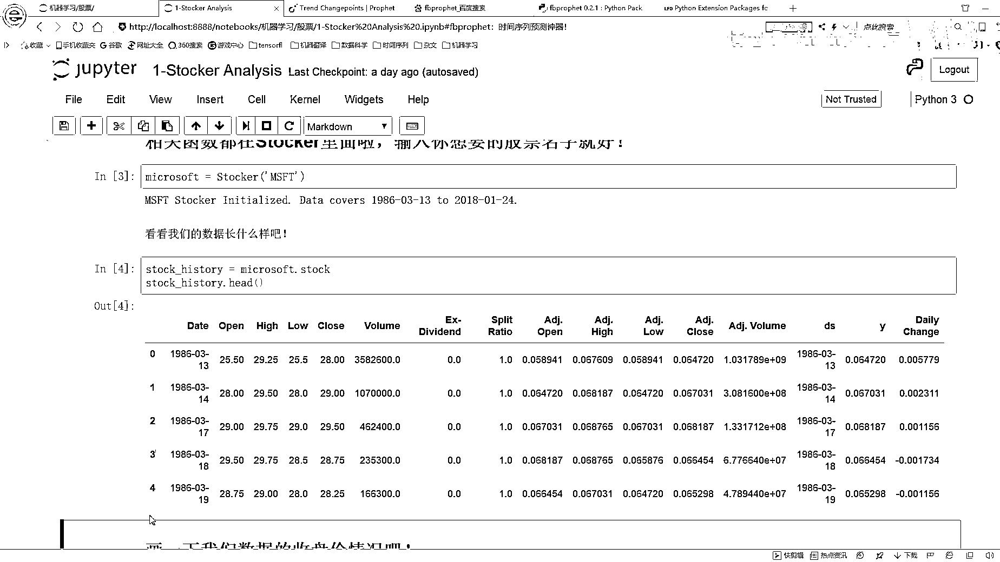

我哪去了，这里呢，他在介绍的时候怎么说的，他说你这里。

这个这个quiz start，你看这个国外网站就这点不好。

他这里啊，经常会经常啊，会有这样的一个问题，就是他会给你找不到。

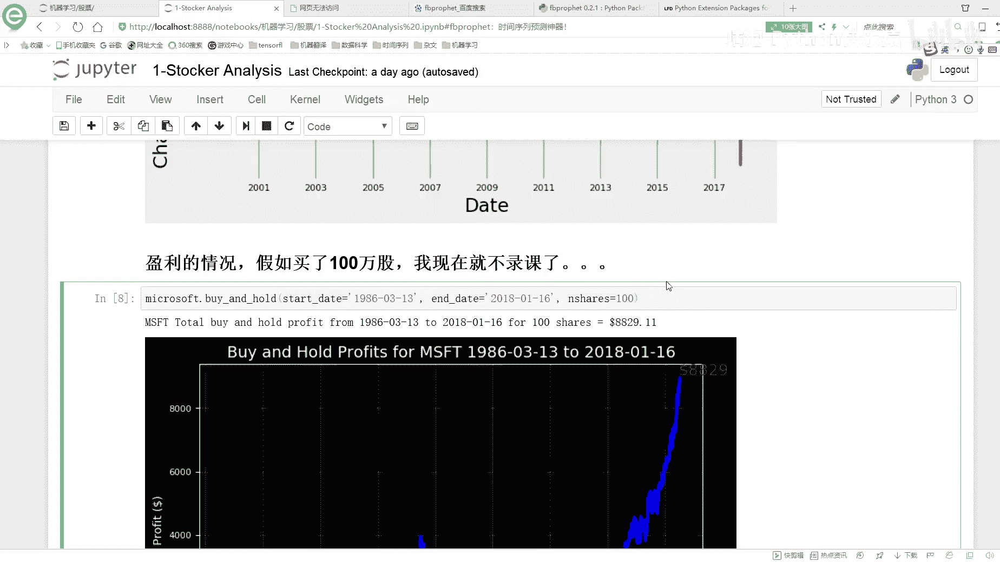

就是有时候刷不出来，咱不看了，刷不出来不看了，我懒得翻墙了，然后这里呢，就是我们先把一个DS做出来，我们需要指定，DS就是我的一个时间，我指定上一个data，data里边呢。

本身就是一个转弯好的时间格式，然后这个Y就是我们要预测的一个指标，这点咱们先把这些指标都拿到手，然后呢，还有什么，这个daily change，就是我的一个收盘的价格，和咱们的一个开盘价格。

它的一个差异，这就是一个change的一个指标，然后呢，接下来就是我们需要指定我们的一个起始时间和一个终止时间，这里呢，因为这个data数据啊，你看，它本身就是一个时间类型的数据吧。

你看它本身就是时间类型数据，所以说，对时间类型数据啊，我们直接用一个命值，就能求出来它最小的时间，你看最小时间是1986年3月13号，那最大时间呢，咱直接用max就能求出来，这就是一个标准的时间格式啊。

这个比较好的一点，是咱们直接用一个命一个max，就可以把台指标求出来了，然后最大时间啊，因为就是这个股票啊，是到现在为止，按照咱们今天的时间点，1月24号吧，然后我们当前最新的一个数据。

它就是1月24号，反正等大家预期的时候，不一定你们有哪天了，咱们就是拿你那天数据拿就可以了，可能啊，就是你拿到的一个结果指标，跟我肯定是不一样的，因为你肯定是在我之后来看这个课程的。

那看这个课程的同时啊，就是你是哪天，那你就看到这天就可以了，然后呢，在这里啊，我们拿这个拿一些价格，这个max price啊，还有这个min price啊，这些啊我们是都可以给他拿出来的，然后呢。

这个最低价格的时间，最低价格时间我可以拿手吧，最高价格时间也可以拿手，你把这个时间啊，进去进行一个判断，然后找这个时间就可以了，所以说呢，现在啊，就是当我们拿到股票数据之后。

我可以把它所有的一个股票信息啊，都可以拿得出来，然后这是你看起始的一个价格，这块也写了起始的一个价格，然后呢，最近的一个价格，最近的价格也不就是今天的一个价格吗，然后这块就是一会呢。

一会儿用到时候咱们再说这个东西，这个就是我训练的时候，我要指定一个年限，这个咱们现在用不到，先不说这个东西，然后下面，下面这个东西啊，就是我一会儿要去看一下，咱当前啊，要不要去统计一下，按照一个天。

按照一个月，按照一个年去看一下，他的一个那个什么，他的那个就是随着天的变化，随着年的变化，随着咱们的一个就是月份，他的一个变化，这些啊，咱们下面看，等咱们看到时候再说，最后呢。

是一个Change Points，这个不是Change Points，我说这个Change Points说的太多了，这是什么Change Points，就是我们的一个突变点，突变点等咱们会飘餐时候。

咱们再来详细说这个东西，所以说在现在数据已经有了，数据就已经打印出来了，当前那个数据从1986年3月13到这个呃，2018年1月24，这是我当前的一个指标，然后呢，把数据拿到手。

这个不就是我现在的数据吗，你看他是一个DataFrame格式，然后他有这么多个指标，这都是我的一个数据量，然后print一下，主要print一下他的Head值，这个咱们不看了，然后呢。

接下来咱们在这里接着回去，这块呢，我们就是先把我的数据拿到手了吧，先把数据拿到手之后，接下来就是我们可以一般情况下，拿到一个时间序列之后啊，我先都是画一下这个时间序列啊，它是长什么样子，下面呢。

就是这个微软的股票，微软这个股票从这个86年开始到这个18年初啊，他这个趋势啊，就是哎呀一路飙横是吧，然后中间啊，就是这块我就是因为我我没炒过，但我听说就是当年有一个就是两千年九几年。

九九八二还九九还有两千年时候，就什么股灾是不是啊，我对这个事情不太清楚啊，因为我自己从来没炒过股啊，我只是把这个东西拿过来当做一个时间序列啊，估计大家能感兴趣一些，所以说就选了一个股票数据集啊。

那你这里就是你看他有些下降的趋势，还有些上升的吧，但是整体的趋势啊，还是都是往上去走的这样的一个情况，然后呢，在这里去plot一下他这个stock，就是我去画了一下，但这个图他会帮我打印出来，当前啊。

就是最高价最低价，然后还有当前当前今天这个价格，今天价格应该是历史最高点，因为现在他是持续上升的，然后呢，再往下走，这块就是去画这个图嘛，F5进去，咱看这个图咋画的，这个图画的很简单啊。

就是如果说你没有指定一个起始日期和一个终止日期，你看我这里参数传能传什么，参数啊，可以传进来很多啊，就是你可以告诉我当前那个图，你想从哪天画，然后画到哪天，你要想这么指定。

你就传一个start date，还有这样一个end date，这样呢，他就会按照你指定的这两个日期啊，把这个区间上的信息画出来，那不在区间上信息啊，他就不会去画的，然后这个呢，就指定的是你想画哪个指标。

如果说你画一个指标，在这里有写一个，你看我这画了一个close，他这个价格，如果说你想指定多指标，那你写个逗号，然后指定多指标就可以了，然后这个pro type，就是咱们先看这个basic。

就是一个基本的一个画图方法，然后呢，咱们来看吧，在这里就是指定起始日期，我看下起始日期啊，他是没有指定，你看这里默认都是个乱指啊，默认乱指就是拿我最小的日期，默认你看end date也是乱指。

那就是默认拿他的最大的日期，分别是2018年1月24和这个1986年3月13，然后呢，首先就是我去make一下DateFrame，然后把我这个日期传进去，咱们来看，这里啊，其实上他就做了这样一件事啊。

因为我们现在是可以指定日期的，他就要在这个日期当中进行一个选择，你看这里，他会在我日期当中进行一个选择，选择出来说什么呢，选择出来一个start date，这是我的一个日期。

把它转成一个pandas的datetime格式，pandas的datetime格式，然后照样给拿出来，然后拿出来之后呢，然后我们就在这里进行一个指定，指定完之后啊，我们就是去取数据，我看到哪去取数据了。

在这里就返回日期，我看一下在这里啊，他是返回了一个日期，然后返回日期之后呢，然后我看一下在这里，他是在哪去取数据的，还有地方跳啊，在这里他就取出去了是吧，在这里你看就是在我DateFrame当中啊。

我指定的一个Date他要干什么，他要大于等于起始时间，小于等于终止时间，这样呢就返回去了，这个就是我们怎么样去取数据，根据我的一个起始时间和终止时间，在数据当中啊，进行了一个切分。

只选你就是在这个时间片段之内的数据，指定Colors，Colors咱先指定多点，一会背部要画很多条线，反正咱们先指定出来，然后呢，在这里就是去，你看这块写了负循环哦，他这个负循环的意思啊。

就是看你要画几个指标，在这里就是只画了他的一个close指标，所以说这个负循环只会执行一次，但是当你往里传参的时候，这一块呢，你想去统计多指标，比如说我想看收盘价我也画，然后开盘价我也画。

那你传接两个指标，传接两个指标，他会分别的帮你去画这个事情的，就是负循环当中会画两个图，然后呢，把我当前的一个就是最小值啊，这是最小值，这是最大值拿出来，然后呢，拿完之后啊，这里就是我去找最大最小日期。

因为我这里我先打印了一下，最大日期最小日期，然后分别他的一个指标值在哪天，这些比较好统计吧，很简单就统计出来了最大值最小值，以及呢，他是在哪天，然后呢，他用来画这个图啊，跳这里了，画这个图啊，首先他去。

你自己指定一个style的方式啊，这个我按这种style方式去算啊，然后你愿用什么style方式，就是myplotly，你不可以自己进行设置吗，但是我觉得没必要，咱们用当前这个plot方式可以了。

然后呢，画图啊，就是你画什么，你把日期也传进去，这是我要画的日期吧，横轴，歪轴什么，歪轴就是在这里你取某一个指标嘛，当前咱取是close这个指标，然后颜色你选其中的一种颜色，这个什么颜色红色吧。

这个颜色红色，所以说话说颜色红色红色，然后呢，你的一个线条的一个宽度，你的一个label的一个指定，你的一个透明程度，这些呢，都指定好之后，咱们把啊，就是X轴叫什么，Y轴叫什么，主题叫什么。

整完之后这就完事了，接下来呢，咱们再画一个格子，因为看有格子之后啊，更清晰的，接下来做完这之后，然后我plot，哎，复兴完，完事了，收一下，收一下完之后呢，咱就把这个图啊，给它画了。

你看画完之后就这个图吧，这个就是咱们现在画出来的，我的一个股票的一个情况，它是长什么样子，这呢，咱们就画了当前的一个微软股票，从这个86年到这个18年，它的一个情况，然后这个不看了。

因为这个情况基本上就是一路飙红啊，这个东西很牛逼啊，现在刚这么高价格，然后再往下看吧，再往下看，比如说在这里我给大家举个例子，比如说你想看这个01年到这个18年，你就自己指定一个日期。

然后你想看哪个指标，你就是看哪个指标，一个指标，比如说它是一个delay change，一个指标是交易量，然后呢，在这里我们就都可以去按照这个指标，然后plot type，你可以按照一个百分比的格式。

这里它就是一个百分比的格式，然后呢，咱执行一下，看一下它的结果，这里呢，你看我就是把这两个都画出来了吧，蓝色代表什么，蓝色代表一个交易量，我这个我看这哪天啊，这是16年16年。

大概是个16年的一个中旬吧，一年或者上旬，然后这天不知道发生些什么事啊，这天那个交易量是突增啊，我也不知道那天发生了一件什么事，然后红色的就是他的一个股票，他这个浮动，他就是每天价格的一个浮动，蓝色呢。

就是他的一个交易量，这些就是你都可以通过指标画出来，其实让给大家准备的这个类啊，相当于什么，这个类里啊，也给大家封装好了很多个画图的函数，在这里呢，如果说你有一个时间序列任务。

跟咱们今天这个任务是差不多的，那你也可以啊，就是把这个任务把代码改一改，应用到你的时间序列当中啊，也是没问题的，我觉得这反时间序列来说画图呢，可能来说都是差不多的这个意思，然后呢，再来看这里啊。

这里就是我画的当前的这样一个图，在这里呢，我们可以先玩一个比较好玩的一个事啊。

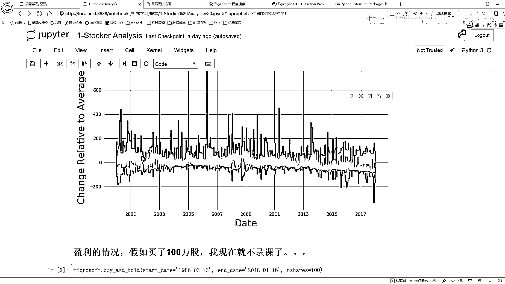

这里有这样一个函数啊，Buy and Hold，他的意思就是说，在这里，如果说你去买个股票，你有一个七十日期，你有一个中时期，然后去买这个股票，在这里呢，你可以填一个你买几百股。

然后他就会帮你算一下。

你会赚多少钱这么一个事，这里啊咱们来看吧，他会给你画出来这样一个引力情况啊。

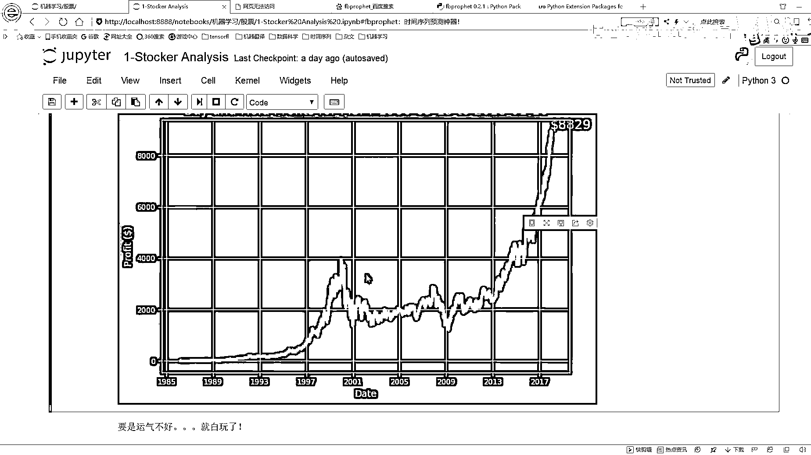

就是如果说你是这个86年买股票，然后呢，你现在在这个18年，然后11月16号他要现在去卖，假设说这样是这样一个情况。

你会赚多少钱。

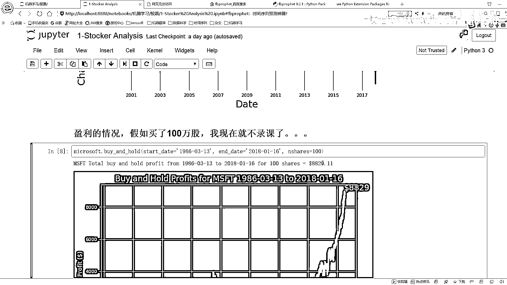

这里呢，他会算了一下，你会赚啊，大概八千多块钱吧，这个样子。

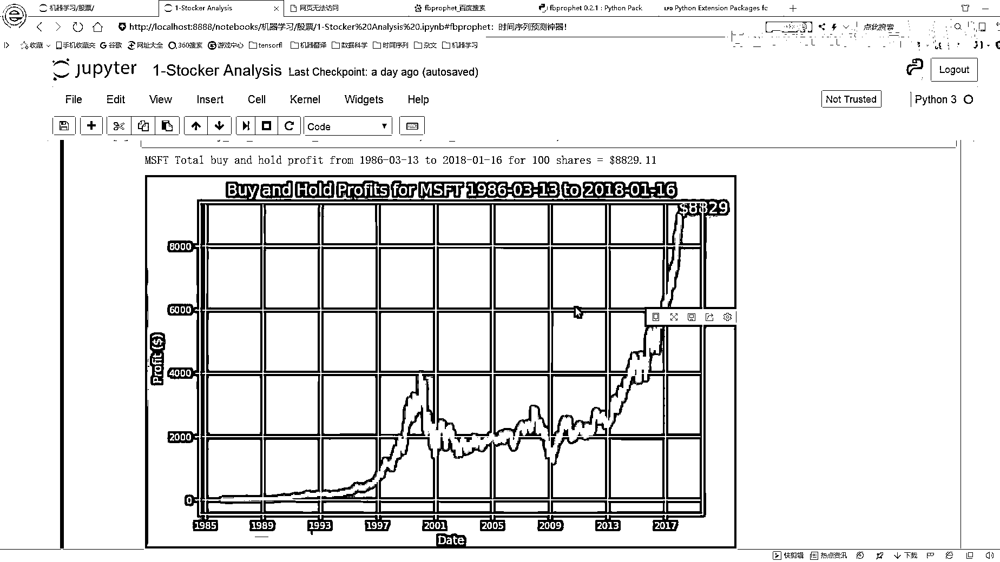

然后呢，这里就是那你想就是这里是买了一百股，那假如你要买了一百万股呢，那这个东西啊，前面在后面再加上一个万字是吧，那有有这些钱之后啊，基本上你啥也都不用干了，而且他什么还是一个dollar吧。

这个就是我们可以有这样一个函数啊。

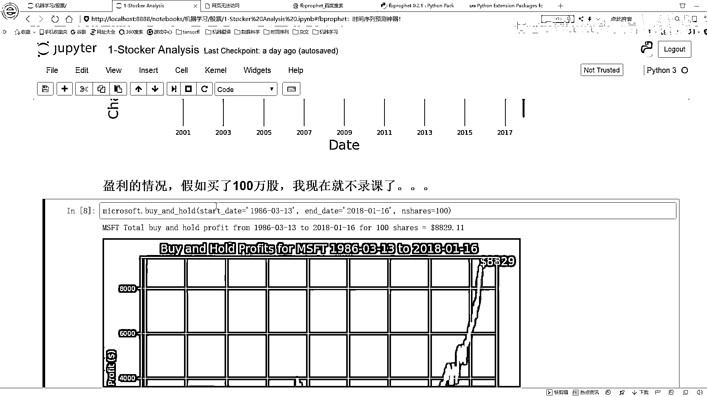

蛮好玩的，给大家往里进去看一下吧，简单说一下吧，这个Buy and Hold的就是去计算一下，当前你的一个收益，如果说是股票来说，你就可能买也能卖嘛，能卖能卖赚个差价这个意思。

那首先他会Reset Upload，就是把你之前设置的一个画图的方法，都还原到一个默认值，先把我的一个Star Data和我的一个End Data给拿到手。

Star Price还有End Price照样给拿到手吧，然后呢，咱们去Make一下Data Frame，这就是去把这些天的一个数据拿到手，然后呢，我的一个获利等于什么，我的获利啊，其实来说啊。

就是很简单的，就是等于我当前的一个，我当前的什么，等于我当前的一个就是收盘价，减去我的一个买入的一个价格，这事不就完事了，然后呢，有了这样的一个价格之后啊，然后可以算一下。

我所有的一个总的一个收益是等于多少的，然后呢，你有这些收益之后啊，你就把这个图画出来，这就完事了，这个就不给大家一个去演示了，这个比较简单啊，也是比较好玩的一件事，然后我就直接往下跳了。

直接跳到后面。

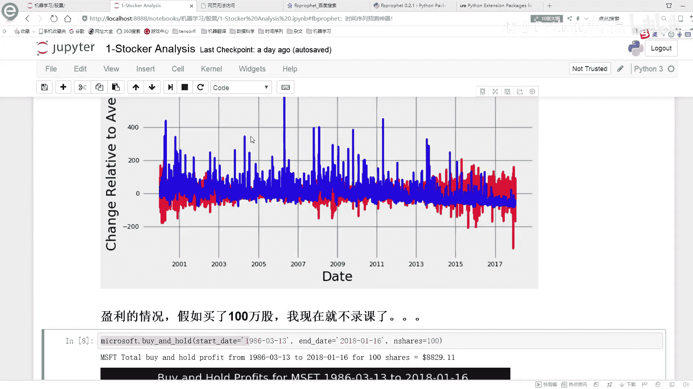

让你看把这个图关了吧，这个图跟咱这里是一样的。

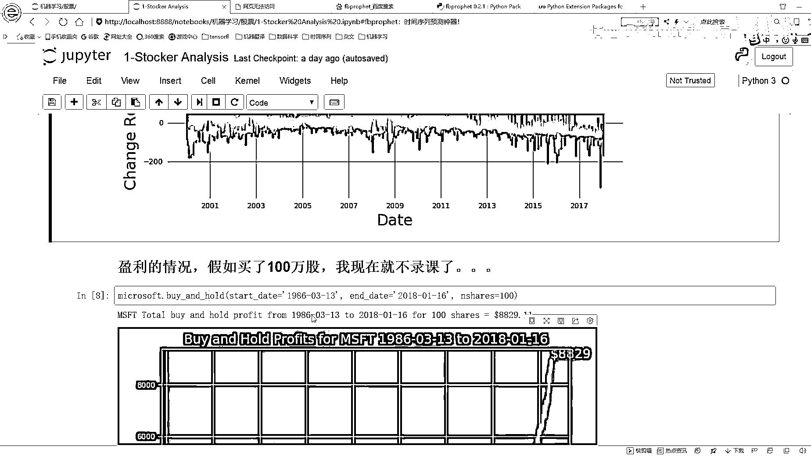

这里呢，就是我们可以指定日期，在指定日期的时候啊，假设说你是86年买的。

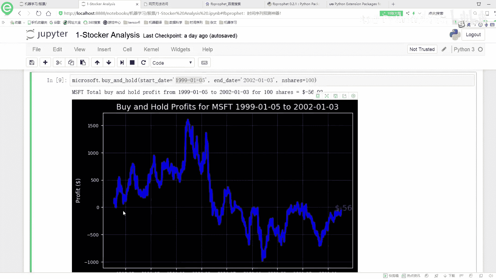

那你可能赚了，但是呢，你看就是在这里我看了一下，如果是你99年买的。

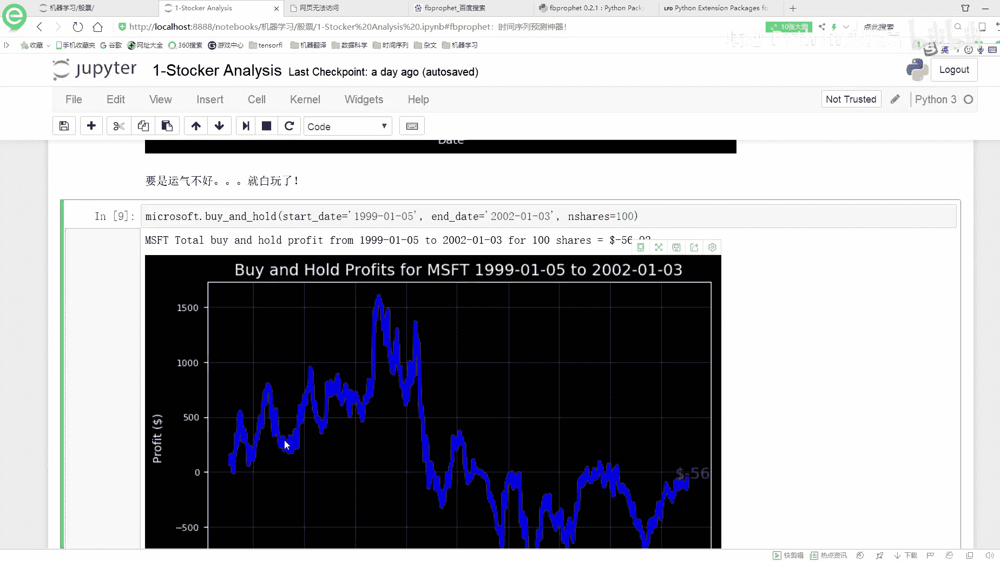

99年的时候你看什么样，55下跌是吧，那时候就在99年买的时候，他可能都跌破了一个发行。

就是那个时候就是比你买入的价格还要低，到这个一年时候，如果说你恰好99年买，然后12年，02年你就给他卖了，这个时候呢，你就得亏了是吧，你就是不像之前还能赚，这时候你就亏了。

比之前那个开盘价格还要低一些。

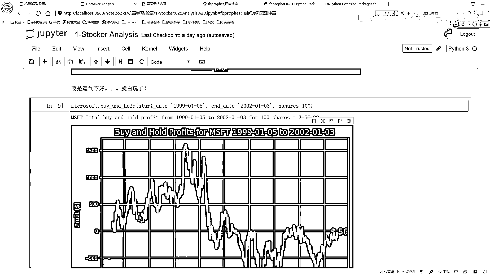

那你这些钱就当相当于白玩了吧，这就是我们可以看一下我们有一个买入价格。

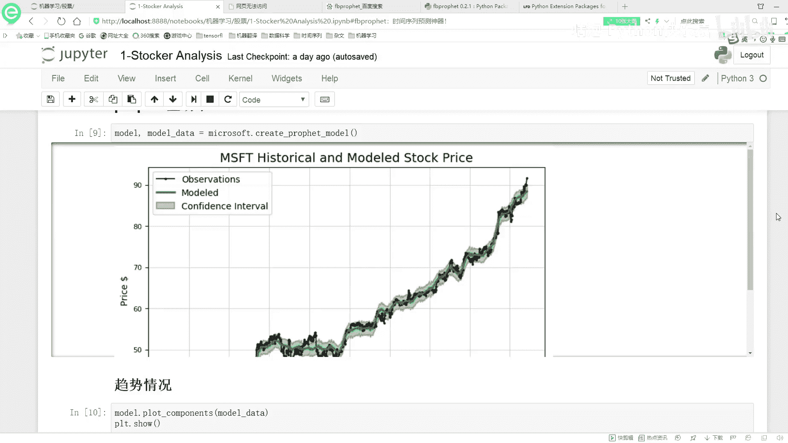

还有这样的一个就是就是start date，还有end date，我给自己来看一下当前我们的一个。

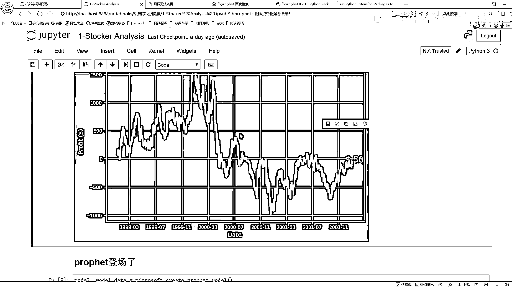

销售的一个情况，它是长什么样子，那接下来呢。

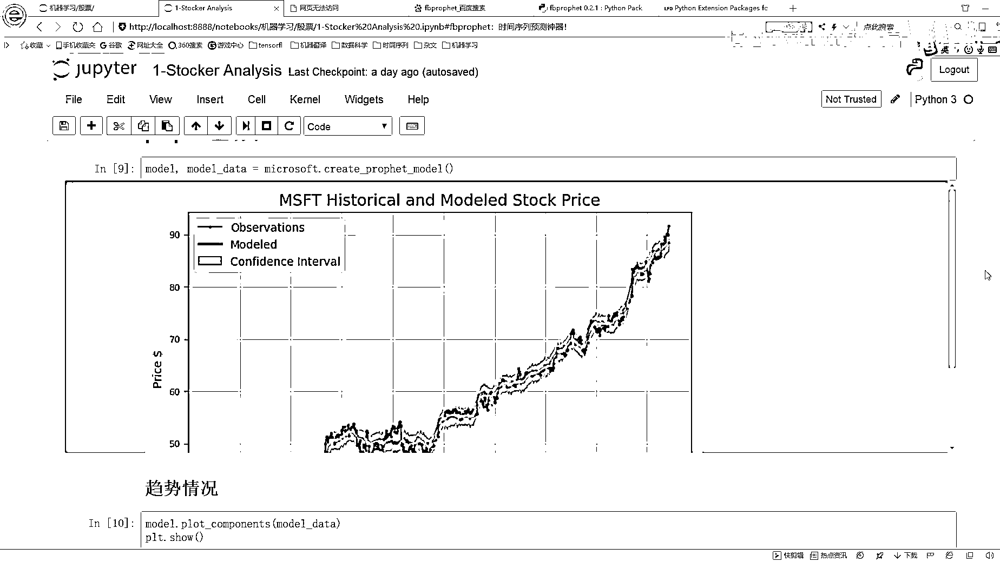

我们要来看的就是给大家简单看了一下我们的一个数据啊，下面我们就来给大家说一下Facebook。

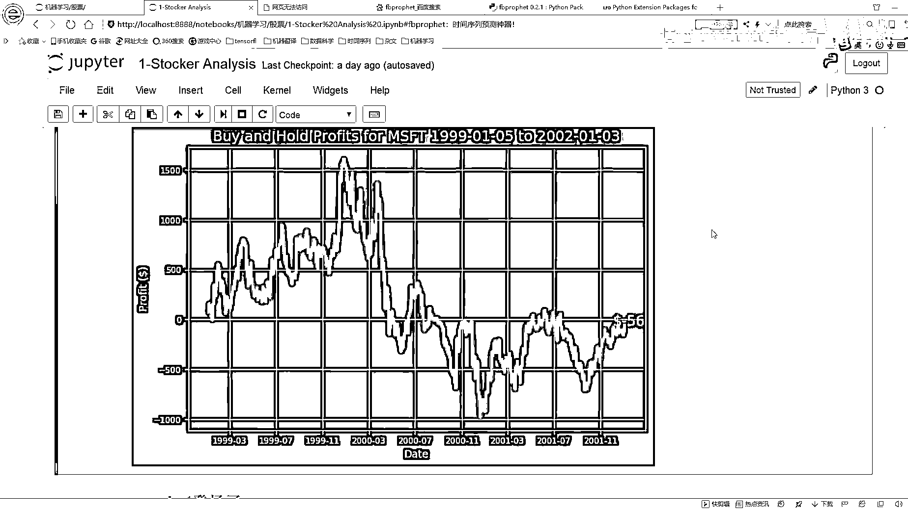

他的这个框架，我们该怎么去用了。