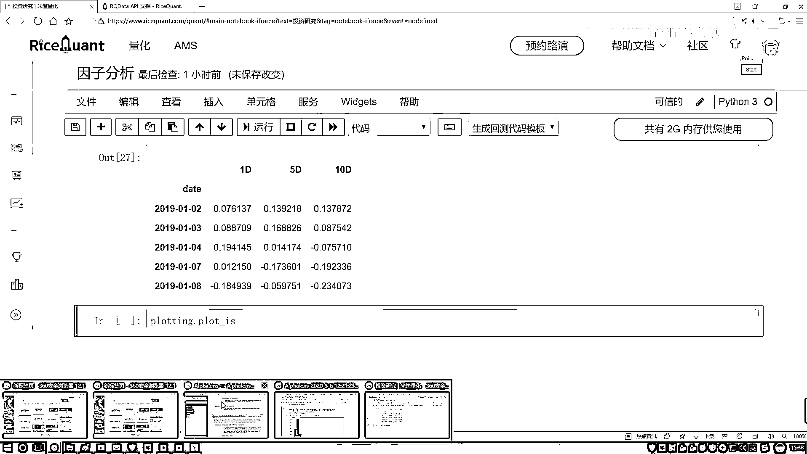
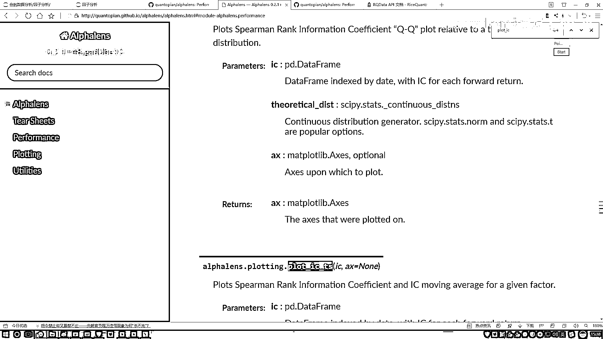
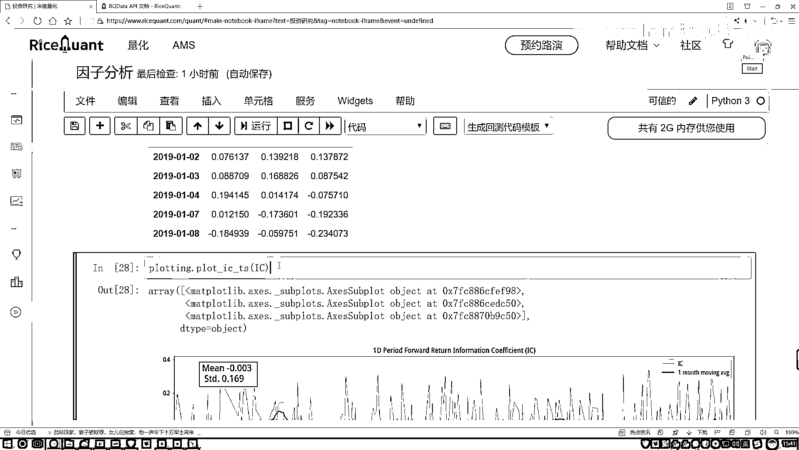
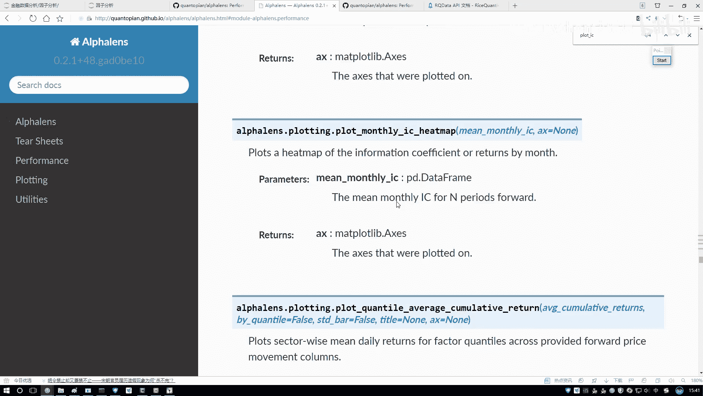
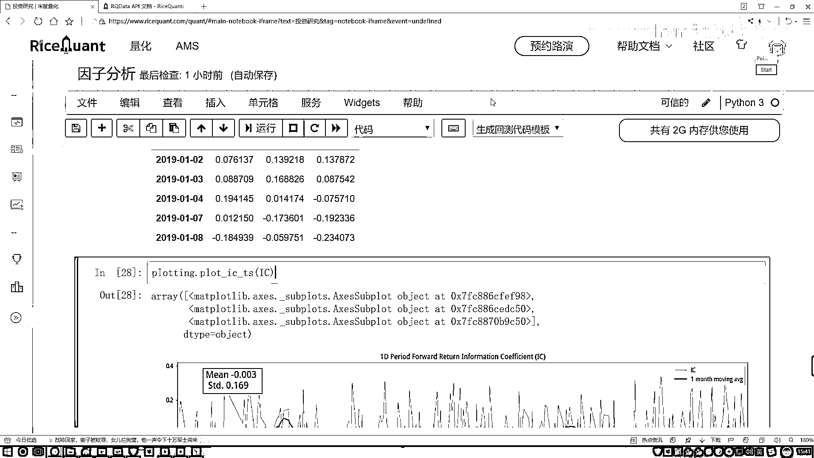

# P46：7-工具包绘图展示 - 人工智能博士 - BV1aP411z7sz

然后在这里啊就是我们只要关注一期就行，然后这是五期这是十期的，方法像我刚才说的在上面，我们是不是把这个相关系数算完了，那其实算完之后，哎你说你喜欢相关系数大的还是喜欢相关系数小的呀。

相对来说咱们喜欢大的吧，大的有研究的一个意思啊，你跟我相关啊，而且跟谁相关的，跟收益率相关吧，越跟收益率相关的可能是咱越想要的吧，但是有个问题，你看啊现在我们拿到这个因子了。

这个因子啊当前我们算这个IC值，是不是每天都不一样啊，那通过这个图啊，就是通过这个结果，可能看的是不是不是特别明显啊，我们能不能把这个图给它画出来啊，来看一下吧，这里我们还导进了一个工具啊。

叫plotting是吧，它呀是帮我们做展示的，咱把这个结果给大家画出来，plotting当中，点plot一下，点plot然后它是一颗IC，IC干什么来着，我记不太清了，咱来查一查，IC当中。

然后找一下。

plot不是IS是IC，不是是IC，刚一个时间序列，它是一个time series来找，哎，这呢，IC-时间序列是吧，其实刚才还看到一个API，这些啊就是大家你想看，都可以去展示一下，它不同的一个结果。

画直方图啊，画QR图啊，看看是不是Fn部啊都行，咱主要看这个时间序列吧，它就叫做一个IS。

我给它复制过来，咱来写一下，在这里啊，直接的去执行一下，那就行了，然后把这个IC给我传进去，来看一看，好了，默认把这个图就给你画出来了，这个图画出来之后啊，咱们来看一下吧，然后这个绿色一线啊。

我们没选参数，绿色线默认是以一个月做一个平均的，相当于你看前面没有，这正好是一个月吧，一个月计算个平均值，然后呢，这个蓝色的就是，咱们上面画出来的这个实际的IC值，然后它的一个走势的情况，然后这里就是。

然后它不光画了IC值走势，它还画了这样一个值，有什么，有一个均值比上一个STD是吧，这有一个你的当前啊，就是整体的平均值，整体的一个变数差是得多少，这块它也帮你统计了，然后通过这个绿色线。

咱们来观察一下吧，咱只看这个绿色线行了，因为这个蓝色线，它这个浮动范围太大了，看不出来，所以然咱主要是观察这个绿色线，绿色线你看怎么样，有些时候感觉还有点意思是吧，但是绝大多数情况下怎么样，太平稳了。

可能这个跟我们最终结果怎么样，不是特别相关吧，因为通过当前走势来看，没有说下那个趋势，我希望什么趋势，那越当然是这个值，肯定是越大越好了，现在这个值看起来是不是小了，而且一算这个平均怎么样。

是不是也比较小的一个值啊，有这样一件事，然后还有个指标叫那个信息比率，我先给大家说一说吧，有个值叫那个信息比率，信息比率是这样啊，就是它是用这个均值，比上这个STD，信息比率是描述什么。

它是描述就是你当前，你当前算的这个相关性质结果吧，稳不稳定的意思，稳不稳定，那比值越大代表什么，比值越大代表你当前STD值，肯定越小越稳定，然后你的一个比值越小，就是你的min比上这个STD值。

STD如果说越小了肯定越稳定，它是标准差，所以说信息比率，描述的是一个稳定的程度，就用这个min比STD，不是特别重要，大家简单的就行，这个是给大家看了，就是一个在一个周期的，然后右边下面。

它还有这么5个周期的，是还有10个周期的，都是有这样一些的结果，给大家简单的来画个图，来观察一下，然后大家如果说你想去看，那刚才说给大家看了，API文档当中，是不是还有些QQ图，还有其他指标。

这些不给大家详细去看了，等到后续，就是大家用的过程当中。

真要去详细的分析这个因子策略，这里边就是基本上，能给你展示的东西，就全给你去展示了，这些有好多函数，不给大家一个做实验了。

还能画这些恶作剧图，用不同颜色表示，还挺有意思，这个到时候大家自己来玩。

