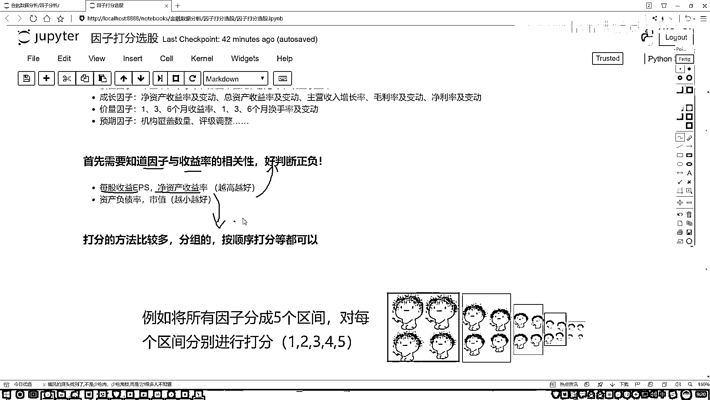

# P48：1-打分法选股策略概述 - 人工智能博士 - BV1aP411z7sz

这节课咱们来说一下，就是在我们玄古文中当中，经常会用到一个策略，叫做因子打分玄古，先从这个名当中给大家解释一下，我们都要对因子做一件什么事，之前我们已经说了好多次因子，估计大家都比较熟悉了。

有些大的因子，像是估值的，成长的，价量的，预期的，然后在每个大的因子当中，还有一些具有指标，比如说咱们接二落的，适应率，还有一个适应值，还有一些其他指标，这一些咱们之前对大家举例说过。

我们之前讲的过程当中，是不是说这样一件事，有一个股票当中有哪个因子，然后我可以通过一些方法，比如说算一些IC值，或者一些其他的指标，来判断一下，当前这个因子，它是好还是不好，给我们的感觉好像是。

你说好还不好，就是说一个股票还是不好，直接是由某一个因子所决定的，之前我们讲一过程当中，好像有点单一了，每一个因子算一个IC值，这种方法好像是只看一个因子，去选择一个股票，今天咱们把这个策略。

再给它放大一点，再做一综合的，像是这样一件事，比如说给大家画一下我们数据，我数据当中有些股票，比如说有123一至第二点，咱们说300个股票，然后300个股票当中，我们现在有的，不仅仅是一个指标了。

我说现在有A B C D，我有4个因子指标行吧，好了，我说咱们要做这样一件事，在这300个股票当中，我说咱不全用，我们要做一些调参考操作，每个月做一次，这300个当中，我说你给我选出来10个。

或者20个，是不是都行，我问大家，这10个我们该怎么选，大家肯定会想，哪个能让我赚的更多，我选哪一个，怎么去衡量呢，我们是不是说，现在有这么4个因子，A B C D，我们得看一看。

A B C D这4个因子，分别对我们最终的一个收益情况，做出什么样的影响，我观察一下，比如说A因子当中，我选什么样的A因子，能使得我收益率最高，A B因子 C因子 D因子，是不是一样的。

但是给我们感觉好像这样，你单独看A单独看B单独看C和D，好像只是一个方面，我们现在还没有说什么，一个汇总的一个总体，所以说这里我说我再加一列，最后一列表示的是我一个总体，我就选个总得了。

好比说这样一件事，我说A B C D，我不说你这是好还不好了，说好还不好，有点太笼统了，我说这样，你给我具体打上一个分，比如说对于D股票来说，A因子打10分，B因子打15分，C D因子分别有分。

好比说这样一件事，你说你最终的一个考试成绩，是由你各科的成绩的一个总分，来决定的行吧，A表示语文，B表示数学，C表示天文，D表示地理行吧，但在最后算出来一个总分，我们把这个总分，我说我给它排个名。

300股票总分，我一旦都算出来之后，我说排名，排名完之后，我说我取个前10，那是不是就行了，前10就是整体成绩，我认为最好的，下一次调仓，我就可这10个来，这个是不是一种策略，这个就是我们现在所说。

因子打分全股，咱们大概要做的一件事，其实就是我们需要，把最终的一个总分，给它求出来就行了，这个是我们最终目标，一会咱们会到这个片段中，给大家演示，咱们怎么样去求总分的，然后这里咱们还得有一些条件。

就是当我们在做打分的过程当中，我们得有一些已知条件，或者说得有一些先知是吧，首先第一个，我们得需要一个指标，就是因子和咱们这个收益率，我们的一个相关性，或者说他们之间，是一个正的，还是一个负的。

什么叫做一个正和负，咱之前给大家讲，因子分析的时候，是不是说了，有些因子越大的时候，你的一个收益情况可能越好，有些因子你越小的时候，你的收益情况可能越好，我为什么事先要知道一个越大，还一个越小。

因为我们一会要打分，打分的过程当中，我们是不是说，要基于因子的一个数值，看它数值的大小，可能是数值越大的，我也打分越高，还是数值越小的，我给它打分越高，既然我们要打分，所以说你的一个评判标准。

你得先告诉我，大家可能会问，这个指标，比如现在这里，我随便列出几个指标，比如说每股的一个收益，还有一个净资产的一个收益，对于这两个指标来说，我怎么大家可能听着这个名字，一听就越大越好，我怎么知道呢。

你可以通过一些研究报告，可能各个证券公司，它都有，就海了去了，各种研究报告里边，我们都有一些经验值，或者说都有一些经验值，可以做参考，另一方面，咱们在讲因子分析的时候，我们是不是自己也能动手去计算一下。

到底是，我们的一个正的，还是一个负的相关性，所以说首先第一步，我们得有一个先见知识，你也知道当前你选因子，那是大了好，还是小了好，咱们就当做它是一个已知条件了，一会咱们在实际的平安青平台，写策略当中。

我们也会选择出来几个因子，选出来因子，其实都是我们已经事先知道的，比如这里我们说，选了两组，一组是越高越好的，一组是越小越好的，这个是我们的一个已知条件，也是咱们所必须需要去预先知道的。

一个先知上。

好了，这个是我们的一个已知条件。