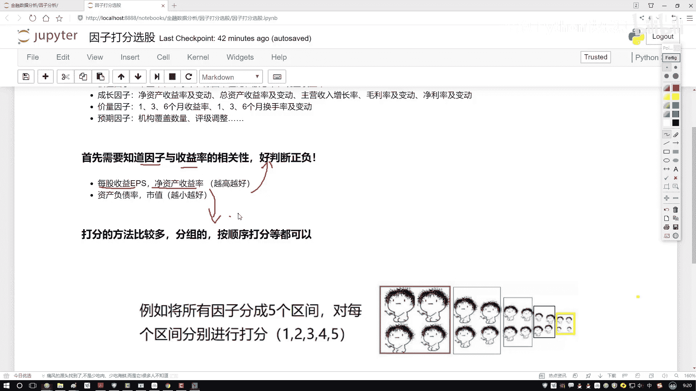

# P49：2-整体任务流程梳理 - 人工智能博士 - BV1aP411z7sz

那有了这个已知条件之后啊，将来我该怎么做啊，那是不是我们就要去打分了，那好了，给大家来说一下吧，咱们打分该怎么去打啊，这里啊能打分的方法，嗯，其实来说还是蛮多的啊，咱们举几个例子，来先看第一个例子。

我说这样，我先把这个数据给大家画一下吧，咱用拿这个数据举例子，呃，我说这样吧，咱们就有几页数据，有一些样本数据，样本数据当中啊，咱有这个，我说有这个IDE啊，第一个第一个股票行吧，然后呢。

我说还有这个ID2第二只，然后我多写几个ID3，然后假设吧，咱们就浑身三载当传，我一直到这个ID300啊，咱们300股票，然后呢，咱有几个指标，我说咱们就把这几个该说下来了，我说这个是个A啊。

这是越大越好，B也是越大越好，然后C和D啊，就是这个负债率，还有一个市值越小越好，然后呢，这里有这个个额成绩A，B，C，还有这样一个D，行了，那我说这样一件事，我先把这些指标拿手了，并且我也知道，哎。

他们的一个大小是好还是不好，然后呢，比如说咱们现在有些值吧，额是不是说每个股票，我ABCD四个值都能拿出来啊，那我随便写啊，现在随便给大家举个例子，额我就拿这个红色来写吧，比如说他的一个值。

额IDE这个他是个0。71，然后这个是个0。28，然后这个是个0。39，我就当做官规规划的结果吧，这是0。11，然后呢再写ID2得了，这是一个0。45，这是0。17，这是0。81，然后这是一个0。

02吧，好了，随便每个股票都有指标值，再一个是在咱们那个数据当中，我们直接可以取到的吧，query一下，把这些数据我就用取到了，然后呢，我说这样吧，我说额对于每个因子来说。

那我是不是对于每个因子都要打分啊，我说这样，我说先把咱们的区间啊，分一分，不管这个A，他是从小到大的，还是从大到小的，哎我说都分一个区间，那你看下面说这样，在这里我列出一个区间，呃比如说这里吧。

我说咱们先按照一个从大到小的吧，比如说这个A因子，咱们就说了，哎，它是一个越大越好的，我这里写一下，对于A来说，我希望它是越大越好的，B也是越大越好，C是越小越好，D是越小越好，啊，这是咱们的一个方向。

然后呢，我说这样，我说对于这个每个因子来说吧，这里它有一个取值范围，这个取值范围是最大的，最大的一个取值范围，就是从，呃，这个1到0。8，就相当于，你可以分成几个区间，把这个数值，我就假设啊。

咱们的取值范围是从01到，就是从0到1之间了，或者说啊，你可以把这个东西当成百分位啊，就是你一旦你的数值不是从0到1，从这个0到1的，那我们是不是也能做一些百分位啊，啊，从这个0到20%的。

从20%到40%的，这里呢，我们就拿0到1的数值，给大家举例子了，其实不是01的0和1的数值，你自己写百分位，是到底是一样的，好了，我说这个取值范围是从1到0。8的，然后这个是从这个0。8到这个0。

6的，然后这个是从这个0。6到0。4的，然后这个是0。4到0。2的，最后呢，就是一个0。2到一个0的，好了，这样一个数据，给它按代号个先排一下吧，排完之后，我说咱们是不是得设计一个分值啊，那好了，我说。

走两个方向，一个是，呃，换一个颜色吧，一个是从小到大，一个是从大的小是吧，好了，那我先说这样吧，就是如果说，哎，我们的指标是越大越好的时候，越大越好的时候，是不是数值，哎，落到这个1到0。8的。

我说他可能打分会越高啊，哎，因为像是你的一个，就是你的一个成绩似的，既然越大越好，那我肯定落在大区间当中的，比如说落到1到0。8的，我说给他一个5分行吧，然后呢，0。8到0。6的，我说这4分，这3分。

这两分，这1分，行吧，那不光那可能在我们这个任务当中啊，咱怎么样，不光有一个错落大数据，还有什么，越小越好的数据吧，那这里好了，那我说第二指标，那如果说这个，它是个越小越好的，当它是越小越好的时候。

那这个打分怎么打，那可能越小的时候分越高吧，那可能这就是个5分，那这是个4分，这是3分，这是2分，这是1分吧，好了，这是啊，对于数据来说，我们分了两个分支，哎，越大越好的，还有一个越小越好的，然后呢。

既然我们这样方向分完了，那么打分来看一看吧，先看这个A，第一个值我拿这个黑色来画吧，第一个值它等于个0。71，落到哪了，哎，对于A来说，它是希望越大越好，它落到了这个就是0。8到0。6这个区间。

所以我说它是个4分，行吧，然后0。28，0。28落到哪了，哎，第二区间它是个2分，0。239呢，0。239落到也是一个2分吧，0。201是一个1分，那下面的哎，第二是也一样啊，哎，咱们来写一下，呃，哎。

对对，这这这题写错了，这个C和D不是啊，C和D你看0。239，0。239落到哪了，落到这里，就是到就是我们是希望越小越好的吧，所以说此时啊，它不是一个2分，哎，它应该是一个4分，啊，给改过来，这0。

201呢，它不是个1分，它是个5分吧，哎，刚才疏忽了，这还有越小越好的，然后呢，ID2咱们再算两个得了，ID2这个0。245，0。245啊，它落到了是一个，这是个3分，然后0。217呢，0。

217它是个1分，0。281，0。281啊，是什么，是落到了这里，但是它是越小越好的，所以它也是个1分吧，然后呢，0。202它是最好的，所以说这是个5分，行了，最终啊，我们干什么。

那是不是说把它的总总成件，这块我写个总分，把他们的一个总分，我再汇总到一起就行了，那第一个4+2的6，6+4的10，这是个15分，是不是，下面呢，4分，然后这个5分，然后这是个10分，那好了。

我们现在是不是把两只股票的一个总分算出来了，那其他股票，300只股票，我们是不是说它的一个总分，我全部都能算出来啊，那全部算出来总分之后，哎，我说在这个总分当中，我排个序吧，排序完之后。

我说选前10个排名最高的成绩拿出来，当做我下次挑仓当中，哎，我要关注的一个对象，是不是就行了，这个就是，呃，咱们的一个打分法，基本的计算方法啊，这个是你如果说，想去分这个区间，或者说部分区间也行。

那部分区间怎么办，那300个股票，那第二种方法，比如说300个股票，每个值数都有了，我把直接把这个300个值，我说按照从大到小，就从1~300，从大排序吧，如果越大越好，那肯定就是，呃，第300个。

我说给他300分，第一个我说给他1分，是不是也行啊，还有大有个给分呗，其实方法有挺多，你给的分区间去做也行啊，直接打个分去做也行啊，反正最终我们只要一个指标，你把总分告诉我汇总出来，我能做排名啊。

这就行了，这个就是我们的一个打分法啊，也是在因子策略当中，咱会经常用到的一种方法啊，效果其实来说还是不错的，然后呢，我们来看一下整体的流程啊，这流程哎，就是我们一会要去做的策略，在这里先给大家捋一遍。

第一步，第一步你得告诉我啊，你要去到哪儿，找咱们当前的一个数据，一会呢，我们是到这个大池当中，哎，就是我们第一步，在那个contest当中啊，咱们先指定好那个互认300，一会啊。

咱们基于这300股票去选啊，这是我们现在有的一个池子，然后呢，既然我们要调仓了，哎，咱们不拿这个每日啊，实际正常情况下，每月每个季度是比较常见的啊，每月可能更常见一些啊，咱拿每月做一个调仓。

所以说我们要设置定日器，哎，在这里写上一个函数，然后呢，我们重点啊，其实就要实现这样函数，就是一个rebalance，在这个rebalance当中啊，我们要去干什么，那首先呢，我们是不是说，哎。

我们要把数据给他先读进来，那比如这里我们有几个指标，刚才这位大家说了，我们前三个是越大越好的，后三个是越小越好的，哎，这就当做我们的一个先知识，或者是我们的一个经验值吧，那读完数据之后。

我们是不是要去计算一下，当前，哎，每个指标打好分了，打好分完之后还没完，我们是还会总得到一个总分，得完总分之后，哎，我说买前十的数据行了，看起来流程，哎，相对来说还比较简单啊，一会呢。

咱们就拿这种打分法来去试试水，哎，看一看用打分法啊，我就随便选了几个指标，看一看能够能不能够使得咱们的收益，哎，能够翻多少倍吧，啊。

这个意思行了。

咱们来写一下我们的一个策略。